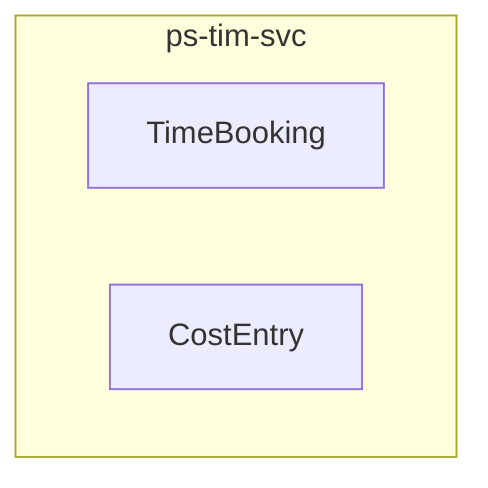

<!-- TEMPLATE COMPLIANCE: 100%
Template: domain-service-spec.md v1.0.0
Present sections: §0 (Document Purpose & Scope), §1 (Business Context), §2 (Service Identity), §3 (Domain Model), §4 (Business Rules), §5 (Use Cases), §6 (REST API), §7 (Events & Integration), §8 (Data Model), §9 (Security & Compliance), §10 (Quality Attributes), §11 (Feature Dependencies), §12 (Extension Points), §13 (Migration & Evolution), §14 (Decisions & Open Questions), §15 (Appendix)
Missing sections: None
Priority: LOW
-->

# PS.TIM — Project Time & Costs Domain / Service Specification

> **Conceptual Stack Layer:** Domain / Service
> **Space:** Platform
> **Owner:** Domain Engineering Team
> **Schema alignment:** `service-layer.schema.json`
> **Companion files:** `openapi.yaml`, `*.schema.json` (event contracts)
> **Referenced by:** Platform-Feature Spec SS5 (backend dependencies), BFF Contract
> **Belongs to:** Suite Spec (`_ps_suite.md`)

> **Meta Information**
> - **Version:** 2026-04-03
> - **Template:** `domain-service-spec.md` v1.0.0
> - **Template Compliance:** 100%
> - **Author(s):** OpenLeap Architecture Team
> - **Status:** DRAFT
> - **Suite:** `ps`
> - **Domain:** `tim`
> - **Bounded Context Ref:** `bc:project-time`
> - **Service ID:** `ps-tim-svc`
> - **basePackage:** `io.openleap.ps.tim`
> - **API Base Path:** `/api/ps/tim/v1`
> - **OpenLeap Starter Version:** `v1.0.0`
> - **Port:** `8413`
> - **Repository:** `https://github.com/openleap-io/io.openleap.ps.tim`
> - **Tags:** `project-management`, `tim`, `ps`
> - **Team:**
>   - Name: `team-ps`
>   - Email: `ps-team@openleap.io`
>   - Slack: `#ps-team`

---

## Specification Guidelines Compliance

> ### Non-Negotiables
> - Never invent facts. If required info is missing, add an **OPEN QUESTION** entry.
> - Preserve intent and decisions. Only change meaning when explicitly requested.
> - Do not remove normative constraints unless they are explicitly replaced.
> - Keep the spec **self-contained**: no "see chat", no implicit context.
>
> ### Source of Truth Priority
> When sources conflict:
> 1. Spec (explicit) wins
> 2. Starter specs (implementation constraints) next
> 3. Guidelines (best practices) last
>
> ### Style Guide
> - Prefer short sentences and lists.
> - Use MUST/SHOULD/MAY for normative statements.
> - Keep terminology consistent with the Ubiquitous Language defined in the PS suite spec (SS1).
> - Avoid ambiguous words ("often", "maybe") unless explicitly noting uncertainty.

---

## 0. Document Purpose & Scope

### 0.1 Purpose

This specification defines the `ps-tim-svc` microservice within the PS (Project Management) suite. It covers the domain model, business rules, REST API, events, data model, and integration points for the Project Time & Costs bounded context.

### 0.2 In Scope

- Time booking entry: record planned or estimated hours against a work package by date
- Cost entry: record unit costs against a work package (materials, travel, licenses, etc.)
- Approval workflow: manager review and approve/reject time bookings and cost entries
- Time and cost reporting: filtered reports by project, user, period, budget, cost type
- Personal time dashboard: user's own time bookings across projects with weekly/monthly views
- Optional sync to OPS: forward approved project time to ops.tim to avoid double entry

### 0.3 Out of Scope

- Actual billable/payroll time recording (→ ops-tim-svc)
- Budget planning and EVM calculation (→ ps-bud-svc)
- Work package CRUD (→ ps-prj-svc)
- Cost type catalog management (→ ps-bud-svc owns cost types)
- Leave and absence management (→ HR suite)

### 0.4 Related Documents

| Document | Path | Relationship |
|----------|------|-------------|
| PS Suite Spec | `_ps_suite.md` | Parent suite specification |
| OpenAPI Contract | `contracts/http/ps/tim/openapi.yaml` | API contract (derived from §6) |
| Event Contracts | `contracts/events/ps/tim/*.schema.json` | Event schemas (derived from §7) |

---

## 1. Business Context

### 1.1 Problems Solved

| Problem | Solution | Business Value |
|---------|----------|---------------|
| Project Time & Costs capabilities need a dedicated, independently deployable service | `ps-tim-svc` provides a focused microservice with its own data store and API | Clean bounded context separation, independent scaling and deployment |

### 1.2 Business Value

- Provides specialized project time & costs capabilities within the PS suite
- Independent deployment and scaling
- Clear ownership boundary for the `bc:project-time` bounded context
- Supports the PS suite's goal of unified project management across methodologies

### 1.3 Stakeholders

| Role | Interest |
|------|----------|
| Project Manager | Primary user of project time & costs capabilities |
| Suite Architect | Ensures alignment with PS suite architecture |
| Domain Lead (tim) | Owns the domain model and business rules |
| Frontend Team | Consumes the REST API for UI features |

---

## 2. Service Identity

| Field | Value |
|-------|-------|
| **Service ID** | `ps-tim-svc` |
| **Suite** | `ps` |
| **Domain** | `tim` |
| **Bounded Context** | `bc:project-time` |
| **Base Package** | `io.openleap.ps.tim` |
| **API Base Path** | `/api/ps/tim/v1` |
| **Port** | `8413` |
| **Repository** | `https://github.com/openleap-io/io.openleap.ps.tim` |
| **Status** | `planned` |

---

## 3. Domain Model

### 3.1 Overview

### TimeBooking (`agg:time-booking`)

**Description:** A record of planned or estimated effort against a work package by a user, with date and optional activity type. Feeds into budget actuals after approval.

**Aggregate Root Attributes:**

| Attribute | Type | Format | Required | Description |
|-----------|------|--------|----------|-------------|
| timeBookingId | string | uuid | Yes | Unique booking identifier |
| tenantId | string | uuid | Yes | Owning tenant |
| projectId | string | uuid | Yes | Project reference |
| workPackageId | string | uuid | Yes | Work package reference |
| userId | string | uuid | Yes | IAM user who logged the time |
| bookingDate | string | date | Yes | Date the work was performed |
| hours | number | — | Yes | Hours worked (positive, max 24) |
| activityType | string | — | No | Activity classification (e.g., 'Development', 'Testing', 'Meeting') |
| comment | string | — | No | Optional comment |
| status | string | enum | Yes | Approval status: DRAFT, SUBMITTED, APPROVED, REJECTED |
| approvedBy | string | uuid | No | IAM user who approved/rejected |
| approvedAt | string | datetime | No | Approval timestamp |
| rejectionReason | string | — | No | Reason if rejected |
| version | integer | — | Yes | Optimistic lock version |
| createdAt | string | datetime | Yes | Creation timestamp |
| updatedAt | string | datetime | Yes | Last update timestamp |

### CostEntry (`agg:cost-entry`)

**Description:** A unit cost logged against a work package. Uses cost types defined in ps-bud-svc. Examples: 500 km travel, 3 software licenses, 2 days external consulting.

**Aggregate Root Attributes:**

| Attribute | Type | Format | Required | Description |
|-----------|------|--------|----------|-------------|
| costEntryId | string | uuid | Yes | Unique cost entry identifier |
| tenantId | string | uuid | Yes | Owning tenant |
| projectId | string | uuid | Yes | Project reference |
| workPackageId | string | uuid | Yes | Work package reference |
| costTypeId | string | uuid | Yes | Cost type reference (from ps-bud-svc) |
| userId | string | uuid | Yes | IAM user who recorded the cost |
| entryDate | string | date | Yes | Date the cost was incurred |
| quantity | number | — | Yes | Quantity in cost type units |
| unitRate | number | — | Yes | Rate per unit (may be auto-filled from cost type rate schedule) |
| totalAmount | number | — | Yes | Calculated: quantity × unitRate |
| currency | string | iso-4217 | Yes | Currency |
| comment | string | — | No | Optional comment |
| status | string | enum | Yes | Approval status: DRAFT, SUBMITTED, APPROVED, REJECTED |
| version | integer | — | Yes | Optimistic lock version |
| createdAt | string | datetime | Yes | Creation timestamp |

---

## 4. Business Rules & Constraints

### 4.1 Business Rules Catalog

| ID | Rule Name | Description | Scope | Enforcement | Error Code |
|----|-----------|-------------|-------|-------------|------------|
| BR-TIM-001 | Hours Positive And Capped | hours MUST be > 0 and <= 24. A single time booking cannot exceed 24 hours.... | agg:time-booking | Create, Update | `TIM_HOURS_INVALID` |
| BR-TIM-002 | Booking Date Not In Future | bookingDate MUST NOT be in the future (relative to server date).... | agg:time-booking | Create, Update | `TIM_FUTURE_DATE` |
| BR-TIM-003 | WP Must Be Active | Time can only be booked against a work package in status NEW, IN_PROGRESS, or ON... | agg:time-booking | Create | `TIM_WP_NOT_ACTIVE` |
| BR-TIM-004 | Approval Flow | Time bookings follow the flow: DRAFT → SUBMITTED → APPROVED | REJECTED. Only the... | agg:time-booking | Update | `TIM_INVALID_APPROVAL_TRANSITION` |
| BR-TIM-005 | Approved Bookings Immutable | Once a time booking is APPROVED, it MUST NOT be modified. To correct, the approv... | agg:time-booking | Update | `TIM_APPROVED_IMMUTABLE` |
| BR-TIM-006 | Quantity Positive | quantity MUST be > 0.... | agg:cost-entry | Create, Update | `TIM_QTY_INVALID` |
| BR-TIM-007 | Valid Cost Type | costTypeId MUST reference an active cost type in ps-bud-svc.... | agg:cost-entry | Create | `TIM_INVALID_COSTTYPE` |
| BR-TIM-008 | Total Amount Consistency | totalAmount MUST equal quantity × unitRate.... | agg:cost-entry | Create, Update | `TIM_AMOUNT_MISMATCH` |

### 4.2 Detailed Rule Definitions

#### BR-TIM-001: Hours Positive And Capped

**Business Context:** This rule exists to ensure data integrity and correct business behavior.

**Rule Statement:** hours MUST be > 0 and <= 24. A single time booking cannot exceed 24 hours.

**Applies To:**
- Aggregate/Entity: `agg:time-booking`
- Operations: Create, Update

**Enforcement:** Domain layer validation

**Error Handling:**
- **Error Code:** `TIM_HOURS_INVALID`
- **If violated:** System returns error code `TIM_HOURS_INVALID` with descriptive message
- **User action:** Correct the input and retry

#### BR-TIM-002: Booking Date Not In Future

**Business Context:** This rule exists to ensure data integrity and correct business behavior.

**Rule Statement:** bookingDate MUST NOT be in the future (relative to server date).

**Applies To:**
- Aggregate/Entity: `agg:time-booking`
- Operations: Create, Update

**Enforcement:** Domain layer validation

**Error Handling:**
- **Error Code:** `TIM_FUTURE_DATE`
- **If violated:** System returns error code `TIM_FUTURE_DATE` with descriptive message
- **User action:** Correct the input and retry

#### BR-TIM-003: WP Must Be Active

**Business Context:** This rule exists to ensure data integrity and correct business behavior.

**Rule Statement:** Time can only be booked against a work package in status NEW, IN_PROGRESS, or ON_HOLD. Booking against DONE or CANCELLED WPs is forbidden.

**Applies To:**
- Aggregate/Entity: `agg:time-booking`
- Operations: Create

**Enforcement:** Domain layer validation

**Error Handling:**
- **Error Code:** `TIM_WP_NOT_ACTIVE`
- **If violated:** System returns error code `TIM_WP_NOT_ACTIVE` with descriptive message
- **User action:** Correct the input and retry

#### BR-TIM-004: Approval Flow

**Business Context:** This rule exists to ensure data integrity and correct business behavior.

**Rule Statement:** Time bookings follow the flow: DRAFT → SUBMITTED → APPROVED | REJECTED. Only the booking owner can submit. Only a manager (role: PM or APPROVER on the project) can approve or reject.

**Applies To:**
- Aggregate/Entity: `agg:time-booking`
- Operations: Update

**Enforcement:** Domain layer validation

**Error Handling:**
- **Error Code:** `TIM_INVALID_APPROVAL_TRANSITION`
- **If violated:** System returns error code `TIM_INVALID_APPROVAL_TRANSITION` with descriptive message
- **User action:** Correct the input and retry

#### BR-TIM-005: Approved Bookings Immutable

**Business Context:** This rule exists to ensure data integrity and correct business behavior.

**Rule Statement:** Once a time booking is APPROVED, it MUST NOT be modified. To correct, the approver must reject it first, or a new correcting entry must be created.

**Applies To:**
- Aggregate/Entity: `agg:time-booking`
- Operations: Update

**Enforcement:** Domain layer validation

**Error Handling:**
- **Error Code:** `TIM_APPROVED_IMMUTABLE`
- **If violated:** System returns error code `TIM_APPROVED_IMMUTABLE` with descriptive message
- **User action:** Correct the input and retry

#### BR-TIM-006: Quantity Positive

**Business Context:** This rule exists to ensure data integrity and correct business behavior.

**Rule Statement:** quantity MUST be > 0.

**Applies To:**
- Aggregate/Entity: `agg:cost-entry`
- Operations: Create, Update

**Enforcement:** Domain layer validation

**Error Handling:**
- **Error Code:** `TIM_QTY_INVALID`
- **If violated:** System returns error code `TIM_QTY_INVALID` with descriptive message
- **User action:** Correct the input and retry

#### BR-TIM-007: Valid Cost Type

**Business Context:** This rule exists to ensure data integrity and correct business behavior.

**Rule Statement:** costTypeId MUST reference an active cost type in ps-bud-svc.

**Applies To:**
- Aggregate/Entity: `agg:cost-entry`
- Operations: Create

**Enforcement:** Domain layer validation

**Error Handling:**
- **Error Code:** `TIM_INVALID_COSTTYPE`
- **If violated:** System returns error code `TIM_INVALID_COSTTYPE` with descriptive message
- **User action:** Correct the input and retry

#### BR-TIM-008: Total Amount Consistency

**Business Context:** This rule exists to ensure data integrity and correct business behavior.

**Rule Statement:** totalAmount MUST equal quantity × unitRate.

**Applies To:**
- Aggregate/Entity: `agg:cost-entry`
- Operations: Create, Update

**Enforcement:** Domain layer validation

**Error Handling:**
- **Error Code:** `TIM_AMOUNT_MISMATCH`
- **If violated:** System returns error code `TIM_AMOUNT_MISMATCH` with descriptive message
- **User action:** Correct the input and retry

---

## 5. Use Cases

### 5.1 Business Logic Placement

| Logic Type | Placement | Examples |
|------------|-----------|----------|
| Aggregate invariants | Domain Object | Validation, state transitions, consistency checks |
| Cross-aggregate logic | Domain Service | Operations spanning multiple aggregates within this service |
| Orchestration & transactions | Application Service | Use case coordination, event publishing, transaction boundaries |

### 5.2 Use Cases

Use cases are derived from the REST API endpoints (§6) and event handlers (§7). Each endpoint maps to a use case following the canonical format:

| UC ID | Type | Aggregate | Operation | REST |
|-------|------|-----------|-----------|------|
| UC-TIM-001 | WRITE | TimeBooking | Create | `POST /api/ps/tim/v1/...` |

---

## 6. REST API

### 6.1 API Overview

**Base Path:** `/api/ps/tim/v1`

**Authentication:** OAuth2/JWT (Bearer token)

**Authorization:**
- Read operations: Requires scope `ps.tim:read`
- Write operations: Requires scope `ps.tim:write`
- Admin operations: Requires scope `ps.tim:admin`

### 6.2 Resource Operations

**Base Path:** `/api/ps/tim/v1`

All standard CRUD operations follow the OpenLeap REST conventions:
- `POST` for creation (returns `201 Created`)
- `GET` for retrieval (returns `200 OK`)
- `PATCH` for partial update (returns `200 OK`, requires `If-Match` ETag)
- `DELETE` for removal (returns `204 No Content`)

Detailed endpoint specifications are documented in the companion `openapi.yaml` file.

**Reference to OpenAPI:** `contracts/http/ps/tim/openapi.yaml`

---

## 7. Events & Integration

### 7.1 EDA Pattern

This service follows the PS suite's hybrid integration pattern (see `_ps_suite.md` SS4). State-propagation events are published asynchronously; user-facing queries use synchronous API calls.

### 7.2 Published Events

| Routing Key | Description |
|------------|-------------|
| `ps.tim.timebooking.created` | New time booking recorded (DRAFT) |
| `ps.tim.timebooking.submitted` | Time booking submitted for approval |
| `ps.tim.timebooking.approved` | Time booking approved by manager |
| `ps.tim.timebooking.rejected` | Time booking rejected by manager |
| `ps.tim.costentry.created` | New cost entry recorded |
| `ps.tim.costentry.submitted` | Cost entry submitted for approval |
| `ps.tim.costentry.approved` | Cost entry approved |

**Payload Envelope:** All events follow the PS suite envelope format (see `_ps_suite.md` SS5.2).

### 7.3 Consumed Events

| Routing Key | Producer | Purpose |
|------------|----------|---------|
| `ps.prj.workpackage.updated` | `ps-prj-svc` | Validate WP is still active for new bookings |
| `ps.prj.workpackage.deleted` | `ps-prj-svc` | Prevent new bookings against deleted WPs |

### 7.4 Integration Points

| Direction | Target | Type | Description |
|-----------|--------|------|-------------|
| Upstream (sync) | `ps-prj-svc` | API | Read project and work package data |
| Upstream (sync) | `iam-svc` | API | Authentication and authorization |
| Upstream (sync) | `ref-data-svc` | API | Reference data (currencies, codes) |
| Downstream (async) | Event bus | Event | Publish domain events for consumers |

---

## 8. Data Model

### 8.1 Storage Technology

**Database:** PostgreSQL

**Schema:** `ps_tim`

**Conventions:**
- Table names: `ps_tim.{entity_name}` (snake_case)
- Primary keys: UUID
- Tenant isolation: `tenant_id` column on all tables with Row-Level Security
- Optimistic locking: `version` column
- Audit columns: `created_at`, `updated_at`, `created_by`, `updated_by`

### 8.2 Tables

**Storage Technology:** PostgreSQL

**Schema:** `ps_tim`

Tables are derived from the aggregate model above. Each aggregate root maps to a primary table; entities and value objects with their own identity map to child tables with foreign key references.

Detailed DDL is generated from the domain model and maintained in the service's migration scripts.

---

## 9. Security & Compliance

### 9.1 Data Classification

| Classification | Description |
|---------------|-------------|
| **Internal** | Default classification for project planning data |
| **Confidential** | Projects marked as confidential (restricted to assigned members) |

### 9.2 Access Control

| Role | Permissions |
|------|------------|
| `PS_READER` | Read access to all tim data within tenant |
| `PS_WRITER` | Create and update tim data |
| `PS_ADMIN` | Full access including delete and configuration |
| `PROJECT_MANAGER` | Write access scoped to own projects |
| `TEAM_MEMBER` | Read access to assigned projects, limited write |

### 9.3 Compliance

This service inherits all compliance requirements from the PS suite (see `_ps_suite.md` SS7):
- GDPR: Personal data in assignments must be protectable
- ISO 21500: Supports recognized project management methodology
- ISO 27001: Role-based access, data encryption at rest and in transit

---

## 10. Quality Attributes

| Attribute | Target | Notes |
|-----------|--------|-------|
| **Response Time (p95)** | < 200ms for reads, < 500ms for writes | Measured at service boundary |
| **Availability** | 99.9% | Excluding planned maintenance |
| **Throughput** | 100 req/s reads, 50 req/s writes | Per service instance |
| **Recovery Time** | < 5 minutes | Automatic restart via Kubernetes |

---

## 11. Feature Dependencies

The following platform-features call this service:

| Feature ID | Feature Name | Endpoints Used |
|-----------|--------------|----------------|
| `F-PS-004-01` | Time Booking Entry | See feature spec §5 |
| `F-PS-004-02` | Cost Entry | See feature spec §5 |
| `F-PS-004-03` | Time/Cost Approval Workflow | See feature spec §5 |
| `F-PS-004-04` | Time & Cost Reports | See feature spec §5 |
| `F-PS-004-05` | My Time (Personal Dashboard) | See feature spec §5 |

---

## 12. Extension Points

### 12.1 Extension Events

All published events (§7.2) serve as extension points. External systems and product customizations can subscribe to these events to add behavior without modifying this service.

### 12.2 Aggregate Hooks

| Hook | When | Purpose |
|------|------|---------|
| Pre-create validation | Before aggregate creation | Product-specific validation rules |
| Post-create notification | After aggregate creation | Product-specific notifications |
| Pre-update validation | Before aggregate update | Product-specific constraints |
| Status transition guard | Before status change | Product-specific workflow gates |

### 12.3 Extension API Endpoints

Reserved namespace for product-specific extensions: `/api/ps/tim/v1/ext/{extension-name}`

---

## 13. Migration & Evolution

### 13.1 Data Migration Strategy

- Flyway-based database migrations in `db/migration/`
- All migrations are forward-only (no rollback scripts)
- Schema changes follow the additive-only principle for backward compatibility
- Breaking changes require a new API version (`/v2`) with parallel availability during migration

### 13.2 Deprecation Path

- Deprecated endpoints are annotated with `@Deprecated` and return `Sunset` header
- Minimum deprecation period: 2 sprints (4 weeks)
- Deprecated events continue publishing during migration window

### 13.3 Versioning Policy

- API: URL-based versioning (`/v1`, `/v2`)
- Events: Schema versioning in event envelope `schemaVersion` field
- Database: Flyway migration versioning

---

## 14. Decisions & Open Questions

### 14.1 Suite-Level ADR References

| Suite ADR | Title | Relevance to This Service |
|-----------|-------|---------------------------|
| ADR-PS-001 | PS as Separate Suite from OPS | Establishes this service's existence within PS, not OPS |
| ADR-PS-002 | Work Package as Universal Work Item | Core design decision for work package modeling |
| ADR-PS-003 | Agile as Separate Bounded Context | Defines boundary with ps-agl-svc |
| ADR-PS-004 | Personas for Staffing | Defines boundary with ps-res-svc |

### 14.2 Open Questions

| ID | Question | Severity | Context |
|----|----------|----------|---------|
| OQ-TIM-001 | Should tim support multi-language work package subjects? | MEDIUM | i18n requirements not yet finalized |
| OQ-TIM-002 | What is the maximum WBS depth allowed? | LOW | Performance consideration for deep hierarchies |

---

## 15. Appendix

### 15.1 Glossary

See PS Suite Spec SS1 (Ubiquitous Language) for all shared terminology. Service-local terms:

| Term | Definition | Aliases |
|------|------------|---------|
| Aggregate | DDD concept: cluster of objects treated as a unit for data changes | Aggregate Root |
| ETag | HTTP header for optimistic concurrency control | Entity Tag |

### 15.2 References

**Suite Specification:** `_ps_suite.md`
**Technical Standards:** `TECHNICAL_STANDARDS.md`, `EVENT_STANDARDS.md`
**Schema:** `service-layer.schema.json`

### 15.3 Change Log

| Date | Version | Author | Changes |
|------|---------|--------|---------|
| 2026-04-03 | 1.0.0 | OpenLeap Architecture Team | Initial domain/service specification |

### 15.4 Review & Approval

**Status:** DRAFT

| Role | Name | Date | Status |
|------|------|------|--------|
| Suite Architect | {Name} | YYYY-MM-DD | [ ] Reviewed |
| Domain Lead (tim) | {Name} | YYYY-MM-DD | [ ] Reviewed |
