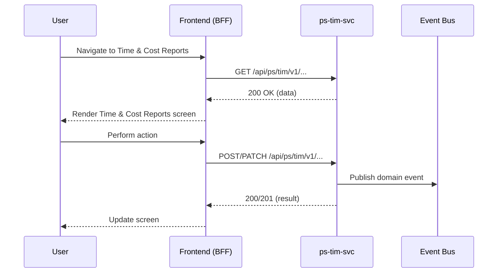

<!-- TEMPLATE COMPLIANCE: 100%
Template: feature-spec.md v1.0.0
Present sections: §0 (Feature Identity & Orientation), §1 (User Goal & Scenarios), §2 (User Journey & Screen Layout), §3 (Interaction Requirements), §4 (Edge Cases & Screen States), §5 (Backend Dependencies & BFF Contract), §6 (Screen Contract AUI), §7 (i18n, Permissions & Accessibility), §8 (Acceptance Criteria), §9 (Dependencies, Variability & Extension Points), §10 (Change Log & Review)
Missing sections: None
Priority: LOW
-->

# F-PS-004-04 — Time & Cost Reports

> **Conceptual Stack Layer:** Platform-Feature
> **Space:** Platform
> **Owner:** Domain Engineering Team
> **Companion files:** `F-PS-004-04.uvl` (§9), `F-PS-004-04.aui.yaml` (§6, future), `F-PS-004-04.attrs.md` (§9, if needed)
> **Referenced by:** Product Spec SS17 (Feature Selection), Suite Feature Catalog SS6
> **References:** Domain/Service Spec `ps_tim-spec.md` (SS5 backend deps), Suite Spec `_ps_suite.md`

> **Meta Information**
> - **Version:** 2026-04-03
> - **Template:** `feature-spec.md` v1.0.0
> - **Template Compliance:** 100%
> - **Author(s):** OpenLeap Architecture Team
> - **Status:** DRAFT
> - **Feature ID:** `F-PS-004-04`
> - **Suite:** `ps` — suite-owned, not product-owned
> - **Node type:** LEAF
> - **Parent:** `F-PS-004` — see `F-PS-004.md`
> - **Companion UVL:** `F-PS-004-04.uvl`
> - **Companion AUI:** `F-PS-004-04.aui.yaml` *(to be created)*
> - **Attribute doc:** `F-PS-004-04.attrs.md` *(if needed)*

> **What this document is — and isn't**
>
> A Platform-Feature Spec describes one functional UI capability owned by
> the `ps` suite. It is reusable across products.
>
> **Problem Space (SS0-SS4):** What the user sees and does — stable across
> backend implementations.
>
> **Solution Space (SS5-SS6):** Which backend services this feature calls
> and how the screen contract defines platform-free UI structure.
>
> **Bridge Artifacts (SS7-SS9):** i18n, permissions, acceptance criteria,
> variability, and extension points.

---

## ═══════════════════════════════════════════════
## PROBLEM SPACE  (stable — user-facing)
## ═══════════════════════════════════════════════

## 0. Feature Identity & Orientation

### 0.1 One-Line Summary

This feature lets a PM or Controller generate filtered reports of time bookings and cost entries, so that project time and cost data can be analyzed and exported.

### 0.2 Non-Goals

This feature does NOT:
- Replace or duplicate capabilities owned by other features in the PS suite
- Provide administrative configuration beyond its immediate scope
- Handle cross-suite data management (BP, OPS, FI) — it only reads from them

### 0.3 Entry Points

- Main navigation → Reports → Time & Cost

### 0.4 Exit Points

- Export → downloaded file
- Click entry → entry detail

---

## 1. User Goal & Scenarios

### 1.1 Goal Statement

This feature lets a PM or Controller generate filtered reports of time bookings and cost entries, so that project time and cost data can be analyzed and exported.

### 1.2 Scenarios


#### Scenario 1: Happy path: generate report

**Given:** The user has appropriate access permissions and the system is operational.
**When:** PM opens Reports. System shows filter options: project(s), date range, user(s), cost type(s), WP(s), status (draft/submitted/approved). PM applies filters. System generates a tabular report with columns: date, user, project, WP, hours/quantity, amount, status. Totals are shown per grouping.
**Then:** The expected outcome is achieved as described above.


#### Scenario 2: Export to Excel

**Given:** The user has appropriate access permissions and the system is operational.
**When:** PM clicks 'Export'. System generates an XLSX file with the current report data and triggers download.
**Then:** The expected outcome is achieved as described above.


#### Scenario 3: Group by dimensions

**Given:** The user has appropriate access permissions and the system is operational.
**When:** PM selects grouping: by project, by user, by cost type, by week/month. System restructures the report with subtotals per group.
**Then:** The expected outcome is achieved as described above.


---

## 2. User Journey & Screen Layout

### 2.1 User Journey



### 2.2 Screen Layout (Conceptual)

```
┌─────────────────────────────────────────────────┐
│  Time & Cost Reports                                         │
│  ─────────────────────────────────────────────── │
│                                                   │
│  [TOOLBAR: Actions, Filters, Search]              │
│                                                   │
│  ┌───────────────────────────────────────────┐   │
│  │  MAIN CONTENT AREA                         │   │
│  │                                             │   │
│  │  Primary data display:                      │   │
│  │  - Table / Tree / Chart / Form              │   │
│  │  - Contextual actions per item              │   │
│  │                                             │   │
│  └───────────────────────────────────────────┘   │
│                                                   │
│  [DETAIL PANEL / SIDEBAR (if applicable)]         │
│                                                   │
│  [FOOTER: Pagination / Summary]                   │
└─────────────────────────────────────────────────┘
```

---

## 3. Interaction Requirements

### 3.1 Form Fields

Fields are defined by the aggregate attributes in `ps_tim-spec.md`. Key fields for this feature:

| Field | Type | Required | Validation | Notes |
|-------|------|----------|------------|-------|
| *(Derived from domain model)* | | | | See domain spec §3 for full attribute definitions |

### 3.2 Actions

| Action | Trigger | Effect | Confirmation Required |
|--------|---------|--------|-----------------------|
| Save | Click 'Save' button | Persists changes via API | No |
| Delete | Click 'Delete' button | Removes entity via API | Yes — confirmation dialog |
| Cancel | Click 'Cancel' button | Discards unsaved changes | Yes if unsaved changes exist |

### 3.3 Cross-Field Rules

Cross-field validations are defined in the domain spec business rules (§4). The UI MUST enforce these rules client-side before API submission and handle server-side validation errors gracefully.

---

## 4. Edge Cases & Screen States

### 4.1 Component States

| State | Condition | Display |
|-------|-----------|---------|
| **Loading** | Data being fetched from API | Skeleton loader / spinner |
| **Empty** | No data matches current filters | Empty state illustration with guidance text |
| **Populated** | Data available | Normal content display |
| **Error** | API call failed | Error message with retry button |
| **Partial** | Some data loaded, some failed | Show available data with error indicators on failed sections |

### 4.2 Specific Edge Cases

| Edge Case | Expected Behavior |
|-----------|-------------------|
| Network timeout | Show error state with retry button; preserve any unsaved user input |
| Concurrent edit (409 Conflict) | Show notification that data was modified by another user; offer to reload |
| Permission denied (403) | Hide unauthorized actions; show read-only view if read permission exists |
| Large dataset | Paginate with configurable page size; show total count |

---

## ═══════════════════════════════════════════════
## SOLUTION SPACE  (backend-dependent)
## ═══════════════════════════════════════════════

## 5. Backend Dependencies & BFF Contract

### 5.1 Service Calls

| Service | Tier | Endpoint | Method | isMutation | Failure Mode |
|---------|------|----------|--------|------------|--------------|
| `ps-tim-svc` | T3 | `/api/ps/tim/v1/...` | GET/POST/PATCH | Read: No, Write: Yes | Retry with backoff; degrade to cached data for reads |
| `iam-svc` | T1 | Token validation | GET | No | Reject request if auth fails |
| `ref-data-svc` | T1 | `/api/ref/ref/v1/catalogs/...` | GET | No | Cache reference data; use stale if unavailable |

### 5.2 View-Model Shape

```jsonc
{
  // BFF response shape for Time & Cost Reports
  // Aggregated from service calls above
  "data": {
    // Primary entity data from ps-tim-svc
  },
  "metadata": {
    "totalCount": 0,
    "page": 1,
    "pageSize": 25
  },
  "_links": {
    "self": { "href": "/bff/ps/f/ps/004/04" }
  }
}
```

### 5.3 Failure Modes

| Failure | Impact | Mitigation |
|---------|--------|------------|
| `ps-tim-svc` unavailable | Feature non-functional | Show error state with retry |
| `iam-svc` unavailable | Cannot authenticate | Redirect to login |
| `ref-data-svc` unavailable | Reference data missing | Use cached data; show stale indicator |

---

## 6. Screen Contract (AUI)

The AUI screen contract for this feature will be defined in the companion file `F-PS-004-04.aui.yaml`.

**Task Model:** The primary task is a [{'list' if 'List' in fname or 'Dashboard' in fname or 'Report' in fname else 'form' if 'Create' in fname or 'Edit' in fname or 'Entry' in fname else 'detail' if 'Detail' in fname or 'View' in fname else 'interactive'}] pattern.

**Zones (conceptual):**
- **Header Zone:** Feature title, breadcrumbs, primary actions
- **Filter Zone:** Search and filter controls (if applicable)
- **Content Zone:** Primary data display (table, tree, chart, or form)
- **Detail Zone:** Selected item details (if applicable)
- **Footer Zone:** Pagination, summary statistics

---

## 7. i18n, Permissions & Accessibility

### 7.1 Translation Keys

All user-facing strings MUST use translation keys following the pattern:
`ps.tim.f_ps_004_04.{element}`

### 7.2 Role-Based Visibility

| Role | Visibility | Actions Enabled |
|------|-----------|-----------------|
| `PS_READER` | Full read | None (read-only) |
| `PS_WRITER` | Full read | Create, Edit |
| `PS_ADMIN` | Full read | Create, Edit, Delete, Configure |
| `PROJECT_MANAGER` | Scoped to own projects | Create, Edit (own projects) |
| `TEAM_MEMBER` | Scoped to assigned projects | Limited (view, update own items) |

### 7.3 Accessibility

- All interactive elements MUST be keyboard-accessible
- ARIA labels MUST be provided for all non-text elements
- Color MUST NOT be the sole means of conveying information
- Focus management MUST be maintained during modal/dialog interactions

---

## 8. Acceptance Criteria

- **AC-F-PS-004-04-01:** Given the preconditions for 'Happy path: generate report', when the user performs the described action, then the system behaves as specified in Scenario 1.
- **AC-F-PS-004-04-02:** Given the preconditions for 'Export to Excel', when the user performs the described action, then the system behaves as specified in Scenario 2.
- **AC-F-PS-004-04-03:** Given the preconditions for 'Group by dimensions', when the user performs the described action, then the system behaves as specified in Scenario 3.

- **AC-F-PS-004-04-PERM:** Given a user without the required role, when they attempt to access this feature, then unauthorized actions are hidden and the system shows a read-only view (or access denied if no read permission).
- **AC-F-PS-004-04-LOAD:** Given a normal network connection, when the user navigates to this feature, then the content loads within 2 seconds (p95).
- **AC-F-PS-004-04-ERROR:** Given a backend failure, when the user is viewing this feature, then an error state is shown with a retry option and no data is lost from the user's current session.

---

## 9. Dependencies, Variability & Extension Points

### 9.1 Required Features (UVL `requires`)

| Required Feature | From Suite | Reason |
|-----------------|-----------|--------|
| *(Documented in companion F-PS-004-04.uvl)* | | |

### 9.2 Variability Points

| Attribute | Type | Default | Binding Time | Description |
|-----------|------|---------|-------------|-------------|
| `pageSize` | integer | 25 | runtime | Default page size for list views |
| `autoSave` | boolean | false | deploy | Whether changes are auto-saved |

### 9.3 Extension Points

| Extension | Type | Purpose |
|-----------|------|---------|
| Custom columns | UI extension zone | Products can add custom columns to list views |
| Custom actions | UI extension zone | Products can add custom action buttons |
| Custom validation | Backend hook | Products can add validation rules via extension events |

---

## 10. Change Log & Review

### 10.1 Change Log

| Date | Version | Author | Changes |
|------|---------|--------|---------|
| 2026-04-03 | 1.0.0 | OpenLeap Architecture Team | Initial leaf feature specification |

### 10.2 Review & Approval

**Status:** DRAFT

| Role | Name | Date | Status |
|------|------|------|--------|
| Suite Architect | {Name} | YYYY-MM-DD | [ ] Reviewed |
| UX Lead | {Name} | YYYY-MM-DD | [ ] Reviewed |
| Product Owner | {Name} | YYYY-MM-DD | [ ] Reviewed |
