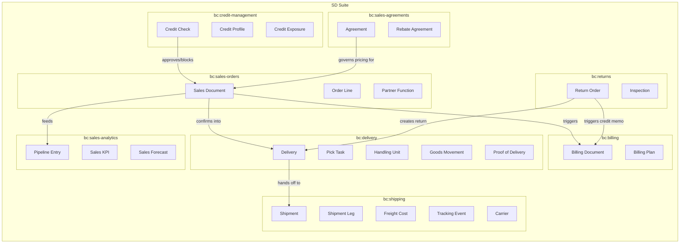
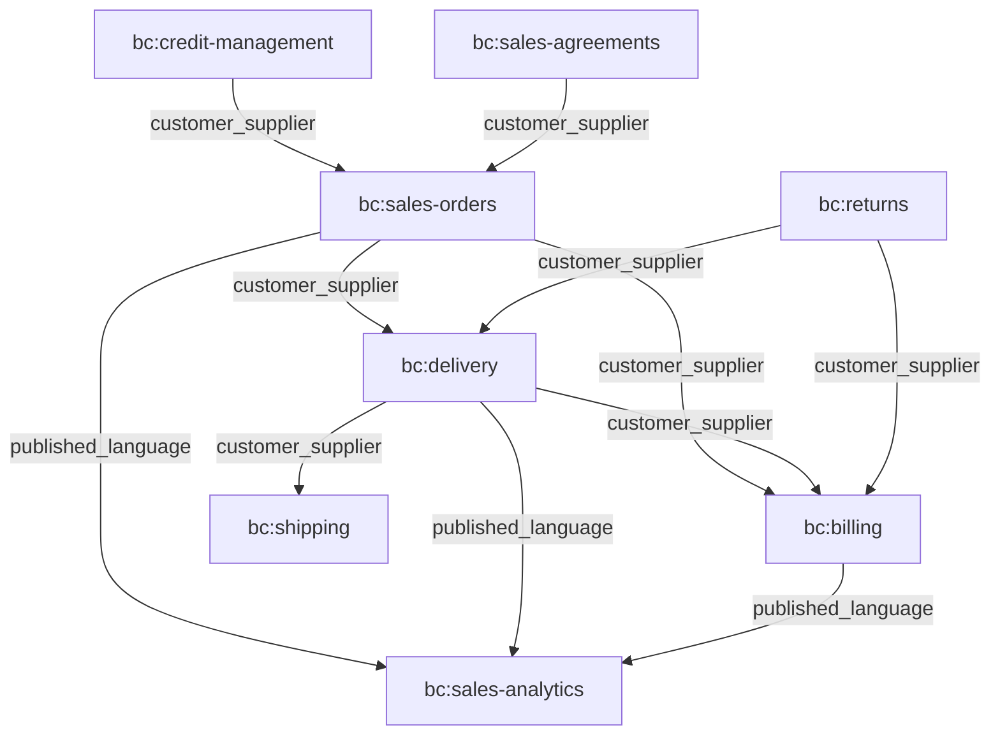
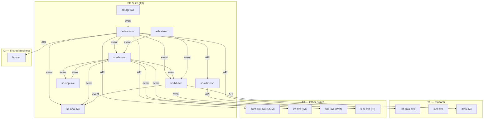
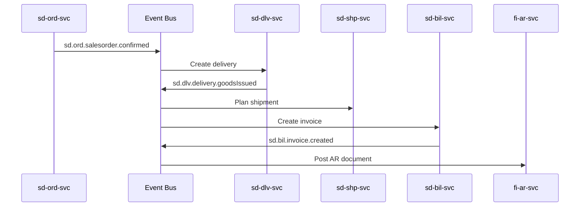
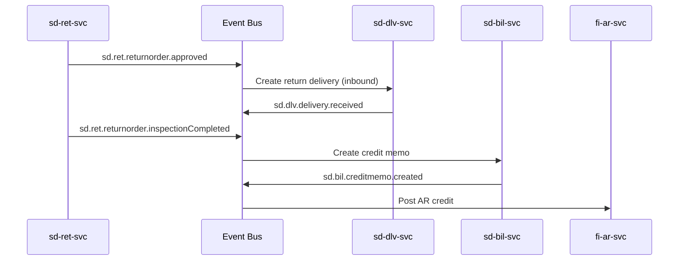
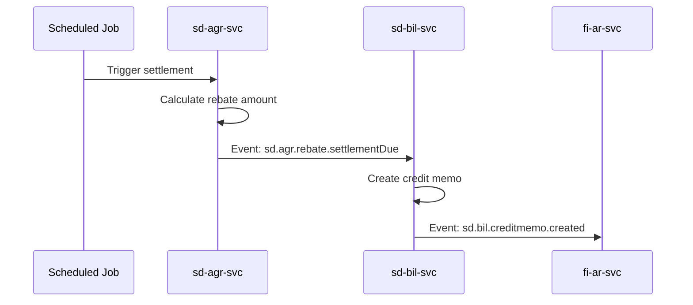
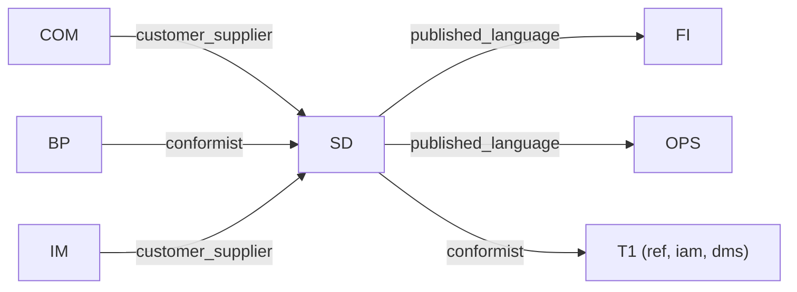

# Sales & Distribution (SD) Suite Specification

> **Conceptual Stack Layer:** Suite
> **Space:** Platform
> **Owner:** Domain Engineering Team
> **Schema alignment:** `suite-layer.schema.json`
> **Companion files:** `sd.catalog.uvl` (referenced in SS6)
> **Contains:** Domain/Service Specs, Platform-Feature Specs, Feature Catalog

> **Meta Information**
> - **Version:** 2026-04-01
> - **Template:** `suite-spec.md` v1.0.0
> - **Template Compliance:** 100%
> - **Author(s):** OpenLeap Architecture Team
> - **Status:** DRAFT
> - **Suite ID:** `sd`
> - **Suite Name:** Sales & Distribution
> - **Description:** Manages the complete order-to-cash business process from the seller's perspective: taking orders, fulfilling them through delivery and shipping, and billing customers.
> - **Semantic Version:** `1.1.0`
> - **Team:**
>   - Name: `team-sd`
>   - Email: `sd-team@openleap.io`
>   - Slack: `#sd-team`
> - **Bounded Contexts:** `bc:sales-orders`, `bc:delivery`, `bc:billing`, `bc:shipping`, `bc:returns`, `bc:credit-management`, `bc:sales-agreements`, `bc:sales-analytics`

---

## Specification Guidelines

> **This specification MUST comply with the OpenLeap specification guidelines.**
>
> ### Non-Negotiables
> - Never invent facts. If required info is missing, add an **OPEN QUESTION** entry.
> - Preserve intent and decisions. Only change meaning when explicitly requested.
> - Keep the spec **self-contained**: no "see chat", no implicit context.
>
> ### Style Guide
> - Prefer short sentences and lists.
> - Use MUST/SHOULD/MAY for normative statements.
> - Keep terminology consistent with the Ubiquitous Language defined in SS1.
> - Avoid ambiguous words ("often", "maybe") unless explicitly noting uncertainty.

---

<!-- ═══════════════════════════════════════════════════════════════════
     SS0  SUITE IDENTITY & PURPOSE
     ═══════════════════════════════════════════════════════════════════ -->

## 0. Suite Identity & Purpose

### 0.1 Suite Identity

| Field | Value |
|-------|-------|
| id | `sd` |
| name | Sales & Distribution |
| description | Manages the complete order-to-cash business process: quotations, sales orders, delivery, shipping, billing, returns, credit management, agreements, and sales analytics. |
| version | `1.1.0` |
| status | `draft` |
| owner.team | `team-sd` |
| owner.email | `sd-team@openleap.io` |
| owner.slack | `#sd-team` |
| boundedContexts | `bc:sales-orders`, `bc:delivery`, `bc:billing`, `bc:shipping`, `bc:returns`, `bc:credit-management`, `bc:sales-agreements`, `bc:sales-analytics` |

### 0.2 Business Purpose

The Sales & Distribution Suite manages the complete **order-to-cash** business process from the seller's perspective. While COM handles product catalog, pricing rules, and marketplace/e-commerce channel management, SD owns the transactional sales lifecycle: capturing customer demand via quotations and orders, fulfilling them through delivery and shipping, billing customers, handling returns, managing credit risk, and tracking sales performance. SD transforms customer intent into firm commitments, coordinates physical fulfillment, and bridges logistics execution with financial accounting.

### 0.3 In Scope

- Quotation and sales order management (create, confirm, change, complete, cancel)
- Contract and scheduling agreement management
- Outbound delivery processing (picking, packing, goods issue)
- Billing and invoicing (invoices, credit/debit memos, billing plans)
- Shipping and transportation (carrier management, freight, tracking)
- Returns and reverse logistics (return authorization, inspection, disposition, credit)
- Credit decision management (credit limits, risk checks, blocking)
- Sales agreements and rebates (framework agreements, volume commitments, rebate settlement)
- Sales analytics (pipeline, forecasting, KPIs)

### 0.4 Out of Scope

- Product catalog and master data (-> COM suite)
- Pricing rules and resolution (-> COM suite, COM.PRC)
- Marketplace listings and publication (-> COM suite)
- Customer/vendor master data (-> BP suite)
- Financial accounting and GL postings (-> FI suite)
- Warehouse management and physical inventory (-> WM/IM)
- Procurement (-> PUR suite)
- Operational work order execution for services (-> OPS suite)
- Strategic BI / data warehouse (-> T4 Analytics tier)

### 0.5 Target Users

| Role | Interest |
|------|----------|
| Sales Representative | Create quotations and orders, manage customer relationships |
| Sales Manager | Approve orders, monitor pipeline, manage blocks |
| Logistics Coordinator | Plan and release deliveries, coordinate picking/packing |
| Shipping Coordinator | Plan shipments, assign carriers, track deliveries |
| Billing Clerk | Review and release billing documents |
| Credit Controller | Manage credit limits, review credit blocks |
| Key Account Manager | Create and manage framework agreements and rebates |
| Sales Director / CRO | Revenue forecasting, strategic overview, team performance |
| Customer Service Representative | Process return requests |
| Finance Controller | Monitor billing-to-AR flow, rebate accruals |

### 0.6 Business Value

- Single source of truth for all sales commitments and fulfillment status
- Automated end-to-end order-to-cash with event-driven orchestration
- Real-time visibility into sales pipeline, delivery status, and revenue
- Reduced bad debt through proactive credit management
- Optimized logistics through carrier selection and shipment consolidation
- Structured returns reducing margin leakage with disposition tracking
- Long-term customer commitment management through agreements and rebates

---

<!-- ═══════════════════════════════════════════════════════════════════
     SS1  UBIQUITOUS LANGUAGE
     ═══════════════════════════════════════════════════════════════════ -->

## 1. Ubiquitous Language

### 1.1 Glossary

| ID | Term | Aliases | Definition |
|----|------|---------|------------|
| sd:glossary:sales-document | Sales Document | Sales Order, SO | A customer-facing document representing demand; polymorphic across inquiry, quotation, order, contract, and scheduling agreement types. |
| sd:glossary:quotation | Quotation | Quote, Offer | A non-binding price and availability offer to a customer, valid for a defined period. |
| sd:glossary:sales-order | Sales Order | Order, SO | A firm customer commitment to purchase goods or services, triggering fulfillment. |
| sd:glossary:order-line | Order Line | Sales Document Line, Item | A single line item within a sales document specifying product, quantity, price, and delivery date. |
| sd:glossary:partner-function | Partner Function | — | The role a business partner plays in a sales transaction (sold-to, ship-to, bill-to, payer). |
| sd:glossary:delivery | Delivery | Outbound Delivery | A logistics document representing goods to be shipped from warehouse to customer. |
| sd:glossary:pick-task | Pick Task | Pick List | A warehouse instruction to retrieve specific items for a delivery. |
| sd:glossary:handling-unit | Handling Unit | HU, Packaging Unit | A physical packaging unit (pallet, box, crate) containing delivery items. |
| sd:glossary:goods-issue | Goods Issue | GI | A posting that reduces inventory when goods leave the warehouse. |
| sd:glossary:proof-of-delivery | Proof of Delivery | POD | Confirmation that goods were received by the customer, with signature/photo. |
| sd:glossary:billing-document | Billing Document | Invoice, Credit Memo | A financial document (invoice, credit/debit memo, pro-forma) generated from orders or deliveries. |
| sd:glossary:billing-plan | Billing Plan | — | A schedule of future billing events (milestone, periodic, installment). |
| sd:glossary:price-snapshot | Price Snapshot | Frozen Price | The frozen pricing result stored on an order line for deterministic billing. |
| sd:glossary:shipment | Shipment | — | A transportation unit grouping one or more deliveries for carrier transport. |
| sd:glossary:shipment-leg | Shipment Leg | Leg, Segment | A segment of a multi-stop or multi-modal shipment route. |
| sd:glossary:freight-cost | Freight Cost | — | Transportation cost associated with a shipment (base freight, surcharges, insurance). |
| sd:glossary:tracking-event | Tracking Event | — | A carrier-reported status update for a shipment in transit. |
| sd:glossary:return-order | Return Order | RMA, Return | A document authorizing a customer to return previously delivered goods. |
| sd:glossary:inspection | Inspection | — | Quality examination of returned goods to determine condition and disposition. |
| sd:glossary:disposition | Disposition | — | The decision on what to do with returned goods (restock, scrap, refurbish, vendor return). |
| sd:glossary:credit-profile | Credit Profile | — | A customer's creditworthiness record including credit limit, risk category, and scores. |
| sd:glossary:credit-exposure | Credit Exposure | — | Total financial risk from a customer: open orders + open deliveries + open receivables. |
| sd:glossary:credit-check | Credit Check | — | An evaluation of whether a transaction should proceed based on customer credit standing. |
| sd:glossary:agreement | Agreement | Framework Agreement, Contract | A long-term commercial arrangement defining pre-negotiated terms for future orders. |
| sd:glossary:rebate-agreement | Rebate Agreement | — | A retrospective discount arrangement based on actual purchase volumes over a period. |
| sd:glossary:rebate-accrual | Rebate Accrual | — | An estimated rebate liability recorded during a period before settlement. |
| sd:glossary:sales-pipeline | Sales Pipeline | Pipeline | The collection of all active sales documents (quotations + orders) with their current stage. |
| sd:glossary:atp | ATP | Available-to-Promise | The quantity available for commitment on a given date, owned by IM and consumed by sd.ord. |
| sd:glossary:incompletion-log | Incompletion Log | — | A list of missing mandatory fields preventing order confirmation. |
| sd:glossary:release-order | Release Order | — | An order created against a contract, consuming the contract's target quantity or value. |

### 1.2 UBL Boundary Test

**SD vs. COM:**
SD uses "Sales Order" to mean a firm customer commitment triggering fulfillment and billing. COM uses "Listing" and "Offer" to describe product presentation on channels and price rule resolution. An SD Sales Order *consumes* a resolved price from COM.PRC but does not own or manage pricing rules. This confirms SD and COM are separate suites with a customer-supplier relationship.

**SD vs. FI:**
SD uses "Invoice" (billing document) to mean the generation of a customer-facing financial document from delivery or order data. FI uses "AR Document" to mean the accounting entry in Accounts Receivable. SD creates the invoice; FI books it. The same business event ("customer invoiced") is expressed differently in each suite, confirming separate bounded contexts.

---

<!-- ═══════════════════════════════════════════════════════════════════
     SS2  DOMAIN MODEL
     ═══════════════════════════════════════════════════════════════════ -->

## 2. Domain Model

### 2.1 Conceptual Overview



### 2.2 Core Concepts

| Concept | Owner (Service) | Description | Glossary Ref |
|---------|----------------|-------------|-------------|
| SalesDocument | `sd-ord-svc` | Polymorphic customer-facing sales document (inquiry, quotation, order, contract, scheduling agreement) | `sd:glossary:sales-document` |
| Delivery | `sd-dlv-svc` | Outbound delivery document for goods shipment from warehouse to customer | `sd:glossary:delivery` |
| BillingDocument | `sd-bil-svc` | Financial document (invoice, credit/debit memo) generated from orders or deliveries | `sd:glossary:billing-document` |
| Shipment | `sd-shp-svc` | Transportation unit grouping deliveries for carrier transport | `sd:glossary:shipment` |
| ReturnOrder | `sd-ret-svc` | Authorization for customer to return previously delivered goods | `sd:glossary:return-order` |
| CreditProfile | `sd-cdm-svc` | Customer creditworthiness record with limits, risk category, and scores | `sd:glossary:credit-profile` |
| Agreement | `sd-agr-svc` | Long-term commercial arrangement with pre-negotiated terms | `sd:glossary:agreement` |
| SalesPipelineEntry | `sd-ana-svc` | Denormalized read-model entry tracking a sales document through its lifecycle | `sd:glossary:sales-pipeline` |

### 2.3 Shared Kernel

| Concept | Owner | Shared With | Mechanism |
|---------|-------|-------------|-----------|
| Partner Function | `sd-ord-svc` | `sd-dlv-svc`, `sd-bil-svc`, `sd-ret-svc` | `event` (partner data included in order events) |
| Price Snapshot | `sd-ord-svc` | `sd-bil-svc` | `event` (snapshot included in order line events for deterministic billing) |
| Sales Org / Distribution Channel / Division | `ref-data-svc` (T1) | All SD services | `api` (reference data lookup) |
| Customer Party reference | `bp-svc` (T2) | All SD services | `api` + `event` (BP.Party with role CUSTOMER) |

### 2.4 Bounded Context Map (Intra-Suite)

| Upstream | Downstream | Pattern | Description |
|----------|-----------|---------|-------------|
| `bc:sales-orders` | `bc:delivery` | `customer_supplier` | Confirmed orders trigger delivery creation |
| `bc:sales-orders` | `bc:billing` | `customer_supplier` | Order data and price snapshots feed billing |
| `bc:delivery` | `bc:shipping` | `customer_supplier` | Goods-issued deliveries trigger shipment planning |
| `bc:delivery` | `bc:billing` | `customer_supplier` | Delivery completion triggers delivery-based billing |
| `bc:returns` | `bc:delivery` | `customer_supplier` | Approved returns trigger return deliveries |
| `bc:returns` | `bc:billing` | `customer_supplier` | Completed returns trigger credit memos |
| `bc:credit-management` | `bc:sales-orders` | `customer_supplier` | Credit checks approve or block orders |
| `bc:sales-agreements` | `bc:sales-orders` | `customer_supplier` | Agreements provide pre-negotiated terms for orders |
| `bc:sales-orders` | `bc:sales-analytics` | `published_language` | Order events feed analytics read models |
| `bc:delivery` | `bc:sales-analytics` | `published_language` | Delivery events feed analytics read models |
| `bc:billing` | `bc:sales-analytics` | `published_language` | Billing events feed analytics read models |



---

<!-- ═══════════════════════════════════════════════════════════════════
     SS3  SERVICE LANDSCAPE
     ═══════════════════════════════════════════════════════════════════ -->

## 3. Service Landscape

### 3.1 Service Catalog

| Service ID | Name | Bounded Context | Status | Responsibility | Spec |
|-----------|------|----------------|--------|----------------|------|
| `sd-ord-svc` | Sales Orders | `bc:sales-orders` | `planned` | Quotations, sales orders, contracts, scheduling agreements, partner function resolution | `sd_ord-spec.md` |
| `sd-dlv-svc` | Delivery | `bc:delivery` | `planned` | Outbound delivery, picking, packing, goods issue, POD | `sd_dlv-spec.md` |
| `sd-bil-svc` | Billing | `bc:billing` | `planned` | Invoice creation, credit/debit memos, billing plans, AR posting | `sd_bil-spec.md` |
| `sd-shp-svc` | Shipping | `bc:shipping` | `planned` | Shipment planning, carrier assignment, freight, tracking | `sd_shp-spec.md` |
| `sd-ret-svc` | Returns | `bc:returns` | `planned` | Return orders, inspection, disposition, credit triggering | `sd_ret-spec.md` |
| `sd-cdm-svc` | Credit Decision Management | `bc:credit-management` | `planned` | Credit profiles, credit checks, exposure calculation, blocks | `sd_cdm-spec.md` |
| `sd-agr-svc` | Sales Agreements | `bc:sales-agreements` | `planned` | Framework agreements, blanket orders, rebate agreements | `sd_agr-spec.md` |
| `sd-ana-svc` | Sales Analytics | `bc:sales-analytics` | `planned` | Sales pipeline, KPIs, forecasting, read-model projections | `sd_ana-spec.md` |

### 3.2 Responsibility Matrix

| Responsibility | Service |
|---------------|---------|
| Sales order lifecycle (quotation, order, contract, scheduling agreement) | `sd-ord-svc` |
| Partner function resolution (sold-to, ship-to, bill-to, payer) | `sd-ord-svc` |
| Price determination orchestration (calls COM.PRC) | `sd-ord-svc` |
| ATP check orchestration (calls IM) | `sd-ord-svc` |
| Delivery execution (pick, pack, goods issue) | `sd-dlv-svc` |
| Proof of delivery capture | `sd-dlv-svc` |
| Invoice generation and AR posting | `sd-bil-svc` |
| Billing plans (milestone, periodic, installment) | `sd-bil-svc` |
| Shipment planning and carrier management | `sd-shp-svc` |
| Freight cost calculation and settlement | `sd-shp-svc` |
| Delivery tracking | `sd-shp-svc` |
| Return authorization and processing | `sd-ret-svc` |
| Inspection and disposition of returned goods | `sd-ret-svc` |
| Customer credit limit and risk management | `sd-cdm-svc` |
| Credit check execution | `sd-cdm-svc` |
| Framework agreements and contracts | `sd-agr-svc` |
| Rebate agreement management and settlement | `sd-agr-svc` |
| Sales pipeline and KPI tracking | `sd-ana-svc` |
| Revenue forecasting | `sd-ana-svc` |

### 3.3 Service Dependency Diagram



---

<!-- ═══════════════════════════════════════════════════════════════════
     SS4  INTEGRATION PATTERNS
     ═══════════════════════════════════════════════════════════════════ -->

## 4. Integration Patterns

### 4.1 Pattern Decision

| Field | Value |
|-------|-------|
| **Pattern** | `hybrid` |

**Rationale:**
- **Event-driven (choreography)** for the primary order-to-cash flow: sd.ord publishes order confirmed, sd.dlv reacts with delivery creation, sd.bil reacts with billing. Each service owns its own lifecycle.
- **Synchronous API** for real-time validations that MUST complete before the user action returns: price resolution (COM.PRC), ATP check (IM), credit check (sd.cdm), partner function resolution (BP).
- This hybrid approach balances loose coupling for asynchronous fulfillment with the need for inline validation during order entry.

### 4.2 Key Event Flows

#### Flow 1: Order-to-Cash (Standard)

**Trigger:** Sales order confirmed



#### Flow 2: Return-to-Credit (Reverse)

**Trigger:** Return order approved



#### Flow 3: Rebate Settlement

**Trigger:** Settlement period reached



### 4.3 Sync vs. Async Decisions

| Integration | Type | Reason |
|------------|------|--------|
| sd.ord → COM.PRC (price resolution) | `sync` | Prices MUST be resolved before order creation completes |
| sd.ord → IM (ATP check) | `sync` | User needs immediate availability feedback |
| sd.ord → sd.cdm (credit check) | `sync` | Credit decision MUST be inline at order confirmation |
| sd.ord → BP (partner resolution) | `sync` | Partner functions needed for order display |
| sd.ord → sd.dlv (delivery creation) | `async` | Delivery creation can follow order confirmation with eventual consistency |
| sd.dlv → sd.shp (shipment planning) | `async` | Shipment planning follows goods issue asynchronously |
| sd.dlv → sd.bil (billing trigger) | `async` | Billing can follow goods issue with eventual consistency |
| sd.bil → fi.ar (AR posting) | `async` | AR posting is a separate bounded context; eventual consistency acceptable |
| sd.ret → sd.dlv (return delivery) | `async` | Return delivery creation follows approval asynchronously |
| sd.ret → sd.bil (credit memo) | `async` | Credit memo follows inspection completion asynchronously |

### 4.4 Error Handling

| Scenario | Handling |
|----------|---------|
| Event consumer fails | Dead-letter queue + manual retry after 3 attempts with exponential backoff |
| COM.PRC timeout (price resolution) | Fail order creation; user retries |
| IM timeout (ATP check) | Configurable: confirm without ATP (with warning) or fail |
| sd.cdm timeout (credit check) | Configurable: approve with warning or block pending manual review |
| fi.ar posting failure | sd.bil status → POST_FAILED; automatic retry; manual intervention via DLQ |
| Carrier webhook failure | Retry with exponential backoff; manual tracking event entry as fallback |

---

<!-- ═══════════════════════════════════════════════════════════════════
     SS5  EVENT CONVENTIONS
     ═══════════════════════════════════════════════════════════════════ -->

## 5. Event Conventions

### 5.1 Routing Key Pattern

**Pattern:** `sd.{domain}.{aggregate}.{action}`

| Segment | Description | Examples |
|---------|-------------|---------|
| `sd` | Always `sd` | `sd` |
| `{domain}` | Domain short code | `ord`, `dlv`, `bil`, `shp`, `ret`, `cdm`, `agr`, `ana` |
| `{aggregate}` | Aggregate root name (lowercase) | `salesorder`, `delivery`, `invoice`, `shipment`, `returnorder`, `creditcheck`, `agreement` |
| `{action}` | Past-tense verb | `created`, `confirmed`, `blocked`, `completed`, `cancelled`, `goodsIssued`, `delivered` |

**Examples:**
- `sd.ord.salesorder.confirmed`
- `sd.dlv.delivery.goodsIssued`
- `sd.bil.invoice.created`
- `sd.shp.shipment.delivered`
- `sd.ret.returnorder.approved`
- `sd.cdm.creditcheck.blocked`
- `sd.agr.rebate.settled`

### 5.2 Payload Envelope

```json
{
  "eventId": "uuid",
  "eventType": "sd.{domain}.{aggregate}.{action}",
  "timestamp": "ISO-8601",
  "tenantId": "string",
  "correlationId": "uuid",
  "causationId": "uuid",
  "producer": "sd-{domain}-svc",
  "schemaVersion": "{major}.{minor}.{patch}",
  "payload": { }
}
```

### 5.3 Versioning Strategy

| Field | Value |
|-------|-------|
| **Strategy** | Schema evolution with backward compatibility |
| **Description** | New optional fields are additive. Removing fields requires a new major version with parallel publishing during migration. Schema registry at `https://schemas.openleap.io/sd/{domain}/{aggregate}-{action}.schema.json`. |

### 5.4 Event Catalog

| Routing Key | Producer | Consumer(s) | Description |
|------------|----------|-------------|-------------|
| `sd.ord.salesdocument.created` | `sd-ord-svc` | `sd-cdm-svc`, `sd-ana-svc` | New sales document created |
| `sd.ord.salesorder.confirmed` | `sd-ord-svc` | `sd-dlv-svc`, `sd-bil-svc`, `sd-cdm-svc`, `sd-ana-svc`, OPS | Sales order confirmed, ready for fulfillment |
| `sd.ord.salesorder.blocked` | `sd-ord-svc` | `sd-ana-svc` | Order blocked (credit or other) |
| `sd.ord.salesorder.completed` | `sd-ord-svc` | `sd-cdm-svc`, `sd-ana-svc` | All lines fulfilled |
| `sd.ord.salesorder.cancelled` | `sd-ord-svc` | `sd-cdm-svc`, `sd-agr-svc`, `sd-ana-svc` | Order cancelled |
| `sd.ord.quotation.created` | `sd-ord-svc` | `sd-ana-svc` | Quotation submitted |
| `sd.ord.quotation.converted` | `sd-ord-svc` | `sd-ana-svc` | Quotation converted to order |
| `sd.ord.line.rejected` | `sd-ord-svc` | `sd-ana-svc` | Line rejected |
| `sd.dlv.delivery.created` | `sd-dlv-svc` | `sd-ana-svc` | Delivery created from order |
| `sd.dlv.delivery.pickReleased` | `sd-dlv-svc` | WM | Released for warehouse picking |
| `sd.dlv.delivery.pickCompleted` | `sd-dlv-svc` | `sd-ana-svc` | All picks completed |
| `sd.dlv.goodsissue.requested` | `sd-dlv-svc` | IM | Goods issue posting initiated |
| `sd.dlv.delivery.goodsIssued` | `sd-dlv-svc` | `sd-shp-svc`, `sd-bil-svc`, `sd-cdm-svc`, `sd-ana-svc` | Goods issue confirmed |
| `sd.dlv.delivery.shipped` | `sd-dlv-svc` | `sd-ana-svc` | Handed to carrier |
| `sd.dlv.delivery.delivered` | `sd-dlv-svc` | `sd-ord-svc`, `sd-ana-svc` | POD confirmed |
| `sd.dlv.delivery.cancelled` | `sd-dlv-svc` | `sd-shp-svc`, `sd-ana-svc` | Delivery cancelled |
| `sd.dlv.goodsissue.reversed` | `sd-dlv-svc` | IM, `sd-ana-svc` | Goods issue reversed |
| `sd.bil.invoice.created` | `sd-bil-svc` | fi.ar, `sd-ord-svc`, `sd-ana-svc` | Invoice created |
| `sd.bil.creditmemo.created` | `sd-bil-svc` | fi.ar, `sd-ret-svc`, `sd-agr-svc`, `sd-ana-svc` | Credit memo created |
| `sd.bil.debitmemo.created` | `sd-bil-svc` | fi.ar, `sd-ana-svc` | Debit memo created |
| `sd.bil.billing.released` | `sd-bil-svc` | `sd-ana-svc` | Released for posting |
| `sd.bil.billing.posted` | `sd-bil-svc` | `sd-ana-svc` | AR confirmed posting |
| `sd.bil.billing.cancelled` | `sd-bil-svc` | fi.ar, `sd-ana-svc` | Billing document cancelled |
| `sd.bil.planitem.due` | `sd-bil-svc` | `sd-ana-svc` | Billing plan item became due |
| `sd.shp.shipment.planned` | `sd-shp-svc` | `sd-ana-svc` | Shipment created |
| `sd.shp.shipment.carrierAssigned` | `sd-shp-svc` | `sd-ana-svc` | Carrier selected |
| `sd.shp.shipment.dispatched` | `sd-shp-svc` | `sd-ana-svc` | Carrier picked up |
| `sd.shp.tracking.updated` | `sd-shp-svc` | `sd-ana-svc` | New tracking event |
| `sd.shp.shipment.delivered` | `sd-shp-svc` | `sd-dlv-svc`, `sd-ana-svc` | Delivered to customer |
| `sd.shp.shipment.exception` | `sd-shp-svc` | `sd-ana-svc` | Delivery exception |
| `sd.shp.shipment.cancelled` | `sd-shp-svc` | `sd-ana-svc` | Shipment cancelled |
| `sd.ret.returnorder.requested` | `sd-ret-svc` | `sd-ana-svc` | Return requested |
| `sd.ret.returnorder.approved` | `sd-ret-svc` | `sd-dlv-svc`, `sd-ana-svc` | RMA approved |
| `sd.ret.returnorder.rejected` | `sd-ret-svc` | `sd-ana-svc` | RMA denied |
| `sd.ret.returnorder.received` | `sd-ret-svc` | `sd-ana-svc` | Goods received at warehouse |
| `sd.ret.returnorder.inspectionCompleted` | `sd-ret-svc` | `sd-bil-svc`, `sd-ana-svc` | All lines inspected |
| `sd.ret.returnorder.completed` | `sd-ret-svc` | `sd-ana-svc` | Credit issued, return closed |
| `sd.ret.returnorder.cancelled` | `sd-ret-svc` | `sd-ana-svc` | Return cancelled |
| `sd.cdm.creditcheck.approved` | `sd-cdm-svc` | `sd-ord-svc` | Credit check passed |
| `sd.cdm.creditcheck.blocked` | `sd-cdm-svc` | `sd-ord-svc` | Credit check failed |
| `sd.cdm.limit.changed` | `sd-cdm-svc` | `sd-ana-svc` | Credit limit updated |
| `sd.cdm.riskcategory.changed` | `sd-cdm-svc` | `sd-ana-svc` | Risk category changed |
| `sd.cdm.profile.suspended` | `sd-cdm-svc` | `sd-ana-svc` | Profile suspended |
| `sd.agr.agreement.activated` | `sd-agr-svc` | `sd-ord-svc`, `sd-ana-svc` | Agreement goes live |
| `sd.agr.agreement.expired` | `sd-agr-svc` | `sd-ana-svc` | Validity ended |
| `sd.agr.agreement.terminated` | `sd-agr-svc` | `sd-ana-svc` | Early termination |
| `sd.agr.agreement.targetThreshold` | `sd-agr-svc` | `sd-ana-svc` | 80%/90%/100% target reached |
| `sd.agr.rebate.settlementDue` | `sd-agr-svc` | `sd-bil-svc` | Settlement period reached |
| `sd.agr.rebate.settled` | `sd-agr-svc` | `sd-ana-svc` | Settlement completed |
| `sd.ana.kpi.calculated` | `sd-ana-svc` | T4 BI | KPIs calculated for period |
| `sd.ana.forecast.updated` | `sd-ana-svc` | T4 BI | Forecast recalculated |

---

<!-- ═══════════════════════════════════════════════════════════════════
     SS6  FEATURE CATALOG
     ═══════════════════════════════════════════════════════════════════ -->

## 6. Feature Catalog

> OPEN QUESTION: The feature catalog has not been authored yet. Feature tree, mandatory/optional annotations, leaf feature specs, and the companion `sd.catalog.uvl` file need to be defined.

### 6.1 Feature Tree

> OPEN QUESTION: Content for this section has not been authored yet.

### 6.2 Mandatory Features

> OPEN QUESTION: Content for this section has not been authored yet.

### 6.3 Cross-Suite Feature Dependencies

> OPEN QUESTION: Content for this section has not been authored yet.

### 6.4 Feature Register

> OPEN QUESTION: Content for this section has not been authored yet.

### 6.5 Variability Summary

> OPEN QUESTION: Content for this section has not been authored yet.

---

<!-- ═══════════════════════════════════════════════════════════════════
     SS7  CROSS-CUTTING CONCERNS
     ═══════════════════════════════════════════════════════════════════ -->

## 7. Cross-Cutting Concerns

### 7.1 Compliance

| Regulation | Requirement | Implementation |
|-----------|-------------|----------------|
| GDPR | Customer data protection and right to erasure | Customer data referenced via `partyId` (BP handles PII); anonymization via BP cascade. SD stores minimal PII. |
| SOX | Immutability of completed financial documents | COMPLETED and CANCELLED orders/invoices are immutable; full audit trail on all state changes. |
| Revenue Recognition (IFRS 15 / ASC 606) | Accurate revenue recording | Price snapshots ensure billing matches order terms; billing plans support milestone recognition. |
| E-Invoicing (ZUGFeRD, Peppol) | Machine-readable invoice formats | Planned for Phase 2 (see Q-BIL-001). |

### 7.2 Security

| Aspect | Approach |
|--------|---------|
| **Authentication** | OAuth2 / OIDC via T1 iam-svc |
| **Authorization** | RBAC via T1 iam-svc; roles defined per service (e.g., ORD_SALES_REP, DLV_COORDINATOR, BIL_CLERK) |
| **Data Classification** | Internal to Restricted; prices/amounts classified as Restricted; customer references as Confidential |

### 7.3 Multi-Tenancy

| Aspect | Value |
|--------|-------|
| **Model** | `shared_schema` |
| **Isolation** | Row-Level Security (RLS) via `tenant_id` on all tables |
| **Tenant ID Propagation** | JWT claim `tenant_id` -> propagated in event envelope and `X-Tenant-ID` header |

**Rules:**
- All queries MUST include `tenant_id` filter (enforced by RLS)
- Cross-tenant data access is forbidden at the API level
- Event payloads MUST include `tenantId`

### 7.4 Audit

**Audit Requirements:**
- All state changes on aggregates MUST be audit-logged
- Audit log entries MUST include: who, when, what, old value, new value
- Completed/cancelled documents MUST be immutable (BR-ORD-005, BR-DLV-004, BR-SHP-005)

**Retention Policies:**

| Entity / Data Class | Retention Period | Legal Basis | Action After Expiry |
|--------------------|-----------------|-------------|-------------------|
| Active orders and deliveries | Retained indefinitely | Business operations | N/A |
| Completed/Cancelled orders | 7 years (configurable per tenant) | SOX / HGB §257 | `archive` |
| Billing documents | 10 years | HGB §257, AO §147 | `archive` |
| Audit trail | 10 years | SOX / internal policy | `archive` |
| Tracking data | 2 years after delivery | Internal policy | `delete` |
| Analytics data | Rebuildable from events | N/A | `delete` (rebuild on demand) |

---

<!-- ═══════════════════════════════════════════════════════════════════
     SS8  EXTERNAL INTERFACES
     ═══════════════════════════════════════════════════════════════════ -->

## 8. External Interfaces

### 8.1 Outbound Interfaces (SD -> Other Suites)

| Target Suite | Interface Type | Interface Name | Description |
|-------------|---------------|----------------|-------------|
| FI | `event` | `sd.bil.invoice.created` | Triggers AR document creation in FI.AR |
| FI | `event` | `sd.bil.creditmemo.created` | Triggers AR credit memo in FI.AR |
| FI | `event` | `sd.bil.billing.cancelled` | Triggers AR reversal in FI.AR |
| IM | `event` | `sd.dlv.goodsissue.requested` | Triggers goods issue posting and stock reduction |
| WM | `event` | `sd.dlv.delivery.pickReleased` | Triggers warehouse pick task creation |
| OPS | `event` | `sd.ord.salesorder.confirmed` | Triggers work order creation for service scenarios |
| T4 BI | `event` | `sd.ana.kpi.calculated` | Pre-aggregated KPIs for strategic analytics |

### 8.2 Inbound Interfaces (Other Suites -> SD)

| Source Suite | Interface Type | Interface Name | Description |
|-------------|---------------|----------------|-------------|
| BP | `api` | `GET /api/shared/bp/v1/parties/{id}` | Customer/partner data lookup |
| BP | `event` | `bp.bp.party.updated` | Customer address/contact sync |
| COM | `api` | `POST /api/com/prc/v1/resolve` | Price determination for order lines |
| COM | `event` | `prc.offer.changed` | Notify of price changes for open orders |
| IM | `api` | `GET /api/.../availability` | ATP check for order confirmation |
| IM | `event` | `im.goodsissue.posted` | Confirm goods issue on delivery |
| IM | `event` | `im.goodsreceipt.posted` | Confirm return goods receipt |
| WM | `event` | `wm.picktask.completed` | Picking confirmation for delivery |
| FI | `event` | `fi.ar.invoice.posted` | Billing-to-AR posting confirmation |
| FI | `event` | `fi.ar.invoice.failed` | AR posting failure notification |
| FI | `event` | `fi.ar.exposure.changed` | AR balance for credit assessment |
| T1 ref | `api` | `GET /api/ref/ref/v1/catalogs/{catalog}` | Reference data lookup (countries, currencies, UoM, payment terms, incoterms) |

### 8.3 External Context Mapping

| Upstream | Downstream | Pattern | Description |
|----------|-----------|---------|-------------|
| `sd` | `fi` | `published_language` | SD publishes billing events using shared schema; FI consumes for AR/GL posting |
| `com` | `sd` | `customer_supplier` | COM.PRC provides price resolution; sd.ord consumes resolved prices |
| `bp` | `sd` | `conformist` | SD conforms to BP's party model for customer references |
| `im` | `sd` | `customer_supplier` | IM provides ATP and goods movement confirmation; SD consumes |
| `sd` | `ops` | `published_language` | SD publishes order events; OPS may create work orders |
| T1 ref | `sd` | `conformist` | SD conforms to reference data catalogs |



---

<!-- ═══════════════════════════════════════════════════════════════════
     SS9  ARCHITECTURE DECISIONS
     ═══════════════════════════════════════════════════════════════════ -->

## 9. Architecture Decisions

### ADR-SD-001: Polymorphic SalesDocument Aggregate

| Field | Value |
|-------|-------|
| **ID** | `ADR-SD-001` |
| **Status** | `accepted` |
| **Scope** | `sd-ord-svc` |

**Context:**
Sales documents (inquiry, quotation, order, contract, scheduling agreement) share 90% of their structure but differ in lifecycle behavior and downstream triggers.

**Decision:**
Use a single polymorphic `SalesDocument` aggregate with a `documentType` discriminator that governs allowed transitions and downstream effects.

**Rationale:**
- Avoids code duplication across near-identical aggregates
- Quotation-to-order conversion is a simple type change + re-validation
- Shared partner function and line structure reduces complexity

**Consequences:**

| Positive | Negative |
|----------|----------|
| Single API surface for all document types | More complex state machine with type-dependent transitions |
| Simple quotation-to-order conversion | Risk of type-specific logic leaking into shared code |

**Affected Services:** `sd-ord-svc`

### ADR-SD-002: Choreographed Order-to-Cash (No Central Orchestrator)

| Field | Value |
|-------|-------|
| **ID** | `ADR-SD-002` |
| **Status** | `accepted` |
| **Scope** | All SD services |

**Context:**
The order-to-cash flow spans 5+ services. A central orchestrator would create tight coupling and a single point of failure.

**Decision:**
Use choreographed saga (event-driven) for the standard order-to-cash flow. Each service publishes facts about state changes; downstream services react independently.

**Rationale:**
- Services remain autonomous and independently deployable
- No single point of failure in the critical path
- Natural alignment with CQRS/event-driven architecture

**Consequences:**

| Positive | Negative |
|----------|----------|
| Loose coupling between services | End-to-end flow harder to trace without correlation IDs |
| Independent service scaling | Compensation logic distributed across services |
| No central bottleneck | Requires robust event monitoring and DLQ management |

**Affected Services:** `sd-ord-svc`, `sd-dlv-svc`, `sd-bil-svc`, `sd-shp-svc`, `sd-ret-svc`

### ADR-SD-003: Synchronous Credit Check at Order Confirmation

| Field | Value |
|-------|-------|
| **ID** | `ADR-SD-003` |
| **Status** | `accepted` |
| **Scope** | `sd-ord-svc`, `sd-cdm-svc` |

**Context:**
Credit check could be synchronous (inline at confirmation) or asynchronous (event-based, post-confirmation).

**Decision:**
Credit check is synchronous at order confirmation. sd.ord calls sd.cdm via REST and blocks/approves inline.

**Rationale:**
- Users need immediate feedback on credit status
- Avoids confirming orders that will be blocked moments later
- Credit check is fast (< 300ms target)

**Consequences:**

| Positive | Negative |
|----------|----------|
| Immediate user feedback | Runtime dependency: sd.cdm unavailability blocks order confirmation |
| No "confirmed then blocked" race condition | Requires fallback behavior configuration (approve with warning vs. hard fail) |

**Affected Services:** `sd-ord-svc`, `sd-cdm-svc`

### ADR-SD-004: Shipping Domain Within SD Suite

| Field | Value |
|-------|-------|
| **ID** | `ADR-SD-004` |
| **Status** | `accepted` |
| **Scope** | `sd-shp-svc` |

**Context:**
Shipping/transportation could be a separate Logistics suite or remain within SD.

**Decision:**
Keep sd.shp within SD for now. Extract into a separate Logistics suite if complexity warrants.

**Rationale:**
- Shipping is tightly coupled to SD's delivery lifecycle
- Shared UBL (shipment, tracking) aligns with SD vocabulary
- Current scope does not justify a separate suite

**Consequences:**

| Positive | Negative |
|----------|----------|
| Simpler suite boundary | May need extraction if cross-suite logistics requirements emerge |
| Tighter integration with sd.dlv | Carrier management scope may grow beyond SD |

**Affected Services:** `sd-shp-svc`

---

<!-- ═══════════════════════════════════════════════════════════════════
     SS10  ROADMAP
     ═══════════════════════════════════════════════════════════════════ -->

## 10. Roadmap

| Phase | Timeframe | Items |
|-------|-----------|-------|
| Phase 1: Core Order-to-Cash | Weeks 1-24 | sd.ord (sales order CRUD, quotations, contracts, ATP integration), sd.dlv (delivery processing, goods issue), sd.bil (invoice creation, AR posting), sd.shp (shipment planning, tracking), sd.ret (returns, credit memos) |
| Phase 2: Extended Capabilities | Weeks 25-40 | sd.cdm (credit profiles, checks), sd.agr (framework agreements, rebates), sd.ana (sales KPIs, dashboards), e-invoicing formats (ZUGFeRD, Peppol), multi-currency credit limits |
| Phase 3: Advanced | TBD | Inter-company sales orders, consignment processing, third-party order processing, dangerous goods compliance, cross-border return logistics, external credit bureau integration |

---

<!-- ═══════════════════════════════════════════════════════════════════
     SS11  APPENDIX
     ═══════════════════════════════════════════════════════════════════ -->

## 11. Appendix

### 11.1 Change Log

| Date | Version | Author | Changes |
|------|---------|--------|---------|
| 2026-02-22 | 1.0.0 | OpenLeap Architecture Team | Initial suite specification |
| 2026-04-01 | 1.1.0 | OpenLeap Architecture Team | Restructured to template compliance (SS0-SS11); added UBL glossary, bounded context map, event catalog, cross-cutting concerns, external interfaces, ADRs |

### 11.2 Review & Approval

**Status:** DRAFT

**Reviewers:**

| Role | Name | Date | Status |
|------|------|------|--------|
| Suite Architect | TBD | — | [ ] Reviewed |
| Domain Lead (ord) | TBD | — | [ ] Reviewed |
| Domain Lead (dlv) | TBD | — | [ ] Reviewed |
| Domain Lead (bil) | TBD | — | [ ] Reviewed |
| Product Owner | TBD | — | [ ] Reviewed |

**Approval:**

| Role | Name | Date | Approved |
|------|------|------|----------|
| Suite Architect | TBD | — | [ ] |
| Engineering Manager | TBD | — | [ ] |

---

## Authoring Checklist

> Before moving to REVIEW status, verify:

- [x] Suite ID follows pattern `^[a-z]{2,4}$` (SS0)
- [x] Business purpose is at least 50 characters (SS0)
- [x] In-scope and out-of-scope are concrete and mutually exclusive (SS0)
- [x] UBL glossary has entries for every core concept (SS1)
- [x] Every glossary definition is at least 20 characters (SS1)
- [x] UBL boundary test demonstrates vocabulary distinction from at least one related suite (SS1)
- [x] Every core concept in SS2 has a glossary_ref back to SS1 (SS2)
- [ ] Shared kernel types define authoritative attributes (SS2, if applicable)
- [x] Bounded context map uses valid DDD patterns (SS2)
- [x] Service catalog lists all services with status and spec reference (SS3)
- [x] Integration pattern decision has rationale (SS4)
- [x] Event flows cover all major intra-suite workflows (SS4)
- [x] Routing key pattern is documented with segments and examples (SS5)
- [x] Payload envelope matches platform standard (SS5)
- [x] Event catalog lists every published event (SS5)
- [ ] Feature tree is complete with mandatory/optional annotations (SS6) — OPEN QUESTION
- [ ] Cross-suite feature dependencies are listed (SS6) — OPEN QUESTION
- [ ] Companion `sd.catalog.uvl` is created and matches SS6 tree (SS6) — OPEN QUESTION
- [x] Compliance requirements list all applicable regulations (SS7)
- [x] Multi-tenancy model is specified (SS7)
- [x] Retention policies have legal basis (SS7)
- [x] External interfaces document all cross-suite communication (SS8)
- [x] External context mapping uses valid DDD patterns (SS8)
- [x] All ADRs have ID pattern `ADR-SD-NNN` (SS9)
- [x] Roadmap covers at least the next two phases (SS10)
