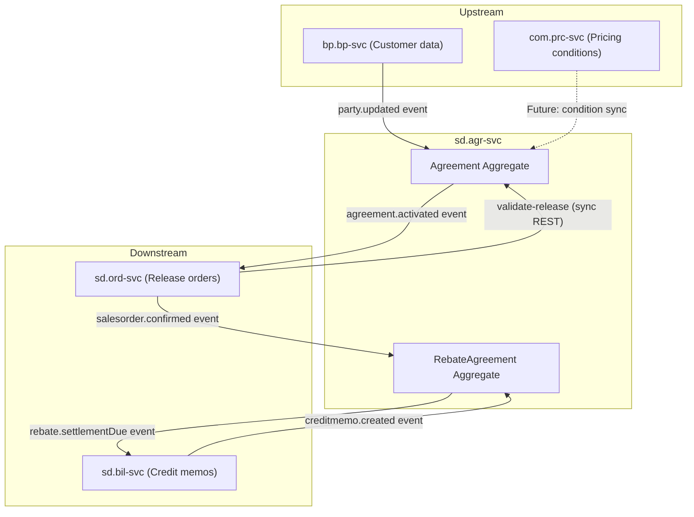
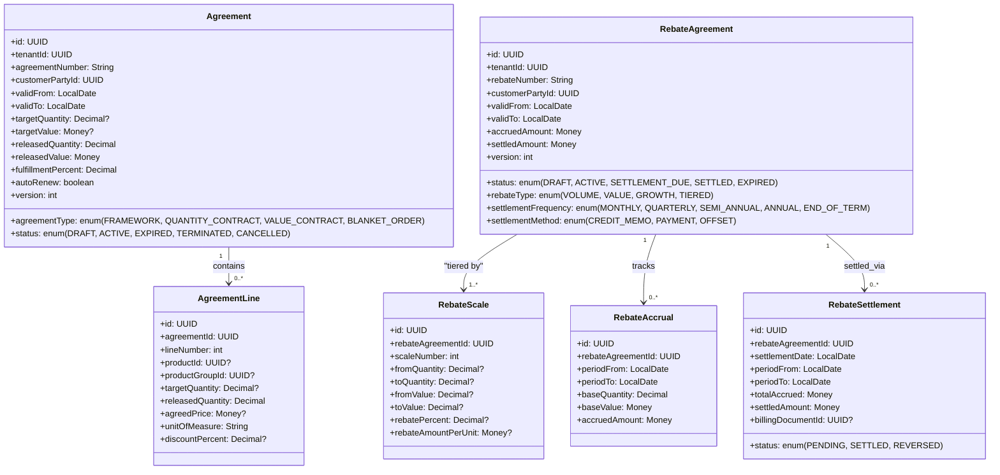
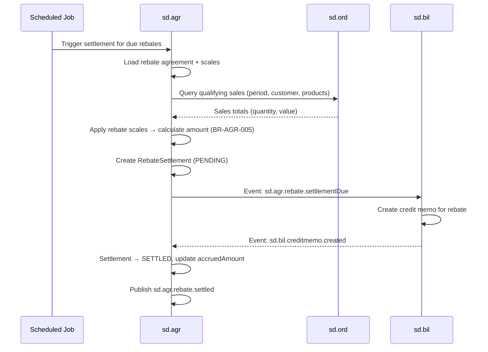
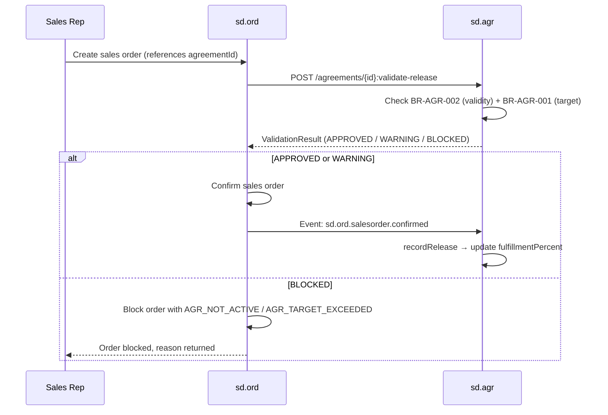
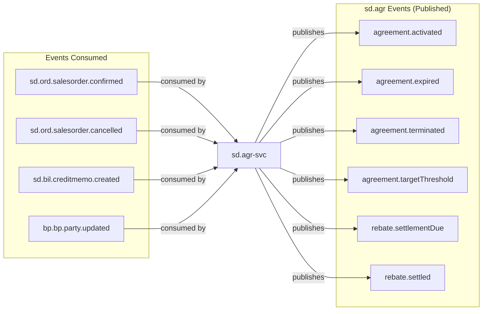
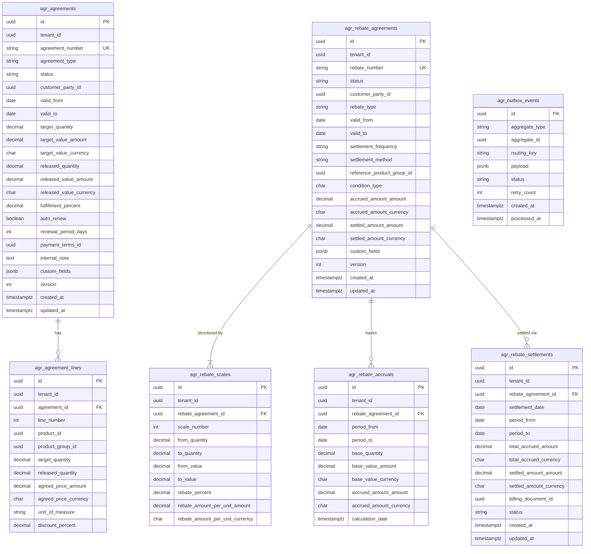

# SD.AGR - Sales Agreements Domain / Service Specification

> **Conceptual Stack Layer:** Domain / Service
> **Space:** Platform
> **Owner:** Domain Engineering Team
> **Schema alignment:** `service-layer.schema.json`
> **Companion files:** `openapi.yaml`, `*.schema.json` (event contracts)
> **Referenced by:** Platform-Feature Spec SS5 (backend dependencies), BFF Contract
> **Belongs to:** SD Suite Spec (`_sd_suite.md`)

> **Meta Information**
> - **Version:** 2026-04-03
> - **Template:** `domain-service-spec.md` v1.0.0
> - **Template Compliance:** ~95% — §11 feature dependency register awaiting feature spec authoring (Q-AGR-011), §13 migration source mapping needs SAP system data (Q-AGR-012)
> - **Author(s):** OpenLeap Architecture Team
> - **Status:** DRAFT
> - **Suite:** `sd`
> - **Domain:** `agr`
> - **Bounded Context Ref:** `bc:sales-agreements`
> - **Service ID:** `sd-agr-svc`
> - **basePackage:** `io.openleap.sd.agr`
> - **API Base Path:** `/api/sd/agr/v1`
> - **OpenLeap Starter Version:** TBD
> - **Port:** TBD
> - **Repository:** TBD
> - **Tags:** `agreements`, `contracts`, `rebates`, `blanket-orders`
> - **Team:**
>   - Name: `team-sd`
>   - Email: `sd-team@openleap.io`
>   - Slack: `#sd-team`

---

## Specification Guidelines Compliance

> ### Non-Negotiables
> - Never invent facts. If required info is missing, add an **OPEN QUESTION** entry.
> - Preserve intent and decisions. Only change meaning when explicitly requested.
> - Do not remove normative constraints unless they are explicitly replaced.
> - Keep the spec **self-contained**: no "see chat", no implicit context.
>
> ### Source of Truth Priority
> When sources conflict:
> 1. Spec (explicit) wins
> 2. Starter specs (implementation constraints) next
> 3. Guidelines (best practices) last
>
> Record conflicts in the **Decisions & Conflicts** section (see Section 14).
>
> ### Style Guide
> - Prefer short sentences and lists.
> - Use MUST/SHOULD/MAY for normative statements.
> - Keep terminology consistent (Aggregate, Domain Service, Application Service, Command, Event).
> - Avoid ambiguous words ("often", "maybe") unless explicitly noting uncertainty.
> - Keep examples minimal and clearly marked as examples.
> - Do not add implementation code unless the chapter explicitly requires it.

---

## 0. Document Purpose & Scope

### 0.1 Purpose
This specification defines the Sales Agreements domain, which manages long-term commercial arrangements between the company and its customers: framework agreements, blanket purchase orders, quantity contracts, value contracts, and rebate agreements.

### 0.2 Target Audience
- Product Owners & Business Stakeholders
- System Architects & Technical Leads
- Integration Engineers

### 0.3 Scope
**In Scope:**
- Framework agreement lifecycle (create, activate, track, expire)
- Quantity contracts and value contracts
- Blanket order management with release tracking
- Rebate agreements (volume-based, value-based, tiered)
- Rebate accrual and settlement
- Agreement compliance monitoring

**Out of Scope:**
- Sales order processing (sd.ord — consumes agreements)
- Price rule management (COM.PRC — may receive agreement conditions)
- Accounts receivable (FI.AR)
- Contract legal management (future CLM domain)

### 0.4 Related Documents
- `_sd_suite.md` — SD Suite overview
- `sd_ord-spec.md` — Sales Orders (primary consumer of agreement validation)
- `sd_bil-spec.md` — Billing (receives settlement triggers)

---

## 1. Business Context

### 1.1 Domain Purpose
`sd.agr` manages the long-term commercial commitments that govern how business is conducted with key customers. Agreements define pre-negotiated terms (prices, quantities, rebates) that sales orders reference. They provide predictability for both buyer and seller and enable volume-based incentive programs.

### 1.2 Business Value
- Formalized long-term customer commitments increase revenue predictability
- Rebate programs incentivize customer loyalty and volume growth
- Automated release tracking prevents over-commitment against target quantities/values
- Agreement compliance visibility supports contract negotiations and renewals
- Automated settlement reduces manual reconciliation effort for rebate programs

### 1.3 Key Stakeholders

| Role | Responsibility | Primary Use Cases |
|------|----------------|-------------------|
| Key Account Manager | Create and manage agreements | UC-AGR-001, UC-AGR-003, UC-AGR-008 |
| Sales Director | Approve agreements, set rebate budgets | UC-AGR-005 |
| Sales Rep | Create release orders against agreements | Consumer (via sd.ord) |
| Finance Controller | Rebate accrual monitoring and settlement | UC-AGR-004 |
| AGR Admin | System configuration and override | All admin operations |

### 1.4 Strategic Positioning
`sd.agr` sits at the intersection of the sales execution lifecycle and customer relationship management. It is a prerequisite service for high-volume B2B sales operations: without agreement management, every sales transaction must carry its own negotiated terms, increasing manual effort and error risk.

Within the SD suite, `sd.agr` acts as a constraint provider. When sd.ord processes a release order, it calls sd.agr to validate that the release is within the agreement's validity period and target limits (BR-AGR-001, BR-AGR-002). This is a synchronous, latency-sensitive dependency — agreement validation MUST complete within 100ms p95 to avoid blocking order processing.

`sd.agr` also drives the rebate settlement cycle, which connects sd.ord (sales actuals) and sd.bil (credit memo generation) through event choreography. This positions sd.agr as the orchestrator of a cross-domain financial process (Rebate Settlement Saga).

SAP equivalent: SD-SLS contracts (transaction VA41/VA42/VA43) and SD-RBT rebate processing (MEB1/MEB3/MEB4).

### 1.5 Service Context

| Property | Value |
|----------|-------|
| **Suite** | `sd` |
| **Domain** | `agr` |
| **Bounded Context** | `bc:sales-agreements` |
| **Service ID** | `sd-agr-svc` |
| **Base Package** | `io.openleap.sd.agr` |

**Responsibilities:**
- Maintain the lifecycle of sales agreements (Framework, Quantity Contract, Value Contract, Blanket Order)
- Track released quantities and values against agreement targets in real time
- Manage rebate agreement terms, tiered scales, and accrual records
- Validate release order feasibility on behalf of sd.ord (synchronous API)
- Orchestrate the rebate settlement process and trigger credit memo creation in sd.bil
- Notify downstream services of agreement state changes via events

**Authoritative Sources:**

| Source Type | Description | Access Pattern |
|-------------|-------------|----------------|
| REST API | Agreement and rebate agreement data, validation results | Synchronous |
| Database | `agr_agreements`, `agr_rebate_agreements` and child tables | Direct (owner) |
| Events | Agreement lifecycle and rebate settlement events | Asynchronous (topic: `sd.agr.events`) |



---

## 2. Service Identity

| Property | Value | Schema Field |
|----------|-------|-------------|
| **Service ID** | `sd-agr-svc` | `metadata.id` |
| **Display Name** | Sales Agreements | `metadata.name` |
| **Suite** | `sd` | `metadata.suite` |
| **Domain** | `agr` | `metadata.domain` |
| **Bounded Context** | `bc:sales-agreements` | `metadata.bounded_context_ref` |
| **Version** | `1.1.0` | `metadata.version` |
| **Status** | DRAFT | `metadata.status` |
| **API Base Path** | `/api/sd/agr/v1` | `metadata.api_base_path` |
| **Repository** | TBD | `metadata.repository` |
| **Tags** | `agreements`, `contracts`, `rebates`, `blanket-orders` | `metadata.tags` |

**Team:**

| Property | Value |
|----------|-------|
| **Name** | `team-sd` |
| **Email** | `sd-team@openleap.io` |
| **Slack Channel** | `#sd-team` |

---

## 3. Domain Model

### 3.1 Conceptual Overview
The domain manages two root aggregates: **Agreement** (framework agreements, quantity/value contracts, blanket orders) and **RebateAgreement** (volume-based incentive programs with accrual and settlement). Each aggregate governs a distinct commercial relationship with the customer: Agreement governs purchase commitments; RebateAgreement governs retrospective discount entitlements.

### 3.2 Core Concepts



### 3.3 Aggregate Definitions

#### 3.3.1 Agreement

| Property | Value |
|----------|-------|
| **Aggregate ID** | `agg:agreement` |
| **Name** | `Agreement` |
| **Business Purpose** | Represents a long-term commercial commitment between the company and a customer, defining pre-negotiated terms for future orders. |

##### Aggregate Root

**Attribute Table:**

| Attribute | Type | Format | Description | Constraints | Required | Read-Only |
|-----------|------|--------|-------------|-------------|----------|-----------|
| `id` | string | uuid | Surrogate primary key (ADR-020) | UUID v4 via `OlUuid.create()` (ADR-021) | Yes | Yes |
| `tenantId` | string | uuid | Tenant identifier for row-level security | Must match authenticated tenant | Yes | Yes |
| `agreementNumber` | string | — | Human-readable agreement identifier | Pattern: `AGR-{YYYY}-{NNNNN}`, unique per tenant | Yes | Yes (auto-generated) |
| `agreementType` | string | enum | Type of commercial arrangement | One of: `FRAMEWORK`, `QUANTITY_CONTRACT`, `VALUE_CONTRACT`, `BLANKET_ORDER` | Yes | No |
| `status` | string | enum | Current lifecycle state | One of: `DRAFT`, `ACTIVE`, `EXPIRED`, `TERMINATED`, `CANCELLED` | Yes | Yes (state machine) |
| `customerPartyId` | string | uuid | Reference to the customer business party | Must exist in bp.bp-svc | Yes | No |
| `validFrom` | string | date | Start of agreement validity period | ISO 8601 date; MUST be ≤ validTo | Yes | No |
| `validTo` | string | date | End of agreement validity period | ISO 8601 date; MUST be ≥ validFrom | Yes | No |
| `targetQuantity` | number | decimal | Total quantity commitment (QUANTITY_CONTRACT, BLANKET_ORDER) | ≥ 0; null for FRAMEWORK and VALUE_CONTRACT | No | No |
| `targetValueAmount` | number | decimal | Target value commitment amount (VALUE_CONTRACT, BLANKET_ORDER) | ≥ 0; null for FRAMEWORK and QUANTITY_CONTRACT | No | No |
| `targetValueCurrency` | string | — | ISO 4217 currency code for target value | Length: 3; e.g., `EUR`, `USD` | No | No |
| `releasedQuantity` | number | decimal | Cumulative quantity of confirmed release orders | Computed; ≥ 0 | Yes | Yes |
| `releasedValueAmount` | number | decimal | Cumulative value of confirmed release orders | Computed; ≥ 0 | Yes | Yes |
| `releasedValueCurrency` | string | — | Currency of releasedValue (matches targetValueCurrency) | Length: 3 | Yes | Yes |
| `fulfillmentPercent` | number | decimal | Percentage of target fulfilled (released/target × 100) | Computed; 0–100+; null if no target set | No | Yes |
| `autoRenew` | boolean | — | Whether the agreement auto-renews at validTo | Default: false | Yes | No |
| `renewalPeriodDays` | integer | int32 | Number of days to extend validTo on auto-renewal | ≥ 1; required if autoRenew = true | No | No |
| `paymentTermsId` | string | uuid | Reference to payment terms (if overriding customer default) | Optional reference | No | No |
| `internalNote` | string | — | Internal comment for KAM/admin use | Max 2000 chars | No | No |
| `version` | integer | int32 | Optimistic locking version (ETag) | ≥ 0; incremented on every mutation | Yes | Yes |
| `createdAt` | string | date-time | Record creation timestamp | ISO 8601, UTC | Yes | Yes |
| `updatedAt` | string | date-time | Record last-update timestamp | ISO 8601, UTC | Yes | Yes |
| `customFields` | object | — | Product-defined extension fields (ADR-067) | JSONB; validated against registered field definitions | No | No |

**State Descriptions:**

| State | Description | Business Meaning |
|-------|-------------|------------------|
| `DRAFT` | Agreement created but not yet active | Terms may still be negotiated; no releases allowed |
| `ACTIVE` | Agreement is within its validity period and operational | Release orders may reference this agreement |
| `EXPIRED` | Validity period ended normally | No further releases; historical record retained |
| `TERMINATED` | Agreement ended before validTo by explicit action | Early exit; reason recorded in internal note |
| `CANCELLED` | Agreement cancelled while still in DRAFT | Was never activated |

**Allowed State Transitions:**

| From | To | Trigger | Guard |
|------|----|---------|-------|
| `DRAFT` | `ACTIVE` | `Agreement.activate` (UC-AGR-005) | validFrom ≤ today; all mandatory fields complete |
| `DRAFT` | `CANCELLED` | `Agreement.cancel` | Status is DRAFT |
| `ACTIVE` | `EXPIRED` | Scheduled job: validity check | today > validTo AND autoRenew = false |
| `ACTIVE` | `ACTIVE` | Scheduled job: auto-renew | today > validTo AND autoRenew = true |
| `ACTIVE` | `TERMINATED` | `Agreement.terminate` (UC-AGR-006) | Status is ACTIVE |

**Domain Events Emitted:**

| Event | State Transition | Routing Key |
|-------|-----------------|-------------|
| `Agreement.Activated` | DRAFT → ACTIVE | `sd.agr.agreement.activated` |
| `Agreement.Expired` | ACTIVE → EXPIRED | `sd.agr.agreement.expired` |
| `Agreement.Terminated` | ACTIVE → TERMINATED | `sd.agr.agreement.terminated` |
| `Agreement.TargetThreshold` | (on release recording) | `sd.agr.agreement.targetThreshold` |

##### Child Entities

###### AgreementLine

**Business Purpose:** Specifies product-level or product-group-level terms within the agreement, including target quantities, agreed prices, and per-line fulfillment tracking.

**Attribute Table:**

| Attribute | Type | Format | Description | Constraints | Required |
|-----------|------|--------|-------------|-------------|----------|
| `id` | string | uuid | Surrogate PK | UUID v4 | Yes |
| `agreementId` | string | uuid | Parent Agreement reference | Must exist | Yes |
| `lineNumber` | integer | int32 | Sequential line position | ≥ 1; unique within agreement | Yes |
| `productId` | string | uuid | Product reference (if product-specific) | Optional; references com product | No |
| `productGroupId` | string | uuid | Product group reference (if group-level) | Optional; at least one of productId/productGroupId required for QUANTITY_CONTRACT | No |
| `targetQuantity` | number | decimal | Line-level quantity commitment | ≥ 0 | No |
| `releasedQuantity` | number | decimal | Quantity released against this line | ≥ 0; computed | Yes |
| `agreedPriceAmount` | number | decimal | Pre-negotiated unit price | ≥ 0 | No |
| `agreedPriceCurrency` | string | — | ISO 4217 currency of agreed price | Length: 3 | No |
| `unitOfMeasure` | string | — | ISO unit of measure code (e.g., `EA`, `KG`, `L`) | Max 10 chars | Yes |
| `discountPercent` | number | decimal | Line-level discount percentage | 0–100 | No |

**Collection Constraints:**
- An Agreement MUST have 0 or more AgreementLines.
- FRAMEWORK agreements MAY have zero lines (header-only terms).
- QUANTITY_CONTRACT and VALUE_CONTRACT SHOULD have at least one line.

**Invariants:**
- BR-AGR-001 applies at the aggregate level (sum of line-level released quantities/values MUST NOT exceed header targets).

---

#### 3.3.2 RebateAgreement

| Property | Value |
|----------|-------|
| **Aggregate ID** | `agg:rebate-agreement` |
| **Name** | `RebateAgreement` |
| **Business Purpose** | Represents a retrospective discount arrangement based on a customer's actual purchase volumes over a defined period. Settlement creates a credit memo. |

##### Aggregate Root

**Attribute Table:**

| Attribute | Type | Format | Description | Constraints | Required | Read-Only |
|-----------|------|--------|-------------|-------------|----------|-----------|
| `id` | string | uuid | Surrogate PK | UUID v4 via `OlUuid.create()` | Yes | Yes |
| `tenantId` | string | uuid | Tenant identifier | Must match authenticated tenant | Yes | Yes |
| `rebateNumber` | string | — | Human-readable rebate identifier | Pattern: `REB-{YYYY}-{NNNNN}`, unique per tenant | Yes | Yes |
| `status` | string | enum | Current lifecycle state | One of: `DRAFT`, `ACTIVE`, `SETTLEMENT_DUE`, `SETTLED`, `EXPIRED` | Yes | Yes |
| `customerPartyId` | string | uuid | Customer business party reference | Must exist in bp.bp-svc | Yes | No |
| `rebateType` | string | enum | Basis for rebate calculation | One of: `VOLUME`, `VALUE`, `GROWTH`, `TIERED` | Yes | No |
| `validFrom` | string | date | Start of rebate agreement period | ISO 8601 date | Yes | No |
| `validTo` | string | date | End of rebate agreement period | ISO 8601 date; ≥ validFrom | Yes | No |
| `settlementFrequency` | string | enum | How often rebate is settled | One of: `MONTHLY`, `QUARTERLY`, `SEMI_ANNUAL`, `ANNUAL`, `END_OF_TERM` | Yes | No |
| `settlementMethod` | string | enum | How settlement is paid | One of: `CREDIT_MEMO`, `PAYMENT`, `OFFSET` | Yes | No |
| `referenceProductGroupId` | string | uuid | Product group scope for rebate calculation | If null, all products qualify | No | No |
| `conditionType` | string | — | SD pricing condition type for integration | Max 4 chars; e.g., `RB00` | No | No |
| `accruedAmountAmount` | number | decimal | Running accrued rebate balance | Computed; ≥ 0 | Yes | Yes |
| `accruedAmountCurrency` | string | — | ISO 4217 currency | Length: 3 | Yes | Yes |
| `settledAmountAmount` | number | decimal | Total rebate amount already settled | Computed; ≥ 0 | Yes | Yes |
| `settledAmountCurrency` | string | — | ISO 4217 currency | Length: 3 | Yes | Yes |
| `version` | integer | int32 | Optimistic locking version | ≥ 0 | Yes | Yes |
| `createdAt` | string | date-time | Creation timestamp | ISO 8601, UTC | Yes | Yes |
| `updatedAt` | string | date-time | Last update timestamp | ISO 8601, UTC | Yes | Yes |
| `customFields` | object | — | Product-defined extension fields | JSONB | No | No |

**State Descriptions:**

| State | Description | Business Meaning |
|-------|-------------|------------------|
| `DRAFT` | Rebate agreement being configured | Scales and terms may still be modified |
| `ACTIVE` | Rebate period is running; purchases are accruing | Accruals updated on each qualifying sales order |
| `SETTLEMENT_DUE` | Settlement period reached; settlement not yet processed | Finance must process settlement |
| `SETTLED` | Settlement for the current period processed | Credit memo created; moves to ACTIVE for next period, or EXPIRED if final |
| `EXPIRED` | Rebate agreement validity has ended | All periods settled; historical record retained |

**Allowed State Transitions:**

| From | To | Trigger | Guard |
|------|----|---------|-------|
| `DRAFT` | `ACTIVE` | `RebateAgreement.activate` | validFrom ≤ today; at least one RebateScale defined |
| `ACTIVE` | `SETTLEMENT_DUE` | Scheduled job: settlement check | Settlement period end reached |
| `SETTLEMENT_DUE` | `SETTLED` | `RebateAgreement.settle` (UC-AGR-004) | Status is SETTLEMENT_DUE |
| `SETTLED` | `ACTIVE` | Automatic: next period starts | Further periods remain within validTo |
| `SETTLED` | `EXPIRED` | Automatic: final settlement | No further periods within validTo |
| `ACTIVE` | `EXPIRED` | Scheduled job: validity check | today > validTo AND no settlement due |

**Domain Events Emitted:**

| Event | Trigger | Routing Key |
|-------|---------|-------------|
| `RebateAgreement.SettlementDue` | → SETTLEMENT_DUE | `sd.agr.rebate.settlementDue` |
| `RebateAgreement.Settled` | → SETTLED | `sd.agr.rebate.settled` |

**Invariants:**
- BR-AGR-004: RebateScale tiers MUST be contiguous (no gaps between toQuantity/fromQuantity).
- BR-AGR-005: Sum of period accruals MUST equal calculated rebate amount.

##### Child Entities

###### RebateScale

**Business Purpose:** Defines a tiered threshold band for the rebate calculation. Multiple scales define the step-scale structure.

| Attribute | Type | Format | Description | Constraints | Required |
|-----------|------|--------|-------------|-------------|----------|
| `id` | string | uuid | Surrogate PK | UUID v4 | Yes |
| `rebateAgreementId` | string | uuid | Parent RebateAgreement reference | Must exist | Yes |
| `scaleNumber` | integer | int32 | Ordering index of the scale tier | ≥ 1; unique within rebate agreement | Yes |
| `fromQuantity` | number | decimal | Lower bound quantity for this tier | ≥ 0; used for VOLUME/TIERED types | No |
| `toQuantity` | number | decimal | Upper bound quantity (null = unlimited) | > fromQuantity; null for highest tier | No |
| `fromValue` | number | decimal | Lower bound value for this tier | ≥ 0; used for VALUE/TIERED types | No |
| `toValue` | number | decimal | Upper bound value (null = unlimited) | > fromValue; null for highest tier | No |
| `rebatePercent` | number | decimal | Rebate as percentage of qualifying purchase value | 0–100; mutually exclusive with rebateAmountPerUnit | No |
| `rebateAmountPerUnitAmount` | number | decimal | Flat rebate per unit sold | ≥ 0; mutually exclusive with rebatePercent | No |
| `rebateAmountPerUnitCurrency` | string | — | ISO 4217 currency | Length: 3 | No |

**Collection Constraints:**
- A RebateAgreement MUST have at least one RebateScale.
- For TIERED type, scales MUST be contiguous (BR-AGR-004).

---

###### RebateAccrual

**Business Purpose:** Records the running rebate liability for a settlement period. Created/updated when qualifying sales orders are confirmed.

| Attribute | Type | Format | Description | Constraints | Required |
|-----------|------|--------|-------------|-------------|----------|
| `id` | string | uuid | Surrogate PK | UUID v4 | Yes |
| `rebateAgreementId` | string | uuid | Parent RebateAgreement reference | Must exist | Yes |
| `periodFrom` | string | date | Start of accrual period | ISO 8601 | Yes |
| `periodTo` | string | date | End of accrual period | ISO 8601; ≥ periodFrom | Yes |
| `baseQuantity` | number | decimal | Qualifying quantity for this period | ≥ 0 | Yes |
| `baseValueAmount` | number | decimal | Qualifying purchase value for this period | ≥ 0 | Yes |
| `baseValueCurrency` | string | — | ISO 4217 currency | Length: 3 | Yes |
| `accruedAmountAmount` | number | decimal | Calculated rebate liability for this period | ≥ 0 | Yes |
| `accruedAmountCurrency` | string | — | ISO 4217 currency | Length: 3 | Yes |
| `calculationDate` | string | date-time | When the accrual was last recalculated | ISO 8601, UTC | Yes |

---

###### RebateSettlement

**Business Purpose:** Records the final settlement of a rebate period. Creation triggers credit memo generation in sd.bil.

| Attribute | Type | Format | Description | Constraints | Required |
|-----------|------|--------|-------------|-------------|----------|
| `id` | string | uuid | Surrogate PK | UUID v4 | Yes |
| `rebateAgreementId` | string | uuid | Parent RebateAgreement reference | Must exist | Yes |
| `settlementDate` | string | date | Date settlement was processed | ISO 8601 | Yes |
| `periodFrom` | string | date | Settled period start | ISO 8601 | Yes |
| `periodTo` | string | date | Settled period end | ISO 8601; ≥ periodFrom | Yes |
| `totalAccruedAmount` | number | decimal | Total accrued rebate for this period | ≥ 0 | Yes |
| `totalAccruedCurrency` | string | — | ISO 4217 currency | Length: 3 | Yes |
| `settledAmountAmount` | number | decimal | Actual settled amount (may differ from accrual for minimums/adjustments) | ≥ 0 | Yes |
| `settledAmountCurrency` | string | — | ISO 4217 currency | Length: 3 | Yes |
| `billingDocumentId` | string | uuid | Credit memo document reference from sd.bil | Populated on SETTLED | No |
| `status` | string | enum | Settlement status | One of: `PENDING`, `SETTLED`, `REVERSED` | Yes |

---

### 3.4 Enumerations

#### AgreementType

| Value | Description | Deprecated |
|-------|-------------|------------|
| `FRAMEWORK` | General framework agreement defining pricing and terms without quantity/value commitment | No |
| `QUANTITY_CONTRACT` | Commitment to purchase a defined total quantity over the agreement period | No |
| `VALUE_CONTRACT` | Commitment to a total purchase value (spend) over the agreement period | No |
| `BLANKET_ORDER` | Pre-approved order with a maximum value; individual delivery releases drawn down against it | No |

#### AgreementStatus

| Value | Description | Deprecated |
|-------|-------------|------------|
| `DRAFT` | Agreement is being authored; not yet effective | No |
| `ACTIVE` | Agreement is within its validity period and available for releases | No |
| `EXPIRED` | Agreement validity period ended normally | No |
| `TERMINATED` | Agreement was ended before expiry by explicit business action | No |
| `CANCELLED` | Draft agreement was discarded before activation | No |

#### RebateAgreementStatus

| Value | Description | Deprecated |
|-------|-------------|------------|
| `DRAFT` | Rebate agreement being configured | No |
| `ACTIVE` | Rebate period running; qualifying purchases accruing | No |
| `SETTLEMENT_DUE` | Settlement period has elapsed; awaiting settlement processing | No |
| `SETTLED` | Current settlement period completed; credit memo issued | No |
| `EXPIRED` | All settlement periods complete; agreement closed | No |

#### RebateType

| Value | Description | Deprecated |
|-------|-------------|------------|
| `VOLUME` | Rebate based on total quantity purchased during the period | No |
| `VALUE` | Rebate based on total purchase value (spend) during the period | No |
| `GROWTH` | Rebate based on growth over a prior period's volume or value | No |
| `TIERED` | Rebate scales up through tiers as volume/value thresholds are crossed | No |

#### SettlementFrequency

| Value | Description | Deprecated |
|-------|-------------|------------|
| `MONTHLY` | Settlement triggered at end of each calendar month | No |
| `QUARTERLY` | Settlement triggered at end of each calendar quarter | No |
| `SEMI_ANNUAL` | Settlement triggered twice per year | No |
| `ANNUAL` | Settlement triggered once per year | No |
| `END_OF_TERM` | Settlement triggered at the end of the rebate agreement validity period | No |

#### SettlementMethod

| Value | Description | Deprecated |
|-------|-------------|------------|
| `CREDIT_MEMO` | Customer receives a credit memo reducing outstanding payables | No |
| `PAYMENT` | Customer receives a direct payment (bank transfer) | No |
| `OFFSET` | Rebate amount is offset against the customer's open receivables | No |

#### RebateSettlementStatus

| Value | Description | Deprecated |
|-------|-------------|------------|
| `PENDING` | Settlement record created; credit memo not yet confirmed | No |
| `SETTLED` | Credit memo confirmed by sd.bil; settlement complete | No |
| `REVERSED` | Settlement reversed (e.g., due to rebate adjustment or error) | No |

---

### 3.5 Shared Types

#### Money

**Description:** Represents a monetary amount with its currency. Used throughout the domain for prices, values, and settled amounts.

**Attribute Table:**

| Attribute | Type | Format | Description | Constraints | Required |
|-----------|------|--------|-------------|-------------|----------|
| `amount` | number | decimal | Monetary value | ≥ 0; max 2 decimal places | Yes |
| `currencyCode` | string | — | ISO 4217 currency code | Length: 3; e.g., `EUR`, `USD`, `GBP` | Yes |

**Validation Rules:**
- `amount` MUST be a non-negative decimal with at most 2 decimal places.
- `currencyCode` MUST be a valid ISO 4217 3-letter code.
- Currency MUST be consistent across related amounts (e.g., targetValue and releasedValue on the same agreement).

**Used By:** Agreement (targetValue, releasedValue), AgreementLine (agreedPrice), RebateAgreement (accruedAmount, settledAmount), RebateScale (rebateAmountPerUnit), RebateAccrual (baseValue, accruedAmount), RebateSettlement (totalAccrued, settledAmount).

---

## 4. Business Rules & Constraints

### 4.1 Business Rules Catalog

| ID | Rule Name | Description | Scope | Enforcement | Error Code |
|----|-----------|-------------|-------|-------------|------------|
| BR-AGR-001 | Target Limit | Released quantity/value MUST NOT exceed target | Agreement | Release validation | `AGR_TARGET_EXCEEDED` |
| BR-AGR-002 | Validity Period | Releases only allowed during ACTIVE period | Agreement | Release validation | `AGR_NOT_ACTIVE` |
| BR-AGR-003 | Auto-Renewal | System extends validity on expiry if configured | Agreement | Scheduled job | — |
| BR-AGR-004 | Scale Continuity | Rebate tiers MUST be contiguous (no gaps) | RebateScale | Create/Update | `AGR_SCALE_GAP` |
| BR-AGR-005 | Accrual Consistency | Accruals MUST match recalculated rebate on settlement | RebateAccrual | Periodic reconciliation job | — |
| BR-AGR-006 | Settlement Creates Billing | Settlement MUST trigger a credit memo via sd.bil | RebateSettlement | Settlement processing | — |

### 4.2 Detailed Rule Definitions

#### BR-AGR-001: Target Limit

**Business Context:** Agreements carry negotiated quantity or value commitments. Allowing releases beyond the target would violate the commercial contract and create liability for over-delivery.

**Rule Statement:** The sum of releasedQuantity (or releasedValue) across all confirmed release orders referencing this agreement MUST NOT exceed the agreement's targetQuantity (or targetValue). On reaching 100%, further releases are blocked. A warning SHOULD be issued at 80% and 90%.

**Applies To:**
- Aggregate: `Agreement`
- Operations: `ValidateRelease` (UC-AGR-002), `RecordRelease` (UC-AGR-007)

**Enforcement:** Checked synchronously in `Agreement.validateRelease()` domain method before any release order confirmation.

**Validation Logic:** If `targetQuantity` is not null and `(releasedQuantity + requestedQuantity) > targetQuantity`, return BLOCKED. If > 80%/90% threshold, return WARNING.

**Error Handling:**
- **Error Code:** `AGR_TARGET_EXCEEDED`
- **Error Message:** "Release quantity {q} would exceed agreement target {t}. Current fulfillment: {p}%."
- **User action:** Request a target increase from the Key Account Manager, or split the order across agreements.

**Examples:**
- **Valid:** Agreement with targetQuantity = 1000 EA, releasedQuantity = 600, requestedQuantity = 200. Result: APPROVED (80% threshold warning).
- **Invalid:** Agreement with targetQuantity = 1000 EA, releasedQuantity = 950, requestedQuantity = 200. Result: BLOCKED (would reach 115%).

---

#### BR-AGR-002: Validity Period

**Business Context:** An agreement is only legally effective within its negotiated date range. Orders referencing an expired, terminated, or cancelled agreement must be blocked to prevent unauthorized pricing application.

**Rule Statement:** A release order MAY only reference an Agreement with status = ACTIVE and where today falls within `[validFrom, validTo]`.

**Applies To:**
- Aggregate: `Agreement`
- Operations: `ValidateRelease` (UC-AGR-002)

**Enforcement:** Checked synchronously in `Agreement.validateRelease()`.

**Validation Logic:** If `status != ACTIVE`, return BLOCKED with `AGR_NOT_ACTIVE`. If `today < validFrom OR today > validTo`, return BLOCKED with `AGR_NOT_ACTIVE`.

**Error Handling:**
- **Error Code:** `AGR_NOT_ACTIVE`
- **Error Message:** "Agreement {agreementNumber} is not active (current status: {status}, valid: {validFrom} to {validTo})."
- **User action:** Reference an active agreement, or contact the Key Account Manager to reactivate.

**Examples:**
- **Valid:** Agreement status = ACTIVE, validFrom = 2026-01-01, validTo = 2026-12-31, today = 2026-06-15. Result: APPROVED.
- **Invalid:** Agreement status = EXPIRED. Result: BLOCKED.

---

#### BR-AGR-003: Auto-Renewal

**Business Context:** Key customer agreements often renew automatically to prevent unintended lapses. Without auto-renewal, a missed manual renewal could inadvertently block order processing.

**Rule Statement:** When a scheduled job detects that `today > validTo` for an ACTIVE agreement with `autoRenew = true`, the system MUST extend `validTo` by `renewalPeriodDays` and emit an `Agreement.Renewed` event. Released quantities are NOT reset.

**Applies To:**
- Aggregate: `Agreement`
- Operations: Scheduled renewal job (nightly, 00:30 UTC)

**Enforcement:** Automated; no user action required.

**Validation Logic:** If `autoRenew = true` AND `renewalPeriodDays` is set, extend `validTo = validTo + renewalPeriodDays`.

**Error Handling:** If renewal fails (e.g., missing renewalPeriodDays), set status to EXPIRED and raise an alert.

**Examples:**
- **Valid:** validTo = 2026-12-31, autoRenew = true, renewalPeriodDays = 365. Renewed to validTo = 2027-12-31.

---

#### BR-AGR-004: Scale Continuity

**Business Context:** Tiered rebate scales must cover the full range without gaps, otherwise qualifying purchases in a gap zone would have no defined rebate rate, causing calculation errors.

**Rule Statement:** For RebateAgreements with at least two RebateScales, each scale's `fromQuantity` (or `fromValue`) MUST equal the previous scale's `toQuantity` (or `toValue`). The highest scale's `toQuantity`/`toValue` MAY be null (representing no upper limit).

**Applies To:**
- Aggregate: `RebateAgreement`
- Operations: `CreateRebateAgreement` (UC-AGR-003), `UpdateScales` (PUT /rebate-agreements/{id}/scales)

**Enforcement:** Validated in `RebateAgreement.replaceScales()` domain method.

**Validation Logic:** Sort scales by scaleNumber. For i > 0: assert `scales[i].from == scales[i-1].to`.

**Error Handling:**
- **Error Code:** `AGR_SCALE_GAP`
- **Error Message:** "Gap detected between scale {n} (to: {toQty}) and scale {n+1} (from: {fromQty})."
- **User action:** Adjust scale boundaries so tiers are contiguous.

**Examples:**
- **Valid:** Scale 1: 0–100, Scale 2: 100–500, Scale 3: 500–null. Contiguous.
- **Invalid:** Scale 1: 0–100, Scale 2: 150–500. Gap between 100 and 150.

---

#### BR-AGR-005: Accrual Consistency

**Business Context:** Rebate accruals are estimated liabilities. Before settlement, they must be reconciled against actual sales data to ensure the credit memo reflects reality.

**Rule Statement:** Before creating a RebateSettlement, the system MUST recalculate the rebate amount from confirmed sales order data and compare against the running accrual. Deviations above a configurable tolerance (default: ±0.01 currency units) MUST be reconciled.

**Applies To:**
- Aggregate: `RebateAgreement`, `RebateAccrual`
- Operations: `SettleRebate` (UC-AGR-004), periodic reconciliation job

**Enforcement:** Recalculation performed in `RebateAgreement.settle()` before creating the RebateSettlement.

**Validation Logic:** Query sd.ord for qualifying sales totals for the settlement period. Apply rebate scales. Compare with accruedAmount. If delta > tolerance, adjust accrual before settling.

**Error Handling:** Log reconciliation delta. If delta exceeds 5% threshold, raise alert for manual review.

**Examples:**
- **Valid:** Accrued: €2,500.00. Recalculated: €2,500.00. Delta: €0.00. Settlement proceeds.
- **Valid (adjusted):** Accrued: €2,500.00. Recalculated: €2,498.75. Delta: €1.25. Auto-adjusted and logged.

---

#### BR-AGR-006: Settlement Creates Billing

**Business Context:** Rebate settlements result in credit memos that reduce the customer's outstanding balance. This is a financial obligation that must be executed through the billing system (sd.bil) to ensure correct AR postings.

**Rule Statement:** When a RebateSettlement is created with status = PENDING, the system MUST publish a `sd.agr.rebate.settlementDue` event. sd.bil MUST consume this event and create a credit memo. The settlement status transitions to SETTLED only after receiving `sd.bil.creditmemo.created`.

**Applies To:**
- Aggregate: `RebateSettlement`
- Operations: `SettleRebate` (UC-AGR-004)

**Enforcement:** Event-driven choreography; settlement stays PENDING until confirmed.

**Validation Logic:** If `billingDocumentId` is still null 24 hours after settlement creation, raise alert.

**Error Handling:** If credit memo creation fails (DLQ), notify AGR Admin. Manual reconciliation may be required.

**Examples:**
- **Valid:** settlementDue event published → sd.bil creates credit memo → creditmemo.created event received → settlement = SETTLED.

---

### 4.3 Data Validation Rules

**Field-Level Validations:**

| Field | Validation Rule | Error Message |
|-------|----------------|---------------|
| `agreementType` | Required; one of enum values | "agreementType is required and must be one of: FRAMEWORK, QUANTITY_CONTRACT, VALUE_CONTRACT, BLANKET_ORDER" |
| `customerPartyId` | Required; valid UUID; must exist in bp.bp-svc | "customerPartyId must reference an existing customer party" |
| `validFrom` | Required; ISO 8601 date | "validFrom is required (format: YYYY-MM-DD)" |
| `validTo` | Required; ISO 8601 date; ≥ validFrom | "validTo must be greater than or equal to validFrom" |
| `targetQuantity` | Optional; ≥ 0 if present | "targetQuantity must be a non-negative number" |
| `targetValueAmount` | Optional; ≥ 0 if present | "targetValue.amount must be a non-negative number" |
| `targetValueCurrency` | Required if targetValueAmount present; 3 chars | "targetValue.currencyCode must be a valid ISO 4217 code" |
| `renewalPeriodDays` | Required if autoRenew = true; ≥ 1 | "renewalPeriodDays must be ≥ 1 when autoRenew is true" |
| `rebateType` | Required; one of enum values | "rebateType is required and must be one of: VOLUME, VALUE, GROWTH, TIERED" |
| `settlementFrequency` | Required; one of enum values | "settlementFrequency is required" |
| `settlementMethod` | Required; one of enum values | "settlementMethod is required" |
| `rebatePercent` | 0–100 if present | "rebatePercent must be between 0 and 100" |
| `lineNumber` | ≥ 1; unique within agreement | "lineNumber must be unique within the agreement" |

**Cross-Field Validations:**
- `validTo` MUST be ≥ `validFrom` (both on Agreement and RebateAgreement).
- For QUANTITY_CONTRACT: `targetQuantity` SHOULD be set and > 0.
- For VALUE_CONTRACT: `targetValueAmount` SHOULD be set and > 0.
- `rebatePercent` and `rebateAmountPerUnit` on RebateScale are mutually exclusive (exactly one MUST be set).
- `renewalPeriodDays` MUST be set if `autoRenew = true`.

### 4.4 Reference Data Dependencies

| Catalog | Source Service | Fields Referencing | Validation |
|---------|----------------|-------------------|------------|
| Business Parties (Customers) | `bp.bp-svc` | `Agreement.customerPartyId`, `RebateAgreement.customerPartyId` | Must exist; validated on create |
| Products | `com.prd-svc` | `AgreementLine.productId` | Must exist if productId is provided |
| Product Groups | `com.prd-svc` | `AgreementLine.productGroupId`, `RebateAgreement.referenceProductGroupId` | Must exist if productGroupId is provided |
| Currencies | `ref.ref-svc` | `targetValueCurrency`, `agreedPriceCurrency`, all Money currency fields | ISO 4217 validation |
| Units of Measure | `ref.ref-svc` | `AgreementLine.unitOfMeasure` | Must be a valid ISO UOM code |
| Payment Terms | `ref.ref-svc` | `Agreement.paymentTermsId` | Must exist if provided |

---

## 5. Use Cases

### 5.1 Business Logic Placement

| Logic Type | Placement | Examples |
|------------|-----------|----------|
| Aggregate invariants | Domain Object | Target limit enforcement, state machine transitions, scale continuity validation |
| Cross-aggregate logic | Domain Service | Rebate calculation spanning RebateAgreement + RebateScale + RebateAccrual |
| Orchestration & transactions | Application Service | Use case coordination, event publishing via outbox (ADR-013) |
| Scheduled operations | Application Service (triggered by scheduler) | Auto-renewal, settlement period detection, threshold notifications |

### 5.2 Use Cases (Canonical Format + Detail)

#### UC-AGR-001: Create Framework Agreement

| Field | Value |
|-------|-------|
| **id** | `CreateFrameworkAgreement` |
| **type** | WRITE |
| **trigger** | REST |
| **aggregate** | `Agreement` |
| **domainOperation** | `Agreement.create` |
| **inputs** | `customerPartyId`, `agreementType`, `validFrom`, `validTo`, `targetQuantity?`, `targetValue?`, `autoRenew`, `lines[]` |
| **outputs** | `Agreement` (status: DRAFT) |
| **events** | — (no event on DRAFT creation) |
| **rest** | `POST /api/sd/agr/v1/agreements` |
| **idempotency** | Optional (Idempotency-Key header) |

**Actor:** Key Account Manager

**Preconditions:**
- User has role AGR_KAM or AGR_MANAGER.
- `customerPartyId` references an existing active customer in bp.bp-svc.
- `validFrom` ≤ `validTo`.

**Main Flow:**
1. KAM submits agreement creation request.
2. Application service validates customerPartyId against bp.bp-svc.
3. `Agreement.create()` domain method validates cross-field rules (§4.3).
4. Agreement is persisted with status = DRAFT.
5. AgreementLines are created and linked to the agreement.
6. Response returns the created Agreement with agreementNumber assigned.

**Postconditions:**
- Agreement exists with status = DRAFT.
- AgreementLines are associated with correct line numbers.

**Business Rules Applied:**
- Cross-field validations from §4.3.

**Alternative Flows:**
- **Alt-1:** If agreementType = FRAMEWORK and no lines are provided, the agreement is created with zero lines.

**Exception Flows:**
- **Exc-1:** If `customerPartyId` does not exist, return 422 with `PARTY_NOT_FOUND`.
- **Exc-2:** If `validFrom > validTo`, return 400.

---

#### UC-AGR-002: Validate Release Order

| Field | Value |
|-------|-------|
| **id** | `ValidateRelease` |
| **type** | READ |
| **trigger** | REST (called synchronously by sd.ord) |
| **aggregate** | `Agreement` |
| **domainOperation** | `Agreement.validateRelease` |
| **inputs** | `agreementId`, `quantity`, `value` (Money) |
| **outputs** | `ValidationResult` (status: APPROVED / WARNING / BLOCKED, reason, fulfillmentPercent) |
| **rest** | `POST /api/sd/agr/v1/agreements/{id}:validate-release` |
| **errors** | `AGR_TARGET_EXCEEDED`, `AGR_NOT_ACTIVE` |
| **idempotency** | N/A (read-only) |

**Actor:** sd.ord-svc (service-to-service, no human actor)

**Preconditions:**
- Agreement exists (404 otherwise).
- Caller is authenticated as `sd.ord-svc` service principal.

**Main Flow:**
1. sd.ord calls validate-release with agreementId, requested quantity and value.
2. Service loads Agreement aggregate from database.
3. `Agreement.validateRelease()` checks BR-AGR-002 (validity period) and BR-AGR-001 (target limit).
4. Returns ValidationResult with APPROVED, WARNING (≥80% threshold), or BLOCKED.

**Postconditions:**
- No state change. Agreement is not modified.

**Business Rules Applied:**
- BR-AGR-001: Target Limit
- BR-AGR-002: Validity Period

**Exception Flows:**
- **Exc-1:** Agreement not found → 404.
- **Exc-2:** Agreement is BLOCKED (fully consumed) → ValidationResult BLOCKED + `AGR_TARGET_EXCEEDED`.

---

#### UC-AGR-003: Create Rebate Agreement

| Field | Value |
|-------|-------|
| **id** | `CreateRebateAgreement` |
| **type** | WRITE |
| **trigger** | REST |
| **aggregate** | `RebateAgreement` |
| **domainOperation** | `RebateAgreement.create` |
| **inputs** | `customerPartyId`, `rebateType`, `validFrom`, `validTo`, `settlementFrequency`, `settlementMethod`, `scales[]` |
| **outputs** | `RebateAgreement` (status: DRAFT) |
| **events** | — |
| **rest** | `POST /api/sd/agr/v1/rebate-agreements` |
| **idempotency** | Optional |

**Actor:** Key Account Manager / Finance Controller

**Preconditions:**
- User has role AGR_MANAGER or AGR_ADMIN.
- `customerPartyId` is valid.
- At least one RebateScale is provided.

**Main Flow:**
1. Actor submits rebate agreement creation request with scales.
2. Application service validates customerPartyId.
3. `RebateAgreement.create()` validates cross-field rules.
4. `RebateAgreement.replaceScales()` validates BR-AGR-004 (scale continuity).
5. RebateAgreement and scales are persisted with status = DRAFT.
6. Response returns the created RebateAgreement with rebateNumber assigned.

**Postconditions:**
- RebateAgreement exists with status = DRAFT.
- At least one RebateScale is linked.

**Business Rules Applied:**
- BR-AGR-004: Scale Continuity

**Exception Flows:**
- **Exc-1:** Scale gap detected → 422 with `AGR_SCALE_GAP`.
- **Exc-2:** `customerPartyId` not found → 422 with `PARTY_NOT_FOUND`.

---

#### UC-AGR-004: Settle Rebate

| Field | Value |
|-------|-------|
| **id** | `SettleRebate` |
| **type** | WRITE |
| **trigger** | REST or Scheduled Job |
| **aggregate** | `RebateAgreement` |
| **domainOperation** | `RebateAgreement.settle` |
| **inputs** | `rebateAgreementId` |
| **outputs** | `RebateSettlement` (status: PENDING) |
| **events** | `sd.agr.rebate.settlementDue` |
| **rest** | `POST /api/sd/agr/v1/rebate-agreements/{id}:settle` |
| **idempotency** | Required (idempotency key prevents duplicate settlements) |

**Actor:** Finance Controller or Scheduled Settlement Job

**Preconditions:**
- RebateAgreement exists with status = SETTLEMENT_DUE.
- No PENDING settlement exists for the same period.

**Main Flow:**
1. Settlement trigger received (manual or scheduled).
2. Application service loads RebateAgreement and validates status = SETTLEMENT_DUE.
3. Service queries sd.ord for qualifying sales totals for the settlement period.
4. `RebateAgreement.settle()` applies scales → calculates settledAmount per BR-AGR-005.
5. RebateSettlement record created with status = PENDING.
6. `sd.agr.rebate.settlementDue` event published via outbox (ADR-013).
7. sd.bil receives event and creates credit memo.
8. On `sd.bil.creditmemo.created` event receipt, settlement transitions to SETTLED.
9. `sd.agr.rebate.settled` event published.

**Postconditions:**
- RebateSettlement exists with status PENDING → SETTLED.
- `accruedAmount` updated.

**Business Rules Applied:**
- BR-AGR-005: Accrual Consistency
- BR-AGR-006: Settlement Creates Billing

**Exception Flows:**
- **Exc-1:** RebateAgreement not in SETTLEMENT_DUE state → 422.
- **Exc-2:** Credit memo not confirmed within 24h → alert raised; settlement remains PENDING.

---

#### UC-AGR-005: Activate Agreement

| Field | Value |
|-------|-------|
| **id** | `ActivateAgreement` |
| **type** | WRITE |
| **trigger** | REST |
| **aggregate** | `Agreement` |
| **domainOperation** | `Agreement.activate` |
| **inputs** | `agreementId` |
| **outputs** | `Agreement` (status: ACTIVE) |
| **events** | `sd.agr.agreement.activated` |
| **rest** | `POST /api/sd/agr/v1/agreements/{id}:activate` |
| **idempotency** | Optional |

**Actor:** Sales Director / AGR_MANAGER

**Preconditions:**
- Agreement exists with status = DRAFT.
- `validFrom` ≤ today.

**Main Flow:**
1. Actor initiates activation.
2. System validates status = DRAFT.
3. `Agreement.activate()` transitions status to ACTIVE.
4. `sd.agr.agreement.activated` event published via outbox.
5. Response returns updated Agreement.

**Postconditions:**
- Agreement status = ACTIVE.
- Release orders may now reference this agreement.

---

#### UC-AGR-006: Terminate Agreement

| Field | Value |
|-------|-------|
| **id** | `TerminateAgreement` |
| **type** | WRITE |
| **trigger** | REST |
| **aggregate** | `Agreement` |
| **domainOperation** | `Agreement.terminate` |
| **inputs** | `agreementId`, `reason?` |
| **outputs** | `Agreement` (status: TERMINATED) |
| **events** | `sd.agr.agreement.terminated` |
| **rest** | `POST /api/sd/agr/v1/agreements/{id}:terminate` |
| **idempotency** | Optional |

**Actor:** Sales Director / AGR_MANAGER

**Preconditions:**
- Agreement exists with status = ACTIVE.

**Main Flow:**
1. Actor submits termination request with optional reason.
2. `Agreement.terminate()` transitions status to TERMINATED.
3. Reason stored in `internalNote`.
4. `sd.agr.agreement.terminated` event published.

---

#### UC-AGR-007: Record Release Order

| Field | Value |
|-------|-------|
| **id** | `RecordRelease` |
| **type** | WRITE |
| **trigger** | Event (sd.ord.salesorder.confirmed) |
| **aggregate** | `Agreement` |
| **domainOperation** | `Agreement.recordRelease` |
| **inputs** | `agreementId`, `quantity`, `value` (Money), `salesOrderId` |
| **outputs** | `Agreement` (updated releasedQuantity, releasedValue, fulfillmentPercent) |
| **events** | `sd.agr.agreement.targetThreshold` (if threshold crossed) |
| **idempotency** | Required (salesOrderId as idempotency key; ADR-014) |

**Actor:** sd.ord-svc (via event; no human actor)

**Main Flow:**
1. `sd.ord.salesorder.confirmed` event received from queue.
2. If salesOrder references an agreementId, load Agreement.
3. `Agreement.recordRelease()` increments releasedQuantity and releasedValue.
4. Recalculate fulfillmentPercent.
5. If 80%, 90%, or 100% threshold newly crossed, publish `sd.agr.agreement.targetThreshold`.

---

#### UC-AGR-008: Renew Agreement Manually

| Field | Value |
|-------|-------|
| **id** | `RenewAgreement` |
| **type** | WRITE |
| **trigger** | REST |
| **aggregate** | `Agreement` |
| **domainOperation** | `Agreement.renew` |
| **inputs** | `agreementId`, `newValidTo`, `resetReleased?` |
| **outputs** | `Agreement` (status: ACTIVE, updated validTo) |
| **events** | — |
| **rest** | `POST /api/sd/agr/v1/agreements/{id}:renew` |
| **idempotency** | Optional |

**Actor:** Key Account Manager / AGR_MANAGER

**Preconditions:**
- Agreement exists with status = ACTIVE or EXPIRED.
- `newValidTo` > current validTo.

---

### 5.3 Process Flow Diagrams

#### Rebate Settlement Flow



#### Release Order Validation Flow



### 5.4 Cross-Domain Workflows

#### Rebate Settlement Saga

**Pattern:** Orchestration (AGR as orchestrator, per ADR-029)

**Participating Services:**

| Service | Role | Communication |
|---------|------|---------------|
| `sd.agr-svc` | Saga orchestrator | Publishes `settlementDue` event, awaits `creditmemo.created` |
| `sd.ord-svc` | Data provider | Responds to synchronous query for qualifying sales totals |
| `sd.bil-svc` | Credit memo creator | Consumes `settlementDue`, creates credit memo, publishes confirmation |

**Workflow Steps:**

1. Settlement trigger (scheduled or manual) → AGR creates PENDING settlement.
2. AGR queries ORD for qualifying sales data (synchronous REST call).
3. AGR calculates rebate and publishes `sd.agr.rebate.settlementDue`.
4. BIL consumes event, creates credit memo, publishes `sd.bil.creditmemo.created`.
5. AGR receives confirmation, transitions settlement to SETTLED, publishes `sd.agr.rebate.settled`.

**Failure Path:**
- If BIL fails to create credit memo (3 retries → DLQ), settlement remains PENDING.
- AGR admin is alerted after 24h SLA breach.
- Manual reconciliation resolves via override endpoint (AGR_ADMIN role required).

**Business Implications:**
- Until settlement = SETTLED, customer credit memo is not yet visible in FI.AR.
- Over-accrual or under-accrual is reconciled in step 2 per BR-AGR-005.

---

## 6. REST API

### 6.1 API Overview

**Base Path:** `/api/sd/agr/v1`
**Authentication:** Bearer token (JWT), tenant scoped
**Versioning:** URL path versioning (`/v1`)
**Pagination:** Cursor-based (`?page=&size=`, max size 100)
**Idempotency:** Supported via `Idempotency-Key` header on write operations

### 6.2 Resource Operations

#### 6.2.1 Create Agreement

```http
POST /api/sd/agr/v1/agreements
Authorization: Bearer {token}
Content-Type: application/json
Idempotency-Key: {uuid}
```

**Request Body:**
```json
{
  "agreementType": "QUANTITY_CONTRACT",
  "customerPartyId": "b3a7f1c2-0d4e-4f1a-9b2c-1a2b3c4d5e6f",
  "validFrom": "2026-01-01",
  "validTo": "2026-12-31",
  "targetQuantity": 5000,
  "autoRenew": false,
  "internalNote": "Annual volume agreement for Customer XYZ",
  "lines": [
    {
      "lineNumber": 1,
      "productId": "a1b2c3d4-e5f6-7890-abcd-ef1234567890",
      "targetQuantity": 3000,
      "agreedPrice": { "amount": 24.50, "currencyCode": "EUR" },
      "unitOfMeasure": "EA"
    }
  ]
}
```

**Success Response:** `201 Created`
```json
{
  "id": "f7e6d5c4-b3a2-1098-7654-321098765432",
  "agreementNumber": "AGR-2026-00001",
  "agreementType": "QUANTITY_CONTRACT",
  "status": "DRAFT",
  "customerPartyId": "b3a7f1c2-0d4e-4f1a-9b2c-1a2b3c4d5e6f",
  "validFrom": "2026-01-01",
  "validTo": "2026-12-31",
  "targetQuantity": 5000,
  "releasedQuantity": 0,
  "fulfillmentPercent": 0,
  "autoRenew": false,
  "version": 1,
  "createdAt": "2026-04-03T10:15:00Z",
  "updatedAt": "2026-04-03T10:15:00Z",
  "lines": [
    {
      "id": "c1d2e3f4-a5b6-7890-1234-567890abcdef",
      "lineNumber": 1,
      "productId": "a1b2c3d4-e5f6-7890-abcd-ef1234567890",
      "targetQuantity": 3000,
      "releasedQuantity": 0,
      "agreedPrice": { "amount": 24.50, "currencyCode": "EUR" },
      "unitOfMeasure": "EA"
    }
  ],
  "_links": {
    "self": { "href": "/api/sd/agr/v1/agreements/f7e6d5c4-b3a2-1098-7654-321098765432" },
    "activate": { "href": "/api/sd/agr/v1/agreements/f7e6d5c4-b3a2-1098-7654-321098765432:activate" }
  }
}
```

**Response Headers:**
- `Location: /api/sd/agr/v1/agreements/{id}`
- `ETag: "1"`

**Business Rules Checked:** §4.3 field-level validations, customerPartyId existence

**Error Responses:**
- `400 Bad Request` — Validation error (e.g., validFrom > validTo)
- `409 Conflict` — Duplicate Idempotency-Key
- `422 Unprocessable Entity` — Business rule violation (e.g., PARTY_NOT_FOUND)

---

#### 6.2.2 Get Agreement

```http
GET /api/sd/agr/v1/agreements/{id}
Authorization: Bearer {token}
```

**Success Response:** `200 OK` — Full Agreement with lines, links

**Error Responses:**
- `404 Not Found` — Agreement does not exist or belongs to different tenant

---

#### 6.2.3 List Agreements

```http
GET /api/sd/agr/v1/agreements?customerId={uuid}&type={type}&status={status}&page=0&size=20
Authorization: Bearer {token}
```

**Success Response:** `200 OK`
```json
{
  "content": [ { "...": "Agreement summary objects" } ],
  "totalElements": 42,
  "page": 0,
  "size": 20,
  "_links": {
    "self": { "href": "/api/sd/agr/v1/agreements?page=0&size=20" },
    "next": { "href": "/api/sd/agr/v1/agreements?page=1&size=20" }
  }
}
```

---

#### 6.2.4 Update Agreement

```http
PATCH /api/sd/agr/v1/agreements/{id}
Authorization: Bearer {token}
If-Match: "1"
Content-Type: application/json
```

**Request Body:** Partial update (only updatable fields in DRAFT status)
```json
{
  "validTo": "2027-12-31",
  "internalNote": "Extended by KAM"
}
```

**Success Response:** `200 OK` — Updated Agreement

**Response Headers:**
- `ETag: "2"`

**Error Responses:**
- `412 Precondition Failed` — ETag mismatch (concurrent modification)
- `422 Unprocessable Entity` — Attempt to update immutable field or in non-DRAFT status

---

### 6.3 Business Operations

#### 6.3.1 Activate Agreement

```http
POST /api/sd/agr/v1/agreements/{id}:activate
Authorization: Bearer {token}
```

**Success Response:** `200 OK` — Agreement with status = ACTIVE

**Events Published:** `sd.agr.agreement.activated`

**Error Responses:**
- `422 Unprocessable Entity` — Agreement not in DRAFT status

---

#### 6.3.2 Terminate Agreement

```http
POST /api/sd/agr/v1/agreements/{id}:terminate
Authorization: Bearer {token}
Content-Type: application/json
```

**Request Body:**
```json
{ "reason": "Customer bankruptcy — commercial decision 2026-04-01" }
```

**Success Response:** `200 OK` — Agreement with status = TERMINATED

**Events Published:** `sd.agr.agreement.terminated`

---

#### 6.3.3 Validate Release

```http
POST /api/sd/agr/v1/agreements/{id}:validate-release
Authorization: Bearer {token}
Content-Type: application/json
```

**Request Body:**
```json
{
  "quantity": 200,
  "value": { "amount": 4900.00, "currencyCode": "EUR" }
}
```

**Success Response:** `200 OK`
```json
{
  "agreementId": "f7e6d5c4-b3a2-1098-7654-321098765432",
  "status": "APPROVED",
  "fulfillmentPercentAfter": 76.0,
  "remainingQuantity": 800,
  "warnings": []
}
```

**Alternative Response (WARNING):**
```json
{
  "status": "WARNING",
  "fulfillmentPercentAfter": 84.0,
  "warnings": ["AGR_THRESHOLD_80_CROSSED: Agreement is now 84% fulfilled."]
}
```

**Alternative Response (BLOCKED):**
```json
{
  "status": "BLOCKED",
  "errorCode": "AGR_TARGET_EXCEEDED",
  "message": "Release quantity 200 would exceed agreement target 5000. Current fulfillment: 96%."
}
```

---

#### 6.3.4 Record Release

```http
POST /api/sd/agr/v1/agreements/{id}:record-release
Authorization: Bearer {token}
Idempotency-Key: {salesOrderId}
Content-Type: application/json
```

**Request Body:**
```json
{
  "salesOrderId": "ord-uuid",
  "quantity": 200,
  "value": { "amount": 4900.00, "currencyCode": "EUR" }
}
```

**Success Response:** `200 OK` — Updated Agreement (releasedQuantity, fulfillmentPercent updated)

---

#### 6.3.5 Settle Rebate

```http
POST /api/sd/agr/v1/rebate-agreements/{id}:settle
Authorization: Bearer {token}
Idempotency-Key: {uuid}
```

**Success Response:** `202 Accepted`
```json
{
  "rebateAgreementId": "reb-uuid",
  "settlementId": "sett-uuid",
  "status": "PENDING",
  "settledAmount": { "amount": 2498.75, "currencyCode": "EUR" },
  "message": "Settlement initiated. Credit memo creation pending confirmation from sd.bil."
}
```

**Events Published:** `sd.agr.rebate.settlementDue`

---

#### 6.3.6 Replace Rebate Scales

```http
PUT /api/sd/agr/v1/rebate-agreements/{id}/scales
Authorization: Bearer {token}
If-Match: "2"
Content-Type: application/json
```

**Request Body:**
```json
{
  "scales": [
    { "scaleNumber": 1, "fromQuantity": 0, "toQuantity": 1000, "rebatePercent": 1.5 },
    { "scaleNumber": 2, "fromQuantity": 1000, "toQuantity": null, "rebatePercent": 3.0 }
  ]
}
```

**Business Rules Checked:** BR-AGR-004 (scale continuity)

**Error Responses:**
- `422 Unprocessable Entity` — `AGR_SCALE_GAP` if scales are not contiguous
- `412 Precondition Failed` — ETag mismatch

---

### 6.4 OpenAPI Specification

| Property | Value |
|----------|-------|
| **Location** | `openapi.yaml` (companion file, same directory) |
| **Version** | OpenAPI 3.1 |
| **Docs URL** | `/api/sd/agr/v1/docs` (Swagger UI, dev/test environments) |
| **Schema Registry** | `*.schema.json` (event contracts) |

---

## 7. Events & Integration

### 7.1 Architecture Pattern

**Pattern:** Event-driven, asynchronous choreography with saga orchestration for the rebate settlement process.

**Broker:** RabbitMQ (topic exchange)
**Exchange:** `sd.agr.events` (durable, topic)
**Delivery Guarantee:** At-least-once (ADR-014) via transactional outbox (ADR-013)
**Event Format:** Thin events (ADR-011) — payload contains IDs + changeType, not full entity

**Rationale:** The SD suite uses event choreography for loosely coupled domain integration (per `_sd_suite.md`). The rebate settlement process uses a lightweight saga: AGR orchestrates by publishing a command-like event and awaiting a reply event (BR-AGR-006).

### 7.2 Published Events

#### Event: Agreement.Activated

**Routing Key:** `sd.agr.agreement.activated`

**Business Purpose:** Notifies downstream services (primarily sd.ord) that a new agreement is now available for release orders.

**When Published:** When Agreement transitions from DRAFT to ACTIVE.

**Payload Structure:**
```json
{
  "aggregateType": "sd.agr.agreement",
  "changeType": "activated",
  "entityIds": ["f7e6d5c4-b3a2-1098-7654-321098765432"],
  "version": 2,
  "occurredAt": "2026-04-03T10:30:00Z"
}
```

**Event Envelope:**
```json
{
  "eventId": "evt-uuid",
  "traceId": "trace-uuid",
  "tenantId": "tenant-uuid",
  "occurredAt": "2026-04-03T10:30:00Z",
  "producer": "sd.agr",
  "schemaRef": "https://schemas.openleap.io/sd/agr/agreement.activated/v1",
  "payload": { "...": "see above" }
}
```

**Known Consumers:**

| Consumer Service | Handler | Purpose | Processing Type |
|-----------------|---------|---------|-----------------|
| `sd.ord-svc` | `AgreementActivatedHandler` | Cache agreement availability for order validation | Async |

---

#### Event: Agreement.Expired

**Routing Key:** `sd.agr.agreement.expired`

**Business Purpose:** Notifies that an agreement is no longer valid and releases against it will be blocked.

**When Published:** When Agreement transitions from ACTIVE to EXPIRED (scheduled job).

**Payload Structure:**
```json
{
  "aggregateType": "sd.agr.agreement",
  "changeType": "expired",
  "entityIds": ["agreement-uuid"],
  "version": 5,
  "occurredAt": "2026-12-31T23:00:00Z"
}
```

**Known Consumers:**

| Consumer Service | Handler | Purpose | Processing Type |
|-----------------|---------|---------|-----------------|
| `sd.ord-svc` | `AgreementExpiredHandler` | Remove agreement from valid-for-release cache | Async |

---

#### Event: Agreement.Terminated

**Routing Key:** `sd.agr.agreement.terminated`

**Business Purpose:** Notifies early termination of an agreement. Reason for termination available via REST API.

**When Published:** When Agreement transitions ACTIVE → TERMINATED.

**Payload Structure:**
```json
{
  "aggregateType": "sd.agr.agreement",
  "changeType": "terminated",
  "entityIds": ["agreement-uuid"],
  "version": 3,
  "occurredAt": "2026-06-15T09:00:00Z"
}
```

---

#### Event: Agreement.TargetThreshold

**Routing Key:** `sd.agr.agreement.targetThreshold`

**Business Purpose:** Alerts when agreement fulfillment reaches 80%, 90%, or 100% of target. Enables proactive capacity management.

**When Published:** When `fulfillmentPercent` newly crosses 80%, 90%, or 100% threshold as a result of recording a release.

**Payload Structure:**
```json
{
  "aggregateType": "sd.agr.agreement",
  "changeType": "targetThreshold",
  "entityIds": ["agreement-uuid"],
  "version": 8,
  "occurredAt": "2026-09-01T14:22:00Z",
  "meta": {
    "thresholdPercent": 80,
    "fulfillmentPercent": 82.4
  }
}
```

**Known Consumers:**

| Consumer Service | Handler | Purpose | Processing Type |
|-----------------|---------|---------|-----------------|
| Notification service (future) | — | Alert KAM when agreement nears capacity | Async |

---

#### Event: RebateAgreement.SettlementDue

**Routing Key:** `sd.agr.rebate.settlementDue`

**Business Purpose:** Commands sd.bil to create a credit memo for the rebate settlement amount.

**When Published:** When RebateSettlement created with status = PENDING.

**Payload Structure:**
```json
{
  "aggregateType": "sd.agr.rebate",
  "changeType": "settlementDue",
  "entityIds": ["rebate-agreement-uuid", "settlement-uuid"],
  "version": 1,
  "occurredAt": "2026-04-03T06:00:00Z",
  "meta": {
    "settlementId": "settlement-uuid",
    "customerPartyId": "customer-uuid",
    "settledAmount": { "amount": 2498.75, "currencyCode": "EUR" },
    "periodFrom": "2026-01-01",
    "periodTo": "2026-03-31"
  }
}
```

**Known Consumers:**

| Consumer Service | Handler | Purpose | Processing Type |
|-----------------|---------|---------|-----------------|
| `sd.bil-svc` | `RebateSettlementDueHandler` | Create credit memo for rebate | Async (critical path) |

---

#### Event: RebateAgreement.Settled

**Routing Key:** `sd.agr.rebate.settled`

**Business Purpose:** Confirms that the rebate settlement is complete and the credit memo has been issued.

**When Published:** When RebateSettlement transitions to SETTLED.

**Payload Structure:**
```json
{
  "aggregateType": "sd.agr.rebate",
  "changeType": "settled",
  "entityIds": ["rebate-agreement-uuid", "settlement-uuid"],
  "version": 2,
  "occurredAt": "2026-04-03T07:15:00Z",
  "meta": {
    "settlementId": "settlement-uuid",
    "billingDocumentId": "credit-memo-uuid",
    "settledAmount": { "amount": 2498.75, "currencyCode": "EUR" }
  }
}
```

**Known Consumers:**

| Consumer Service | Handler | Purpose | Processing Type |
|-----------------|---------|---------|-----------------|
| `fi.ar-svc` (via sd.bil) | — | AR posting for rebate credit | Async |

---

### 7.3 Consumed Events

#### sd.ord.salesorder.confirmed

**Queue:** `sd.agr.in.sd.ord.salesorder`
**Exchange:** `sd.ord.events`
**Routing Key Pattern:** `sd.ord.salesorder.confirmed`

**Handler Class:** `SalesOrderConfirmedHandler`

**Business Logic:**
1. Check if confirmed sales order references an `agreementId`.
2. If yes, call `Agreement.recordRelease()` with quantity and value from the order.
3. Update `releasedQuantity`, `releasedValue`, `fulfillmentPercent`.
4. Check threshold crossings and publish `targetThreshold` event if applicable.
5. Also update `RebateAccrual` for any active rebate agreements matching the customer and product.

**Queue Configuration:**
- Dead letter exchange: `sd.agr.dlx`
- Retry: 3× exponential backoff (2s, 4s, 8s), then DLQ (ADR-014)
- Prefetch: 10

**Failure Handling:** If Agreement not found (race condition during creation), log and discard. If Agreement found but recordRelease fails, retry up to 3× then DLQ with alert.

---

#### sd.ord.salesorder.cancelled

**Queue:** `sd.agr.in.sd.ord.salesorder`
**Exchange:** `sd.ord.events`
**Routing Key Pattern:** `sd.ord.salesorder.cancelled`

**Handler Class:** `SalesOrderCancelledHandler`

**Business Logic:** Reverse a previously recorded release (decrement `releasedQuantity`, `releasedValue`). Idempotent: if not yet recorded, discard. Also reverse any accrual adjustments.

**Failure Handling:** 3× retry → DLQ with alert.

---

#### sd.bil.creditmemo.created

**Queue:** `sd.agr.in.sd.bil.creditmemo`
**Exchange:** `sd.bil.events`
**Routing Key Pattern:** `sd.bil.creditmemo.created`

**Handler Class:** `CreditMemoCreatedHandler`

**Business Logic:**
1. Extract `rebateSettlementId` from event meta.
2. Load RebateSettlement with status = PENDING.
3. Set `billingDocumentId` and transition to SETTLED.
4. Publish `sd.agr.rebate.settled` event.
5. Transition RebateAgreement: if further periods remain → ACTIVE; if final → EXPIRED.

**Failure Handling:** 3× retry → DLQ with alert. Manual resolution via AGR admin override.

---

#### bp.bp.party.updated

**Queue:** `sd.agr.in.bp.bp.party`
**Exchange:** `bp.bp.events`
**Routing Key Pattern:** `bp.bp.party.updated`

**Handler Class:** `PartyUpdatedHandler`

**Business Logic:** Update cached customer name/status on agreements if customer data changed. If customer is marked inactive, evaluate whether active agreements should be flagged for review.

> OPEN QUESTION: See Q-AGR-013 in §14.3 — should inactive customers automatically trigger agreement review/termination?

**Failure Handling:** 3× retry → DLQ.

---

### 7.4 Event Flow Diagrams



### 7.5 Integration Points Summary

**Upstream Dependencies:**

| Service | Purpose | Integration Type | Criticality | Endpoints Used | Fallback |
|---------|---------|-----------------|-------------|---------------|----------|
| `bp.bp-svc` | Customer party validation | REST (sync, on create) | Medium | `GET /api/bp/bp/v1/parties/{id}` | Reject creation if unavailable |
| `sd.ord-svc` | Sales totals query for rebate calculation | REST (sync, on settle) | High | `GET /api/sd/ord/v1/sales-totals` | Settlement deferred if unavailable |
| `bp.bp-svc` | Customer data updates | Event (async) | Low | `bp.bp.party.updated` queue | Log and retry |

**Downstream Consumers:**

| Service | Purpose | Integration Type | Criticality | Events Consumed | Fallback |
|---------|---------|-----------------|-------------|----------------|----------|
| `sd.ord-svc` | Validate release orders | REST (sync, latency-sensitive) | High | — (caller) | — |
| `sd.ord-svc` | Agreement state awareness | Event (async) | Medium | `agreement.activated/expired/terminated` | Graceful degradation |
| `sd.bil-svc` | Rebate credit memo creation | Event (async) | High | `rebate.settlementDue` | DLQ + alert, manual fallback |

---

## 8. Data Model

### 8.1 Storage Technology
**Database:** PostgreSQL 16+ (ADR-016)
**Schema:** `sd_agr`
**Row-Level Security:** Enforced via `tenant_id` column on all tables
**UUID generation:** `OlUuid.create()` (ADR-021)
**Dual-key pattern:** UUID surrogate PK + business key unique constraint (ADR-020)

### 8.2 Conceptual Data Model



### 8.3 Table Definitions

#### Table: agr_agreements

**Business Description:** Root table for all agreement types. Stores header-level data including type, status, customer, validity, and fulfillment tracking.

**Columns:**

| Column | Type | Nullable | PK | FK | Description |
|--------|------|----------|----|----|-------------|
| `id` | UUID | NO | YES | — | Surrogate PK; generated by `OlUuid.create()` |
| `tenant_id` | UUID | NO | NO | — | Tenant identifier; RLS enforced |
| `agreement_number` | VARCHAR(20) | NO | NO | — | Business key; pattern `AGR-YYYY-NNNNN` |
| `agreement_type` | VARCHAR(30) | NO | NO | — | Enum: FRAMEWORK, QUANTITY_CONTRACT, VALUE_CONTRACT, BLANKET_ORDER |
| `status` | VARCHAR(20) | NO | NO | — | Enum: DRAFT, ACTIVE, EXPIRED, TERMINATED, CANCELLED |
| `customer_party_id` | UUID | NO | NO | bp.parties | Customer business party reference |
| `valid_from` | DATE | NO | NO | — | Agreement start date |
| `valid_to` | DATE | NO | NO | — | Agreement end date |
| `target_quantity` | NUMERIC(18,3) | YES | NO | — | Target quantity (null for FRAMEWORK/VALUE_CONTRACT) |
| `target_value_amount` | NUMERIC(18,2) | YES | NO | — | Target value amount |
| `target_value_currency` | CHAR(3) | YES | NO | — | ISO 4217 currency of target value |
| `released_quantity` | NUMERIC(18,3) | NO | NO | — | Cumulative released quantity; default 0 |
| `released_value_amount` | NUMERIC(18,2) | NO | NO | — | Cumulative released value |
| `released_value_currency` | CHAR(3) | YES | NO | — | Currency of released value |
| `fulfillment_percent` | NUMERIC(6,2) | YES | NO | — | Computed fulfillment percentage |
| `auto_renew` | BOOLEAN | NO | NO | — | Auto-renewal flag; default false |
| `renewal_period_days` | INTEGER | YES | NO | — | Days to extend on auto-renewal |
| `payment_terms_id` | UUID | YES | NO | — | Optional payment terms override |
| `internal_note` | TEXT | YES | NO | — | Internal KAM notes |
| `custom_fields` | JSONB | NO | NO | — | Extension fields (ADR-067); default `'{}'` |
| `version` | INTEGER | NO | NO | — | Optimistic lock version; default 1 |
| `created_at` | TIMESTAMPTZ | NO | NO | — | Record creation timestamp |
| `updated_at` | TIMESTAMPTZ | NO | NO | — | Last modification timestamp |

**Indexes:**

| Index Name | Columns | Unique |
|------------|---------|--------|
| `agr_agreements_pkey` | `id` | YES |
| `agr_agreements_tenant_number_uk` | `tenant_id, agreement_number` | YES |
| `agr_agreements_tenant_customer_idx` | `tenant_id, customer_party_id` | NO |
| `agr_agreements_tenant_status_idx` | `tenant_id, status` | NO |
| `agr_agreements_validity_idx` | `tenant_id, valid_from, valid_to` | NO |
| `agr_agreements_custom_fields_gin` | `custom_fields` (GIN) | NO |

**Relationships:**
- One-to-many to `agr_agreement_lines` via `agreement_id`

**Data Retention:**
- Soft delete: not applicable (status-based lifecycle)
- Hard delete: MUST NOT delete; retain for audit and compliance
- Retention period: 10 years (contract compliance requirement)

---

#### Table: agr_agreement_lines

**Business Description:** Line-level terms within an agreement: product or product-group specific quantities, prices, and fulfillment tracking.

**Columns:**

| Column | Type | Nullable | PK | FK | Description |
|--------|------|----------|----|----|-------------|
| `id` | UUID | NO | YES | — | Surrogate PK |
| `tenant_id` | UUID | NO | NO | — | Tenant identifier |
| `agreement_id` | UUID | NO | NO | agr_agreements.id | Parent agreement |
| `line_number` | INTEGER | NO | NO | — | Sequential line number within agreement |
| `product_id` | UUID | YES | NO | — | Product reference (com.prd) |
| `product_group_id` | UUID | YES | NO | — | Product group reference |
| `target_quantity` | NUMERIC(18,3) | YES | NO | — | Line-level quantity target |
| `released_quantity` | NUMERIC(18,3) | NO | NO | — | Cumulative released quantity; default 0 |
| `agreed_price_amount` | NUMERIC(18,2) | YES | NO | — | Pre-negotiated unit price |
| `agreed_price_currency` | CHAR(3) | YES | NO | — | ISO 4217 currency |
| `unit_of_measure` | VARCHAR(10) | NO | NO | — | ISO unit of measure code |
| `discount_percent` | NUMERIC(5,2) | YES | NO | — | Line discount percentage |

**Indexes:**

| Index Name | Columns | Unique |
|------------|---------|--------|
| `agr_lines_pkey` | `id` | YES |
| `agr_lines_agreement_line_uk` | `agreement_id, line_number` | YES |
| `agr_lines_product_idx` | `tenant_id, product_id` | NO |

**Relationships:**
- Many-to-one to `agr_agreements` via `agreement_id`

**Data Retention:** Cascade with parent agreement.

---

#### Table: agr_rebate_agreements

**Business Description:** Root table for rebate agreements. Stores rebate type, settlement configuration, accrual running totals, and extension fields.

**Columns:**

| Column | Type | Nullable | PK | FK | Description |
|--------|------|----------|----|----|-------------|
| `id` | UUID | NO | YES | — | Surrogate PK |
| `tenant_id` | UUID | NO | NO | — | Tenant identifier |
| `rebate_number` | VARCHAR(20) | NO | NO | — | Business key; pattern `REB-YYYY-NNNNN` |
| `status` | VARCHAR(20) | NO | NO | — | Enum: DRAFT, ACTIVE, SETTLEMENT_DUE, SETTLED, EXPIRED |
| `customer_party_id` | UUID | NO | NO | — | Customer party reference |
| `rebate_type` | VARCHAR(20) | NO | NO | — | Enum: VOLUME, VALUE, GROWTH, TIERED |
| `valid_from` | DATE | NO | NO | — | Rebate period start |
| `valid_to` | DATE | NO | NO | — | Rebate period end |
| `settlement_frequency` | VARCHAR(20) | NO | NO | — | Enum settlement frequency |
| `settlement_method` | VARCHAR(20) | NO | NO | — | Enum settlement method |
| `reference_product_group_id` | UUID | YES | NO | — | Product group scope |
| `condition_type` | CHAR(4) | YES | NO | — | SD pricing condition type code |
| `accrued_amount_amount` | NUMERIC(18,2) | NO | NO | — | Running accrual; default 0 |
| `accrued_amount_currency` | CHAR(3) | YES | NO | — | ISO 4217 |
| `settled_amount_amount` | NUMERIC(18,2) | NO | NO | — | Total settled; default 0 |
| `settled_amount_currency` | CHAR(3) | YES | NO | — | ISO 4217 |
| `custom_fields` | JSONB | NO | NO | — | Extension fields; default `'{}'` |
| `version` | INTEGER | NO | NO | — | Optimistic lock version |
| `created_at` | TIMESTAMPTZ | NO | NO | — | Creation timestamp |
| `updated_at` | TIMESTAMPTZ | NO | NO | — | Last update timestamp |

**Indexes:**

| Index Name | Columns | Unique |
|------------|---------|--------|
| `agr_reb_pkey` | `id` | YES |
| `agr_reb_tenant_number_uk` | `tenant_id, rebate_number` | YES |
| `agr_reb_tenant_customer_idx` | `tenant_id, customer_party_id` | NO |
| `agr_reb_tenant_status_idx` | `tenant_id, status` | NO |
| `agr_reb_custom_fields_gin` | `custom_fields` (GIN) | NO |

**Data Retention:** 10 years (financial records).

---

#### Table: agr_rebate_scales

**Business Description:** Tiered threshold bands defining the rebate rate at each volume/value level.

**Columns:**

| Column | Type | Nullable | PK | FK | Description |
|--------|------|----------|----|----|-------------|
| `id` | UUID | NO | YES | — | Surrogate PK |
| `tenant_id` | UUID | NO | NO | — | Tenant identifier |
| `rebate_agreement_id` | UUID | NO | NO | agr_rebate_agreements.id | Parent rebate agreement |
| `scale_number` | INTEGER | NO | NO | — | Ordering index |
| `from_quantity` | NUMERIC(18,3) | YES | NO | — | Lower quantity bound |
| `to_quantity` | NUMERIC(18,3) | YES | NO | — | Upper quantity bound (null = unlimited) |
| `from_value` | NUMERIC(18,2) | YES | NO | — | Lower value bound |
| `to_value` | NUMERIC(18,2) | YES | NO | — | Upper value bound |
| `rebate_percent` | NUMERIC(5,2) | YES | NO | — | Rebate percentage (0–100) |
| `rebate_amount_per_unit_amount` | NUMERIC(18,4) | YES | NO | — | Fixed rebate per unit |
| `rebate_amount_per_unit_currency` | CHAR(3) | YES | NO | — | ISO 4217 |

**Indexes:**

| Index Name | Columns | Unique |
|------------|---------|--------|
| `agr_scales_pkey` | `id` | YES |
| `agr_scales_reb_scale_uk` | `rebate_agreement_id, scale_number` | YES |

---

#### Table: agr_rebate_accruals

**Business Description:** Tracks the running rebate liability for each settlement period.

**Columns:**

| Column | Type | Nullable | PK | FK | Description |
|--------|------|----------|----|----|-------------|
| `id` | UUID | NO | YES | — | Surrogate PK |
| `tenant_id` | UUID | NO | NO | — | Tenant identifier |
| `rebate_agreement_id` | UUID | NO | NO | agr_rebate_agreements.id | Parent rebate agreement |
| `period_from` | DATE | NO | NO | — | Accrual period start |
| `period_to` | DATE | NO | NO | — | Accrual period end |
| `base_quantity` | NUMERIC(18,3) | NO | NO | — | Qualifying quantity |
| `base_value_amount` | NUMERIC(18,2) | NO | NO | — | Qualifying purchase value |
| `base_value_currency` | CHAR(3) | NO | NO | — | ISO 4217 |
| `accrued_amount_amount` | NUMERIC(18,2) | NO | NO | — | Calculated rebate liability |
| `accrued_amount_currency` | CHAR(3) | NO | NO | — | ISO 4217 |
| `calculation_date` | TIMESTAMPTZ | NO | NO | — | Last recalculation timestamp |

**Indexes:**

| Index Name | Columns | Unique |
|------------|---------|--------|
| `agr_accruals_pkey` | `id` | YES |
| `agr_accruals_reb_period_uk` | `rebate_agreement_id, period_from, period_to` | YES |

---

#### Table: agr_rebate_settlements

**Business Description:** Records completed or pending rebate settlements. Each settlement corresponds to one credit memo in sd.bil.

**Columns:**

| Column | Type | Nullable | PK | FK | Description |
|--------|------|----------|----|----|-------------|
| `id` | UUID | NO | YES | — | Surrogate PK |
| `tenant_id` | UUID | NO | NO | — | Tenant identifier |
| `rebate_agreement_id` | UUID | NO | NO | agr_rebate_agreements.id | Parent rebate agreement |
| `settlement_date` | DATE | NO | NO | — | Date settlement was processed |
| `period_from` | DATE | NO | NO | — | Settlement period start |
| `period_to` | DATE | NO | NO | — | Settlement period end |
| `total_accrued_amount` | NUMERIC(18,2) | NO | NO | — | Total accrued for the period |
| `total_accrued_currency` | CHAR(3) | NO | NO | — | ISO 4217 |
| `settled_amount_amount` | NUMERIC(18,2) | NO | NO | — | Actual settled amount |
| `settled_amount_currency` | CHAR(3) | NO | NO | — | ISO 4217 |
| `billing_document_id` | UUID | YES | NO | — | Credit memo ID from sd.bil |
| `status` | VARCHAR(20) | NO | NO | — | Enum: PENDING, SETTLED, REVERSED |
| `created_at` | TIMESTAMPTZ | NO | NO | — | Creation timestamp |
| `updated_at` | TIMESTAMPTZ | NO | NO | — | Last update timestamp |

**Indexes:**

| Index Name | Columns | Unique |
|------------|---------|--------|
| `agr_settlements_pkey` | `id` | YES |
| `agr_settlements_reb_period_uk` | `rebate_agreement_id, period_from, period_to` | YES |
| `agr_settlements_status_idx` | `tenant_id, status` | NO |

**Data Retention:** 10 years (financial records, SOX compliance).

---

#### Table: agr_outbox_events

**Business Description:** Transactional outbox for reliable event publishing (ADR-013). Events are written in the same transaction as domain mutations and processed asynchronously by the outbox relay.

**Columns:**

| Column | Type | Nullable | PK | FK | Description |
|--------|------|----------|----|----|-------------|
| `id` | UUID | NO | YES | — | Surrogate PK |
| `aggregate_type` | VARCHAR(100) | NO | NO | — | e.g., `sd.agr.agreement` |
| `aggregate_id` | UUID | NO | NO | — | Aggregate instance ID |
| `routing_key` | VARCHAR(200) | NO | NO | — | RabbitMQ routing key |
| `payload` | JSONB | NO | NO | — | Full event envelope |
| `status` | VARCHAR(20) | NO | NO | — | Enum: PENDING, PUBLISHED, FAILED |
| `retry_count` | INTEGER | NO | NO | — | Number of publish attempts; default 0 |
| `created_at` | TIMESTAMPTZ | NO | NO | — | When event was written |
| `processed_at` | TIMESTAMPTZ | YES | NO | — | When event was successfully published |

**Indexes:**

| Index Name | Columns | Unique |
|------------|---------|--------|
| `agr_outbox_pkey` | `id` | YES |
| `agr_outbox_status_created_idx` | `status, created_at` | NO |

**Data Retention:** Published events purged after 7 days.

---

### 8.4 Reference Data Dependencies

| Catalog | Source | Tables Referencing | Notes |
|---------|--------|-------------------|-------|
| Business Parties | `bp.bp-svc` | `agr_agreements.customer_party_id`, `agr_rebate_agreements.customer_party_id` | Validated at create time; soft reference (no FK across services) |
| Products | `com.prd-svc` | `agr_agreement_lines.product_id` | Soft reference |
| Product Groups | `com.prd-svc` | `agr_agreement_lines.product_group_id`, `agr_rebate_agreements.reference_product_group_id` | Soft reference |
| Currencies | `ref.ref-svc` | All `_currency` columns | ISO 4217 validation at application level |
| Units of Measure | `ref.ref-svc` | `agr_agreement_lines.unit_of_measure` | ISO UOM code validation |

---

## 9. Security & Compliance

### 9.1 Data Classification

| Data Element | Classification | Rationale | Protection Measures |
|--------------|----------------|-----------|---------------------|
| Agreement terms (prices, targets) | CONFIDENTIAL | Commercially sensitive; competitive disadvantage if disclosed | Tenant RLS, role-based access, audit log |
| Rebate amounts and settlement data | CONFIDENTIAL | Financial obligation data; subject to accounting controls | Tenant RLS, AGR_MANAGER+ roles, SOX audit trail |
| Customer party references | INTERNAL | Not publicly sensitive but tenant-private | Tenant RLS |
| Agreement numbers | INTERNAL | Business identifiers; not publicly sensitive | Tenant RLS |
| Internal notes | CONFIDENTIAL | May contain negotiation strategy or sensitive customer commentary | Restricted to AGR_KAM+ roles |

**Overall Classification:** CONFIDENTIAL

### 9.2 Access Control

**Roles & Permissions:**

| Role | Read | Create | Activate | Update | Terminate | Settle Rebates | Admin |
|------|------|--------|----------|--------|-----------|---------------|-------|
| `AGR_VIEWER` | Yes | No | No | No | No | No | No |
| `AGR_KAM` | Yes | Yes | No | Yes (DRAFT) | No | No | No |
| `AGR_MANAGER` | Yes | Yes | Yes | Yes | Yes | Yes | No |
| `AGR_ADMIN` | Yes | Yes | Yes | Yes | Yes | Yes | Yes |

**Permission Matrix (API operations):**

| Operation | AGR_VIEWER | AGR_KAM | AGR_MANAGER | AGR_ADMIN |
|-----------|-----------|---------|-------------|-----------|
| `GET /agreements` | ✓ | ✓ | ✓ | ✓ |
| `POST /agreements` | ✗ | ✓ | ✓ | ✓ |
| `PATCH /agreements/{id}` | ✗ | ✓ (DRAFT) | ✓ | ✓ |
| `POST /agreements/{id}:activate` | ✗ | ✗ | ✓ | ✓ |
| `POST /agreements/{id}:terminate` | ✗ | ✗ | ✓ | ✓ |
| `POST /agreements/{id}:validate-release` | ✓ (svc) | ✓ | ✓ | ✓ |
| `POST /agreements/{id}:record-release` | ✗ (svc only) | ✗ | ✗ | ✓ |
| `POST /rebate-agreements` | ✗ | ✓ | ✓ | ✓ |
| `POST /rebate-agreements/{id}:settle` | ✗ | ✗ | ✓ | ✓ |

**Data Isolation:** All queries MUST include `WHERE tenant_id = :currentTenant`. PostgreSQL RLS policy enforced at database level for defense in depth.

### 9.3 Compliance Requirements

**Applicable Regulations:**
- **GDPR (EU 2016/679):** Customer party IDs reference personal data. Right to erasure: sd.agr does not store PII directly (only the UUID reference to bp.bp). Anonymization is handled in bp.bp-svc; sd.agr retains the UUID reference for financial record integrity.
- **SOX (Sarbanes-Oxley, US):** Rebate settlements and credit memos are financial transactions. Audit trail required. All settlement records MUST be immutable after SETTLED status.

**Compliance Controls:**

| Control | Requirement | Implementation |
|---------|-------------|----------------|
| Audit trail | All mutations logged | Application-level audit log (who/when/what changed) |
| Immutability | Settled financial records | Status SETTLED is terminal; no update allowed |
| Data retention | 10 years for agreements and settlements | Retention policy enforced at DB level |
| Right to erasure | GDPR Art. 17 | sd.agr stores only party UUID references; erasure coordinated via bp.bp-svc |
| Data portability | GDPR Art. 20 | Agreement data exportable via REST API in JSON format |

---

## 10. Quality Attributes

### 10.1 Performance Requirements
- Agreement validation (sync): < 100ms p95 — called inline by sd.ord on every release order
- Agreement list query: < 200ms p95 for up to 1000 results
- Rebate calculation (settle): < 5s for large datasets (up to 10,000 qualifying sales orders per period)
- Settlement batch processing: Process 500 rebate agreements per hour
- Event processing (consumed): < 500ms per event (p95)

**Throughput:**
- Peak read: 500 req/s (validate-release during peak order creation)
- Peak write: 50 req/s (agreement management operations)
- Event processing: 200 events/s (inbound from sd.ord)

**Concurrency:**
- Simultaneous users: up to 500 concurrent (mostly read-heavy)
- Concurrent validate-release calls: up to 200 concurrent (from sd.ord)

### 10.2 Availability & Reliability

**Targets:**
- SLA: 99.9% availability (8.77h downtime/year)
- RTO (Recovery Time Objective): 15 minutes
- RPO (Recovery Point Objective): 5 minutes

**Failure Scenarios:**

| Scenario | Impact | Mitigation |
|----------|--------|------------|
| Database failure | All reads/writes fail; agreement validation fails → sd.ord blocks orders | Failover replica within 60s; read replicas for queries |
| RabbitMQ broker outage | Events not published; settlement confirmations not received | Outbox relay retries; settlement remains PENDING; alerts raised |
| sd.ord unavailable | Rebate settlement cannot query sales totals | Settlement deferred; retry queue with 30-min interval |
| sd.bil unavailable | Rebate credit memos not created | Settlement remains PENDING; DLQ alert after 24h SLA breach |
| Validate-release latency spike | sd.ord order confirmation delayed | Validate-release MUST be idempotent; circuit breaker in sd.ord |

### 10.3 Scalability

**Horizontal Scaling:** sd.agr-svc is stateless and MAY be scaled horizontally. Event consumers MUST use consumer groups to prevent duplicate processing.

**Database:**
- Read replicas for list queries and validate-release (read-heavy workload)
- Primary for all writes
- Partitioning: `agr_agreements` MAY be partitioned by `tenant_id` at > 10M rows

**Event Consumer Scaling:** Consumer group `sd.agr.consumer` with up to 10 instances. Partitioning by `agreementId` ensures ordering per aggregate.

**Capacity Planning:**
- Data growth: ~5,000 new agreements/year per large tenant; ~50,000 accrual updates/year
- Storage estimate: ~2GB per tenant per year (agreements + accruals + settlements)
- Event volume: ~100,000 `salesorder.confirmed` events/day per large tenant

### 10.4 Maintainability

**API Versioning:** URL path versioning (`/v1`). Breaking changes require a new `/v2` path. Non-breaking additions (new optional fields) are backward-compatible within `/v1`.

**Backward Compatibility:** New optional fields MUST be nullable with defaults. Existing consumers MUST NOT be broken by additive changes.

**Monitoring:**
- Health check: `GET /actuator/health` (Spring Boot Actuator)
- Metrics: `GET /actuator/metrics` — expose JVM, DB connection pool, queue consumer lag
- Liveness: `/actuator/health/liveness`
- Readiness: `/actuator/health/readiness`

**Alerting Thresholds:**

| Metric | Warning | Critical |
|--------|---------|---------|
| validate-release p95 latency | > 80ms | > 150ms |
| Error rate (5xx) | > 1% | > 5% |
| Outbox PENDING events > 5min old | > 10 | > 100 |
| Consumer queue depth | > 1,000 | > 10,000 |
| Settlement PENDING > 24h | Any | — (immediate alert) |

---

## 11. Feature Dependencies

### 11.1 Purpose

This section maps `sd.agr` service endpoints to the product features that expose them. It enables feature-level impact analysis when the service API changes, and informs BFF aggregation strategy.

Feature IDs follow the pattern `F-AGR-{NNN}` and reference the corresponding platform-feature spec (`features/` directory of the SD suite).

### 11.2 Feature Dependency Register

> OPEN QUESTION: See Q-AGR-011 in §14.3 — feature specs for sd.agr have not yet been authored. The register below identifies anticipated features based on domain use cases.

| Feature ID | Feature Name | Type | Service Operations Used | Status |
|------------|-------------|------|------------------------|--------|
| F-AGR-001 | Agreement Management | Core | Create, Activate, Terminate, Renew, List, Detail | Anticipated |
| F-AGR-002 | Agreement Fulfillment Tracking | Core | Validate Release, Record Release, List with fulfillment% | Anticipated |
| F-AGR-003 | Rebate Agreement Setup | Core | Create Rebate Agreement, Update Scales | Anticipated |
| F-AGR-004 | Rebate Settlement | Core | Settle, List Accruals, List Settlements | Anticipated |
| F-AGR-005 | Agreement Dashboard | Read | List Agreements, List Rebates, fulfillment KPIs | Anticipated |

### 11.3 Endpoints per Feature

| Feature ID | Endpoints |
|------------|-----------|
| F-AGR-001 | `POST /agreements`, `POST /agreements/{id}:activate`, `POST /agreements/{id}:terminate`, `POST /agreements/{id}:renew`, `GET /agreements`, `GET /agreements/{id}`, `PATCH /agreements/{id}` |
| F-AGR-002 | `POST /agreements/{id}:validate-release`, `POST /agreements/{id}:record-release`, `GET /agreements/{id}` |
| F-AGR-003 | `POST /rebate-agreements`, `PUT /rebate-agreements/{id}/scales`, `GET /rebate-agreements/{id}`, `PATCH /rebate-agreements/{id}` |
| F-AGR-004 | `POST /rebate-agreements/{id}:settle`, `GET /rebate-agreements/{id}/accruals`, `GET /rebate-agreements/{id}/settlements` |
| F-AGR-005 | `GET /agreements`, `GET /rebate-agreements`, `GET /rebate-agreements/{id}/accruals` |

### 11.4 BFF Aggregation Hints

| Feature | BFF Aggregation Pattern | Notes |
|---------|------------------------|-------|
| F-AGR-001 (Detail view) | Agreement + AgreementLines in single response | No additional BFF aggregation needed; API returns nested lines |
| F-AGR-005 (Dashboard) | Aggregate list + fulfillment KPI computation | BFF MAY compute KPIs (avg fulfillment%, agreements near expiry) from list response |
| F-AGR-004 (Settlement view) | RebateAgreement + Settlements + Accruals | BFF aggregates three sub-resources for the settlement summary view |

### 11.5 Impact Assessment

| Change Type | Affected Features | Consumer Impact |
|------------|-------------------|----------------|
| Add optional field to Agreement response | F-AGR-001, F-AGR-002, F-AGR-005 | Non-breaking; BFF passes through |
| Remove Agreement field | F-AGR-001, F-AGR-002 | Breaking; requires BFF and UI update |
| Change validate-release response structure | F-AGR-002 | Breaking; sd.ord integration affected |
| Add new AgreementType enum value | F-AGR-001, F-AGR-005 | Potentially breaking if BFF/UI doesn't handle unknown enum |

---

## 12. Extension Points

### 12.1 Purpose

This section documents the extension points that allow products to customize `sd.agr` behavior without modifying the platform domain. The platform is **open for extension, closed for modification** (Open-Closed Principle).

Products declare their use of these extension points in their product spec (§17.5). The domain service spec declares what CAN be extended. Extension implementation uses the `core-extension` module from `io.openleap.starter` (ADR-067, ADR-011).

### 12.2 Custom Fields (extension-field)

#### Custom Fields: Agreement

**Extensible:** Yes
**Rationale:** Agreements are customer-facing commercial commitments. Different industries and products add agreement-level metadata (e.g., procurement reference numbers, internal cost center codes, custom approval workflow IDs) that the platform does not need to understand.

**Storage:** `custom_fields JSONB` column on `agr_agreements`

**API Contract:**
- Custom fields included in Agreement REST responses under `customFields: { ... }`
- Custom fields accepted in create/update request bodies under `customFields: { ... }`
- Validation failures return HTTP 422

**Field-Level Security:** Custom field definitions carry `readPermission` and `writePermission`. The BFF MUST filter custom fields based on the user's permissions.

**Event Propagation:** Custom field values included in event payload under `customFields` key.

**Extension Candidates:**
- `procurementReferenceNumber` — Customer's internal purchase requisition or PO number for the agreement
- `internalCostCenter` — Internal cost center code for rebate budget allocation
- `approvalWorkflowId` — External workflow system reference (e.g., DocuSign envelope ID)
- `frameworkContractRef` — Legal framework contract number (from CLM system)
- `renewalNotificationSentAt` — Timestamp of last renewal reminder sent

---

#### Custom Fields: RebateAgreement

**Extensible:** Yes
**Rationale:** Rebate agreements vary significantly by industry (distribution, retail, manufacturing). Products may need to track additional rebate classification codes, ERP condition types, or reporting categories.

**Storage:** `custom_fields JSONB` column on `agr_rebate_agreements`

**API Contract:** Same as Agreement custom fields contract above.

**Extension Candidates:**
- `erpConditionType` — Legacy ERP rebate condition type code for migration
- `rebateBudgetCode` — Internal budget tracking code for rebate liability forecasting
- `reportingCategory` — Rebate classification for management reporting
- `minimumThresholdAmount` — Minimum rebate amount below which no credit memo is issued

### 12.3 Extension Events

Products may register handlers for the following extension event hooks. These differ from integration events in §7 — they exist for product-level customization and use fire-and-forget semantics.

| Extension Event ID | Aggregate | Lifecycle Point | Purpose |
|-------------------|-----------|----------------|---------|
| `ext.agr.pre-activation` | Agreement | Before DRAFT → ACTIVE transition | Custom validation (e.g., external approval check) |
| `ext.agr.post-activation` | Agreement | After DRAFT → ACTIVE transition | Custom notifications (e.g., notify procurement system) |
| `ext.agr.pre-release-record` | Agreement | Before recording a release | Custom release enrichment |
| `ext.reb.pre-settlement` | RebateAgreement | Before settlement calculation | Custom rebate adjustment logic |
| `ext.reb.post-settlement` | RebateAgreement | After settlement SETTLED | Custom downstream triggers (e.g., notify customer via CRM) |

### 12.4 Extension Rules

Products may override or supplement the platform's business rules at defined rule slots:

| Rule Slot ID | Aggregate | Lifecycle Point | Default Behavior | Product Override |
|-------------|-----------|----------------|-----------------|-----------------|
| `rule.agr.release-eligibility` | Agreement | validate-release | Check status = ACTIVE and target not exceeded | Add custom eligibility criteria (e.g., only specific product lines qualify) |
| `rule.agr.activation-guard` | Agreement | activate | Check mandatory fields | Additional approval requirement from external system |
| `rule.reb.scale-validation` | RebateAgreement | replaceScales | Scale continuity check (BR-AGR-004) | Additional scale constraints (e.g., maximum rebate percent by tier) |
| `rule.reb.settlement-amount` | RebateAgreement | settle | Standard scale calculation | Custom calculation logic (e.g., growth-rate adjustment) |

### 12.5 Extension Actions

Products may add custom actions to the Agreement and RebateAgreement aggregates. These surface as extension zones in feature spec AUI screen contracts.

| Action ID | Aggregate | Action Label | Description |
|-----------|-----------|-------------|-------------|
| `ext.agr.export-to-legacy` | Agreement | "Export to Legacy ERP" | Export agreement to legacy contract management system |
| `ext.agr.generate-pdf` | Agreement | "Generate Agreement PDF" | Create a customer-facing PDF version of the agreement |
| `ext.reb.recalculate` | RebateAgreement | "Recalculate Accruals" | Force recalculation of all accruals for the current period |
| `ext.reb.send-statement` | RebateAgreement | "Send Rebate Statement" | Email rebate balance statement to customer |

### 12.6 Aggregate Hooks

#### Agreement Lifecycle Hooks

| Hook | Type | Input | Output | Timeout | Failure Mode |
|------|------|-------|--------|---------|--------------|
| `pre-create` | Synchronous | Agreement draft data | Enriched draft (e.g., add defaults) | 200ms | Abort creation |
| `post-activate` | Asynchronous | Activated Agreement | — | N/A (fire-and-forget) | Log and continue |
| `pre-terminate` | Synchronous | Agreement + reason | Validation result | 200ms | Block termination if rejected |
| `post-expire` | Asynchronous | Expired Agreement | — | N/A | Log and continue |

#### RebateAgreement Lifecycle Hooks

| Hook | Type | Input | Output | Timeout | Failure Mode |
|------|------|-------|--------|---------|--------------|
| `pre-settle` | Synchronous | RebateAgreement + calculated amount | Adjusted amount | 500ms | Block settlement if timeout |
| `post-settle` | Asynchronous | RebateSettlement | — | N/A | Log and continue |

### 12.7 Extension API Endpoints

```http
POST /api/sd/agr/v1/extensions/handlers
Authorization: Bearer {token}
Content-Type: application/json
```

**Request Body:**
```json
{
  "extensionPoint": "rule.agr.release-eligibility",
  "handlerUrl": "https://product.example.com/hooks/agr-release",
  "secret": "hmac-secret",
  "enabled": true
}
```

```http
GET /api/sd/agr/v1/extensions/config
Authorization: Bearer {token}
```

Returns all registered extension handlers for the tenant.

### 12.8 Extension Points Summary & Guidelines

**Quick-Reference Matrix:**

| Extension Type | Agreement | RebateAgreement | AgreementLine | RebateScale |
|---------------|-----------|-----------------|---------------|-------------|
| Custom Fields | Yes | Yes | No | No |
| Extension Events | Yes | Yes | No | No |
| Extension Rules | Yes | Yes | No | No |
| Extension Actions | Yes | Yes | No | No |
| Aggregate Hooks | Yes | Yes | No | No |

**Guidelines:**
- Custom fields MUST NOT store business-critical data; they are for product-specific additions only.
- Extension rules MUST NOT contradict platform invariants (BR-AGR-001 through BR-AGR-006).
- Synchronous hooks MUST complete within their timeout; failures on pre-hooks abort the operation.
- Extension events use fire-and-forget; post-hooks MUST NOT affect the committed transaction.
- Custom field definitions MUST specify `readPermission` and `writePermission`.

---

## 13. Migration & Evolution

### 13.1 Data Migration

**SAP Source Reference:** SD-SLS Contracts (tables `VBAK`/`VBAP` with contract document types VA, MK), Rebate Agreements (tables `KONA`/`KONP`/`KOTE`), Rebate Accruals (table `VBOX`).

**Migration Source → Target Mapping:**

| Source Table/Field | Target Table/Column | Mapping Notes | Data Quality Issues |
|-------------------|--------------------|--------------|--------------------|
| `VBAK.VBELN` (contract number) | `agr_agreements.agreement_number` | Prefix with `SAP-` to avoid collision with new `AGR-` numbers | OPEN QUESTION Q-AGR-012: agree on number prefix strategy |
| `VBAK.AUART` (document type) | `agr_agreements.agreement_type` | Map: MK→QUANTITY_CONTRACT, WK→VALUE_CONTRACT, CQ→FRAMEWORK | Unmapped types → OPEN QUESTION |
| `VBAK.KUNNR` (customer number) | `agr_agreements.customer_party_id` | Requires customer number → UUID lookup via bp migration | Depends on BP migration completing first |
| `VBAK.KDATB`/`KDATE` (validity) | `agr_agreements.valid_from`/`valid_to` | Direct date mapping | Expired contracts imported as EXPIRED status |
| `KONA.KNUMA` (rebate number) | `agr_rebate_agreements.rebate_number` | Prefix with `REB-SAP-` | |
| `KONA.KSCHL` (condition type) | `agr_rebate_agreements.condition_type` | Direct mapping | |
| `KONA.ABRPE` (settlement frequency) | `agr_rebate_agreements.settlement_frequency` | Map: J→ANNUAL, Q→QUARTERLY, M→MONTHLY | |
| `KONP` (scale conditions) | `agr_rebate_scales` | Scale values with rebate percent | Verify scale continuity post-migration |
| `VBOX` (rebate accruals) | `agr_rebate_accruals` | Historical accrual data | Active rebates: import latest period accrual only |

**Migration Strategy:**
1. **Pre-condition:** BP migration must complete (customer party UUIDs must exist).
2. **Dry-run:** Import to staging schema with validation; verify counts against SAP.
3. **Delta migration:** Active agreements imported first; historical/expired agreements in subsequent batch.
4. **Reconciliation:** Post-migration report comparing SAP contract counts vs imported records.

### 13.2 Deprecation & Sunset

**Deprecated Features:**

| Feature | Deprecated Since | Sunset Date | Replacement |
|---------|-----------------|-------------|-------------|
| — | — | — | — |

No features are currently deprecated.

**Communication Plan:**
- Breaking API changes announced 90 days before sunset.
- Deprecation header `Deprecation: true` added to deprecated endpoints.
- Migration guide published in API changelog.

---

## 14. Decisions & Open Questions

### 14.1 Consistency Checks

| Check | Status | Notes |
|-------|--------|-------|
| Every REST WRITE endpoint maps to exactly one WRITE use case | Pass | POST /agreements → UC-AGR-001; :activate → UC-AGR-005; :terminate → UC-AGR-006; :record-release → UC-AGR-007; :renew → UC-AGR-008; POST /rebate-agreements → UC-AGR-003; :settle → UC-AGR-004 |
| Every WRITE use case maps to exactly one domain operation | Pass | Each UC maps to a named `Aggregate.method()` |
| Events listed in use cases appear in §7 with schema refs | Pass | All 6 published events covered; schema refs are stubs pending schema authoring |
| Persistence and multitenancy assumptions consistent | Pass | All tables have `tenant_id`; RLS documented in §8 and §9 |
| No chapter contradicts another | Pass | Reviewed; no contradictions found |
| Feature dependencies (§11) align with feature spec SS5 refs | Partial | Feature specs not yet authored; F-AGR-NNN IDs are anticipated — see Q-AGR-011 |
| Extension points (§12) do not duplicate integration events (§7) | Pass | Extension events (§12.3) are lifecycle hooks; integration events (§7.2) are domain facts; no overlap |

### 14.2 Decisions & Conflicts

**Source Priority:** When spec content conflicts with guidelines, the explicit spec content takes precedence (per Guidelines Compliance §).

| Decision ID | Decision | Rationale |
|-------------|---------|-----------|
| DEC-AGR-001 | `validate-release` is a READ use case (not WRITE) despite being a POST | The operation reads state and returns a ValidationResult; it does NOT modify the Agreement. POST used because body parameters are required. This is consistent with ADR-002 (CQRS) — idempotent reads may use POST when request body is complex. |
| DEC-AGR-002 | Settlement workflow is event choreography with saga-like waiting | AGR publishes `settlementDue`, waits for `creditmemo.created` from sd.bil. This is lighter than a full Saga orchestrator (ADR-029 allows both); chosen because only two services involved. |
| DEC-AGR-003 | Agreement lines are child entities (not separate aggregates) | Lines are part of the Agreement transaction boundary; they cannot exist without an Agreement and are always loaded together. Separate aggregate would add unnecessary complexity. |
| DEC-AGR-004 | Rebate calculation queries sd.ord synchronously at settlement time | At-rest accruals may drift from reality; a final reconciliation query ensures accuracy per BR-AGR-005. Alternative (using only accruals) would risk incorrect credit memos. |

### 14.3 Open Questions

| ID | Question | Why It Matters | Suggested Options | Owner |
|----|----------|----------------|-------------------|-------|
| Q-AGR-001 | Agreement pricing conditions feed into COM.PRC or local? | Affects pricing architecture and integration complexity | A) Feed to COM.PRC as conditions, B) Local agreed prices on AgreementLine only | TBD |
| Q-AGR-002 | Group rebates across multiple customers (buying group)? | Enterprise/group purchasing scenarios; requires additional data model | A) Single-customer only (current), B) Add buying group entity to RebateAgreement | TBD |
| Q-AGR-003 | Retroactive rebate adjustments? | Affects accrual recalculation complexity and audit trail | A) No retroactive (current), B) Support adjustment credit/debit memos | TBD |
| Q-AGR-004 | Agreement templates for quick creation? | Productivity improvement for KAM | A) Phase 2 feature, B) Template stored as Agreement in DRAFT, cloned on use | TBD |
| Q-AGR-011 | Which product features depend on this service's endpoints? | Required to populate §11.2 feature dependency register | Author feature specs F-AGR-001 through F-AGR-005 | TBD |
| Q-AGR-012 | Agreement number prefix strategy for SAP migration? | Prevents collision between migrated SAP contract numbers and new AGR-YYYY-NNNNN numbers | A) Prefix SAP contracts with `AGR-SAP-`, B) Use separate number range series | TBD |
| Q-AGR-013 | Should inactive customers trigger agreement review/termination? | Inactive customer party update (via bp.bp.party.updated) — current behavior: log and flag for review | A) Flag for review only (current), B) Auto-terminate DRAFT agreements, C) No action | TBD |
| Q-AGR-014 | Minimum rebate threshold — should settlements below a minimum amount be deferred? | Avoids credit memos for negligible amounts; common in rebate programs | A) No minimum (always settle), B) Configurable minimum per rebate agreement | TBD |

### 14.4 ADRs

Domain-level architecture decisions for sd.agr. Platform-level ADRs referenced in §14.5.

| ADR ID | Title | Status | Notes |
|--------|-------|--------|-------|
| — | — | — | No domain-specific ADRs authored yet |

> OPEN QUESTION: Domain-level ADRs should be added here as architectural decisions specific to sd.agr are made.

### 14.5 Suite-Level ADR References

The following ADRs from `io.openleap.dev.guidelines` are directly applied in this specification:

| ADR | Topic | Applied In |
|-----|-------|-----------|
| ADR-001 | Four-tier layering | §1.4 (no cross-tier direct dependencies) |
| ADR-002 | CQRS | §5.2 (use case types WRITE/READ), §6 (separate read/write models) |
| ADR-003 | Event-driven architecture | §7 (event patterns, choreography) |
| ADR-004 | Hybrid ingress | §5.2 (REST and scheduled job triggers) |
| ADR-006 | Commands as Java records | §5 (domain operations map to command records) |
| ADR-007 | Separate command handlers | §5 (one handler per command) |
| ADR-008 | Central command gateway | §5 (gateway dispatches to handlers) |
| ADR-011 | Thin events | §7.2 (payload = IDs + changeType) |
| ADR-013 | Outbox publishing | §7.1, §8.3 (agr_outbox_events table) |
| ADR-014 | At-least-once delivery | §7.3 (retry + DLQ), §5.2 (idempotency) |
| ADR-016 | PostgreSQL | §8 (storage technology and column types) |
| ADR-017 | Separate read/write models | §5.2 (READ use cases), §6 (query endpoints) |
| ADR-020 | Dual-key pattern | §8.3 (UUID PK + business key UK) |
| ADR-021 | OlUuid.create() | §8.3 (UUID generation) |
| ADR-029 | Saga orchestration | §5.4 (rebate settlement cross-domain workflow) |
| ADR-067 | Extensibility (JSONB custom fields) | §12 (custom fields on Agreement, RebateAgreement) |

---

## 15. Appendix

### 15.1 Glossary

| Term | Definition | Aliases |
|------|------------|---------|
| Framework Agreement | Long-term contract defining terms (prices, discounts) for future orders without specifying exact quantities or values | Master Agreement |
| Quantity Contract | Agreement committing the customer to purchase a specific total quantity over the agreement period | Volume Contract |
| Value Contract | Agreement committing the customer to a total purchase spend over the agreement period | Spend Commitment |
| Blanket Order | Pre-approved order with a maximum value; individual delivery releases drawn against it until exhausted | Call-off Order |
| Release Order | A sales order created against a contract, consuming the contract's target quantity or value | Call-off |
| Rebate | A retrospective discount paid to the customer based on actual purchase volumes after the end of a settlement period | Bonus, Kickback |
| Accrual | An estimated rebate liability recorded during the period before the settlement is processed | Provision |
| Settlement | The process of calculating the final rebate amount, creating a credit memo, and clearing the accrual | Reconciliation |
| Fulfillment Percent | The percentage of an agreement's target quantity or value that has been released to date | Utilization |

### 15.2 References

| Reference | Description |
|-----------|-------------|
| `_sd_suite.md` | SD Suite Architecture Specification |
| `sd_ord-spec.md` | Sales Orders Domain Spec — primary consumer of agreement validation |
| `sd_bil-spec.md` | Billing Domain Spec — creates credit memos for rebate settlements |
| `https://github.com/openleap-io/io.openleap.dev.concepts/blob/main/templates/platform/domain/domain-service-spec.md` v1.0.0 | Template used for this specification |
| `https://github.com/openleap-io/io.openleap.dev.concepts/blob/main/governance/template-governance.md` | Template governance rules (GOV-TPL-001) |
| SAP Help: VA41/VA42 | SAP transaction reference for sales contracts |
| SAP Help: MEB1/MEB3/MEB4 | SAP transaction reference for rebate agreement creation and settlement |
| ISO 4217 | Currency codes used throughout this specification |

### 15.3 Status Output Requirements

Following template §15.3, implementations MUST produce the following status outputs:

| Output | Trigger | Consumer |
|--------|---------|---------|
| `agr_agreements.status` column | Every Agreement state transition | sd.ord (for validation), reporting |
| `agr_rebate_agreements.status` column | Every RebateAgreement state transition | Finance reporting, settlement job |
| `agr_rebate_settlements.status` column | Settlement lifecycle | Finance, audit |
| `sd.agr.agreement.activated` event | DRAFT → ACTIVE | sd.ord (cache update) |
| `sd.agr.agreement.expired` event | ACTIVE → EXPIRED | sd.ord |
| `sd.agr.agreement.terminated` event | ACTIVE → TERMINATED | sd.ord |
| `sd.agr.agreement.targetThreshold` event | 80%/90%/100% fulfillment crossed | Notification service |
| `sd.agr.rebate.settlementDue` event | Settlement PENDING created | sd.bil (creates credit memo) |
| `sd.agr.rebate.settled` event | Settlement → SETTLED | FI.AR (indirectly via sd.bil) |
| Audit log entry | Every mutation | Compliance / audit trail |

### 15.4 Change Log

| Date | Version | Author | Changes |
|------|---------|--------|---------|
| 2026-02-22 | 1.0 | Architecture Team | Initial version |
| 2026-04-01 | 1.1 | Architecture Team | Restructured to template compliance (SS0–SS15) |
| 2026-04-03 | 1.2 | Architecture Team | Upgraded to full TPL-SVC v1.0.0 compliance: attribute tables, state descriptions, detailed business rules, full request/response API, event envelopes, table definitions, security classification, scalability, feature dependencies, extension points (all 5 types), migration framework |
