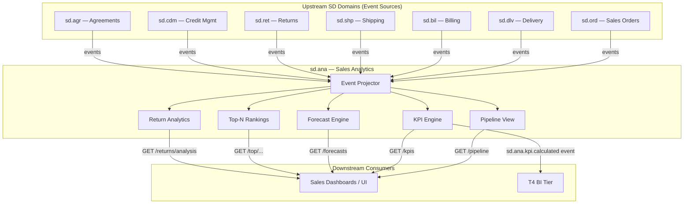
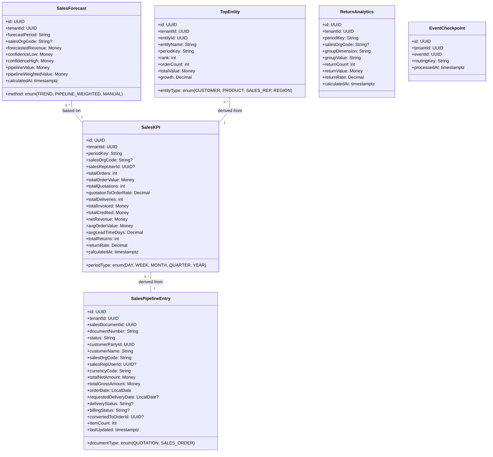
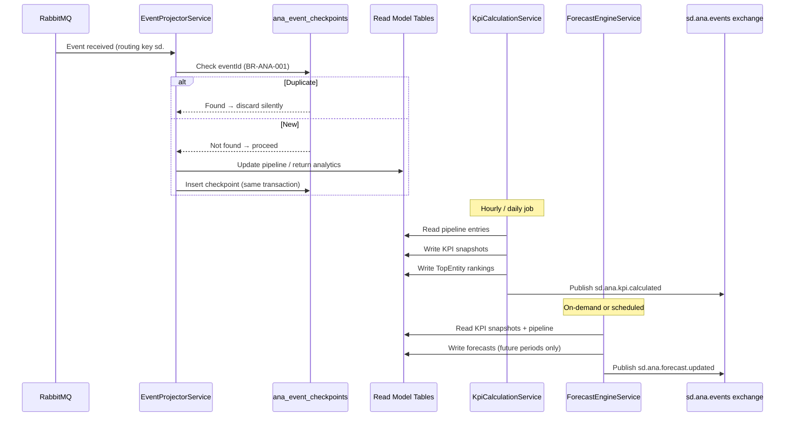
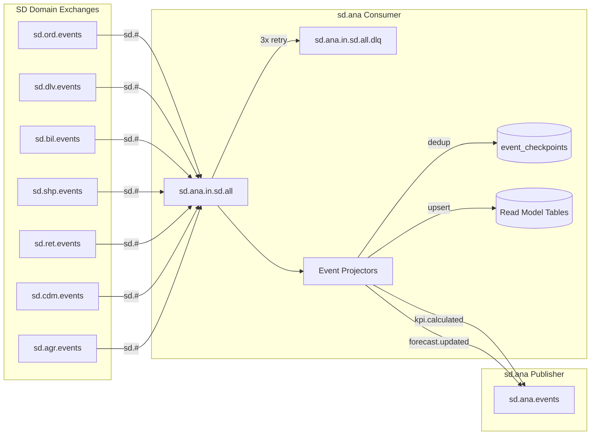
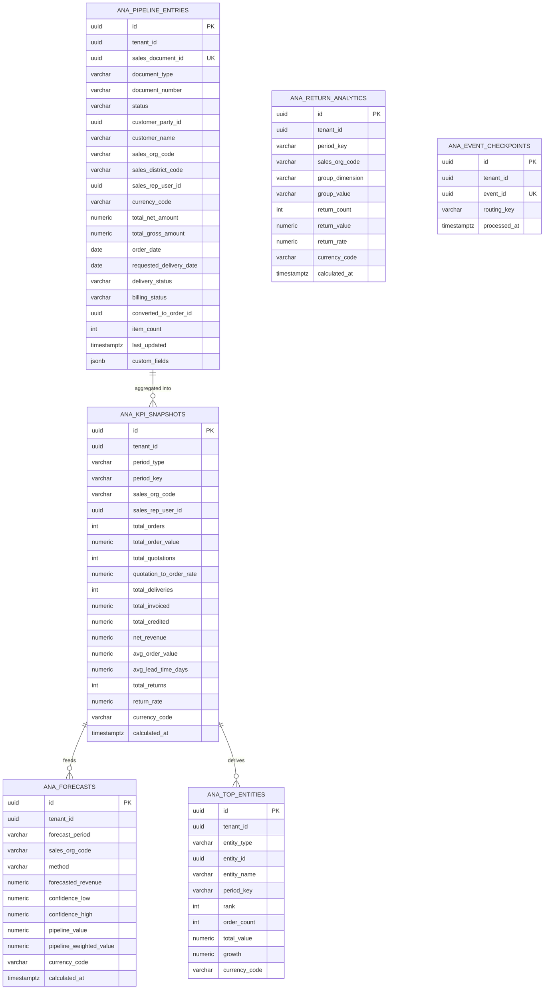

# SD.ANA - Sales Analytics Domain / Service Specification

> **Conceptual Stack Layer:** Domain / Service
> **Space:** Platform
> **Owner:** Domain Engineering Team
> **Schema alignment:** `service-layer.schema.json`
> **Companion files:** `openapi.yaml`, `*.schema.json` (event contracts)
> **Referenced by:** Platform-Feature Spec SS5 (backend dependencies), BFF Contract
> **Belongs to:** SD Suite Spec (`_sd_suite.md`)

> **Meta Information**
> - **Version:** 2026-04-03
> - **Template:** `domain-service-spec.md` v1.0.0
> - **Template Compliance:** ~95% — §11.2 feature IDs pending feature spec authoring
> - **Author(s):** OpenLeap Architecture Team
> - **Status:** DRAFT
> - **Suite:** `sd`
> - **Domain:** `ana`
> - **Bounded Context Ref:** `bc:sales-analytics`
> - **Service ID:** `sd-ana-svc`
> - **basePackage:** `io.openleap.sd.ana`
> - **API Base Path:** `/api/sd/ana/v1`
> - **OpenLeap Starter Version:** TBD
> - **Port:** TBD
> - **Repository:** TBD
> - **Tags:** `analytics`, `pipeline`, `kpi`, `forecast`, `read-model`
> - **Team:**
>   - Name: `team-sd`
>   - Email: `sd-team@openleap.io`
>   - Slack: `#sd-team`

---

## Specification Guidelines Compliance

> ### Non-Negotiables
> - Never invent facts. If required info is missing, add an **OPEN QUESTION** entry.
> - Preserve intent and decisions. Only change meaning when explicitly requested.
> - Do not remove normative constraints unless they are explicitly replaced.
> - Keep the spec **self-contained**: no "see chat", no implicit context.
>
> ### Source of Truth Priority
> When sources conflict:
> 1. Spec (explicit) wins
> 2. Starter specs (implementation constraints) next
> 3. Guidelines (best practices) last
>
> Record conflicts in the **Decisions & Conflicts** section (see Section 14).
>
> ### Style Guide
> - Prefer short sentences and lists.
> - Use MUST/SHOULD/MAY for normative statements.
> - Keep terminology consistent (Aggregate, Domain Service, Application Service, Command, Event).
> - Avoid ambiguous words ("often", "maybe") unless explicitly noting uncertainty.
> - Keep examples minimal and clearly marked as examples.
> - Do not add implementation code unless the chapter explicitly requires it.

---

## 0. Document Purpose & Scope

### 0.1 Purpose
This specification defines the Sales Analytics domain (`sd.ana`), which provides operational sales reporting, pipeline visibility, forecasting, and KPI tracking for the SD suite. It consumes events from all SD transactional domains and materializes denormalized read models optimized for analytical queries and dashboard consumption.

### 0.2 Target Audience
- Product Owners & Business Stakeholders
- System Architects & Technical Leads
- Integration Engineers

### 0.3 Scope
**In Scope:**
- Sales pipeline tracking (quotations → orders → deliveries → invoices)
- Revenue analytics (booked, invoiced, collected)
- Conversion rate analysis (quotation-to-order, order-to-delivery)
- Sales KPI calculation (order volume, average order value, lead time)
- Sales rep / team performance dashboards
- Forecasting (trend-based, pipeline-weighted, manual)
- Top customers, top products, top sales reps, regional analysis
- Period comparisons (MoM, YoY)
- Return rate analysis by reason, product, and customer

**Out of Scope:**
- Strategic BI / data warehouse (T4 Analytics tier)
- Financial reporting (FI / CO suites)
- Customer behavior analytics (future CRM)
- Transactional CRUD (owned by sd.ord, sd.dlv, sd.bil, etc.)
- Real-time streaming dashboards (future roadmap — see Q-ANA-004)

### 0.4 Related Documents
- `_sd_suite.md` — SD Suite overview
- `t4_bi-spec.md` — T4 Analytics / BI tier
- `sd_ord-spec.md` — Sales Order domain (primary event source)
- `sd_dlv-spec.md` — Delivery domain (lead time events)
- `sd_bil-spec.md` — Billing domain (revenue events)
- `sd_shp-spec.md` — Shipping domain (shipping performance events)
- `sd_ret-spec.md` — Returns domain (return rate events)
- `sd_cdm-spec.md` — Credit Decision Management (credit block events)
- `sd_agr-spec.md` — Sales Agreements (agreement fulfillment events)

---

## 1. Business Context

### 1.1 Domain Purpose
`sd.ana` is a **read-model service** that aggregates data from all SD transactional domains into analytical views. It does not own any transactional data — it subscribes to domain events and materializes denormalized projections optimized for reporting and dashboards. All data is derived and rebuildable by replaying the event stream.

### 1.2 Business Value
- Real-time visibility into sales pipeline and performance metrics
- Data-driven sales management through consolidated KPI dashboards
- Accurate revenue forecasting using pipeline weighting and trend analysis
- Identification of trends, risks, and opportunities across time periods
- Pre-aggregated SD metrics feed the T4 BI tier with reduced query overhead
- Role-scoped data access ensures sales reps see personal KPIs while managers see team views

### 1.3 Key Stakeholders

| Role | Responsibility | Primary Use Cases |
|------|----------------|-------------------|
| Sales Manager | Monitor team performance, pipeline health | UC-ANA-001, UC-ANA-002 |
| Sales Director / CRO | Revenue forecasting, strategic overview | UC-ANA-003 |
| Sales Rep | View personal KPIs and targets | UC-ANA-004 |
| Finance Controller | Revenue pipeline visibility for financial planning | UC-ANA-002, UC-ANA-003 (read-only) |

### 1.4 Strategic Positioning
`sd.ana` occupies the **analytics layer** of the SD suite, sitting downstream from all transactional SD domains. It follows the CQRS read-model pattern (ADR-002) and is the authoritative source for operational sales intelligence within T3. It complements — but does not replace — the T4 BI tier, which handles long-term strategic analytics and cross-suite reporting.

Within the SD suite, `sd.ana` is unique: it is the only domain that has no write path from the API. All state changes arrive exclusively through event consumption. This makes it highly scalable and independently deployable — it can be rebuilt from scratch by replaying events.

### 1.5 Service Context

| Property | Value |
|----------|-------|
| **Suite** | `sd` |
| **Domain** | `ana` |
| **Bounded Context** | `bc:sales-analytics` |
| **Service ID** | `sd-ana-svc` |
| **Base Package** | `io.openleap.sd.ana` |

**Responsibilities:**
- Event projection from all SD domains into materialized read models
- Sales pipeline materialized view (one entry per active sales document)
- KPI aggregation (periodic: hourly incremental, daily full recalculation)
- Revenue forecasting using trend and pipeline-weighted methods
- Top-N entity rankings per period
- Return rate computation and reason analysis

**Authoritative Sources:**

| Source Type | Description | Access Pattern |
|-------------|-------------|----------------|
| Events (consumed) | All SD domain events (sd.ord, sd.dlv, sd.bil, sd.shp, sd.ret, sd.cdm, sd.agr) | Asynchronous |
| REST API | Read-only analytical views (pipeline, KPIs, forecasts, rankings) | Synchronous |
| Database | Owned materialized views and KPI snapshots | Direct (owner) |



---

## 2. Service Identity

| Property | Value | Schema Field |
|----------|-------|-------------|
| **Service ID** | `sd-ana-svc` | `metadata.id` |
| **Display Name** | Sales Analytics | `metadata.name` |
| **Suite** | `sd` | `metadata.suite` |
| **Domain** | `ana` | `metadata.domain` |
| **Bounded Context** | `bc:sales-analytics` | `metadata.bounded_context_ref` |
| **Version** | `1.1.0` | `metadata.version` |
| **Status** | DRAFT | `metadata.status` |
| **API Base Path** | `/api/sd/ana/v1` | `metadata.api_base_path` |
| **Repository** | TBD | `metadata.repository` |
| **Tags** | `analytics`, `pipeline`, `kpi`, `forecast`, `read-model` | `metadata.tags` |

**Team:**

| Property | Value |
|----------|-------|
| **Name** | `team-sd` |
| **Email** | `sd-team@openleap.io` |
| **Slack Channel** | `#sd-team` |

---

## 3. Domain Model

### 3.1 Conceptual Overview
`sd.ana` does not maintain traditional DDD aggregates with write paths. Instead, it maintains **materialized read models** (projections) built from events. Each read model is a denormalized snapshot of business state optimized for a specific query pattern. All read model data is derived and rebuildable by replaying the full SD event stream.

The domain's internal architecture uses the Event Projector pattern: events arrive, are deduplicated (BR-ANA-001), and update one or more read model tables in a single transaction. Read models are never modified via REST API — they are exclusively owned by the projection layer.

### 3.2 Core Concepts



### 3.3 Read Model Definitions

> **Note:** The entities in this section are **materialized read models**, not traditional DDD aggregates. They have no aggregate root write path from the API. All mutations are driven exclusively by event projections.

#### 3.3.1 SalesPipelineEntry

| Property | Value |
|----------|-------|
| **Read Model ID** | `rm:sales-pipeline-entry` |
| **Name** | `SalesPipelineEntry` |

**Business Purpose:** Denormalized snapshot of every active sales document (quotation or sales order) in the pipeline. Updated in near-real-time as SD events arrive. Optimized for filtered, paginated pipeline queries by stage, sales org, rep, and date range.

##### Attributes

| Attribute | Type | Format | Description | Constraints | Required | Read-Only |
|-----------|------|--------|-------------|-------------|----------|-----------|
| id | string | uuid | Surrogate read-model row identifier | Immutable | Yes | Yes |
| tenantId | string | uuid | Tenant owning this record | Immutable | Yes | Yes |
| salesDocumentId | string | uuid | ID of the originating sales document in sd.ord | Immutable, business key | Yes | Yes |
| documentType | string | — | Type of sales document | enum_ref: `DocumentType` | Yes | Yes |
| documentNumber | string | — | Human-readable document number (e.g. SO-2026-00042) | max_length: 40 | Yes | No |
| status | string | — | Current pipeline stage of the document | max_length: 30 | Yes | No |
| customerPartyId | string | uuid | ID of the customer business partner | — | Yes | No |
| customerName | string | — | Denormalized customer display name | max_length: 120 | Yes | No |
| salesOrgCode | string | — | Sales organisation code | max_length: 10 | Yes | No |
| salesDistrictCode | string | — | Sales district for regional analysis | max_length: 10 | No | No |
| salesRepUserId | string | uuid | ID of the responsible sales representative | — | No | No |
| currencyCode | string | — | ISO 4217 currency code | pattern: `^[A-Z]{3}$` | Yes | No |
| totalNetAmount | number | decimal | Net sales value (excl. tax) | minimum: 0, precision: 2 | Yes | No |
| totalGrossAmount | number | decimal | Gross sales value (incl. tax) | minimum: 0, precision: 2 | Yes | No |
| orderDate | string | date | Date the document was created or confirmed | — | Yes | No |
| requestedDeliveryDate | string | date | Customer-requested delivery date | — | No | No |
| deliveryStatus | string | — | Current delivery fulfilment status | max_length: 30 | No | No |
| billingStatus | string | — | Current billing status | max_length: 30 | No | No |
| convertedToOrderId | string | uuid | If quotation: ID of the resulting sales order | — | No | No |
| itemCount | integer | int32 | Number of line items on the document | minimum: 1 | Yes | No |
| lastUpdated | string | date-time | Timestamp of last projection update | — | Yes | Yes |

**Domain Events That Update This Read Model:**
- `sd.ord.salesdocument.*` — creates / updates pipeline entry
- `sd.ord.salesorder.*` — updates status, amounts
- `sd.ord.quotation.*` — updates conversion status
- `sd.dlv.delivery.*` — updates deliveryStatus
- `sd.bil.invoice.*` — updates billingStatus

---

#### 3.3.2 SalesKPI

| Property | Value |
|----------|-------|
| **Read Model ID** | `rm:sales-kpi` |
| **Name** | `SalesKPI` |

**Business Purpose:** Pre-aggregated KPI snapshot per time period and dimension (sales org, sales rep). Calculated periodically (hourly incremental, daily full). Used for dashboard widgets, period comparisons, and trend analysis. Equivalent to SAP SD-IS (Sales Information System) aggregated statistics.

##### Attributes

| Attribute | Type | Format | Description | Constraints | Required | Read-Only |
|-----------|------|--------|-------------|-------------|----------|-----------|
| id | string | uuid | Surrogate row identifier | Immutable | Yes | Yes |
| tenantId | string | uuid | Tenant owning this record | Immutable | Yes | Yes |
| periodType | string | — | Granularity of the KPI period | enum_ref: `PeriodType` | Yes | Yes |
| periodKey | string | — | Period identifier (e.g. `2026-02`, `2026-Q1`, `2026`) | max_length: 20 | Yes | Yes |
| salesOrgCode | string | — | Sales org dimension; null = all orgs | max_length: 10 | No | Yes |
| salesRepUserId | string | uuid | Sales rep dimension; null = all reps | — | No | Yes |
| totalOrders | integer | int32 | Confirmed orders in period | minimum: 0 | Yes | No |
| totalOrderValue | number | decimal | Total net order value in period | minimum: 0, precision: 2 | Yes | No |
| totalQuotations | integer | int32 | Quotations created in period | minimum: 0 | Yes | No |
| quotationToOrderRate | number | decimal | Conversion rate (quotations → orders) | minimum: 0, maximum: 1, precision: 4 | Yes | No |
| totalDeliveries | integer | int32 | Completed deliveries in period | minimum: 0 | Yes | No |
| totalInvoiced | number | decimal | Total invoiced revenue in period | minimum: 0, precision: 2 | Yes | No |
| totalCredited | number | decimal | Total credit memo value in period | minimum: 0, precision: 2 | Yes | No |
| netRevenue | number | decimal | totalInvoiced minus totalCredited | precision: 2 | Yes | No |
| avgOrderValue | number | decimal | Average net value per order | minimum: 0, precision: 2 | Yes | No |
| avgLeadTimeDays | number | decimal | Average days from order to delivery | minimum: 0, precision: 1 | Yes | No |
| totalReturns | integer | int32 | Return orders in period | minimum: 0 | Yes | No |
| returnRate | number | decimal | Returns as fraction of deliveries | minimum: 0, maximum: 1, precision: 4 | Yes | No |
| calculatedAt | string | date-time | Timestamp of last KPI calculation | — | Yes | Yes |

---

#### 3.3.3 SalesForecast

| Property | Value |
|----------|-------|
| **Read Model ID** | `rm:sales-forecast` |
| **Name** | `SalesForecast` |

**Business Purpose:** Revenue forecast per period and sales org. Produced by the forecast engine using configurable methods (trend extrapolation, pipeline-weighted probability, or manual override). Analogous to SAP SD Flexible Planning and LIS forecast functionality.

##### Attributes

| Attribute | Type | Format | Description | Constraints | Required | Read-Only |
|-----------|------|--------|-------------|-------------|----------|-----------|
| id | string | uuid | Surrogate row identifier | Immutable | Yes | Yes |
| tenantId | string | uuid | Tenant owning this record | Immutable | Yes | Yes |
| forecastPeriod | string | — | Target period for the forecast (e.g. `2026-Q2`) | max_length: 20 | Yes | Yes |
| salesOrgCode | string | — | Sales org scope; null = all orgs | max_length: 10 | No | Yes |
| method | string | — | Forecast calculation method | enum_ref: `ForecastMethod` | Yes | No |
| forecastedRevenue | number | decimal | Point estimate of expected revenue | minimum: 0, precision: 2 | Yes | No |
| confidenceLow | number | decimal | Lower confidence bound (P10) | minimum: 0, precision: 2 | Yes | No |
| confidenceHigh | number | decimal | Upper confidence bound (P90) | minimum: 0, precision: 2 | Yes | No |
| pipelineValue | number | decimal | Total open pipeline value feeding this forecast | minimum: 0, precision: 2 | Yes | No |
| pipelineWeightedValue | number | decimal | Pipeline value weighted by stage probability | minimum: 0, precision: 2 | Yes | No |
| calculatedAt | string | date-time | Timestamp of forecast calculation | — | Yes | Yes |

---

#### 3.3.4 TopEntity

| Property | Value |
|----------|-------|
| **Read Model ID** | `rm:top-entity` |
| **Name** | `TopEntity` |

**Business Purpose:** Materialized top-N ranking of customers, products, sales reps, and regions by order value within a period. Recalculated on each KPI cycle. Used for leaderboard and winner/loser analysis in sales dashboards.

##### Attributes

| Attribute | Type | Format | Description | Constraints | Required | Read-Only |
|-----------|------|--------|-------------|-------------|----------|-----------|
| id | string | uuid | Surrogate row identifier | Immutable | Yes | Yes |
| tenantId | string | uuid | Tenant owning this record | Immutable | Yes | Yes |
| entityType | string | — | Dimension being ranked | enum_ref: `EntityType` | Yes | Yes |
| entityId | string | uuid | ID of the ranked entity | — | Yes | Yes |
| entityName | string | — | Denormalized display name of the entity | max_length: 120 | Yes | No |
| periodKey | string | — | Period the ranking applies to | max_length: 20 | Yes | Yes |
| rank | integer | int32 | Position in the ranking (1 = highest) | minimum: 1 | Yes | No |
| orderCount | integer | int32 | Number of orders in period | minimum: 0 | Yes | No |
| totalValue | number | decimal | Total net order value in period | minimum: 0, precision: 2 | Yes | No |
| growth | number | decimal | Growth rate vs. prior period (e.g. 0.15 = +15%) | precision: 4 | Yes | No |

---

#### 3.3.5 ReturnAnalytics

| Property | Value |
|----------|-------|
| **Read Model ID** | `rm:return-analytics` |
| **Name** | `ReturnAnalytics` |

**Business Purpose:** Pre-aggregated return rate analysis sliced by period, sales org, and a configurable group dimension (reason code, product, or customer). Used for quality and customer satisfaction dashboards.

##### Attributes

| Attribute | Type | Format | Description | Constraints | Required | Read-Only |
|-----------|------|--------|-------------|-------------|----------|-----------|
| id | string | uuid | Surrogate row identifier | Immutable | Yes | Yes |
| tenantId | string | uuid | Tenant owning this record | Immutable | Yes | Yes |
| periodKey | string | — | Period the analysis covers | max_length: 20 | Yes | Yes |
| salesOrgCode | string | — | Sales org scope; null = all orgs | max_length: 10 | No | Yes |
| groupDimension | string | — | Grouping dimension | enum_ref: `ReturnGroupDimension` | Yes | Yes |
| groupValue | string | — | Value of the grouping dimension | max_length: 120 | Yes | Yes |
| returnCount | integer | int32 | Number of return orders in group | minimum: 0 | Yes | No |
| returnValue | number | decimal | Total returned value (net) | minimum: 0, precision: 2 | Yes | No |
| returnRate | number | decimal | Returns as fraction of sales in group | minimum: 0, maximum: 1, precision: 4 | Yes | No |
| calculatedAt | string | date-time | Timestamp of calculation | — | Yes | Yes |

---

#### 3.3.6 EventCheckpoint

| Property | Value |
|----------|-------|
| **Read Model ID** | `rm:event-checkpoint` |
| **Name** | `EventCheckpoint` |

**Business Purpose:** Idempotency store for processed events. Prevents duplicate projection updates when the same event is redelivered (per ADR-014 at-least-once delivery). Checked at the start of every event handler. Entries older than 30 days MAY be purged.

##### Attributes

| Attribute | Type | Format | Description | Constraints | Required | Read-Only |
|-----------|------|--------|-------------|-------------|----------|-----------|
| id | string | uuid | Surrogate row identifier | Immutable | Yes | Yes |
| tenantId | string | uuid | Tenant context | Immutable | Yes | Yes |
| eventId | string | uuid | Unique event ID from the event envelope | Unique per tenant | Yes | Yes |
| routingKey | string | — | Routing key of the processed event | max_length: 120 | Yes | Yes |
| processedAt | string | date-time | When the event was processed | — | Yes | Yes |

---

### 3.4 Enumerations

#### Enumeration: DocumentType

| Value | Description | Deprecated |
|-------|-------------|------------|
| `QUOTATION` | Customer quotation — not yet a firm order | No |
| `SALES_ORDER` | Confirmed sales order | No |

#### Enumeration: PeriodType

| Value | Description | Deprecated |
|-------|-------------|------------|
| `DAY` | Daily period (e.g. `2026-02-14`) | No |
| `WEEK` | ISO week period (e.g. `2026-W07`) | No |
| `MONTH` | Calendar month (e.g. `2026-02`) | No |
| `QUARTER` | Calendar quarter (e.g. `2026-Q1`) | No |
| `YEAR` | Calendar year (e.g. `2026`) | No |

#### Enumeration: ForecastMethod

| Value | Description | Deprecated |
|-------|-------------|------------|
| `TREND` | Linear trend extrapolation based on historical KPI time series | No |
| `PIPELINE_WEIGHTED` | Sum of (pipeline value × stage probability) for open documents | No |
| `MANUAL` | Manually entered forecast override by a sales director | No |

#### Enumeration: EntityType

| Value | Description | Deprecated |
|-------|-------------|------------|
| `CUSTOMER` | Ranking by customer business partner | No |
| `PRODUCT` | Ranking by product / material | No |
| `SALES_REP` | Ranking by sales representative user | No |
| `REGION` | Ranking by sales district / region code | No |

#### Enumeration: ReturnGroupDimension

| Value | Description | Deprecated |
|-------|-------------|------------|
| `REASON` | Grouped by return reason code | No |
| `PRODUCT` | Grouped by returned product / material | No |
| `CUSTOMER` | Grouped by returning customer | No |

### 3.5 Shared Types

#### Shared Type: Money

| Attribute | Type | Format | Description | Constraints | Required |
|-----------|------|--------|-------------|-------------|----------|
| amount | number | decimal | Monetary value | precision: 2 | Yes |
| currencyCode | string | — | ISO 4217 currency code | pattern: `^[A-Z]{3}$` | Yes |

**Validation Rules:**
- `amount` MUST be non-negative for revenue figures; MAY be zero for periods with no activity.
- `currencyCode` MUST be a valid ISO 4217 code.
- All monetary comparisons (e.g. totals, averages) MUST be performed within the same currency. Cross-currency aggregation requires normalization.

> OPEN QUESTION: See Q-ANA-005 in §14.3 — cross-currency KPI normalization strategy.

**Used By:** SalesPipelineEntry (totalNetAmount, totalGrossAmount), SalesKPI (totalOrderValue, totalInvoiced, totalCredited, netRevenue, avgOrderValue), SalesForecast (all monetary fields), TopEntity (totalValue), ReturnAnalytics (returnValue).

---

## 4. Business Rules & Constraints

### 4.1 Business Rules Catalog

`sd.ana` has no transactional business rules over writable aggregates. It enforces data consistency and access control rules over its read models:

| ID | Rule Name | Description | Scope | Enforcement |
|----|-----------|-------------|-------|-------------|
| BR-ANA-001 | Idempotent Projection | Events MUST be processed idempotently, deduplicated by `eventId` | All event handlers | EventCheckpoint lookup before processing |
| BR-ANA-002 | Tenant Isolation | All queries MUST be scoped to the authenticated tenant | All read models | Row-level security via `tenant_id` |
| BR-ANA-003 | Data Scoping | Sales reps see only own data; managers see team; directors see all | Pipeline, KPIs, Rankings | API authorization layer |
| BR-ANA-004 | Currency Consistency | KPI aggregations MUST only combine values in the same currency | SalesKPI, Forecast | KPI calculation logic |
| BR-ANA-005 | Forecast Period Validity | Forecast period MUST be a future or current period | SalesForecast | Forecast engine validation |

### 4.2 Detailed Rule Definitions

#### BR-ANA-001: Idempotent Projection

**Business Context:** The message broker delivers events at-least-once (ADR-014). An event may be redelivered after a transient failure. Without deduplication, the same business event would update the read model twice, corrupting KPIs.

**Rule Statement:** Before processing any incoming event, the projection handler MUST check `ana_event_checkpoints` for a record with the same `(tenant_id, event_id)`. If found, the event MUST be discarded as a duplicate without any read-model update.

**Applies To:**
- All event handlers in the `sd.ana` projection layer
- Operations: All

**Enforcement:** Application service checks EventCheckpoint table before invoking projector. Checkpoint insert and read-model update occur in the same database transaction.

**Validation Logic:** Query `SELECT 1 FROM ana_event_checkpoints WHERE tenant_id = ? AND event_id = ?`. If result exists → discard. Else → process and insert checkpoint.

**Error Handling:**
- **Error Code:** n/a (silent discard — log at DEBUG level)
- **User action:** No user action required; this is a system-level safeguard.

**Examples:**
- **Valid (first delivery):** `event_id=abc123` not in checkpoint table → process and insert checkpoint.
- **Valid (duplicate):** `event_id=abc123` already in checkpoint table → discard silently.

---

#### BR-ANA-002: Tenant Isolation

**Business Context:** sd.ana is a multi-tenant service. Analytics data from one tenant MUST never be visible to another tenant.

**Rule Statement:** All database queries and event projections MUST include `WHERE tenant_id = ?` or be enforced via PostgreSQL RLS policy. API responses MUST never include data from a different tenant than the authenticated user's tenant.

**Applies To:**
- All read models
- Operations: All queries, all event projections

**Enforcement:** PostgreSQL RLS policy on all `ana_*` tables. Application service extracts `tenantId` from the security context on every request.

**Validation Logic:** RLS policy: `USING (tenant_id = current_setting('app.tenant_id')::uuid)`.

**Error Handling:**
- **Error Code:** `ANA-403`
- **Error Message:** "Access denied: cross-tenant data access is not permitted."
- **User action:** Verify authentication token is valid and associated with the correct tenant.

---

#### BR-ANA-003: Data Scoping

**Business Context:** Hierarchical sales organisations require role-based data visibility. Sales reps should not see colleagues' personal KPIs; managers should see their teams.

**Rule Statement:** The `salesRepUserId` filter MUST be enforced at the API layer:
- Role `ANA_SALES_REP`: queries MUST be scoped to `salesRepUserId = currentUser.id`.
- Role `ANA_SALES_MGR`: queries MUST be scoped to reps within the manager's sales org.
- Role `ANA_DIRECTOR` or `ANA_ADMIN`: no additional filter applied.

**Applies To:**
- SalesPipelineEntry, SalesKPI
- Operations: All READ queries

**Enforcement:** Application service applies scoping filter based on JWT claims before executing query.

**Validation Logic:** Extract `roles` and `salesOrgCode` from JWT; inject appropriate WHERE clause.

**Error Handling:**
- **Error Code:** `ANA-403-SCOPE`
- **Error Message:** "Access denied: you do not have permission to view data for the requested scope."
- **User action:** Request data only within your authorised scope.

---

#### BR-ANA-004: Currency Consistency

**Business Context:** The SD suite supports multi-currency operations. Summing amounts in different currencies produces meaningless totals.

**Rule Statement:** KPI calculations that aggregate `totalOrderValue`, `totalInvoiced`, `netRevenue`, or similar monetary fields MUST only aggregate records with the same `currencyCode`. Cross-currency summation MUST NOT occur without explicit normalization.

**Applies To:**
- SalesKPI calculation engine
- Operations: KPI recalculation

**Enforcement:** KPI engine groups by `currency_code` within aggregation queries.

> OPEN QUESTION: See Q-ANA-005 in §14.3 — whether cross-currency normalization to a reporting currency is required.

---

#### BR-ANA-005: Forecast Period Validity

**Business Context:** Forecasts for past periods have no planning value and would mislead users.

**Rule Statement:** When the forecast engine runs, it MUST only create or update forecasts for the current and future periods. Past-period forecasts MUST NOT be overwritten by recalculation (they become historical actuals).

**Applies To:**
- SalesForecast
- Operations: Forecast recalculation (UC-ANA-006)

**Enforcement:** Forecast engine filters target periods to `periodKey >= currentPeriod`.

**Error Handling:**
- **Error Code:** `ANA-422-PERIOD`
- **Error Message:** "Forecast period '{period}' is in the past and cannot be recalculated."
- **User action:** Select a current or future period.

### 4.3 Data Validation Rules

**Field-Level Validations:**

| Field | Validation Rule | Error Message |
|-------|----------------|---------------|
| currencyCode | Must match `^[A-Z]{3}$` | "Invalid currency code format. Use ISO 4217 (e.g. EUR, USD)." |
| periodKey (MONTH) | Must match `^\d{4}-\d{2}$` | "Invalid month period key. Use YYYY-MM format." |
| periodKey (QUARTER) | Must match `^\d{4}-Q[1-4]$` | "Invalid quarter period key. Use YYYY-Q[1-4] format." |
| periodKey (YEAR) | Must match `^\d{4}$` | "Invalid year period key. Use YYYY format." |
| periodKey (WEEK) | Must match `^\d{4}-W\d{2}$` | "Invalid week period key. Use YYYY-Www format." |
| salesOrgCode | max_length: 10 | "Sales org code must not exceed 10 characters." |
| rank | minimum: 1 | "Rank must be a positive integer." |
| growth | No structural constraint; negative values allowed (decline) | — |

**Cross-Field Validations:**
- `confidenceLow` MUST be ≤ `forecastedRevenue` ≤ `confidenceHigh`.
- `pipelineWeightedValue` MUST be ≤ `pipelineValue`.
- `quotationToOrderRate` = `totalOrders / totalQuotations` when `totalQuotations > 0`; else 0.

### 4.4 Reference Data Dependencies

| Catalog | Source Service | Fields Referencing | Validation |
|---------|----------------|-------------------|------------|
| Currency codes | `ref.currency-svc` | `currencyCode` on all monetary read models | Must be active ISO 4217 code |
| Sales org codes | `iam.org-svc` or `sd.ord` master | `salesOrgCode` | Must be a known sales org within the tenant |
| Sales district codes | `ref.region-svc` | `salesDistrictCode` | Must be a known region; optional |

---

## 5. Use Cases

### 5.1 Business Logic Placement

| Logic Type | Placement | Examples |
|------------|-----------|----------|
| Event deduplication | Application Service (EventProjectorService) | BR-ANA-001 EventCheckpoint check |
| Read model update | Application Service (ProjectorService) | Pipeline entry update on order event |
| KPI aggregation | Application Service (KpiCalculationService) | Periodic SQL aggregation queries |
| Forecast computation | Application Service (ForecastEngineService) | Trend extrapolation, pipeline weighting |
| Access scoping | Application Service (QueryService) | BR-ANA-003 filter injection |
| Tenant isolation | Database (RLS) + Application Service | BR-ANA-002 |

### 5.2 Use Cases

#### UC-ANA-001: View Sales Pipeline

| Field | Value |
|-------|-------|
| **id** | `ViewSalesPipeline` |
| **type** | READ |
| **trigger** | REST |
| **domainOperation** | `getPipeline` |
| **inputs** | `salesOrg: String?`, `rep: UUID?`, `status: String?`, `from: LocalDate?`, `to: LocalDate?`, `page: int`, `size: int`, `sort: String?` |
| **outputs** | `SalesPipelineEntry[]` (paginated) |
| **rest** | `GET /api/sd/ana/v1/pipeline` |

**Actor:** Sales Manager, Sales Rep (scoped to own data per BR-ANA-003)

**Preconditions:**
- User is authenticated with role `ANA_SALES_REP`, `ANA_SALES_MGR`, `ANA_DIRECTOR`, or `ANA_ADMIN`.
- At least one SD domain event has been projected.

**Main Flow:**
1. Actor sends `GET /pipeline` with optional filter parameters.
2. Application service extracts `tenantId` and user role from JWT.
3. Application service applies data scoping filter per BR-ANA-003.
4. Service executes paginated query against `ana_pipeline_entries`.
5. Service returns paginated result with `_meta` envelope.

**Postconditions:**
- Pipeline entries matching the filter criteria are returned, scoped to the actor's authorised data.

**Business Rules Applied:**
- BR-ANA-002: Tenant isolation
- BR-ANA-003: Data scoping by role

**Alternative Flows:**
- **Alt-1:** No filter parameters → returns full pipeline for the actor's scope.
- **Alt-2:** `status=OPEN` → returns only open quotations and orders.

**Exception Flows:**
- **Exc-1:** Actor has `ANA_SALES_REP` role but requests `rep=<other-user-id>` → `403 Forbidden`.
- **Exc-2:** No pipeline entries exist for tenant → empty page (200 OK, empty array).

---

#### UC-ANA-002: Sales Performance Dashboard

| Field | Value |
|-------|-------|
| **id** | `SalesPerformanceDashboard` |
| **type** | READ |
| **trigger** | REST |
| **domainOperation** | `getKPIs` |
| **inputs** | `period: String`, `salesOrg: String?`, `rep: UUID?` |
| **outputs** | `SalesKPI[]` |
| **rest** | `GET /api/sd/ana/v1/kpis` |

**Actor:** Sales Manager, Sales Director, Finance Controller

**Preconditions:**
- User authenticated with `ANA_SALES_MGR`, `ANA_DIRECTOR`, or `ANA_ADMIN` role.
- KPI snapshot for the requested period has been calculated.

**Main Flow:**
1. Actor requests KPIs for a specific period (e.g. `period=MONTH&from=2026-01&to=2026-03`).
2. Application service validates period key format per §4.3.
3. Application service applies data scoping per BR-ANA-003.
4. Service queries `ana_kpi_snapshots` for matching period/dimension rows.
5. Service returns KPI time series array.

**Postconditions:**
- KPI snapshots for the requested periods are returned.

**Business Rules Applied:**
- BR-ANA-002, BR-ANA-003, BR-ANA-004

**Alternative Flows:**
- **Alt-1:** Period not yet calculated → returns 204 No Content or empty array.

**Exception Flows:**
- **Exc-1:** Invalid period key format → `400 Bad Request`.

---

#### UC-ANA-003: Revenue Forecast

| Field | Value |
|-------|-------|
| **id** | `RevenueForecast` |
| **type** | READ |
| **trigger** | REST |
| **domainOperation** | `getForecasts` |
| **inputs** | `salesOrg: String?`, `period: String?`, `method: String?` |
| **outputs** | `SalesForecast[]` |
| **rest** | `GET /api/sd/ana/v1/forecasts` |

**Actor:** Sales Director, Finance Controller

**Preconditions:**
- User authenticated with `ANA_DIRECTOR` or `ANA_ADMIN` role.
- At least one forecast has been calculated.

**Main Flow:**
1. Actor requests forecasts for a target period and optional method filter.
2. Service queries `ana_forecasts` for matching rows.
3. Service returns forecast array with confidence bounds.

**Postconditions:**
- Forecast records for the requested criteria are returned.

**Business Rules Applied:**
- BR-ANA-002, BR-ANA-005

---

#### UC-ANA-004: Personal KPIs

| Field | Value |
|-------|-------|
| **id** | `PersonalKPIs` |
| **type** | READ |
| **trigger** | REST |
| **domainOperation** | `getPersonalKPIs` |
| **inputs** | `repUserId: UUID` (from JWT — not from query string) |
| **outputs** | `SalesKPI` (current period) |
| **rest** | `GET /api/sd/ana/v1/kpis/current` |

**Actor:** Sales Rep

**Preconditions:**
- User authenticated with any ANA role.
- Current-period KPI snapshot has been calculated for this rep.

**Main Flow:**
1. Actor requests their current-period KPIs.
2. Service extracts `repUserId` from JWT (never from query param — security constraint).
3. Service queries `ana_kpi_snapshots` where `sales_rep_user_id = repUserId` AND period = current.
4. Service returns single KPI record.

**Postconditions:**
- Current-period personal KPI returned.

**Business Rules Applied:**
- BR-ANA-002, BR-ANA-003 (rep cannot request another rep's KPI via this endpoint)

---

#### UC-ANA-005: Return Rate Analysis

| Field | Value |
|-------|-------|
| **id** | `ReturnRateAnalysis` |
| **type** | READ |
| **trigger** | REST |
| **domainOperation** | `getReturnAnalysis` |
| **inputs** | `period: String?`, `groupBy: enum(REASON, PRODUCT, CUSTOMER)`, `salesOrg: String?` |
| **outputs** | `ReturnAnalytics[]` |
| **rest** | `GET /api/sd/ana/v1/returns/analysis` |

**Actor:** Sales Manager, Sales Director

**Preconditions:**
- User authenticated with `ANA_SALES_MGR`, `ANA_DIRECTOR`, or `ANA_ADMIN`.
- Return analytics have been calculated for the requested period.

**Main Flow:**
1. Actor requests return analysis grouped by a specific dimension.
2. Service validates `groupBy` is a valid `ReturnGroupDimension` value.
3. Service queries `ana_return_analytics` for matching dimension/period rows.
4. Service returns breakdown sorted by `returnRate` descending.

**Business Rules Applied:**
- BR-ANA-002, BR-ANA-003

---

#### UC-ANA-006: Trigger Forecast Recalculation

| Field | Value |
|-------|-------|
| **id** | `TriggerForecastRecalculation` |
| **type** | WRITE (system command) |
| **trigger** | REST |
| **domainOperation** | `recalculateForecasts` |
| **inputs** | `salesOrg: String?`, `period: String?` |
| **outputs** | `202 Accepted` (async) |
| **rest** | `POST /api/sd/ana/v1/forecasts:recalculate` |

**Actor:** Sales Director, ANA_ADMIN

**Preconditions:**
- User authenticated with `ANA_DIRECTOR` or `ANA_ADMIN` role.
- Sufficient pipeline and KPI data exists to produce a meaningful forecast.

**Main Flow:**
1. Actor triggers forecast recalculation (e.g. after a major pipeline update).
2. Application service validates the target period is current or future (BR-ANA-005).
3. Service enqueues the recalculation job.
4. Service returns `202 Accepted` immediately.
5. Forecast engine runs asynchronously, updating `ana_forecasts`.
6. On completion, publishes `sd.ana.forecast.updated` event.

**Postconditions:**
- Forecast records for the target period are updated asynchronously.
- `sd.ana.forecast.updated` event is published.

**Business Rules Applied:**
- BR-ANA-002, BR-ANA-005

**Exception Flows:**
- **Exc-1:** Target period is in the past → `422 Unprocessable Entity`.

### 5.3 Process Flow Diagrams



### 5.4 Cross-Domain Workflows

**Pattern:** Choreography — sd.ana subscribes to events from all SD domains without coordinating with them. There are no saga orchestrations initiated by sd.ana.

**Participating Services:**

| Service | Role | Event Direction |
|---------|------|----------------|
| sd.ord | Source | Publishes order/quotation events → consumed by sd.ana |
| sd.dlv | Source | Publishes delivery events → consumed by sd.ana |
| sd.bil | Source | Publishes invoice/credit memo events → consumed by sd.ana |
| sd.shp | Source | Publishes shipment events → consumed by sd.ana |
| sd.ret | Source | Publishes return order events → consumed by sd.ana |
| sd.cdm | Source | Publishes credit check events → consumed by sd.ana |
| sd.agr | Source | Publishes agreement events → consumed by sd.ana |
| T4 BI | Downstream | Consumes `sd.ana.kpi.calculated` events |

**Business Implication:** sd.ana is eventually consistent with all SD domains. The typical lag is under 30 seconds for pipeline entries. KPI snapshots may lag by up to 1 hour (hourly recalculation cycle).

---

## 6. REST API

### 6.1 API Overview
**Base Path:** `/api/sd/ana/v1`

All endpoints are **read-only** (`GET`) except for the forecast recalculation command (`POST`). No create/update/delete operations — all state is driven by events. All responses follow the `_meta` envelope convention.

### 6.2 Resource Operations

#### 6.2.1 Pipeline — List

```http
GET /api/sd/ana/v1/pipeline?salesOrg=ORG01&rep=<uuid>&status=OPEN&from=2026-01-01&to=2026-03-31&page=0&size=50&sort=orderDate,desc
Authorization: Bearer {token}
```

**Success Response:** `200 OK`
```json
{
  "content": [
    {
      "id": "550e8400-e29b-41d4-a716-446655440000",
      "salesDocumentId": "6ba7b810-9dad-11d1-80b4-00c04fd430c8",
      "documentType": "SALES_ORDER",
      "documentNumber": "SO-2026-00042",
      "status": "OPEN",
      "customerPartyId": "7ba7b810-9dad-11d1-80b4-00c04fd430c8",
      "customerName": "Acme Corporation",
      "salesOrgCode": "ORG01",
      "salesRepUserId": "8ba7b810-9dad-11d1-80b4-00c04fd430c8",
      "currencyCode": "EUR",
      "totalNetAmount": 12500.00,
      "totalGrossAmount": 14875.00,
      "orderDate": "2026-02-14",
      "requestedDeliveryDate": "2026-03-01",
      "deliveryStatus": "PENDING",
      "billingStatus": "NOT_BILLED",
      "itemCount": 3,
      "lastUpdated": "2026-02-14T09:23:45Z"
    }
  ],
  "_meta": {
    "page": 0,
    "size": 50,
    "totalElements": 1,
    "totalPages": 1
  },
  "_links": {
    "self": { "href": "/api/sd/ana/v1/pipeline?page=0&size=50" }
  }
}
```

**Business Rules Checked:** BR-ANA-002, BR-ANA-003

**Error Responses:**
- `400 Bad Request` — Invalid date format or parameter value
- `403 Forbidden` — Scope violation (rep requesting another rep's data)

---

#### 6.2.2 Pipeline — Summary

```http
GET /api/sd/ana/v1/pipeline/summary?salesOrg=ORG01&from=2026-01-01&to=2026-03-31
Authorization: Bearer {token}
```

**Success Response:** `200 OK`
```json
{
  "periodFrom": "2026-01-01",
  "periodTo": "2026-03-31",
  "salesOrgCode": "ORG01",
  "byStatus": [
    { "status": "OPEN", "count": 42, "totalNetAmount": 540000.00, "currencyCode": "EUR" },
    { "status": "CONFIRMED", "count": 18, "totalNetAmount": 280000.00, "currencyCode": "EUR" },
    { "status": "DELIVERED", "count": 11, "totalNetAmount": 180000.00, "currencyCode": "EUR" }
  ],
  "totalOpenValue": 540000.00,
  "currencyCode": "EUR",
  "_links": {
    "self": { "href": "/api/sd/ana/v1/pipeline/summary" }
  }
}
```

---

#### 6.2.3 KPIs — Time Series

```http
GET /api/sd/ana/v1/kpis?period=MONTH&from=2026-01&to=2026-03&salesOrg=ORG01
Authorization: Bearer {token}
```

**Success Response:** `200 OK`
```json
{
  "content": [
    {
      "id": "9ba7b810-9dad-11d1-80b4-00c04fd430c8",
      "periodType": "MONTH",
      "periodKey": "2026-01",
      "salesOrgCode": "ORG01",
      "totalOrders": 128,
      "totalOrderValue": 1240000.00,
      "totalQuotations": 210,
      "quotationToOrderRate": 0.6095,
      "totalDeliveries": 119,
      "totalInvoiced": 1180000.00,
      "totalCredited": 32000.00,
      "netRevenue": 1148000.00,
      "avgOrderValue": 9687.50,
      "avgLeadTimeDays": 4.7,
      "totalReturns": 6,
      "returnRate": 0.0504,
      "currencyCode": "EUR",
      "calculatedAt": "2026-02-01T00:30:00Z"
    }
  ],
  "_meta": { "count": 3 },
  "_links": { "self": { "href": "/api/sd/ana/v1/kpis?period=MONTH&from=2026-01&to=2026-03" } }
}
```

**Business Rules Checked:** BR-ANA-002, BR-ANA-003, BR-ANA-004

**Error Responses:**
- `400 Bad Request` — Invalid period key format

---

#### 6.2.4 KPIs — Current Period (Personal)

```http
GET /api/sd/ana/v1/kpis/current
Authorization: Bearer {token}
```

**Success Response:** `200 OK` — Returns single `SalesKPI` for the authenticated rep's current month.

**Business Rules Checked:** BR-ANA-002, BR-ANA-003 (repUserId extracted from JWT only)

---

#### 6.2.5 KPIs — Period Comparison

```http
GET /api/sd/ana/v1/kpis/comparison?period=MONTH&current=2026-02&previous=2026-01&salesOrg=ORG01
Authorization: Bearer {token}
```

**Success Response:** `200 OK`
```json
{
  "current": { "periodKey": "2026-02", "totalOrders": 134, "netRevenue": 1190000.00 },
  "previous": { "periodKey": "2026-01", "totalOrders": 128, "netRevenue": 1148000.00 },
  "delta": {
    "totalOrders": 6,
    "totalOrdersGrowth": 0.0469,
    "netRevenue": 42000.00,
    "netRevenueGrowth": 0.0366
  },
  "_links": { "self": { "href": "/api/sd/ana/v1/kpis/comparison" } }
}
```

---

#### 6.2.6 Forecasts — List

```http
GET /api/sd/ana/v1/forecasts?salesOrg=ORG01&period=2026-Q2&method=PIPELINE_WEIGHTED
Authorization: Bearer {token}
```

**Success Response:** `200 OK`
```json
{
  "content": [
    {
      "id": "aba7b810-9dad-11d1-80b4-00c04fd430c8",
      "forecastPeriod": "2026-Q2",
      "salesOrgCode": "ORG01",
      "method": "PIPELINE_WEIGHTED",
      "forecastedRevenue": 3800000.00,
      "confidenceLow": 3200000.00,
      "confidenceHigh": 4400000.00,
      "pipelineValue": 5200000.00,
      "pipelineWeightedValue": 3800000.00,
      "currencyCode": "EUR",
      "calculatedAt": "2026-04-01T06:00:00Z"
    }
  ],
  "_links": { "self": { "href": "/api/sd/ana/v1/forecasts" } }
}
```

**Business Rules Checked:** BR-ANA-002, BR-ANA-005

---

#### 6.2.7 Forecasts — Recalculate (Command)

```http
POST /api/sd/ana/v1/forecasts:recalculate
Authorization: Bearer {token}
Content-Type: application/json
```

**Request Body:**
```json
{
  "salesOrg": "ORG01",
  "period": "2026-Q2"
}
```

**Success Response:** `202 Accepted`
```json
{
  "message": "Forecast recalculation enqueued.",
  "targetPeriod": "2026-Q2",
  "salesOrg": "ORG01"
}
```

**Business Rules Checked:** BR-ANA-002, BR-ANA-005

**Events Published:**
- `sd.ana.forecast.updated` (async, after completion)

**Error Responses:**
- `403 Forbidden` — Insufficient role (requires ANA_DIRECTOR or ANA_ADMIN)
- `422 Unprocessable Entity` — Target period is in the past

---

#### 6.2.8 Top Entities — Customers

```http
GET /api/sd/ana/v1/top/customers?period=2026-02&salesOrg=ORG01&limit=10
Authorization: Bearer {token}
```

**Success Response:** `200 OK`
```json
{
  "content": [
    {
      "rank": 1,
      "entityId": "bba7b810-9dad-11d1-80b4-00c04fd430c8",
      "entityName": "Acme Corporation",
      "periodKey": "2026-02",
      "orderCount": 12,
      "totalValue": 248000.00,
      "currencyCode": "EUR",
      "growth": 0.18
    }
  ],
  "_links": { "self": { "href": "/api/sd/ana/v1/top/customers" } }
}
```

Similarly structured responses for `/top/products`, `/top/sales-reps`.

---

#### 6.2.9 Return Rate Analysis

```http
GET /api/sd/ana/v1/returns/analysis?period=2026-02&groupBy=REASON&salesOrg=ORG01
Authorization: Bearer {token}
```

**Success Response:** `200 OK`
```json
{
  "content": [
    {
      "groupDimension": "REASON",
      "groupValue": "DEFECTIVE_GOODS",
      "returnCount": 4,
      "returnValue": 12400.00,
      "returnRate": 0.032,
      "currencyCode": "EUR"
    }
  ],
  "_links": { "self": { "href": "/api/sd/ana/v1/returns/analysis" } }
}
```

### 6.3 Business Operations

| Operation | Endpoint | Actor | Async |
|-----------|----------|-------|-------|
| Trigger forecast recalculation | `POST /forecasts:recalculate` | ANA_DIRECTOR, ANA_ADMIN | Yes (202) |

### 6.4 OpenAPI Specification

| Property | Value |
|----------|-------|
| **File** | `openapi.yaml` (companion file, same directory as this spec) |
| **Version** | OpenAPI 3.1 |
| **Docs URL** | TBD (generated from companion file) |

---

## 7. Events & Integration

### 7.1 Architecture Pattern
**Pattern Used:** Event-Driven (Choreography) — pure consumer / read-model.
**Message Broker:** RabbitMQ (topic exchanges).
**Rationale:** sd.ana is the analytics read-model service; it subscribes to all SD domain events and produces minimal aggregated events for downstream consumers. It does not orchestrate any workflows (no saga involvement).

### 7.2 Published Events

**Exchange:** `sd.ana.events` (topic)

#### Event: KPI.Calculated

**Routing Key:** `sd.ana.kpi.calculated`

**Business Purpose:** Notifies downstream consumers (primarily T4 BI tier) that a new batch of KPI snapshots is available. Enables CDC-style incremental BI loads without polling.

**When Published:** After each successful KPI calculation batch (hourly/daily job completes).

**Payload Structure:**
```json
{
  "aggregateType": "sd.ana.kpi",
  "changeType": "calculated",
  "entityIds": ["<kpi-snapshot-uuid>"],
  "periodType": "MONTH",
  "periodKey": "2026-02",
  "salesOrgCode": "ORG01",
  "version": 1,
  "occurredAt": "2026-02-01T00:30:00Z"
}
```

**Event Envelope:**
```json
{
  "eventId": "cca7b810-9dad-11d1-80b4-00c04fd430c8",
  "traceId": "trace-abc123",
  "tenantId": "dda7b810-9dad-11d1-80b4-00c04fd430c8",
  "occurredAt": "2026-02-01T00:30:00Z",
  "producer": "sd.ana",
  "schemaRef": "https://schemas.openleap.io/sd/ana/kpi-calculated/v1.json",
  "payload": { "..." }
}
```

**Known Consumers:**

| Consumer Service | Handler | Purpose | Processing Type |
|-----------------|---------|---------|-----------------|
| T4 BI tier | `SdKpiCalculatedHandler` | Ingest KPI snapshots into BI data warehouse | Async (batch load) |

---

#### Event: Forecast.Updated

**Routing Key:** `sd.ana.forecast.updated`

**Business Purpose:** Notifies that forecast values for a given period have been recalculated. Downstream systems (BI, planning tools) can refresh their forecast views.

**When Published:** After a forecast recalculation completes (triggered by UC-ANA-006 or scheduled job).

**Payload Structure:**
```json
{
  "aggregateType": "sd.ana.forecast",
  "changeType": "updated",
  "entityIds": ["<forecast-uuid>"],
  "forecastPeriod": "2026-Q2",
  "salesOrgCode": "ORG01",
  "method": "PIPELINE_WEIGHTED",
  "version": 1,
  "occurredAt": "2026-04-01T06:00:00Z"
}
```

**Event Envelope:** Same structure as KPI.Calculated above; `schemaRef`: `https://schemas.openleap.io/sd/ana/forecast-updated/v1.json`.

**Known Consumers:**

| Consumer Service | Handler | Purpose | Processing Type |
|-----------------|---------|---------|-----------------|
| T4 BI tier | `SdForecastUpdatedHandler` | Refresh BI forecast datasets | Async |

### 7.3 Consumed Events

sd.ana subscribes to a broad wildcard pattern `sd.#` on a single queue `sd.ana.in.sd.all`. All SD events arrive on this queue and are routed by routing key to specific projection handlers.

**Queue Configuration:**
- **Queue:** `sd.ana.in.sd.all`
- **Binding:** Exchange `sd.ord.events`, `sd.dlv.events`, `sd.bil.events`, `sd.shp.events`, `sd.ret.events`, `sd.cdm.events`, `sd.agr.events` → routing key `sd.#`
- **Dead Letter Queue:** `sd.ana.in.sd.all.dlq`
- **Retry policy:** 3× exponential backoff (1s, 4s, 16s) → DLQ (per ADR-014)
- **Prefetch:** 10 (adjustable per load)

| Routing Key Pattern | Source | Handler Class | Business Logic |
|---------------------|--------|---------------|----------------|
| `sd.ord.salesdocument.*` | sd.ord | `SalesDocumentProjector` | Create/update `ana_pipeline_entries` |
| `sd.ord.salesorder.*` | sd.ord | `SalesOrderProjector` | Update order status, amounts in pipeline |
| `sd.ord.quotation.*` | sd.ord | `QuotationProjector` | Track quotation lifecycle, set `convertedToOrderId` |
| `sd.dlv.delivery.*` | sd.dlv | `DeliveryProjector` | Update `deliveryStatus` in pipeline; calculate lead time for KPI |
| `sd.bil.invoice.*` | sd.bil | `InvoiceProjector` | Update `billingStatus` in pipeline; accumulate `totalInvoiced` |
| `sd.bil.creditmemo.*` | sd.bil | `CreditMemoProjector` | Accumulate `totalCredited`; reduce `netRevenue` |
| `sd.shp.shipment.*` | sd.shp | `ShipmentProjector` | Update shipping performance metrics |
| `sd.ret.returnorder.*` | sd.ret | `ReturnOrderProjector` | Update `returnCount`, `returnValue` in return analytics |
| `sd.cdm.creditcheck.*` | sd.cdm | `CreditCheckProjector` | Track credit block frequency (future KPI dimension) |
| `sd.agr.agreement.*` | sd.agr | `AgreementProjector` | Track agreement fulfillment rates |

**Failure Handling:**
- On first failure: retry after 1 second.
- On second failure: retry after 4 seconds.
- On third failure: retry after 16 seconds.
- After 3 failures: route to `sd.ana.in.sd.all.dlq`. Alert oncall.
- DLQ entries MUST be reviewed and replayed manually or via admin tooling.

### 7.4 Event Flow Diagrams



### 7.5 Integration Points Summary

**Upstream Dependencies:**

| Service | Purpose | Integration Type | Criticality | Fallback |
|---------|---------|-----------------|-------------|----------|
| sd.ord | Sales document and order events | Async events | High | Queue DLQ; pipeline entries lag |
| sd.dlv | Delivery status events | Async events | Medium | Pipeline entries show stale delivery status |
| sd.bil | Invoice and credit memo events | Async events | High | Revenue KPIs lag |
| sd.shp | Shipment events | Async events | Low | Shipping metrics unavailable |
| sd.ret | Return order events | Async events | Medium | Return analytics lag |
| sd.cdm | Credit check events | Async events | Low | Credit block metrics unavailable |
| sd.agr | Agreement events | Async events | Low | Agreement metrics unavailable |

**Downstream Consumers:**

| Service | Purpose | Integration Type | Criticality |
|---------|---------|-----------------|-------------|
| T4 BI tier | KPI and forecast snapshot ingestion | Async events | Low (non-blocking) |
| Sales Dashboards / UI (via BFF) | Pipeline, KPI, forecast, ranking queries | REST API | High |

---

## 8. Data Model

### 8.1 Storage Technology
**Database:** PostgreSQL (ADR-016). All tables use `tenant_id` for row-level security. Read model tables are append-or-upsert only — no soft delete needed (they are replaced on event projection).

### 8.2 Conceptual Data Model



### 8.3 Table Definitions

#### Table: `ana_pipeline_entries`

**Business Description:** Denormalized snapshot of every active sales document in the pipeline. One row per `sales_document_id`. Updated via event projection.

**Columns:**

| Column | Type | Nullable | PK | UK | Description |
|--------|------|----------|----|----|-------------|
| id | UUID | No | Yes | — | `OlUuid.create()` surrogate key |
| tenant_id | UUID | No | — | — | Tenant owner (RLS) |
| sales_document_id | UUID | No | — | Yes | Business key (from sd.ord) |
| document_type | VARCHAR(20) | No | — | — | `QUOTATION` or `SALES_ORDER` |
| document_number | VARCHAR(40) | No | — | — | Human-readable document number |
| status | VARCHAR(30) | No | — | — | Current pipeline stage |
| customer_party_id | UUID | No | — | — | Customer business partner ID |
| customer_name | VARCHAR(120) | No | — | — | Denormalized customer name |
| sales_org_code | VARCHAR(10) | No | — | — | Sales organisation code |
| sales_district_code | VARCHAR(10) | Yes | — | — | Sales district for regional analysis |
| sales_rep_user_id | UUID | Yes | — | — | Responsible sales rep |
| currency_code | CHAR(3) | No | — | — | ISO 4217 currency code |
| total_net_amount | NUMERIC(19,2) | No | — | — | Net sales value |
| total_gross_amount | NUMERIC(19,2) | No | — | — | Gross sales value incl. tax |
| order_date | DATE | No | — | — | Document creation/confirmation date |
| requested_delivery_date | DATE | Yes | — | — | Customer-requested delivery date |
| delivery_status | VARCHAR(30) | Yes | — | — | Fulfilment status from sd.dlv |
| billing_status | VARCHAR(30) | Yes | — | — | Billing status from sd.bil |
| converted_to_order_id | UUID | Yes | — | — | Resulting order ID if quotation converted |
| item_count | INT | No | — | — | Number of line items |
| last_updated | TIMESTAMPTZ | No | — | — | Last projection update timestamp |
| custom_fields | JSONB | No | — | — | Extensible custom fields (default `{}`) |

**Indexes:**

| Index Name | Columns | Unique |
|------------|---------|--------|
| `ana_pipeline_entries_pk` | `id` | Yes |
| `ana_pipeline_uk_doc` | `(tenant_id, sales_document_id)` | Yes |
| `ana_pipeline_idx_status` | `(tenant_id, status)` | No |
| `ana_pipeline_idx_org_date` | `(tenant_id, sales_org_code, order_date)` | No |
| `ana_pipeline_idx_rep` | `(tenant_id, sales_rep_user_id)` | No |
| `ana_pipeline_idx_customer` | `(tenant_id, customer_party_id)` | No |
| `ana_pipeline_idx_custom_fields` | `custom_fields` (GIN) | No |

**Data Retention:** No soft delete. Rows are removed when the source document is cancelled or archived (driven by events). Closed documents may be archived after 7 years per retention policy.

---

#### Table: `ana_kpi_snapshots`

**Business Description:** Pre-calculated KPI rows per (tenant, period_type, period_key, sales_org_code, sales_rep_user_id). Populated by the KPI calculation job.

**Columns:**

| Column | Type | Nullable | PK | UK | Description |
|--------|------|----------|----|----|-------------|
| id | UUID | No | Yes | — | `OlUuid.create()` |
| tenant_id | UUID | No | — | — | Tenant owner (RLS) |
| period_type | VARCHAR(10) | No | — | — | `DAY`, `WEEK`, `MONTH`, `QUARTER`, `YEAR` |
| period_key | VARCHAR(20) | No | — | — | Period identifier |
| sales_org_code | VARCHAR(10) | Yes | — | — | Null = all orgs |
| sales_rep_user_id | UUID | Yes | — | — | Null = all reps |
| currency_code | CHAR(3) | No | — | — | Currency of all monetary values |
| total_orders | INT | No | — | — | Confirmed orders in period |
| total_order_value | NUMERIC(19,2) | No | — | — | Total net order value |
| total_quotations | INT | No | — | — | Quotations created |
| quotation_to_order_rate | NUMERIC(7,4) | No | — | — | Conversion rate (0–1) |
| total_deliveries | INT | No | — | — | Completed deliveries |
| total_invoiced | NUMERIC(19,2) | No | — | — | Total invoiced revenue |
| total_credited | NUMERIC(19,2) | No | — | — | Total credit memo value |
| net_revenue | NUMERIC(19,2) | No | — | — | invoiced minus credited |
| avg_order_value | NUMERIC(19,2) | No | — | — | Average order value |
| avg_lead_time_days | NUMERIC(7,1) | No | — | — | Average order-to-delivery days |
| total_returns | INT | No | — | — | Return orders |
| return_rate | NUMERIC(7,4) | No | — | — | Returns / deliveries (0–1) |
| calculated_at | TIMESTAMPTZ | No | — | — | Calculation timestamp |

**Indexes:**

| Index Name | Columns | Unique |
|------------|---------|--------|
| `ana_kpi_pk` | `id` | Yes |
| `ana_kpi_uk_period` | `(tenant_id, period_type, period_key, sales_org_code, sales_rep_user_id, currency_code)` | Yes |
| `ana_kpi_idx_org_period` | `(tenant_id, sales_org_code, period_key)` | No |

---

#### Table: `ana_forecasts`

**Business Description:** Revenue forecasts per period, sales org, and method. Updated by the ForecastEngineService.

**Columns:**

| Column | Type | Nullable | PK | UK | Description |
|--------|------|----------|----|----|-------------|
| id | UUID | No | Yes | — | `OlUuid.create()` |
| tenant_id | UUID | No | — | — | Tenant owner (RLS) |
| forecast_period | VARCHAR(20) | No | — | — | Target period |
| sales_org_code | VARCHAR(10) | Yes | — | — | Null = all orgs |
| method | VARCHAR(20) | No | — | — | `TREND`, `PIPELINE_WEIGHTED`, `MANUAL` |
| forecasted_revenue | NUMERIC(19,2) | No | — | — | Point estimate |
| confidence_low | NUMERIC(19,2) | No | — | — | P10 lower bound |
| confidence_high | NUMERIC(19,2) | No | — | — | P90 upper bound |
| pipeline_value | NUMERIC(19,2) | No | — | — | Total open pipeline |
| pipeline_weighted_value | NUMERIC(19,2) | No | — | — | Probability-weighted pipeline |
| currency_code | CHAR(3) | No | — | — | Currency |
| calculated_at | TIMESTAMPTZ | No | — | — | Calculation timestamp |

**Indexes:**

| Index Name | Columns | Unique |
|------------|---------|--------|
| `ana_forecast_pk` | `id` | Yes |
| `ana_forecast_uk` | `(tenant_id, forecast_period, sales_org_code, method, currency_code)` | Yes |
| `ana_forecast_idx_period` | `(tenant_id, forecast_period)` | No |

---

#### Table: `ana_top_entities`

**Business Description:** Materialized top-N rankings per entity type and period. Fully replaced on each KPI calculation cycle.

**Columns:**

| Column | Type | Nullable | PK | UK | Description |
|--------|------|----------|----|----|-------------|
| id | UUID | No | Yes | — | `OlUuid.create()` |
| tenant_id | UUID | No | — | — | Tenant owner (RLS) |
| entity_type | VARCHAR(20) | No | — | — | `CUSTOMER`, `PRODUCT`, `SALES_REP`, `REGION` |
| entity_id | UUID | No | — | — | ID of the ranked entity |
| entity_name | VARCHAR(120) | No | — | — | Denormalized name |
| period_key | VARCHAR(20) | No | — | — | Period |
| rank | INT | No | — | — | Rank position (1 = highest) |
| order_count | INT | No | — | — | Orders in period |
| total_value | NUMERIC(19,2) | No | — | — | Net order value |
| growth | NUMERIC(7,4) | No | — | — | Growth vs prior period |
| currency_code | CHAR(3) | No | — | — | Currency |

**Indexes:**

| Index Name | Columns | Unique |
|------------|---------|--------|
| `ana_top_pk` | `id` | Yes |
| `ana_top_uk` | `(tenant_id, entity_type, entity_id, period_key)` | Yes |
| `ana_top_idx_type_period` | `(tenant_id, entity_type, period_key, rank)` | No |

---

#### Table: `ana_return_analytics`

**Business Description:** Pre-aggregated return analytics per period, sales org, and group dimension. Updated by the KPI calculation job after processing `sd.ret.returnorder.*` events.

**Columns:**

| Column | Type | Nullable | PK | UK | Description |
|--------|------|----------|----|----|-------------|
| id | UUID | No | Yes | — | `OlUuid.create()` |
| tenant_id | UUID | No | — | — | Tenant owner (RLS) |
| period_key | VARCHAR(20) | No | — | — | Period |
| sales_org_code | VARCHAR(10) | Yes | — | — | Null = all orgs |
| group_dimension | VARCHAR(20) | No | — | — | `REASON`, `PRODUCT`, `CUSTOMER` |
| group_value | VARCHAR(120) | No | — | — | Value of the dimension |
| return_count | INT | No | — | — | Number of returns |
| return_value | NUMERIC(19,2) | No | — | — | Total returned value |
| return_rate | NUMERIC(7,4) | No | — | — | Return rate (0–1) |
| currency_code | CHAR(3) | No | — | — | Currency |
| calculated_at | TIMESTAMPTZ | No | — | — | Calculation timestamp |

**Indexes:**

| Index Name | Columns | Unique |
|------------|---------|--------|
| `ana_ret_pk` | `id` | Yes |
| `ana_ret_uk` | `(tenant_id, period_key, sales_org_code, group_dimension, group_value)` | Yes |
| `ana_ret_idx_period` | `(tenant_id, period_key, group_dimension)` | No |

---

#### Table: `ana_event_checkpoints`

**Business Description:** Idempotency deduplication store for all processed events. Prevents duplicate projections on event redelivery (BR-ANA-001, ADR-014).

**Columns:**

| Column | Type | Nullable | PK | UK | Description |
|--------|------|----------|----|----|-------------|
| id | UUID | No | Yes | — | `OlUuid.create()` |
| tenant_id | UUID | No | — | — | Tenant owner |
| event_id | UUID | No | — | Yes (per tenant) | Unique event ID from envelope |
| routing_key | VARCHAR(120) | No | — | — | Routing key for diagnostics |
| processed_at | TIMESTAMPTZ | No | — | — | Processing timestamp |

**Indexes:**

| Index Name | Columns | Unique |
|------------|---------|--------|
| `ana_cp_pk` | `id` | Yes |
| `ana_cp_uk_event` | `(tenant_id, event_id)` | Yes |
| `ana_cp_idx_processed` | `processed_at` | No |

**Data Retention:** Entries older than 30 days MAY be purged by a maintenance job (events this old will never be redelivered in practice).

> **Note:** sd.ana does not use an outbox table. See §14.2 — Decision D-ANA-001.

### 8.4 Reference Data Dependencies

| Catalog | Source Service | Fields Referencing | Access Pattern |
|---------|----------------|-------------------|----------------|
| Currency codes | `ref.currency-svc` | `currency_code` on all tables | Validation at projection time |
| Sales org codes | `iam.org-svc` | `sales_org_code` | Validation via JWT claims |
| Sales district codes | `ref.region-svc` | `sales_district_code` | Denormalized from source events |

---

## 9. Security & Compliance

### 9.1 Data Classification

**Overall Classification:** Internal (aggregated analytics, no PII in most fields)

| Data Element | Classification | Rationale | Protection Measures |
|--------------|----------------|-----------|---------------------|
| Pipeline entries (amounts, customers) | Internal — Confidential | Revenue figures are business-sensitive | Role-scoped access (BR-ANA-003), RLS |
| Sales rep KPIs (personal performance) | Internal — Personal | Personal performance data | Scoped to own data for reps, HR policy applies |
| Customer names (denormalized) | Internal | Business partner reference | RLS; no direct PII exposure |
| Forecast values | Internal — Confidential | Strategic revenue projections | Restricted to ANA_DIRECTOR and above |
| Return analytics | Internal | Quality and operational data | Role-scoped access |

### 9.2 Access Control

**Roles & Permissions:**

| Role | Description |
|------|-------------|
| `ANA_SALES_REP` | Individual sales representative — personal data only |
| `ANA_SALES_MGR` | Sales manager — team and org data |
| `ANA_DIRECTOR` | Sales director / CRO — all data, forecasts |
| `ANA_ADMIN` | Analytics administrator — all data + recalculation commands |

**Permission Matrix:**

| Resource | ANA_SALES_REP | ANA_SALES_MGR | ANA_DIRECTOR | ANA_ADMIN |
|----------|--------------|--------------|-------------|----------|
| Pipeline (own) | Read | Read | Read | Read |
| Pipeline (team) | — | Read | Read | Read |
| Pipeline (all) | — | — | Read | Read |
| KPIs (own) | Read | Read | Read | Read |
| KPIs (team) | — | Read | Read | Read |
| KPIs (all) | — | — | Read | Read |
| Forecasts | — | — | Read | Read |
| Top rankings | — | Read | Read | Read |
| Return analysis | — | Read | Read | Read |
| Forecast recalculate | — | — | Execute | Execute |

**Data Isolation:** Row-level security enforced via `tenant_id` column on all tables. PostgreSQL RLS policy ensures cross-tenant data leakage is impossible at the database layer.

### 9.3 Compliance Requirements

| Regulation | Applicability | Controls |
|------------|---------------|----------|
| GDPR | Partial — `customer_name` and `sales_rep_user_id` are personal data references | Right to erasure: if a customer BP is deleted, trigger projection to null out `customer_name` and replace `customer_party_id` with a tombstone. If a rep user is deleted, null out `sales_rep_user_id`. |
| GDPR — Data minimisation | Applicable | `sd.ana` stores only the minimum data needed for analytics. No raw transaction details beyond amounts and IDs. |
| SOX | Low relevance | Revenue totals used for financial planning but sd.ana is not the authoritative financial record (FI suite owns that). No SOX controls required directly on sd.ana. |
| Audit trail | Internal policy | Event processing log maintained in `ana_event_checkpoints`. KPI calculation timestamps in `calculated_at` columns. |

> OPEN QUESTION: See Q-ANA-006 — GDPR erasure propagation strategy for analytics data.

---

## 10. Quality Attributes

### 10.1 Performance

| Metric | Target | Notes |
|--------|--------|-------|
| Dashboard query latency (p95) | < 500ms | Served from pre-aggregated KPI snapshots |
| Pipeline listing (page 50, p95) | < 300ms | Indexed by status, org, date |
| KPI recalculation (daily, full tenant) | < 5 minutes | Parallelised by sales org |
| Event processing lag | < 30 seconds | Pipeline entry updated within one processing cycle |
| Full read-model rebuild from events | < 1 hour | For disaster recovery or schema migration |
| Availability | 99.5% | Read model can serve stale data during upstream degradation |

**Throughput:**
- Peak read: 200 req/s (dashboard load, market open rush)
- Peak event processing: 500 events/s (after large batch imports from sd.ord)
- KPI calculation: up to 10,000 pipeline entries per tenant

**Concurrency:** Supports 500 concurrent read sessions; event consumer single-threaded per queue (ordered processing); KPI engine parallelised by sales org.

### 10.2 Availability & Reliability

| Property | Target |
|----------|--------|
| RTO (Recovery Time Objective) | 15 minutes (data is rebuildable from events) |
| RPO (Recovery Point Objective) | < 30 seconds (lag from event bus) |

**Failure Scenarios:**

| Scenario | Impact | Mitigation |
|----------|--------|-----------|
| Database failure | All read queries fail | PostgreSQL HA / failover replica; data rebuildable from events |
| RabbitMQ broker outage | Event processing pauses; read model lags | Read model serves stale data; events buffered in broker; auto-recovery on reconnect |
| Upstream SD domain degraded | Pipeline entries not updated for new documents | Stale data served; monitoring alert on event processing lag |
| KPI calculation job failure | KPI snapshots not updated until next run | Previous snapshot still served; alerting on job failure |
| DLQ overflow | Events lost if DLQ not processed | DLQ alert threshold at 100 messages; oncall manual replay |

### 10.3 Scalability

- **Horizontal scaling:** Multiple read-API instances behind a load balancer (stateless). KPI job runs as a single leader-elected instance.
- **Database read replicas:** Dashboard queries SHOULD use read replicas; projection writes go to primary.
- **Event consumer scaling:** Single consumer per queue (ordered processing). If throughput requires it, partition by `tenant_id` into multiple queues.
- **Capacity planning:** Expected data growth: 1,000 pipeline entries/month/tenant, 50 KPI rows/month/tenant. Retention: pipeline archived after 7 years.

### 10.4 Maintainability

- **API versioning:** API Base Path includes `/v1`. Breaking changes increment to `/v2` with deprecation notice.
- **Backward compatibility:** New columns added as `NULLABLE`; new event fields additive only (thin event format per ADR-011).
- **Health checks:** `GET /actuator/health` — checks DB connectivity and event consumer lag.
- **Metrics:** Expose Prometheus metrics: `ana_events_processed_total`, `ana_events_failed_total`, `ana_kpi_calculation_duration_seconds`, `ana_pipeline_lag_seconds`.
- **Alerting thresholds:** Error rate > 1% → page; event processing lag > 5 minutes → alert; DLQ depth > 100 → alert.

---

## 11. Feature Dependencies

### 11.1 Purpose
This section maps the features (from the SD suite feature catalog) that directly depend on sd.ana endpoints. It enables BFF authors to identify which service endpoints back each product feature and what data aggregations are required. It also identifies features that require `sd.ana` to be operational before they can render.

### 11.2 Feature Dependency Register

> OPEN QUESTION: See Q-ANA-007 — SD suite feature specs for the analytics domain have not yet been authored. The register below uses placeholder feature IDs.

| Feature ID | Feature Name | Depends On (Endpoints) | Dependency Type |
|------------|-------------|----------------------|-----------------|
| F-SD-ANA-001 | Sales Pipeline View | `GET /pipeline`, `GET /pipeline/summary` | Hard (primary data source) |
| F-SD-ANA-002 | KPI Dashboard | `GET /kpis`, `GET /kpis/comparison` | Hard |
| F-SD-ANA-003 | Revenue Forecast View | `GET /forecasts` | Hard |
| F-SD-ANA-004 | Personal Performance Widget | `GET /kpis/current` | Hard |
| F-SD-ANA-005 | Top Rankings | `GET /top/customers`, `GET /top/products`, `GET /top/sales-reps` | Hard |
| F-SD-ANA-006 | Return Analysis | `GET /returns/analysis` | Hard |

### 11.3 Endpoints per Feature

| Endpoint | HTTP Method | Features Using | Notes |
|----------|-------------|----------------|-------|
| `/pipeline` | GET | F-SD-ANA-001 | Paginated; BFF adds role-scoping from JWT |
| `/pipeline/summary` | GET | F-SD-ANA-001 | Pipeline stage summary widget |
| `/kpis` | GET | F-SD-ANA-002 | Time-series for charts |
| `/kpis/current` | GET | F-SD-ANA-004 | Personal rep widget |
| `/kpis/comparison` | GET | F-SD-ANA-002 | MoM / YoY comparison widget |
| `/forecasts` | GET | F-SD-ANA-003 | Revenue forecast chart |
| `/forecasts:recalculate` | POST | (admin action) | Not surfaced in standard feature UI |
| `/top/customers` | GET | F-SD-ANA-005 | Top customers leaderboard |
| `/top/products` | GET | F-SD-ANA-005 | Top products leaderboard |
| `/top/sales-reps` | GET | F-SD-ANA-005 | Sales rep leaderboard |
| `/returns/analysis` | GET | F-SD-ANA-006 | Return rate breakdown chart |

### 11.4 BFF Aggregation Hints

- **Pipeline View BFF:** Combine `/pipeline` with `/pipeline/summary` to render count badges per stage alongside the list. Cache summary for 60 seconds.
- **KPI Dashboard BFF:** Pre-fetch `/kpis` for the last 3 months on first load; lazy-load comparison data on user interaction.
- **Forecast BFF:** Fetch all three forecast methods (`TREND`, `PIPELINE_WEIGHTED`) in parallel; let the UI toggle between them.
- **Personal Widget BFF:** `/kpis/current` is user-specific — do not cache at BFF level (or use short user-scoped cache of 30s).

### 11.5 Impact Assessment

| Change Type | Impact on Features | Required Actions |
|-------------|-------------------|-----------------|
| Add new KPI field to SalesKPI | Low — additive | BFF may optionally expose; feature spec update |
| Remove / rename existing field | High — breaking | Version increment to `/v2`; coordinate with all BFF specs |
| Change KPI calculation frequency | Medium | Update §10.1 SLA; notify BFF cache TTL owners |
| Extend pipeline entry with new field | Low — additive | Inform BFF; no breaking change |

---

## 12. Extension Points

### 12.1 Purpose
`sd.ana` follows the Open-Closed Principle: the platform provides a complete set of standard analytics capabilities, while products can extend — but not modify — the core read models and calculation logic. Extension points are declared here so product specs (§17.5) can reference them when filling extension zones.

Extension points in this domain are particularly valuable because:
- Enterprise tenants often need custom KPI metrics beyond the standard set.
- Industry-specific analytics (e.g. seasonal forecasting for retail, project-based tracking for services) require custom calculation dimensions.
- Custom fields on pipeline entries allow product-specific categorisation without polluting the core schema.

### 12.2 Custom Fields (extension-field)

#### Custom Fields: SalesPipelineEntry

**Extensible:** Yes
**Rationale:** Customer-facing pipeline document. Products add fields for cost centre allocation, project codes, and customer-specific routing.

**Storage:** `custom_fields JSONB NOT NULL DEFAULT '{}'` on `ana_pipeline_entries`

**API Contract:**
- Custom fields included in pipeline entry REST responses under `customFields: { ... }`.
- Custom fields accepted in future write commands under `customFields: { ... }`.
- Validation failures return HTTP 422.

**Field-Level Security:** Custom field definitions carry `readPermission` and `writePermission`. The BFF MUST filter custom fields based on the user's roles.

**Event Propagation:** Custom field values included in `sd.ana.kpi.calculated` payload under `customFields` (product-specific metadata only).

**Extension Candidates:**
- `costCenter` — internal cost centre for pipeline entry attribution
- `projectCode` — project reference for project-based sales orgs
- `customerSegmentCode` — product-defined customer segment override
- `campaignCode` — marketing campaign attribution for pipeline entries

---

#### Custom Fields: SalesKPI

**Extensible:** No
**Rationale:** KPI snapshots are calculated read models derived from fixed formula logic. Custom metrics require custom calculation logic (use Extension Rules §12.4 instead).

---

#### Custom Fields: SalesForecast

**Extensible:** No
**Rationale:** Forecast records are tightly coupled to calculation methods. Custom forecast inputs should be handled via Extension Rules §12.4.

---

### 12.3 Extension Events

Extension events differ from integration events (§7): they fire at specific lifecycle points within the sd.ana calculation process and allow products to react with custom handlers.

| Extension Event | Lifecycle Point | When Fired | Fire-and-Forget |
|----------------|----------------|------------|-----------------|
| `ext.ana.pre-kpi-calculation` | Before KPI batch runs | Before each KPI cycle | Yes |
| `ext.ana.post-kpi-calculation` | After KPI batch completes | After each KPI cycle | Yes |
| `ext.ana.pre-forecast-calculation` | Before forecast engine runs | Before recalculation | Yes |
| `ext.ana.post-forecast-calculation` | After forecast engine completes | After recalculation | Yes |
| `ext.ana.pipeline-entry-updated` | When a pipeline entry changes materially | On significant status change | Yes |

### 12.4 Extension Rules

Products may override default KPI calculation behaviour by registering extension rules at defined rule slots:

| Rule Slot ID | Read Model | Lifecycle Point | Default Behaviour | Product Override |
|-------------|------------|----------------|------------------|-----------------|
| `EXT-RULE-ANA-001` | SalesKPI | Pre-aggregation filter | Include all confirmed orders | Exclude specific order types or categories |
| `EXT-RULE-ANA-002` | SalesForecast | Pipeline probability weighting | Fixed stage weights | Custom stage probability table per product |
| `EXT-RULE-ANA-003` | SalesKPI | Lead time calculation | Order date → goods issue date | Custom start/end event for lead time |
| `EXT-RULE-ANA-004` | TopEntity | Ranking metric | Total net order value | Alternative metric (e.g. margin, units) |

### 12.5 Extension Actions

Products may add custom actions to the analytics domain that surface as additional UI capabilities:

| Action Slot ID | Context | Description | Likely Products |
|---------------|---------|-------------|-----------------|
| `EXT-ACTION-ANA-001` | Pipeline entry detail | Export to external TMS or CRM | Enterprise integrations |
| `EXT-ACTION-ANA-002` | KPI dashboard | Export KPI snapshot to CSV/XLSX | All analytics-enabled products |
| `EXT-ACTION-ANA-003` | Forecast view | Import manual forecast override | Products with manual planning workflows |

### 12.6 Aggregate Hooks

Hooks allow products to inject logic at key calculation lifecycle points without modifying the core service:

| Hook ID | Point | Input | Output | Timeout | Failure Mode |
|---------|-------|-------|--------|---------|-------------|
| `HOOK-ANA-PRE-PROJECT` | Before event projection | EventEnvelope | Enriched envelope or null (skip) | 100ms | Log & proceed without enrichment |
| `HOOK-ANA-POST-KPI` | After KPI snapshot saved | SalesKPI snapshot | Supplementary custom KPI rows | 500ms | Log & discard supplementary rows |
| `HOOK-ANA-PRE-FORECAST` | Before forecast calculation | Forecast request params | Modified params or null (use default) | 200ms | Log & use default params |

### 12.7 Extension API Endpoints

```http
GET /api/sd/ana/v1/extensions/config
Authorization: Bearer {token}

POST /api/sd/ana/v1/extensions/rule-slots/{slotId}/handlers
Authorization: Bearer {token}
Content-Type: application/json
```

> OPEN QUESTION: See Q-ANA-008 — Extension endpoint registration mechanism to be standardised across all SD services.

### 12.8 Extension Points Summary & Guidelines

| Extension Type | Point | Products Can |
|---------------|-------|-------------|
| extension-field | SalesPipelineEntry | Add product-specific categorisation fields |
| extension-event | Pre/post KPI and forecast | React to analytics lifecycle events |
| extension-rule | 4 rule slots | Override calculation logic (filters, weights, metrics) |
| extension-action | 3 action slots | Add export, import, or integration actions |
| aggregate-hook | 3 hook points | Enrich projections, add custom KPI rows |

**Guidelines:**
- Custom fields MUST NOT store business-critical data — use the core schema for that.
- Extension rules MUST be idempotent; the calculation engine may retry them.
- Extension hooks MUST return within their timeout; slow hooks are bypassed.
- Extension events are fire-and-forget; the analytics service MUST NOT wait for handlers.

---

## 13. Migration & Evolution

### 13.1 Data Migration

**SAP Legacy Source:** sd.ana data can be bootstrapped from SAP SD-IS (Sales Information System) tables and BW InfoProviders:
- `S001` / `S002` — LIS sales statistics aggregates (order value, quantities by period and org)
- `MCVBAK` / `MCVBAP` — Update rules for order header/item statistics
- `VBAK` / `VBAP` — Raw order header / item data for pipeline rebuild

**Migration Approach:** Rather than migrating historical snapshots, the preferred strategy is to **replay historical SD events** from the source system's change log (if available) to rebuild sd.ana read models natively. If event replay is not available, a point-in-time snapshot migration can seed the initial read models.

**Source-to-Target Mapping:**

| Source (SAP) | Target (sd.ana) | Mapping | Data Quality Issues |
|-------------|----------------|---------|---------------------|
| `S001.NETWR` (net order value) | `ana_kpi_snapshots.total_order_value` | Direct | Currency must be normalized |
| `S001.ANZAG` (order count) | `ana_kpi_snapshots.total_orders` | Direct | — |
| `S001.SPMON` (period) | `ana_kpi_snapshots.period_key` | Format conversion: YYYYMM → YYYY-MM | — |
| `VBAK` (order header) | `ana_pipeline_entries` | Full row mapping | Status codes need transformation |
| `MCVBAK.FKARA` (billing status) | `ana_pipeline_entries.billing_status` | Code mapping required | — |

### 13.2 Deprecation & Sunset

**Deprecated Features:**

| Feature | Deprecated Since | Sunset Date | Replacement |
|---------|-----------------|-------------|-------------|
| — | — | — | — |

**Future Roadmap (planned, not yet deprecated):**
- **Configurable KPI definitions per tenant** (Q-ANA-002): Phase 2 — allow enterprise tenants to define custom KPI formulae.
- **Sales target management (plan vs. actual)** (Q-ANA-003): Phase 2/3 — either within sd.ana or as a separate `sd.tgt` domain.
- **Real-time streaming dashboards (WebSocket)** (Q-ANA-004): Phase 3 — live pipeline updates via SSE or WebSocket for trading-floor-style monitoring.
- **T4 BI feed via CDC** (Q-ANA-001): Phase 2 — evaluate direct CDC replication vs. event-driven feed.
- **Machine learning forecast integration**: Phase 3 — plug in ML model predictions as a fourth `ForecastMethod`.

**Communication Plan:** Breaking changes MUST be announced with minimum 3 months deprecation notice. Minor additions (new fields, endpoints) MUST be announced in the release notes with zero-downtime guarantee.

---

## 14. Decisions & Open Questions

### 14.1 Consistency Checks

| Check | Status | Notes |
|-------|--------|-------|
| Every REST WRITE endpoint maps to exactly one WRITE use case | Pass | One write-like op: `POST /forecasts:recalculate` → UC-ANA-006 |
| Every WRITE use case maps to exactly one domain operation | Pass | UC-ANA-006 → `recalculateForecasts` |
| Events listed in use cases appear in §7 with schema refs | Pass | UC-ANA-006 publishes `sd.ana.forecast.updated`; listed in §7.2 with schemaRef |
| Persistence and multitenancy assumptions consistent | Pass | All tables have `tenant_id`; RLS referenced in §8.1, §9.2 |
| No chapter contradicts another | Pass | No outbox decision documented in §14.2 D-ANA-001 |
| Feature dependencies (§11) align with feature spec SS5 refs | Partial | Feature IDs are placeholders pending SD feature spec authoring (Q-ANA-007) |
| Extension points (§12) do not duplicate integration events (§7) | Pass | §12.3 extension events are distinct lifecycle hooks; §7.2 integration events are business notifications |

### 14.2 Decisions & Conflicts

**Source priority applied:** Spec (explicit) > Starter specs > Guidelines

| ID | Decision | Rationale |
|----|----------|-----------|
| D-ANA-001 | No outbox table for `sd.ana` | sd.ana publishes only 2 minimal events (KPI calculated, Forecast updated). These are produced by scheduled jobs with inherent idempotency (same period produces the same snapshot). The risk of duplicates is low and accepted. If more events are added in future, outbox MUST be reconsidered. This is a **conscious deviation** from ADR-013. |
| D-ANA-002 | Single broad queue `sd.ana.in.sd.all` with routing key `sd.#` | Simplifies consumer topology. All SD events arrive on one queue, routed to specific projectors by routing key in application code. If processing throughput becomes a bottleneck, queues can be split by source domain without changing the producers. |
| D-ANA-003 | `repUserId` extracted from JWT only (not query param) | Security constraint: sales reps MUST NOT be able to request another rep's KPI by passing a different UUID in the query string. Extracting from JWT enforces the boundary at the application layer. |

### 14.3 Open Questions

| ID | Question | Why It Matters | Suggested Options | Owner |
|----|----------|----------------|-------------------|-------|
| Q-ANA-001 | Feed T4 BI via events or direct DB replication? | Affects data freshness and coupling between T3 and T4 | A) Events (loose coupling, current approach), B) CDC/PostgreSQL logical replication (lower latency, tighter coupling) | TBD |
| Q-ANA-002 | Configurable KPI definitions per tenant? | Enterprise tenants may need non-standard KPIs (e.g. margin, units, weighted sales) | A) Phase 2 extension rule slot (EXT-RULE-ANA-004), B) Separate `sd.tgt` configuration domain | TBD |
| Q-ANA-003 | Sales target management (plan vs. actual)? | Core sales management feature — without targets, "achievement" KPIs cannot be calculated | A) Add target management within sd.ana, B) Separate `sd.tgt` domain, C) Product-level extension | TBD |
| Q-ANA-004 | Real-time streaming dashboards (WebSocket)? | Enhanced UX for live pipeline monitoring on trading-floor-style operations | A) SSE (Server-Sent Events) push, B) WebSocket, C) Polling remains (current approach) | TBD |
| Q-ANA-005 | Cross-currency KPI normalization? | Multi-currency tenants cannot compare KPIs across orgs with different currencies without normalization | A) Reject cross-currency aggregation (current), B) Add a tenant reporting currency and normalize, C) Multi-currency KPI rows | TBD |
| Q-ANA-006 | GDPR erasure propagation for analytics data? | If a customer BP or user is erased from sd.ord/CRM, their denormalized names and IDs in sd.ana must also be anonymised | A) Listen for a `gdpr.erasure.requested` event and null out fields, B) Periodic reconciliation job | TBD |
| Q-ANA-007 | SD suite analytics feature spec IDs | §11.2 feature IDs are placeholders. Actual feature specs needed for BFF and product config. | Author F-SD-ANA-001 through F-SD-ANA-006 feature specs | Architecture Team |
| Q-ANA-008 | Extension endpoint registration mechanism | §12.7 stub needs a standardised extension API aligned with other SD services | Define standard in a cross-SD ADR | Architecture Team |

### 14.4 ADRs

Domain-level ADRs for sd.ana are not yet formally authored. The following platform ADRs directly govern this service:

| ADR | Topic | Application in sd.ana |
|-----|-------|----------------------|
| ADR-001 | Four-tier layering | sd.ana stays in T3; feeds T4 via events, not direct DB queries |
| ADR-002 | CQRS | sd.ana is the canonical CQRS read-side pattern |
| ADR-003 | Event-driven | All state changes via consumed events |
| ADR-004 | Hybrid ingress | sd.ana deviates: only REST reads + one command; no messaging write path |
| ADR-011 | Thin events | Published events contain IDs + changeType, not full read model snapshots |
| ADR-014 | At-least-once delivery | Handled via EventCheckpoint deduplication (BR-ANA-001) |
| ADR-016 | PostgreSQL | All tables use PostgreSQL with TIMESTAMPTZ, NUMERIC(19,2), JSONB |
| ADR-020 | Dual-key pattern | `id` UUID PK + `(tenant_id, sales_document_id)` business key UK on pipeline entries |
| ADR-021 | OlUuid.create() | Used for all id generation in event projectors |
| ADR-067 | Extensibility (JSONB) | `custom_fields JSONB` on `ana_pipeline_entries`; GIN index added |

### 14.5 Suite-Level ADR References

Suite-level decisions from `_sd_suite.md` that affect sd.ana:
- SD suite uses RabbitMQ topic exchanges with the `sd.{domain}.events` naming convention.
- All SD services use PostgreSQL RLS for multi-tenancy.
- SD event routing key pattern: `sd.{domain}.{aggregate}.{changeType}`.

---

## 15. Appendix

### 15.1 Glossary

| Term | Definition | Aliases |
|------|------------|---------|
| Pipeline | Collection of all active sales documents (quotations + orders) with their current stage | Sales Pipeline |
| Conversion Rate | Percentage of quotations that become confirmed orders | Quotation-to-Order Rate |
| Lead Time | Days from order creation to delivery completion (goods issue) | Order Lead Time |
| Pipeline-Weighted Forecast | Sum of (open order value × stage probability) for all active pipeline documents | PWF |
| CQRS | Command Query Responsibility Segregation — separate read and write models (ADR-002) | — |
| Materialized View | A denormalized read model that is precomputed and stored for fast querying; updated by event projection | Read Model, Projection |
| KPI | Key Performance Indicator — a quantifiable measure of business performance | — |
| Event Projector | An application service that consumes domain events and updates read model tables | Projection Handler |
| EventCheckpoint | The idempotency deduplication record ensuring events are processed exactly once (BR-ANA-001) | — |
| Top-N | The N highest-ranked entities in a dimension (customer, product, rep, region) by a given metric | — |
| MoM | Month-over-Month comparison — current month vs. prior month | — |
| YoY | Year-over-Year comparison — current year vs. prior year | — |

### 15.2 References

- `concepts/CONCEPTUAL_STACK.md` — SPLE platform model
- `concepts/templates/platform/domain/domain-service-spec.md` — TPL-SVC v1.0.0
- `_sd_suite.md` — SD Suite specification
- `io.openleap.dev.guidelines` — ADRs referenced throughout this spec
- SAP SD-IS / LIS documentation — domain inspiration for KPI structure

### 15.3 Status Output Requirements

This spec produces the following status output files (per TPL-SVC §15.3):

| Artifact | Path | Purpose |
|----------|------|---------|
| Changelog | `spec/T3_Domains/SD/status/sd_ana-spec-changelog.md` | Records changes in this upgrade |
| Open Questions | `spec/T3_Domains/SD/status/sd_ana-spec-open-questions.md` | Tracks all open questions for resolution |

### 15.4 Change Log

| Date | Version | Author | Changes |
|------|---------|--------|---------|
| 2026-02-22 | 1.0 | Architecture Team | Initial version |
| 2026-04-01 | 1.1 | Architecture Team | Restructured to template compliance (§0–§15) |
| 2026-04-03 | 1.2 | OpenLeap Architecture Team | Full TPL-SVC v1.0.0 upgrade: attribute tables for all 6 read models, BR detail definitions, UC main flows, full REST request/response bodies, event envelopes, complete table definitions, §9–§13 sections, extension points, migration framework |
