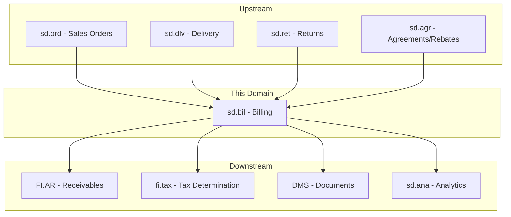
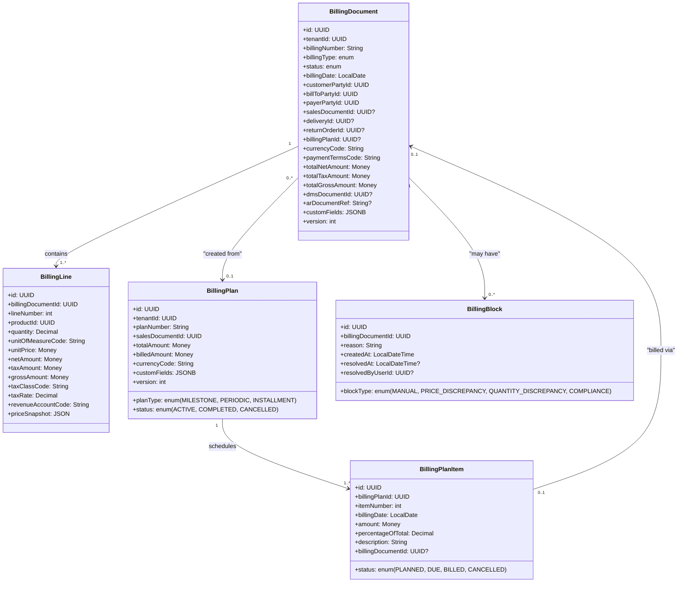
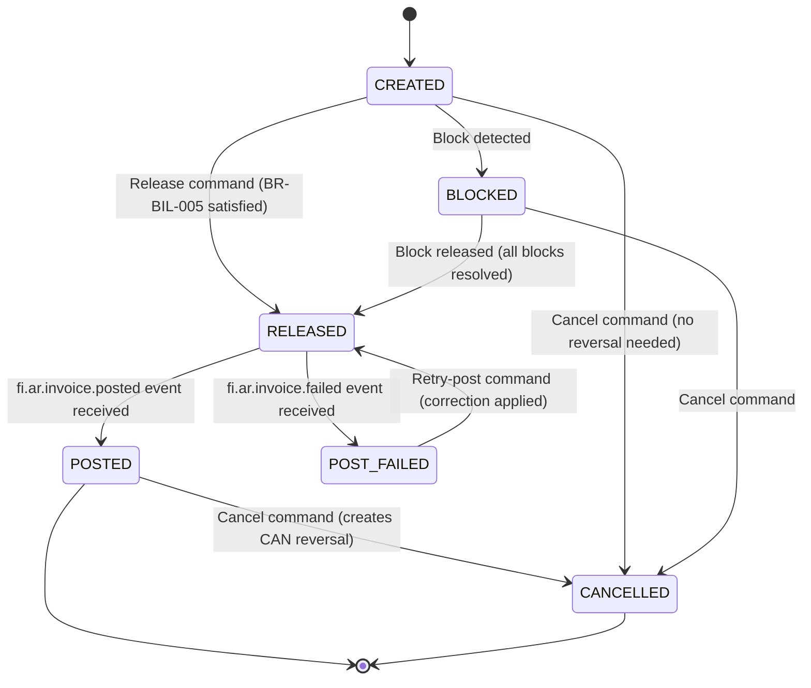
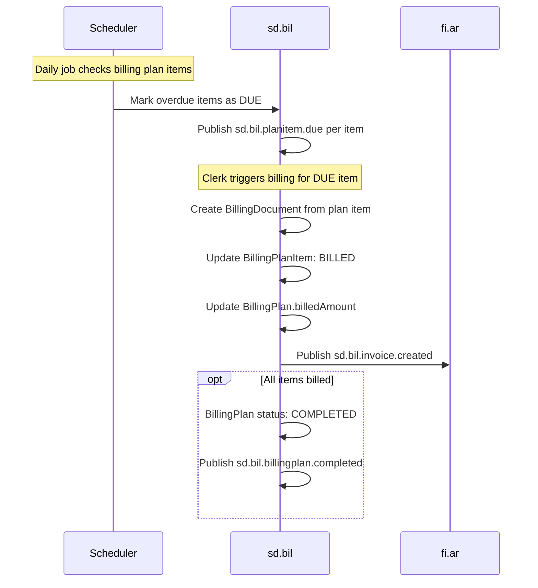
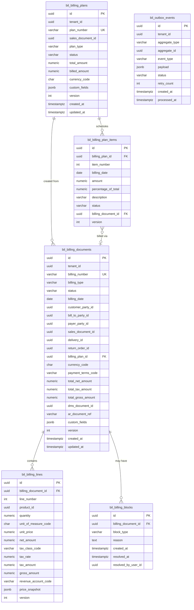

# SD.BIL - Billing Domain / Service Specification

> **Conceptual Stack Layer:** Domain / Service
> **Space:** Platform
> **Owner:** Domain Engineering Team
> **Schema alignment:** `service-layer.schema.json`
> **Companion files:** `openapi.yaml`, `*.schema.json` (event contracts)
> **Referenced by:** Platform-Feature Spec SS5 (backend dependencies), BFF Contract
> **Belongs to:** SD Suite Spec (`_sd_suite.md`)

> **Meta Information**
> - **Version:** 2026-04-03
> - **Template:** `domain-service-spec.md` v1.0.0
> - **Template Compliance:** ~95% — §11 feature IDs pending feature spec authoring (Q-BIL-007)
> - **Author(s):** OpenLeap Architecture Team
> - **Status:** DRAFT
> - **Suite:** `sd`
> - **Domain:** `bil`
> - **Bounded Context Ref:** `bc:billing`
> - **Service ID:** `sd-bil-svc`
> - **basePackage:** `io.openleap.sd.bil`
> - **API Base Path:** `/api/sd/bil/v1`
> - **OpenLeap Starter Version:** TBD
> - **Port:** TBD
> - **Repository:** TBD
> - **Tags:** `billing`, `invoicing`, `credit-memo`, `billing-plan`
> - **Team:**
>   - Name: `team-sd`
>   - Email: `sd-team@openleap.io`
>   - Slack: `#sd-team`

---

## Specification Guidelines Compliance

> ### Non-Negotiables
> - Never invent facts. If required info is missing, add an **OPEN QUESTION** entry.
> - Preserve intent and decisions. Only change meaning when explicitly requested.
> - Do not remove normative constraints unless they are explicitly replaced.
> - Keep the spec **self-contained**: no "see chat", no implicit context.
>
> ### Source of Truth Priority
> When sources conflict:
> 1. Spec (explicit) wins
> 2. Starter specs (implementation constraints) next
> 3. Guidelines (best practices) last
>
> Record conflicts in the **Decisions & Conflicts** section (see Section 14).
>
> ### Style Guide
> - Prefer short sentences and lists.
> - Use MUST/SHOULD/MAY for normative statements.
> - Keep terminology consistent (Aggregate, Domain Service, Application Service, Command, Event).
> - Avoid ambiguous words ("often", "maybe") unless explicitly noting uncertainty.
> - Keep examples minimal and clearly marked as examples.
> - Do not add implementation code unless the chapter explicitly requires it.

---

## 0. Document Purpose & Scope

### 0.1 Purpose
This specification defines the Billing domain (`sd.bil`), which creates billing documents (invoices, credit memos, debit memos, pro-forma invoices) from sales orders and deliveries, and posts them to FI.AR for accounts receivable processing. It is the financial bridge between SD's logistics world and FI's accounting world.

### 0.2 Target Audience
- Product Owners & Business Stakeholders
- System Architects & Technical Leads
- Integration Engineers

### 0.3 Scope
**In Scope:**
- Billing document creation (invoice, credit memo, debit memo, pro-forma)
- Billing from delivery (delivery-based billing) and from order (order-based billing)
- Billing plans (milestone billing, periodic billing, installment billing)
- Tax determination integration
- Revenue account determination
- Output generation (PDF invoice via DMS)
- Posting to FI.AR

**Out of Scope:**
- Sales order management (sd.ord)
- Delivery processing (sd.dlv)
- Accounts receivable ledger (FI.AR)
- General ledger posting (fi.acc)
- Payment processing (fi.pay)
- Tax calculation engine (fi.tax)

### 0.4 Related Documents
- `_sd_suite.md` — SD Suite overview
- `sd_ord-spec.md` — Sales Orders (upstream: billing source)
- `sd_dlv-spec.md` — Delivery (upstream: goods issue trigger)
- `sd_ret-spec.md` — Returns (upstream: credit memo source)
- `sd_agr-spec.md` — Sales Agreements (upstream: rebate settlement)
- `fi_acc_core_spec_complete.md` — Financial Accounting (downstream: AR/GL)
- `DMS_Spec_MinIO.md` — Document Management (downstream: PDF invoice storage)
- `https://github.com/openleap-io/io.openleap.dev.concepts/blob/main/governance/template-governance.md` — GOV-TPL-001
- `https://github.com/openleap-io/io.openleap.dev.concepts/blob/main/governance/bff-guideline.md` — GOV-BFF-001

---

## 1. Business Context

### 1.1 Domain Purpose
`sd.bil` transforms fulfillment facts (deliveries, order completions) into financial documents (invoices, credit memos) that trigger revenue recognition and accounts receivable. It is the bridge between SD's logistics world and FI's accounting world.

### 1.2 Business Value
- Automated invoice creation from delivery/order events
- Deterministic billing using price snapshots from sd.ord
- Support for complex billing scenarios (milestone, periodic, split)
- Compliance-ready invoice output (e-invoicing formats)
- Revenue recognition alignment

### 1.3 Key Stakeholders

| Role | Responsibility | Primary Use Cases |
|------|----------------|-------------------|
| Billing Clerk | Review and release billing documents | UC-BIL-001, UC-BIL-003, UC-BIL-005, UC-BIL-010 |
| Finance Controller | Monitor billing-to-AR flow, revenue reconciliation | UC-BIL-008, UC-BIL-009 |
| Sales Manager | View billing status for orders | UC-BIL-008, UC-BIL-009 |
| Customer | Receive invoices | Output recipient |
| System (EDA) | Trigger billing from delivery/return/agreement events | UC-BIL-001, UC-BIL-002, UC-BIL-004 |

### 1.4 Strategic Positioning



### 1.5 Service Context

| Property | Value |
|----------|-------|
| **Suite** | `sd` |
| **Domain** | `bil` |
| **Bounded Context** | `bc:billing` |
| **Service ID** | `sd-bil-svc` |
| **Base Package** | `io.openleap.sd.bil` |

**Responsibilities:**
- Billing document lifecycle (create, release, post, cancel)
- Billing plan management (milestone, periodic, installment)
- Tax determination orchestration
- Revenue account determination
- PDF invoice generation via DMS
- AR posting event publication

**Authoritative Sources:**

| Source Type | Description | Access Pattern |
|-------------|-------------|----------------|
| REST API | Billing documents, billing plans, billing runs | Synchronous |
| Database | `bil_billing_documents`, `bil_billing_lines`, `bil_billing_plans`, `bil_billing_plan_items`, `bil_billing_blocks` | Direct (owner) |
| Events | Billing lifecycle events (created, released, posted, cancelled) | Asynchronous |

---

## 2. Service Identity

| Property | Value | Schema Field |
|----------|-------|-------------|
| **Service ID** | `sd-bil-svc` | `metadata.id` |
| **Display Name** | Billing | `metadata.name` |
| **Suite** | `sd` | `metadata.suite` |
| **Domain** | `bil` | `metadata.domain` |
| **Bounded Context** | `bc:billing` | `metadata.bounded_context_ref` |
| **Version** | `1.1.0` | `metadata.version` |
| **Status** | DRAFT | `metadata.status` |
| **API Base Path** | `/api/sd/bil/v1` | `metadata.api_base_path` |
| **Repository** | TBD | `metadata.repository` |
| **Tags** | `billing`, `invoicing`, `credit-memo`, `billing-plan` | `metadata.tags` |

**Team:**

| Property | Value |
|----------|-------|
| **Name** | `team-sd` |
| **Email** | `sd-team@openleap.io` |
| **Slack** | `#sd-team` |

---

## 3. Domain Model

### 3.1 Conceptual Overview
The domain centers on the **BillingDocument** aggregate, representing financial documents generated from sales orders and deliveries. The **BillingPlan** aggregate provides scheduled billing capabilities for milestone and periodic scenarios. Each `BillingDocument` carries one or more `BillingLine` items, optional `BillingBlock` records, and references back to its originating SD documents.

### 3.2 Core Concepts



### 3.3 Aggregate Definitions

#### 3.3.1 BillingDocument

| Property | Value |
|----------|-------|
| **Aggregate ID** | `agg:billing-document` |
| **Name** | `BillingDocument` |

**Business Purpose:**
Represents a financial document (invoice, credit/debit memo, pro-forma) generated from sales orders or deliveries. This is the primary artifact of sd.bil and the source of AR entries in FI.

**Billing Document Types:**

| Type | Code | Description | Source | Revenue Impact |
|------|------|-------------|--------|----------------|
| Invoice | `INV` | Standard customer invoice | Delivery or Order | + Revenue |
| Credit Memo | `CRM` | Credit to customer | Return or manual | - Revenue |
| Debit Memo | `DBM` | Additional charge | Manual | + Revenue |
| Pro-Forma Invoice | `PFI` | Non-accounting preview | Order | None |
| Down Payment Invoice | `DPI` | Advance payment request | Order / Milestone | + Receivable |
| Cancellation | `CAN` | Cancels previous billing document | Original document | Reversal |

##### Aggregate Root

| Attribute | Type | Format | Description | Constraints | Required | Read-Only |
|-----------|------|--------|-------------|-------------|----------|-----------|
| id | string | uuid | System-generated unique identifier | UUID v4; `OlUuid.create()` | Yes | Yes |
| tenantId | string | uuid | Multi-tenant isolation key (RLS) | UUID v4 | Yes | Yes |
| billingNumber | string | — | System-assigned business key | Pattern: `BIL-{YYYY}-{SEQ6}`, unique per tenant | Yes | Yes |
| billingType | string | enum | Type of billing document | One of: INV, CRM, DBM, PFI, DPI, CAN; see §3.4 | Yes | No |
| status | string | enum | Lifecycle state of the document | One of: CREATED, BLOCKED, RELEASED, POSTED, POST_FAILED, CANCELLED; see §3.4 | Yes | Yes |
| billingDate | string | date | Business date of the billing document | ISO 8601 date; ≤ today + 90 days | Yes | No |
| customerPartyId | string | uuid | Sold-to party (ordering customer) | Must exist in party service | Yes | No |
| billToPartyId | string | uuid | Bill-to party (invoice recipient) | Must exist in party service | Yes | No |
| payerPartyId | string | uuid | Payer (who settles the invoice) | Must exist in party service | Yes | No |
| salesDocumentId | string | uuid | Reference to originating sales order | Must exist in sd.ord if set | No | No |
| deliveryId | string | uuid | Reference to originating delivery | Must exist in sd.dlv if set | No | No |
| returnOrderId | string | uuid | Reference to originating return order | Must exist in sd.ret if set | No | No |
| billingPlanId | string | uuid | Reference to billing plan if plan-based | Must exist in bil_billing_plans if set | No | No |
| currencyCode | string | ISO 4217 | Document currency code | 3-character ISO 4217 | Yes | No |
| paymentTermsCode | string | — | Payment terms controlling due date calculation | 1–10 chars; must exist in reference data | Yes | No |
| totalNetAmount | number | decimal | Sum of all BillingLine net amounts | ≥ 0; 2 decimal places; computed | Yes | Yes |
| totalTaxAmount | number | decimal | Sum of all BillingLine tax amounts | ≥ 0; 2 decimal places; computed | Yes | Yes |
| totalGrossAmount | number | decimal | totalNetAmount + totalTaxAmount | = totalNetAmount + totalTaxAmount; 2 decimal places; computed | Yes | Yes |
| dmsDocumentId | string | uuid | Reference to generated PDF in DMS | Set after PDF generation | No | Yes |
| arDocumentRef | string | — | Accounting document reference from FI.AR | Max 20 chars; set after POSTED | No | Yes |
| customFields | object | JSONB | Product-specific extension fields | See §12.2; validated on write | No | No |
| version | integer | int32 | Optimistic locking version counter | ≥ 0; auto-incremented on mutation | Yes | Yes |
| createdAt | string | date-time | Document creation timestamp | ISO 8601; set on create | Yes | Yes |
| updatedAt | string | date-time | Last modification timestamp | ISO 8601; updated on every mutation | Yes | Yes |

**Lifecycle States:**



**State Descriptions:**

| State | Description | Business Meaning |
|-------|-------------|-----------------|
| CREATED | Document created, awaiting review or automatic release | Billing clerk reviews amounts and tax; may auto-release if configured |
| BLOCKED | Release blocked due to unresolved discrepancy | Clerk must resolve all blocks (price, quantity, compliance) before release |
| RELEASED | Approved for AR posting | Submitted to fi.ar for accounting document creation |
| POSTED | AR document created and GL posted | Revenue recognized; customer ledger updated; invoice legally issued |
| POST_FAILED | AR posting rejected by fi.ar | Error in accounting interface; requires correction and retry |
| CANCELLED | Document voided | For POSTED docs: reversal document (CAN) created; for pre-posted: direct void |

**Allowed Transitions:**

| From State | To State | Trigger | Guard |
|------------|----------|---------|-------|
| CREATED | BLOCKED | Automatic (price/quantity check) or BIL_CLERK manual block | Block condition detected |
| CREATED | RELEASED | `ReleaseBillingDocument` command | BR-BIL-005: all lines have tax determined |
| CREATED | CANCELLED | `CancelBillingDocument` command | Role: BIL_CLERK or higher |
| BLOCKED | RELEASED | `ReleaseBlock` command (all blocks resolved) | No remaining active blocks |
| BLOCKED | CANCELLED | `CancelBillingDocument` command | Role: BIL_MANAGER or higher |
| RELEASED | POSTED | `fi.ar.invoice.posted` event | AR confirms posting |
| RELEASED | POST_FAILED | `fi.ar.invoice.failed` event | AR rejects posting |
| POST_FAILED | RELEASED | `RetryPost` command | Correction applied |
| POSTED | CANCELLED | `CancelBillingDocument` command | Creates CAN reversal document (BR-BIL-006); Role: BIL_MANAGER |

**Domain Events Emitted:**
- `sd.bil.invoice.created` — on BillingDocument created (type=INV)
- `sd.bil.creditmemo.created` — on BillingDocument created (type=CRM)
- `sd.bil.debitmemo.created` — on BillingDocument created (type=DBM)
- `sd.bil.billing.released` — on RELEASED transition
- `sd.bil.billing.posted` — on POSTED transition
- `sd.bil.billing.cancelled` — on CANCELLED transition

**Invariants:**

| Rule ID | Description |
|---------|-------------|
| BR-BIL-001 | Delivery-based billing requires GOODS_ISSUED status |
| BR-BIL-002 | Price snapshot integrity (prices must match order) |
| BR-BIL-003 | No double billing (tracked via billedQuantity in sd.dlv) |
| BR-BIL-004 | Credit memo requires reference to original invoice or return |
| BR-BIL-005 | Tax determination required before release |
| BR-BIL-006 | Cancellation of POSTED document creates reversal (CAN) document |

---

##### Child Entities

**BillingLine**

**Business Purpose:** Represents a single billable line item within a billing document. Each line corresponds to one product or service. Line amounts (net, tax, gross) are computed from quantity, unit price, and tax rate. Lines are immutable after document is POSTED.

**Collection Constraints:**
- Minimum: 1 line per BillingDocument
- Maximum: 999 lines per BillingDocument

| Attribute | Type | Format | Description | Constraints | Required |
|-----------|------|--------|-------------|-------------|----------|
| id | string | uuid | System-generated unique identifier | UUID v4; `OlUuid.create()` | Yes |
| billingDocumentId | string | uuid | Parent billing document reference | FK to bil_billing_documents; immutable | Yes |
| lineNumber | integer | int32 | Sequential line number within document | 1–999; unique per document | Yes |
| productId | string | uuid | Product or service being billed | Must exist in product catalog | Yes |
| quantity | number | decimal | Billed quantity | > 0; 3 decimal places | Yes |
| unitOfMeasureCode | string | — | Unit of measure for quantity | Must exist in reference data; max 3 chars | Yes |
| unitPrice | number | decimal | Net price per unit from price snapshot | ≥ 0; 4 decimal places | Yes |
| netAmount | number | decimal | Line net amount (quantity × unitPrice) | = quantity × unitPrice; 2 decimal places; computed | Yes |
| taxClassCode | string | — | Tax classification code from fi.tax | Must exist in fi.tax reference data; max 10 chars | Yes |
| taxRate | number | decimal | Applicable tax rate in percent | 0.00–100.00; 2 decimal places | Yes |
| taxAmount | number | decimal | Tax amount (netAmount × taxRate / 100) | = netAmount × taxRate / 100; 2 decimal places; computed | Yes |
| grossAmount | number | decimal | Line total including tax | = netAmount + taxAmount; 2 decimal places; computed | Yes |
| revenueAccountCode | string | — | GL revenue account code for posting | Determined by revenue account determination logic; max 10 chars | Yes |
| priceSnapshot | object | JSONB | Frozen pricing conditions from order | Immutable after creation; see §4.2 BR-BIL-002 | Yes |
| version | integer | int32 | Optimistic locking version counter | ≥ 0 | Yes |

**Invariants:**
- BR-BIL-002: unitPrice MUST match priceSnapshot.unitPrice within tolerance
- BR-BIL-003: Line MUST NOT bill already-billed quantity
- `netAmount` MUST equal `quantity × unitPrice` (enforced by domain object)
- `taxAmount` MUST equal `netAmount × (taxRate / 100)` (enforced by domain object)
- `grossAmount` MUST equal `netAmount + taxAmount` (enforced by domain object)

---

**BillingBlock**

**Business Purpose:** Records a blocking condition that prevents a billing document from being released. All active blocks must be resolved before the document can transition to RELEASED.

**Collection Constraints:**
- Minimum: 0 blocks per document
- Maximum: No hard limit; typically 1–3 simultaneous blocks

| Attribute | Type | Format | Description | Constraints | Required |
|-----------|------|--------|-------------|-------------|----------|
| id | string | uuid | System-generated unique identifier | UUID v4; `OlUuid.create()` | Yes |
| billingDocumentId | string | uuid | Parent billing document reference | FK to bil_billing_documents | Yes |
| blockType | string | enum | Category of block | One of: MANUAL, PRICE_DISCREPANCY, QUANTITY_DISCREPANCY, COMPLIANCE; see §3.4 | Yes |
| reason | string | — | Human-readable block reason | Min 1 char; max 500 chars | Yes |
| createdAt | string | date-time | When block was set | ISO 8601 | Yes |
| resolvedAt | string | date-time | When block was released | ISO 8601; null if still active | No |
| resolvedByUserId | string | uuid | IAM user who released the block | FK to IAM user; set when resolved | No |

---

#### 3.3.2 BillingPlan

| Property | Value |
|----------|-------|
| **Aggregate ID** | `agg:billing-plan` |
| **Name** | `BillingPlan` |

**Business Purpose:**
Manages scheduled billing over the life of a sales contract. Plans are created alongside sales orders for project billing, subscription services, or installment payment arrangements. Each plan item becomes due on its scheduled date and triggers a billing document.

##### Aggregate Root

| Attribute | Type | Format | Description | Constraints | Required | Read-Only |
|-----------|------|--------|-------------|-------------|----------|-----------|
| id | string | uuid | System-generated unique identifier | UUID v4; `OlUuid.create()` | Yes | Yes |
| tenantId | string | uuid | Multi-tenant isolation key (RLS) | UUID v4 | Yes | Yes |
| planNumber | string | — | System-assigned business key | Pattern: `BPL-{YYYY}-{SEQ6}`, unique per tenant | Yes | Yes |
| salesDocumentId | string | uuid | Sales order this plan is attached to | Must exist in sd.ord; unique per salesDocument (one plan per order) | Yes | No |
| planType | string | enum | Billing cadence type | One of: MILESTONE, PERIODIC, INSTALLMENT; see §3.4 | Yes | No |
| status | string | enum | Plan lifecycle state | One of: ACTIVE, COMPLETED, CANCELLED; see §3.4 | Yes | Yes |
| totalAmount | number | decimal | Total contract value to be billed across all items | > 0; 2 decimal places | Yes | No |
| billedAmount | number | decimal | Total amount invoiced to date (running sum) | ≥ 0; ≤ totalAmount; 2 decimal places; computed | Yes | Yes |
| currencyCode | string | ISO 4217 | Plan currency (matches sales order currency) | 3-character ISO 4217 | Yes | No |
| customFields | object | JSONB | Product-specific extension fields | See §12.2 | No | No |
| version | integer | int32 | Optimistic locking version counter | ≥ 0 | Yes | Yes |
| createdAt | string | date-time | Plan creation timestamp | ISO 8601 | Yes | Yes |
| updatedAt | string | date-time | Last modification timestamp | ISO 8601 | Yes | Yes |

**State Descriptions:**

| State | Description | Business Meaning |
|-------|-------------|-----------------|
| ACTIVE | Plan live; items becoming due per schedule | Billing scheduler checks items daily |
| COMPLETED | All items billed; billedAmount = totalAmount | No further billing from this plan |
| CANCELLED | Plan voided | No further billing; any PLANNED items also cancelled |

**Allowed Transitions:**

| From State | To State | Trigger | Guard |
|------------|----------|---------|-------|
| ACTIVE | COMPLETED | Last item billed | billedAmount = totalAmount (auto-triggered) |
| ACTIVE | CANCELLED | `CancelBillingPlan` command | Role: BIL_MANAGER |

**Domain Events Emitted:**
- `sd.bil.billingplan.created` — on plan create
- `sd.bil.planitem.due` — when a BillingPlanItem status transitions to DUE
- `sd.bil.billingplan.completed` — on COMPLETED transition
- `sd.bil.billingplan.cancelled` — on CANCELLED transition

**Invariants:**

| Rule ID | Description |
|---------|-------------|
| BR-BIL-007 | Sum of all BillingPlanItem amounts MUST NOT exceed totalAmount |

---

##### Child Entities

**BillingPlanItem**

**Business Purpose:** Represents a single scheduled billing event. When the `billingDate` is reached, a scheduler sets the item to DUE and publishes `sd.bil.planitem.due`. A billing clerk (or auto-billing) then triggers invoice creation for the item.

**Collection Constraints:**
- Minimum: 1 item per BillingPlan
- Maximum: 100 items per BillingPlan
- Sum of all item amounts MUST equal plan `totalAmount` (BR-BIL-007)

| Attribute | Type | Format | Description | Constraints | Required |
|-----------|------|--------|-------------|-------------|----------|
| id | string | uuid | System-generated unique identifier | UUID v4; `OlUuid.create()` | Yes |
| billingPlanId | string | uuid | Parent billing plan reference | FK to bil_billing_plans | Yes |
| itemNumber | integer | int32 | Sequential item number within plan | 1–100; unique per plan | Yes |
| billingDate | string | date | Scheduled billing date | ISO 8601 date | Yes |
| amount | number | decimal | Amount to bill on this date | > 0; 2 decimal places | Yes |
| percentageOfTotal | number | decimal | Percentage of plan total (informational) | 0.01–100.00; 2 decimal places | No |
| description | string | — | Milestone or period description | Max 250 chars | No |
| status | string | enum | Item state | One of: PLANNED, DUE, BILLED, CANCELLED; see §3.4 | Yes |
| billingDocumentId | string | uuid | Billing document created for this item | FK to bil_billing_documents; set when BILLED | No |
| version | integer | int32 | Optimistic locking version counter | ≥ 0 | Yes |

**Invariants:**
- BR-BIL-007: `SUM(items.amount) ≤ plan.totalAmount`
- BILLED items MUST have a billingDocumentId set
- CANCELLED items do not contribute to billedAmount

---

### 3.4 Enumerations

#### BillingType

| Value | Description | Deprecated |
|-------|-------------|------------|
| `INV` | Standard customer invoice; creates AR debit entry; triggers revenue recognition | No |
| `CRM` | Credit memo; reduces customer's outstanding balance; created from returns or manual correction | No |
| `DBM` | Debit memo; additional charge not covered by original order; increases customer balance | No |
| `PFI` | Pro-forma invoice; non-accounting preview for customs clearance or logistics coordination; no AR posting | No |
| `DPI` | Down payment invoice; advance payment request for milestone or project billing | No |
| `CAN` | Cancellation document; accounting reversal of a previously POSTED billing document | No |

#### BillingStatus

| Value | Description | Deprecated |
|-------|-------------|------------|
| `CREATED` | Document created; awaiting clerk review or automatic release | No |
| `BLOCKED` | Release blocked due to unresolved discrepancy (price, quantity, or compliance) | No |
| `RELEASED` | Approved for AR posting; submitted to fi.ar | No |
| `POSTED` | AR accounting document created and GL posted; invoice legally issued | No |
| `POST_FAILED` | AR posting rejected; requires correction and retry | No |
| `CANCELLED` | Document voided; reversal created for previously POSTED documents | No |

#### BillingPlanType

| Value | Description | Deprecated |
|-------|-------------|------------|
| `MILESTONE` | Billing triggered by project milestones or customer-defined events; dates set manually | No |
| `PERIODIC` | Regular billing at fixed intervals (monthly, quarterly, annually); dates auto-calculated | No |
| `INSTALLMENT` | Fixed number of equal installments over a defined period; auto-calculated amounts | No |

#### BillingPlanStatus

| Value | Description | Deprecated |
|-------|-------------|------------|
| `ACTIVE` | Plan live; items become due per schedule | No |
| `COMPLETED` | All plan items billed; total amount fully invoiced | No |
| `CANCELLED` | Plan voided; no further billing from this plan | No |

#### BillingPlanItemStatus

| Value | Description | Deprecated |
|-------|-------------|------------|
| `PLANNED` | Scheduled for a future date; not yet due | No |
| `DUE` | Billing date reached; ready for invoice creation | No |
| `BILLED` | Billing document created for this item; billingDocumentId is set | No |
| `CANCELLED` | Item excluded from billing; does not contribute to billedAmount | No |

#### BillingBlockType

| Value | Description | Deprecated |
|-------|-------------|------------|
| `MANUAL` | Billing clerk manually blocked the document for review | No |
| `PRICE_DISCREPANCY` | Billed unit price deviates from order price snapshot beyond tolerance | No |
| `QUANTITY_DISCREPANCY` | Billed quantity deviates from delivered/ordered quantity | No |
| `COMPLIANCE` | Compliance or legal hold prevents release (e.g., export control, credit hold) | No |

---

### 3.5 Shared Types

#### Money

Money is used throughout the domain for all monetary amounts. In the Java domain model, `Money` is a value object with amount and currency. In the database, it is stored as two columns per field.

| Attribute | Type | Format | Description | Constraints |
|-----------|------|--------|-------------|-------------|
| amount | number | decimal | Monetary amount | ≥ 0; precision depends on currency (typically 2 decimal places) |
| currencyCode | string | ISO 4217 | 3-character ISO currency code | Must be a valid, active ISO 4217 code |

**Validation Rules:**
- `amount` MUST be ≥ 0 for all standard amounts; negative values are not allowed (credit amounts are expressed via document type, not negative amounts)
- `currencyCode` MUST be a valid ISO 4217 alphabetic code (e.g., `EUR`, `USD`, `GBP`)
- `amount` MUST be rounded to the currency's standard minor unit (2 decimal places for EUR/USD/GBP; 0 for JPY/KRW)
- Currency MUST be consistent within a BillingDocument (all lines use the document's `currencyCode`)

**Used By:**
- `BillingDocument`: `totalNetAmount`, `totalTaxAmount`, `totalGrossAmount`
- `BillingLine`: `unitPrice`, `netAmount`, `taxAmount`, `grossAmount`
- `BillingPlan`: `totalAmount`, `billedAmount`
- `BillingPlanItem`: `amount`

> **Database mapping:** Each `Money` field is stored as two columns, e.g., `total_net_amount NUMERIC(18,2)` and `currency_code CHAR(3)`. The shared `currencyCode` on `BillingDocument` acts as the canonical currency for all lines.

---

## 4. Business Rules & Constraints

### 4.1 Business Rules Catalog

| ID | Rule Name | Description | Scope | Enforcement | Error Code |
|----|-----------|-------------|-------|-------------|------------|
| BR-BIL-001 | GI Required | Delivery MUST be GOODS_ISSUED for delivery-based billing | BillingDocument | Create | `BIL_GI_REQUIRED` |
| BR-BIL-002 | Price Integrity | Prices MUST match order price snapshot | BillingLine | Create | `BIL_PRICE_MISMATCH` |
| BR-BIL-003 | No Double Billing | Line can only be billed once per quantity unit | BillingDocument | Create | `BIL_ALREADY_BILLED` |
| BR-BIL-004 | Credit Ref Required | Credit memo MUST reference original invoice or return | BillingDocument | Create | `BIL_MISSING_REF` |
| BR-BIL-005 | Tax Required | Tax MUST be determined before release | BillingDocument | Release | `BIL_TAX_MISSING` |
| BR-BIL-006 | Cancel Creates Reversal | Cancelling POSTED invoice creates CAN reversal document | BillingDocument | Cancel | — |
| BR-BIL-007 | Plan Amount Limit | Plan items MUST NOT exceed total plan amount | BillingPlan | Update | `BIL_PLAN_EXCEEDED` |

### 4.2 Detailed Rule Definitions

#### BR-BIL-001: GI Required

**Business Context:** Delivery-based billing can only occur after physical goods have been shipped. Creating an invoice before goods issue would recognize revenue prematurely, violating accounting principles (IAS 18 / IFRS 15).

**Rule Statement:** A BillingDocument of type `INV` with a `deliveryId` set MUST only be created if the referenced delivery has status `GOODS_ISSUED` in `sd.dlv`.

**Applies To:**
- Aggregate: BillingDocument
- Operations: Create (type=INV, deliveryId set)

**Enforcement:** Application service calls `GET /api/sd/dlv/v1/deliveries/{deliveryId}` before creating the billing document. If status ≠ GOODS_ISSUED, creation is rejected.

**Validation Logic:** `delivery.status == GOODS_ISSUED` — evaluated synchronously via REST call to sd.dlv.

**Error Handling:**
- **Error Code:** `BIL_GI_REQUIRED`
- **Error Message:** "Billing cannot be created: delivery {deliveryId} has not been goods-issued (current status: {status})."
- **User action:** Complete goods issue in Delivery Management (`sd.dlv`) before retrying billing creation.

**Examples:**
- **Valid:** Delivery D-2026-001 status=GOODS_ISSUED → billing creation proceeds
- **Invalid:** Delivery D-2026-001 status=PICKING → `BIL_GI_REQUIRED` rejected

---

#### BR-BIL-002: Price Integrity

**Business Context:** Customer invoices MUST reflect what was agreed in the sales order. Price changes after order confirmation must not silently inflate or reduce billing amounts. Deterministic billing protects both seller and customer.

**Rule Statement:** Each BillingLine's `unitPrice` MUST match the `unitPrice` in the line's `priceSnapshot` within a configured tolerance (default: 0.001%). Deviation above tolerance triggers an automatic `PRICE_DISCREPANCY` billing block.

**Applies To:**
- Aggregate: BillingDocument (via BillingLine)
- Operations: Create

**Enforcement:** Domain service compares each line's `unitPrice` to `priceSnapshot.unitPrice`. Deviation above tolerance creates a `PRICE_DISCREPANCY` BillingBlock automatically. Document status transitions to BLOCKED.

**Validation Logic:** `abs(billingLine.unitPrice - priceSnapshot.unitPrice) / priceSnapshot.unitPrice > tolerance`

**Error Handling:**
- **Error Code:** `BIL_PRICE_MISMATCH`
- **Error Message:** "Price discrepancy on line {lineNumber}: billed {billedPrice} {currency}, expected {snapshotPrice} {currency}."
- **User action:** Review the pricing conditions in `sd.ord` or release the billing block if the deviation is approved by BIL_MANAGER.

**Examples:**
- **Valid:** Snapshot unitPrice=99.99 EUR, billed unitPrice=99.99 EUR → no block
- **Invalid:** Snapshot unitPrice=99.99 EUR, billed unitPrice=104.99 EUR → `BIL_PRICE_MISMATCH` block created

---

#### BR-BIL-003: No Double Billing

**Business Context:** Each unit of a delivery line may only be invoiced once. Duplicate invoicing leads to double revenue recognition and customer disputes.

**Rule Statement:** A BillingDocument MUST NOT create a BillingLine for a delivery line whose `billedQuantity` has already reached `orderedQuantity` in `sd.dlv`.

**Applies To:**
- Aggregate: BillingDocument
- Operations: Create

**Enforcement:** Application service checks `billedQuantity` per delivery line via `sd.dlv` before creating billing lines. Lines with `billedQuantity ≥ orderedQuantity` are excluded. If all lines are fully billed, creation is rejected.

**Validation Logic:** `delivery.lines.all { billedQuantity >= orderedQuantity }` → reject entire billing document.

**Error Handling:**
- **Error Code:** `BIL_ALREADY_BILLED`
- **Error Message:** "Delivery {deliveryId} has already been fully billed. No unbilled quantities remain."
- **User action:** Verify billing status in the Billing List before attempting re-billing.

**Examples:**
- **Valid:** Delivery line billed 0 of 10 units → billing proceeds for 10 units
- **Invalid:** Delivery line billed 10 of 10 units → `BIL_ALREADY_BILLED`

---

#### BR-BIL-004: Credit Ref Required

**Business Context:** Credit memos reduce accounts receivable. Without a reference to the original invoice or return, the credit cannot be properly reconciled in the customer account ledger.

**Rule Statement:** A BillingDocument of type `CRM` MUST have at least one of `returnOrderId` or `salesDocumentId` set.

**Applies To:**
- Aggregate: BillingDocument
- Operations: Create (type=CRM)

**Enforcement:** Domain object validation at construction time. Validated before persistence.

**Validation Logic:** `billingType == CRM → (returnOrderId IS NOT NULL OR salesDocumentId IS NOT NULL)`

**Error Handling:**
- **Error Code:** `BIL_MISSING_REF`
- **Error Message:** "Credit memo requires a reference to an original billing document or return order."
- **User action:** Provide `returnOrderId` or `salesDocumentId` when creating a credit memo.

**Examples:**
- **Valid:** Credit memo with `returnOrderId=R-2026-001`
- **Invalid:** Credit memo with no reference fields set → `BIL_MISSING_REF`

---

#### BR-BIL-005: Tax Required Before Release

**Business Context:** Tax amounts must be accurate before an invoice is legally issued. An invoice without tax determination is legally invalid in most jurisdictions. Releasing without tax risks undercharging or non-compliant invoices.

**Rule Statement:** A BillingDocument MUST have tax determined (all BillingLines have `taxRate` set, either > 0 or explicitly 0.00 for zero-rated goods) before it can be released (transition to RELEASED).

**Applies To:**
- Aggregate: BillingDocument
- Operations: Release (CREATED → RELEASED or BLOCKED → RELEASED)

**Enforcement:** Release command handler validates that all BillingLines have `taxClassCode IS NOT NULL` AND `taxRate IS NOT NULL`.

**Validation Logic:** `document.lines.all { taxClassCode != null AND taxRate != null }`

**Error Handling:**
- **Error Code:** `BIL_TAX_MISSING`
- **Error Message:** "Tax determination incomplete: {N} line(s) missing tax rates. Trigger tax re-determination before release."
- **User action:** Trigger tax re-determination via `POST /billing-documents/{id}:determine-tax` or manually set tax class codes for affected lines.

**Examples:**
- **Valid:** All lines have `taxRate=19.00` (standard rate) or `taxRate=0.00` (zero-rated)
- **Invalid:** Line 3 has `taxRate=null` → `BIL_TAX_MISSING` on release attempt

---

#### BR-BIL-006: Cancellation Creates Reversal

**Business Context:** Accounting documents in FI.AR are immutable once posted. Cancelling a posted invoice requires a reversal document to maintain audit integrity and double-entry bookkeeping correctness.

**Rule Statement:** Cancelling a BillingDocument in `POSTED` status MUST create a new BillingDocument of type `CAN` with the same line amounts. The original document transitions to `CANCELLED`. Documents in `CREATED` or `BLOCKED` status are cancelled directly without a reversal.

**Applies To:**
- Aggregate: BillingDocument
- Operations: Cancel

**Enforcement:** Cancel command handler determines document status. If `POSTED` → creates CAN reversal document atomically. Both documents are persisted in a single transaction.

**Validation Logic:**
- `status == POSTED → create CAN reversal → set original status = CANCELLED`
- `status IN (CREATED, BLOCKED) → set status = CANCELLED` (no reversal)

**Examples:**
- **Valid (POSTED):** Cancel invoice BIL-2026-00123 (POSTED) → creates BIL-2026-00124 (type=CAN, RELEASED); BIL-2026-00123 status=CANCELLED
- **Valid (CREATED):** Cancel BIL-2026-00125 (CREATED) → BIL-2026-00125 status=CANCELLED; no reversal

---

#### BR-BIL-007: Plan Amount Limit

**Business Context:** Billing plan items represent a payment schedule for a contracted total. Billing more than the contracted amount violates the sales agreement and risks overbilling the customer.

**Rule Statement:** The sum of all active (non-CANCELLED) BillingPlanItem amounts within a BillingPlan MUST NOT exceed the BillingPlan's `totalAmount`.

**Applies To:**
- Aggregate: BillingPlan (via BillingPlanItem)
- Operations: Create item, Update item amount

**Enforcement:** Domain object (BillingPlan aggregate root) validates the invariant when adding or modifying items.

**Validation Logic:** `SUM(items.where(status != CANCELLED).amount) ≤ plan.totalAmount`

**Error Handling:**
- **Error Code:** `BIL_PLAN_EXCEEDED`
- **Error Message:** "Plan item amounts exceed plan total: items sum {itemsSum} {currency}, plan total {totalAmount} {currency}."
- **User action:** Reduce item amount or first update plan total amount before adding new items.

**Examples:**
- **Valid:** Plan total=10,000 EUR; items=[3,000+3,000+4,000=10,000 EUR]
- **Invalid:** Plan total=10,000 EUR; new item amount would make sum=11,000 EUR → `BIL_PLAN_EXCEEDED`

---

### 4.3 Data Validation Rules

**Field-Level Validations:**

| Field | Validation Rule | Error Message |
|-------|----------------|---------------|
| `billingDate` | Required; valid ISO 8601 date | "Billing date is required and must be a valid date" |
| `customerPartyId` | Required; valid UUID v4 | "Customer party ID is required and must be a valid UUID" |
| `billToPartyId` | Required; valid UUID v4 | "Bill-to party ID is required and must be a valid UUID" |
| `payerPartyId` | Required; valid UUID v4 | "Payer party ID is required and must be a valid UUID" |
| `currencyCode` | Required; valid ISO 4217 (3 chars) | "Currency code must be a valid ISO 4217 code (e.g., EUR, USD)" |
| `paymentTermsCode` | Required; 1–10 chars | "Payment terms code is required (max 10 characters)" |
| `billingType` | Required; one of INV, CRM, DBM, PFI, DPI, CAN | "Billing type must be one of: INV, CRM, DBM, PFI, DPI, CAN" |
| `BillingLine.lineNumber` | Required; 1–999; unique per document | "Line number must be between 1 and 999 and unique within the document" |
| `BillingLine.productId` | Required; valid UUID v4 | "Product ID is required and must be a valid UUID" |
| `BillingLine.quantity` | Required; > 0; max 3 decimal places | "Quantity must be greater than zero" |
| `BillingLine.unitOfMeasureCode` | Required; max 3 chars | "Unit of measure code is required" |
| `BillingLine.unitPrice` | Required; ≥ 0; max 4 decimal places | "Unit price must be non-negative" |
| `BillingLine.taxRate` | When set: 0.00–100.00; 2 decimal places | "Tax rate must be between 0 and 100" |
| `BillingLine.taxClassCode` | Max 10 chars | "Tax class code must not exceed 10 characters" |
| `BillingPlan.totalAmount` | Required; > 0; 2 decimal places | "Plan total amount must be greater than zero" |
| `BillingPlan.currencyCode` | Required; valid ISO 4217 | "Plan currency code must be a valid ISO 4217 code" |
| `BillingPlanItem.billingDate` | Required; valid ISO 8601 date | "Plan item billing date is required and must be a valid date" |
| `BillingPlanItem.amount` | Required; > 0; 2 decimal places | "Plan item amount must be greater than zero" |
| `BillingPlanItem.percentageOfTotal` | When set: 0.01–100.00 | "Percentage of total must be between 0.01 and 100.00" |
| `BillingPlanItem.description` | Max 250 chars | "Plan item description must not exceed 250 characters" |
| `BillingBlock.reason` | Required; 1–500 chars | "Block reason is required (max 500 characters)" |

**Cross-Field Validations:**
- If `billingType=CRM` then `returnOrderId IS NOT NULL OR salesDocumentId IS NOT NULL` (BR-BIL-004)
- If `deliveryId` is set and `billingType=INV`, the delivery MUST have status `GOODS_ISSUED` (BR-BIL-001)
- `totalGrossAmount` MUST equal `totalNetAmount + totalTaxAmount`
- `BillingLine.netAmount` MUST equal `quantity × unitPrice`
- `BillingLine.grossAmount` MUST equal `netAmount + taxAmount`
- `BillingLine.taxAmount` MUST equal `netAmount × (taxRate / 100)`
- Sum of active `BillingPlanItem.amount` MUST NOT exceed `BillingPlan.totalAmount` (BR-BIL-007)

### 4.4 Reference Data Dependencies

| Catalog | Source Service | Fields Referencing | Validation |
|---------|----------------|-------------------|------------|
| Currency codes | `ref-data-svc` | `BillingDocument.currencyCode`, `BillingPlan.currencyCode` | Active ISO 4217 alphabetic code |
| Payment terms | `ref-data-svc` | `BillingDocument.paymentTermsCode` | Active payment terms entry |
| Units of measure | `ref-data-svc` | `BillingLine.unitOfMeasureCode` | Active UoM code |
| Tax classes | `fi.tax` | `BillingLine.taxClassCode` | Valid for billing date and jurisdiction |
| Customer parties | party service | `customerPartyId`, `billToPartyId`, `payerPartyId` | Party must exist and be active |
| Products | `com-svc` | `BillingLine.productId` | Product must exist and be billable |
| GL revenue accounts | `fi.acc` | `BillingLine.revenueAccountCode` | Account must exist and accept postings |

---

## 5. Use Cases

### 5.1 Business Logic Placement

| Logic Type | Placement | Examples |
|------------|-----------|----------|
| Aggregate invariants | Domain Object (`BillingDocument`, `BillingPlan`) | Price integrity (BR-BIL-002), plan amount limit (BR-BIL-007), computed amounts (netAmount, taxAmount) |
| Cross-aggregate logic | Domain Service (`BillingDocumentService`, `BillingPlanService`) | Create document from delivery, assign blocks, revenue account determination |
| Orchestration & transactions | Application Service (`BillingApplicationService`) | Use case coordination, tax determination call (fi.tax), DMS PDF call, outbox event publishing |

### 5.2 Use Cases

#### UC-BIL-001: Delivery-Based Billing

| Field | Value |
|-------|-------|
| **id** | `DeliveryBasedBilling` |
| **type** | WRITE |
| **trigger** | Message (`sd.dlv.delivery.goodsIssued`) or REST |
| **aggregate** | `BillingDocument` |
| **domainOperation** | `BillingDocument.createFromDelivery` |
| **inputs** | `deliveryId: UUID`, `billingDate: LocalDate` (optional) |
| **outputs** | `BillingDocument` (CREATED or BLOCKED) |
| **events** | `sd.bil.invoice.created` |
| **rest** | `POST /api/sd/bil/v1/billing-documents` |
| **idempotency** | Required — deduplicated on `(deliveryId, tenantId)` |
| **errors** | `BIL_GI_REQUIRED`, `BIL_ALREADY_BILLED`, `BIL_PRICE_MISMATCH` (→ block) |

**Actor:** System (EDA trigger from sd.dlv) or Billing Clerk (manual REST trigger)

**Preconditions:**
- Referenced delivery has status `GOODS_ISSUED` (BR-BIL-001)
- Delivery lines have unbilled quantities (BR-BIL-003)
- Sales order price snapshot exists for all delivery lines

**Main Flow:**
1. System receives `sd.dlv.delivery.goodsIssued` event or Billing Clerk calls `POST /billing-documents`
2. Application service validates delivery status via `sd.dlv` (BR-BIL-001)
3. Application service retrieves price snapshots from associated sales order
4. Domain service creates `BillingDocument` (type=INV) with `BillingLine` per delivery line
5. Domain service validates price integrity per line (BR-BIL-002); sets PRICE_DISCREPANCY block if deviation
6. Application service calls `fi.tax` for tax determination per line
7. Application service calls revenue account determination
8. Application service persists document via outbox (ADR-013)
9. Application service publishes `sd.bil.invoice.created` event

**Postconditions:**
- `BillingDocument` in state `CREATED` (no blocks) or `BLOCKED` (price discrepancy detected)
- `sd.dlv` delivery line `billedQuantity` updated (via event or REST)
- `sd.bil.invoice.created` event published

**Business Rules Applied:**
- BR-BIL-001: GI Required
- BR-BIL-002: Price Integrity
- BR-BIL-003: No Double Billing

**Alternative Flows:**
- **Alt-1:** If `billingDate` not provided, system uses today's date

**Exception Flows:**
- **Exc-1:** If delivery status ≠ GOODS_ISSUED → reject with `BIL_GI_REQUIRED`
- **Exc-2:** If all lines already billed → reject with `BIL_ALREADY_BILLED`
- **Exc-3:** If `fi.tax` unavailable → document created with `BIL_TAX_MISSING` block; tax determination deferred
- **Exc-4:** If delivery event already processed (duplicate) → idempotency check returns existing document ID

---

#### UC-BIL-002: Order-Based Billing

| Field | Value |
|-------|-------|
| **id** | `OrderBasedBilling` |
| **type** | WRITE |
| **trigger** | Message (`sd.ord.salesorder.confirmed`) or REST |
| **aggregate** | `BillingDocument` |
| **domainOperation** | `BillingDocument.createFromOrder` |
| **inputs** | `salesDocumentId: UUID`, `billingDate: LocalDate` (optional) |
| **outputs** | `BillingDocument` (CREATED) |
| **events** | `sd.bil.invoice.created` |
| **rest** | `POST /api/sd/bil/v1/billing-documents` |
| **idempotency** | Required — deduplicated on `(salesDocumentId, tenantId)` |
| **errors** | `BIL_ALREADY_BILLED` |

**Actor:** System (EDA trigger from sd.ord) or Billing Clerk

**Preconditions:**
- Sales order is CONFIRMED in `sd.ord`
- Sales order is configured for order-based billing (not delivery-based)
- Order lines have unbilled quantities

**Main Flow:**
1. System receives `sd.ord.salesorder.confirmed` event or Billing Clerk calls `POST /billing-documents`
2. Application service retrieves sales order and price snapshots from `sd.ord`
3. Domain service creates `BillingDocument` (type=INV) with BillingLine per order line
4. Application service calls `fi.tax` for tax determination
5. Application service calls revenue account determination
6. Application service persists document via outbox and publishes `sd.bil.invoice.created`

**Postconditions:**
- `BillingDocument` in state CREATED
- `sd.bil.invoice.created` event published

**Business Rules Applied:**
- BR-BIL-002: Price Integrity
- BR-BIL-003: No Double Billing

**Exception Flows:**
- **Exc-1:** All order lines already billed → reject with `BIL_ALREADY_BILLED`

---

#### UC-BIL-003: Milestone Billing

| Field | Value |
|-------|-------|
| **id** | `MilestoneBilling` |
| **type** | WRITE |
| **trigger** | REST (by Billing Clerk after milestone confirmation) |
| **aggregate** | `BillingPlan` |
| **domainOperation** | `BillingPlan.billItem` |
| **inputs** | `billingPlanId: UUID`, `itemId: UUID` |
| **outputs** | `BillingDocument` (CREATED) |
| **events** | `sd.bil.invoice.created`, `sd.bil.planitem.due` |
| **rest** | `POST /api/sd/bil/v1/billing-plans/{id}/items/{itemId}:bill` |
| **idempotency** | Required |
| **errors** | `BIL_PLAN_EXCEEDED` |

**Actor:** Billing Clerk (after milestone achieved) or System (for PERIODIC/INSTALLMENT plans)

**Preconditions:**
- BillingPlan is ACTIVE
- Target BillingPlanItem is in DUE status
- Plan's billedAmount + item amount ≤ plan totalAmount (BR-BIL-007)

**Main Flow:**
1. Billing Clerk confirms milestone achieved and calls `:bill` action
2. Application service validates plan item status=DUE and plan amount constraint
3. Domain service creates `BillingDocument` (type=INV, billingPlanId set)
4. Application service calls tax determination and revenue account determination
5. BillingPlanItem status updated to BILLED; `billingDocumentId` set
6. BillingPlan `billedAmount` updated; if complete, transitions to COMPLETED
7. Events `sd.bil.invoice.created` and `sd.bil.billingplan.completed` (if last item) published

**Postconditions:**
- BillingDocument in CREATED state
- BillingPlanItem in BILLED state
- BillingPlan.billedAmount incremented

**Exception Flows:**
- **Exc-1:** Item status ≠ DUE → reject (must be marked DUE by scheduler first)
- **Exc-2:** Plan amount would be exceeded → reject with `BIL_PLAN_EXCEEDED`

---

#### UC-BIL-004: Create Credit Memo

| Field | Value |
|-------|-------|
| **id** | `CreateCreditMemo` |
| **type** | WRITE |
| **trigger** | Message (`sd.ret.returnorder.completed`, `sd.agr.rebate.settlementDue`) or REST |
| **aggregate** | `BillingDocument` |
| **domainOperation** | `BillingDocument.createCreditMemo` |
| **inputs** | `returnOrderId: UUID` or `originalInvoiceId: UUID` (one required) |
| **outputs** | `BillingDocument` (CREATED, type=CRM) |
| **events** | `sd.bil.creditmemo.created` |
| **rest** | `POST /api/sd/bil/v1/billing-documents` |
| **idempotency** | Required |
| **errors** | `BIL_MISSING_REF` |

**Actor:** System (from sd.ret event) or Billing Clerk

**Preconditions:**
- Return order is COMPLETED in `sd.ret` (if return-based) OR original invoice is POSTED
- Reference to original invoice or return order provided (BR-BIL-004)

**Main Flow:**
1. System receives `sd.ret.returnorder.completed` or Billing Clerk calls `POST /billing-documents`
2. Application service validates reference exists (BR-BIL-004)
3. Domain service creates `BillingDocument` (type=CRM, returnOrderId or salesDocumentId set)
4. Application service calls tax determination (tax rate mirrors original invoice)
5. Application service persists via outbox; publishes `sd.bil.creditmemo.created`

**Postconditions:**
- BillingDocument (type=CRM) in CREATED state
- `sd.bil.creditmemo.created` event published to fi.ar for AR credit posting

**Business Rules Applied:**
- BR-BIL-004: Credit Ref Required

**Exception Flows:**
- **Exc-1:** No reference provided → `BIL_MISSING_REF`

---

#### UC-BIL-005: Release Billing Document

| Field | Value |
|-------|-------|
| **id** | `ReleaseBillingDocument` |
| **type** | WRITE |
| **trigger** | REST |
| **aggregate** | `BillingDocument` |
| **domainOperation** | `BillingDocument.release` |
| **inputs** | `billingDocumentId: UUID` |
| **outputs** | `BillingDocument` (RELEASED) |
| **events** | `sd.bil.billing.released` |
| **rest** | `POST /api/sd/bil/v1/billing-documents/{id}:release` |
| **idempotency** | Required (idempotent on RELEASED status) |
| **errors** | `BIL_TAX_MISSING` |

**Actor:** Billing Clerk

**Preconditions:**
- BillingDocument in CREATED status (no active blocks)
- All BillingLines have `taxRate` and `taxClassCode` set (BR-BIL-005)

**Main Flow:**
1. Billing Clerk calls `:release` on the document
2. Application service validates no active BillingBlocks
3. Application service validates tax determination complete (BR-BIL-005)
4. Application service calls DMS to generate PDF invoice; stores `dmsDocumentId`
5. BillingDocument status transitions to RELEASED
6. `sd.bil.billing.released` event published; fi.ar reacts to create AR document

**Postconditions:**
- BillingDocument in RELEASED state
- PDF invoice generated and stored in DMS
- `sd.bil.billing.released` event published for fi.ar to process

**Exception Flows:**
- **Exc-1:** Active blocks remain → reject (must resolve all blocks first)
- **Exc-2:** Tax not determined → `BIL_TAX_MISSING`
- **Exc-3:** DMS unavailable → document released but `dmsDocumentId` set asynchronously via retry

---

#### UC-BIL-006: Cancel Billing Document

| Field | Value |
|-------|-------|
| **id** | `CancelBillingDocument` |
| **type** | WRITE |
| **trigger** | REST |
| **aggregate** | `BillingDocument` |
| **domainOperation** | `BillingDocument.cancel` |
| **inputs** | `billingDocumentId: UUID`, `cancellationReason: String` |
| **outputs** | `BillingDocument` (CANCELLED) + optional `BillingDocument` (CAN reversal) |
| **events** | `sd.bil.billing.cancelled` |
| **rest** | `POST /api/sd/bil/v1/billing-documents/{id}:cancel` |
| **idempotency** | Required |
| **errors** | — |

**Actor:** Billing Manager (for POSTED); Billing Clerk (for CREATED/BLOCKED)

**Main Flow:**
1. BIL_MANAGER calls `:cancel`
2. If status=POSTED → domain service creates CAN reversal document (BR-BIL-006)
3. Original document status → CANCELLED
4. `sd.bil.billing.cancelled` event published; fi.ar processes reversal

**Postconditions:**
- BillingDocument in CANCELLED state
- If POSTED: new CAN document created and published to fi.ar

---

#### UC-BIL-007: List Billing Documents

| Field | Value |
|-------|-------|
| **id** | `ListBillingDocuments` |
| **type** | READ |
| **trigger** | REST |
| **aggregate** | `BillingDocument` |
| **inputs** | `type`, `status`, `customerId`, `from`, `to`, `page`, `size` (query params) |
| **outputs** | `Page<BillingDocumentSummary>` |
| **rest** | `GET /api/sd/bil/v1/billing-documents` |

**Actor:** Billing Clerk, Finance Controller, Sales Manager

**Main Flow:**
1. Actor calls GET with filter params
2. Query service applies tenant_id RLS and filter predicates
3. Returns paginated list of BillingDocumentSummary (read model, no lines detail)

---

#### UC-BIL-008: Get Billing Document

| Field | Value |
|-------|-------|
| **id** | `GetBillingDocument` |
| **type** | READ |
| **trigger** | REST |
| **aggregate** | `BillingDocument` |
| **inputs** | `billingDocumentId: UUID` |
| **outputs** | `BillingDocument` (full, with lines) |
| **rest** | `GET /api/sd/bil/v1/billing-documents/{id}` |

---

#### UC-BIL-009: Release Billing Block

| Field | Value |
|-------|-------|
| **id** | `ReleaseBillingBlock` |
| **type** | WRITE |
| **trigger** | REST |
| **aggregate** | `BillingDocument` |
| **domainOperation** | `BillingDocument.releaseBlock` |
| **inputs** | `billingDocumentId: UUID`, `blockId: UUID` |
| **outputs** | `BillingDocument` (CREATED or BLOCKED if other blocks remain) |
| **rest** | `POST /api/sd/bil/v1/billing-documents/{id}:release-block` |

**Actor:** Billing Clerk

**Main Flow:**
1. Clerk reviews and resolves block condition
2. Calls `:release-block`
3. BillingBlock `resolvedAt` and `resolvedByUserId` set
4. If no remaining active blocks, document status returns to CREATED

---

### 5.3 Process Flow Diagrams

#### Delivery-Based Billing Flow

```mermaid
sequenceDiagram
    participant DLV as sd.dlv
    participant BIL as sd.bil
    participant TAX as fi.tax
    participant DMS as DMS
    participant AR as fi.ar

    DLV->>BIL: Event: sd.dlv.delivery.goodsIssued
    BIL->>BIL: Validate delivery status (BR-BIL-001)
    BIL->>BIL: Create BillingDocument from delivery lines
    BIL->>BIL: Copy prices from order price snapshots (BR-BIL-002)
    BIL->>TAX: POST /tax-determination (lines + jurisdiction)
    TAX-->>BIL: Tax amounts per line
    BIL->>BIL: Determine revenue accounts per line
    BIL->>BIL: Status: CREATED (or BLOCKED if price discrepancy)
    BIL->>AR: Publish sd.bil.invoice.created (thin event)

    Note over BIL: Clerk reviews (or auto-release)
    BIL->>BIL: :release command → status: RELEASED

    BIL->>DMS: Generate PDF invoice
    DMS-->>BIL: dmsDocumentId

    BIL->>AR: Publish sd.bil.billing.released
    AR->>AR: Create AR document, post to GL
    AR-->>BIL: Event: fi.ar.invoice.posted
    BIL->>BIL: Status: POSTED; store arDocumentRef
```

#### Billing Plan Flow



### 5.4 Cross-Domain Workflows

#### Order-to-Cash Saga (SD → FI)

**Pattern:** Choreography (ADR-029 — EDA choreography preferred for order-to-cash; no central orchestrator)

**Participating Services:**

| Service | Role | Events Produced | Events Consumed |
|---------|------|----------------|-----------------|
| sd.ord | Order management | `salesorder.confirmed` | — |
| sd.dlv | Delivery | `delivery.goodsIssued` | — |
| sd.bil | **Billing** | `invoice.created`, `billing.released`, `billing.posted` | `delivery.goodsIssued`, `invoice.posted`, `invoice.failed` |
| fi.ar | Accounts receivable | `invoice.posted`, `invoice.failed` | `billing.released` |
| fi.acc | General ledger | (internal to fi) | `invoice.posted` (fi.ar → fi.acc) |

**Workflow Steps:**
1. `sd.ord` confirms order → optional order-based billing trigger
2. `sd.dlv` goods issue → `sd.bil` creates invoice (CREATED)
3. Billing Clerk releases → `sd.bil` publishes `billing.released` + generates PDF
4. `fi.ar` receives `billing.released` → creates AR document → publishes `invoice.posted`
5. `sd.bil` receives `invoice.posted` → transitions to POSTED; stores `arDocumentRef`

**Failure Path:**
- `fi.ar` publishes `invoice.failed` → `sd.bil` transitions to POST_FAILED
- Billing Clerk corrects issue (e.g., updates tax) → retries release → restarted from step 3

**Business Implications:**
- No distributed transaction; eventual consistency across sd.bil and fi.ar
- Revenue recognition delayed until `fi.ar.invoice.posted` event received
- At-least-once delivery (ADR-014): release event may be re-delivered; fi.ar MUST be idempotent

#### Rebate Settlement Workflow (sd.agr → sd.bil)

**Pattern:** Choreography

**Workflow Steps:**
1. `sd.agr` calculates rebate amount and publishes `sd.agr.rebate.settlementDue`
2. `sd.bil` receives event, creates credit memo (type=CRM) referencing the agreement
3. Credit memo released → posted to fi.ar as credit note
4. Customer account reduced by rebate amount

---

## 6. REST API

### 6.1 API Overview

**Base Path:** `/api/sd/bil/v1`

**API Conventions:**
- All write operations return the updated resource with current `version`
- Optimistic locking: PATCH/PUT requires `If-Match: "{version}"` header
- Pagination: `page` (0-based) and `size` (default 20, max 100) on list endpoints
- Filtering: query parameters on list endpoints
- Business operations use `POST /{resource}/{id}:{action}` pattern (ADR-002)

### 6.2 Resource Operations

#### 6.2.1 Billing Documents - Create

```http
POST /api/sd/bil/v1/billing-documents
Authorization: Bearer {token}
Content-Type: application/json
Idempotency-Key: {uuid}
```

**Request Body:**
```json
{
  "billingType": "INV",
  "billingDate": "2026-04-03",
  "customerPartyId": "11111111-1111-1111-1111-111111111111",
  "billToPartyId": "22222222-2222-2222-2222-222222222222",
  "payerPartyId": "33333333-3333-3333-3333-333333333333",
  "deliveryId": "44444444-4444-4444-4444-444444444444",
  "currencyCode": "EUR",
  "paymentTermsCode": "NET30",
  "customFields": {}
}
```

**Success Response:** `201 Created`
```json
{
  "id": "55555555-5555-5555-5555-555555555555",
  "billingNumber": "BIL-2026-000001",
  "billingType": "INV",
  "status": "CREATED",
  "billingDate": "2026-04-03",
  "customerPartyId": "11111111-1111-1111-1111-111111111111",
  "billToPartyId": "22222222-2222-2222-2222-222222222222",
  "payerPartyId": "33333333-3333-3333-3333-333333333333",
  "deliveryId": "44444444-4444-4444-4444-444444444444",
  "currencyCode": "EUR",
  "paymentTermsCode": "NET30",
  "totalNetAmount": 840.00,
  "totalTaxAmount": 159.60,
  "totalGrossAmount": 999.60,
  "dmsDocumentId": null,
  "arDocumentRef": null,
  "version": 1,
  "createdAt": "2026-04-03T08:30:00Z",
  "updatedAt": "2026-04-03T08:30:00Z",
  "_links": {
    "self": { "href": "/api/sd/bil/v1/billing-documents/55555555-5555-5555-5555-555555555555" },
    "lines": { "href": "/api/sd/bil/v1/billing-documents/55555555-5555-5555-5555-555555555555/lines" },
    "release": { "href": "/api/sd/bil/v1/billing-documents/55555555-5555-5555-5555-555555555555:release" }
  }
}
```

**Response Headers:**
- `Location: /api/sd/bil/v1/billing-documents/55555555-5555-5555-5555-555555555555`
- `ETag: "1"`

**Business Rules Checked:** BR-BIL-001, BR-BIL-002, BR-BIL-003, BR-BIL-004

**Events Published:** `sd.bil.invoice.created` or `sd.bil.creditmemo.created` (depending on type)

**Error Responses:**
- `400 Bad Request` — Validation error (missing required field, invalid enum value)
- `409 Conflict` — Duplicate billing (same deliveryId already billed)
- `422 Unprocessable Entity` — Business rule violation (`BIL_GI_REQUIRED`, `BIL_MISSING_REF`)

---

#### 6.2.2 Billing Documents - Get

```http
GET /api/sd/bil/v1/billing-documents/{id}
Authorization: Bearer {token}
```

**Success Response:** `200 OK`
```json
{
  "id": "55555555-5555-5555-5555-555555555555",
  "billingNumber": "BIL-2026-000001",
  "billingType": "INV",
  "status": "RELEASED",
  "billingDate": "2026-04-03",
  "customerPartyId": "11111111-1111-1111-1111-111111111111",
  "billToPartyId": "22222222-2222-2222-2222-222222222222",
  "payerPartyId": "33333333-3333-3333-3333-333333333333",
  "currencyCode": "EUR",
  "paymentTermsCode": "NET30",
  "totalNetAmount": 840.00,
  "totalTaxAmount": 159.60,
  "totalGrossAmount": 999.60,
  "dmsDocumentId": "66666666-6666-6666-6666-666666666666",
  "arDocumentRef": null,
  "lines": [
    {
      "id": "aaaaaaaa-aaaa-aaaa-aaaa-aaaaaaaaaaaa",
      "lineNumber": 1,
      "productId": "bbbbbbbb-bbbb-bbbb-bbbb-bbbbbbbbbbbb",
      "quantity": 10.000,
      "unitOfMeasureCode": "EA",
      "unitPrice": 84.00,
      "netAmount": 840.00,
      "taxClassCode": "FULL",
      "taxRate": 19.00,
      "taxAmount": 159.60,
      "grossAmount": 999.60,
      "revenueAccountCode": "4000000"
    }
  ],
  "blocks": [],
  "version": 2,
  "_links": {
    "self": { "href": "/api/sd/bil/v1/billing-documents/55555555-5555-5555-5555-555555555555" }
  }
}
```

**Response Headers:**
- `ETag: "2"`

**Error Responses:**
- `404 Not Found` — Billing document does not exist

---

#### 6.2.3 Billing Documents - List

```http
GET /api/sd/bil/v1/billing-documents?type=INV&status=CREATED&customerId={uuid}&from=2026-01-01&to=2026-04-03&page=0&size=20
Authorization: Bearer {token}
```

**Success Response:** `200 OK`
```json
{
  "content": [
    {
      "id": "55555555-5555-5555-5555-555555555555",
      "billingNumber": "BIL-2026-000001",
      "billingType": "INV",
      "status": "CREATED",
      "billingDate": "2026-04-03",
      "customerPartyId": "11111111-1111-1111-1111-111111111111",
      "currencyCode": "EUR",
      "totalGrossAmount": 999.60
    }
  ],
  "page": 0,
  "size": 20,
  "totalElements": 1,
  "totalPages": 1,
  "_links": {
    "self": { "href": "/api/sd/bil/v1/billing-documents?page=0&size=20" }
  }
}
```

---

#### 6.2.4 Billing Documents - Update

```http
PATCH /api/sd/bil/v1/billing-documents/{id}
Authorization: Bearer {token}
Content-Type: application/json
If-Match: "1"
```

**Request Body:**
```json
{
  "billingDate": "2026-04-05",
  "paymentTermsCode": "NET14",
  "customFields": { "internalProjectCode": "P-2026-001" }
}
```

**Success Response:** `200 OK` (updated resource with new version)

**Response Headers:**
- `ETag: "2"`

**Error Responses:**
- `409 Conflict` — Document in POSTED or CANCELLED status (immutable)
- `412 Precondition Failed` — ETag mismatch (optimistic lock conflict)
- `422 Unprocessable Entity` — Business rule violation

---

### 6.3 Business Operations

#### 6.3.1 Release Billing Document

```http
POST /api/sd/bil/v1/billing-documents/{id}:release
Authorization: Bearer {token}
```

**Request Body:** (empty)

**Success Response:** `200 OK` (document in RELEASED status)

**Business Rules Checked:** BR-BIL-005 (tax required), no active blocks

**Events Published:** `sd.bil.billing.released`

**Error Responses:**
- `409 Conflict` — Document has active billing blocks
- `422 Unprocessable Entity` — `BIL_TAX_MISSING`

---

#### 6.3.2 Cancel Billing Document

```http
POST /api/sd/bil/v1/billing-documents/{id}:cancel
Authorization: Bearer {token}
Content-Type: application/json
```

**Request Body:**
```json
{
  "cancellationReason": "Customer requested cancellation - order error"
}
```

**Success Response:** `200 OK`
```json
{
  "cancelledDocumentId": "55555555-5555-5555-5555-555555555555",
  "reversalDocumentId": "77777777-7777-7777-7777-777777777777",
  "message": "Billing document cancelled. Reversal document BIL-2026-000002 created."
}
```

**Business Rules Checked:** BR-BIL-006

**Events Published:** `sd.bil.billing.cancelled`

---

#### 6.3.3 Release Billing Block

```http
POST /api/sd/bil/v1/billing-documents/{id}:release-block
Authorization: Bearer {token}
Content-Type: application/json
```

**Request Body:**
```json
{
  "blockId": "cccccccc-cccc-cccc-cccc-cccccccccccc",
  "releaseReason": "Price deviation approved by Finance Manager"
}
```

**Success Response:** `200 OK` (document in CREATED or BLOCKED status depending on remaining blocks)

---

#### 6.3.4 Regenerate Invoice PDF

```http
POST /api/sd/bil/v1/billing-documents/{id}:regenerate-output
Authorization: Bearer {token}
```

**Success Response:** `200 OK`
```json
{
  "dmsDocumentId": "88888888-8888-8888-8888-888888888888",
  "message": "Invoice PDF regenerated successfully."
}
```

**Error Responses:**
- `409 Conflict` — Document not in RELEASED or POSTED status

---

#### 6.3.5 Billing Plans - Create

```http
POST /api/sd/bil/v1/billing-plans
Authorization: Bearer {token}
Content-Type: application/json
```

**Request Body:**
```json
{
  "salesDocumentId": "dddddddd-dddd-dddd-dddd-dddddddddddd",
  "planType": "MILESTONE",
  "totalAmount": 100000.00,
  "currencyCode": "EUR",
  "items": [
    {
      "itemNumber": 1,
      "billingDate": "2026-06-30",
      "amount": 30000.00,
      "percentageOfTotal": 30.00,
      "description": "Project kickoff milestone"
    },
    {
      "itemNumber": 2,
      "billingDate": "2026-09-30",
      "amount": 40000.00,
      "percentageOfTotal": 40.00,
      "description": "Mid-project milestone"
    },
    {
      "itemNumber": 3,
      "billingDate": "2026-12-31",
      "amount": 30000.00,
      "percentageOfTotal": 30.00,
      "description": "Project completion"
    }
  ]
}
```

**Success Response:** `201 Created`
```json
{
  "id": "eeeeeeee-eeee-eeee-eeee-eeeeeeeeeeee",
  "planNumber": "BPL-2026-000001",
  "salesDocumentId": "dddddddd-dddd-dddd-dddd-dddddddddddd",
  "planType": "MILESTONE",
  "status": "ACTIVE",
  "totalAmount": 100000.00,
  "billedAmount": 0.00,
  "currencyCode": "EUR",
  "version": 1,
  "_links": {
    "self": { "href": "/api/sd/bil/v1/billing-plans/eeeeeeee-eeee-eeee-eeee-eeeeeeeeeeee" }
  }
}
```

**Response Headers:**
- `Location: /api/sd/bil/v1/billing-plans/eeeeeeee-eeee-eeee-eeee-eeeeeeeeeeee`

**Business Rules Checked:** BR-BIL-007

---

#### 6.3.6 Bill Plan Item

```http
POST /api/sd/bil/v1/billing-plans/{id}/items/{itemId}:bill
Authorization: Bearer {token}
Content-Type: application/json
```

**Request Body:**
```json
{
  "billingDate": "2026-06-30"
}
```

**Success Response:** `201 Created` (new BillingDocument)

**Events Published:** `sd.bil.invoice.created`, optionally `sd.bil.billingplan.completed`

---

#### 6.3.7 Batch Billing Run - Trigger

```http
POST /api/sd/bil/v1/billing-runs
Authorization: Bearer {token}
Content-Type: application/json
```

**Request Body:**
```json
{
  "billingDate": "2026-04-03",
  "billingType": "INV",
  "sourceType": "DELIVERY",
  "dryRun": false
}
```

**Success Response:** `202 Accepted`
```json
{
  "billingRunId": "ffffffff-ffff-ffff-ffff-ffffffffffff",
  "status": "RUNNING",
  "startedAt": "2026-04-03T07:00:00Z",
  "_links": {
    "self": { "href": "/api/sd/bil/v1/billing-runs/ffffffff-ffff-ffff-ffff-ffffffffffff" }
  }
}
```

---

#### 6.3.8 Batch Billing Run - Get Results

```http
GET /api/sd/bil/v1/billing-runs/{id}
Authorization: Bearer {token}
```

**Success Response:** `200 OK`
```json
{
  "billingRunId": "ffffffff-ffff-ffff-ffff-ffffffffffff",
  "status": "COMPLETED",
  "startedAt": "2026-04-03T07:00:00Z",
  "completedAt": "2026-04-03T07:04:23Z",
  "invoicesCreated": 847,
  "invoicesFailed": 3,
  "totalGrossAmount": 4218500.00,
  "currencyCode": "EUR",
  "errors": [
    { "deliveryId": "...", "errorCode": "BIL_GI_REQUIRED", "message": "..." }
  ]
}
```

---

### 6.4 OpenAPI Specification

| Property | Value |
|----------|-------|
| **Location** | `openapi.yaml` (companion file, same directory as this spec) |
| **Version** | OpenAPI 3.1 |
| **API Base Path** | `/api/sd/bil/v1` |
| **Documentation URL** | TBD (developer portal) |
| **Security Scheme** | Bearer JWT (OAuth2, PKCE flow) |

> OPEN QUESTION: See Q-BIL-008 in §14.3 regarding developer portal URL and API documentation hosting.

---

## 7. Events & Integration

### 7.1 Architecture Pattern

**Pattern Used:** Choreography (EDA)
**Follows Suite Pattern:** YES — SD suite uses choreographed EDA (per suite ADR-SD-002)
**Message Broker:** RabbitMQ (topic exchanges)
**Rationale:** Billing events (invoice.created, billing.released) trigger downstream reactions in fi.ar and sd.ana without coupling. The billing domain does not need to know which services consume its events.

### 7.2 Published Events

**Exchange:** `sd.bil.events` (topic)

All events follow ADR-011 (thin events: IDs + changeType, not full entity data). Consumers call the REST API to retrieve full state if needed.

#### Event: BillingDocument.InvoiceCreated

**Routing Key:** `sd.bil.invoice.created`

**Business Purpose:** Notifies downstream services that a new invoice has been created. `fi.ar` reacts to create an AR debit entry. `sd.ana` reacts to update revenue pipeline.

**When Published:** When a `BillingDocument` of type `INV` is persisted (status=CREATED).

**Payload Structure:**
```json
{
  "aggregateType": "sd.bil.BillingDocument",
  "changeType": "InvoiceCreated",
  "entityIds": ["55555555-5555-5555-5555-555555555555"],
  "version": 1,
  "occurredAt": "2026-04-03T08:30:00Z"
}
```

**Event Envelope:**
```json
{
  "eventId": "00000000-0000-0000-0000-000000000001",
  "traceId": "abc-123-trace",
  "tenantId": "99999999-9999-9999-9999-999999999999",
  "occurredAt": "2026-04-03T08:30:00Z",
  "producer": "sd.bil",
  "schemaRef": "https://schemas.openleap.io/sd/bil/invoice-created/v1.json",
  "payload": {
    "aggregateType": "sd.bil.BillingDocument",
    "changeType": "InvoiceCreated",
    "entityIds": ["55555555-5555-5555-5555-555555555555"],
    "version": 1,
    "occurredAt": "2026-04-03T08:30:00Z"
  }
}
```

**Known Consumers:**

| Consumer Service | Handler | Purpose | Processing Type |
|-----------------|---------|---------|-----------------|
| fi.ar | `BillingInvoiceCreatedHandler` | Prepare AR debit entry | Async |
| sd.ana | `BillingInvoiceCreatedHandler` | Update revenue analytics | Async |

---

#### Event: BillingDocument.CreditMemoCreated

**Routing Key:** `sd.bil.creditmemo.created`

**Business Purpose:** Notifies `fi.ar` that a credit memo was created; AR creates a credit entry reducing customer balance.

**When Published:** When a `BillingDocument` of type `CRM` is persisted.

**Payload Structure:**
```json
{
  "aggregateType": "sd.bil.BillingDocument",
  "changeType": "CreditMemoCreated",
  "entityIds": ["55555555-5555-5555-5555-555555555556"],
  "version": 1,
  "occurredAt": "2026-04-03T09:00:00Z"
}
```

**Known Consumers:**

| Consumer Service | Handler | Purpose | Processing Type |
|-----------------|---------|---------|-----------------|
| fi.ar | `CreditMemoCreatedHandler` | Create AR credit entry | Async |
| sd.ana | `CreditMemoCreatedHandler` | Adjust revenue analytics | Async |

---

#### Event: BillingDocument.DebitMemoCreated

**Routing Key:** `sd.bil.debitmemo.created`

**Business Purpose:** Notifies fi.ar that an additional charge document was created.

**When Published:** When a `BillingDocument` of type `DBM` is persisted.

**Known Consumers:**

| Consumer Service | Handler | Purpose | Processing Type |
|-----------------|---------|---------|-----------------|
| fi.ar | `DebitMemoCreatedHandler` | Create AR debit entry | Async |

---

#### Event: BillingDocument.Released

**Routing Key:** `sd.bil.billing.released`

**Business Purpose:** Primary trigger for AR posting. `fi.ar` receives this event and creates the accounting document (AR debit + revenue credit in GL).

**When Published:** When `BillingDocument` transitions to RELEASED.

**Payload Structure:**
```json
{
  "aggregateType": "sd.bil.BillingDocument",
  "changeType": "Released",
  "entityIds": ["55555555-5555-5555-5555-555555555555"],
  "version": 2,
  "occurredAt": "2026-04-03T10:00:00Z"
}
```

**Known Consumers:**

| Consumer Service | Handler | Purpose | Processing Type |
|-----------------|---------|---------|-----------------|
| fi.ar | `BillingReleasedHandler` | Create AR + GL accounting document | Async, critical |

---

#### Event: BillingDocument.Posted

**Routing Key:** `sd.bil.billing.posted`

**Business Purpose:** Confirms final accounting completion. Downstream reporting and analytics can now treat revenue as recognized.

**When Published:** When `BillingDocument` transitions to POSTED (after receiving `fi.ar.invoice.posted`).

**Known Consumers:**

| Consumer Service | Handler | Purpose | Processing Type |
|-----------------|---------|---------|-----------------|
| sd.ana | `BillingPostedHandler` | Finalize revenue reporting | Async |

---

#### Event: BillingDocument.Cancelled

**Routing Key:** `sd.bil.billing.cancelled`

**Business Purpose:** Notifies fi.ar to reverse the accounting entry (if document was POSTED). Notifies sd.ana to reverse analytics.

**When Published:** When `BillingDocument` transitions to CANCELLED.

**Known Consumers:**

| Consumer Service | Handler | Purpose | Processing Type |
|-----------------|---------|---------|-----------------|
| fi.ar | `BillingCancelledHandler` | Reverse AR/GL accounting document | Async, critical |
| sd.ana | `BillingCancelledHandler` | Reverse revenue analytics entry | Async |

---

#### Event: BillingPlan.PlanItemDue

**Routing Key:** `sd.bil.planitem.due`

**Business Purpose:** Informs billing users that a plan item has reached its billing date and is ready for invoice creation.

**When Published:** Daily scheduler transitions `BillingPlanItem` from PLANNED to DUE.

**Payload Structure:**
```json
{
  "aggregateType": "sd.bil.BillingPlan",
  "changeType": "PlanItemDue",
  "entityIds": ["eeeeeeee-eeee-eeee-eeee-eeeeeeeeeeee"],
  "relatedEntityIds": {
    "billingPlanItemId": "item-uuid"
  },
  "version": 2,
  "occurredAt": "2026-04-03T00:01:00Z"
}
```

**Known Consumers:**

| Consumer Service | Handler | Purpose | Processing Type |
|-----------------|---------|---------|-----------------|
| Notification service | `PlanItemDueNotificationHandler` | Notify billing clerk | Async |

---

### 7.3 Consumed Events

| Event | Source | Queue | Handler | Purpose |
|-------|--------|-------|---------|---------|
| `sd.dlv.delivery.goodsIssued` | sd.dlv | `sd.bil.in.sd.dlv.delivery.events` | `DeliveryGoodsIssuedHandler` | Trigger delivery-based billing |
| `sd.ord.salesorder.confirmed` | sd.ord | `sd.bil.in.sd.ord.salesorder.events` | `SalesOrderConfirmedHandler` | Trigger order-based billing (if configured) |
| `sd.ret.returnorder.completed` | sd.ret | `sd.bil.in.sd.ret.returnorder.events` | `ReturnOrderCompletedHandler` | Create credit memo from return |
| `sd.agr.rebate.settlementDue` | sd.agr | `sd.bil.in.sd.agr.rebate.events` | `RebateSettlementDueHandler` | Create rebate credit memo |
| `fi.ar.invoice.posted` | fi.ar | `sd.bil.in.fi.ar.invoice.events` | `ARInvoicePostedHandler` | Update billing document to POSTED |
| `fi.ar.invoice.failed` | fi.ar | `sd.bil.in.fi.ar.invoice.events` | `ARInvoiceFailedHandler` | Update billing document to POST_FAILED |

**DeliveryGoodsIssuedHandler:**
- **Business Logic:** Extracts `deliveryId` from event, calls UC-BIL-001 (`DeliveryBasedBilling`). Idempotency key: `deliveryId + tenantId`.
- **Queue Config:** `sd.bil.in.sd.dlv.delivery.events` (durable, auto-ack=false)
- **Failure Handling:** Retry 3× with exponential backoff (1s, 2s, 4s) → DLQ `sd.bil.dlq.sd.dlv.delivery.events` (ADR-014)
- **Processing:** At-least-once; idempotency enforced by duplicate check on `(deliveryId, tenantId)`

**SalesOrderConfirmedHandler:**
- **Business Logic:** Triggers order-based billing only if sales order `billingMethod=ORDER_BASED`. Ignored for delivery-based orders.
- **Queue Config:** `sd.bil.in.sd.ord.salesorder.events`
- **Failure Handling:** Retry 3× exponential → DLQ `sd.bil.dlq.sd.ord.salesorder.events`

**ReturnOrderCompletedHandler:**
- **Business Logic:** Creates credit memo (type=CRM) referencing `returnOrderId`. Tax mirrors original invoice rates.
- **Queue Config:** `sd.bil.in.sd.ret.returnorder.events`
- **Failure Handling:** Retry 3× exponential → DLQ `sd.bil.dlq.sd.ret.returnorder.events`

**RebateSettlementDueHandler:**
- **Business Logic:** Creates credit memo (type=CRM) for rebate amount. References agreement ID in customFields.
- **Queue Config:** `sd.bil.in.sd.agr.rebate.events`
- **Failure Handling:** Retry 3× exponential → DLQ `sd.bil.dlq.sd.agr.rebate.events`

**ARInvoicePostedHandler:**
- **Business Logic:** Finds BillingDocument by `billingDocumentId` from event payload; transitions to POSTED; stores `arDocumentRef`.
- **Queue Config:** `sd.bil.in.fi.ar.invoice.events`
- **Failure Handling:** Retry 3× exponential → DLQ `sd.bil.dlq.fi.ar.invoice.events`
- **Critical:** Failure leaves billing in RELEASED; AR document exists but billing shows inconsistent state. DLQ alerts monitored by ops.

**ARInvoiceFailedHandler:**
- **Business Logic:** Transitions BillingDocument to POST_FAILED; stores error details for clerk resolution.
- **Queue Config:** `sd.bil.in.fi.ar.invoice.events` (same queue, differentiated by event type)
- **Failure Handling:** Retry 3× → DLQ

### 7.4 Event Flow Diagrams

See §5.3 for sequence diagrams showing event flow in the Order-to-Cash process.

### 7.5 Integration Points Summary

**Upstream Dependencies:**

| Service | Purpose | Integration Type | Criticality | Endpoints Used | Fallback |
|---------|---------|-----------------|-------------|----------------|----------|
| sd.dlv | Validate delivery GI status; get delivery lines | REST (sync) | Critical | `GET /api/sd/dlv/v1/deliveries/{id}` | Fail fast; reject billing creation |
| sd.ord | Retrieve price snapshots; order lines | REST (sync) | Critical | `GET /api/sd/ord/v1/sales-orders/{id}` | Fail fast; reject billing creation |
| fi.tax | Tax determination per billing line | REST (sync) | Important | `POST /api/fi/tax/v1/determination` | Block with `BIL_TAX_MISSING`; defer tax |
| ref-data-svc | Validate currencies, payment terms, UoM | REST (sync) | Important | GET reference data endpoints | Cache with TTL; accept on cache hit |

**Downstream Consumers:**

| Service | Purpose | Integration Type | Criticality | Trigger | Fallback |
|---------|---------|-----------------|-------------|---------|----------|
| fi.ar | AR document creation and GL posting | EDA (async) | Critical | `sd.bil.billing.released` event | DLQ; manual retry via ops |
| DMS | PDF invoice generation | REST (sync, lazy) | Important | Called on release | Async retry; dmsDocumentId set later |
| sd.ana | Revenue analytics | EDA (async) | Low | `sd.bil.invoice.created`, `sd.bil.billing.posted` | EDA is fire-and-forget; no fallback needed |

---

## 8. Data Model

### 8.1 Storage Technology
**Database:** PostgreSQL (ADR-016)
**Multi-tenancy:** Row-Level Security (RLS) via `tenant_id` on all tables
**UUID Generation:** `OlUuid.create()` (ADR-021)
**Dual-key pattern:** UUID PK + business key (billingNumber / planNumber) as UK (ADR-020)

### 8.2 Conceptual Data Model



### 8.3 Table Definitions

#### Table: bil_billing_documents

**Business Description:** Stores billing document headers (invoices, credit/debit memos, pro-forma invoices, cancellations). One row per billing document. Lines stored in `bil_billing_lines`.

**Columns:**

| Column | Type | Nullable | PK | UK | Description |
|--------|------|----------|----|----|-------------|
| id | UUID | NOT NULL | Yes | — | System-generated primary key; `OlUuid.create()` |
| tenant_id | UUID | NOT NULL | — | — | Multi-tenant RLS key |
| billing_number | VARCHAR(20) | NOT NULL | — | Yes | Business key; pattern `BIL-YYYY-NNNNNN` |
| billing_type | VARCHAR(3) | NOT NULL | — | — | Document type (INV/CRM/DBM/PFI/DPI/CAN) |
| status | VARCHAR(20) | NOT NULL | — | — | Lifecycle state |
| billing_date | DATE | NOT NULL | — | — | Business date of document |
| customer_party_id | UUID | NOT NULL | — | — | Sold-to party reference |
| bill_to_party_id | UUID | NOT NULL | — | — | Bill-to party reference |
| payer_party_id | UUID | NOT NULL | — | — | Payer reference |
| sales_document_id | UUID | NULL | — | — | Originating sales order (if applicable) |
| delivery_id | UUID | NULL | — | — | Originating delivery (if applicable) |
| return_order_id | UUID | NULL | — | — | Originating return order (if applicable) |
| billing_plan_id | UUID | NULL | — | — | FK to bil_billing_plans (if plan-based) |
| currency_code | CHAR(3) | NOT NULL | — | — | ISO 4217 document currency |
| payment_terms_code | VARCHAR(10) | NOT NULL | — | — | Payment terms code |
| total_net_amount | NUMERIC(18,2) | NOT NULL | — | — | Sum of line net amounts |
| total_tax_amount | NUMERIC(18,2) | NOT NULL | — | — | Sum of line tax amounts |
| total_gross_amount | NUMERIC(18,2) | NOT NULL | — | — | Net + tax total |
| dms_document_id | UUID | NULL | — | — | DMS reference for PDF invoice |
| ar_document_ref | VARCHAR(20) | NULL | — | — | FI.AR accounting document reference |
| custom_fields | JSONB | NOT NULL | — | — | Extension fields; default `'{}'` |
| version | INTEGER | NOT NULL | — | — | Optimistic locking counter |
| created_at | TIMESTAMPTZ | NOT NULL | — | — | Creation timestamp |
| updated_at | TIMESTAMPTZ | NOT NULL | — | — | Last update timestamp |

**Indexes:**

| Index Name | Columns | Unique |
|------------|---------|--------|
| `bil_billing_documents_pk` | `id` | Yes |
| `bil_billing_documents_uk_number` | `(tenant_id, billing_number)` | Yes |
| `bil_billing_documents_idx_tenant_status` | `(tenant_id, status)` | No |
| `bil_billing_documents_idx_customer` | `(tenant_id, customer_party_id)` | No |
| `bil_billing_documents_idx_delivery` | `(tenant_id, delivery_id)` | No |
| `bil_billing_documents_idx_date` | `(tenant_id, billing_date)` | No |
| `bil_billing_documents_idx_custom_fields` | `custom_fields` (GIN) | No |

**Relationships:**
- To `bil_billing_lines`: 1-to-many via `billing_document_id`
- To `bil_billing_blocks`: 1-to-many via `billing_document_id`
- To `bil_billing_plans`: many-to-1 via `billing_plan_id` (nullable)

**Data Retention:**
- Soft delete: documents are CANCELLED, never hard-deleted
- Retention period: 10 years (SOX compliance requirement; see §9.3)
- POSTED documents are immutable (no UPDATE allowed after POSTED)

---

#### Table: bil_billing_lines

**Business Description:** Stores individual line items for each billing document. One row per product per billing document.

**Columns:**

| Column | Type | Nullable | PK | FK | Description |
|--------|------|----------|----|----|-------------|
| id | UUID | NOT NULL | Yes | — | System-generated primary key |
| billing_document_id | UUID | NOT NULL | — | bil_billing_documents.id | Parent document |
| line_number | INTEGER | NOT NULL | — | — | Sequential line number (1–999) |
| product_id | UUID | NOT NULL | — | — | Product reference (com-svc) |
| quantity | NUMERIC(18,3) | NOT NULL | — | — | Billed quantity |
| unit_of_measure_code | CHAR(3) | NOT NULL | — | — | UoM code |
| unit_price | NUMERIC(18,4) | NOT NULL | — | — | Net unit price (from price snapshot) |
| net_amount | NUMERIC(18,2) | NOT NULL | — | — | quantity × unit_price |
| tax_class_code | VARCHAR(10) | NULL | — | — | Tax classification code |
| tax_rate | NUMERIC(5,2) | NULL | — | — | Tax rate % (0.00–100.00) |
| tax_amount | NUMERIC(18,2) | NOT NULL | — | — | net_amount × (tax_rate/100) |
| gross_amount | NUMERIC(18,2) | NOT NULL | — | — | net_amount + tax_amount |
| revenue_account_code | VARCHAR(10) | NULL | — | — | GL revenue account |
| price_snapshot | JSONB | NOT NULL | — | — | Frozen order pricing conditions |
| version | INTEGER | NOT NULL | — | — | Optimistic locking counter |

**Indexes:**

| Index Name | Columns | Unique |
|------------|---------|--------|
| `bil_billing_lines_pk` | `id` | Yes |
| `bil_billing_lines_uk_line` | `(billing_document_id, line_number)` | Yes |
| `bil_billing_lines_idx_product` | `product_id` | No |

**Relationships:**
- To `bil_billing_documents`: many-to-1 via `billing_document_id`

**Data Retention:** Follows parent `bil_billing_documents` retention (10 years)

---

#### Table: bil_billing_blocks

**Business Description:** Records blocking conditions on billing documents. A document may have multiple simultaneous blocks; all must be resolved before release.

**Columns:**

| Column | Type | Nullable | PK | FK | Description |
|--------|------|----------|----|----|-------------|
| id | UUID | NOT NULL | Yes | — | System-generated primary key |
| billing_document_id | UUID | NOT NULL | — | bil_billing_documents.id | Parent document |
| block_type | VARCHAR(30) | NOT NULL | — | — | Block category (MANUAL/PRICE_DISCREPANCY/QUANTITY_DISCREPANCY/COMPLIANCE) |
| reason | TEXT | NOT NULL | — | — | Human-readable block reason |
| created_at | TIMESTAMPTZ | NOT NULL | — | — | When block was set |
| resolved_at | TIMESTAMPTZ | NULL | — | — | When block was released |
| resolved_by_user_id | UUID | NULL | — | — | IAM user who resolved the block |

**Indexes:**

| Index Name | Columns | Unique |
|------------|---------|--------|
| `bil_billing_blocks_pk` | `id` | Yes |
| `bil_billing_blocks_idx_document` | `(billing_document_id, resolved_at)` | No |

**Relationships:**
- To `bil_billing_documents`: many-to-1 via `billing_document_id`

---

#### Table: bil_billing_plans

**Business Description:** Stores billing plan headers for scheduled/milestone billing scenarios. One plan per sales document.

**Columns:**

| Column | Type | Nullable | PK | UK | Description |
|--------|------|----------|----|----|-------------|
| id | UUID | NOT NULL | Yes | — | System-generated primary key |
| tenant_id | UUID | NOT NULL | — | — | Multi-tenant RLS key |
| plan_number | VARCHAR(20) | NOT NULL | — | Yes | Business key; pattern `BPL-YYYY-NNNNNN` |
| sales_document_id | UUID | NOT NULL | — | Yes | FK to sd.ord; unique (one plan per order) |
| plan_type | VARCHAR(20) | NOT NULL | — | — | MILESTONE / PERIODIC / INSTALLMENT |
| status | VARCHAR(20) | NOT NULL | — | — | ACTIVE / COMPLETED / CANCELLED |
| total_amount | NUMERIC(18,2) | NOT NULL | — | — | Total contracted billing amount |
| billed_amount | NUMERIC(18,2) | NOT NULL | — | — | Running sum of billed items |
| currency_code | CHAR(3) | NOT NULL | — | — | ISO 4217 currency |
| custom_fields | JSONB | NOT NULL | — | — | Extension fields; default `'{}'` |
| version | INTEGER | NOT NULL | — | — | Optimistic locking counter |
| created_at | TIMESTAMPTZ | NOT NULL | — | — | Creation timestamp |
| updated_at | TIMESTAMPTZ | NOT NULL | — | — | Last update timestamp |

**Indexes:**

| Index Name | Columns | Unique |
|------------|---------|--------|
| `bil_billing_plans_pk` | `id` | Yes |
| `bil_billing_plans_uk_number` | `(tenant_id, plan_number)` | Yes |
| `bil_billing_plans_uk_sales_doc` | `(tenant_id, sales_document_id)` | Yes |
| `bil_billing_plans_idx_status` | `(tenant_id, status)` | No |
| `bil_billing_plans_idx_custom_fields` | `custom_fields` (GIN) | No |

**Data Retention:** 10 years (follows billing document retention)

---

#### Table: bil_billing_plan_items

**Business Description:** Stores individual scheduled billing events within a billing plan.

**Columns:**

| Column | Type | Nullable | PK | FK | Description |
|--------|------|----------|----|----|-------------|
| id | UUID | NOT NULL | Yes | — | System-generated primary key |
| billing_plan_id | UUID | NOT NULL | — | bil_billing_plans.id | Parent plan |
| item_number | INTEGER | NOT NULL | — | — | Sequential item number (1–100) |
| billing_date | DATE | NOT NULL | — | — | Scheduled billing date |
| amount | NUMERIC(18,2) | NOT NULL | — | — | Amount to bill |
| percentage_of_total | NUMERIC(5,2) | NULL | — | — | Informational percentage |
| description | VARCHAR(250) | NULL | — | — | Milestone or period description |
| status | VARCHAR(20) | NOT NULL | — | — | PLANNED / DUE / BILLED / CANCELLED |
| billing_document_id | UUID | NULL | — | bil_billing_documents.id | Set when BILLED |
| version | INTEGER | NOT NULL | — | — | Optimistic locking counter |

**Indexes:**

| Index Name | Columns | Unique |
|------------|---------|--------|
| `bil_billing_plan_items_pk` | `id` | Yes |
| `bil_billing_plan_items_uk_item` | `(billing_plan_id, item_number)` | Yes |
| `bil_billing_plan_items_idx_date_status` | `(billing_date, status)` | No |

**Relationships:**
- To `bil_billing_plans`: many-to-1 via `billing_plan_id`
- To `bil_billing_documents`: many-to-1 (nullable) via `billing_document_id`

---

#### Table: bil_outbox_events

**Business Description:** Transactional outbox for reliable event publishing (ADR-013). Events written here in the same DB transaction as aggregate mutations; a relay process publishes them to RabbitMQ.

**Columns:**

| Column | Type | Nullable | PK | Description |
|--------|------|----------|----|----|
| id | UUID | NOT NULL | Yes | Event record unique ID |
| tenant_id | UUID | NOT NULL | — | Multi-tenant key |
| aggregate_type | VARCHAR(100) | NOT NULL | — | e.g., `sd.bil.BillingDocument` |
| aggregate_id | UUID | NOT NULL | — | ID of the aggregate that produced the event |
| event_type | VARCHAR(100) | NOT NULL | — | e.g., `InvoiceCreated` |
| payload | JSONB | NOT NULL | — | Full event envelope (see §7.2) |
| status | VARCHAR(20) | NOT NULL | — | PENDING / PUBLISHED / FAILED |
| retry_count | INTEGER | NOT NULL | — | Retry attempt counter; default 0 |
| created_at | TIMESTAMPTZ | NOT NULL | — | When event was created |
| processed_at | TIMESTAMPTZ | NULL | — | When event was published |

**Indexes:**

| Index Name | Columns | Unique |
|------------|---------|--------|
| `bil_outbox_events_pk` | `id` | Yes |
| `bil_outbox_events_idx_pending` | `(status, created_at)` | No |

**Data Retention:** Hard-delete PUBLISHED events after 30 days. Retain FAILED events indefinitely for ops investigation.

### 8.4 Reference Data Dependencies

| External Catalog | Owner Service | Cached Locally | Cache TTL | Fields |
|-----------------|---------------|----------------|-----------|--------|
| Currency codes | ref-data-svc | Yes | 24h | `currency_code` |
| Payment terms | ref-data-svc | Yes | 24h | `payment_terms_code` |
| Units of measure | ref-data-svc | Yes | 24h | `unit_of_measure_code` |
| Tax classes | fi.tax | Yes | 1h | `tax_class_code` |

---

## 9. Security & Compliance

### 9.1 Data Classification

**Overall Classification:** Restricted (financial + commercial data)

| Data Element | Classification | Rationale | Protection Measures |
|--------------|----------------|-----------|---------------------|
| Billing document amounts | Restricted | Revenue and pricing data | Encrypted at rest; role-restricted API access |
| Customer party IDs | Internal | Reference only; no direct PII | RLS per tenant |
| `arDocumentRef` | Restricted | Accounting reference linking to GL | Role-restricted; audited access |
| `priceSnapshot` (JSONB) | Confidential | Contains negotiated pricing | Encrypted at rest; not exposed in list endpoints |
| `customFields` (JSONB) | Varies | Product-dependent; may contain PII | Field-level security enforced by BFF (GOV-BFF-001) |
| PDF invoice (in DMS) | Restricted | Legal document; may contain customer address | DMS access control; encrypted storage |

### 9.2 Access Control

**Roles & Permissions:**

| Role | Description |
|------|-------------|
| `BIL_VIEWER` | Read-only access to billing documents and plans |
| `BIL_CLERK` | Create billing documents, release blocks, trigger releases |
| `BIL_MANAGER` | Full access including cancel, override blocks |
| `BIL_ADMIN` | Administrative access; billing run management |

**Permission Matrix:**

| Action | BIL_VIEWER | BIL_CLERK | BIL_MANAGER | BIL_ADMIN |
|--------|-----------|-----------|-------------|-----------|
| List billing documents | Yes | Yes | Yes | Yes |
| Get billing document | Yes | Yes | Yes | Yes |
| Create billing document | No | Yes | Yes | Yes |
| Update billing document | No | Yes | Yes | Yes |
| Release billing document | No | Yes | Yes | Yes |
| Release billing block | No | Yes | Yes | Yes |
| Cancel billing document (CREATED/BLOCKED) | No | Yes | Yes | Yes |
| Cancel billing document (POSTED) | No | No | Yes | Yes |
| Create billing plan | No | Yes | Yes | Yes |
| Trigger billing run | No | No | Yes | Yes |
| Get billing run results | Yes | Yes | Yes | Yes |

**Data Isolation:** Row-Level Security (RLS) policy on all tables filters by `tenant_id`. No cross-tenant data access is possible at the database layer.

### 9.3 Compliance Requirements

**Applicable Regulations:**

| Regulation | Requirement | Control |
|-----------|-------------|---------|
| SOX (Sarbanes-Oxley) | Billing documents immutable after POSTED; full audit trail | No UPDATE on POSTED documents; all state changes logged in audit trail |
| GDPR | Minimal PII; customer references via partyId (not name/address) | Customer data referenced by ID only; PII in party service (not in bil) |
| E-Invoicing (EU Directive 2014/55/EU) | Structured electronic invoices for B2G | Phase 2 — see Q-BIL-001 |
| Revenue Recognition (IFRS 15 / ASC 606) | Price snapshots ensure deterministic billing | Immutable `priceSnapshot` on BillingLine; revenue recognized only on POSTED |
| VAT / GST | Tax amounts correctly calculated and reported | Tax determination via fi.tax; `taxClassCode` and `taxRate` on every line |

**Compliance Controls:**
- **Audit trail:** All state transitions on `BillingDocument` logged with user, timestamp, and transition reason in IAM audit service
- **Data retention:** 10 years for billing documents (SOX / tax authority requirements in most jurisdictions)
- **Right to erasure (GDPR):** Not applicable to billing documents (legal obligation overrides GDPR erasure right per GDPR Art. 17(3)(b)); customer PII stored in party service, not here
- **Data portability:** Billing data exportable via `GET /billing-documents` with date range filter; PDF via DMS

---

## 10. Quality Attributes

### 10.1 Performance Requirements

- Invoice creation (single): < 500ms p95 (including tax determination call)
- Batch billing run: 10,000 invoices/hour throughput
- Document retrieval: < 100ms p95 (read replica)
- List query (20 items): < 200ms p95
- Throughput: 30,000 billing documents/day peak
- Event processing: 5,000 events/hour sustained ingestion
- Concurrent users: 50 simultaneous billing clerks

### 10.2 Availability & Reliability

**Targets:**
- Availability: 99.9% (< 8.7 hours downtime/year)
- RTO (Recovery Time Objective): 4 hours
- RPO (Recovery Point Objective): 15 minutes (WAL streaming replication)

**Failure Scenarios:**

| Failure | Impact | Mitigation |
|---------|--------|------------|
| Database failure | No billing operations | Auto-failover to standby replica (RTO < 30s) |
| RabbitMQ broker outage | Outbox relay paused; events queued in DB | Events accumulate in `bil_outbox_events`; published on broker recovery |
| fi.tax unavailable | Invoice creation blocked | Create document with `BIL_TAX_MISSING` block; defer tax |
| fi.ar unavailable | AR posting delayed; billing stays RELEASED | Outbox events queued; processed when fi.ar recovers |
| DMS unavailable | PDF not generated on release | Release proceeds; PDF generation retried asynchronously (3×) |
| sd.dlv unavailable | Delivery-based billing blocked | Fail fast; message requeued for retry (ADR-014) |

### 10.3 Scalability

**Horizontal Scaling:**
- `sd-bil-svc` is stateless; scales horizontally behind a load balancer
- Event consumers scale per queue (multiple competing consumers for each RabbitMQ queue)
- RLS-based multi-tenancy; no tenant-specific service instances required

**Database:**
- Write traffic: single primary PostgreSQL instance
- Read traffic: 1–3 read replicas (list queries, reporting)
- Billing plan scheduler: single-leader elected service (Spring Batch or Quartz)

**Capacity Planning:**
- Data growth: ~30,000 BillingDocuments/day peak → ~10M records/year; each document ~2KB → ~20GB/year
- Index overhead: estimated 40% on top of data = ~28GB/year
- JSONB (`priceSnapshot`, `customFields`): ~5KB average → additional 150GB/year at peak volume
- Total storage: ~200GB/year at maximum load; plan for 2TB provisioned storage (10-year retention)

**Event volume:** 30,000 documents × 4 events/lifecycle = ~120,000 events/day → within RabbitMQ capacity

### 10.4 Maintainability

**API Versioning:**
- URI versioning: `/api/sd/bil/v1`, `/api/sd/bil/v2` for breaking changes
- Non-breaking additions (new optional fields) do not require version bump
- Deprecation notice: 6 months minimum before removing endpoint or field

**Backward Compatibility Policy:**
- Published event schemas are additive only (new optional fields); never remove fields from published events
- Consumer-driven contract testing (Pact) SHOULD be implemented for fi.ar and sd.ana consumers

**Monitoring:**
- Health check endpoint: `GET /actuator/health` (Spring Boot Actuator)
- Metrics: billing document creation rate, event processing lag, fi.tax call latency, POST_FAILED document count
- Outbox relay lag: alert if `bil_outbox_events` PENDING count > 1,000 or age > 5 minutes

**Alerting Thresholds:**
- Error rate > 1% on `POST /billing-documents` → PagerDuty alert
- POST_FAILED document count > 10 in 1 hour → PagerDuty alert
- `fi.ar.invoice.failed` event received → PagerDuty alert (critical)
- p95 response time > 1,000ms on write endpoints → warning alert

---

## 11. Feature Dependencies

### 11.1 Purpose

This section maps platform features (defined in feature specs under `sd/features/`) to the REST endpoints and events they depend on. It drives BFF aggregation decisions and enables the Feature Model (UVL catalog) to express optional billing capabilities as selectable features.

### 11.2 Feature Dependency Register

> OPEN QUESTION: See Q-BIL-007 in §14.3 — feature IDs not yet assigned. The feature specs for sd.bil have not been authored.

The following feature groupings are anticipated based on use case analysis:

| Feature (anticipated) | Description | Key Endpoints | Key Events |
|----------------------|-------------|---------------|------------|
| F-BIL-001 (TBD) | Billing Document Management | POST, GET, LIST, PATCH `/billing-documents` | `invoice.created`, `billing.released`, `billing.posted`, `billing.cancelled` |
| F-BIL-002 (TBD) | Billing Plan Management | POST, GET `/billing-plans`; `:bill` action | `planitem.due`, `billingplan.completed` |
| F-BIL-003 (TBD) | Credit Memo Management | POST `/billing-documents` (type=CRM) | `creditmemo.created` |
| F-BIL-004 (TBD) | Batch Billing Runs | POST, GET `/billing-runs` | — |
| F-BIL-005 (TBD) | Billing Block Management | `:release-block` action | — |

### 11.3 Endpoints per Feature

> OPEN QUESTION: See Q-BIL-007. Mapping will be completed when feature specs are authored.

| Endpoint | Feature | Operation Type | Required |
|----------|---------|----------------|----------|
| `POST /billing-documents` | F-BIL-001 | WRITE | Core |
| `GET /billing-documents/{id}` | F-BIL-001 | READ | Core |
| `GET /billing-documents` | F-BIL-001 | READ | Core |
| `POST /billing-documents/{id}:release` | F-BIL-001 | WRITE | Core |
| `POST /billing-documents/{id}:cancel` | F-BIL-001 | WRITE | Core |
| `POST /billing-plans` | F-BIL-002 | WRITE | Optional |
| `GET /billing-plans/{id}` | F-BIL-002 | READ | Optional |
| `POST /billing-plans/{id}/items/{itemId}:bill` | F-BIL-002 | WRITE | Optional |
| `POST /billing-documents/{id}:release-block` | F-BIL-005 | WRITE | Optional |
| `POST /billing-runs` | F-BIL-004 | WRITE | Optional |
| `GET /billing-runs/{id}` | F-BIL-004 | READ | Optional |

### 11.4 BFF Aggregation Hints

When billing features are included in a product, the BFF (GOV-BFF-001) SHOULD:
- Aggregate `BillingDocument` with `BillingLine` list for the detail view (single API call)
- Apply field-level security on `customFields` before returning to the UI
- Enrich `customerPartyId` with customer name via party service (BFF data join)
- Cache billing document list responses with TTL=30s (read-heavy workload)
- Expose `billingRunId` status with polling support (202 Accepted pattern)

### 11.5 Impact Assessment

| Change | Affected Features | Impact |
|--------|-----------------|--------|
| Add new billing type | F-BIL-001 | BFF enum mapping update; no breaking change |
| Add status POST_FAILED | F-BIL-001 | BFF display logic update; retry action may surface |
| Add billing plan milestone auto-detection | F-BIL-002 | New scheduler; BFF notification integration |
| Rename API path | All | Breaking change; API version bump required |

---

## 12. Extension Points

### 12.1 Purpose

`sd.bil` is open for extension by products (Open-Closed Principle). The platform defines fixed business rules and aggregate lifecycle. Products extend billing by adding custom fields, reacting to extension events, adding custom validation rules, and surfacing additional UI actions — without modifying the core service.

Extension points declared here are filled by products in their product spec (§17.5). Implementation uses the `core-extension` module from `io.openleap.starter` (ADR-067, ADR-011).

### 12.2 Custom Fields (extension-field)

#### Custom Fields: BillingDocument

**Extensible:** Yes

**Rationale:** Invoices vary significantly across customer deployments — internal cost center codes, project references, customs references, and customer-specific tracking codes are common additions.

**Storage:** `custom_fields JSONB NOT NULL DEFAULT '{}'` on `bil_billing_documents`

**API Contract:**
- Custom fields included in billing document REST responses under `customFields: { ... }`
- Custom fields accepted in create/update request bodies under `customFields: { ... }`
- Validation failures return HTTP 422

**Field-Level Security:** Custom field definitions carry `readPermission` and `writePermission`. The BFF MUST filter custom fields based on the user's role permissions (GOV-BFF-001).

**Event Propagation:** Custom field values SHOULD be included in event payload under `customFields` key for consumers that need them.

**Extension Candidates:**
- `internalCostCenter` — Internal cost center for revenue allocation
- `projectCode` — Customer or internal project reference
- `customsReferenceNumber` — For cross-border invoices
- `purchaseOrderNumber` — Customer PO number on invoice
- `rebateAgreementId` — Link to rebate agreement (for sd.agr integration)
- `vatRegistrationNumber` — Customer VAT registration (jurisdictional requirement)

---

#### Custom Fields: BillingPlan

**Extensible:** Yes

**Rationale:** Billing plans for project or subscription billing often require additional tracking data (project phase, contract reference, customer approval code).

**Storage:** `custom_fields JSONB NOT NULL DEFAULT '{}'` on `bil_billing_plans`

**Extension Candidates:**
- `contractPhase` — Project contract phase name
- `customerApprovalRef` — Customer approval or PO reference for the plan
- `paymentGuaranteeId` — Bank guarantee or letter of credit reference

---

#### Custom Fields: BillingLine

**Extensible:** No

**Rationale:** BillingLine amounts are tightly controlled by BR-BIL-002 (price integrity) and are audited. Custom fields on lines could create ambiguity in price validation. Line-level customization SHOULD be expressed through `priceSnapshot` content or via BillingDocument-level custom fields.

---

### 12.3 Extension Events (extension-event)

Extension events are domain lifecycle hooks for product-level customization. They differ from integration events in §7 — they exist for product-specific handlers, not cross-service integration.

| Extension Event ID | Aggregate | Trigger Point | Semantics |
|-------------------|-----------|---------------|-----------|
| `ext.bil.pre-release` | BillingDocument | Before RELEASED transition | Products may inject custom release validation |
| `ext.bil.post-release` | BillingDocument | After RELEASED transition | Products may trigger custom post-release actions (e.g., notify ERP legacy) |
| `ext.bil.post-posted` | BillingDocument | After POSTED transition | Products may trigger revenue allocation logic |
| `ext.bil.pre-cancel` | BillingDocument | Before CANCELLED transition | Products may inject custom cancellation checks |
| `ext.bil.planitem-due` | BillingPlan | When plan item transitions to DUE | Products may auto-trigger billing without clerk action |

All extension events are fire-and-forget. Failure of extension event handlers MUST NOT block the main lifecycle transition.

### 12.4 Extension Rules (extension-rule)

Products may inject custom validation rules at defined lifecycle points. The platform evaluates built-in rules first; extension rules are evaluated after.

| Rule Slot ID | Aggregate | Lifecycle Point | Default Behavior | Product Override |
|-------------|-----------|----------------|-----------------|-----------------|
| `RULE-BIL-PRE-CREATE` | BillingDocument | Before create | Standard BR-BIL-001 to 004 | Add custom eligibility checks (e.g., customer credit status) |
| `RULE-BIL-PRE-RELEASE` | BillingDocument | Before release | Standard BR-BIL-005 | Add custom approval workflow check |
| `RULE-BIL-PRICE-TOLERANCE` | BillingLine | Price integrity check | 0.001% tolerance (BR-BIL-002) | Override tolerance per product/customer segment |
| `RULE-BIL-PRE-CANCEL` | BillingDocument | Before cancel | Standard BR-BIL-006 | Add custom cancellation authorization |
| `RULE-BIL-PLAN-AMOUNT` | BillingPlan | Before item add | Standard BR-BIL-007 | Add revenue cap validation |

### 12.5 Extension Actions (extension-action)

Products may surface additional UI actions on billing documents. These appear as extension zones in the feature spec's AUI screen contract.

| Action Slot ID | Aggregate | Description | Example Use |
|---------------|-----------|-------------|-------------|
| `ACTION-BIL-DETAIL-PRIMARY` | BillingDocument | Primary action zone on document detail screen | "Send to legacy TMS", "Approve for export" |
| `ACTION-BIL-DETAIL-SECONDARY` | BillingDocument | Secondary actions menu | "Export to DATEV", "Generate ZUGFeRD XML" |
| `ACTION-BIL-LIST-ROW` | BillingDocument | Row-level actions on billing list | "Quick release", "Flag for review" |
| `ACTION-BIL-PLAN-ITEM` | BillingPlanItem | Actions on plan item row | "Override billing date", "Export milestone status" |

### 12.6 Aggregate Hooks

#### BillingDocument Hooks

| Hook ID | Hook Type | Trigger | Input | Output | Timeout | Failure Mode |
|---------|-----------|---------|-------|--------|---------|--------------|
| `HOOK-BIL-PRE-CREATE` | Pre-create | Before BillingDocument persisted | BillingDocumentDraft | Allow / Reject (with reason) | 200ms | Fail-fast: reject creation |
| `HOOK-BIL-POST-CREATE` | Post-create | After BillingDocument persisted | BillingDocument | void | 500ms | Fire-and-forget: log error |
| `HOOK-BIL-PRE-RELEASE` | Pre-transition | Before RELEASED state transition | BillingDocument | Allow / Reject (with reason) | 200ms | Fail-fast: block release |
| `HOOK-BIL-POST-RELEASE` | Post-transition | After RELEASED state transition | BillingDocument | void | 500ms | Fire-and-forget: log error |
| `HOOK-BIL-POST-POSTED` | Post-transition | After POSTED state transition | BillingDocument | void | 500ms | Fire-and-forget: log error |

#### BillingPlan Hooks

| Hook ID | Hook Type | Trigger | Input | Output | Timeout | Failure Mode |
|---------|-----------|---------|-------|--------|---------|--------------|
| `HOOK-BIL-PLAN-PRE-CREATE` | Pre-create | Before BillingPlan persisted | BillingPlanDraft | Allow / Reject | 200ms | Fail-fast |
| `HOOK-BIL-PLAN-ITEM-DUE` | Post-transition | After item transitions to DUE | BillingPlanItem | void | 500ms | Fire-and-forget |

### 12.7 Extension API Endpoints

```http
POST /api/sd/bil/v1/extensions/handlers
Authorization: Bearer {admin-token}
Content-Type: application/json
```

**Request Body:**
```json
{
  "hookId": "HOOK-BIL-PRE-CREATE",
  "handlerUrl": "https://product-addon.example.com/hooks/billing-pre-create",
  "eventType": "extension-event",
  "timeout": 200,
  "failureMode": "fail-fast"
}
```

```http
GET /api/sd/bil/v1/extensions/config
Authorization: Bearer {admin-token}
```

Returns the current extension configuration for this service (registered handlers, active extension rules, custom field schemas).

### 12.8 Extension Points Summary & Guidelines

**Quick Reference Matrix:**

| Extension Type | BillingDocument | BillingLine | BillingPlan | BillingPlanItem |
|---------------|-----------------|-------------|-------------|-----------------|
| Custom Fields | Yes | No | Yes | No |
| Extension Events | Yes | — | Yes | Yes |
| Extension Rules | Yes | Yes (price tolerance) | Yes | — |
| Extension Actions | Yes | — | — | Yes |
| Aggregate Hooks | Yes | — | Yes | Yes |

**Guidelines for Product Teams:**
1. Custom fields MUST NOT store business-critical data — they are for product-specific additions only
2. Extension rules MUST NOT modify amounts or remove platform rules; they may only add additional constraints
3. Pre-create hooks that reject MUST provide a human-readable error message
4. Extension actions surface in the AUI screen contract; they MUST reference the appropriate BFF route
5. Custom field definitions MUST declare `readPermission` and `writePermission` for BFF field-level security
6. Extension events are fire-and-forget; product handlers MUST NOT assume synchronous success

---

## 13. Migration & Evolution

### 13.1 Data Migration

**Legacy System Mapping (SAP SD-BIL equivalent):**

| Source Table (SAP) | Source Field | Target Table | Target Column | Mapping Notes |
|-------------------|--------------|--------------|---------------|---------------|
| VBRK (Billing doc header) | VBELN | bil_billing_documents | billing_number | Prefix `BIL-` + year + sequence |
| VBRK | FKART | bil_billing_documents | billing_type | Map: F2→INV, G2→CRM, L2→DBM, F8→PFI |
| VBRK | RFBSK | bil_billing_documents | status | Map: A→CREATED, C→POSTED, S→CANCELLED |
| VBRK | KUNRG | bil_billing_documents | payer_party_id | Lookup in migrated party master |
| VBRK | WAERK | bil_billing_documents | currency_code | ISO 4217 direct mapping |
| VBRP (Billing doc items) | MATNR | bil_billing_lines | product_id | Lookup in migrated product catalog |
| VBRP | FKIMG | bil_billing_lines | quantity | Decimal conversion (SAP: QUAN) |
| VBRP | NETWR | bil_billing_lines | net_amount | Currency conversion if needed |
| FPLA (Billing plan header) | FPLNR | bil_billing_plans | plan_number | Prefix `BPL-` + year + seq |
| FPLAN (Billing plan items) | FKDAT | bil_billing_plan_items | billing_date | ISO 8601 date conversion |

**Data Quality Issues to Address:**
- SAP VBRK contains records without tax class codes (historical data pre-tax-engine) → set `taxClassCode=LEGACY`, `taxRate=0.00` and flag for review
- Payer/customer party mapping requires active party migration from SAP KNA1 first
- Price snapshots (SAP KONV condition records) require conversion to JSONB format

> OPEN QUESTION: See Q-BIL-009 in §14.3 regarding migration tooling and cut-over strategy.

### 13.2 Deprecation & Sunset

**Deprecated Features:**

| Feature | Deprecated Since | Sunset Date | Replacement |
|---------|-----------------|-------------|-------------|
| (none currently) | — | — | — |

**Communication Plan:**
- Breaking API changes: 6-month deprecation notice via developer changelog and API response headers (`Deprecation`, `Sunset`)
- Event schema changes: Consumer-driven contracts (Pact) updated before schema change deployment
- Planned future extensions: e-invoicing (Q-BIL-001), inter-company billing (Q-BIL-002), self-billing (Q-BIL-003), revenue recognition integration (Q-BIL-004)

---

## 14. Decisions & Open Questions

### 14.1 Consistency Checks

| Check | Status | Notes |
|-------|--------|-------|
| Every REST WRITE endpoint maps to exactly one WRITE use case | Pass | POST→UC-BIL-001/002/004, :release→UC-BIL-005, :cancel→UC-BIL-006, :bill→UC-BIL-003, :release-block→UC-BIL-009 |
| Every WRITE use case maps to exactly one domain operation | Pass | All use cases in §5.2 have unique `domainOperation` specified |
| Events listed in use cases appear in §7 with schema refs | Pass | All events in §5.2 are defined in §7.2 with routing keys and payload structures |
| Persistence and multitenancy assumptions consistent | Pass | All tables have `tenant_id NOT NULL`; RLS documented in §8.1 |
| No chapter contradicts another | Pass | BillingDocument states consistent across §3.3.1, §5, §6, §7 |
| Feature dependencies (§11) align with feature spec SS5 refs | Partial | Feature IDs not yet authored; see Q-BIL-007 |
| Extension points (§12) do not duplicate integration events (§7) | Pass | Extension events use `ext.bil.*` prefix; integration events use `sd.bil.*`; no overlap |

### 14.2 Decisions & Conflicts

**Source Priority Note:** Spec content wins over guidelines; guidelines win over best practices.

| ID | Decision | Rationale |
|----|----------|-----------|
| DEC-BIL-001 | Tax determination is synchronous REST (not async EDA) | Invoice creation must be atomic with tax amounts; blocking on tax ensures legally valid invoice on create. Alternative (async tax) deferred to Q-BIL-010. |
| DEC-BIL-002 | PRICE_DISCREPANCY blocks document rather than rejecting creation | Keeps billing flow moving for batch runs; clerk can review and release blocks. Hard rejection would break automated billing runs. |
| DEC-BIL-003 | BillingLine custom_fields: No | Tight price integrity constraint makes line-level extension risky. Document-level custom fields (on BillingDocument) are sufficient for product use cases. |
| DEC-BIL-004 | One billing plan per sales order | Simplifies plan lifecycle management. Multiple plans per order deferred (see Q-BIL-011 if needed). |
| DEC-BIL-005 | PDF generation (DMS call) is best-effort on release | DMS unavailability MUST NOT block billing release. Legal obligation is the released billing document, not the PDF. PDF generated asynchronously with retry. |

### 14.3 Open Questions

| ID | Question | Why It Matters | Suggested Options | Owner |
|----|----------|----------------|-------------------|-------|
| Q-BIL-001 | E-invoicing formats (ZUGFeRD, Peppol, Factur-X)? | Regulatory compliance in EU markets; mandatory for B2G in Germany by 2027 | ZUGFeRD 2.x (Germany), Peppol BIS 3.0 (EU B2B), Factur-X (France/Germany) | TBD |
| Q-BIL-002 | Inter-company billing between entities within one tenant? | Required for multi-entity corporate scenarios; affects customer/payer party logic | Phase 3; requires inter-company partner concept | TBD |
| Q-BIL-003 | Self-billing (vendor creates invoice on buyer's behalf)? | Specific automotive/retail industry requirement | Deferred; requires reversal of billing flow | TBD |
| Q-BIL-004 | Revenue recognition integration (IFRS 15 / ASC 606)? | Multi-element arrangements; deferred revenue; performance obligations | Phase 2; requires integration with revenue recognition engine | TBD |
| Q-BIL-005 | Invoice split criteria — which attributes trigger automatic invoice split? | Different payers, payment terms, or billing dates → separate invoices. Determines BillingDocument granularity. | Split by: payer, payment terms, billing date, delivery. Need to define split rules. | TBD |
| Q-BIL-006 | Multi-currency billing plans — how are currency conversions handled for plan items? | Plan total in EUR but individual items invoiced in customer currency | Option A: all items in plan currency. Option B: per-item currency (complex). | TBD |
| Q-BIL-007 | Which feature specs and feature IDs cover sd.bil capabilities? | Feature IDs required for §11 Feature Dependency Register and UVL catalog | Author F-BIL-001 through F-BIL-005 feature specs | TBD |
| Q-BIL-008 | Developer portal URL and API documentation hosting? | Required for §6.4 OpenAPI Specification reference | Internal dev portal; Swagger UI; Redoc | TBD |
| Q-BIL-009 | Migration tooling and cut-over strategy for SAP SD-BIL data? | Historical billing data integrity; audit trail continuity | Spring Batch migration job; one-time ETL; delta sync period | TBD |
| Q-BIL-010 | Should tax determination be async (cached/event-based) rather than sync REST call? | fi.tax sync call adds latency and coupling; sync failure blocks billing | Option A: sync (current); Option B: async with tax cache refresh events | TBD |
| Q-BIL-011 | Can a single sales order have multiple billing plans? | Needed for complex projects with overlapping billing schedules | Currently: one plan per order. May need relaxation for project ERP | TBD |

### 14.4 ADRs

No domain-level ADRs recorded yet for sd.bil. Domain ADRs should be created when:
- A significant architectural decision is made specific to this domain
- A conflict with platform-level ADRs requires a documented exception

> OPEN QUESTION: See Q-BIL-007 — feature spec authoring may surface domain-level ADRs.

### 14.5 Suite-Level ADR References

| Suite ADR | Title | Relevance to This Service |
|-----------|-------|---------------------------|
| ADR-SD-002 | Choreographed Order-to-Cash | `sd.bil` reacts to delivery/order events; publishes billing events to FI; no central orchestrator |

---

## 15. Appendix

### 15.1 Glossary

| Term | Definition | Aliases |
|------|------------|---------|
| Delivery-based billing | Invoice created after goods issue from delivery | Post-goods-issue billing |
| Order-based billing | Invoice created directly from order (no delivery step) | Direct billing |
| Billing plan | Schedule of future billing events (milestones or periodic payments) | — |
| Price snapshot | Frozen pricing result from order, used for deterministic billing | Frozen price, price lock |
| Revenue account | GL account for revenue recognition (determined by product/customer/account key) | Revenue GL |
| Billing block | Condition preventing billing document release; must be resolved | Hold, block |
| AR document | Accounting document in FI.AR creating the customer receivable | Accounting entry |
| Reversal document | Cancellation document (type=CAN) that negates a POSTED invoice | Credit reversal |
| Milestone billing | Billing triggered by project milestones rather than goods delivery | Event-based billing |
| Pro-forma invoice | Non-accounting billing document for preview, customs, or logistics | Proforma |

### 15.2 References

| Reference | Description |
|-----------|-------------|
| `_sd_suite.md` | SD Suite Specification |
| `sd_ord-spec.md` | Sales Order Domain Specification |
| `sd_dlv-spec.md` | Delivery Domain Specification |
| `sd_ret-spec.md` | Returns Domain Specification |
| `sd_agr-spec.md` | Sales Agreements Domain Specification |
| `https://github.com/openleap-io/io.openleap.dev.concepts/blob/main/templates/platform/domain/domain-service-spec.md` v1.0.0 | Template used |
| `https://github.com/openleap-io/io.openleap.dev.concepts/blob/main/governance/template-governance.md` | GOV-TPL-001 |
| `https://github.com/openleap-io/io.openleap.dev.concepts/blob/main/governance/bff-guideline.md` | GOV-BFF-001 |
| `io.openleap.dev.guidelines` ADR-002 | CQRS |
| `io.openleap.dev.guidelines` ADR-003 | Event-driven architecture |
| `io.openleap.dev.guidelines` ADR-011 | Thin events |
| `io.openleap.dev.guidelines` ADR-013 | Outbox publishing |
| `io.openleap.dev.guidelines` ADR-014 | At-least-once delivery |
| `io.openleap.dev.guidelines` ADR-016 | PostgreSQL |
| `io.openleap.dev.guidelines` ADR-020 | Dual-key pattern |
| `io.openleap.dev.guidelines` ADR-021 | OlUuid.create() |
| `io.openleap.dev.guidelines` ADR-029 | Saga orchestration |
| `io.openleap.dev.guidelines` ADR-067 | Extensibility (JSONB custom fields) |
| SAP VBRK/VBRP | SAP billing document tables (migration reference) |
| SAP FPLA/FPLAN | SAP billing plan tables (migration reference) |
| IFRS 15 | Revenue from Contracts with Customers |
| EU Directive 2014/55/EU | E-invoicing for public procurement |

### 15.3 Status Output Requirements

When generating status reports or implementation-status.json entries for this spec, include:

| Field | Value |
|-------|-------|
| `spec_file` | `T3_Domains/SD/sd_bil-spec.md` |
| `template_version` | `TPL-SVC v1.0.0` |
| `compliance_score` | `~95%` |
| `open_questions` | `11 (Q-BIL-001 to Q-BIL-011)` |
| `aggregates` | `BillingDocument, BillingPlan` |
| `published_events` | `7` |
| `consumed_events` | `6` |
| `rest_endpoints` | `14+` |
| `business_rules` | `7 (BR-BIL-001 to BR-BIL-007)` |
| `use_cases` | `9 (UC-BIL-001 to UC-BIL-009)` |

### 15.4 Change Log

| Date | Version | Author | Changes |
|------|---------|--------|---------|
| 2026-02-22 | 1.0 | Architecture Team | Initial version |
| 2026-04-01 | 1.1 | Architecture Team | Restructured to template compliance (SS0-SS15) |
| 2026-04-03 | 1.2 | Architecture Team | Upgraded to full TPL-SVC v1.0.0 compliance: added attribute tables (§3), detailed rule definitions (§4.2-4.4), full use case detail with flows (§5), request/response bodies (§6), event envelopes and consumed event detail (§7), full ER diagram and table definitions (§8), data classification table (§9), quality attributes §10.2-10.4, full feature dependencies (§11), all 5 extension point types (§12), migration framework (§13), consistency checks and restructured decisions/ADRs (§14), references and status output (§15) |
