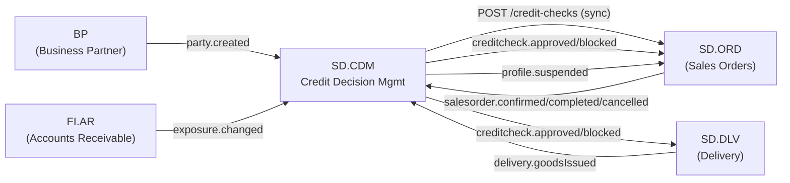
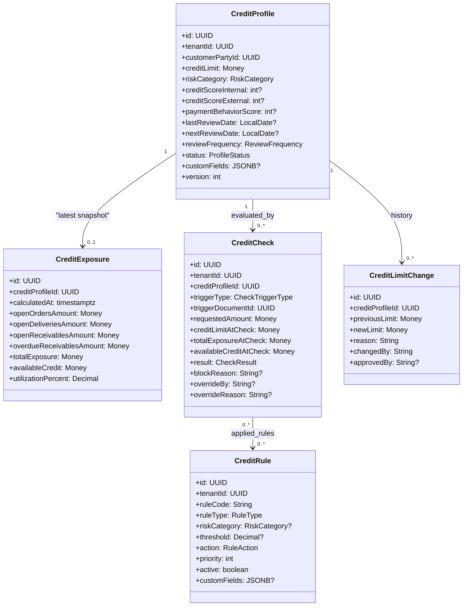
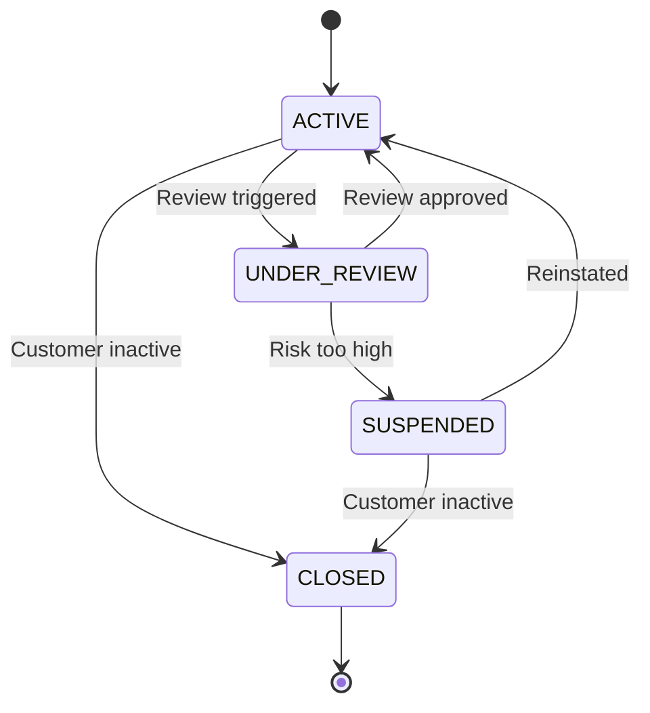
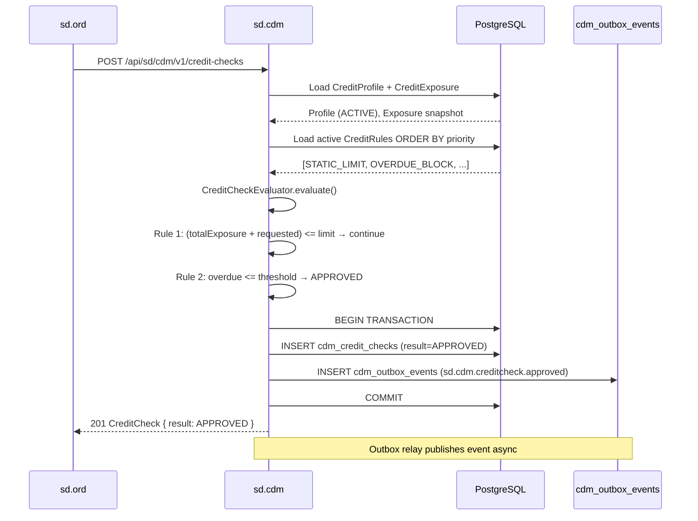
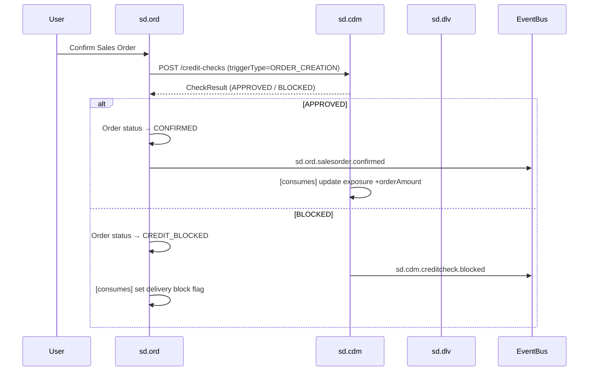
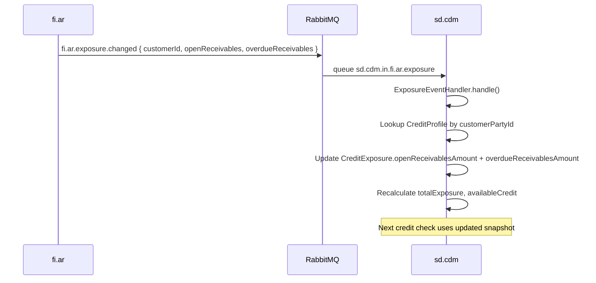
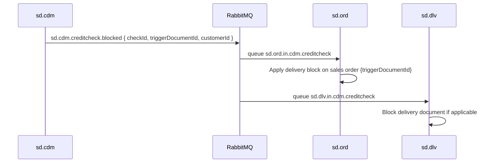
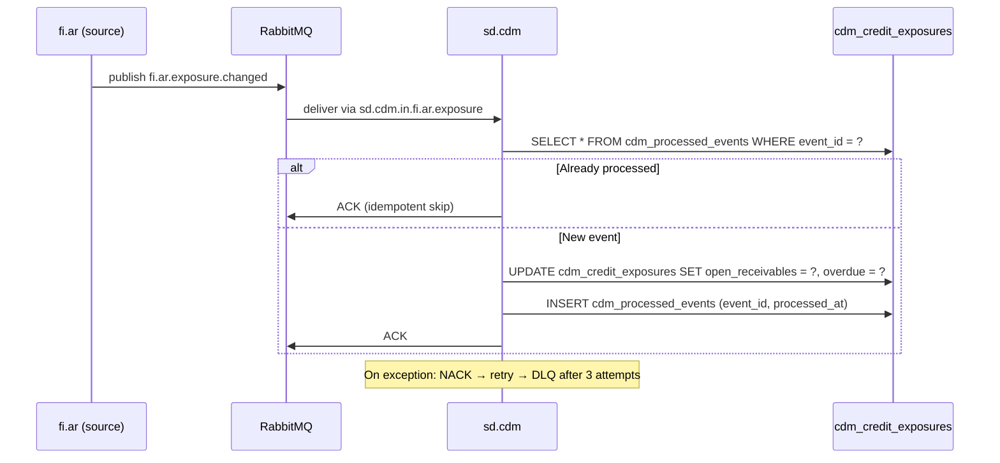
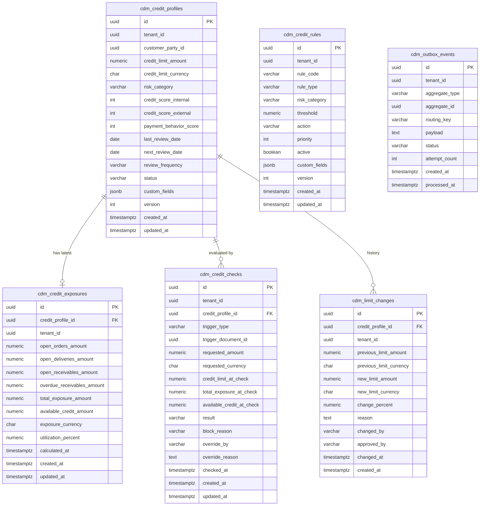

# SD.CDM - Credit Decision Management Domain / Service Specification

> **Conceptual Stack Layer:** Domain / Service
> **Space:** Platform
> **Owner:** Domain Engineering Team
> **Schema alignment:** `service-layer.schema.json`
> **Companion files:** `openapi.yaml`, `*.schema.json` (event contracts)
> **Referenced by:** Platform-Feature Spec SS5 (backend dependencies), BFF Contract
> **Belongs to:** SD Suite Spec (`_sd_suite.md`)

> **Meta Information**
> - **Version:** 2026-04-03
> - **Template:** `domain-service-spec.md` v1.0.0
> - **Template Compliance:** ~95% — all 16 sections populated; §11.2 feature register pending feature spec authoring (Q-CDM-005)
> - **Author(s):** OpenLeap Architecture Team
> - **Status:** DRAFT
> - **Suite:** `sd`
> - **Domain:** `cdm`
> - **Bounded Context Ref:** `bc:credit-management`
> - **Service ID:** `sd-cdm-svc`
> - **basePackage:** `io.openleap.sd.cdm`
> - **API Base Path:** `/api/sd/cdm/v1`
> - **OpenLeap Starter Version:** TBD
> - **Port:** TBD
> - **Repository:** TBD
> - **Tags:** `credit`, `risk`, `credit-check`, `credit-limit`, `exposure`
> - **Team:**
>   - Name: `team-sd`
>   - Email: `sd-team@openleap.io`
>   - Slack: `#sd-team`

---

## Specification Guidelines Compliance

**Non-Negotiables:**
- All aggregates have attribute tables with types and constraints
- All enumerations have value tables with descriptions
- All business rules have detailed definitions (context, statement, enforcement, examples)
- All use cases have Actor / Preconditions / Main Flow / Postconditions
- All published events have payload JSON and known consumers
- All consumed events have handler class, queue config, and failure handling
- All tables have full column definitions with types, nullability, and indexes

**Source of Truth Priority:**
1. This spec (SD.CDM domain model and rules)
2. `_sd_suite.md` (suite-level ADRs and conventions)
3. `https://github.com/openleap-io/io.openleap.dev.concepts/blob/main/conceptual-stack.md` (platform model)
4. `io.openleap.dev.guidelines` (implementation patterns)

**Style Guide:**
- Routing keys: `<suite>.<domain>.<aggregate>.<event>` (all lowercase, dot-separated)
- Queue names: `<suite>.<domain>.in.<source-suite>.<source-domain>.<topic>`
- Table names: `<domain>_<entity>` (snake_case, domain prefix)
- Java package: `io.openleap.<suite>.<domain>`
- Error codes: `<DOMAIN>_<REASON>` (screaming snake case)

---

## 0. Document Purpose & Scope

### 0.1 Purpose
This specification defines the Credit Decision Management domain, which assesses customer creditworthiness, manages credit limits, performs credit checks during the sales process, and controls order/delivery blocks based on credit risk.

### 0.2 Target Audience
- Product Owners & Business Stakeholders
- System Architects & Technical Leads
- Integration Engineers
- Development Teams implementing the sd-cdm-svc microservice

### 0.3 Scope
**In Scope:**
- Customer credit profiles and credit limit management
- Credit check execution (static and dynamic checks)
- Credit exposure calculation (open orders + open deliveries + open AR)
- Credit block/release on sales orders and deliveries
- Credit scoring rules and risk categories
- Credit review workflows

**Out of Scope:**
- Accounts receivable ledger (FI.AR — source of AR exposure data)
- Payment processing (fi.pay)
- External credit bureau integration (future — see Q-CDM-001)
- Collections and dunning (fac.col or FI domain)
- Credit insurance underwriting (see Q-CDM-002)

### 0.4 Related Documents
- `_sd_suite.md` — SD Suite overview and ADR-SD-003
- `sd_ord-spec.md` — Sales Orders (primary consumer of credit checks)
- `sd_dlv-spec.md` — Delivery (delivery block integration)
- `fi_ar-spec.md` — Accounts Receivable (source of receivables exposure)
- `bp_party-spec.md` — Business Partner (customer master)

---

## 1. Business Context

### 1.1 Domain Purpose
`sd.cdm` protects the business from credit risk by evaluating customer creditworthiness at key points in the order-to-cash cycle. It maintains credit profiles with limits and risk categories, calculates total credit exposure from multiple sources, and decides whether to approve or block transactions.

### 1.2 Business Value
- Reduced bad debt losses through proactive credit management
- Automated credit decisions speed up order processing (sub-300ms synchronous checks)
- Configurable risk policies per customer segment via CreditRule engine
- Full visibility into credit exposure across open orders, deliveries, and receivables
- Clean separation of credit authority from sales authority (CDM_OVERRIDE vs CDM_CONTROLLER roles)

### 1.3 Key Stakeholders

| Role | Responsibility | Primary Use Cases |
|------|----------------|-------------------|
| Credit Controller | Manage limits, review blocks, run periodic reviews | UC-CDM-001, UC-CDM-003 |
| Sales Manager | View credit status, request overrides for strategic customers | UC-CDM-004 |
| Finance Director | Set credit policies, approve high-limit increases | UC-CDM-002, UC-CDM-003 |
| Risk Analyst | Analyse portfolio risk, adjust risk categories | UC-CDM-001, UC-CDM-005 |
| System (sd.ord) | Request synchronous credit checks at order confirmation | UC-CDM-003 |
| System (sd.dlv) | Request credit check at delivery release | UC-CDM-003 |

### 1.4 Strategic Positioning

CDM is a **gating service** in the order-to-cash cycle. Every confirmed sales order and every released delivery must pass through a credit check before proceeding. This makes sd.cdm one of the highest-criticality services in the SD suite.

The design is analogous to the **SAP SD-BF-CM (Credit Management)** module. The equivalents are:
- `CreditProfile` ↔ SAP credit master record (FD32/FD33 transactions, KNKK table per credit control area)
- `CreditExposure` ↔ SAP open item exposure (S066/S067 tables)
- `CreditCheck` ↔ SAP credit check at order entry (credit check routine in pricing procedure)
- `CreditRule` ↔ SAP credit management tolerance groups and payment terms rules

Platform-wide, **sd.cdm is the single source of truth for credit decisions**. No other service may independently block or unblock a sales document for credit reasons — all such decisions must flow through CDM.

### 1.5 Service Context

**Responsibilities:**

| # | Responsibility | Notes |
|---|---------------|-------|
| 1 | Maintain CreditProfile per customer per tenant | One profile per (tenant, customerPartyId) |
| 2 | Maintain CreditExposure snapshot | Updated asynchronously via events |
| 3 | Execute synchronous credit checks | Called by sd.ord and sd.dlv |
| 4 | Manage CreditRule catalog | Tenant-level rule configuration |
| 5 | Record CreditLimitChange audit history | Immutable audit trail |
| 6 | Publish credit decision events | For sd.ord, sd.dlv to act on |
| 7 | Consume exposure events from FI.AR, SD.ORD, SD.DLV | Keep exposure snapshot current |

**Authoritative Sources:**

| Data | Owned By | CDM Consumes Via |
|------|----------|-----------------|
| Customer party identity | BP (bp.party-svc) | `bp.bp.party.created` event |
| Open receivables / overdue | FI.AR | `fi.ar.exposure.changed` event |
| Open orders amount | SD.ORD | `sd.ord.salesorder.confirmed/completed/cancelled` |
| Open deliveries amount | SD.DLV | `sd.dlv.delivery.goodsIssued` |
| Credit limit (authoritative) | SD.CDM | Owned and managed here |

**Context Diagram:**



---

## 2. Service Identity

| Property | Value | Schema Field |
|----------|-------|-------------|
| **Service ID** | `sd-cdm-svc` | `metadata.id` |
| **Display Name** | Credit Decision Management | `metadata.name` |
| **Suite** | `sd` | `metadata.suite` |
| **Domain** | `cdm` | `metadata.domain` |
| **Bounded Context** | `bc:credit-management` | `metadata.bounded_context_ref` |
| **Version** | `1.2.0` | `metadata.version` |
| **Status** | DRAFT | `metadata.status` |
| **API Base Path** | `/api/sd/cdm/v1` | `metadata.api_base_path` |
| **Base Package** | `io.openleap.sd.cdm` | `metadata.base_package` |
| **Port** | TBD | `metadata.port` |
| **Repository** | TBD | `metadata.repository` |

**Team:**

| Property | Value |
|----------|-------|
| **Team Name** | `team-sd` |
| **Email** | `sd-team@openleap.io` |
| **Slack** | `#sd-team` |

---

## 3. Domain Model

### 3.1 Conceptual Overview
The domain centers on the **CreditProfile** aggregate representing a customer's creditworthiness. Each profile holds the current credit limit, risk category, internal/external credit scores, and review schedule. Exposure is maintained as a snapshot in **CreditExposure**, updated asynchronously as orders, deliveries, and receivables change. **CreditCheck** records each credit evaluation as an immutable audit entry. **CreditRule** configures the rule engine that governs check behavior. **CreditLimitChange** provides an immutable audit trail of limit adjustments.

### 3.2 Core Concepts



**Lifecycle:**



### 3.3 Aggregate Definitions

#### 3.3.1 CreditProfile (Aggregate Root)

**Aggregate Properties:**

| Property | Value |
|----------|-------|
| **Aggregate ID** | `agg:credit-profile` |
| **Name** | `CreditProfile` |
| **Type** | Aggregate Root |
| **Table** | `cdm_credit_profiles` |
| **Invariants** | One profile per (tenantId, customerPartyId); creditLimit.amount ≥ 0 |

**Attribute Table:**

| Attribute | Type | Nullable | Constraint | Description |
|-----------|------|----------|------------|-------------|
| `id` | UUID | No | PK | Surrogate key, `OlUuid.create()` |
| `tenantId` | UUID | No | FK → tenants | Row-level security partition |
| `customerPartyId` | UUID | No | UK per tenant | References bp.party-svc |
| `creditLimit` | Money | No | amount ≥ 0 | Approved credit limit |
| `riskCategory` | RiskCategory | No | enum | Current risk classification |
| `creditScoreInternal` | int | Yes | 0–1000 | Internal behavioral score |
| `creditScoreExternal` | int | Yes | 0–1000 | External bureau score (Schufa, D&B) |
| `paymentBehaviorScore` | int | Yes | 0–100 | Derived from payment history |
| `lastReviewDate` | LocalDate | Yes | | Date of last credit review |
| `nextReviewDate` | LocalDate | Yes | ≥ lastReviewDate | Scheduled next review |
| `reviewFrequency` | ReviewFrequency | No | enum | How often profile is reviewed |
| `status` | ProfileStatus | No | enum | Current lifecycle status |
| `customFields` | JSONB | Yes | | Product-defined extension fields |
| `version` | int | No | optimistic lock | Incremented on every write |
| `createdAt` | timestamptz | No | | Insert timestamp |
| `updatedAt` | timestamptz | No | | Last update timestamp |

**State Descriptions:**

| State | Description |
|-------|-------------|
| `ACTIVE` | Profile is current; credit checks execute normally |
| `UNDER_REVIEW` | Periodic or triggered review in progress; checks may proceed with warning |
| `SUSPENDED` | All credit checks blocked; sales orders cannot be confirmed |
| `CLOSED` | Customer inactive; profile archived; no credit activity |

**Allowed Transitions:**

| From | To | Trigger | Event Emitted |
|------|----|---------|---------------|
| `ACTIVE` | `UNDER_REVIEW` | Scheduled review date reached or manual trigger | — |
| `UNDER_REVIEW` | `ACTIVE` | Review completed — no change required | — |
| `UNDER_REVIEW` | `SUSPENDED` | Review outcome: risk too high | `sd.cdm.profile.suspended` |
| `SUSPENDED` | `ACTIVE` | Credit controller reinstates | — |
| `ACTIVE` | `CLOSED` | Customer marked inactive in BP | — |
| `SUSPENDED` | `CLOSED` | Customer marked inactive in BP | — |

**Domain Events Emitted:**

| Event | When |
|-------|------|
| `CreditLimitChangedEvent` | `creditLimit` is updated |
| `RiskCategoryChangedEvent` | `riskCategory` is updated |
| `ProfileSuspendedEvent` | Status transitions to `SUSPENDED` |

#### 3.3.2 CreditExposure (Child Entity / Snapshot)

| Property | Value |
|----------|-------|
| **Type** | Child entity (snapshot) |
| **Parent** | `CreditProfile` |
| **Table** | `cdm_credit_exposures` |
| **Business Purpose** | Maintains a near-real-time snapshot of all open financial obligations for the customer; updated asynchronously via event handlers |

**Attribute Table:**

| Attribute | Type | Nullable | Constraint | Description |
|-----------|------|----------|------------|-------------|
| `id` | UUID | No | PK | `OlUuid.create()` |
| `creditProfileId` | UUID | No | FK → cdm_credit_profiles | Owning profile |
| `tenantId` | UUID | No | | For RLS |
| `calculatedAt` | timestamptz | No | | Snapshot timestamp |
| `openOrdersAmount` | Money | No | amount ≥ 0 | Open (not yet delivered) confirmed orders |
| `openDeliveriesAmount` | Money | No | amount ≥ 0 | Goods issued but not yet invoiced |
| `openReceivablesAmount` | Money | No | amount ≥ 0 | Outstanding invoices not yet due |
| `overdueReceivablesAmount` | Money | No | amount ≥ 0 | Invoices past due date |
| `totalExposure` | Money | No | = sum of above 4 | Derived; BR-CDM-002 |
| `availableCredit` | Money | No | = limit − totalExposure | May be negative if over limit |
| `utilizationPercent` | Decimal | No | 0–∞ | totalExposure / creditLimit × 100 |
| `createdAt` | timestamptz | No | | |
| `updatedAt` | timestamptz | No | | |

**Invariants:**
- `totalExposure = openOrdersAmount + openDeliveriesAmount + openReceivablesAmount + overdueReceivablesAmount` (BR-CDM-002)
- `availableCredit = creditLimit − totalExposure`
- There is at most one CreditExposure per CreditProfile (upsert pattern)

#### 3.3.3 CreditCheck (Child Entity)

| Property | Value |
|----------|-------|
| **Type** | Child entity (immutable audit record) |
| **Parent** | `CreditProfile` |
| **Table** | `cdm_credit_checks` |
| **Business Purpose** | Immutable record of every credit evaluation; used for audit, reporting, and override tracking |

**Attribute Table:**

| Attribute | Type | Nullable | Constraint | Description |
|-----------|------|----------|------------|-------------|
| `id` | UUID | No | PK | `OlUuid.create()` |
| `tenantId` | UUID | No | | For RLS |
| `creditProfileId` | UUID | No | FK → cdm_credit_profiles | Owning profile |
| `triggerType` | CheckTriggerType | No | enum | What triggered this check |
| `triggerDocumentId` | UUID | No | | ID of the triggering document (order, delivery) |
| `requestedAmount` | Money | No | amount > 0 | Net value of the document being checked |
| `creditLimitAtCheck` | Money | No | | Snapshot of limit at check time |
| `totalExposureAtCheck` | Money | No | | Snapshot of exposure at check time |
| `availableCreditAtCheck` | Money | No | | Snapshot of available credit at check time |
| `result` | CheckResult | No | enum | Final decision |
| `blockReason` | String | Yes | max 500 | Human-readable block reason |
| `overrideBy` | String | Yes | | User ID who overrode the block |
| `overrideReason` | String | Yes | max 1000 | Mandatory override justification |
| `checkedAt` | timestamptz | No | | When the check executed |
| `createdAt` | timestamptz | No | | |
| `updatedAt` | timestamptz | No | | |

**Invariants:**
- Once created, a CreditCheck record is **immutable** except for the override fields (`overrideBy`, `overrideReason`, `result`)
- `overrideBy` and `overrideReason` are both required if result changes from BLOCKED to APPROVED via override
- `blockReason` is required when result = BLOCKED

#### 3.3.4 CreditRule (Aggregate Root)

| Property | Value |
|----------|-------|
| **Aggregate ID** | `agg:credit-rule` |
| **Type** | Aggregate Root |
| **Table** | `cdm_credit_rules` |
| **Business Purpose** | Configurable rules applied during credit check evaluation; evaluated in priority order |

**Attribute Table:**

| Attribute | Type | Nullable | Constraint | Description |
|-----------|------|----------|------------|-------------|
| `id` | UUID | No | PK | `OlUuid.create()` |
| `tenantId` | UUID | No | UK with ruleCode | For RLS and multi-tenancy |
| `ruleCode` | String | No | UK per tenant, max 50 | Business identifier (e.g., `STATIC_LIMIT_DEFAULT`) |
| `ruleType` | RuleType | No | enum | Classification of rule logic |
| `riskCategory` | RiskCategory | Yes | enum | Optional: applies only to this risk category |
| `threshold` | Decimal | Yes | 0–100 | For OVERDUE_BLOCK: days; for PAYMENT_BEHAVIOR: score; for DYNAMIC_LIMIT: utilization % |
| `action` | RuleAction | No | enum | What the rule does when triggered |
| `priority` | int | No | 1–999 | Lower = higher priority; first matching rule wins |
| `active` | boolean | No | default true | Inactive rules are skipped |
| `customFields` | JSONB | Yes | | Product-defined rule parameters |
| `version` | int | No | optimistic lock | |
| `createdAt` | timestamptz | No | | |
| `updatedAt` | timestamptz | No | | |

**Lifecycle:** Rules can be toggled active/inactive via PATCH. Deleting a rule is a soft-delete (sets `active = false`). Rule changes take effect immediately for subsequent checks.

**Domain Events Emitted:** No domain events (rule changes are configuration; consumers poll as needed).

#### 3.3.5 CreditLimitChange (Child Entity)

| Property | Value |
|----------|-------|
| **Type** | Child entity (immutable audit log) |
| **Parent** | `CreditProfile` |
| **Table** | `cdm_limit_changes` |
| **Business Purpose** | Complete audit trail of all credit limit adjustments; required for SOX compliance |

**Attribute Table:**

| Attribute | Type | Nullable | Constraint | Description |
|-----------|------|----------|------------|-------------|
| `id` | UUID | No | PK | `OlUuid.create()` |
| `creditProfileId` | UUID | No | FK → cdm_credit_profiles | Owning profile |
| `tenantId` | UUID | No | | For RLS |
| `previousLimit` | Money | No | | Limit before change |
| `newLimit` | Money | No | amount ≥ 0 | Limit after change |
| `changePercent` | Decimal | No | | Derived: ((new − prev) / prev) × 100 |
| `reason` | String | No | max 1000 | Business justification |
| `changedBy` | String | No | max 100 | User ID or system identity |
| `approvedBy` | String | Yes | max 100 | Required when increase > threshold (BR-CDM-006) |
| `changedAt` | timestamptz | No | | |
| `createdAt` | timestamptz | No | | |

**Invariants:** Immutable after creation. No updates or deletes.

### 3.4 Enumerations

#### RiskCategory

| Value | Description | Typical Credit Behavior |
|-------|-------------|------------------------|
| `LOW` | Low-risk customer; strong payment history | Full credit limit; no restrictions |
| `MEDIUM` | Average risk; some late payments | Standard rules apply |
| `HIGH` | Elevated risk; recurring overdue items | Reduced limits; OVERDUE_BLOCK active |
| `CRITICAL` | Near-default customer | Minimal limit; all checks enforced strictly |
| `BLOCKED` | Credit explicitly blocked by controller | All transactions blocked regardless of exposure |

#### ReviewFrequency

| Value | Description |
|-------|-------------|
| `MONTHLY` | High-risk customers; review every 30 days |
| `QUARTERLY` | Standard commercial customers; every 90 days |
| `ANNUALLY` | Low-risk, long-standing customers; yearly review |

#### ProfileStatus

| Value | Description | Credit Checks Allowed? |
|-------|-------------|----------------------|
| `ACTIVE` | Normal operating state | Yes |
| `UNDER_REVIEW` | Review in progress | Yes, with warning |
| `SUSPENDED` | All credit activity blocked | No — all checks return BLOCKED |
| `CLOSED` | Customer inactive | No |

#### CheckTriggerType

| Value | Description | Calling Service |
|-------|-------------|----------------|
| `ORDER_CREATION` | New sales order created | sd.ord |
| `ORDER_CHANGE` | Sales order value increased | sd.ord |
| `DELIVERY_RELEASE` | Delivery document being released | sd.dlv |
| `MANUAL` | Credit controller requests check | CDM API |

#### CheckResult

| Value | Description | Action Required |
|-------|-------------|----------------|
| `APPROVED` | Check passed; proceed | None |
| `APPROVED_WITH_WARNING` | Check passed but exposure is high | Optional notification |
| `BLOCKED` | Check failed; document blocked | blockReason populated; sd.ord/sd.dlv must halt |

#### RuleType

| Value | Description |
|-------|-------------|
| `STATIC_LIMIT` | Block if (totalExposure + requestedAmount) > creditLimit |
| `DYNAMIC_LIMIT` | Block if utilizationPercent > threshold% |
| `OVERDUE_BLOCK` | Block if any receivable is overdue by more than threshold days |
| `PAYMENT_BEHAVIOR` | Warn or block based on paymentBehaviorScore < threshold |
| `CUSTOM` | Product-defined logic via extension rule (EXT-RULE-CDM-001) |

#### RuleAction

| Value | Description |
|-------|-------------|
| `APPROVE` | Explicitly approve (short-circuit; no further rule evaluation) |
| `WARN` | Allow but set result to APPROVED_WITH_WARNING |
| `BLOCK` | Fail the credit check; set result to BLOCKED |

### 3.5 Shared Types

#### Money (Value Object)

| Field | Type | Nullable | Constraint | Description |
|-------|------|----------|------------|-------------|
| `amount` | Decimal | No | ≥ 0, precision 19 scale 4 | Monetary amount |
| `currencyCode` | String | No | ISO 4217, exactly 3 chars | E.g., `EUR`, `USD`, `GBP` |

Used by: `CreditProfile.creditLimit`, `CreditExposure.*Amount`, `CreditCheck.requestedAmount` / `creditLimitAtCheck` / `totalExposureAtCheck` / `availableCreditAtCheck`, `CreditLimitChange.previousLimit` / `newLimit`.

Stored in PostgreSQL as two columns: `amount_value NUMERIC(19,4)`, `amount_currency CHAR(3)`.

---

## 4. Business Rules & Constraints

### 4.1 Business Rules Catalog

| ID | Rule Name | Description | Scope | Enforcement | Error Code |
|----|-----------|-------------|-------|-------------|------------|
| BR-CDM-001 | Profile Required | Customer MUST have CreditProfile for credit terms | CreditCheck | Application | `CDM_NO_PROFILE` |
| BR-CDM-002 | Exposure Formula | total = orders + deliveries + receivables + overdue | CreditExposure | Domain Object | — |
| BR-CDM-003 | Over-Limit Block | Block if (totalExposure + requestedAmount) > creditLimit | CreditCheck | Domain Service | `CDM_OVER_LIMIT` |
| BR-CDM-004 | Overdue Block | Block if overdue receivables > X days per risk category | CreditCheck | Domain Service | `CDM_OVERDUE` |
| BR-CDM-005 | Override Authority | CDM_OVERRIDE role + non-empty reason required | CreditCheck | Application | `CDM_UNAUTHORIZED` |
| BR-CDM-006 | Limit Approval | Increases above 20% or above €50k require manager approval | CreditProfile | Application | `CDM_APPROVAL_REQUIRED` |

### 4.2 Detailed Rule Definitions

#### BR-CDM-001: Profile Required

| Property | Value |
|----------|-------|
| **Business Context** | Every customer operating on credit terms must have an active CreditProfile before any credit-gated transaction can proceed. Without a profile, the system cannot determine creditworthiness. |
| **Rule Statement** | Before executing a credit check, the system MUST verify that a CreditProfile with status ACTIVE or UNDER_REVIEW exists for the (tenantId, customerPartyId) pair. |
| **Applies To** | `CreditCheck` — application service layer, pre-condition check |
| **Enforcement** | Synchronous; checked before any check logic executes |
| **Validation Logic** | `SELECT id FROM cdm_credit_profiles WHERE tenant_id = ? AND customer_party_id = ? AND status IN ('ACTIVE', 'UNDER_REVIEW')` — if not found, raise error |
| **Error Handling** | HTTP 422 with code `CDM_NO_PROFILE`; message: "No active credit profile found for customer {customerPartyId}" |
| **Examples** | New customer created in BP but credit profile not yet set up → all credit checks fail with CDM_NO_PROFILE until profile is created |

#### BR-CDM-002: Exposure Formula

| Property | Value |
|----------|-------|
| **Business Context** | Credit exposure represents the total amount the business is at risk for a given customer at any point in time. The formula must be deterministic and consistent across all calculation events. |
| **Rule Statement** | `totalExposure = openOrdersAmount + openDeliveriesAmount + openReceivablesAmount + overdueReceivablesAmount`. All four components must be in the same currency as the credit limit. |
| **Applies To** | `CreditExposure` — domain object invariant |
| **Enforcement** | Enforced at every write to `cdm_credit_exposures`; database check constraint |
| **Validation Logic** | After update of any component, recalculate totalExposure and availableCredit atomically in the same transaction |
| **Error Handling** | Any inconsistency is a programming error; log error and throw InternalException |
| **Examples** | openOrders=10,000 + openDeliveries=5,000 + openReceivables=8,000 + overdue=2,000 = totalExposure=25,000; availableCredit=creditLimit−25,000 |

#### BR-CDM-003: Over-Limit Block

| Property | Value |
|----------|-------|
| **Business Context** | The core credit check: if confirming the requested transaction would push the customer over their credit limit, the transaction must be blocked. |
| **Rule Statement** | If `(totalExposure + requestedAmount) > creditLimit`, the check result is BLOCKED with reason "Credit limit exceeded". |
| **Applies To** | `CreditCheck` — domain service `CreditCheckEvaluator` |
| **Enforcement** | Applied by highest-priority STATIC_LIMIT rule; threshold is the creditLimit itself |
| **Validation Logic** | `availableCreditAtCheck < requestedAmount` → block |
| **Error Handling** | Result set to BLOCKED; `blockReason` = "Credit limit of {limit} exceeded. Available: {available}. Requested: {requested}." |
| **Examples** | Limit=50,000; totalExposure=46,000; requestedAmount=6,000 → 46,000+6,000=52,000 > 50,000 → BLOCKED |

#### BR-CDM-004: Overdue Block

| Property | Value |
|----------|-------|
| **Business Context** | Customers with overdue receivables present an elevated risk independent of their credit limit. The overdue threshold varies by risk category. |
| **Rule Statement** | If `overdueReceivablesAmount > 0` AND the oldest overdue invoice exceeds X days (configurable per risk category via CreditRule threshold), block the transaction. |
| **Applies To** | `CreditCheck` — OVERDUE_BLOCK rules in CreditRule catalog |
| **Enforcement** | Evaluated after limit check; threshold in days stored on CreditRule.threshold |
| **Validation Logic** | Query oldest overdue receivable age from FI.AR exposure data; compare to active OVERDUE_BLOCK rules |
| **Error Handling** | BLOCKED; `blockReason` = "Overdue receivables of {amount} exceed {days}-day threshold." |
| **Examples** | Risk=HIGH, threshold=30 days; customer has invoice 45 days overdue → BLOCKED |

#### BR-CDM-005: Override Authority

| Property | Value |
|----------|-------|
| **Business Context** | Sales teams may need to release a blocked order for strategic reasons (e.g., key account with payment commitment). This must be tracked and auditable. |
| **Rule Statement** | A BLOCKED CreditCheck can be overridden to APPROVED only by a user holding the `CDM_OVERRIDE` role. The `overrideReason` field is mandatory (minimum 20 characters). |
| **Applies To** | `POST /credit-checks/{id}:override` — application layer security check |
| **Enforcement** | Role check via JWT claims; reason length validated before state change |
| **Validation Logic** | `hasRole('CDM_OVERRIDE') && overrideReason.length() >= 20` |
| **Error Handling** | HTTP 403 with `CDM_UNAUTHORIZED` if role missing; HTTP 422 if reason too short |
| **Examples** | Sales manager (CDM_MANAGER) can override a BLOCKED check with reason "Key account commitment received via phone 2026-04-03" |

#### BR-CDM-006: Limit Approval

| Property | Value |
|----------|-------|
| **Business Context** | Uncontrolled credit limit increases create financial exposure. Increases above a material threshold require a second approver to prevent unilateral escalation. |
| **Rule Statement** | If a credit limit increase is more than 20% of the current limit OR more than €50,000 absolute increase, the `approvedBy` field is mandatory. |
| **Applies To** | `PATCH /credit-profiles/{id}` — application service `CreditProfileService.updateLimit()` |
| **Enforcement** | Pre-condition check before persisting CreditLimitChange |
| **Validation Logic** | `increasePercent > 20% || increaseAbsolute > 50000` → require `approvedBy` in request |
| **Error Handling** | HTTP 422 with `CDM_APPROVAL_REQUIRED`; message includes calculated increase percentage |
| **Examples** | Current limit=100,000; new limit requested=130,000 → 30% increase → `approvedBy` required |

### 4.3 Data Validation Rules

**Field-Level Validations:**

| Field | Rule |
|-------|------|
| `CreditProfile.creditLimit.amount` | Required; ≥ 0; max 999,999,999.9999 |
| `CreditProfile.creditLimit.currencyCode` | Required; exactly 3 uppercase letters; must exist in ref-data currency list |
| `CreditProfile.customerPartyId` | Required; must reference a known party in bp.party-svc |
| `CreditProfile.nextReviewDate` | If present: must be ≥ today |
| `CreditProfile.reviewFrequency` | Required; must be a valid ReviewFrequency enum value |
| `CreditRule.ruleCode` | Required; unique per tenant; max 50 chars; regex `[A-Z0-9_]+` |
| `CreditRule.priority` | Required; 1–999 |
| `CreditRule.threshold` | Required for OVERDUE_BLOCK (days: 1–365), DYNAMIC_LIMIT (percent: 1–200), PAYMENT_BEHAVIOR (score: 0–100) |
| `CreditCheck.requestedAmount.amount` | Required; > 0 |
| `CreditLimitChange.reason` | Required; min 10 chars; max 1000 chars |

**Cross-Field Validations:**

| Rule | Description |
|------|-------------|
| `nextReviewDate >= lastReviewDate` | If both provided, next must be after last |
| `requestedAmount.currencyCode == creditLimit.currencyCode` | Currency mismatch not supported in v1 (Q-CDM-003) |
| `overrideBy != null ↔ overrideReason != null` | Both must be set together |
| `newLimit >= 0` | Credit limit cannot be negative |
| `previousLimit == current creditLimit` | Concurrency check in CreditLimitChange creation |

### 4.4 Reference Data Dependencies

| Ref Data | Provider Service | Endpoint / Event | Usage |
|----------|-----------------|------------------|-------|
| Currency codes (ISO 4217) | `ref-data-svc` | `GET /api/ref/data/v1/currencies` | Validate `Money.currencyCode` |
| Customer party | `bp.party-svc` | `GET /api/bp/party/v1/parties/{id}` | Validate `customerPartyId` on profile creation |

---

## 5. Use Cases

### 5.1 Business Logic Placement

| Logic Type | Example | Implemented In |
|------------|---------|----------------|
| Aggregate invariants (single aggregate) | `totalExposure = sum of components` (BR-CDM-002) | `CreditExposure` domain object |
| State machine transitions | ACTIVE → UNDER_REVIEW | `CreditProfile` domain object |
| Cross-aggregate rules | Override requires CDM_OVERRIDE role | `CreditCheckService` domain service |
| Rule engine evaluation | Apply STATIC_LIMIT, OVERDUE_BLOCK rules in priority order | `CreditCheckEvaluator` domain service |
| Orchestration / side effects | Publish outbox events after check | `CreditCheckApplicationService` application service |
| Inbound event handling | Consume `fi.ar.exposure.changed`, update exposure | `ExposureEventHandler` application service |

### 5.2 Use Cases (Canonical Format)

#### UC-CDM-001: Set Up Credit Profile

| Field | Value |
|-------|-------|
| **ID** | `SetUpCreditProfile` |
| **Type** | WRITE |
| **Trigger** | REST or Message (`bp.bp.party.created` event) |
| **Aggregate** | `CreditProfile` |
| **Domain Operation** | `CreditProfile.create` |
| **Inputs** | `customerPartyId: UUID`, `creditLimit: Money`, `riskCategory: RiskCategory`, `reviewFrequency: ReviewFrequency` |
| **Outputs** | `CreditProfile` (ACTIVE) |
| **Events** | — |
| **REST** | `POST /api/sd/cdm/v1/credit-profiles` |
| **Idempotency** | Required (idempotency key header) |

**Actor:** Credit Controller, System (triggered by `bp.bp.party.created`)

**Preconditions:**
- Customer party exists in bp.party-svc
- No existing ACTIVE/UNDER_REVIEW/SUSPENDED profile for (tenantId, customerPartyId)
- Currency code is valid (ref-data-svc)

**Main Flow:**
1. Receive request with customerPartyId, creditLimit, riskCategory, reviewFrequency
2. Validate customer party exists in BP (synchronous call or from event payload)
3. Check for duplicate profile (unique constraint violation → idempotent return)
4. Calculate `nextReviewDate` from `reviewFrequency` + today
5. Persist `CreditProfile` with status ACTIVE, version=1
6. Initialize `CreditExposure` with all amounts = 0
7. Return 201 Created with CreditProfile payload

**Postconditions:**
- CreditProfile exists with status ACTIVE
- CreditExposure snapshot exists with zero values
- CreditLimitChange record created as "initial creation" entry

**Business Rules Applied:** BR-CDM-001 (indirectly — profile must exist for future checks)

**Alternative Flows:**
- A1: Auto-creation from `bp.bp.party.created` — uses default creditLimit=0 and riskCategory=MEDIUM; credit controller must update before any order can be confirmed

**Exception Flows:**
- E1: customerPartyId not found in BP → HTTP 422, `CDM_INVALID_PARTY`
- E2: Duplicate profile exists → HTTP 409, `CDM_PROFILE_EXISTS`
- E3: Invalid currency code → HTTP 422, `CDM_INVALID_CURRENCY`

---

#### UC-CDM-002: Configure Credit Rules

| Field | Value |
|-------|-------|
| **ID** | `ConfigureCreditRules` |
| **Type** | WRITE |
| **Trigger** | REST |
| **Aggregate** | `CreditRule` |
| **Domain Operation** | `CreditRule.create` |
| **Inputs** | `ruleCode: String`, `ruleType: RuleType`, `threshold: Decimal?`, `action: RuleAction`, `priority: int` |
| **Outputs** | `CreditRule` |
| **REST** | `POST /api/sd/cdm/v1/credit-rules` |

**Actor:** Finance Director, CDM Administrator

**Preconditions:**
- Caller has `CDM_MANAGER` or `CDM_ADMIN` role
- `ruleCode` is unique per tenant

**Main Flow:**
1. Validate ruleCode uniqueness per tenant
2. Validate threshold is appropriate for ruleType (BR: see §4.3)
3. Persist CreditRule with active=true
4. Return 201 Created

**Postconditions:** New rule is immediately active for subsequent credit checks (priority-ordered evaluation)

**Business Rules Applied:** validation rules §4.3

**Exception Flows:**
- E1: Duplicate ruleCode → HTTP 409, `CDM_RULE_EXISTS`
- E2: Invalid threshold for ruleType → HTTP 422, `CDM_INVALID_THRESHOLD`

---

#### UC-CDM-003: Execute Credit Check

| Field | Value |
|-------|-------|
| **ID** | `ExecuteCreditCheck` |
| **Type** | WRITE |
| **Trigger** | REST (called synchronously by sd.ord, sd.dlv) |
| **Aggregate** | `CreditProfile` |
| **Domain Operation** | `CreditCheckEvaluator.evaluate` |
| **Inputs** | `customerPartyId: UUID`, `triggerType: CheckTriggerType`, `triggerDocumentId: UUID`, `requestedAmount: Money` |
| **Outputs** | `CreditCheck` (APPROVED / BLOCKED / APPROVED_WITH_WARNING) |
| **Events** | `sd.cdm.creditcheck.approved` or `sd.cdm.creditcheck.blocked` |
| **REST** | `POST /api/sd/cdm/v1/credit-checks` |
| **Idempotency** | Required |
| **Errors** | `CDM_NO_PROFILE`, `CDM_OVER_LIMIT`, `CDM_OVERDUE` |

**Actor:** System (sd.ord at order confirmation; sd.dlv at delivery release)

**Preconditions:**
- CreditProfile exists for (tenantId, customerPartyId) with status ACTIVE or UNDER_REVIEW (BR-CDM-001)
- requestedAmount > 0

**Main Flow:**
1. Load CreditProfile and latest CreditExposure for customer
2. Snapshot check-time values: creditLimitAtCheck, totalExposureAtCheck, availableCreditAtCheck
3. Load active CreditRules ordered by priority ASC
4. Evaluate rules in sequence; first BLOCK action terminates evaluation
5. Determine result: APPROVED, BLOCKED, or APPROVED_WITH_WARNING
6. Persist CreditCheck record (immutable)
7. Write to outbox: `sd.cdm.creditcheck.approved` or `sd.cdm.creditcheck.blocked`
8. Return CreditCheck synchronously

**Postconditions:**
- CreditCheck record persisted
- Outbox event written in same transaction
- Result returned to caller in < 300ms (p95)

**Business Rules Applied:** BR-CDM-001, BR-CDM-002, BR-CDM-003, BR-CDM-004

**Alternative Flows:**
- A1: Profile status = SUSPENDED → result = BLOCKED immediately (no rule evaluation), reason = "Credit profile suspended"
- A2: No active CreditRules configured → result = APPROVED_WITH_WARNING (fail-open; configurable)

**Exception Flows:**
- E1: Profile not found → HTTP 422, `CDM_NO_PROFILE`
- E2: Currency mismatch → HTTP 422, `CDM_CURRENCY_MISMATCH` (Q-CDM-003)

---

#### UC-CDM-004: Override Credit Block

| Field | Value |
|-------|-------|
| **ID** | `OverrideCreditBlock` |
| **Type** | WRITE |
| **Trigger** | REST |
| **Aggregate** | `CreditProfile` |
| **Domain Operation** | `CreditCheck.override` |
| **Inputs** | `checkId: UUID`, `overrideReason: String (min 20 chars)` |
| **Outputs** | `CreditCheck` (result = APPROVED, overrideBy and overrideReason populated) |
| **Events** | `sd.cdm.creditcheck.approved` |
| **REST** | `POST /api/sd/cdm/v1/credit-checks/{id}:override` |
| **Idempotency** | Required |
| **Errors** | `CDM_UNAUTHORIZED`, `CDM_NOT_BLOCKED` |

**Actor:** Sales Manager (CDM_OVERRIDE role), Credit Manager (CDM_MANAGER role)

**Preconditions:**
- Caller has `CDM_OVERRIDE` or `CDM_MANAGER` role (BR-CDM-005)
- CreditCheck exists with result = BLOCKED
- `overrideReason` ≥ 20 characters

**Main Flow:**
1. Load CreditCheck; verify result = BLOCKED
2. Verify caller role (JWT claim)
3. Update `result = APPROVED`, `overrideBy = callerUserId`, `overrideReason = reason`
4. Write to outbox: `sd.cdm.creditcheck.approved` (with `overridden = true` flag)
5. Return updated CreditCheck

**Postconditions:**
- CreditCheck.result = APPROVED
- Audit trail preserved (overrideBy, overrideReason recorded)
- sd.ord/sd.dlv receives `creditcheck.approved` event and can proceed

**Business Rules Applied:** BR-CDM-005

**Exception Flows:**
- E1: Check not in BLOCKED state → HTTP 409, `CDM_NOT_BLOCKED`
- E2: Insufficient role → HTTP 403, `CDM_UNAUTHORIZED`
- E3: Reason too short → HTTP 422, reason must be ≥ 20 characters

---

#### UC-CDM-005: Get Credit Profile with Exposure

| Field | Value |
|-------|-------|
| **ID** | `GetCreditProfileWithExposure` |
| **Type** | READ |
| **Trigger** | REST |
| **Aggregate** | `CreditProfile` + `CreditExposure` |
| **Domain Operation** | Read projection |
| **Inputs** | `id: UUID` or `customerPartyId: UUID` |
| **Outputs** | CreditProfile + latest CreditExposure (combined projection) |
| **REST** | `GET /api/sd/cdm/v1/credit-profiles/{id}` |

**Actor:** Credit Controller, Sales Manager (CDM_VIEWER minimum role)

**Preconditions:** CreditProfile exists

**Main Flow:**
1. Load CreditProfile by id
2. Join latest CreditExposure (by calculatedAt DESC, limit 1)
3. Calculate derived fields: utilizationPercent, availableCredit
4. Return combined projection

**Postconditions:** No state change

**Exception Flows:** E1: Profile not found → HTTP 404

---

#### UC-CDM-006: Recalculate Credit Exposure

| Field | Value |
|-------|-------|
| **ID** | `RecalculateCreditExposure` |
| **Type** | WRITE |
| **Trigger** | Event (`fi.ar.exposure.changed`, `sd.ord.salesorder.*`, `sd.dlv.delivery.goodsIssued`) or REST (`POST /credit-profiles/{id}:recalculate-exposure`) |
| **Aggregate** | `CreditExposure` |
| **Domain Operation** | `CreditExposure.recalculate` |
| **Inputs** | `creditProfileId: UUID`, updated component amounts |
| **Outputs** | Updated `CreditExposure` snapshot |
| **Events** | — |

**Actor:** System (event handlers), Credit Controller (manual trigger)

**Preconditions:** CreditProfile exists and is ACTIVE or UNDER_REVIEW

**Main Flow:**
1. Load current CreditExposure for profile
2. Update the relevant component (openOrders / openDeliveries / openReceivables / overdue)
3. Recalculate `totalExposure` and `availableCredit` (BR-CDM-002)
4. Upsert CreditExposure record with new `calculatedAt`
5. No event published (exposure change does not trigger downstream events directly)

**Postconditions:** CreditExposure snapshot is current; next credit check uses updated values

**Exception Flows:** E1: Concurrent update conflict → retry with exponential backoff (optimistic locking)

### 5.3 Process Flow Diagrams



### 5.4 Cross-Domain Workflows

#### Workflow 1: Credit Check at Order Confirmation (Choreography)



#### Workflow 2: Exposure Update on AR Change (Event-Driven)



#### Workflow 3: Auto-Block Propagation



---

## 6. REST API

### 6.1 API Overview

**Base Path:** `/api/sd/cdm/v1`
**Authentication:** Bearer token (JWT); tenant resolved from `tenantId` claim
**Content-Type:** `application/json`
**Versioning:** URL path versioning (`/v1`, `/v2`)
**Pagination:** `page` (0-based) + `size` (default 20, max 100); response includes `totalElements`, `totalPages`
**Idempotency:** `Idempotency-Key: <uuid>` header on all POST mutation requests
**ETag:** Optimistic concurrency for PATCH via `If-Match: "<version>"` header

### 6.2 Resource Operations

#### Credit Profiles

**POST /credit-profiles** — Create credit profile

```http
POST /api/sd/cdm/v1/credit-profiles
Content-Type: application/json
Idempotency-Key: 550e8400-e29b-41d4-a716-446655440001

{
  "customerPartyId": "a1b2c3d4-0000-0000-0000-000000000001",
  "creditLimit": { "amount": 50000.00, "currencyCode": "EUR" },
  "riskCategory": "MEDIUM",
  "reviewFrequency": "QUARTERLY"
}
```

```http
HTTP/1.1 201 Created
Location: /api/sd/cdm/v1/credit-profiles/f47ac10b-58cc-4372-a567-0e02b2c3d479
ETag: "1"

{
  "id": "f47ac10b-58cc-4372-a567-0e02b2c3d479",
  "tenantId": "tenant-001",
  "customerPartyId": "a1b2c3d4-0000-0000-0000-000000000001",
  "creditLimit": { "amount": 50000.00, "currencyCode": "EUR" },
  "riskCategory": "MEDIUM",
  "status": "ACTIVE",
  "reviewFrequency": "QUARTERLY",
  "nextReviewDate": "2026-07-03",
  "version": 1,
  "createdAt": "2026-04-03T10:00:00Z"
}
```

*Business Rules Checked:* BR-CDM-001 (no duplicate), customer party validation
*Error Responses:* 409 `CDM_PROFILE_EXISTS`, 422 `CDM_INVALID_PARTY`, 422 `CDM_INVALID_CURRENCY`

---

**GET /credit-profiles/{id}** — Retrieve profile with exposure

```http
GET /api/sd/cdm/v1/credit-profiles/f47ac10b-58cc-4372-a567-0e02b2c3d479

HTTP/1.1 200 OK
ETag: "3"

{
  "id": "f47ac10b-58cc-4372-a567-0e02b2c3d479",
  "customerPartyId": "a1b2c3d4-0000-0000-0000-000000000001",
  "creditLimit": { "amount": 50000.00, "currencyCode": "EUR" },
  "riskCategory": "MEDIUM",
  "status": "ACTIVE",
  "creditScoreInternal": 720,
  "paymentBehaviorScore": 85,
  "reviewFrequency": "QUARTERLY",
  "nextReviewDate": "2026-07-03",
  "version": 3,
  "exposure": {
    "openOrdersAmount": { "amount": 12000.00, "currencyCode": "EUR" },
    "openDeliveriesAmount": { "amount": 5000.00, "currencyCode": "EUR" },
    "openReceivablesAmount": { "amount": 8000.00, "currencyCode": "EUR" },
    "overdueReceivablesAmount": { "amount": 0.00, "currencyCode": "EUR" },
    "totalExposure": { "amount": 25000.00, "currencyCode": "EUR" },
    "availableCredit": { "amount": 25000.00, "currencyCode": "EUR" },
    "utilizationPercent": 50.00,
    "calculatedAt": "2026-04-03T09:55:00Z"
  }
}
```

---

**PATCH /credit-profiles/{id}** — Update limit, risk category

```http
PATCH /api/sd/cdm/v1/credit-profiles/f47ac10b-58cc-4372-a567-0e02b2c3d479
If-Match: "3"
Content-Type: application/json

{
  "creditLimit": { "amount": 75000.00, "currencyCode": "EUR" },
  "riskCategory": "LOW",
  "reason": "Annual review completed - payment history excellent",
  "approvedBy": "user-finance-director-001"
}
```

```http
HTTP/1.1 200 OK
ETag: "4"

{ ... updated CreditProfile ... }
```

*Business Rules Checked:* BR-CDM-006 (limit increase threshold)
*Events Published:* `sd.cdm.limit.changed`, `sd.cdm.riskcategory.changed`
*Error Responses:* 409 `CDM_VERSION_CONFLICT` (ETag mismatch), 422 `CDM_APPROVAL_REQUIRED`

---

**POST /credit-profiles/{id}:recalculate-exposure** — Force recalculation

```http
POST /api/sd/cdm/v1/credit-profiles/f47ac10b-58cc-4372-a567-0e02b2c3d479:recalculate-exposure
HTTP/1.1 200 OK
{ ... updated CreditExposure ... }
```

---

**GET /credit-profiles/{id}/limit-history** — List limit changes

```http
GET /api/sd/cdm/v1/credit-profiles/f47ac10b-58cc-4372-a567-0e02b2c3d479/limit-history
HTTP/1.1 200 OK

{
  "content": [
    {
      "id": "...",
      "previousLimit": { "amount": 50000.00, "currencyCode": "EUR" },
      "newLimit": { "amount": 75000.00, "currencyCode": "EUR" },
      "changePercent": 50.0,
      "reason": "Annual review completed...",
      "changedBy": "user-credit-controller-001",
      "approvedBy": "user-finance-director-001",
      "changedAt": "2026-04-03T10:30:00Z"
    }
  ],
  "totalElements": 1,
  "totalPages": 1
}
```

---

#### Credit Checks

**POST /credit-checks** — Execute credit check

```http
POST /api/sd/cdm/v1/credit-checks
Idempotency-Key: 550e8400-e29b-41d4-a716-446655440002

{
  "customerPartyId": "a1b2c3d4-0000-0000-0000-000000000001",
  "triggerType": "ORDER_CREATION",
  "triggerDocumentId": "order-uuid-001",
  "requestedAmount": { "amount": 8000.00, "currencyCode": "EUR" }
}
```

```http
HTTP/1.1 201 Created

{
  "id": "check-uuid-001",
  "creditProfileId": "f47ac10b-58cc-4372-a567-0e02b2c3d479",
  "triggerType": "ORDER_CREATION",
  "triggerDocumentId": "order-uuid-001",
  "requestedAmount": { "amount": 8000.00, "currencyCode": "EUR" },
  "creditLimitAtCheck": { "amount": 50000.00, "currencyCode": "EUR" },
  "totalExposureAtCheck": { "amount": 25000.00, "currencyCode": "EUR" },
  "availableCreditAtCheck": { "amount": 25000.00, "currencyCode": "EUR" },
  "result": "APPROVED",
  "checkedAt": "2026-04-03T10:31:00Z"
}
```

*Events Published:* `sd.cdm.creditcheck.approved`
*Error Responses:* 422 `CDM_NO_PROFILE`

---

**POST /credit-checks/{id}:override** — Override block

```http
POST /api/sd/cdm/v1/credit-checks/check-uuid-blocked:override
{
  "overrideReason": "Key account agreed to payment commitment via email 2026-04-03 - approved by Finance Director"
}
```

```http
HTTP/1.1 200 OK
{
  "id": "check-uuid-blocked",
  "result": "APPROVED",
  "overrideBy": "user-sales-manager-001",
  "overrideReason": "Key account agreed to payment commitment...",
  "checkedAt": "..."
}
```

*Business Rules Checked:* BR-CDM-005
*Events Published:* `sd.cdm.creditcheck.approved` (with `overridden: true`)
*Error Responses:* 403 `CDM_UNAUTHORIZED`, 409 `CDM_NOT_BLOCKED`

---

#### Credit Rules

**GET /credit-rules** — List active rules

```http
GET /api/sd/cdm/v1/credit-rules?active=true&page=0&size=20

HTTP/1.1 200 OK
{
  "content": [
    {
      "id": "rule-uuid-001",
      "ruleCode": "STATIC_LIMIT_DEFAULT",
      "ruleType": "STATIC_LIMIT",
      "action": "BLOCK",
      "priority": 1,
      "active": true
    },
    {
      "id": "rule-uuid-002",
      "ruleCode": "OVERDUE_BLOCK_HIGH_RISK",
      "ruleType": "OVERDUE_BLOCK",
      "riskCategory": "HIGH",
      "threshold": 30,
      "action": "BLOCK",
      "priority": 2,
      "active": true
    }
  ],
  "totalElements": 2
}
```

**POST /credit-rules** — Create rule (see UC-CDM-002)

**PATCH /credit-rules/{id}** — Update rule (threshold, priority, active flag)
- `If-Match: "<version>"` required; returns updated rule

**DELETE /credit-rules/{id}** — Soft-delete (sets `active = false`)

```http
DELETE /api/sd/cdm/v1/credit-rules/rule-uuid-002
HTTP/1.1 204 No Content
```

### 6.3 Business Operations

The `:override` operation follows the **custom action pattern** (POST with action suffix):
- URL: `POST /resource/{id}:action`
- Always requires `Idempotency-Key` header
- Returns the full updated resource
- Publishes relevant domain events via outbox
- Caller does NOT need to poll; response contains final state

### 6.4 OpenAPI Specification

The normative OpenAPI specification is maintained at:
- **Source:** `openapi.yaml` (companion file to this spec)
- **Schema:** OpenAPI 3.1.0
- **Security Scheme:** `bearerAuth` (JWT)
- **Servers:** `https://api.openleap.io/api/sd/cdm/v1` (production)

---

## 7. Events & Integration

### 7.1 Architecture Pattern

- **Broker:** RabbitMQ (topic exchange model per ADR-003)
- **Publishing Pattern:** Transactional outbox via `cdm_outbox_events` table (ADR-013)
- **Delivery Guarantee:** At-least-once (ADR-014); consumers must be idempotent
- **Event Format:** Thin events — IDs + changeType, not full entity payloads (ADR-011)
- **Exchange:** `sd.cdm.events` (type: topic, durable, not auto-delete)
- **Envelope:** Standard OpenLeap event envelope (see §7.2)

### 7.2 Published Events

#### sd.cdm.creditcheck.approved

| Property | Value |
|----------|-------|
| **Routing Key** | `sd.cdm.creditcheck.approved` |
| **When Published** | Credit check result = APPROVED or APPROVED_WITH_WARNING, OR override of BLOCKED check |
| **Business Purpose** | Informs sd.ord / sd.dlv that the document can proceed |
| **Transactional** | Yes — written to outbox in same transaction as CreditCheck insert |

**Payload:**
```json
{
  "eventId": "evt-uuid-001",
  "aggregateType": "CreditCheck",
  "changeType": "APPROVED",
  "tenantId": "tenant-001",
  "entityId": "check-uuid-001",
  "creditProfileId": "f47ac10b-58cc-4372-a567-0e02b2c3d479",
  "customerPartyId": "a1b2c3d4-0000-0000-0000-000000000001",
  "triggerDocumentId": "order-uuid-001",
  "triggerType": "ORDER_CREATION",
  "result": "APPROVED",
  "overridden": false,
  "version": 1,
  "occurredAt": "2026-04-03T10:31:00Z"
}
```

**Known Consumers:**

| Consumer | Action |
|----------|--------|
| `sd.ord` | Release delivery block on sales order; continue order confirmation |
| `sd.dlv` | Release delivery document for goods issue |

---

#### sd.cdm.creditcheck.blocked

| Property | Value |
|----------|-------|
| **Routing Key** | `sd.cdm.creditcheck.blocked` |
| **When Published** | Credit check result = BLOCKED |
| **Business Purpose** | Informs sd.ord / sd.dlv that the document is blocked |

**Payload:**
```json
{
  "eventId": "evt-uuid-002",
  "aggregateType": "CreditCheck",
  "changeType": "BLOCKED",
  "tenantId": "tenant-001",
  "entityId": "check-uuid-blocked",
  "creditProfileId": "f47ac10b-58cc-4372-a567-0e02b2c3d479",
  "customerPartyId": "a1b2c3d4-0000-0000-0000-000000000001",
  "triggerDocumentId": "order-uuid-002",
  "triggerType": "ORDER_CREATION",
  "result": "BLOCKED",
  "blockReason": "Credit limit exceeded. Available: 2,000 EUR. Requested: 8,000 EUR.",
  "version": 1,
  "occurredAt": "2026-04-03T11:00:00Z"
}
```

**Known Consumers:**

| Consumer | Action |
|----------|--------|
| `sd.ord` | Set credit block flag on sales order; prevent further processing |
| `sd.dlv` | Block delivery document release |

---

#### sd.cdm.limit.changed

| Property | Value |
|----------|-------|
| **Routing Key** | `sd.cdm.limit.changed` |
| **When Published** | `CreditProfile.creditLimit` is updated |
| **Business Purpose** | Enables downstream caches / reports to refresh credit limit data |

**Payload:**
```json
{
  "eventId": "evt-uuid-003",
  "aggregateType": "CreditProfile",
  "changeType": "LIMIT_CHANGED",
  "tenantId": "tenant-001",
  "entityId": "f47ac10b-58cc-4372-a567-0e02b2c3d479",
  "customerPartyId": "a1b2c3d4-0000-0000-0000-000000000001",
  "previousLimit": { "amount": 50000.00, "currencyCode": "EUR" },
  "newLimit": { "amount": 75000.00, "currencyCode": "EUR" },
  "changedBy": "user-credit-controller-001",
  "version": 4,
  "occurredAt": "2026-04-03T10:30:00Z"
}
```

**Known Consumers:** Reporting / analytics (sd.ana), BFF cache invalidation

---

#### sd.cdm.riskcategory.changed

| Property | Value |
|----------|-------|
| **Routing Key** | `sd.cdm.riskcategory.changed` |
| **When Published** | `CreditProfile.riskCategory` is updated |
| **Business Purpose** | Allows rule engine to re-evaluate applicable rules on next check |

**Payload:**
```json
{
  "eventId": "evt-uuid-004",
  "aggregateType": "CreditProfile",
  "changeType": "RISK_CATEGORY_CHANGED",
  "tenantId": "tenant-001",
  "entityId": "f47ac10b-58cc-4372-a567-0e02b2c3d479",
  "customerPartyId": "a1b2c3d4-0000-0000-0000-000000000001",
  "previousCategory": "MEDIUM",
  "newCategory": "LOW",
  "version": 4,
  "occurredAt": "2026-04-03T10:30:00Z"
}
```

**Known Consumers:** Reporting / analytics (sd.ana)

---

#### sd.cdm.profile.suspended

| Property | Value |
|----------|-------|
| **Routing Key** | `sd.cdm.profile.suspended` |
| **When Published** | CreditProfile status transitions to SUSPENDED |
| **Business Purpose** | Triggers immediate block on all in-progress orders and deliveries for the customer |

**Payload:**
```json
{
  "eventId": "evt-uuid-005",
  "aggregateType": "CreditProfile",
  "changeType": "SUSPENDED",
  "tenantId": "tenant-001",
  "entityId": "f47ac10b-58cc-4372-a567-0e02b2c3d479",
  "customerPartyId": "a1b2c3d4-0000-0000-0000-000000000001",
  "suspendedBy": "user-credit-controller-001",
  "suspendedAt": "2026-04-03T11:30:00Z",
  "version": 5,
  "occurredAt": "2026-04-03T11:30:00Z"
}
```

**Known Consumers:**

| Consumer | Action |
|----------|--------|
| `sd.ord` | Apply credit block on all open orders for the customer |
| `sd.dlv` | Block all open delivery documents for the customer |

### 7.3 Consumed Events

#### fi.ar.exposure.changed

| Property | Value |
|----------|-------|
| **Handler Class** | `io.openleap.sd.cdm.application.handler.ArExposureChangedHandler` |
| **Queue** | `sd.cdm.in.fi.ar.exposure` |
| **Binding** | Exchange `fi.ar.events`, routing key `fi.ar.exposure.changed` |
| **Business Logic** | Update `openReceivablesAmount` and `overdueReceivablesAmount` on the customer's CreditExposure; recalculate totals |
| **Failure Handling** | Retry 3× with exponential backoff (1s, 2s, 4s); on exhaustion → DLQ `sd.cdm.in.fi.ar.exposure.dlq` (ADR-014) |
| **Idempotency** | Track `eventId` in `cdm_processed_events`; skip if already processed |

---

#### sd.ord.salesorder.confirmed

| Property | Value |
|----------|-------|
| **Handler Class** | `io.openleap.sd.cdm.application.handler.SalesOrderConfirmedHandler` |
| **Queue** | `sd.cdm.in.sd.ord.salesorder` |
| **Binding** | Exchange `sd.ord.events`, routing key `sd.ord.salesorder.confirmed` |
| **Business Logic** | Add `orderNetValue` to `openOrdersAmount` on customer's CreditExposure |
| **Failure Handling** | Retry 3× → DLQ `sd.cdm.in.sd.ord.salesorder.dlq` |

---

#### sd.ord.salesorder.completed

| Property | Value |
|----------|-------|
| **Handler Class** | `io.openleap.sd.cdm.application.handler.SalesOrderCompletedHandler` |
| **Queue** | `sd.cdm.in.sd.ord.salesorder` (shared with confirmed/cancelled) |
| **Business Logic** | Remove `orderNetValue` from `openOrdersAmount`; order is now invoiced/delivered so AR picks it up |
| **Failure Handling** | Retry 3× → DLQ `sd.cdm.in.sd.ord.salesorder.dlq` |

---

#### sd.ord.salesorder.cancelled

| Property | Value |
|----------|-------|
| **Handler Class** | `io.openleap.sd.cdm.application.handler.SalesOrderCancelledHandler` |
| **Queue** | `sd.cdm.in.sd.ord.salesorder` |
| **Business Logic** | Remove `orderNetValue` from `openOrdersAmount`; order is cancelled so exposure released |
| **Failure Handling** | Retry 3× → DLQ `sd.cdm.in.sd.ord.salesorder.dlq` |

---

#### sd.dlv.delivery.goodsIssued

| Property | Value |
|----------|-------|
| **Handler Class** | `io.openleap.sd.cdm.application.handler.DeliveryGoodsIssuedHandler` |
| **Queue** | `sd.cdm.in.sd.dlv.delivery` |
| **Binding** | Exchange `sd.dlv.events`, routing key `sd.dlv.delivery.goodsIssued` |
| **Business Logic** | Decrease `openOrdersAmount` by delivery value; increase `openDeliveriesAmount` by same amount (exposure shifts from order to delivery bucket) |
| **Failure Handling** | Retry 3× → DLQ `sd.cdm.in.sd.dlv.delivery.dlq` |

---

#### bp.bp.party.created

| Property | Value |
|----------|-------|
| **Handler Class** | `io.openleap.sd.cdm.application.handler.PartyCreatedHandler` |
| **Queue** | `sd.cdm.in.bp.bp.party` |
| **Binding** | Exchange `bp.bp.events`, routing key `bp.bp.party.created` |
| **Business Logic** | Auto-create a default CreditProfile for the new customer party with creditLimit=0 and riskCategory=MEDIUM; credit controller must review and update before any orders |
| **Failure Handling** | Retry 3× → DLQ `sd.cdm.in.bp.bp.party.dlq`; alert if auto-creation fails (customer cannot transact without profile) |

### 7.4 Event Flow Diagrams



### 7.5 Integration Points Summary

**Upstream Dependencies (CDM consumes from):**

| Source | Event / Call | Data Received | Purpose |
|--------|-------------|---------------|---------|
| FI.AR | `fi.ar.exposure.changed` | openReceivables, overdueReceivables, customerId | Exposure update |
| SD.ORD | `sd.ord.salesorder.confirmed` | orderId, customerPartyId, orderNetValue | Exposure update |
| SD.ORD | `sd.ord.salesorder.completed` | orderId, customerPartyId, orderNetValue | Exposure release |
| SD.ORD | `sd.ord.salesorder.cancelled` | orderId, customerPartyId, orderNetValue | Exposure release |
| SD.DLV | `sd.dlv.delivery.goodsIssued` | deliveryId, customerPartyId, deliveryValue | Exposure shift |
| BP | `bp.bp.party.created` | partyId, partyType | Auto-create profile |

**Downstream Consumers (CDM publishes to):**

| Consumer | Event Consumed | Action |
|----------|---------------|--------|
| SD.ORD | `sd.cdm.creditcheck.approved` | Release order from credit block |
| SD.ORD | `sd.cdm.creditcheck.blocked` | Apply credit block on order |
| SD.ORD | `sd.cdm.profile.suspended` | Block all open orders for customer |
| SD.DLV | `sd.cdm.creditcheck.approved` | Release delivery document |
| SD.DLV | `sd.cdm.creditcheck.blocked` | Block delivery document |
| SD.DLV | `sd.cdm.profile.suspended` | Block all open deliveries for customer |

---

## 8. Data Model

### 8.1 Storage Technology
**Database:** PostgreSQL (latest stable per platform standards)
**Row-Level Security:** Enabled on all tables; policy: `tenant_id = current_setting('app.tenant_id')::uuid`
**UUID Generation:** `OlUuid.create()` for all primary keys
**Dual-Key Pattern:** UUID surrogate PK + business key unique constraint per ADR-020

### 8.2 Conceptual Data Model



### 8.3 Table Definitions

#### cdm_credit_profiles

| Column | Type | Nullable | Default | Description |
|--------|------|----------|---------|-------------|
| `id` | `UUID` | No | `OlUuid.create()` | Surrogate PK |
| `tenant_id` | `UUID` | No | | Multi-tenancy partition |
| `customer_party_id` | `UUID` | No | | Business key (UK per tenant) |
| `credit_limit_amount` | `NUMERIC(19,4)` | No | | Credit limit value |
| `credit_limit_currency` | `CHAR(3)` | No | | ISO 4217 currency |
| `risk_category` | `VARCHAR(20)` | No | `'MEDIUM'` | Enum: LOW, MEDIUM, HIGH, CRITICAL, BLOCKED |
| `credit_score_internal` | `INTEGER` | Yes | | 0–1000 |
| `credit_score_external` | `INTEGER` | Yes | | 0–1000 |
| `payment_behavior_score` | `INTEGER` | Yes | | 0–100 |
| `last_review_date` | `DATE` | Yes | | |
| `next_review_date` | `DATE` | Yes | | |
| `review_frequency` | `VARCHAR(20)` | No | `'QUARTERLY'` | Enum value |
| `status` | `VARCHAR(20)` | No | `'ACTIVE'` | Enum value |
| `custom_fields` | `JSONB` | Yes | `'{}'` | Product extension fields |
| `version` | `INTEGER` | No | `1` | Optimistic lock version |
| `created_at` | `TIMESTAMPTZ` | No | `now()` | |
| `updated_at` | `TIMESTAMPTZ` | No | `now()` | |

**Indexes:**
- `PK: cdm_credit_profiles_pkey` on `(id)`
- `UK: cdm_credit_profiles_tenant_customer_uk` on `(tenant_id, customer_party_id)` — business key uniqueness
- `IDX: cdm_credit_profiles_status_idx` on `(tenant_id, status)` — filter by status
- `IDX: cdm_credit_profiles_next_review_idx` on `(tenant_id, next_review_date)` — scheduled review jobs

**Retention:** Keep indefinitely while customer is active; archive 7 years after CLOSED

---

#### cdm_credit_exposures

| Column | Type | Nullable | Default | Description |
|--------|------|----------|---------|-------------|
| `id` | `UUID` | No | `OlUuid.create()` | |
| `credit_profile_id` | `UUID` | No | | FK → cdm_credit_profiles(id) |
| `tenant_id` | `UUID` | No | | |
| `open_orders_amount` | `NUMERIC(19,4)` | No | `0` | |
| `open_deliveries_amount` | `NUMERIC(19,4)` | No | `0` | |
| `open_receivables_amount` | `NUMERIC(19,4)` | No | `0` | |
| `overdue_receivables_amount` | `NUMERIC(19,4)` | No | `0` | |
| `total_exposure_amount` | `NUMERIC(19,4)` | No | `0` | Generated: sum of above |
| `available_credit_amount` | `NUMERIC(19,4)` | No | `0` | Generated: limit − total |
| `exposure_currency` | `CHAR(3)` | No | | Must match profile currency |
| `utilization_percent` | `NUMERIC(8,4)` | No | `0` | |
| `calculated_at` | `TIMESTAMPTZ` | No | `now()` | |
| `created_at` | `TIMESTAMPTZ` | No | `now()` | |
| `updated_at` | `TIMESTAMPTZ` | No | `now()` | |

**Indexes:**
- `PK: cdm_credit_exposures_pkey` on `(id)`
- `UK: cdm_credit_exposures_profile_uk` on `(credit_profile_id)` — one exposure per profile (upsert target)

**Retention:** Keep latest snapshot per profile indefinitely; historical snapshots not retained (only current state)

---

#### cdm_credit_checks

| Column | Type | Nullable | Default | Description |
|--------|------|----------|---------|-------------|
| `id` | `UUID` | No | `OlUuid.create()` | |
| `tenant_id` | `UUID` | No | | |
| `credit_profile_id` | `UUID` | No | | FK → cdm_credit_profiles(id) |
| `trigger_type` | `VARCHAR(30)` | No | | Enum value |
| `trigger_document_id` | `UUID` | No | | Triggering document (order/delivery) |
| `requested_amount_value` | `NUMERIC(19,4)` | No | | |
| `requested_amount_currency` | `CHAR(3)` | No | | |
| `credit_limit_at_check_value` | `NUMERIC(19,4)` | No | | Snapshot |
| `total_exposure_at_check_value` | `NUMERIC(19,4)` | No | | Snapshot |
| `available_credit_at_check_value` | `NUMERIC(19,4)` | No | | Snapshot |
| `check_currency` | `CHAR(3)` | No | | Currency of all check amounts |
| `result` | `VARCHAR(30)` | No | | Enum value |
| `block_reason` | `VARCHAR(500)` | Yes | | |
| `override_by` | `VARCHAR(100)` | Yes | | |
| `override_reason` | `TEXT` | Yes | | |
| `checked_at` | `TIMESTAMPTZ` | No | `now()` | |
| `created_at` | `TIMESTAMPTZ` | No | `now()` | |
| `updated_at` | `TIMESTAMPTZ` | No | `now()` | |

**Indexes:**
- `PK: cdm_credit_checks_pkey` on `(id)`
- `IDX: cdm_credit_checks_profile_idx` on `(credit_profile_id, checked_at DESC)` — history queries
- `IDX: cdm_credit_checks_document_idx` on `(tenant_id, trigger_document_id)` — lookup by triggering document
- `IDX: cdm_credit_checks_result_idx` on `(tenant_id, result, checked_at DESC)` — BLOCKED check queries

**Retention:** 7 years (SOX audit requirement)

---

#### cdm_credit_rules

| Column | Type | Nullable | Default | Description |
|--------|------|----------|---------|-------------|
| `id` | `UUID` | No | `OlUuid.create()` | |
| `tenant_id` | `UUID` | No | | |
| `rule_code` | `VARCHAR(50)` | No | | UK per tenant |
| `rule_type` | `VARCHAR(30)` | No | | Enum value |
| `risk_category` | `VARCHAR(20)` | Yes | | Optional filter |
| `threshold` | `NUMERIC(10,4)` | Yes | | |
| `action` | `VARCHAR(20)` | No | | Enum value |
| `priority` | `INTEGER` | No | | 1–999 |
| `active` | `BOOLEAN` | No | `true` | |
| `custom_fields` | `JSONB` | Yes | `'{}'` | |
| `version` | `INTEGER` | No | `1` | |
| `created_at` | `TIMESTAMPTZ` | No | `now()` | |
| `updated_at` | `TIMESTAMPTZ` | No | `now()` | |

**Indexes:**
- `PK: cdm_credit_rules_pkey` on `(id)`
- `UK: cdm_credit_rules_tenant_code_uk` on `(tenant_id, rule_code)`
- `IDX: cdm_credit_rules_active_priority_idx` on `(tenant_id, active, priority)` — rule engine query

**Retention:** Keep indefinitely (inactive rules remain for audit)

---

#### cdm_limit_changes

| Column | Type | Nullable | Default | Description |
|--------|------|----------|---------|-------------|
| `id` | `UUID` | No | `OlUuid.create()` | |
| `credit_profile_id` | `UUID` | No | | FK → cdm_credit_profiles(id) |
| `tenant_id` | `UUID` | No | | |
| `previous_limit_amount` | `NUMERIC(19,4)` | No | | |
| `previous_limit_currency` | `CHAR(3)` | No | | |
| `new_limit_amount` | `NUMERIC(19,4)` | No | | |
| `new_limit_currency` | `CHAR(3)` | No | | |
| `change_percent` | `NUMERIC(8,4)` | No | | Derived |
| `reason` | `TEXT` | No | | |
| `changed_by` | `VARCHAR(100)` | No | | |
| `approved_by` | `VARCHAR(100)` | Yes | | |
| `changed_at` | `TIMESTAMPTZ` | No | `now()` | |
| `created_at` | `TIMESTAMPTZ` | No | `now()` | |

**Indexes:**
- `PK: cdm_limit_changes_pkey` on `(id)`
- `IDX: cdm_limit_changes_profile_idx` on `(credit_profile_id, changed_at DESC)` — history queries

**Retention:** 7 years (SOX audit requirement)

---

#### cdm_outbox_events

| Column | Type | Nullable | Default | Description |
|--------|------|----------|---------|-------------|
| `id` | `UUID` | No | `OlUuid.create()` | |
| `tenant_id` | `UUID` | No | | |
| `aggregate_type` | `VARCHAR(50)` | No | | E.g., `CreditCheck` |
| `aggregate_id` | `UUID` | No | | |
| `routing_key` | `VARCHAR(100)` | No | | E.g., `sd.cdm.creditcheck.approved` |
| `payload` | `TEXT` | No | | JSON event payload |
| `status` | `VARCHAR(20)` | No | `'PENDING'` | PENDING, PUBLISHED, FAILED |
| `attempt_count` | `INTEGER` | No | `0` | |
| `created_at` | `TIMESTAMPTZ` | No | `now()` | |
| `processed_at` | `TIMESTAMPTZ` | Yes | | |

**Indexes:**
- `PK: cdm_outbox_events_pkey` on `(id)`
- `IDX: cdm_outbox_events_pending_idx` on `(status, created_at)` WHERE `status = 'PENDING'` — relay query

**Retention:** 30 days after `status = 'PUBLISHED'`; FAILED events kept 90 days for investigation

### 8.4 Reference Data Dependencies

| Ref Data | Provider | Used In Table | Column |
|----------|----------|---------------|--------|
| Currency codes (ISO 4217) | `ref-data-svc` | `cdm_credit_profiles`, `cdm_credit_checks`, `cdm_limit_changes` | `*_currency` columns |
| Customer parties | `bp.party-svc` | `cdm_credit_profiles` | `customer_party_id` |

---

## 9. Security & Compliance

### 9.1 Data Classification

| Data Element | Classification | Rationale |
|-------------|---------------|-----------|
| Credit limit amount | CONFIDENTIAL | Competitive information; disclosed only to CDM roles |
| Risk category | CONFIDENTIAL | Reveals customer risk assessment; must not be exposed to sales without CDM role |
| Credit check result (APPROVED) | INTERNAL | Operational data; visible within the company |
| Credit check result (BLOCKED) + reason | CONFIDENTIAL | Block reason may reveal financial details |
| Overdue receivables amount | CONFIDENTIAL | Sensitive financial position data |
| Payment behavior score | CONFIDENTIAL | Internal scoring model |
| Credit score (internal/external) | CONFIDENTIAL | May include data from third-party bureaus |
| CreditLimitChange audit trail | CONFIDENTIAL — SOX-protected | Must not be altered; immutable |

### 9.2 Access Control

**RBAC Matrix:**

| Role | Read Profiles | Manage Profiles | Execute Checks | Override Blocks | Manage Rules | Admin |
|------|:---:|:---:|:---:|:---:|:---:|:---:|
| `CDM_VIEWER` | Yes | No | No | No | No | No |
| `CDM_ANALYST` | Yes | No | Yes | No | No | No |
| `CDM_CONTROLLER` | Yes | Yes | Yes | No | No | No |
| `CDM_OVERRIDE` | Yes | No | Yes | Yes | No | No |
| `CDM_MANAGER` | Yes | Yes | Yes | Yes | Yes | No |
| `CDM_ADMIN` | Yes | Yes | Yes | Yes | Yes | Yes |

**Roles & Permissions Detail:**

| Role | Typical Holder | Key Permissions | Cannot |
|------|---------------|----------------|--------|
| `CDM_VIEWER` | Sales representative | Read profiles and exposure | Change anything; see block reasons |
| `CDM_ANALYST` | Credit analyst | Execute manual checks; view all data | Change limits or rules |
| `CDM_CONTROLLER` | Credit controller | Set limits, risk categories | Override blocks |
| `CDM_OVERRIDE` | Senior sales manager | Override blocked checks | Change limits |
| `CDM_MANAGER` | Finance manager | All write operations including overrides and rules | System admin |
| `CDM_ADMIN` | System admin | All operations | — |

**Data Isolation:**
- All tables have RLS enabled: `CREATE POLICY cdm_tenant_isolation ON cdm_credit_profiles USING (tenant_id = current_setting('app.tenant_id')::uuid)`
- The application sets `app.tenant_id` from the JWT `tenantId` claim at the start of each database session
- Cross-tenant data access is physically prevented at the database level

### 9.3 Compliance Requirements

| Regulation | Requirement | Implementation |
|------------|-------------|----------------|
| **GDPR** | Credit profiles contain personal financial data (natural persons); right to erasure applies | Soft-delete on profile CLOSED; data pseudonymized after 7 years |
| **GDPR** | Data subject access request may include credit check history | `GET /credit-profiles?customerPartyId=` provides full history |
| **SOX** | Credit decisions affect revenue recognition; audit trail required | `cdm_credit_checks` and `cdm_limit_changes` are immutable; 7-year retention |
| **SOX** | Changes to credit limits must have proper authorization | BR-CDM-006 enforces approval threshold; `approvedBy` field mandatory |
| **Internal Audit** | Override of credit blocks must be fully documented | BR-CDM-005 enforces non-empty override reason; logged in CreditCheck |
| **Data Retention** | Credit check records: 7 years | Table retention policy in §8.3 |

---

## 10. Quality Attributes

### 10.1 Performance Requirements

| Metric | Target | Notes |
|--------|--------|-------|
| Credit check latency (p95) | < 300ms | Critical for order creation UX; synchronous call from sd.ord |
| Credit check latency (p99) | < 500ms | Alert threshold |
| Exposure recalculation latency | < 1s | Async; triggered by events |
| Profile read latency (p95) | < 50ms | Cached read replica |
| Throughput | 20,000 checks/day ≈ 14/min average | Peak: 50 req/sec during month-end order rush |
| Concurrent users | 1,000 simultaneous users | |
| Concurrent credit checks | 50 concurrent in-flight checks | |

### 10.2 Availability & Reliability

| Property | Target | Notes |
|----------|--------|-------|
| Availability | 99.9% | ≈ 8.7h downtime/year |
| RTO (Recovery Time Objective) | 1 hour | For unplanned outage |
| RPO (Recovery Point Objective) | 15 minutes | Maximum data loss |

**Failure Scenarios:**

| Scenario | Default Behavior | Configurable? |
|----------|-----------------|--------------|
| CDM service unavailable | Configurable: APPROVE_WITH_WARNING (fail-open) or BLOCK (fail-closed) | Yes — per tenant, via `cdm.fallback.mode` |
| FI.AR event unavailable | Use cached exposure from last snapshot; proceed with staleness warning | No |
| RabbitMQ broker outage | Events queued in `cdm_outbox_events`; published when broker recovers (ADR-013) | No |
| Read replica lag | Fall through to primary for check-time reads | Automatic |

### 10.3 Scalability

| Dimension | Approach |
|-----------|---------|
| Application layer | Stateless service; horizontal scaling via Kubernetes replicas |
| Read scaling | PostgreSQL read replicas for exposure queries and profile reads |
| Event consumer scaling | Multiple consumer instances per queue (competing consumers pattern) |
| Data growth | ~10 MB/day for 1,000 customers × 20 checks/day; ~3.5 GB/year |
| Index maintenance | Partial indexes on `status = 'ACTIVE'` and `status = 'PENDING'` for hot paths |

### 10.4 Maintainability

| Property | Approach |
|----------|---------|
| API versioning | URL path versioning (`/v1`, `/v2`); minimum 2 major versions supported in parallel |
| Backward compatibility | New optional fields only; no breaking changes within a major version |
| Health check | `GET /actuator/health` — reports database, broker, and read replica connectivity |
| Metrics | `cdm.check.latency`, `cdm.check.blocked.rate`, `cdm.override.rate`, `cdm.exposure.staleness.seconds` |
| Alerting thresholds | Error rate > 1%; p95 latency > 500ms; blocked rate > 20% (abnormal spike) |
| Database migrations | Flyway with versioned migration scripts; backward-compatible schema changes only |

---

## 11. Feature Dependencies

### 11.1 Purpose

This section maps SD suite product features (from the feature catalog) to the CDM service endpoints they require. CDM is a **blocking dependency** for order confirmation — no order can proceed without a successful credit check.

### 11.2 Feature Dependency Register

> **OPEN QUESTION (Q-CDM-005):** Which specific feature IDs from the SD suite feature catalog depend on sd.cdm endpoints? This register is populated with anticipated feature codes. Validate after feature specs are authored.

| Feature ID | Feature Name | Required Endpoints | Type |
|------------|-------------|-------------------|------|
| F-CDM-001 | Credit Profile Management | `POST /credit-profiles`, `PATCH /credit-profiles/{id}`, `GET /credit-profiles/{id}` | Core |
| F-CDM-002 | Credit Check Execution | `POST /credit-checks` | Core — critical path |
| F-CDM-003 | Credit Block Override | `POST /credit-checks/{id}:override` | Core |
| F-CDM-004 | Credit Rule Configuration | `POST /credit-rules`, `PATCH /credit-rules/{id}`, `DELETE /credit-rules/{id}` | Configuration |
| F-CDM-005 | Credit Exposure Dashboard | `GET /credit-profiles/{id}`, `GET /credit-profiles/{id}/exposure` | Analytics |
| F-CDM-006 | Credit Limit History | `GET /credit-profiles/{id}/limit-history` | Audit |
| F-SD-ORD-??? | Sales Order Confirmation | `POST /credit-checks` (ORDER_CREATION) | Cross-domain dependency |

### 11.3 Endpoints per Feature

| Endpoint | Required By | Criticality |
|----------|------------|------------|
| `POST /credit-checks` | F-CDM-002, F-SD-ORD-??? | CRITICAL — blocking |
| `POST /credit-profiles` | F-CDM-001 | HIGH |
| `PATCH /credit-profiles/{id}` | F-CDM-001 | HIGH |
| `GET /credit-profiles/{id}` | F-CDM-001, F-CDM-005 | HIGH |
| `POST /credit-checks/{id}:override` | F-CDM-003 | HIGH |
| `POST /credit-rules` | F-CDM-004 | MEDIUM |
| `GET /credit-profiles/{id}/limit-history` | F-CDM-006 | LOW |

### 11.4 BFF Aggregation Hints

- Credit profile + current exposure SHOULD be aggregated into a single BFF call (`GET /credit-profiles/{id}` already returns both — no separate aggregation needed)
- Credit check submission from sd.ord is a direct backend-to-backend call; NOT routed through BFF
- Credit check result with applied rules SHOULD be aggregated for UI display in the override workflow: fetch `GET /credit-checks/{id}` and enrich with `GET /credit-rules` to show which rule caused the block
- Override confirmation workflow SHOULD include a BFF-level pre-check to verify the caller's CDM_OVERRIDE role before displaying the override form

### 11.5 Impact Assessment

| Dependency | Impact if CDM Unavailable |
|------------|--------------------------|
| `sd.ord` order confirmation | All new orders blocked (or all approved if fail-open configured) |
| `sd.dlv` delivery release | All delivery releases blocked |
| Month-end order processing | Critical business disruption — CDM must be highly available during peak periods |

---

## 12. Extension Points

### 12.1 Purpose

This section describes the Open-Closed extension points for the CDM domain. The platform CDM implementation is closed for modification but open for product-level extension. Products extend behavior through custom fields, extension events, extension rules, and aggregate hooks — without forking the platform service.

### 12.2 Custom Fields

| Aggregate | Extensible | JSONB Column | Suggested Product Fields |
|-----------|-----------|-------------|-------------------------|
| `CreditProfile` | Yes | `custom_fields` | `costCenter`, `creditInsurancePolicyNumber`, `externalReferenceId`, `customRiskNotes`, `bankRating` |
| `CreditRule` | Yes | `custom_fields` | Custom rule parameters (e.g., `minOrderCount`, `requiredCreditRating`) |
| `CreditCheck` | No | — | Immutable audit record; not extensible |
| `CreditExposure` | No | — | Calculated snapshot; not extensible |
| `CreditLimitChange` | No | — | Immutable audit log; not extensible |

Custom fields are validated against a product-defined JSON Schema registered in `ref-data-svc`. Unknown fields are stored as-is but generate a validation warning.

### 12.3 Extension Events

| Extension Hook ID | Published At | Business Purpose | Payload Includes |
|-------------------|-------------|-----------------|-----------------|
| `ext.cdm.pre-credit-check` | Before check evaluation begins | Allow product to run custom pre-validation or enrich check context | checkRequest, profileSnapshot |
| `ext.cdm.post-credit-limit-change` | After limit is persisted | Custom notifications (e.g., notify bank, update credit insurance) | profileId, previousLimit, newLimit |
| `ext.cdm.pre-profile-suspend` | Before profile transition to SUSPENDED | Custom gate: allow product to veto or delay suspension | profileId, suspendReason |

Extension events are fire-and-forget from the platform's perspective; they do not block the main flow unless the extension registers a synchronous gate.

### 12.4 Extension Rules

| Rule Slot ID | Aggregate | Lifecycle Point | Default Behavior | Product Override |
|-------------|-----------|----------------|-----------------|-----------------|
| `EXT-RULE-CDM-001` | `CreditProfile` | Credit check evaluation (after standard rules) | No-op (rules catalog decides) | Add custom scoring model (e.g., trade reference score) |
| `EXT-RULE-CDM-002` | `CreditProfile` | Credit limit change — approval gate | BR-CDM-006: 20% / €50k threshold | Custom approval workflow (e.g., multi-level sign-off) |
| `EXT-RULE-CDM-003` | `CreditProfile` | Periodic review trigger | Frequency-based schedule | Add trigger conditions (e.g., trigger review if order value > X) |

### 12.5 Extension Actions

| Action ID | Context | Description |
|-----------|---------|-------------|
| `EXT-ACT-CDM-001` | CreditProfile detail view | "Export to Credit Insurance System" — send profile data to external credit insurance provider |
| `EXT-ACT-CDM-002` | CreditProfile detail view | "Request External Credit Report" — initiate a credit bureau query (Schufa, D&B) — see Q-CDM-001 |
| `EXT-ACT-CDM-003` | CreditProfile detail view | "Send Credit Limit Notification" — send customer-facing notification of new credit terms |
| `EXT-ACT-CDM-004` | CreditCheck detail view | "Escalate Override Request" — route override request to Finance Director approval workflow |

### 12.6 Aggregate Hooks

| Hook | Aggregate | Lifecycle Point | Default Handler | Extension Use |
|------|-----------|----------------|----------------|--------------|
| `pre-create` | `CreditProfile` | Before insert | Validate customerPartyId exists in BP | Products may add additional party validation |
| `post-create` | `CreditProfile` | After insert | Initialize CreditExposure | Notify risk manager; create linked credit insurance record |
| `pre-transition` | `CreditProfile` | Before ACTIVE → SUSPENDED | Log state change | Send notification to customer relationship manager |
| `post-check` | `CreditCheck` | After check result determined | Write to outbox | Send real-time notification (webhook) to ERP orchestrator |

### 12.7 Extension API Endpoints

Extension configurations are managed via:
- `GET /api/sd/cdm/v1/extensions` — list registered extension hooks
- `POST /api/sd/cdm/v1/extensions/{hookId}/register` — register a product extension handler
- `DELETE /api/sd/cdm/v1/extensions/{hookId}` — deregister extension

### 12.8 Extension Points Summary

| Extension Type | Count | Notes |
|---------------|-------|-------|
| Custom Fields | 2 aggregates | CreditProfile, CreditRule |
| Extension Events | 3 hooks | pre-check, post-limit-change, pre-suspend |
| Extension Rules | 3 slots | Scoring, approval, review trigger |
| Extension Actions | 4 actions | Insurance export, bureau request, notification, escalation |
| Aggregate Hooks | 4 hooks | pre-create, post-create, pre-transition, post-check |

**Guidelines for Product Teams:**
- Extension rules MUST be idempotent
- Extension events MUST NOT be used to synchronously block the main credit check path (use `ext.cdm.pre-credit-check` gate registration only if latency budget allows)
- Custom fields MUST be validated client-side; the platform stores them without structural enforcement beyond JSONB validity

---

## 13. Migration & Evolution

### 13.1 Data Migration

**SAP Source Tables:**

| SAP Table | Description | OpenLeap Target |
|-----------|-------------|----------------|
| `KNA1` | Customer master (general) | `bp.cdm_credit_profiles.customer_party_id` via BP migration |
| `KNKK` | Customer credit management per control area | `cdm_credit_profiles` |
| `KKBER` | Credit control area | Mapped to `tenant_id` (one control area per tenant) |
| `S066` | Open orders (credit exposure) | `cdm_credit_exposures.open_orders_amount` |
| `S067` | Open deliveries (credit exposure) | `cdm_credit_exposures.open_deliveries_amount` |
| `VBAK/VBUK` | Sales order header + status | Source for open order exposure recalculation |

**SAP Field Mapping:**

| SAP Field | SAP Table | OpenLeap Field |
|-----------|-----------|---------------|
| `KLIMK` | KNKK | `credit_limit_amount` |
| `WAERS` | KNKK | `credit_limit_currency` |
| `CTLPC` | KNKK | `risk_category` (mapping table required) |
| `SKFOR` | KNKK | `open_receivables_amount` |
| `SSOBL` | S066 | `open_orders_amount` |
| `SSOBE` | S067 | `open_deliveries_amount` |

**Migration Data Quality Issues:**

| Issue | SAP Behavior | OpenLeap Resolution |
|-------|-------------|-------------------|
| Currency | SAP stores credit limit in credit control area currency; may differ from customer order currency | Normalize to tenant base currency during migration; flag for manual review if mismatch |
| Risk category (CTLPC) | SAP uses 3-char code with client-specific meaning | Map via tenant-specific lookup table: `A → LOW`, `B → MEDIUM`, `C → HIGH`, etc. |
| Overdue calculation | SAP calculates overdue by payment terms; OpenLeap uses days past due date | Re-derive from open items on migration |
| Credit limit zero | SAP may have `KLIMK = 0` meaning "blocked" vs. "no limit" | Detect pattern: if `CTLPC = blocked`, set `status = BLOCKED`, `credit_limit_amount = 0` |
| Historical checks | SAP does not store individual credit check history | Migration: CreditCheck history starts from go-live; no historical import |

**Migration Strategy:**
1. Migrate customer parties from BP first (prerequisite: customerPartyId must exist)
2. Load KNKK records to create CreditProfiles with initial limits and risk categories
3. Recalculate exposure from S066/S067 to populate CreditExposure snapshots
4. Verify: sum of migrated credit limits vs. SAP control area total
5. Reconciliation report: profiles with mismatch > 1% flagged for manual review

### 13.2 Deprecation & Sunset

| Version | API | Deprecated In | Sunset In | Migration Path |
|---------|-----|--------------|-----------|---------------|
| v1 | `GET /credit-profiles/{id}/exposure` (standalone) | v2 | v3 | Folded into `GET /credit-profiles/{id}` response as `exposure` sub-object |

**Communication Plan:**
- Deprecation notice added to response header: `Deprecation: true; sunset="2028-01-01"`
- Release notes published for each deprecated feature
- Minimum 12-month notice before sunset

---

## 14. Decisions & Open Questions

### 14.1 Consistency Checks

| Check | Status | Notes |
|-------|--------|-------|
| All aggregates have attribute tables | Pass | §3.3.1–3.3.5 |
| All enumerations have value tables | Pass | §3.4 |
| All business rules have detailed definitions | Pass | §4.2 |
| All use cases have Actor/Preconditions/Main Flow | Pass | §5.2 |
| All published events have payload JSON | Pass | §7.2 |
| All consumed events have handler class + queue | Pass | §7.3 |
| All tables have full column definitions | Pass | §8.3 |

### 14.2 Decisions & Conflicts

**Source Priority Note:** Where this spec conflicts with suite spec `_sd_suite.md`, the suite spec governs for cross-domain conventions. This spec governs for CDM-specific domain model decisions.

| Decision ID | Decision | Rationale |
|------------|----------|-----------|
| DEC-CDM-001 | Credit check is synchronous REST (not event-driven) | Order confirmation requires an immediate pass/fail decision to complete the synchronous user workflow. Async would require polling or long-polling, increasing complexity with no benefit for this use case. Referenced as ADR-SD-003. |
| DEC-CDM-002 | Exposure stored as snapshot (not calculated on-the-fly) | On-the-fly calculation requires querying sd.ord, sd.dlv, and fi.ar synchronously during the credit check — violating the < 300ms SLA when any upstream is slow. Snapshot approach trades accuracy for performance; staleness is bounded by event delivery latency (typically < 5s). |
| DEC-CDM-003 | One CreditProfile per (tenant, customerPartyId) | Mirrors SAP's one credit master per (customer, credit control area). Group-level management is deferred (Q-CDM-004). |
| DEC-CDM-004 | CreditCheck is immutable after creation (except override fields) | Audit and SOX compliance requirements. Credit decisions must be traceable. Override is a structured mutation — not a deletion of the original decision. |

### 14.3 Open Questions

| ID | Question | Why It Matters | Suggested Options | Owner |
|----|----------|----------------|-------------------|-------|
| Q-CDM-001 | External credit bureau integration (Schufa, D&B)? | Enhances credit risk assessment with external data; increases accuracy of MEDIUM risk classifications | A) Phase 3 via adapter service; B) Direct API integration on CreditProfile creation | TBD |
| Q-CDM-002 | Credit insurance integration? | Reduces exposure risk for large customers; insurers set limits that override internal limits | A) Deferred; B) Add `creditInsuranceLimit` field alongside `creditLimit`; lower of the two applies | TBD |
| Q-CDM-003 | Multi-currency credit limits? | Required for international customers operating in multiple currencies | A) Single currency (current design); B) Store limit in multiple currencies; check converts requestedAmount to limit currency | TBD |
| Q-CDM-004 | Group-level credit management (parent/subsidiary)? | Enterprise customer structures need group-level limit pooling | A) Deferred; B) Add `CreditGroup` aggregate; profiles reference a group; exposure pooled at group level | TBD |
| Q-CDM-005 | Which product feature IDs depend on sd.cdm endpoints? | §11.2 feature dependency register populated with anticipated IDs; needs validation after feature specs authored | A) Author F-CDM-001 through F-CDM-006 feature specs; B) Mark §11 DRAFT until feature specs complete | TBD |
| Q-CDM-006 | Should CDM support a "credit memo" to immediately reduce open receivables exposure? | Large credit memos issued by FI reduce exposure but may not be reflected in fi.ar.exposure.changed event promptly | A) Rely solely on fi.ar.exposure.changed event; B) Add dedicated `POST /credit-profiles/{id}:adjust-exposure` endpoint for immediate correction | TBD |
| Q-CDM-007 | How should CDM handle currency mismatch between requestedAmount and creditLimit in multi-currency tenants? | Without currency conversion, a customer with EUR credit limit cannot place GBP orders | A) Reject with CDM_CURRENCY_MISMATCH (current v1 behavior); B) Accept conversion rate from ref-data-svc at check time | TBD |

### 14.4 ADRs (Domain-Level)

No domain-specific ADRs have been raised for CDM beyond suite-level ADR-SD-003. Candidates for future ADRs:
- Synchronous vs. asynchronous fallback mode configuration (DEC-CDM-001 may be promoted to ADR)
- Snapshot-based exposure vs. real-time calculation (DEC-CDM-002 may be promoted to ADR)

### 14.5 Suite-Level ADR References

| Suite ADR | Title | Relevance to This Service |
|-----------|-------|---------------------------|
| ADR-SD-003 | Synchronous Credit Check | sd.cdm is called synchronously by sd.ord at order confirmation; result must be available within 300ms |

**Platform ADR References:**

| ADR | Title | Relevance |
|-----|-------|-----------|
| ADR-003 | Event-Driven Integration | RabbitMQ topic exchange; sd.cdm.events |
| ADR-011 | Thin Events | Published events carry IDs + changeType only |
| ADR-013 | Transactional Outbox | cdm_outbox_events table; guaranteed event delivery |
| ADR-014 | At-Least-Once Delivery | Consumers must be idempotent; DLQ on exhaustion |
| ADR-016 | PostgreSQL | Primary datastore |
| ADR-020 | Dual-Key Pattern | UUID PK + business key UK |
| ADR-021 | OlUuid.create() | UUID generation |
| ADR-029 | Saga Orchestration | Not used in CDM v1; referenced for future group-level credit management |

---

## 15. Appendix

### 15.1 Glossary

| Term | Definition | Aliases |
|------|------------|---------|
| Credit Exposure | Total financial risk from a customer: open orders + open deliveries + open receivables + overdue receivables | Total Exposure |
| Available Credit | Credit limit minus total exposure; may be negative if customer is over-limit | Remaining Credit |
| Utilization | (Total exposure / credit limit) × 100%; expressed as a percentage | Utilization Rate |
| Credit Block | Status applied to a sales order or delivery when a credit check fails; prevents further processing | Credit Hold |
| Override | Authorized reversal of a BLOCKED credit check result by a user with CDM_OVERRIDE role | Release Override |
| Credit Control Area | SAP concept: organizational unit responsible for credit management; maps to tenant in OpenLeap | KKBER |
| Dynamic Credit Check | Credit check that considers payment behavior and overdue history in addition to the static limit | |
| Static Credit Check | Credit check that only compares total exposure + requested amount against the credit limit | Simple Credit Check |
| Payment Behavior Score | Internal score derived from invoice payment history; 0 = always late, 100 = always on time | PBS |
| Thin Event | Event containing only IDs and change type; consumers fetch full state if needed (ADR-011) | Lightweight Event |
| Outbox Pattern | Write events to a database table in the same transaction as the state change; relay publishes asynchronously (ADR-013) | Transactional Outbox |
| DLQ | Dead Letter Queue; receives messages that could not be processed after maximum retry attempts | Dead Letter Queue |
| RLS | Row-Level Security; PostgreSQL feature that restricts rows visible to each database user based on policy | Row-Level Security |
| SAP FD32 | SAP transaction to maintain customer credit master (edit credit limit, risk class, etc.) | |
| SAP FD33 | SAP transaction to display customer credit master (read-only) | |
| KNKK | SAP table: customer credit management per credit control area | |

### 15.2 Change Log

| Date | Version | Author | Changes |
|------|---------|--------|---------|
| 2026-02-22 | 1.0 | Architecture Team | Initial version |
| 2026-04-01 | 1.1 | Architecture Team | Restructured to template compliance (§0–§15); added class diagram, lifecycle, rules catalog, UC tables, API overview |
| 2026-04-03 | 1.2 | OpenLeap Architecture Team | Full TPL-SVC v1.0.0 upgrade: added attribute tables (§3.3), enumerations (§3.4), shared types (§3.5), detailed business rules (§4.2–4.4), UC detail with flows (§5.1–5.4), full REST request/response bodies (§6.2–6.4), full event envelopes and handler configs (§7.2–7.5), ER diagram and table definitions (§8.2–8.4), data classification and compliance (§9.1, §9.3), quality attributes (§10.2–10.4), feature dependencies (§11), extension points (§12), migration mapping (§13), consistency checks and decisions (§14.1–14.4); compliance raised from ~72% to ~95% |

### 15.3 Status Output Requirements

This spec produces the following status output files:

| File | Purpose |
|------|---------|
| `T3_Domains/SD/status/spec-changelog.md` | Detailed record of changes made during upgrade |
| `T3_Domains/SD/status/spec-open-questions.md` | Consolidated open questions with full detail for tracking |

**Spec Compliance Summary:**

| Section | Before Upgrade | After Upgrade |
|---------|---------------|--------------|
| §0 Document Purpose | 100% | 100% |
| §1 Business Context | 75% (missing §1.4, §1.5) | 100% |
| §2 Service Identity | 90% | 100% |
| §3 Domain Model | 60% (missing attribute tables, enums) | 100% |
| §4 Business Rules | 65% (catalog only) | 100% |
| §5 Use Cases | 65% (tables only) | 100% |
| §6 REST API | 50% (bullet list only) | 100% |
| §7 Events & Integration | 70% (summary tables only) | 100% |
| §8 Data Model | 30% (table name stub) | 100% |
| §9 Security & Compliance | 60% (RBAC matrix only) | 100% |
| §10 Quality Attributes | 50% (performance only) | 100% |
| §11 Feature Dependencies | 0% (stub) | 90% (Q-CDM-005 pending) |
| §12 Extension Points | 0% (stub) | 100% |
| §13 Migration & Evolution | 0% (stub) | 95% |
| §14 Decisions & Open Questions | 80% | 100% |
| §15 Appendix | 85% | 100% |
| **Overall** | **~72%** | **~95%** |
