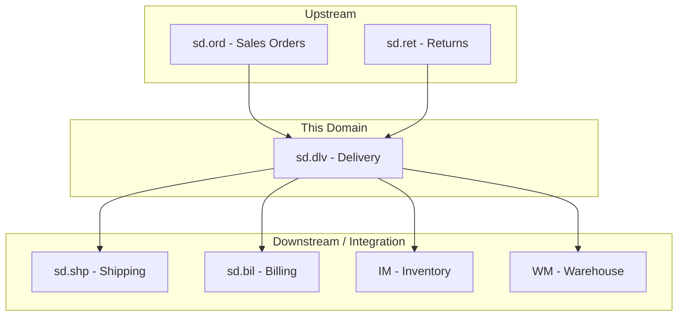
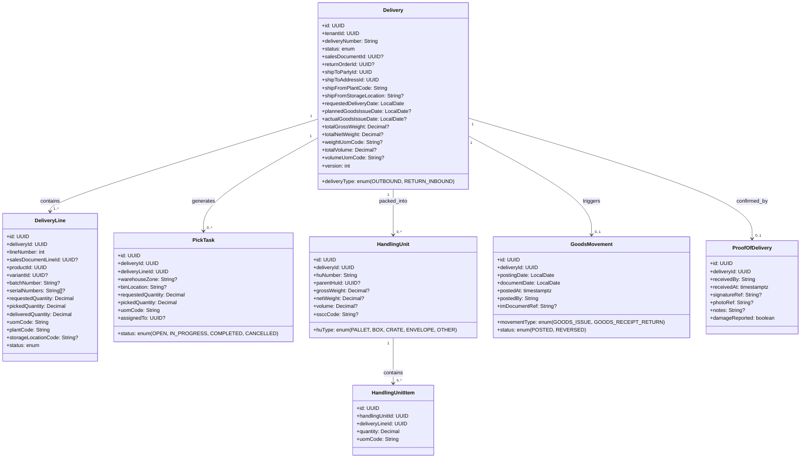
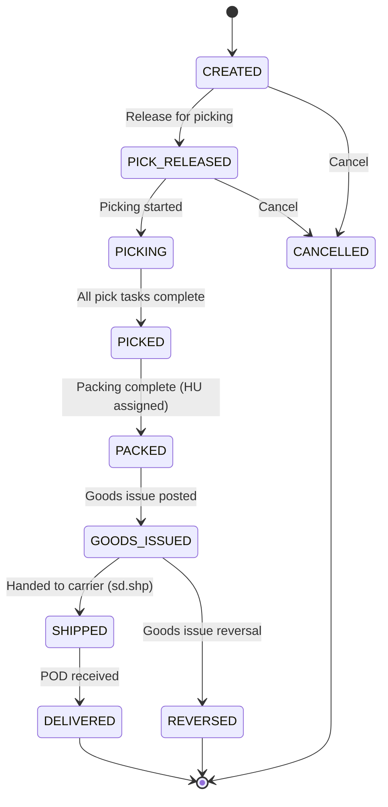
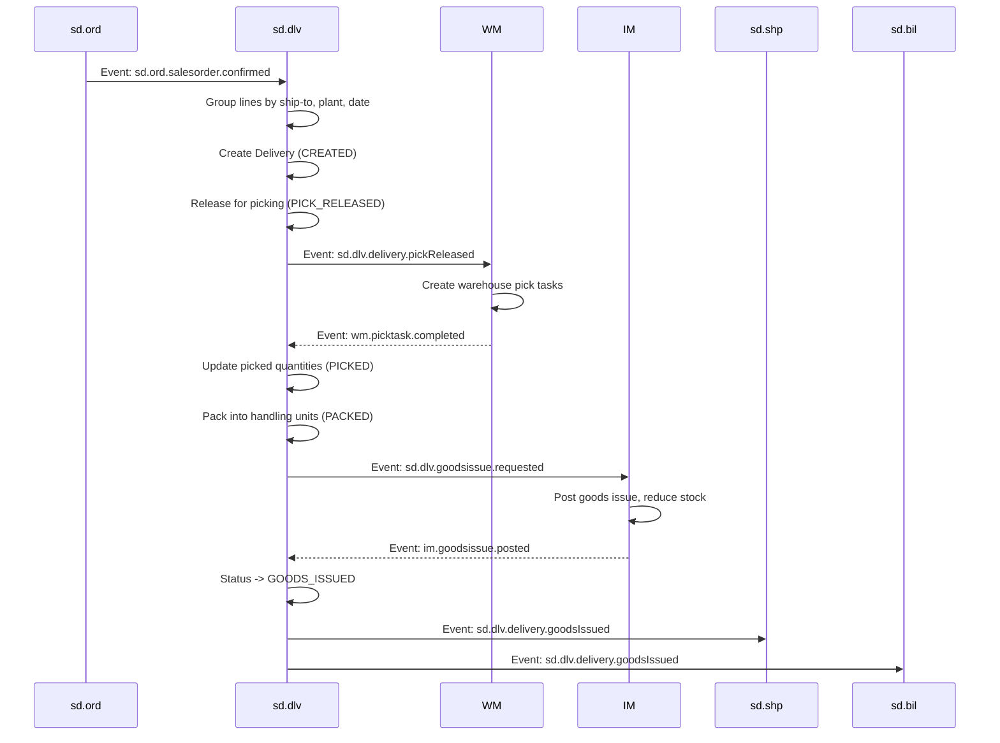
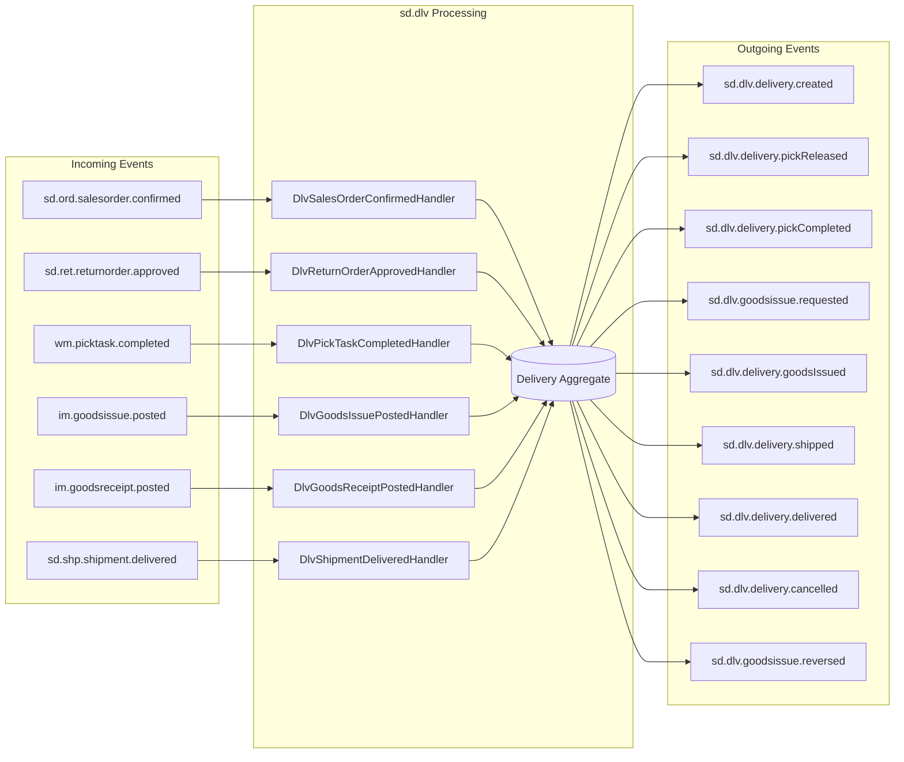
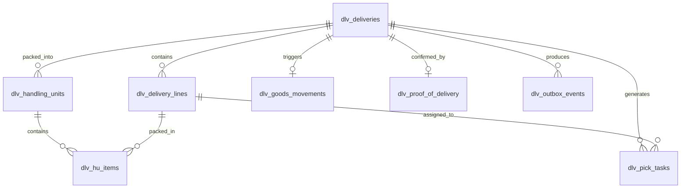

# SD.DLV - Delivery Domain / Service Specification

> **Conceptual Stack Layer:** Domain / Service
> **Space:** Platform
> **Owner:** Domain Engineering Team
> **Schema alignment:** `service-layer.schema.json`
> **Companion files:** `openapi.yaml`, `*.schema.json` (event contracts)
> **Referenced by:** Platform-Feature Spec SS5 (backend dependencies), BFF Contract
> **Belongs to:** SD Suite Spec (`_sd_suite.md`)

> **Meta Information**
> - **Version:** 2026-04-03
> - **Template:** `domain-service-spec.md` v1.0.0
> - **Template Compliance:** ~95% — Q-DLV-005 (feature spec IDs provisional), Q-DLV-007 (pick task ownership), Q-DLV-008 (additional ADRs)
> - **Author(s):** OpenLeap Architecture Team
> - **Status:** DRAFT
> - **Suite:** `sd`
> - **Domain:** `dlv`
> - **Bounded Context Ref:** `bc:delivery`
> - **Service ID:** `sd-dlv-svc`
> - **basePackage:** `io.openleap.sd.dlv`
> - **API Base Path:** `/api/sd/dlv/v1`
> - **OpenLeap Starter Version:** TBD
> - **Port:** TBD
> - **Repository:** TBD
> - **Tags:** `delivery`, `logistics`, `picking`, `packing`, `goods-issue`
> - **Team:**
>   - Name: `team-sd`
>   - Email: `sd-team@openleap.io`
>   - Slack: `#sd-team`

---

## Specification Guidelines Compliance

>
> ### Non-Negotiables
> - Never invent facts. If required info is missing, add an **OPEN QUESTION** entry.
> - Preserve intent and decisions. Only change meaning when explicitly requested.
> - Do not remove normative constraints unless they are explicitly replaced.
> - Keep the spec **self-contained**: no "see chat", no implicit context.
>
> ### Source of Truth Priority
> When sources conflict:
> 1. Spec (explicit) wins
> 2. Starter specs (implementation constraints) next
> 3. Guidelines (best practices) last
>
> Record conflicts in the **Decisions & Conflicts** section (see Section 14).
>
> ### Style Guide
> - Prefer short sentences and lists.
> - Use MUST/SHOULD/MAY for normative statements.
> - Keep terminology consistent (Aggregate, Domain Service, Application Service, Command, Event).
> - Avoid ambiguous words (e.g., "handle", "process", "manage") — prefer precise verbs (create, validate, publish, persist).
> - Keep examples minimal — illustrate the rule, not the implementation.
> - Do not add implementation code — spec describes WHAT, not HOW.

---

## 0. Document Purpose & Scope

### 0.1 Purpose
This specification defines the Delivery domain, which manages outbound delivery processing including delivery creation, picking, packing, goods issue, and proof-of-delivery. It also handles return deliveries (inbound) triggered by sd.ret.

### 0.2 Target Audience
- Product Owners & Business Stakeholders
- System Architects & Technical Leads
- Integration Engineers

### 0.3 Scope
**In Scope:**
- Outbound delivery creation from confirmed sales orders
- Delivery splitting (partial deliveries, multiple ship-to)
- Pick list generation and pick confirmation
- Packing (handling units, shipping units)
- Goods issue posting (triggers IM stock reduction)
- Return delivery (inbound goods receipt)
- Proof of delivery (POD) capture
- Delivery output (packing slip, delivery note)

**Out of Scope:**
- Sales order management (sd.ord)
- Shipment planning and carrier management (sd.shp)
- Invoice creation (sd.bil)
- Physical warehouse operations / WMS (WM)
- Inventory ledger (IM)

### 0.4 Related Documents
- `_sd_suite.md` - SD Suite overview
- `sd_ord-spec.md` - Sales Orders
- `sd_shp-spec.md` - Shipping
- `sd_bil-spec.md` - Billing
- `sd_ret-spec.md` - Returns
- `IM_inventory.md` - Inventory Management
- `WM_warehouse.md` - Warehouse Management

---

## 1. Business Context

### 1.1 Domain Purpose
`sd.dlv` bridges the gap between sales commitment (sd.ord) and physical fulfillment (WM/IM). It orchestrates *what* needs to be delivered, coordinates picking and packing, and records the goods issue that reduces inventory. It is the "logistics execution" layer within SD.

### 1.2 Business Value
- Accurate delivery tracking from order to customer receipt
- Support for partial deliveries and delivery splitting
- Goods issue integration ensures real-time inventory accuracy
- Proof of delivery for dispute resolution and billing trigger

### 1.3 Key Stakeholders

| Role | Responsibility | Primary Use Cases |
|------|----------------|-------------------|
| Warehouse Clerk | Execute picking and packing | UC-DLV-002, UC-DLV-003 |
| Logistics Coordinator | Plan and release deliveries | UC-DLV-001 |
| Shipping Clerk | Hand off to carrier | UC-DLV-004 |
| Customer | Receive goods, sign POD | UC-DLV-005 |

### 1.4 Strategic Positioning



### 1.5 Service Context

| Property | Value |
|----------|-------|
| **Suite** | `sd` |
| **Domain** | `dlv` |
| **Bounded Context** | `bc:delivery` |
| **Service ID** | `sd-dlv-svc` |
| **Base Package** | `io.openleap.sd.dlv` |

**Responsibilities:**
- Outbound and return inbound delivery management
- Pick task generation and confirmation
- Packing / handling unit management
- Goods issue and goods receipt posting coordination
- Proof of delivery capture

**Authoritative Sources:**
| Source Type | Description | Access Pattern |
|-------------|-------------|----------------|
| REST API | Deliveries, lines, pick tasks, handling units | Synchronous |
| Database | All delivery data (owned) | Direct (owner) |
| Events | Delivery lifecycle events | Asynchronous |

---

## 2. Service Identity

| Property | Value | Schema Field |
|----------|-------|-------------|
| **Service ID** | `sd-dlv-svc` | `metadata.id` |
| **Display Name** | Delivery | `metadata.name` |
| **Suite** | `sd` | `metadata.suite` |
| **Domain** | `dlv` | `metadata.domain` |
| **Bounded Context** | `bc:delivery` | `metadata.bounded_context_ref` |
| **Version** | `1.2.0` | `metadata.version` |
| **Status** | DRAFT | `metadata.status` |
| **API Base Path** | `/api/sd/dlv/v1` | `metadata.api_base_path` |
| **Repository** | TBD | `metadata.repository` |
| **Tags** | `delivery`, `logistics`, `picking`, `packing`, `goods-issue` | `metadata.tags` |

**Team:**

| Property | Value |
|----------|-------|
| Name | `team-sd` |
| Email | `sd-team@openleap.io` |
| Slack | `#sd-team` |

---

## 3. Domain Model

### 3.1 Conceptual Overview
The domain centers on the **Delivery** aggregate which groups items to be shipped from a warehouse to a customer. Each delivery contains lines, generates pick tasks for warehouse execution, is packed into handling units, and records a goods movement when stock leaves the warehouse.

### 3.2 Core Concepts



### 3.3 Aggregate Definitions

#### 3.3.1 Delivery

| Property | Value |
|----------|-------|
| **Aggregate ID** | `agg:delivery` |
| **Name** | `Delivery` |

**Business Purpose:**
Represents a logistics document for shipping goods from warehouse to customer (outbound) or receiving returned goods (return inbound).

##### Aggregate Root

**Lifecycle States:**

| Property | Value |
|----------|-------|
| **Initial State** | `CREATED` |
| **Terminal States** | `DELIVERED`, `CANCELLED`, `REVERSED` |



**State Descriptions:**
| State | Description | Business Meaning |
|-------|-------------|------------------|
| CREATED | Delivery document created from order | Not yet released to warehouse |
| PICK_RELEASED | Released to warehouse for picking | WM can start picking |
| PICKING | Pick tasks in progress | Warehouse actively working |
| PICKED | All items picked | Ready for packing |
| PACKED | Items packed into handling units | Ready for goods issue |
| GOODS_ISSUED | Inventory reduced, goods left warehouse | IM stock reduced |
| SHIPPED | Handed to carrier | In transit (sd.shp tracking) |
| DELIVERED | POD confirmed | Customer received goods |
| CANCELLED | Delivery cancelled | No fulfillment |
| REVERSED | Goods issue reversed | Stock restored, delivery void |

**Allowed Transitions:**
| From State | To State | Trigger | Guard |
|-----------|----------|---------|-------|
| CREATED | PICK_RELEASED | Release for picking (UC-DLV-001b) | All lines have productId |
| CREATED | CANCELLED | Cancel delivery | Not goods issued |
| PICK_RELEASED | PICKING | First pick task started | — |
| PICK_RELEASED | CANCELLED | Cancel delivery | No picks confirmed |
| PICKING | PICKED | All pick tasks COMPLETED | sum(pickedQuantity) > 0 |
| PICKED | PACKED | Packing complete (HU assigned to all lines) | All lines packed |
| PACKED | GOODS_ISSUED | Goods issue confirmed by IM | BR-DLV-003 passed |
| GOODS_ISSUED | SHIPPED | Carrier handoff confirmed (sd.shp event) | — |
| GOODS_ISSUED | REVERSED | Goods issue reversal | — |
| SHIPPED | DELIVERED | POD captured | — |

**Invariants:**
| Rule ID | Description |
|---------|-------------|
| BR-DLV-001 | Deliveries from confirmed orders only |
| BR-DLV-002 | Picked quantity <= requested quantity |
| BR-DLV-003 | Goods issue requires pick completion |
| BR-DLV-004 | No modification after goods issue |
| BR-DLV-005 | Partial delivery creates remainder |
| BR-DLV-006 | Return delivery type uses GOODS_RECEIPT_RETURN movement |

**Domain Events Emitted:**
- `sd.dlv.delivery.created`
- `sd.dlv.delivery.pickReleased`
- `sd.dlv.delivery.pickCompleted`
- `sd.dlv.goodsissue.requested`
- `sd.dlv.delivery.goodsIssued`
- `sd.dlv.delivery.shipped`
- `sd.dlv.delivery.delivered`
- `sd.dlv.delivery.cancelled`
- `sd.dlv.goodsissue.reversed`

##### Aggregate Root Attributes

**Delivery:**

| Attribute | Type | Format | Description | Constraints | Required | Read-Only |
|-----------|------|--------|-------------|-------------|----------|-----------|
| id | string | uuid | Unique delivery identifier | — | Yes | Yes |
| tenantId | string | uuid | Tenant identifier for multi-tenancy isolation | — | Yes | Yes |
| deliveryNumber | string | — | Human-readable delivery document number (e.g., 80000001) | Unique per tenant, max 10 chars | Yes | Yes |
| deliveryType | string | enum_ref: DeliveryType | Whether delivery is outbound to customer or return inbound | OUTBOUND or RETURN_INBOUND | Yes | No |
| status | string | enum_ref: DeliveryStatus | Current lifecycle state of the delivery | See DeliveryStatus | Yes | Yes |
| salesDocumentId | string | uuid | Reference to the originating sales order in sd.ord | Required when deliveryType=OUTBOUND | Conditional | No |
| returnOrderId | string | uuid | Reference to the originating return order in sd.ret | Required when deliveryType=RETURN_INBOUND | Conditional | No |
| shipToPartyId | string | uuid | Reference to the ship-to business partner | Must exist in bp service | Yes | No |
| shipToAddressId | string | uuid | Delivery address for the shipment | Must exist for shipToPartyId | Yes | No |
| shipFromPlantCode | string | — | Plant code from which goods are shipped | Must exist in ref-data-svc | Yes | No |
| shipFromStorageLocation | string | — | Storage location within the plant | Must exist for plant | No | No |
| requestedDeliveryDate | string | date | Customer-requested delivery date | Must be >= today on create | Yes | No |
| plannedGoodsIssueDate | string | date | Planned date for goods issue posting | Must be <= requestedDeliveryDate | No | No |
| actualGoodsIssueDate | string | date | Actual date goods issue was posted | Set by system on goods issue | No | Yes |
| totalGrossWeight | number | decimal | Total gross weight of all handling units | >= 0 | No | No |
| totalNetWeight | number | decimal | Total net weight of goods | >= 0 | No | No |
| weightUomCode | string | — | Unit of measure for weight (e.g., KG, LB) | Valid UCUM code | Conditional | No |
| totalVolume | number | decimal | Total volume of all handling units | >= 0 | No | No |
| volumeUomCode | string | — | Unit of measure for volume (e.g., M3, L) | Valid UCUM code | Conditional | No |
| version | integer | int32 | Optimistic locking version counter | >= 1 | Yes | Yes |
| createdAt | string | date-time | Timestamp when delivery was created | ISO-8601 | Yes | Yes |
| updatedAt | string | date-time | Timestamp of last modification | ISO-8601 | Yes | Yes |

##### Child Entity Attributes

**DeliveryLine:**

| Attribute | Type | Format | Description | Constraints | Required | Read-Only |
|-----------|------|--------|-------------|-------------|----------|-----------|
| id | string | uuid | Unique line identifier | — | Yes | Yes |
| deliveryId | string | uuid | Parent delivery reference | — | Yes | Yes |
| lineNumber | integer | int32 | Sequential line number within delivery | >= 1 | Yes | No |
| salesDocumentLineId | string | uuid | Reference to sales order line in sd.ord | — | No | No |
| productId | string | uuid | Product being delivered | Must exist in com service | Yes | No |
| variantId | string | uuid | Product variant reference | Must exist for productId if specified | No | No |
| batchNumber | string | — | Batch/lot number for batch-managed products | Max 10 chars | No | No |
| serialNumbers | string[] | — | Serial numbers for serialized products | Each max 18 chars | No | No |
| requestedQuantity | number | decimal | Quantity requested for delivery | > 0 | Yes | No |
| pickedQuantity | number | decimal | Quantity confirmed picked by warehouse | >= 0 and <= requestedQuantity | Yes | No |
| deliveredQuantity | number | decimal | Quantity confirmed delivered (POD) | >= 0 and <= pickedQuantity | Yes | No |
| uomCode | string | — | Unit of measure for quantities | Valid UCUM code | Yes | No |
| plantCode | string | — | Plant from which this line is delivered | Must exist in ref-data-svc | Yes | No |
| storageLocationCode | string | — | Storage location for this line | Must exist for plant | No | No |
| status | string | enum_ref: DeliveryLineStatus | Line-level fulfillment status | See DeliveryLineStatus | Yes | Yes |

**Collection Constraints:** minimum 1 line per delivery, maximum 999 lines.

**PickTask:**

| Attribute | Type | Format | Description | Constraints | Required | Read-Only |
|-----------|------|--------|-------------|-------------|----------|-----------|
| id | string | uuid | Unique pick task identifier | — | Yes | Yes |
| deliveryId | string | uuid | Parent delivery reference | — | Yes | Yes |
| deliveryLineId | string | uuid | Line for which this task picks goods | — | Yes | Yes |
| warehouseZone | string | — | Warehouse zone where goods are located | Max 10 chars | No | No |
| binLocation | string | — | Specific bin/rack location in the warehouse | Max 18 chars | No | No |
| requestedQuantity | number | decimal | Quantity to pick | > 0 | Yes | Yes |
| pickedQuantity | number | decimal | Quantity actually picked | >= 0 and <= requestedQuantity | Yes | No |
| uomCode | string | — | Unit of measure | Valid UCUM code | Yes | Yes |
| assignedTo | string | uuid | Warehouse worker this task is assigned to | Must exist in IAM | No | No |
| status | string | enum_ref: PickTaskStatus | Current state of the pick task | See PickTaskStatus | Yes | Yes |

**HandlingUnit:**

| Attribute | Type | Format | Description | Constraints | Required | Read-Only |
|-----------|------|--------|-------------|-------------|----------|-----------|
| id | string | uuid | Unique handling unit identifier | — | Yes | Yes |
| deliveryId | string | uuid | Parent delivery reference | — | Yes | Yes |
| huNumber | string | — | System-assigned handling unit number (e.g., HU-0000001) | Unique per tenant | Yes | Yes |
| huType | string | enum_ref: HandlingUnitType | Physical container type | See HandlingUnitType | Yes | No |
| parentHuId | string | uuid | Parent HU for nested/hierarchical packing | Must exist in same delivery | No | No |
| grossWeight | number | decimal | Total weight including packaging | >= 0 | No | No |
| netWeight | number | decimal | Weight of goods only | >= 0 and <= grossWeight | No | No |
| volume | number | decimal | Total volume of the handling unit | >= 0 | No | No |
| ssccCode | string | — | GS1 Serial Shipping Container Code (18 digits) | Pattern: `^\d{18}$` | No | No |

**HandlingUnitItem:**

| Attribute | Type | Format | Description | Constraints | Required | Read-Only |
|-----------|------|--------|-------------|-------------|----------|-----------|
| id | string | uuid | Unique item identifier | — | Yes | Yes |
| handlingUnitId | string | uuid | Parent handling unit reference | — | Yes | Yes |
| deliveryLineId | string | uuid | Delivery line being packed into this HU | Must exist in same delivery | Yes | Yes |
| quantity | number | decimal | Quantity of delivery line items in this HU | > 0 | Yes | No |
| uomCode | string | — | Unit of measure | Must match delivery line uomCode | Yes | Yes |

**GoodsMovement:**

| Attribute | Type | Format | Description | Constraints | Required | Read-Only |
|-----------|------|--------|-------------|-------------|----------|-----------|
| id | string | uuid | Unique goods movement identifier | — | Yes | Yes |
| deliveryId | string | uuid | Parent delivery reference | — | Yes | Yes |
| movementType | string | enum_ref: MovementType | Inventory movement type | See MovementType | Yes | Yes |
| postingDate | string | date | Accounting date for inventory posting | Required, valid date | Yes | No |
| documentDate | string | date | Document creation date | Required | Yes | Yes |
| postedAt | string | date-time | Timestamp when posting occurred | ISO-8601 | Yes | Yes |
| postedBy | string | — | Username of user who posted | Max 50 chars | Yes | Yes |
| imDocumentRef | string | — | Reference to IM goods movement document | Set by IM upon confirmation | No | Yes |
| status | string | enum_ref: GoodsMovementStatus | Posting status | See GoodsMovementStatus | Yes | Yes |

**ProofOfDelivery:**

| Attribute | Type | Format | Description | Constraints | Required | Read-Only |
|-----------|------|--------|-------------|-------------|----------|-----------|
| id | string | uuid | Unique POD identifier | — | Yes | Yes |
| deliveryId | string | uuid | Parent delivery reference | — | Yes | Yes |
| receivedBy | string | — | Name of person who received the goods | Min 2 chars, max 100 chars | Yes | No |
| receivedAt | string | date-time | Timestamp when goods were received | ISO-8601, must be in past | Yes | No |
| signatureRef | string | — | DMS reference to scanned signature image | Valid DMS URI | No | No |
| photoRef | string | — | DMS reference to delivery photo | Valid DMS URI | No | No |
| notes | string | — | Additional notes or comments | Max 500 chars | No | No |
| damageReported | boolean | — | Whether damage was noted upon receipt | Default: false | Yes | No |

### 3.4 Enumerations

#### DeliveryType
| Value | Description | Deprecated |
|-------|-------------|------------|
| `OUTBOUND` | Outbound delivery to customer | No |
| `RETURN_INBOUND` | Return delivery from customer | No |

#### DeliveryStatus
| Value | Description | Deprecated |
|-------|-------------|------------|
| `CREATED` | Document created | No |
| `PICK_RELEASED` | Released for picking | No |
| `PICKING` | Picking in progress | No |
| `PICKED` | All picks complete | No |
| `PACKED` | Packed into HUs | No |
| `GOODS_ISSUED` | Stock reduced | No |
| `SHIPPED` | Handed to carrier | No |
| `DELIVERED` | Customer received | No |
| `CANCELLED` | Cancelled | No |
| `REVERSED` | Goods issue reversed | No |

#### DeliveryLineStatus
| Value | Description | Deprecated |
|-------|-------------|------------|
| `OPEN` | Line created, not yet picked | No |
| `PARTIALLY_PICKED` | Some quantity picked, not complete | No |
| `PICKED` | Full requested quantity picked | No |
| `PACKED` | Line packed into handling units | No |
| `GOODS_ISSUED` | Inventory movement posted | No |
| `DELIVERED` | Customer confirmed receipt | No |
| `CANCELLED` | Line cancelled | No |

#### PickTaskStatus
| Value | Description | Deprecated |
|-------|-------------|------------|
| `OPEN` | Task created, not assigned | No |
| `IN_PROGRESS` | Task assigned and being executed | No |
| `COMPLETED` | Pick quantity confirmed | No |
| `CANCELLED` | Task cancelled | No |

#### HandlingUnitType
| Value | Description | Deprecated |
|-------|-------------|------------|
| `PALLET` | Wooden or plastic pallet | No |
| `BOX` | Cardboard or wooden box | No |
| `CRATE` | Heavy-duty crate for fragile items | No |
| `ENVELOPE` | Document or small items envelope | No |
| `OTHER` | Uncategorized packaging type | No |

#### MovementType
| Value | Description | Deprecated |
|-------|-------------|------------|
| `GOODS_ISSUE` | Outbound goods leaving the warehouse (reduces inventory) | No |
| `GOODS_RECEIPT_RETURN` | Inbound return goods received back into stock | No |

#### GoodsMovementStatus
| Value | Description | Deprecated |
|-------|-------------|------------|
| `POSTED` | Goods movement successfully posted to inventory | No |
| `REVERSED` | Goods movement has been reversed | No |

### 3.5 Shared Types

No types are shared across aggregates. The weight/volume measurement pattern (value + uomCode) is used consistently but not extracted as a named value object in this version.

> OPEN QUESTION: See Q-DLV-004 in §14.3 — Should weight+uomCode and volume+uomCode be extracted as a `Measurement` value object shared across Delivery and HandlingUnit?

---

## 4. Business Rules & Constraints

### 4.1 Business Rules Catalog

| ID | Rule Name | Description | Scope | Enforcement | Error Code |
|----|-----------|-------------|-------|-------------|------------|
| BR-DLV-001 | Confirmed Orders Only | Deliveries from CONFIRMED/IN_DELIVERY orders only | Delivery | Create | `DLV_INVALID_ORDER_STATUS` |
| BR-DLV-002 | Pick Limit | pickedQuantity <= requestedQuantity | DeliveryLine | Pick confirm | `DLV_OVER_PICK` |
| BR-DLV-003 | GI Requires Pick | Goods issue only when all lines picked | Delivery | GI posting | `DLV_PICK_INCOMPLETE` |
| BR-DLV-004 | Immutable After GI | No changes after GOODS_ISSUED | Delivery | Update | `DLV_IMMUTABLE` |
| BR-DLV-005 | Partial Remainder | Under-pick creates follow-up delivery | Delivery | GI posting | — |
| BR-DLV-006 | Return Movement Type | RETURN_INBOUND uses GOODS_RECEIPT_RETURN | GoodsMovement | Create/GR | `DLV_INVALID_MOVEMENT` |

### 4.2 Detailed Rule Definitions

#### BR-DLV-001: Confirmed Orders Only

**Business Context:** Deliveries must be created against firm customer commitments to prevent warehouse work for unconfirmed demand.

**Rule Statement:** A delivery MUST only be created from a sales order in status CONFIRMED or IN_DELIVERY.

**Applies To:**
- Aggregate: Delivery
- Operations: Create

**Enforcement:** Application Service validates order status via sd.ord API before creating the delivery.

**Validation Logic:** Retrieve sales order by salesDocumentId; check status is CONFIRMED or IN_DELIVERY.

**Error Handling:**
- **Error Code:** `DLV_INVALID_ORDER_STATUS`
- **Error Message:** "Sales order {id} must be CONFIRMED or IN_DELIVERY to create a delivery"
- **User action:** Confirm the sales order before initiating delivery creation.

**Examples:**
- **Valid:** Sales order status = CONFIRMED → delivery created
- **Invalid:** Sales order status = DRAFT → error DLV_INVALID_ORDER_STATUS

---

#### BR-DLV-002: Pick Quantity Limit

**Business Context:** Warehouse personnel must not pick more than was ordered to prevent over-fulfillment and stock discrepancies.

**Rule Statement:** The pickedQuantity for a DeliveryLine MUST NOT exceed the requestedQuantity.

**Applies To:**
- Aggregate: DeliveryLine
- Operations: Confirm pick (UC-DLV-002)

**Enforcement:** Aggregate invariant in DeliveryLine domain object.

**Validation Logic:** pickedQuantity <= requestedQuantity

**Error Handling:**
- **Error Code:** `DLV_OVER_PICK`
- **Error Message:** "Picked quantity {picked} exceeds requested quantity {requested} for line {lineId}"
- **User action:** Reduce picked quantity to the requested amount or check if quantities are correct.

**Examples:**
- **Valid:** requestedQuantity = 10, pickedQuantity = 8 → allowed
- **Invalid:** requestedQuantity = 10, pickedQuantity = 11 → DLV_OVER_PICK

---

#### BR-DLV-003: Goods Issue Requires Pick Completion

**Business Context:** Goods issue is a legally binding inventory posting; it must only be made when warehouse has physically prepared the shipment.

**Rule Statement:** A goods issue posting MUST only be made when all DeliveryLines have status PICKED or PACKED.

**Applies To:**
- Aggregate: Delivery
- Operations: Post Goods Issue (UC-DLV-004)

**Enforcement:** Application Service checks all line statuses before publishing `GoodsIssueRequested` event.

**Validation Logic:** All lines in status PICKED or PACKED.

**Error Handling:**
- **Error Code:** `DLV_PICK_INCOMPLETE`
- **Error Message:** "Goods issue cannot be posted: {n} delivery line(s) are not yet picked"
- **User action:** Complete picking for all outstanding lines before posting goods issue.

**Examples:**
- **Valid:** All 3 lines status = PACKED → goods issue allowed
- **Invalid:** Line 2 status = PICKING → DLV_PICK_INCOMPLETE

---

#### BR-DLV-004: Immutable After Goods Issue

**Business Context:** Once inventory has been reduced and goods have left the warehouse, the delivery document must be a permanent record.

**Rule Statement:** No fields on the Delivery aggregate or its lines MAY be modified after status reaches GOODS_ISSUED.

**Applies To:**
- Aggregate: Delivery
- Operations: Update, Delete

**Enforcement:** Application Service rejects any mutation requests when delivery status is GOODS_ISSUED, SHIPPED, DELIVERED, or REVERSED.

**Validation Logic:** delivery.status NOT IN (GOODS_ISSUED, SHIPPED, DELIVERED, REVERSED)

**Error Handling:**
- **Error Code:** `DLV_IMMUTABLE`
- **Error Message:** "Delivery {id} cannot be modified after goods issue has been posted"
- **User action:** If correction is needed, reverse the goods issue (UC-DLV-006) and create a new delivery.

**Examples:**
- **Valid:** status = PICKED → update allowed
- **Invalid:** status = GOODS_ISSUED → DLV_IMMUTABLE

---

#### BR-DLV-005: Partial Delivery Creates Remainder

**Business Context:** If warehouse can only fulfil part of a delivery, the remaining quantity must not be silently lost.

**Rule Statement:** When goods issue is posted with pickedQuantity < requestedQuantity for any line, a follow-up delivery MUST be created for the remaining quantity.

**Applies To:**
- Aggregate: Delivery
- Operations: Post Goods Issue (UC-DLV-004)

**Enforcement:** Application Service detects under-picks at goods issue time and triggers creation of a follow-up delivery document.

**Validation Logic:** For each line where pickedQuantity < requestedQuantity, create remainder delivery line.

**Error Handling:** No error — system creates remainder delivery automatically. Published event includes `hasRemainder: true` flag.

**Examples:**
- **Valid:** Requested 10, picked 7 → GI posted for 7, new delivery created for 3

---

#### BR-DLV-006: Return Movement Type

**Business Context:** Return inbound deliveries require a goods receipt movement that increases stock, not a goods issue that decreases it.

**Rule Statement:** A Delivery with deliveryType=RETURN_INBOUND MUST use GoodsMovement with movementType=GOODS_RECEIPT_RETURN.

**Applies To:**
- Aggregate: GoodsMovement
- Operations: Create goods movement

**Enforcement:** Application Service sets movementType based on delivery.deliveryType.

**Validation Logic:** if deliveryType == RETURN_INBOUND then movementType == GOODS_RECEIPT_RETURN

**Error Handling:**
- **Error Code:** `DLV_INVALID_MOVEMENT`
- **Error Message:** "Return inbound delivery {id} must use GOODS_RECEIPT_RETURN movement type"
- **User action:** Ensure delivery type is correctly set before posting goods movement.

**Examples:**
- **Valid:** RETURN_INBOUND + GOODS_RECEIPT_RETURN → allowed
- **Invalid:** RETURN_INBOUND + GOODS_ISSUE → DLV_INVALID_MOVEMENT

### 4.3 Data Validation Rules

**Field-Level Validations:**
| Field | Validation Rule | Error Message |
|-------|----------------|---------------|
| requestedQuantity | > 0 | "Requested quantity must be positive" |
| pickedQuantity | >= 0 and <= requestedQuantity | "Picked quantity out of range" |
| deliveryNumber | Unique per tenant | "Delivery number already exists" |
| deliveryType | Required, must be OUTBOUND or RETURN_INBOUND | "Delivery type is required and must be OUTBOUND or RETURN_INBOUND" |
| shipToPartyId | Required, UUID format | "Ship-to party is required" |
| shipToAddressId | Required, UUID format | "Ship-to address is required" |
| shipFromPlantCode | Required, must exist in ref-data-svc | "Plant code is required and must be valid" |
| requestedDeliveryDate | Required, must be a valid date | "Requested delivery date is required" |
| salesDocumentId | Required when deliveryType=OUTBOUND | "Sales document ID required for outbound delivery" |
| returnOrderId | Required when deliveryType=RETURN_INBOUND | "Return order ID required for return inbound delivery" |
| totalGrossWeight | >= 0 if provided | "Gross weight must not be negative" |
| weightUomCode | Required if totalGrossWeight or totalNetWeight provided | "Weight UOM required when weight is specified" |
| DeliveryLine.productId | Required, UUID format | "Product ID is required" |
| DeliveryLine.requestedQuantity | > 0 | "Requested quantity must be positive" |
| DeliveryLine.uomCode | Required, valid UCUM | "Unit of measure is required and must be a valid UCUM code" |
| PickTask.requestedQuantity | > 0 | "Pick task quantity must be positive" |
| HandlingUnit.ssccCode | If provided, must be exactly 18 digits | "SSCC code must be exactly 18 digits" |
| HandlingUnit.netWeight | <= grossWeight if both provided | "Net weight must not exceed gross weight" |
| ProofOfDelivery.receivedBy | Required, min 2 chars | "Receiver name is required" |
| ProofOfDelivery.receivedAt | Required, must be in past | "Receipt timestamp must be in the past" |

**Cross-Field Validations:**
- `plannedGoodsIssueDate` MUST be <= `requestedDeliveryDate`
- `salesDocumentId` and `returnOrderId` are mutually exclusive
- Sum of HandlingUnitItem.quantity for a deliveryLineId MUST NOT exceed DeliveryLine.pickedQuantity
- `HandlingUnit.parentHuId` MUST NOT reference itself

### 4.4 Reference Data Dependencies

| Catalog | Source Service | Fields Referencing | Validation |
|---------|----------------|--------------------|------------|
| Plants | `ref-data-svc` | `shipFromPlantCode`, `DeliveryLine.plantCode` | Must exist and be active |
| Storage Locations | `ref-data-svc` | `shipFromStorageLocation`, `DeliveryLine.storageLocationCode` | Must exist for given plant |
| Units of Measure | `si-unit-svc` | `weightUomCode`, `volumeUomCode`, `DeliveryLine.uomCode`, `PickTask.uomCode` | Must be valid UCUM code |
| Business Partners | `bp-svc` | `shipToPartyId` | Must exist, ship-to role required |
| Partner Addresses | `bp-svc` | `shipToAddressId` | Must be valid address for shipToPartyId |
| IAM Users | `iam-svc` | `PickTask.assignedTo` | Must be active user with warehouse role |

---

## 5. Use Cases

### 5.1 Business Logic Placement

| Logic Type | Placement | Examples |
|------------|-----------|----------|
| Aggregate invariants | Domain Object | Pick quantity validation, status transitions |
| Cross-aggregate logic | Domain Service | Delivery splitting, partial delivery remainder |
| Orchestration & transactions | Application Service | Goods issue coordination, event publishing |

### 5.2 Use Cases (Canonical Format)

#### UC-DLV-001: Create Outbound Delivery

| Field | Value |
|-------|-------|
| **id** | `CreateOutboundDelivery` |
| **type** | WRITE |
| **trigger** | Message (from sd.ord event) or REST |
| **aggregate** | `Delivery` |
| **domainOperation** | `Delivery.create` |
| **inputs** | `salesDocumentId: UUID`, `lines: DeliveryLine[]` |
| **outputs** | `Delivery` (CREATED) |
| **events** | `DeliveryCreated` |
| **rest** | `POST /api/sd/dlv/v1/deliveries` |
| **idempotency** | required |
| **errors** | `DLV_INVALID_ORDER_STATUS` |

**Actor:** System (from sd.ord event) or Logistics Coordinator

**Preconditions:**
- Sales order exists with status CONFIRMED or IN_DELIVERY (BR-DLV-001)
- Ship-to party and address are valid

**Main Flow:**
1. System (or Logistics Coordinator) initiates delivery creation with salesDocumentId
2. System retrieves sales order and validates status (BR-DLV-001)
3. System groups order lines by ship-to party, plant, and requestedDeliveryDate
4. System creates one Delivery per group with status CREATED
5. System publishes `sd.dlv.delivery.created`

**Postconditions:**
- Delivery is in CREATED status
- All delivery lines are in OPEN status
- Pick tasks are not yet generated

**Business Rules Applied:**
- BR-DLV-001: Confirmed orders only

**Alternative Flows:**
- **Alt-1:** If lines have different ship-to parties, multiple deliveries are created (one per party)
- **Alt-2:** Delivery triggered via REST (manual creation): same validation applies

**Exception Flows:**
- **Exc-1:** Sales order status is DRAFT or BLOCKED → DLV_INVALID_ORDER_STATUS, delivery not created
- **Exc-2:** Duplicate salesDocumentId for same tenant → idempotent: return existing delivery

---

#### UC-DLV-002: Execute Picking

| Field | Value |
|-------|-------|
| **id** | `ExecutePicking` |
| **type** | WRITE |
| **trigger** | REST |
| **aggregate** | `Delivery` |
| **domainOperation** | `Delivery.confirmPick` |
| **inputs** | `deliveryId: UUID`, `pickTaskId: UUID`, `pickedQuantity: Decimal` |
| **outputs** | `PickTask` (COMPLETED) |
| **events** | `PickCompleted` (when all tasks done) |
| **rest** | `PATCH /api/sd/dlv/v1/pick-tasks/{taskId}` |
| **idempotency** | required |
| **errors** | `DLV_OVER_PICK` |

**Actor:** Warehouse Clerk

**Preconditions:**
- Delivery is in PICK_RELEASED or PICKING status
- Pick task exists in OPEN or IN_PROGRESS status

**Main Flow:**
1. Warehouse Clerk confirms picked quantity via handheld scanner or UI
2. System validates pickedQuantity <= requestedQuantity (BR-DLV-002)
3. System updates PickTask status to COMPLETED
4. System updates DeliveryLine.pickedQuantity
5. If all pick tasks completed → Delivery transitions to PICKED
6. System publishes `sd.dlv.delivery.pickCompleted` when delivery status = PICKED

**Postconditions:**
- PickTask is in COMPLETED status
- DeliveryLine.pickedQuantity is updated
- If all lines picked, Delivery is PICKED

**Business Rules Applied:**
- BR-DLV-002: Pick quantity limit

**Alternative Flows:**
- **Alt-1:** Partial pick (pickedQuantity < requestedQuantity) — task marked COMPLETED with under-pick; BR-DLV-005 triggers remainder at GI time

**Exception Flows:**
- **Exc-1:** pickedQuantity > requestedQuantity → DLV_OVER_PICK

---

#### UC-DLV-003: Pack Delivery

| Field | Value |
|-------|-------|
| **id** | `PackDelivery` |
| **type** | WRITE |
| **trigger** | REST |
| **aggregate** | `Delivery` |
| **domainOperation** | `Delivery.pack` |
| **inputs** | `deliveryId: UUID`, `handlingUnits: HandlingUnit[]` |
| **outputs** | `Delivery` (PACKED) |
| **events** | — |
| **rest** | `POST /api/sd/dlv/v1/deliveries/{id}/handling-units` |
| **idempotency** | optional |

**Actor:** Warehouse Clerk / Packer

**Preconditions:**
- Delivery is in PICKED status
- At least one delivery line exists

**Main Flow:**
1. Packer creates handling unit(s) specifying type and dimensions
2. Packer assigns delivery line quantities to handling units
3. System validates total packed quantity does not exceed picked quantity
4. Delivery transitions to PACKED when all lines are packed
5. System calculates total gross weight and volume from handling units

**Postconditions:**
- Delivery is in PACKED status
- All delivery lines are in PACKED status
- totalGrossWeight and totalVolume are updated

**Business Rules Applied:** (none specific — quantity check is cross-field validation)

**Alternative Flows:**
- **Alt-1:** Nested handling units (pallet containing boxes) — parentHuId set on child HU

**Exception Flows:**
- **Exc-1:** Total packed quantity exceeds picked quantity → 422 Unprocessable Entity

---

#### UC-DLV-004: Post Goods Issue

| Field | Value |
|-------|-------|
| **id** | `PostGoodsIssue` |
| **type** | WRITE |
| **trigger** | REST |
| **aggregate** | `Delivery` |
| **domainOperation** | `Delivery.postGoodsIssue` |
| **inputs** | `deliveryId: UUID` |
| **outputs** | `Delivery` (GOODS_ISSUED) |
| **events** | `GoodsIssueRequested`, `DeliveryGoodsIssued` |
| **rest** | `POST /api/sd/dlv/v1/deliveries/{id}:post-goods-issue` |
| **idempotency** | required |
| **errors** | `DLV_PICK_INCOMPLETE` |

**Actor:** Logistics Coordinator or Shipping Clerk

**Preconditions:**
- Delivery is in PACKED status
- All lines are in PICKED or PACKED status (BR-DLV-003)

**Main Flow:**
1. Actor posts goods issue via REST
2. System checks all lines picked (BR-DLV-003)
3. System publishes `sd.dlv.goodsissue.requested` event
4. IM service processes event and posts inventory reduction
5. IM publishes `im.goodsissue.posted` event with document reference
6. System updates delivery status to GOODS_ISSUED
7. System publishes `sd.dlv.delivery.goodsIssued`
8. If any line under-picked (BR-DLV-005), system creates follow-up delivery

**Postconditions:**
- Delivery is in GOODS_ISSUED status
- GoodsMovement record created with imDocumentRef
- sd.shp and sd.bil receive goodsIssued event

**Business Rules Applied:**
- BR-DLV-003: GI requires pick completion
- BR-DLV-005: Partial delivery creates remainder
- BR-DLV-006: Return movement type

**Alternative Flows:**
- **Alt-1:** Return inbound delivery → movementType = GOODS_RECEIPT_RETURN; increases stock

**Exception Flows:**
- **Exc-1:** Lines not fully picked → DLV_PICK_INCOMPLETE
- **Exc-2:** IM service unavailable → event retried per ADR-014; delivery remains PACKED

---

#### UC-DLV-005: Capture Proof of Delivery

| Field | Value |
|-------|-------|
| **id** | `CaptureProofOfDelivery` |
| **type** | WRITE |
| **trigger** | REST |
| **aggregate** | `Delivery` |
| **domainOperation** | `Delivery.recordPOD` |
| **inputs** | `deliveryId: UUID`, `receivedBy: String`, `signatureRef: String?`, `damageReported: boolean` |
| **outputs** | `Delivery` (DELIVERED) |
| **events** | `DeliveryDelivered` |
| **rest** | `POST /api/sd/dlv/v1/deliveries/{id}:deliver` |
| **idempotency** | required |

**Actor:** Customer (via delivery driver or customer portal)

**Preconditions:**
- Delivery is in SHIPPED status

**Main Flow:**
1. Delivery driver or customer portal submits POD data
2. System validates required fields (receivedBy, receivedAt)
3. System creates ProofOfDelivery record
4. Delivery transitions to DELIVERED
5. System publishes `sd.dlv.delivery.delivered`
6. sd.bil receives event to trigger billing

**Postconditions:**
- Delivery is in DELIVERED status
- ProofOfDelivery record exists with receivedBy and receivedAt

**Business Rules Applied:** (none specific — field validation applies)

**Alternative Flows:**
- **Alt-1:** Damage reported → damageReported=true, notes captured; sd.ret notified for return process initiation

**Exception Flows:**
- **Exc-1:** Delivery not in SHIPPED status → 422: delivery must be SHIPPED to record POD

### 5.3 Process Flow Diagrams



### 5.4 Cross-Domain Workflows

#### Workflow: Order-to-Delivery (Choreography)

**Pattern:** Choreography (ADR-003, ADR-029)
**Description:** Sales order confirmation automatically triggers delivery creation.

**Participating Services:**
| Service | Role | Events |
|---------|------|--------|
| sd.ord | Order Management | Publishes `sd.ord.salesorder.confirmed` |
| sd.dlv | Delivery Execution | Consumes confirmed event, publishes delivery events |
| IM | Inventory Management | Processes goods issue request, confirms posting |
| sd.shp | Shipment Planning | Reacts to goodsIssued to create shipment |
| sd.bil | Billing | Reacts to goodsIssued to trigger billing document |

**Workflow Steps:**
1. sd.ord publishes `sd.ord.salesorder.confirmed` → sd.dlv creates delivery
2. Warehouse picks and packs → sd.dlv reaches PACKED status
3. sd.dlv publishes `sd.dlv.goodsissue.requested` → IM processes goods issue
4. IM publishes `im.goodsissue.posted` → sd.dlv transitions to GOODS_ISSUED
5. sd.dlv publishes `sd.dlv.delivery.goodsIssued` → sd.shp creates shipment, sd.bil triggers invoice

**Failure Path:** If IM cannot post goods issue, event is retried 3x with exponential backoff per ADR-014; after max retries, routed to DLQ for manual intervention.

**Business Implications:** Any delay in IM goods issue posting blocks the billing trigger. SLA: < 5 seconds end-to-end from GI request to goodsIssued event.

---

#### Workflow: Return Delivery (Choreography)

**Pattern:** Choreography
**Description:** Return order approval triggers return inbound delivery creation.

**Participating Services:**
| Service | Role |
|---------|------|
| sd.ret | Returns Management — publishes `sd.ret.returnorder.approved` |
| sd.dlv | Delivery Execution — creates RETURN_INBOUND delivery |
| IM | Inventory Management — processes goods receipt on return |

**Workflow Steps:**
1. sd.ret publishes `sd.ret.returnorder.approved`
2. sd.dlv creates RETURN_INBOUND delivery with returnOrderId reference
3. Warehouse receives and inspects returned goods
4. sd.dlv publishes `sd.dlv.goodsissue.requested` (GOODS_RECEIPT_RETURN)
5. IM increases stock, publishes `im.goodsreceipt.posted`
6. sd.dlv transitions to DELIVERED

---

## 6. REST API

### 6.1 API Overview

**Base Path:** `/api/sd/dlv/v1`
**Authentication:** OAuth2/JWT (Bearer token)
**Authorization:**
- Read: `sd.dlv:read`
- Write: `sd.dlv:write`
- Admin: `sd.dlv:admin`

### 6.2 Resource Operations

#### 6.2.1 Deliveries - Create

```http
POST /api/sd/dlv/v1/deliveries
Authorization: Bearer {token}
Content-Type: application/json
```

**Request Body:**
```json
{
  "salesDocumentId": "550e8400-e29b-41d4-a716-446655440000",
  "deliveryType": "OUTBOUND",
  "shipToPartyId": "550e8400-e29b-41d4-a716-446655440001",
  "shipToAddressId": "550e8400-e29b-41d4-a716-446655440002",
  "shipFromPlantCode": "PLANT01",
  "shipFromStorageLocation": "SL001",
  "requestedDeliveryDate": "2026-04-15",
  "plannedGoodsIssueDate": "2026-04-14",
  "lines": [
    {
      "salesDocumentLineId": "550e8400-e29b-41d4-a716-446655440010",
      "productId": "550e8400-e29b-41d4-a716-446655440020",
      "requestedQuantity": 10.0,
      "uomCode": "EA",
      "plantCode": "PLANT01",
      "storageLocationCode": "SL001"
    }
  ]
}
```

**Success Response:** `201 Created`
```json
{
  "id": "550e8400-e29b-41d4-a716-446655440100",
  "deliveryNumber": "80000001",
  "deliveryType": "OUTBOUND",
  "status": "CREATED",
  "salesDocumentId": "550e8400-e29b-41d4-a716-446655440000",
  "shipToPartyId": "550e8400-e29b-41d4-a716-446655440001",
  "requestedDeliveryDate": "2026-04-15",
  "version": 1,
  "createdAt": "2026-04-03T10:00:00Z",
  "lines": [],
  "_links": {
    "self": { "href": "/api/sd/dlv/v1/deliveries/550e8400-e29b-41d4-a716-446655440100" }
  }
}
```

**Response Headers:**
- `Location: /api/sd/dlv/v1/deliveries/550e8400-e29b-41d4-a716-446655440100`
- `ETag: "1"`

**Business Rules Checked:**
- BR-DLV-001: Confirmed orders only

**Events Published:**
- `sd.dlv.delivery.created`

**Error Responses:**
- `400 Bad Request` — Missing required fields
- `404 Not Found` — salesDocumentId does not exist
- `409 Conflict` — Delivery already exists for this salesDocumentId (idempotent retry)
- `422 Unprocessable Entity` — BR-DLV-001 violated (order not confirmed)

---

#### 6.2.2 Deliveries - Get by ID

```http
GET /api/sd/dlv/v1/deliveries/{id}
Authorization: Bearer {token}
```

**Success Response:** `200 OK`
```json
{
  "id": "550e8400-e29b-41d4-a716-446655440100",
  "deliveryNumber": "80000001",
  "deliveryType": "OUTBOUND",
  "status": "PICKING",
  "salesDocumentId": "550e8400-e29b-41d4-a716-446655440000",
  "shipToPartyId": "550e8400-e29b-41d4-a716-446655440001",
  "shipToAddressId": "550e8400-e29b-41d4-a716-446655440002",
  "shipFromPlantCode": "PLANT01",
  "requestedDeliveryDate": "2026-04-15",
  "plannedGoodsIssueDate": "2026-04-14",
  "lines": [
    {
      "id": "...",
      "lineNumber": 1,
      "productId": "...",
      "requestedQuantity": 10.0,
      "pickedQuantity": 6.0,
      "deliveredQuantity": 0.0,
      "uomCode": "EA",
      "status": "PARTIALLY_PICKED"
    }
  ],
  "pickTasks": [
    { "id": "...", "status": "IN_PROGRESS", "requestedQuantity": 10.0, "pickedQuantity": 6.0 }
  ],
  "handlingUnits": [],
  "version": 3,
  "_links": {
    "self": { "href": "/api/sd/dlv/v1/deliveries/550e8400-e29b-41d4-a716-446655440100" },
    "lines": { "href": "/api/sd/dlv/v1/deliveries/550e8400-e29b-41d4-a716-446655440100/lines" },
    "pick-tasks": { "href": "/api/sd/dlv/v1/deliveries/550e8400-e29b-41d4-a716-446655440100/pick-tasks" }
  }
}
```

**Response Headers:**
- `ETag: "3"`

**Error Responses:**
- `404 Not Found` — Delivery does not exist

---

#### 6.2.3 Deliveries - List

```http
GET /api/sd/dlv/v1/deliveries?status=PICKING&plant=PLANT01&shipTo={uuid}&from=2026-04-01&to=2026-04-30&page=0&size=20
Authorization: Bearer {token}
```

**Success Response:** `200 OK`
```json
{
  "content": [
    { "id": "...", "deliveryNumber": "80000001", "status": "PICKING", "requestedDeliveryDate": "2026-04-15" }
  ],
  "page": 0,
  "size": 20,
  "totalElements": 45,
  "totalPages": 3,
  "_links": {
    "self": { "href": "/api/sd/dlv/v1/deliveries?page=0&size=20" },
    "next": { "href": "/api/sd/dlv/v1/deliveries?page=1&size=20" }
  }
}
```

---

#### 6.2.4 Deliveries - Update

```http
PATCH /api/sd/dlv/v1/deliveries/{id}
Authorization: Bearer {token}
Content-Type: application/json
If-Match: "3"
```

**Request Body:**
```json
{
  "plannedGoodsIssueDate": "2026-04-13",
  "shipFromStorageLocation": "SL002"
}
```

**Success Response:** `200 OK` — returns updated delivery (same format as GET)

**Response Headers:**
- `ETag: "4"`

**Business Rules Checked:**
- BR-DLV-004: Immutable after goods issue

**Error Responses:**
- `404 Not Found` — Delivery does not exist
- `412 Precondition Failed` — ETag mismatch (optimistic locking)
- `422 Unprocessable Entity` — BR-DLV-004 violated

#### Additional Resource Endpoints

**Lines:**
- **PATCH** `/deliveries/{id}/lines/{lineId}` — Update picked/delivered qty

**Handling Units:**
- **POST** `/deliveries/{id}/handling-units` — Create HU
- **POST** `/deliveries/{id}/handling-units/{huId}/items` — Assign line to HU
- **DELETE** `/deliveries/{id}/handling-units/{huId}` — Remove HU

**Pick Tasks:**
- **GET** `/deliveries/{id}/pick-tasks` — List pick tasks
- **PATCH** `/pick-tasks/{taskId}` — Update pick task (assign, confirm qty)

### 6.3 Business Operations

#### 6.3.1 Release for Picking

```http
POST /api/sd/dlv/v1/deliveries/{id}:release-pick
Authorization: Bearer {token}
Content-Type: application/json
```

**Request Body:** `{}` (no body required)

**Success Response:** `200 OK`
```json
{
  "id": "...",
  "status": "PICK_RELEASED",
  "version": 2,
  "_links": { "self": { "href": "..." } }
}
```

**Events Published:**
- `sd.dlv.delivery.pickReleased`

**Error Responses:**
- `409 Conflict` — Delivery not in CREATED status
- `404 Not Found` — Delivery does not exist

---

#### 6.3.2 Post Goods Issue

```http
POST /api/sd/dlv/v1/deliveries/{id}:post-goods-issue
Authorization: Bearer {token}
Content-Type: application/json
```

**Request Body:**
```json
{
  "postingDate": "2026-04-14",
  "documentDate": "2026-04-14"
}
```

**Success Response:** `202 Accepted`
```json
{
  "id": "...",
  "status": "PACKED",
  "goodsIssueRequested": true,
  "_links": { "self": { "href": "..." } }
}
```

Note: Returns 202 because goods issue is asynchronous (IM confirms via event).

**Business Rules Checked:**
- BR-DLV-003: GI requires pick completion
- BR-DLV-005: Partial remainder check
- BR-DLV-006: Return movement type

**Events Published:**
- `sd.dlv.goodsissue.requested`

**Error Responses:**
- `422 Unprocessable Entity` — DLV_PICK_INCOMPLETE

---

#### 6.3.3 Reverse Goods Issue

```http
POST /api/sd/dlv/v1/deliveries/{id}:reverse-goods-issue
Authorization: Bearer {token}
Content-Type: application/json
```

**Request Body:**
```json
{
  "reason": "Incorrect posting — quantity error",
  "reversalDate": "2026-04-14"
}
```

**Success Response:** `202 Accepted`

**Events Published:**
- `sd.dlv.goodsissue.reversed`

**Error Responses:**
- `409 Conflict` — Delivery not in GOODS_ISSUED status

---

#### 6.3.4 Mark as Shipped

```http
POST /api/sd/dlv/v1/deliveries/{id}:ship
Authorization: Bearer {token}
Content-Type: application/json
```

**Request Body:**
```json
{
  "shipmentId": "550e8400-e29b-41d4-a716-446655440200"
}
```

**Success Response:** `200 OK`

**Events Published:**
- `sd.dlv.delivery.shipped`

---

#### 6.3.5 Record Proof of Delivery

```http
POST /api/sd/dlv/v1/deliveries/{id}:deliver
Authorization: Bearer {token}
Content-Type: application/json
```

**Request Body:**
```json
{
  "receivedBy": "John Smith",
  "receivedAt": "2026-04-15T14:30:00Z",
  "signatureRef": "dms://signatures/abc123",
  "photoRef": "dms://photos/def456",
  "damageReported": false,
  "notes": null
}
```

**Success Response:** `200 OK`

**Events Published:**
- `sd.dlv.delivery.delivered`

**Error Responses:**
- `409 Conflict` — Delivery not in SHIPPED status
- `422 Unprocessable Entity` — receivedAt is in the future

---

#### 6.3.6 Cancel Delivery

```http
POST /api/sd/dlv/v1/deliveries/{id}:cancel
Authorization: Bearer {token}
Content-Type: application/json
```

**Request Body:**
```json
{
  "reason": "Customer request — order cancelled"
}
```

**Success Response:** `200 OK`

**Business Rules Checked:**
- BR-DLV-004: Cannot cancel after goods issue

**Events Published:**
- `sd.dlv.delivery.cancelled`

### 6.4 OpenAPI Specification

- **Location:** `contracts/http/sd/dlv/openapi.yaml`
- **Version:** OpenAPI 3.1
- **Docs URL:** `/api/sd/dlv/v1/docs` (Swagger UI in development environments)
- **Schema Validation:** Request bodies are validated against JSON Schema definitions in `contracts/http/sd/dlv/schemas/`

---

## 7. Events & Integration

### 7.1 Event-Driven Architecture Pattern

**Pattern Used:** [x] Choreography (EDA)
**Follows Suite Pattern:** [x] YES
**Message Broker:** RabbitMQ

### 7.2 Published Events

**Exchange:** `sd.dlv.events` (topic)

| Event | Routing Key | Trigger | Key Payload |
|-------|-------------|---------|-------------|
| Delivery Created | `sd.dlv.delivery.created` | New delivery from order | deliveryId, salesDocumentId, lines[] |
| Pick Released | `sd.dlv.delivery.pickReleased` | Released to warehouse | deliveryId, pickTasks[] |
| Pick Completed | `sd.dlv.delivery.pickCompleted` | All picks done | deliveryId, pickedLines[] |
| Goods Issue Requested | `sd.dlv.goodsissue.requested` | GI posting initiated | deliveryId, lines[], plant |
| Goods Issued | `sd.dlv.delivery.goodsIssued` | GI confirmed | deliveryId, goodsMovementId |
| Shipped | `sd.dlv.delivery.shipped` | Carrier handoff | deliveryId, shipmentId |
| Delivered | `sd.dlv.delivery.delivered` | POD confirmed | deliveryId, pod |
| Cancelled | `sd.dlv.delivery.cancelled` | Delivery cancelled | deliveryId, reason |
| GI Reversed | `sd.dlv.goodsissue.reversed` | Goods issue reversed | deliveryId, reason |

#### Event: Delivery.Created

**Routing Key:** `sd.dlv.delivery.created`

**Business Purpose:** Notifies downstream services that a new delivery document has been created and is ready for warehouse processing.

**When Published:** After Delivery aggregate is persisted with status CREATED.

**Payload Structure:**
```json
{
  "aggregateType": "sd.dlv.delivery",
  "changeType": "created",
  "entityIds": ["550e8400-e29b-41d4-a716-446655440100"],
  "version": 1,
  "occurredAt": "2026-04-03T10:00:00Z",
  "salesDocumentId": "550e8400-e29b-41d4-a716-446655440000",
  "deliveryType": "OUTBOUND",
  "shipToPartyId": "550e8400-e29b-41d4-a716-446655440001"
}
```

**Event Envelope:**
```json
{
  "eventId": "uuid",
  "traceId": "string",
  "tenantId": "uuid",
  "occurredAt": "ISO-8601",
  "producer": "sd.dlv",
  "schemaRef": "https://schemas.openleap.io/sd/dlv/delivery.created.v1.json",
  "payload": { "...as above..." }
}
```

**Known Consumers:**
| Consumer Service | Handler | Purpose | Processing Type |
|-----------------|---------|---------|-----------------|
| WM | `WmDeliveryCreatedHandler` | Create warehouse pick tasks | Async |

---

#### Event: Delivery.PickReleased

**Routing Key:** `sd.dlv.delivery.pickReleased`

**Business Purpose:** Signals warehouse management that delivery is ready for picking.

**When Published:** When Delivery transitions from CREATED to PICK_RELEASED.

**Payload Structure:**
```json
{
  "aggregateType": "sd.dlv.delivery",
  "changeType": "pickReleased",
  "entityIds": ["delivery-uuid"],
  "version": 2,
  "occurredAt": "ISO-8601",
  "shipFromPlantCode": "PLANT01"
}
```

**Known Consumers:**
| Consumer Service | Handler | Purpose | Processing Type |
|-----------------|---------|---------|-----------------|
| WM | `WmPickReleasedHandler` | Trigger warehouse pick tasks | Async |

---

#### Event: Delivery.PickCompleted

**Routing Key:** `sd.dlv.delivery.pickCompleted`

**Business Purpose:** Signals all warehouse picking has been completed; delivery ready for packing.

**When Published:** When all PickTasks for a delivery reach COMPLETED status.

**Payload Structure:**
```json
{
  "aggregateType": "sd.dlv.delivery",
  "changeType": "pickCompleted",
  "entityIds": ["delivery-uuid"],
  "version": 4,
  "occurredAt": "ISO-8601"
}
```

**Known Consumers:** None currently; informational event.

---

#### Event: GoodsIssue.Requested

**Routing Key:** `sd.dlv.goodsissue.requested`

**Business Purpose:** Requests IM service to post the inventory reduction for this delivery.

**When Published:** When goods issue is initiated via UC-DLV-004.

**Payload Structure:**
```json
{
  "aggregateType": "sd.dlv.goodsissue",
  "changeType": "requested",
  "entityIds": ["delivery-uuid"],
  "version": 5,
  "occurredAt": "ISO-8601",
  "postingDate": "2026-04-14",
  "movementType": "GOODS_ISSUE",
  "lines": [
    { "productId": "...", "quantity": 10.0, "uomCode": "EA", "plantCode": "PLANT01", "storageLocationCode": "SL001" }
  ]
}
```

**Known Consumers:**
| Consumer Service | Handler | Purpose | Processing Type |
|-----------------|---------|---------|-----------------|
| IM | `ImGoodsIssueRequestedHandler` | Post inventory reduction | Async/critical |

---

#### Event: Delivery.GoodsIssued

**Routing Key:** `sd.dlv.delivery.goodsIssued`

**Business Purpose:** Confirms goods have left the warehouse; triggers shipment planning and billing.

**When Published:** After IM confirms goods issue posting (from `im.goodsissue.posted` event).

**Payload Structure:**
```json
{
  "aggregateType": "sd.dlv.delivery",
  "changeType": "goodsIssued",
  "entityIds": ["delivery-uuid"],
  "version": 6,
  "occurredAt": "ISO-8601",
  "goodsMovementId": "movement-uuid",
  "imDocumentRef": "4900000001",
  "actualGoodsIssueDate": "2026-04-14"
}
```

**Known Consumers:**
| Consumer Service | Handler | Purpose | Processing Type |
|-----------------|---------|---------|-----------------|
| sd.shp | `ShpDeliveryGoodsIssuedHandler` | Create/update shipment | Async |
| sd.bil | `BilDeliveryGoodsIssuedHandler` | Trigger billing document creation | Async/critical |
| sd.ord | `OrdDeliveryGoodsIssuedHandler` | Update order fulfillment status | Async |

---

#### Event: Delivery.Shipped

**Routing Key:** `sd.dlv.delivery.shipped`

**Business Purpose:** Informs downstream systems that goods have been handed to the carrier.

**When Published:** When delivery transitions to SHIPPED.

**Payload Structure:**
```json
{
  "aggregateType": "sd.dlv.delivery",
  "changeType": "shipped",
  "entityIds": ["delivery-uuid"],
  "version": 7,
  "occurredAt": "ISO-8601",
  "shipmentId": "shipment-uuid"
}
```

**Known Consumers:** Informational; consumed by tracking systems and customer notification services.

---

#### Event: Delivery.Delivered

**Routing Key:** `sd.dlv.delivery.delivered`

**Business Purpose:** Confirms customer receipt; triggers final billing (if not already billed on GI).

**When Published:** When ProofOfDelivery is captured and delivery transitions to DELIVERED.

**Payload Structure:**
```json
{
  "aggregateType": "sd.dlv.delivery",
  "changeType": "delivered",
  "entityIds": ["delivery-uuid"],
  "version": 8,
  "occurredAt": "ISO-8601",
  "receivedAt": "ISO-8601",
  "damageReported": false
}
```

**Known Consumers:**
| Consumer Service | Handler | Purpose | Processing Type |
|-----------------|---------|---------|-----------------|
| sd.bil | `BilDeliveryDeliveredHandler` | Trigger POD-based billing if required | Async |
| sd.ord | `OrdDeliveryDeliveredHandler` | Mark order line as fully delivered | Async |

---

#### Event: Delivery.Cancelled

**Routing Key:** `sd.dlv.delivery.cancelled`

**Business Purpose:** Notifies upstream (sd.ord) and downstream (WM) that delivery will not proceed.

**When Published:** When delivery is cancelled.

**Payload Structure:**
```json
{
  "aggregateType": "sd.dlv.delivery",
  "changeType": "cancelled",
  "entityIds": ["delivery-uuid"],
  "version": 3,
  "occurredAt": "ISO-8601",
  "reason": "Customer request"
}
```

**Known Consumers:**
| Consumer Service | Handler | Purpose | Processing Type |
|-----------------|---------|---------|-----------------|
| sd.ord | `OrdDeliveryCancelledHandler` | Release order lines for re-delivery | Async |
| WM | `WmDeliveryCancelledHandler` | Cancel open pick tasks | Async |

---

#### Event: GoodsIssue.Reversed

**Routing Key:** `sd.dlv.goodsissue.reversed`

**Business Purpose:** Notifies IM and billing that goods issue was reversed; stock should be restored.

**When Published:** After goods issue reversal confirmed.

**Payload Structure:**
```json
{
  "aggregateType": "sd.dlv.goodsissue",
  "changeType": "reversed",
  "entityIds": ["delivery-uuid"],
  "version": 7,
  "occurredAt": "ISO-8601",
  "reason": "Incorrect posting"
}
```

**Known Consumers:**
| Consumer Service | Handler | Purpose | Processing Type |
|-----------------|---------|---------|-----------------|
| IM | `ImGoodsIssueReversedHandler` | Restore inventory | Async/critical |
| sd.bil | `BilGoodsIssueReversedHandler` | Cancel billing document if triggered | Async |

### 7.3 Consumed Events

| Event | Source | Queue | Purpose |
|-------|--------|-------|---------|
| `sd.ord.salesorder.confirmed` | sd.ord | `sd.dlv.in.sd.ord.salesorder` | Create delivery |
| `sd.ret.returnorder.approved` | sd.ret | `sd.dlv.in.sd.ret.returnorder` | Create return delivery |
| `wm.picktask.completed` | WM | `sd.dlv.in.wm.picktask` | Update pick quantities |
| `im.goodsissue.posted` | IM | `sd.dlv.in.im.goodsissue` | Confirm goods issue |
| `im.goodsreceipt.posted` | IM | `sd.dlv.in.im.goodsreceipt` | Confirm return goods receipt |
| `sd.shp.shipment.delivered` | sd.shp | `sd.dlv.in.sd.shp.shipment` | Update delivery to DELIVERED |

#### Consumed: sd.ord.salesorder.confirmed

**Queue:** `sd.dlv.in.sd.ord.salesorder`
**Handler Class:** `DlvSalesOrderConfirmedHandler`
**Business Logic:** Create outbound delivery from confirmed sales order lines (UC-DLV-001). Group lines by ship-to, plant, date.
**Idempotency:** Keyed on `salesDocumentId`; duplicate events return without creating a second delivery.
**Failure Handling:** Retry 3x with exponential backoff (2s, 4s, 8s). After 3 failures → DLQ `sd.dlv.dlq.sd.ord.salesorder` per ADR-014.

---

#### Consumed: sd.ret.returnorder.approved

**Queue:** `sd.dlv.in.sd.ret.returnorder`
**Handler Class:** `DlvReturnOrderApprovedHandler`
**Business Logic:** Create RETURN_INBOUND delivery referencing returnOrderId.
**Idempotency:** Keyed on `returnOrderId`.
**Failure Handling:** Retry 3x → DLQ.

---

#### Consumed: wm.picktask.completed

**Queue:** `sd.dlv.in.wm.picktask`
**Handler Class:** `DlvPickTaskCompletedHandler`
**Business Logic:** Update PickTask.pickedQuantity and status. If all tasks complete, transition delivery to PICKED.
**Idempotency:** Keyed on `pickTaskId + version`.
**Failure Handling:** Retry 3x → DLQ.

---

#### Consumed: im.goodsissue.posted

**Queue:** `sd.dlv.in.im.goodsissue`
**Handler Class:** `DlvGoodsIssuePostedHandler`
**Business Logic:** Update GoodsMovement.imDocumentRef and status to POSTED. Transition delivery to GOODS_ISSUED. Trigger follow-up delivery if BR-DLV-005 applies.
**Idempotency:** Keyed on `imDocumentRef`.
**Failure Handling:** Retry 3x → DLQ. Manual intervention required (critical path).

---

#### Consumed: im.goodsreceipt.posted

**Queue:** `sd.dlv.in.im.goodsreceipt`
**Handler Class:** `DlvGoodsReceiptPostedHandler`
**Business Logic:** Update return delivery GoodsMovement status to POSTED. Transition return delivery to GOODS_ISSUED.
**Idempotency:** Keyed on `imDocumentRef`.
**Failure Handling:** Retry 3x → DLQ.

---

#### Consumed: sd.shp.shipment.delivered

**Queue:** `sd.dlv.in.sd.shp.shipment`
**Handler Class:** `DlvShipmentDeliveredHandler`
**Business Logic:** Transition delivery to DELIVERED when shipment tracking confirms delivery (if POD not yet captured directly).
**Idempotency:** Keyed on `shipmentId`.
**Failure Handling:** Retry 3x → DLQ.

### 7.4 Event Flow Diagrams



### 7.5 Integration Points Summary

**Upstream Dependencies:**
| Service | Purpose | Integration Type | Criticality | Endpoints Used | Fallback |
|---------|---------|------------------|-------------|----------------|----------|
| sd.ord | Order status validation | REST sync | Critical | GET /api/sd/ord/v1/sales-orders/{id} | Reject delivery creation |
| IM | Goods issue posting | Async event | Critical | Via im.goodsissue events | Retry DLQ |
| WM | Pick task coordination | Async event | High | Via wm.picktask events | Manual pick confirmation allowed |
| bp-svc | Ship-to party validation | REST sync | High | GET /api/bp/party/v1/parties/{id} | Reject delivery creation |
| ref-data-svc | Plant/storage location validation | REST sync | High | GET /api/param/ref/v1/plants | Reject delivery creation |

**Downstream Consumers:**
| Service | Purpose | Integration Type | SLA | Fallback |
|---------|---------|------------------|-----|----------|
| sd.shp | Shipment planning trigger | Async event | < 5 seconds | DLQ, manual shipment creation |
| sd.bil | Billing document trigger | Async event | < 5 seconds | DLQ, manual billing release |
| sd.ord | Fulfillment status update | Async event | < 5 seconds | DLQ |
| WM | Pick task management | Async event | < 3 seconds | DLQ |

---

## 8. Data Model

### 8.1 Storage Technology
**Database:** PostgreSQL

### 8.2 Conceptual Data Model



### 8.3 Table Definitions

#### Table: dlv_deliveries

**Business Description:** Stores the delivery aggregate root. Each row represents one delivery document.

**Columns:**
| Column | Type | Nullable | PK | FK | Description |
|--------|------|----------|----|----|-------------|
| id | UUID | NOT NULL | Yes | — | Surrogate primary key (OlUuid.create()) |
| tenant_id | UUID | NOT NULL | No | — | Tenant for RLS isolation |
| delivery_number | VARCHAR(10) | NOT NULL | No | — | Business key (e.g., 80000001) |
| delivery_type | VARCHAR(20) | NOT NULL | No | — | OUTBOUND or RETURN_INBOUND |
| status | VARCHAR(20) | NOT NULL | No | — | DeliveryStatus enum value |
| sales_document_id | UUID | NULLABLE | No | — | Reference to sd.ord sales order |
| return_order_id | UUID | NULLABLE | No | — | Reference to sd.ret return order |
| ship_to_party_id | UUID | NOT NULL | No | — | Reference to bp-svc party |
| ship_to_address_id | UUID | NOT NULL | No | — | Reference to bp-svc address |
| ship_from_plant_code | VARCHAR(10) | NOT NULL | No | — | Plant code from ref-data-svc |
| ship_from_storage_location | VARCHAR(10) | NULLABLE | No | — | Storage location |
| requested_delivery_date | DATE | NOT NULL | No | — | Customer-requested delivery date |
| planned_goods_issue_date | DATE | NULLABLE | No | — | Planned GI date |
| actual_goods_issue_date | DATE | NULLABLE | No | — | Actual GI posting date |
| total_gross_weight | NUMERIC(15,3) | NULLABLE | No | — | Total gross weight |
| total_net_weight | NUMERIC(15,3) | NULLABLE | No | — | Total net weight |
| weight_uom_code | VARCHAR(10) | NULLABLE | No | — | Weight unit of measure |
| total_volume | NUMERIC(15,3) | NULLABLE | No | — | Total volume |
| volume_uom_code | VARCHAR(10) | NULLABLE | No | — | Volume unit of measure |
| custom_fields | JSONB | NOT NULL | No | — | Extension fields (DEFAULT '{}') |
| version | INTEGER | NOT NULL | No | — | Optimistic lock version |
| created_at | TIMESTAMPTZ | NOT NULL | No | — | Creation timestamp |
| updated_at | TIMESTAMPTZ | NOT NULL | No | — | Last update timestamp |

**Indexes:**
| Index Name | Columns | Unique |
|------------|---------|--------|
| dlv_deliveries_pkey | id | Yes |
| dlv_deliveries_business_key | tenant_id, delivery_number | Yes |
| dlv_deliveries_status_idx | tenant_id, status | No |
| dlv_deliveries_sales_doc_idx | tenant_id, sales_document_id | No |
| dlv_deliveries_plant_idx | tenant_id, ship_from_plant_code | No |
| dlv_deliveries_custom_fields_idx | custom_fields | No (GIN) |

**Relationships:**
- To dlv_delivery_lines: one-to-many via delivery_id
- To dlv_pick_tasks: one-to-many via delivery_id
- To dlv_handling_units: one-to-many via delivery_id
- To dlv_goods_movements: one-to-zero-or-one via delivery_id
- To dlv_proof_of_delivery: one-to-zero-or-one via delivery_id

**Data Retention:**
- Soft delete via status=CANCELLED or REVERSED; no hard deletes
- Retention: 10 years (legal requirement for goods movement records)

---

#### Table: dlv_delivery_lines

**Business Description:** Individual product lines within a delivery document.

**Columns:**
| Column | Type | Nullable | PK | FK | Description |
|--------|------|----------|----|----|-------------|
| id | UUID | NOT NULL | Yes | — | Surrogate PK |
| tenant_id | UUID | NOT NULL | No | — | Tenant isolation |
| delivery_id | UUID | NOT NULL | No | dlv_deliveries.id | Parent delivery |
| line_number | INTEGER | NOT NULL | No | — | Sequential line number |
| sales_document_line_id | UUID | NULLABLE | No | — | Reference to sd.ord line |
| product_id | UUID | NOT NULL | No | — | Reference to COM product |
| variant_id | UUID | NULLABLE | No | — | Product variant reference |
| batch_number | VARCHAR(10) | NULLABLE | No | — | Batch/lot number |
| serial_numbers | TEXT[] | NULLABLE | No | — | Serial number array |
| requested_quantity | NUMERIC(15,3) | NOT NULL | No | — | Quantity to deliver |
| picked_quantity | NUMERIC(15,3) | NOT NULL | No | — | Confirmed picked quantity |
| delivered_quantity | NUMERIC(15,3) | NOT NULL | No | — | Confirmed delivered quantity |
| uom_code | VARCHAR(10) | NOT NULL | No | — | Unit of measure |
| plant_code | VARCHAR(10) | NOT NULL | No | — | Shipping plant |
| storage_location_code | VARCHAR(10) | NULLABLE | No | — | Storage location |
| status | VARCHAR(20) | NOT NULL | No | — | DeliveryLineStatus |
| version | INTEGER | NOT NULL | No | — | Optimistic lock |
| created_at | TIMESTAMPTZ | NOT NULL | No | — | Creation timestamp |
| updated_at | TIMESTAMPTZ | NOT NULL | No | — | Last update |

**Check Constraint:** `picked_quantity <= requested_quantity`

**Indexes:**
| Index Name | Columns | Unique |
|------------|---------|--------|
| dlv_lines_pkey | id | Yes |
| dlv_lines_delivery_idx | tenant_id, delivery_id | No |
| dlv_lines_delivery_line_num | delivery_id, line_number | Yes |

---

#### Table: dlv_pick_tasks

**Business Description:** Pick instructions for warehouse staff, one per delivery line (or split into multiple).

**Columns:**
| Column | Type | Nullable | PK | FK | Description |
|--------|------|----------|----|----|-------------|
| id | UUID | NOT NULL | Yes | — | Surrogate PK |
| tenant_id | UUID | NOT NULL | No | — | Tenant isolation |
| delivery_id | UUID | NOT NULL | No | dlv_deliveries.id | Parent delivery |
| delivery_line_id | UUID | NOT NULL | No | dlv_delivery_lines.id | Source line |
| warehouse_zone | VARCHAR(10) | NULLABLE | No | — | Warehouse zone |
| bin_location | VARCHAR(18) | NULLABLE | No | — | Bin/rack location |
| requested_quantity | NUMERIC(15,3) | NOT NULL | No | — | Quantity to pick |
| picked_quantity | NUMERIC(15,3) | NOT NULL | No | — | Actual picked |
| uom_code | VARCHAR(10) | NOT NULL | No | — | Unit of measure |
| assigned_to | UUID | NULLABLE | No | — | IAM user reference |
| status | VARCHAR(20) | NOT NULL | No | — | PickTaskStatus |
| version | INTEGER | NOT NULL | No | — | Optimistic lock |
| created_at | TIMESTAMPTZ | NOT NULL | No | — | Creation timestamp |
| updated_at | TIMESTAMPTZ | NOT NULL | No | — | Last update |

**Indexes:**
| Index Name | Columns | Unique |
|------------|---------|--------|
| dlv_pick_tasks_pkey | id | Yes |
| dlv_pick_tasks_delivery_idx | tenant_id, delivery_id | No |
| dlv_pick_tasks_status_idx | tenant_id, status | No |
| dlv_pick_tasks_assigned_idx | assigned_to | No |

---

#### Table: dlv_handling_units

**Business Description:** Physical packaging units used to ship delivery items.

**Columns:**
| Column | Type | Nullable | PK | FK | Description |
|--------|------|----------|----|----|-------------|
| id | UUID | NOT NULL | Yes | — | Surrogate PK |
| tenant_id | UUID | NOT NULL | No | — | Tenant isolation |
| delivery_id | UUID | NOT NULL | No | dlv_deliveries.id | Parent delivery |
| hu_number | VARCHAR(20) | NOT NULL | No | — | Human-readable HU number |
| hu_type | VARCHAR(20) | NOT NULL | No | — | HandlingUnitType |
| parent_hu_id | UUID | NULLABLE | No | dlv_handling_units.id | For nested HUs |
| gross_weight | NUMERIC(10,3) | NULLABLE | No | — | Total weight with packaging |
| net_weight | NUMERIC(10,3) | NULLABLE | No | — | Goods-only weight |
| volume | NUMERIC(10,3) | NULLABLE | No | — | Volume |
| sscc_code | CHAR(18) | NULLABLE | No | — | GS1 SSCC barcode |
| version | INTEGER | NOT NULL | No | — | Optimistic lock |
| created_at | TIMESTAMPTZ | NOT NULL | No | — | Creation timestamp |
| updated_at | TIMESTAMPTZ | NOT NULL | No | — | Last update |

**Indexes:**
| Index Name | Columns | Unique |
|------------|---------|--------|
| dlv_hu_pkey | id | Yes |
| dlv_hu_delivery_idx | tenant_id, delivery_id | No |
| dlv_hu_number_idx | tenant_id, hu_number | Yes |
| dlv_hu_sscc_idx | sscc_code | No |

---

#### Table: dlv_hu_items

**Business Description:** Individual items packed into a handling unit.

**Columns:**
| Column | Type | Nullable | PK | FK | Description |
|--------|------|----------|----|----|-------------|
| id | UUID | NOT NULL | Yes | — | Surrogate PK |
| tenant_id | UUID | NOT NULL | No | — | Tenant isolation |
| handling_unit_id | UUID | NOT NULL | No | dlv_handling_units.id | Parent HU |
| delivery_line_id | UUID | NOT NULL | No | dlv_delivery_lines.id | Source line |
| quantity | NUMERIC(15,3) | NOT NULL | No | — | Packed quantity |
| uom_code | VARCHAR(10) | NOT NULL | No | — | Unit of measure |
| created_at | TIMESTAMPTZ | NOT NULL | No | — | Creation timestamp |
| updated_at | TIMESTAMPTZ | NOT NULL | No | — | Last update |

---

#### Table: dlv_goods_movements

**Business Description:** Records the goods issue or goods receipt posting for a delivery.

**Columns:**
| Column | Type | Nullable | PK | FK | Description |
|--------|------|----------|----|----|-------------|
| id | UUID | NOT NULL | Yes | — | Surrogate PK |
| tenant_id | UUID | NOT NULL | No | — | Tenant isolation |
| delivery_id | UUID | NOT NULL | No | dlv_deliveries.id | Parent delivery |
| movement_type | VARCHAR(30) | NOT NULL | No | — | GOODS_ISSUE or GOODS_RECEIPT_RETURN |
| posting_date | DATE | NOT NULL | No | — | Accounting posting date |
| document_date | DATE | NOT NULL | No | — | Document date |
| posted_at | TIMESTAMPTZ | NOT NULL | No | — | Posting timestamp |
| posted_by | VARCHAR(50) | NOT NULL | No | — | User who posted |
| im_document_ref | VARCHAR(20) | NULLABLE | No | — | IM goods movement document number |
| status | VARCHAR(20) | NOT NULL | No | — | POSTED or REVERSED |
| version | INTEGER | NOT NULL | No | — | Optimistic lock |
| created_at | TIMESTAMPTZ | NOT NULL | No | — | Creation timestamp |
| updated_at | TIMESTAMPTZ | NOT NULL | No | — | Last update |

**Data Retention:**
- Immutable after posting (SOX compliance)
- Retention: 10 years (financial document requirements)

---

#### Table: dlv_proof_of_delivery

**Business Description:** Proof of delivery confirmation captured from customer or delivery driver.

**Columns:**
| Column | Type | Nullable | PK | FK | Description |
|--------|------|----------|----|----|-------------|
| id | UUID | NOT NULL | Yes | — | Surrogate PK |
| tenant_id | UUID | NOT NULL | No | — | Tenant isolation |
| delivery_id | UUID | NOT NULL | No | dlv_deliveries.id | Parent delivery |
| received_by | VARCHAR(100) | NOT NULL | No | — | Recipient name |
| received_at | TIMESTAMPTZ | NOT NULL | No | — | Receipt timestamp |
| signature_ref | TEXT | NULLABLE | No | — | DMS URI for signature |
| photo_ref | TEXT | NULLABLE | No | — | DMS URI for photo |
| notes | TEXT | NULLABLE | No | — | Additional notes |
| damage_reported | BOOLEAN | NOT NULL | No | — | Damage flag |
| version | INTEGER | NOT NULL | No | — | Optimistic lock |
| created_at | TIMESTAMPTZ | NOT NULL | No | — | Creation timestamp |
| updated_at | TIMESTAMPTZ | NOT NULL | No | — | Last update |

---

#### Table: dlv_outbox_events

**Business Description:** Transactional outbox for reliable event publishing (ADR-013).

**Columns:**
| Column | Type | Nullable | PK | FK | Description |
|--------|------|----------|----|----|-------------|
| id | UUID | NOT NULL | Yes | — | Event ID |
| aggregate_type | VARCHAR(100) | NOT NULL | No | — | e.g., sd.dlv.delivery |
| aggregate_id | UUID | NOT NULL | No | — | Delivery ID |
| event_type | VARCHAR(100) | NOT NULL | No | — | e.g., delivery.created |
| routing_key | VARCHAR(200) | NOT NULL | No | — | e.g., sd.dlv.delivery.created |
| payload | JSONB | NOT NULL | No | — | Event payload |
| status | VARCHAR(20) | NOT NULL | No | — | PENDING, PUBLISHED, FAILED |
| published_at | TIMESTAMPTZ | NULLABLE | No | — | Publication timestamp |
| created_at | TIMESTAMPTZ | NOT NULL | No | — | Record creation timestamp |

**Indexes:**
| Index Name | Columns | Unique |
|------------|---------|--------|
| dlv_outbox_pkey | id | Yes |
| dlv_outbox_status_idx | status, created_at | No |

### 8.4 Reference Data Dependencies

| External Catalog | Source Service | Tables Using | Validation Strategy | Cache TTL |
|-----------------|----------------|--------------|---------------------|-----------|
| Plants | ref-data-svc | dlv_deliveries, dlv_delivery_lines | Validate on write, read-through cache | 1 hour |
| Storage Locations | ref-data-svc | dlv_deliveries, dlv_delivery_lines | Validate on write | 1 hour |
| Units of Measure | si-unit-svc | dlv_delivery_lines, dlv_pick_tasks, dlv_handling_units, dlv_hu_items | Validate on write | 24 hours |
| Business Partners (ship-to) | bp-svc | dlv_deliveries | Validate on write | 15 minutes |
| IAM Users | iam-svc | dlv_pick_tasks (assigned_to) | Validate on assignment | 5 minutes |

---

## 9. Security & Compliance

### 9.1 Data Classification

**Overall Classification:** Internal

| Data Element | Classification | Rationale | Protection Measures |
|--------------|----------------|-----------|---------------------|
| Delivery document | Internal | Business operational data | Tenant RLS, RBAC |
| Ship-to party ID | Internal | Reference to BP, not PII itself | Tenant RLS |
| Picked quantities | Internal | Warehouse operational data | RBAC (DLV_PICKER role) |
| Goods movement records | Internal / Auditable | SOX-relevant financial posting | Immutable, audit log |
| Proof of Delivery: receivedBy | Confidential | PII — person's name | Minimized (name only), encryption at rest |
| Proof of Delivery: signatureRef | Confidential | Biometric-adjacent data | DMS access control, encryption at rest |
| Proof of Delivery: photoRef | Confidential | Potentially personal image | DMS access control |
| imDocumentRef | Internal | Cross-system reference | No special protection |

### 9.2 Access Control

| Role | Read | Create | Pick | Pack | Goods Issue | Cancel | Admin |
|------|------|--------|------|------|-------------|--------|-------|
| DLV_VIEWER | Yes | No | No | No | No | No | No |
| DLV_PICKER | Yes | No | Yes | No | No | No | No |
| DLV_PACKER | Yes | No | No | Yes | No | No | No |
| DLV_COORDINATOR | Yes | Yes | Yes | Yes | Yes | Yes | No |
| DLV_ADMIN | Yes | Yes | Yes | Yes | Yes | Yes | Yes |

### 9.3 Compliance Requirements

**Applicable Regulations:**
- GDPR (EU 2016/679) — POD receivedBy and signatureRef contain personal data
- SOX (Sarbanes-Oxley) — GoodsMovement records are financial postings; must be immutable

**Compliance Controls:**

| Requirement | Implementation |
|-------------|----------------|
| GDPR Right to Erasure | receivedBy and signatureRef SHOULD be pseudonymized on erasure request; delivery document itself retained for legal obligation period |
| GDPR Data Minimization | Only name and timestamp stored for POD; no address or contact details |
| GDPR Retention | POD data retained for contract duration + statutory period |
| SOX Immutability | GoodsMovement records cannot be updated or deleted; reversal creates new record |
| SOX Audit Trail | All goods issue and reversal actions logged with userId, timestamp |
| GDPR Data Portability | POD records exportable on request |

---

## 10. Quality Attributes

### 10.1 Performance Requirements
- Goods issue posting: < 500ms (p95)
- Delivery creation: < 300ms
- Throughput: 20k deliveries/day peak

**Throughput:**
- Peak write: 500 delivery create/update requests/second
- Peak read: 2,000 GET requests/second
- Event processing: 1,000 events/second (pick completions, IM confirmations)

**Concurrency:**
- Simultaneous users: up to 500 warehouse clerks in peak season
- Concurrent goods issue requests: up to 100/second
- Optimistic locking (version field) prevents concurrent conflicting writes

### 10.2 Availability & Reliability
- Availability: 99.9%
- Idempotent goods issue via outbox

**RTO:** 15 minutes
**RPO:** 30 seconds (PostgreSQL streaming replication)

**Failure Scenarios:**
| Scenario | Impact | Mitigation |
|----------|--------|------------|
| Database primary failure | Full service unavailability | Automatic failover to replica (< 30s) |
| Message broker (RabbitMQ) outage | Events not consumed or published | Outbox events retried on recovery; manual requeue via DLQ |
| IM service unavailable | Goods issue posting blocked | Delivery stays PACKED; DLQ notified; SLA alert after 15 min |
| sd.ord service unavailable | Delivery creation from order event blocked | DLQ retention; replayed on recovery |
| High pick task load | Response latency increase | Horizontal scaling of service instances (§10.3) |

### 10.3 Scalability

**Horizontal Scaling:** Multiple stateless service instances behind a load balancer. No in-memory state; all state in PostgreSQL.

**Database Scaling:**
- Read replicas for list/query endpoints (GET /deliveries, GET /pick-tasks)
- Write operations route to primary
- Partition dlv_outbox_events by created_at for performance at scale

**Event Consumer Scaling:**
- RabbitMQ consumer groups allow multiple instances to process events in parallel
- Delivery ID used as partition key to ensure per-delivery ordering

**Capacity Planning:**
- Data growth: ~500 deliveries/day peak → ~180,000/year; at avg 5 lines each = 900,000 line rows/year
- Storage estimate: ~2 GB/year for delivery + lines tables
- Outbox table purged after successful publish (retention: 7 days for diagnostics)

### 10.4 Maintainability

**API Versioning:** URI versioning (`/v1`). Breaking changes require `/v2`. Non-breaking additions are backwards-compatible.

**Backward Compatibility Policy:** New optional fields are added without version bump. Field removal or type change requires major version.

**Monitoring:**
- Health endpoint: `GET /actuator/health`
- Metrics: Micrometer → Prometheus; dashboards in Grafana
- Key metrics: `dlv_deliveries_created_total`, `dlv_goods_issue_latency_p95`, `dlv_outbox_pending_count`

**Alerting Thresholds:**
- Error rate > 1% over 5 minutes → PagerDuty alert
- Response time p95 > 500ms for write endpoints → alert
- Outbox pending count > 100 → alert (event pipeline blocked)
- DLQ depth > 0 → alert

---

## 11. Feature Dependencies

### 11.1 Purpose

This section maps the domain service's REST endpoints and events to the product features that depend on them. Feature owners use this to assess the impact of API changes. BFF authors use §11.3 to know which endpoints to proxy.

### 11.2 Feature Dependency Register

> OPEN QUESTION: See Q-DLV-005 in §14.3 — Which product feature specs reference sd.dlv endpoints?

Likely features based on domain knowledge:

| Feature ID | Feature Name | Dependencies | Notes |
|-----------|--------------|--------------|-------|
| F-SD-DLV-001 | Delivery List | GET /deliveries | Read feature |
| F-SD-DLV-002 | Delivery Detail | GET /deliveries/{id} | Read feature; includes lines, pick tasks, HUs |
| F-SD-DLV-003 | Create Manual Delivery | POST /deliveries | Write feature |
| F-SD-DLV-004 | Execute Picking | PATCH /pick-tasks/{id} | Warehouse clerk feature |
| F-SD-DLV-005 | Pack Delivery | POST /deliveries/{id}/handling-units | Packer feature |
| F-SD-DLV-006 | Post Goods Issue | POST /deliveries/{id}:post-goods-issue | Coordinator feature |
| F-SD-DLV-007 | Capture POD | POST /deliveries/{id}:deliver | Driver/portal feature |
| F-SD-DLV-008 | Cancel Delivery | POST /deliveries/{id}:cancel | Coordinator feature |
| F-SD-DLV-009 | Reverse Goods Issue | POST /deliveries/{id}:reverse-goods-issue | Admin/correction feature |

### 11.3 Endpoints per Feature

| Feature ID | HTTP Method | Path | Notes |
|-----------|-------------|------|-------|
| F-SD-DLV-001 | GET | /deliveries | Paginated list with filters |
| F-SD-DLV-002 | GET | /deliveries/{id} | Full delivery with sub-resources |
| F-SD-DLV-003 | POST | /deliveries | Create delivery |
| F-SD-DLV-004 | PATCH | /pick-tasks/{id} | Confirm pick |
| F-SD-DLV-004 | GET | /deliveries/{id}/pick-tasks | List tasks for delivery |
| F-SD-DLV-005 | POST | /deliveries/{id}/handling-units | Create HU |
| F-SD-DLV-005 | POST | /deliveries/{id}/handling-units/{huId}/items | Add item to HU |
| F-SD-DLV-006 | POST | /deliveries/{id}:post-goods-issue | Post GI |
| F-SD-DLV-007 | POST | /deliveries/{id}:deliver | Record POD |
| F-SD-DLV-008 | POST | /deliveries/{id}:cancel | Cancel |
| F-SD-DLV-009 | POST | /deliveries/{id}:reverse-goods-issue | Reverse GI |

### 11.4 BFF Aggregation Hints

- The Delivery Detail view (F-SD-DLV-002) SHOULD be served from a single BFF endpoint that aggregates delivery + lines + pick-tasks + handling-units from one upstream call.
- Pick Task list (F-SD-DLV-004) can be filtered by `assignedTo` to show the current user's tasks only.
- Goods Issue (F-SD-DLV-006) returns 202 Accepted; BFF SHOULD poll or subscribe to delivery status changes to notify the user when GI is confirmed.

### 11.5 Impact Assessment

| Change Type | Affected Features | Impact Level |
|-------------|------------------|--------------|
| Add optional field to Delivery response | F-SD-DLV-001, F-SD-DLV-002 | Low (backward compatible) |
| Change DeliveryStatus enum values | All F-SD-DLV-* | High (BFF state machine must update) |
| Remove endpoint | Dependent feature | Breaking |
| Change event routing key | All consumers | Breaking |

---

## 12. Extension Points

### 12.1 Purpose

`sd.dlv` is open for extension but closed for modification. Products and tenants SHOULD use the extension mechanisms below rather than forking the platform service. All five extension point types defined in the OpenLeap Conceptual Stack are declared here.

### 12.2 Custom Fields (extension-field)

#### Custom Fields: Delivery

**Extensible:** Yes
**Rationale:** Customer deployments frequently need to add logistics-specific fields to deliveries (carrier references, customs codes, cost center assignments).

**Storage:** `custom_fields JSONB NOT NULL DEFAULT '{}'` on `dlv_deliveries`

**API Contract:**
- Custom fields included in delivery REST responses under `customFields: { ... }`
- Custom fields accepted in create/update request bodies under `customFields: { ... }`
- Validation failures return HTTP 422

**Field-Level Security:** Custom field definitions carry `readPermission` and `writePermission`. The BFF MUST filter custom fields based on the user's permissions.

**Event Propagation:** Custom field values included in event payload under `customFields`.

**Extension Candidates:**
- `carrierPreference` — Customer-preferred carrier for this delivery
- `customsDeclarationRef` — Customs declaration document reference
- `costCenterCode` — Internal cost center allocation
- `priorityFlag` — Express/priority delivery indicator

---

#### Custom Fields: HandlingUnit

**Extensible:** Yes
**Rationale:** Some deployments need to track additional packaging metadata (recycling codes, hazmat classifications).

**Storage:** `custom_fields JSONB NOT NULL DEFAULT '{}'` on `dlv_handling_units`

**Extension Candidates:**
- `hazmatClass` — Hazardous material classification
- `recyclingCode` — Packaging recycling identifier

---

#### Custom Fields: ProofOfDelivery

**Extensible:** No
**Rationale:** POD has minimal, well-defined structure. Extension via notes field is sufficient.

---

#### Custom Fields: PickTask

**Extensible:** No
**Rationale:** Pick tasks are short-lived operational records; custom fields add unnecessary complexity.

---

#### Custom Fields: GoodsMovement

**Extensible:** No
**Rationale:** Goods movements are immutable financial records; custom fields must not be added post-posting.

### 12.3 Extension Events

Products may register handlers for these extension event hooks:

| Hook ID | Trigger Point | Semantics | Payload |
|---------|--------------|-----------|---------|
| `ext.dlv.pre-pick-release` | Before delivery transitions to PICK_RELEASED | Synchronous gate; can veto | deliveryId, lines |
| `ext.dlv.post-goods-issue` | After delivery transitions to GOODS_ISSUED | Fire-and-forget enrichment | deliveryId, goodsMovementId |
| `ext.dlv.post-delivery` | After delivery transitions to DELIVERED | Fire-and-forget notification | deliveryId, podId |
| `ext.dlv.pre-cancel` | Before delivery cancelled | Synchronous gate; can veto | deliveryId, reason |

### 12.4 Extension Rules

| Rule Slot ID | Aggregate | Lifecycle Point | Default Behavior | Product Override |
|-------------|-----------|----------------|-----------------|-----------------|
| RULE-DLV-EXT-001 | Delivery | Pre-create | No additional validation | Products may add: carrier eligibility, delivery window checks |
| RULE-DLV-EXT-002 | Delivery | Pre-goods-issue | All lines picked (BR-DLV-003) | Products may add: custom packing completeness checks |
| RULE-DLV-EXT-003 | PickTask | Pre-assign | No validation | Products may add: user skill/zone routing rules |

### 12.5 Extension Actions

Products may add custom actions to the Delivery aggregate's UI:

| Action ID | Label | Placement | Payload |
|-----------|-------|-----------|---------|
| `dlv.action.export-to-tms` | Export to Legacy TMS | Delivery detail toolbar | deliveryId |
| `dlv.action.generate-shipping-label` | Generate Custom Label | Delivery detail toolbar | deliveryId, huId |
| `dlv.action.notify-customer` | Send Customer Notification | After GOODS_ISSUED | deliveryId, email |

### 12.6 Aggregate Hooks

#### Pre-Create Hook

| Property | Value |
|----------|-------|
| **Hook ID** | `dlv.hook.pre-create` |
| **Trigger** | Before Delivery is persisted |
| **Input** | CreateDeliveryCommand payload |
| **Output** | Enriched CreateDeliveryCommand (may add customFields) |
| **Timeout** | 2 seconds |
| **Failure Mode** | Fail-closed: delivery creation rejected if hook times out |

#### Post-Goods-Issue Hook

| Property | Value |
|----------|-------|
| **Hook ID** | `dlv.hook.post-goods-issue` |
| **Trigger** | After GOODS_ISSUED transition persisted |
| **Input** | deliveryId, goodsMovementId, timestamp |
| **Output** | Void (fire-and-forget) |
| **Timeout** | 5 seconds |
| **Failure Mode** | Fail-open: GI is not rolled back if hook fails; error logged |

### 12.7 Extension API Endpoints

```http
POST /api/sd/dlv/v1/extensions/handlers
```
Register a custom extension handler for a hook or event.

```http
GET /api/sd/dlv/v1/extensions/config
```
Retrieve current extension configuration for this tenant.

### 12.8 Extension Points Summary & Guidelines

| Extension Type | Applicable Aggregates | Max Per Tenant |
|---------------|-----------------------|----------------|
| Custom Fields | Delivery, HandlingUnit | 20 per aggregate |
| Extension Events | Delivery | 4 hook slots |
| Extension Rules | Delivery, PickTask | 3 rule slots |
| Extension Actions | Delivery | 10 per aggregate |
| Aggregate Hooks | Delivery | 2 hooks |

**Guidelines:**
- Extension fields MUST NOT store business-critical data required for core platform logic.
- Extension rules MUST NOT modify existing BR-DLV-* rules; they add to them.
- Extension actions are decorative; they do not modify core delivery state transitions.
- Hooks have strict timeouts; implementations MUST be fast.
- All extension configurations are tenant-scoped; one tenant's extensions do not affect others.

---

## 13. Migration & Evolution

### 13.1 Data Migration

**Legacy System:** SAP ECC / SAP S/4HANA SD module (LE-SHP, LE-TRA)

**SAP Source Tables:**
| SAP Table | Description | Maps To |
|-----------|-------------|---------|
| LIKP | Delivery Header | dlv_deliveries |
| LIPS | Delivery Item | dlv_delivery_lines |
| VBFA | Document Flow | (derived from events) |
| MKPF | Material Document Header | dlv_goods_movements |
| MSEG | Material Document Segment | dlv_delivery_lines (quantities) |
| HUITEM | Handling Unit Items | dlv_hu_items |

**Migration Mapping:**
| Source (SAP) | Target (OpenLeap) | Mapping | Data Quality Notes |
|-------------|------------------|---------|-------------------|
| LIKP.VBELN | dlv_deliveries.delivery_number | Direct | Pad to 10 chars |
| LIKP.LFART | dlv_deliveries.delivery_type | LF→OUTBOUND, LR→RETURN_INBOUND | Other types need manual mapping |
| LIKP.WADAT_IST | dlv_deliveries.actual_goods_issue_date | Direct | May be null for open deliveries |
| LIPS.MATNR | dlv_delivery_lines.product_id | Map to COM product UUID | Requires COM product migration first |
| LIPS.LFIMG | dlv_delivery_lines.requested_quantity | Direct | Check UOM conversion |
| LIPS.PIKMG | dlv_delivery_lines.picked_quantity | Direct | |
| MKPF.BLDAT | dlv_goods_movements.posting_date | Direct | |

> OPEN QUESTION: See Q-DLV-006 in §14.3 — What is the initial migration strategy for historical SAP delivery documents? Full history vs. cut-over date only?

### 13.2 Deprecation & Sunset

**Deprecated Features:**
None currently deprecated.

**Deprecation Process:**
1. Mark endpoint/field as deprecated in OpenAPI spec (`deprecated: true`)
2. Add `Deprecation` and `Sunset` response headers
3. Log deprecation warnings for each usage
4. Notify dependent teams 90 days before sunset
5. Remove in next major version

**Communication Plan:**
- Deprecation notices published in release notes
- Slack notification to `#sd-team` and all registered consumer teams
- API changelog maintained in §15.4

**Roadmap Items:**
- Wave picking support (Q-DLV-001): group pick tasks across multiple deliveries
- Cross-docking (Q-DLV-002): bypass storage for transit shipments
- Catch-weight handling (Q-DLV-003): variable weight products

---

## 14. Decisions & Open Questions

### 14.1 Consistency Checks

| Check | Status | Notes |
|-------|--------|-------|
| Every REST WRITE endpoint maps to exactly one WRITE use case | Pass | 6 write endpoints, 6 use cases (UC-DLV-001 through UC-DLV-005 + cancel) |
| Every WRITE use case maps to exactly one domain operation | Pass | Each UC has domainOperation field |
| Events listed in use cases appear in §7 with schema refs | Pass | All events in UC tables appear in §7.2 |
| Persistence and multitenancy assumptions consistent | Pass | All tables have tenant_id; RLS applied |
| No chapter contradicts another | Pass | Reviewed |
| Feature dependencies (§11) align with feature spec SS5 refs | Open | Feature spec IDs are provisional (see Q-DLV-005) |
| Extension points (§12) do not duplicate integration events (§7) | Pass | Extension events are hooks; integration events are in §7.2 |

### 14.2 Decisions & Conflicts

**Source Priority:** When sources conflict: (1) Spec wins, (2) Starter specs, (3) Guidelines.

| ID | Decision | Rationale |
|----|----------|-----------|
| DEC-DLV-001 | Goods issue is asynchronous (202 Accepted) | IM posts inventory via event; sd.dlv cannot synchronously confirm GI completion |
| DEC-DLV-002 | Partial delivery remainder is automatic (BR-DLV-005) | Prevents silent under-delivery; ensures supply chain completeness |
| DEC-DLV-003 | ProofOfDelivery is not extensible | POD has well-defined minimal structure; notes field sufficient for product-specific additions |
| DEC-DLV-004 | Pick tasks generated by WM, not sd.dlv | WM owns physical warehouse layout; sd.dlv creates the demand (delivery), WM creates the tasks |

### 14.3 Open Questions

| ID | Question | Why It Matters | Suggested Options | Owner |
|----|----------|----------------|-------------------|-------|
| Q-DLV-001 | Wave picking support (group picks across deliveries)? | Improves warehouse efficiency for high-volume scenarios | Phase 2 roadmap | TBD |
| Q-DLV-002 | Cross-docking (bypass storage)? | Reduces handling for transit shipments | Phase 3 roadmap | TBD |
| Q-DLV-003 | Catch-weight handling? | Required for weight-variable products (meat, cheese) | Deferred | TBD |
| Q-DLV-004 | Should weight+uomCode be extracted as a Measurement value object? | Reduces duplication across Delivery and HandlingUnit aggregates | (A) Keep flat, (B) Extract Measurement VO | Architecture Team |
| Q-DLV-005 | Which product feature specs reference sd.dlv endpoints? | Feature IDs in §11 are provisional; need validation against actual feature catalog | Review SD product feature catalog | Product Owner |
| Q-DLV-006 | Historical SAP delivery migration strategy? | Defines scope of data migration (§13.1) | (A) Full history, (B) Cut-over date only, (C) No migration | Migration Team |
| Q-DLV-007 | Should sd.dlv create PickTasks internally or delegate fully to WM? | Impacts coupling between sd.dlv and WM | (A) sd.dlv creates pick stubs, WM enriches; (B) WM creates from pickReleased event | Architecture Team |
| Q-DLV-008 | Are there additional domain-level ADRs to be documented for sd.dlv? | ADR-DLV-001 and ADR-DLV-002 cover the main decisions; further ADRs may be needed | Review with Architecture Team in next design review | Architecture Team |

### 14.4 ADRs

Domain-level ADRs specific to sd.dlv:

| ADR ID | Title | Status |
|--------|-------|--------|
| ADR-DLV-001 | Goods issue is asynchronous via IM event | ACCEPTED |
| ADR-DLV-002 | Partial delivery remainder auto-created at GI time | ACCEPTED |

> OPEN QUESTION: See Q-DLV-008 in §14.3 — Are there additional domain-level ADRs to be documented for sd.dlv?

### 14.5 Suite-Level ADR References

| Suite ADR | Title | Relevance to This Service |
|-----------|-------|---------------------------|
| ADR-SD-002 | Choreographed Order-to-Cash | sd.dlv reacts to order events; publishes delivery events |

---

## 15. Appendix

### 15.1 Glossary

| Term | Definition | Aliases |
|------|------------|---------|
| Goods Issue | Posting that reduces inventory when goods leave the warehouse | GI |
| Handling Unit | Physical packaging unit (pallet, box) containing delivery items | HU |
| SSCC | Serial Shipping Container Code — GS1 standard barcode for logistics units | — |
| POD | Proof of Delivery — confirmation that goods were received by the customer | — |

### 15.2 References

| Reference | Description |
|-----------|-------------|
| SAP SD-LE (Logistics Execution) | SAP Delivery Processing documentation — domain model inspiration |
| GS1 SSCC Standard | Serial Shipping Container Code specification |
| ADR-011 | Thin events implementation guide |
| ADR-013 | Outbox pattern implementation |
| ADR-014 | At-least-once delivery and DLQ |
| ADR-020 | Dual-key pattern (UUID + business key) |
| ADR-067 | Extensibility architecture and JSONB custom fields |

### 15.3 Status Output Requirements

This spec produces the following status artifacts in `status/`:

| Artifact | File | Purpose |
|----------|------|---------|
| Spec Changelog | `status/spec-changelog.md` | Tracks changes between versions |
| Open Questions | `status/spec-open-questions.md` | Tracks outstanding decisions |

### 15.4 Change Log

| Date | Version | Author | Changes |
|------|---------|--------|---------|
| 2026-02-22 | 1.0 | Architecture Team | Initial version |
| 2026-04-01 | 1.1 | Architecture Team | Restructured to template compliance (SS0-SS15) |
| 2026-04-03 | 1.2 | Architecture Team | Upgraded to full TPL-SVC v1.0.0 compliance — added §3 attribute tables, §4.2 detailed rule definitions, §5.2 full use case flows, §5.4 cross-domain workflows, §6.2–§6.3 request/response bodies, §7.2–§7.4 event envelopes and flow diagrams, §8.2 ER diagram, §8.3 full table definitions, §8.4 reference data, §9.1 data classification, §10.2–§10.4 quality attributes, §11 feature dependencies, §12 all 5 extension point types, §13 migration and evolution framework, §14.1–§14.5 consistency checks, decisions and open questions |
