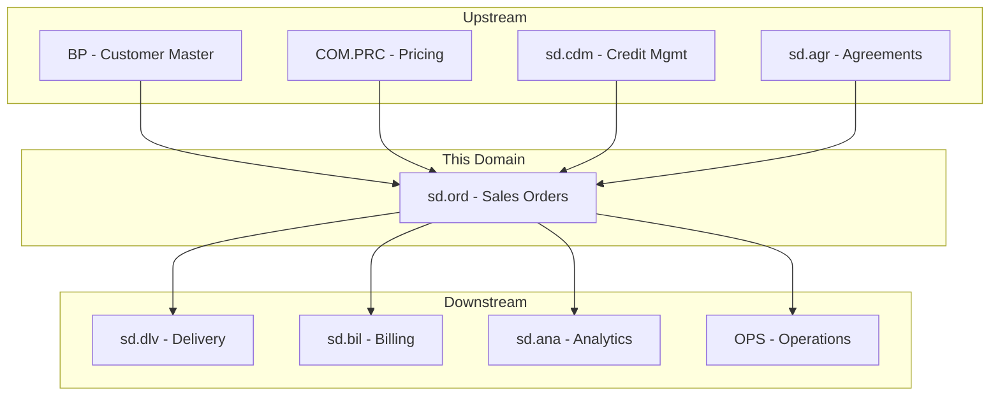
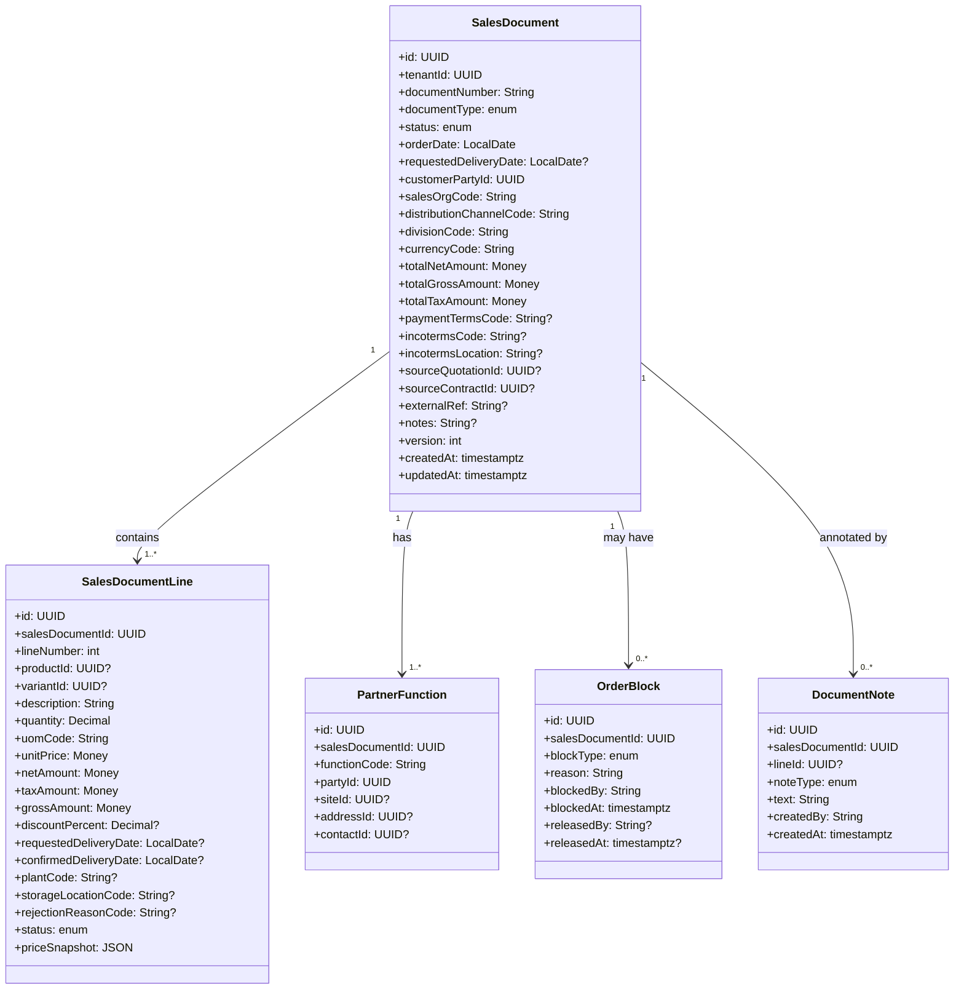
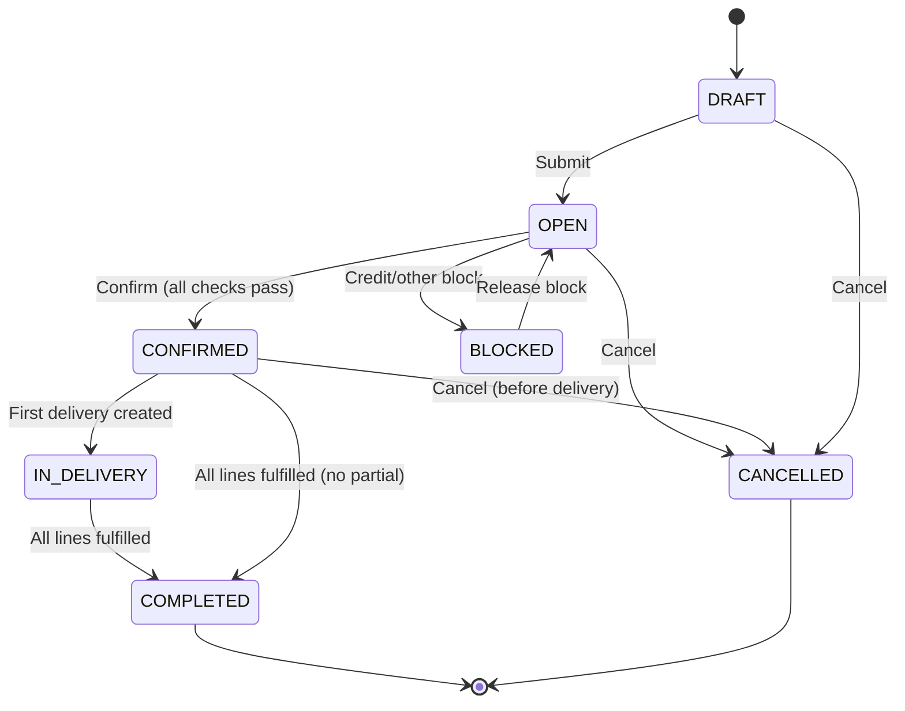
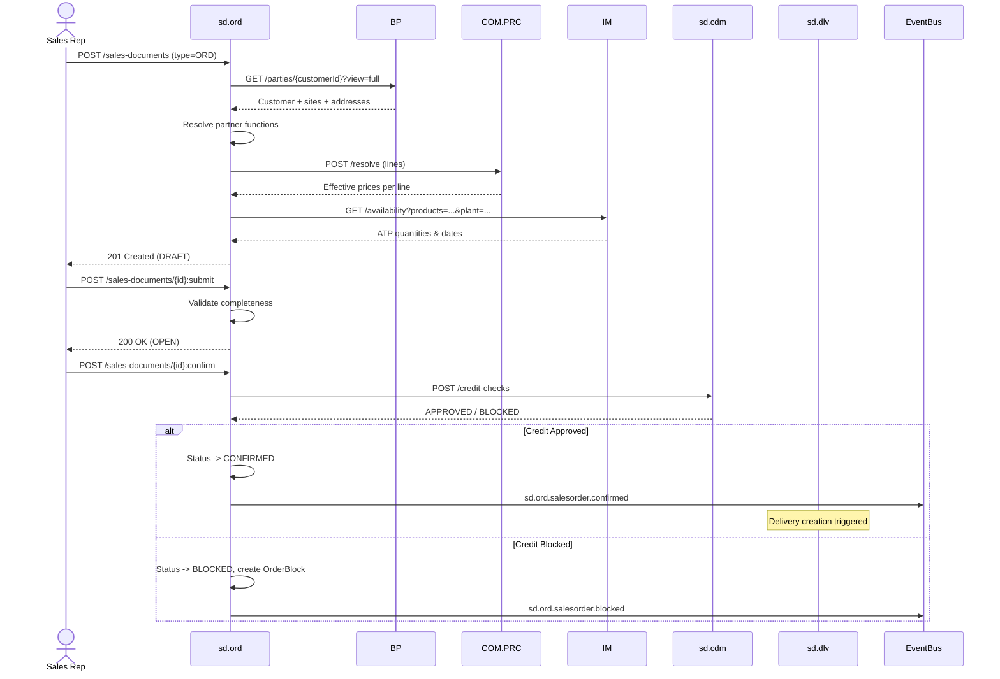
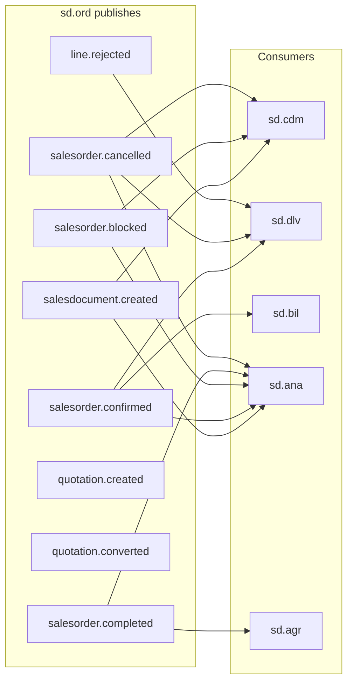
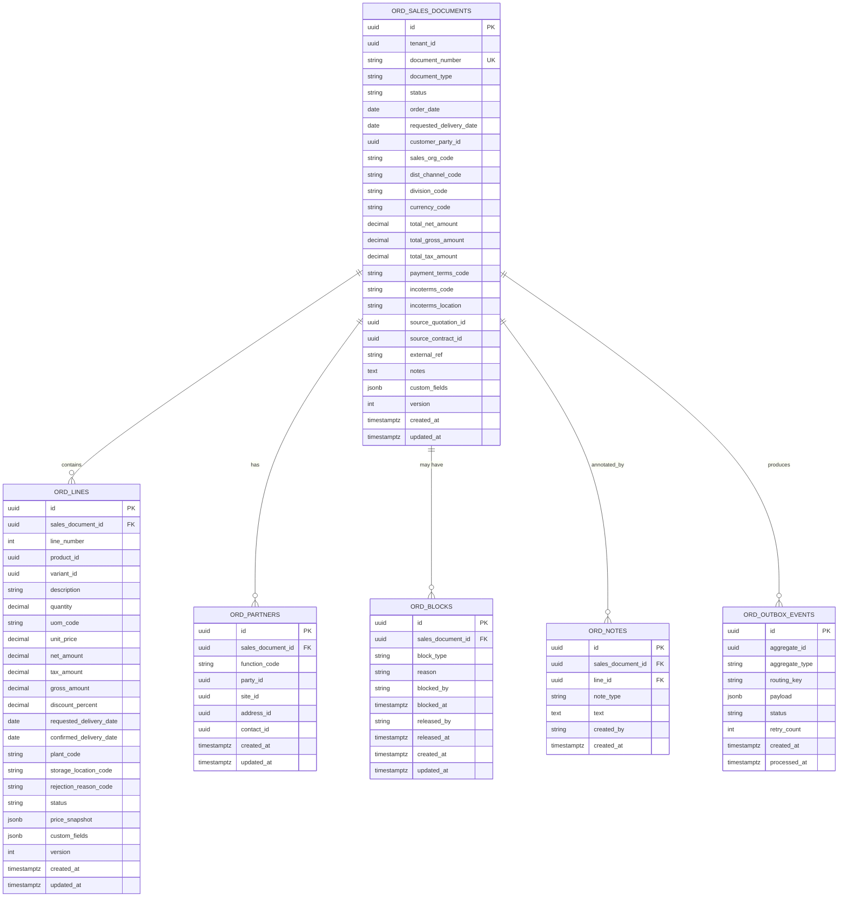

# SD.ORD - Sales Orders Domain / Service Specification

> **Conceptual Stack Layer:** Domain / Service
> **Space:** Platform
> **Owner:** Domain Engineering Team
> **Schema alignment:** `service-layer.schema.json`
> **Companion files:** `openapi.yaml`, `*.schema.json` (event contracts)
> **Referenced by:** Platform-Feature Spec SS5 (backend dependencies), BFF Contract
> **Belongs to:** SD Suite Spec (`_sd_suite.md`)

> **Meta Information**
> - **Version:** 2026-04-04
> - **Template:** `domain-service-spec.md` v1.0.0
> - **Template Compliance:** ~95% — §11 feature IDs pending feature specs, §13.1 SAP field mapping approximate
> - **Author(s):** OpenLeap Architecture Team
> - **Status:** DRAFT
> - **Suite:** `sd`
> - **Domain:** `ord`
> - **Bounded Context Ref:** `bc:sales-orders`
> - **Service ID:** `sd-ord-svc`
> - **basePackage:** `io.openleap.sd.ord`
> - **API Base Path:** `/api/sd/ord/v1`
> - **OpenLeap Starter Version:** TBD
> - **Port:** TBD
> - **Repository:** TBD
> - **Tags:** `sales`, `orders`, `quotations`, `contracts`
> - **Team:**
>   - Name: `team-sd`
>   - Email: `sd-team@openleap.io`
>   - Slack: `#sd-team`

---

## Specification Guidelines Compliance

> ### Non-Negotiables
> - Never invent facts. If required info is missing, add an **OPEN QUESTION** entry.
> - Preserve intent and decisions. Only change meaning when explicitly requested.
> - Do not remove normative constraints unless they are explicitly replaced.
> - Keep the spec **self-contained**: no "see chat", no implicit context.
>
> ### Source of Truth Priority
> When sources conflict:
> 1. Spec (explicit) wins
> 2. Starter specs (implementation constraints) next
> 3. Guidelines (best practices) last
>
> Record conflicts in the **Decisions & Conflicts** section (see Section 14).
>
> ### Style Guide
> - Prefer short sentences and lists.
> - Use MUST/SHOULD/MAY for normative statements.
> - Keep terminology consistent (Aggregate, Domain Service, Application Service, Command, Event).
> - Avoid ambiguous words ("often", "maybe") unless explicitly noting uncertainty.
> - Keep examples minimal and clearly marked as examples.
> - Do not add implementation code unless the chapter explicitly requires it.

---

## 0. Document Purpose & Scope

### 0.1 Purpose
This specification defines the Sales Orders domain, which manages the complete lifecycle of customer-facing sales documents: inquiries, quotations, sales orders, contracts, and scheduling agreements. It is the entry point for the SD order-to-cash process.

### 0.2 Target Audience
- Product Owners & Business Stakeholders
- System Architects & Technical Leads
- Integration Engineers

### 0.3 Scope
**In Scope:**
- Sales document lifecycle (create, confirm, change, complete, cancel)
- Quotation-to-order conversion
- Contract and scheduling agreement management
- Partner function resolution (sold-to, ship-to, bill-to, payer)
- Price determination (calling COM.PRC)
- ATP (Available-to-Promise) check via IM
- Credit check orchestration via sd.cdm
- Incompletion checks and order blocks

**Out of Scope:**
- Price rule management (COM.PRC)
- Customer master data (BP)
- Delivery processing (sd.dlv)
- Invoice creation (sd.bil)
- Warehouse operations (WM/IM)

### 0.4 Related Documents
- `_sd_suite.md` - SD Suite overview
- `sd_dlv-spec.md` - Delivery domain
- `sd_bil-spec.md` - Billing domain
- `sd_cdm-spec.md` - Credit Decision Management
- `sd_agr-spec.md` - Sales Agreements
- `BP_business_partner.md` - Business Partner
- `PRC_pricing.md` - Pricing Service
- `COM_Overview.md` - Commerce Suite

---

## 1. Business Context

### 1.1 Domain Purpose
`sd.ord` captures and manages **customer demand** as sales documents. It transforms customer intent (inquiry/quotation) into firm commitments (sales order) and long-term arrangements (contracts/scheduling agreements). It validates completeness, checks credit, resolves prices, and triggers downstream fulfillment.

### 1.2 Business Value
- Single source of truth for all sales commitments
- Automated price determination and credit checking
- Traceable quotation-to-order-to-delivery chain
- Support for diverse sales scenarios (standard, rush, consignment, free-of-charge)

### 1.3 Key Stakeholders

| Role | Responsibility | Primary Use Cases |
|------|----------------|-------------------|
| Sales Representative | Create quotations and orders | UC-ORD-001, UC-ORD-002, UC-ORD-003 |
| Sales Manager | Approve orders, manage blocks | UC-ORD-005 |
| Customer | Place orders (via channel) | UC-ORD-003 |
| Logistics Planner | View confirmed orders for delivery planning | Read-only consumer |
| Finance / Billing | Consume completed orders for invoicing | Event consumer |

### 1.4 Strategic Positioning



### 1.5 Service Context

| Property | Value |
|----------|-------|
| **Suite** | `sd` |
| **Domain** | `ord` |
| **Bounded Context** | `bc:sales-orders` |
| **Service ID** | `sd-ord-svc` |
| **Base Package** | `io.openleap.sd.ord` |

**Responsibilities:**
- Sales document lifecycle management (inquiry, quotation, order, contract, scheduling agreement)
- Partner function resolution from BP
- Price determination orchestration via COM.PRC
- ATP check orchestration via IM
- Credit check orchestration via sd.cdm
- Order block management
- Quotation-to-order conversion

**Authoritative Sources:**
| Source Type | Description | Access Pattern |
|-------------|-------------|----------------|
| REST API | Sales documents, lines, partners, blocks | Synchronous |
| Database | All sales document data (owned) | Direct (owner) |
| Events | Sales document lifecycle events | Asynchronous |

---

## 2. Service Identity

| Property | Value | Schema Field |
|----------|-------|-------------|
| **Service ID** | `sd-ord-svc` | `metadata.id` |
| **Display Name** | Sales Orders | `metadata.name` |
| **Suite** | `sd` | `metadata.suite` |
| **Domain** | `ord` | `metadata.domain` |
| **Bounded Context** | `bc:sales-orders` | `metadata.bounded_context_ref` |
| **Version** | `1.2.0` | `metadata.version` |
| **Status** | DRAFT | `metadata.status` |
| **API Base Path** | `/api/sd/ord/v1` | `metadata.api_base_path` |
| **Repository** | TBD | `metadata.repository` |
| **Tags** | `sales`, `orders`, `quotations`, `contracts` | `metadata.tags` |

**Team:**
| Property | Value |
|----------|-------|
| **Name** | `team-sd` |
| **Email** | `sd-team@openleap.io` |
| **Slack Channel** | `#sd-team` |

---

## 3. Domain Model

### 3.1 Conceptual Overview
The domain centers on **SalesDocument** as a polymorphic aggregate supporting multiple document types (inquiry, quotation, order, contract, scheduling agreement). Each document contains **lines** referencing products/variants with quantities, prices, and delivery dates. **Partner functions** link the document to business partners in various roles.

### 3.2 Core Concepts



### 3.3 Aggregate Definitions

#### 3.3.1 SalesDocument

| Property | Value |
|----------|-------|
| **Aggregate ID** | `agg:sales-document` |
| **Name** | `SalesDocument` |

**Business Purpose:**
Represents any customer-facing sales document in the system. The `documentType` determines behavior and allowed transitions.

**Document Types:**
| Type | Code | Description | Creates Delivery? | Creates Billing? |
|------|------|-------------|-------------------|-----------------|
| Inquiry | `INQ` | Customer inquiry, no commitment | No | No |
| Quotation | `QUO` | Price/availability offer to customer | No | No |
| Standard Order | `ORD` | Firm customer order | Yes | Yes |
| Rush Order | `RSH` | Same-day order, expedited processing | Yes | Yes |
| Free-of-Charge | `FOC` | Delivery without billing | Yes | No |
| Contract | `CTR` | Long-term quantity/value agreement | Via release orders | Via release orders |
| Scheduling Agreement | `SA` | Delivery schedule agreement | Yes (per schedule line) | Yes |

##### Aggregate Root

**Key Attributes:**
| Attribute | Type | Format | Description | Constraints | Required | Read-Only |
|-----------|------|--------|-------------|-------------|----------|-----------|
| id | string | uuid | Unique identifier | Immutable | Yes | Yes |
| tenantId | string | uuid | Tenant ownership | Immutable | Yes | Yes |
| documentNumber | string | — | Human-readable document number, e.g. SO-2026-000457 | Unique per tenant; max_length: 40 | Yes | Yes |
| documentType | string | — | Document type discriminator | enum_ref: `DocumentType` | Yes | Yes |
| status | string | — | Current lifecycle state | enum_ref: `DocumentStatus` | Yes | No |
| orderDate | string | date | Document creation date | ISO 8601 | Yes | No |
| requestedDeliveryDate | string | date | Customer-requested delivery date | >= orderDate | No | No |
| customerPartyId | string | uuid | Reference to BP.Party (sold-to party) | Must exist in BP | Yes | No |
| salesOrgCode | string | — | Sales organization code | max_length: 10; must exist in ref-data | Yes | No |
| distributionChannelCode | string | — | Distribution channel code | max_length: 10; must exist in ref-data | Yes | No |
| divisionCode | string | — | Division code | max_length: 10; must exist in ref-data | Yes | No |
| currencyCode | string | — | Document currency | ISO 4217; 3 chars | Yes | No |
| totalNetAmount | number | decimal | Sum of all line net amounts | precision: 2; >= 0 | Yes | Yes |
| totalGrossAmount | number | decimal | Sum of all line gross amounts | precision: 2; >= 0 | Yes | Yes |
| totalTaxAmount | number | decimal | Sum of all line tax amounts | precision: 2; >= 0 | Yes | Yes |
| paymentTermsCode | string | — | Payment terms reference | Must exist in ref-data | No | No |
| incotermsCode | string | — | Incoterms code (e.g., DAP, CIF) | Must exist in ref-data | No | No |
| incotermsLocation | string | — | Named place for Incoterms | max_length: 100 | No | No |
| sourceQuotationId | string | uuid | Source quotation (if converted from quotation) | — | No | Yes |
| sourceContractId | string | uuid | Source contract (if this is a release order) | — | No | Yes |
| externalRef | string | — | External reference, e.g., customer purchase order number | max_length: 255 | No | No |
| notes | string | — | Free-text header notes | max_length: 2000 | No | No |
| version | integer | int64 | Optimistic locking version (ETag) | — | Yes | Yes |
| createdAt | string | date-time | Record creation timestamp | ISO 8601 UTC | Yes | Yes |
| updatedAt | string | date-time | Last modification timestamp | ISO 8601 UTC | Yes | Yes |

**Lifecycle States:**

| Property | Value |
|----------|-------|
| **Initial State** | `DRAFT` |
| **Terminal States** | `COMPLETED`, `CANCELLED` |



**State Descriptions:**
| State | Description | Business Meaning |
|-------|-------------|------------------|
| DRAFT | Being created, not yet submitted | Incomplete, not visible to fulfillment |
| OPEN | Submitted, pending confirmation | Awaiting credit check, ATP, approvals |
| BLOCKED | Held due to credit, compliance, or manual block | Requires intervention to proceed |
| CONFIRMED | All checks passed, ready for fulfillment | Delivery and billing can proceed |
| IN_DELIVERY | At least one delivery created | Partially or fully in fulfillment |
| COMPLETED | All lines fulfilled and billed | Order fully processed |
| CANCELLED | Cancelled before or during processing | No further processing |

**Allowed Transitions:**
| From State | To State | Trigger | Guard / Business Preconditions |
|------------|----------|---------|-------------------------------|
| DRAFT | OPEN | Submit | All mandatory fields filled (incompletion check) |
| OPEN | CONFIRMED | Confirm | Credit check approved, prices resolved, ATP checked |
| OPEN | BLOCKED | Credit/other block | Credit check blocked or manual block |
| BLOCKED | OPEN | Release block | Block released by authorized user |
| CONFIRMED | IN_DELIVERY | First delivery created | sd.dlv creates delivery |
| IN_DELIVERY | COMPLETED | All lines fulfilled | All lines delivered and billed |
| CONFIRMED | COMPLETED | All lines fulfilled | Direct completion without partial |
| OPEN / CONFIRMED / DRAFT | CANCELLED | Cancel | No goods issued yet |

**Invariants:**
| Rule ID | Description |
|---------|-------------|
| BR-ORD-001 | Mandatory partner functions (SP, SH, BT, PY) |
| BR-ORD-002 | Price snapshot required before confirmation |
| BR-ORD-003 | Positive quantity on all lines |
| BR-ORD-004 | Currency consistency across lines |
| BR-ORD-005 | No modification after COMPLETED/CANCELLED |
| BR-ORD-006 | Quotation validity check on conversion |
| BR-ORD-007 | Contract target tracking on release |

**Domain Events Emitted:**
- `sd.ord.salesdocument.created`
- `sd.ord.salesorder.confirmed`
- `sd.ord.salesorder.blocked`
- `sd.ord.salesorder.completed`
- `sd.ord.salesorder.cancelled`
- `sd.ord.quotation.created`
- `sd.ord.quotation.converted`
- `sd.ord.line.rejected`

##### Child Entities

###### Entity: SalesDocumentLine

| Property | Value |
|----------|-------|
| **Entity ID** | `ent:sales-document-line` |
| **Name** | `SalesDocumentLine` |
| **Relationship to Root** | one_to_many |

**Business Purpose:**
A single line item within a sales document specifying product, quantity, price, and delivery date.

**Attributes:**
| Attribute | Type | Format | Description | Constraints | Required |
|-----------|------|--------|-------------|-------------|----------|
| id | string | uuid | Unique identifier | — | Yes |
| lineNumber | integer | — | Sequential line number within document | Unique per document; 1–999 | Yes |
| productId | string | uuid | Reference to product catalog | — | No |
| variantId | string | uuid | Reference to product variant | — | No |
| description | string | — | Line item description (product name or free text) | max_length: 500 | Yes |
| quantity | number | decimal | Ordered quantity | > 0; precision: 3 | Yes |
| uomCode | string | — | Unit of measure code | Valid UCUM code | Yes |
| unitPrice | number | decimal | Unit price from price snapshot | precision: 4; >= 0 | Yes |
| netAmount | number | decimal | Line net amount (unitPrice × quantity − discount) | precision: 2; >= 0 | Yes |
| taxAmount | number | decimal | Calculated tax amount for this line | precision: 2; >= 0 | Yes |
| grossAmount | number | decimal | Net amount plus tax | precision: 2; >= 0 | Yes |
| discountPercent | number | decimal | Discount percentage applied | 0–100; precision: 2 | No |
| requestedDeliveryDate | string | date | Customer-requested delivery date for this line | ISO 8601 | No |
| confirmedDeliveryDate | string | date | ATP-confirmed delivery date | ISO 8601; >= requestedDeliveryDate | No |
| plantCode | string | — | Supplying plant code | max_length: 10 | No |
| storageLocationCode | string | — | Storage location within plant | max_length: 10 | No |
| rejectionReasonCode | string | — | Reason code if this line was rejected | enum_ref: `RejectionReasonCode` | No |
| status | string | — | Line fulfillment status | enum_ref: `LineStatus` | Yes |
| priceSnapshot | object | json | Frozen pricing result from COM.PRC; stored for deterministic billing | — | No |

**Collection Constraints:**
- Minimum items: 1
- Maximum items: 999

**Invariants:**
| Rule ID | Description |
|---------|-------------|
| BR-ORD-003 | Quantity must be positive |
| BR-ORD-004 | Currency must match document |
| BR-ORD-008 | Line numbers unique within document |
| BR-ORD-010 | Rejection closes line from delivery/billing |

###### Entity: PartnerFunction

| Property | Value |
|----------|-------|
| **Entity ID** | `ent:partner-function` |
| **Name** | `PartnerFunction` |
| **Relationship to Root** | one_to_many |

**Business Purpose:**
Links the sales document to business partners in various roles (sold-to, ship-to, bill-to, payer, contact, sales employee). Partner functions are resolved from the BP master when the customer is selected; they can be overridden per document.

**Attributes:**
| Attribute | Type | Format | Description | Constraints | Required |
|-----------|------|--------|-------------|-------------|----------|
| id | string | uuid | Unique identifier | — | Yes |
| salesDocumentId | string | uuid | Parent sales document reference | FK to SalesDocument.id | Yes |
| functionCode | string | — | Partner role code | enum_ref: `PartnerFunctionCode` | Yes |
| partyId | string | uuid | Reference to BP.Party | Must exist in BP | Yes |
| siteId | string | uuid | Reference to BP.Site (e.g., delivery address) | — | No |
| addressId | string | uuid | Reference to a specific BP address | — | No |
| contactId | string | uuid | Reference to a contact person at the party | — | No |

**Collection Constraints:**
- Minimum items: 4 (SP, SH, BT, PY are mandatory for firm orders)
- Maximum items: 20

**Invariants:**
| Rule ID | Description |
|---------|-------------|
| BR-ORD-001 | SP, SH, BT, PY functions MUST be present before document submission |

###### Entity: OrderBlock

| Property | Value |
|----------|-------|
| **Entity ID** | `ent:order-block` |
| **Name** | `OrderBlock` |
| **Relationship to Root** | one_to_many |

**Business Purpose:**
Records a hold placed on a sales document due to credit, compliance, or manual intervention. Multiple blocks can coexist; all must be released before the order can proceed to CONFIRMED.

**Attributes:**
| Attribute | Type | Format | Description | Constraints | Required |
|-----------|------|--------|-------------|-------------|----------|
| id | string | uuid | Unique identifier | — | Yes |
| salesDocumentId | string | uuid | Parent sales document reference | FK to SalesDocument.id | Yes |
| blockType | string | — | Category of the block | enum_ref: `BlockType` | Yes |
| reason | string | — | Human-readable reason for the block | max_length: 500 | Yes |
| blockedBy | string | — | User ID or system identifier that applied the block | max_length: 255 | Yes |
| blockedAt | string | date-time | Timestamp when block was applied | ISO 8601 UTC | Yes |
| releasedBy | string | — | User ID that released the block | max_length: 255 | No |
| releasedAt | string | date-time | Timestamp when block was released | ISO 8601 UTC; > blockedAt | No |
| active | boolean | — | Whether this block is currently active | Computed: releasedAt IS NULL | Yes |

**Collection Constraints:**
- Minimum items: 0
- Maximum items: 10

**Invariants:**
| Rule ID | Description |
|---------|-------------|
| BR-ORD-011 | An active OrderBlock prevents transition to CONFIRMED |

###### Entity: DocumentNote

| Property | Value |
|----------|-------|
| **Entity ID** | `ent:document-note` |
| **Name** | `DocumentNote` |
| **Relationship to Root** | one_to_many |

**Business Purpose:**
Free-text annotations attached to a document header or to individual lines. Notes can be internal (not printed) or external (printed on customer documents such as order confirmations and delivery notes).

**Attributes:**
| Attribute | Type | Format | Description | Constraints | Required |
|-----------|------|--------|-------------|-------------|----------|
| id | string | uuid | Unique identifier | — | Yes |
| salesDocumentId | string | uuid | Parent sales document reference | FK to SalesDocument.id | Yes |
| lineId | string | uuid | Optional line reference (null = header note) | FK to SalesDocumentLine.id | No |
| noteType | string | — | Note category controlling print output | enum_ref: `NoteType` | Yes |
| text | string | — | Note text | max_length: 5000 | Yes |
| createdBy | string | — | User who created the note | max_length: 255 | Yes |
| createdAt | string | date-time | Note creation timestamp | ISO 8601 UTC | Yes |

**Collection Constraints:**
- Minimum items: 0
- Maximum items: 100

##### Value Objects

###### Value Object: Money

| Property | Value |
|----------|-------|
| **VO ID** | `vo:money` |
| **Name** | `Money` |

**Description:**
Monetary amount with currency. Used for all financial amounts on SalesDocument and SalesDocumentLine. Immutable; a new Money instance is created on any change.

**Attributes:**
| Attribute | Type | Format | Description | Constraints |
|-----------|------|--------|-------------|-------------|
| amount | number | decimal | Monetary value | precision: 2; non-negative |
| currency | string | — | ISO 4217 currency code | 3 chars; uppercase |

**Validation Rules:**
- Currency MUST be a valid ISO 4217 code.
- Amount MUST be non-negative.
- Currency MUST match the parent document's `currencyCode`.

**Used By:**
- `agg:sales-document` (totalNetAmount, totalGrossAmount, totalTaxAmount)
- `ent:sales-document-line` (unitPrice, netAmount, taxAmount, grossAmount)

### 3.4 Enumerations

#### DocumentType

**Description:** Types of sales documents supported.

| Value | Description | Deprecated |
|-------|-------------|------------|
| `INQ` | Customer inquiry — non-binding expression of interest | No |
| `QUO` | Quotation — price and availability offer to customer | No |
| `ORD` | Standard Sales Order — firm customer order | No |
| `RSH` | Rush Order — expedited, same-day processing priority | No |
| `FOC` | Free-of-Charge Order — delivery without invoice | No |
| `CTR` | Contract — long-term quantity or value agreement | No |
| `SA` | Scheduling Agreement — blanket order with delivery schedule | No |

#### DocumentStatus

**Description:** Lifecycle states for sales documents.

| Value | Description | Deprecated |
|-------|-------------|------------|
| `DRAFT` | Being created; not yet submitted for processing | No |
| `OPEN` | Submitted, pending credit check and confirmation | No |
| `BLOCKED` | Held by an active OrderBlock; cannot proceed | No |
| `CONFIRMED` | All checks passed; ready for delivery and billing | No |
| `IN_DELIVERY` | At least one delivery has been created | No |
| `COMPLETED` | All lines fulfilled and billed; no further changes | No |
| `CANCELLED` | Cancelled; archived for audit purposes | No |

#### LineStatus

**Description:** Fulfillment status of an individual sales document line.

| Value | Description | Deprecated |
|-------|-------------|------------|
| `OPEN` | Not yet fulfilled; awaiting delivery | No |
| `PARTIALLY_DELIVERED` | Some quantity delivered; remainder pending | No |
| `FULLY_DELIVERED` | Full quantity delivered to customer | No |
| `BILLED` | Delivery has been invoiced; line complete | No |
| `REJECTED` | Rejected by customer or sales rep; excluded from fulfillment | No |
| `CANCELLED` | Cancelled; excluded from further processing | No |

#### BlockType

**Description:** Categories of order blocks that can be applied to a sales document.

| Value | Description | Deprecated |
|-------|-------------|------------|
| `CREDIT` | Credit limit exceeded or customer credit status blocked | No |
| `MANUAL` | Manually placed hold by sales manager or administrator | No |
| `COMPLIANCE` | Compliance or export-control hold | No |
| `DELIVERY` | Delivery-related hold (e.g., incomplete ship-to address) | No |
| `PRICE` | Pricing error; price determination failed for one or more lines | No |

#### NoteType

**Description:** Categories of document notes controlling print and visibility.

| Value | Description | Deprecated |
|-------|-------------|------------|
| `INTERNAL` | Internal note; not printed on customer documents | No |
| `EXTERNAL` | External note; printed on order confirmation and delivery note | No |
| `SHIPPING` | Shipping instruction; printed on delivery note and packing slip | No |
| `BILLING` | Billing note; printed on invoice | No |

#### PartnerFunctionCode

**Description:** Role codes for partner functions on a sales document.

| Value | Description | Deprecated |
|-------|-------------|------------|
| `SP` | Sold-To Party — contractual counterpart; mandatory | No |
| `SH` | Ship-To Party — physical delivery recipient; mandatory | No |
| `BT` | Bill-To Party — invoice recipient; mandatory | No |
| `PY` | Payer — payment party; mandatory | No |
| `CP` | Contact Person at customer | No |
| `SE` | Sales Employee responsible for the order | No |
| `FW` | Forwarding Agent / Freight Forwarder | No |

### 3.5 Shared Types

#### Money

| Property | Value |
|----------|-------|
| **Type ID** | `type:money` |
| **Name** | `Money` |

**Description:** Reusable monetary amount type with ISO 4217 currency. Defined as a Value Object under SalesDocument aggregate; shared across all financial attributes in this domain.

**Attributes:**
| Attribute | Type | Format | Description | Constraints |
|-----------|------|--------|-------------|-------------|
| amount | number | decimal | Monetary value | precision: 2; >= 0 |
| currency | string | — | ISO 4217 currency code | 3 chars; uppercase |

**Validation Rules:**
- `currency` MUST be a valid ISO 4217 code.
- `amount` MUST be non-negative.

**Used By:**
- `agg:sales-document` — totalNetAmount, totalGrossAmount, totalTaxAmount
- `ent:sales-document-line` — unitPrice, netAmount, taxAmount, grossAmount

#### PriceSnapshot

| Property | Value |
|----------|-------|
| **Type ID** | `type:price-snapshot` |
| **Name** | `PriceSnapshot` |

**Description:** Frozen result of a COM.PRC price determination call, stored on each order line. Ensures billing reproduces the exact prices agreed at order time even if COM.PRC pricing rules change later.

**Attributes:**
| Attribute | Type | Format | Description | Constraints |
|-----------|------|--------|-------------|-------------|
| pricingDate | string | date | Date of price determination | ISO 8601 |
| listPrice | number | decimal | Catalogue list price per UOM | precision: 4 |
| effectivePrice | number | decimal | Final effective unit price after discounts/surcharges | precision: 4 |
| discountPercent | number | decimal | Aggregate discount percentage | 0–100; precision: 2 |
| pricingConditions | array | — | Array of pricing condition records (condition type, value) | — |
| currencyCode | string | — | Currency of the snapshot | ISO 4217 |
| priceListId | string | uuid | Reference to the COM.PRC price list used | — |

**Validation Rules:**
- `effectivePrice` MUST be >= 0.
- `currencyCode` MUST match the parent SalesDocument `currencyCode`.
- `pricingDate` MUST be <= `orderDate`.

**Used By:**
- `ent:sales-document-line` — priceSnapshot field (stored as JSONB)

---

## 4. Business Rules & Constraints

### 4.1 Business Rules Catalog

| ID | Rule Name | Description | Scope | Enforcement | Error Code |
|----|-----------|-------------|-------|-------------|------------|
| BR-ORD-001 | Mandatory Partners | SP, SH, BT, PY partner functions required | SalesDocument | Submit | `ORD_MISSING_PARTNERS` |
| BR-ORD-002 | Price Snapshot Required | All lines need resolved prices before confirmation | SalesDocument | Confirm | `ORD_PRICES_MISSING` |
| BR-ORD-003 | Positive Quantity | Line quantity > 0 | SalesDocumentLine | Create/Update | `ORD_INVALID_QUANTITY` |
| BR-ORD-004 | Currency Consistency | Lines must match document currency | SalesDocumentLine | Create/Update | `ORD_CURRENCY_MISMATCH` |
| BR-ORD-005 | Immutable After Close | No changes to COMPLETED/CANCELLED documents | SalesDocument | Update | `ORD_IMMUTABLE` |
| BR-ORD-006 | Quotation Validity | Convert only within valid period | SalesDocument | Convert | `ORD_QUOTATION_EXPIRED` |
| BR-ORD-007 | Contract Target | Release cannot exceed contract target | SalesDocument | Release | `ORD_TARGET_EXCEEDED` |
| BR-ORD-008 | Line Number Unique | Line numbers unique within document | SalesDocumentLine | Create | `ORD_DUPLICATE_LINE` |
| BR-ORD-009 | Delivery Date Logic | Confirmed date calculated from ATP + lead time | SalesDocumentLine | Confirm | `ORD_DATE_INVALID` |
| BR-ORD-010 | Rejection Closes Line | Rejected line excluded from delivery/billing | SalesDocumentLine | Update | — |
| BR-ORD-011 | Active Block Prevents Confirmation | Document with active OrderBlock cannot be confirmed | SalesDocument | Confirm | `ORD_ACTIVE_BLOCK` |

### 4.2 Detailed Rule Definitions

#### BR-ORD-001: Mandatory Partners

**Business Context:**
Every sales transaction requires four partner roles for downstream processing: sold-to for the contractual party, ship-to for delivery, bill-to for invoicing, and payer for payment.

**Rule Statement:**
Every SalesDocument MUST have at least: Sold-To (SP), Ship-To (SH), Bill-To (BT), Payer (PY) partner functions before submission.

**Applies To:**
- Aggregate: SalesDocument
- Operations: Submit (DRAFT -> OPEN)

**Enforcement:**
Application Service validates PartnerFunction collection on the submit command before state transition.

**Validation Logic:**
Check that `partnerFunctions` contains at least one entry with `functionCode = SP`, one with `SH`, one with `BT`, and one with `PY`.

**Error Handling:**
- **Error Code:** `ORD_MISSING_PARTNERS`
- **Error Message:** "Sales document requires partner functions: SP, SH, BT, PY"
- **User action:** Add the missing partner functions before submitting the document.

**Examples:**
- **Valid:** Document has SP=Customer GmbH, SH=Warehouse Berlin, BT=Customer GmbH HQ, PY=Customer GmbH Finance.
- **Invalid:** Document has only SP and SH; BT and PY are missing.

---

#### BR-ORD-002: Price Snapshot Required

**Business Context:**
Deterministic billing requires that all order lines have resolved prices stored as frozen snapshots. Without a frozen snapshot, billing amounts could change if COM.PRC pricing rules are updated after order placement.

**Rule Statement:**
All SalesDocumentLines MUST have a non-null `priceSnapshot` before the document transitions to CONFIRMED (OPEN -> CONFIRMED).

**Applies To:**
- Aggregate: SalesDocument
- Operations: Confirm (OPEN -> CONFIRMED)

**Enforcement:**
Application Service checks each line's `priceSnapshot` field on the confirm command; if any line lacks a snapshot, the command is rejected.

**Validation Logic:**
Iterate all lines; for each line, check `priceSnapshot IS NOT NULL`. If any line fails, reject the confirmation.

**Error Handling:**
- **Error Code:** `ORD_PRICES_MISSING`
- **Error Message:** "All lines must have resolved prices before confirmation"
- **User action:** Trigger repricing via `POST /sales-documents/{id}:reprice` to resolve prices for all lines.

**Examples:**
- **Valid:** All 3 lines have a priceSnapshot with effectivePrice, pricingDate, and conditions.
- **Invalid:** Line 2 has `priceSnapshot: null` because COM.PRC returned a pricing error.

---

#### BR-ORD-003: Positive Quantity

**Business Context:**
Sales order lines represent a commitment to deliver a specific quantity to the customer. Zero or negative quantities have no business meaning and would corrupt totals and ATP checks.

**Rule Statement:**
The `quantity` field on every SalesDocumentLine MUST be greater than zero.

**Applies To:**
- Aggregate: SalesDocumentLine
- Operations: Create, Update

**Enforcement:**
Domain Object validates quantity in the SalesDocumentLine constructor and setter.

**Validation Logic:**
Check `quantity > 0`. Precision is 3 decimal places; minimum expressible positive value is 0.001.

**Error Handling:**
- **Error Code:** `ORD_INVALID_QUANTITY`
- **Error Message:** "Line quantity must be greater than zero"
- **User action:** Enter a positive quantity value for the line.

**Examples:**
- **Valid:** `quantity = 100`, `quantity = 0.5`, `quantity = 1000.000`
- **Invalid:** `quantity = 0`, `quantity = -5`

---

#### BR-ORD-004: Currency Consistency

**Business Context:**
Sales document totals are computed by summing line amounts. Mixing currencies within a single document would make totals meaningless and downstream billing impossible.

**Rule Statement:**
The currency of every Money value on SalesDocumentLine (unitPrice, netAmount, etc.) MUST match the `currencyCode` of the parent SalesDocument.

**Applies To:**
- Aggregate: SalesDocumentLine
- Operations: Create, Update

**Enforcement:**
Domain Object checks currency consistency whenever a line is created or its price data updated.

**Validation Logic:**
Check `line.unitPrice.currency == salesDocument.currencyCode`.

**Error Handling:**
- **Error Code:** `ORD_CURRENCY_MISMATCH`
- **Error Message:** "Line currency must match document currency {currencyCode}"
- **User action:** Ensure all line prices are in the document's currency.

**Examples:**
- **Valid:** Document currencyCode = EUR; line unitPrice.currency = EUR.
- **Invalid:** Document currencyCode = EUR; line unitPrice.currency = USD.

---

#### BR-ORD-005: Immutable After Close

**Business Context:**
Completed and cancelled orders are final business records. Modifying them after the fact would undermine audit trails and create inconsistency with delivered goods and issued invoices.

**Rule Statement:**
A SalesDocument in status COMPLETED or CANCELLED MUST NOT be modified. Any write operation MUST be rejected with an appropriate error.

**Applies To:**
- Aggregate: SalesDocument
- Operations: Update, Delete, any state-changing command

**Enforcement:**
Application Service checks document status before executing any command. Domain Object raises invariant exception if mutation is attempted on a closed document.

**Validation Logic:**
Check `status NOT IN (COMPLETED, CANCELLED)` before applying any change.

**Error Handling:**
- **Error Code:** `ORD_IMMUTABLE`
- **Error Message:** "Sales document {documentNumber} is in terminal state {status} and cannot be modified"
- **User action:** No action possible; create a new document if a new transaction is required.

**Examples:**
- **Valid:** Updating a line on an OPEN document.
- **Invalid:** Attempting to PATCH a COMPLETED order to change the customer reference.

---

#### BR-ORD-006: Quotation Validity

**Business Context:**
A quotation has a validity period communicated to the customer. Converting an expired quotation to an order would create a commitment based on prices or terms the customer may no longer be entitled to.

**Rule Statement:**
A quotation MUST be in status OPEN and its validity period MUST NOT have expired at the time of conversion to a sales order.

**Applies To:**
- Aggregate: SalesDocument
- Operations: Convert (quotation -> order)

**Enforcement:**
Application Service checks quotation status and validity dates on the convert command.

**Validation Logic:**
Check `sourceQuotation.status == OPEN` AND `sourceQuotation.validTo >= today()`.

**Error Handling:**
- **Error Code:** `ORD_QUOTATION_EXPIRED`
- **Error Message:** "Quotation {documentNumber} validity period has expired or quotation is no longer open"
- **User action:** Create a new quotation with updated terms and convert from that.

**Examples:**
- **Valid:** Converting quotation QUO-2026-00123 with validTo = 2026-04-30 on 2026-04-04.
- **Invalid:** Converting quotation with validTo = 2026-03-31 on 2026-04-04.

---

#### BR-ORD-007: Contract Target Tracking

**Business Context:**
Contracts establish a total quantity or value commitment. Release orders consume the contract target progressively. Exceeding the target violates the agreed commercial terms.

**Rule Statement:**
The sum of all active release order quantities/values against a contract MUST NOT exceed the contract's target quantity or target value.

**Applies To:**
- Aggregate: SalesDocument (type=CTR and release orders)
- Operations: Create release order, confirm release order

**Enforcement:**
Domain Service checks cumulative released quantity/value against contract target when a release order is confirmed.

**Validation Logic:**
Sum all confirmed and open release orders for the contract. Check `sum(releaseQuantity) <= contract.targetQuantity` and `sum(releaseValue) <= contract.targetValue`.

**Error Handling:**
- **Error Code:** `ORD_TARGET_EXCEEDED`
- **Error Message:** "Release order quantity/value would exceed contract {documentNumber} target"
- **User action:** Reduce the release order quantity, or amend the contract target before proceeding.

**Examples:**
- **Valid:** Contract target = 1000 units; existing releases = 600 units; new release = 300 units (total 900).
- **Invalid:** Contract target = 1000 units; existing releases = 800 units; new release = 300 units (total 1100).

---

#### BR-ORD-008: Line Number Unique

**Business Context:**
Line numbers serve as stable business references within a document, used in customer communications and downstream processing. Duplicate line numbers create ambiguity.

**Rule Statement:**
`lineNumber` MUST be unique within a SalesDocument. No two lines may share the same `lineNumber`.

**Applies To:**
- Aggregate: SalesDocumentLine
- Operations: Create (add line)

**Enforcement:**
Domain Object validates uniqueness of lineNumber within the SalesDocument aggregate's lines collection on add.

**Validation Logic:**
Check `NOT EXISTS line IN salesDocument.lines WHERE line.lineNumber == newLine.lineNumber`.

**Error Handling:**
- **Error Code:** `ORD_DUPLICATE_LINE`
- **Error Message:** "Line number {lineNumber} already exists in document {documentNumber}"
- **User action:** Use the next available line number.

**Examples:**
- **Valid:** Document has lines 10, 20, 30; adding line 40.
- **Invalid:** Document has lines 10, 20, 30; attempting to add another line 20.

---

#### BR-ORD-009: Delivery Date Logic

**Business Context:**
The confirmed delivery date is the date the system commits to delivering the goods based on ATP availability and plant lead time. It must not precede the requested date and must be at least today plus lead time.

**Rule Statement:**
When a line's `confirmedDeliveryDate` is set, it MUST be >= `requestedDeliveryDate` (if provided) and >= today + plant lead time.

**Applies To:**
- Aggregate: SalesDocumentLine
- Operations: Confirm (ATP check result applied)

**Enforcement:**
Application Service applies the ATP result from IM. If IM returns an earlier date than requested, the confirmed date is set to max(ATP result, requestedDeliveryDate).

**Validation Logic:**
Check `confirmedDeliveryDate >= requestedDeliveryDate` (if requestedDeliveryDate IS NOT NULL).

**Error Handling:**
- **Error Code:** `ORD_DATE_INVALID`
- **Error Message:** "Confirmed delivery date {confirmedDate} is before requested date {requestedDate}"
- **User action:** Accept the confirmed date or negotiate revised delivery terms with the customer.

**Examples:**
- **Valid:** requestedDeliveryDate = 2026-05-01; confirmedDeliveryDate = 2026-05-01.
- **Invalid:** requestedDeliveryDate = 2026-04-15; ATP returns 2026-04-10 (system should set to 2026-04-15, not 04-10).

---

#### BR-ORD-010: Rejection Closes Line

**Business Context:**
A rejected line represents product the customer does not want. It must be excluded from delivery scheduling and billing to avoid unwanted deliveries.

**Rule Statement:**
A SalesDocumentLine with status REJECTED MUST NOT be included in delivery creation or billing document generation.

**Applies To:**
- Aggregate: SalesDocumentLine
- Operations: Update (reject line), downstream consumption

**Enforcement:**
Domain Service filters out rejected lines when publishing the `sd.ord.salesorder.confirmed` event payload. sd.dlv and sd.bil consumers must honor the line status.

**Error Handling:** Not applicable (informational constraint for downstream processing).

**Examples:**
- **Valid:** 3-line order; line 20 rejected; sd.dlv creates delivery for lines 10 and 30 only.
- **Invalid:** Delivery created including rejected line 20.

---

#### BR-ORD-011: Active Block Prevents Confirmation

**Business Context:**
Order blocks represent unresolved holds. Confirming a blocked order bypasses the business control, defeating the purpose of the block mechanism.

**Rule Statement:**
A SalesDocument with at least one active OrderBlock (releasedAt IS NULL) MUST NOT transition to CONFIRMED.

**Applies To:**
- Aggregate: SalesDocument
- Operations: Confirm

**Enforcement:**
Application Service checks for active blocks before allowing the confirm command to proceed.

**Validation Logic:**
Check `NOT EXISTS block IN salesDocument.blocks WHERE block.releasedAt IS NULL`.

**Error Handling:**
- **Error Code:** `ORD_ACTIVE_BLOCK`
- **Error Message:** "Sales document {documentNumber} has active blocks that must be released before confirmation"
- **User action:** Release all active OrderBlocks via `POST /sales-documents/{id}:release-block`.

**Examples:**
- **Valid:** All blocks have releasedAt set; confirm proceeds.
- **Invalid:** One CREDIT block still active; confirm rejected.

---

### 4.3 Data Validation Rules

**Field-Level Validations:**
| Field | Validation Rule | Error Message |
|-------|----------------|---------------|
| SalesDocument.currencyCode | Valid ISO 4217; 3 uppercase chars | "Invalid currency code" |
| SalesDocument.documentNumber | Unique per tenant; max_length 40 | "Document number already exists" |
| SalesDocument.salesOrgCode | Must exist in ref-data-svc | "Unknown sales organization" |
| SalesDocument.distributionChannelCode | Must exist in ref-data-svc | "Unknown distribution channel" |
| SalesDocument.divisionCode | Must exist in ref-data-svc | "Unknown division" |
| SalesDocument.requestedDeliveryDate | >= orderDate if provided | "Delivery date must be on or after order date" |
| SalesDocument.paymentTermsCode | Must exist in ref-data-svc if provided | "Unknown payment terms" |
| SalesDocument.incotermsCode | Must exist in ref-data-svc if provided | "Unknown Incoterms code" |
| SalesDocumentLine.quantity | > 0; precision ≤ 3 | "Quantity must be greater than zero" |
| SalesDocumentLine.uomCode | Valid UCUM code | "Invalid unit of measure" |
| SalesDocumentLine.lineNumber | Unique per document; 1–999 | "Line number already exists in document" |
| SalesDocumentLine.discountPercent | 0–100 if provided | "Discount must be between 0 and 100" |
| PartnerFunction.functionCode | Must be a valid PartnerFunctionCode enum value | "Invalid partner function code" |
| PartnerFunction.partyId | Must exist in BP | "Unknown business partner" |

**Cross-Field Validations:**
- `requestedDeliveryDate >= orderDate` when provided
- `confirmedDeliveryDate >= requestedDeliveryDate` when both provided
- All Money currency fields within a document MUST match `SalesDocument.currencyCode`
- Contract `sourceContractId` reference MUST point to a SalesDocument with `documentType = CTR`
- `sourceQuotationId` MUST point to a SalesDocument with `documentType = QUO`

### 4.4 Reference Data Dependencies

**Required Reference Data:**
| Catalog | Source Service | Fields Referencing | Validation |
|---------|----------------|-------------------|------------|
| Countries | ref-data-svc | Address fields on partner functions | Must exist and be active |
| Currencies | ref-data-svc | currencyCode | Must exist and be active |
| Units of Measure | si-unit-svc | uomCode | Must be valid UCUM code |
| Payment Terms | ref-data-svc | paymentTermsCode | Must exist |
| Incoterms | ref-data-svc | incotermsCode | Must exist (2020 edition) |
| Sales Organizations | ref-data-svc | salesOrgCode | Must exist |
| Distribution Channels | ref-data-svc | distributionChannelCode | Must exist |
| Divisions | ref-data-svc | divisionCode | Must exist |
| Plants | ref-data-svc | plantCode on lines | Must exist if provided |
| Rejection Reason Codes | ref-data-svc | rejectionReasonCode on lines | Must exist if provided |

---

## 5. Use Cases

### 5.1 Business Logic Placement

| Logic Type | Placement | Examples |
|------------|-----------|----------|
| Aggregate invariants | Domain Object | Partner function validation, quantity checks, currency consistency |
| Cross-aggregate logic | Domain Service | Price determination orchestration, ATP check orchestration |
| Orchestration & transactions | Application Service | Order creation with pricing + ATP, credit check coordination, event publishing |

### 5.2 Use Cases (Canonical Format)

#### UC-ORD-001: Create Quotation

| Field | Value |
|-------|-------|
| **id** | `CreateQuotation` |
| **type** | WRITE |
| **trigger** | REST |
| **aggregate** | `SalesDocument` |
| **domainOperation** | `SalesDocument.create` |
| **inputs** | `customerPartyId: UUID`, `lines: SalesDocumentLine[]`, `salesOrgCode: String`, `currencyCode: String` |
| **outputs** | `SalesDocument` (DRAFT) |
| **events** | `SalesDocumentCreated` |
| **rest** | `POST /api/sd/ord/v1/sales-documents` |
| **idempotency** | optional |
| **errors** | `ORD_INVALID_QUANTITY`: Line quantity must be positive |

**Actor:** Sales Representative

**Preconditions:**
- Customer exists in BP
- Products exist in CAT

**Main Flow:**
1. Sales rep submits POST with documentType=QUO, customer, lines, sales org.
2. System resolves partner functions from BP master.
3. System calls COM.PRC for price determination; stores priceSnapshot on each line.
4. System performs ATP check via IM (informational only; does not block creation).
5. System creates SalesDocument in DRAFT state.
6. Sales rep reviews, finalizes, and submits (DRAFT -> OPEN).
7. System publishes `sd.ord.quotation.created` event.

**Postconditions:**
- SalesDocument in OPEN state with valid prices and partner functions.

**Business Rules Applied:**
- BR-ORD-001: Mandatory partner functions on submit.
- BR-ORD-003: Positive quantities.

**Alternative Flows:**
- **Alt-1:** If COM.PRC returns a pricing error for a line, line is created without priceSnapshot; rep must resolve before confirming.

**Exception Flows:**
- **Exc-1:** If customerPartyId does not exist in BP, return `400 Bad Request` with `ORD_UNKNOWN_CUSTOMER`.

---

#### UC-ORD-002: Convert Quotation to Sales Order

| Field | Value |
|-------|-------|
| **id** | `ConvertQuotationToOrder` |
| **type** | WRITE |
| **trigger** | REST |
| **aggregate** | `SalesDocument` |
| **domainOperation** | `SalesDocument.convert` |
| **inputs** | `quotationId: UUID` |
| **outputs** | `SalesDocument` (new order) |
| **events** | `QuotationConverted`, `SalesDocumentCreated` |
| **rest** | `POST /api/sd/ord/v1/sales-documents/{id}:convert` |
| **idempotency** | required |
| **errors** | `ORD_QUOTATION_EXPIRED`: Quotation validity period exceeded |

**Actor:** Sales Representative

**Preconditions:**
- Quotation in OPEN state, within validity period.

**Main Flow:**
1. Sales rep triggers conversion via POST `:convert`.
2. System copies quotation data to new SalesDocument (documentType=ORD, sourceQuotationId set).
3. System optionally re-resolves prices (configurable per sales org).
4. System triggers credit check via sd.cdm synchronously.
5. If credit approved: new order transitions to CONFIRMED; publishes `sd.ord.salesorder.confirmed`.
6. If credit blocked: new order moves to BLOCKED; publishes `sd.ord.salesorder.blocked`.
7. System publishes `sd.ord.quotation.converted` event referencing quotationId and new orderId.

**Postconditions:**
- New SalesDocument (type=ORD) in CONFIRMED or BLOCKED state.
- Source quotation status updated to CONVERTED.

**Business Rules Applied:**
- BR-ORD-006: Quotation validity check.
- BR-ORD-001: Mandatory partners inherited from quotation.

**Alternative Flows:**
- **Alt-1:** If repricing is enabled and COM.PRC prices differ significantly (>5%), system flags for review before confirming.

**Exception Flows:**
- **Exc-1:** If quotation is already CANCELLED or COMPLETED, return `409 Conflict`.

---

#### UC-ORD-003: Direct Sales Order

| Field | Value |
|-------|-------|
| **id** | `CreateDirectOrder` |
| **type** | WRITE |
| **trigger** | REST |
| **aggregate** | `SalesDocument` |
| **domainOperation** | `SalesDocument.create` |
| **inputs** | `customerPartyId: UUID`, `lines: SalesDocumentLine[]`, `salesOrgCode: String`, `currencyCode: String` |
| **outputs** | `SalesDocument` (DRAFT) |
| **events** | `SalesDocumentCreated` |
| **rest** | `POST /api/sd/ord/v1/sales-documents` |
| **idempotency** | optional |
| **errors** | `ORD_INVALID_QUANTITY`, `ORD_CURRENCY_MISMATCH` |

**Actor:** Sales Representative / E-Commerce Channel

**Main Flow:**
1. Create SalesDocument (type=ORD) with customer, lines.
2. Price determination via COM.PRC; ATP check via IM.
3. Submit (DRAFT -> OPEN).
4. Confirm (OPEN -> CONFIRMED or BLOCKED via credit check).

---

#### UC-ORD-004: Create Contract

| Field | Value |
|-------|-------|
| **id** | `CreateContract` |
| **type** | WRITE |
| **trigger** | REST |
| **aggregate** | `SalesDocument` |
| **domainOperation** | `SalesDocument.create` |
| **inputs** | `customerPartyId: UUID`, `targetQuantity: Decimal`, `targetValue: Money`, `validFrom: LocalDate`, `validTo: LocalDate` |
| **outputs** | `SalesDocument` (DRAFT) |
| **events** | `SalesDocumentCreated` |
| **rest** | `POST /api/sd/ord/v1/sales-documents` |
| **idempotency** | optional |
| **errors** | — |

**Actor:** Sales Manager

**Main Flow:**
1. Create SalesDocument (type=CTR) with target quantity/value and validity period.
2. Contract confirmed (CONFIRMED) by sales manager.
3. Release orders created against contract over time, consuming target.

---

#### UC-ORD-005: Release Order Block

| Field | Value |
|-------|-------|
| **id** | `ReleaseOrderBlock` |
| **type** | WRITE |
| **trigger** | REST |
| **aggregate** | `SalesDocument` |
| **domainOperation** | `SalesDocument.releaseBlock` |
| **inputs** | `documentId: UUID`, `blockId: UUID` |
| **outputs** | `SalesDocument` (OPEN) |
| **events** | `SalesOrderConfirmed` (if all blocks released) |
| **rest** | `POST /api/sd/ord/v1/sales-documents/{id}:release-block` |
| **idempotency** | required |
| **errors** | `ORD_IMMUTABLE`: Document is in terminal state |

**Actor:** Sales Manager / Credit Controller

**Preconditions:**
- Document in BLOCKED state.
- User has `ORD_SALES_MGR` or `ORD_ADMIN` role.

**Main Flow:**
1. Reviewer examines blocked order and block reason.
2. Decision: release or cancel.
3. POST `:release-block` with blockId.
4. System marks OrderBlock as released (releasedAt, releasedBy set).
5. If no remaining active blocks: document transitions BLOCKED -> OPEN.
6. System automatically re-evaluates confirm eligibility; if all checks pass -> CONFIRMED.
7. Publishes `sd.ord.salesorder.confirmed` if confirmed.

**Postconditions:**
- OrderBlock.releasedAt and releasedBy set.
- Document in OPEN or CONFIRMED state.

**Business Rules Applied:**
- BR-ORD-011: Active block prevents confirmation.

---

#### UC-ORD-006: Cancel Sales Document

| Field | Value |
|-------|-------|
| **id** | `CancelSalesDocument` |
| **type** | WRITE |
| **trigger** | REST |
| **aggregate** | `SalesDocument` |
| **domainOperation** | `SalesDocument.cancel` |
| **inputs** | `documentId: UUID`, `cancellationReason: String` |
| **outputs** | `SalesDocument` (CANCELLED) |
| **events** | `SalesOrderCancelled` |
| **rest** | `POST /api/sd/ord/v1/sales-documents/{id}:cancel` |
| **idempotency** | required |
| **errors** | `ORD_IMMUTABLE`: Cannot cancel IN_DELIVERY or COMPLETED order |

**Actor:** Sales Representative / Sales Manager

**Main Flow:**
1. Sales rep initiates cancellation.
2. System checks: no active deliveries issued.
3. Document transitions to CANCELLED.
4. System publishes `sd.ord.salesorder.cancelled`.
5. Downstream services react to cancel any pending work.

---

#### UC-ORD-007: Get Sales Document

| Field | Value |
|-------|-------|
| **id** | `GetSalesDocument` |
| **type** | READ |
| **trigger** | REST |
| **aggregate** | `SalesDocument` |
| **domainOperation** | Read model query |
| **rest** | `GET /api/sd/ord/v1/sales-documents/{id}` |

**Actor:** Any authenticated user with `sd.ord:read` scope

**Main Flow:**
1. User requests document by ID.
2. System returns SalesDocument read model including lines, partners, blocks, and notes.

---

### 5.3 Process Flow Diagrams



### 5.4 Cross-Domain Workflows

**Does this domain participate in multi-service workflows?** [x] YES

#### Workflow: Order-to-Cash

**Business Purpose:**
End-to-end process from customer order through delivery, shipping, and billing.

**Orchestration Pattern:** [x] Choreography (EDA)

**Pattern Rationale:**
sd.ord publishes facts (order confirmed/completed). Downstream services (sd.dlv, sd.bil, sd.cdm) react independently. No central orchestrator needed for the standard flow.

**Participating Services:**
| Service | Role | Responsibilities |
|---------|------|------------------|
| sd.ord | Publisher | Publishes order lifecycle events |
| sd.cdm | Reactor | Performs credit check on order creation |
| sd.dlv | Reactor | Creates delivery on order confirmation |
| sd.bil | Reactor | Creates billing document on delivery completion |
| COM.PRC | Supplier | Resolves prices synchronously |
| IM | Supplier | Provides ATP check synchronously |

**Workflow Steps (Happy Path):**
1. sd.ord confirms order → publishes `sd.ord.salesorder.confirmed`
2. sd.dlv consumes event → creates delivery → publishes `sd.dlv.delivery.completed`
3. sd.bil consumes delivery.completed → creates invoice → publishes `sd.bil.invoice.created`
4. sd.ord consumes invoice.created → marks lines as BILLED; if all lines billed → COMPLETED
5. sd.ord publishes `sd.ord.salesorder.completed`

**Failure Path:**
- If sd.cdm blocks: sd.ord sets BLOCKED; human intervention required (UC-ORD-005).
- If sd.dlv fails to create delivery: event retried per ADR-014 (at-least-once); after DLQ, manual intervention.

**Business Implications:**
- All downstream state changes in sd.dlv and sd.bil are driven by events from sd.ord.
- sd.ord MUST NOT call sd.dlv or sd.bil directly (ADR-003 event-driven, ADR-001 no cross-tier direct deps).

---

## 6. REST API

### 6.1 API Overview

**Base Path:** `/api/sd/ord/v1`

**Authentication:** OAuth2/JWT (Bearer token)

**Authorization:**
- Read operations: Requires scope `sd.ord:read`
- Write operations: Requires scope `sd.ord:write`
- Admin operations: Requires scope `sd.ord:admin`

### 6.2 Resource Operations

#### 6.2.1 Sales Documents — Create

```http
POST /api/sd/ord/v1/sales-documents
Authorization: Bearer {token}
Content-Type: application/json
```

**Request Body:**
```json
{
  "documentType": "ORD",
  "customerPartyId": "b6f7c1c3-1c42-4b9a-9f21-a2e39f6a5b33",
  "salesOrgCode": "DE01",
  "distributionChannelCode": "DIRECT",
  "divisionCode": "INDUSTRIAL",
  "currencyCode": "EUR",
  "requestedDeliveryDate": "2026-05-15",
  "paymentTermsCode": "NET30",
  "incotermsCode": "DAP",
  "incotermsLocation": "Munich",
  "externalRef": "PO-2026-00142",
  "lines": [
    {
      "lineNumber": 10,
      "variantId": "a1b2c3d4-e5f6-7890-abcd-ef1234567890",
      "description": "Industrial Sensor Unit Type A",
      "quantity": 100,
      "uomCode": "PCE",
      "requestedDeliveryDate": "2026-05-15"
    }
  ]
}
```

**Success Response:** `201 Created`
```json
{
  "id": "d4e5f6a7-b8c9-0123-4567-890abcdef012",
  "documentNumber": "SO-2026-000457",
  "documentType": "ORD",
  "status": "DRAFT",
  "customerPartyId": "b6f7c1c3-1c42-4b9a-9f21-a2e39f6a5b33",
  "salesOrgCode": "DE01",
  "distributionChannelCode": "DIRECT",
  "divisionCode": "INDUSTRIAL",
  "currencyCode": "EUR",
  "totalNetAmount": { "amount": 12500.00, "currency": "EUR" },
  "totalGrossAmount": { "amount": 14875.00, "currency": "EUR" },
  "totalTaxAmount": { "amount": 2375.00, "currency": "EUR" },
  "lines": [
    {
      "id": "e5f6a7b8-c9d0-1234-5678-901abcdef012",
      "lineNumber": 10,
      "description": "Industrial Sensor Unit Type A",
      "quantity": 100.000,
      "uomCode": "PCE",
      "unitPrice": { "amount": 125.00, "currency": "EUR" },
      "netAmount": { "amount": 12500.00, "currency": "EUR" },
      "taxAmount": { "amount": 2375.00, "currency": "EUR" },
      "grossAmount": { "amount": 14875.00, "currency": "EUR" },
      "status": "OPEN"
    }
  ],
  "partners": [
    { "functionCode": "SP", "partyId": "b6f7c1c3-1c42-4b9a-9f21-a2e39f6a5b33" },
    { "functionCode": "SH", "partyId": "b6f7c1c3-1c42-4b9a-9f21-a2e39f6a5b33" },
    { "functionCode": "BT", "partyId": "b6f7c1c3-1c42-4b9a-9f21-a2e39f6a5b33" },
    { "functionCode": "PY", "partyId": "b6f7c1c3-1c42-4b9a-9f21-a2e39f6a5b33" }
  ],
  "version": 1,
  "createdAt": "2026-04-04T10:30:00Z",
  "_links": {
    "self": { "href": "/api/sd/ord/v1/sales-documents/d4e5f6a7-b8c9-0123-4567-890abcdef012" },
    "submit": { "href": "/api/sd/ord/v1/sales-documents/d4e5f6a7-b8c9-0123-4567-890abcdef012:submit" }
  }
}
```

**Response Headers:**
- `Location: /api/sd/ord/v1/sales-documents/{id}`
- `ETag: "1"`

**Business Rules Checked:** BR-ORD-003, BR-ORD-004

**Events Published:** `sd.ord.salesdocument.created`

**Error Responses:**
- `400 Bad Request` — Validation error (invalid quantity, unknown salesOrgCode)
- `409 Conflict` — Duplicate externalRef within same customer (if configured)
- `422 Unprocessable Entity` — Business rule violation

---

#### 6.2.2 Sales Documents — Submit

```http
POST /api/sd/ord/v1/sales-documents/{id}:submit
Authorization: Bearer {token}
Content-Type: application/json
```

**Request Body:** (empty or `{}`)

**Success Response:** `200 OK`
```json
{
  "id": "d4e5f6a7-b8c9-0123-4567-890abcdef012",
  "documentNumber": "SO-2026-000457",
  "status": "OPEN",
  "version": 2,
  "_links": {
    "self": { "href": "/api/sd/ord/v1/sales-documents/d4e5f6a7-b8c9-0123-4567-890abcdef012" },
    "confirm": { "href": "/api/sd/ord/v1/sales-documents/d4e5f6a7-b8c9-0123-4567-890abcdef012:confirm" }
  }
}
```

**Response Headers:** `ETag: "2"`

**Business Rules Checked:** BR-ORD-001 (mandatory partners), incompletion log check

**Error Responses:**
- `404 Not Found` — Document does not exist
- `409 Conflict` — Document not in DRAFT state
- `422 Unprocessable Entity` — Incompletion: missing mandatory fields or partner functions

---

#### 6.2.3 Sales Documents — Confirm

```http
POST /api/sd/ord/v1/sales-documents/{id}:confirm
Authorization: Bearer {token}
Content-Type: application/json
```

**Request Body:** (empty or `{}`)

**Success Response:** `200 OK`
```json
{
  "id": "d4e5f6a7-b8c9-0123-4567-890abcdef012",
  "documentNumber": "SO-2026-000457",
  "status": "CONFIRMED",
  "version": 3,
  "_links": {
    "self": { "href": "/api/sd/ord/v1/sales-documents/d4e5f6a7-b8c9-0123-4567-890abcdef012" }
  }
}
```

**Response Headers:** `ETag: "3"`

**Business Rules Checked:** BR-ORD-002 (price snapshots), BR-ORD-011 (no active blocks); credit check via sd.cdm

**Events Published:** `sd.ord.salesorder.confirmed` (if approved) or `sd.ord.salesorder.blocked` (if blocked)

**Error Responses:**
- `404 Not Found` — Document does not exist
- `409 Conflict` — Document not in OPEN state
- `422 Unprocessable Entity` — BR-ORD-002 price snapshot missing, BR-ORD-011 active block

---

#### 6.2.4 Sales Documents — Cancel

```http
POST /api/sd/ord/v1/sales-documents/{id}:cancel
Authorization: Bearer {token}
Content-Type: application/json
```

**Request Body:**
```json
{
  "cancellationReason": "Customer requested cancellation via email 2026-04-04"
}
```

**Success Response:** `200 OK`
```json
{
  "id": "d4e5f6a7-b8c9-0123-4567-890abcdef012",
  "documentNumber": "SO-2026-000457",
  "status": "CANCELLED",
  "version": 4,
  "_links": {
    "self": { "href": "/api/sd/ord/v1/sales-documents/d4e5f6a7-b8c9-0123-4567-890abcdef012" }
  }
}
```

**Business Rules Checked:** BR-ORD-005 (not already COMPLETED/CANCELLED), no active goods issues

**Events Published:** `sd.ord.salesorder.cancelled`

**Error Responses:**
- `404 Not Found` — Document does not exist
- `409 Conflict` — Document in IN_DELIVERY or COMPLETED state (cannot cancel)
- `422 Unprocessable Entity` — Active delivery exists; must cancel delivery first

---

#### 6.2.5 Sales Documents — Convert (Quotation to Order)

```http
POST /api/sd/ord/v1/sales-documents/{id}:convert
Authorization: Bearer {token}
Content-Type: application/json
```

**Request Body:**
```json
{
  "reprice": true
}
```

**Success Response:** `201 Created`
```json
{
  "id": "f7a8b9c0-d1e2-3456-7890-abcdef012345",
  "documentNumber": "SO-2026-000458",
  "documentType": "ORD",
  "status": "CONFIRMED",
  "sourceQuotationId": "d4e5f6a7-b8c9-0123-4567-890abcdef012",
  "version": 1,
  "_links": {
    "self": { "href": "/api/sd/ord/v1/sales-documents/f7a8b9c0-d1e2-3456-7890-abcdef012345" },
    "sourceQuotation": { "href": "/api/sd/ord/v1/sales-documents/d4e5f6a7-b8c9-0123-4567-890abcdef012" }
  }
}
```

**Response Headers:** `Location: /api/sd/ord/v1/sales-documents/{newOrderId}`

**Business Rules Checked:** BR-ORD-006 (quotation validity)

**Events Published:** `sd.ord.quotation.converted`, `sd.ord.salesdocument.created`, `sd.ord.salesorder.confirmed` (if credit approved)

**Error Responses:**
- `404 Not Found` — Quotation does not exist
- `409 Conflict` — Source document is not a quotation or not in OPEN state
- `422 Unprocessable Entity` — BR-ORD-006: quotation expired

---

#### 6.2.6 Sales Documents — Release Block

```http
POST /api/sd/ord/v1/sales-documents/{id}:release-block
Authorization: Bearer {token}
Content-Type: application/json
```

**Request Body:**
```json
{
  "blockId": "c3d4e5f6-a7b8-9012-3456-789abcdef012",
  "releaseComment": "Credit limit extended; approved by CFO"
}
```

**Success Response:** `200 OK`
```json
{
  "id": "d4e5f6a7-b8c9-0123-4567-890abcdef012",
  "documentNumber": "SO-2026-000457",
  "status": "CONFIRMED",
  "version": 5,
  "blocks": [],
  "_links": {
    "self": { "href": "/api/sd/ord/v1/sales-documents/d4e5f6a7-b8c9-0123-4567-890abcdef012" }
  }
}
```

**Business Rules Checked:** BR-ORD-011

**Events Published:** `sd.ord.salesorder.confirmed` (if all blocks released and re-confirm succeeds)

**Error Responses:**
- `404 Not Found` — Document or block does not exist
- `409 Conflict` — Block already released
- `403 Forbidden` — User lacks `ORD_SALES_MGR` role

---

#### 6.2.7 Sales Documents — Get (Single)

```http
GET /api/sd/ord/v1/sales-documents/{id}
Authorization: Bearer {token}
```

**Success Response:** `200 OK` — Full SalesDocument read model (lines, partners, blocks, notes)

**Response Headers:** `ETag: "{version}"`

**Error Responses:**
- `404 Not Found` — Document does not exist or belongs to different tenant

---

#### 6.2.8 Sales Documents — List/Search

```http
GET /api/sd/ord/v1/sales-documents?type=ORD&status=CONFIRMED&customerId={uuid}&from=2026-01-01&to=2026-04-04&page=0&size=50&sort=orderDate,desc
Authorization: Bearer {token}
```

**Success Response:** `200 OK`
```json
{
  "content": [ { "...": "..." } ],
  "page": 0,
  "size": 50,
  "totalElements": 1234,
  "totalPages": 25,
  "_links": {
    "self": { "href": "/api/sd/ord/v1/sales-documents?page=0&size=50" },
    "next": { "href": "/api/sd/ord/v1/sales-documents?page=1&size=50" }
  }
}
```

---

#### 6.2.9 Lines — Add

```http
POST /api/sd/ord/v1/sales-documents/{id}/lines
Authorization: Bearer {token}
Content-Type: application/json
```

**Request Body:**
```json
{
  "lineNumber": 20,
  "variantId": "b2c3d4e5-f6a7-8901-bcde-f01234567890",
  "description": "Sensor Mounting Bracket",
  "quantity": 100,
  "uomCode": "PCE",
  "requestedDeliveryDate": "2026-05-15"
}
```

**Success Response:** `201 Created` — Returns updated SalesDocument with new line.

**Business Rules Checked:** BR-ORD-003, BR-ORD-004, BR-ORD-008

**Error Responses:**
- `409 Conflict` — Document in CONFIRMED or later state (cannot add lines)
- `422 Unprocessable Entity` — Business rule violation

---

### 6.3 Business Operations Summary

| Operation | Method + Path | Description |
|-----------|--------------|-------------|
| Submit | `POST /{id}:submit` | DRAFT → OPEN |
| Confirm | `POST /{id}:confirm` | OPEN → CONFIRMED (triggers credit check) |
| Cancel | `POST /{id}:cancel` | Cancel document |
| Convert | `POST /{id}:convert` | Quotation → Order |
| Release Block | `POST /{id}:release-block` | Release a specific OrderBlock |
| Reject Line | `POST /{id}:reject-line` | Reject a specific line |
| Reprice | `POST /{id}:reprice` | Re-trigger price determination for all lines |

### 6.4 OpenAPI Specification

**Location:** `contracts/http/sd/ord/openapi.yaml`
**Version:** OpenAPI 3.1
**Documentation URL:** `https://api.openleap.io/docs/sd/ord`

---

## 7. Events & Integration

### 7.1 Event-Driven Architecture Pattern

**Pattern Used:** [x] Choreography (EDA)
**Follows Suite Pattern:** [x] YES

**Message Broker:** RabbitMQ (Transactional Outbox with publisher confirms)

### 7.2 Published Events

**Exchange:** `sd.ord.events` (topic)

**Summary:**
| Event | Routing Key | Trigger | Key Payload |
|-------|-------------|---------|-------------|
| Sales Document Created | `sd.ord.salesdocument.created` | New document created | documentId, type, customerId |
| Sales Order Confirmed | `sd.ord.salesorder.confirmed` | Order passes all checks | documentId, lines[], partners[] |
| Sales Order Blocked | `sd.ord.salesorder.blocked` | Credit or other block | documentId, blockType, reason |
| Sales Order Completed | `sd.ord.salesorder.completed` | All lines fulfilled | documentId |
| Sales Order Cancelled | `sd.ord.salesorder.cancelled` | Order cancelled | documentId, reason |
| Quotation Created | `sd.ord.quotation.created` | Quotation submitted | documentId, validTo |
| Quotation Converted | `sd.ord.quotation.converted` | Quotation -> Order | quotationId, orderId |
| Line Rejected | `sd.ord.line.rejected` | Line rejected by user | documentId, lineId, reason |

---

#### Event: SalesDocument.Created

**Routing Key:** `sd.ord.salesdocument.created`

**Business Purpose:** Signals that a new sales document (of any type) has been created and is in DRAFT or OPEN state.

**When Published:** After successful execution of the Create command and outbox commit.

**Payload Structure:**
```json
{
  "aggregateType": "sd.ord.salesdocument",
  "changeType": "created",
  "entityIds": ["d4e5f6a7-b8c9-0123-4567-890abcdef012"],
  "documentNumber": "SO-2026-000457",
  "documentType": "ORD",
  "customerPartyId": "b6f7c1c3-1c42-4b9a-9f21-a2e39f6a5b33",
  "salesOrgCode": "DE01",
  "status": "DRAFT",
  "version": 1,
  "occurredAt": "2026-04-04T10:30:00Z"
}
```

**Event Envelope:**
```json
{
  "eventId": "a1b2c3d4-e5f6-7890-abcd-ef1234567890",
  "traceId": "trace-xyz-123",
  "tenantId": "tenant-uuid",
  "occurredAt": "2026-04-04T10:30:00Z",
  "producer": "sd.ord",
  "schemaRef": "https://schemas.openleap.io/sd/ord/salesdocument.created.v1.json",
  "payload": { "...": "see above" }
}
```

**Known Consumers:**
| Consumer Service | Handler | Purpose | Processing Type |
|-----------------|---------|---------|-----------------|
| sd.cdm | `CreditCheckTriggerHandler` | Initiate credit scoring for new customer order | Async |
| sd.ana | `SalesDocumentProjectionHandler` | Update sales pipeline analytics | Async |

---

#### Event: SalesOrder.Confirmed

**Routing Key:** `sd.ord.salesorder.confirmed`

**Business Purpose:** Signals that a sales order has passed all checks and is ready for fulfillment. This is the primary trigger for delivery creation.

**When Published:** After the confirm command transitions the document to CONFIRMED.

**Payload Structure:**
```json
{
  "aggregateType": "sd.ord.salesdocument",
  "changeType": "confirmed",
  "entityIds": ["d4e5f6a7-b8c9-0123-4567-890abcdef012"],
  "documentNumber": "SO-2026-000457",
  "documentType": "ORD",
  "customerPartyId": "b6f7c1c3-1c42-4b9a-9f21-a2e39f6a5b33",
  "shipToPartyId": "b6f7c1c3-1c42-4b9a-9f21-a2e39f6a5b33",
  "requestedDeliveryDate": "2026-05-15",
  "lines": [
    {
      "lineId": "e5f6a7b8-c9d0-1234-5678-901abcdef012",
      "lineNumber": 10,
      "productId": null,
      "variantId": "a1b2c3d4-e5f6-7890-abcd-ef1234567890",
      "quantity": 100.000,
      "uomCode": "PCE",
      "confirmedDeliveryDate": "2026-05-15",
      "plantCode": "DE01"
    }
  ],
  "version": 3,
  "occurredAt": "2026-04-04T10:35:00Z"
}
```

**Known Consumers:**
| Consumer Service | Handler | Purpose | Processing Type |
|-----------------|---------|---------|-----------------|
| sd.dlv | `DeliveryCreationTriggerHandler` | Create outbound delivery | Async |
| sd.bil | `BillingOrderCreationHandler` | Create billing order | Async |
| sd.ana | `OrderConfirmedProjectionHandler` | Update confirmed orders report | Async |

---

#### Event: SalesOrder.Blocked

**Routing Key:** `sd.ord.salesorder.blocked`

**Business Purpose:** Signals that a credit or other block was applied to the order, requiring human intervention.

**Payload Structure:**
```json
{
  "aggregateType": "sd.ord.salesdocument",
  "changeType": "blocked",
  "entityIds": ["d4e5f6a7-b8c9-0123-4567-890abcdef012"],
  "documentNumber": "SO-2026-000457",
  "blockType": "CREDIT",
  "reason": "Credit limit exceeded by EUR 5,200",
  "version": 3,
  "occurredAt": "2026-04-04T10:35:00Z"
}
```

**Known Consumers:**
| Consumer Service | Handler | Purpose | Processing Type |
|-----------------|---------|---------|-----------------|
| sd.cdm | `BlockNotificationHandler` | Update credit exposure tracking | Async |
| sd.ana | `BlockedOrderProjectionHandler` | Update blocked orders dashboard | Async |

---

#### Event: SalesOrder.Completed

**Routing Key:** `sd.ord.salesorder.completed`

**Business Purpose:** Signals that all lines in the order have been fully delivered and billed. Order is now in terminal state.

**Payload Structure:**
```json
{
  "aggregateType": "sd.ord.salesdocument",
  "changeType": "completed",
  "entityIds": ["d4e5f6a7-b8c9-0123-4567-890abcdef012"],
  "documentNumber": "SO-2026-000457",
  "totalNetAmount": { "amount": 12500.00, "currency": "EUR" },
  "version": 8,
  "occurredAt": "2026-04-04T18:00:00Z"
}
```

**Known Consumers:**
| Consumer Service | Handler | Purpose | Processing Type |
|-----------------|---------|---------|-----------------|
| sd.ana | `CompletedOrderProjectionHandler` | Revenue recognition analytics | Async |
| sd.agr | `ContractFulfillmentHandler` | Update contract fulfilment tracking | Async (if release order) |

---

#### Event: SalesOrder.Cancelled

**Routing Key:** `sd.ord.salesorder.cancelled`

**Business Purpose:** Signals order cancellation so downstream services can cancel pending work.

**Payload Structure:**
```json
{
  "aggregateType": "sd.ord.salesdocument",
  "changeType": "cancelled",
  "entityIds": ["d4e5f6a7-b8c9-0123-4567-890abcdef012"],
  "documentNumber": "SO-2026-000457",
  "cancellationReason": "Customer requested cancellation",
  "version": 4,
  "occurredAt": "2026-04-04T11:00:00Z"
}
```

**Known Consumers:**
| Consumer Service | Handler | Purpose | Processing Type |
|-----------------|---------|---------|-----------------|
| sd.dlv | `DeliveryCancellationHandler` | Cancel any pending deliveries | Async |
| sd.cdm | `CreditExposureReleaseHandler` | Release credit exposure | Async |
| sd.ana | `CancelledOrderProjectionHandler` | Update sales analytics | Async |

---

#### Event: Quotation.Created

**Routing Key:** `sd.ord.quotation.created`

**Business Purpose:** Signals that a quotation has been submitted (OPEN) and is being presented to the customer.

**Payload Structure:**
```json
{
  "aggregateType": "sd.ord.salesdocument",
  "changeType": "created",
  "entityIds": ["d4e5f6a7-b8c9-0123-4567-890abcdef012"],
  "documentNumber": "QUO-2026-000099",
  "documentType": "QUO",
  "customerPartyId": "b6f7c1c3-1c42-4b9a-9f21-a2e39f6a5b33",
  "validTo": "2026-05-04",
  "version": 2,
  "occurredAt": "2026-04-04T09:00:00Z"
}
```

---

#### Event: Quotation.Converted

**Routing Key:** `sd.ord.quotation.converted`

**Business Purpose:** Links the original quotation to the resulting sales order for pipeline tracking.

**Payload Structure:**
```json
{
  "aggregateType": "sd.ord.salesdocument",
  "changeType": "converted",
  "entityIds": ["f7a8b9c0-d1e2-3456-7890-abcdef012345"],
  "sourceQuotationId": "d4e5f6a7-b8c9-0123-4567-890abcdef012",
  "newOrderId": "f7a8b9c0-d1e2-3456-7890-abcdef012345",
  "newOrderNumber": "SO-2026-000458",
  "version": 1,
  "occurredAt": "2026-04-04T11:30:00Z"
}
```

---

#### Event: Line.Rejected

**Routing Key:** `sd.ord.line.rejected`

**Business Purpose:** Signals that a specific line has been rejected and should be excluded from delivery and billing.

**Payload Structure:**
```json
{
  "aggregateType": "sd.ord.salesdocument",
  "changeType": "lineRejected",
  "entityIds": ["e5f6a7b8-c9d0-1234-5678-901abcdef012"],
  "salesDocumentId": "d4e5f6a7-b8c9-0123-4567-890abcdef012",
  "lineNumber": 20,
  "rejectionReasonCode": "CUSTOMER_CANCEL",
  "version": 5,
  "occurredAt": "2026-04-04T14:00:00Z"
}
```

---

### 7.3 Consumed Events

**Summary:**
| Event | Source | Queue | Purpose |
|-------|--------|-------|---------|
| `bp.bp.party.updated` | BP | `sd.ord.in.bp.bp.party` | Sync customer address changes |
| `prc.offer.changed` | COM.PRC | `sd.ord.in.prc.offer` | Notify of price changes for open orders |
| `sd.cdm.creditcheck.approved` | sd.cdm | `sd.ord.in.sd.cdm.check` | Release credit block |
| `sd.cdm.creditcheck.blocked` | sd.cdm | `sd.ord.in.sd.cdm.check` | Apply credit block |
| `sd.dlv.delivery.completed` | sd.dlv | `sd.ord.in.sd.dlv.delivery` | Update line fulfillment status |
| `sd.bil.invoice.created` | sd.bil | `sd.ord.in.sd.bil.invoice` | Mark lines as billed |
| `sd.agr.agreement.activated` | sd.agr | `sd.ord.in.sd.agr.agreement` | Link available agreements |

---

#### Consumed: bp.bp.party.updated

**Handler Class:** `CustomerAddressUpdateHandler`

**Business Logic:**
When a business partner's address or communication data changes, any open (DRAFT, OPEN, BLOCKED) sales documents referencing that party must reflect the updated ship-to or bill-to address to ensure accurate delivery and invoice routing.

**Processing Steps:**
1. Look up all SalesDocuments with status IN (DRAFT, OPEN, BLOCKED) referencing the changed `partyId`.
2. For each document, update the address snapshot on the relevant PartnerFunction records.
3. No event re-published (address update is silent).

**Queue Configuration:**
- Queue: `sd.ord.in.bp.bp.party`
- Exchange: `bp.bp.events`
- Routing Key: `bp.bp.party.updated`
- Prefetch: 10

**Failure Handling:**
- Retry: 3× with exponential backoff (1s, 4s, 16s) per ADR-014.
- After max retries: message routed to DLQ `sd.ord.dlq.bp.party.updated`.
- DLQ monitoring alert triggers if queue depth > 0.

---

#### Consumed: sd.cdm.creditcheck.approved / sd.cdm.creditcheck.blocked

**Handler Class:** `CreditCheckResultHandler`

**Business Logic:**
The credit check result from sd.cdm determines whether a sales order proceeds to CONFIRMED or is placed in BLOCKED state. This event drives the final state transition after the synchronous credit call.

**Processing Steps (approved):**
1. Locate SalesDocument by creditCheckRequestId in event payload.
2. Apply state transition: OPEN → CONFIRMED.
3. Publish `sd.ord.salesorder.confirmed`.

**Processing Steps (blocked):**
1. Locate SalesDocument by creditCheckRequestId.
2. Create OrderBlock (blockType=CREDIT, reason from event).
3. Apply state transition: OPEN → BLOCKED.
4. Publish `sd.ord.salesorder.blocked`.

**Queue Configuration:**
- Queue: `sd.ord.in.sd.cdm.check`
- Exchange: `sd.cdm.events`
- Routing Key: `sd.cdm.creditcheck.*`
- Prefetch: 5

**Failure Handling:**
- Retry: 3× exponential backoff.
- DLQ: `sd.ord.dlq.cdm.check`.
- Critical: DLQ alert page on-call if depth > 0.

---

#### Consumed: sd.dlv.delivery.completed

**Handler Class:** `DeliveryCompletedHandler`

**Business Logic:**
When a delivery is completed, update the corresponding sales document lines to FULLY_DELIVERED. If all lines are now FULLY_DELIVERED, check whether billing has also been completed; if so, transition document to COMPLETED.

**Processing Steps:**
1. Look up SalesDocument from deliveryDocumentId in event payload.
2. For each delivered line, update LineStatus to FULLY_DELIVERED.
3. If all lines are FULLY_DELIVERED or BILLED: check for billing completion.
4. If all lines BILLED: transition document to COMPLETED; publish `sd.ord.salesorder.completed`.

**Queue Configuration:**
- Queue: `sd.ord.in.sd.dlv.delivery`
- Exchange: `sd.dlv.events`
- Routing Key: `sd.dlv.delivery.completed`
- Prefetch: 10

**Failure Handling:**
- Retry: 3× exponential backoff.
- DLQ: `sd.ord.dlq.dlv.delivery.completed`.

---

#### Consumed: sd.bil.invoice.created

**Handler Class:** `InvoiceCreatedHandler`

**Business Logic:**
When an invoice is created for a delivery, mark the corresponding order lines as BILLED. If all lines are now billed, transition the document to COMPLETED.

**Processing Steps:**
1. Resolve SalesDocument from the billing reference in the event.
2. Update line status to BILLED for all billed lines.
3. If all lines BILLED: transition to COMPLETED; publish `sd.ord.salesorder.completed`.

**Queue Configuration:**
- Queue: `sd.ord.in.sd.bil.invoice`
- Exchange: `sd.bil.events`
- Routing Key: `sd.bil.invoice.created`
- Prefetch: 10

**Failure Handling:**
- Retry: 3× exponential backoff.
- DLQ: `sd.ord.dlq.bil.invoice.created`.

---

#### Consumed: sd.agr.agreement.activated

**Handler Class:** `AgreementActivatedHandler`

**Business Logic:**
When a new sales agreement (from sd.agr) is activated for a customer, link it to any open quotations or DRAFT orders for that customer so the pricing engine can apply agreement prices.

**Queue Configuration:**
- Queue: `sd.ord.in.sd.agr.agreement`
- Exchange: `sd.agr.events`
- Routing Key: `sd.agr.agreement.activated`
- Prefetch: 5

**Failure Handling:**
- Retry: 3× exponential backoff.
- DLQ: `sd.ord.dlq.agr.agreement.activated`.

---

### 7.4 Event Flow Diagrams



### 7.5 Integration Points Summary

**Upstream Dependencies (Services this domain calls):**
| Service | Purpose | Integration Type | Criticality | Endpoints Used | Fallback |
|---------|---------|------------------|-------------|----------------|----------|
| BP (ref-data) | Resolve customer, sites, addresses | sync_api | high | `GET /parties/{id}` | Cached customer snapshot |
| COM.PRC | Price determination | sync_api | critical | `POST /resolve` | Fail order creation |
| IM | ATP check | sync_api | medium | `GET /availability` | Confirm without ATP (configurable) |
| ref-data-svc | Validate codes | sync_api | medium | `GET /catalogs/{catalog}` | Cached catalogs |

**Downstream Consumers (Services that call this domain):**
| Service | Purpose | Integration Type | SLA |
|---------|---------|------------------|-----|
| sd.dlv | Create delivery on order confirmation | async_event | < 5 seconds |
| sd.bil | Prepare billing on order confirmation | async_event | < 5 seconds |
| sd.cdm | Trigger credit check on document creation | async_event | < 5 seconds |
| sd.ana | Sales pipeline tracking | async_event | < 30 seconds |
| OPS | Create work order for service scenarios | async_event | Best effort |

---

## 8. Data Model

### 8.1 Storage Technology

**Database:** PostgreSQL

### 8.2 Conceptual Data Model



### 8.3 Table Definitions

#### Table: ord_sales_documents

**Business Description:** Stores all sales documents (inquiries, quotations, orders, contracts, scheduling agreements). One row per document; lines and partners stored in separate tables.

**Columns:**
| Column | Type | Nullable | PK | UK | Description |
|--------|------|----------|----|----|-------------|
| id | UUID | NOT NULL | Yes | — | Primary key; generated via `OlUuid.create()` (ADR-021) |
| tenant_id | UUID | NOT NULL | — | — | Tenant isolation; RLS filter column (ADR-016) |
| document_number | VARCHAR(40) | NOT NULL | — | Yes | Human-readable document number; unique per tenant |
| document_type | VARCHAR(10) | NOT NULL | — | — | DocumentType enum value |
| status | VARCHAR(20) | NOT NULL | — | — | DocumentStatus enum value |
| order_date | DATE | NOT NULL | — | — | Document creation / order date |
| requested_delivery_date | DATE | NULL | — | — | Customer-requested delivery date |
| customer_party_id | UUID | NOT NULL | — | — | FK to BP.Party (external reference) |
| sales_org_code | VARCHAR(10) | NOT NULL | — | — | Sales organization |
| dist_channel_code | VARCHAR(10) | NOT NULL | — | — | Distribution channel |
| division_code | VARCHAR(10) | NOT NULL | — | — | Division |
| currency_code | CHAR(3) | NOT NULL | — | — | ISO 4217 currency code |
| total_net_amount | NUMERIC(18,2) | NOT NULL | — | — | Sum of line net amounts |
| total_gross_amount | NUMERIC(18,2) | NOT NULL | — | — | Sum of line gross amounts |
| total_tax_amount | NUMERIC(18,2) | NOT NULL | — | — | Sum of line tax amounts |
| payment_terms_code | VARCHAR(20) | NULL | — | — | Payment terms reference code |
| incoterms_code | VARCHAR(10) | NULL | — | — | Incoterms code (2020 edition) |
| incoterms_location | VARCHAR(100) | NULL | — | — | Named place for Incoterms |
| source_quotation_id | UUID | NULL | — | — | Source quotation if converted |
| source_contract_id | UUID | NULL | — | — | Source contract if release order |
| external_ref | VARCHAR(255) | NULL | — | — | Customer PO number or external reference |
| notes | TEXT | NULL | — | — | Free-text header notes |
| custom_fields | JSONB | NOT NULL | — | — | Product-extensible custom fields (DEFAULT '{}') |
| version | INTEGER | NOT NULL | — | — | Optimistic locking version counter |
| created_at | TIMESTAMPTZ | NOT NULL | — | — | Record creation timestamp (UTC) |
| updated_at | TIMESTAMPTZ | NOT NULL | — | — | Last modification timestamp (UTC) |

**Indexes:**
| Index Name | Columns | Unique |
|------------|---------|--------|
| pk_ord_sales_documents | id | Yes |
| uk_ord_tenant_docnum | tenant_id, document_number | Yes |
| idx_ord_tenant_status_type | tenant_id, status, document_type | No |
| idx_ord_tenant_customer | tenant_id, customer_party_id, created_at DESC | No |
| idx_ord_tenant_date | tenant_id, order_date | No |
| idx_ord_source_quotation | source_quotation_id | No |
| idx_ord_source_contract | source_contract_id | No |
| idx_ord_custom_fields_gin | custom_fields | No (GIN) |

**Relationships:**
- To ord_lines: one-to-many via ord_lines.sales_document_id
- To ord_partners: one-to-many via ord_partners.sales_document_id
- To ord_blocks: one-to-many via ord_blocks.sales_document_id
- To ord_notes: one-to-many via ord_notes.sales_document_id

**Data Retention:**
- Active orders: Retained indefinitely
- Completed/Cancelled: Archived after 7 years (configurable per tenant)
- Audit trail: Retained indefinitely
- RLS: All queries filtered by `tenant_id`

---

#### Table: ord_lines

**Business Description:** Individual line items within a sales document. Each line specifies a product/variant, quantity, price, and delivery details.

**Columns:**
| Column | Type | Nullable | PK | UK | Description |
|--------|------|----------|----|----|-------------|
| id | UUID | NOT NULL | Yes | — | Primary key; `OlUuid.create()` |
| tenant_id | UUID | NOT NULL | — | — | Tenant isolation; RLS filter |
| sales_document_id | UUID | NOT NULL | — | — | FK to ord_sales_documents.id |
| line_number | SMALLINT | NOT NULL | — | — | Sequential line number; unique per document |
| product_id | UUID | NULL | — | — | Reference to product catalog |
| variant_id | UUID | NULL | — | — | Reference to product variant |
| description | VARCHAR(500) | NOT NULL | — | — | Line item description |
| quantity | NUMERIC(18,3) | NOT NULL | — | — | Ordered quantity |
| uom_code | VARCHAR(20) | NOT NULL | — | — | Unit of measure (UCUM code) |
| unit_price | NUMERIC(18,4) | NOT NULL | — | — | Unit price |
| net_amount | NUMERIC(18,2) | NOT NULL | — | — | Line net amount |
| tax_amount | NUMERIC(18,2) | NOT NULL | — | — | Line tax amount |
| gross_amount | NUMERIC(18,2) | NOT NULL | — | — | Line gross amount |
| discount_percent | NUMERIC(5,2) | NULL | — | — | Discount percentage |
| requested_delivery_date | DATE | NULL | — | — | Customer-requested delivery date |
| confirmed_delivery_date | DATE | NULL | — | — | ATP-confirmed delivery date |
| plant_code | VARCHAR(10) | NULL | — | — | Supplying plant |
| storage_location_code | VARCHAR(10) | NULL | — | — | Storage location |
| rejection_reason_code | VARCHAR(20) | NULL | — | — | Rejection reason if status = REJECTED |
| status | VARCHAR(30) | NOT NULL | — | — | LineStatus enum value |
| price_snapshot | JSONB | NULL | — | — | Frozen COM.PRC pricing result |
| custom_fields | JSONB | NOT NULL | — | — | Product-extensible custom fields (DEFAULT '{}') |
| version | INTEGER | NOT NULL | — | — | Optimistic locking version |
| created_at | TIMESTAMPTZ | NOT NULL | — | — | Record creation timestamp (UTC) |
| updated_at | TIMESTAMPTZ | NOT NULL | — | — | Last modification timestamp (UTC) |

**Indexes:**
| Index Name | Columns | Unique |
|------------|---------|--------|
| pk_ord_lines | id | Yes |
| uk_ord_lines_docline | sales_document_id, line_number | Yes |
| idx_ord_lines_tenant | tenant_id, sales_document_id | No |
| idx_ord_lines_variant | variant_id | No |
| idx_ord_lines_status | tenant_id, status | No |
| idx_ord_lines_custom_fields_gin | custom_fields | No (GIN) |

**Relationships:**
- To ord_sales_documents: many-to-one via sales_document_id

---

#### Table: ord_partners

**Business Description:** Partner function assignments for each sales document. Each row links the document to a business party in a specific functional role.

**Columns:**
| Column | Type | Nullable | PK | UK | Description |
|--------|------|----------|----|----|-------------|
| id | UUID | NOT NULL | Yes | — | Primary key; `OlUuid.create()` |
| tenant_id | UUID | NOT NULL | — | — | Tenant isolation; RLS filter |
| sales_document_id | UUID | NOT NULL | — | — | FK to ord_sales_documents.id |
| function_code | VARCHAR(10) | NOT NULL | — | — | PartnerFunctionCode enum value (SP, SH, BT, PY, ...) |
| party_id | UUID | NOT NULL | — | — | Reference to BP.Party |
| site_id | UUID | NULL | — | — | Reference to BP.Site |
| address_id | UUID | NULL | — | — | Reference to BP.Address |
| contact_id | UUID | NULL | — | — | Reference to BP.Contact |
| created_at | TIMESTAMPTZ | NOT NULL | — | — | Record creation timestamp |
| updated_at | TIMESTAMPTZ | NOT NULL | — | — | Last modification timestamp |

**Indexes:**
| Index Name | Columns | Unique |
|------------|---------|--------|
| pk_ord_partners | id | Yes |
| uk_ord_partners_doc_func | sales_document_id, function_code | Yes |
| idx_ord_partners_tenant | tenant_id, sales_document_id | No |
| idx_ord_partners_party | party_id | No |

**Relationships:**
- To ord_sales_documents: many-to-one via sales_document_id

---

#### Table: ord_blocks

**Business Description:** Order blocks (holds) placed on sales documents. Multiple blocks can be active simultaneously; all must be released before confirmation.

**Columns:**
| Column | Type | Nullable | PK | UK | Description |
|--------|------|----------|----|----|-------------|
| id | UUID | NOT NULL | Yes | — | Primary key; `OlUuid.create()` |
| tenant_id | UUID | NOT NULL | — | — | Tenant isolation; RLS filter |
| sales_document_id | UUID | NOT NULL | — | — | FK to ord_sales_documents.id |
| block_type | VARCHAR(20) | NOT NULL | — | — | BlockType enum value |
| reason | VARCHAR(500) | NOT NULL | — | — | Human-readable block reason |
| blocked_by | VARCHAR(255) | NOT NULL | — | — | User ID or system that applied the block |
| blocked_at | TIMESTAMPTZ | NOT NULL | — | — | Timestamp when block was applied |
| released_by | VARCHAR(255) | NULL | — | — | User ID who released the block |
| released_at | TIMESTAMPTZ | NULL | — | — | Timestamp when block was released |
| created_at | TIMESTAMPTZ | NOT NULL | — | — | Record creation timestamp |
| updated_at | TIMESTAMPTZ | NOT NULL | — | — | Last modification timestamp |

**Indexes:**
| Index Name | Columns | Unique |
|------------|---------|--------|
| pk_ord_blocks | id | Yes |
| idx_ord_blocks_tenant_doc | tenant_id, sales_document_id | No |
| idx_ord_blocks_active | sales_document_id, released_at | No (partial: released_at IS NULL) |

**Relationships:**
- To ord_sales_documents: many-to-one via sales_document_id

---

#### Table: ord_notes

**Business Description:** Free-text notes attached to document headers or individual lines, controlling print output on customer-facing documents.

**Columns:**
| Column | Type | Nullable | PK | UK | Description |
|--------|------|----------|----|----|-------------|
| id | UUID | NOT NULL | Yes | — | Primary key; `OlUuid.create()` |
| tenant_id | UUID | NOT NULL | — | — | Tenant isolation; RLS filter |
| sales_document_id | UUID | NOT NULL | — | — | FK to ord_sales_documents.id |
| line_id | UUID | NULL | — | — | FK to ord_lines.id (null = header note) |
| note_type | VARCHAR(20) | NOT NULL | — | — | NoteType enum value |
| text | TEXT | NOT NULL | — | — | Note text; max 5000 chars enforced at application layer |
| created_by | VARCHAR(255) | NOT NULL | — | — | User who created the note |
| created_at | TIMESTAMPTZ | NOT NULL | — | — | Note creation timestamp |

**Indexes:**
| Index Name | Columns | Unique |
|------------|---------|--------|
| pk_ord_notes | id | Yes |
| idx_ord_notes_tenant_doc | tenant_id, sales_document_id | No |
| idx_ord_notes_line | line_id | No |

**Relationships:**
- To ord_sales_documents: many-to-one via sales_document_id
- To ord_lines: many-to-one via line_id (optional)

---

#### Table: ord_outbox_events

**Business Description:** Transactional outbox for reliable event publishing per ADR-013. Rows are inserted in the same transaction as the aggregate mutation and processed by a background publisher.

**Columns:**
| Column | Type | Nullable | PK | UK | Description |
|--------|------|----------|----|----|-------------|
| id | UUID | NOT NULL | Yes | — | Primary key; `OlUuid.create()` |
| tenant_id | UUID | NOT NULL | — | — | Tenant for multi-tenant routing |
| aggregate_id | UUID | NOT NULL | — | — | ID of the source aggregate |
| aggregate_type | VARCHAR(100) | NOT NULL | — | — | e.g., `sd.ord.salesdocument` |
| routing_key | VARCHAR(255) | NOT NULL | — | — | RabbitMQ routing key |
| payload | JSONB | NOT NULL | — | — | Full event envelope including payload |
| status | VARCHAR(20) | NOT NULL | — | — | PENDING, PUBLISHED, FAILED |
| retry_count | SMALLINT | NOT NULL | — | — | Number of publish attempts (DEFAULT 0) |
| created_at | TIMESTAMPTZ | NOT NULL | — | — | Insertion timestamp |
| processed_at | TIMESTAMPTZ | NULL | — | — | Timestamp of successful publish |

**Indexes:**
| Index Name | Columns | Unique |
|------------|---------|--------|
| pk_ord_outbox | id | Yes |
| idx_ord_outbox_pending | status, created_at | No (partial: status = 'PENDING') |
| idx_ord_outbox_aggregate | aggregate_id | No |

**Data Retention:**
- PUBLISHED rows: Deleted or archived after 30 days.
- FAILED rows: Retained until manually resolved.

---

### 8.4 Reference Data Dependencies

**External Catalogs Required:**
| Catalog | Source Service | Fields Referencing | Validation |
|---------|----------------|-------------------|------------|
| Countries | ref-data-svc | Address fields on partner functions | Must exist and be active |
| Currencies | ref-data-svc | currency_code | Must exist and be active |
| Units | si-unit-svc | uom_code | Must be valid UCUM code |
| Payment Terms | ref-data-svc | payment_terms_code | Must exist |
| Incoterms | ref-data-svc | incoterms_code | Must exist (2020 edition) |
| Sales Org | ref-data-svc | sales_org_code | Must exist |
| Distribution Channels | ref-data-svc | dist_channel_code | Must exist |
| Divisions | ref-data-svc | division_code | Must exist |

---

## 9. Security & Compliance

### 9.1 Data Classification

**Overall Classification:** Restricted

**Sensitivity Levels:**
| Data Element | Classification | Rationale | Protection Measures |
|--------------|----------------|-----------|---------------------|
| Document ID / Number | Internal | Technical identifier | Multi-tenancy isolation |
| Customer Party ID | Confidential | Customer reference | RLS, audit trail |
| Prices / Amounts | Restricted | Financial data | Encryption at rest, RBAC |
| External Reference (PO#) | Internal | Customer PO number | Multi-tenancy isolation |
| Partner Function Addresses | Confidential | Delivery/billing addresses | RLS, encrypted transport |
| Price Snapshot | Restricted | Negotiated pricing; commercially sensitive | RBAC (ORD_SALES_MGR required to view snapshot details) |
| Order Block Reasons | Internal | Internal credit/compliance notes | RBAC (ORD_ADMIN scope required) |

### 9.2 Access Control

**Roles & Permissions:**
| Role | Permissions | Description |
|------|------------|-------------|
| ORD_VIEWER | `read` | Read-only access to documents |
| ORD_SALES_REP | `read`, `create`, `update` | Standard sales operations |
| ORD_SALES_MGR | `read`, `create`, `update`, `confirm`, `cancel`, `release-block` | Full sales management |
| ORD_ADMIN | `read`, `create`, `update`, `confirm`, `cancel`, `release-block`, `admin` | Full administrative access |

**Permission Matrix:**
| Operation | ORD_VIEWER | ORD_SALES_REP | ORD_SALES_MGR | ORD_ADMIN |
|-----------|-----------|--------------|--------------|----------|
| GET /sales-documents | ✓ | ✓ | ✓ | ✓ |
| POST /sales-documents | — | ✓ | ✓ | ✓ |
| PATCH /sales-documents/{id} | — | ✓ (DRAFT/OPEN) | ✓ | ✓ |
| :submit | — | ✓ | ✓ | ✓ |
| :confirm | — | — | ✓ | ✓ |
| :cancel | — | ✓ (DRAFT/OPEN) | ✓ | ✓ |
| :release-block | — | — | ✓ | ✓ |
| :convert | — | ✓ | ✓ | ✓ |
| DELETE /sales-documents/{id} | — | ✓ (DRAFT only) | ✓ | ✓ |

**Data Isolation:** All queries MUST be filtered by `tenant_id` via PostgreSQL Row-Level Security (RLS). No cross-tenant data access is permitted.

### 9.3 Compliance Requirements

**Applicable Regulations:**
- [x] **GDPR (EU):** Customer data referenced via partyId (BP handles PII storage); sd.ord does not store personal data directly. On right-to-erasure request, customer references are anonymized via BP cascade. Audit trail retained per §8.3 retention policy.
- [x] **SOX (Sarbanes-Oxley):** Completed orders MUST be immutable (BR-ORD-005). Full audit trail via `updated_at`, `version`, and outbox event log. Price snapshots ensure billing matches committed order terms.
- [x] **Revenue Recognition (IFRS 15 / ASC 606):** Price snapshots freeze the transaction price at contract inception. Document type and line status provide the basis for revenue recognition point (delivery completion).

**Compliance Controls:**
| Control | Implementation |
|---------|---------------|
| Data retention | 7-year retention for completed/cancelled documents |
| Audit trail | version field + outbox event log + updated_at timestamps |
| Right to erasure | Anonymize partyId references via BP cascade (not direct deletion) |
| Data portability | REST API supports full document export by customer ID |
| Immutability | BR-ORD-005 enforced at domain and API layer |

---

## 10. Quality Attributes

### 10.1 Performance Requirements

**Response Time (95th percentile):**
- Read (single order): < 100ms
- Create order: < 500ms (includes price resolution + ATP)
- List orders: < 300ms (page size 50)
- Confirm order: < 1s (includes credit check)

**Throughput:**
- Peak: 50,000 orders/day
- Peak concurrent writes: 100 orders/min (burst)
- Event processing: 200 events/sec ingested from consuming queues

**Concurrency:**
- Optimistic locking (version field + ETag) for concurrent updates.
- Conflict resolution: HTTP 412 Precondition Failed returned to client.

### 10.2 Availability & Reliability

**Availability Target:** 99.9% (< 8.7 hours downtime/year)

**Recovery Objectives:**
- RTO: < 15 minutes
- RPO: < 5 minutes

**Failure Scenarios:**
| Failure Scenario | Impact | Mitigation |
|-----------------|--------|------------|
| Database primary failure | Write unavailable; reads from replica | Automatic failover; RPO < 5 min |
| RabbitMQ broker unavailable | Event publishing queued in outbox | Outbox pattern (ADR-013) prevents message loss |
| COM.PRC unavailable | Order creation fails | Fail-fast; return 503 with retry guidance |
| IM (ATP) unavailable | ATP check skipped (configurable per tenant) | Configurable: fail order or confirm without ATP |
| sd.cdm unavailable | Credit check times out | Configurable timeout; if timeout: order placed in BLOCKED state pending async result |

**Idempotent event emission** via outbox pattern (ADR-013).

### 10.3 Scalability

**Horizontal Scaling Strategy:**
- sd-ord-svc MUST be stateless; all state in PostgreSQL.
- Minimum 2 instances in production; auto-scale on CPU > 70%.
- Event consumers (handlers in §7.3) run as independent consumer groups; scale independently.

**Database Scaling:**
- Read replicas for all GET endpoints and list queries.
- Write operations (CREATE, UPDATE, state transitions) routed to primary.
- Partition `ord_lines` by `tenant_id` when tenant count > 100 or row count > 50M.

**Event Consumer Scaling:**
- Each consumed event queue has its own consumer group.
- Consumer prefetch = 10 (configurable); scale consumers based on queue depth.
- DLQ monitoring: alert if DLQ depth > 0 for any critical queue (cdm.check, dlv.delivery).

**Capacity Planning:**
| Metric | Year 1 | Year 3 |
|--------|--------|--------|
| Sales documents | ~1M | ~10M |
| Lines | ~5M | ~50M |
| Storage (documents + lines) | ~5 GB | ~50 GB |
| Outbox events/day | ~500k | ~5M |

### 10.4 Maintainability

**API Versioning Strategy:**
- Base path includes version: `/api/sd/ord/v1`.
- Non-breaking changes (new optional fields) are introduced within v1 without version increment.
- Breaking changes require new version path (`/api/sd/ord/v2`) with minimum 6-month deprecation window for v1.

**Backward Compatibility Policy:**
- New optional fields added to responses are non-breaking.
- Removing fields or changing types requires a major version bump.
- Event schema evolution follows additive-only policy; consumers MUST ignore unknown fields.

**Monitoring:**
- Health check: `GET /actuator/health` (Spring Boot Actuator)
- Metrics: `GET /actuator/metrics` (Micrometer → Prometheus)
- Key metrics: `sd_ord_order_created_total`, `sd_ord_confirm_duration_seconds`, `sd_ord_outbox_pending_count`

**Alerting Thresholds:**
| Metric | Warning | Critical |
|--------|---------|----------|
| p95 response time (write) | > 400ms | > 1s |
| p95 response time (read) | > 200ms | > 500ms |
| Error rate (5xx) | > 0.5% | > 1% |
| Outbox pending count | > 1,000 | > 10,000 |
| DLQ depth (any queue) | > 0 | > 10 |

---

## 11. Feature Dependencies

### 11.1 Purpose

This section documents the platform features (leaf feature specs) that depend on endpoints and events provided by sd-ord-svc. It enables BFF authors and product owners to understand which API operations are needed for each user-facing feature, and supports impact analysis when the service API changes.

### 11.2 Feature Dependency Register

> OPEN QUESTION: See Q-ORD-003 in §14.3. Feature specs for the SD suite have not yet been authored. The following is a provisional register based on expected features derived from use cases.

| Feature ID | Feature Name | Required Endpoints | Required Events | Minimum Role |
|-----------|-------------|-------------------|-----------------|--------------|
| F-SD-ORD-001 | Sales Order List | `GET /sales-documents` | — | ORD_VIEWER |
| F-SD-ORD-002 | Sales Order Detail | `GET /sales-documents/{id}` | — | ORD_VIEWER |
| F-SD-ORD-003 | Create Sales Order | `POST /sales-documents`, `:submit`, `:confirm` | — | ORD_SALES_REP |
| F-SD-ORD-004 | Order Block Management | `GET /sales-documents/{id}`, `:release-block` | `salesorder.blocked` | ORD_SALES_MGR |
| F-SD-ORD-005 | Quotation Management | `POST /sales-documents` (type=QUO), `:convert` | `quotation.created`, `quotation.converted` | ORD_SALES_REP |
| F-SD-ORD-006 | Contract Management | `POST /sales-documents` (type=CTR) | — | ORD_SALES_MGR |

### 11.3 Endpoints per Feature

| Endpoint | HTTP Method | Feature(s) Using |
|----------|------------|-----------------|
| /sales-documents | POST | F-SD-ORD-003, F-SD-ORD-005, F-SD-ORD-006 |
| /sales-documents | GET | F-SD-ORD-001 |
| /sales-documents/{id} | GET | F-SD-ORD-002, F-SD-ORD-004 |
| /sales-documents/{id} | PATCH | F-SD-ORD-003 |
| /sales-documents/{id}:submit | POST | F-SD-ORD-003 |
| /sales-documents/{id}:confirm | POST | F-SD-ORD-003 |
| /sales-documents/{id}:cancel | POST | F-SD-ORD-003 |
| /sales-documents/{id}:convert | POST | F-SD-ORD-005 |
| /sales-documents/{id}:release-block | POST | F-SD-ORD-004 |
| /sales-documents/{id}:reprice | POST | F-SD-ORD-003 |
| /sales-documents/{id}/lines | POST | F-SD-ORD-003 |
| /sales-documents/{id}/lines/{lineId} | PATCH | F-SD-ORD-003 |
| /sales-documents/{id}/partners | GET | F-SD-ORD-002 |

### 11.4 BFF Aggregation Hints

- **F-SD-ORD-002 (Order Detail):** BFF MUST aggregate the sales document, its lines, partners, active blocks, and header notes into a single response. Avoid N+1 queries; use a single database query with joins.
- **F-SD-ORD-004 (Block Management):** BFF SHOULD enrich blocks with customer name from BP and credit exposure from sd.cdm before presenting to the credit controller.
- **F-SD-ORD-003 (Create Order):** BFF MUST sequence: resolve partner functions from BP → resolve prices from COM.PRC → create document → submit. Implement as a BFF orchestration route, not individual frontend calls.

### 11.5 Impact Assessment

> OPEN QUESTION: See Q-ORD-003 — full impact assessment requires finalized feature specs.

Any breaking change to the following endpoints would require product regression testing:
- `POST /sales-documents` (used by 3 features)
- `GET /sales-documents/{id}` (used by 2 features)
- `POST /sales-documents/{id}:confirm` (critical path for order-to-cash)

---

## 12. Extension Points

### 12.1 Purpose

This section documents all extension points available to product configurations and add-ons. Following the Open-Closed Principle, the platform service is **open for extension** (via declared extension points) but **closed for modification** (no core code changes required for product-specific behavior).

Extension points are filled by product specifications (§17.5 in product-spec.md) and implemented via the `core-extension` module (see ADR-067 extensibility architecture, ADR-011 implementation guide in `io.openleap.dev.guidelines`).

### 12.2 Custom Fields (extension-field)

#### Custom Fields: SalesDocument

**Extensible:** Yes

**Rationale:** Sales orders are highly customer-facing and vary significantly across deployments. Products need to capture customer-specific metadata such as cost center references, project codes, special approval flags, or industry-specific identifiers.

**Storage:** `custom_fields JSONB NOT NULL DEFAULT '{}'` on `ord_sales_documents`

**API Contract:**
- Custom fields included in SalesDocument REST responses under `customFields: { ... }`.
- Custom fields accepted in create/update request bodies under `customFields: { ... }`.
- Validation failures return HTTP 422 with field-level error messages.

**Field-Level Security:** Custom field definitions carry `readPermission` and `writePermission`. The BFF MUST filter custom fields based on the user's role before returning to the UI.

**Event Propagation:** Custom field values included in event payload under `customFields` key in `sd.ord.salesorder.confirmed` and `sd.ord.salesdocument.created`.

**Extension Candidates:**
- `costCenter` — Internal cost center code for FI/CO allocation
- `projectCode` — Project reference for project-based billing
- `campaignCode` — Marketing campaign reference
- `exportControlFlag` — Boolean flag for export control screening
- `customerSegment` — CRM customer segment code

---

#### Custom Fields: SalesDocumentLine

**Extensible:** Yes

**Rationale:** Individual lines often require product-specific annotations such as batch numbers, serial number ranges, customs tariff codes, or customer-specified delivery instructions per line.

**Storage:** `custom_fields JSONB NOT NULL DEFAULT '{}'` on `ord_lines`

**API Contract:** Same as SalesDocument custom fields; scoped to the line object.

**Extension Candidates:**
- `customsTariffCode` — HS/Harmonized System code for cross-border shipments
- `serialNumberRange` — Expected serial number range for traceability
- `customerLineRef` — Customer's internal line reference number
- `packagingInstructions` — Special packaging instructions per line

---

#### Custom Fields: PartnerFunction, OrderBlock, DocumentNote

**Extensible:** No — these are operational entities with fixed structure. Custom fields on these entities are not supported. Product-specific metadata should be stored on the parent SalesDocument.

---

### 12.3 Extension Events (extension-event)

Extension events differ from integration events (§7): they are fire-and-forget hooks for product-level customization, not part of the core order-to-cash choreography.

| Event Slot ID | Aggregate | Lifecycle Point | Description |
|--------------|-----------|----------------|-------------|
| `ext.sd.ord.pre-submit` | SalesDocument | Before DRAFT → OPEN transition | Product can add custom validation or enrichment before submission |
| `ext.sd.ord.post-submit` | SalesDocument | After DRAFT → OPEN transition | Product can trigger notifications or external integrations |
| `ext.sd.ord.pre-confirm` | SalesDocument | Before OPEN → CONFIRMED | Product can add custom approval checks |
| `ext.sd.ord.post-confirm` | SalesDocument | After OPEN → CONFIRMED | Product can trigger custom fulfillment actions |
| `ext.sd.ord.post-cancel` | SalesDocument | After → CANCELLED | Product can trigger cleanup or notification |
| `ext.sd.ord.post-complete` | SalesDocument | After → COMPLETED | Product can trigger revenue recognition triggers |
| `ext.sd.ord.pre-line-reject` | SalesDocumentLine | Before line rejection | Product can add custom validation for rejections |

**Semantics:** Fire-and-forget; platform does not wait for extension event consumer response. Extension events do not affect core state transitions.

---

### 12.4 Extension Rules (extension-rule)

Products may inject additional validation logic at defined rule slots without modifying platform business rules (BR-ORD-*).

| Rule Slot ID | Aggregate | Lifecycle Point | Default Behavior | Product Override Example |
|-------------|-----------|----------------|-----------------|--------------------------|
| `ext-rule.sd.ord.custom-submit-validation` | SalesDocument | Submit (BR-ORD-001 checkpoint) | Pass (no additional validation) | Custom: require `customFields.exportControlFlag = true` for cross-border orders |
| `ext-rule.sd.ord.custom-confirm-validation` | SalesDocument | Confirm (BR-ORD-002 checkpoint) | Pass | Custom: require management approval for orders > EUR 100,000 |
| `ext-rule.sd.ord.custom-line-validation` | SalesDocumentLine | Add/Update line | Pass | Custom: validate customs tariff code for specific product categories |
| `ext-rule.sd.ord.custom-partner-validation` | PartnerFunction | Partner assignment | Pass | Custom: validate ship-to is in allowed delivery zones per contract |

---

### 12.5 Extension Actions (extension-action)

Products may add custom actions (surfaced as buttons/operations in the UI) to the SalesDocument aggregate. These are declared here and referenced in feature specs as AUI extension zones.

| Action Slot ID | Aggregate | Description | Example Use Case |
|---------------|-----------|-------------|-----------------|
| `ext-action.sd.ord.header-actions` | SalesDocument | Custom header-level actions | "Export to Legacy TMS", "Send to Approval Workflow" |
| `ext-action.sd.ord.line-actions` | SalesDocumentLine | Custom line-level actions | "Add Serial Numbers", "Request Batch Allocation" |
| `ext-action.sd.ord.block-actions` | OrderBlock | Custom block resolution actions | "Escalate to Credit Manager", "Auto-Approve Low-Risk" |

**Rendering:** Extension actions surface in the UI via extension zone declarations in the AUI screen contract (TPL-AUI). Products declare which extension actions to activate in their product-spec (§17.5).

---

### 12.6 Aggregate Hooks (aggregate-hook)

Pre/post lifecycle hooks allow products to intercept aggregate mutations without modifying core platform code.

| Hook ID | Aggregate | Hook Type | Input | Output | Timeout | Failure Mode |
|---------|-----------|-----------|-------|--------|---------|--------------|
| `hook.sd.ord.pre-create` | SalesDocument | pre-create | CreateSalesDocumentCommand | Modified command or validation error | 200ms | Abort creation |
| `hook.sd.ord.post-create` | SalesDocument | post-create | SalesDocument (DRAFT) | void | 500ms | Log + continue |
| `hook.sd.ord.pre-confirm` | SalesDocument | pre-confirm | ConfirmSalesDocumentCommand | Block decision or continue | 500ms | Abort confirm |
| `hook.sd.ord.post-confirm` | SalesDocument | post-confirm | SalesDocument (CONFIRMED) | void | 500ms | Log + continue |
| `hook.sd.ord.pre-cancel` | SalesDocument | pre-cancel | CancelSalesDocumentCommand | Block decision or continue | 200ms | Abort cancel |
| `hook.sd.ord.post-cancel` | SalesDocument | post-cancel | SalesDocument (CANCELLED) | void | 500ms | Log + continue |

**Hook Contract:**
- Hooks MUST be synchronous within the transaction for pre-* hooks.
- post-* hooks run outside the transaction; failures do not roll back the core operation.
- All hooks MUST complete within the specified timeout; timeout = abort for pre-* hooks.

---

### 12.7 Extension API Endpoints

```http
POST /api/sd/ord/v1/extensions/custom-fields/register
Authorization: Bearer {token} (scope: sd.ord:admin)
Content-Type: application/json
```

Used to register a product-specific custom field definition for an aggregate.

```http
GET /api/sd/ord/v1/extensions/custom-fields
Authorization: Bearer {token} (scope: sd.ord:read)
```

Returns all registered custom field definitions for the current tenant.

```http
POST /api/sd/ord/v1/extensions/rules/register
Authorization: Bearer {token} (scope: sd.ord:admin)
Content-Type: application/json
```

Registers a custom validation rule handler for a rule slot.

---

### 12.8 Extension Points Summary & Guidelines

**Quick Reference:**
| Extension Type | Slot Count | Aggregate(s) | Key Use Cases |
|---------------|-----------|-------------|---------------|
| Custom Fields | 2 extensible | SalesDocument, SalesDocumentLine | Cost centers, project codes, customs data |
| Extension Events | 7 slots | SalesDocument, SalesDocumentLine | Notifications, external integrations |
| Extension Rules | 4 slots | SalesDocument, SalesDocumentLine, PartnerFunction | Custom approval, export control |
| Extension Actions | 3 slots | SalesDocument, SalesDocumentLine, OrderBlock | Custom operations on documents |
| Aggregate Hooks | 6 hooks | SalesDocument | Pre/post lifecycle interception |

**Guidelines:**
- Custom fields MUST NOT store business-critical data; use them for product-specific additions only.
- Extension events MUST use fire-and-forget semantics; never block core processing.
- Extension rules MUST be idempotent and free of side effects.
- Aggregate hooks MUST complete within declared timeouts; pre-hooks abort on timeout, post-hooks log and continue.
- Products MUST declare used extension points in their product-spec §17.5; undeclared extensions are not activated.

---

## 13. Migration & Evolution

### 13.1 Data Migration

**Source System:** SAP ECC / SAP S/4HANA (SD module)

**Relevant SAP Transactions / Tables:**
- `VA01` / `VA11` / `VA21` / `VA41` — Create order / inquiry / quotation / contract
- `VBAK` — Sales document header
- `VBAP` — Sales document line items
- `VBPA` — Sales document partner functions
- `VBKD` — Sales document business data (payment terms, Incoterms)
- `VBEP` — Sales document schedule lines (delivery dates, ATP)
- `KONV` — Pricing conditions (price snapshot equivalent)

**Source-to-Target Mapping:**
| Source (SAP Table.Field) | Target (ord_*) | Transformation | Data Quality Notes |
|-------------------------|---------------|---------------|-------------------|
| VBAK.VBELN | document_number | Prefix-strip (SAP uses 10-digit leading zeros) | OPEN QUESTION: See Q-ORD-004 |
| VBAK.AUART | document_type | Map SAP order type to DocumentType enum | Not all SAP order types map 1:1 |
| VBAK.GBSTK | status | Map GBSTK code to DocumentStatus enum | SAP uses combined delivery/billing status |
| VBAK.AUDAT | order_date | Direct | — |
| VBAK.KUNNR | customer_party_id | Resolve KUNNR to BP.Party UUID via BP migration | BP migration must run before sd.ord migration |
| VBAK.VKORG | sales_org_code | Direct (normalize trailing spaces) | — |
| VBAK.VTWEG | dist_channel_code | Direct | — |
| VBAK.SPART | division_code | Direct | — |
| VBAK.WAERK | currency_code | Direct | Validate ISO 4217 compliance |
| VBAP.POSNR | line_number | Cast to INTEGER (SAP uses char "000010") | Remove leading zeros |
| VBAP.MATNR | variant_id | Resolve MATNR to product catalog UUID | Product catalog migration must precede |
| VBAP.KWMENG | quantity | Cast NUMERIC | Verify VRKME (UOM) mapping |
| VBAP.NETPR | unit_price | Convert with exchange rate if multi-currency | Validate currency consistency |
| VBPA.PARVW / VBPA.KUNNR | partner functions | Map PARVW to PartnerFunctionCode | Validate required functions present |
| KONV.KBETR | price_snapshot | Serialize pricing conditions to JSONB | Snapshot is approximate; not guaranteed accurate |

**Migration Constraints:**
- BP (Business Partner) migration MUST complete before sd.ord migration.
- Product catalog migration MUST complete before sd.ord migration.
- Only documents in OPEN or later states should be migrated as active; DRAFT documents are typically discarded.
- Historical completed/cancelled documents MAY be migrated as read-only archived records.

**Data Quality Issues:**
- SAP allows incomplete orders that would fail BR-ORD-001 (missing partners). These MUST be flagged and corrected pre-migration.
- SAP pricing conditions are complex; the migrated priceSnapshot is a best-effort approximation. Documents should be repriced via COM.PRC post-migration.

### 13.2 Deprecation & Sunset

**Current Status:** No deprecated features at this stage (v1.2.0).

**Deprecated Features Register:**
| Feature | Version Deprecated | Sunset Date | Replacement | Notes |
|---------|------------------|-------------|-------------|-------|
| — | — | — | — | No deprecated features |

**Communication Plan for Future Deprecations:**
1. Announce deprecation in API changelog and release notes at version N.
2. Add `Deprecation: {date}` and `Sunset: {date}` HTTP response headers to deprecated endpoints.
3. Monitor usage metrics; contact active consumers before sunset.
4. Remove at sunset date after minimum 6-month deprecation window.
5. For event schema changes: publish v2 schema alongside v1 for dual-publish period before removing v1.

**Roadmap Items (not deprecated, planned future extension):**
- Inter-company sales orders (IC settlement)
- Consignment processing
- Third-party order processing (drop-ship)
- Batch/serial number assignment at order level
- Subscription orders (recurring)
- EDI/B2B order intake (AS2, EDIFACT)

---

## 14. Decisions & Open Questions

### 14.1 Consistency Checks

| Check | Status | Notes |
|-------|--------|-------|
| Every REST WRITE endpoint maps to exactly one WRITE use case | Pass | POST /sales-documents → UC-ORD-001/003/004; :submit → UC-ORD implied; :confirm → UC-ORD-002; :cancel → UC-ORD-006; :convert → UC-ORD-002; :release-block → UC-ORD-005 |
| Every WRITE use case maps to exactly one domain operation | Pass | UC-ORD-001→SalesDocument.create; UC-ORD-002→SalesDocument.convert; UC-ORD-005→SalesDocument.releaseBlock; UC-ORD-006→SalesDocument.cancel |
| Events listed in use cases appear in §7 with schema refs | Pass | All 8 events in UC descriptions match §7.2 routing keys |
| Persistence and multitenancy assumptions consistent | Pass | All tables have tenant_id; RLS applied; §8.3 consistent with §3.3 aggregate model |
| No chapter contradicts another | Pass | §3 enumerations match §8 column types; §4 BRs referenced in §6.2 error responses; §7.2 consumers match §7.5 downstream table |
| Feature dependencies (§11) align with feature spec SS5 refs | Partial | §11 register is provisional; full alignment requires authored feature specs (Q-ORD-003) |
| Extension points (§12) do not duplicate integration events (§7) | Pass | §12.3 extension events use `ext.sd.ord.*` namespace; §7.2 integration events use `sd.ord.*` namespace — no overlap |

### 14.2 Decisions & Conflicts

**Source Priority:** Spec (explicit) > Starter specs (implementation constraints) > Guidelines (best practices).

| ID | Conflict Description | Resolution | Rationale |
|----|---------------------|------------|-----------|
| DC-ORD-001 | Quotation and order as separate aggregates vs polymorphic | Polymorphic SalesDocument with documentType | 90% shared structure; simplifies conversion (ADR-SD-001) |
| DC-ORD-002 | ATP check blocking vs. informational | Configurable per tenant/sales org | Different customers have different tolerance for ATP failures |
| DC-ORD-003 | Order change history (full event sourcing vs audit table) | Outbox events + audit table (not full ES) | Simpler implementation; full audit trail without ES complexity |
| DC-ORD-004 | Credit check synchronous vs asynchronous | Synchronous call to sd.cdm; result may be async event | Hybrid: synchronous for real-time UX; async event for reliability (ADR-SD-003) |
| DC-ORD-005 | SalesDocumentLine extensibility (custom_fields) | Yes, extensible | Lines are customer-facing with high variance (customs codes, batch refs) |

### 14.3 Open Questions

| ID | Question | Why It Matters | Suggested Options | Owner |
|----|----------|----------------|-------------------|-------|
| Q-ORD-001 | Multi-delivery split per line? | Needed for partial delivery scenarios; affects line fulfillment tracking | A) Track per delivery reference on line, B) Split line on partial delivery | TBD |
| Q-ORD-002 | Inter-company sales order support? | Phase 3 consideration; affects data model and event contracts | Deferred to Phase 3 | TBD |
| Q-ORD-003 | Which product features depend on this service? | Required for §11 feature dependency register to be complete | Author SD suite feature specs | TBD |
| Q-ORD-004 | SAP document number migration format? | Determines whether SAP legacy numbers are preserved as external references or replaced | A) Preserve SAP number as externalRef, B) Re-number in OpenLeap format | TBD |
| Q-ORD-005 | OpenLeap Starter Version and Port assignment? | Required for service registry and Kubernetes deployment manifests | Assign from platform team | Platform Team |
| Q-ORD-006 | Repository URI for sd-ord-svc? | Required for CI/CD pipeline and developer onboarding | Create repo under io.openleap GitHub organization | Platform Team |
| Q-ORD-007 | Scheduling Agreement delivery schedule lines — separate table or JSONB on SalesDocumentLine? | SA documents require multiple delivery schedule lines per order line; current model does not support this | A) Add ord_schedule_lines table, B) Store as JSONB on line | TBD |

### 14.4 Architectural Decision Records (ADRs)

See suite-level ADRs: ADR-SD-001, ADR-SD-002, ADR-SD-003.

**Domain-Level ADRs (to be authored):**
| ADR ID | Topic | Status |
|--------|-------|--------|
| ADR-SD-ORD-001 | Polymorphic SalesDocument aggregate design | Decided (DC-ORD-001) |
| ADR-SD-ORD-002 | Credit check hybrid pattern | Decided (DC-ORD-004) |

### 14.5 Suite-Level ADR References

| Suite ADR | Title | Relevance to This Service |
|-----------|-------|---------------------------|
| ADR-SD-001 | Polymorphic SalesDocument Aggregate | Directly implements this decision |
| ADR-SD-002 | Choreographed Order-to-Cash | sd.ord publishes facts; downstream reacts |
| ADR-SD-003 | Synchronous Credit Check | sd.ord calls sd.cdm inline at confirmation |

---

## 15. Appendix

### 15.1 Glossary

| Term | Definition | Aliases |
|------|------------|---------|
| ATP | Available-to-Promise: quantity available for commitment on a given date | — |
| Partner Function | Role a business partner plays in a sales document (sold-to, ship-to, etc.) | — |
| Price Snapshot | Frozen price determination result stored on order line for deterministic billing | Frozen Price |
| Incompletion Log | List of missing mandatory fields preventing order confirmation | — |
| Release Order | Order created against a contract, consuming contract target | — |
| EDA | Event-Driven Architecture | Choreography |
| SP | Sold-To Party — contractual partner | Sold-To |
| SH | Ship-To Party — delivery recipient | Ship-To |
| BT | Bill-To Party — invoice recipient | Bill-To |
| PY | Payer — payment party | Payer |
| RLS | Row-Level Security — PostgreSQL tenant isolation mechanism | — |
| DLQ | Dead Letter Queue — messaging queue for unprocessable messages | Dead Letter |
| UCUM | Unified Code for Units of Measure | — |

### 15.2 References

**Technical Standards:**
- `TECHNICAL_STANDARDS.md` - Cross-cutting technical conventions
- `EVENT_STANDARDS.md` - Event structure and routing

**Schema:**
- `service-layer.schema.json` - Telos service layer schema

**Companion Files:**
- `contracts/http/sd/ord/openapi.yaml` - OpenAPI contract
- `contracts/events/sd/ord/*.schema.json` - Event contracts

**Dev Guidelines (referenced ADRs):**
- ADR-001: Four-tier layering
- ADR-002: CQRS
- ADR-003: Event-driven architecture
- ADR-004: Hybrid ingress
- ADR-011: Thin events
- ADR-013: Outbox publishing
- ADR-014: At-least-once delivery
- ADR-016: PostgreSQL
- ADR-017: Separate read/write models
- ADR-020: Dual-key pattern
- ADR-021: OlUuid.create()
- ADR-029: Saga orchestration
- ADR-067: Extensibility (JSONB custom fields)

### 15.3 Status Output Requirements

Changelog and open questions are tracked in the `status/` directory:
- `status/sd_ord-spec-changelog.md` — Change history for this spec
- `status/sd_ord-spec-open-questions.md` — Detailed open questions register

### 15.4 Change Log

| Date | Version | Author | Changes |
|------|---------|--------|---------|
| 2026-02-22 | 1.0 | Architecture Team | Initial version |
| 2026-04-01 | 1.1 | Architecture Team | Restructured to template compliance (SS0-SS15); added service identity, canonical use cases, business rule details, data model tables, security classification, feature dependencies/extension point stubs |
| 2026-04-04 | 1.2 | OpenLeap Architecture Team | Upgraded to full TPL-SVC v1.0.0 compliance: added full entity attribute tables (PartnerFunction, OrderBlock, DocumentNote), enumerations (LineStatus, BlockType, NoteType, PartnerFunctionCode), shared types (Money, PriceSnapshot), BR-ORD-003 through BR-ORD-011 detailed definitions, full REST request/response bodies per endpoint (§6.2), detailed event payloads and envelopes (§7.2), consumer handler details (§7.3), §7.4 event flow diagrams, full table column definitions for all 5 tables + outbox (§8.3), scalability (§10.3), maintainability (§10.4), feature dependency register (§11), all 5 extension point types (§12), data migration from SAP SD (§13.1), deprecation framework (§13.2), consistency checks filled (§14.1), 5 new open questions (§14.3) |

---

## Document Review & Approval

**Status:** DRAFT

**Reviewers:**
- Product Owner: TBD
- System Architect: TBD
- Technical Lead: TBD
