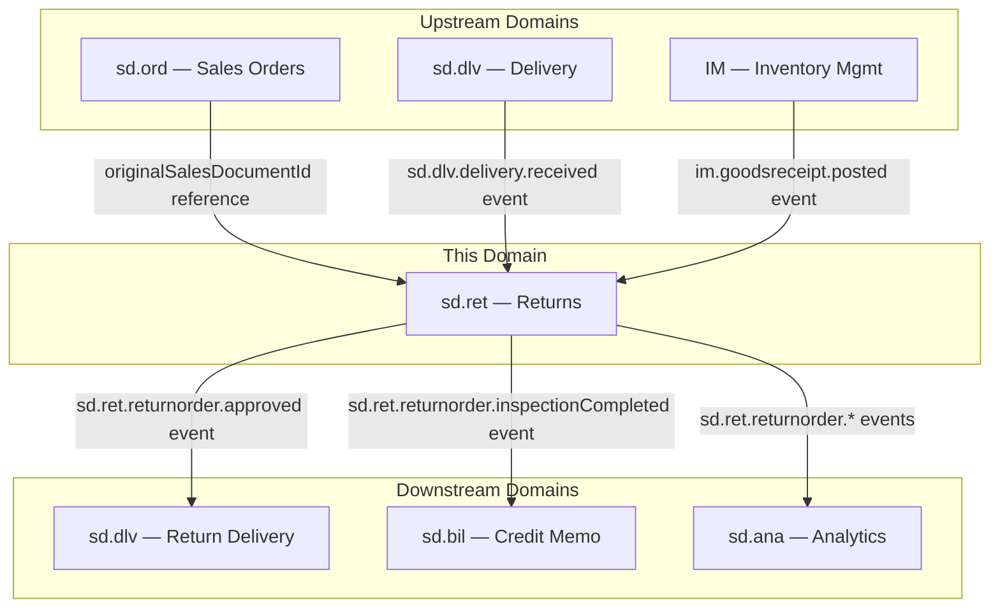
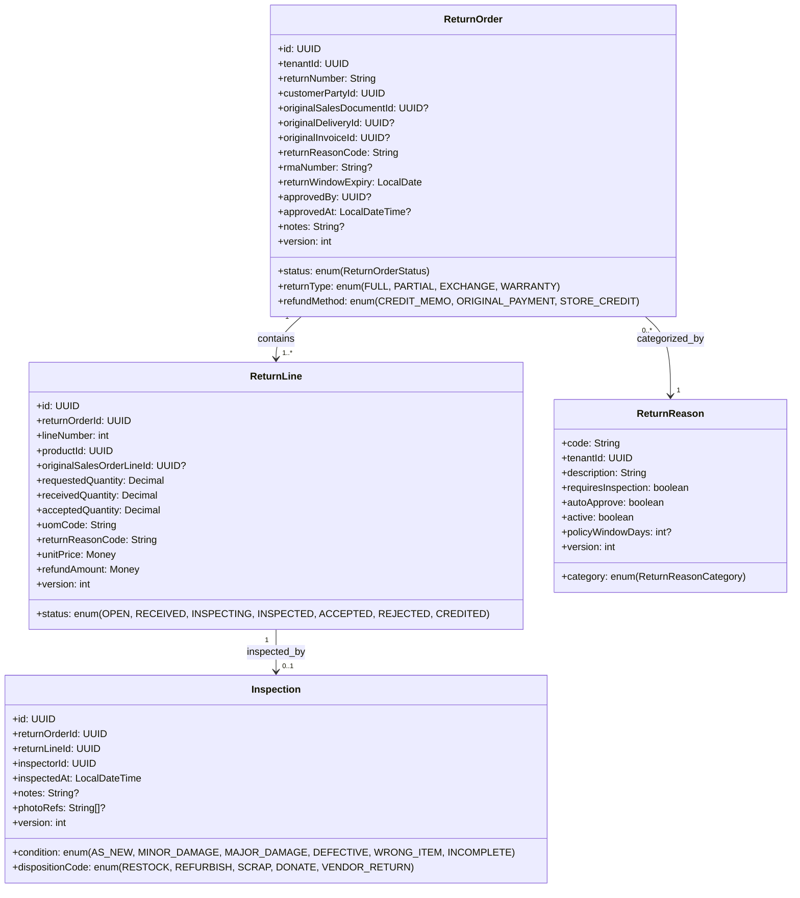
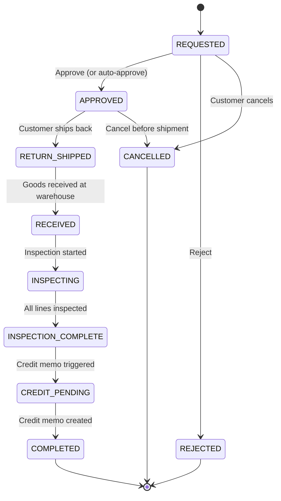
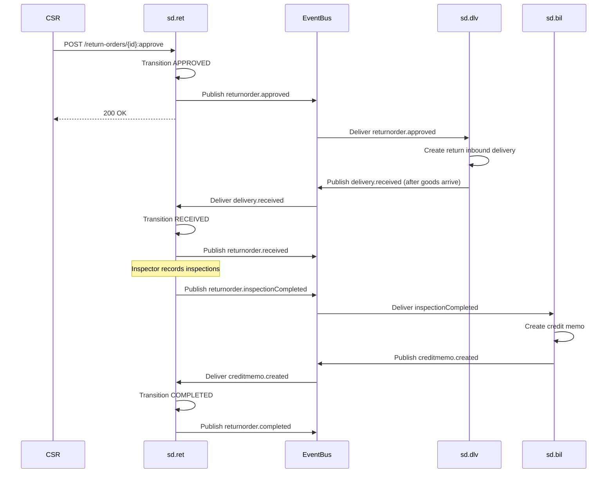

# SD.RET - Returns Domain / Service Specification

> **Conceptual Stack Layer:** Domain / Service
> **Space:** Platform
> **Owner:** Domain Engineering Team
> **Schema alignment:** `service-layer.schema.json`
> **Companion files:** `openapi.yaml`, `*.schema.json` (event contracts)
> **Referenced by:** Platform-Feature Spec SS5 (backend dependencies), BFF Contract
> **Belongs to:** SD Suite Spec (`_sd_suite.md`)

> **Meta Information**
> - **Version:** 2026-04-04
> - **Template:** `domain-service-spec.md` v1.0.0
> - **Template Compliance:** ~95% — §11 feature dependencies partially populated (OPEN QUESTIONs), §13 migration framework only
> - **Author(s):** OpenLeap Architecture Team
> - **Status:** DRAFT
> - **Suite:** `sd`
> - **Domain:** `ret`
> - **Bounded Context Ref:** `bc:returns`
> - **Service ID:** `sd-ret-svc`
> - **basePackage:** `io.openleap.sd.ret`
> - **API Base Path:** `/api/sd/ret/v1`
> - **OpenLeap Starter Version:** TBD
> - **Port:** TBD
> - **Repository:** TBD
> - **Tags:** `returns`, `rma`, `reverse-logistics`, `inspection`, `disposition`
> - **Team:**
>   - Name: `team-sd`
>   - Email: `sd-team@openleap.io`
>   - Slack: `#sd-team`

---

## Specification Guidelines Compliance

> ### Non-Negotiables
> - Never invent facts. If required info is missing, add an **OPEN QUESTION** entry.
> - Preserve intent and decisions. Only change meaning when explicitly requested.
> - Do not remove normative constraints unless they are explicitly replaced.
> - Keep the spec **self-contained**: no "see chat", no implicit context.
>
> ### Source of Truth Priority
> When sources conflict:
> 1. Spec (explicit) wins
> 2. Starter specs (implementation constraints) next
> 3. Guidelines (best practices) last
>
> Record conflicts in the **Decisions & Conflicts** section (see Section 14).
>
> ### Style Guide
> - Prefer short sentences and lists.
> - Use MUST/SHOULD/MAY for normative statements.
> - Keep terminology consistent (Aggregate, Domain Service, Application Service, Command, Event).
> - Avoid ambiguous words ("often", "maybe") unless explicitly noting uncertainty.
> - Keep examples minimal and clearly marked as examples.
> - Do not add implementation code unless the chapter explicitly requires it.

---

## 0. Document Purpose & Scope

### 0.1 Purpose
This specification defines the Returns domain (`sd.ret`), which manages the reverse order-to-cash flow: return requests (RMA issuance), return delivery coordination, inspection, disposition, and credit/refund triggering. It is the authoritative source for all return-related business rules, API contracts, event schemas, and data model decisions within the SD suite.

### 0.2 Target Audience
- Product Owners & Business Stakeholders
- System Architects & Technical Leads
- Integration Engineers

### 0.3 Scope
**In Scope:**
- Return order creation (RMA) and lifecycle management
- Return reason configuration and management
- Return delivery coordination (inbound via sd.dlv)
- Inspection and disposition (restock, scrap, refurbish, donate, vendor return)
- Credit memo / refund triggering (via sd.bil)
- Return analytics support (return rates, reason analysis)

**Out of Scope:**
- Physical return delivery processing (sd.dlv)
- Credit memo creation and posting (sd.bil)
- Payment refund execution (fi.pay)
- Warranty / repair management (future domain)
- Cross-border customs and compliance (future domain)

### 0.4 Related Documents
- `_sd_suite.md` — SD Suite overview
- `sd_ord-spec.md` — Sales Orders (original document reference)
- `sd_dlv-spec.md` — Delivery (return delivery coordination)
- `sd_bil-spec.md` — Billing (credit memo creation)

---

## 1. Business Context

### 1.1 Domain Purpose
`sd.ret` orchestrates the reverse logistics flow. When a customer returns goods, `sd.ret` captures the request, validates it against the original order/delivery/invoice, issues a Return Merchandise Authorization (RMA), coordinates the physical return via `sd.dlv`, manages inspection and disposition of returned goods, and triggers credit processing via `sd.bil`. It is the single source of truth for all return commitments and their lifecycle.

### 1.2 Business Value
- Structured return processing reduces margin leakage through consistent inspection and disposition
- Return reason analysis drives product quality improvement and supplier accountability
- Automated credit memo triggering accelerates customer satisfaction and reduces DSO impact
- Disposition tracking (restock vs. scrap vs. refurbish) maximizes recovery value from returned goods
- Policy window enforcement protects the business from out-of-policy return abuse

### 1.3 Key Stakeholders

| Role | Responsibility | Primary Use Cases |
|------|----------------|-------------------|
| Customer Service Rep | Process return requests, approve/reject | UC-RET-001, UC-RET-004 |
| Warehouse Inspector | Inspect and disposition returned goods | UC-RET-003 |
| Customer | Initiate return, ship goods back | UC-RET-001, UC-RET-005 |
| Logistics Coordinator | Monitor return deliveries | Read-only + UC-RET-002 |
| Finance Controller | Monitor credit memos triggered | Read-only |
| Returns Manager | Configure return reasons and policies | UC-RET-007 |

### 1.4 Strategic Positioning
`sd.ret` closes the order-to-cash loop by handling the reverse flow. It depends on `sd.ord` and `sd.dlv` for reference data and coordinates with `sd.bil` for financial resolution. Within the SD suite's choreography-first architecture (ADR-SD-002), `sd.ret` acts as the orchestrator of the multi-step returns process: it publishes facts (ReturnApproved, InspectionCompleted) that downstream services react to independently. This keeps `sd.ret` decoupled from billing and delivery implementation details, enabling the returns process to evolve independently.

### 1.5 Service Context

| Property | Value |
|----------|-------|
| **Suite** | `sd` |
| **Domain** | `ret` |
| **Bounded Context** | `bc:returns` |
| **Service ID** | `sd-ret-svc` |
| **Base Package** | `io.openleap.sd.ret` |

**Responsibilities:**
- Owns the `ReturnOrder` aggregate and its full lifecycle (REQUESTED → COMPLETED / CANCELLED)
- Owns return reason configuration (`ReturnReason`) per tenant
- Owns inspection records (`Inspection`) for returned line items
- Publishes return lifecycle events consumed by sd.dlv and sd.bil
- Enforces return policy rules (window, quantity limits, inspection requirements)

**Authoritative Sources:**
| Source Type | Description | Access Pattern |
|-------------|-------------|----------------|
| REST API | Return orders, lines, inspections, return reasons | Synchronous |
| Database | `ret_return_orders`, `ret_return_lines`, `ret_inspections`, `ret_return_reasons` | Direct (owner) |
| Events | Return lifecycle events on `sd.ret.events` exchange | Asynchronous |



---

## 2. Service Identity

| Property | Value | Schema Field |
|----------|-------|-------------|
| **Service ID** | `sd-ret-svc` | `metadata.id` |
| **Display Name** | Returns | `metadata.name` |
| **Suite** | `sd` | `metadata.suite` |
| **Domain** | `ret` | `metadata.domain` |
| **Bounded Context** | `bc:returns` | `metadata.bounded_context_ref` |
| **Version** | `1.1.0` | `metadata.version` |
| **Status** | DRAFT | `metadata.status` |
| **API Base Path** | `/api/sd/ret/v1` | `metadata.api_base_path` |
| **Repository** | TBD | `metadata.repository` |
| **Tags** | `returns`, `rma`, `reverse-logistics`, `inspection`, `disposition` | `metadata.tags` |

**Team:**
| Property | Value |
|----------|-------|
| **Name** | `team-sd` |
| **Email** | `sd-team@openleap.io` |
| **Slack Channel** | `#sd-team` |

---

## 3. Domain Model

### 3.1 Conceptual Overview
The domain centers on the **ReturnOrder** aggregate, which tracks the full lifecycle of a customer return from initial request through warehouse inspection to credit issuance. Each `ReturnOrder` contains one or more `ReturnLine` items. Each line may have an associated `Inspection` record capturing condition and disposition. `ReturnReason` is a tenant-scoped configuration aggregate governing which reasons are valid and their processing rules (auto-approve, inspection required).

### 3.2 Core Concepts



### 3.3 Aggregate Definitions

#### 3.3.1 ReturnOrder

| Property | Value |
|----------|-------|
| **Aggregate ID** | `agg:return-order` |
| **Name** | `ReturnOrder` |

**Business Purpose:**
The central document authorizing a customer to return previously delivered goods. Equivalent to SAP SD Return Order (order type RE). It tracks the full return lifecycle from request to credit issuance, enforces return policy rules, and coordinates downstream processes.

##### Aggregate Root

**Key Attributes:**
| Attribute | Type | Format | Description | Constraints | Required | Read-Only |
|-----------|------|--------|-------------|-------------|----------|-----------|
| id | string | uuid | Unique system identifier | Immutable after creation | Yes | Yes |
| tenantId | string | uuid | Tenant ownership for RLS | Immutable after creation | Yes | Yes |
| returnNumber | string | — | Human-readable return document number (e.g., `RMA-2026-00042`) | UK per tenant; max 20 chars; auto-generated | Yes | Yes |
| status | string | — | Current lifecycle state | enum_ref: `ReturnOrderStatus` | Yes | No |
| customerPartyId | string | uuid | Reference to the customer (business partner) initiating the return | Must exist in bp-svc | Yes | No |
| originalSalesDocumentId | string | uuid | Reference to the original sales order in sd.ord | At least one of salesDocumentId, deliveryId, or invoiceId MUST be set | No | No |
| originalDeliveryId | string | uuid | Reference to the original outbound delivery in sd.dlv | — | No | No |
| originalInvoiceId | string | uuid | Reference to the original invoice in sd.bil | — | No | No |
| returnReasonCode | string | — | Header-level return reason code (references ReturnReason) | Must exist and be active | Yes | No |
| returnType | string | — | Whether this is a full, partial, exchange, or warranty return | enum_ref: `ReturnType` | Yes | No |
| refundMethod | string | — | How the refund will be issued to the customer | enum_ref: `RefundMethod` | Yes | No |
| rmaNumber | string | — | Return Merchandise Authorization number issued to customer | Auto-generated on approval; max 30 chars | No | Yes |
| returnWindowExpiry | string | date | Deadline by which physical goods must be returned to warehouse | Computed: original document date + policyWindowDays | Yes | Yes |
| approvedBy | string | uuid | ID of user who approved the return | Set on approval | No | Yes |
| approvedAt | string | date-time | Timestamp of approval | Set on approval | No | Yes |
| notes | string | — | Free-text notes (internal) | max_length: 2000 | No | No |
| version | integer | int32 | Optimistic locking version | Incremented on each update | Yes | Yes |
| createdAt | string | date-time | Creation timestamp | — | Yes | Yes |
| updatedAt | string | date-time | Last update timestamp | — | Yes | Yes |

**Lifecycle States:**

| Property | Value |
|----------|-------|
| **Initial State** | `REQUESTED` |
| **Terminal States** | `COMPLETED`, `REJECTED`, `CANCELLED` |



**State Descriptions:**
| State | Description | Business Meaning |
|-------|-------------|------------------|
| REQUESTED | Customer submitted return request | Awaiting CSR approval |
| APPROVED | Return authorized; RMA number issued | Customer may ship goods back |
| REJECTED | Return request denied | Does not meet return policy |
| RETURN_SHIPPED | Customer shipped goods back | In transit to warehouse |
| RECEIVED | Goods received at warehouse | Awaiting inspection |
| INSPECTING | Items being inspected line by line | Quality check in progress |
| INSPECTION_COMPLETE | All lines inspected and dispositioned | Ready for credit processing |
| CREDIT_PENDING | Credit memo triggered in sd.bil | Awaiting billing confirmation |
| COMPLETED | Credit memo created and confirmed | Full return cycle complete |
| CANCELLED | Return cancelled before receipt | No further processing |

**Allowed Transitions:**
| From State | To State | Trigger | Guard / Business Preconditions |
|------------|----------|---------|-------------------------------|
| REQUESTED | APPROVED | `ReturnOrder.approve` (CSR) or auto-approve | Policy window not expired (BR-RET-001); at least one line present |
| REQUESTED | REJECTED | `ReturnOrder.reject` (CSR) | Return request exists |
| REQUESTED | CANCELLED | `ReturnOrder.cancel` (Customer or CSR) | Not yet approved |
| APPROVED | RETURN_SHIPPED | `ReturnOrder.markShipped` | RMA number issued |
| APPROVED | CANCELLED | `ReturnOrder.cancel` | Goods not yet in transit |
| RETURN_SHIPPED | RECEIVED | Event: `sd.dlv.delivery.received` | Linked return delivery received |
| RECEIVED | INSPECTING | First inspection recorded | At least one line in RECEIVED status |
| INSPECTING | INSPECTION_COMPLETE | All lines inspected | All lines in ACCEPTED or REJECTED status |
| INSPECTION_COMPLETE | CREDIT_PENDING | `ReturnOrder.triggerCredit` | At least one accepted line |
| CREDIT_PENDING | COMPLETED | Event: `sd.bil.creditmemo.created` | Credit memo linked |

**Invariants:**
| Rule ID | Description |
|---------|-------------|
| BR-RET-001 | Return must be within configurable policy window |
| BR-RET-002 | At least one of originalSalesDocumentId, originalDeliveryId, originalInvoiceId MUST be set |
| BR-RET-003 | Requested quantity per line MUST NOT exceed deliverable quantity minus prior returns |
| BR-RET-004 | Credit MUST NOT be triggered before inspection is complete (unless auto-approve) |
| BR-RET-005 | refundAmount = acceptedQuantity × unitPrice per line |
| BR-RET-006 | Every inspected line MUST have a dispositionCode |

**Domain Events Emitted:**
- `sd.ret.returnorder.requested`
- `sd.ret.returnorder.approved`
- `sd.ret.returnorder.rejected`
- `sd.ret.returnorder.received`
- `sd.ret.returnorder.inspectionCompleted`
- `sd.ret.returnorder.completed`
- `sd.ret.returnorder.cancelled`

##### Child Entities

###### Entity: ReturnLine

| Property | Value |
|----------|-------|
| **Entity ID** | `ent:return-line` |
| **Name** | `ReturnLine` |
| **Relationship to Root** | one_to_many |

**Business Purpose:**
Represents one product line within a return order. Tracks requested, received, and accepted quantities separately to handle partial receipts and inspection rejections. Maps to SAP SD return item (VBAP with item category REN).

**Attributes:**
| Attribute | Type | Format | Description | Constraints | Required |
|-----------|------|--------|-------------|-------------|----------|
| id | string | uuid | Unique identifier | — | Yes |
| returnOrderId | string | uuid | Parent return order | FK to ReturnOrder | Yes |
| lineNumber | integer | int32 | Sequential line number (10, 20, 30...) | positive; unique per order | Yes |
| productId | string | uuid | Product being returned | Must exist in product catalog | Yes |
| originalSalesOrderLineId | string | uuid | Reference to original sales order line | — | No |
| requestedQuantity | number | decimal | Quantity customer wants to return | minimum: 0.001; precision: 3 | Yes |
| receivedQuantity | number | decimal | Quantity actually received at warehouse | minimum: 0; set on receipt; default: 0 | Yes |
| acceptedQuantity | number | decimal | Quantity accepted after inspection | minimum: 0; ≤ receivedQuantity | Yes |
| uomCode | string | — | Unit of measure (UCUM code) | Must be valid UCUM code | Yes |
| returnReasonCode | string | — | Line-level return reason (may override header) | Must exist and be active | Yes |
| unitPrice | object | — | Unit price from original order (Money) | type_ref: `Money` | Yes |
| refundAmount | object | — | Computed refund amount (acceptedQty × unitPrice) | type_ref: `Money`; computed | Yes |
| status | string | — | Line processing status | enum_ref: `ReturnLineStatus` | Yes |
| version | integer | int32 | Optimistic locking | — | Yes |
| createdAt | string | date-time | Creation timestamp | — | Yes |
| updatedAt | string | date-time | Last update timestamp | — | Yes |

**Collection Constraints:**
- Minimum items: 1
- Maximum items: 999

**Invariants:**
| Rule ID | Description |
|---------|-------------|
| BR-RET-003 | requestedQuantity ≤ (originalDeliveredQuantity − previouslyReturnedQuantity) |
| BR-RET-005 | refundAmount = acceptedQuantity × unitPrice (computed on inspection) |

###### Entity: Inspection

| Property | Value |
|----------|-------|
| **Entity ID** | `ent:inspection` |
| **Name** | `Inspection` |
| **Relationship to Root** | one_to_many (one per ReturnLine) |

**Business Purpose:**
Records the warehouse inspector's assessment of a returned item's condition and the decision on how to process it (disposition). Equivalent to SAP QM inspection lot for returned goods.

**Attributes:**
| Attribute | Type | Format | Description | Constraints | Required |
|-----------|------|--------|-------------|-------------|----------|
| id | string | uuid | Unique identifier | — | Yes |
| returnOrderId | string | uuid | Parent return order | FK to ReturnOrder | Yes |
| returnLineId | string | uuid | Line being inspected | FK to ReturnLine; unique per return order | Yes |
| inspectorId | string | uuid | User performing the inspection | Must be a user with RET_INSPECTOR role | Yes |
| inspectedAt | string | date-time | When inspection was performed | — | Yes |
| condition | string | — | Physical condition of returned item | enum_ref: `InspectionCondition` | Yes |
| dispositionCode | string | — | How the item should be processed | enum_ref: `DispositionCode` | Yes |
| notes | string | — | Inspector comments | max_length: 2000 | No |
| photoRefs | array | — | DMS references to inspection photos | items: string; max_items: 10 | No |
| version | integer | int32 | Optimistic locking | — | Yes |
| createdAt | string | date-time | Creation timestamp | — | Yes |
| updatedAt | string | date-time | Last update timestamp | — | Yes |

**Collection Constraints:**
- Maximum items: one per ReturnLine

**Invariants:**
| Rule ID | Description |
|---------|-------------|
| BR-RET-006 | dispositionCode MUST be set (cannot be null on save) |

#### 3.3.2 ReturnReason

| Property | Value |
|----------|-------|
| **Aggregate ID** | `agg:return-reason` |
| **Name** | `ReturnReason` |

**Business Purpose:**
Tenant-configurable catalog of valid return reasons. Controls processing behavior (auto-approve, inspection required) and the effective policy window for each reason. Equivalent to SAP customizing table for return reason codes.

##### Aggregate Root

**Key Attributes:**
| Attribute | Type | Format | Description | Constraints | Required | Read-Only |
|-----------|------|--------|-------------|-------------|----------|-----------|
| code | string | — | Business key for the reason (e.g., `DAMAGED_SHIPPING`) | PK with tenantId; max 30 chars; uppercase | Yes | Yes |
| tenantId | string | uuid | Tenant ownership | Part of composite PK | Yes | Yes |
| description | string | — | Human-readable description | max_length: 255 | Yes | No |
| category | string | — | Reason category grouping | enum_ref: `ReturnReasonCategory` | Yes | No |
| requiresInspection | boolean | — | Whether goods MUST be inspected before credit | default: true | Yes | No |
| autoApprove | boolean | — | Whether return requests with this reason auto-approve | default: false | Yes | No |
| active | boolean | — | Whether this reason is available for selection | default: true | Yes | No |
| policyWindowDays | integer | int32 | Override policy window for this reason (null = tenant default) | minimum: 1; maximum: 3650 | No | No |
| version | integer | int32 | Optimistic locking | — | Yes | Yes |
| createdAt | string | date-time | Creation timestamp | — | Yes | Yes |
| updatedAt | string | date-time | Last update timestamp | — | Yes | Yes |

**Domain Events Emitted:**
- `sd.ret.returnreason.created`
- `sd.ret.returnreason.updated`
- `sd.ret.returnreason.deactivated`

##### Value Objects

###### Value Object: Money

| Property | Value |
|----------|-------|
| **VO ID** | `vo:money` |
| **Name** | `Money` |

**Description:** Represents a monetary amount with its currency. Used for unit prices and refund amounts on ReturnLine.

**Attributes:**
| Attribute | Type | Format | Description | Constraints |
|-----------|------|--------|-------------|-------------|
| amount | number | decimal | Monetary value | minimum: 0; precision: 2 (2 decimal places) |
| currencyCode | string | — | ISO 4217 currency code | length: 3; uppercase; must exist in ref-data-svc |

**Validation Rules:**
- `amount` MUST be ≥ 0
- `currencyCode` MUST be a valid ISO 4217 active currency code
- Both fields are required; neither may be null

### 3.4 Enumerations

#### ReturnOrderStatus

**Description:** Lifecycle states of a ReturnOrder aggregate.

| Value | Description | Deprecated |
|-------|-------------|------------|
| `REQUESTED` | Customer submitted return request; awaiting CSR review | No |
| `APPROVED` | Return authorized; RMA number issued to customer | No |
| `REJECTED` | Return request denied (out of policy or invalid) | No |
| `RETURN_SHIPPED` | Customer confirmed goods have been shipped back | No |
| `RECEIVED` | Goods physically received at warehouse | No |
| `INSPECTING` | Warehouse inspector has started inspecting return lines | No |
| `INSPECTION_COMPLETE` | All lines inspected and dispositioned | No |
| `CREDIT_PENDING` | Credit memo creation triggered in sd.bil; awaiting confirmation | No |
| `COMPLETED` | Credit memo confirmed; return fully closed | No |
| `CANCELLED` | Return cancelled before goods receipt | No |

#### ReturnType

**Description:** Classifies the nature of the return.

| Value | Description | Deprecated |
|-------|-------------|------------|
| `FULL` | All items from the original delivery are being returned | No |
| `PARTIAL` | A subset of items or quantities from the original delivery | No |
| `EXCHANGE` | Items returned in exchange for replacement goods | No |
| `WARRANTY` | Items returned under warranty claim | No |

#### RefundMethod

**Description:** How the financial compensation will be issued to the customer.

| Value | Description | Deprecated |
|-------|-------------|------------|
| `CREDIT_MEMO` | Credit memo applied to the customer's account (reduces outstanding balance) | No |
| `ORIGINAL_PAYMENT` | Refund to the original payment method (card, bank transfer) | No |
| `STORE_CREDIT` | Credit applied to the customer's store credit balance | No |

#### ReturnLineStatus

**Description:** Processing status of an individual return line.

| Value | Description | Deprecated |
|-------|-------------|------------|
| `OPEN` | Return line created; awaiting physical goods receipt | No |
| `RECEIVED` | Goods for this line received at warehouse | No |
| `INSPECTING` | Inspection in progress for this line | No |
| `INSPECTED` | Inspection complete; awaiting final disposition decision | No |
| `ACCEPTED` | Line accepted; refund amount confirmed | No |
| `REJECTED` | Line rejected during inspection (no refund) | No |
| `CREDITED` | Credit memo created for this line | No |

#### InspectionCondition

**Description:** Physical condition of returned goods as assessed by the warehouse inspector.

| Value | Description | Deprecated |
|-------|-------------|------------|
| `AS_NEW` | Item is in original, unopened, or like-new condition | No |
| `MINOR_DAMAGE` | Item has cosmetic damage that does not affect function | No |
| `MAJOR_DAMAGE` | Item has significant damage affecting usability | No |
| `DEFECTIVE` | Item is functionally defective (does not work) | No |
| `WRONG_ITEM` | Item returned is not what was ordered (wrong product/variant) | No |
| `INCOMPLETE` | Item returned is missing components or accessories | No |

#### DispositionCode

**Description:** Decision on how returned goods should be processed after inspection.

| Value | Description | Deprecated |
|-------|-------------|------------|
| `RESTOCK` | Item is in acceptable condition; return to sellable inventory | No |
| `REFURBISH` | Item requires cleaning or repair before resale | No |
| `SCRAP` | Item is damaged beyond repair; dispose as waste | No |
| `DONATE` | Item to be donated to charitable organization | No |
| `VENDOR_RETURN` | Item to be returned to the supplier under vendor warranty | No |

#### ReturnReasonCategory

**Description:** Groups return reasons for analytics and reporting.

| Value | Description | Deprecated |
|-------|-------------|------------|
| `QUALITY` | Product quality issue (defective, not as described) | No |
| `WRONG_ITEM` | Incorrect product, variant, or quantity shipped | No |
| `DAMAGED_SHIPPING` | Item damaged during transport | No |
| `CHANGED_MIND` | Customer no longer wants the product | No |
| `NOT_AS_DESCRIBED` | Product does not match catalog description or images | No |
| `LATE_DELIVERY` | Delivery arrived too late to be useful | No |
| `OTHER` | Reason does not fit existing categories | No |

### 3.5 Shared Types

#### Money

| Property | Value |
|----------|-------|
| **Type ID** | `type:money` |
| **Name** | `Money` |

**Description:** Immutable value object representing a monetary amount in a specific currency. Follows ISO 4217 for currency codes.

**Attributes:**
| Attribute | Type | Format | Description | Constraints |
|-----------|------|--------|-------------|-------------|
| amount | number | decimal | Monetary value, non-negative | minimum: 0; precision: 2 |
| currencyCode | string | — | ISO 4217 three-letter currency code | length: 3; pattern: `^[A-Z]{3}$` |

**Validation Rules:**
- `amount` MUST be ≥ 0
- `currencyCode` MUST be a valid active ISO 4217 code
- Currency codes are validated against ref-data-svc at write time
- `Money(0, "EUR")` is valid (zero refund after inspection rejection)

**Used By:**
- `ent:return-line` — `unitPrice`, `refundAmount`

---

## 4. Business Rules & Constraints

### 4.1 Business Rules Catalog

| ID | Rule Name | Description | Scope | Enforcement | Error Code |
|----|-----------|-------------|-------|-------------|------------|
| BR-RET-001 | Policy Window | Return MUST be requested within configurable window (default 30 days from original document date) | ReturnOrder | Create, Approve | `RET_POLICY_EXPIRED` |
| BR-RET-002 | Valid Reference | ReturnOrder MUST reference at least one of: originalSalesDocumentId, originalDeliveryId, or originalInvoiceId | ReturnOrder | Create | `RET_MISSING_REF` |
| BR-RET-003 | Quantity Limit | requestedQuantity per line MUST NOT exceed (originalDeliveredQuantity − alreadyReturnedQuantity) | ReturnLine | Create, Update | `RET_OVER_RETURN` |
| BR-RET-004 | Inspection Before Credit | Credit MUST NOT be triggered before all lines are inspected, unless returnReason.autoApprove = true | ReturnOrder | TriggerCredit | `RET_INSPECTION_INCOMPLETE` |
| BR-RET-005 | Refund Calculation | refundAmount = acceptedQuantity × unitPrice (computed, not user-supplied) | ReturnLine | Inspection record | — |
| BR-RET-006 | Disposition Required | Every Inspection record MUST have dispositionCode set | Inspection | Save inspection | `RET_DISPOSITION_MISSING` |

### 4.2 Detailed Rule Definitions

#### BR-RET-001: Policy Window

**Business Context:**
Companies define a return acceptance window (typically 14–90 days) to prevent abuse. Accepting returns indefinitely creates unlimited liability for issued products.

**Rule Statement:**
A return request MUST be created within the configured policy window measured from the original document date. The policy window is determined by `returnReason.policyWindowDays` if set, otherwise the tenant's default window (tenant configuration, default 30 days).

**Applies To:**
- Aggregate: `ReturnOrder`
- Operations: Create (initial request), Approve (re-validation on approval)

**Enforcement:**
Application Service validates `originalDocument.date + policyWindowDays >= today()` at ReturnOrder.create and again at ReturnOrder.approve. The `returnWindowExpiry` field is computed and stored on the ReturnOrder.

**Validation Logic:**
`returnWindowExpiry = originalDocumentDate + effectivePolicyWindowDays`. If `today() > returnWindowExpiry`, reject with `RET_POLICY_EXPIRED`.

**Error Handling:**
- **Error Code:** `RET_POLICY_EXPIRED`
- **Error Message:** "Return request is outside the policy window. The return deadline was {returnWindowExpiry}."
- **User action:** Contact customer service manager for policy exception override.

**Examples:**
- **Valid:** Order date 2026-01-01, policy window 30 days, return requested 2026-01-25 → accepted.
- **Invalid:** Order date 2026-01-01, policy window 30 days, return requested 2026-02-15 → `RET_POLICY_EXPIRED`.

---

#### BR-RET-002: Valid Reference

**Business Context:**
A return must be traceable to an original business document to verify that the customer actually received the goods and to compute the correct refund amount from the original pricing.

**Rule Statement:**
A `ReturnOrder` MUST reference at least one of: `originalSalesDocumentId`, `originalDeliveryId`, or `originalInvoiceId`. The referenced document MUST exist in the respective service.

**Applies To:**
- Aggregate: `ReturnOrder`
- Operations: Create

**Enforcement:**
Application Service validates the reference existence via synchronous REST call to sd.ord, sd.dlv, or sd.bil before persisting.

**Validation Logic:**
At least one reference ID MUST be non-null. The referenced document MUST be retrievable. If multiple references are provided, all are validated.

**Error Handling:**
- **Error Code:** `RET_MISSING_REF`
- **Error Message:** "ReturnOrder must reference an original sales document, delivery, or invoice."
- **User action:** Provide a valid original document reference before submitting the return.

**Examples:**
- **Valid:** `originalSalesDocumentId` is a valid UUID referencing an existing sales order.
- **Invalid:** All three reference fields are null.

---

#### BR-RET-003: Quantity Limit

**Business Context:**
A customer cannot return more units than were originally delivered, nor return units that have already been returned in a prior return order.

**Rule Statement:**
For each `ReturnLine`, `requestedQuantity` MUST be ≤ `(originalDeliveredQuantity − sumOfPreviouslyReturnedQuantity)`.

**Applies To:**
- Aggregate: `ReturnLine`
- Operations: Create, Update

**Enforcement:**
Domain Service queries previously completed or active return lines for the same product and original document reference. Returns the net returnable quantity.

**Validation Logic:**
`returnableQty = originalDeliveredQty − SUM(requestedQty on active/completed returns for same productId + originalDoc)`. If `requestedQuantity > returnableQty`, reject.

**Error Handling:**
- **Error Code:** `RET_OVER_RETURN`
- **Error Message:** "Requested return quantity of {requestedQuantity} {uomCode} exceeds the returnable quantity of {returnableQty} {uomCode}."
- **User action:** Reduce the requested quantity.

**Examples:**
- **Valid:** 10 units delivered, 3 previously returned, requesting return of 5 → returnable = 7 → accepted.
- **Invalid:** 10 units delivered, 3 previously returned, requesting return of 8 → `RET_OVER_RETURN`.

---

#### BR-RET-004: Inspection Before Credit

**Business Context:**
Financial credits based on uninspected returns expose the business to fraud and incorrect refund amounts. Inspection ensures only accepted quantity at assessed condition is credited.

**Rule Statement:**
`ReturnOrder.triggerCredit` MUST NOT succeed unless all `ReturnLine` items have status `ACCEPTED` or `REJECTED`, OR the header's `ReturnReason.autoApprove = true`.

**Applies To:**
- Aggregate: `ReturnOrder`
- Operations: TriggerCredit

**Enforcement:**
Application Service validates all lines' status before transitioning to CREDIT_PENDING.

**Validation Logic:**
If `returnReason.autoApprove = false`: ALL lines MUST have status in `{ACCEPTED, REJECTED}`. If any line is in `{OPEN, RECEIVED, INSPECTING, INSPECTED}`, reject.

**Error Handling:**
- **Error Code:** `RET_INSPECTION_INCOMPLETE`
- **Error Message:** "Cannot trigger credit: {N} return line(s) have not been fully inspected."
- **User action:** Complete inspection for all outstanding lines.

**Examples:**
- **Valid:** autoApprove = true → credit can be triggered immediately after approval.
- **Invalid:** 3 lines present, only 2 inspected, autoApprove = false → `RET_INSPECTION_INCOMPLETE`.

---

#### BR-RET-005: Refund Calculation

**Business Context:**
The refund amount must be objectively computed from the accepted quantity and the original unit price, not user-supplied, to prevent overpayments.

**Rule Statement:**
`ReturnLine.refundAmount = ReturnLine.acceptedQuantity × ReturnLine.unitPrice`. This is computed by the system when the Inspection is recorded.

**Applies To:**
- Aggregate: `ReturnLine`
- Operations: Inspection record (when acceptedQuantity is set)

**Enforcement:**
System computes and stores `refundAmount` when acceptedQuantity is finalized. The field is read-only from API perspective.

**Validation Logic:**
`refundAmount.amount = acceptedQuantity × unitPrice.amount`. `refundAmount.currencyCode = unitPrice.currencyCode`.

**Error Handling:**
No user error; this is a system computation rule.

**Examples:**
- **Valid:** acceptedQty = 2, unitPrice = Money(49.99, "EUR") → refundAmount = Money(99.98, "EUR").
- **Valid:** acceptedQty = 0 (rejected) → refundAmount = Money(0, "EUR").

---

#### BR-RET-006: Disposition Required

**Business Context:**
Without a disposition decision, returned goods enter inventory limbo — they cannot be restocked, scrapped, or otherwise processed, creating operational and accounting problems.

**Rule Statement:**
Every `Inspection` record MUST have `dispositionCode` set to a non-null value before it can be saved.

**Applies To:**
- Aggregate: `Inspection`
- Operations: Create, Update

**Enforcement:**
Domain Object validates `dispositionCode != null` before accepting the inspection record.

**Validation Logic:**
`inspection.dispositionCode != null AND inspection.dispositionCode IN {RESTOCK, REFURBISH, SCRAP, DONATE, VENDOR_RETURN}`.

**Error Handling:**
- **Error Code:** `RET_DISPOSITION_MISSING`
- **Error Message:** "Disposition code is required for inspection record."
- **User action:** Select a disposition for the returned item before saving.

**Examples:**
- **Valid:** Inspector selects `SCRAP` for a defective item.
- **Invalid:** Inspector submits inspection with `dispositionCode = null`.

### 4.3 Data Validation Rules

**Field-Level Validations:**
| Field | Validation Rule | Error Message |
|-------|----------------|---------------|
| returnOrder.customerPartyId | Required; valid UUID | "Customer party ID is required" |
| returnOrder.returnReasonCode | Required; must exist and be active | "Return reason '{code}' is not valid or inactive" |
| returnOrder.returnType | Required; valid enum value | "Invalid return type: {value}" |
| returnOrder.refundMethod | Required; valid enum value | "Invalid refund method: {value}" |
| returnOrder.notes | Optional; max 2000 chars | "Notes cannot exceed 2000 characters" |
| returnLine.productId | Required; valid UUID | "Product ID is required for return line" |
| returnLine.requestedQuantity | Required; > 0; precision ≤ 3 decimal places | "Requested quantity must be greater than zero" |
| returnLine.uomCode | Required; valid UCUM code | "Unit of measure '{code}' is not valid" |
| returnLine.returnReasonCode | Required; must exist and be active | "Line return reason '{code}' is not valid" |
| returnLine.unitPrice.amount | Required; ≥ 0 | "Unit price amount must be non-negative" |
| returnLine.unitPrice.currencyCode | Required; valid ISO 4217; length = 3 | "Currency code must be a 3-letter ISO 4217 code" |
| inspection.inspectorId | Required; valid UUID | "Inspector ID is required" |
| inspection.condition | Required; valid enum | "Invalid inspection condition: {value}" |
| inspection.dispositionCode | Required; valid enum | "Disposition code is required" |
| inspection.notes | Optional; max 2000 chars | "Notes cannot exceed 2000 characters" |
| inspection.photoRefs | Optional; max 10 items; each is a valid DMS reference | "Maximum 10 photo references allowed" |
| returnReason.code | Required; max 30 chars; uppercase; unique per tenant | "Return reason code must be uppercase and max 30 characters" |
| returnReason.description | Required; max 255 chars | "Description is required and cannot exceed 255 characters" |
| returnReason.policyWindowDays | Optional; 1–3650 | "Policy window must be between 1 and 3650 days" |

**Cross-Field Validations:**
- At least one of `originalSalesDocumentId`, `originalDeliveryId`, `originalInvoiceId` MUST be set (BR-RET-002)
- `acceptedQuantity` MUST be ≤ `receivedQuantity`
- `receivedQuantity` MUST be ≤ `requestedQuantity`
- If `returnReason.autoApprove = true`, `returnReason.requiresInspection` SHOULD be false (warning if inconsistent)
- `returnWindowExpiry` MUST be ≥ creation date of the ReturnOrder

### 4.4 Reference Data Dependencies

| Catalog | Source Service | Fields Referencing | Validation |
|---------|----------------|-------------------|------------|
| Business Partners | bp-svc | `returnOrder.customerPartyId` | Must exist, type CUSTOMER, active |
| Products | com-svc (catalog) | `returnLine.productId` | Must exist and be active |
| Units of Measure | si-unit-svc | `returnLine.uomCode` | Must be valid UCUM code |
| Currencies | ref-data-svc | `money.currencyCode` | Must be active ISO 4217 code |
| Original Sales Orders | sd.ord | `returnOrder.originalSalesDocumentId` | Must exist and be in CONFIRMED/COMPLETED state |
| Original Deliveries | sd.dlv | `returnOrder.originalDeliveryId` | Must exist and be in GOODS_ISSUED/DELIVERED state |
| Original Invoices | sd.bil | `returnOrder.originalInvoiceId` | Must exist |

---

## 5. Use Cases

### 5.1 Business Logic Placement

| Logic Type | Placement | Examples |
|------------|-----------|----------|
| Aggregate invariants | Domain Object | Status transition validation, quantity limits, refund computation |
| Cross-aggregate logic | Domain Service | Net returnable quantity check across ReturnOrders for same source document |
| Orchestration & transactions | Application Service | Use case coordination, event publishing via outbox, reference validation calls |

### 5.2 Use Cases (Canonical Format)

#### UC-RET-001: Customer Requests Return

| Field | Value |
|-------|-------|
| **id** | `RequestReturn` |
| **type** | WRITE |
| **trigger** | REST |
| **aggregate** | `ReturnOrder` |
| **domainOperation** | `ReturnOrder.create` |
| **inputs** | `customerPartyId: UUID`, `originalSalesDocumentId: UUID?`, `originalDeliveryId: UUID?`, `originalInvoiceId: UUID?`, `returnReasonCode: String`, `returnType: ReturnType`, `refundMethod: RefundMethod`, `lines: ReturnLineInput[]`, `notes: String?` |
| **outputs** | `ReturnOrder` (status: REQUESTED or APPROVED if auto-approve) |
| **events** | `ReturnRequested`, optionally `ReturnApproved` if auto-approve |
| **rest** | `POST /api/sd/ret/v1/return-orders` |
| **idempotency** | optional (client-supplied idempotency key) |
| **errors** | `RET_POLICY_EXPIRED`, `RET_MISSING_REF`, `RET_OVER_RETURN` |

**Actor:** Customer Service Representative or Customer (self-service portal)

**Preconditions:**
- Actor has role `RET_CSR` or `RET_CUSTOMER` (self-service)
- At least one original document reference is provided
- Original document exists in referenced service

**Main Flow:**
1. Actor submits return request with line items and return reason
2. System validates policy window (BR-RET-001)
3. System validates original document reference (BR-RET-002)
4. System validates requested quantities (BR-RET-003)
5. System computes `returnWindowExpiry`
6. System creates `ReturnOrder` in `REQUESTED` status
7. System publishes `ReturnRequested` via outbox
8. If `returnReason.autoApprove = true`: system immediately transitions to `APPROVED`, generates `rmaNumber`, publishes `ReturnApproved`

**Postconditions:**
- `ReturnOrder` exists in `REQUESTED` (or `APPROVED` if auto-approve) status
- `ReturnRequested` event published

**Business Rules Applied:**
- BR-RET-001: Policy Window
- BR-RET-002: Valid Reference
- BR-RET-003: Quantity Limit

**Alternative Flows:**
- **Alt-1:** `returnReason.autoApprove = true` → return immediately advances to APPROVED and RMA issued

**Exception Flows:**
- **Exc-1:** Policy window expired → `RET_POLICY_EXPIRED`
- **Exc-2:** No valid document reference → `RET_MISSING_REF`
- **Exc-3:** Requested quantity exceeds limit → `RET_OVER_RETURN`

---

#### UC-RET-002: Approve Return (RMA Issuance)

| Field | Value |
|-------|-------|
| **id** | `ApproveReturn` |
| **type** | WRITE |
| **trigger** | REST |
| **aggregate** | `ReturnOrder` |
| **domainOperation** | `ReturnOrder.approve` |
| **inputs** | `returnOrderId: UUID` |
| **outputs** | `ReturnOrder` (status: APPROVED, rmaNumber set) |
| **events** | `ReturnApproved` |
| **rest** | `POST /api/sd/ret/v1/return-orders/{id}:approve` |
| **idempotency** | required |
| **errors** | `RET_POLICY_EXPIRED` |

**Actor:** Customer Service Representative

**Preconditions:**
- ReturnOrder is in `REQUESTED` status
- Actor has role `RET_CSR`

**Main Flow:**
1. CSR reviews return request and approves
2. System re-validates policy window (BR-RET-001)
3. System generates `rmaNumber`
4. System sets `approvedBy`, `approvedAt`
5. System transitions status to `APPROVED`
6. System publishes `ReturnApproved` event (triggers sd.dlv to create return delivery)

**Postconditions:**
- ReturnOrder in `APPROVED` status with `rmaNumber` set
- `ReturnApproved` event published; sd.dlv will create inbound return delivery

**Business Rules Applied:**
- BR-RET-001: Policy Window (re-validated at approval)

**Exception Flows:**
- **Exc-1:** Already approved (idempotent) → returns existing approved state
- **Exc-2:** Policy window has since expired → `RET_POLICY_EXPIRED`

---

#### UC-RET-003: Process Return Delivery (Receive Goods)

| Field | Value |
|-------|-------|
| **id** | `ProcessReturnDelivery` |
| **type** | WRITE |
| **trigger** | Message (event from sd.dlv) |
| **aggregate** | `ReturnOrder` |
| **domainOperation** | `ReturnOrder.markReceived` |
| **inputs** | `returnOrderId: UUID` (from event payload) |
| **outputs** | `ReturnOrder` (status: RECEIVED) |
| **events** | `ReturnReceived` |
| **idempotency** | required |

**Actor:** System (triggered by `sd.dlv.delivery.received` event)

**Preconditions:**
- ReturnOrder is in `RETURN_SHIPPED` or `APPROVED` status
- Event originates from linked return delivery

**Main Flow:**
1. System receives `sd.dlv.delivery.received` event
2. System resolves linked ReturnOrder via returnOrderId in event
3. System updates all OPEN ReturnLines to RECEIVED status
4. System transitions ReturnOrder to `RECEIVED` status
5. System publishes `ReturnReceived` event

**Postconditions:**
- ReturnOrder in `RECEIVED` status; all lines in `RECEIVED` status
- Warehouse inspector is notified to begin inspection

**Exception Flows:**
- **Exc-1:** Duplicate event → idempotent; already-RECEIVED order ignored with acknowledgment

---

#### UC-RET-004: Inspect and Disposition

| Field | Value |
|-------|-------|
| **id** | `InspectAndDisposition` |
| **type** | WRITE |
| **trigger** | REST |
| **aggregate** | `ReturnOrder` |
| **domainOperation** | `ReturnOrder.recordInspection` |
| **inputs** | `returnOrderId: UUID`, `returnLineId: UUID`, `condition: InspectionCondition`, `dispositionCode: DispositionCode`, `acceptedQuantity: Decimal`, `notes: String?`, `photoRefs: String[]?` |
| **outputs** | `Inspection`, updated `ReturnLine` |
| **events** | `InspectionRecorded`; `ReturnInspectionCompleted` when all lines done |
| **rest** | `POST /api/sd/ret/v1/return-orders/{id}/lines/{lineId}/inspection` |
| **idempotency** | required |
| **errors** | `RET_DISPOSITION_MISSING` |

**Actor:** Warehouse Inspector (role: `RET_INSPECTOR`)

**Preconditions:**
- ReturnOrder is in `RECEIVED` or `INSPECTING` status
- ReturnLine is in `RECEIVED` or `INSPECTING` status
- Actor has role `RET_INSPECTOR`

**Main Flow:**
1. Inspector submits inspection data for a specific line
2. System validates dispositionCode is set (BR-RET-006)
3. System computes `refundAmount = acceptedQuantity × unitPrice` (BR-RET-005)
4. System creates `Inspection` record
5. System updates ReturnLine status: ACCEPTED (if acceptedQty > 0) or REJECTED
6. System transitions ReturnOrder to `INSPECTING` if not already
7. If all lines inspected: transitions ReturnOrder to `INSPECTION_COMPLETE`, publishes `ReturnInspectionCompleted`

**Postconditions:**
- Inspection record created
- ReturnLine updated with acceptedQuantity and refundAmount
- If all lines done: ReturnOrder in `INSPECTION_COMPLETE`

**Business Rules Applied:**
- BR-RET-005: Refund Calculation
- BR-RET-006: Disposition Required

**Exception Flows:**
- **Exc-1:** dispositionCode missing → `RET_DISPOSITION_MISSING`
- **Exc-2:** acceptedQuantity > receivedQuantity → validation error

---

#### UC-RET-005: Trigger Credit

| Field | Value |
|-------|-------|
| **id** | `TriggerCredit` |
| **type** | WRITE |
| **trigger** | REST or Internal |
| **aggregate** | `ReturnOrder` |
| **domainOperation** | `ReturnOrder.triggerCredit` |
| **inputs** | `returnOrderId: UUID` |
| **outputs** | `ReturnOrder` (status: CREDIT_PENDING) |
| **events** | `ReturnInspectionCompleted` (consumed by sd.bil to create credit memo) |
| **rest** | `POST /api/sd/ret/v1/return-orders/{id}:trigger-credit` |
| **idempotency** | required |
| **errors** | `RET_INSPECTION_INCOMPLETE` |

**Actor:** Customer Service Representative or System (auto-triggered after INSPECTION_COMPLETE)

**Preconditions:**
- ReturnOrder is in `INSPECTION_COMPLETE` status
- At least one ReturnLine in ACCEPTED status

**Main Flow:**
1. CSR or system triggers credit creation
2. System validates all lines are ACCEPTED or REJECTED (BR-RET-004)
3. System transitions to `CREDIT_PENDING`
4. System publishes `ReturnInspectionCompleted` event with line-level refund amounts
5. sd.bil reacts by creating a credit memo

**Postconditions:**
- ReturnOrder in `CREDIT_PENDING` status
- `ReturnInspectionCompleted` event published with refund details

**Business Rules Applied:**
- BR-RET-004: Inspection Before Credit

**Exception Flows:**
- **Exc-1:** Not all lines inspected → `RET_INSPECTION_INCOMPLETE`
- **Exc-2:** No accepted lines → reject (zero-value credit memo is not useful)

---

#### UC-RET-006: List Return Orders (READ)

| Field | Value |
|-------|-------|
| **id** | `ListReturnOrders` |
| **type** | READ |
| **trigger** | REST |
| **aggregate** | `ReturnOrder` |
| **domainOperation** | `queryReturnOrders` |
| **inputs** | `status?: ReturnOrderStatus`, `customerId?: UUID`, `from?: date`, `to?: date`, `page?: int`, `size?: int` |
| **outputs** | Paginated `ReturnOrderSummary[]` |
| **rest** | `GET /api/sd/ret/v1/return-orders` |

**Actor:** CSR, Returns Manager, Finance Controller

**Main Flow:**
1. Actor submits query with optional filters
2. System applies tenant_id scope (RLS)
3. System applies filters and paginates
4. System returns summary view (no inspection detail)

---

#### UC-RET-007: Manage Return Reasons

| Field | Value |
|-------|-------|
| **id** | `ManageReturnReasons` |
| **type** | WRITE |
| **trigger** | REST |
| **aggregate** | `ReturnReason` |
| **domainOperation** | `ReturnReason.create` / `ReturnReason.update` |
| **inputs** | `code: String`, `description: String`, `category: ReturnReasonCategory`, `requiresInspection: boolean`, `autoApprove: boolean`, `active: boolean`, `policyWindowDays: int?` |
| **outputs** | `ReturnReason` |
| **events** | `ReturnReasonCreated`, `ReturnReasonUpdated` |
| **rest** | `POST /api/sd/ret/v1/return-reasons` / `PATCH /api/sd/ret/v1/return-reasons/{code}` |
| **idempotency** | required |

**Actor:** Returns Manager (role: `RET_ADMIN`)

**Main Flow:**
1. Admin creates or updates a return reason for the tenant
2. System validates code uniqueness per tenant
3. System persists and publishes change event

### 5.3 Process Flow Diagrams

```mermaid
sequenceDiagram
    actor Customer
    actor CSR
    participant RET as sd.ret
    participant DLV as sd.dlv
    participant IM as IM
    participant BIL as sd.bil

    Customer->>RET: POST /return-orders
    RET->>RET: Validate eligibility (BR-RET-001/002/003)
    RET->>RET: Status: REQUESTED

    alt Auto-approve
        RET->>RET: Status: APPROVED (rmaNumber generated)
    else Manual approval
        CSR->>RET: POST /return-orders/{id}:approve
        RET->>RET: Status: APPROVED (rmaNumber generated)
    end

    RET->>DLV: Event: sd.ret.returnorder.approved
    DLV->>DLV: Create return delivery (RETURN_INBOUND)

    Note over Customer: Ships goods back (rmaNumber on package)

    IM->>DLV: Event: im.goodsreceipt.posted
    DLV-->>RET: Event: sd.dlv.delivery.received
    RET->>RET: Status: RECEIVED; all lines RECEIVED

    Note over RET: Inspector examines returned goods
    RET->>RET: Inspector records condition + disposition per line
    RET->>RET: Computes refundAmount per line
    RET->>RET: Status: INSPECTION_COMPLETE (all lines done)

    RET->>BIL: Event: sd.ret.returnorder.inspectionCompleted
    BIL->>BIL: Create credit memo
    BIL-->>RET: Event: sd.bil.creditmemo.created
    RET->>RET: Status: COMPLETED
```

### 5.4 Cross-Domain Workflows

**Does this domain participate in multi-service workflows?** YES

#### Workflow: Return-to-Credit (Reverse Order-to-Cash)

**Business Purpose:**
Orchestrates the full return lifecycle: from customer request through physical receipt, inspection, and financial credit issuance.

**Orchestration Pattern:** Choreography (EDA) — per ADR-SD-002

**Pattern Rationale:**
Each domain reacts to facts independently. `sd.ret` publishes state-change events; `sd.dlv` and `sd.bil` react without being directly commanded. This avoids tight coupling and allows each service to evolve independently.

**Participating Services:**
| Service | Role | Responsibilities |
|---------|------|------------------|
| sd.ret | Event producer + consumer | Owns return lifecycle; publishes approval and inspection events |
| sd.dlv | Reactor | Creates return inbound delivery on ReturnApproved; publishes received event |
| sd.bil | Reactor | Creates credit memo on InspectionCompleted; publishes creditMemoCreated |
| IM | Reactor | Posts goods receipt on physical receipt; triggers sd.dlv event |

**Workflow Steps:**
1. **Customer Request:** `sd.ret` creates ReturnOrder → publishes `ReturnRequested`
2. **Approval:** `sd.ret` approves → publishes `ReturnApproved`
   - Success: `sd.dlv` creates return inbound delivery
   - Failure: n/a (approval is synchronous)
3. **Physical Receipt:** `sd.dlv` receives goods → publishes `delivery.received`
   - Success: `sd.ret` marks ReturnOrder as RECEIVED
4. **Inspection:** Inspector records results → `sd.ret` publishes `inspectionCompleted`
   - Success: `sd.bil` creates credit memo → publishes `creditmemo.created`
   - Failure: Manual intervention required
5. **Completion:** `sd.ret` marks as COMPLETED on `creditmemo.created` event

**Business Implications:**
- **Success Path:** Customer receives credit within configured SLA after inspection completion
- **Failure Path:** If `sd.bil` fails to create credit memo, ReturnOrder remains in CREDIT_PENDING for manual follow-up
- **Compensation:** No formal saga compensation needed (each step is additive); manual intervention for billing failures

---

## 6. REST API

### 6.1 API Overview

**Base Path:** `/api/sd/ret/v1`

**Authentication:** OAuth2/JWT (Bearer token)

**Authorization:**
- Read operations: Requires scope `sd.ret:read`
- Write operations: Requires scope `sd.ret:write`
- Admin operations: Requires scope `sd.ret:admin`

### 6.2 Resource Operations

#### 6.2.1 Return Orders — Create

```http
POST /api/sd/ret/v1/return-orders
Authorization: Bearer {token}
Content-Type: application/json
Idempotency-Key: {uuid}
```

**Request Body:**
```json
{
  "customerPartyId": "a1b2c3d4-e5f6-7890-abcd-ef1234567890",
  "originalSalesDocumentId": "b2c3d4e5-f6a7-8901-bcde-f12345678901",
  "originalDeliveryId": null,
  "originalInvoiceId": null,
  "returnReasonCode": "DAMAGED_SHIPPING",
  "returnType": "PARTIAL",
  "refundMethod": "CREDIT_MEMO",
  "notes": "Items arrived with visible packaging damage",
  "lines": [
    {
      "productId": "c3d4e5f6-a7b8-9012-cdef-123456789012",
      "originalSalesOrderLineId": "d4e5f6a7-b8c9-0123-defa-234567890123",
      "requestedQuantity": 2,
      "uomCode": "EA",
      "returnReasonCode": "DAMAGED_SHIPPING",
      "unitPrice": { "amount": 149.99, "currencyCode": "EUR" }
    }
  ]
}
```

**Success Response:** `201 Created`
```json
{
  "id": "e5f6a7b8-c9d0-1234-efab-345678901234",
  "returnNumber": "RMA-2026-00042",
  "status": "REQUESTED",
  "customerPartyId": "a1b2c3d4-e5f6-7890-abcd-ef1234567890",
  "originalSalesDocumentId": "b2c3d4e5-f6a7-8901-bcde-f12345678901",
  "returnReasonCode": "DAMAGED_SHIPPING",
  "returnType": "PARTIAL",
  "refundMethod": "CREDIT_MEMO",
  "returnWindowExpiry": "2026-05-01",
  "rmaNumber": null,
  "version": 1,
  "createdAt": "2026-04-04T09:00:00Z",
  "_links": {
    "self": { "href": "/api/sd/ret/v1/return-orders/e5f6a7b8-c9d0-1234-efab-345678901234" }
  }
}
```

**Response Headers:**
- `Location: /api/sd/ret/v1/return-orders/e5f6a7b8-c9d0-1234-efab-345678901234`
- `ETag: "1"`

**Business Rules Checked:**
- BR-RET-001: Policy Window
- BR-RET-002: Valid Reference
- BR-RET-003: Quantity Limit

**Events Published:**
- `sd.ret.returnorder.requested`
- `sd.ret.returnorder.approved` (if auto-approve)

**Error Responses:**
- `400 Bad Request` — Validation error (missing fields, invalid enum value)
- `409 Conflict` — Duplicate idempotency key
- `422 Unprocessable Entity` — Business rule violation (RET_POLICY_EXPIRED, RET_MISSING_REF, RET_OVER_RETURN)

---

#### 6.2.2 Return Orders — Retrieve

```http
GET /api/sd/ret/v1/return-orders/{id}
Authorization: Bearer {token}
```

**Success Response:** `200 OK`
```json
{
  "id": "e5f6a7b8-c9d0-1234-efab-345678901234",
  "returnNumber": "RMA-2026-00042",
  "status": "INSPECTION_COMPLETE",
  "customerPartyId": "a1b2c3d4-e5f6-7890-abcd-ef1234567890",
  "originalSalesDocumentId": "b2c3d4e5-f6a7-8901-bcde-f12345678901",
  "returnReasonCode": "DAMAGED_SHIPPING",
  "returnType": "PARTIAL",
  "refundMethod": "CREDIT_MEMO",
  "rmaNumber": "RMA-2026-00042-A",
  "returnWindowExpiry": "2026-05-01",
  "approvedBy": "f6a7b8c9-d0e1-2345-fabc-456789012345",
  "approvedAt": "2026-04-04T10:15:00Z",
  "lines": [
    {
      "id": "a7b8c9d0-e1f2-3456-abcd-567890123456",
      "lineNumber": 10,
      "productId": "c3d4e5f6-a7b8-9012-cdef-123456789012",
      "requestedQuantity": 2,
      "receivedQuantity": 2,
      "acceptedQuantity": 2,
      "uomCode": "EA",
      "returnReasonCode": "DAMAGED_SHIPPING",
      "unitPrice": { "amount": 149.99, "currencyCode": "EUR" },
      "refundAmount": { "amount": 299.98, "currencyCode": "EUR" },
      "status": "ACCEPTED",
      "inspection": {
        "id": "b8c9d0e1-f2a3-4567-bcde-678901234567",
        "condition": "MAJOR_DAMAGE",
        "dispositionCode": "SCRAP",
        "inspectorId": "c9d0e1f2-a3b4-5678-cdef-789012345678",
        "inspectedAt": "2026-04-04T14:00:00Z"
      }
    }
  ],
  "version": 5,
  "createdAt": "2026-04-04T09:00:00Z",
  "updatedAt": "2026-04-04T14:00:00Z",
  "_links": {
    "self": { "href": "/api/sd/ret/v1/return-orders/e5f6a7b8-c9d0-1234-efab-345678901234" },
    "trigger-credit": { "href": "/api/sd/ret/v1/return-orders/e5f6a7b8-c9d0-1234-efab-345678901234:trigger-credit" }
  }
}
```

**Response Headers:**
- `ETag: "5"`

**Error Responses:**
- `404 Not Found` — ReturnOrder does not exist or belongs to different tenant

---

#### 6.2.3 Return Orders — List

```http
GET /api/sd/ret/v1/return-orders?status=INSPECTION_COMPLETE&customerId={uuid}&from=2026-01-01&to=2026-04-30&page=0&size=50
Authorization: Bearer {token}
```

**Query Parameters:**
| Parameter | Type | Description | Default |
|-----------|------|-------------|---------|
| status | string | Filter by ReturnOrderStatus | (all) |
| customerId | uuid | Filter by customer party | (all) |
| from | date | Created after (inclusive) | (none) |
| to | date | Created before (inclusive) | (none) |
| page | integer | Page number (0-based) | 0 |
| size | integer | Page size (max 200) | 50 |
| sort | string | Sort field and direction | createdAt,desc |

**Success Response:** `200 OK`
```json
{
  "content": [
    {
      "id": "e5f6a7b8-c9d0-1234-efab-345678901234",
      "returnNumber": "RMA-2026-00042",
      "status": "INSPECTION_COMPLETE",
      "customerPartyId": "a1b2c3d4-e5f6-7890-abcd-ef1234567890",
      "returnType": "PARTIAL",
      "returnReasonCode": "DAMAGED_SHIPPING",
      "createdAt": "2026-04-04T09:00:00Z"
    }
  ],
  "page": {
    "size": 50,
    "totalElements": 1,
    "totalPages": 1,
    "number": 0
  },
  "_links": {
    "self": { "href": "/api/sd/ret/v1/return-orders?page=0&size=50" }
  }
}
```

---

#### 6.2.4 Return Orders — Update (before approval)

```http
PATCH /api/sd/ret/v1/return-orders/{id}
Authorization: Bearer {token}
Content-Type: application/json
If-Match: "1"
```

**Request Body:**
```json
{
  "returnReasonCode": "CHANGED_MIND",
  "notes": "Customer confirmed reason change"
}
```

**Success Response:** `200 OK`

**Error Responses:**
- `409 Conflict` — ReturnOrder already approved or in non-editable state
- `412 Precondition Failed` — ETag mismatch

---

### 6.3 Business Operations

#### Operation: Approve Return

```http
POST /api/sd/ret/v1/return-orders/{id}:approve
Authorization: Bearer {token}
Content-Type: application/json
```

**Business Purpose:** CSR approves the return request and issues an RMA number to the customer.

**Request Body:** `{}` (no body required)

**Success Response:** `200 OK`
```json
{
  "id": "e5f6a7b8-c9d0-1234-efab-345678901234",
  "status": "APPROVED",
  "rmaNumber": "RMA-2026-00042-A",
  "approvedAt": "2026-04-04T10:15:00Z",
  "version": 2
}
```

**Business Rules Checked:**
- BR-RET-001: Policy Window (re-validated)

**Events Published:**
- `sd.ret.returnorder.approved`

---

#### Operation: Reject Return

```http
POST /api/sd/ret/v1/return-orders/{id}:reject
Authorization: Bearer {token}
Content-Type: application/json
```

**Request Body:**
```json
{ "rejectionReason": "Outside policy window" }
```

**Success Response:** `200 OK`

**Events Published:**
- `sd.ret.returnorder.rejected`

---

#### Operation: Cancel Return

```http
POST /api/sd/ret/v1/return-orders/{id}:cancel
Authorization: Bearer {token}
Content-Type: application/json
```

**Request Body:**
```json
{ "cancellationReason": "Customer withdrew request" }
```

**Success Response:** `200 OK`

**Events Published:**
- `sd.ret.returnorder.cancelled`

---

#### Operation: Mark Shipped

```http
POST /api/sd/ret/v1/return-orders/{id}:mark-shipped
Authorization: Bearer {token}
```

**Business Purpose:** Records that the customer has shipped goods back.

**Success Response:** `200 OK`

---

#### Operation: Trigger Credit

```http
POST /api/sd/ret/v1/return-orders/{id}:trigger-credit
Authorization: Bearer {token}
```

**Business Purpose:** Initiates credit memo creation in sd.bil for all accepted lines.

**Success Response:** `200 OK`

**Business Rules Checked:**
- BR-RET-004: Inspection Before Credit

**Events Published:**
- `sd.ret.returnorder.inspectionCompleted`

**Error Responses:**
- `422 Unprocessable Entity` — `RET_INSPECTION_INCOMPLETE`

---

#### Operation: Record Inspection

```http
POST /api/sd/ret/v1/return-orders/{id}/lines/{lineId}/inspection
Authorization: Bearer {token}
Content-Type: application/json
```

**Request Body:**
```json
{
  "condition": "MAJOR_DAMAGE",
  "dispositionCode": "SCRAP",
  "acceptedQuantity": 2,
  "notes": "Outer casing cracked, product non-functional",
  "photoRefs": ["dms://photos/ret/2026/04/04/photo-001.jpg"]
}
```

**Success Response:** `201 Created`
```json
{
  "id": "b8c9d0e1-f2a3-4567-bcde-678901234567",
  "returnLineId": "a7b8c9d0-e1f2-3456-abcd-567890123456",
  "condition": "MAJOR_DAMAGE",
  "dispositionCode": "SCRAP",
  "acceptedQuantity": 2,
  "refundAmount": { "amount": 299.98, "currencyCode": "EUR" },
  "inspectorId": "c9d0e1f2-a3b4-5678-cdef-789012345678",
  "inspectedAt": "2026-04-04T14:00:00Z",
  "version": 1
}
```

**Business Rules Checked:**
- BR-RET-005: Refund Calculation (system computes refundAmount)
- BR-RET-006: Disposition Required

**Events Published:**
- `sd.ret.returnorder.inspectionCompleted` (when last line inspected)

---

#### Return Reasons Operations

```http
GET  /api/sd/ret/v1/return-reasons                  -- List active return reasons
POST /api/sd/ret/v1/return-reasons                  -- Create return reason (admin)
PATCH /api/sd/ret/v1/return-reasons/{code}          -- Update return reason (admin)
```

### 6.4 OpenAPI Specification

**Location:** `contracts/http/sd/ret/openapi.yaml`

**Version:** OpenAPI 3.1

**Documentation URL:** `https://api.openleap.io/docs/sd/ret`

---

## 7. Events & Integration

### 7.1 Event-Driven Architecture Pattern

**Pattern Used:** Event-Driven (Choreography)

**Follows Suite Pattern:** YES (ADR-SD-002: Choreographed Order-to-Cash)

**Pattern Rationale:**
`sd.ret` publishes facts about return lifecycle state changes. Downstream services (`sd.dlv`, `sd.bil`) subscribe independently and react without being commanded. This matches the SD suite's choreography-first design: no saga orchestrator is needed because each step has a clear success condition and failures require manual intervention rather than automated compensation.

**Message Broker:** RabbitMQ (topic exchange per service)

### 7.2 Published Events

**Exchange:** `sd.ret.events` (topic)

#### Event: ReturnOrder.Requested

**Routing Key:** `sd.ret.returnorder.requested`

**Business Purpose:** Communicates that a customer has submitted a return request. Consumers may prepare logistics capacity (sd.dlv) or trigger notification workflows.

**When Published:** Immediately after a new ReturnOrder is persisted in REQUESTED status.

**Payload Structure:**
```json
{
  "aggregateType": "sd.ret.returnorder",
  "changeType": "requested",
  "entityIds": ["e5f6a7b8-c9d0-1234-efab-345678901234"],
  "version": 1,
  "occurredAt": "2026-04-04T09:00:00Z"
}
```

**Event Envelope:**
```json
{
  "eventId": "f6a7b8c9-d0e1-2345-fabc-456789012345",
  "traceId": "trace-abc-123",
  "tenantId": "00000000-0000-0000-0000-000000000001",
  "occurredAt": "2026-04-04T09:00:00Z",
  "producer": "sd.ret",
  "schemaRef": "https://schemas.openleap.io/sd/ret/returnorder-requested.schema.json",
  "payload": {
    "aggregateType": "sd.ret.returnorder",
    "changeType": "requested",
    "entityIds": ["e5f6a7b8-c9d0-1234-efab-345678901234"],
    "version": 1,
    "occurredAt": "2026-04-04T09:00:00Z"
  }
}
```

**Known Consumers:**
| Consumer Service | Handler | Purpose | Processing Type |
|-----------------|---------|---------|-----------------|
| sd.ana | ReturnRequestedAnalyticsHandler | Update return pipeline metrics | Async/Batch |

---

#### Event: ReturnOrder.Approved

**Routing Key:** `sd.ret.returnorder.approved`

**Business Purpose:** Signals that a return has been authorized. Triggers sd.dlv to create an inbound return delivery and notify the customer of the RMA number.

**When Published:** After ReturnOrder transitions to APPROVED status (manual or auto-approve).

**Payload Structure:**
```json
{
  "aggregateType": "sd.ret.returnorder",
  "changeType": "approved",
  "entityIds": ["e5f6a7b8-c9d0-1234-efab-345678901234"],
  "version": 2,
  "occurredAt": "2026-04-04T10:15:00Z"
}
```

**Event Envelope:** Same structure as above with `schemaRef: ".../returnorder-approved.schema.json"`

**Known Consumers:**
| Consumer Service | Handler | Purpose | Processing Type |
|-----------------|---------|---------|-----------------|
| sd.dlv | ReturnApprovedDeliveryHandler | Create return inbound delivery | Async/Immediate |
| notification-svc | ReturnApprovedNotificationHandler | Email customer RMA number | Async/Immediate |

---

#### Event: ReturnOrder.InspectionCompleted

**Routing Key:** `sd.ret.returnorder.inspectionCompleted`

**Business Purpose:** Communicates that all return lines have been inspected and dispositioned, and provides line-level accepted quantities and refund amounts for credit memo creation.

**When Published:** After all ReturnLines transition to ACCEPTED or REJECTED, and ReturnOrder moves to INSPECTION_COMPLETE.

**Payload Structure:**
```json
{
  "aggregateType": "sd.ret.returnorder",
  "changeType": "inspectionCompleted",
  "entityIds": ["e5f6a7b8-c9d0-1234-efab-345678901234"],
  "version": 5,
  "occurredAt": "2026-04-04T14:00:00Z",
  "acceptedLines": [
    {
      "returnLineId": "a7b8c9d0-e1f2-3456-abcd-567890123456",
      "productId": "c3d4e5f6-a7b8-9012-cdef-123456789012",
      "acceptedQuantity": 2,
      "uomCode": "EA",
      "refundAmount": { "amount": 299.98, "currencyCode": "EUR" },
      "dispositionCode": "SCRAP"
    }
  ]
}
```

**Event Envelope:** Same envelope structure with `schemaRef: ".../returnorder-inspectioncompleted.schema.json"`

**Known Consumers:**
| Consumer Service | Handler | Purpose | Processing Type |
|-----------------|---------|---------|-----------------|
| sd.bil | InspectionCompletedCreditHandler | Create credit memo for accepted lines | Async/Immediate |
| IM | InspectionCompletedInventoryHandler | Process disposition (restock, scrap) | Async/Immediate |
| sd.ana | InspectionCompletedAnalyticsHandler | Update disposition metrics | Async/Batch |

---

#### Event: ReturnOrder.Completed

**Routing Key:** `sd.ret.returnorder.completed`

**Business Purpose:** Signals full closure of the return cycle. Credit has been issued.

**Payload Structure:**
```json
{
  "aggregateType": "sd.ret.returnorder",
  "changeType": "completed",
  "entityIds": ["e5f6a7b8-c9d0-1234-efab-345678901234"],
  "version": 6,
  "occurredAt": "2026-04-04T15:30:00Z",
  "creditMemoId": "d0e1f2a3-b4c5-6789-defa-012345678901"
}
```

**Known Consumers:**
| Consumer Service | Handler | Purpose | Processing Type |
|-----------------|---------|---------|-----------------|
| sd.ana | ReturnCompletedAnalyticsHandler | Close return in analytics pipeline | Async/Batch |

---

#### Other Published Events (summary)

| Event | Routing Key | Trigger |
|-------|-------------|---------|
| Return Rejected | `sd.ret.returnorder.rejected` | RMA denied |
| Goods Received | `sd.ret.returnorder.received` | Goods at warehouse |
| Return Cancelled | `sd.ret.returnorder.cancelled` | Cancelled |

### 7.3 Consumed Events

#### Event: sd.dlv.delivery.received

**Source Service:** `sd.dlv`

**Routing Key:** `sd.dlv.delivery.received`

**Handler:** `ReturnDeliveryReceivedEventHandler`

**Business Purpose:** Marks the associated ReturnOrder as RECEIVED when the inbound return delivery is confirmed at the warehouse.

**Processing Strategy:** Saga Participation

**Business Logic:**
1. Resolve ReturnOrder by `returnOrderId` from event payload
2. Update ReturnOrder status to RECEIVED
3. Update all ReturnLine statuses to RECEIVED
4. Publish `ReturnReceived` event

**Queue Configuration:**
- Name: `sd.ret.in.sd.dlv.delivery`
- Durable: Yes
- Auto-delete: No

**Failure Handling:**
- Retry: Up to 3 times with exponential backoff (1s, 2s, 4s)
- Dead Letter: After max retries, move to `sd.ret.dlq.sd.dlv.delivery` for manual intervention

---

#### Event: sd.bil.creditmemo.created

**Source Service:** `sd.bil`

**Routing Key:** `sd.bil.creditmemo.created`

**Handler:** `CreditMemoCreatedEventHandler`

**Business Purpose:** Finalizes the return lifecycle by transitioning the ReturnOrder to COMPLETED and storing the credit memo reference.

**Processing Strategy:** Saga Participation

**Business Logic:**
1. Resolve ReturnOrder in CREDIT_PENDING by `returnOrderId` from event payload
2. Update all ACCEPTED ReturnLines to CREDITED status
3. Transition ReturnOrder to COMPLETED
4. Publish `ReturnCompleted` event with `creditMemoId`

**Queue Configuration:**
- Name: `sd.ret.in.sd.bil.creditmemo`
- Durable: Yes
- Auto-delete: No

**Failure Handling:**
- Retry: Up to 3 times with exponential backoff
- Dead Letter: `sd.ret.dlq.sd.bil.creditmemo`

---

#### Event: im.goodsreceipt.posted

**Source Service:** IM (Inventory Management)

**Routing Key:** `im.goodsreceipt.posted`

**Handler:** `GoodsReceiptPostedEventHandler`

**Business Purpose:** Confirms physical goods receipt when the inventory system posts the goods receipt for a return delivery.

**Processing Strategy:** Saga Participation (supplementary to `sd.dlv.delivery.received`)

**Business Logic:**
Used as a fallback confirmation when sd.dlv event is delayed. Only processes if ReturnOrder is still in RETURN_SHIPPED status.

**Queue Configuration:**
- Name: `sd.ret.in.im.goodsreceipt`
- Durable: Yes
- Auto-delete: No

**Failure Handling:**
- Retry: Up to 3 times with exponential backoff
- Dead Letter: `sd.ret.dlq.im.goodsreceipt`

### 7.4 Event Flow Diagrams



### 7.5 Integration Points Summary

**Upstream Dependencies (Services this domain calls or depends on):**
| Service | Purpose | Integration Type | Criticality | Endpoints Used | Fallback |
|---------|---------|------------------|-------------|----------------|----------|
| sd.ord | Validate original sales document reference | sync_api | high | `GET /api/sd/ord/v1/sales-orders/{id}` | Return `RET_MISSING_REF` if unavailable |
| sd.dlv | Validate original delivery reference | sync_api | high | `GET /api/sd/dlv/v1/deliveries/{id}` | Return `RET_MISSING_REF` if unavailable |
| sd.bil | Validate original invoice reference | sync_api | medium | `GET /api/sd/bil/v1/billing-documents/{id}` | Return `RET_MISSING_REF` if unavailable |
| bp-svc | Validate customer party | sync_api | high | `GET /api/bp/v1/parties/{id}` | Reject request |
| ref-data-svc | Currency code validation | sync_api | medium | `GET /api/ref/v1/currencies/{code}` | Cached values (5 min) |
| si-unit-svc | Unit of measure validation | sync_api | medium | `GET /api/si/v1/units/{code}` | Cached values |

**Downstream Consumers (Services that consume this domain's events):**
| Service | Purpose | Integration Type | SLA |
|---------|---------|------------------|-----|
| sd.dlv | Create return inbound delivery on approval | async_event | < 5 seconds |
| sd.bil | Create credit memo on inspection completion | async_event | < 10 seconds |
| IM | Process disposition (restock/scrap) | async_event | Best effort |
| sd.ana | Return rate analytics and KPIs | async_event | Best effort |
| notification-svc | Customer notifications (RMA, completion) | async_event | < 30 seconds |

---

## 8. Data Model

### 8.1 Storage Technology
**Database:** PostgreSQL (per ADR-016)

**Multi-tenancy:** Row-Level Security (RLS) via `tenant_id` on all tables

### 8.2 Conceptual Data Model

```mermaid
erDiagram
    RET_RETURN_ORDERS ||--o{ RET_RETURN_LINES : contains
    RET_RETURN_LINES ||--o| RET_INSPECTIONS : inspected_via
    RET_RETURN_ORDERS }o--|| RET_RETURN_REASONS : categorized_by
    RET_RETURN_LINES }o--|| RET_RETURN_REASONS : line_reason

    RET_RETURN_ORDERS {
        uuid id PK
        uuid tenant_id
        varchar return_number UK
        varchar status
        uuid customer_party_id
        uuid original_sales_document_id
        uuid original_delivery_id
        uuid original_invoice_id
        varchar return_reason_code FK
        varchar return_type
        varchar refund_method
        varchar rma_number
        date return_window_expiry
        uuid approved_by
        timestamptz approved_at
        text notes
        jsonb custom_fields
        integer version
        timestamptz created_at
        timestamptz updated_at
    }

    RET_RETURN_LINES {
        uuid id PK
        uuid tenant_id
        uuid return_order_id FK
        integer line_number
        uuid product_id
        uuid original_sales_order_line_id
        decimal requested_quantity
        decimal received_quantity
        decimal accepted_quantity
        varchar uom_code
        varchar return_reason_code FK
        decimal unit_price_amount
        varchar unit_price_currency
        decimal refund_amount
        varchar refund_currency
        varchar status
        integer version
        timestamptz created_at
        timestamptz updated_at
    }

    RET_INSPECTIONS {
        uuid id PK
        uuid tenant_id
        uuid return_order_id FK
        uuid return_line_id FK_UNIQUE
        uuid inspector_id
        timestamptz inspected_at
        varchar condition
        varchar disposition_code
        text notes
        text[] photo_refs
        integer version
        timestamptz created_at
        timestamptz updated_at
    }

    RET_RETURN_REASONS {
        varchar code PK
        uuid tenant_id PK
        text description
        varchar category
        boolean requires_inspection
        boolean auto_approve
        boolean active
        integer policy_window_days
        integer version
        timestamptz created_at
        timestamptz updated_at
    }

    RET_OUTBOX_EVENTS {
        uuid id PK
        uuid tenant_id
        varchar aggregate_type
        varchar change_type
        varchar routing_key
        jsonb payload
        varchar status
        integer retry_count
        timestamptz created_at
        timestamptz published_at
    }
```

### 8.3 Table Definitions

#### Table: ret_return_orders

**Business Description:** Stores the ReturnOrder aggregate root. One row per customer return request within a tenant.

**Columns:**
| Column | Type | Nullable | PK | FK | Description |
|--------|------|----------|----|----|-------------|
| id | UUID | No | Yes | — | Unique identifier (OlUuid.create()) |
| tenant_id | UUID | No | — | — | Tenant ownership; RLS column |
| return_number | VARCHAR(20) | No | — | — | Human-readable return number (UK per tenant) |
| status | VARCHAR(30) | No | — | — | ReturnOrderStatus enum |
| customer_party_id | UUID | No | — | — | Reference to customer in bp-svc |
| original_sales_document_id | UUID | Yes | — | — | Reference to sd.ord sales order |
| original_delivery_id | UUID | Yes | — | — | Reference to sd.dlv delivery |
| original_invoice_id | UUID | Yes | — | — | Reference to sd.bil invoice |
| return_reason_code | VARCHAR(30) | No | — | ret_return_reasons(code) | Header-level return reason |
| return_type | VARCHAR(20) | No | — | — | ReturnType enum |
| refund_method | VARCHAR(30) | No | — | — | RefundMethod enum |
| rma_number | VARCHAR(30) | Yes | — | — | RMA number issued to customer on approval |
| return_window_expiry | DATE | No | — | — | Deadline for physical return |
| approved_by | UUID | Yes | — | — | User ID who approved |
| approved_at | TIMESTAMPTZ | Yes | — | — | Approval timestamp |
| notes | TEXT | Yes | — | — | Internal free-text notes |
| custom_fields | JSONB | No | — | — | Tenant-specific extension fields; DEFAULT '{}' |
| version | INTEGER | No | — | — | Optimistic locking version |
| created_at | TIMESTAMPTZ | No | — | — | Record creation timestamp |
| updated_at | TIMESTAMPTZ | No | — | — | Record last update timestamp |

**Indexes:**
| Index Name | Columns | Unique |
|------------|---------|--------|
| pk_ret_return_orders | id | Yes |
| uk_ret_return_orders_tenant_number | tenant_id, return_number | Yes |
| idx_ret_return_orders_tenant_status | tenant_id, status | No |
| idx_ret_return_orders_customer | tenant_id, customer_party_id | No |
| idx_ret_return_orders_created | tenant_id, created_at DESC | No |
| idx_ret_return_orders_custom_fields | custom_fields | No (GIN) |

**Relationships:**
- To `ret_return_lines`: One-to-many via `return_order_id`
- To `ret_return_reasons`: Many-to-one via `return_reason_code + tenant_id`

**Data Retention:**
- Soft delete: Status changed to `CANCELLED` or `COMPLETED` (terminal)
- Hard delete: Not supported; completed returns retained per financial audit requirements
- Retention: 10 years (financial document retention)

---

#### Table: ret_return_lines

**Business Description:** Stores individual line items within a ReturnOrder. Tracks requested, received, and accepted quantities separately for partial returns.

**Columns:**
| Column | Type | Nullable | PK | FK | Description |
|--------|------|----------|----|----|-------------|
| id | UUID | No | Yes | — | Unique identifier |
| tenant_id | UUID | No | — | — | Tenant ownership; RLS column |
| return_order_id | UUID | No | — | ret_return_orders(id) | Parent return order |
| line_number | INTEGER | No | — | — | Sequential line number (10, 20, 30...) |
| product_id | UUID | No | — | — | Reference to product in com-svc |
| original_sales_order_line_id | UUID | Yes | — | — | Reference to original sales order line |
| requested_quantity | DECIMAL(15,3) | No | — | — | Customer-requested return quantity |
| received_quantity | DECIMAL(15,3) | No | — | — | Quantity actually received; default 0 |
| accepted_quantity | DECIMAL(15,3) | No | — | — | Quantity accepted after inspection; default 0 |
| uom_code | VARCHAR(20) | No | — | — | UCUM unit of measure code |
| return_reason_code | VARCHAR(30) | No | — | ret_return_reasons(code) | Line-level return reason |
| unit_price_amount | DECIMAL(19,4) | No | — | — | Unit price from original order |
| unit_price_currency | CHAR(3) | No | — | — | ISO 4217 currency code |
| refund_amount | DECIMAL(19,4) | No | — | — | Computed: accepted_quantity × unit_price_amount; default 0 |
| refund_currency | CHAR(3) | No | — | — | Same as unit_price_currency |
| status | VARCHAR(20) | No | — | — | ReturnLineStatus enum |
| version | INTEGER | No | — | — | Optimistic locking version |
| created_at | TIMESTAMPTZ | No | — | — | Record creation timestamp |
| updated_at | TIMESTAMPTZ | No | — | — | Record last update timestamp |

**Indexes:**
| Index Name | Columns | Unique |
|------------|---------|--------|
| pk_ret_return_lines | id | Yes |
| uk_ret_return_lines_order_line | return_order_id, line_number | Yes |
| idx_ret_return_lines_product | tenant_id, product_id | No |
| idx_ret_return_lines_status | return_order_id, status | No |

**Relationships:**
- To `ret_return_orders`: Many-to-one via `return_order_id`
- To `ret_inspections`: One-to-zero/one

---

#### Table: ret_inspections

**Business Description:** Records warehouse inspection results for individual return lines. Each return line has at most one inspection record.

**Columns:**
| Column | Type | Nullable | PK | FK | Description |
|--------|------|----------|----|----|-------------|
| id | UUID | No | Yes | — | Unique identifier |
| tenant_id | UUID | No | — | — | Tenant ownership; RLS column |
| return_order_id | UUID | No | — | ret_return_orders(id) | Parent return order |
| return_line_id | UUID | No | — | ret_return_lines(id) | Inspected return line (unique) |
| inspector_id | UUID | No | — | — | User performing inspection |
| inspected_at | TIMESTAMPTZ | No | — | — | Inspection timestamp |
| condition | VARCHAR(20) | No | — | — | InspectionCondition enum |
| disposition_code | VARCHAR(20) | No | — | — | DispositionCode enum |
| notes | TEXT | Yes | — | — | Inspector comments |
| photo_refs | TEXT[] | Yes | — | — | DMS references to inspection photos |
| version | INTEGER | No | — | — | Optimistic locking version |
| created_at | TIMESTAMPTZ | No | — | — | Record creation timestamp |
| updated_at | TIMESTAMPTZ | No | — | — | Record last update timestamp |

**Indexes:**
| Index Name | Columns | Unique |
|------------|---------|--------|
| pk_ret_inspections | id | Yes |
| uk_ret_inspections_line | return_line_id | Yes |
| idx_ret_inspections_order | return_order_id | No |
| idx_ret_inspections_inspector | inspector_id | No |

---

#### Table: ret_return_reasons

**Business Description:** Tenant-configurable catalog of return reason codes governing return processing behavior.

**Columns:**
| Column | Type | Nullable | PK | FK | Description |
|--------|------|----------|----|----|-------------|
| code | VARCHAR(30) | No | Yes (composite) | — | Reason code (uppercase) |
| tenant_id | UUID | No | Yes (composite) | — | Tenant ownership |
| description | VARCHAR(255) | No | — | — | Human-readable description |
| category | VARCHAR(30) | No | — | — | ReturnReasonCategory enum |
| requires_inspection | BOOLEAN | No | — | — | Must inspect before credit; default true |
| auto_approve | BOOLEAN | No | — | — | Auto-approve on creation; default false |
| active | BOOLEAN | No | — | — | Available for selection; default true |
| policy_window_days | INTEGER | Yes | — | — | Override policy window; null = tenant default |
| version | INTEGER | No | — | — | Optimistic locking version |
| created_at | TIMESTAMPTZ | No | — | — | Record creation timestamp |
| updated_at | TIMESTAMPTZ | No | — | — | Record last update timestamp |

**Indexes:**
| Index Name | Columns | Unique |
|------------|---------|--------|
| pk_ret_return_reasons | code, tenant_id | Yes |
| idx_ret_return_reasons_active | tenant_id, active | No |
| idx_ret_return_reasons_category | tenant_id, category | No |

---

#### Table: ret_outbox_events

**Business Description:** Transactional outbox for reliable event publishing per ADR-013. Events are written in the same transaction as state changes and published asynchronously.

**Columns:**
| Column | Type | Nullable | PK | FK | Description |
|--------|------|----------|----|----|-------------|
| id | UUID | No | Yes | — | Unique event identifier |
| tenant_id | UUID | No | — | — | Tenant for routing |
| aggregate_type | VARCHAR(100) | No | — | — | e.g., `sd.ret.returnorder` |
| change_type | VARCHAR(50) | No | — | — | e.g., `approved`, `inspectionCompleted` |
| routing_key | VARCHAR(255) | No | — | — | Full routing key for message broker |
| payload | JSONB | No | — | — | Event payload (thin event per ADR-011) |
| status | VARCHAR(20) | No | — | — | PENDING, PUBLISHED, FAILED |
| retry_count | INTEGER | No | — | — | Number of publish attempts; default 0 |
| created_at | TIMESTAMPTZ | No | — | — | Event creation timestamp |
| published_at | TIMESTAMPTZ | Yes | — | — | Successful publish timestamp |

**Indexes:**
| Index Name | Columns | Unique |
|------------|---------|--------|
| pk_ret_outbox_events | id | Yes |
| idx_ret_outbox_pending | status, created_at | No |

### 8.4 Reference Data Dependencies

**External Catalogs Required:**
| Catalog | Source Service | Fields Referencing | Validation |
|---------|----------------|-------------------|------------|
| Business Partners | bp-svc | `customer_party_id` | Must exist; type CUSTOMER; active |
| Products | com-svc | `product_id` | Must exist and be active |
| Currencies | ref-data-svc | `unit_price_currency`, `refund_currency` | Must be active ISO 4217 |
| Units of Measure | si-unit-svc | `uom_code` | Must be valid UCUM code |

**Internal Code Lists:**
| Catalog | Managed By | Usage |
|---------|-----------|-------|
| ret_return_reasons | This service (per tenant) | Return reason validation |

---

## 9. Security & Compliance

### 9.1 Data Classification

**Overall Classification:** Confidential (contains customer relationship data and financial amounts)

**Sensitivity Levels:**
| Data Element | Classification | Rationale | Protection Measures |
|--------------|----------------|-----------|---------------------|
| Return Order ID | Internal | Technical identifier | Multi-tenancy isolation |
| Return Number | Internal | Business identifier | Multi-tenancy isolation |
| Customer Party ID | Confidential | Links to customer identity | RBAC, RLS, audit trail |
| Refund Amount | Confidential | Financial data | RBAC, RLS, audit trail |
| Inspection Notes | Confidential | May contain product defect details | RBAC, RLS |
| Photo References | Confidential | May contain identifiable packaging | RBAC, RLS |
| Inspector ID | Internal | Staff reference | RBAC |

### 9.2 Access Control

**Roles & Permissions:**
| Role | Permissions | Description |
|------|------------|-------------|
| `RET_VIEWER` | `read` | Read-only access to return orders |
| `RET_CSR` | `read`, `create`, `approve`, `reject`, `cancel` | Customer service representative |
| `RET_INSPECTOR` | `read`, `inspect` | Warehouse inspector (inspection only) |
| `RET_MANAGER` | `read`, `create`, `approve`, `reject`, `cancel`, `trigger-credit` | Returns manager |
| `RET_ADMIN` | `read`, `create`, `approve`, `reject`, `cancel`, `trigger-credit`, `admin` | Full access including return reason management |

**Permission Matrix (expanded):**
| Role | Read | Create | Approve | Inspect | Cancel | Trigger Credit | Admin (reasons) |
|------|------|--------|---------|---------|--------|----------------|-----------------|
| RET_VIEWER | Yes | No | No | No | No | No | No |
| RET_CSR | Yes | Yes | Yes | No | Yes | No | No |
| RET_INSPECTOR | Yes | No | No | Yes | No | No | No |
| RET_MANAGER | Yes | Yes | Yes | Yes | Yes | Yes | No |
| RET_ADMIN | Yes | Yes | Yes | Yes | Yes | Yes | Yes |

**Data Isolation:**
- Multi-tenancy: Row-Level Security (RLS) via `tenant_id` on all tables
- Users access only data within their tenant
- Admin operations restricted to `RET_ADMIN` role

### 9.3 Compliance Requirements

**Regulations:**
- [x] GDPR (EU) — Customer party ID links to personal data; must support right to erasure
- [ ] CCPA (California) — Applicable if serving California consumers
- [x] SOX — Financial controls: credit memo amounts, refund approvals (audit trail)
- [ ] HIPAA — Not applicable

**Compliance Controls:**

1. **Data Retention:**
   - Return order data: 10 years (financial document retention, SOX)
   - Inspection photos (DMS): 7 years
   - Audit log: Indefinite

2. **Right to Erasure (GDPR Article 17):**
   - On customer erasure request: anonymize `customer_party_id` (replace with pseudonym UUID)
   - `return_number` and financial amounts retained for SOX compliance
   - Inspection notes MUST be scrubbed if they contain personal data

3. **Audit Trail:**
   - All state transitions logged with `actor_id`, `timestamp`, `old_status`, `new_status`
   - All credit trigger events logged for SOX audit

4. **Suite Compliance References:**
   - SD Suite security policy (see `_sd_suite.md` §security)

---

## 10. Quality Attributes

### 10.1 Performance Requirements

**Response Time (95th percentile):**
- Return creation: < 300ms
- Inspection recording: < 200ms
- Return policy evaluation: < 100ms
- List operations (page 50): < 400ms

**Throughput:**
- Peak write requests: 50 req/sec (return-heavy periods, e.g., post-holiday)
- Peak read requests: 200 req/sec
- Event processing: 100 events/sec
- Daily peak: 5,000 return orders/day

**Concurrency:**
- Simultaneous CSR users: 100
- Concurrent inspections: 50

### 10.2 Availability & Reliability

**Availability Target:** 99.9% (excludes planned maintenance)

**Recovery Objectives:**
- RTO (Recovery Time Objective): < 15 minutes
- RPO (Recovery Point Objective): < 5 minutes

**Failure Scenarios:**
| Scenario | Impact | Mitigation |
|----------|--------|------------|
| PostgreSQL primary failure | Service unavailable | Automatic failover to replica (< 60 seconds) |
| RabbitMQ broker outage | Event publishing paused; new events queued in outbox | Outbox poller retries on reconnect |
| sd.dlv unavailable | Cannot validate delivery references | Return `RET_MISSING_REF` with advisory message |
| sd.bil unavailable | Credit memo triggering delayed | ReturnOrder stays in CREDIT_PENDING; manual retry |
| Downstream consumer failure | Events not processed | DLQ for manual intervention; ReturnOrder state unaffected |

### 10.3 Scalability

**Scaling Strategy:**
- Horizontal scaling: Multiple stateless service instances behind load balancer
- Database: Read replicas for LIST and GET operations
- Event processing: Multiple consumer instances on the same queue (competing consumers)

**Capacity Planning:**
- Data growth: ~150,000 return orders/year (3% return rate on 5M orders)
- Storage: ~2 GB/year for return order data; ~50 GB/year for inspection photos (DMS)
- Event volume: ~500,000 events/year
- Peak seasonal spike: 10× normal rate in January (post-holiday returns)

### 10.4 Maintainability

**API Versioning Strategy:**
- URL path versioning: `/v1`, `/v2`
- Backward compatibility maintained for 12 months after deprecation announcement
- Deprecation notice: 6 months minimum

**Monitoring & Alerting:**
- Health check: `GET /actuator/health`
- Metrics: Response times, error rates, outbox queue depth, event processing latency
- Alerts: Error rate > 5%; p95 response time > 500ms; outbox backlog > 1,000 events

---

## 11. Feature Dependencies

### 11.1 Purpose

This section tracks all platform-features that call this service's endpoints or consume its events. It is the inverse of the Platform-Feature Spec SS5 (Backend Dependencies & BFF Contract). The domain team uses this to assess the blast radius of API changes and plan deprecation.

### 11.2 Feature Dependency Register

> OPEN QUESTION: See Q-RET-005 in §14.3 — no feature specs have been authored for sd.ret yet.

| Feature ID | Feature Name | Suite | Tier | Dependency Type | Status |
|------------|-------------|-------|------|-----------------|--------|
| F-SD-RET-001 | Return Request Management | sd | core | sync_api | planned |
| F-SD-RET-002 | Return Inspection Workbench | sd | core | sync_api | planned |
| F-SD-RET-003 | Return Credit Trigger | sd | core | sync_api + async_event | planned |
| F-SD-RET-004 | Return Reason Configuration | sd | supporting | sync_api | planned |
| F-SD-ANA-xxx | Return Analytics Dashboard | sd | supporting | async_event | planned |

### 11.3 Endpoints Used per Feature

#### Feature: F-SD-RET-001 — Return Request Management

| Endpoint | Method | Purpose | Is Mutation | Failure Mode |
|----------|--------|---------|-------------|-------------|
| `/api/sd/ret/v1/return-orders` | POST | Create return request | Yes | Show validation errors |
| `/api/sd/ret/v1/return-orders` | GET | List return orders | No | Show empty state |
| `/api/sd/ret/v1/return-orders/{id}` | GET | View return details | No | Show error page |
| `/api/sd/ret/v1/return-orders/{id}:approve` | POST | Approve return | Yes | Show error, allow retry |
| `/api/sd/ret/v1/return-orders/{id}:reject` | POST | Reject return | Yes | Show error, allow retry |
| `/api/sd/ret/v1/return-reasons` | GET | Load reason dropdown | No | Show empty dropdown |

#### Feature: F-SD-RET-002 — Return Inspection Workbench

| Endpoint | Method | Purpose | Is Mutation | Failure Mode |
|----------|--------|---------|-------------|-------------|
| `/api/sd/ret/v1/return-orders?status=RECEIVED` | GET | List pending inspections | No | Show empty state |
| `/api/sd/ret/v1/return-orders/{id}` | GET | Load return for inspection | No | Show error page |
| `/api/sd/ret/v1/return-orders/{id}/lines/{lineId}/inspection` | POST | Record inspection | Yes | Show error, allow retry |

### 11.4 BFF Aggregation Hints

| Feature ID | BFF View-Model Field | Source Endpoint | Caching | Notes |
|------------|---------------------|-----------------|---------|-------|
| F-SD-RET-001 | `returnReasons` (dropdown) | `GET /api/sd/ret/v1/return-reasons` | 10 min | Rarely changes; safe to cache |
| F-SD-RET-001 | `customerName` | bp-svc `GET /api/bp/v1/parties/{id}` | 5 min | Combine with return order response |
| F-SD-RET-002 | `productName`, `productImage` | com-svc `GET /api/com/v1/products/{id}` | 5 min | Load per inspection line |

### 11.5 Impact Assessment

| Endpoint / Event | Breaking Change Planned | Affected Features | Migration Plan |
|-----------------|------------------------|-------------------|----------------|
| None currently | — | — | — |

---

## 12. Extension Points

### 12.1 Purpose

This section defines all hooks for product-level customization of `sd.ret`. The service follows the Open-Closed Principle: it is open for extension but closed for modification. Products can add custom fields, react to extension events, inject validation rules, add custom actions, and hook into aggregate lifecycle points — all without forking the platform service.

### 12.2 Custom Fields (extension-field)

#### Custom Fields: ReturnOrder

**Extensible:** Yes

**Rationale:** ReturnOrder is customer-facing and product deployments commonly need to capture customer-specific data such as cost center allocation, preferred refund account, or carrier authorization codes.

**Storage:** `custom_fields JSONB` column on `ret_return_orders`

**API Contract:**
- Custom fields included in ReturnOrder REST responses under `customFields: { ... }`
- Custom fields accepted in create/update request bodies under `customFields: { ... }`
- Validation failures return HTTP 422

**Field-Level Security:** Custom field definitions carry `readPermission` and `writePermission`. The BFF MUST filter custom fields based on the user's permissions.

**Event Propagation:** Custom field values included in event payloads under `customFields`.

**Extension Candidates:**
- `costCenter` — Internal cost center for return processing cost allocation
- `preferredRefundAccount` — Customer's preferred refund bank account (non-financial validation)
- `carrierAuthCode` — Authorization code provided by customer's logistics provider
- `internalApprovalReference` — Internal purchase order or approval reference

---

#### Custom Fields: ReturnLine

**Extensible:** Yes

**Rationale:** Return lines may need product-deployment-specific data such as serial numbers, batch codes, or supplier return authorization numbers.

**Storage:** `custom_fields JSONB` column on `ret_return_lines`

**Extension Candidates:**
- `serialNumber` — Serial number of returned item (for serialized inventory)
- `batchCode` — Batch/lot number (for batch-tracked goods)
- `vendorRMANumber` — Vendor's own return authorization for vendor-return dispositions

---

#### Custom Fields: ReturnReason

**Extensible:** No

**Rationale:** ReturnReason is a configuration aggregate. Custom fields here add configuration complexity without clear product benefit. Extension via new reason codes is preferred.

---

#### Custom Fields: Inspection

**Extensible:** Yes

**Rationale:** Inspection results vary significantly by industry; some deployments need additional quality dimensions not covered by the base `condition` enum.

**Storage:** `custom_fields JSONB` column on `ret_inspections`

**Extension Candidates:**
- `functionalTestPassed` — Boolean result of functional test
- `refurbishEstimate` — Estimated cost to refurbish (for REFURBISH disposition)
- `qualityCertNumber` — Quality assurance certificate number

### 12.3 Extension Events

| Event ID | Routing Key | Trigger | Payload | Extension Purpose |
|----------|-------------|---------|---------|-------------------|
| ext-RET-001 | `sd.ret.ext.pre-approval` | Before ReturnOrder.approve | returnOrderId, lines[], returnReason | Custom approval gates (e.g., VIP customer auto-approve logic) |
| ext-RET-002 | `sd.ret.ext.post-inspection` | After all lines inspected | returnOrderId, acceptedLines[], dispositions[] | Trigger downstream product workflows (e.g., refurbishment job creation) |
| ext-RET-003 | `sd.ret.ext.pre-credit-trigger` | Before ReturnOrder.triggerCredit | returnOrderId, totalRefundAmount | Custom credit validation (e.g., restocking fee deduction) |

**Extension Event Contract:**
```json
{
  "eventId": "uuid",
  "extensionPoint": "pre-approval",
  "tenantId": "uuid",
  "occurredAt": "2026-04-04T10:00:00Z",
  "producer": "sd.ret",
  "payload": {
    "aggregateId": "e5f6a7b8-c9d0-1234-efab-345678901234",
    "aggregateType": "ReturnOrder",
    "context": {
      "returnReasonCode": "DAMAGED_SHIPPING",
      "returnType": "PARTIAL"
    }
  }
}
```

**Design Rules:**
- Extension events MUST be fire-and-forget (no blocking the core flow)
- Extension events SHOULD include enough context for consumers to act without callbacks
- Extension events MUST NOT carry sensitive financial amounts in the payload

### 12.4 Extension Rules

| Rule Slot ID | Aggregate | Lifecycle Point | Default Behavior | Product Override |
|-------------|-----------|----------------|-----------------|-----------------|
| EXT-RULE-RET-001 | ReturnOrder | pre-create | Apply tenant default policy window | Custom policy per customer segment or product category |
| EXT-RULE-RET-002 | ReturnOrder | pre-approve | Standard CSR approval | Custom approval workflow (e.g., manager sign-off for high-value returns) |
| EXT-RULE-RET-003 | ReturnLine | pre-credit-calculate | refund = acceptedQty × unitPrice | Deduct restocking fee (percentage or fixed amount) |
| EXT-RULE-RET-004 | Inspection | post-inspect | Standard disposition handling | Route REFURBISH dispositions to specialized refurb workflow |

### 12.5 Extension Actions

| Action ID | Aggregate | Trigger Point | Description | Product Use Case |
|-----------|-----------|---------------|-------------|-----------------|
| EXT-ACT-RET-001 | ReturnOrder | Return detail view | "Export to Legacy TMS" button | Export return delivery to legacy logistics system |
| EXT-ACT-RET-002 | ReturnOrder | Return detail view | "Generate Return Label" button | Print pre-paid return shipping label via carrier API |
| EXT-ACT-RET-003 | Inspection | Inspection workbench | "Create Repair Work Order" button | Trigger repair workflow in OPS suite for REFURBISH dispositions |
| EXT-ACT-RET-004 | ReturnOrder | Return list view | "Bulk Approve Selected" action | Bulk approval for high-volume return periods |

### 12.6 Aggregate Hooks

| Hook ID | Aggregate | Lifecycle Point | Hook Type | Description |
|---------|-----------|----------------|-----------|-------------|
| hook-RET-001 | ReturnOrder | pre-create | validation | Custom eligibility check before return is created |
| hook-RET-002 | ReturnOrder | post-create | enrichment | Enrich return with customer tier data, preferred refund method |
| hook-RET-003 | ReturnOrder | pre-approve | validation | Custom approval gate (high-value threshold, customer segment) |
| hook-RET-004 | ReturnOrder | post-approve | notification | Trigger custom notification (e.g., Slack alert for high-value returns) |
| hook-RET-005 | Inspection | post-create | enrichment | Auto-suggest disposition based on condition + product category |

**Hook Contract:**

```
Hook ID:       hook-RET-001
Aggregate:     ReturnOrder
Trigger:       pre-create
Input:         ReturnOrderCreateCommand (customerPartyId, lines[], returnReasonCode, returnType)
Output:        ValidationResult { valid: boolean, errors: string[] }
Timeout:       500ms
Failure Mode:  fail-closed (validation failure blocks creation)

Hook ID:       hook-RET-005
Aggregate:     Inspection
Trigger:       post-create
Input:         InspectionRecord (condition, returnLine, productId)
Output:        EnrichmentResult { suggestedDisposition: DispositionCode? }
Timeout:       1000ms
Failure Mode:  fail-open (enrichment failure logged but does not block inspection save)
```

### 12.7 Extension API Endpoints

| Endpoint | Method | Purpose | Auth Scope | Notes |
|----------|--------|---------|------------|-------|
| `/api/sd/ret/v1/extensions/{hook-name}` | POST | Register extension handler | `sd.ret:admin` | Product registers its callback URL or handler class |
| `/api/sd/ret/v1/extensions/{hook-name}/config` | GET | Read extension configuration | `sd.ret:admin` | Per-tenant extension settings |
| `/api/sd/ret/v1/extensions/{hook-name}/config` | PUT | Update extension configuration | `sd.ret:admin` | Enable/disable per tenant at runtime |

### 12.8 Extension Points Summary & Guidelines

**Quick-Reference Matrix:**

| ID | Type | Aggregate | Lifecycle Point | Fail Mode | Timeout |
|----|------|-----------|----------------|-----------|---------|
| ext-RET-001 | extension-event | ReturnOrder | pre-approval | fire-and-forget | N/A |
| ext-RET-002 | extension-event | ReturnOrder | post-inspection | fire-and-forget | N/A |
| ext-RET-003 | extension-event | ReturnOrder | pre-credit-trigger | fire-and-forget | N/A |
| hook-RET-001 | aggregate-hook | ReturnOrder | pre-create | fail-closed | 500ms |
| hook-RET-002 | aggregate-hook | ReturnOrder | post-create | fail-open | 1000ms |
| hook-RET-003 | aggregate-hook | ReturnOrder | pre-approve | fail-closed | 500ms |
| hook-RET-004 | aggregate-hook | ReturnOrder | post-approve | fail-open | 1000ms |
| hook-RET-005 | aggregate-hook | Inspection | post-create | fail-open | 1000ms |

**Guidelines for Product Teams:**
1. **Prefer extension events** for asynchronous reactions that do not need to influence the core operation result.
2. **Use aggregate hooks** when the product needs to validate, enrich, or gate a core operation.
3. **Register via extension API** to enable/disable extensions per tenant at runtime.
4. **Test extensions in isolation** using the hook contracts defined above.
5. **Version your extensions** — when the core service publishes a new extension event schema version, adapt accordingly.
6. **Custom fields MUST NOT store business-critical data** — use them for product-specific additions only.
7. **Restocking fees** (BR-RET-003 extension) MUST reduce `refundAmount` before the credit trigger, not after.

---

## 13. Migration & Evolution

### 13.1 Data Migration

**From Legacy System (SAP SD Returns):**
| Source | Target | Mapping | Data Quality Issues |
|--------|--------|---------|---------------------|
| VBAK/VBAP (return order type RE) | ret_return_orders / ret_return_lines | Map VBELN → returnNumber; VBTYP=H for returns | SAP stores return reason in VBAP-ABGRU; map to ReturnReason codes |
| LIPS (return delivery items) | Inspection quantities | LFIMG → receivedQuantity | May lack inspection condition detail |
| QMEL / QM inspection lots | ret_inspections | Map QM characteristics to condition enum | QM data quality varies significantly by installation |
| TVAG (rejection reason codes) | ret_return_reasons | Map to ReturnReasonCategory | Tenant-specific; requires mapping per installation |

**Migration Strategy:**
1. Export return reasons from TVAG → create ReturnReason catalog
2. Export historical return orders (VBAK type RE, last 3 years) with lines
3. Transform and load in batches of 500 with validation against reference data
4. Load inspection records where QM data is available
5. Reconciliation report: counts by status, total refund amounts
6. Run parallel systems for 30 days; compare return counts daily

**Rollback Plan:**
- Keep SAP SD available in read-only mode for 3 months post-migration
- Revert DNS cutover within 4 hours if critical discrepancies found

### 13.2 Deprecation & Sunset

**Deprecated Features:**
| Feature | Deprecated Date | Removal Date | Alternative |
|---------|----------------|--------------|-------------|
| None currently | — | — | — |

**Planned Evolutions (Roadmap):**
- Exchange processing (return + new replacement order): Phase 2 — see Q-RET-001
- Warranty claims as separate ReturnType: under discussion — see Q-RET-002
- Restocking fee support via extension rule EXT-RULE-RET-003: Phase 2 — see Q-RET-003
- Cross-border return logistics (customs/tax): Phase 3 — see Q-RET-004

**Communication Plan:**
- 12 months notice to feature teams for any breaking API changes
- Quarterly deprecation review in Architecture Guild
- Migration guide provided with each breaking change

---

## 14. Decisions & Open Questions

### 14.1 Consistency Checks

| Check | Status | Notes |
|-------|--------|-------|
| Every REST WRITE endpoint maps to exactly one WRITE use case | Pass | All POST/PATCH endpoints map to UC-RET-001 through UC-RET-007 |
| Every WRITE use case maps to exactly one domain operation | Pass | Each UC maps to one `Aggregate.method` |
| Events listed in use cases appear in §7 with schema refs | Pass | All events in UC events field appear in §7.2 |
| Persistence and multitenancy assumptions consistent | Pass | tenant_id on all tables; RLS enforced |
| No chapter contradicts another | Pass | Choreography pattern consistent across §5.4 and §7.1 |
| Feature dependencies (§11) align with Platform-Feature Spec SS5 refs | Open | Feature specs not yet authored — see Q-RET-005 |
| Extension points (§12) do not duplicate integration events (§7) | Pass | Extension events use `sd.ret.ext.*` routing keys; integration events use `sd.ret.returnorder.*` |

### 14.2 Decisions & Conflicts

> Source priority: 1) Spec (explicit) → 2) Starter specs → 3) Guidelines

| ID | Conflict Description | Resolution | Rationale |
|----|---------------------|------------|-----------|
| DC-RET-001 | Should `sd.ret` trigger credit synchronously or via event? | Via event (`ReturnInspectionCompleted` consumed by sd.bil) | Choreography per ADR-SD-002; keeps sd.ret decoupled from billing implementation |
| DC-RET-002 | Should inspection be a separate aggregate or child entity? | Child entity of ReturnOrder | Inspection is always accessed through ReturnOrder; no need for independent lifecycle |
| DC-RET-003 | Where does restocking fee logic live? | Phase 2 via extension rule EXT-RULE-RET-003 | Core platform should not embed fee logic that varies by tenant; extension point preferred |

### 14.3 Open Questions

| ID | Question | Why It Matters | Suggested Options | Owner |
|----|----------|----------------|-------------------|-------|
| Q-RET-001 | Exchange processing (return + new replacement order in one flow)? | Improves customer experience for product swaps; affects domain boundary | A) ReturnType.EXCHANGE triggers new order in sd.ord, B) Separate ExchangeOrder aggregate | TBD |
| Q-RET-002 | Warranty claims as a return type or separate domain? | Affects domain boundary, complexity, and warranty-specific rules | A) ReturnType.WARRANTY with warranty-specific rules, B) Separate `sd.war` domain | TBD |
| Q-RET-003 | Restocking fee calculation implementation? | Revenue impact; affects refundAmount computation | A) Tenant configuration (%), B) Extension rule EXT-RULE-RET-003, C) Phase 2 | TBD |
| Q-RET-004 | Cross-border return logistics (customs, tax compliance)? | Customs docs, tax implications, carrier constraints | Phase 3 dedicated domain | TBD |
| Q-RET-005 | Which product features formally depend on sd.ret endpoints? | Required for §11 Feature Dependency Register accuracy | Author F-SD-RET-001 through F-SD-RET-004 feature specs | TBD |
| Q-RET-006 | RMA number format and generation strategy? | Determines uniqueness guarantees, prefix conventions, customer communication | A) Tenant-configurable prefix (e.g., "RMA-{YEAR}-{SEQ}"), B) UUID-based, C) Fixed format | TBD |
| Q-RET-007 | Is im.goodsreceipt.posted integration required or optional? | Determines whether sd.dlv.delivery.received alone is sufficient for RECEIVED transition | A) Required (parallel confirmation), B) Optional fallback only | TBD |

### 14.4 Architectural Decision Records (ADRs)

No domain-level ADRs issued yet. Decisions documented in §14.2.

Reference platform ADRs applicable to this service: ADR-002 (CQRS), ADR-003 (Event-Driven), ADR-004 (Hybrid Ingress), ADR-011 (Thin Events), ADR-013 (Outbox Publishing), ADR-014 (At-Least-Once Delivery), ADR-016 (PostgreSQL), ADR-020 (Dual-Key Pattern), ADR-021 (OlUuid.create()), ADR-067 (Extensibility).

### 14.5 Suite-Level ADR References

| Suite ADR | Title | Relevance to This Service |
|-----------|-------|---------------------------|
| ADR-SD-002 | Choreographed Order-to-Cash | sd.ret publishes events; sd.dlv and sd.bil react independently — no saga orchestrator |

---

## 15. Appendix

### 15.1 Glossary

| Term | Definition | Aliases |
|------|------------|---------|
| RMA | Return Merchandise Authorization — formal approval issued to a customer authorizing them to return goods | Return Authorization |
| Disposition | The decision on what to do with returned goods after inspection (restock, scrap, refurbish, donate, vendor return) | — |
| Restocking Fee | A fee charged to the customer for returns that reduces the refund amount; not yet implemented in core platform | — |
| Thin Event | An event containing only IDs and change type, not the full entity payload (per ADR-011) | — |
| Outbox | Transactional outbox pattern ensuring events are published reliably (per ADR-013) | Transactional Outbox |
| Policy Window | The configurable period after original delivery within which a return request is accepted | Return Window |
| Auto-approve | Return reason configuration flag causing return requests to be automatically approved without CSR review | — |

### 15.2 References

**Technical Standards:**
- `io.openleap.dev.guidelines` — Backend development guidelines (ADR catalog, DDD/CQRS patterns)
- ADR-002 (CQRS), ADR-003 (Event-Driven), ADR-011 (Thin Events), ADR-013 (Outbox), ADR-016 (PostgreSQL), ADR-020 (Dual-Key), ADR-021 (OlUuid), ADR-067 (Extensibility)

**Related Specs:**
- `_sd_suite.md` — SD Suite architecture and integration patterns
- `sd_ord-spec.md` — Sales Orders (source documents for returns)
- `sd_dlv-spec.md` — Delivery (return inbound delivery)
- `sd_bil-spec.md` — Billing (credit memo creation)

**External Standards:**
- ISO 4217 — Currency codes
- UCUM — Units of measure
- RFC 3339 — Date/time format
- SAP SD module RE — Return order processing reference

**Schema:**
- `service-layer.schema.json` — OpenLeap service layer schema

**Companion Files:**
- `contracts/http/sd/ret/openapi.yaml` — OpenAPI contract
- `contracts/events/sd/ret/*.schema.json` — Event contracts

### 15.3 Status Output Requirements

> When this spec is updated, the following artifacts MUST be produced:

**Required Output Files:**
| File | Purpose | When Required |
|------|---------|---------------|
| Updated spec file | The modified specification | Always |
| `status/sd_ret-spec-changelog.md` | Structured change log | Always |
| `status/sd_ret-spec-open-questions.md` | Open questions list | If any open questions exist |

### 15.4 Change Log

| Date | Version | Author | Changes |
|------|---------|--------|---------|
| 2026-02-22 | 1.0 | Architecture Team | Initial version |
| 2026-04-01 | 1.1 | Architecture Team | Restructured to template compliance (SS0–SS15) |
| 2026-04-04 | 1.2 | Architecture Team | Upgraded to full TPL-SVC v1.0.0 compliance: attribute tables, business rule definitions, request/response bodies, event envelopes, full table definitions, security classification, quality attributes, feature dependencies, extension points, migration framework |
