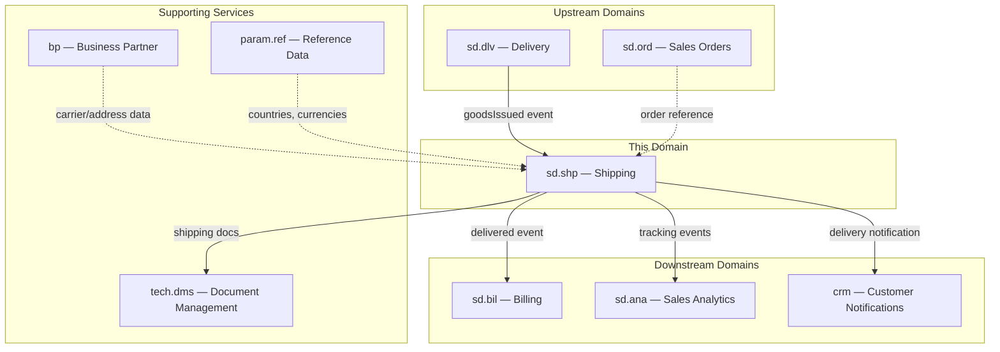
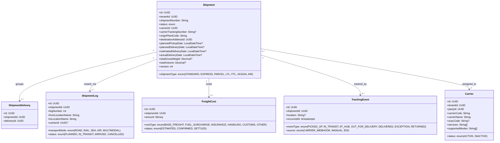
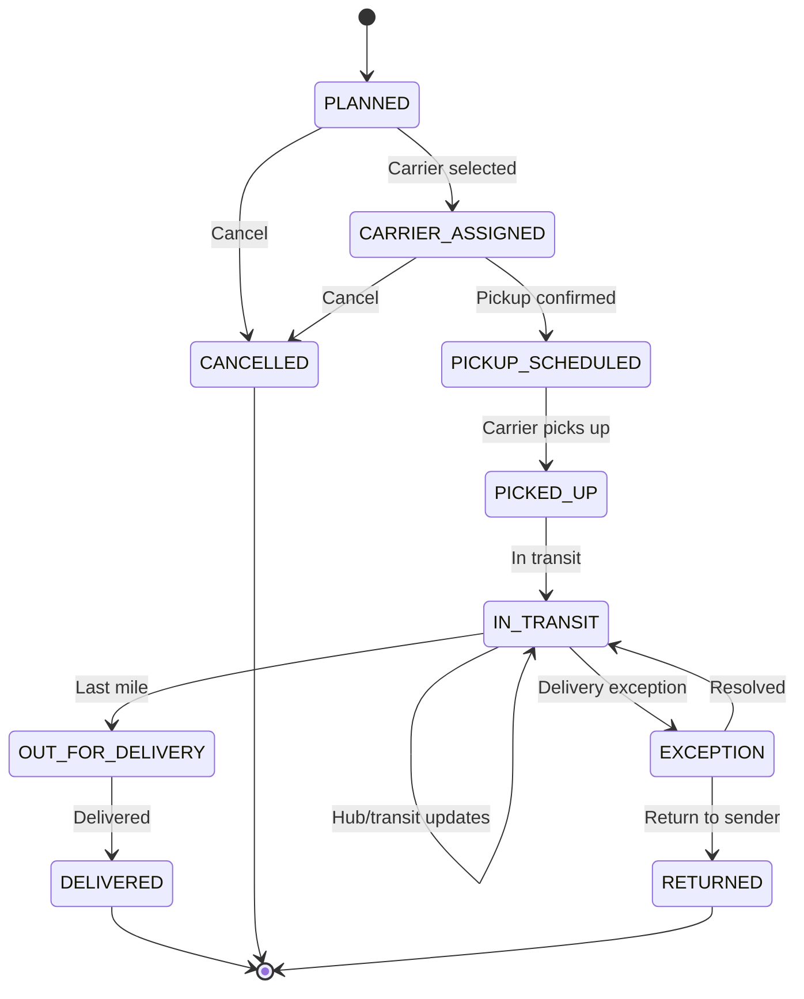
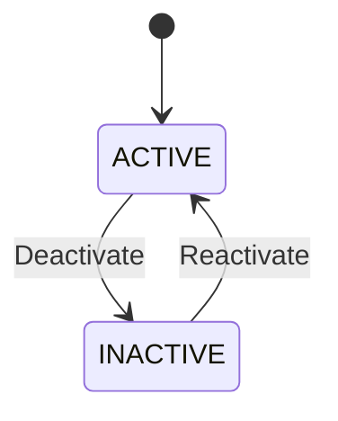
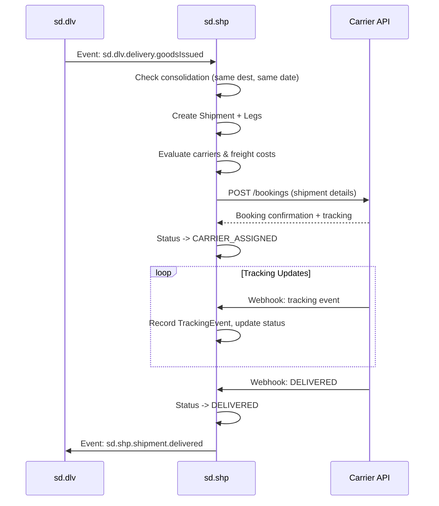
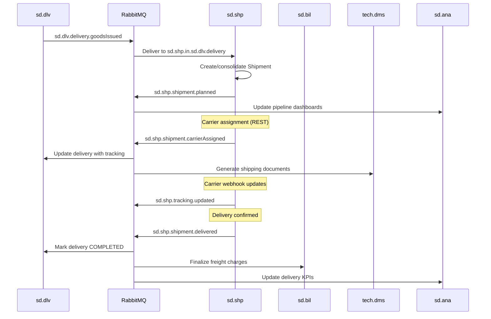
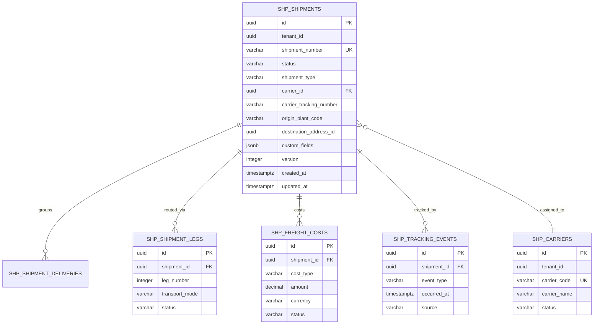

# SD.SHP - Shipping Domain / Service Specification

> **Conceptual Stack Layer:** Domain / Service
> **Space:** Platform
> **Owner:** Domain Engineering Team
> **Schema alignment:** `service-layer.schema.json`
> **Companion files:** `openapi.yaml`, `*.schema.json` (event contracts)
> **Referenced by:** Platform-Feature Spec SS5 (backend dependencies), BFF Contract
> **Belongs to:** SD Suite Spec (`_sd_suite.md`)

> **Meta Information**
> - **Version:** 2026-04-03
> - **Template:** `domain-service-spec.md` v1.0.0
> - **Template Compliance:** ~95% — §11 feature dependencies partially populated (OPEN QUESTIONs), §13 migration framework only
> - **Author(s):** OpenLeap Architecture Team
> - **Status:** DRAFT
> - **Suite:** `sd`
> - **Domain:** `shp`
> - **Bounded Context Ref:** `bc:shipping`
> - **Service ID:** `sd-shp-svc`
> - **basePackage:** `io.openleap.sd.shp`
> - **API Base Path:** `/api/sd/shp/v1`
> - **OpenLeap Starter Version:** TBD
> - **Port:** TBD
> - **Repository:** TBD
> - **Tags:** `shipping`, `transportation`, `carrier`, `tracking`, `freight`
> - **Team:**
>   - Name: `team-sd`
>   - Email: `sd-team@openleap.io`
>   - Slack: `#sd-team`

---

## Specification Guidelines Compliance

> ### Non-Negotiables
> - Never invent facts. If required info is missing, add an **OPEN QUESTION** entry.
> - Preserve intent and decisions. Only change meaning when explicitly requested.
> - Do not remove normative constraints unless they are explicitly replaced.
> - Keep the spec **self-contained**: no "see chat", no implicit context.
>
> ### Source of Truth Priority
> When sources conflict:
> 1. Spec (explicit) wins
> 2. Starter specs (implementation constraints) next
> 3. Guidelines (best practices) last
>
> Record conflicts in the **Decisions & Conflicts** section (see Section 14).
>
> ### Style Guide
> - Prefer short sentences and lists.
> - Use MUST/SHOULD/MAY for normative statements.
> - Keep terminology consistent (Aggregate, Domain Service, Application Service, Command, Event).
> - Avoid ambiguous words ("often", "maybe") unless explicitly noting uncertainty.
> - Keep examples minimal and clearly marked as examples.
> - Do not add implementation code unless the chapter explicitly requires it.

---

## 0. Document Purpose & Scope

### 0.1 Purpose
This specification defines the Shipping domain, which manages shipment planning, carrier assignment, freight cost calculation, route optimization, and delivery tracking. It operates after goods issue (sd.dlv) and before customer receipt.

### 0.2 Target Audience
- Product Owners & Business Stakeholders
- System Architects & Technical Leads
- Integration Engineers

### 0.3 Scope
**In Scope:**
- Shipment creation and planning (grouping deliveries into shipments)
- Carrier selection and assignment
- Route and leg planning
- Freight cost estimation and settlement
- Shipment tracking (status updates, ETAs)
- Shipping document generation (bill of lading, CMR, waybill)
- Carrier integration via webhooks/EDI

**Out of Scope:**
- Delivery processing, picking, packing (sd.dlv)
- Warehouse management (WM)
- Billing of freight to customer (sd.bil handles surcharges)
- Customs and foreign trade compliance (CMP / future domain)

### 0.4 Related Documents
- `_sd_suite.md` - SD Suite overview
- `sd_dlv-spec.md` - Delivery
- `sd_ord-spec.md` - Sales Orders
- `DMS_Spec_MinIO.md` - Document Management

---

## 1. Business Context

### 1.1 Domain Purpose
`sd.shp` manages the transportation leg of the order-to-cash process. Once goods are issued from the warehouse, sd.shp plans how they get to the customer: which carrier, which route, at what cost, and tracks progress until delivery.

### 1.2 Business Value
- Optimized carrier selection based on cost, speed, and service level
- Consolidated shipments reduce freight costs
- Real-time tracking visibility for operations and customers
- Freight cost transparency for margin analysis
- Automated shipping document generation

### 1.3 Key Stakeholders

| Role | Responsibility | Primary Use Cases |
|------|----------------|-------------------|
| Shipping Coordinator | Plan and assign shipments | UC-SHP-001, UC-SHP-002 |
| Carrier | Transport goods | UC-SHP-004 |
| Customer | Track delivery | UC-SHP-005 |
| Finance | Freight cost settlement | UC-SHP-003 |

### 1.4 Strategic Positioning



### 1.5 Service Context

| Property | Value |
|----------|-------|
| **Suite** | `sd` |
| **Domain** | `shp` |
| **Bounded Context** | `bc:shipping` |
| **Service ID** | `sd-shp-svc` |
| **Base Package** | `io.openleap.sd.shp` |

**Responsibilities:**
- Plan shipments from goods-issued deliveries
- Select and assign carriers to shipments
- Calculate and manage freight costs
- Track shipment lifecycle via carrier webhooks and manual events
- Provide tracking timelines to customers and operations
- Manage carrier master data within the shipping context

**Authoritative Sources:**
| Source Type | Description | Access Pattern |
|-------------|-------------|----------------|
| REST API | Shipment CRUD, carrier management, tracking queries | Synchronous |
| Database | Shipments, legs, freight costs, tracking events, carriers | Direct (owner) |
| Events | Shipment lifecycle events (planned, assigned, delivered, etc.) | Asynchronous |

---

## 2. Service Identity

| Property | Value | Schema Field |
|----------|-------|-------------|
| **Service ID** | `sd-shp-svc` | `metadata.id` |
| **Display Name** | Shipping | `metadata.name` |
| **Suite** | `sd` | `metadata.suite` |
| **Domain** | `shp` | `metadata.domain` |
| **Bounded Context** | `bc:shipping` | `metadata.bounded_context_ref` |
| **Version** | `1.1.0` | `metadata.version` |
| **Status** | DRAFT | `metadata.status` |
| **API Base Path** | `/api/sd/shp/v1` | `metadata.api_base_path` |

---

## 3. Domain Model

### 3.1 Conceptual Overview
The domain centers on the **Shipment** aggregate grouping one or more deliveries for carrier transport. Each shipment contains legs (route segments), costs, and tracking events from carriers.

### 3.2 Core Concepts



### 3.3 Aggregate Definitions

#### 3.3.1 Shipment

| Property | Value |
|----------|-------|
| **Aggregate ID** | `agg:shipment` |
| **Name** | `Shipment` |

**Business Purpose:** Represents a planned or active transportation movement grouping one or more deliveries for transport from origin to destination via one or more carriers.

##### Aggregate Root

**Key Attributes:**

| Attribute | Type | Format | Description | Constraints | Required | Read-Only |
|-----------|------|--------|-------------|-------------|----------|-----------|
| id | string | uuid | Unique shipment identifier | Immutable | Yes | Yes |
| tenantId | string | uuid | Tenant ownership | Immutable | Yes | Yes |
| shipmentNumber | string | — | Human-readable shipment number (auto-generated) | Unique per tenant; pattern: `SHP-\d{10}` | Yes | Yes |
| status | string | — | Current lifecycle state | enum_ref: `ShipmentStatus` | Yes | No |
| shipmentType | string | — | Mode/service level classification | enum_ref: `ShipmentType` | Yes | No |
| carrierId | string | uuid | Assigned carrier reference | FK to `agg:carrier` | No | No |
| carrierTrackingNumber | string | — | Carrier-provided tracking identifier | max_length: 100 | No | No |
| originPlantCode | string | — | Shipping plant / origin warehouse code | max_length: 10 | Yes | No |
| destinationAddressId | string | uuid | Target delivery address (bp.adr reference) | — | Yes | No |
| plannedPickupDate | string | date-time | Requested carrier pickup date/time | — | No | No |
| plannedDeliveryDate | string | date-time | Contractual delivery deadline | — | No | No |
| estimatedDeliveryDate | string | date-time | Carrier-provided ETA, updated via tracking | — | No | No |
| actualDeliveryDate | string | date-time | Confirmed delivery timestamp | Set on DELIVERED transition | No | Yes |
| totalGrossWeight | number | decimal | Combined gross weight of all delivery items (kg) | minimum: 0; precision: 3 | No | No |
| totalVolume | number | decimal | Combined volume of all delivery items (m³) | minimum: 0; precision: 3 | No | No |
| version | integer | int64 | Optimistic locking version | — | Yes | Yes |

**Lifecycle States:**



**State Descriptions:**

| State | Description | Business Meaning |
|-------|-------------|------------------|
| PLANNED | Shipment created from grouped deliveries | Awaiting carrier selection |
| CARRIER_ASSIGNED | Carrier selected and notified | Pending pickup scheduling |
| PICKUP_SCHEDULED | Carrier confirmed pickup slot | Goods ready for collection |
| PICKED_UP | Carrier has collected the goods | Goods left the warehouse |
| IN_TRANSIT | Goods moving through transport network | Between origin and destination |
| OUT_FOR_DELIVERY | Final-mile delivery in progress | On the delivery vehicle |
| DELIVERED | Proof of delivery received | Order fulfillment complete |
| CANCELLED | Shipment voided before dispatch | No transport will occur |
| EXCEPTION | Delivery problem reported by carrier | Requires manual resolution |
| RETURNED | Goods returned to origin after failed delivery | Return-to-sender processed |

**Allowed Transitions:**

| From State | To State | Trigger | Guard / Business Preconditions |
|------------|----------|---------|-------------------------------|
| PLANNED | CARRIER_ASSIGNED | Carrier selected | Carrier status = ACTIVE; weight/volume populated |
| PLANNED | CANCELLED | Manual cancellation | — |
| CARRIER_ASSIGNED | PICKUP_SCHEDULED | Carrier confirms pickup | Pickup date set |
| CARRIER_ASSIGNED | CANCELLED | Manual cancellation | — |
| PICKUP_SCHEDULED | PICKED_UP | Carrier pickup scan | — |
| PICKED_UP | IN_TRANSIT | First transit tracking event | — |
| IN_TRANSIT | IN_TRANSIT | Hub/checkpoint tracking event | — |
| IN_TRANSIT | OUT_FOR_DELIVERY | Last-mile dispatch scan | — |
| IN_TRANSIT | EXCEPTION | Carrier reports problem | — |
| OUT_FOR_DELIVERY | DELIVERED | Proof of delivery received | actualDeliveryDate set |
| EXCEPTION | IN_TRANSIT | Issue resolved by carrier | — |
| EXCEPTION | RETURNED | Return-to-sender initiated | — |

**Invariants:**
| Rule ID | Description |
|---------|-------------|
| BR-SHP-001 | Shipments only from GOODS_ISSUED deliveries |
| BR-SHP-002 | Carrier must be ACTIVE |
| BR-SHP-003 | Weight/volume required for freight calculation |
| BR-SHP-004 | Multiple deliveries to same destination can be consolidated |
| BR-SHP-005 | No modification after DELIVERED |

**Domain Events Emitted:**
- `sd.shp.shipment.planned`
- `sd.shp.shipment.carrierAssigned`
- `sd.shp.shipment.dispatched`
- `sd.shp.shipment.delivered`
- `sd.shp.shipment.cancelled`
- `sd.shp.shipment.exception`
- `sd.shp.tracking.updated`

##### Child Entities

###### Entity: ShipmentDelivery

| Property | Value |
|----------|-------|
| **Entity ID** | `ent:shipment-delivery` |
| **Name** | `ShipmentDelivery` |
| **Relationship to Root** | one_to_many |

**Business Purpose:** Links one or more deliveries (from sd.dlv) to a single shipment, enabling consolidation of multiple delivery documents into one transport unit.

**Attributes:**

| Attribute | Type | Format | Description | Constraints | Required |
|-----------|------|--------|-------------|-------------|----------|
| id | string | uuid | Unique identifier | Immutable | Yes |
| shipmentId | string | uuid | Parent shipment reference | FK to `agg:shipment` | Yes |
| deliveryId | string | uuid | Linked delivery document | FK to sd.dlv aggregate | Yes |

**Collection Constraints:**
- Minimum items: 1 (a shipment must contain at least one delivery)
- Maximum items: unbounded

**Invariants:**

| Rule ID | Description |
|---------|-------------|
| BR-SHP-001 | Referenced delivery must have status GOODS_ISSUED |
| BR-SHP-004 | Consolidated deliveries must share the same destination address |

###### Entity: ShipmentLeg

| Property | Value |
|----------|-------|
| **Entity ID** | `ent:shipment-leg` |
| **Name** | `ShipmentLeg` |
| **Relationship to Root** | one_to_many |

**Business Purpose:** Represents a single segment in the shipment route. Multi-modal or multi-stop shipments have multiple legs (e.g., road to port, sea crossing, road to final destination).

**Attributes:**

| Attribute | Type | Format | Description | Constraints | Required |
|-----------|------|--------|-------------|-------------|----------|
| id | string | uuid | Unique identifier | Immutable | Yes |
| shipmentId | string | uuid | Parent shipment reference | FK to `agg:shipment` | Yes |
| legNumber | integer | int32 | Sequence position in route | minimum: 1; unique per shipment | Yes |
| fromLocationName | string | — | Origin location name/code | max_length: 200 | Yes |
| toLocationName | string | — | Destination location name/code | max_length: 200 | Yes |
| carrierId | string | uuid | Carrier responsible for this leg | FK to `agg:carrier`; nullable for unassigned legs | No |
| transportMode | string | — | Mode of transport for this leg | enum_ref: `TransportMode` | Yes |
| status | string | — | Leg execution status | enum_ref: `LegStatus` | Yes |

**Collection Constraints:**
- Minimum items: 1 (at least one leg required)
- Maximum items: unbounded

**Invariants:**

| Rule ID | Description |
|---------|-------------|
| BR-SHP-010 | Leg numbers must be contiguous starting at 1 |
| BR-SHP-011 | First leg fromLocationName must match shipment originPlantCode |

###### Entity: FreightCost

| Property | Value |
|----------|-------|
| **Entity ID** | `ent:freight-cost` |
| **Name** | `FreightCost` |
| **Relationship to Root** | one_to_many |

**Business Purpose:** Captures individual cost line items for a shipment (base freight, surcharges, insurance). Costs progress from estimated to confirmed to settled as carrier invoices are reconciled.

**Attributes:**

| Attribute | Type | Format | Description | Constraints | Required |
|-----------|------|--------|-------------|-------------|----------|
| id | string | uuid | Unique identifier | Immutable | Yes |
| shipmentId | string | uuid | Parent shipment reference | FK to `agg:shipment` | Yes |
| costType | string | — | Category of freight charge | enum_ref: `CostType` | Yes |
| amount | object | — | Monetary amount with currency | type_ref: `type:money` | Yes |
| status | string | — | Cost lifecycle state | enum_ref: `CostStatus` | Yes |

**Collection Constraints:**
- Minimum items: 0 (costs may not yet be calculated)
- Maximum items: unbounded

**Invariants:**

| Rule ID | Description |
|---------|-------------|
| BR-SHP-003 | Weight/volume must be set on shipment before freight calculation |
| BR-SHP-020 | Amount must be non-negative |

###### Entity: TrackingEvent

| Property | Value |
|----------|-------|
| **Entity ID** | `ent:tracking-event` |
| **Name** | `TrackingEvent` |
| **Relationship to Root** | one_to_many |

**Business Purpose:** Immutable record of a shipment status checkpoint received from carrier webhooks, EDI feeds, or manual entry. Provides the audit trail for shipment movement and drives status transitions on the parent shipment.

**Attributes:**

| Attribute | Type | Format | Description | Constraints | Required |
|-----------|------|--------|-------------|-------------|----------|
| id | string | uuid | Unique identifier | Immutable | Yes |
| shipmentId | string | uuid | Parent shipment reference | FK to `agg:shipment` | Yes |
| eventType | string | — | Type of tracking milestone | enum_ref: `TrackingEventType` | Yes |
| location | string | — | Location name/code where event occurred | max_length: 300 | No |
| occurredAt | string | date-time | Timestamp when event occurred at carrier | — | Yes |
| source | string | — | How the event was received | enum_ref: `TrackingSource` | Yes |

**Collection Constraints:**
- Minimum items: 0
- Maximum items: unbounded (append-only)

**Invariants:**

| Rule ID | Description |
|---------|-------------|
| BR-SHP-030 | TrackingEvents are immutable once created |
| BR-SHP-031 | occurredAt must not be in the future |

##### Value Objects

###### Value Object: Money

| Property | Value |
|----------|-------|
| **VO ID** | `vo:money` |
| **Name** | `Money` |

**Description:** Monetary amount with currency. Used for all freight cost values.

**Attributes:**

| Attribute | Type | Format | Description | Constraints |
|-----------|------|--------|-------------|-------------|
| amount | number | decimal | Monetary value | precision: 2; minimum: 0 |
| currencyCode | string | — | ISO 4217 currency code | pattern: `^[A-Z]{3}$` |

**Validation Rules:**
- Amount must be non-negative
- Currency code must be a valid ISO 4217 code

---

#### 3.3.2 Carrier

| Property | Value |
|----------|-------|
| **Aggregate ID** | `agg:carrier` |
| **Name** | `Carrier` |

**Business Purpose:** Represents a transport service provider available for shipment assignment. Maintains carrier capabilities (supported transport modes, service types) and links to the business partner record for contractual/contact data.

##### Aggregate Root

**Key Attributes:**

| Attribute | Type | Format | Description | Constraints | Required | Read-Only |
|-----------|------|--------|-------------|-------------|----------|-----------|
| id | string | uuid | Unique carrier identifier | Immutable | Yes | Yes |
| tenantId | string | uuid | Tenant ownership | Immutable | Yes | Yes |
| partyId | string | uuid | Reference to business partner (bp domain) | — | Yes | No |
| carrierCode | string | — | Short internal carrier code | Unique per tenant; max_length: 20 | Yes | No |
| carrierName | string | — | Display name of carrier | max_length: 200 | Yes | No |
| scacCode | string | — | Standard Carrier Alpha Code (North America) | pattern: `^[A-Z]{2,4}$` | No | No |
| services | array | — | Service types offered | min_items: 1; items: string | Yes | No |
| supportedModes | array | — | Transport modes carrier operates | min_items: 1; items: enum_ref `TransportMode` | Yes | No |
| status | string | — | Carrier availability status | enum_ref: `CarrierStatus` | Yes | No |

**Lifecycle States:**



**Allowed Transitions:**

| From State | To State | Trigger | Guard / Business Preconditions |
|------------|----------|---------|-------------------------------|
| ACTIVE | INACTIVE | Manual deactivation | — |
| INACTIVE | ACTIVE | Manual reactivation | partyId still references valid business partner |

**Invariants:**

| Rule ID | Description |
|---------|-------------|
| BR-SHP-002 | Only ACTIVE carriers can be assigned to shipments |
| BR-SHP-040 | carrierCode must be unique within tenant |
| BR-SHP-041 | At least one service and one supported mode required |

**Domain Events Emitted:**
- `sd.shp.carrier.created`
- `sd.shp.carrier.updated`
- `sd.shp.carrier.deactivated`
- `sd.shp.carrier.reactivated`

### 3.4 Enumerations

#### ShipmentStatus

| Value | Description | Deprecated |
|-------|-------------|------------|
| `PLANNED` | Shipment created from deliveries, awaiting carrier assignment | No |
| `CARRIER_ASSIGNED` | Carrier selected and notified | No |
| `PICKUP_SCHEDULED` | Carrier confirmed a pickup time slot | No |
| `PICKED_UP` | Goods collected by carrier from origin | No |
| `IN_TRANSIT` | Goods moving through transport network | No |
| `OUT_FOR_DELIVERY` | Final-mile delivery in progress | No |
| `DELIVERED` | Proof of delivery received | No |
| `CANCELLED` | Shipment voided before physical dispatch | No |
| `EXCEPTION` | Delivery problem reported (damage, address issue, customs hold) | No |
| `RETURNED` | Goods returned to sender after failed delivery | No |

#### ShipmentType

| Value | Description | Deprecated |
|-------|-------------|------------|
| `STANDARD` | Standard ground delivery, economy service | No |
| `EXPRESS` | Expedited delivery with guaranteed transit time | No |
| `PARCEL` | Small-package shipment via parcel carrier | No |
| `LTL` | Less Than Truckload — shared trailer space | No |
| `FTL` | Full Truckload — dedicated trailer | No |
| `OCEAN` | Maritime container freight | No |
| `AIR` | Air cargo shipment | No |

#### TransportMode

| Value | Description | Deprecated |
|-------|-------------|------------|
| `ROAD` | Truck or van transport | No |
| `RAIL` | Rail freight | No |
| `SEA` | Ocean/inland waterway vessel | No |
| `AIR` | Air cargo | No |
| `MULTIMODAL` | Combined modes within a single leg (e.g., RoRo ferry) | No |

#### LegStatus

| Value | Description | Deprecated |
|-------|-------------|------------|
| `PLANNED` | Leg defined in route plan, not yet active | No |
| `IN_TRANSIT` | Goods moving on this leg segment | No |
| `ARRIVED` | Goods arrived at leg destination | No |
| `CANCELLED` | Leg removed from route (re-routing) | No |

#### CostType

| Value | Description | Deprecated |
|-------|-------------|------------|
| `BASE_FREIGHT` | Core transportation charge based on weight/distance/mode | No |
| `FUEL_SURCHARGE` | Variable surcharge tied to fuel price index | No |
| `INSURANCE` | Cargo insurance premium | No |
| `HANDLING` | Loading, unloading, special handling fees | No |
| `CUSTOMS` | Customs clearance and duty-related charges | No |
| `OTHER` | Miscellaneous charges (detention, accessorial) | No |

#### CostStatus

| Value | Description | Deprecated |
|-------|-------------|------------|
| `ESTIMATED` | Calculated from rate tables or carrier quote | No |
| `CONFIRMED` | Validated against carrier invoice | No |
| `SETTLED` | Payment processed or accrued in FI | No |

#### TrackingEventType

| Value | Description | Deprecated |
|-------|-------------|------------|
| `PICKED_UP` | Goods collected from shipper | No |
| `IN_TRANSIT` | Shipment in transit between locations | No |
| `AT_HUB` | Arrived at carrier sorting/distribution hub | No |
| `OUT_FOR_DELIVERY` | On delivery vehicle for final mile | No |
| `DELIVERED` | Delivered to consignee | No |
| `EXCEPTION` | Problem encountered (damage, address issue, customs hold) | No |
| `RETURNED` | Goods returned to origin | No |

#### TrackingSource

| Value | Description | Deprecated |
|-------|-------------|------------|
| `CARRIER_WEBHOOK` | Real-time push from carrier tracking API | No |
| `MANUAL` | Entered by shipping coordinator | No |
| `EDI` | Received via EDI message (e.g., IFTSTA 315) | No |

#### CarrierStatus

| Value | Description | Deprecated |
|-------|-------------|------------|
| `ACTIVE` | Carrier available for shipment assignment | No |
| `INACTIVE` | Carrier suspended or decommissioned | No |

### 3.5 Shared Types

#### Money

| Property | Value |
|----------|-------|
| **Type ID** | `type:money` |
| **Name** | `Money` |

**Description:** Monetary amount with ISO 4217 currency code. Immutable value object used wherever financial values appear.

**Attributes:**

| Attribute | Type | Format | Description | Constraints |
|-----------|------|--------|-------------|-------------|
| amount | number | decimal | Monetary value | precision: 2; minimum: 0 |
| currencyCode | string | — | ISO 4217 currency code | pattern: `^[A-Z]{3}$` |

**Validation Rules:**
- Amount must be non-negative
- Currency code must be a valid ISO 4217 three-letter code

**Used By:**
- `agg:shipment` (via `ent:freight-cost` — FreightCost.amount)

---

## 4. Business Rules & Constraints

### 4.1 Business Rules Catalog

| ID | Rule Name | Description | Scope | Enforcement | Error Code |
|----|-----------|-------------|-------|-------------|------------|
| BR-SHP-001 | GI Required | Shipment from GOODS_ISSUED deliveries only | Shipment | Create | `SHP_GI_REQUIRED` |
| BR-SHP-002 | Active Carrier | Only ACTIVE carriers can be assigned | Shipment | Assign | `SHP_INACTIVE_CARRIER` |
| BR-SHP-003 | Weight Required | Weight/volume needed for freight | Shipment | Freight calc | `SHP_WEIGHT_MISSING` |
| BR-SHP-004 | Consolidation | Same-destination deliveries MAY be consolidated | Shipment | Create | — |
| BR-SHP-005 | Immutable After Delivery | No modifications after DELIVERED | Shipment | Update | `SHP_IMMUTABLE` |
| BR-SHP-010 | Contiguous Legs | Leg numbers must be contiguous starting at 1 | ShipmentLeg | Create/Update | `SHP_LEG_SEQUENCE` |
| BR-SHP-011 | Route Continuity | First leg origin must match shipment origin | ShipmentLeg | Create | `SHP_LEG_ORIGIN` |
| BR-SHP-020 | Non-Negative Cost | Freight cost amount must be non-negative | FreightCost | Create | `SHP_COST_NEGATIVE` |
| BR-SHP-030 | Immutable Events | Tracking events cannot be modified once created | TrackingEvent | Update | `SHP_EVENT_IMMUTABLE` |
| BR-SHP-031 | No Future Events | Tracking event occurredAt must not be in the future | TrackingEvent | Create | `SHP_EVENT_FUTURE` |
| BR-SHP-040 | Unique Carrier Code | Carrier code must be unique per tenant | Carrier | Create/Update | `SHP_CARRIER_CODE_DUP` |
| BR-SHP-041 | Carrier Capabilities | At least one service and one transport mode required | Carrier | Create | `SHP_CARRIER_NO_CAPS` |

### 4.2 Detailed Rule Definitions

#### BR-SHP-001: GI Required

**Business Context:** Shipments represent physical transportation. Creating a shipment before goods issue would lead to carrier bookings for unavailable goods, causing failed pickups and carrier penalties.

**Rule Statement:** A Shipment MUST only be created from deliveries with status `GOODS_ISSUED`. Deliveries in any other state MUST be rejected.

**Applies To:**
- Aggregate: `Shipment`
- Operations: Create

**Validation Logic:** For each `deliveryId` in the input, verify `delivery.status == GOODS_ISSUED`. If any delivery fails, reject the entire request (atomic).

**Error Handling:**
- **Error Code:** `SHP_GI_REQUIRED`
- **Error Message:** "Shipment cannot be created: delivery {deliveryId} has not completed goods issue (current status: {status})."
- **User action:** Wait for goods issue to complete in sd.dlv.

**Examples:**
- **Valid:** Two deliveries both in `GOODS_ISSUED` status grouped into a single shipment.
- **Invalid:** One delivery is `GOODS_ISSUED`, the other is `PACKING`. Entire request rejected.

#### BR-SHP-002: Active Carrier

**Business Context:** Carriers may be deactivated due to contract expiry, compliance violations, or poor performance. Assigning to inactive carriers would result in failed pickups.

**Rule Statement:** A Carrier MUST have `status = ACTIVE` at the time of assignment.

**Applies To:**
- Aggregate: `Shipment`
- Operations: AssignCarrier

**Validation Logic:** Load `Carrier` by `carrierId`. Assert `carrier.status == ACTIVE`.

**Error Handling:**
- **Error Code:** `SHP_INACTIVE_CARRIER`
- **Error Message:** "Carrier {carrierCode} is not active (current status: {status})."
- **User action:** Select a different carrier or reactivate the carrier.

**Examples:**
- **Valid:** Carrier "DHL Express" with status `ACTIVE` assigned to shipment.
- **Invalid:** Carrier "Legacy Transport" with status `INACTIVE` selected. Rejected with `SHP_INACTIVE_CARRIER`.

#### BR-SHP-003: Weight Required

**Business Context:** Freight cost calculation depends on weight and/or volume. Without measurements, the system cannot compute accurate freight charges.

**Rule Statement:** Before freight calculation, the Shipment MUST have `totalGrossWeight > 0` or `totalVolume > 0`.

**Applies To:**
- Aggregate: `Shipment`
- Operations: CalculateFreight

**Validation Logic:** Assert `(totalGrossWeight != null AND totalGrossWeight > 0) OR (totalVolume != null AND totalVolume > 0)`.

**Error Handling:**
- **Error Code:** `SHP_WEIGHT_MISSING`
- **Error Message:** "Freight calculation requires weight or volume. Shipment {shipmentNumber} has neither."
- **User action:** Update the shipment with weight/volume data, then retry.

**Examples:**
- **Valid:** Shipment has `totalGrossWeight = 450.00 kg`. Freight calculated using weight-based rates.
- **Invalid:** Both `totalGrossWeight` and `totalVolume` are null. Rejected.

#### BR-SHP-004: Consolidation

**Business Context:** Shipping multiple deliveries separately to the same destination increases freight cost. Consolidation reduces cost per unit.

**Rule Statement:** Deliveries with the same `destinationAddressId` and compatible `plannedPickupDate` (same business day) MAY be consolidated. Consolidation is optional — the system SHOULD suggest it but MUST NOT auto-consolidate via REST without confirmation.

**Applies To:**
- Aggregate: `Shipment`
- Operations: Create

**Error Handling:** No error code — this rule is advisory, not prohibitive.

**Examples:**
- **Valid:** Three deliveries to customer X on the same day consolidated into one FTL shipment.
- **Valid (no consolidation):** Two deliveries to same address but different service levels shipped separately.

#### BR-SHP-005: Immutable After Delivery

**Business Context:** Delivered shipments represent completed business facts. Modifications would invalidate freight settlements, proof of delivery, and downstream billing.

**Rule Statement:** A Shipment in `DELIVERED`, `CANCELLED`, or `RETURNED` status MUST NOT accept state-changing operations. Only freight cost settlement (CONFIRMED → SETTLED) is permitted.

**Applies To:**
- Aggregate: `Shipment`
- Operations: Update, AssignCarrier, Cancel, AddTrackingEvent

**Validation Logic:** Guard clause: `if (this.status in [DELIVERED, CANCELLED, RETURNED]) reject`.

**Error Handling:**
- **Error Code:** `SHP_IMMUTABLE`
- **Error Message:** "Shipment {shipmentNumber} is in terminal status {status} and cannot be modified."
- **User action:** Create an adjustment or return shipment if correction is needed.

**Examples:**
- **Valid:** Shipment in `IN_TRANSIT` receives a carrier reassignment.
- **Invalid:** Shipment in `DELIVERED` receives a PATCH. Rejected with `SHP_IMMUTABLE`.

### 4.3 Data Validation Rules

**Field-Level Validations:**

| Field | Validation Rule | Error Message |
|-------|----------------|---------------|
| `shipmentType` | Required, one of ShipmentType enum | "Invalid shipment type" |
| `carrierId` | Required when `status >= CARRIER_ASSIGNED` | "Carrier is required for shipments in status {status}" |
| `carrierTrackingNumber` | Max 100 chars | "Carrier tracking number exceeds maximum length" |
| `originPlantCode` | Required, max 10 chars | "Origin plant code is required" |
| `destinationAddressId` | Required, valid UUID | "Destination address is required" |
| `totalGrossWeight` | >= 0 when present | "Total gross weight must be non-negative" |
| `totalVolume` | >= 0 when present | "Total volume must be non-negative" |
| `deliveryIds` (input) | Required on create, min 1 element | "At least one delivery ID is required" |
| `legNumber` | >= 1, unique within shipment | "Leg number must be a positive integer, unique per shipment" |
| `FreightCost.amount` | > 0 | "Freight cost amount must be positive" |
| `TrackingEvent.occurredAt` | Required, not in the future (tolerance: +15 min) | "Tracking event timestamp cannot be in the future" |

**Cross-Field Validations:**
- `plannedDeliveryDate` MUST be >= `plannedPickupDate` when both are set
- `actualDeliveryDate` MUST be >= `plannedPickupDate` when set
- If `shipmentType` is `FTL` or `LTL`, then `totalGrossWeight` MUST be present
- `ShipmentLeg.fromLocationName` on leg N+1 MUST match `ShipmentLeg.toLocationName` on leg N (route continuity)

### 4.4 Reference Data Dependencies

| Catalog | Source Service | Fields Referencing | Validation |
|---------|----------------|-------------------|------------|
| Countries (ISO 3166) | `ref-data-svc` | Carrier country, destination country | Must exist and be active |
| Currencies (ISO 4217) | `ref-data-svc` | `FreightCost.amount.currency` | Must exist and be active |
| Units of Measure | `ref-data-svc` | Weight/volume units | Must be compatible dimension |
| Plant Codes | `ref-data-svc` / `ops` | `originPlantCode` | Must exist and be active |
| Business Partner | `bp.party-svc` | `Carrier.partyId` | Must exist as organization-type party |
| Addresses | `bp.address-svc` | `destinationAddressId` | Must exist and be valid |

---

## 5. Use Cases

### 5.1 Business Logic Placement

| Logic Type | Placement | Examples |
|------------|-----------|----------|
| Aggregate invariants | `Shipment` domain object | BR-SHP-001 GI check, BR-SHP-002 active carrier, BR-SHP-005 immutable guard, status transitions |
| Cross-aggregate logic | `FreightCalculationService` (domain service) | Rate lookup across Carrier + Shipment, dimensional weight calculation |
| Cross-aggregate logic | `ConsolidationService` (domain service) | Matching deliveries to existing open shipments |
| Orchestration & transactions | Application Services | UC coordination, event publishing via outbox |
| Query logic | `ShipmentQueryService` (read model) | Tracking timeline assembly, ETA calculation |

### 5.2 Use Cases (Canonical Format)

#### UC-SHP-001: Plan Shipment

| Field | Value |
|-------|-------|
| **id** | `PlanShipment` |
| **type** | WRITE |
| **trigger** | Message (from sd.dlv event) or REST |
| **aggregate** | `Shipment` |
| **domainOperation** | `Shipment.create` |
| **inputs** | `deliveryIds: UUID[]` |
| **outputs** | `Shipment` (PLANNED) |
| **events** | `ShipmentPlanned` |
| **rest** | `POST /api/sd/shp/v1/shipments` |
| **idempotency** | required |

**Actor:** Shipping Coordinator (REST) or automated (sd.dlv event)

**Preconditions:**
- All referenced deliveries exist and have status `GOODS_ISSUED`
- Actor has role `SHP_COORDINATOR` (REST) or event originates from trusted sd.dlv exchange

**Main Flow:**
1. System receives `deliveryIds[]` via REST or `sd.dlv.delivery.goodsIssued` event
2. System validates all deliveries are in `GOODS_ISSUED` status (BR-SHP-001)
3. System checks for consolidation opportunities (BR-SHP-004)
4. If consolidation match found via event: adds deliveries to existing shipment. Via REST: returns suggestion for confirmation
5. If no consolidation: creates `Shipment` in `PLANNED` status with initial legs
6. System publishes `ShipmentPlanned` event via outbox

**Postconditions:**
- Shipment exists in `PLANNED` status with at least one delivery linked
- `ShipmentPlanned` event published

**Business Rules Applied:**
- BR-SHP-001: GI Required
- BR-SHP-004: Consolidation

**Alternative Flows:**
- **Alt-1:** Consolidation accepted — deliveries added to existing PLANNED shipment

**Exception Flows:**
- **Exc-1:** Delivery not in GOODS_ISSUED status → `SHP_GI_REQUIRED`
- **Exc-2:** Duplicate event (idempotency) → returns existing shipment

#### UC-SHP-002: Assign Carrier

| Field | Value |
|-------|-------|
| **id** | `AssignCarrier` |
| **type** | WRITE |
| **trigger** | REST |
| **aggregate** | `Shipment` |
| **domainOperation** | `Shipment.assignCarrier` |
| **inputs** | `shipmentId: UUID`, `carrierId: UUID` |
| **outputs** | `Shipment` (CARRIER_ASSIGNED) |
| **events** | `CarrierAssigned` |
| **rest** | `POST /api/sd/shp/v1/shipments/{id}:assign-carrier` |
| **idempotency** | required |
| **errors** | `SHP_INACTIVE_CARRIER` |

**Actor:** Shipping Coordinator

**Preconditions:**
- Shipment exists in `PLANNED` status
- Actor has role `SHP_COORDINATOR`

**Main Flow:**
1. Actor selects a shipment and carrier via REST
2. System validates carrier has `status = ACTIVE` (BR-SHP-002)
3. System validates shipment is not in terminal state (BR-SHP-005)
4. System transitions to `CARRIER_ASSIGNED`, sets `carrierId`
5. System triggers freight cost estimation (UC-SHP-003)
6. System publishes `CarrierAssigned` event

**Postconditions:**
- Shipment in `CARRIER_ASSIGNED` status with `carrierId` set
- Freight cost estimates available

**Business Rules Applied:**
- BR-SHP-002: Active Carrier
- BR-SHP-005: Immutable After Delivery

**Exception Flows:**
- **Exc-1:** Carrier is INACTIVE → `SHP_INACTIVE_CARRIER`
- **Exc-2:** Shipment in terminal state → `SHP_IMMUTABLE`

#### UC-SHP-003: Calculate Freight Costs

| Field | Value |
|-------|-------|
| **id** | `CalculateFreightCosts` |
| **type** | WRITE |
| **trigger** | Internal |
| **aggregate** | `Shipment` |
| **domainOperation** | `Shipment.calculateFreight` |
| **inputs** | `shipmentId: UUID` |
| **outputs** | `FreightCost[]` (ESTIMATED) |
| **events** | — |
| **errors** | `SHP_WEIGHT_MISSING` |

**Actor:** System (triggered by UC-SHP-002)

**Preconditions:**
- Shipment has a carrier assigned
- Weight or volume data available

**Main Flow:**
1. System loads shipment with legs, carrier, and weight/volume
2. System validates weight or volume is present (BR-SHP-003)
3. System calculates dimensional weight
4. System looks up carrier rate tables
5. System computes base freight and surcharges as separate `FreightCost` entries (ESTIMATED)

**Postconditions:**
- FreightCost entries exist with status ESTIMATED

**Business Rules Applied:**
- BR-SHP-003: Weight Required

**Exception Flows:**
- **Exc-1:** Weight and volume both missing → `SHP_WEIGHT_MISSING`

#### UC-SHP-004: Process Tracking Updates

| Field | Value |
|-------|-------|
| **id** | `ProcessTrackingUpdate` |
| **type** | WRITE |
| **trigger** | REST (carrier webhook) |
| **aggregate** | `Shipment` |
| **domainOperation** | `Shipment.recordTrackingEvent` |
| **inputs** | `shipmentId: UUID`, `eventType: String`, `location: String?`, `occurredAt: timestamptz` |
| **outputs** | `TrackingEvent` |
| **events** | `TrackingUpdated`, `ShipmentDelivered` (if DELIVERED) |
| **rest** | `POST /api/sd/shp/v1/webhooks/carrier/{carrierCode}` |
| **idempotency** | required |

**Actor:** Carrier (webhook) or Shipping Coordinator (manual)

**Preconditions:**
- Shipment exists in a non-terminal state
- Carrier webhook authenticated via API key

**Main Flow:**
1. System receives tracking payload from carrier webhook or manual REST
2. System authenticates source (API key for webhooks, JWT for manual)
3. System maps carrier event codes to internal `TrackingEventType`
4. System creates `TrackingEvent`, updates shipment status
5. System updates `estimatedDeliveryDate` if carrier provides revised ETA
6. System publishes `TrackingUpdated`; also `ShipmentDelivered` if status becomes DELIVERED

**Postconditions:**
- TrackingEvent recorded
- Shipment status updated

**Business Rules Applied:**
- BR-SHP-005: Immutable After Delivery
- BR-SHP-031: No future events

**Alternative Flows:**
- **Alt-1:** Exception event → shipment transitions to EXCEPTION, publishes `ShipmentException`
- **Alt-2:** Duplicate tracking event → idempotent, ignored

**Exception Flows:**
- **Exc-1:** Unknown carrier code → HTTP 404
- **Exc-2:** Invalid API key → HTTP 401

#### UC-SHP-005: Customer Tracking

| Field | Value |
|-------|-------|
| **id** | `CustomerTracking` |
| **type** | READ |
| **trigger** | REST |
| **aggregate** | `Shipment` |
| **domainOperation** | `getTrackingTimeline` |
| **inputs** | `trackingNumber: String` or `salesDocumentId: UUID` |
| **outputs** | `TrackingEvent[]`, ETA |
| **rest** | `GET /api/sd/shp/v1/tracking?trackingNumber={num}` |

**Actor:** Customer (portal) or Shipping Coordinator

**Preconditions:**
- Shipment exists for the given tracking number or sales document

**Main Flow:**
1. Actor queries by `trackingNumber` or `salesDocumentId`
2. System resolves shipment
3. System loads all TrackingEvents ordered by `occurredAt DESC`
4. System computes ETA based on latest tracking data
5. System returns tracking timeline

**Postconditions:**
- No state changes (READ operation)

**Alternative Flows:**
- **Alt-1:** Multiple shipments for same sales document (split delivery) → returns all tracking timelines

**Exception Flows:**
- **Exc-1:** No shipment found → HTTP 404

### 5.3 Shipment Planning Flow



### 5.4 Cross-Domain Workflows

**Does this domain participate in multi-service workflows?** YES

#### Workflow: Order-to-Cash Fulfillment (Delivery → Shipping → Billing)

**Business Purpose:** Complete the physical fulfillment and financial settlement of a sales order after goods issue.

**Orchestration Pattern:** Choreography (EDA) — per ADR-SD-002

**Pattern Rationale:** Each step is a self-contained business fact. Services react independently. No shared transactions needed. Temporal decoupling is acceptable.

**Participating Services:**

| Service | Role | Responsibilities |
|---------|------|------------------|
| `sd.dlv` | Upstream producer | Picking, packing, goods issue. Publishes `goodsIssued` and `cancelled`. |
| `sd.shp` | Reactive participant | Shipment creation, carrier management, tracking. Publishes `delivered` and `cancelled`. |
| `sd.bil` | Downstream consumer | Reacts to delivery confirmation to trigger invoicing. |

**Workflow Steps:**
1. `sd.dlv` completes goods issue → publishes `sd.dlv.delivery.goodsIssued`
2. `sd.shp` creates shipment (UC-SHP-001) → publishes `sd.shp.shipment.planned`
3. `sd.shp` manages carrier assignment, transit, tracking
4. `sd.shp` confirms delivery → publishes `sd.shp.shipment.delivered`
5. `sd.bil` reacts to `delivered` → creates billing document with freight surcharges

**Cancellation Propagation:**
1. `sd.dlv` publishes `sd.dlv.delivery.cancelled`
2. `sd.shp` cancels shipment if in cancellable state (PLANNED, CARRIER_ASSIGNED)
3. If already IN_TRANSIT or later: flagged for manual intervention

---

## 6. REST API

### 6.1 API Overview

**Base Path:** `/api/sd/shp/v1`

**Authentication:** OAuth2/JWT (Bearer token)

**Authorization:**
- Read operations: Requires scope `sd.shp:read`
- Write operations: Requires scope `sd.shp:write`
- Admin operations: Requires scope `sd.shp:admin`
- Carrier webhooks: API key per carrier (`X-Carrier-Api-Key` header)

### 6.2 Resource Operations

#### 6.2.1 Shipment - Create

```http
POST /api/sd/shp/v1/shipments
Authorization: Bearer {token}
Content-Type: application/json
X-Idempotency-Key: {uuid}
```

**Request Body:**
```json
{
  "deliveryIds": ["a1b2c3d4-0001-4000-8000-000000000001"],
  "shipmentType": "STANDARD",
  "originPlantCode": "P-1000",
  "destinationAddressId": "d5e6f7a8-0002-4000-8000-000000000001",
  "plannedPickupDate": "2026-04-10T08:00:00Z",
  "plannedDeliveryDate": "2026-04-12T17:00:00Z",
  "totalGrossWeight": { "value": 1250.00, "unit": "KG" },
  "totalVolume": { "value": 4.8, "unit": "CBM" },
  "legs": [
    { "legNumber": 1, "fromLocationName": "Plant Hamburg", "toLocationName": "Customer Munich", "transportMode": "ROAD" }
  ],
  "customFields": {}
}
```

**Success Response:** `201 Created`
```json
{
  "id": "f1e2d3c4-0010-4000-8000-000000000001",
  "shipmentNumber": "SHP-2026-000471",
  "version": 1,
  "status": "PLANNED",
  "shipmentType": "STANDARD",
  "originPlantCode": "P-1000",
  "destinationAddressId": "d5e6f7a8-0002-4000-8000-000000000001",
  "deliveryIds": ["a1b2c3d4-0001-4000-8000-000000000001"],
  "legs": [
    { "id": "b2c3d4e5-0020-4000-8000-000000000001", "legNumber": 1, "fromLocationName": "Plant Hamburg", "toLocationName": "Customer Munich", "transportMode": "ROAD", "status": "PLANNED" }
  ],
  "customFields": {},
  "createdAt": "2026-04-03T14:22:00Z",
  "_links": {
    "self": { "href": "/api/sd/shp/v1/shipments/f1e2d3c4-0010-4000-8000-000000000001" },
    "tracking": { "href": "/api/sd/shp/v1/shipments/f1e2d3c4-0010-4000-8000-000000000001/tracking" },
    "assign-carrier": { "href": "/api/sd/shp/v1/shipments/f1e2d3c4-0010-4000-8000-000000000001:assign-carrier" }
  }
}
```

**Response Headers:** `Location`, `ETag: "1"`

**Business Rules Checked:** BR-SHP-001, BR-SHP-004

**Events Published:** `sd.shp.shipment.planned`

**Error Responses:**
- `400 Bad Request` — Validation error
- `409 Conflict` — Duplicate idempotency key
- `422 Unprocessable Entity` — `SHP_GI_REQUIRED`, `SHP_WEIGHT_MISSING`

#### 6.2.2 Shipment - Retrieve

```http
GET /api/sd/shp/v1/shipments/{id}
Authorization: Bearer {token}
```

**Success Response:** `200 OK` — Full shipment with legs, freight costs, latest tracking event, `customFields`, `_links`. Response headers: `ETag`, `Cache-Control: private, max-age=60`.

**Error Responses:** `404 Not Found`

#### 6.2.3 Shipment - List

```http
GET /api/sd/shp/v1/shipments?status=IN_TRANSIT&carrierId={uuid}&from=2026-04-01&to=2026-04-30&page=0&size=50&sort=plannedPickupDate,asc
Authorization: Bearer {token}
```

**Query Parameters:** `page`, `size` (max 200), `sort`, `status`, `carrierId`, `shipmentType`, `from`/`to` (planned pickup date range), `originPlantCode`

**Success Response:** `200 OK` — Paginated list with `content[]`, `page`, `_links`.

#### 6.2.4 Shipment - Update

```http
PATCH /api/sd/shp/v1/shipments/{id}
Authorization: Bearer {token}
If-Match: "{version}"
```

Updates mutable fields (planned dates, weight, volume, custom fields). Checks BR-SHP-005.

**Error Responses:** `412 Precondition Failed` (ETag mismatch), `422 Unprocessable Entity` (`SHP_IMMUTABLE`)

### 6.3 Business Operations

#### 6.3.1 Assign Carrier

```http
POST /api/sd/shp/v1/shipments/{id}:assign-carrier
Authorization: Bearer {token}
If-Match: "{version}"
```

**Request Body:**
```json
{
  "carrierId": "c1d2e3f4-0030-4000-8000-000000000001",
  "serviceLevel": "STANDARD",
  "estimatedPickupDate": "2026-04-10T08:00:00Z",
  "estimatedDeliveryDate": "2026-04-12T14:30:00Z"
}
```

**Success Response:** `200 OK` — Updated shipment with carrier info, `ETag` bumped.

**Business Rules Checked:** BR-SHP-002, BR-SHP-005

**Events Published:** `sd.shp.shipment.carrierAssigned`

**Error Responses:** `412 Precondition Failed`, `422 Unprocessable Entity` (`SHP_INACTIVE_CARRIER`, `SHP_IMMUTABLE`)

#### 6.3.2 Cancel Shipment

- **POST** `/shipments/{id}:cancel` — Only in PLANNED or CARRIER_ASSIGNED. Body: `{ "reason": "string" }`. Publishes `sd.shp.shipment.cancelled`.

#### 6.3.3 Manual Delivery Confirmation

- **POST** `/shipments/{id}:mark-delivered` — Body: `{ "deliveredAt": "timestamptz", "signedBy": "string?" }`. Publishes `sd.shp.shipment.delivered`.

#### 6.3.4 Carrier Webhook

```http
POST /api/sd/shp/v1/webhooks/carrier/{carrierCode}
X-Carrier-Api-Key: {key}
```

**Request Body:**
```json
{
  "trackingNumber": "JD014600006846373701",
  "eventType": "IN_TRANSIT",
  "eventTimestamp": "2026-04-11T06:12:00Z",
  "location": { "name": "Hannover Hub", "city": "Hannover", "countryCode": "DE" },
  "estimatedDelivery": "2026-04-12T14:30:00Z"
}
```

**Success Response:** `202 Accepted`

**Events Published:** `sd.shp.tracking.updated`, `sd.shp.shipment.delivered` (if DELIVERED), `sd.shp.shipment.exception` (if EXCEPTION)

**Error Responses:** `401 Unauthorized`, `404 Not Found` (tracking number not found)

#### 6.3.5 Tracking Queries

- **GET** `/shipments/{id}/tracking` — Chronological tracking event list
- **GET** `/tracking?trackingNumber={num}` — Public lookup by tracking number
- **GET** `/tracking?salesDocumentId={id}` — Lookup by sales order
- **POST** `/shipments/{id}/tracking-events` — Add manual tracking event

#### 6.3.6 Freight Cost Operations

- **GET** `/shipments/{id}/freight-costs` — List freight costs
- **POST** `/shipments/{id}/freight-costs` — Add freight cost
- **PATCH** `/shipments/{id}/freight-costs/{costId}` — Settle/confirm cost

#### 6.3.7 Carrier Management

- **POST** `/carriers` — Register carrier
- **GET** `/carriers?status=ACTIVE&mode=ROAD` — List carriers
- **GET** `/carriers/{id}` — Get carrier details
- **PATCH** `/carriers/{id}` — Update carrier

### 6.4 OpenAPI Specification

**Location:** `contracts/http/sd/shp/openapi.yaml`

**Version:** OpenAPI 3.1

---

## 7. Events & Integration

### 7.1 Event-Driven Architecture Pattern

**Pattern Used:** Event-Driven (Choreography)

**Follows Suite Pattern:** YES — per ADR-SD-002

**Pattern Rationale:** Shipping reacts to upstream delivery facts and broadcasts its own state transitions for independent downstream consumption. No multi-step orchestration needed.

**Message Broker:** RabbitMQ

### 7.2 Published Events

**Exchange:** `sd.shp.events` (topic)

#### Event: Shipment.Planned

**Routing Key:** `sd.shp.shipment.planned`

**Business Purpose:** Announces a new shipment is ready for carrier assignment.

**When Published:** New Shipment created in PLANNED status. After successful transaction commit via outbox (ADR-013).

**Payload Structure:**
```json
{
  "shipmentId": "uuid",
  "shipmentNumber": "SHP-2026-000471",
  "shipmentType": "STANDARD",
  "deliveryIds": ["uuid"],
  "originPlantCode": "P-1000",
  "destinationAddressId": "uuid",
  "plannedPickupDate": "2026-04-10T08:00:00Z",
  "totalGrossWeight": { "value": 1250.00, "unit": "KG" },
  "legCount": 1
}
```

**Event Envelope:**
```json
{
  "eventId": "uuid",
  "traceId": "string",
  "tenantId": "uuid",
  "occurredAt": "2026-04-03T14:22:00Z",
  "producer": "sd.shp",
  "schemaRef": "https://schemas.openleap.io/sd/shp/shipment-planned.schema.json",
  "payload": { }
}
```

**Known Consumers:**
| Consumer Service | Purpose | Processing Type |
|-----------------|---------|-----------------|
| sd.ana | Update shipping pipeline dashboards | Async/Immediate |

#### Event: Shipment.CarrierAssigned

**Routing Key:** `sd.shp.shipment.carrierAssigned`

**Business Purpose:** Carrier selected — triggers shipping document generation and customer tracking portal updates.

**Payload:** `shipmentId`, `carrierId`, `carrierCode`, `carrierTrackingNumber`, `estimatedDeliveryDate`

**Known Consumers:**
| Consumer Service | Purpose | Processing Type |
|-----------------|---------|-----------------|
| sd.dlv | Update delivery with carrier/tracking info | Async/Immediate |
| tech.dms | Generate bill of lading / CMR / waybill | Async/Immediate |
| sd.ana | Update carrier utilization metrics | Async/Batch |

#### Event: Shipment.Delivered

**Routing Key:** `sd.shp.shipment.delivered`

**Business Purpose:** Critical order-to-cash event. Triggers proof-of-delivery processing, freight settlement, invoice finalization, and customer notification.

**Payload:** `shipmentId`, `deliveryIds[]`, `carrierId`, `deliveredAt`, `signedBy`, `onTime`

**Known Consumers:**
| Consumer Service | Purpose | Processing Type |
|-----------------|---------|-----------------|
| sd.dlv | Mark delivery as COMPLETED | Async/Immediate |
| sd.bil | Finalize freight surcharges, trigger billing | Async/Immediate |
| sd.ana | Update delivery performance KPIs | Async/Batch |
| crm | Send delivery confirmation to customer | Async/Immediate |

#### Remaining Published Events (Summary)

| Event | Routing Key | Trigger | Key Payload |
|-------|-------------|---------|-------------|
| Shipment Dispatched | `sd.shp.shipment.dispatched` | Carrier picked up | shipmentId |
| Tracking Updated | `sd.shp.tracking.updated` | New tracking event | shipmentId, eventType, location |
| Shipment Exception | `sd.shp.shipment.exception` | Delivery problem | shipmentId, exceptionType |
| Shipment Cancelled | `sd.shp.shipment.cancelled` | Cancelled | shipmentId, reason |

All events use the same envelope structure and are published via the transactional outbox pattern (ADR-013) with at-least-once delivery (ADR-014).

### 7.3 Consumed Events

#### Event: sd.dlv.delivery.goodsIssued

**Source Service:** `sd.dlv`
**Handler:** `GoodsIssuedEventHandler`
**Business Purpose:** Triggers automatic shipment creation or consolidation.

**Queue Configuration:**
- Name: `sd.shp.in.sd.dlv.delivery`
- Durable: Yes
- Auto-delete: No

**Failure Handling:**
- Retry: Up to 3 times with exponential backoff (1s, 5s, 25s)
- Dead Letter Queue: `sd.shp.in.sd.dlv.delivery.dlq`

#### Event: sd.dlv.delivery.cancelled

**Source Service:** `sd.dlv`
**Handler:** `DeliveryCancelledEventHandler`
**Business Purpose:** Removes delivery from shipment. If no deliveries remain, cancels shipment.

**Queue Configuration:** Shared with `goodsIssued` on `sd.shp.in.sd.dlv.delivery`

**Failure Handling:** Same as above (3x retry, DLQ).

### 7.4 Event Flow Diagram



### 7.5 Integration Points Summary

**Upstream Dependencies:**
| Service | Purpose | Integration Type | Criticality | Fallback |
|---------|---------|------------------|-------------|----------|
| sd.dlv | Delivery data for shipment creation | async_event | critical | Queue buffering; DLQ |
| bp.party | Carrier party master data | sync_api | medium | Cached carrier data |
| param.ref | Country codes, currencies | sync_api | medium | Local cached values |

**Downstream Consumers:**
| Service | Purpose | Integration Type | SLA |
|---------|---------|------------------|-----|
| sd.dlv | Delivery status updates | async_event | < 5 seconds |
| sd.bil | Freight cost data for invoicing | async_event | < 10 seconds |
| sd.ana | Shipping KPIs | async_event | Best effort |
| tech.dms | Shipping document generation | async_event | < 30 seconds |
| crm | Customer delivery notifications | async_event | Best effort |

---

## 8. Data Model

### 8.1 Storage Technology
**Database:** PostgreSQL

**Multi-Tenancy:** Row-Level Security (RLS) via `tenant_id` on all tables.

### 8.2 Conceptual Data Model



### 8.3 Table Definitions

#### Table: `shp_shipments`

**Business Description:** Central aggregate table storing shipment header data.

**Columns:**
| Column | Type | Nullable | PK | FK | Description |
|--------|------|----------|----|----|-------------|
| id | UUID | No | Yes | — | Unique shipment identifier |
| tenant_id | UUID | No | — | — | Tenant ownership (RLS) |
| shipment_number | VARCHAR(30) | No | — | — | Human-readable number (UK per tenant) |
| status | VARCHAR(30) | No | — | — | Lifecycle state |
| shipment_type | VARCHAR(20) | No | — | — | STANDARD, EXPRESS, PARCEL, LTL, FTL, OCEAN, AIR |
| carrier_id | UUID | Yes | — | shp_carriers.id | Assigned carrier |
| carrier_tracking_number | VARCHAR(100) | Yes | — | — | Carrier-issued tracking number |
| origin_plant_code | VARCHAR(20) | No | — | — | Origin plant/warehouse code |
| destination_address_id | UUID | No | — | — | Destination address (bp reference) |
| planned_pickup_date | TIMESTAMPTZ | Yes | — | — | Requested pickup |
| planned_delivery_date | TIMESTAMPTZ | Yes | — | — | Customer-requested delivery |
| estimated_delivery_date | TIMESTAMPTZ | Yes | — | — | Carrier ETA |
| actual_delivery_date | TIMESTAMPTZ | Yes | — | — | Actual delivery timestamp |
| total_gross_weight | DECIMAL(12,3) | Yes | — | — | Total gross weight |
| weight_unit | VARCHAR(10) | Yes | — | — | KG, LB |
| total_volume | DECIMAL(12,3) | Yes | — | — | Total volume |
| volume_unit | VARCHAR(10) | Yes | — | — | CBM, CFT |
| custom_fields | JSONB | No | — | — | Extensible custom fields (default '{}') |
| version | INTEGER | No | — | — | Optimistic locking |
| created_at | TIMESTAMPTZ | No | — | — | Created |
| updated_at | TIMESTAMPTZ | No | — | — | Last modified |

**Indexes:**
| Index Name | Columns | Unique |
|------------|---------|--------|
| pk_shp_shipments | id | Yes |
| uk_shp_shipments_tenant_number | tenant_id, shipment_number | Yes |
| idx_shp_shipments_tenant_status | tenant_id, status | No |
| idx_shp_shipments_carrier | tenant_id, carrier_id | No |
| idx_shp_shipments_tracking_number | carrier_tracking_number | No |
| idx_shp_shipments_custom_fields | custom_fields (GIN) | No |

**Relationships:**
- To `shp_shipment_deliveries`: One-to-many via `shipment_id`
- To `shp_shipment_legs`: One-to-many via `shipment_id`
- To `shp_freight_costs`: One-to-many via `shipment_id`
- To `shp_tracking_events`: One-to-many via `shipment_id`
- To `shp_carriers`: Many-to-one via `carrier_id`

#### Table: `shp_shipment_legs`

**Business Description:** Route segments for multi-stop or multi-modal shipments.

**Columns:**
| Column | Type | Nullable | PK | FK | Description |
|--------|------|----------|----|----|-------------|
| id | UUID | No | Yes | — | Unique leg identifier |
| tenant_id | UUID | No | — | — | Tenant ownership (RLS) |
| shipment_id | UUID | No | — | shp_shipments.id | Parent shipment |
| leg_number | INTEGER | No | — | — | Sequence within shipment |
| from_location_name | VARCHAR(255) | No | — | — | Origin location |
| to_location_name | VARCHAR(255) | No | — | — | Destination location |
| carrier_id | UUID | Yes | — | shp_carriers.id | Carrier for this leg |
| transport_mode | VARCHAR(20) | No | — | — | ROAD, RAIL, SEA, AIR, MULTIMODAL |
| status | VARCHAR(20) | No | — | — | PLANNED, IN_TRANSIT, ARRIVED, CANCELLED |
| version | INTEGER | No | — | — | Optimistic locking |
| created_at | TIMESTAMPTZ | No | — | — | Created |
| updated_at | TIMESTAMPTZ | No | — | — | Last modified |

**Indexes:**
| Index Name | Columns | Unique |
|------------|---------|--------|
| pk_shp_shipment_legs | id | Yes |
| uk_shp_legs_shipment_number | shipment_id, leg_number | Yes |
| idx_shp_legs_tenant_status | tenant_id, status | No |

#### Table: `shp_freight_costs`

**Business Description:** Freight cost line items per shipment.

**Columns:**
| Column | Type | Nullable | PK | FK | Description |
|--------|------|----------|----|----|-------------|
| id | UUID | No | Yes | — | Unique cost identifier |
| tenant_id | UUID | No | — | — | Tenant ownership (RLS) |
| shipment_id | UUID | No | — | shp_shipments.id | Parent shipment |
| cost_type | VARCHAR(30) | No | — | — | BASE_FREIGHT, FUEL_SURCHARGE, etc. |
| amount | DECIMAL(15,2) | No | — | — | Cost amount |
| currency | VARCHAR(3) | No | — | — | ISO 4217 |
| status | VARCHAR(20) | No | — | — | ESTIMATED, CONFIRMED, SETTLED |
| version | INTEGER | No | — | — | Optimistic locking |
| created_at | TIMESTAMPTZ | No | — | — | Created |
| updated_at | TIMESTAMPTZ | No | — | — | Last modified |

**Indexes:**
| Index Name | Columns | Unique |
|------------|---------|--------|
| pk_shp_freight_costs | id | Yes |
| idx_shp_freight_costs_shipment | shipment_id | No |
| idx_shp_freight_costs_tenant_status | tenant_id, status | No |

#### Table: `shp_tracking_events`

**Business Description:** Chronological tracking events for shipment movement.

**Columns:**
| Column | Type | Nullable | PK | FK | Description |
|--------|------|----------|----|----|-------------|
| id | UUID | No | Yes | — | Unique event identifier |
| tenant_id | UUID | No | — | — | Tenant ownership (RLS) |
| shipment_id | UUID | No | — | shp_shipments.id | Parent shipment |
| event_type | VARCHAR(30) | No | — | — | PICKED_UP, IN_TRANSIT, etc. |
| location | VARCHAR(255) | Yes | — | — | Location name |
| occurred_at | TIMESTAMPTZ | No | — | — | When event occurred |
| source | VARCHAR(20) | No | — | — | CARRIER_WEBHOOK, MANUAL, EDI |
| carrier_reference | VARCHAR(100) | Yes | — | — | Carrier event ref (idempotent dedup) |
| version | INTEGER | No | — | — | Optimistic locking |
| created_at | TIMESTAMPTZ | No | — | — | Created |
| updated_at | TIMESTAMPTZ | No | — | — | Last modified |

**Indexes:**
| Index Name | Columns | Unique |
|------------|---------|--------|
| pk_shp_tracking_events | id | Yes |
| idx_shp_tracking_shipment_time | shipment_id, occurred_at DESC | No |
| uk_shp_tracking_carrier_ref | shipment_id, carrier_reference | Yes |

**Data Retention:** Tracking events retained 2 years after shipment delivery.

#### Remaining Tables (Summary)

- **`shp_shipment_deliveries`** — Link table: `id` (PK), `tenant_id`, `shipment_id` (FK), `delivery_id`, `version`, `created_at`, `updated_at`. UK on `(shipment_id, delivery_id)`.
- **`shp_carriers`** — Carrier master: `id` (PK), `tenant_id`, `party_id`, `carrier_code` (UK per tenant), `carrier_name`, `scac_code`, `services` (VARCHAR[]), `supported_modes` (VARCHAR[]), `status`, `api_key_hash`, `version`, `created_at`, `updated_at`.
- **`shp_outbox_events`** — Transactional outbox (ADR-013): `id` (PK), `tenant_id`, `aggregate_type`, `aggregate_id`, `event_type`, `routing_key`, `payload` (JSONB), `published` (BOOLEAN), `created_at`. Index on `(published, created_at)`.

### 8.4 Reference Data Dependencies

| Catalog | Source Service | Tables Referencing | Validation |
|---------|----------------|-------------------|------------|
| Countries (ISO 3166) | ref-data-svc | shp_tracking_events.country_code | Must exist and be active |
| Currencies (ISO 4217) | ref-data-svc | shp_freight_costs.currency | Must exist and be active |
| Units of Measure | ref-data-svc | weight_unit, volume_unit | Must be valid dimension |
| Party Addresses | bp.party | destination_address_id | Must exist for tenant |
| Plant Codes | ref-data-svc / ops | origin_plant_code | Must exist for tenant |

---

## 9. Security & Compliance

### 9.1 Data Classification

**Overall Classification:** Internal

| Data Element | Classification | Rationale | Protection Measures |
|--------------|----------------|-----------|---------------------|
| Shipment ID / Number | Internal | Technical/business identifier | Multi-tenancy isolation |
| Carrier tracking number | Internal | Operational identifier | Multi-tenancy isolation |
| Destination address ID | Confidential | Links to customer address | RLS, audit trail |
| Carrier API key hash | Restricted | Authentication credential | Bcrypt hash, never exposed via API |
| Freight costs | Internal | Financial data | Multi-tenancy, audit trail |

### 9.2 Access Control

| Role | Read | Create | Assign Carrier | Cancel | Tracking | Admin |
|------|------|--------|---------------|--------|----------|-------|
| SHP_VIEWER | Yes | No | No | No | Yes | No |
| SHP_COORDINATOR | Yes | Yes | Yes | Yes | Yes | No |
| SHP_ADMIN | Yes | Yes | Yes | Yes | Yes | Yes |

**Special:** Carrier webhook endpoints authenticated via API key per carrier.

**Data Isolation:** Multi-tenancy via Row-Level Security (RLS) on `tenant_id`. Users can only access data within their tenant.

### 9.3 Compliance Requirements

**Applicable Regulations:**
- [x] GDPR (EU) — Carrier contact data may include personal information
- [ ] SOX — Not directly applicable (freight costs feed FI but are not financial records)

**Compliance Controls:**
1. **Data Retention:** Tracking events 2 years. Shipment data 7 years (per carrier contract requirements).
2. **Audit Trail:** All access to carrier API keys and webhook configurations logged.
3. **Right to Erasure:** Carrier contact data anonymizable upon request via bp.party domain.

---

## 10. Quality Attributes

### 10.1 Performance Requirements

**Response Time (95th percentile):**
- Tracking event ingestion: < 200ms
- Shipment creation: < 300ms
- List operations: < 300ms (page size 50)

**Throughput:**
- Carrier webhook throughput: 1k events/minute
- Peak shipment creation: 100 shipments/minute
- Peak read requests: 500 req/sec

**Concurrency:**
- Simultaneous coordinators: 50
- Concurrent carrier webhooks: 20

### 10.2 Availability & Reliability

**Availability Target:** 99.9%

**Recovery Objectives:**
- RTO: < 15 minutes
- RPO: < 5 minutes

**Failure Scenarios:**
| Scenario | Impact | Mitigation |
|----------|--------|------------|
| Database failure | Service unavailable | Automatic failover to replica |
| RabbitMQ outage | Event processing paused | Outbox retries when available |
| Carrier webhook target down | Tracking events lost | Carrier retries; DLQ for our consumption |
| bp.party unavailable | Cannot resolve addresses | Cached address data (15 min TTL) |

### 10.3 Scalability

**Scaling Strategy:**
- Horizontal scaling: stateless service instances behind load balancer
- Database: read replicas for tracking queries
- Event processing: multiple consumers on shared queue (prefetch 10)

**Capacity Planning:**
- Data growth: ~10,000 shipments/month, ~50,000 tracking events/month
- Storage: ~500 MB/year
- Event volume: ~2,000 events/day

### 10.4 Maintainability

**API Versioning:** `/v1`, `/v2` in URL path. Backward compatibility maintained 12 months.

**Monitoring:**
- Health checks: `/actuator/health`
- Metrics: Response times, error rates, queue depths, carrier webhook latency

**Alerting:**
- Error rate > 5% → page
- Webhook response time > 1s → warn
- DLQ depth > 0 → alert

---

## 11. Feature Dependencies

### 11.1 Purpose

This section tracks all platform-features that call this service's endpoints or consume its events.

### 11.2 Feature Dependency Register

> OPEN QUESTION: See Q-SHP-005 in §14.3. SD suite feature specs have not yet been authored.

| Feature ID | Feature Name | Suite | Tier | Dependency Type | Status |
|------------|-------------|-------|------|-----------------|--------|
| TBD | Shipment Planning | sd | core | sync_api | planned |
| TBD | Carrier Assignment | sd | core | sync_api | planned |
| TBD | Shipment Tracking | sd | core | sync_api | planned |

### 11.3 Endpoints Used per Feature

> OPEN QUESTION: To be populated when SD feature specs are created.

### 11.4 BFF Aggregation Hints

> OPEN QUESTION: To be populated when SD BFF spec is created.

### 11.5 Impact Assessment

> OPEN QUESTION: To be populated after feature dependencies are established.

---

## 12. Extension Points

### 12.1 Purpose

This section defines all hooks available for product-level customization of this service, following the Open-Closed Principle. Products extend at defined points; they do not fork or modify platform code.

> **Implementation:** Custom fields and extension rules are implemented via the `core-extension` module (`io.openleap.starter`). See ADR-067 and ADR-011 in `io.openleap.dev.guidelines` for implementation details.

### 12.2 Custom Fields (extension-field)

#### Custom Fields: Shipment

**Extensible:** Yes

**Rationale:** Shipments are customer-facing aggregates with high variance across deployments. Customers frequently need to track additional data (customs references, internal cost centers, project codes, customer-specific routing codes).

**Storage:** `custom_fields JSONB` column on `shp_shipments`

**API Contract:**
- Custom fields included in REST responses under `customFields: { ... }`
- Custom fields accepted in create/update request bodies under `customFields: { ... }`
- Validation failures return HTTP 422

**Field-Level Security:** Custom field definitions carry `readPermission` and `writePermission`. The BFF MUST filter custom fields based on user permissions.

**Event Propagation:** Custom field values included in event payload under `customFields`.

**Extension Candidates:**
- Customs declaration reference number
- Internal cost center code
- Customer-specific routing instructions
- Hazmat classification code
- Insurance policy reference

#### Custom Fields: Carrier

**Extensible:** No

**Rationale:** Carrier is a reference data aggregate with low customer variance. Standard attributes cover all known use cases.

### 12.3 Extension Events

| Event ID | Routing Key | Trigger | Payload | Extension Purpose |
|----------|-------------|---------|---------|-------------------|
| ext-001 | `sd.shp.ext.pre-carrier-assignment` | Before carrier assignment | shipmentId, candidateCarrierId | Product can veto or score carrier selection |
| ext-002 | `sd.shp.ext.post-delivery-confirmation` | After DELIVERED transition | shipmentId, deliveryIds, deliveredAt | Product can trigger custom post-delivery workflows |

### 12.4 Extension Rules

| Rule Slot ID | Aggregate | Lifecycle Point | Default Behavior | Product Override |
|-------------|-----------|----------------|-----------------|-----------------|
| rule-001 | Shipment | pre-carrier-assignment | Accept any ACTIVE carrier | Custom carrier eligibility (e.g., hazmat certification, regional restrictions) |
| rule-002 | Shipment | pre-create | Accept all GI deliveries | Custom delivery filtering (e.g., exclude deliveries below minimum weight) |

### 12.5 Extension Actions

| Action Slot ID | Aggregate | Location | Default | Product Override |
|---------------|-----------|----------|---------|-----------------|
| action-001 | Shipment | Shipment detail screen | Hidden | "Export to Legacy TMS" button |
| action-002 | Shipment | Shipment detail screen | Hidden | "Generate Custom Shipping Label" |

### 12.6 Aggregate Hooks

| Hook ID | Aggregate | Lifecycle Point | Hook Type | Timeout | Failure Mode |
|---------|-----------|----------------|-----------|---------|-------------|
| hook-001 | Shipment | pre-create | validation | 500ms | fail-closed |
| hook-002 | Shipment | post-create | enrichment | 500ms | fail-open |
| hook-003 | Shipment | pre-transition (→ CARRIER_ASSIGNED) | validation | 500ms | fail-closed |
| hook-004 | Shipment | post-transition (→ DELIVERED) | notification | 500ms | fail-open |

### 12.7 Extension API Endpoints

| Endpoint | Method | Purpose | Auth Scope |
|----------|--------|---------|------------|
| `/api/sd/shp/v1/extensions/custom-fields/shipment` | GET | List custom field definitions | `sd.shp:admin` |
| `/api/sd/shp/v1/extensions/hooks` | GET/PUT | Extension hook configuration | `sd.shp:admin` |

### 12.8 Extension Points Summary

| ID | Type | Aggregate | Lifecycle Point | Fail Mode |
|----|------|-----------|----------------|-----------|
| custom-fields | extension-field | Shipment | all CRUD | N/A (persisted) |
| ext-001 | extension-event | Shipment | pre-carrier-assignment | fire-and-forget |
| ext-002 | extension-event | Shipment | post-delivery | fire-and-forget |
| rule-001 | extension-rule | Shipment | pre-carrier-assignment | fail-closed |
| rule-002 | extension-rule | Shipment | pre-create | fail-closed |
| action-001 | extension-action | Shipment | UI | N/A |
| action-002 | extension-action | Shipment | UI | N/A |
| hook-001 | aggregate-hook | Shipment | pre-create | fail-closed |
| hook-002 | aggregate-hook | Shipment | post-create | fail-open |
| hook-003 | aggregate-hook | Shipment | pre-transition | fail-closed |
| hook-004 | aggregate-hook | Shipment | post-transition | fail-open |

---

## 13. Migration & Evolution

### 13.1 Data Migration

**From Legacy System:**

| Source (SAP SD-TRA) | Target | Mapping | Data Quality Issues |
|---------------------|--------|---------|---------------------|
| VTTK (Shipment Header) | `shp_shipments` | TKNUM → shipmentNumber, VSART → shipmentType | Status mapping required (SAP uses different states) |
| VTTS (Shipment Stages) | `shp_shipment_legs` | TSNUM → legNumber, MOTSCODE → transportMode | Legacy stages may not have clean origin/destination names |
| VFKP (Freight Costs) | `shp_freight_costs` | FKART → costType, NETWR → amount | Currency conversion needed for multi-currency legacy data |
| Custom carrier table | `shp_carriers` | Map to new carrier structure | SCAC codes may be missing in legacy |

**Migration Strategy:**
1. Export data from legacy system
2. Transform and validate (status mapping, currency conversion)
3. Import in batches with validation
4. Reconciliation report

### 13.2 Deprecation & Sunset

**Future Extensions:**
- Multi-carrier rate shopping integration (Q-SHP-001)
- Dangerous goods shipping compliance (Q-SHP-002)
- Carrier performance scoring / SLA tracking (Q-SHP-003)
- Last-mile delivery with photo proof (Q-SHP-004)

---

## 14. Decisions & Open Questions

### 14.1 Consistency Checks

| Check | Status | Notes |
|-------|--------|-------|
| Every REST WRITE endpoint maps to exactly one WRITE use case | Pass | POST /shipments → UC-SHP-001, POST /:assign-carrier → UC-SHP-002, POST /webhooks → UC-SHP-004, POST /:cancel → implicit, POST /:mark-delivered → implicit |
| Every WRITE use case maps to exactly one domain operation | Pass | PlanShipment → Shipment.create, AssignCarrier → Shipment.assignCarrier, CalculateFreight → Shipment.calculateFreight, ProcessTracking → Shipment.recordTrackingEvent |
| Events listed in use cases appear in Events chapter with schema refs | Pass | All 7 published events documented in §7.2 |
| Persistence and multitenancy assumptions consistent | Pass | RLS by tenant_id on all tables |
| No chapter contradicts another | Pass | — |
| Feature dependencies (§11) align with feature spec SS5 references | N/A | Feature specs not yet authored |
| Extension points (§12) do not duplicate integration events (§7) | Pass | Extension events use `sd.shp.ext.*` routing key prefix, distinct from `sd.shp.shipment.*` |

### 14.2 Decisions & Conflicts

> Source priority: 1) Spec (explicit) → 2) Starter specs → 3) Guidelines

| ID | Conflict Description | Resolution | Rationale |
|----|---------------------|------------|-----------|
| DC-SHP-001 | Carrier webhook auth (API key vs JWT) | API key per carrier | Carriers are external systems without IAM accounts. API key + HMAC signature provides sufficient authentication for webhooks. |

### 14.3 Open Questions

| ID | Question | Why It Matters | Suggested Options | Owner |
|----|----------|----------------|-------------------|-------|
| Q-SHP-001 | Multi-carrier rate shopping integration? | Optimize freight costs automatically | Phase 2 | TBD |
| Q-SHP-002 | Dangerous goods shipping compliance? | Regulatory requirement for certain products | Deferred | TBD |
| Q-SHP-003 | Carrier performance scoring / SLA tracking? | Supports carrier evaluation and selection | Phase 2 | TBD |
| Q-SHP-004 | Last-mile delivery with photo proof? | Customer experience enhancement | Deferred | TBD |
| Q-SHP-005 | Which product features depend on sd.shp endpoints? | Required to populate §11 Feature Dependencies | Awaiting SD feature spec authoring | TBD |
| Q-SHP-006 | Should carrier rate tables be managed within sd.shp or as reference data? | Affects UC-SHP-003 freight calculation | Option A: sd.shp owns rates; Option B: ref-data-svc | TBD |

### 14.4 Architectural Decision Records

#### ADR-SHP-001: Carrier Webhook Authentication via API Key

**Status:** Accepted

**Context:** Carriers are external systems that push tracking events via webhooks. They do not have IAM accounts in the platform.

**Decision:** Use per-carrier API keys (stored as bcrypt hashes) with optional HMAC-SHA256 request signing for webhook authentication, rather than OAuth2/JWT.

**Rationale:** Carriers integrate via simple HTTP webhooks. Requiring OAuth2 token exchange would add complexity for carrier integrations. API keys with HMAC signing provide sufficient security for webhook callbacks.

**Consequences:**
- **Positive:** Simple integration for carriers; no IAM dependency for webhooks
- **Negative:** API key rotation requires carrier coordination

### 14.5 Suite-Level ADR References

| Suite ADR | Title | Relevance to This Service |
|-----------|-------|---------------------------|
| ADR-SD-002 | Choreographed Order-to-Cash | sd.shp reacts to delivery events |
| ADR-SD-004 | Shipping Domain Within SD Suite | sd.shp kept in SD; may extract later |

---

## 15. Appendix

### 15.1 Glossary

| Term | Definition | Aliases |
|------|------------|---------|
| LTL | Less Than Truckload — partial truck shipment | — |
| FTL | Full Truckload — dedicated truck | — |
| SCAC | Standard Carrier Alpha Code — unique carrier identifier | — |
| CMR | Convention relative au contrat de transport international de Marchandises par Route | — |
| Leg | Segment of a multi-stop or multi-modal shipment | Shipment Leg |
| Consolidation | Combining multiple deliveries into a single shipment | — |
| BoL | Bill of Lading — primary shipping document | — |
| Dimensional Weight | Calculated weight based on package volume, used when volume > actual weight | DIM Weight |
| POD | Proof of Delivery — confirmation that goods were received | — |

### 15.2 References

**Business Documents:**
- SD Suite Specification: `_sd_suite.md`
- Delivery Specification: `sd_dlv-spec.md`

**Technical Standards:**
- `EVENT_STANDARDS.md` — Event structure and routing
- `io.openleap.dev.guidelines` v4.1.0+ — Backend implementation guidelines (ADR-067 extensibility, ADR-011 custom fields)

**External Standards:**
- ISO 3166 (Countries)
- ISO 4217 (Currencies)
- EDIFACT IFTSTA (Shipment Status Messages)
- RFC 3339 (Date/Time format)

**Companion Files:**
- `contracts/http/sd/shp/openapi.yaml` — OpenAPI contract
- `contracts/events/sd/shp/*.schema.json` — Event contracts

### 15.3 Status Output Requirements

**Required Output Files:**
| File | Purpose | When Required |
|------|---------|---------------|
| Updated spec file | The modified specification | Always |
| `status/spec-changelog.md` | Structured change log | Always |
| `status/spec-open-questions.md` | Open questions list | If any open questions exist |

### 15.4 Change Log

| Date | Version | Author | Changes |
|------|---------|--------|---------|
| 2026-02-22 | 1.0 | Architecture Team | Initial version |
| 2026-04-01 | 1.1 | Architecture Team | Restructured to template compliance (SS0-SS15) |
| 2026-04-03 | 1.2 | Architecture Team | Upgraded to full TPL-SVC v1.0.0 compliance (~95%) |

---

## Document Review & Approval

**Status:** DRAFT

**Review Schedule:** Quarterly or on major changes

**Reviewers:**
- Product Owner: TBD
- System Architect: TBD
- Technical Lead: TBD
