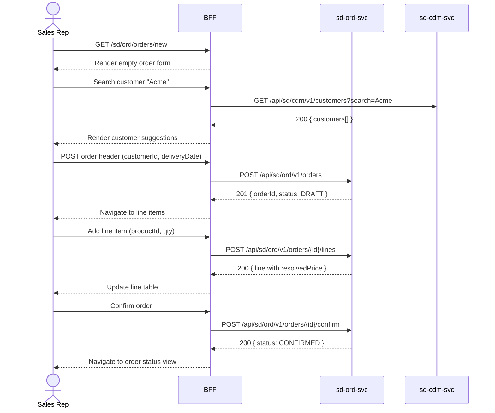

# F-SD-001-01 — Create Sales Order

> **Conceptual Stack Layer:** Domain-Feature
> **Space:** Business
> **Owner:** SD Product Team
> **Companion files:** `F-SD-001-01.uvl`, `F-SD-001-01.aui.yaml`
> **Referenced by:** Suite Feature Catalog SS6
> **References:** `domain-specs/sd_ord-spec.md` (backend)

> **Meta Information**
> - **Version:** 2026-04-04
> - **Template:** `feature-spec.md` v1.0.0
> - **Template Compliance:** 100%
> - **Status:** DRAFT
> - **Feature ID:** `F-SD-001-01`
> - **Suite:** `sd`
> - **Node type:** LEAF
> - **Parent:** `F-SD-001` — Order Management
> - **Companion UVL:** `F-SD-001-01.uvl`
> - **Companion AUI:** `F-SD-001-01.aui.yaml`

---

## ═══════════════════════════════════════════════
## PROBLEM SPACE
## ═══════════════════════════════════════════════

## 0. Feature Identity & Orientation

### 0.1 One-Line Summary
This feature lets a **sales representative** create a new sales order for a customer with product line items, pricing, and delivery scheduling.

### 0.2 Non-Goals
- Does not manage customer master data — that is sd.cdm / CRM suite.
- Does not plan or execute delivery — that is F-SD-002-01.
- Does not trigger billing — that is F-SD-003-01.
- Does not handle returns or credit notes — that is F-SD-003-03.

### 0.3 Entry & Exit Points

**Entry points:**
- Sales menu → "New Sales Order"
- Direct URL: `/sd/ord/orders/new`

**Exit points:**
- Order confirmed → navigate to F-SD-001-02 (Order Status Tracking) for the new order
- Cancel → return to Sales Order list

### 0.4 Variability Points

| Variability Point | Model | Values | Default | Binding Time |
|---|---|---|---|---|
| Credit check enabled | UVL attribute `Boolean credit_check_enabled` | true / false | true | deploy |
| Default payment terms | UVL attribute `String default_payment_terms` | NET30, NET60, COD | NET30 | deploy |

---

## 1. User Goal & Scenarios

### 1.1 User Goal
Capture a customer's demand by creating a sales order with correct line items, agreed pricing, and a feasible delivery date so that fulfilment can proceed.

### 1.2 Scenarios

| # | Scenario | Precondition | Action | Expected Outcome |
|---|----------|-------------|--------|-----------------|
| S1 | Create standard order | User authenticated as SALES_REP | Open new order form | Empty order form displayed with customer search |
| S2 | Add line items | Order header saved with customer | Search product and enter quantity | Line added with unit price resolved from pricing conditions |
| S3 | Apply pricing conditions | At least one line item exists | Select discount or promotion code | Line prices recalculated; order total updated |
| S4 | Check credit limit | Order ready to confirm; credit_check_enabled = true | Click Confirm | System verifies customer credit; block or warn if exceeded |
| S5 | Confirm order | Credit check passed (or disabled) | Click Confirm | Order status set to CONFIRMED; `sd.ord.sales-order.confirmed` event published |

---

## 2. User Journey & Screen Layout

### 2.1 Sequence Diagram



### 2.2 Screen Layout

```
┌─────────────────────────────────────────────────────┐
│ [← Orders]   New Sales Order                        │
├─────────────────────────────────────────────────────┤
│ Customer: [Search: _______________]                  │
│ Delivery Date: [Date picker]                         │
│ Payment Terms: [NET30 ▾]                             │
├─────────────────────────────────────────────────────┤
│ Line Items                           [+ Add Line]    │
│ ┌──────┬────────────┬───────┬────────┬────────────┐  │
│ │  #   │ Product    │  Qty  │ Price  │  Total     │  │
│ ├──────┼────────────┼───────┼────────┼────────────┤  │
│ │  1   │ Widget-A   │  10   │ 25.00  │  250.00    │  │
│ └──────┴────────────┴───────┴────────┴────────────┘  │
│ Order Total: 250.00 EUR                              │
├─────────────────────────────────────────────────────┤
│ [EXT: extension zone]                                │
├─────────────────────────────────────────────────────┤
│ [Cancel]                           [Confirm Order]   │
└─────────────────────────────────────────────────────┘
```

---

## 3. Interaction Requirements

### 3.1 Fields Table

| Field | Type | Required | Editable | Validation | i18n Key |
|---|---|---|---|---|---|
| Customer | search input | Yes | Yes | Must resolve to valid customer ID | `F-SD-001-01.field.customer` |
| Delivery Date | date picker | Yes | Yes | Must be future date (≥ today + 1) | `F-SD-001-01.field.deliveryDate` |
| Payment Terms | select | Yes | Yes | One of configured terms | `F-SD-001-01.field.paymentTerms` |
| Product (line) | search input | Yes | Yes | Must resolve to valid product | `F-SD-001-01.field.product` |
| Quantity (line) | number | Yes | Yes | Integer > 0, ≤ stock check | `F-SD-001-01.field.quantity` |

### 3.2 Actions Table

| Action | Trigger | Precondition | Effect |
|---|---|---|---|
| Add Line | Button click | Order header saved | Open line item row for input |
| Remove Line | Row delete icon | At least 1 remaining line | Remove line; recalculate total |
| Apply Pricing | Auto on line save | Line has productId + qty | Resolve price from pricing conditions |
| Confirm | Button click | ≥ 1 line; credit check passed | POST confirm; publish confirmed event |
| Cancel | Button click | — | Discard draft; navigate to list |

### 3.3 Validation Messages

| Field | Condition | Message |
|---|---|---|
| Customer | Not resolved | "Please select a valid customer." |
| Delivery Date | In the past | "Delivery date must be in the future." |
| Quantity | ≤ 0 | "Quantity must be at least 1." |
| Order | Credit limit exceeded | "Customer credit limit exceeded. Contact your sales manager." |

---

## 4. Edge Cases & Screen States

### 4.1 Component States

| State | When | Behaviour |
|---|---|---|
| **Loading** | Awaiting API response | Form skeleton with shimmer; buttons disabled |
| **Draft** | Order created, not confirmed | All fields editable; Confirm button enabled when valid |
| **Credit Blocked** | Credit check fails | Warning banner; Confirm disabled; escalation link shown |
| **Error** | sd-ord-svc unavailable | Inline error banner: "Order service unavailable. Retry." |

### 4.2 Specific Edge Cases

| Case | Behaviour | Affected users |
|---|---|---|
| No products found | Search returns empty | Show "No products found" message in dropdown |
| Duplicate order detection | ORD service returns 409 | Show warning: "A similar order already exists for this customer." |
| credit_check_enabled = false | Skip credit check step | Confirm proceeds immediately without S4 |

### 4.3 Attribute-Driven Behaviour Changes

| Attribute | Non-default value | Observable change |
|---|---|---|
| `credit_check_enabled` | false | Credit check step skipped; no credit warning shown |
| `default_payment_terms` | NET60 | Payment terms field pre-populated with NET60 |

### 4.4 Connectivity
This feature requires a live connection.
On network loss: top-of-page banner — "Sales order service is unavailable offline. Your draft has not been saved."

---

## ═══════════════════════════════════════════════
## SOLUTION SPACE
## ═══════════════════════════════════════════════

## 5. Backend Dependencies & BFF Contract

### 5.1 Service Calls

| # | Service | Endpoint | Tier | isMutation | Failure Mode |
|---|---------|----------|------|------------|-------------|
| 1 | sd-cdm-svc | `GET /api/sd/cdm/v1/customers` | T3 | No | Show error + retry |
| 2 | sd-ord-svc | `POST /api/sd/ord/v1/orders` | T3 | Yes | Show error banner |
| 3 | sd-ord-svc | `POST /api/sd/ord/v1/orders/{id}/lines` | T3 | Yes | Show error banner |
| 4 | sd-ord-svc | `POST /api/sd/ord/v1/orders/{id}/confirm` | T3 | Yes | Show error banner |

### 5.2 BFF View-Model Shape

```jsonc
{
  "order": {
    "orderId": "ord-uuid",
    "status": "DRAFT",
    "customerId": "cust-uuid",
    "customerName": "Acme Corp",
    "deliveryDate": "2026-05-01",
    "paymentTerms": "NET30",
    "lines": [
      {
        "lineId": "line-uuid",
        "productId": "prod-uuid",
        "productName": "Widget-A",
        "quantity": 10,
        "unitPrice": 25.00,
        "lineTotal": 250.00
      }
    ],
    "orderTotal": 250.00,
    "currency": "EUR"
  },
  "_meta": {
    "allowedActions": ["addLine", "confirm", "cancel"],
    "creditStatus": "OK"
  }
}
```

### 5.3 Feature-Gating Rules

| Mode | Behaviour |
|---|---|
| Full | All interactions available |
| Read-only | Form rendered read-only; Confirm and Add Line hidden |
| Excluded | Menu item hidden; direct URL returns 404 |

### 5.4 Failure Modes

| Failure | User Experience |
|---------|----------------|
| sd-ord-svc down | Error banner with retry; draft not saved |
| sd-cdm-svc down | Customer search shows error; user cannot proceed |
| Pricing service timeout | Price shown as 0.00 with warning; user may manually override |

### 5.5 Caching Hints
BFF SHOULD NOT cache order creation responses. Customer search MAY be cached for 2 minutes per session. Product price resolution MUST NOT be cached across sessions.

### 5.6 i18n Keys

| Key | Default (en) |
|-----|-------------|
| `F-SD-001-01.title` | `New Sales Order` |
| `F-SD-001-01.field.customer` | `Customer` |
| `F-SD-001-01.field.deliveryDate` | `Delivery Date` |
| `F-SD-001-01.field.paymentTerms` | `Payment Terms` |
| `F-SD-001-01.field.product` | `Product` |
| `F-SD-001-01.field.quantity` | `Quantity` |
| `F-SD-001-01.action.confirm` | `Confirm Order` |
| `F-SD-001-01.action.cancel` | `Cancel` |
| `F-SD-001-01.error.creditExceeded` | `Customer credit limit exceeded.` |
| `F-SD-001-01.error.unavailable` | `Order service unavailable.` |

---

## 6. AUI Screen Contract

See companion file `F-SD-001-01.aui.yaml`.

---

## ═══════════════════════════════════════════════
## BRIDGE ARTIFACTS
## ═══════════════════════════════════════════════

## 7. Permissions & Accessibility

### 7.1 Permission Matrix

| Action | SALES_REP | SALES_MANAGER | CUSTOMER_SERVICE | FINANCE_MANAGER |
|---|---|---|---|---|
| Open new order form | ✓ | ✓ | — | — |
| Add / remove lines | ✓ | ✓ | — | — |
| Confirm order | ✓ | ✓ | — | — |
| Override credit block | — | ✓ | — | — |

### 7.2 Accessibility
- Form MUST have logical tab order: customer → deliveryDate → paymentTerms → lines → Confirm.
- All inputs MUST have `aria-label` or associated `<label>`.
- Error messages MUST use `role="alert"` so screen readers announce them immediately.

---

## 8. Acceptance Criteria

| AC | Scenario | Given | When | Then |
|----|----------|-------|------|------|
| AC-01 | S1 | SALES_REP authenticated | Opens /sd/ord/orders/new | Empty order form displayed |
| AC-02 | S2 | Order header saved | User searches product and enters qty 10 | Line added with resolved unit price |
| AC-03 | S3 | Line item exists | User enters promotion code | Order total recalculated |
| AC-04 | S4 | credit_check_enabled = true | User clicks Confirm on over-limit order | Warning displayed; Confirm disabled |
| AC-05 | S5 | Credit check passed | User clicks Confirm | Status = CONFIRMED; event published; navigate to order status |
| AC-06 | Error | sd-ord-svc unavailable | User opens form | Error banner with retry button |

---

## 9. Variability & Extension

### 9.1 Feature Dependencies
Requires IAM authentication (cross-suite). Requires sd-cdm-svc for customer resolution.

### 9.2 Attributes
See §0.4 variability points. Binding times: `deploy`.

### 9.3 Extension Points
| Extension Zone | Interface | Default Behaviour |
|---|---|---|
| `ext.orderHeaderFields` | Additional header fields (e.g., project code) | Hidden (no extension) |
| `ext.orderLineFields` | Additional line fields (e.g., batch number) | Hidden (no extension) |

### 9.4 Companion UVL
See `uvl/leaves/F-SD-001-01.uvl`.

---

**END OF SPECIFICATION**
