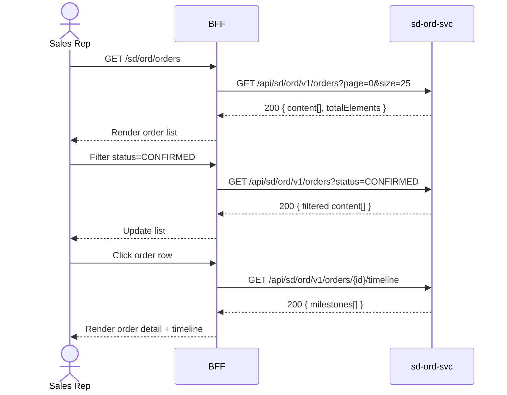

# F-SD-001-02 — Order Status Tracking

> **Conceptual Stack Layer:** Domain-Feature
> **Space:** Business
> **Owner:** SD Product Team
> **Companion files:** `F-SD-001-02.uvl`, `F-SD-001-02.aui.yaml`
> **Referenced by:** Suite Feature Catalog SS6
> **References:** `domain-specs/sd_ord-spec.md` (backend)

> **Meta Information**
> - **Version:** 2026-04-04
> - **Template:** `feature-spec.md` v1.0.0
> - **Template Compliance:** 100%
> - **Status:** DRAFT
> - **Feature ID:** `F-SD-001-02`
> - **Suite:** `sd`
> - **Node type:** LEAF
> - **Parent:** `F-SD-001` — Order Management
> - **Companion UVL:** `F-SD-001-02.uvl`
> - **Companion AUI:** `F-SD-001-02.aui.yaml`

---

## ═══════════════════════════════════════════════
## PROBLEM SPACE
## ═══════════════════════════════════════════════

## 0. Feature Identity & Orientation

### 0.1 One-Line Summary
This feature lets a **sales representative** monitor the fulfillment status of sales orders from creation to delivery.

### 0.2 Non-Goals
- Does not create or amend orders — that is F-SD-001-01 and F-SD-001-03.
- Does not manage delivery details — that is F-SD-002-01.
- Does not show invoice status — that is F-SD-003-02.

### 0.3 Entry & Exit Points

**Entry points:**
- Sales menu → "Order Status"
- Direct URL: `/sd/ord/orders`

**Exit points:**
- Select order → navigate to order detail / timeline view
- Action buttons → navigate to F-SD-001-03 (Order Amendment) if eligible

### 0.4 Variability Points

| Variability Point | Model | Values | Default | Binding Time |
|---|---|---|---|---|
| Default status filter | UVL attribute `String default_status_filter` | ALL, OPEN, CONFIRMED, DELIVERED | ALL | runtime |
| Export format | UVL attribute `String export_format` | CSV, XLSX, PDF | CSV | deploy |

---

## 1. User Goal & Scenarios

### 1.1 User Goal
Monitor the current status and timeline of sales orders so that customers can be informed of progress and exceptions can be escalated promptly.

### 1.2 Scenarios

| # | Scenario | Precondition | Action | Expected Outcome |
|---|----------|-------------|--------|-----------------|
| S1 | Browse orders | User authenticated | Open order list | Paginated list with order number, customer, status, delivery date |
| S2 | Filter by status | Order list displayed | Select status = CONFIRMED | Only confirmed orders shown |
| S3 | Filter by customer | Order list displayed | Type customer name in search | List filtered to matching customer's orders |
| S4 | View order timeline | Order list displayed | Click order row | Detail view with milestone timeline: Created → Confirmed → Picking → Shipped → Delivered |
| S5 | Export | Order list displayed | Click Export | Download order list in configured export format |

---

## 2. User Journey & Screen Layout

### 2.1 Sequence Diagram



### 2.2 Screen Layout

```
┌─────────────────────────────────────────────────────┐
│ Sales Orders                          [Export ▾]     │
├─────────────────────────────────────────────────────┤
│ [Customer: ___]  [Status: All ▾]  [Date: ____-____] │
├──────────┬──────────────┬────────────┬──────────────┤
│ Order #  │ Customer     │ Status     │ Delivery     │
├──────────┼──────────────┼────────────┼──────────────┤
│ ORD-0042 │ Acme Corp    │ CONFIRMED  │ 2026-05-01   │
│ ORD-0041 │ Globex Inc   │ SHIPPED    │ 2026-04-28   │
│ ...      │ ...          │ ...        │ ...          │
├──────────┴──────────────┴────────────┴──────────────┤
│ [EXT: extension zone]                                │
├─────────────────────────────────────────────────────┤
│ Showing 1-25 of 138     [← Prev] [1] [2] [Next →]  │
└─────────────────────────────────────────────────────┘
```

---

## 3. Interaction Requirements

### 3.1 Fields Table

| Field | Type | Required | Editable | Validation | i18n Key |
|---|---|---|---|---|---|
| Customer search | text input | No | Yes | Min 2 chars to trigger | `F-SD-001-02.filter.customer` |
| Status filter | select | No | Yes | ALL, DRAFT, CONFIRMED, PICKING, SHIPPED, DELIVERED, CANCELLED | `F-SD-001-02.filter.status` |
| Date range | date range picker | No | Yes | From ≤ To | `F-SD-001-02.filter.dateRange` |

### 3.2 Actions Table

| Action | Trigger | Precondition | Effect |
|---|---|---|---|
| Search | Keystroke (debounced 300ms) | ≥ 2 chars | Filter order list by customer name |
| Filter status | Select change | — | Filter order list |
| View detail | Row click | — | Navigate to order detail + timeline |
| Export | Button click | ≥ 1 result | Download in configured format |
| Page change | Pagination click | — | Load requested page |

### 3.3 Validation Messages

| Field | Condition | Message |
|---|---|---|
| Date range | From > To | "Start date must be before end date." |

---

## 4. Edge Cases & Screen States

### 4.1 Component States

| State | When | Behaviour |
|---|---|---|
| **Loading** | Awaiting API response | Table skeleton with shimmer rows |
| **Empty** | No orders match filter | "No orders found. Adjust your filters." |
| **Error** | sd-ord-svc unavailable | Inline error: "Order service unavailable. Retry." + retry button |
| **Populated** | Data ready | Render table normally |

### 4.2 Specific Edge Cases

| Case | Behaviour | Affected users |
|---|---|---|
| > 10 000 orders | Server-side pagination; no client-side loading | High-volume deployments |
| Cancelled order | Shown with CANCELLED badge (strikethrough row style) | All users |

### 4.3 Attribute-Driven Behaviour Changes

| Attribute | Non-default value | Observable change |
|---|---|---|
| `default_status_filter` | OPEN | List pre-filtered to open orders on first load |
| `export_format` | XLSX | Export button triggers XLSX download |

### 4.4 Connectivity
This feature requires a live connection.
On network loss: banner — "Order data is unavailable offline."

---

## ═══════════════════════════════════════════════
## SOLUTION SPACE
## ═══════════════════════════════════════════════

## 5. Backend Dependencies & BFF Contract

### 5.1 Service Calls

| # | Service | Endpoint | Tier | isMutation | Failure Mode |
|---|---------|----------|------|------------|-------------|
| 1 | sd-ord-svc | `GET /api/sd/ord/v1/orders` | T3 | No | Show error + retry |
| 2 | sd-ord-svc | `GET /api/sd/ord/v1/orders/{id}/timeline` | T3 | No | Show error + retry |

### 5.2 BFF View-Model Shape

```jsonc
{
  "orders": [
    {
      "orderId": "ord-uuid",
      "orderNumber": "ORD-0042",
      "customerId": "cust-uuid",
      "customerName": "Acme Corp",
      "status": "CONFIRMED",
      "deliveryDate": "2026-05-01",
      "orderTotal": 250.00,
      "currency": "EUR"
    }
  ],
  "pagination": {
    "page": 0,
    "size": 25,
    "totalElements": 138,
    "totalPages": 6
  }
}
```

### 5.3 Feature-Gating Rules

| Mode | Behaviour |
|---|---|
| Full | All interactions available |
| Read-only | Same as full (this is a read-only feature) |
| Excluded | Menu item hidden; direct URL returns 404 |

### 5.4 Failure Modes

| Failure | User Experience |
|---------|----------------|
| sd-ord-svc down | Error state with retry button |

### 5.5 Caching Hints
BFF MAY cache order list for 30 seconds. Cache MUST be invalidated on `sd.ord.sales-order.confirmed`, `sd.ord.sales-order.amended`, or `sd.ord.sales-order.cancelled` events.

### 5.6 i18n Keys

| Key | Default (en) |
|-----|-------------|
| `F-SD-001-02.title` | `Sales Orders` |
| `F-SD-001-02.filter.customer` | `Customer` |
| `F-SD-001-02.filter.status` | `Status` |
| `F-SD-001-02.filter.dateRange` | `Delivery Date` |
| `F-SD-001-02.empty` | `No orders found.` |
| `F-SD-001-02.error.unavailable` | `Order service unavailable.` |
| `F-SD-001-02.action.export` | `Export` |

---

## 6. AUI Screen Contract

See companion file `F-SD-001-02.aui.yaml`.

---

## ═══════════════════════════════════════════════
## BRIDGE ARTIFACTS
## ═══════════════════════════════════════════════

## 7. Permissions & Accessibility

### 7.1 Permission Matrix

| Action | SALES_REP | SALES_MANAGER | CUSTOMER_SERVICE | ANY_AUTHENTICATED |
|---|---|---|---|---|
| View order list | ✓ | ✓ | ✓ | — |
| View order timeline | ✓ | ✓ | ✓ | — |
| Export | ✓ | ✓ | ✓ | — |

### 7.2 Accessibility
- Table MUST have ARIA role `grid`.
- Status badges MUST use `aria-label` not just colour.
- Timeline milestones MUST be navigable by keyboard.

---

## 8. Acceptance Criteria

| AC | Scenario | Given | When | Then |
|----|----------|-------|------|------|
| AC-01 | S1 | SALES_REP authenticated | Opens /sd/ord/orders | Paginated order list displayed |
| AC-02 | S2 | Order list displayed | Selects status = CONFIRMED | Only CONFIRMED orders shown |
| AC-03 | S3 | Order list displayed | Types customer name | List filtered within 500ms |
| AC-04 | S4 | Order list displayed | Clicks order row | Timeline view rendered with milestones |
| AC-05 | S5 | ≥ 1 result | Clicks Export | File downloaded in configured format |
| AC-06 | Error | sd-ord-svc unavailable | Opens list | Error message with retry button |

---

## 9. Variability & Extension

### 9.1 Feature Dependencies
Requires IAM authentication (cross-suite). Required by F-SD-001-03 (Order Amendment).

### 9.2 Attributes
See §0.4 variability points. Binding times: `runtime`, `deploy`.

### 9.3 Extension Points
| Extension Zone | Interface | Default Behaviour |
|---|---|---|
| `ext.orderListColumns` | Additional columns in order list table | Hidden (no extension) |

### 9.4 Companion UVL
See `uvl/leaves/F-SD-001-02.uvl`.

---

**END OF SPECIFICATION**
