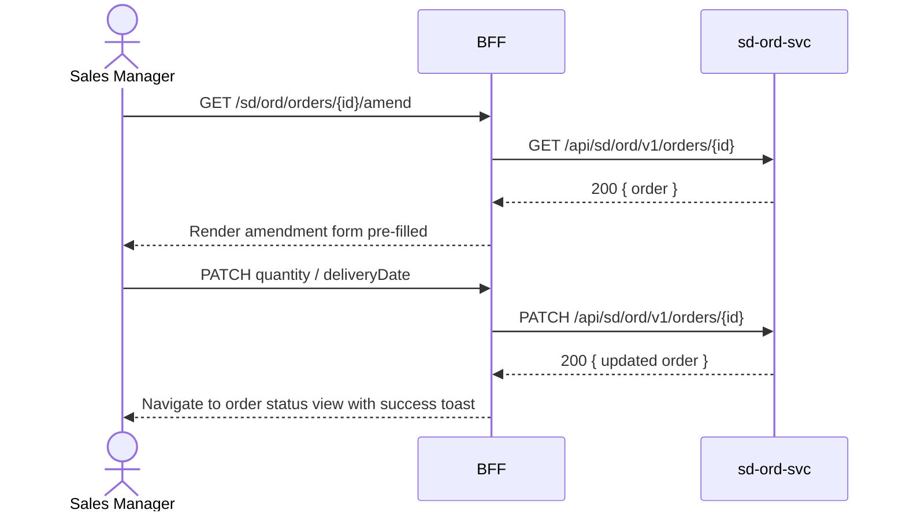

# F-SD-001-03 — Order Amendment

> **Conceptual Stack Layer:** Domain-Feature
> **Space:** Business
> **Owner:** SD Product Team
> **Companion files:** `F-SD-001-03.uvl`, `F-SD-001-03.aui.yaml`
> **Referenced by:** Suite Feature Catalog SS6
> **References:** `domain-specs/sd_ord-spec.md` (backend)

> **Meta Information**
> - **Version:** 2026-04-04
> - **Template:** `feature-spec.md` v1.0.0
> - **Template Compliance:** 100%
> - **Status:** DRAFT
> - **Feature ID:** `F-SD-001-03`
> - **Suite:** `sd`
> - **Node type:** LEAF
> - **Parent:** `F-SD-001` — Order Management
> - **Companion UVL:** `F-SD-001-03.uvl`
> - **Companion AUI:** `F-SD-001-03.aui.yaml`

---

## ═══════════════════════════════════════════════
## PROBLEM SPACE
## ═══════════════════════════════════════════════

## 0. Feature Identity & Orientation

### 0.1 One-Line Summary
This feature lets a **sales manager** amend a confirmed sales order (quantity, delivery date) within policy constraints.

### 0.2 Non-Goals
- Does not create new orders — that is F-SD-001-01.
- Does not cancel orders entirely — cancellation is a separate action in sd-ord-svc.
- Does not amend orders that are already shipped or delivered.
- Does not change the customer on an existing order.

### 0.3 Entry & Exit Points

**Entry points:**
- Order detail view → "Amend" button (visible when order status is CONFIRMED or PICKING)
- Direct URL: `/sd/ord/orders/{id}/amend`

**Exit points:**
- Amendment submitted → return to F-SD-001-02 (Order Status Tracking) showing updated order
- Cancel → return to order detail view without changes

### 0.4 Variability Points

| Variability Point | Model | Values | Default | Binding Time |
|---|---|---|---|---|
| Amendment reason required | UVL attribute `Boolean amendment_reason_required` | true / false | false | deploy |

---

## 1. User Goal & Scenarios

### 1.1 User Goal
Adjust a confirmed order's quantities or delivery date to reflect changed customer needs without cancelling and recreating the order.

### 1.2 Scenarios

| # | Scenario | Precondition | Action | Expected Outcome |
|---|----------|-------------|--------|-----------------|
| S1 | Amend quantity | Order in CONFIRMED status | Change line quantity from 10 to 15 | Line quantity updated; order total recalculated |
| S2 | Change delivery date | Order in CONFIRMED status | Select new delivery date | Delivery date updated; downstream delivery replanned |
| S3 | Add line item | Order in CONFIRMED status | Add new product line | New line added to order; total recalculated |
| S4 | Cancel line item | Order has ≥ 2 lines | Remove one line | Line removed; order total recalculated; min 1 line enforced |

---

## 2. User Journey & Screen Layout

### 2.1 Sequence Diagram



### 2.2 Screen Layout

```
┌─────────────────────────────────────────────────────┐
│ [← Order ORD-0042]   Amend Sales Order              │
├─────────────────────────────────────────────────────┤
│ Customer: Acme Corp (read-only)                      │
│ Delivery Date: [Date picker — current: 2026-05-01]  │
├─────────────────────────────────────────────────────┤
│ Line Items                           [+ Add Line]    │
│ ┌──────┬────────────┬────────┬────────┬───────────┐  │
│ │  #   │ Product    │  Qty   │ Price  │  [Remove] │  │
│ ├──────┼────────────┼────────┼────────┼───────────┤  │
│ │  1   │ Widget-A   │ [10]   │ 25.00  │ [x]       │  │
│ └──────┴────────────┴────────┴────────┴───────────┘  │
│ Reason: [_____________________] (if required)        │
├─────────────────────────────────────────────────────┤
│ [EXT: extension zone]                                │
├─────────────────────────────────────────────────────┤
│ [Cancel]                          [Submit Amendment] │
└─────────────────────────────────────────────────────┘
```

---

## 3. Interaction Requirements

### 3.1 Fields Table

| Field | Type | Required | Editable | Validation | i18n Key |
|---|---|---|---|---|---|
| Delivery Date | date picker | Yes | Yes | Must be ≥ today + 1 | `F-SD-001-03.field.deliveryDate` |
| Quantity (line) | number | Yes | Yes | Integer > 0 | `F-SD-001-03.field.quantity` |
| Amendment Reason | text area | Conditional | Yes | Required if amendment_reason_required = true | `F-SD-001-03.field.reason` |

### 3.2 Actions Table

| Action | Trigger | Precondition | Effect |
|---|---|---|---|
| Add Line | Button click | Order is amendable | Open line input row |
| Remove Line | Row remove icon | ≥ 2 lines remain | Remove line; recalculate total |
| Submit | Button click | Form valid; reason provided if required | PATCH order; navigate to status view |
| Cancel | Button click | — | Discard changes; navigate to order detail |

### 3.3 Validation Messages

| Field | Condition | Message |
|---|---|---|
| Delivery Date | In the past | "Delivery date must be in the future." |
| Quantity | ≤ 0 | "Quantity must be at least 1." |
| Lines | Attempt to remove last line | "An order must have at least one line item." |
| Reason | amendment_reason_required = true and empty | "Please provide a reason for this amendment." |

---

## 4. Edge Cases & Screen States

### 4.1 Component States

| State | When | Behaviour |
|---|---|---|
| **Loading** | Fetching current order | Form skeleton with shimmer |
| **Amendment Form** | Order loaded and amendable | Form pre-filled; Submit enabled when valid |
| **Non-amendable** | Order is SHIPPED or DELIVERED | Read-only banner: "This order cannot be amended." |
| **Error** | sd-ord-svc unavailable | Error banner with retry |

### 4.2 Specific Edge Cases

| Case | Behaviour | Affected users |
|---|---|---|
| Order in SHIPPED status | Amendment blocked; banner displayed | SALES_MANAGER |
| Concurrent amendment conflict | ORD returns 409; user shown "Order was modified by another user. Please refresh." | SALES_MANAGER |

### 4.3 Attribute-Driven Behaviour Changes

| Attribute | Non-default value | Observable change |
|---|---|---|
| `amendment_reason_required` | true | Reason text area shown as required field |

### 4.4 Connectivity
This feature requires a live connection.
On network loss: banner — "Amendment cannot be submitted offline."

---

## ═══════════════════════════════════════════════
## SOLUTION SPACE
## ═══════════════════════════════════════════════

## 5. Backend Dependencies & BFF Contract

### 5.1 Service Calls

| # | Service | Endpoint | Tier | isMutation | Failure Mode |
|---|---------|----------|------|------------|-------------|
| 1 | sd-ord-svc | `GET /api/sd/ord/v1/orders/{id}` | T3 | No | Show error + retry |
| 2 | sd-ord-svc | `PATCH /api/sd/ord/v1/orders/{id}` | T3 | Yes | Show error banner |

### 5.2 BFF View-Model Shape

```jsonc
{
  "order": {
    "orderId": "ord-uuid",
    "orderNumber": "ORD-0042",
    "status": "CONFIRMED",
    "customerId": "cust-uuid",
    "customerName": "Acme Corp",
    "deliveryDate": "2026-05-01",
    "lines": [
      { "lineId": "line-uuid", "productId": "prod-uuid", "productName": "Widget-A", "quantity": 10, "unitPrice": 25.00 }
    ]
  },
  "_meta": {
    "isAmendable": true,
    "allowedActions": ["addLine", "removeLine", "submit", "cancel"]
  }
}
```

### 5.3 Feature-Gating Rules

| Mode | Behaviour |
|---|---|
| Full | Amendment form available to SALES_MANAGER |
| Read-only | Form shown read-only; Submit hidden |
| Excluded | Menu item hidden; URL returns 404 |

### 5.4 Failure Modes

| Failure | User Experience |
|---------|----------------|
| sd-ord-svc down | Error banner; form disabled |
| 409 Conflict | "Order modified by another user. Please refresh." |

### 5.5 Caching Hints
BFF MUST NOT cache the amendment form. Order data for pre-fill SHOULD use a max-age of 10 seconds.

### 5.6 i18n Keys

| Key | Default (en) |
|-----|-------------|
| `F-SD-001-03.title` | `Amend Sales Order` |
| `F-SD-001-03.field.deliveryDate` | `Delivery Date` |
| `F-SD-001-03.field.quantity` | `Quantity` |
| `F-SD-001-03.field.reason` | `Amendment Reason` |
| `F-SD-001-03.action.submit` | `Submit Amendment` |
| `F-SD-001-03.action.cancel` | `Cancel` |
| `F-SD-001-03.error.nonAmendable` | `This order cannot be amended.` |

---

## 6. AUI Screen Contract

See companion file `F-SD-001-03.aui.yaml`.

---

## ═══════════════════════════════════════════════
## BRIDGE ARTIFACTS
## ═══════════════════════════════════════════════

## 7. Permissions & Accessibility

### 7.1 Permission Matrix

| Action | SALES_MANAGER | SALES_REP | CUSTOMER_SERVICE |
|---|---|---|---|
| Open amendment form | ✓ | — | — |
| Submit amendment | ✓ | — | — |
| View amendment history | ✓ | ✓ | ✓ |

### 7.2 Accessibility
- Form MUST preserve tab order: deliveryDate → lines → reason → Submit.
- Non-amendable banner MUST use `role="alert"`.
- Remove line button MUST have `aria-label="Remove line {productName}"`.

---

## 8. Acceptance Criteria

| AC | Scenario | Given | When | Then |
|----|----------|-------|------|------|
| AC-01 | S1 | SALES_MANAGER; order CONFIRMED | Changes qty to 15 and submits | Order total recalculated; PATCH called; success toast |
| AC-02 | S2 | Order CONFIRMED | Changes delivery date | New date saved; downstream notified |
| AC-03 | S3 | Order CONFIRMED | Adds new line | Line added; total updated |
| AC-04 | S4 | Order has 2 lines | Removes 1 line | Line removed; min-1 enforced on last line |
| AC-05 | Non-amendable | Order SHIPPED | SALES_MANAGER opens amendment | Non-amendable banner shown; form disabled |
| AC-06 | Role gate | SALES_REP | Attempts to open amendment URL | 403 / redirect |

---

## 9. Variability & Extension

### 9.1 Feature Dependencies
Requires IAM authentication (cross-suite). Requires F-SD-001-02 (Order Status Tracking) to be included.

### 9.2 Attributes
See §0.4 variability points. Binding time: `deploy`.

### 9.3 Extension Points
| Extension Zone | Interface | Default Behaviour |
|---|---|---|
| `ext.amendmentFields` | Additional amendment fields (e.g., internal reference) | Hidden (no extension) |

### 9.4 Companion UVL
See `uvl/leaves/F-SD-001-03.uvl`.

---

**END OF SPECIFICATION**
