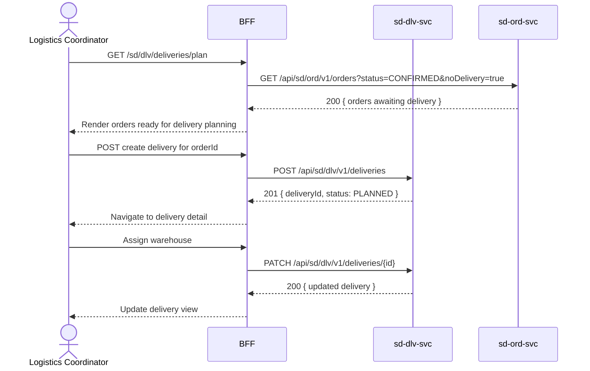

# F-SD-002-01 — Delivery Planning

> **Conceptual Stack Layer:** Domain-Feature
> **Space:** Business
> **Owner:** SD Product Team
> **Companion files:** `F-SD-002-01.uvl`, `F-SD-002-01.aui.yaml`
> **Referenced by:** Suite Feature Catalog SS6
> **References:** `domain-specs/sd_dlv-spec.md` (backend)

> **Meta Information**
> - **Version:** 2026-04-04
> - **Template:** `feature-spec.md` v1.0.0
> - **Template Compliance:** 100%
> - **Status:** DRAFT
> - **Feature ID:** `F-SD-002-01`
> - **Suite:** `sd`
> - **Node type:** LEAF
> - **Parent:** `F-SD-002` — Shipping & Delivery
> - **Companion UVL:** `F-SD-002-01.uvl`
> - **Companion AUI:** `F-SD-002-01.aui.yaml`

---

## ═══════════════════════════════════════════════
## PROBLEM SPACE
## ═══════════════════════════════════════════════

## 0. Feature Identity & Orientation

### 0.1 One-Line Summary
This feature lets a **logistics coordinator** create and manage outbound deliveries for confirmed sales orders.

### 0.2 Non-Goals
- Does not execute shipments or assign carriers — that is F-SD-002-02.
- Does not manage warehouse pick tasks — that is the WM suite.
- Does not trigger billing — that is F-SD-003-01.

### 0.3 Entry & Exit Points

**Entry points:**
- Logistics menu → "Delivery Planning"
- Direct URL: `/sd/dlv/deliveries/plan`

**Exit points:**
- Delivery created → navigate to F-SD-002-02 (Shipment Execution) for that delivery
- Back to logistics dashboard

### 0.4 Variability Points

| Variability Point | Model | Values | Default | Binding Time |
|---|---|---|---|---|
| Auto-create delivery on order confirm | UVL attribute `Boolean auto_create_delivery` | true / false | false | deploy |
| Max lines per delivery | UVL attribute `Integer max_delivery_lines` | 1–999 | 100 | deploy |

---

## 1. User Goal & Scenarios

### 1.1 User Goal
Convert confirmed sales orders into planned delivery documents so that warehouse picking and carrier assignment can proceed.

### 1.2 Scenarios

| # | Scenario | Precondition | Action | Expected Outcome |
|---|----------|-------------|--------|-----------------|
| S1 | Create delivery from order | Order is CONFIRMED | Select order and click "Create Delivery" | Delivery document created with all order lines |
| S2 | Split delivery | Order has > max_delivery_lines or ships from multiple warehouses | Click "Split" on delivery | Original delivery split into 2 delivery documents |
| S3 | Assign warehouse | Delivery is in PLANNED status | Select warehouse from dropdown | Warehouse assigned; picking can be initiated |
| S4 | Schedule pick date | Delivery has warehouse assigned | Set pick date | Pick date recorded; WM notified via event |

---

## 2. User Journey & Screen Layout

### 2.1 Sequence Diagram



### 2.2 Screen Layout

```
┌─────────────────────────────────────────────────────┐
│ Delivery Planning                    [Create ▾]      │
├─────────────────────────────────────────────────────┤
│ Orders Awaiting Delivery                             │
│ ┌──────────┬──────────────┬────────┬──────────────┐  │
│ │ Order #  │ Customer     │ Lines  │ Del. Date    │  │
│ ├──────────┼──────────────┼────────┼──────────────┤  │
│ │ ORD-0042 │ Acme Corp    │ 3      │ 2026-05-01   │ [Create Delivery] │
│ └──────────┴──────────────┴────────┴──────────────┘  │
├─────────────────────────────────────────────────────┤
│ Planned Deliveries                                   │
│ ┌──────────┬──────────────┬────────────┬──────────┐  │
│ │ Del. #   │ Customer     │ Status     │ Warehouse│  │
│ ├──────────┼──────────────┼────────────┼──────────┤  │
│ │ DEL-0021 │ Globex Inc   │ PLANNED    │ WH-01    │  │
│ └──────────┴──────────────┴────────────┴──────────┘  │
└─────────────────────────────────────────────────────┘
```

---

## 3. Interaction Requirements

### 3.1 Fields Table

| Field | Type | Required | Editable | Validation | i18n Key |
|---|---|---|---|---|---|
| Warehouse | select | Yes | Yes | Must be active warehouse | `F-SD-002-01.field.warehouse` |
| Pick Date | date picker | Yes | Yes | Must be ≥ today | `F-SD-002-01.field.pickDate` |
| Split reason | text input | No | Yes | Free text if splitting | `F-SD-002-01.field.splitReason` |

### 3.2 Actions Table

| Action | Trigger | Precondition | Effect |
|---|---|---|---|
| Create Delivery | Button click | Order is CONFIRMED | POST delivery from order |
| Split Delivery | Button click | Delivery is PLANNED, > 1 line | Split into 2 deliveries |
| Assign Warehouse | Select change | Delivery is PLANNED | PATCH delivery with warehouseId |
| Set Pick Date | Date picker change | Warehouse assigned | PATCH delivery with pickDate |

### 3.3 Validation Messages

| Field | Condition | Message |
|---|---|---|
| Warehouse | Not selected on submission | "Please assign a warehouse." |
| Pick Date | In the past | "Pick date must be today or in the future." |

---

## 4. Edge Cases & Screen States

### 4.1 Component States

| State | When | Behaviour |
|---|---|---|
| **Loading** | Awaiting API | Skeleton rows |
| **Empty** | No orders awaiting delivery | "No orders are currently awaiting delivery planning." |
| **Error** | sd-dlv-svc unavailable | Error banner with retry |

### 4.2 Specific Edge Cases

| Case | Behaviour | Affected users |
|---|---|---|
| auto_create_delivery = true | Delivery created automatically on order confirm; planning screen shows only PLANNED deliveries needing warehouse assignment | LOGISTICS_COORDINATOR |
| Order line count > max_delivery_lines | System suggests split at creation time | LOGISTICS_COORDINATOR |

### 4.3 Attribute-Driven Behaviour Changes

| Attribute | Non-default value | Observable change |
|---|---|---|
| `auto_create_delivery` | true | "Orders Awaiting Delivery" panel hidden; deliveries appear directly in PLANNED state |
| `max_delivery_lines` | 50 | Split suggestion triggers at 50 lines |

### 4.4 Connectivity
This feature requires a live connection.

---

## ═══════════════════════════════════════════════
## SOLUTION SPACE
## ═══════════════════════════════════════════════

## 5. Backend Dependencies & BFF Contract

### 5.1 Service Calls

| # | Service | Endpoint | Tier | isMutation | Failure Mode |
|---|---------|----------|------|------------|-------------|
| 1 | sd-ord-svc | `GET /api/sd/ord/v1/orders?status=CONFIRMED` | T3 | No | Show error + retry |
| 2 | sd-dlv-svc | `POST /api/sd/dlv/v1/deliveries` | T3 | Yes | Show error banner |
| 3 | sd-dlv-svc | `PATCH /api/sd/dlv/v1/deliveries/{id}` | T3 | Yes | Show error banner |
| 4 | sd-dlv-svc | `POST /api/sd/dlv/v1/deliveries/{id}/split` | T3 | Yes | Show error banner |

### 5.2 BFF View-Model Shape

```jsonc
{
  "pendingOrders": [
    { "orderId": "ord-uuid", "orderNumber": "ORD-0042", "customerName": "Acme Corp", "lineCount": 3, "deliveryDate": "2026-05-01" }
  ],
  "plannedDeliveries": [
    { "deliveryId": "del-uuid", "deliveryNumber": "DEL-0021", "customerName": "Globex Inc", "status": "PLANNED", "warehouseId": "wh-01" }
  ]
}
```

### 5.3 Feature-Gating Rules

| Mode | Behaviour |
|---|---|
| Full | All planning actions available |
| Read-only | Lists shown; Create / Split / Assign disabled |
| Excluded | Menu item hidden; URL returns 404 |

### 5.4 Failure Modes

| Failure | User Experience |
|---------|----------------|
| sd-dlv-svc down | Error banner; create button disabled |

### 5.5 Caching Hints
BFF MAY cache pending orders list for 60 seconds. Cache MUST be invalidated on `sd.ord.sales-order.confirmed`.

### 5.6 i18n Keys

| Key | Default (en) |
|-----|-------------|
| `F-SD-002-01.title` | `Delivery Planning` |
| `F-SD-002-01.field.warehouse` | `Warehouse` |
| `F-SD-002-01.field.pickDate` | `Pick Date` |
| `F-SD-002-01.action.createDelivery` | `Create Delivery` |
| `F-SD-002-01.action.split` | `Split Delivery` |
| `F-SD-002-01.empty` | `No orders awaiting delivery planning.` |

---

## 6. AUI Screen Contract

See companion file `F-SD-002-01.aui.yaml`.

---

## ═══════════════════════════════════════════════
## BRIDGE ARTIFACTS
## ═══════════════════════════════════════════════

## 7. Permissions & Accessibility

### 7.1 Permission Matrix

| Action | LOGISTICS_COORDINATOR | WAREHOUSE_MANAGER | SALES_MANAGER |
|---|---|---|---|
| View pending orders | ✓ | ✓ | ✓ |
| Create delivery | ✓ | ✓ | — |
| Assign warehouse | ✓ | ✓ | — |
| Split delivery | ✓ | ✓ | — |

### 7.2 Accessibility
- Action buttons MUST have descriptive `aria-label` including order/delivery reference.
- Split dialog MUST trap focus.

---

## 8. Acceptance Criteria

| AC | Scenario | Given | When | Then |
|----|----------|-------|------|------|
| AC-01 | S1 | Order ORD-0042 CONFIRMED | LC clicks Create Delivery | DEL-xxxx created in PLANNED status |
| AC-02 | S2 | Delivery has 120 lines (max=100) | LC clicks Split | Two deliveries created; lines distributed |
| AC-03 | S3 | Delivery PLANNED | LC assigns warehouse WH-01 | Warehouse recorded; event published |
| AC-04 | S4 | Warehouse assigned | LC sets pick date | Pick date saved; WM notified |
| AC-05 | auto_create_delivery=true | Order confirmed | — | Delivery auto-created without LC action |

---

## 9. Variability & Extension

### 9.1 Feature Dependencies
Requires IAM authentication. Requires F-SD-001 (Order Management). Required by F-SD-002-02.

### 9.2 Attributes
See §0.4 variability points. Binding time: `deploy`.

### 9.3 Extension Points
| Extension Zone | Interface | Default Behaviour |
|---|---|---|
| `ext.deliveryPlanningActions` | Additional delivery actions | Hidden (no extension) |

### 9.4 Companion UVL
See `uvl/leaves/F-SD-002-01.uvl`.

---

**END OF SPECIFICATION**
