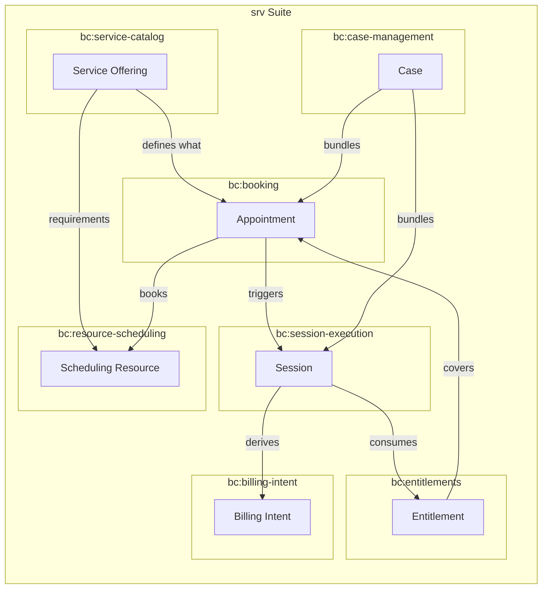
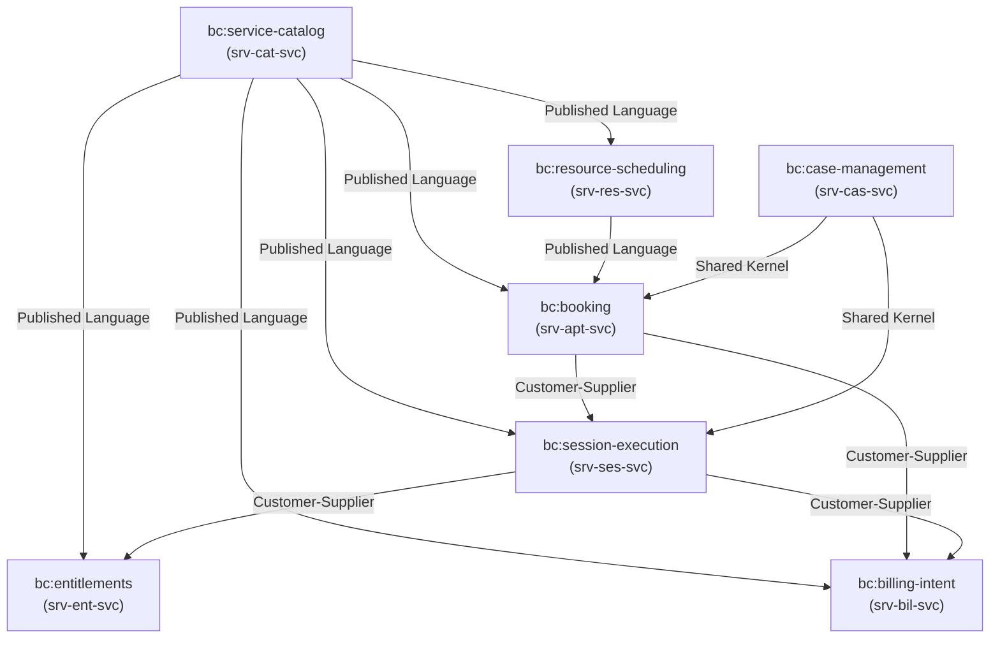
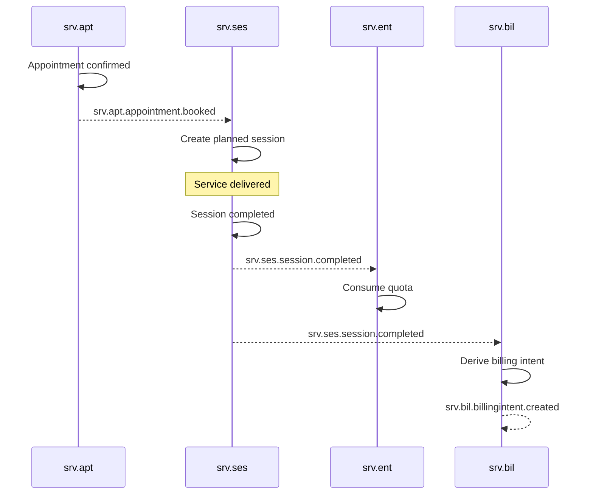
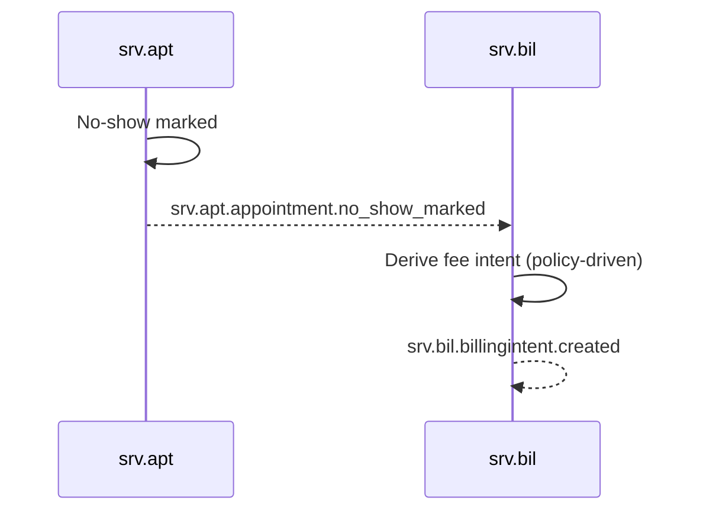
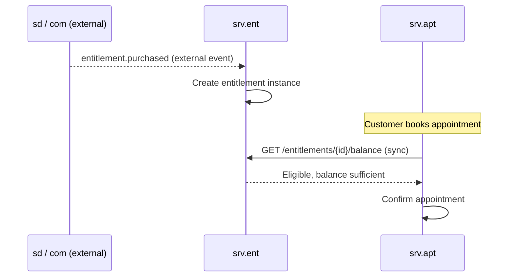

# Service Delivery (SRV) Suite Specification

> **Conceptual Stack Layer:** Suite
> **Space:** Platform
> **Owner:** Domain Engineering Team
> **Schema alignment:** `suite-layer.schema.json`
> **Companion files:** `srv.catalog.uvl` (referenced in SS6)
> **Contains:** Domain/Service Specs, Platform-Feature Specs, Feature Catalog

> **Meta Information**
> - **Version:** 2026-04-02
> - **Template:** `suite-spec.md` v1.0.0
> - **Template Compliance:** ~98% — canonical layout applied
> - **Author(s):** OpenLeap Architecture Team
> - **Status:** DRAFT
> - **Suite ID:** `srv`
> - **Suite Name:** Service Delivery
> - **Description:** Operational execution layer for appointment-driven, time-/resource-based service delivery — comparable to MES in manufacturing, but for services.
> - **Semantic Version:** `1.1.0`
> - **Team:**
>   - Name: `team-srv`
>   - Email: `srv-team@openleap.io`
>   - Slack: `#srv-team`
> - **Bounded Contexts:** `bc:service-catalog`, `bc:booking`, `bc:resource-scheduling`, `bc:session-execution`, `bc:case-management`, `bc:entitlements`, `bc:billing-intent`

---

## Specification Guidelines

> **This specification MUST comply with the OpenLeap specification guidelines.**
>
> ### Non-Negotiables
> - Never invent facts. If required info is missing, add an **OPEN QUESTION** entry.
> - Preserve intent and decisions. Only change meaning when explicitly requested.
> - Keep the spec **self-contained**: no "see chat", no implicit context.
>
> ### Style Guide
> - Prefer short sentences and lists.
> - Use MUST/SHOULD/MAY for normative statements.
> - Keep terminology consistent with the Ubiquitous Language defined in SS1.
> - Avoid ambiguous words ("often", "maybe") unless explicitly noting uncertainty.

---

## 0. Suite Identity & Purpose

### 0.1 Suite Identity

| Field | Value |
|-------|-------|
| id | `srv` |
| name | Service Delivery |
| description | Operational execution layer for appointment-driven, time-/resource-based service delivery. |
| version | `1.1.0` |
| status | `draft` |
| owner.team | `team-srv` |
| owner.email | `srv-team@openleap.io` |
| owner.slack | `#srv-team` |
| boundedContexts | `bc:service-catalog`, `bc:booking`, `bc:resource-scheduling`, `bc:session-execution`, `bc:case-management`, `bc:entitlements`, `bc:billing-intent` |

### 0.2 Business Purpose

SRV delivers the **operational execution of services** as a "system of execution" — comparable to `pps.mes` in manufacturing, but **time-/appointment- and case-based**. It models the operational reality of service providers such as driving schools, music schools, practices/clinics, consulting firms, or other appointment-driven service businesses. Time is the scarce resource; resources are people and places; deliverables are sessions and cases; billing follows or parallels delivery. SRV is neither "sales" nor "accounting" — SRV is the execution layer for services.

### 0.3 In Scope

- Service offering catalog: define deliverable service types with operational parameters (duration, buffers, prerequisites, qualification hints)
- Appointment and booking lifecycle: slot discovery, reservation, confirmation, rescheduling, cancellation, waitlist, no-show handling
- Resource scheduling: scheduling view of people, rooms, and optionally assets for appointment/service assignment
- Session execution: capture delivered service facts (start, progress, completion, outcome, proof-of-service artifacts)
- Case management: bundle multiple sessions/appointments into longitudinal business cases (treatment plans, training plans, consulting mandates)
- Entitlement management: manage customer entitlements such as punch cards, course quotas, subscription periods, treatment series
- Billing intent generation: derive auditable billable positions from sessions/cases/entitlements and hand them to downstream commercial/financial processing

### 0.4 Out of Scope

- Legally binding accounting, open items, journals (-> `fi` suite)
- Commercial order/contract management (B2B/B2C order-to-cash) (-> `sd` suite)
- Checkout/promotions/channel-specific commerce logic (-> `com` suite)
- Labor-law time accounts, payroll, employment "system of record" (-> `hr` suite)
- Building/space management (facility lifecycle) (-> `fac` suite)
- Enterprise-wide shared master data (customers/suppliers) (-> `shared.bp` / T2)
- Enterprise-wide calendar/working-time rules (-> `shared.cal` / T2)
- Full project planning/WBS/budgeting (-> `ps` suite)
- Regulated industry record models (e.g., medical records) (-> candidate industry suite, e.g. `med`)

### 0.5 Target Users

| Role | Interest |
|------|----------|
| Service Provider (Trainer/Doctor/Consultant) | Deliver sessions, see upcoming schedule, record outcomes |
| Back Office Scheduler | Manage bookings, resolve conflicts, manage waitlists, maintain offerings |
| Customer (via Portal) | Find slots, book/reschedule/cancel appointments, view history |
| Service Admin | Maintain service catalog, manage entitlements, configure policies |
| Finance/Billing Clerk | Reconcile billing intents, verify proof-of-service, trigger invoicing |

### 0.6 Business Value

- Reduces no-shows and scheduling conflicts through automated slot management and conflict detection
- Enables scalable booking across customer portals and back-office channels
- Provides end-to-end traceability from appointment through execution to billing
- Standardizes service type definitions across booking, execution, entitlement, and billing
- Supports diverse service industries (driving schools, clinics, consulting, education) through a configurable catalog and entitlement model

---

## 1. Ubiquitous Language

### 1.1 Glossary

| ID | Term | Aliases | Definition |
|----|------|---------|------------|
| srv:glossary:service-offering | Service Offering | Leistungsangebot, Service Type | A deliverable service type defined in the catalog with a stable identity, lifecycle, operational parameters (duration, buffers), and prerequisite metadata. |
| srv:glossary:appointment | Appointment | Termin, Booking | A time-bound commitment for a specific service offering, linking a customer to a resource at a specific time. |
| srv:glossary:slot | Slot | Zeitfenster, Time Slot | A time window that can host an appointment, derived from resource availability and calendar rules. |
| srv:glossary:reservation | Reservation | Hold, Vormerkung | A short-lived temporary lock on a slot to prevent race conditions during the booking process. |
| srv:glossary:scheduling-resource | Scheduling Resource | Ressource | A scheduling-optimized abstraction of a person, room, or asset used for availability queries and assignment. |
| srv:glossary:availability | Availability | Verfügbarkeit | A time-based capacity window of a scheduling resource during which it can be assigned to appointments. |
| srv:glossary:session | Session | Sitzung, Termin-Durchführung | A recorded business fact representing the execution and completion of a service, including outcome and proof artifacts. |
| srv:glossary:proof-artifact | Proof Artifact | Nachweis, Beleg | A document, signature, or checklist attached to a session to prove service delivery (stored via `t1.dms`). |
| srv:glossary:case | Case | Fall, Vorgang | A longitudinal business container bundling multiple appointments/sessions into a coherent narrative (treatment case, training plan, consulting mandate). |
| srv:glossary:entitlement | Entitlement | Anspruch, Kontingent | A customer-specific right to consume services over time — quotas, subscriptions, treatment series. |
| srv:glossary:billing-intent | Billing Intent | Abrechnungsimpuls, Billable Position | An auditable, traceable billable position derived from service delivery facts, handed to downstream `sd`/`fi` for invoicing. |
| srv:glossary:no-show | No-Show | Nichterscheinen | A booked appointment where the customer did not attend, potentially triggering a fee intent. |
| srv:glossary:waitlist | Waitlist | Warteliste | A queue of booking requests that can be promoted when capacity becomes available. |
| srv:glossary:offering-variant | Offering Variant | Variante | A standardized alternative of a service offering (e.g., 30/45/60 min duration). |
| srv:glossary:requirement | Requirement | Voraussetzung | A prerequisite or constraint on a service offering (required skill, entitlement prerequisite, required room type). |

### 1.2 UBL Boundary Test

**SRV vs. SD:**
SRV uses "Appointment" to mean a time-bound execution commitment for a service. SD uses "Sales Order" for the same business relationship, meaning a commercial contract with pricing, terms, and conditions. An appointment is an operational scheduling fact; a sales order is a commercial commitment. This confirms SRV and SD are separate suites.

**SRV vs. HR:**
SRV uses "Scheduling Resource" to mean a scheduling-optimized view of a person for availability queries. HR uses "Employee" to mean a person with an employment contract, labor-law time accounts, and payroll data. A scheduling resource is a booking projection; an employee is a legal entity. This confirms SRV and HR are separate suites.

**SRV vs. FI:**
SRV uses "Billing Intent" to mean a pre-invoice billable position derived from delivered service facts. FI uses "Invoice" to mean a legally binding financial document with postings, open items, and tax calculations. A billing intent is an execution-side proof; an invoice is a financial artifact. This confirms SRV and FI are separate suites.

---

## 2. Domain Model

### 2.1 Conceptual Overview



### 2.2 Core Concepts

| Concept | Owner (Service) | Description | Glossary Ref |
|---------|----------------|-------------|-------------|
| Service Offering | `srv-cat-svc` | Deliverable service type with operational parameters and lifecycle | `srv:glossary:service-offering` |
| Offering Variant | `srv-cat-svc` | Duration/buffer alternative of a service offering | `srv:glossary:offering-variant` |
| Requirement | `srv-cat-svc` | Prerequisite/constraint on a service offering | `srv:glossary:requirement` |
| Appointment | `srv-apt-svc` | Time-bound booking commitment | `srv:glossary:appointment` |
| Reservation | `srv-apt-svc` | Temporary hold on a slot | `srv:glossary:reservation` |
| Scheduling Resource | `srv-res-svc` | Scheduling-optimized resource abstraction | `srv:glossary:scheduling-resource` |
| Availability Window | `srv-res-svc` | Time-based capacity of a resource | `srv:glossary:availability` |
| Session | `srv-ses-svc` | Recorded service execution fact | `srv:glossary:session` |
| Proof Artifact | `srv-ses-svc` | Document/signature proving delivery | `srv:glossary:proof-artifact` |
| Case | `srv-cas-svc` | Longitudinal business container for sessions | `srv:glossary:case` |
| Entitlement | `srv-ent-svc` | Customer right to consume services | `srv:glossary:entitlement` |
| Billing Intent | `srv-bil-svc` | Auditable billable position from delivery facts | `srv:glossary:billing-intent` |

### 2.3 Shared Kernel

| Concept | Owner | Shared With | Mechanism | Type Definition |
|---------|-------|-------------|-----------|----------------|
| Service Offering ID | `srv-cat-svc` | `srv-apt-svc`, `srv-res-svc`, `srv-ses-svc`, `srv-ent-svc`, `srv-bil-svc` | Event-driven cache + sync lookup | `UUID serviceOfferingId` |
| Appointment ID | `srv-apt-svc` | `srv-ses-svc`, `srv-cas-svc` | Event-driven propagation | `UUID appointmentId` |
| Session ID | `srv-ses-svc` | `srv-cas-svc`, `srv-bil-svc`, `srv-ent-svc` | Event-driven propagation | `UUID sessionId` |
| Case ID | `srv-cas-svc` | `srv-apt-svc`, `srv-ses-svc`, `srv-bil-svc` | Optional reference by ID | `UUID caseId` |
| Entitlement ID | `srv-ent-svc` | `srv-apt-svc`, `srv-ses-svc` | Sync lookup for eligibility | `UUID entitlementId` |

### 2.4 Bounded Context Map



**DDD Patterns Used:**
- **Published Language:** `srv.cat` provides the canonical offering definition consumed by all other SRV domains.
- **Customer-Supplier:** `srv.apt` (upstream) supplies planned context to `srv.ses` (downstream). `srv.ses` supplies facts to `srv.bil` and `srv.ent`.
- **Shared Kernel:** `srv.cas` shares case identity with `srv.apt` and `srv.ses` for cross-session linking.

---

## 3. Service Landscape

### 3.1 Service Catalog

| Service ID | Domain | Bounded Context | Status | Spec Reference |
|-----------|--------|-----------------|--------|---------------|
| `srv-cat-svc` | `cat` | `bc:service-catalog` | DRAFT | `domain-specs/srv_cat-spec.md` |
| `srv-apt-svc` | `apt` | `bc:booking` | DRAFT | `domain-specs/srv_apt-spec.md` |
| `srv-res-svc` | `res` | `bc:resource-scheduling` | DRAFT | `domain-specs/srv_res-spec.md` |
| `srv-ses-svc` | `ses` | `bc:session-execution` | DRAFT | `domain-specs/srv_ses-spec.md` |
| `srv-cas-svc` | `cas` | `bc:case-management` | DRAFT | `domain-specs/srv_cas-spec.md` |
| `srv-ent-svc` | `ent` | `bc:entitlements` | DRAFT | `domain-specs/srv_ent-spec.md` |
| `srv-bil-svc` | `bil` | `bc:billing-intent` | DRAFT | `domain-specs/srv_bil-spec.md` |

### 3.2 Service Responsibilities

| Service | Responsibilities |
|---------|-----------------|
| `srv-cat-svc` | Own service offering definitions, lifecycle, operational parameters, prerequisite metadata; publish catalog events |
| `srv-apt-svc` | Own appointment lifecycle and booking commitments; slot discovery; conflict checks; waitlist; no-show marking |
| `srv-res-svc` | Maintain scheduling resource views; expose availability and conflict-check APIs; sync from HR/FAC |
| `srv-ses-svc` | Own session execution facts; record start/stop/outcome; manage proof-of-service artifacts |
| `srv-cas-svc` | Own case lifecycle and case-to-session/appointment linkage; provide longitudinal history |
| `srv-ent-svc` | Own entitlement instances and quota management; validate eligibility; consume/reverse quotas |
| `srv-bil-svc` | Derive billing intents from sessions/cases/entitlements; support corrections/reversals; publish invoicing-ready events |

---

## 4. Integration Patterns

### 4.1 Integration Pattern Decision

| Property | Value |
|----------|-------|
| **Primary Pattern** | Event-Driven (Choreography) |
| **Rationale** | SRV domains react to facts independently (appointment booked → session planned; session completed → entitlement consumed, billing intent created). No centralized orchestrator is needed for the standard flows. |

**Supplementary Sync APIs:** `srv.apt` calls `srv.res` synchronously for availability/conflict checks during slot discovery. `srv.apt` and `srv.ses` call `srv.ent` synchronously for eligibility checks.

### 4.2 Intra-Suite Event Flows

#### Flow 1: Book Appointment → Execute Session → Bill



#### Flow 2: No-Show → Fee Intent



#### Flow 3: Entitlement Purchase → Booking Eligibility



---

## 5. Event Conventions

### 5.1 Routing Key Pattern

**Pattern:** `srv.{domain}.{aggregate}.{action}`

| Segment | Description | Examples |
|---------|-------------|---------|
| `srv` | Always `srv` | `srv` |
| `{domain}` | Domain short code | `cat`, `apt`, `res`, `ses`, `cas`, `ent`, `bil` |
| `{aggregate}` | Aggregate root name (lowercase) | `service`, `appointment`, `resource`, `session`, `case`, `entitlement`, `billingintent` |
| `{action}` | Past-tense verb | `created`, `updated`, `booked`, `completed`, `cancelled`, `no_show_marked` |

### 5.2 Payload Envelope

```json
{
  "eventId": "uuid",
  "eventType": "srv.{domain}.{aggregate}.{action}",
  "timestamp": "ISO-8601",
  "tenantId": "string",
  "correlationId": "uuid",
  "causationId": "uuid",
  "producer": "srv-{domain}-svc",
  "schemaVersion": "{major}.{minor}.{patch}",
  "payload": { }
}
```

### 5.3 Versioning Strategy

| Field | Value |
|-------|-------|
| **Strategy** | Schema evolution with backward compatibility |
| **Description** | New optional fields are additive. Removing fields requires a new major version with parallel publishing during migration. |

### 5.4 Event Catalog

| Routing Key | Producer | Consumer(s) | Description |
|------------|----------|-------------|-------------|
| `srv.cat.service.created` | `srv-cat-svc` | `srv-apt-svc`, `srv-res-svc` | New service offering created |
| `srv.cat.service.updated` | `srv-cat-svc` | `srv-apt-svc`, `srv-res-svc` | Offering attributes changed |
| `srv.cat.service.activated` | `srv-cat-svc` | `srv-apt-svc`, `srv-ent-svc` | Offering became bookable |
| `srv.cat.service.retired` | `srv-cat-svc` | `srv-apt-svc`, `srv-ent-svc` | Offering removed from booking |
| `srv.apt.appointment.offered` | `srv-apt-svc` | — | Appointment proposed |
| `srv.apt.appointment.reserved` | `srv-apt-svc` | — | Slot reserved/held |
| `srv.apt.appointment.booked` | `srv-apt-svc` | `srv-ses-svc`, `srv-cas-svc` | Appointment confirmed |
| `srv.apt.appointment.rescheduled` | `srv-apt-svc` | `srv-ses-svc`, `srv-cas-svc` | Appointment moved to new time |
| `srv.apt.appointment.cancelled` | `srv-apt-svc` | `srv-ses-svc`, `srv-ent-svc`, `srv-bil-svc` | Appointment cancelled |
| `srv.apt.appointment.no_show_marked` | `srv-apt-svc` | `srv-ses-svc`, `srv-bil-svc` | Customer did not attend |
| `srv.res.resource.created` | `srv-res-svc` | — | Scheduling resource registered |
| `srv.res.resource.updated` | `srv-res-svc` | — | Resource attributes changed |
| `srv.res.availability.changed` | `srv-res-svc` | `srv-apt-svc` | Availability window modified |
| `srv.res.assignment.confirmed` | `srv-res-svc` | `srv-ses-svc` | Resource assigned to appointment |
| `srv.ses.session.planned` | `srv-ses-svc` | `srv-cas-svc` | Session record created from appointment |
| `srv.ses.session.started` | `srv-ses-svc` | — | Session execution began |
| `srv.ses.session.completed` | `srv-ses-svc` | `srv-ent-svc`, `srv-bil-svc`, `srv-cas-svc` | Session delivered and closed |
| `srv.ses.session.cancelled` | `srv-ses-svc` | `srv-ent-svc`, `srv-bil-svc` | Session cancelled |
| `srv.ses.session.no_show_recorded` | `srv-ses-svc` | `srv-bil-svc` | No-show recorded at session level |
| `srv.cas.case.created` | `srv-cas-svc` | — | New case opened |
| `srv.cas.case.updated` | `srv-cas-svc` | — | Case attributes changed |
| `srv.cas.case.closed` | `srv-cas-svc` | `srv-bil-svc` | Case closed |
| `srv.cas.case.session_linked` | `srv-cas-svc` | — | Session linked to case |
| `srv.ent.entitlement.created` | `srv-ent-svc` | `srv-apt-svc` | New entitlement instance created |
| `srv.ent.entitlement.activated` | `srv-ent-svc` | `srv-apt-svc` | Entitlement became usable |
| `srv.ent.entitlement.expired` | `srv-ent-svc` | `srv-apt-svc`, `srv-bil-svc` | Entitlement validity ended |
| `srv.ent.quota.reserved` | `srv-ent-svc` | — | Quota reserved at booking time |
| `srv.ent.quota.consumed` | `srv-ent-svc` | — | Quota consumed after session |
| `srv.ent.quota.reversed` | `srv-ent-svc` | — | Quota reversed after cancellation |
| `srv.bil.billingintent.created` | `srv-bil-svc` | `sd`, `fi` (external) | Billable position created |
| `srv.bil.billingintent.reversed` | `srv-bil-svc` | `sd`, `fi` (external) | Billing intent reversed |
| `srv.bil.billingintent.corrected` | `srv-bil-svc` | `sd`, `fi` (external) | Billing intent corrected |
| `srv.bil.billingintent.ready_for_invoicing` | `srv-bil-svc` | `sd`, `fi` (external) | Intent ready for downstream invoicing |

---

## 6. Feature Catalog

### 6.1 Feature Tree

```
SRV Suite
├── F-SRV-001  Service Catalog Management        [COMPOSITION] [mandatory]
│   ├── F-SRV-001-01  Offering CRUD               [LEAF]        [mandatory]
│   ├── F-SRV-001-02  Offering Lifecycle           [LEAF]        [mandatory]
│   └── F-SRV-001-03  Variant & Requirement Mgmt   [LEAF]        [optional]
├── F-SRV-002  Appointment & Booking              [COMPOSITION] [mandatory]
│   ├── F-SRV-002-01  Slot Discovery               [LEAF]        [mandatory]
│   ├── F-SRV-002-02  Booking Lifecycle            [LEAF]        [mandatory]
│   ├── F-SRV-002-03  Waitlist Management          [LEAF]        [optional]
│   └── F-SRV-002-04  No-Show Handling             [LEAF]        [optional]
├── F-SRV-003  Resource Scheduling                [COMPOSITION] [mandatory]
│   ├── F-SRV-003-01  Resource Management          [LEAF]        [mandatory]
│   ├── F-SRV-003-02  Availability Management      [LEAF]        [mandatory]
│   └── F-SRV-003-03  Conflict Detection           [LEAF]        [mandatory]
├── F-SRV-004  Session Execution                  [COMPOSITION] [mandatory]
│   ├── F-SRV-004-01  Session Lifecycle            [LEAF]        [mandatory]
│   ├── F-SRV-004-02  Outcome Recording            [LEAF]        [mandatory]
│   └── F-SRV-004-03  Proof-of-Service             [LEAF]        [optional]
├── F-SRV-005  Case Management                    [COMPOSITION] [optional]
│   ├── F-SRV-005-01  Case Lifecycle               [LEAF]        [mandatory]
│   └── F-SRV-005-02  Session Linking              [LEAF]        [mandatory]
├── F-SRV-006  Entitlements                       [COMPOSITION] [optional]
│   ├── F-SRV-006-01  Entitlement Management       [LEAF]        [mandatory]
│   ├── F-SRV-006-02  Eligibility Check            [LEAF]        [mandatory]
│   └── F-SRV-006-03  Quota Consumption            [LEAF]        [mandatory]
└── F-SRV-007  Billing Intent                     [COMPOSITION] [mandatory]
    ├── F-SRV-007-01  Intent Derivation            [LEAF]        [mandatory]
    ├── F-SRV-007-02  Correction & Reversal        [LEAF]        [mandatory]
    └── F-SRV-007-03  Reconciliation View          [LEAF]        [optional]
```

### 6.2 Mandatory Features

| Feature ID | Name | Rationale |
|-----------|------|-----------|
| `F-SRV-001` | Service Catalog Management | All SRV domains depend on offering definitions |
| `F-SRV-002` | Appointment & Booking | Core booking lifecycle is required for any service delivery |
| `F-SRV-003` | Resource Scheduling | Availability and conflict detection are prerequisites for booking |
| `F-SRV-004` | Session Execution | Capturing delivered service facts is the core purpose of SRV |
| `F-SRV-007` | Billing Intent | Billing bridge is required to monetize delivered services |

### 6.3 Cross-Suite Feature Dependencies

| This Suite Feature | Requires | From Suite | Reason |
|-------------------|----------|-----------|--------|
| `F-SRV-002` | Calendar/working-time rules | `shared.cal` (T2) | Slot discovery depends on calendar constraints |
| `F-SRV-003` | Employee master data | `hr` | Resource scheduling references employee identities |
| `F-SRV-003` | Room/location master data | `fac` | Resource scheduling optionally references rooms |
| `F-SRV-004` | Document management | `t1.dms` | Proof-of-service artifacts stored in DMS |
| `F-SRV-007` | Commercial/financial processing | `sd` and/or `fi` | Billing intents consumed by downstream invoicing |
| `F-SRV-002` | Business partner data | `shared.bp` (T2) | Appointments reference customer party IDs |

### 6.4 Feature Register

| Feature ID | Name | Status | Spec Reference |
|-----------|------|--------|---------------|
| `F-SRV-001-01` | Offering CRUD | `draft` | `features/F-SRV-001-01/feature-spec.md` |
| `F-SRV-001-02` | Offering Lifecycle | `draft` | `features/F-SRV-001-02/feature-spec.md` |
| `F-SRV-001-03` | Variant & Requirement Mgmt | `draft` | `features/F-SRV-001-03/feature-spec.md` |
| `F-SRV-002-01` | Slot Discovery | `draft` | `features/F-SRV-002-01/feature-spec.md` |
| `F-SRV-002-02` | Booking Lifecycle | `draft` | `features/F-SRV-002-02/feature-spec.md` |
| `F-SRV-002-03` | Waitlist Management | `draft` | `features/F-SRV-002-03/feature-spec.md` |
| `F-SRV-002-04` | No-Show Handling | `draft` | `features/F-SRV-002-04/feature-spec.md` |
| `F-SRV-003-01` | Resource Management | `draft` | `features/F-SRV-003-01/feature-spec.md` |
| `F-SRV-003-02` | Availability Management | `draft` | `features/F-SRV-003-02/feature-spec.md` |
| `F-SRV-003-03` | Conflict Detection | `draft` | `features/F-SRV-003-03/feature-spec.md` |
| `F-SRV-004-01` | Session Lifecycle | `draft` | `features/F-SRV-004-01/feature-spec.md` |
| `F-SRV-004-02` | Outcome Recording | `draft` | `features/F-SRV-004-02/feature-spec.md` |
| `F-SRV-004-03` | Proof-of-Service | `draft` | `features/F-SRV-004-03/feature-spec.md` |
| `F-SRV-005-01` | Case Lifecycle | `draft` | `features/F-SRV-005-01/feature-spec.md` |
| `F-SRV-005-02` | Session Linking | `draft` | `features/F-SRV-005-02/feature-spec.md` |
| `F-SRV-006-01` | Entitlement Management | `draft` | `features/F-SRV-006-01/feature-spec.md` |
| `F-SRV-006-02` | Eligibility Check | `draft` | `features/F-SRV-006-02/feature-spec.md` |
| `F-SRV-006-03` | Quota Consumption | `draft` | `features/F-SRV-006-03/feature-spec.md` |
| `F-SRV-007-01` | Intent Derivation | `draft` | `features/F-SRV-007-01/feature-spec.md` |
| `F-SRV-007-02` | Correction & Reversal | `draft` | `features/F-SRV-007-02/feature-spec.md` |
| `F-SRV-007-03` | Reconciliation View | `draft` | `features/F-SRV-007-03/feature-spec.md` |

### 6.5 Variability Summary

| Metric | Value |
|--------|-------|
| Total composition nodes | 7 |
| Total leaf features | 21 |
| Mandatory features | 5 (composition) / 14 (leaf) |
| Optional features | 2 (composition) / 7 (leaf) |
| Cross-suite `requires` | 6 |
| Attributes (total across leaves) | OPEN QUESTION |
| Binding times used | `deploy`, `runtime` |

---

## 7. Cross-Cutting Concerns

### 7.1 Compliance

| Regulation | Requirement | Implementation |
|-----------|-------------|----------------|
| GDPR | Appointments and sessions reference customer PII via party IDs | PII is stored in `shared.bp`; SRV stores only references. Deletion/anonymization MUST be supported via event-driven cleanup. |
| DSGVO (German) | Right to erasure for customer data | Anonymization of appointment/session/case records when customer requests deletion |
| Industry-specific | Regulated industries (healthcare, education) may require additional record-keeping | Extension point for industry-specific compliance modules (candidate for separate suite) |

### 7.2 Security

| Aspect | Approach |
|--------|---------|
| **Authentication** | OAuth2 / OIDC via T1 iam-svc |
| **Authorization** | RBAC via T1 iam-svc; roles defined per domain service (see individual specs) |
| **Data Classification** | Confidential — appointments and sessions reference customer identities (PII by association) |

### 7.3 Multi-Tenancy

| Aspect | Value |
|--------|-------|
| **Model** | `shared_schema` |
| **Isolation** | Row-Level Security via `tenant_id` on all tables |
| **Tenant ID Propagation** | JWT claim `tenant_id` → propagated in event envelope and `X-Tenant-ID` header |

**Rules:**
- All queries MUST include `tenant_id` filter
- Cross-tenant data access is forbidden at the API level
- All tables MUST include `tenant_id` column with RLS policy

### 7.4 Audit

**Audit Requirements:**
- All state changes on aggregates MUST be audit-logged
- Audit log entries MUST include: who, when, what, old value, new value
- Booking decisions MUST be logged with policy evaluation outcomes (without leaking PII)

**Retention Policies:**

| Entity / Data Class | Retention Period | Legal Basis | Action After Expiry |
|--------------------|-----------------|-------------|-------------------|
| Appointment Records | 10 years | Business records retention (HGB §257) | `archive` |
| Session/Execution Records | 10 years | Business records retention (HGB §257) | `archive` |
| Billing Intents | 10 years | Tax/commercial law | `archive` |
| Audit Log | 90 days | Internal policy | `delete` |
| Waitlist Entries | 1 year | GDPR minimization | `anonymize` |

---

## 8. External Interfaces

### 8.1 Cross-Suite Dependencies (Upstream — SRV consumes)

| External Suite | Service | Integration Type | Data Consumed | Criticality |
|---------------|---------|------------------|--------------|-------------|
| `shared` (T2) | `shared-bp-svc` | sync_api | Customer/party IDs, names | high |
| `shared` (T2) | `shared-cal-svc` | sync_api | Working-time calendars, holiday rules | high |
| `hr` | `hr-*-svc` | async_event | Employee/skill references | medium |
| `fac` | `fac-*-svc` | async_event | Room/location references | low |
| `sd` / `com` | various | async_event | Entitlement purchase/contract triggers | medium |

### 8.2 Cross-Suite Dependencies (Downstream — SRV publishes to)

| External Suite | Service | Integration Type | Data Published | Purpose |
|---------------|---------|------------------|---------------|---------|
| `sd` | `sd-*-svc` | async_event | Billing intents | Commercial order/contract enrichment |
| `fi` | `fi-*-svc` | async_event | Billing intents | Invoice/posting generation |
| `com` | `com-*-svc` | async_event | Appointment lifecycle events | Portal/channel updates |
| `t1` | `t1-dms-svc` | sync_api | Proof-of-service documents | Document storage |

### 8.3 External Context Mapping

| External Suite | DDD Pattern | Translation Notes |
|---------------|-------------|-------------------|
| `shared.bp` | Conformist | SRV conforms to BP party ID model |
| `shared.cal` | Conformist | SRV conforms to calendar rule model |
| `hr` | Anti-Corruption Layer | SRV translates employee to scheduling resource |
| `fac` | Anti-Corruption Layer | SRV translates room/location to scheduling resource |
| `sd` / `fi` | Published Language | Billing intent is the published contract |

---

## 9. Architecture Decisions

### ADR-SRV-001: SRV Owns Execution, Not Commerce

**Status:** Accepted

**Context:** Overlap between SRV (service execution) and SD (commercial order-to-cash) needed a clear boundary.

**Decision:** SRV owns appointment/session/case/billing-intent. SD owns commercial order/contract/pricing. Billing intents flow from SRV to SD/FI as the handoff point.

**Consequences:**
- **Positive:** Clear separation of concerns; SRV can evolve independently of pricing logic.
- **Negative:** Billing intent → invoice mapping requires integration work per deployment.

### ADR-SRV-002: Event-Driven Choreography as Primary Integration Pattern

**Status:** Accepted

**Context:** SRV domains need to coordinate (appointment → session → billing) without tight coupling.

**Decision:** Use event-driven choreography for standard flows. Sync APIs only for availability/eligibility queries where latency matters.

**Consequences:**
- **Positive:** Loose coupling; domains can evolve independently.
- **Negative:** Eventual consistency; debugging cross-domain flows requires correlation IDs.

### ADR-SRV-003: Scheduling Resource Is a Projection, Not a Master

**Status:** Accepted

**Context:** Should SRV duplicate HR/FAC master data for resources?

**Decision:** `srv.res` maintains a scheduling-optimized projection. Authoritative masters remain in HR (people) and FAC (rooms). Sync via events.

**Consequences:**
- **Positive:** No data duplication of employment or facility lifecycle.
- **Negative:** Eventual consistency between HR/FAC and scheduling view.

---

## 10. Roadmap

| Phase | Timeframe | Items |
|-------|-----------|-------|
| Phase 1: Foundation | Q2 2026 | `srv.cat` (catalog), `srv.apt` (booking), `srv.res` (resources), `srv.ses` (sessions), `srv.bil` (billing intent) — MVP feature set |
| Phase 2: Extended Capabilities | Q3 2026 | `srv.cas` (case management), `srv.ent` (entitlements), waitlist, no-show policies |
| Phase 3: Industry Extensions | Q4 2026 | Industry-specific session data models, approval workflows for billing, advanced scheduling (group sessions, recurring series) |

---

## 11. Appendix

### 11.1 Change Log

| Date | Version | Author | Changes |
|------|---------|--------|---------|
| 2026-01-18 | 1.0.0 | OpenLeap Architecture Team | Initial suite specification |
| 2026-04-02 | 1.1.0 | OpenLeap Architecture Team | Full template compliance: added SS0 identity table, SS1 UBL glossary, SS2 domain model with context map, SS3 service landscape, SS4 integration patterns, SS5 event conventions with full catalog, SS6 feature catalog, SS7 cross-cutting concerns, SS8 external interfaces, SS9 ADRs, SS10 roadmap |

### 11.2 Review & Approval

**Status:** DRAFT

**Reviewers:**

| Role | Name | Date | Status |
|------|------|------|--------|
| Suite Architect | {Name} | YYYY-MM-DD | [ ] Reviewed |
| Domain Lead (cat) | {Name} | YYYY-MM-DD | [ ] Reviewed |
| Domain Lead (apt) | {Name} | YYYY-MM-DD | [ ] Reviewed |
| Domain Lead (ses) | {Name} | YYYY-MM-DD | [ ] Reviewed |
| Product Owner | {Name} | YYYY-MM-DD | [ ] Reviewed |

**Approval:**

| Role | Name | Date | Approved |
|------|------|------|----------|
| Suite Architect | {Name} | YYYY-MM-DD | [ ] |
| Engineering Manager | {Name} | YYYY-MM-DD | [ ] |
