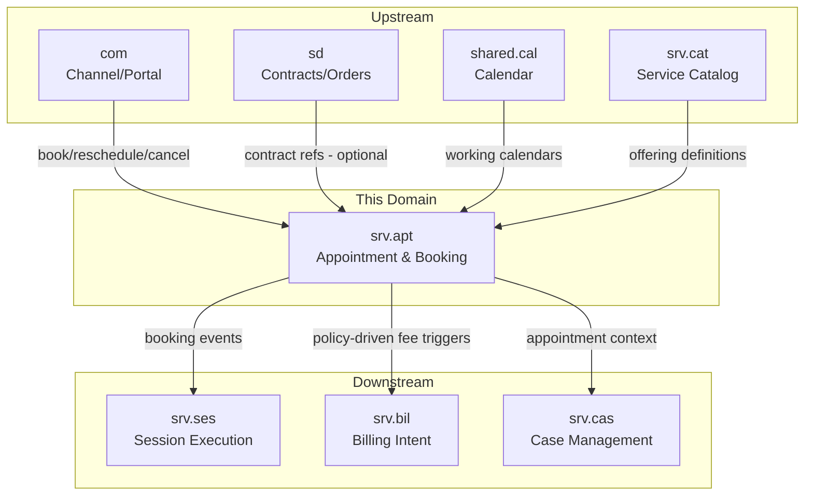
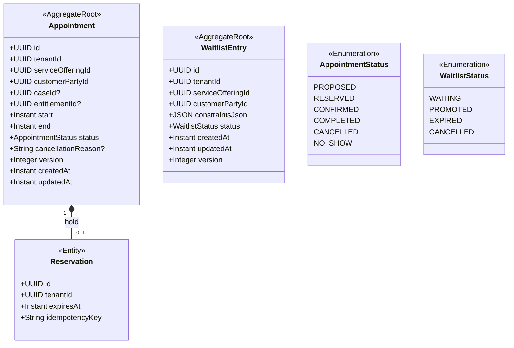
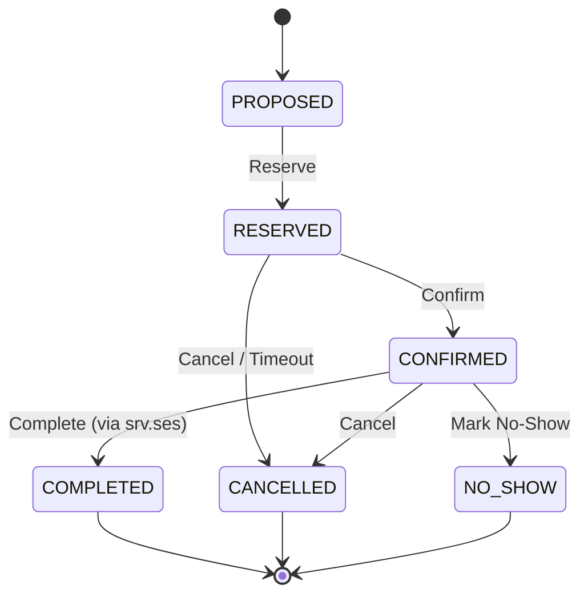
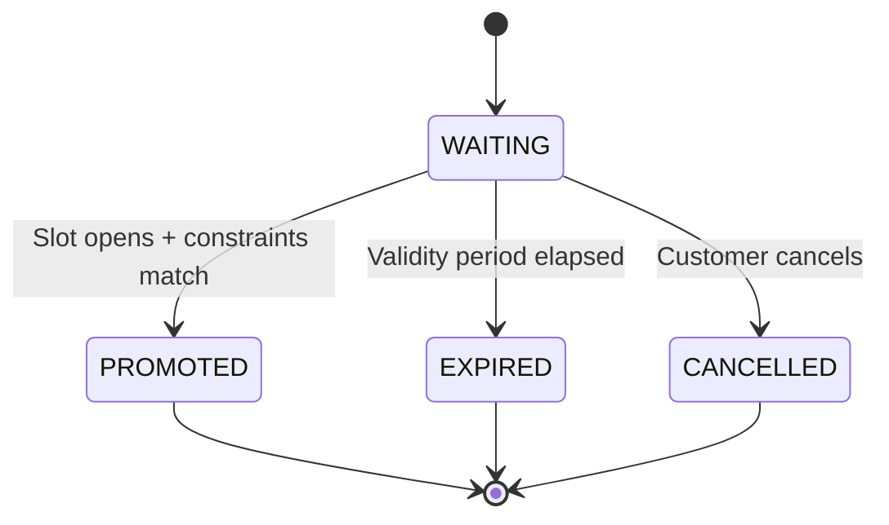
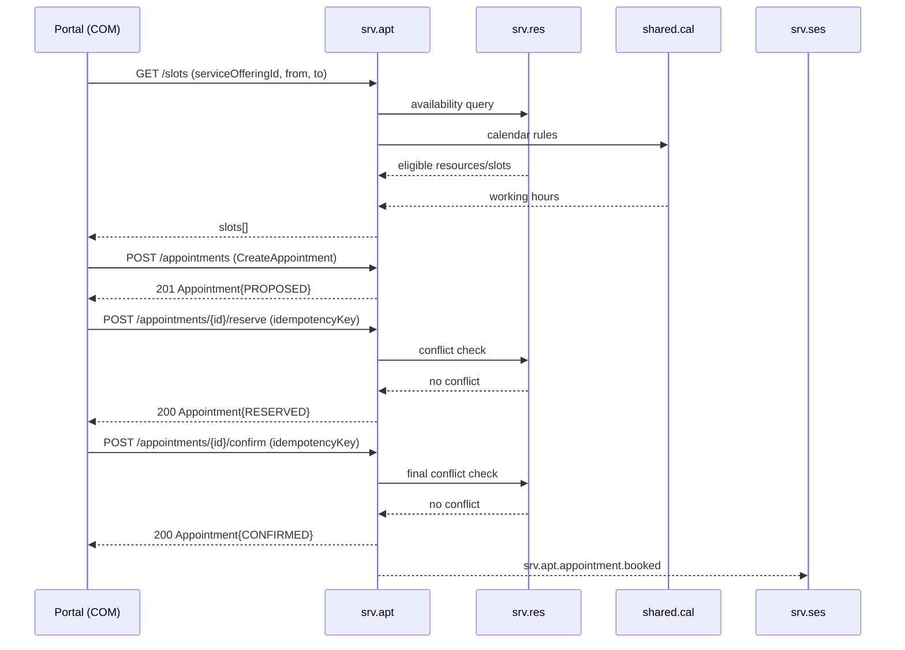
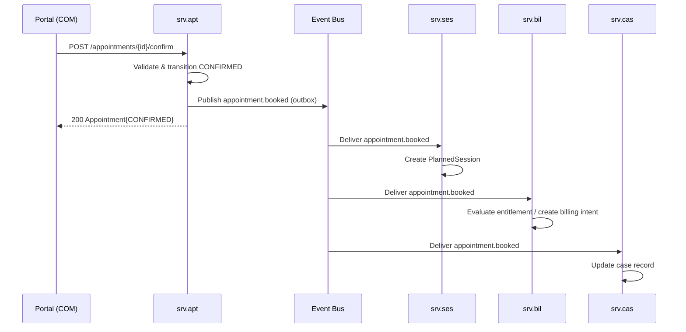
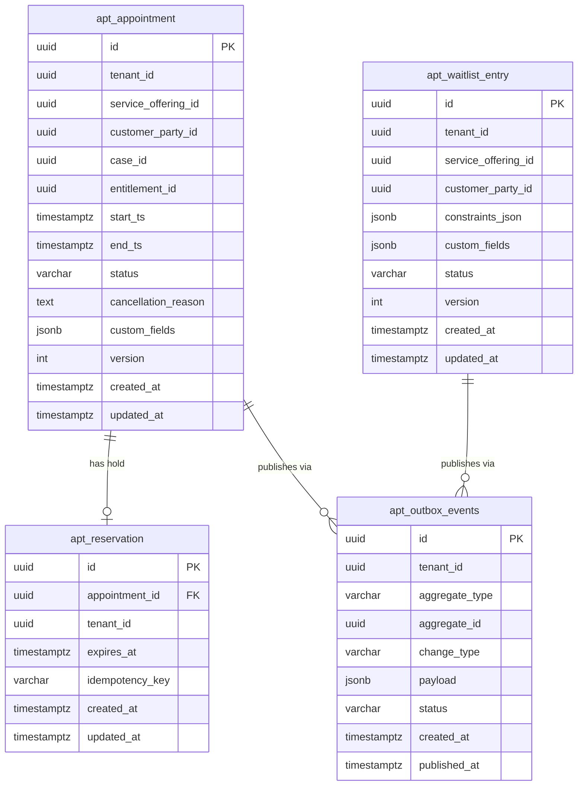

# Appointment & Booking — `srv.apt` Domain / Service Specification

> **Conceptual Stack Layer:** Domain / Service
> **Space:** Platform
> **Owner:** Domain Engineering Team
> **Schema alignment:** `service-layer.schema.json`
> **Companion files:** `openapi.yaml`, `*.schema.json` (event contracts)
> **Referenced by:** Platform-Feature Spec SS5 (backend dependencies), BFF Contract
> **Belongs to:** SRV Suite Spec (`_srv_suite.md`)

> **Meta Information**
> - **Version:** 2026-04-03
> - **Template:** `domain-service-spec.md` v1.0.0
> - **Template Compliance:** ~95% — Port/Repository OPEN QUESTION
> - **Author(s):** OpenLeap Architecture Team
> - **Status:** DRAFT
> - **Suite:** `srv`
> - **Domain:** `apt`
> - **Bounded Context Ref:** `bc:booking`
> - **Service ID:** `srv-apt-svc`
> - **basePackage:** `io.openleap.srv.apt`
> - **API Base Path:** `/api/srv/apt/v1`
> - **OpenLeap Starter Version:** `v1`
> - **Port:** OPEN QUESTION (see Q-APT-005)
> - **Repository:** OPEN QUESTION (see Q-APT-006)
> - **Tags:** `appointment`, `booking`, `scheduling`, `srv`
> - **Team:**
>   - Name: `team-srv`
>   - Email: `srv-team@openleap.io`
>   - Slack: `#srv-team`

---

## Specification Guidelines Compliance

> ### Non-Negotiables
> - Never invent facts. If required info is missing, add an **OPEN QUESTION** entry.
> - Preserve intent and decisions. Only change meaning when explicitly requested.
> - Do not remove normative constraints unless they are explicitly replaced.
> - Keep the spec **self-contained**: no "see chat", no implicit context.
>
> ### Source of Truth Priority
> When sources conflict:
> 1. Spec (explicit) wins
> 2. Starter specs (implementation constraints) next
> 3. Guidelines (best practices) last
>
> Record conflicts in the **Decisions & Conflicts** section (see Section 14).
>
> ### Style Guide
> - Prefer short sentences and lists.
> - Use MUST/SHOULD/MAY for normative statements.
> - Keep terminology consistent (Aggregate, Domain Service, Application Service, Command, Event).
> - Avoid ambiguous words ("often", "maybe") unless explicitly noting uncertainty.
> - Keep examples minimal and clearly marked as examples.
> - Do not add implementation code unless the chapter explicitly requires it.

---

## 0. Document Purpose & Scope

### 0.1 Purpose
`srv.apt` specifies the **booking lifecycle** for appointment-driven services: slot discovery, reservation/confirmation, rescheduling/cancellation, waitlists, and no-show handling.

### 0.2 Target Audience
- Product Owners & Business Stakeholders
- System Architects & Technical Leads
- Integration Engineers

### 0.3 Scope

**In Scope:**
- MUST manage appointment entities and their lifecycle states.
- MUST provide slot discovery/search capabilities respecting calendars and constraints.
- MUST enforce conflict checks to prevent double-booking/overbooking.
- MUST provide reservation/confirmation semantics with idempotency support.
- MUST integrate calendar rules from `shared.cal`.
- MUST query `srv.res` for availability/conflict checks.
- SHOULD support waitlist handling and auto-promotion (optional, deployment-dependent).
- SHOULD emit booking lifecycle events for downstream domains (`srv.ses`, `srv.bil`) and external channels (`com`).
- SHOULD enforce booking policies (cut-offs, cancellation windows) as configurable rules.

**Out of Scope:**
- MUST NOT own employment contracts and labor-law rules (-> `hr`).
- MUST NOT own facility lifecycle (-> `fac`; SRV only books usage).
- MUST NOT implement checkout/promotions (-> `com`).
- MUST NOT implement invoicing/postings/open items (-> `fi`).
- MUST NOT own resource master (only references via `srv.res`).
- MUST NOT decide pricing (only may trigger billing intent creation events).

### 0.4 Related Documents
- `_srv_suite.md` - SRV Suite Architecture
- `srv_cat-spec.md`, `srv_res-spec.md`, `srv_ses-spec.md`, `srv_ent-spec.md`, `srv_bil-spec.md`, `srv_cas-spec.md`
- `SYSTEM_OVERVIEW.md`, `TECHNICAL_STANDARDS.md`, `EVENT_STANDARDS.md`

---

## 1. Business Context

### 1.1 Domain Purpose
Turn a service intent ("I want this service") into a **time-bound commitment** ("this appointment is booked") while respecting capacity calendars and resource constraints.

### 1.2 Business Value
- Reduces no-shows and scheduling conflicts.
- Enables scalable booking across portals/back office.
- Provides deterministic idempotent booking flow for reliable integrations.

### 1.3 Key Stakeholders

| Role | Responsibility | Primary Use Cases |
|------|----------------|-------------------|
| Customer (via Portal) | Request bookings | Find slot, book, reschedule, cancel |
| Back Office Scheduler | Manage bookings | Override, resolve conflicts, manage waitlists |
| Service Provider | Consume schedule | See upcoming appointments |

### 1.4 Strategic Positioning



### 1.5 Service Context

| Property | Value |
|----------|-------|
| **Suite** | `srv` |
| **Domain** | `apt` |
| **Bounded Context** | `bc:booking` |
| **Service ID** | `srv-apt-svc` |
| **Base Package** | `io.openleap.srv.apt` |

**Responsibilities:**
- Own appointment lifecycle and state transitions
- Provide reservation/confirmation semantics with idempotency support
- Integrate calendar rules from `shared.cal`
- Query `srv.res` for availability/conflict checks
- Enforce booking policies (cut-offs, cancellation windows) as configurable rules

**Authoritative Sources:**
| Source Type | Description | Access Pattern |
|-------------|-------------|----------------|
| REST API | Appointment entities, slot discovery, booking operations | Synchronous |
| Database | Appointment records, reservations, waitlist entries | Direct (owner) |
| Events | Booking lifecycle events (booked, cancelled, rescheduled, no-show) | Asynchronous |

---

## 2. Service Identity

| Property | Value | Schema Field |
|----------|-------|-------------|
| **Service ID** | `srv-apt-svc` | `metadata.id` |
| **Display Name** | Appointment & Booking | `metadata.name` |
| **Suite** | `srv` | `metadata.suite` |
| **Domain** | `apt` | `metadata.domain` |
| **Bounded Context** | `bc:booking` | `metadata.bounded_context_ref` |
| **Version** | `1.1.0` | `metadata.version` |
| **Status** | DRAFT | `metadata.status` |
| **API Base Path** | `/api/srv/apt/v1` | `metadata.api_base_path` |
| **Repository** | OPEN QUESTION (see Q-APT-006) | `metadata.repository` |
| **Tags** | `appointment`, `booking`, `scheduling`, `srv` | `metadata.tags` |

**Team:**
| Property | Value |
|----------|-------|
| **Name** | `team-srv` |
| **Email** | `srv-team@openleap.io` |
| **Slack Channel** | `#srv-team` |

---

## 3. Domain Model

### 3.1 Conceptual Overview
The booking domain manages **appointments** — time-bound commitments for service delivery. Appointments go through a lifecycle from proposal through reservation/confirmation to completion or cancellation. Short-lived **reservations** prevent race conditions. **Waitlist entries** capture demand when capacity is exhausted.

### 3.2 Core Concepts



### 3.3 Aggregate Definitions

#### 3.3.1 Appointment

| Property | Value |
|----------|-------|
| **Aggregate ID** | `agg:appointment` |
| **Name** | `Appointment` |

**Business Purpose:** A time-bound commitment for a specific service offering, linking a customer to a resource at a specific time.

##### Aggregate Root

**Key Attributes:**
| Attribute | Type | Format | Description | Constraints | Required | Read-Only |
|-----------|------|--------|-------------|-------------|----------|-----------|
| id | string | uuid | Unique identifier generated by `OlUuid.create()` | Immutable | Yes | Yes |
| tenantId | string | uuid | Tenant ownership for RLS | Immutable | Yes | Yes |
| serviceOfferingId | string | uuid | Referenced service offering | Must exist in `srv.cat` (ACTIVE) | Yes | No |
| customerPartyId | string | uuid | Customer business partner | Must exist in `shared.bp` | Yes | No |
| caseId | string | uuid | Optional case reference to `srv.cas` | — | No | No |
| entitlementId | string | uuid | Optional entitlement reference to `srv.ent` | — | No | No |
| start | string | date-time | Appointment start time (ISO 8601) | — | Yes | No |
| end | string | date-time | Appointment end time (ISO 8601) | Must be after `start` | Yes | No |
| status | string | — | Current lifecycle state | enum_ref: `AppointmentStatus` | Yes | No |
| cancellationReason | string | — | Reason for cancellation (customer or system) | max_length: 500 | No | No |
| customFields | object | — | Product-defined extension fields | See §12.2 | No | No |
| version | integer | int64 | Optimistic locking counter | — | Yes | Yes |
| createdAt | string | date-time | Creation timestamp | — | Yes | Yes |
| updatedAt | string | date-time | Last update timestamp | — | Yes | Yes |

**Lifecycle States:**

| Property | Value |
|----------|-------|
| **Initial State** | `PROPOSED` |
| **Terminal States** | `COMPLETED`, `CANCELLED`, `NO_SHOW` |



**State Descriptions:**
| State | Description | Business Meaning |
|-------|-------------|------------------|
| PROPOSED | Initial request created | Appointment requested but not held |
| RESERVED | Temporary hold active | Slot locked; awaiting confirmation |
| CONFIRMED | Booked commitment | Customer and resource committed |
| COMPLETED | Service delivered | Session executed successfully |
| CANCELLED | Cancelled by customer/system | Slot freed; cancellation policies may apply |
| NO_SHOW | Customer did not attend | Fee policies may apply |

**Allowed Transitions:**
| From State | To State | Trigger | Guard / Business Preconditions |
|------------|----------|---------|-------------------------------|
| PROPOSED | RESERVED | `ReserveAppointment` | Slot available; no conflict |
| RESERVED | CONFIRMED | `ConfirmAppointment` | Reservation not expired |
| RESERVED | CANCELLED | `CancelAppointment` or expiration | — |
| CONFIRMED | COMPLETED | `CompleteAppointment` (via `srv.ses` event) | Session completed |
| CONFIRMED | CANCELLED | `CancelAppointment` | Cancellation policy allows |
| CONFIRMED | NO_SHOW | `MarkNoShow` | Past appointment end time |

**Invariants:**
| Rule ID | Description |
|---------|-------------|
| BR-001 | MUST prevent double-booking for the same resource/time window |
| BR-002 | MUST enforce idempotency for booking confirmation commands |
| BR-003 | `end` MUST be after `start` |
| BR-004 | Reservation MUST expire if not confirmed within TTL |

**Domain Events Emitted:**
- `srv.apt.appointment.offered`
- `srv.apt.appointment.reserved`
- `srv.apt.appointment.booked`
- `srv.apt.appointment.rescheduled`
- `srv.apt.appointment.cancelled`
- `srv.apt.appointment.no_show_marked`

##### Child Entities

###### Entity: Reservation

| Property | Value |
|----------|-------|
| **Entity ID** | `ent:reservation` |
| **Name** | `Reservation` |
| **Relationship to Root** | one_to_one (optional) |

**Business Purpose:** A short-lived temporary lock on a slot to prevent concurrent booking race conditions.

**Attributes:**
| Attribute | Type | Format | Description | Constraints | Required |
|-----------|------|--------|-------------|-------------|----------|
| id | string | uuid | Unique identifier | — | Yes |
| tenantId | string | uuid | Tenant ownership (RLS) | Immutable | Yes |
| expiresAt | string | date-time | Expiration timestamp | — | Yes |
| idempotencyKey | string | — | Client-provided idempotency key | max_length: 100 | Yes |

**Collection Constraints:**
- Maximum items: 1 (at most one active reservation per appointment)

**Invariants:**
| Rule ID | Description |
|---------|-------------|
| BR-004 | Reservation MUST expire if not confirmed within configurable TTL |

#### 3.3.2 WaitlistEntry

| Property | Value |
|----------|-------|
| **Aggregate ID** | `agg:waitlist-entry` |
| **Name** | `WaitlistEntry` |

**Business Purpose:** A request for a booking that can be promoted when capacity becomes available. Captures customer demand even when all slots are full.

##### Aggregate Root

**Key Attributes:**
| Attribute | Type | Format | Description | Constraints | Required | Read-Only |
|-----------|------|--------|-------------|-------------|----------|-----------|
| id | string | uuid | Unique identifier generated by `OlUuid.create()` | Immutable | Yes | Yes |
| tenantId | string | uuid | Tenant ownership (RLS) | Immutable | Yes | Yes |
| serviceOfferingId | string | uuid | Requested service offering | Must exist in `srv.cat` | Yes | No |
| customerPartyId | string | uuid | Requesting customer | Must exist in `shared.bp` | Yes | No |
| constraintsJson | object | — | Time/resource preferences (see `TimeConstraints` in §3.5) | — | No | No |
| status | string | — | Waitlist status | enum_ref: `WaitlistStatus` | Yes | No |
| customFields | object | — | Product-defined extension fields | See §12.2 | No | No |
| version | integer | int64 | Optimistic locking counter | — | Yes | Yes |
| createdAt | string | date-time | Creation timestamp | — | Yes | Yes |
| updatedAt | string | date-time | Last update timestamp | — | Yes | Yes |

**Lifecycle States:**

| Property | Value |
|----------|-------|
| **Initial State** | `WAITING` |
| **Terminal States** | `PROMOTED`, `EXPIRED`, `CANCELLED` |



**Invariants:**
| Rule ID | Description |
|---------|-------------|
| BR-007 | A WAITING entry MUST reference an ACTIVE service offering |

**Domain Events Emitted:**
- `srv.apt.waitlist-entry.created`
- `srv.apt.waitlist-entry.promoted`
- `srv.apt.waitlist-entry.expired`
- `srv.apt.waitlist-entry.cancelled`

### 3.4 Enumerations

#### AppointmentStatus

**Description:** Lifecycle states of an Appointment aggregate.

| Value | Description | Deprecated |
|-------|-------------|------------|
| `PROPOSED` | Requested but not held | No |
| `RESERVED` | Temporary hold active | No |
| `CONFIRMED` | Booked commitment | No |
| `COMPLETED` | Service delivered | No |
| `CANCELLED` | Cancelled by customer or system | No |
| `NO_SHOW` | Customer did not attend booked appointment | No |

#### WaitlistStatus

**Description:** Lifecycle states of a WaitlistEntry aggregate.

| Value | Description | Deprecated |
|-------|-------------|------------|
| `WAITING` | In queue, awaiting a matching slot | No |
| `PROMOTED` | Promoted to a confirmed appointment | No |
| `EXPIRED` | Validity period elapsed without promotion | No |
| `CANCELLED` | Cancelled by customer before promotion | No |

### 3.5 Shared Types

#### TimeConstraints

| Property | Value |
|----------|-------|
| **Type ID** | `type:time-constraints` |
| **Name** | `TimeConstraints` |

**Description:** Captures scheduling preferences for a waitlist entry. Stored as `constraintsJson` on `WaitlistEntry`. Allows customers to express when and where they prefer an appointment without binding the system to those constraints.

**Attributes:**
| Attribute | Type | Format | Description | Constraints |
|-----------|------|--------|-------------|-------------|
| preferredDays | array | — | Preferred days of week (0=Mon … 6=Sun) | items: integer 0–6 |
| preferredTimeFrom | string | HH:mm | Earliest preferred start time | — |
| preferredTimeTo | string | HH:mm | Latest preferred start time | Must be after preferredTimeFrom |
| preferredLocationId | string | uuid | Preferred location | Optional |
| preferredResourceId | string | uuid | Preferred resource/staff member | Optional |
| validUntil | string | date-time | Waitlist entry expires after this date | — |

**Validation Rules:**
- `preferredTimeTo` MUST be after `preferredTimeFrom` when both are present.
- `preferredDays` values MUST be integers in range 0–6.

**Used By:**
- `agg:waitlist-entry` (as `constraintsJson`)

---

## 4. Business Rules & Constraints

### 4.1 Business Rules Catalog

| ID | Rule Name | Description | Scope | Enforcement | Error Code |
|----|-----------|-------------|-------|-------------|------------|
| BR-001 | No Double-Booking | MUST prevent overlapping appointments for the same resource/time window | Appointment | Reserve, Confirm | `APT_CONFLICT` |
| BR-002 | Idempotent Confirmation | MUST enforce deterministic idempotency for booking confirmation commands | Appointment | Confirm | `APT_ALREADY_CONFIRMED` |
| BR-003 | Valid Time Range | `end` MUST be after `start` | Appointment | Create, Reschedule | `APT_INVALID_TIME_RANGE` |
| BR-004 | Reservation Expiry | Reservation MUST expire if not confirmed within configurable TTL | Reservation | System timer | — |
| BR-005 | Cancellation Policy | SHOULD enforce policy cut-offs for cancellation (configurable) | Appointment | Cancel | `APT_CANCELLATION_BLOCKED` |
| BR-006 | Offering Must Be Active | Referenced service offering MUST have status ACTIVE | Appointment | Create | `APT_OFFERING_INACTIVE` |
| BR-007 | Waitlist Offering Active | A WAITING entry MUST reference an ACTIVE service offering | WaitlistEntry | Create | `APT_OFFERING_INACTIVE` |

### 4.2 Detailed Rule Definitions

#### BR-001: No Double-Booking

**Business Context:** Service businesses cannot serve two customers with the same resource at the same time. Double-booking causes service failure, customer dissatisfaction, and reputational damage.

**Rule Statement:** An appointment MUST NOT be reserved or confirmed if the same resource has an overlapping RESERVED or CONFIRMED appointment in the same time window.

**Applies To:**
- Aggregate: `Appointment`
- Operations: Reserve, Confirm

**Enforcement:** `SlotConflictCheckService` queries `srv.res` for resource availability and verifies `apt_appointment` for overlapping entries before accepting a `ReserveAppointment` or `ConfirmAppointment` command.

**Validation Logic:** Check `[start, end)` overlap: `existingStart < newEnd AND existingEnd > newStart` for the same resource and tenant.

**Error Handling:**
- **Error Code:** `APT_CONFLICT`
- **Error Message:** "The requested time slot is no longer available"
- **User action:** Discover available slots again and select a different time.

**Examples:**
- **Valid:** Resource R1 has CONFIRMED 10:00–11:00; new appointment requests 11:00–12:00 → no overlap → allowed.
- **Invalid:** Resource R1 has CONFIRMED 10:00–11:00; new appointment requests 10:30–11:30 → overlap → rejected.

---

#### BR-002: Idempotent Confirmation

**Business Context:** Network failures and retries are common in distributed booking flows. A customer must not end up with multiple confirmed appointments due to duplicate requests.

**Rule Statement:** Confirming an already-CONFIRMED appointment with the same `idempotencyKey` MUST return the existing appointment without error or side-effect.

**Applies To:**
- Aggregate: `Appointment`
- Operations: Confirm

**Enforcement:** `Appointment.confirm` checks for existing confirmation with the same `Reservation.idempotencyKey`. If found and in CONFIRMED state, returns existing record. If different key, rejects with `APT_ALREADY_CONFIRMED`.

**Validation Logic:** Lookup `apt_reservation.idempotency_key` = provided key for this appointment. If reservation is consumed and appointment is CONFIRMED, return idempotently.

**Error Handling:**
- **Error Code:** `APT_ALREADY_CONFIRMED`
- **Error Message:** "Appointment is already confirmed"
- **User action:** No action needed — the appointment is already booked.

**Examples:**
- **Valid (idempotent):** POST confirm with key `abc-123` when appointment already CONFIRMED with key `abc-123` → returns 200 with existing appointment.
- **Invalid:** POST confirm with key `xyz-999` when appointment already CONFIRMED with key `abc-123` → returns 409.

---

#### BR-003: Valid Time Range

**Business Context:** An appointment with an end time before or equal to its start time has no duration and cannot be executed.

**Rule Statement:** `end` MUST be strictly after `start`. The minimum duration is determined by the service offering's configured minimum slot length (OPEN QUESTION: see Q-APT-007).

**Applies To:**
- Aggregate: `Appointment`
- Operations: Create, Reschedule

**Enforcement:** Domain object validation on `Appointment.create` and `Appointment.reschedule`.

**Validation Logic:** `end.isAfter(start)` MUST be true.

**Error Handling:**
- **Error Code:** `APT_INVALID_TIME_RANGE`
- **Error Message:** "Appointment end time must be after start time"
- **User action:** Provide a valid end time that is after the start time.

**Examples:**
- **Valid:** start=10:00, end=11:00 → duration 60 min.
- **Invalid:** start=10:00, end=10:00 → zero duration.

---

#### BR-004: Reservation Expiry

**Business Context:** An unreleased reservation blocks a slot indefinitely, preventing other customers from booking. Reservations must self-expire to free capacity.

**Rule Statement:** A Reservation MUST expire automatically after a configurable TTL (default: 10 minutes) if not confirmed. On expiry, the Appointment transitions to CANCELLED and the slot is freed.

**Applies To:**
- Aggregate: `Reservation`
- Operations: System timer (scheduled job)

**Enforcement:** A background scheduler polls for expired reservations (`expires_at < now()`) and triggers `CancelAppointment` with reason `RESERVATION_EXPIRED`.

**Validation Logic:** `reservation.expiresAt < Instant.now()` → trigger cancellation.

**Error Handling:**
- No user-facing error. The appointment transitions to CANCELLED automatically.
- **User action:** If confirmation attempted after expiry, system returns `APT_RESERVATION_EXPIRED`. User must restart booking flow.

**Examples:**
- **Valid:** Reservation created at 10:00, confirmed at 10:05 (TTL=10min) → succeeds.
- **Invalid (expired):** Reservation created at 10:00, confirmation attempted at 10:15 → rejected; slot freed.

---

#### BR-005: Cancellation Policy

**Business Context:** Service providers incur costs from late cancellations. A cancellation cut-off prevents customers from cancelling too close to the appointment start time.

**Rule Statement:** When a cancellation policy is configured for a tenant/offering, `CancelAppointment` MUST be rejected if `Instant.now()` is within the configured cancellation cut-off window before `start`.

**Applies To:**
- Aggregate: `Appointment`
- Operations: Cancel

**Enforcement:** `BookingPolicyService.canCancel(appointment, policy)` evaluates the cut-off. Applied on `CancelAppointment` command.

**Validation Logic:** `start.minus(policy.cancellationCutoffHours) > now()` MUST be true to allow cancellation.

**Error Handling:**
- **Error Code:** `APT_CANCELLATION_BLOCKED`
- **Error Message:** "Cancellation is no longer allowed within {N} hours of the appointment"
- **User action:** Contact the service provider for manual override.

**Examples:**
- **Valid:** Appointment at 14:00, policy cut-off 2h, cancel at 11:00 → allowed.
- **Invalid:** Appointment at 14:00, policy cut-off 2h, cancel at 13:30 → rejected.

---

#### BR-006: Offering Must Be Active

**Business Context:** Customers should not be able to book a service offering that has been deactivated or withdrawn from sale.

**Rule Statement:** The `serviceOfferingId` referenced in a `CreateAppointment` or `AddToWaitlist` command MUST resolve to a service offering with status `ACTIVE` in `srv.cat`.

**Applies To:**
- Aggregate: `Appointment`, `WaitlistEntry`
- Operations: Create

**Enforcement:** `OfferingValidationService` calls `srv-cat-svc` synchronously before aggregate creation.

**Validation Logic:** `GET /api/srv/cat/v1/offerings/{id}` → status field MUST equal `ACTIVE`.

**Error Handling:**
- **Error Code:** `APT_OFFERING_INACTIVE`
- **Error Message:** "The selected service offering is not available for booking"
- **User action:** Select an active offering from the catalog.

**Examples:**
- **Valid:** Offering status=ACTIVE → booking allowed.
- **Invalid:** Offering status=DEPRECATED → booking rejected.

---

#### BR-007: Waitlist Offering Active

**Business Context:** Same rationale as BR-006 — a waitlist entry for an inactive offering can never be promoted and wastes capacity.

**Rule Statement:** `serviceOfferingId` on `WaitlistEntry` MUST reference an ACTIVE offering at the time of waitlist creation.

**Applies To:**
- Aggregate: `WaitlistEntry`
- Operations: Create

**Enforcement:** Same `OfferingValidationService` as BR-006.

**Error Handling:**
- **Error Code:** `APT_OFFERING_INACTIVE`
- **Error Message:** "The selected service offering is not available for booking"
- **User action:** Select an active offering.

**Examples:**
- **Valid:** Offering ACTIVE → waitlist entry created.
- **Invalid:** Offering DEPRECATED → waitlist entry rejected.

---

### 4.3 Data Validation Rules

**Field-Level Validations:**
| Field | Validation Rule | Error Message |
|-------|----------------|---------------|
| serviceOfferingId | Required, valid UUID, must exist in srv.cat (ACTIVE) | "Valid active service offering is required" |
| customerPartyId | Required, valid UUID, must exist in shared.bp | "Customer party ID is required" |
| start | Required, ISO 8601 date-time, not in the past | "Start time is required and must be in the future" |
| end | Required, ISO 8601 date-time, strictly after start | "End time must be after start time" |
| cancellationReason | max_length: 500 | "Cancellation reason cannot exceed 500 characters" |
| idempotencyKey | Required on confirm, max_length: 100 | "Idempotency key is required for confirmation" |
| constraintsJson.preferredTimeFrom | HH:mm format if present | "Preferred time must be in HH:mm format" |
| constraintsJson.preferredTimeTo | HH:mm format, after preferredTimeFrom | "Preferred end time must be after preferred start time" |
| constraintsJson.preferredDays | Array of integers 0–6 | "Days must be integers between 0 (Mon) and 6 (Sun)" |

**Cross-Field Validations:**
- `end` MUST be strictly after `start` (BR-003)
- `constraintsJson.preferredTimeTo` MUST be after `constraintsJson.preferredTimeFrom` when both are provided
- `cancellationReason` MUST be provided when status transitions to `CANCELLED`

### 4.4 Reference Data Dependencies

| Catalog | Source Service | Fields Referencing | Validation |
|---------|----------------|-------------------|------------|
| Service Offerings | `srv-cat-svc` | `serviceOfferingId` on Appointment and WaitlistEntry | Must exist and be ACTIVE |
| Customer Parties | `shared-bp-svc` | `customerPartyId` | Must exist |
| Cases | `srv-cas-svc` | `caseId` | Must exist if provided |
| Entitlements | `srv-ent-svc` | `entitlementId` | Must exist if provided |
| Resources | `srv-res-svc` | Resource referenced during slot discovery and conflict check | Must be available |
| Calendar Rules | `shared-cal-svc` | Used in slot discovery | Must have active calendar for tenant |

---

## 5. Use Cases

### 5.1 Business Logic Placement

| Logic Type | Placement | Examples |
|------------|-----------|----------|
| Aggregate invariants | Domain Object | Conflict detection, time range validation, status transitions |
| Cross-aggregate logic | Domain Service | Slot discovery (combines calendar + resource + offering data), conflict check |
| Orchestration & transactions | Application Service | Booking flow coordination, event publishing, reservation expiry |

### 5.2 Use Cases (Canonical Format)

#### UC-001: DiscoverSlots

| Field | Value |
|-------|-------|
| **id** | `DiscoverSlots` |
| **type** | READ |
| **trigger** | REST |
| **aggregate** | — (cross-domain query) |
| **domainOperation** | `SlotDiscoveryService.findSlots` |
| **inputs** | `serviceOfferingId: UUID`, `from: Instant`, `to: Instant`, `locationId: UUID?`, `resourceId: UUID?` |
| **outputs** | `Slot[]` |
| **rest** | `GET /api/srv/apt/v1/slots?serviceOfferingId=&from=&to=&locationId=&resourceId=` |
| **idempotency** | none |

**Actor:** Customer, Back Office Scheduler

**Preconditions:**
- User has `SRV_APT_VIEWER` permission.
- `serviceOfferingId` references an ACTIVE offering.

**Main Flow:**
1. Client requests available slots with filters.
2. System validates `serviceOfferingId` references an ACTIVE offering.
3. System queries `srv.res` for resource availability in the requested window.
4. System applies calendar rules from `shared.cal` (working hours, holidays).
5. System applies offering constraints (duration, buffer time) from `srv.cat`.
6. System returns eligible slots sorted by start time.

**Postconditions:**
- No state change. Slots returned are a point-in-time view (not held).

**Alternative Flows:**
- **Alt-1:** No slots available in window → returns empty array, HTTP 200.

**Exception Flows:**
- **Exc-1:** `srv-res-svc` unavailable → HTTP 503 with retry-after header.
- **Exc-2:** Offering not ACTIVE → HTTP 422 `APT_OFFERING_INACTIVE`.

---

#### UC-002: CreateAppointment

| Field | Value |
|-------|-------|
| **id** | `CreateAppointment` |
| **type** | WRITE |
| **trigger** | REST |
| **aggregate** | `Appointment` |
| **domainOperation** | `Appointment.create` |
| **inputs** | `serviceOfferingId: UUID`, `customerPartyId: UUID`, `start: Instant`, `end: Instant`, `caseId: UUID?`, `entitlementId: UUID?` |
| **outputs** | `Appointment` |
| **events** | `srv.apt.appointment.offered` |
| **rest** | `POST /api/srv/apt/v1/appointments` |
| **idempotency** | required |
| **errors** | `APT_OFFERING_INACTIVE`, `APT_INVALID_TIME_RANGE` |

**Actor:** Customer (via portal), Back Office Scheduler

**Preconditions:**
- User has `SRV_APT_EDITOR` permission.
- Service offering exists and is ACTIVE.
- `end` is after `start`.

**Main Flow:**
1. System validates offering status (BR-006).
2. System validates time range (BR-003).
3. System creates Appointment in PROPOSED state.
4. System publishes `srv.apt.appointment.offered` (via outbox).
5. Returns created Appointment (HTTP 201).

**Postconditions:**
- Appointment is in PROPOSED state.
- Downstream event consumer (`srv.ses`) is notified.

**Business Rules Applied:**
- BR-003: Valid Time Range
- BR-006: Offering Must Be Active

**Alternative Flows:**
- **Alt-1:** Idempotency key already exists → return existing appointment (HTTP 200).

**Exception Flows:**
- **Exc-1:** `customerPartyId` not found → HTTP 422.
- **Exc-2:** Offering INACTIVE → HTTP 422 `APT_OFFERING_INACTIVE`.

---

#### UC-003: ReserveAppointment

| Field | Value |
|-------|-------|
| **id** | `ReserveAppointment` |
| **type** | WRITE |
| **trigger** | REST |
| **aggregate** | `Appointment` |
| **domainOperation** | `Appointment.reserve` |
| **inputs** | `appointmentId: UUID`, `idempotencyKey: String` |
| **outputs** | `Appointment` |
| **events** | `srv.apt.appointment.reserved` |
| **rest** | `POST /api/srv/apt/v1/appointments/{id}/reserve` |
| **idempotency** | required |
| **errors** | `APT_CONFLICT` |

**Actor:** Customer (via portal), Back Office Scheduler

**Preconditions:**
- Appointment exists in PROPOSED state.
- User has `SRV_APT_EDITOR` permission.

**Main Flow:**
1. System loads Appointment in PROPOSED state.
2. System calls `SlotConflictCheckService` to verify no overlapping RESERVED/CONFIRMED appointment (BR-001).
3. System creates Reservation with `expiresAt = now() + TTL`.
4. Appointment transitions to RESERVED.
5. System publishes `srv.apt.appointment.reserved` (via outbox).
6. Returns Appointment (HTTP 200).

**Postconditions:**
- Appointment is in RESERVED state.
- Reservation record exists with expiry timestamp.
- Slot is effectively blocked for the TTL duration.

**Business Rules Applied:**
- BR-001: No Double-Booking
- BR-004: Reservation Expiry (TTL established)

**Alternative Flows:**
- **Alt-1:** Idempotency key matches existing active reservation → return current state (HTTP 200).

**Exception Flows:**
- **Exc-1:** Slot conflict detected → HTTP 409 `APT_CONFLICT`.
- **Exc-2:** Appointment not in PROPOSED state → HTTP 422 invalid transition.

---

#### UC-004: ConfirmAppointment

| Field | Value |
|-------|-------|
| **id** | `ConfirmAppointment` |
| **type** | WRITE |
| **trigger** | REST |
| **aggregate** | `Appointment` |
| **domainOperation** | `Appointment.confirm` |
| **inputs** | `appointmentId: UUID`, `idempotencyKey: String` |
| **outputs** | `Appointment` |
| **events** | `srv.apt.appointment.booked` |
| **rest** | `POST /api/srv/apt/v1/appointments/{id}/confirm` |
| **idempotency** | required |
| **errors** | `APT_CONFLICT`, `APT_ALREADY_CONFIRMED` |

**Actor:** Customer (via portal), Back Office Scheduler

**Preconditions:**
- Appointment exists in RESERVED state.
- Reservation has not expired.
- User has `SRV_APT_EDITOR` permission.

**Main Flow:**
1. System loads Appointment in RESERVED state.
2. System checks reservation is not expired (BR-004).
3. System applies idempotency check (BR-002).
4. System performs final conflict check (BR-001).
5. Appointment transitions to CONFIRMED; Reservation consumed.
6. System publishes `srv.apt.appointment.booked` (via outbox).
7. Returns Appointment (HTTP 200).

**Postconditions:**
- Appointment is in CONFIRMED state.
- `srv.ses` creates a planned session upon receiving `booked` event.
- `srv.bil` may create billing intent if entitlement requires.

**Business Rules Applied:**
- BR-001: No Double-Booking (final check)
- BR-002: Idempotent Confirmation
- BR-004: Reservation Expiry check

**Exception Flows:**
- **Exc-1:** Reservation expired → HTTP 422 `APT_RESERVATION_EXPIRED`. Customer must restart booking flow.
- **Exc-2:** Conflict detected → HTTP 409 `APT_CONFLICT`.

---

#### UC-005: RescheduleAppointment

| Field | Value |
|-------|-------|
| **id** | `RescheduleAppointment` |
| **type** | WRITE |
| **trigger** | REST |
| **aggregate** | `Appointment` |
| **domainOperation** | `Appointment.reschedule` |
| **inputs** | `appointmentId: UUID`, `newStart: Instant`, `newEnd: Instant` |
| **outputs** | `Appointment` |
| **events** | `srv.apt.appointment.rescheduled` |
| **rest** | `POST /api/srv/apt/v1/appointments/{id}/reschedule` |
| **idempotency** | required |
| **errors** | `APT_CONFLICT`, `APT_INVALID_TIME_RANGE` |

**Actor:** Customer (via portal), Back Office Scheduler

**Preconditions:**
- Appointment is in CONFIRMED or RESERVED state.
- User has `SRV_APT_EDITOR` permission.

**Main Flow:**
1. System validates new time range (BR-003).
2. System checks for conflicts at new time (BR-001).
3. Appointment start/end updated; status remains CONFIRMED.
4. System publishes `srv.apt.appointment.rescheduled` (via outbox).
5. Returns updated Appointment (HTTP 200).

**Postconditions:**
- Appointment reflects new time slot.
- `srv.ses` updates planned session upon receiving `rescheduled` event.

**Business Rules Applied:**
- BR-001: No Double-Booking (at new time)
- BR-003: Valid Time Range

**Exception Flows:**
- **Exc-1:** New time slot conflicts → HTTP 409 `APT_CONFLICT`.
- **Exc-2:** Appointment in terminal state → HTTP 422 invalid transition.

---

#### UC-006: CancelAppointment

| Field | Value |
|-------|-------|
| **id** | `CancelAppointment` |
| **type** | WRITE |
| **trigger** | REST |
| **aggregate** | `Appointment` |
| **domainOperation** | `Appointment.cancel` |
| **inputs** | `appointmentId: UUID`, `reason: String?` |
| **outputs** | `Appointment` |
| **events** | `srv.apt.appointment.cancelled` |
| **rest** | `POST /api/srv/apt/v1/appointments/{id}/cancel` |
| **idempotency** | required |
| **errors** | `APT_CANCELLATION_BLOCKED` |

**Actor:** Customer (via portal), Back Office Scheduler, System (reservation expiry)

**Preconditions:**
- Appointment is in PROPOSED, RESERVED, or CONFIRMED state.
- Cancellation policy allows cancellation at current time (BR-005).

**Main Flow:**
1. System loads Appointment.
2. System checks cancellation policy (BR-005).
3. Appointment transitions to CANCELLED with optional reason.
4. Active Reservation released (if any).
5. System publishes `srv.apt.appointment.cancelled` (via outbox).
6. Returns updated Appointment (HTTP 200).

**Postconditions:**
- Appointment is in CANCELLED state.
- Slot is freed for re-booking.
- `srv.bil` may apply cancellation fee via `cancelled` event (policy-dependent).
- Waiting list auto-promotion may be triggered (deployment-dependent).

**Business Rules Applied:**
- BR-005: Cancellation Policy

**Exception Flows:**
- **Exc-1:** Policy blocks cancellation within cut-off window → HTTP 422 `APT_CANCELLATION_BLOCKED`.
- **Exc-2:** Appointment already in terminal state → HTTP 422 invalid transition.

---

#### UC-007: MarkNoShow

| Field | Value |
|-------|-------|
| **id** | `MarkNoShow` |
| **type** | WRITE |
| **trigger** | REST |
| **aggregate** | `Appointment` |
| **domainOperation** | `Appointment.markNoShow` |
| **inputs** | `appointmentId: UUID` |
| **outputs** | `Appointment` |
| **events** | `srv.apt.appointment.no_show_marked` |
| **rest** | `POST /api/srv/apt/v1/appointments/{id}/mark-no-show` |
| **idempotency** | required |

**Actor:** Back Office Scheduler, `SRV_APT_ADMIN`

**Preconditions:**
- Appointment is in CONFIRMED state.
- Current time is past `Appointment.end`.
- User has `SRV_APT_ADMIN` permission.

**Main Flow:**
1. System validates appointment is CONFIRMED and past end time.
2. Appointment transitions to NO_SHOW.
3. System publishes `srv.apt.appointment.no_show_marked` (via outbox).
4. Returns updated Appointment (HTTP 200).

**Postconditions:**
- Appointment is in NO_SHOW state.
- `srv.bil` may apply no-show fee upon receiving `no_show_marked` event.

**Alternative Flows:**
- **Alt-1:** Idempotent call on already NO_SHOW appointment → return current state (HTTP 200).

**Exception Flows:**
- **Exc-1:** Appointment not past end time → HTTP 422 "Appointment has not yet ended".

---

#### UC-008: GetAppointment

| Field | Value |
|-------|-------|
| **id** | `GetAppointment` |
| **type** | READ |
| **trigger** | REST |
| **aggregate** | `Appointment` |
| **domainOperation** | `AppointmentReadService.findById` |
| **inputs** | `appointmentId: UUID` |
| **outputs** | `AppointmentView` |
| **rest** | `GET /api/srv/apt/v1/appointments/{id}` |
| **idempotency** | none |

**Actor:** Customer, Back Office Scheduler

**Preconditions:**
- User has `SRV_APT_VIEWER` permission.
- Appointment belongs to user's tenant (RLS enforced).

**Main Flow:**
1. System loads appointment by ID.
2. Returns `AppointmentView` read model (HTTP 200).

**Exception Flows:**
- **Exc-1:** Appointment not found or not in tenant → HTTP 404.

---

#### UC-009: SearchAppointments

| Field | Value |
|-------|-------|
| **id** | `SearchAppointments` |
| **type** | READ |
| **trigger** | REST |
| **aggregate** | `Appointment` |
| **domainOperation** | `AppointmentReadService.search` |
| **inputs** | `customerPartyId: UUID?`, `from: Instant?`, `to: Instant?`, `status: AppointmentStatus?`, `page: int`, `size: int` |
| **outputs** | `Page<AppointmentView>` |
| **rest** | `GET /api/srv/apt/v1/appointments?customerPartyId=&from=&to=&status=&page=0&size=50` |
| **idempotency** | none |

**Actor:** Customer, Back Office Scheduler

**Preconditions:**
- User has `SRV_APT_VIEWER` permission.
- Tenant isolation enforced via RLS.

**Main Flow:**
1. System applies tenant filter and optional query parameters.
2. Returns paginated `AppointmentView` list (HTTP 200).

---

#### UC-010: AddToWaitlist

| Field | Value |
|-------|-------|
| **id** | `AddToWaitlist` |
| **type** | WRITE |
| **trigger** | REST |
| **aggregate** | `WaitlistEntry` |
| **domainOperation** | `WaitlistEntry.create` |
| **inputs** | `serviceOfferingId: UUID`, `customerPartyId: UUID`, `constraintsJson: TimeConstraints?` |
| **outputs** | `WaitlistEntry` |
| **events** | `srv.apt.waitlist-entry.created` |
| **rest** | `POST /api/srv/apt/v1/waitlist` |
| **idempotency** | required |
| **errors** | `APT_OFFERING_INACTIVE` |

**Actor:** Customer (via portal), Back Office Scheduler

**Preconditions:**
- Service offering is ACTIVE (BR-007).
- User has `SRV_APT_EDITOR` permission.

**Main Flow:**
1. System validates offering status (BR-007).
2. System creates WaitlistEntry in WAITING state.
3. System publishes `srv.apt.waitlist-entry.created` (via outbox).
4. Returns created WaitlistEntry (HTTP 201).

**Postconditions:**
- WaitlistEntry is in WAITING state.
- When matching slot opens, auto-promotion logic may run (deployment-dependent).

---

### 5.3 Process Flow Diagrams

**Full Booking Flow:**


### 5.4 Cross-Domain Workflows

**Does this domain participate in multi-service workflows?** YES

#### Workflow: Booking-to-Session Creation

**Business Purpose:** When an appointment is confirmed, `srv.ses` automatically creates a planned session for execution, enabling the service provider to prepare and deliver the service.

**Orchestration Pattern:** Choreography (EDA)

**Pattern Rationale:** Each downstream service (`srv.ses`, `srv.bil`, `srv.cas`) reacts independently to booking events. No central coordinator is needed — each service owns its reaction.

**Participating Services:**
| Service | Role | Responsibilities |
|---------|------|------------------|
| `srv-apt-svc` | Producer | Emits `srv.apt.appointment.booked` on confirmation |
| `srv-ses-svc` | Consumer | Creates planned session for the booked appointment |
| `srv-bil-svc` | Consumer | Evaluates entitlement; may create billing intent |
| `srv-cas-svc` | Consumer | Links appointment to case if `caseId` present |

**Workflow Steps:**
1. **Step 1:** `srv.apt` confirms appointment → emits `srv.apt.appointment.booked`
   - Success: Session, billing, and case consumers react asynchronously
   - Failure: Outbox retries until delivered (ADR-013)

2. **Step 2:** `srv.ses` consumes `booked` → creates PlannedSession
   - Success: Session is scheduled
   - Failure: DLQ after 3 retries; session team alerted

3. **Step 3:** `srv.bil` consumes `booked` → checks entitlement → may create billing intent
   - Success: Billing intent created or deferred
   - Failure: Non-critical; logged for reconciliation

**Business Implications:**
- **Success Path:** Customer sees confirmed appointment; session is ready for execution; billing intent queued if applicable.
- **Failure Path:** Booking is committed in `srv.apt`; downstream failures do not roll back the confirmation. Retry mechanisms and DLQs ensure eventual consistency.
- **Compensation:** No saga compensation needed — booking confirmation is the commitment point. Downstream failures are reconciled independently.

---

## 6. REST API

### 6.1 API Overview

**Base Path:** `/api/srv/apt/v1`
**Authentication:** OAuth2/JWT (Bearer token)

**Authorization:**
- Read: `SRV_APT_VIEWER`
- Write (create/reserve/confirm/reschedule/cancel): `SRV_APT_EDITOR`
- Admin (policy overrides, manual no-show): `SRV_APT_ADMIN`

### 6.2 Resource Operations

#### 6.2.1 Slot Discovery

```http
GET /api/srv/apt/v1/slots?serviceOfferingId={id}&from={iso}&to={iso}&locationId={id}&resourceId={id}
Authorization: Bearer {token}
```

**Query Parameters:**
| Parameter | Type | Description | Default |
|-----------|------|-------------|---------|
| serviceOfferingId | UUID | Required: offering to find slots for | — |
| from | date-time | Required: search window start | — |
| to | date-time | Required: search window end | — |
| locationId | UUID | Optional: filter by location | — |
| resourceId | UUID | Optional: filter by specific resource | — |

**Success Response:** `200 OK`
```json
{
  "slots": [
    {
      "start": "2026-05-10T10:00:00Z",
      "end": "2026-05-10T11:00:00Z",
      "resourceId": "550e8400-e29b-41d4-a716-446655440001",
      "locationId": "550e8400-e29b-41d4-a716-446655440002",
      "available": true
    }
  ],
  "_links": {
    "self": { "href": "/api/srv/apt/v1/slots?serviceOfferingId=...&from=...&to=..." }
  }
}
```

**Error Responses:**
- `400 Bad Request` — Missing required parameters
- `422 Unprocessable Entity` — Offering not ACTIVE (`APT_OFFERING_INACTIVE`)
- `503 Service Unavailable` — `srv-res-svc` or `shared-cal-svc` unavailable

---

#### 6.2.2 Appointments - Create

```http
POST /api/srv/apt/v1/appointments
Authorization: Bearer {token}
Content-Type: application/json
Idempotency-Key: {client-generated-uuid}
```

**Request Body:**
```json
{
  "serviceOfferingId": "550e8400-e29b-41d4-a716-446655440010",
  "customerPartyId": "550e8400-e29b-41d4-a716-446655440020",
  "start": "2026-05-10T10:00:00Z",
  "end": "2026-05-10T11:00:00Z",
  "caseId": "550e8400-e29b-41d4-a716-446655440030",
  "entitlementId": null,
  "customFields": {}
}
```

**Success Response:** `201 Created`
```json
{
  "id": "550e8400-e29b-41d4-a716-446655440100",
  "tenantId": "550e8400-e29b-41d4-a716-000000000001",
  "serviceOfferingId": "550e8400-e29b-41d4-a716-446655440010",
  "customerPartyId": "550e8400-e29b-41d4-a716-446655440020",
  "caseId": "550e8400-e29b-41d4-a716-446655440030",
  "entitlementId": null,
  "start": "2026-05-10T10:00:00Z",
  "end": "2026-05-10T11:00:00Z",
  "status": "PROPOSED",
  "cancellationReason": null,
  "customFields": {},
  "version": 1,
  "createdAt": "2026-04-03T08:00:00Z",
  "updatedAt": "2026-04-03T08:00:00Z",
  "_links": {
    "self": { "href": "/api/srv/apt/v1/appointments/550e8400-e29b-41d4-a716-446655440100" },
    "reserve": { "href": "/api/srv/apt/v1/appointments/550e8400-e29b-41d4-a716-446655440100/reserve" }
  }
}
```

**Response Headers:**
- `Location: /api/srv/apt/v1/appointments/{id}`
- `ETag: "1"`

**Business Rules Checked:**
- BR-003: Valid Time Range
- BR-006: Offering Must Be Active

**Events Published:**
- `srv.apt.appointment.offered`

**Error Responses:**
- `400 Bad Request` — Validation error
- `422 Unprocessable Entity` — BR-006 (`APT_OFFERING_INACTIVE`), BR-003 (`APT_INVALID_TIME_RANGE`)
- `409 Conflict` — Duplicate Idempotency-Key with different payload

---

#### 6.2.3 Appointments - Retrieve

```http
GET /api/srv/apt/v1/appointments/{id}
Authorization: Bearer {token}
```

**Success Response:** `200 OK`
```json
{
  "id": "550e8400-e29b-41d4-a716-446655440100",
  "tenantId": "550e8400-e29b-41d4-a716-000000000001",
  "serviceOfferingId": "550e8400-e29b-41d4-a716-446655440010",
  "customerPartyId": "550e8400-e29b-41d4-a716-446655440020",
  "start": "2026-05-10T10:00:00Z",
  "end": "2026-05-10T11:00:00Z",
  "status": "CONFIRMED",
  "version": 3,
  "createdAt": "2026-04-03T08:00:00Z",
  "updatedAt": "2026-04-03T08:05:00Z",
  "_links": {
    "self": { "href": "/api/srv/apt/v1/appointments/550e8400-e29b-41d4-a716-446655440100" }
  }
}
```

**Response Headers:**
- `ETag: "3"`
- `Cache-Control: private, max-age=60`

**Error Responses:**
- `404 Not Found` — Appointment does not exist or not in tenant

---

#### 6.2.4 Appointments - Search

```http
GET /api/srv/apt/v1/appointments?customerPartyId=&from=&to=&status=&page=0&size=50
Authorization: Bearer {token}
```

**Query Parameters:**
| Parameter | Type | Description | Default |
|-----------|------|-------------|---------|
| customerPartyId | UUID | Filter by customer | — |
| from | date-time | Filter appointments starting at or after | — |
| to | date-time | Filter appointments starting before | — |
| status | AppointmentStatus | Filter by lifecycle state | (all) |
| page | integer | Page number (0-based) | 0 |
| size | integer | Page size (max 200) | 50 |

**Success Response:** `200 OK`
```json
{
  "content": [
    { "id": "uuid1", "start": "2026-05-10T10:00:00Z", "status": "CONFIRMED" },
    { "id": "uuid2", "start": "2026-05-11T14:00:00Z", "status": "PROPOSED" }
  ],
  "page": {
    "size": 50,
    "totalElements": 2,
    "totalPages": 1,
    "number": 0
  },
  "_links": {
    "self": { "href": "/api/srv/apt/v1/appointments?page=0&size=50" }
  }
}
```

### 6.3 Business Operations

#### Operation: ReserveAppointment

```http
POST /api/srv/apt/v1/appointments/{id}/reserve
Authorization: Bearer {token}
Content-Type: application/json
Idempotency-Key: {client-generated-uuid}
```

**Request Body:**
```json
{}
```

**Success Response:** `200 OK` — Returns updated Appointment (RESERVED state, same schema as §6.2.2 response).

**Business Rules Checked:**
- BR-001: No Double-Booking
- BR-004: Reservation TTL established

**Events Published:** `srv.apt.appointment.reserved`

**Error Responses:**
- `404 Not Found` — Appointment not found
- `409 Conflict` — `APT_CONFLICT` (slot taken)
- `422 Unprocessable Entity` — Appointment not in PROPOSED state

---

#### Operation: ConfirmAppointment

```http
POST /api/srv/apt/v1/appointments/{id}/confirm
Authorization: Bearer {token}
Content-Type: application/json
Idempotency-Key: {client-generated-uuid}
```

**Request Body:**
```json
{}
```

**Success Response:** `200 OK` — Returns updated Appointment (CONFIRMED state).

**Business Rules Checked:**
- BR-001: No Double-Booking (final)
- BR-002: Idempotent Confirmation
- BR-004: Reservation not expired

**Events Published:** `srv.apt.appointment.booked`

**Error Responses:**
- `404 Not Found` — Appointment not found
- `409 Conflict` — `APT_CONFLICT`
- `412 Precondition Failed` — ETag mismatch
- `422 Unprocessable Entity` — `APT_ALREADY_CONFIRMED`, reservation expired

---

#### Operation: RescheduleAppointment

```http
POST /api/srv/apt/v1/appointments/{id}/reschedule
Authorization: Bearer {token}
Content-Type: application/json
Idempotency-Key: {client-generated-uuid}
```

**Request Body:**
```json
{
  "newStart": "2026-05-12T10:00:00Z",
  "newEnd": "2026-05-12T11:00:00Z"
}
```

**Success Response:** `200 OK` — Returns updated Appointment with new time slot.

**Events Published:** `srv.apt.appointment.rescheduled`

**Error Responses:**
- `409 Conflict` — `APT_CONFLICT` at new time
- `422 Unprocessable Entity` — `APT_INVALID_TIME_RANGE`

---

#### Operation: CancelAppointment

```http
POST /api/srv/apt/v1/appointments/{id}/cancel
Authorization: Bearer {token}
Content-Type: application/json
Idempotency-Key: {client-generated-uuid}
```

**Request Body:**
```json
{
  "reason": "Customer request"
}
```

**Success Response:** `200 OK` — Returns updated Appointment (CANCELLED state).

**Events Published:** `srv.apt.appointment.cancelled`

**Error Responses:**
- `422 Unprocessable Entity` — `APT_CANCELLATION_BLOCKED` (within cut-off window)

---

#### Operation: MarkNoShow

```http
POST /api/srv/apt/v1/appointments/{id}/mark-no-show
Authorization: Bearer {token}
Content-Type: application/json
```

**Request Body:**
```json
{}
```

**Success Response:** `200 OK` — Returns updated Appointment (NO_SHOW state).

**Events Published:** `srv.apt.appointment.no_show_marked`

**Error Responses:**
- `422 Unprocessable Entity` — Appointment not past end time or not in CONFIRMED state

---

#### Operation: AddToWaitlist

```http
POST /api/srv/apt/v1/waitlist
Authorization: Bearer {token}
Content-Type: application/json
Idempotency-Key: {client-generated-uuid}
```

**Request Body:**
```json
{
  "serviceOfferingId": "550e8400-e29b-41d4-a716-446655440010",
  "customerPartyId": "550e8400-e29b-41d4-a716-446655440020",
  "constraintsJson": {
    "preferredDays": [1, 3, 5],
    "preferredTimeFrom": "09:00",
    "preferredTimeTo": "12:00",
    "validUntil": "2026-06-30T23:59:59Z"
  }
}
```

**Success Response:** `201 Created` — Returns created WaitlistEntry.

**Events Published:** `srv.apt.waitlist-entry.created`

**Error Responses:**
- `422 Unprocessable Entity` — `APT_OFFERING_INACTIVE`

### 6.4 OpenAPI Specification

**Location:** `contracts/http/srv/apt/openapi.yaml`

**Version:** OpenAPI 3.1

**Documentation URL:** OPEN QUESTION (see Q-APT-008)

---

## 7. Events & Integration

### 7.1 Event-Driven Architecture Pattern

**Pattern Used:** Event-Driven (Choreography)

**Follows Suite Pattern:** YES

**Pattern Rationale:** Booking lifecycle facts are broadcast as domain events. Downstream services (`srv.ses`, `srv.bil`, `srv.cas`) react independently without a central orchestrator. This keeps `srv.apt` decoupled from execution, billing, and case management concerns. Choreography is appropriate here because:
- Each consumer reacts independently to a single fact (appointment booked/cancelled).
- No multi-step saga or compensation is needed at the `srv.apt` boundary.
- The commitment point is the confirmation; downstream failures do not roll back the booking.

**Message Broker:** RabbitMQ (OPEN QUESTION: confirm with platform team; see Q-APT-009)

**Choreography (EDA):** Used for broadcasting facts about appointment state changes. Consumers decide independently how to react.

### 7.2 Published Events

**Exchange:** `srv.apt.events` (topic)

---

#### Event: Appointment.Offered

**Routing Key:** `srv.apt.appointment.offered`

**Business Purpose:** Signals that an appointment has been proposed (created in PROPOSED state). Downstream systems may use this to pre-load data or notify stakeholders.

**When Published:** After successful `CreateAppointment` command. After transaction commit via outbox (ADR-013).

**Payload Structure:**
```json
{
  "aggregateType": "srv.apt.appointment",
  "changeType": "offered",
  "entityIds": ["550e8400-e29b-41d4-a716-446655440100"],
  "version": 1,
  "occurredAt": "2026-04-03T08:00:00Z"
}
```

**Event Envelope:**
```json
{
  "eventId": "a1b2c3d4-e5f6-7890-abcd-ef1234567890",
  "traceId": "trace-xyz-001",
  "tenantId": "550e8400-e29b-41d4-a716-000000000001",
  "occurredAt": "2026-04-03T08:00:00Z",
  "producer": "srv.apt",
  "schemaRef": "https://schemas.openleap.io/srv/apt/appointment-offered.schema.json",
  "payload": {
    "aggregateType": "srv.apt.appointment",
    "changeType": "offered",
    "entityIds": ["550e8400-e29b-41d4-a716-446655440100"],
    "version": 1,
    "occurredAt": "2026-04-03T08:00:00Z"
  }
}
```

**Known Consumers:**
| Consumer Service | Handler | Purpose | Processing Type |
|-----------------|---------|---------|-----------------|
| `srv-cas-svc` | `AppointmentOfferedHandler` | Link appointment to case if `caseId` present | Async/Immediate |

---

#### Event: Appointment.Reserved

**Routing Key:** `srv.apt.appointment.reserved`

**Business Purpose:** Signals that a slot has been temporarily held for a customer. Downstream systems can pre-warm session data.

**When Published:** After successful `ReserveAppointment` command. After transaction commit via outbox (ADR-013).

**Payload Structure:**
```json
{
  "aggregateType": "srv.apt.appointment",
  "changeType": "reserved",
  "entityIds": ["550e8400-e29b-41d4-a716-446655440100"],
  "version": 2,
  "occurredAt": "2026-04-03T08:02:00Z"
}
```

**Event Envelope:** Same structure as Appointment.Offered with updated `schemaRef` and `changeType`.

**Known Consumers:**
| Consumer Service | Handler | Purpose | Processing Type |
|-----------------|---------|---------|-----------------|
| — | — | No known consumers for this event currently | — |

---

#### Event: Appointment.Booked

**Routing Key:** `srv.apt.appointment.booked`

**Business Purpose:** The primary integration event. Signals a confirmed booking commitment. Triggers session planning and billing evaluation.

**When Published:** After successful `ConfirmAppointment` command. After transaction commit via outbox (ADR-013).

**Payload Structure:**
```json
{
  "aggregateType": "srv.apt.appointment",
  "changeType": "booked",
  "entityIds": ["550e8400-e29b-41d4-a716-446655440100"],
  "version": 3,
  "occurredAt": "2026-04-03T08:05:00Z"
}
```

**Event Envelope:**
```json
{
  "eventId": "b2c3d4e5-f6a7-8901-bcde-f12345678901",
  "traceId": "trace-xyz-002",
  "tenantId": "550e8400-e29b-41d4-a716-000000000001",
  "occurredAt": "2026-04-03T08:05:00Z",
  "producer": "srv.apt",
  "schemaRef": "https://schemas.openleap.io/srv/apt/appointment-booked.schema.json",
  "payload": {
    "aggregateType": "srv.apt.appointment",
    "changeType": "booked",
    "entityIds": ["550e8400-e29b-41d4-a716-446655440100"],
    "version": 3,
    "occurredAt": "2026-04-03T08:05:00Z"
  }
}
```

**Known Consumers:**
| Consumer Service | Handler | Purpose | Processing Type |
|-----------------|---------|---------|-----------------|
| `srv-ses-svc` | `AppointmentBookedHandler` | Create planned session | Async/Immediate |
| `srv-bil-svc` | `AppointmentBookedHandler` | Evaluate entitlement; create billing intent | Async/Immediate |
| `srv-cas-svc` | `AppointmentBookedHandler` | Update case with confirmed appointment | Async/Immediate |

---

#### Event: Appointment.Rescheduled

**Routing Key:** `srv.apt.appointment.rescheduled`

**Business Purpose:** Signals that a confirmed appointment has been moved to a new time slot. Consumers must update their records.

**When Published:** After successful `RescheduleAppointment` command. After transaction commit via outbox.

**Payload Structure:**
```json
{
  "aggregateType": "srv.apt.appointment",
  "changeType": "rescheduled",
  "entityIds": ["550e8400-e29b-41d4-a716-446655440100"],
  "version": 4,
  "occurredAt": "2026-04-03T09:00:00Z"
}
```

**Known Consumers:**
| Consumer Service | Handler | Purpose | Processing Type |
|-----------------|---------|---------|-----------------|
| `srv-ses-svc` | `AppointmentRescheduledHandler` | Update planned session time | Async/Immediate |

---

#### Event: Appointment.Cancelled

**Routing Key:** `srv.apt.appointment.cancelled`

**Business Purpose:** Signals that an appointment has been cancelled. Frees the slot and may trigger cancellation fee evaluation.

**When Published:** After successful `CancelAppointment` command or reservation expiry. After transaction commit via outbox.

**Payload Structure:**
```json
{
  "aggregateType": "srv.apt.appointment",
  "changeType": "cancelled",
  "entityIds": ["550e8400-e29b-41d4-a716-446655440100"],
  "version": 5,
  "occurredAt": "2026-04-03T10:00:00Z"
}
```

**Known Consumers:**
| Consumer Service | Handler | Purpose | Processing Type |
|-----------------|---------|---------|-----------------|
| `srv-ses-svc` | `AppointmentCancelledHandler` | Cancel planned session | Async/Immediate |
| `srv-bil-svc` | `AppointmentCancelledHandler` | Evaluate cancellation fee policy | Async/Immediate |

---

#### Event: Appointment.NoShowMarked

**Routing Key:** `srv.apt.appointment.no_show_marked`

**Business Purpose:** Signals that a customer did not attend their appointment. May trigger no-show fee policy evaluation.

**When Published:** After successful `MarkNoShow` command. After transaction commit via outbox.

**Payload Structure:**
```json
{
  "aggregateType": "srv.apt.appointment",
  "changeType": "no_show_marked",
  "entityIds": ["550e8400-e29b-41d4-a716-446655440100"],
  "version": 6,
  "occurredAt": "2026-04-03T12:00:00Z"
}
```

**Known Consumers:**
| Consumer Service | Handler | Purpose | Processing Type |
|-----------------|---------|---------|-----------------|
| `srv-bil-svc` | `NoShowMarkedHandler` | Apply no-show fee policy | Async/Immediate |

---

### 7.3 Consumed Events

#### Event: srv.cat.ServiceOffering.StatusChanged

**Source Service:** `srv-cat-svc`

**Routing Key:** `srv.cat.service-offering.statusChanged`

**Handler:** `CatalogEventHandler`

**Business Purpose:** When a service offering is deactivated, existing PROPOSED/RESERVED appointments referencing it should be flagged or auto-cancelled (OPEN QUESTION: see Q-APT-010 for exact policy).

**Processing Strategy:** Background Enrichment

**Business Logic:** Update local offering status cache. Flag PROPOSED appointments on deactivated offering for review.

**Queue Configuration:**
- Name: `srv.apt.in.srv.cat.service.events`
- Durable: Yes
- Auto-delete: No

**Failure Handling:**
- Retry: Up to 3 times with exponential backoff
- Dead Letter: After max retries, move to `srv.apt.dlq.srv.cat` for manual intervention

---

#### Event: srv.res.Availability.Changed

**Source Service:** `srv-res-svc`

**Routing Key:** `srv.res.availability.changed`

**Handler:** `AvailabilityEventHandler`

**Business Purpose:** Invalidate slot discovery caches when resource availability changes. Ensures portal shows current availability.

**Processing Strategy:** Cache Invalidation

**Business Logic:** Evict slot cache entries for the affected resource/tenant/time window. Next slot discovery call will re-query `srv.res`.

**Queue Configuration:**
- Name: `srv.apt.in.srv.res.availability.events`
- Durable: Yes
- Auto-delete: No

**Failure Handling:**
- Retry: Up to 3 times with exponential backoff
- Dead Letter: After max retries, move to `srv.apt.dlq.srv.res`
- Fail-open: Cache expiry will eventually self-correct if DLQ item is not processed

---

#### Event: srv.ent.Entitlement.*

**Source Service:** `srv-ent-svc`

**Routing Key:** `srv.ent.entitlement.*`

**Handler:** `EntitlementEventHandler`

**Business Purpose:** Keep entitlement eligibility information up to date for booking validation.

> OPEN QUESTION: See Q-APT-011 — exact integration pattern with `srv.ent` (sync vs async, which events, what state to maintain locally).

**Queue Configuration:**
- Name: `srv.apt.in.srv.ent.entitlement.events`
- Durable: Yes
- Auto-delete: No

**Failure Handling:**
- Retry: Up to 3 times with exponential backoff
- Dead Letter: `srv.apt.dlq.srv.ent`

---

#### Event: srv.ses.Session.Completed

**Source Service:** `srv-ses-svc`

**Routing Key:** `srv.ses.session.completed`

**Handler:** `SessionCompletedHandler`

**Business Purpose:** When a session is completed, transition the linked Appointment from CONFIRMED to COMPLETED.

**Processing Strategy:** Saga Participation

**Business Logic:** Find Appointment by session reference. Trigger `CompleteAppointment` command. Publish `srv.apt.appointment.completed` (OPEN QUESTION: see Q-APT-012 — should apt emit `completed` event?).

**Queue Configuration:**
- Name: `srv.apt.in.srv.ses.session.events`
- Durable: Yes
- Auto-delete: No

**Failure Handling:**
- Retry: Up to 3 times with exponential backoff
- Dead Letter: `srv.apt.dlq.srv.ses`
- Fail-closed: CONFIRMED → COMPLETED transition is critical for billing accuracy

---

### 7.4 Event Flow Diagrams



### 7.5 Integration Points Summary

**Upstream Dependencies (Services this domain calls):**
| Service | Purpose | Integration Type | Criticality | Endpoints Used | Fallback |
|---------|---------|------------------|-------------|----------------|----------|
| `srv-res-svc` | Availability/conflict queries | sync_api | critical | `GET /api/srv/res/v1/availability` | No fallback — booking blocked |
| `srv-cat-svc` | Offering validation | sync_api + async_event | high | `GET /api/srv/cat/v1/offerings/{id}` | Cached offering status (short TTL) |
| `shared-cal-svc` | Calendar/working-time rules | sync_api | high | `GET /api/shared/cal/v1/calendars` | Cached calendar rules |
| `srv-ent-svc` | Eligibility checks | sync_api | medium | `GET /api/srv/ent/v1/entitlements/{id}` | Skip check; log warning |
| `shared-bp-svc` | Customer party validation | sync_api | high | `GET /api/shared/bp/v1/parties/{id}` | Cached party reference |

**Downstream Consumers (Services that call this domain):**
| Service | Purpose | Integration Type | SLA |
|---------|---------|------------------|-----|
| `srv-ses-svc` | Create planned sessions from bookings | async_event | < 5 seconds |
| `srv-bil-svc` | Fee triggers (no-show, cancellation) | async_event | Best effort |
| `srv-cas-svc` | Case-appointment linking | async_event | Best effort |
| `com-svc` | Customer booking portal | sync_api | < 200ms p95 |

---

## 8. Data Model

### 8.1 Storage Technology

**Database:** PostgreSQL (per ADR-016)

**Multi-tenancy:** Row-Level Security (RLS) via `tenant_id` on all tables.

**UUID generation:** `OlUuid.create()` per ADR-021.

### 8.2 Conceptual Data Model



### 8.3 Table Definitions

#### Table: apt_appointment

**Business Description:** Stores appointment aggregates — time-bound service commitments linking a customer to a service offering at a specific time.

**Columns:**
| Column | Type | Nullable | PK | FK | Description |
|--------|------|----------|----|----|-------------|
| id | UUID | No | Yes | — | Unique identifier (`OlUuid.create()`) |
| tenant_id | UUID | No | — | — | Tenant ownership (RLS) |
| service_offering_id | UUID | No | — | — | Referenced offering (srv.cat) |
| customer_party_id | UUID | No | — | — | Customer reference (shared.bp) |
| case_id | UUID | Yes | — | — | Optional case reference (srv.cas) |
| entitlement_id | UUID | Yes | — | — | Optional entitlement reference (srv.ent) |
| start_ts | TIMESTAMPTZ | No | — | — | Appointment start (with time zone) |
| end_ts | TIMESTAMPTZ | No | — | — | Appointment end (with time zone) |
| status | VARCHAR(20) | No | — | — | Lifecycle state (AppointmentStatus enum) |
| cancellation_reason | TEXT | Yes | — | — | Cancellation reason text |
| custom_fields | JSONB | No | — | — | Product-defined extension fields (default `{}`) |
| version | INTEGER | No | — | — | Optimistic locking counter |
| created_at | TIMESTAMPTZ | No | — | — | Creation timestamp |
| updated_at | TIMESTAMPTZ | No | — | — | Last update timestamp |

**Indexes:**
| Index Name | Columns | Unique |
|------------|---------|--------|
| pk_apt_appointment | id | Yes |
| idx_apt_appointment_tenant_customer | tenant_id, customer_party_id | No |
| idx_apt_appointment_tenant_status_time | tenant_id, status, start_ts | No |
| idx_apt_appointment_tenant_offering | tenant_id, service_offering_id | No |
| idx_apt_appointment_custom_fields | custom_fields (GIN) | No |

**Relationships:**
- To `apt_reservation`: One-to-one (optional) via `apt_reservation.appointment_id`
- To `apt_outbox_events`: One-to-many via `aggregate_id`

**Data Retention:**
- Soft delete: Status transitions to CANCELLED or COMPLETED (terminal states)
- Hard delete: Not performed; records retained for audit
- Audit trail: TIMESTAMPTZ columns + outbox events retained indefinitely

---

#### Table: apt_reservation

**Business Description:** Stores short-lived reservation records that temporarily lock a slot. Expiry-driven cleanup frees slots when confirmation does not occur.

**Columns:**
| Column | Type | Nullable | PK | FK | Description |
|--------|------|----------|----|----|-------------|
| id | UUID | No | Yes | — | Unique identifier |
| appointment_id | UUID | No | — | apt_appointment.id | Parent appointment |
| tenant_id | UUID | No | — | — | Tenant ownership (RLS) |
| expires_at | TIMESTAMPTZ | No | — | — | Expiration timestamp |
| idempotency_key | VARCHAR(100) | No | — | — | Client idempotency key |
| created_at | TIMESTAMPTZ | No | — | — | Creation timestamp |
| updated_at | TIMESTAMPTZ | No | — | — | Last update timestamp |

**Indexes:**
| Index Name | Columns | Unique |
|------------|---------|--------|
| pk_apt_reservation | id | Yes |
| uk_apt_reservation_appointment | appointment_id | Yes |
| idx_apt_reservation_expires | expires_at | No |
| idx_apt_reservation_tenant | tenant_id | No |

**Relationships:**
- To `apt_appointment`: Many-to-one via `appointment_id`

**Data Retention:**
- Expired reservations cleaned up by scheduled job after TTL
- Consumed (confirmed) reservations retained for audit (status column or presence)

---

#### Table: apt_waitlist_entry

**Business Description:** Stores waitlist entries for customers who want a booking when capacity becomes available. Supports optional time/resource preference constraints.

**Columns:**
| Column | Type | Nullable | PK | FK | Description |
|--------|------|----------|----|----|-------------|
| id | UUID | No | Yes | — | Unique identifier (`OlUuid.create()`) |
| tenant_id | UUID | No | — | — | Tenant ownership (RLS) |
| service_offering_id | UUID | No | — | — | Requested service offering |
| customer_party_id | UUID | No | — | — | Requesting customer |
| constraints_json | JSONB | Yes | — | — | Time/resource preferences (`TimeConstraints`) |
| custom_fields | JSONB | No | — | — | Product-defined extension fields (default `{}`) |
| status | VARCHAR(20) | No | — | — | Waitlist status (WaitlistStatus enum) |
| version | INTEGER | No | — | — | Optimistic locking counter |
| created_at | TIMESTAMPTZ | No | — | — | Creation timestamp |
| updated_at | TIMESTAMPTZ | No | — | — | Last update timestamp |

**Indexes:**
| Index Name | Columns | Unique |
|------------|---------|--------|
| pk_apt_waitlist_entry | id | Yes |
| idx_apt_waitlist_tenant_status | tenant_id, status | No |
| idx_apt_waitlist_tenant_offering | tenant_id, service_offering_id | No |
| idx_apt_waitlist_tenant_customer | tenant_id, customer_party_id | No |
| idx_apt_waitlist_custom_fields | custom_fields (GIN) | No |

**Relationships:**
- To `apt_outbox_events`: One-to-many via `aggregate_id`

**Data Retention:**
- Terminal entries (PROMOTED, EXPIRED, CANCELLED) retained for audit
- Hard delete: Not performed

---

#### Table: apt_outbox_events

**Business Description:** Outbox table for reliable event publishing per ADR-013. Events are written in the same transaction as aggregate changes and published asynchronously.

**Columns:**
| Column | Type | Nullable | PK | FK | Description |
|--------|------|----------|----|----|-------------|
| id | UUID | No | Yes | — | Unique event identifier |
| tenant_id | UUID | No | — | — | Tenant context |
| aggregate_type | VARCHAR(100) | No | — | — | Aggregate type (e.g., `srv.apt.appointment`) |
| aggregate_id | UUID | No | — | — | Aggregate identifier |
| change_type | VARCHAR(50) | No | — | — | Change type (e.g., `booked`, `cancelled`) |
| routing_key | VARCHAR(200) | No | — | — | Message broker routing key |
| payload | JSONB | No | — | — | Event payload (thin event: IDs + changeType + version) |
| status | VARCHAR(20) | No | — | — | `PENDING`, `PUBLISHED`, `FAILED` |
| created_at | TIMESTAMPTZ | No | — | — | Event creation time |
| published_at | TIMESTAMPTZ | Yes | — | — | Publish confirmation time |
| retry_count | INTEGER | No | — | — | Number of publish attempts (default 0) |

**Indexes:**
| Index Name | Columns | Unique |
|------------|---------|--------|
| pk_apt_outbox_events | id | Yes |
| idx_apt_outbox_pending | status, created_at | No |
| idx_apt_outbox_aggregate | aggregate_id | No |

**Data Retention:**
- PUBLISHED events: Retained for 30 days for audit/debugging
- FAILED events: Retained indefinitely until manual resolution

### 8.4 Reference Data Dependencies

**External Catalogs Required:**
| Catalog | Source Service | Fields Referencing | Validation |
|---------|----------------|-------------------|------------|
| Service Offerings | `srv-cat-svc` | `service_offering_id` | Must exist and be ACTIVE |
| Customer Parties | `shared-bp-svc` | `customer_party_id` | Must exist |
| Cases | `srv-cas-svc` | `case_id` | Must exist if provided |
| Entitlements | `srv-ent-svc` | `entitlement_id` | Must exist if provided |

**Internal Code Lists:**
| Catalog | Managed By | Usage |
|---------|-----------|-------|
| apt_status | This service | Appointment lifecycle states |
| waitlist_status | This service | Waitlist lifecycle states |

---

## 9. Security & Compliance

### 9.1 Data Classification

**Overall Classification:** Confidential — appointments reference customer identities (PII by association) and time-sensitive service delivery schedules.

**Sensitivity Levels:**
| Data Element | Classification | Rationale | Protection Measures |
|--------------|----------------|-----------|---------------------|
| Appointment ID | Internal | Technical identifier | Tenant isolation |
| `customerPartyId` | Confidential | Links to customer PII | RLS, RBAC, audit trail |
| `start` / `end` | Internal | Scheduling data | Tenant isolation |
| `serviceOfferingId` | Internal | Product reference | Tenant isolation |
| `cancellationReason` | Confidential | May contain personal context | RLS, ABAC (customer own data only) |
| `constraintsJson` | Confidential | May contain location/schedule preferences | RLS, encryption at rest |
| `caseId` / `entitlementId` | Confidential | Health/service relationship data | RLS, RBAC |
| `custom_fields` | Confidential | Product-defined; may include PII | RLS, field-level permission enforcement |

### 9.2 Access Control

**Roles & Permissions:**
| Role | Permissions | Description |
|------|------------|-------------|
| `SRV_APT_VIEWER` | `read` | Read-only access to appointments and slots |
| `SRV_APT_EDITOR` | `read`, `create`, `reserve`, `confirm`, `reschedule`, `cancel` | Standard booking operations |
| `SRV_APT_ADMIN` | `read`, `create`, `reserve`, `confirm`, `reschedule`, `cancel`, `mark-no-show`, `policy-override` | Full administrative access |

**Permission Matrix (expanded):**
| Role | Discover Slots | Create Appointment | Reserve | Confirm | Reschedule | Cancel | Mark No-Show |
|------|:--------------:|:------------------:|:-------:|:-------:|:----------:|:------:|:------------:|
| `SRV_APT_VIEWER` | Y | N | N | N | N | N | N |
| `SRV_APT_EDITOR` | Y | Y | Y | Y | Y | Y | N |
| `SRV_APT_ADMIN` | Y | Y | Y | Y | Y | Y | Y |

**Data Isolation:**
- Multi-tenancy: Row-Level Security (RLS) via `tenant_id` on all tables.
- Users can only access data within their tenant.
- Customer self-service: ABAC constraint — customer can only read/modify own appointments (OPEN QUESTION: see Q-APT-003).

### 9.3 Compliance Requirements

**Regulations:**
- [x] GDPR (EU) — Appointments reference customer PII (via `customerPartyId`). Customer data must be erasable on request.
- [ ] CCPA (California) — Applicable if operating in California; similar to GDPR for consumer data.
- [ ] SOX — Not directly applicable unless appointment data feeds financial reporting.
- [ ] HIPAA — OPEN QUESTION: see Q-APT-013 (applicable if appointments relate to healthcare services).

**Compliance Controls:**

1. **Data Retention:**
   - Appointment records: Retained for minimum 5 years post-completion (regulatory audit requirement; OPEN QUESTION: confirm exact period).
   - Cancelled/No-Show records: Retained for minimum 3 years.

2. **Right to Erasure (GDPR Article 17):**
   - `customerPartyId` on appointment records MUST be anonymized upon erasure request.
   - `cancellationReason` MAY contain personal text — MUST be cleared on erasure.
   - Anonymization replaces PII with a placeholder UUID; appointment record retained for business audit.
   - Handled via `iam.gdpr-export` cross-cutting feature (F-IAM-005-01).

3. **Data Portability (GDPR Article 20):**
   - Customer can export all their appointment records in JSON format.
   - Coordinated via `iam.gdpr-export` (F-IAM-005-01).

4. **Audit Trail:**
   - All write operations logged via outbox events.
   - Event log retained indefinitely.
   - Includes: tenantId, userId (via JWT), operation, timestamp.

---

## 10. Quality Attributes

### 10.1 Performance Requirements

**Response Time (95th percentile):**
- Slot discovery: OPEN QUESTION (see Q-APT-004) — < 500ms suggested (multi-service query)
- Booking confirmation: < 200ms
- Read operations (Get/Search): < 100ms
- List operations (page 50): < 300ms

**Throughput:**
- Peak read requests: OPEN QUESTION (see Q-APT-004) — suggest 200 req/sec as initial target
- Peak write requests: OPEN QUESTION (see Q-APT-004) — suggest 50 req/sec
- Event processing: 100 events/sec

**Concurrency:**
- Simultaneous users: OPEN QUESTION (see Q-APT-004)
- Concurrent booking transactions: Double-write protection via pessimistic locking or SELECT FOR UPDATE during conflict check

### 10.2 Availability & Reliability

**Availability Target:** 99.9% (excluding planned maintenance)

**Recovery Objectives:**
- RTO (Recovery Time Objective): < 15 minutes
- RPO (Recovery Point Objective): < 5 minutes (per outbox commit frequency)

**Failure Scenarios:**
| Scenario | Impact | Mitigation |
|----------|--------|------------|
| Database failure | Service unavailable | Automatic failover to read replica; outbox retries on restore |
| Message broker outage | Event processing paused; bookings still accepted | Outbox accumulates; events published when broker recovers (ADR-013) |
| `srv-res-svc` unavailable | Slot discovery blocked; booking blocked | Circuit breaker; return HTTP 503 with retry-after |
| `srv-cat-svc` unavailable | Offering validation fails | Short-term cache (TTL); circuit breaker |
| `shared-cal-svc` unavailable | Slot discovery degraded | Cached calendar rules (same day); alert |

**MUST handle retries safely (idempotency enforced per ADR-014).**

**Strong consistency** for appointment confirmations (within the `srv.apt` boundary).

**Eventual consistency** for downstream session/billing consumers.

### 10.3 Scalability

**Scaling Strategy:**
- Horizontal scaling: Add instances behind load balancer (stateless application layer)
- Database scaling: Read replicas for slot discovery and search queries (ADR-017)
- Event processing: Multiple consumer instances on same durable queue
- Conflict check: Serialized via SELECT FOR UPDATE or advisory lock on resource/time window

**Capacity Planning:**
- Data growth: OPEN QUESTION (see Q-APT-014) — depends on deployment size
- Storage: Estimated 1 KB per appointment record; JSONB columns may increase if custom fields used heavily
- Event volume: 6 events per appointment lifecycle × projected bookings per day

### 10.4 Maintainability

**API Versioning Strategy:**
- Versioning: `/v1`, `/v2` in URL path
- Backward compatibility: Maintained for 12 months after new version release
- Deprecation notice: Minimum 6 months before `/v1` removal

**Monitoring & Alerting:**
- Health check: `GET /actuator/health`
- Key metrics: Booking confirmation latency (p95, p99), conflict rate, slot discovery latency, outbox event lag
- Alerts:
  - Error rate > 5% on any endpoint
  - Booking confirmation p95 > 500ms
  - Outbox backlog > 1000 events
  - Reservation expiry job lag > 5 minutes

---

## 11. Feature Dependencies

### 11.1 Purpose

This section tracks all platform-features that call this service's endpoints or consume its events.
It is the inverse of the Platform-Feature Spec SS5 (Backend Dependencies & BFF Contract).
The domain team uses this register to assess the blast radius of API changes and coordinate with feature teams.

### 11.2 Feature Dependency Register

| Feature ID | Feature Name | Suite | Tier | Dependency Type | Status |
|------------|-------------|-------|------|-----------------|--------|
| F-SRV-002 | Appointment & Booking | srv | core | sync_api (owner) | planned |
| F-SRV-004 | Session Execution | srv | core | async_event (consumer) | planned |
| F-SRV-007 | Billing Intent | srv | supporting | async_event (consumer) | planned |

> OPEN QUESTION: See Q-APT-015 — which specific product features (beyond F-SRV-002/004/007) depend on `srv.apt` endpoints? Full feature spec list pending suite feature catalog completion.

### 11.3 Endpoints Used per Feature

#### Feature: F-SRV-002 — Appointment & Booking

| Endpoint | Method | Purpose | Is Mutation | Failure Mode |
|----------|--------|---------|-------------|-------------|
| `/api/srv/apt/v1/slots` | GET | Discover available slots | No | Show empty state; retry |
| `/api/srv/apt/v1/appointments` | POST | Create appointment | Yes | Show error; allow retry |
| `/api/srv/apt/v1/appointments/{id}/reserve` | POST | Reserve slot | Yes | Show error; retry or pick new slot |
| `/api/srv/apt/v1/appointments/{id}/confirm` | POST | Confirm booking | Yes | Show error; retry with same idempotency key |
| `/api/srv/apt/v1/appointments/{id}/reschedule` | POST | Reschedule appointment | Yes | Show conflict; pick new slot |
| `/api/srv/apt/v1/appointments/{id}/cancel` | POST | Cancel appointment | Yes | Show policy error |
| `/api/srv/apt/v1/appointments/{id}` | GET | View appointment detail | No | Show stale data with warning |
| `/api/srv/apt/v1/appointments` | GET | List appointments | No | Show empty state |

**Events Consumed by Feature:**
| Event Routing Key | Purpose | Processing |
|-------------------|---------|------------|
| `srv.apt.appointment.booked` | Refresh appointment list | Real-time UI update |
| `srv.apt.appointment.cancelled` | Update appointment status in UI | Real-time UI update |

#### Feature: F-SRV-004 — Session Execution

| Endpoint | Method | Purpose | Is Mutation | Failure Mode |
|----------|--------|---------|-------------|-------------|
| `/api/srv/apt/v1/appointments/{id}` | GET | Load appointment context for session | No | Use cached data |

**Events Consumed by Feature:**
| Event Routing Key | Purpose | Processing |
|-------------------|---------|------------|
| `srv.apt.appointment.booked` | Trigger planned session creation | Async immediate |
| `srv.apt.appointment.rescheduled` | Update session time | Async immediate |
| `srv.apt.appointment.cancelled` | Cancel planned session | Async immediate |

### 11.4 BFF Aggregation Hints

| Feature ID | BFF View-Model Field | Source Endpoint | Caching | Notes |
|------------|---------------------|-----------------|---------|-------|
| F-SRV-002 | `appointment.serviceOffering` | `GET /api/srv/cat/v1/offerings/{id}` | 5 min | Aggregate with srv.cat data |
| F-SRV-002 | `appointment.customerName` | `GET /api/shared/bp/v1/parties/{id}` | 10 min | Aggregate with shared.bp data |
| F-SRV-002 | `appointment.slots` | `GET /api/srv/apt/v1/slots` | No cache (live) | Combined with srv.res response |

### 11.5 Impact Assessment

| Endpoint / Event | Breaking Change Planned | Affected Features | Migration Plan |
|-----------------|------------------------|-------------------|----------------|
| No breaking changes planned for v1 | — | — | Dual-write for 6 months when v2 needed |

---

## 12. Extension Points

### 12.1 Purpose

This section defines all hooks available for product-level customization of `srv.apt`.
Products can extend behaviour without forking the platform code, following the Open-Closed Principle:
the service is **open for extension but closed for modification**.

Extension points are declared here at the domain service level. Products fill them in their product spec (§17.5).

### 12.2 Custom Fields (extension-field)

#### Custom Fields: Appointment

**Extensible:** Yes

**Rationale:** Appointments are the primary customer-facing aggregate in `srv.apt`. Different deployments (driving schools, clinics, consulting firms) need product-specific fields such as vehicle type, exam code, room preference, or project reference.

**Storage:** `custom_fields JSONB NOT NULL DEFAULT '{}'` on `apt_appointment`

**API Contract:**
- Custom fields included in Appointment REST responses under `customFields: { ... }`
- Custom fields accepted in create/reschedule request bodies under `customFields: { ... }`
- Validation failures return HTTP 422

**Field-Level Security:** Custom field definitions carry `readPermission` and `writePermission`.
The BFF MUST filter custom fields based on the user's permissions.

**Event Propagation:** Custom field values NOT included in outbox event payload (thin events per ADR-011). Consumers that need custom fields MUST fetch the full aggregate via REST.

**Extension Candidates:**
- `vehicleCategory` — For driving schools: B, BE, C, CE, etc.
- `examCode` — For certification/exam bookings: specific exam type reference
- `roomPreference` — For clinics/studios: preferred treatment room
- `projectCode` — For consulting: cost center or project assignment
- `externalBookingRef` — For integrations: reference from external booking system

---

#### Custom Fields: WaitlistEntry

**Extensible:** Yes

**Rationale:** Waitlist entries capture product-specific demand context. Products may need to attach priority codes or referral sources.

**Storage:** `custom_fields JSONB NOT NULL DEFAULT '{}'` on `apt_waitlist_entry`

**API Contract:** Same as Appointment custom fields.

**Extension Candidates:**
- `priorityCode` — Patient/client priority level (e.g., urgent, standard)
- `referralSource` — How the customer was referred to the waitlist

### 12.3 Extension Events (extension-event)

Extension events are fire-and-forget hooks published so product-level services can react without modifying core booking logic. They differ from integration events in §7 — they are designed as extension hooks, not as domain state facts.

| Event ID | Routing Key | Trigger | Payload | Extension Purpose |
|----------|-------------|---------|---------|-------------------|
| ext-001 | `srv.apt.ext.pre-confirm` | Before confirmation (hook point) | `{ appointmentId, tenantId, context }` | Product can inject custom validation (e.g., payment pre-check, eligibility gate) |
| ext-002 | `srv.apt.ext.post-book` | After booking confirmed | `{ appointmentId, tenantId, context }` | Product can trigger notifications, CRM updates, loyalty credits |
| ext-003 | `srv.apt.ext.post-cancel` | After cancellation | `{ appointmentId, tenantId, reason, context }` | Product can trigger cancellation workflows, refund initiation |
| ext-004 | `srv.apt.ext.pre-reschedule` | Before rescheduling | `{ appointmentId, newStart, newEnd, tenantId }` | Product can apply custom rescheduling rules |

**Extension Event Contract:**
```json
{
  "eventId": "uuid",
  "extensionPoint": "post-book",
  "tenantId": "uuid",
  "occurredAt": "2026-04-03T08:05:00Z",
  "producer": "srv.apt",
  "payload": {
    "aggregateId": "550e8400-e29b-41d4-a716-446655440100",
    "aggregateType": "Appointment",
    "context": {}
  }
}
```

**Design Rules:**
- Extension events MUST be fire-and-forget (no blocking the core booking flow)
- Extension events SHOULD include enough context for the consumer to act without callbacks
- Extension events MUST NOT carry sensitive data beyond what the consumer role can access

### 12.4 Extension Rules (extension-rule)

Slots where products can inject custom validation beyond the platform's business rules.

| Rule Slot ID | Aggregate | Lifecycle Point | Default Behavior | Product Override |
|-------------|-----------|----------------|-----------------|-----------------|
| ext-rule-001 | Appointment | Pre-reserve | Allow if no conflict | Products can add custom eligibility checks (e.g., license class, subscription tier) |
| ext-rule-002 | Appointment | Pre-confirm | Allow if reservation valid | Products can add payment pre-authorization checks |
| ext-rule-003 | Appointment | Pre-cancel | Allow if policy permits | Products can add custom cancellation fee rules beyond standard policy |
| ext-rule-004 | WaitlistEntry | Pre-create | Allow if offering active | Products can add quota or membership-based waitlist access rules |

### 12.5 Extension Actions (extension-action)

Custom operations that products may expose on the appointment entity — surfaced as extension zones in feature spec AUI screen contracts.

| Action ID | Label | Aggregate | When Available | Description |
|-----------|-------|-----------|----------------|-------------|
| ext-action-001 | "Export to External System" | Appointment | CONFIRMED, COMPLETED | Export appointment data to a legacy scheduling system |
| ext-action-002 | "Generate Confirmation Letter" | Appointment | CONFIRMED | Generate a PDF confirmation for the customer |
| ext-action-003 | "Assign Examiner" | Appointment | CONFIRMED | Driving school: assign specific examiner to exam appointment |
| ext-action-004 | "Apply Voucher" | Appointment | PROPOSED, RESERVED | Apply a discount voucher to the booking |

### 12.6 Aggregate Hooks (aggregate-hook)

Pre/post lifecycle hooks for injecting product logic at critical aggregate lifecycle points.

| Hook ID | Aggregate | Lifecycle Point | Hook Type | Description |
|---------|-----------|----------------|-----------|-------------|
| hook-001 | Appointment | pre-confirm | validation (fail-closed) | Custom booking validation (e.g., payment pre-check, eligibility gate) |
| hook-002 | Appointment | post-cancel | notification (fail-open) | Custom cancellation notification (e.g., push notification, email trigger) |
| hook-003 | Appointment | pre-create | enrichment (fail-open) | Enrich appointment with product-specific defaults from customer profile |
| hook-004 | Appointment | post-book | notification (fail-open) | Trigger confirmation notification, loyalty points, CRM update |
| hook-005 | WaitlistEntry | post-promote | notification (fail-open) | Notify customer of available slot |

**Hook Contract Examples:**

```
Hook ID:       hook-001
Aggregate:     Appointment
Trigger:       pre-confirm
Input:         { appointmentId, customerPartyId, serviceOfferingId, start, end, tenantId }
Output:        { allowed: boolean, errorCode?: string, errorMessage?: string }
Timeout:       500ms
Failure Mode:  fail-closed (failure blocks confirmation)
```

```
Hook ID:       hook-002
Aggregate:     Appointment
Trigger:       post-cancel
Input:         { appointmentId, cancellationReason, tenantId, customerId }
Output:        void
Timeout:       200ms
Failure Mode:  fail-open (failure logged; cancellation not rolled back)
```

**Design Rules:**
- Hooks MUST have a bounded timeout to prevent degrading core service performance.
- `fail-open` hooks: failure is logged but does not block the operation.
- `fail-closed` hooks: failure aborts the operation and returns an error to the caller.
- Hooks MUST NOT modify aggregate state directly; they return instructions to the core.

### 12.7 Extension API Endpoints

| Endpoint | Method | Purpose | Auth Scope | Notes |
|----------|--------|---------|------------|-------|
| `/api/srv/apt/v1/extensions/{hook-name}` | POST | Register extension handler | `SRV_APT_ADMIN` | Product registers its callback URL per tenant |
| `/api/srv/apt/v1/extensions/{hook-name}/config` | GET | Retrieve extension configuration | `SRV_APT_ADMIN` | Per-tenant extension settings |
| `/api/srv/apt/v1/extensions/{hook-name}/config` | PUT | Update extension configuration | `SRV_APT_ADMIN` | Update callback, timeout, fail-mode |

### 12.8 Extension Points Summary & Guidelines

**Quick-Reference Matrix:**
| ID | Type | Aggregate | Lifecycle Point | Fail Mode | Timeout |
|----|------|-----------|----------------|-----------|---------|
| ext-001 | extension-event | Appointment | pre-confirm | fire-and-forget | N/A |
| ext-002 | extension-event | Appointment | post-book | fire-and-forget | N/A |
| ext-003 | extension-event | Appointment | post-cancel | fire-and-forget | N/A |
| ext-004 | extension-event | Appointment | pre-reschedule | fire-and-forget | N/A |
| ext-rule-001 | extension-rule | Appointment | pre-reserve | configurable | 300ms |
| ext-rule-002 | extension-rule | Appointment | pre-confirm | configurable | 500ms |
| ext-rule-003 | extension-rule | Appointment | pre-cancel | configurable | 300ms |
| ext-rule-004 | extension-rule | WaitlistEntry | pre-create | configurable | 300ms |
| ext-action-001 | extension-action | Appointment | CONFIRMED/COMPLETED | N/A | N/A |
| ext-action-002 | extension-action | Appointment | CONFIRMED | N/A | N/A |
| ext-action-003 | extension-action | Appointment | CONFIRMED | N/A | N/A |
| ext-action-004 | extension-action | Appointment | PROPOSED/RESERVED | N/A | N/A |
| hook-001 | aggregate-hook | Appointment | pre-confirm | fail-closed | 500ms |
| hook-002 | aggregate-hook | Appointment | post-cancel | fail-open | 200ms |
| hook-003 | aggregate-hook | Appointment | pre-create | fail-open | 300ms |
| hook-004 | aggregate-hook | Appointment | post-book | fail-open | 200ms |
| hook-005 | aggregate-hook | WaitlistEntry | post-promote | fail-open | 200ms |

**Extension Guidelines for Product Teams:**
1. **Prefer extension events** for asynchronous reactions that do not need to influence the booking result.
2. **Use aggregate hooks** when the product needs to validate, enrich, or gate a core booking operation.
3. **Use extension rules** when the product needs custom validation logic that replaces or extends a specific platform check.
4. **Register via extension API** to enable/disable extensions per tenant at runtime.
5. **Keep hooks fast** — hook timeouts are strictly enforced. Pre-confirm hooks have 500ms; exceed this and the booking is blocked.
6. **Test extensions in isolation** using the extension event contracts and hook contracts defined above.
7. **Custom fields are for product-specific data only** — do not store business-critical data in `customFields`.

---

## 13. Migration & Evolution

### 13.1 Data Migration

**From Legacy System:** No greenfield deployment assumes a prior legacy scheduling system by default. However, tenants migrating from external scheduling tools (e.g., Calendly, SimplyBook, SAP CS-CASS) will need data migration.

**SAP Reference:** SAP CS-CASS (Customer Service — Appointment Scheduling System) and CAM (Case Activity Management) are analogues for appointment data structures.

| Source | Target | Mapping | Data Quality Issues |
|--------|--------|---------|---------------------|
| Legacy appointment ID | `apt_appointment.id` (new UUID) | Generate new UUID; store legacy ID in `custom_fields.legacyId` | Referential integrity with sessions |
| Legacy customer ref | `apt_appointment.customer_party_id` | Map to `shared.bp` party UUID | Customer deduplication required |
| Legacy service type | `apt_appointment.service_offering_id` | Map to `srv.cat` offering UUID | Offering catalog must be loaded first |
| Legacy status | `apt_appointment.status` | Map to AppointmentStatus enum | Handle legacy "tentative" → PROPOSED |
| Legacy start/end | `apt_appointment.start_ts` / `end_ts` | Convert to TIMESTAMPTZ with tenant timezone | Timezone ambiguity in legacy data |

**Migration Strategy:**
1. Load `srv.cat` service offerings and `shared.bp` customer parties first.
2. Export appointments from legacy system in chronological order.
3. Transform and validate each record; flag unmappable records.
4. Import in batches (500 records/batch) with validation and idempotency.
5. Reconciliation report: count migrated vs skipped vs failed.

**Rollback Plan:**
- Keep legacy system available in read-only mode for 3 months post-migration.
- Revert connection strings to legacy system if critical issues found within 2 weeks.

### 13.2 Deprecation & Sunset

**Deprecated Features:**
| Feature | Deprecated Date | Removal Date | Alternative |
|---------|----------------|--------------|-------------|
| No deprecations planned for v1 | — | — | — |

**Communication Plan:**
- 12 months notice to API consumers before any breaking change.
- Quarterly reminders in developer changelog.
- Migration guide provided before each major version change.

---

## 14. Decisions & Open Questions

### 14.1 Consistency Checks

| Check | Status | Notes |
|-------|--------|-------|
| Every REST WRITE endpoint maps to exactly one WRITE use case | Pass | ReserveAppointment→UC-003, ConfirmAppointment→UC-004, RescheduleAppointment→UC-005, CancelAppointment→UC-006, MarkNoShow→UC-007, CreateAppointment→UC-002, AddToWaitlist→UC-010 |
| Every WRITE use case maps to exactly one domain operation or domain service + domain operation | Pass | Each UC maps to `Appointment.{method}` or `WaitlistEntry.create` |
| Events listed in use cases appear in §7 with schema refs | Pass | All 6 appointment events + 4 waitlist events documented in §7.2 |
| Persistence and multitenancy assumptions consistent | Pass | `tenant_id` on all tables; RLS enforced; ADR-016/ADR-020 compliant |
| No chapter contradicts another | Pass | Choreography pattern consistent across §5.4, §7.1, §7.4 |
| Feature dependencies (§11) align with Platform-Feature Spec SS5 references | Partial | F-SRV-002/004/007 documented; full feature spec pending (Q-APT-015) |
| Extension points (§12) do not duplicate integration events (§7) | Pass | §12.3 extension events use `srv.apt.ext.*` routing keys distinct from §7.2 `srv.apt.appointment.*` |

### 14.2 Decisions & Conflicts

> Source priority: 1) Spec (explicit) → 2) Starter specs → 3) Guidelines

| ID | Conflict Description | Resolution | Rationale |
|----|---------------------|------------|-----------|
| DC-001 | `srv.apt` owns booking commitments; execution facts owned by `srv.ses` | Accepted (DEC-001, 2026-01-18) | Clear boundary between booking and execution |
| DC-002 | Custom fields excluded from thin event payloads | Decided: follow ADR-011 thin events; consumers fetch via REST if needed | Keeps events small and schema-stable; custom field schemas vary per tenant |
| DC-003 | `apt_appointment` transitions to COMPLETED via consumed event from `srv.ses.session.completed`, not direct command | Accepted: indirect transition via event | Maintains clean dependency direction; `srv.apt` does not depend on `srv.ses` API |

### 14.3 Open Questions

| ID | Question | Why It Matters | Suggested Options | Owner |
|----|----------|----------------|-------------------|-------|
| Q-APT-001 | Does `srv.apt` own slots as first-class entities, or are slots derived from `srv.res` + `shared.cal`? | Affects data model and API design | A) First-class entities (stored), B) Derived/virtual (computed on request) | TBD |
| Q-APT-002 | What is the minimum policy set (cutoffs, waitlist) required for MVP? | Affects implementation scope | A) No policies, B) Cancellation cutoff only, C) Full policy engine | TBD |
| Q-APT-003 | ABAC constraint for customer self-service (customer can only access own appointments)? | Affects security model and IAM integration | Customer-scoped access via ABAC with `customerPartyId` claim in JWT | TBD |
| Q-APT-004 | Exact performance targets: slot discovery p95, concurrent users, peak throughput? | Affects architecture decisions (caching, read replicas, scaling) | < 500ms slot discovery, 200 read req/sec suggested | TBD |
| Q-APT-005 | What port is assigned to `srv-apt-svc`? | Needed for service registry and local development | Assign from SRV port block | team-srv |
| Q-APT-006 | What is the repository URI for `srv-apt-svc`? | Needed for CI/CD and developer setup | Pattern: `io.openleap.srv.apt` | team-srv |
| Q-APT-007 | Does the service offering define a minimum slot duration that `srv.apt` should enforce? | BR-003 currently only checks `end > start`; minimum duration may be needed | A) Enforce offering's `minDuration`, B) Leave to `srv.cat` | TBD |
| Q-APT-008 | What is the developer documentation URL for the OpenAPI spec? | Needed for §6.4 and developer onboarding | `https://api.openleap.io/docs/srv/apt` suggested | TBD |
| Q-APT-009 | Which message broker is used (RabbitMQ, Kafka, other)? | Affects queue configuration and consumer group setup | RabbitMQ (assumed per SRV suite pattern) | team-srv |
| Q-APT-010 | When a service offering is deactivated, should existing PROPOSED/RESERVED appointments be auto-cancelled? | Affects catalog event handler behavior | A) Auto-cancel, B) Flag for review, C) Allow to complete | TBD |
| Q-APT-011 | Exact integration pattern with `srv.ent` for eligibility checks — synchronous API call or async event-sourced local state? | Affects availability of eligibility check during booking flow | A) Sync API (simpler), B) Local replica updated via events (higher availability) | TBD |
| Q-APT-012 | Should `srv.apt` emit a separate `srv.apt.appointment.completed` event when a session completes? | Downstream services may need to react to appointment completion separately from session completion | A) Yes (emit `completed` event), B) No (consumers listen to `srv.ses.session.completed`) | TBD |
| Q-APT-013 | Does HIPAA apply to this service (e.g., healthcare appointment bookings)? | Affects data classification, encryption, and BAA requirements | Determine if any target deployment involves healthcare providers | TBD |
| Q-APT-014 | What are the projected booking volumes for initial target customers? | Required for capacity planning (§10.3) | Gather from product team | TBD |
| Q-APT-015 | Which specific product feature IDs (beyond F-SRV-002, F-SRV-004, F-SRV-007) depend on `srv.apt`? | Required for complete §11.2 Feature Dependency Register | Complete after SRV feature catalog is finalized | TBD |

### 14.4 Architectural Decision Records (ADRs)

#### ADR-APT-001: srv.apt Owns Booking Commitments

**Status:** Accepted

**Context:** The SRV suite requires a clear boundary between booking (when/where a service is scheduled) and execution (what happened during delivery). Both concerns require state management but have different lifecycles and consumers.

**Decision:** `srv.apt` owns the appointment lifecycle and booking commitments. Execution facts are owned by `srv.ses`. The COMPLETED transition on an appointment is triggered by a `srv.ses.session.completed` event, not by a direct API call.

**Rationale:** Clear separation between "when/where" (booking) and "what happened" (execution). Prevents `srv.apt` from taking a dependency on `srv.ses` API.

**Consequences:**
- **Positive:** Clean domain boundaries; `srv.apt` remains decoupled from session execution details.
- **Negative:** Appointment COMPLETED status is eventually consistent with session completion; small window where CONFIRMED appointment has no corresponding completed session.

**Alternatives Considered:**
1. Merge booking and execution in one service — Rejected: too broad a scope, coupling scheduling to delivery.
2. Direct API call from `srv.ses` to `srv.apt` to mark completed — Rejected: creates synchronous coupling.

### 14.5 Suite-Level ADR References

| Suite ADR | Title | Relevance to This Service |
|-----------|-------|---------------------------|
| ADR-SRV-001 | SRV Owns Execution, Not Commerce | apt does not own pricing or commercial orders |
| ADR-SRV-002 | Event-Driven Choreography | Booking events flow to ses/bil via choreography |

---

## 15. Appendix

### 15.1 Glossary

| Term | Definition | Aliases |
|------|------------|---------|
| Appointment | A time-bound commitment for a service offering | Termin |
| Slot | A time window that can host an appointment | Zeitfenster |
| Reservation | A temporary lock to prevent concurrent booking race conditions | Hold, Vormerkung |
| Waitlist | A queue of requests promoted when capacity frees up | Warteliste |
| No-Show | Customer did not attend booked appointment | Nichterscheinen |
| PROPOSED | Initial appointment state — not yet held | — |
| RESERVED | Appointment with active temporary hold | — |
| CONFIRMED | Fully booked appointment commitment | — |
| Idempotency Key | Client-provided key ensuring duplicate requests have no additional effect | — |
| Outbox | Database table for reliable event publishing (ADR-013) | Transactional outbox |
| TTL | Time-To-Live — duration before a reservation expires | Reservation timeout |
| Extension Point | Declared hook in platform service that products can fill | Hook, Plugin point |

### 15.2 References

**Business Documents:**
- SRV Suite Spec: `spec/T3_Domains/SRV/_srv_suite.md`
- Related domain specs: `srv_cat-spec.md`, `srv_res-spec.md`, `srv_ses-spec.md`, `srv_bil-spec.md`

**Technical Standards:**
- `TECHNICAL_STANDARDS.md` — Cross-cutting technical conventions
- `EVENT_STANDARDS.md` — Event structure and routing
- `concepts/governance/template-governance.md` (GOV-TPL-001) — Template governance

**Dev Guidelines ADRs (io.openleap.dev.guidelines):**
- ADR-002: CQRS
- ADR-003: Event-driven architecture
- ADR-004: Hybrid ingress (REST + messaging)
- ADR-011: Thin events
- ADR-013: Outbox publishing
- ADR-014: At-least-once delivery
- ADR-016: PostgreSQL
- ADR-017: Separate read/write models
- ADR-020: Dual-key pattern
- ADR-021: OlUuid.create()
- ADR-029: Saga orchestration
- ADR-067: Extensibility (JSONB custom fields)

**External Standards:**
- RFC 3339 (Date/Time format)
- ISO 8601 (Date/Time)

**Schema:**
- `service-layer.schema.json` — OpenLeap service layer schema

**Companion Files:**
- `contracts/http/srv/apt/openapi.yaml` — OpenAPI contract (see §6.4)
- `contracts/events/srv/apt/*.schema.json` — Event contracts (see §7.2)

### 15.3 Status Output Requirements

> When this spec is updated, the following artifacts MUST be produced:

**Required Output Files:**
| File | Purpose | When Required |
|------|---------|---------------|
| Updated spec file | The modified specification | Always |
| `status/spec-changelog.md` | Structured change log | Always |
| `status/spec-open-questions.md` | Open questions list | Always (15 open questions exist) |

**Changelog Format:** See `status/spec-changelog.md` in this directory.

**Open Questions Format:** See `status/spec-open-questions.md` in this directory.

### 15.4 Change Log

| Date | Version | Author | Changes |
|------|---------|--------|---------|
| 2026-01-18 | 1.0 | OpenLeap Architecture Team | Initial spec |
| 2026-04-02 | 1.1 | OpenLeap Architecture Team | Full template compliance: added §2, §4, §5 use cases, §8 data model with ER/indexes, §9, §10, §11, §12, §13 |
| 2026-04-03 | 1.2 | OpenLeap Architecture Team | Upgraded to full TPL-SVC v1.0.0 compliance: §4.2 Detailed Rule Definitions, §4.4 Ref Data, §5 use case detail, §5.4 Cross-Domain Workflows, §6.2–6.3 request/response JSON, §6.4 OpenAPI ref, §7.1 broker/rationale, §7.2 event envelopes, §7.3 queue config, §7.4 flow diagrams, §7.5 integration summary, §8.3 business desc/retention/outbox table, §8.4 ref data, §9.1 sensitivity table, §9.3 compliance, §10.3 scalability, §10.4 maintainability, §11.1–11.5 feature registry, §12 full restructure (custom fields, extension rules, actions, hooks, API, summary), §13.1–13.2 migration/deprecation, §14.1 all 7 consistency checks, §15.2–15.3 references/status; 15 open questions numbered Q-APT-001–Q-APT-015 |

---

## Document Review & Approval

**Status:** DRAFT

**Reviewers:**
- Product Owner: {Name} - {Date}
- System Architect: {Name} - {Date}
- Technical Lead: {Name} - {Date}

**Approval:**
- Product Owner: {Name} - {Date} - [ ] Approved
- CTO/VP Engineering: {Name} - {Date} - [ ] Approved
