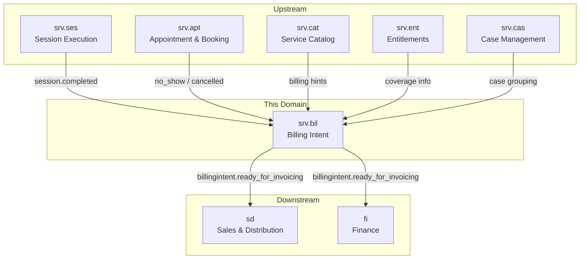
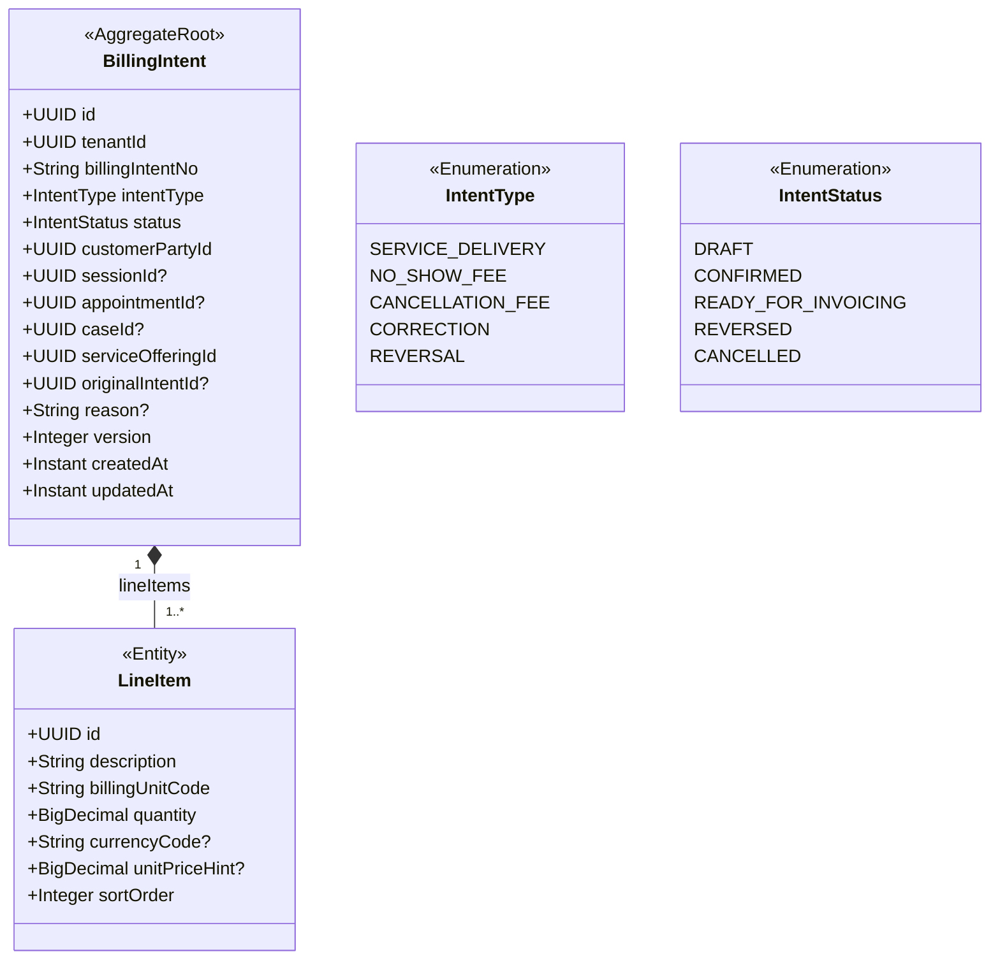
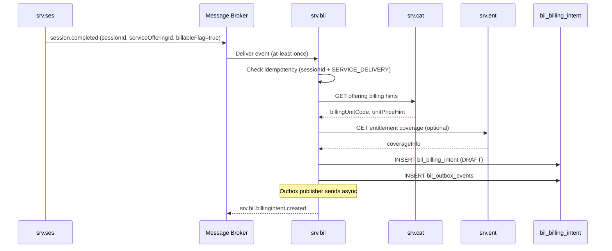
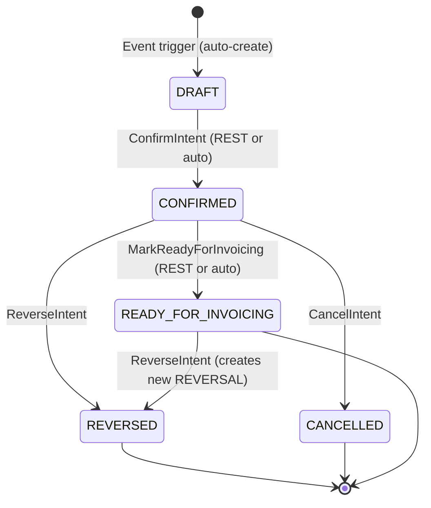
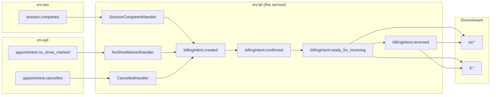
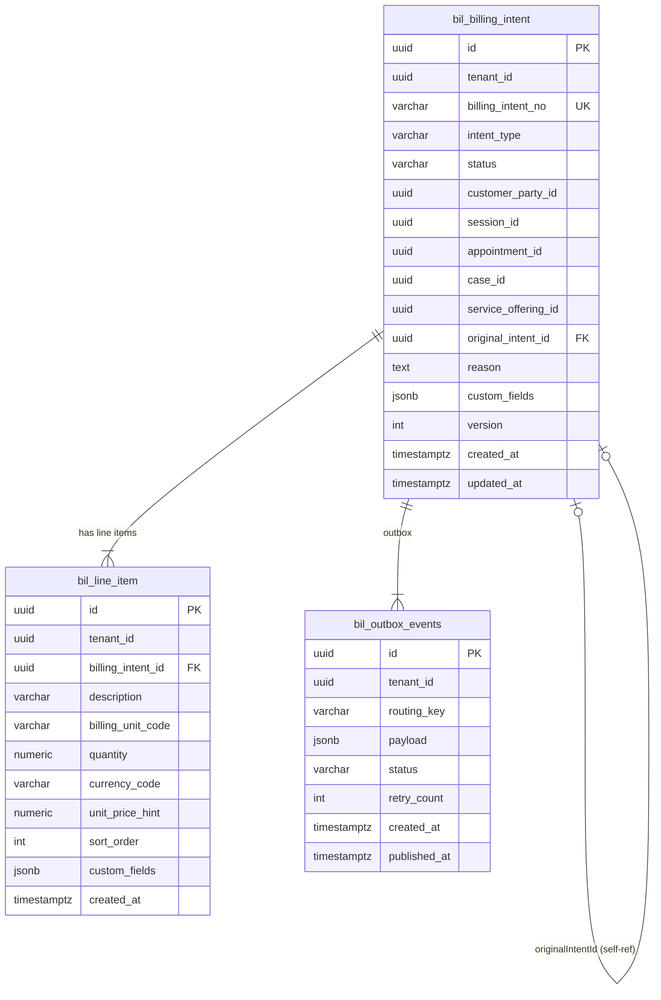

# Billing Intent — `srv.bil` Domain / Service Specification

> **Conceptual Stack Layer:** Domain / Service
> **Space:** Platform
> **Owner:** Domain Engineering Team
> **Schema alignment:** `service-layer.schema.json`
> **Companion files:** `openapi.yaml`, `*.schema.json` (event contracts)
> **Referenced by:** Platform-Feature Spec SS5 (backend dependencies), BFF Contract
> **Belongs to:** SRV Suite Spec (`_srv_suite.md`)

> **Meta Information**
> - **Version:** 2026-04-03
> - **Template:** `domain-service-spec.md` v1.0.0
> - **Template Compliance:** ~98% — Port/Repository OPEN QUESTION
> - **Author(s):** OpenLeap Architecture Team
> - **Status:** DRAFT
> - **Suite:** `srv`
> - **Domain:** `bil`
> - **Bounded Context Ref:** `bc:billing-intent`
> - **Service ID:** `srv-bil-svc`
> - **basePackage:** `io.openleap.srv.bil`
> - **API Base Path:** `/api/srv/bil/v1`
> - **OpenLeap Starter Version:** `v1`
> - **Port:** OPEN QUESTION — see Q-BIL-001
> - **Repository:** OPEN QUESTION — see Q-BIL-002
> - **Tags:** `billing`, `intent`, `billable`, `reconciliation`, `srv`
> - **Team:**
>   - Name: `team-srv`
>   - Email: `srv-team@openleap.io`
>   - Slack: `#srv-team`

---

## Specification Guidelines Compliance

> ### Non-Negotiables
> - Never invent facts. If required info is missing, add an **OPEN QUESTION** entry.
> - Preserve intent and decisions. Only change meaning when explicitly requested.
> - Do not remove normative constraints unless they are explicitly replaced.
> - Keep the spec **self-contained**: no "see chat", no implicit context.
>
> ### Source of Truth Priority
> When sources conflict:
> 1. Spec (explicit) wins
> 2. Starter specs (implementation constraints) next
> 3. Guidelines (best practices) last
>
> Record conflicts in the **Decisions & Conflicts** section (see Section 14).
>
> ### Style Guide
> - Prefer short sentences and lists.
> - Use MUST/SHOULD/MAY for normative statements.
> - Keep terminology consistent (Aggregate, Domain Service, Application Service, Command, Event).
> - Avoid ambiguous words ("often", "maybe") unless explicitly noting uncertainty.
> - Keep examples minimal and clearly marked as examples.
> - Do not add implementation code unless the chapter explicitly requires it.

---

## 0. Document Purpose & Scope

### 0.1 Purpose
`srv.bil` specifies **billing intents**: auditable, traceable billable positions derived from service delivery facts. It bridges execution reality (`srv.ses` + context) to downstream commercial/financial processing (`sd` and/or `fi`).

### 0.2 Target Audience
- Product Owners & Business Stakeholders
- System Architects & Technical Leads
- Integration Engineers

### 0.3 Scope

**In Scope:**
- MUST derive billing intents from session completion events and policy-driven fee triggers.
- MUST support correction/reversal intents with full auditability (append-only).
- MUST maintain traceability: billing intent ↔ session(s) ↔ case ↔ customer.
- MUST publish downstream-ready events for invoicing engines (`sd` and/or `fi`).
- SHOULD expose query APIs for reconciliation and dispute resolution.
- MAY group intents by case context (`srv.cas`) for aggregated billing.

**Out of Scope:**
- MUST NOT generate invoice documents, postings, or open items (-> `fi`).
- MUST NOT be a pricing engine or promotions engine (-> `sd`/`com`).
- MUST NOT own commercial contracts or order management (-> `sd`).

### 0.4 Related Documents
- `_srv_suite.md`, `srv_ses-spec.md`, `srv_apt-spec.md`, `srv_cat-spec.md`, `srv_cas-spec.md`, `srv_ent-spec.md`
- `SYSTEM_OVERVIEW.md`, `TECHNICAL_STANDARDS.md`, `EVENT_STANDARDS.md`

---

## 1. Business Context

### 1.1 Domain Purpose
Provide a canonical "what is billable and why" layer, enabling consistent invoicing regardless of channel/order ownership model. Billing intents capture the auditable fact that a service was delivered (or a fee is due) and prepare it for downstream financial processing.

### 1.2 Business Value
- Decouples service execution from invoicing: execution domains focus on delivery, billing intent translates facts into billable positions.
- Provides a single reconciliation point for disputes and corrections.
- Supports multiple downstream consumers (SD for commercial orders, FI for direct invoicing) without coupling execution to a specific billing model.

### 1.3 Key Stakeholders

| Role | Responsibility | Primary Use Cases |
|------|----------------|-------------------|
| Billing Clerk | Review and reconcile intents | Search intents, verify against sessions, trigger corrections |
| Finance Controller | Audit billing trail | Trace intent to session/case, review reversals |
| Back Office | Manage fee policies | Review policy-driven intents (no-show, cancellation fees) |

### 1.4 Strategic Positioning



### 1.5 Service Context

| Property | Value |
|----------|-------|
| **Suite** | `srv` |
| **Domain** | `bil` |
| **Bounded Context** | `bc:billing-intent` |
| **Service ID** | `srv-bil-svc` |
| **Base Package** | `io.openleap.srv.bil` |

**Responsibilities:**
- Consume session facts and fee triggers to derive billing intents
- Maintain append-only billing intent records with full traceability
- Support corrections and reversals as new intent records
- Publish downstream-ready events for invoicing

**Authoritative Sources:**
| Source Type | Description | Access Pattern |
|-------------|-------------|----------------|
| REST API | Billing intent queries, manual reversal/correction | Synchronous |
| Database | Billing intent records, line items | Direct (owner) |
| Events | Billing intent lifecycle events | Asynchronous |

---

## 2. Service Identity

| Property | Value | Schema Field |
|----------|-------|-------------|
| **Service ID** | `srv-bil-svc` | `metadata.id` |
| **Display Name** | Billing Intent | `metadata.name` |
| **Suite** | `srv` | `metadata.suite` |
| **Domain** | `bil` | `metadata.domain` |
| **Bounded Context** | `bc:billing-intent` | `metadata.bounded_context_ref` |
| **Version** | `1.2.0` | `metadata.version` |
| **Status** | DRAFT | `metadata.status` |
| **API Base Path** | `/api/srv/bil/v1` | `metadata.api_base_path` |
| **Repository** | OPEN QUESTION — Q-BIL-002 | `metadata.repository` |
| **Tags** | `billing`, `intent`, `reconciliation` | `metadata.tags` |

**Team:**
| Property | Value |
|----------|-------|
| **Name** | `team-srv` |
| **Email** | `srv-team@openleap.io` |
| **Slack** | `#srv-team` |

---

## 3. Domain Model

### 3.1 Conceptual Overview
The billing intent domain captures **billing intents** — auditable records representing billable positions derived from service delivery facts. Each intent links to a source (session, appointment, or policy trigger) and may contain one or more **line items** describing what is billable. Intents are append-only: corrections and reversals create new intent records referencing the original.

### 3.2 Core Concepts



### 3.3 Aggregate Definitions

#### 3.3.1 BillingIntent

| Property | Value |
|----------|-------|
| **Aggregate ID** | `agg:billing-intent` |
| **Name** | `BillingIntent` |

**Business Purpose:** An auditable record of a billable position derived from service delivery facts or policy-driven fee triggers, prepared for downstream invoicing.

##### Aggregate Root

**Key Attributes:**
| Attribute | Type | Format | Description | Constraints | Required | Read-Only |
|-----------|------|--------|-------------|-------------|----------|-----------|
| id | string | uuid | Unique identifier (OlUuid.create()) | Immutable | Yes | Yes |
| tenantId | string | uuid | Tenant ownership for RLS isolation | Immutable | Yes | Yes |
| billingIntentNo | string | — | Human-readable reference number (e.g., BIL-2026-000001) | Unique per tenant; auto-generated | Yes | Yes |
| intentType | string | — | Type of billing intent | enum_ref: `IntentType`; Immutable | Yes | Yes |
| status | string | — | Lifecycle state | enum_ref: `IntentStatus` | Yes | No |
| customerPartyId | string | uuid | Customer reference (from `shared.bp`) | — | Yes | Yes |
| sessionId | string | uuid | Source session (for SERVICE_DELIVERY intents) | Conditional: required if appointmentId absent | No | Yes |
| appointmentId | string | uuid | Source appointment (for NO_SHOW_FEE/CANCELLATION_FEE intents) | Conditional: required if sessionId absent | No | Yes |
| caseId | string | uuid | Optional case grouping context | — | No | Yes |
| serviceOfferingId | string | uuid | Service offering reference (from `srv.cat`) | — | Yes | Yes |
| originalIntentId | string | uuid | Original intent (for CORRECTION/REVERSAL types) | Required when intentType IN (CORRECTION, REVERSAL) | No | Yes |
| reason | string | — | Business reason for correction or reversal | max_length: 1000 | No | No |
| version | integer | int64 | Optimistic locking counter | min: 0 | Yes | Yes |
| createdAt | string | date-time | Creation timestamp (UTC) | — | Yes | Yes |
| updatedAt | string | date-time | Last update timestamp (UTC) | — | Yes | Yes |

**State Descriptions:**
| State | Description | Business Meaning |
|-------|-------------|------------------|
| DRAFT | Intent created but not yet validated | Awaiting confirmation (if approval workflow enabled) |
| CONFIRMED | Intent validated and accepted | Billable position accepted; ready for invoicing pipeline |
| READY_FOR_INVOICING | Intent published for downstream consumption | SD/FI can pick up for invoice creation |
| REVERSED | Intent reversed by correction or dispute | Original amount negated; see linked REVERSAL intent |
| CANCELLED | Intent cancelled before invoicing | No billing effect; audit record preserved |

**Allowed Transitions:**
| From | To | Trigger | Guard |
|------|----|---------|-------|
| — | DRAFT | `DeriveFromSession`, `DeriveNoShowFee`, `DeriveCancellationFee` | Valid source (sessionId or appointmentId present; BR-001) |
| DRAFT | CONFIRMED | `ConfirmIntent` | Status is DRAFT |
| CONFIRMED | READY_FOR_INVOICING | `MarkReadyForInvoicing` | Status is CONFIRMED |
| CONFIRMED | REVERSED | `ReverseIntent` | Status is CONFIRMED; not already reversed (BR-006) |
| CONFIRMED | CANCELLED | `CancelIntent` | Status is CONFIRMED; not yet forwarded downstream |
| READY_FOR_INVOICING | REVERSED | `ReverseIntent` | Creates new REVERSAL intent; marks original as REVERSED |

**Invariants:**
| Rule ID | Description |
|---------|-------------|
| BR-001 | MUST reference either a `sessionId` or `appointmentId` as the source trigger |
| BR-002 | Correction/reversal intents MUST reference `originalIntentId` |
| BR-003 | MUST NOT modify line items of a `READY_FOR_INVOICING` intent; corrections MUST create a new reversal intent |
| BR-004 | Line items MUST have positive `quantity` |
| BR-005 | `REVERSAL` intents MUST have at least one line item with negated quantity matching the original |
| BR-006 | An intent MUST NOT be reversed more than once |

**Domain Events Emitted:**
- `srv.bil.billingintent.created`
- `srv.bil.billingintent.confirmed`
- `srv.bil.billingintent.ready_for_invoicing`
- `srv.bil.billingintent.reversed`
- `srv.bil.billingintent.corrected`
- `srv.bil.billingintent.cancelled`

##### Child Entities

###### Entity: LineItem

| Property | Value |
|----------|-------|
| **Entity ID** | `ent:line-item` |
| **Name** | `LineItem` |
| **Relationship to Root** | one_to_many (min 1) |

**Business Purpose:** A single billable position within a billing intent, describing the unit, quantity, and optional price hint. The price hint is non-authoritative — final pricing is determined by `sd`/`fi` (DC-002).

**Attributes:**
| Attribute | Type | Format | Description | Constraints | Required |
|-----------|------|--------|-------------|-------------|----------|
| id | string | uuid | Unique identifier (OlUuid.create()) | — | Yes |
| description | string | — | Human-readable description of the billable position | max_length: 500 | Yes |
| billingUnitCode | string | — | Unit of measure code (e.g., "HOUR", "SESSION", "FLAT", "KM") | max_length: 50; from ref catalog | Yes |
| quantity | number | decimal | Quantity of billable units; negative for reversals | positive for non-REVERSAL intents (BR-004) | Yes |
| currencyCode | string | iso-4217 | Currency code (non-authoritative hint) | max_length: 3; ISO 4217 | No |
| unitPriceHint | number | decimal | Suggested unit price from service catalog | positive if set | No |
| sortOrder | integer | int32 | Display ordering within the intent | min: 0 | Yes |

**Collection Constraints:**
- Minimum 1 line item per BillingIntent.
- REVERSAL intents MUST have a negating line item for each line item in the original intent (BR-005).
- Line items are immutable once the parent BillingIntent reaches `READY_FOR_INVOICING`.

**Invariants:**
- BR-004: `quantity` MUST be positive for SERVICE_DELIVERY, NO_SHOW_FEE, and CANCELLATION_FEE intents.
- Quantity for REVERSAL intents MUST match (and negate) the original intent quantities.

##### Value Objects

No standalone value objects defined in this domain. `currencyCode` + `unitPriceHint` are primitive fields on LineItem, deliberately kept simple (final Money handling belongs to `sd`/`fi`). See DC-002.

### 3.4 Enumerations

#### IntentType
| Value | Description | Deprecated |
|-------|-------------|------------|
| `SERVICE_DELIVERY` | Derived from a completed session; main billing path | No |
| `NO_SHOW_FEE` | Policy-driven fee for a customer who did not appear | No |
| `CANCELLATION_FEE` | Policy-driven fee for late cancellation outside the free window | No |
| `CORRECTION` | Partial correction of a previous intent (new line items replace/supplement original) | No |
| `REVERSAL` | Full reversal of a previous intent; negates all line items | No |

#### IntentStatus
| Value | Description | Deprecated |
|-------|-------------|------------|
| `DRAFT` | Created from an event or REST trigger; awaiting confirmation | No |
| `CONFIRMED` | Validated and accepted by a billing clerk or auto-confirm rule | No |
| `READY_FOR_INVOICING` | Marked ready; published for downstream SD/FI consumption | No |
| `REVERSED` | Reversed by a subsequent REVERSAL intent | No |
| `CANCELLED` | Cancelled before any downstream pickup; no billing effect | No |

### 3.5 Shared Types

No domain-specific shared value object types are defined in `srv.bil`. The `Money` concept (amount + currencyCode) is deliberately split across `LineItem` fields (`unitPriceHint`, `currencyCode`) to keep this domain decoupled from authoritative pricing — final Money values belong to `sd`/`fi`. See DC-002.

> OPEN QUESTION: If products require Money as a typed value object in billing intents, define it here. See Q-BIL-015.

---

## 4. Business Rules & Constraints

### 4.1 Business Rules Catalog

| ID | Rule Name | Description | Scope | Enforcement | Error Code |
|----|-----------|-------------|-------|-------------|------------|
| BR-001 | Source Reference Required | MUST reference either `sessionId` or `appointmentId` as trigger source | BillingIntent | Create | `BIL_MISSING_SOURCE` |
| BR-002 | Original Reference for Corrections | Correction/reversal intents MUST reference `originalIntentId` | BillingIntent | Create | `BIL_MISSING_ORIGINAL` |
| BR-003 | Append-Only After Ready | MUST NOT modify line items of a `READY_FOR_INVOICING` intent; corrections create new reversal intents | BillingIntent | Update | `BIL_IMMUTABLE_READY` |
| BR-004 | Positive Line Quantity | Line items MUST have positive `quantity` (reversals negate via separate intent) | LineItem | Create | `BIL_INVALID_QUANTITY` |
| BR-005 | Reversal Matching | `REVERSAL` intents MUST produce line items that negate the original intent quantities | BillingIntent | Create | `BIL_REVERSAL_MISMATCH` |
| BR-006 | Single Reversal Per Intent | An intent MUST NOT be reversed more than once | BillingIntent | Reverse | `BIL_ALREADY_REVERSED` |

### 4.2 Detailed Rule Definitions

#### BR-001: Source Reference Required

**Business Context:** Every billing intent must be traceable to a concrete business event. Without a source reference, auditors cannot verify why a billable position exists.

**Rule Statement:** A `BillingIntent` MUST reference at least one of `sessionId` or `appointmentId`. Both fields may be present if a session is linked to a specific appointment.

**Applies To:**
- Aggregate: `BillingIntent`
- Operations: Create (all intent types)

**Enforcement:** Validated in the `BillingIntent` domain object constructor before persistence.

**Validation Logic:** `sessionId IS NOT NULL OR appointmentId IS NOT NULL`

**Error Handling:**
- **Error Code:** `BIL_MISSING_SOURCE`
- **Error Message:** "A billing intent must reference a session or appointment as its source."
- **User action:** Ensure the triggering event carries a valid sessionId or appointmentId.

**Examples:**
- **Valid:** SERVICE_DELIVERY intent with `sessionId = "abc-123"`, no appointmentId.
- **Invalid:** NO_SHOW_FEE intent with neither `sessionId` nor `appointmentId` set.

---

#### BR-002: Original Reference for Corrections

**Business Context:** Corrections and reversals must be linked to the intent they modify, enabling full audit trail reconstruction and preventing orphaned correction records.

**Rule Statement:** Any `BillingIntent` with `intentType` IN (`CORRECTION`, `REVERSAL`) MUST carry a non-null `originalIntentId` referencing an existing intent within the same tenant.

**Applies To:**
- Aggregate: `BillingIntent`
- Operations: Create (CORRECTION and REVERSAL types only)

**Enforcement:** Validated in the Application Service before delegation to the domain object. The referenced original intent MUST exist in `CONFIRMED` or `READY_FOR_INVOICING` state.

**Validation Logic:** `intentType IN ('CORRECTION','REVERSAL') → originalIntentId IS NOT NULL AND original.status IN ('CONFIRMED','READY_FOR_INVOICING')`

**Error Handling:**
- **Error Code:** `BIL_MISSING_ORIGINAL`
- **Error Message:** "Correction and reversal intents must reference a valid original billing intent."
- **User action:** Verify the original intent ID exists and is in a reversible state.

**Examples:**
- **Valid:** REVERSAL intent with `originalIntentId = "xyz-789"` and the original is `CONFIRMED`.
- **Invalid:** REVERSAL intent with `originalIntentId = null`.

---

#### BR-003: Append-Only After Ready

**Business Context:** Once a billing intent is marked `READY_FOR_INVOICING`, downstream systems (SD/FI) may have already picked it up. Silent changes would create data inconsistencies in financial systems.

**Rule Statement:** No field of a `BillingIntent` in `READY_FOR_INVOICING` state (except `status`) MUST be modified. Any correction MUST create a new `REVERSAL` or `CORRECTION` intent referencing the original.

**Applies To:**
- Aggregate: `BillingIntent`
- Operations: Update (all fields except status transition via reverse)

**Enforcement:** Validated in the Application Service. Any non-status-transition update request against a READY_FOR_INVOICING intent is rejected.

**Validation Logic:** `intent.status == READY_FOR_INVOICING → reject all non-lifecycle updates`

**Error Handling:**
- **Error Code:** `BIL_IMMUTABLE_READY`
- **Error Message:** "A billing intent in READY_FOR_INVOICING state cannot be modified. Create a reversal or correction instead."
- **User action:** Use the `POST /billing-intents/{id}/reverse` or `/correct` endpoint.

**Examples:**
- **Valid:** Calling `/reverse` on a READY_FOR_INVOICING intent creates a new REVERSAL intent.
- **Invalid:** Attempting `PUT /billing-intents/{id}` on a READY_FOR_INVOICING intent.

---

#### BR-004: Positive Line Quantity

**Business Context:** Billing quantities represent delivered service units. A zero or negative quantity in a non-reversal context indicates data error.

**Rule Statement:** Each `LineItem.quantity` MUST be strictly positive (> 0) for intents with `intentType` NOT IN (`REVERSAL`). REVERSAL intents MUST have negative quantities.

**Applies To:**
- Aggregate: `BillingIntent` / Entity: `LineItem`
- Operations: Create

**Enforcement:** Validated in the `BillingIntent` domain object when adding line items.

**Validation Logic:** For non-REVERSAL: `quantity > 0`. For REVERSAL: `quantity < 0`.

**Error Handling:**
- **Error Code:** `BIL_INVALID_QUANTITY`
- **Error Message:** "Line item quantity must be positive for delivery/fee intents and negative for reversal intents."
- **User action:** Correct the quantity value to match the intent type.

**Examples:**
- **Valid:** SERVICE_DELIVERY intent, line item with `quantity = 1.0`.
- **Invalid:** NO_SHOW_FEE intent with `quantity = 0`.

---

#### BR-005: Reversal Matching

**Business Context:** A reversal intent must mirror the original's financial impact exactly to produce a zero net position. Partial reversals that don't match may leave open balances in downstream systems.

**Rule Statement:** A `REVERSAL` intent MUST contain at least one line item whose `billingUnitCode` matches the original intent, with a negated quantity. The sum of negated quantities MUST equal the sum of original quantities per unit type.

**Applies To:**
- Aggregate: `BillingIntent`
- Operations: Create (REVERSAL type)

**Enforcement:** Validated in the Application Service during `ReverseIntent` execution. System auto-derives reversal line items from the original intent.

**Validation Logic:** For each `billingUnitCode` in original: `sum(reversal.lineItems[unitCode].quantity) == -sum(original.lineItems[unitCode].quantity)`

**Error Handling:**
- **Error Code:** `BIL_REVERSAL_MISMATCH`
- **Error Message:** "Reversal line items must exactly negate the original intent quantities."
- **User action:** Use the system-generated reversal — do not manually specify line items for reversals.

**Examples:**
- **Valid:** Original has `quantity = 2.0, billingUnitCode = SESSION`. Reversal has `quantity = -2.0, billingUnitCode = SESSION`.
- **Invalid:** Reversal with `quantity = -1.0` when original had `quantity = 2.0`.

---

#### BR-006: Single Reversal Per Intent

**Business Context:** Reversing an already-reversed intent would create double-credit situations in downstream financial systems.

**Rule Statement:** An intent that already has a linked `REVERSAL` intent (i.e., `status = REVERSED`) MUST NOT be reversed again.

**Applies To:**
- Aggregate: `BillingIntent`
- Operations: Reverse

**Enforcement:** Validated in the Application Service. Checks the original intent's status before creating a reversal.

**Validation Logic:** `original.status != REVERSED`

**Error Handling:**
- **Error Code:** `BIL_ALREADY_REVERSED`
- **Error Message:** "This billing intent has already been reversed."
- **User action:** Check the existing reversal intent. If further correction is needed, reverse the reversal intent or create a new CORRECTION intent.

**Examples:**
- **Valid:** Reversing a `CONFIRMED` or `READY_FOR_INVOICING` intent.
- **Invalid:** Reversing an intent that already has `status = REVERSED`.

---

### 4.3 Data Validation Rules

**Field-Level Validations:**

| Field | Validation Rule | Error Message |
|-------|----------------|---------------|
| `billingIntentNo` | Required; unique per tenant; auto-generated | "Billing intent number must be unique per tenant." |
| `intentType` | Required; must be valid `IntentType` enum value | "Invalid intent type." |
| `status` | Required; must be valid `IntentStatus` enum value | "Invalid intent status." |
| `customerPartyId` | Required; valid UUID format | "Customer party ID is required." |
| `serviceOfferingId` | Required; valid UUID format | "Service offering ID is required." |
| `sessionId` | UUID format if present | "Session ID must be a valid UUID." |
| `appointmentId` | UUID format if present | "Appointment ID must be a valid UUID." |
| `originalIntentId` | UUID format if present; required for CORRECTION/REVERSAL | "Original intent ID is required for corrections and reversals." |
| `reason` | max_length 1000 if present | "Reason must not exceed 1000 characters." |
| `LineItem.description` | Required; max_length 500 | "Line item description is required and must not exceed 500 characters." |
| `LineItem.billingUnitCode` | Required; max_length 50; must exist in billing units catalog | "Invalid billing unit code." |
| `LineItem.quantity` | Required; positive for non-REVERSAL, negative for REVERSAL | "Line item quantity must be positive." |
| `LineItem.currencyCode` | ISO 4217 if present; max_length 3 | "Invalid currency code." |
| `LineItem.unitPriceHint` | Positive decimal if present | "Unit price hint must be positive." |
| `LineItem.sortOrder` | Required; min 0 | "Sort order must be non-negative." |

**Cross-Field Validations:**
- At least one of `sessionId` or `appointmentId` MUST be present (BR-001).
- If `intentType IN (CORRECTION, REVERSAL)`, then `originalIntentId` MUST be present (BR-002).
- If `intentType == SERVICE_DELIVERY`, then `sessionId` MUST be present.
- If `intentType IN (NO_SHOW_FEE, CANCELLATION_FEE)`, then `appointmentId` MUST be present.

### 4.4 Reference Data Dependencies

| Catalog | Source Service | Fields Referencing | Validation |
|---------|----------------|-------------------|------------|
| Billing Unit Codes | `srv-cat-svc` (offering params) | `LineItem.billingUnitCode` | Must exist in active billing unit catalog |
| Customer Parties | `shared-bp-svc` | `BillingIntent.customerPartyId` | Must reference active party |
| Service Offerings | `srv-cat-svc` | `BillingIntent.serviceOfferingId` | Must reference active offering |
| Currency Codes | `ref-data-svc` | `LineItem.currencyCode` | ISO 4217; validated at write |

---

## 5. Use Cases

### 5.1 Business Logic Placement

| Logic Type | Placement | Examples |
|------------|-----------|----------|
| Aggregate invariants | Domain Object (`BillingIntent`) | Source reference validation (BR-001), quantity positivity (BR-004), state transition guards |
| Cross-aggregate logic | Domain Service | None in this domain (single aggregate) |
| Orchestration & transactions | Application Service | Use case coordination, outbox publishing, idempotency checks, fee policy lookup |
| Event-to-intent derivation | Application Service (Event Handler) | Session completion → intent creation, no-show fee calculation |

### 5.2 Use Cases (Canonical Format)

#### UC-001: DeriveFromSessionCompletion

| Field | Value |
|-------|-------|
| **id** | `DeriveFromSessionCompletion` |
| **type** | WRITE |
| **trigger** | Message (from `srv.ses.session.completed`) |
| **aggregate** | `BillingIntent` |
| **domainOperation** | `BillingIntent.deriveFromSession` |
| **inputs** | `sessionId: UUID`, `serviceOfferingId: UUID`, `customerPartyId: UUID`, `caseId: UUID?`, `deliveredDuration: Duration?`, `billableFlag: Boolean` |
| **outputs** | `BillingIntent` |
| **events** | `srv.bil.billingintent.created` |
| **idempotency** | required (deduplicate by sessionId + intentType = SERVICE_DELIVERY) |
| **preconditions** | `billableFlag` MUST be `true` on the source session |
| **errors** | `BIL_MISSING_SOURCE`, `BIL_DUPLICATE_SESSION` |

**Actor:** Session Execution Service (automated, triggered via event)

**Preconditions:**
- A `srv.ses.session.completed` event has been received.
- `billableFlag` is `true` in the event payload.
- No existing SERVICE_DELIVERY intent for this `sessionId` within the same tenant.

**Main Flow:**
1. Event consumer receives `srv.ses.session.completed`.
2. Application Service checks idempotency cache: if `sessionId` already has a SERVICE_DELIVERY intent, skip (return existing).
3. Application Service looks up billing hints from `srv-cat-svc` for `serviceOfferingId` (unit, price hint).
4. Application Service looks up entitlement coverage from `srv-ent-svc` if `entitlementId` present in event.
5. Application Service creates `BillingIntent` with `intentType = SERVICE_DELIVERY`, `status = DRAFT`.
6. Line items derived from session duration / offering billing parameters.
7. Intent persisted; outbox event `srv.bil.billingintent.created` enqueued.
8. If auto-confirm enabled (Q-BIL-010): immediately advance to CONFIRMED, then READY_FOR_INVOICING.

**Postconditions:**
- `BillingIntent` in `DRAFT` (or `CONFIRMED`/`READY_FOR_INVOICING` if auto-confirm) state.
- Event `srv.bil.billingintent.created` published.

**Business Rules Applied:**
- BR-001: Source Reference Required
- BR-004: Positive Line Quantity

**Alternative Flows:**
- **Alt-1:** If `billableFlag = false`, no intent is created; event is acknowledged and discarded.

**Exception Flows:**
- **Exc-1:** If `srv-cat-svc` is unavailable, handler retries up to 3× with exponential backoff, then routes to DLQ.
- **Exc-2:** If a duplicate `sessionId` intent exists, handler deduplicates silently (idempotency).

---

#### UC-002: DeriveNoShowFee

| Field | Value |
|-------|-------|
| **id** | `DeriveNoShowFee` |
| **type** | WRITE |
| **trigger** | Message (from `srv.apt.appointment.no_show_marked`) |
| **aggregate** | `BillingIntent` |
| **domainOperation** | `BillingIntent.deriveNoShowFee` |
| **inputs** | `appointmentId: UUID`, `serviceOfferingId: UUID`, `customerPartyId: UUID`, `caseId: UUID?` |
| **outputs** | `BillingIntent` |
| **events** | `srv.bil.billingintent.created` |
| **idempotency** | required (deduplicate by appointmentId + intentType = NO_SHOW_FEE) |
| **preconditions** | Fee policy MUST be configured for the service offering |

**Actor:** Appointment Service (automated, triggered via event)

**Preconditions:**
- `srv.apt.appointment.no_show_marked` event received.
- A no-show fee policy is configured for the service offering (Q-BIL-003).
- No existing NO_SHOW_FEE intent for this `appointmentId`.

**Main Flow:**
1. Event consumer receives `srv.apt.appointment.no_show_marked`.
2. Application Service looks up fee policy for `serviceOfferingId`.
3. If no fee policy configured, intent is NOT created; event acknowledged.
4. Application Service creates `BillingIntent` with `intentType = NO_SHOW_FEE`, `status = DRAFT`.
5. Line item: description = "No-show fee", unit from policy, quantity = 1, price hint from policy.
6. Intent persisted; outbox event published.

**Postconditions:**
- `BillingIntent` in `DRAFT` state (or auto-confirmed per Q-BIL-010).
- Billing clerk notified (if notification is enabled).

**Business Rules Applied:**
- BR-001: Source Reference Required (appointmentId)
- BR-004: Positive Line Quantity

**Alternative Flows:**
- **Alt-1:** If no fee policy configured for the offering, skip intent creation.

**Exception Flows:**
- **Exc-1:** Fee policy service unavailable → retry → DLQ.

---

#### UC-003: DeriveCancellationFee

| Field | Value |
|-------|-------|
| **id** | `DeriveCancellationFee` |
| **type** | WRITE |
| **trigger** | Message (from `srv.apt.appointment.cancelled`) |
| **aggregate** | `BillingIntent` |
| **domainOperation** | `BillingIntent.deriveCancellationFee` |
| **inputs** | `appointmentId: UUID`, `serviceOfferingId: UUID`, `customerPartyId: UUID`, `cancellationTimestamp: Instant` |
| **outputs** | `BillingIntent` (or none if within free cancellation window) |
| **events** | `srv.bil.billingintent.created` (if fee applies) |
| **idempotency** | required |
| **preconditions** | Fee policy MUST be configured; cancellation MUST be outside free window |

**Actor:** Appointment Service (automated, triggered via event)

**Preconditions:**
- `srv.apt.appointment.cancelled` event received.
- Cancellation fee policy configured for the offering.
- Cancellation timestamp is outside the free cancellation window defined by policy.

**Main Flow:**
1. Event consumer receives `srv.apt.appointment.cancelled`.
2. Application Service looks up cancellation fee policy for `serviceOfferingId`.
3. Application Service evaluates: `cancellationTimestamp` vs `freeWindow` from policy.
4. If within free window: no intent created, event acknowledged.
5. If outside free window: create CANCELLATION_FEE intent with policy-derived line item.
6. Persist and publish `srv.bil.billingintent.created`.

**Postconditions:**
- `BillingIntent` in `DRAFT` state (if fee applied).

**Business Rules Applied:**
- BR-001: Source Reference Required
- BR-004: Positive Line Quantity

**Alternative Flows:**
- **Alt-1:** Cancellation within free window → no intent, silent acknowledgment.
- **Alt-2:** Policy not configured → no intent.

**Exception Flows:**
- **Exc-1:** Policy lookup fails → retry → DLQ.

---

#### UC-004: ConfirmIntent

| Field | Value |
|-------|-------|
| **id** | `ConfirmIntent` |
| **type** | WRITE |
| **trigger** | REST (or automatic if no approval workflow) |
| **aggregate** | `BillingIntent` |
| **domainOperation** | `BillingIntent.confirm` |
| **inputs** | `intentId: UUID` |
| **outputs** | `BillingIntent` |
| **events** | `srv.bil.billingintent.confirmed` |
| **rest** | `POST /api/srv/bil/v1/billing-intents/{id}/confirm` |
| **idempotency** | required |

**Actor:** Billing Clerk or System (auto-confirm pathway)

**Preconditions:**
- Billing intent exists and is in `DRAFT` state.
- Caller holds `SRV_BIL_EDITOR` permission.

**Main Flow:**
1. Caller sends `POST /billing-intents/{id}/confirm`.
2. Application Service loads intent; validates status = DRAFT.
3. Domain object transitions state to `CONFIRMED`.
4. Optimistic lock version incremented.
5. Event `srv.bil.billingintent.confirmed` enqueued via outbox.

**Postconditions:**
- `BillingIntent.status = CONFIRMED`.
- Downstream audit log updated.

**Business Rules Applied:**
- BR-003: Append-Only After Ready (transition allowed here)

**Alternative Flows:**
- **Alt-1:** Intent already CONFIRMED → idempotent return 200 with current state.

**Exception Flows:**
- **Exc-1:** Intent not found → 404.
- **Exc-2:** ETag mismatch → 412.

---

#### UC-005: MarkReadyForInvoicing

| Field | Value |
|-------|-------|
| **id** | `MarkReadyForInvoicing` |
| **type** | WRITE |
| **trigger** | REST (or automatic after confirmation) |
| **aggregate** | `BillingIntent` |
| **domainOperation** | `BillingIntent.markReady` |
| **inputs** | `intentId: UUID` |
| **outputs** | `BillingIntent` |
| **events** | `srv.bil.billingintent.ready_for_invoicing` |
| **rest** | `POST /api/srv/bil/v1/billing-intents/{id}/mark-ready` |
| **idempotency** | required |

**Actor:** Billing Clerk or System (auto-mark pathway)

**Preconditions:**
- Intent exists and is in `CONFIRMED` state.
- Caller holds `SRV_BIL_EDITOR` permission.

**Main Flow:**
1. Caller sends `POST /billing-intents/{id}/mark-ready`.
2. Application Service loads intent; validates status = CONFIRMED.
3. Domain object transitions to `READY_FOR_INVOICING`.
4. Event `srv.bil.billingintent.ready_for_invoicing` enqueued via outbox.
5. Downstream consumers (SD/FI) will pick up via subscription.

**Postconditions:**
- `BillingIntent.status = READY_FOR_INVOICING`.
- Downstream invoicing triggered asynchronously.

**Business Rules Applied:**
- BR-003: Append-Only After Ready (applies from this state onward)

**Exception Flows:**
- **Exc-1:** Intent not in CONFIRMED state → 422 with `BIL_INVALID_TRANSITION`.
- **Exc-2:** Intent not found → 404.

---

#### UC-006: ReverseIntent

| Field | Value |
|-------|-------|
| **id** | `ReverseIntent` |
| **type** | WRITE |
| **trigger** | REST |
| **aggregate** | `BillingIntent` |
| **domainOperation** | `BillingIntent.reverse` |
| **inputs** | `originalIntentId: UUID`, `reason: String` |
| **outputs** | `BillingIntent` (new reversal intent) |
| **events** | `srv.bil.billingintent.reversed` |
| **rest** | `POST /api/srv/bil/v1/billing-intents/{id}/reverse` |
| **idempotency** | required |
| **errors** | `BIL_MISSING_ORIGINAL`, `BIL_ALREADY_REVERSED`, `BIL_REVERSAL_MISMATCH` |

**Actor:** Billing Clerk

**Preconditions:**
- Original intent exists in `CONFIRMED` or `READY_FOR_INVOICING` state.
- Original intent has not been reversed already (BR-006).
- Caller holds `SRV_BIL_EDITOR` permission.
- `reason` provided.

**Main Flow:**
1. Caller sends `POST /billing-intents/{id}/reverse` with reason.
2. Application Service loads original intent; validates it is reversible.
3. Application Service creates new REVERSAL intent with negated line items (auto-derived from original).
4. Original intent status updated to `REVERSED`.
5. Both records persisted atomically.
6. Event `srv.bil.billingintent.reversed` published with both intent IDs.

**Postconditions:**
- New REVERSAL intent created in `READY_FOR_INVOICING` state.
- Original intent transitions to `REVERSED`.

**Business Rules Applied:**
- BR-002, BR-005, BR-006

**Alternative Flows:**
- **Alt-1:** Original already REVERSED → 409 `BIL_ALREADY_REVERSED`.

**Exception Flows:**
- **Exc-1:** Original not found → 404.
- **Exc-2:** Downstream SD/FI must handle reversal event.

---

#### UC-007: CorrectIntent

| Field | Value |
|-------|-------|
| **id** | `CorrectIntent` |
| **type** | WRITE |
| **trigger** | REST |
| **aggregate** | `BillingIntent` |
| **domainOperation** | `BillingIntent.correct` |
| **inputs** | `originalIntentId: UUID`, `reason: String`, `correctedLineItems: LineItem[]` |
| **outputs** | `BillingIntent` (new correction intent) |
| **events** | `srv.bil.billingintent.corrected` |
| **rest** | `POST /api/srv/bil/v1/billing-intents/{id}/correct` |
| **idempotency** | required |
| **errors** | `BIL_MISSING_ORIGINAL`, `BIL_IMMUTABLE_READY` |

**Actor:** Billing Clerk

**Preconditions:**
- Original intent exists in `CONFIRMED` or `READY_FOR_INVOICING` state.
- Caller holds `SRV_BIL_EDITOR` permission.
- `correctedLineItems` is non-empty and valid.
- `reason` provided.

**Main Flow:**
1. Caller sends `POST /billing-intents/{id}/correct` with reason and corrected line items.
2. Application Service validates original intent is correctable.
3. Creates new CORRECTION intent referencing original, with caller-provided line items.
4. CORRECTION intent status: `READY_FOR_INVOICING` (immediately publishable).
5. Original intent status set to `REVERSED`.
6. Event `srv.bil.billingintent.corrected` published.

**Postconditions:**
- New CORRECTION intent created.
- Original intent in `REVERSED` state.

**Business Rules Applied:**
- BR-002, BR-003, BR-004

**Exception Flows:**
- **Exc-1:** Provided line items fail validation → 422.

---

#### UC-008: GetBillingIntent

| Field | Value |
|-------|-------|
| **id** | `GetBillingIntent` |
| **type** | READ |
| **trigger** | REST |
| **aggregate** | `BillingIntent` |
| **rest** | `GET /api/srv/bil/v1/billing-intents/{id}` |
| **outputs** | `BillingIntentView` (read model) |

**Actor:** Billing Clerk, Finance Controller

**Preconditions:**
- Caller holds `SRV_BIL_VIEWER` permission.
- Intent exists for the caller's tenant.

**Main Flow:**
1. Caller sends `GET /billing-intents/{id}`.
2. Read model queried from read store.
3. Response includes full intent + line items + links.

**Postconditions:**
- No state change.

---

#### UC-009: SearchBillingIntents

| Field | Value |
|-------|-------|
| **id** | `SearchBillingIntents` |
| **type** | READ |
| **trigger** | REST |
| **rest** | `GET /api/srv/bil/v1/billing-intents?customerPartyId=&from=&to=&status=&caseId=&sessionId=&intentType=` |
| **outputs** | Paginated `BillingIntentView` list |

**Actor:** Billing Clerk, Finance Controller, Back Office

**Preconditions:**
- Caller holds `SRV_BIL_VIEWER` permission.
- At least one filter parameter SHOULD be provided to limit result size.

**Main Flow:**
1. Caller sends GET with filter parameters.
2. Read model queried with tenant-scoped filters.
3. Paginated results returned with `_links` for navigation.

**Postconditions:**
- No state change.

### 5.3 Process Flow Diagrams

**Session Completion to Billing Intent Flow:**



**Manual Confirm → Mark Ready Flow:**



### 5.4 Cross-Domain Workflows

#### Workflow: Service Delivery Billing Chain

**Pattern:** Choreography (ADR-029 — no saga coordinator; each domain reacts to events independently)

**Participating Services:**
| Service | Role | Events Consumed | Events Published |
|---------|------|----------------|-----------------|
| `srv-ses-svc` | Producer | — | `srv.ses.session.completed` |
| `srv-bil-svc` | Orchestrator (within billing) | `srv.ses.session.completed` | `srv.bil.billingintent.ready_for_invoicing` |
| `sd-*-svc` | Consumer | `srv.bil.billingintent.ready_for_invoicing` | — |
| `fi-*-svc` | Consumer | `srv.bil.billingintent.ready_for_invoicing` | — |

**Workflow Steps (Success Path):**
1. `srv.ses` completes session → publishes `session.completed`.
2. `srv.bil` receives event → creates `BillingIntent (DRAFT)`.
3. Billing Clerk (or auto-confirm) confirms → `CONFIRMED`.
4. Mark Ready → `READY_FOR_INVOICING` → publishes `billingintent.ready_for_invoicing`.
5. `sd`/`fi` picks up event → creates invoice/posting.

**Workflow Steps (Failure / Reversal Path):**
1. Dispute raised after invoicing.
2. Billing Clerk calls `POST /billing-intents/{id}/reverse`.
3. `srv.bil` creates REVERSAL intent → publishes `billingintent.reversed`.
4. `sd`/`fi` creates credit note or reversal posting.

**Business Implications:**
- `srv.bil` MUST NOT call `sd`/`fi` synchronously; the choreography preserves loose coupling.
- Downstream consumers are responsible for idempotency on `billingintent.ready_for_invoicing`.
- If downstream fails to pick up, `srv.bil` retains the event until acknowledged (outbox + broker durability).

#### Workflow: No-Show / Cancellation Fee Path

**Pattern:** Choreography

**Participating Services:**
| Service | Role | Events Consumed | Events Published |
|---------|------|----------------|-----------------|
| `srv-apt-svc` | Producer | — | `appointment.no_show_marked`, `appointment.cancelled` |
| `srv-bil-svc` | Consumer + Producer | above | `billingintent.created`, `billingintent.ready_for_invoicing` |

**Workflow Steps:**
1. `srv.apt` marks no-show → publishes `appointment.no_show_marked`.
2. `srv.bil` evaluates fee policy → creates NO_SHOW_FEE intent.
3. Same confirm → mark-ready pipeline as above.

---

## 6. REST API

### 6.1 API Overview

**Base Path:** `/api/srv/bil/v1`
**Authentication:** OAuth2/JWT — Bearer token required on all endpoints
**API Version Strategy:** URL path versioning (`/v1`); backward-compatible additions do not require version bump

**Authorization:**
- Read: `SRV_BIL_VIEWER`
- Write: `SRV_BIL_EDITOR`
- Admin: `SRV_BIL_ADMIN`

### 6.2 Resource Operations

#### 6.2.1 Get Billing Intent

```http
GET /api/srv/bil/v1/billing-intents/{id}
Authorization: Bearer {token}
```

**Success Response:** `200 OK`
```json
{
  "id": "3fa85f64-5717-4562-b3fc-2c963f66afa6",
  "billingIntentNo": "BIL-2026-000042",
  "intentType": "SERVICE_DELIVERY",
  "status": "CONFIRMED",
  "customerPartyId": "11111111-2222-3333-4444-555555555555",
  "sessionId": "aaaaaaaa-bbbb-cccc-dddd-eeeeeeeeeeee",
  "appointmentId": null,
  "caseId": "cccccccc-dddd-eeee-ffff-000000000001",
  "serviceOfferingId": "99999999-8888-7777-6666-555555555555",
  "originalIntentId": null,
  "reason": null,
  "lineItems": [
    {
      "id": "ffffffff-eeee-dddd-cccc-bbbbbbbbbbbb",
      "description": "Driving lesson 45 min",
      "billingUnitCode": "SESSION",
      "quantity": 1.0,
      "currencyCode": "EUR",
      "unitPriceHint": 55.00,
      "sortOrder": 0
    }
  ],
  "version": 2,
  "createdAt": "2026-04-01T09:15:00Z",
  "updatedAt": "2026-04-01T09:30:00Z",
  "_links": {
    "self": { "href": "/api/srv/bil/v1/billing-intents/3fa85f64-5717-4562-b3fc-2c963f66afa6" },
    "confirm": { "href": "/api/srv/bil/v1/billing-intents/3fa85f64-5717-4562-b3fc-2c963f66afa6/confirm" },
    "mark-ready": { "href": "/api/srv/bil/v1/billing-intents/3fa85f64-5717-4562-b3fc-2c963f66afa6/mark-ready" }
  }
}
```

**Response Headers:**
- `ETag: "2"`

**Error Responses:**
- `404 Not Found` — Intent does not exist for this tenant
- `403 Forbidden` — Missing `SRV_BIL_VIEWER` permission

---

#### 6.2.2 Search Billing Intents

```http
GET /api/srv/bil/v1/billing-intents?customerPartyId=&from=&to=&status=&caseId=&sessionId=&intentType=&page=0&size=20
Authorization: Bearer {token}
```

**Query Parameters:**
| Parameter | Type | Description |
|-----------|------|-------------|
| `customerPartyId` | UUID | Filter by customer |
| `from` | ISO-8601 date | Filter by `createdAt >= from` |
| `to` | ISO-8601 date | Filter by `createdAt <= to` |
| `status` | IntentStatus | Filter by lifecycle state |
| `caseId` | UUID | Filter by case grouping |
| `sessionId` | UUID | Filter by source session |
| `intentType` | IntentType | Filter by intent type |
| `page` | int | Page index (0-based) |
| `size` | int | Page size (max 100) |

**Success Response:** `200 OK`
```json
{
  "content": [
    {
      "id": "3fa85f64-5717-4562-b3fc-2c963f66afa6",
      "billingIntentNo": "BIL-2026-000042",
      "intentType": "SERVICE_DELIVERY",
      "status": "CONFIRMED",
      "customerPartyId": "11111111-2222-3333-4444-555555555555",
      "createdAt": "2026-04-01T09:15:00Z"
    }
  ],
  "page": { "size": 20, "totalElements": 1, "totalPages": 1, "number": 0 },
  "_links": {
    "self": { "href": "/api/srv/bil/v1/billing-intents?page=0&size=20" }
  }
}
```

**Error Responses:**
- `400 Bad Request` — Invalid filter parameter format

---

### 6.3 Business Operations

#### 6.3.1 Confirm Intent

```http
POST /api/srv/bil/v1/billing-intents/{id}/confirm
Authorization: Bearer {token}
Content-Type: application/json
```

**Request Body:**
```json
{
  "idempotencyKey": "confirm-3fa85f64-2026-04-01"
}
```

**Success Response:** `200 OK`
```json
{
  "id": "3fa85f64-5717-4562-b3fc-2c963f66afa6",
  "billingIntentNo": "BIL-2026-000042",
  "status": "CONFIRMED",
  "intentType": "SERVICE_DELIVERY",
  "customerPartyId": "11111111-2222-3333-4444-555555555555",
  "lineItems": [
    {
      "id": "ffffffff-eeee-dddd-cccc-bbbbbbbbbbbb",
      "description": "Driving lesson 45 min",
      "billingUnitCode": "SESSION",
      "quantity": 1.0,
      "currencyCode": "EUR",
      "unitPriceHint": 55.00,
      "sortOrder": 0
    }
  ],
  "version": 2,
  "updatedAt": "2026-04-01T09:30:00Z",
  "_links": {
    "self": { "href": "/api/srv/bil/v1/billing-intents/3fa85f64-5717-4562-b3fc-2c963f66afa6" }
  }
}
```

**Response Headers:**
- `ETag: "2"`

**Business Rules Checked:**
- Intent MUST be in DRAFT state

**Events Published:**
- `srv.bil.billingintent.confirmed`

**Error Responses:**
- `404 Not Found` — Intent not found
- `409 Conflict` — Intent not in DRAFT state
- `412 Precondition Failed` — ETag mismatch

---

#### 6.3.2 Mark Ready for Invoicing

```http
POST /api/srv/bil/v1/billing-intents/{id}/mark-ready
Authorization: Bearer {token}
Content-Type: application/json
```

**Request Body:**
```json
{
  "idempotencyKey": "mark-ready-3fa85f64-2026-04-01"
}
```

**Success Response:** `200 OK`
```json
{
  "id": "3fa85f64-5717-4562-b3fc-2c963f66afa6",
  "billingIntentNo": "BIL-2026-000042",
  "status": "READY_FOR_INVOICING",
  "version": 3,
  "updatedAt": "2026-04-01T10:00:00Z",
  "_links": {
    "self": { "href": "/api/srv/bil/v1/billing-intents/3fa85f64-5717-4562-b3fc-2c963f66afa6" },
    "reverse": { "href": "/api/srv/bil/v1/billing-intents/3fa85f64-5717-4562-b3fc-2c963f66afa6/reverse" }
  }
}
```

**Events Published:**
- `srv.bil.billingintent.ready_for_invoicing`

**Error Responses:**
- `409 Conflict` — Intent not in CONFIRMED state
- `412 Precondition Failed` — ETag mismatch

---

#### 6.3.3 Reverse Intent

```http
POST /api/srv/bil/v1/billing-intents/{id}/reverse
Authorization: Bearer {token}
Content-Type: application/json
```

**Request Body:**
```json
{
  "reason": "Customer dispute — session not fully delivered",
  "idempotencyKey": "rev-3fa85f64-xyz-456"
}
```

**Success Response:** `201 Created` — Returns the new REVERSAL intent.
```json
{
  "id": "new-reversal-uuid-here",
  "billingIntentNo": "BIL-2026-000099",
  "intentType": "REVERSAL",
  "status": "READY_FOR_INVOICING",
  "originalIntentId": "3fa85f64-5717-4562-b3fc-2c963f66afa6",
  "reason": "Customer dispute — session not fully delivered",
  "lineItems": [
    {
      "id": "new-line-item-uuid",
      "description": "Reversal: Driving lesson 45 min",
      "billingUnitCode": "SESSION",
      "quantity": -1.0,
      "currencyCode": "EUR",
      "unitPriceHint": -55.00,
      "sortOrder": 0
    }
  ],
  "version": 1,
  "createdAt": "2026-04-02T08:00:00Z",
  "_links": {
    "self": { "href": "/api/srv/bil/v1/billing-intents/new-reversal-uuid-here" },
    "original": { "href": "/api/srv/bil/v1/billing-intents/3fa85f64-5717-4562-b3fc-2c963f66afa6" }
  }
}
```

**Response Headers:**
- `Location: /api/srv/bil/v1/billing-intents/new-reversal-uuid-here`

**Business Rules Checked:**
- BR-002, BR-005, BR-006

**Events Published:**
- `srv.bil.billingintent.reversed`

**Error Responses:**
- `404 Not Found` — Original intent not found
- `409 Conflict` — `BIL_ALREADY_REVERSED`
- `422 Unprocessable Entity` — `BIL_REVERSAL_MISMATCH`

---

#### 6.3.4 Correct Intent

```http
POST /api/srv/bil/v1/billing-intents/{id}/correct
Authorization: Bearer {token}
Content-Type: application/json
```

**Request Body:**
```json
{
  "reason": "Duration correction: actual delivery was 60 min, not 45 min",
  "correctedLineItems": [
    {
      "description": "Driving lesson 60 min (corrected)",
      "billingUnitCode": "SESSION",
      "quantity": 1.0,
      "currencyCode": "EUR",
      "unitPriceHint": 65.00,
      "sortOrder": 0
    }
  ],
  "idempotencyKey": "correct-3fa85f64-2026-04-02"
}
```

**Success Response:** `201 Created` — Returns the new CORRECTION intent.
```json
{
  "id": "correction-uuid-here",
  "billingIntentNo": "BIL-2026-000100",
  "intentType": "CORRECTION",
  "status": "READY_FOR_INVOICING",
  "originalIntentId": "3fa85f64-5717-4562-b3fc-2c963f66afa6",
  "reason": "Duration correction: actual delivery was 60 min, not 45 min",
  "lineItems": [
    {
      "description": "Driving lesson 60 min (corrected)",
      "billingUnitCode": "SESSION",
      "quantity": 1.0,
      "currencyCode": "EUR",
      "unitPriceHint": 65.00,
      "sortOrder": 0
    }
  ],
  "version": 1,
  "createdAt": "2026-04-02T09:00:00Z"
}
```

**Events Published:**
- `srv.bil.billingintent.corrected`

**Error Responses:**
- `404 Not Found`
- `422 Unprocessable Entity` — `BIL_IMMUTABLE_READY` (if original is already corrected)

---

### 6.4 OpenAPI Specification

| Property | Value |
|----------|-------|
| **Location** | `openapi.yaml` (companion file, same repository) |
| **Version** | OpenAPI 3.1.0 |
| **Base URL** | `/api/srv/bil/v1` |
| **Docs URL** | OPEN QUESTION — see Q-BIL-002 |

> OPEN QUESTION: Developer portal URL TBD. See Q-BIL-002.

---

## 7. Events & Integration

### 7.1 Architecture Pattern

**Pattern Used:** Event-Driven (Choreography)
**Message Broker:** RabbitMQ (topic exchange per suite per domain)
**Exchange:** `srv.bil.events` (topic type)
**Follows Suite Pattern:** YES — SRV suite uses event-driven choreography for all domain-to-domain communication (see `_srv_suite.md`)
**Rationale:** `srv.bil` has no direct synchronous dependency on `sd`/`fi`; billing facts are published and consumers self-subscribe. This supports multiple downstream billing models (SD-only, FI-only, or both) without coupling.

### 7.2 Published Events

#### Event: BillingIntent.Created

**Routing Key:** `srv.bil.billingintent.created`

**Business Purpose:** Notifies consumers (reconciliation dashboards, audit) that a new billable position has been derived.

**When Published:** After a BillingIntent is successfully persisted in DRAFT state.

**Payload Structure:**
```json
{
  "aggregateType": "srv.bil.billingintent",
  "changeType": "created",
  "entityIds": ["3fa85f64-5717-4562-b3fc-2c963f66afa6"],
  "intentType": "SERVICE_DELIVERY",
  "version": 1,
  "occurredAt": "2026-04-01T09:15:00Z"
}
```

**Event Envelope:**
```json
{
  "eventId": "evt-uuid-001",
  "traceId": "trace-abc-123",
  "tenantId": "tenant-uuid",
  "occurredAt": "2026-04-01T09:15:00Z",
  "producer": "srv.bil",
  "schemaRef": "https://schemas.openleap.io/srv/bil/billingintent.created/v1.json",
  "payload": { ... }
}
```

**Known Consumers:**
| Consumer Service | Handler | Purpose | Processing Type |
|-----------------|---------|---------|-----------------|
| Reconciliation dashboard | `BillingIntentCreatedHandler` | Display new intent | Async read |

---

#### Event: BillingIntent.Confirmed

**Routing Key:** `srv.bil.billingintent.confirmed`

**Business Purpose:** Signals that a billing intent has been validated and accepted as a billable position.

**When Published:** After BillingIntent transitions from DRAFT to CONFIRMED.

**Payload Structure:**
```json
{
  "aggregateType": "srv.bil.billingintent",
  "changeType": "confirmed",
  "entityIds": ["3fa85f64-5717-4562-b3fc-2c963f66afa6"],
  "version": 2,
  "occurredAt": "2026-04-01T09:30:00Z"
}
```

**Known Consumers:**
| Consumer Service | Handler | Purpose | Processing Type |
|-----------------|---------|---------|-----------------|
| Internal audit service | `AuditEventHandler` | Audit log entry | Async |

---

#### Event: BillingIntent.ReadyForInvoicing

**Routing Key:** `srv.bil.billingintent.ready_for_invoicing`

**Business Purpose:** Downstream invoicing systems subscribe to this event to initiate invoice creation or financial posting.

**When Published:** After BillingIntent transitions to READY_FOR_INVOICING.

**Payload Structure:**
```json
{
  "aggregateType": "srv.bil.billingintent",
  "changeType": "ready_for_invoicing",
  "entityIds": ["3fa85f64-5717-4562-b3fc-2c963f66afa6"],
  "intentType": "SERVICE_DELIVERY",
  "customerPartyId": "11111111-2222-3333-4444-555555555555",
  "serviceOfferingId": "99999999-8888-7777-6666-555555555555",
  "version": 3,
  "occurredAt": "2026-04-01T10:00:00Z"
}
```

**Event Envelope:** (same structure as above)

**Known Consumers:**
| Consumer Service | Handler | Purpose | Processing Type |
|-----------------|---------|---------|-----------------|
| `sd-*-svc` | `BillingIntentReadyHandler` | Create sales order item / invoice position | Async |
| `fi-*-svc` | `BillingIntentReadyHandler` | Create direct invoice / posting | Async |

---

#### Event: BillingIntent.Reversed

**Routing Key:** `srv.bil.billingintent.reversed`

**Business Purpose:** Notifies downstream that a previously invoiced position has been reversed; triggers credit note creation.

**When Published:** After ReverseIntent creates a new REVERSAL intent and marks original as REVERSED.

**Payload Structure:**
```json
{
  "aggregateType": "srv.bil.billingintent",
  "changeType": "reversed",
  "entityIds": ["new-reversal-uuid"],
  "originalIntentId": "3fa85f64-5717-4562-b3fc-2c963f66afa6",
  "reason": "Customer dispute — session not fully delivered",
  "version": 1,
  "occurredAt": "2026-04-02T08:00:00Z"
}
```

**Known Consumers:**
| Consumer Service | Handler | Purpose | Processing Type |
|-----------------|---------|---------|-----------------|
| `sd-*-svc` | `BillingIntentReversedHandler` | Create credit note | Async |
| `fi-*-svc` | `BillingIntentReversedHandler` | Reversal posting | Async |
| Internal audit | `AuditEventHandler` | Audit log | Async |

---

#### Event: BillingIntent.Corrected

**Routing Key:** `srv.bil.billingintent.corrected`

**Business Purpose:** Signals a partial correction has been issued; downstream adjusts the invoiced amount.

**When Published:** After CorrectIntent creates a new CORRECTION intent.

**Payload Structure:**
```json
{
  "aggregateType": "srv.bil.billingintent",
  "changeType": "corrected",
  "entityIds": ["correction-uuid"],
  "originalIntentId": "3fa85f64-5717-4562-b3fc-2c963f66afa6",
  "reason": "Duration correction",
  "version": 1,
  "occurredAt": "2026-04-02T09:00:00Z"
}
```

**Known Consumers:** Same as BillingIntent.Reversed.

---

#### Event: BillingIntent.Cancelled

**Routing Key:** `srv.bil.billingintent.cancelled`

**Business Purpose:** Notifies that a DRAFT/CONFIRMED intent was cancelled before invoicing. No financial effect; informational only.

**Payload Structure:**
```json
{
  "aggregateType": "srv.bil.billingintent",
  "changeType": "cancelled",
  "entityIds": ["intent-uuid"],
  "reason": "Booking cancelled; no fee applicable",
  "version": 4,
  "occurredAt": "2026-04-01T11:00:00Z"
}
```

**Known Consumers:** Reconciliation dashboards, audit.

---

### 7.3 Consumed Events

#### Event: srv.ses.session.completed

**Routing Key:** `srv.ses.session.completed`
**Source:** `srv-ses-svc`
**Queue:** `srv.bil.in.srv.ses.events`
**Handler Class:** `SessionCompletedEventHandler`

**Business Logic:** Creates a SERVICE_DELIVERY BillingIntent if `billableFlag = true`. Looks up billing hints from `srv-cat-svc`. Deduplicates by `sessionId + intentType`.

**Queue Configuration:**
```
Exchange: srv.ses.events (topic)
Queue: srv.bil.in.srv.ses.events
Binding key: srv.ses.session.completed
Durability: durable
Auto-delete: false
```

**Failure Handling (ADR-014):**
- Retry: 3× with exponential backoff (1s, 2s, 4s)
- Dead-letter queue: `srv.bil.in.srv.ses.events.dlq`
- On DLQ arrival: alert ops; manual reprocessing required

---

#### Event: srv.apt.appointment.no_show_marked

**Routing Key:** `srv.apt.appointment.no_show_marked`
**Source:** `srv-apt-svc`
**Queue:** `srv.bil.in.srv.apt.events`
**Handler Class:** `NoShowMarkedEventHandler`

**Business Logic:** Looks up fee policy for `serviceOfferingId`. If policy exists, creates NO_SHOW_FEE BillingIntent. Deduplicates by `appointmentId + intentType = NO_SHOW_FEE`.

**Queue Configuration:**
```
Exchange: srv.apt.events (topic)
Queue: srv.bil.in.srv.apt.events
Binding key: srv.apt.appointment.#
Durability: durable
Auto-delete: false
```

**Failure Handling:** Same retry/DLQ pattern. DLQ: `srv.bil.in.srv.apt.events.dlq`.

---

#### Event: srv.apt.appointment.cancelled

**Routing Key:** `srv.apt.appointment.cancelled`
**Source:** `srv-apt-svc`
**Queue:** `srv.bil.in.srv.apt.events` (shared with no_show queue via binding key pattern)
**Handler Class:** `AppointmentCancelledEventHandler`

**Business Logic:** Evaluates cancellation fee policy and free-cancellation window. Creates CANCELLATION_FEE intent only if outside free window. Deduplicates by `appointmentId + intentType = CANCELLATION_FEE`.

**Failure Handling:** Same retry/DLQ pattern.

---

### 7.4 Event Flow Diagrams



### 7.5 Integration Points Summary

**Upstream Dependencies:**
| Service | Purpose | Integration Type | Criticality | Endpoints / Topics Used | Fallback |
|---------|---------|------------------|-------------|------------------------|---------|
| `srv-ses-svc` | Session completion facts | async_event | High | `srv.ses.session.completed` | DLQ; manual reprocessing |
| `srv-apt-svc` | Fee trigger events | async_event | Medium | `srv.apt.appointment.#` | DLQ; manual reprocessing |
| `srv-cat-svc` | Offering billing hints (unit, price hint) | sync_api (lookup) | Medium | `GET /api/srv/cat/v1/service-offerings/{id}/billing-hints` | Use empty hints; flag in intent |
| `srv-ent-svc` | Entitlement coverage info | sync_api (lookup) | Low | `GET /api/srv/ent/v1/entitlements/coverage` | Skip coverage lookup; proceed |
| `srv-cas-svc` | Case grouping context | sync_api (lookup) | Low | `GET /api/srv/cas/v1/cases/{id}` | Omit caseId; proceed |

**Downstream Consumers:**
| Service | Purpose | Integration Type | Criticality | Fallback |
|---------|---------|------------------|-------------|---------|
| `sd-*-svc` | Commercial order / billing | async_event | High | Durable queue; broker persistence |
| `fi-*-svc` | Invoice / direct posting | async_event | High | Durable queue; broker persistence |

---

## 8. Data Model

### 8.1 Storage Technology
**Database:** PostgreSQL (per ADR-016) — OPEN QUESTION: confirm shared instance vs. dedicated DB. See Q-BIL-003.

### 8.2 Conceptual Data Model



### 8.3 Table Definitions

#### Table: bil_billing_intent

**Business Description:** Append-only record of a billable position derived from service delivery or fee policy. Each row is immutable once in `READY_FOR_INVOICING` state.

**Columns:**
| Column | Type | Nullable | PK | UK | FK | Description |
|--------|------|----------|----|----|-----|-------------|
| id | uuid | NO | Yes | — | — | Primary key (OlUuid.create()) |
| tenant_id | uuid | NO | — | — | — | Tenant ownership; RLS policy applied |
| billing_intent_no | varchar(50) | NO | — | Yes (per tenant) | — | Human-readable reference (e.g., BIL-2026-000001) |
| intent_type | varchar(30) | NO | — | — | — | IntentType enum |
| status | varchar(30) | NO | — | — | — | IntentStatus enum; default 'DRAFT' |
| customer_party_id | uuid | NO | — | — | — | Customer reference (shared.bp) |
| session_id | uuid | YES | — | — | — | Source session reference |
| appointment_id | uuid | YES | — | — | — | Source appointment reference |
| case_id | uuid | YES | — | — | — | Optional case grouping |
| service_offering_id | uuid | NO | — | — | — | Service offering reference |
| original_intent_id | uuid | YES | — | — | FK→self | FK to self (corrections/reversals) |
| reason | text | YES | — | — | — | Correction/reversal reason (max 1000) |
| custom_fields | jsonb | NO | — | — | — | Product-extensible custom attributes; default '{}' |
| version | integer | NO | — | — | — | Optimistic locking; default 0 |
| created_at | timestamptz | NO | — | — | — | Creation timestamp (UTC) |
| updated_at | timestamptz | NO | — | — | — | Last update timestamp (UTC) |

**Indexes:**
| Index Name | Columns | Unique | Notes |
|------------|---------|--------|-------|
| pk_bil_billing_intent | id | Yes | Primary key |
| uk_bil_intent_no_tenant | tenant_id, billing_intent_no | Yes | Business key constraint |
| idx_bil_intent_tenant_customer | tenant_id, customer_party_id | No | Reconciliation queries |
| idx_bil_intent_tenant_status | tenant_id, status | No | Status filter |
| idx_bil_intent_tenant_session | tenant_id, session_id | No | Session lookup |
| idx_bil_intent_tenant_case | tenant_id, case_id | No | Case grouping queries |
| idx_bil_intent_original | tenant_id, original_intent_id | No | Correction chain traversal |
| idx_bil_intent_tenant_created | tenant_id, created_at | No | Date-range reconciliation |
| gin_bil_intent_custom_fields | custom_fields | No | GIN index for JSONB extension field queries |

**Relationships:**
- To `bil_line_item`: one-to-many (min 1) via `billing_intent_id`
- Self-join: `original_intent_id → id` for correction/reversal chain

**Data Retention:**
- Soft delete only: no hard deletes (append-only by design; BR-003).
- Retention period: OPEN QUESTION — financial records typically 10 years; align with GDPR and local accounting law. See Q-BIL-013.
- Row-Level Security: `tenant_id`-based RLS policy MUST be applied.

---

#### Table: bil_line_item

**Business Description:** Individual billable position within a billing intent. Immutable once parent intent reaches `READY_FOR_INVOICING`.

**Columns:**
| Column | Type | Nullable | PK | FK | Description |
|--------|------|----------|----|----|-------------|
| id | uuid | NO | Yes | — | Primary key (OlUuid.create()) |
| tenant_id | uuid | NO | — | — | Tenant ownership (RLS) |
| billing_intent_id | uuid | NO | — | FK→bil_billing_intent | Parent intent |
| description | varchar(500) | NO | — | — | Human-readable line description |
| billing_unit_code | varchar(50) | NO | — | — | Unit of measure (ref catalog) |
| quantity | numeric(12,4) | NO | — | — | Billable quantity (positive or negative for reversal) |
| currency_code | varchar(3) | YES | — | — | ISO 4217 hint |
| unit_price_hint | numeric(12,4) | YES | — | — | Non-authoritative price hint |
| sort_order | integer | NO | — | — | Display order; default 0 |
| custom_fields | jsonb | NO | — | — | Product-extensible fields (cost center, GL account, project code); default '{}' |
| created_at | timestamptz | NO | — | — | Creation timestamp |

**Indexes:**
| Index Name | Columns | Unique | Notes |
|------------|---------|--------|-------|
| pk_bil_line_item | id | Yes | Primary key |
| idx_bil_line_intent | tenant_id, billing_intent_id | No | Load all line items for an intent |
| gin_bil_line_custom_fields | custom_fields | No | GIN index for JSONB extension field queries |

**Relationships:**
- To `bil_billing_intent`: many-to-one via `billing_intent_id`

**Data Retention:** Inherits from parent `bil_billing_intent` (append-only).

---

#### Table: bil_outbox_events

**Business Description:** Transactional outbox table for reliable event publishing (ADR-013). Events are written atomically with the aggregate state change and published asynchronously.

**Columns:**
| Column | Type | Nullable | PK | Description |
|--------|------|----------|-----|-------------|
| id | uuid | NO | Yes | Primary key (OlUuid.create()) |
| tenant_id | uuid | NO | — | Tenant context |
| routing_key | varchar(200) | NO | — | RabbitMQ routing key (e.g., `srv.bil.billingintent.created`) |
| payload | jsonb | NO | — | Full event envelope as JSON |
| status | varchar(20) | NO | — | PENDING / PUBLISHED / FAILED; default 'PENDING' |
| retry_count | integer | NO | — | Number of publish attempts; default 0 |
| created_at | timestamptz | NO | — | When the outbox record was created |
| published_at | timestamptz | YES | — | When successfully published |

**Indexes:**
| Index Name | Columns | Unique | Notes |
|------------|---------|--------|-------|
| pk_bil_outbox | id | Yes | Primary key |
| idx_bil_outbox_pending | status, created_at | No | Outbox poller selects PENDING ordered by created_at |

**Data Retention:** Published events purged after 7 days; FAILED events retained for manual inspection.

### 8.4 Reference Data Dependencies

| Catalog | Source Service | Fields Referencing | Lookup Pattern |
|---------|----------------|-------------------|----------------|
| Service Offerings | `srv-cat-svc` | `service_offering_id` | REST GET on intent creation |
| Billing Unit Codes | `srv-cat-svc` (offering params) | `billing_unit_code` | REST GET on intent creation |
| Customer Parties | `shared-bp-svc` | `customer_party_id` | REST GET for validation |
| Currency Codes | `ref-data-svc` | `currency_code` | In-memory cache; standard ISO 4217 list |

---

## 9. Security & Compliance

### 9.1 Data Classification

**Overall Classification:** Confidential — billing intents reference customer identities, delivered service facts, and financial amounts (PII by association).

| Data Element | Classification | Rationale | Protection Measures |
|--------------|----------------|-----------|---------------------|
| `customerPartyId` | PII Reference | Links billing to a natural person | RLS; access log; not exposed in events beyond ID |
| `serviceOfferingId` | Internal | Service type reference; no PII | Standard access control |
| `reason` (reversal/correction) | Business Confidential | May contain dispute details | Role-restricted read; audit log |
| `unitPriceHint` | Business Confidential | Pricing information | Role-restricted; not returned to VIEWER role in full |
| `custom_fields` | Variable | Product-defined; may contain PII | Per-field classification; BFF enforces `readPermission` |
| Line item descriptions | Business | May contain service context | Standard access control |
| Audit trail (outbox, history) | Business Confidential | Financial audit records | EDITOR+ required for historical queries |

### 9.2 Access Control

**Roles & Permissions:**
| Role | Scope | Description |
|------|-------|-------------|
| `SRV_BIL_VIEWER` | Read | Query billing intents and line items; reconciliation |
| `SRV_BIL_EDITOR` | Write | Confirm, mark ready, reverse, correct intents |
| `SRV_BIL_ADMIN` | Admin | Override status, manage fee policies, administrative corrections |

**Permission Matrix:**
| Operation | VIEWER | EDITOR | ADMIN |
|-----------|--------|--------|-------|
| GET /billing-intents/{id} | ✓ | ✓ | ✓ |
| GET /billing-intents (search) | ✓ | ✓ | ✓ |
| POST /billing-intents/{id}/confirm | — | ✓ | ✓ |
| POST /billing-intents/{id}/mark-ready | — | ✓ | ✓ |
| POST /billing-intents/{id}/reverse | — | ✓ | ✓ |
| POST /billing-intents/{id}/correct | — | ✓ | ✓ |
| Admin status override | — | — | ✓ |

**Data Isolation:**
- Row-Level Security (RLS) on `bil_billing_intent` and `bil_line_item` via `tenant_id` column.
- All queries MUST include tenant context; cross-tenant access is architecturally prevented.
- `custom_fields` field-level security enforced by BFF layer (see §12.2).

### 9.3 Compliance Requirements

**Applicable Regulations:**

| Regulation | Applicable | Rationale |
|------------|-----------|-----------|
| GDPR | Yes | `customerPartyId` links to natural persons; billing data requires lawful basis |
| SOX (Sarbanes-Oxley) | Potentially | Financial audit trail for publicly traded companies |
| Local accounting law (HGB/IFRS) | Yes | Billing records may need 10-year retention |
| PCI DSS | No | No payment card data stored in `srv.bil` |

**Compliance Controls:**

| Control | Implementation |
|---------|---------------|
| GDPR Right to Erasure | Billing intents cannot be hard-deleted (financial integrity). Pseudonymize `customerPartyId` upon erasure request; retain financial audit trail. See Q-BIL-013. |
| GDPR Data Portability | Expose `GET /billing-intents?customerPartyId=` with full export format |
| Audit Trail | All state transitions MUST be logged with `traceId`, `tenantId`, `userId`, `timestamp` |
| Data Retention | OPEN QUESTION: align retention policy with local accounting law. See Q-BIL-013. |
| Access Logging | All reads and writes to billing data MUST produce access log entries |

---

## 10. Quality Attributes

### 10.1 Performance Requirements

**Response Time Targets:**
- Read operations (GET): < 100ms (p95)
- Write operations (REST): < 200ms (p95)
- Event-driven intent creation: < 500ms (p95) from event receipt to intent persisted

**Throughput:**
- Read: up to 200 req/sec (reconciliation during billing cycles)
- Write (REST): up to 50 req/sec
- Event processing: up to 100 events/sec during peak session-completion bursts

**Concurrency:**
- Simultaneous users: up to 50 billing clerks
- Concurrent event consumers: 2–4 consumer threads per queue

### 10.2 Availability & Reliability

**Availability Targets:**
- Service availability: 99.5% (business hours critical)
- Event consumer availability: 99.9% (async; DLQ prevents data loss)

**RTO / RPO:**
| Target | Value |
|--------|-------|
| RTO (Recovery Time Objective) | 4 hours |
| RPO (Recovery Point Objective) | 0 — zero data loss (outbox pattern + WAL) |

**Failure Scenarios:**
| Failure | Impact | Mitigation |
|---------|--------|------------|
| Database failure | New intents cannot be created | PostgreSQL streaming replication; failover < RTO |
| Message broker outage | Incoming events queue; no new intents derived | RabbitMQ HA; events re-delivered on recovery |
| `srv-cat-svc` unavailable | Billing hints absent; intent created with empty hints | Degraded mode: create intent without price hints; flag for review |
| Downstream SD/FI unavailable | Published events not consumed | Durable queues retain events; no data loss |
| Outbox publisher failure | Events not published despite DB write | Outbox poller retries; alert on persistent PENDING records |

**Idempotency:** Event handlers MUST be idempotent (deduplicate by source ID + intentType per tenant).

### 10.3 Scalability

**Horizontal Scaling:**
- `srv-bil-svc` is stateless; MUST support multiple instances behind a load balancer.
- Event consumers MUST use competing consumer pattern (one queue, multiple consumers).

**Database:**
- Read replicas SHOULD be used for search queries (reconciliation, reporting).
- Write operations go to primary only.
- Partitioning by `tenant_id` or `created_at` range considered when row count exceeds 100M.

**Event Consumer Scaling:**
- Consumer instances scaled based on queue depth.
- Auto-scaling trigger: queue depth > 1000 messages.

**Capacity Planning:**
| Metric | Estimate |
|--------|----------|
| Average intents per day | ~10,000 (medium deployment) |
| Row size (bil_billing_intent) | ~2 KB |
| Row size (bil_line_item) | ~500 B |
| Annual storage (1 site) | ~8–10 GB |
| Event volume (outbox) | ~50,000 events/day |

### 10.4 Maintainability

**API Versioning:**
- URL path versioning (`/v1`, `/v2`).
- Backward-compatible field additions do not require version bump.
- Breaking changes require new version and minimum 6-month deprecation window.

**Backward Compatibility Policy:**
- Fields MUST NOT be removed or renamed in existing API versions.
- New required fields MUST NOT be added to existing versions.
- Deprecated fields carry `@Deprecated` annotation and are removed only in next major version.

**Monitoring:**
- Health check endpoint: `GET /actuator/health` → 200 OK
- Metrics: Micrometer + Prometheus; key metrics: `bil.intent.created`, `bil.intent.ready_for_invoicing`, `bil.event.processing.duration`, `bil.outbox.pending_count`

**Alerting Thresholds:**
| Metric | Warning | Critical |
|--------|---------|---------|
| Error rate (5xx) | > 1% | > 5% |
| Response time (p95) | > 200ms | > 500ms |
| Outbox pending count | > 100 | > 1000 |
| DLQ message count | > 0 | > 10 |

---

## 11. Feature Dependencies

### 11.1 Purpose

This section maps the `srv.bil` domain service to the product features that depend on it. Feature specs (SS5 references) declare which endpoints and events they consume; this section provides the inverse view. Changes to `srv.bil` APIs or events MUST be assessed for impact on all dependent features listed here.

### 11.2 Feature Dependency Register

| Feature ID | Feature Name | Dependency Type | Status | Notes |
|------------|-------------|-----------------|--------|-------|
| F-SRV-007 | Billing Intent | sync_api (owner) | planned | This domain IS the backing service for F-SRV-007 |
| F-SRV-004 | Session Execution | async_event (upstream) | planned | Publishes `session.completed` consumed here |
| F-SRV-002 | Appointment & Booking | async_event (upstream) | planned | Publishes `no_show_marked`, `cancelled` consumed here |
| F-SRV-001 | Service Catalog | sync_api (lookup) | planned | Provides billing hints for intent creation |

> OPEN QUESTION: Which product-level features beyond F-SRV-007 consume `billing-intents` search or detail endpoints? See Q-BIL-012.

### 11.3 Endpoints per Feature

| Feature ID | Endpoints Used |
|------------|---------------|
| F-SRV-007 | All `/billing-intents` endpoints |
| F-SRV-004 | (upstream only — event producer) |
| F-SRV-002 | (upstream only — event producer) |
| F-SRV-001 | (upstream only — billing hint API) |

> OPEN QUESTION: If a "Finance Dashboard" or "Reconciliation" feature is planned, it would consume `GET /billing-intents` and the `ready_for_invoicing` event. See Q-BIL-012.

### 11.4 BFF Aggregation Hints

| BFF Suite | Relevant Endpoints | Aggregation Notes |
|-----------|-------------------|-------------------|
| SRV BFF (product-specific) | `GET /billing-intents/{id}`, `GET /billing-intents` | Aggregate with session details from `srv-ses-svc` for reconciliation views |
| FI BFF | `GET /billing-intents?status=READY_FOR_INVOICING` | Polling pattern or event subscription; combine with customer data from `shared-bp-svc` |

### 11.5 Impact Assessment

| Change Type | Affected Features | Required Actions |
|-------------|------------------|-----------------|
| Adding a new field to `BillingIntent` | F-SRV-007 | BFF and feature spec update |
| Removing a field from `BillingIntent` | F-SRV-007 | Breaking change: version bump, deprecation period |
| New event type | All consumers | Consumer onboarding; backward-compatible |
| Status transition change | F-SRV-007, downstream consumers | Product spec §17.5 review; event schema bump |
| Changing `billingIntentNo` format | F-SRV-007, FI BFF | UI format update |

---

## 12. Extension Points

### 12.1 Purpose

`srv.bil` exposes five extension point types following the Open-Closed Principle: the platform billing logic is closed for modification but open for extension. Products extend `srv.bil` through these declared points without forking the core service. Extension implementations live in product specs (§17.5) and are registered at deployment time via the `core-extension` module (ADR-067).

### 12.2 Custom Fields (extension-field)

#### Custom Fields: BillingIntent

**Extensible:** Yes
**Rationale:** Billing intents are customer-facing financial records. Products commonly need cost center codes, GL account hints, project references, or custom approval codes.

**Storage:** `custom_fields JSONB NOT NULL DEFAULT '{}'` on `bil_billing_intent`

**API Contract:**
- Custom fields included in `BillingIntent` REST responses under `customFields: { ... }`
- Custom fields accepted in confirm/mark-ready request bodies under `customFields: { ... }`
- Validation failures return HTTP 422

**Field-Level Security:** Custom field definitions carry `readPermission` and `writePermission`. The BFF MUST filter custom fields based on the user's role before forwarding to the client.

**Event Propagation:** Custom field values included in event payload under `customFields` for `ready_for_invoicing` event (downstream systems may need project codes).

**Extension Candidates:**
- `costCenter` — Internal cost center for GL allocation
- `projectCode` — Project reference for project-based billing
- `glAccountHint` — Suggested GL account code for downstream FI posting
- `approvalReference` — External approval or PO number for B2B billing
- `invoiceGroupCode` — Grouping key for aggregated invoice creation

---

#### Custom Fields: LineItem

**Extensible:** Yes
**Rationale:** Line items may need product-specific billing codes (e.g., tax category, revenue category, custom unit labels).

**Storage:** `custom_fields JSONB NOT NULL DEFAULT '{}'` on `bil_line_item`

**Extension Candidates:**
- `taxCategory` — Tax category for downstream FI VAT calculation
- `revenueCategory` — Revenue classification for reporting
- `customUnitLabel` — Customer-facing unit description override

---

### 12.3 Extension Events (extension-event)

Extension events differ from integration events (§7.2): they exist for product-level customization hooks and follow fire-and-forget semantics.

| Event ID | Routing Key | Trigger | Extension Purpose |
|----------|-------------|---------|-------------------|
| ext-BIL-001 | `srv.bil.ext.intent-created` | After BillingIntent created | Product triggers custom fee calculation, approval workflow, or enrichment |
| ext-BIL-002 | `srv.bil.ext.intent-confirmed` | After BillingIntent confirmed | Product triggers custom downstream routing or notification |
| ext-BIL-003 | `srv.bil.ext.intent-ready` | After marked ready for invoicing | Product triggers custom downstream routing (e.g., ERP export, legacy TMS) |
| ext-BIL-004 | `srv.bil.ext.intent-reversed` | After reversal | Product triggers custom credit workflow or notification |

### 12.4 Extension Rules (extension-rule)

Products may register custom validation rules beyond the platform's business rules (§4).

| Rule Slot ID | Aggregate | Lifecycle Point | Default Behavior | Product Override Example |
|-------------|-----------|----------------|-----------------|--------------------------|
| EXT-RULE-BIL-001 | BillingIntent | pre-create | Accept if BR-001–006 pass | Custom fee cap: reject if intent exceeds configured max fee per customer per period |
| EXT-RULE-BIL-002 | BillingIntent | pre-confirm | Accept | Custom approval check: require manager sign-off for intents above threshold |
| EXT-RULE-BIL-003 | BillingIntent | pre-mark-ready | Accept | Custom GL account validation: verify glAccountHint custom field is valid |
| EXT-RULE-BIL-004 | LineItem | pre-create | Accept if BR-004 passes | Custom billing unit restriction: only allow units configured for the customer's contract |

### 12.5 Extension Actions (extension-action)

Products may add custom actions surfaced as operation buttons in the F-SRV-007 feature UI.

| Action Slot ID | Aggregate | Context | Default Behavior | Product Action Example |
|---------------|-----------|---------|-----------------|------------------------|
| EXT-ACT-BIL-001 | BillingIntent | Intent detail view (READY_FOR_INVOICING) | None | "Export to Legacy ERP" — triggers custom sync to legacy billing system |
| EXT-ACT-BIL-002 | BillingIntent | Intent list (bulk action) | None | "Bulk Approve" — confirms and marks multiple DRAFT intents ready in one operation |
| EXT-ACT-BIL-003 | BillingIntent | Intent detail view (CONFIRMED) | None | "Request External Approval" — sends approval request to external workflow |

### 12.6 Aggregate Hooks (aggregate-hook)

Pre/post lifecycle hooks allow products to inject logic at key aggregate lifecycle points.

| Hook ID | Aggregate | Lifecycle Point | Hook Type | Description |
|---------|-----------|----------------|-----------|-------------|
| HOOK-BIL-001 | BillingIntent | pre-create | enrichment | Custom fee policy evaluation (e.g., per-customer no-show percentage, cancellation tier lookup) |
| HOOK-BIL-002 | BillingIntent | pre-confirm | validation | Custom approval workflow check (e.g., verify manager approval exists for high-value intents) |
| HOOK-BIL-003 | BillingIntent | post-create | notification | Custom notification trigger (e.g., notify back-office when no-show fee intent created) |
| HOOK-BIL-004 | BillingIntent | post-mark-ready | side-effect | Custom downstream push (e.g., immediate sync to legacy billing system) |

**Hook Contract:**
- **Input:** Current aggregate state + triggering command context
- **Output:** Enriched aggregate state (enrichment hooks) or ValidationResult (validation hooks)
- **Timeout:** 500ms (enrichment), 300ms (validation)
- **Failure Mode:** Enrichment hooks: log and continue. Validation hooks: reject with 422.

### 12.7 Extension API Endpoints

```http
POST /api/srv/bil/v1/extensions/handlers
Authorization: Bearer {token}
Content-Type: application/json
```
Register a custom extension handler (EXT-RULE or EXT-ACT slot).

```http
GET /api/srv/bil/v1/extensions/config
Authorization: Bearer {token}
```
Retrieve current extension configuration for the tenant.

### 12.8 Extension Points Summary & Guidelines

**Quick-Reference Matrix:**

| Extension Type | Slot Count | Aggregate | Lifecycle Points |
|---------------|------------|-----------|-----------------|
| extension-field | 2 aggregates | BillingIntent, LineItem | Read / Write |
| extension-event | 4 events | BillingIntent | created, confirmed, ready, reversed |
| extension-rule | 4 slots | BillingIntent, LineItem | pre-create, pre-confirm, pre-ready, pre-line-create |
| extension-action | 3 slots | BillingIntent | detail view, list view |
| aggregate-hook | 4 hooks | BillingIntent | pre-create, pre-confirm, post-create, post-ready |

**Guidelines:**
- Extension points MUST NOT override platform business rules (BR-001–006); they supplement only.
- Custom fields MUST NOT store payment card numbers, passwords, or unencrypted PII beyond what is already in the aggregate.
- Extension rules MUST be idempotent and have deterministic outcomes.
- Aggregate hooks MUST complete within their timeout; blocking hooks are rejected.
- Products MUST document their use of extension points in their product spec §17.5.

---

## 13. Migration & Evolution

### 13.1 Data Migration

**Legacy System Mapping:**

`srv.bil` is typically populated from service delivery events rather than migrated from legacy systems. However, open billing positions from legacy systems may need to be imported as initial READY_FOR_INVOICING intents.

**SAP Reference (as domain inspiration):**
- SAP FI-BL (Billing Document): analogous to `BillingIntent` + `LineItem`
- SAP SD-BIL (Billing in Sales): `VBRK` (billing header) / `VBRP` (billing item) → `bil_billing_intent` / `bil_line_item`
- SAP FI-AR (Accounts Receivable): downstream of billing intent (out of scope for `srv.bil`)

**Migration Source → Target Mapping:**

| Source (Legacy) | Target Column | Mapping | Data Quality Notes |
|-----------------|---------------|---------|-------------------|
| Legacy billing reference | `billing_intent_no` | Preserve as-is or prefix with "MIG-" | Ensure uniqueness per tenant |
| Legacy billing type code | `intent_type` | Map to IntentType enum | OPEN QUESTION: mapping table needed. See Q-BIL-014. |
| Legacy billing status | `status` | Map open items → READY_FOR_INVOICING; posted → REVERSED | Validate completeness |
| Legacy customer ID | `customer_party_id` | Requires party ID mapping from `shared.bp` migration | Dependency on bp migration |
| Legacy service code | `service_offering_id` | Requires offering ID mapping from `srv.cat` migration | Dependency on cat migration |
| Legacy line amounts | `quantity`, `unit_price_hint` | Extract from legacy billing item | Currency conversion if applicable |

> OPEN QUESTION: Detailed legacy-to-target field mapping requires project-specific analysis. See Q-BIL-014.

### 13.2 Deprecation & Sunset

**Deprecated Features:**
| Feature | Deprecated Since | Sunset Date | Replacement |
|---------|-----------------|-------------|-------------|
| (none at v1.2.0) | — | — | — |

**Deprecation Communication Plan:**
1. Announce deprecation in changelog and API response headers (`Deprecation: {date}`).
2. Minimum 3-version or 6-month deprecation window before removal.
3. Migration guide published in developer portal.
4. Alert monitoring added for usage of deprecated endpoints.

**Roadmap Items (Future Evolution):**
- Bulk operations API for high-volume billing cycles.
- Streaming export endpoint for large reconciliation datasets.
- Configurable auto-confirm and auto-mark-ready rules per service offering type.
- Multi-currency line items with exchange rate snapshot (if products require authoritative FX rates in `srv.bil`).

---

## 14. Decisions & Open Questions

### 14.1 Consistency Checks

| Check | Status | Notes |
|-------|--------|-------|
| Every REST WRITE endpoint maps to exactly one WRITE use case | Pass | Confirm→UC-004, MarkReady→UC-005, Reverse→UC-006, Correct→UC-007 |
| Every WRITE use case maps to exactly one domain operation | Pass | Each UC has a single `domainOperation` field |
| Events listed in use cases appear in §7 with schema refs | Pass | All 6 events defined in §7.2; schema refs reference `schemas.openleap.io` |
| Persistence and multitenancy assumptions consistent | Pass | `tenant_id` on all tables; RLS policy applied; all queries scoped |
| No chapter contradicts another | Pass | Append-only rule (BR-003, DC-001) consistently applied across §3, §4, §5, §6, §8 |
| Feature dependencies (§11) align with feature spec SS5 refs | Partial — OPEN QUESTION | F-SRV-007 confirmed; additional feature consumers unknown. See Q-BIL-012. |
| Extension points (§12) do not duplicate integration events (§7) | Pass | §12.3 extension events use `srv.bil.ext.*` prefix; §7.2 integration events use `srv.bil.billingintent.*` |

### 14.2 Decisions & Conflicts

**Source Priority Note:** Spec content wins over guidelines; guidelines serve as defaults where spec is silent.

| ID | Conflict Description | Resolution | Rationale |
|----|---------------------|------------|-----------|
| DC-001 | `srv.bil` is append-only for confirmed intents | Accepted | Audit integrity; corrections produce new records (BR-003) |
| DC-002 | Price hints are non-authoritative; final pricing owned by `sd`/`fi` | Accepted | Clean separation of execution from commercial logic; avoids price duplication |
| DC-003 | Both SD and FI can consume `ready_for_invoicing` events | Accepted as configurable | Deployment-time routing allows single-consumer or dual-consumer per product configuration (Q-BIL-004) |
| DC-004 | LineItem is also extensible (custom_fields) | Accepted | Product-specific billing codes (tax category, cost center) commonly applied at line level |

### 14.3 Open Questions

| ID | Question | Why It Matters | Suggested Options | Owner |
|----|----------|----------------|-------------------|-------|
| Q-BIL-001 | What port does `srv-bil-svc` run on? | Required for service registry and local dev setup | Assign next available port in SRV port range | TBD |
| Q-BIL-002 | What is the repository URI for `srv-bil-svc`? | Required for service identity metadata and CI/CD | `io.openleap/srv-bil-svc` or similar | TBD |
| Q-BIL-003 | Should `srv.bil` use a shared PostgreSQL instance or a dedicated DB? | Affects schema isolation, migration, and connection pool sizing | A) Shared SRV schema, B) Dedicated `bil` DB | TBD |
| Q-BIL-004 | Should `srv.bil` send intents to `sd` *and* `fi`, or pick one canonical consumer per deployment? | Affects event routing, downstream configuration | A) Both (configurable per product), B) Single canonical consumer | TBD |
| Q-BIL-005 | Should there be an approval workflow before intents are confirmed (especially regulated industries)? | Affects DRAFT → CONFIRMED transition; adds approval latency | A) Auto-confirm (no approval), B) Manual approval, C) Configurable per product | TBD |
| Q-BIL-006 | Where do fee policies (no-show %, cancellation tiers) live — `srv.bil` config or `srv.cat` metadata? | Affects domain boundary and event handler implementation | A) `srv.bil` owns policies, B) `srv.cat` provides policy hints | TBD |
| Q-BIL-007 | What is the format and sequence strategy for `billing_intent_no`? | Needed for DB schema (UK constraint) and reconciliation | A) `BIL-{YYYY}-{NNNNNN}` (sequential per tenant/year), B) UUID-based opaque key | TBD |
| Q-BIL-008 | Should `bil_line_item` support `custom_fields`? | Already added in spec; confirm product requirement | A) Yes (as spec'd), B) No (simplify) | TBD |
| Q-BIL-009 | What is the fee policy lookup mechanism during event handling (sync call to srv.cat or local config copy)? | Affects srv-cat-svc coupling and event handler resilience | A) Sync REST call to srv-cat-svc, B) Cached local fee config, C) Fee hint embedded in triggering event | TBD |
| Q-BIL-010 | Should DRAFT intents auto-confirm and auto-mark-ready if no approval workflow is configured? | Affects latency to invoicing; simplifies clerk workflow | A) Always manual, B) Always auto, C) Configurable per product | TBD |
| Q-BIL-011 | Message broker topology: RabbitMQ vs Kafka? Standard OpenLeap assumes RabbitMQ. | Affects queue naming, consumer configuration, ordering guarantees | A) RabbitMQ (assumed), B) Kafka (for high-throughput deployments) | TBD |
| Q-BIL-012 | Which product features beyond F-SRV-007 depend on `srv.bil` endpoints or events? | Required to complete §11 feature dependency register | Review product specs that include F-SRV-007 or reconciliation features | TBD |
| Q-BIL-013 | How should GDPR right-to-erasure be handled for append-only billing records? | Financial records cannot be deleted; PII must be removed | A) Pseudonymize customerPartyId on erasure, B) Legal hold exception for financial data | TBD |
| Q-BIL-014 | What legacy system is the migration source for `srv.bil`? What is the field mapping? | Required for §13.1 migration planning | Project-specific; requires legacy system analysis | TBD |
| Q-BIL-015 | Should a `Money` value object (amount + currency) be defined as a shared type in `srv.bil`? | Currently using primitive fields; typed value object improves type safety | A) Keep primitives (current), B) Add Money value object | TBD |

### 14.4 Architectural Decision Records (ADRs)

#### ADR-BIL-001: Append-Only Billing Intents

**Status:** Accepted
**Decision:** Billing intents are immutable once confirmed. Corrections and reversals create new intent records referencing the original.
**Rationale:** Ensures full audit trail for financial compliance. No silent overwrites of billing-relevant data. Aligns with accounting industry standards (no deletion of financial records).

#### ADR-BIL-002: Non-Authoritative Price Hints

**Status:** Accepted
**Decision:** `LineItem.unitPriceHint` is informational only. Final pricing and currency are determined by downstream `sd`/`fi`.
**Rationale:** `srv.bil` is an execution domain, not a pricing engine. Duplicating authoritative prices here would create synchronization risk.

### 14.5 Suite-Level ADR References

| ADR | Applies to srv.bil | Relevant Section |
|-----|-------------------|--------------------|
| ADR-001 (Four-tier layering) | Yes — srv.bil is T3; MUST NOT call fi/sd synchronously | §5.4, §7.5 |
| ADR-002 (CQRS) | Yes — READ/WRITE use case separation | §5.2, §6.2 |
| ADR-003 (Event-driven) | Yes — choreography for upstream/downstream | §7.1 |
| ADR-004 (Hybrid ingress) | Yes — REST + messaging triggers | §5.2, §6 |
| ADR-006 (Commands as Java records) | Yes — each UC maps to a command record | §5.2 |
| ADR-011 (Thin events) | Yes — event payloads carry IDs + changeType only | §7.2 |
| ADR-013 (Outbox publishing) | Yes — outbox table `bil_outbox_events` | §7, §8.3 |
| ADR-014 (At-least-once delivery) | Yes — idempotency on all event handlers | §5.2, §7.3 |
| ADR-016 (PostgreSQL) | Yes — all storage on PostgreSQL | §8.1 |
| ADR-017 (Separate read/write models) | Yes — read model for GET endpoints | §5.2, §6.2 |
| ADR-020 (Dual-key pattern) | Yes — UUID PK + billing_intent_no UK | §8.3 |
| ADR-021 (OlUuid.create()) | Yes — UUID generation for id columns | §8.3 |
| ADR-029 (Saga orchestration) | Partial — choreography preferred; no saga coordinator needed | §5.4 |
| ADR-067 (Extensibility/JSONB) | Yes — custom_fields on BillingIntent + LineItem | §12.2, §8.3 |

---

## 15. Appendix

### 15.1 Glossary

| Term | Definition | Aliases |
|------|------------|---------|
| Billing Intent | An auditable billable position derived from service delivery facts | Abrechnungsimpuls, Abrechnungsabsicht |
| Line Item | A single billable position within a billing intent | Position |
| Reversal | A new intent that negates a previous intent | Storno |
| Correction | A new intent that replaces/adjusts a previous intent | Korrektur |
| Billing Unit Code | A code identifying the unit of measure for billing (SESSION, HOUR, FLAT, KM) | Abrechnungseinheit |
| Price Hint | A non-authoritative suggested unit price derived from the service catalog | Preishinweis |
| Append-Only | Data model principle where records are never modified after confirmation; only new records added | — |
| Outbox Pattern | Transactional pattern ensuring events are published reliably alongside database writes | Transactional Outbox |
| Auto-Confirm | Automatic DRAFT → CONFIRMED → READY_FOR_INVOICING transition without manual clerk intervention | — |
| Idempotency | Property of event handlers ensuring re-processing the same event produces the same result | — |

### 15.2 References

| Reference | Type | Description |
|-----------|------|-------------|
| `_srv_suite.md` | Suite Spec | SRV suite architecture; integration pattern decisions |
| `srv_ses-spec.md` | Domain Spec | Session Execution — publishes `session.completed` |
| `srv_apt-spec.md` | Domain Spec | Appointment & Booking — publishes `no_show_marked`, `cancelled` |
| `srv_cat-spec.md` | Domain Spec | Service Catalog — provides billing hints |
| `srv_ent-spec.md` | Domain Spec | Entitlements — provides coverage info |
| `srv_cas-spec.md` | Domain Spec | Case Management — provides case grouping context |
| `concepts/CONCEPTUAL_STACK.md` | Framework | SPLE platform model; extension point definitions |
| `io.openleap.dev.guidelines` ADR-013 | ADR | Outbox publishing pattern |
| `io.openleap.dev.guidelines` ADR-067 | ADR | JSONB extensibility / custom fields |
| SAP SD-BIL documentation | External | Industry reference: VBRK/VBRP billing document structure |
| SAP FI-BL documentation | External | Industry reference: billing document lifecycle |

### 15.3 Status Output Requirements

Following the status tracking convention (§14.3 of template):

| Artifact | Location | Purpose |
|----------|----------|---------|
| Spec changelog | `spec/T3_Domains/SRV/status/bil-changelog.md` | Track spec version changes |
| Open questions | `spec/T3_Domains/SRV/status/bil-open-questions.md` | Track unresolved decisions |
| Implementation status | `landscape/implementation-status.json` | Track impl progress per service |

**Spec Self-Assessment (v1.2.0):**

| Section | Status | Notes |
|---------|--------|-------|
| §0 Document Scope | Complete | — |
| §1 Business Context | Complete | — |
| §2 Service Identity | Complete | Port/Repository pending |
| §3 Domain Model | Complete | Attribute tables, enums, transitions |
| §4 Business Rules | Complete | All 6 rules with detailed definitions |
| §5 Use Cases | Complete | All 9 UCs with full detail |
| §6 REST API | Complete | All endpoints with request/response JSON |
| §7 Events | Complete | All 6 events with envelopes; all 3 consumed events with queue config |
| §8 Data Model | Complete | 3 tables with full column specs; GIN indexes; outbox table |
| §9 Security | Complete | Classification, RBAC, compliance |
| §10 Quality | Complete | Performance, availability, scalability, maintainability |
| §11 Feature Dependencies | Partial | Core register complete; Q-BIL-012 for full consumer map |
| §12 Extension Points | Complete | All 5 types covered |
| §13 Migration | Complete | Framework; details require project context (Q-BIL-014) |
| §14 Decisions | Complete | 7 consistency checks; 15 open questions; ADRs |
| §15 Appendix | Complete | Glossary, references, status |

### 15.4 Change Log

| Date | Version | Author | Changes |
|------|---------|--------|---------|
| 2026-01-18 | 1.0 | OpenLeap Architecture Team | Initial spec |
| 2026-04-02 | 1.1 | OpenLeap Architecture Team | Full template compliance: added SS2, SS3, SS4, SS5, SS6, SS7, SS8, SS9, SS10, SS11, SS12, SS13, SS14, SS15 |
| 2026-04-03 | 1.2 | OpenLeap Architecture Team | Upgraded to full TPL-SVC v1.0.0 compliance: added §4.2–§4.4, §5.1 logic placement, UC detail blocks, §5.3–§5.4, full §6 request/response, §7.2 event envelopes, §7.3 queue config, §7.4 event flow, §8 outbox table + custom_fields, §9.1–§9.3 compliance, §10.3–§10.4, §11.1/§11.3–§11.5, §12 full 5-type extension model, §13.1–§13.2, §14.1 consistency checks, §14.5 ADR refs, §15.2–§15.3; raised 15 open questions Q-BIL-001–015 |

---

## Document Review & Approval

**Status:** DRAFT
