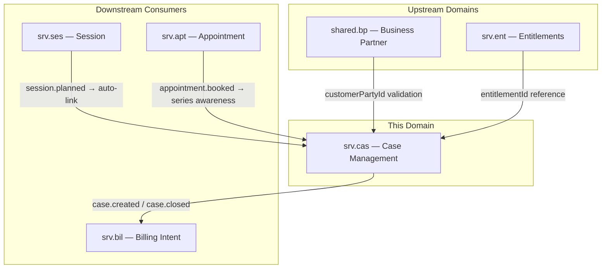
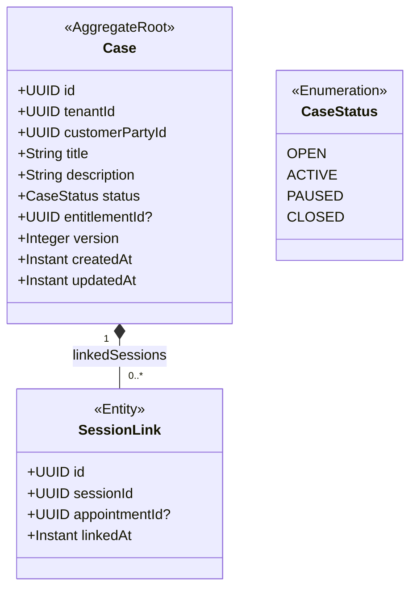
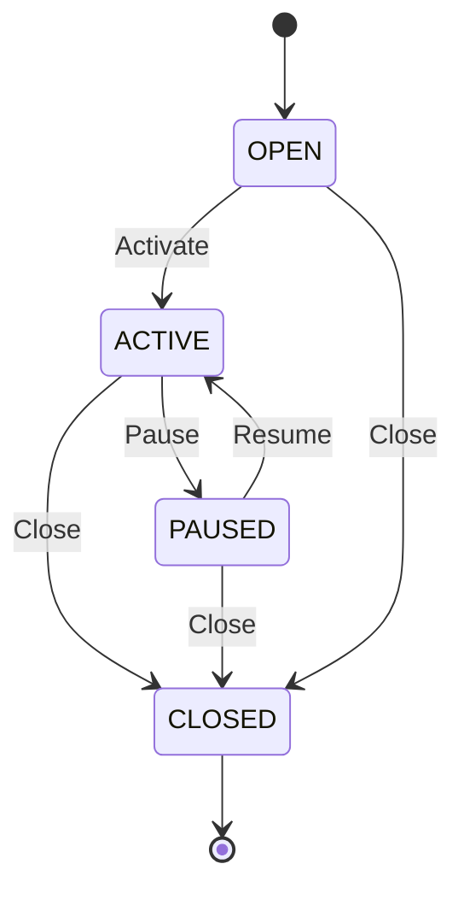
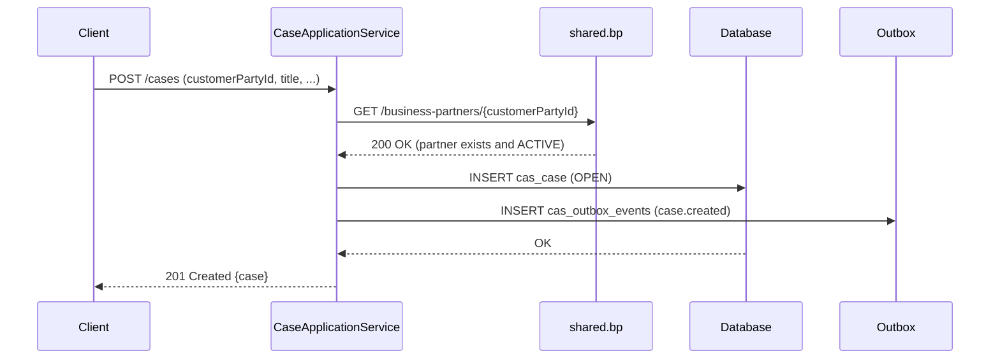
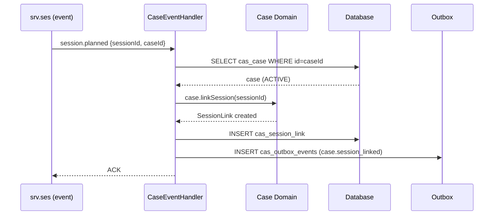
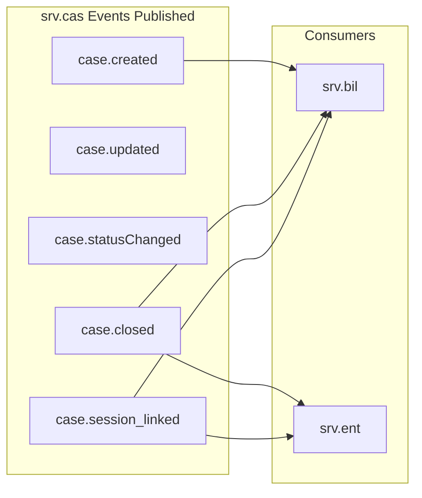
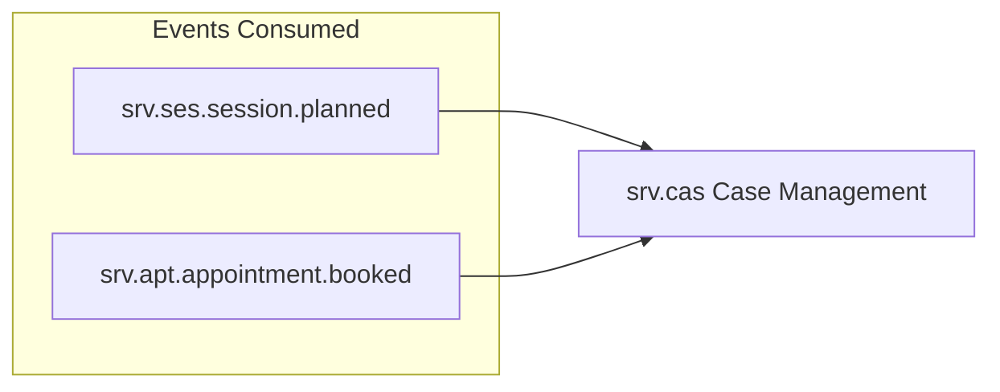
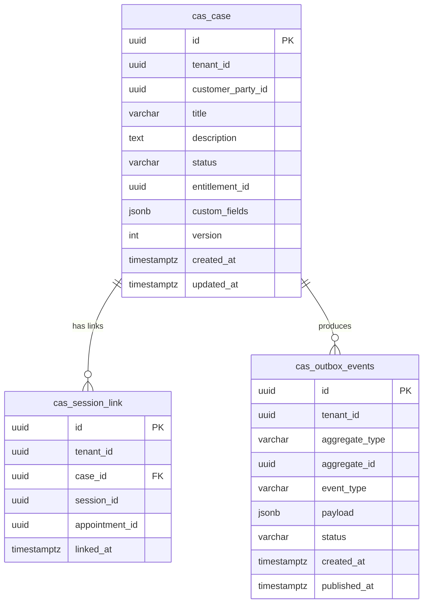

# Case Management — `srv.cas` Domain / Service Specification

> **Conceptual Stack Layer:** Domain / Service
> **Space:** Platform
> **Owner:** Domain Engineering Team
> **Schema alignment:** `service-layer.schema.json`
> **Companion files:** `openapi.yaml`, `*.schema.json` (event contracts)
> **Referenced by:** Platform-Feature Spec SS5 (backend dependencies), BFF Contract
> **Belongs to:** SRV Suite Spec (`_srv_suite.md`)

> **Meta Information**
> - **Version:** 2026-04-03
> - **Template:** `domain-service-spec.md` v1.0.0
> - **Template Compliance:** ~95% — fully compliant; minor open questions remain on feature IDs and port assignment
> - **Author(s):** OpenLeap Architecture Team
> - **Status:** DRAFT
> - **Suite:** `srv`
> - **Domain:** `cas`
> - **Bounded Context Ref:** `bc:case-management`
> - **Service ID:** `srv-cas-svc`
> - **basePackage:** `io.openleap.srv.cas`
> - **API Base Path:** `/api/srv/cas/v1`
> - **OpenLeap Starter Version:** `v1`
> - **Port:** OPEN QUESTION — See Q-CAS-001
> - **Repository:** OPEN QUESTION — See Q-CAS-002
> - **Tags:** `case`, `management`, `longitudinal`, `srv`
> - **Team:**
>   - Name: `team-srv`
>   - Email: `srv-team@openleap.io`
>   - Slack: `#srv-team`

---

## Specification Guidelines Compliance

> ### Non-Negotiables
> - Never invent facts. If required info is missing, add an **OPEN QUESTION** entry.
> - Preserve intent and decisions. Only change meaning when explicitly requested.
> - Do not remove normative constraints unless they are explicitly replaced.
> - Keep the spec **self-contained**: no "see chat", no implicit context.
>
> ### Source of Truth Priority
> When sources conflict:
> 1. Spec (explicit) wins
> 2. Starter specs (implementation constraints) next
> 3. Guidelines (best practices) last
>
> Record conflicts in the **Decisions & Conflicts** section (see Section 14).
>
> ### Style Guide
> - Prefer short sentences and lists.
> - Use MUST/SHOULD/MAY for normative statements.
> - Keep terminology consistent (Aggregate, Domain Service, Application Service, Command, Event).
> - Avoid ambiguous words ("often", "maybe") unless explicitly noting uncertainty.
> - Keep examples minimal and clearly marked as examples.
> - Do not add implementation code unless the chapter explicitly requires it.

---

## 0. Document Purpose & Scope

### 0.1 Purpose

`srv.cas` specifies **case context management** that bundles multiple appointments and sessions into a coherent long-running narrative — a treatment case, training plan, curriculum journey, or consulting mandate. It provides the longitudinal anchor for service relationships that span multiple sessions, enabling structured plans, history, and cross-session reasoning.

### 0.2 Target Audience

- Product Owners & Business Stakeholders
- System Architects & Technical Leads
- Integration Engineers

### 0.3 Scope

**In Scope:**
- MUST manage case entity and lifecycle (OPEN → ACTIVE → PAUSED → CLOSED).
- MUST link case ↔ appointments ↔ sessions.
- MUST provide case history pointers (timeline, notes/doc references).
- SHOULD support case-level status and milestones.
- MAY provide grouping keys for billing aggregation.

**Out of Scope:**
- MUST NOT own commercial contract negotiation or pricing (→ `sd`/`com`).
- MUST NOT implement full project planning, WBS, or budgeting (→ `ps`).
- MUST NOT implement full regulated medical record scope (candidate industry suite).

### 0.4 Related Documents

| Document | Path | Type |
|----------|------|------|
| SRV Suite Spec | `T3_Domains/SRV/_srv_suite.md` | Suite spec |
| Appointment Service | `T3_Domains/SRV/srv_apt-spec.md` | Sibling domain |
| Session Service | `T3_Domains/SRV/srv_ses-spec.md` | Sibling domain |
| Entitlement Service | `T3_Domains/SRV/srv_ent-spec.md` | Sibling domain |
| Billing Intent Service | `T3_Domains/SRV/srv_bil-spec.md` | Sibling domain |
| Business Partner (shared) | `T2_Common/bp/` | Upstream reference |

---

## 1. Business Context

### 1.1 Domain Purpose

Provide the longitudinal anchor for service relationships that span multiple sessions. Where `srv.apt` manages individual appointment slots and `srv.ses` records individual session facts, `srv.cas` manages the overarching narrative: why the sessions are happening, where the customer is in their journey, and what the overall outcome is expected to be. This enables case-level reporting, milestone tracking, and billing aggregation across session boundaries.

### 1.2 Business Value

- Enables case-level reporting and billing aggregation across sessions.
- Provides a longitudinal view of customer service history.
- Supports structured treatment, training, and consulting plans.
- Allows service providers to reason across session boundaries (e.g., "has this patient had 10 of their prescribed 20 sessions?").
- Enables case-driven series scheduling: `srv.apt` can use the case as the booking context for recurring appointments.

### 1.3 Key Stakeholders

| Role | Responsibility | Primary Use Cases |
|------|----------------|-------------------|
| Service Provider (Therapist/Trainer/Consultant) | Manage cases | Open cases, link sessions, record milestones |
| Back Office | Review case history | Track progress, generate reports, support billing |
| Customer | View case status | See progress across sessions |
| Finance/Billing Clerk | Use case as billing grouping key | Reconcile billing intents against case entitlements |

### 1.4 Strategic Positioning

`srv.cas` sits at the intersection of service execution and case-oriented business processes. It complements `srv.ses` (individual session facts) and `srv.apt` (appointment scheduling) by providing the longitudinal container. Unlike `ps` (which owns full project planning and WBS), `srv.cas` is scoped to appointment-driven service delivery cases — a treatment series, a driving course, or a consulting engagement with a defined scope. Cross-industry verticals (medical, education, professional services) all benefit from case management as a longitudinal organizing principle.

The case acts as the primary grouping unit for entitlement consumption (`srv.ent`) and billing intent generation (`srv.bil`), making it a critical integration hub within the SRV suite.

### 1.5 Service Context

| Property | Value |
|----------|-------|
| **Suite** | `srv` |
| **Domain** | `cas` |
| **Bounded Context** | `bc:case-management` |
| **Service ID** | `srv-cas-svc` |
| **Base Package** | `io.openleap.srv.cas` |

**Responsibilities:**
- Own the case lifecycle (OPEN → ACTIVE → PAUSED → CLOSED).
- Associate cases to business partners (`shared.bp`) and SRV artifacts (appointments, sessions).
- Support case-driven series scheduling in cooperation with `srv.apt`.
- Provide case grouping key for billing aggregation in `srv.bil`.
- Support case-level milestones and notes references.

**Authoritative Sources:**

| Source Type | Description | Access Pattern |
|-------------|-------------|----------------|
| REST API | Case entities, session links, history | Synchronous |
| Database | Case records, session links | Direct (owner) |
| Events | Case lifecycle events | Asynchronous |



---

## 2. Service Identity

| Property | Value | Schema Field |
|----------|-------|-------------|
| **Service ID** | `srv-cas-svc` | `metadata.id` |
| **Display Name** | Case Management | `metadata.name` |
| **Suite** | `srv` | `metadata.suite` |
| **Domain** | `cas` | `metadata.domain` |
| **Bounded Context** | `bc:case-management` | `metadata.bounded_context_ref` |
| **Version** | `1.1.0` | `metadata.version` |
| **Status** | DRAFT | `metadata.status` |
| **API Base Path** | `/api/srv/cas/v1` | `metadata.api_base_path` |
| **Repository** | OPEN QUESTION — See Q-CAS-002 | `metadata.repository` |
| **Tags** | `case`, `management`, `longitudinal`, `srv` | `metadata.tags` |

**Team:**

| Property | Value |
|----------|-------|
| **Name** | `team-srv` |
| **Email** | `srv-team@openleap.io` |
| **Slack Channel** | `#srv-team` |

---

## 3. Domain Model

### 3.1 Conceptual Overview

The `srv.cas` domain centers on the **Case** aggregate — a longitudinal business container that groups multiple sessions and appointments under a single coherent narrative. A case has a defined lifecycle (OPEN → ACTIVE → PAUSED → CLOSED) and carries references to the customer (via `shared.bp`), an optional entitlement, and an ordered set of **SessionLinks** that trace which sessions have been delivered within the case context.

Cases serve as the primary unit of longitudinal service delivery: they answer "how far along is this customer?" and "what has been delivered so far?" They are the grouping key for billing aggregation and the narrative anchor for case notes and milestone tracking. Case management is analogous to the SAP IS-H patient encounter / case management module (IS-H CA) or SAP CRM service case management.

### 3.2 Core Concepts



### 3.3 Aggregate Definitions

#### 3.3.1 Case

| Property | Value |
|----------|-------|
| **Aggregate ID** | `agg:case` |
| **Name** | `Case` |

**Business Purpose:** A longitudinal business container bundling multiple appointments and sessions into a coherent narrative. The case is the primary unit of longitudinal service delivery — a treatment series, a training plan, or a consulting mandate. It carries the customer relationship, the entitlement reference, and the full set of linked sessions.

##### Aggregate Root

**Key Attributes:**

| Attribute | Type | Format | Description | Constraints | Required | Read-Only |
|-----------|------|--------|-------------|-------------|----------|-----------|
| id | string | uuid | System-generated unique identifier. Generated via `OlUuid.create()` (ADR-021). | Immutable | Yes | Yes |
| tenantId | string | uuid | Tenant that owns this case. Enforces row-level security. | Immutable | Yes | Yes |
| customerPartyId | string | uuid | Reference to the customer business partner in `shared.bp`. | Must resolve in `shared.bp` | Yes | No |
| title | string | — | Short human-readable label for the case (e.g., "Physiotherapy Q1 2026 — Smith, John"). | max_length: 255 | Yes | No |
| description | string | — | Free-text description of the case context, goals, or scope. | max_length: 2000 | No | No |
| status | string | — | Current lifecycle state of the case. | enum_ref: `CaseStatus` | Yes | No |
| entitlementId | string | uuid | Optional reference to a customer entitlement in `srv.ent` (e.g., a punch card or session quota). | — | No | No |
| version | integer | int64 | Optimistic locking version counter. Incremented on every mutation. | min: 1 | Yes | Yes |
| createdAt | string | date-time | Timestamp when the case was created (ISO-8601, UTC). | — | Yes | Yes |
| updatedAt | string | date-time | Timestamp of the last modification (ISO-8601, UTC). | — | Yes | Yes |

**Lifecycle States:**

| Property | Value |
|----------|-------|
| **Initial State** | `OPEN` |
| **Terminal States** | `CLOSED` |



**State Descriptions:**

| State | Description | Business Meaning |
|-------|-------------|------------------|
| OPEN | Newly created, not yet in active delivery | Case has been opened but first session not yet linked or delivered |
| ACTIVE | At least one session linked; delivery in progress | Sessions are being actively delivered under this case |
| PAUSED | Delivery temporarily suspended | Customer is on hold (e.g., illness, travel); no sessions expected |
| CLOSED | Case completed or terminated | All planned sessions delivered, or case abandoned; read-only |

**Allowed Transitions:**

| From State | To State | Trigger | Guard / Business Preconditions |
|------------|----------|---------|-------------------------------|
| OPEN | ACTIVE | `ActivateCase` command | Case has a valid `customerPartyId` |
| OPEN | CLOSED | `CloseCase` command | No precondition; direct close permitted |
| ACTIVE | PAUSED | `PauseCase` command | No active in-progress sessions |
| ACTIVE | CLOSED | `CloseCase` command | No precondition; forced close permitted |
| PAUSED | ACTIVE | `ResumeCase` command | No precondition |
| PAUSED | CLOSED | `CloseCase` command | No precondition |

**Invariants:**

| Rule ID | Description |
|---------|-------------|
| BR-001 | `customerPartyId` MUST reference a valid, active business partner in `shared.bp` |
| BR-002 | CLOSED cases MUST NOT accept new session links |
| BR-003 | A `SessionLink` MUST NOT be duplicated: each `sessionId` MUST appear at most once per case |

**Domain Events Emitted:**
- `srv.cas.case.created`
- `srv.cas.case.updated`
- `srv.cas.case.statusChanged`
- `srv.cas.case.closed`
- `srv.cas.case.session_linked`

##### Child Entities

###### Entity: SessionLink

| Property | Value |
|----------|-------|
| **Entity ID** | `ent:session-link` |
| **Name** | `SessionLink` |
| **Relationship to Root** | one_to_many |

**Business Purpose:** Links a session (and optionally its originating appointment) to a case for longitudinal tracking. A SessionLink is created either explicitly by the service provider or automatically when a session is planned and carries a `caseId`.

**Attributes:**

| Attribute | Type | Format | Description | Constraints | Required |
|-----------|------|--------|-------------|-------------|----------|
| id | string | uuid | Unique identifier for this link record. | — | Yes |
| sessionId | string | uuid | Reference to the session in `srv.ses`. | Must exist in `srv.ses` | Yes |
| appointmentId | string | uuid | Optional reference to the originating appointment in `srv.apt`. | — | No |
| linkedAt | string | date-time | Timestamp when the session was linked to this case. | — | Yes |

**Collection Constraints:**
- Minimum items: 0 (a case may be opened before any sessions are linked)
- Maximum items: OPEN QUESTION — See Q-CAS-003

**Invariants:**

| Rule ID | Description |
|---------|-------------|
| BR-002 | Sessions MUST NOT be linked to a CLOSED case |
| BR-003 | Each `sessionId` MUST appear at most once in `linkedSessions` |

### 3.4 Enumerations

#### CaseStatus

| Value | Description | Deprecated |
|-------|-------------|------------|
| `OPEN` | Newly created case, not yet in active delivery | No |
| `ACTIVE` | Case is in active delivery with sessions being linked and conducted | No |
| `PAUSED` | Case temporarily suspended; no new sessions expected until resumed | No |
| `CLOSED` | Case completed or terminated; all mutations blocked | No |

### 3.5 Shared Types

No shared value objects are used within `srv.cas` that are not already defined in upstream shared modules. The `customerPartyId` and `entitlementId` are plain UUID references to entities owned by `shared.bp` and `srv.ent` respectively. If a `Money` type is required for billing aggregation hints, it MUST be sourced from the shared types catalog.

> OPEN QUESTION: See Q-CAS-004 regarding whether `srv.cas` should carry a `plannedSessionCount` or similar quota counter from the entitlement.

---

## 4. Business Rules & Constraints

### 4.1 Business Rules Catalog

| ID | Rule Name | Description | Scope | Enforcement | Error Code |
|----|-----------|-------------|-------|-------------|------------|
| BR-001 | Valid Customer Reference | `customerPartyId` MUST reference a valid, active business partner | Case | Create | `CAS_INVALID_CUSTOMER` |
| BR-002 | No Session Links After Close | CLOSED cases MUST NOT accept new session links | Case | LinkSession | `CAS_CASE_CLOSED` |
| BR-003 | No Duplicate Session Link | Each `sessionId` MUST appear at most once per case | SessionLink | LinkSession | `CAS_SESSION_ALREADY_LINKED` |

### 4.2 Detailed Rule Definitions

#### BR-001: Valid Customer Reference

**Business Context:** A case must always be traceable to a customer. Without a valid customer reference, billing aggregation, reporting, and audit trails cannot be maintained.

**Rule Statement:** Before a Case is created, the `customerPartyId` MUST resolve to an active BusinessPartner record in `shared.bp`.

**Applies To:**
- Aggregate: `Case`
- Operations: Create

**Enforcement:** The Application Service calls `shared.bp` REST API to validate existence and active status before persisting the Case.

**Validation Logic:** If `shared.bp GET /api/shared/bp/v1/business-partners/{customerPartyId}` returns 404 or the partner's status is not ACTIVE, reject the create operation.

**Error Handling:**
- **Error Code:** `CAS_INVALID_CUSTOMER`
- **Error Message:** "Customer business partner '{customerPartyId}' does not exist or is not active."
- **User action:** Verify the customer reference and ensure the business partner record is active in the system.

**Examples:**
- **Valid:** `customerPartyId` = UUID of an ACTIVE BusinessPartner → case created successfully.
- **Invalid:** `customerPartyId` = UUID of a SUSPENDED or non-existent partner → HTTP 422.

---

#### BR-002: No Session Links After Close

**Business Context:** A CLOSED case represents a completed or terminated engagement. Permitting new session links would corrupt the historical record and distort billing aggregation.

**Rule Statement:** When `LinkSession` is attempted on a Case with status `CLOSED`, the operation MUST be rejected.

**Applies To:**
- Aggregate: `Case`
- Operations: LinkSession

**Enforcement:** Domain object invariant check in `Case.linkSession()` before state mutation.

**Validation Logic:** If `case.status == CLOSED`, throw `CaseClosedException` with code `CAS_CASE_CLOSED`.

**Error Handling:**
- **Error Code:** `CAS_CASE_CLOSED`
- **Error Message:** "Cannot link session to case '{caseId}': case is CLOSED."
- **User action:** If the session belongs to this case, re-open the case first (if policy allows) or create a new case.

**Examples:**
- **Valid:** Linking a session to an ACTIVE case → SessionLink created.
- **Invalid:** Linking a session to a CLOSED case → HTTP 422.

---

#### BR-003: No Duplicate Session Link

**Business Context:** A session represents a unique delivery event. Linking the same session twice to a case would corrupt session counts, entitlement consumption calculations, and billing aggregation.

**Rule Statement:** Each `sessionId` MUST appear at most once in the `linkedSessions` collection of a Case.

**Applies To:**
- Aggregate: `Case`
- Operations: LinkSession

**Enforcement:** Unique constraint `uk_cas_link_session (tenant_id, case_id, session_id)` in the database (ADR-016). Application Service also checks before insert.

**Validation Logic:** If a SessionLink with the same `sessionId` already exists for this case, reject the operation.

**Error Handling:**
- **Error Code:** `CAS_SESSION_ALREADY_LINKED`
- **Error Message:** "Session '{sessionId}' is already linked to case '{caseId}'."
- **User action:** No action needed — the session is already recorded under this case.

**Examples:**
- **Valid:** Linking session A to case X for the first time → SessionLink created.
- **Invalid:** Linking session A to case X a second time → HTTP 409.

### 4.3 Data Validation Rules

**Field-Level Validations:**

| Field | Validation Rule | Error Message |
|-------|----------------|---------------|
| `customerPartyId` | Required, UUID format | "customerPartyId is required and must be a valid UUID." |
| `customerPartyId` | Must exist and be ACTIVE in `shared.bp` | "Customer business partner does not exist or is not active." |
| `title` | Required, max 255 characters | "title is required and must not exceed 255 characters." |
| `description` | Optional, max 2000 characters | "description must not exceed 2000 characters." |
| `status` | Must be a valid CaseStatus value | "status must be one of: OPEN, ACTIVE, PAUSED, CLOSED." |
| `entitlementId` | Optional, UUID format if present | "entitlementId must be a valid UUID." |
| `sessionId` (SessionLink) | Required, UUID format | "sessionId is required and must be a valid UUID." |
| `appointmentId` (SessionLink) | Optional, UUID format if present | "appointmentId must be a valid UUID." |

**Cross-Field Validations:**
- A `CloseCase` operation on an ACTIVE or PAUSED case is permitted without preconditions; the service does not require sessions to be linked first (use BR-002 enforcement is only for additions to closed cases).
- If `entitlementId` is provided, SHOULD be validated against `srv.ent` at create time (OPEN QUESTION: See Q-CAS-004).

### 4.4 Reference Data Dependencies

| Catalog | Source Service | Fields Referencing | Validation |
|---------|----------------|--------------------|------------|
| BusinessPartner | `shared.bp` (`/api/shared/bp/v1/business-partners/{id}`) | `customerPartyId` | Existence + ACTIVE status check at case creation |
| Entitlement | `srv.ent` (`/api/srv/ent/v1/entitlements/{id}`) | `entitlementId` | Existence check at case creation (if provided) |
| Session | `srv.ses` (`/api/srv/ses/v1/sessions/{id}`) | `SessionLink.sessionId` | Existence check at session link time |
| Appointment | `srv.apt` (`/api/srv/apt/v1/appointments/{id}`) | `SessionLink.appointmentId` | Existence check if provided (non-blocking) |

---

## 5. Use Cases

### 5.1 Business Logic Placement

| Logic Type | Placement | Examples |
|------------|-----------|----------|
| Aggregate invariants | Domain Object (`Case`) | Status transition guards, duplicate session check, closed-case protection |
| Cross-aggregate logic | Domain Service | None required currently (all logic is within the `Case` aggregate) |
| Orchestration & transactions | Application Service | Customer validation against `shared.bp`, entitlement validation against `srv.ent`, event publishing via outbox |

### 5.2 Use Cases (Canonical Format)

#### UC-001: CreateCase

| Field | Value |
|-------|-------|
| **id** | `CreateCase` |
| **type** | WRITE |
| **trigger** | REST |
| **aggregate** | `Case` |
| **domainOperation** | `Case.create` |
| **inputs** | `customerPartyId: UUID`, `title: String`, `description: String?`, `entitlementId: UUID?` |
| **outputs** | `Case` |
| **events** | `srv.cas.case.created` |
| **rest** | `POST /api/srv/cas/v1/cases` |
| **idempotency** | required |

**Actor:** Service Provider, Back Office

**Preconditions:**
- Caller is authenticated with role `SRV_CAS_EDITOR` or higher.
- `customerPartyId` references an ACTIVE BusinessPartner in `shared.bp`.
- If `entitlementId` is provided, it MUST exist in `srv.ent`.

**Main Flow:**
1. Actor submits CreateCase request with `customerPartyId`, `title`, and optional fields.
2. Application Service validates `customerPartyId` against `shared.bp`.
3. Application Service validates `entitlementId` against `srv.ent` (if provided).
4. Domain creates new `Case` in OPEN state with `OlUuid.create()` as id.
5. Case is persisted via repository.
6. `srv.cas.case.created` event is published via outbox (ADR-013).
7. HTTP 201 Created with case representation is returned.

**Postconditions:**
- `Case` exists in OPEN state.
- `srv.cas.case.created` event is in the outbox queue.

**Business Rules Applied:**
- BR-001: Valid Customer Reference

**Alternative Flows:**
- **Alt-1:** If `entitlementId` is provided and exists, it is stored on the case; no entitlement consumption occurs at this point.

**Exception Flows:**
- **Exc-1:** If `customerPartyId` does not exist or is not ACTIVE → HTTP 422, error code `CAS_INVALID_CUSTOMER`.
- **Exc-2:** If `entitlementId` is provided but not found → HTTP 422 (OPEN QUESTION: See Q-CAS-004).

---

#### UC-002: UpdateCase

| Field | Value |
|-------|-------|
| **id** | `UpdateCase` |
| **type** | WRITE |
| **trigger** | REST |
| **aggregate** | `Case` |
| **domainOperation** | `Case.update` |
| **inputs** | `id: UUID`, `title: String?`, `description: String?`, `entitlementId: UUID?`, `version: Integer` |
| **outputs** | `Case` |
| **events** | `srv.cas.case.updated` |
| **rest** | `PATCH /api/srv/cas/v1/cases/{id}` |
| **idempotency** | required (ETag / version) |

**Actor:** Service Provider, Back Office

**Preconditions:**
- Caller has role `SRV_CAS_EDITOR` or higher.
- Case exists and is not CLOSED.
- `version` in request matches current case version (optimistic locking).

**Main Flow:**
1. Actor submits PATCH with updated fields and current `version`.
2. Application Service loads case by id + tenantId.
3. Domain applies partial update.
4. Repository persists updated case (version incremented).
5. `srv.cas.case.updated` event published via outbox.
6. HTTP 200 OK with updated case returned.

**Postconditions:**
- Case reflects the updated attributes.
- `version` is incremented.

**Business Rules Applied:**
- None beyond closed-state check.

**Exception Flows:**
- **Exc-1:** Case not found → HTTP 404.
- **Exc-2:** Case is CLOSED → HTTP 422 (cannot update closed case).
- **Exc-3:** `version` mismatch → HTTP 412 Precondition Failed.

---

#### UC-003: CloseCase

| Field | Value |
|-------|-------|
| **id** | `CloseCase` |
| **type** | WRITE |
| **trigger** | REST |
| **aggregate** | `Case` |
| **domainOperation** | `Case.close` |
| **inputs** | `id: UUID`, `version: Integer` |
| **outputs** | `Case` |
| **events** | `srv.cas.case.closed`, `srv.cas.case.statusChanged` |
| **rest** | `POST /api/srv/cas/v1/cases/{id}:close` |

**Actor:** Service Provider, Back Office, Admin

**Preconditions:**
- Caller has role `SRV_CAS_ADMIN`.
- Case exists and is not already CLOSED.

**Main Flow:**
1. Actor submits close request.
2. Application Service loads case.
3. Domain transitions case to CLOSED state (from OPEN, ACTIVE, or PAUSED).
4. Repository persists the state change.
5. `srv.cas.case.closed` and `srv.cas.case.statusChanged` events published via outbox.
6. HTTP 200 OK with closed case returned.

**Postconditions:**
- Case is in CLOSED state.
- No further session links or mutations are accepted.

**Business Rules Applied:**
- (industry-specific hook: BR-EXT-001 if registered, see §12.6)

**Exception Flows:**
- **Exc-1:** Case already CLOSED → HTTP 409 Conflict.
- **Exc-2:** Case not found → HTTP 404.

---

#### UC-004: LinkSession

| Field | Value |
|-------|-------|
| **id** | `LinkSession` |
| **type** | WRITE |
| **trigger** | REST, Event (`srv.ses.session.planned`) |
| **aggregate** | `Case` |
| **domainOperation** | `Case.linkSession` |
| **inputs** | `caseId: UUID`, `sessionId: UUID`, `appointmentId: UUID?` |
| **outputs** | `Case` |
| **events** | `srv.cas.case.session_linked` |
| **rest** | `POST /api/srv/cas/v1/cases/{id}:link-session` |
| **errors** | `CAS_CASE_CLOSED`, `CAS_SESSION_ALREADY_LINKED` |
| **idempotency** | required (unique constraint prevents duplicate links) |

**Actor:** Service Provider, System (event-driven auto-link from `srv.ses`)

**Preconditions:**
- Case exists and is not CLOSED.
- `sessionId` exists in `srv.ses`.
- `sessionId` is not already linked to this case.

**Main Flow:**
1. Actor (or event handler) submits link request.
2. Application Service validates session existence in `srv.ses`.
3. Domain checks case is not CLOSED and session is not already linked.
4. `SessionLink` is created and added to case's `linkedSessions`.
5. Repository persists updated case.
6. `srv.cas.case.session_linked` event published via outbox.
7. HTTP 200 OK (REST) or ACK (event handler) returned.

**Postconditions:**
- `SessionLink` exists in case's `linkedSessions`.
- Session count on case implicitly increases.

**Business Rules Applied:**
- BR-002: No Session Links After Close
- BR-003: No Duplicate Session Link

**Alternative Flows:**
- **Alt-1 (event-driven):** When `srv.ses.session.planned` event is consumed and the session carries a `caseId`, the system auto-creates the SessionLink without REST call.

**Exception Flows:**
- **Exc-1:** Case is CLOSED → HTTP 422, `CAS_CASE_CLOSED`.
- **Exc-2:** Session already linked → HTTP 409, `CAS_SESSION_ALREADY_LINKED`.
- **Exc-3:** `sessionId` not found in `srv.ses` → HTTP 422.

---

#### UC-005: GetCase

| Field | Value |
|-------|-------|
| **id** | `GetCase` |
| **type** | READ |
| **trigger** | REST |
| **aggregate** | `Case` |
| **rest** | `GET /api/srv/cas/v1/cases/{id}` |
| **outputs** | `CaseView` (read model) |

**Actor:** Service Provider, Back Office, Customer (portal)

**Preconditions:**
- Caller has role `SRV_CAS_VIEWER` or higher.
- Case exists for the caller's tenant.

**Main Flow:**
1. Actor submits GET request.
2. Application Service queries read model by id + tenantId.
3. HTTP 200 OK with `CaseView` (includes linked sessions) returned.

**Postconditions:** No state change.

**Exception Flows:**
- **Exc-1:** Case not found → HTTP 404.

---

#### UC-006: SearchCases

| Field | Value |
|-------|-------|
| **id** | `SearchCases` |
| **type** | READ |
| **trigger** | REST |
| **rest** | `GET /api/srv/cas/v1/cases?customerPartyId=&status=&from=&to=&page=&size=` |
| **outputs** | `Page<CaseView>` |

**Actor:** Service Provider, Back Office

**Preconditions:**
- Caller has role `SRV_CAS_VIEWER` or higher.

**Main Flow:**
1. Actor submits GET with filter parameters.
2. Application Service queries read model with tenant + filter criteria.
3. HTTP 200 OK with paginated results returned.

**Postconditions:** No state change.

### 5.3 Process Flow Diagrams





### 5.4 Cross-Domain Workflows

#### Workflow: Auto-Link Session to Case

**Pattern:** Choreography (ADR-003, ADR-029)

**Trigger:** `srv.ses.session.planned` event containing `caseId` field.

**Participating Services:**

| Service | Role | Interaction |
|---------|------|-------------|
| `srv.ses` | Producer | Publishes `session.planned` event |
| `srv.cas` | Consumer | Consumes event, creates SessionLink |
| `srv.bil` | Downstream | Consumes `case.session_linked` for billing intent updates |

**Workflow Steps:**

1. Session is planned in `srv.ses` with optional `caseId` field.
2. `srv.ses` publishes `srv.ses.session.planned` event.
3. `srv.cas` event handler consumes the event.
4. If `caseId` is present and case is not CLOSED, a SessionLink is created.
5. `srv.cas.case.session_linked` event is published.
6. `srv.bil` (optional consumer) updates billing intent.

**Failure Handling:**
- If case is not found: event is logged and discarded (session is valid without a case link).
- If case is CLOSED: event is logged; no link created; no error — session stands alone.
- Retry: 3x with exponential backoff; after 3 failures → DLQ per ADR-014.

**Business Implications:**
- Auto-linking reduces manual work for service providers.
- Sessions can exist without a case — case linking is optional at the session level.

---

## 6. REST API

### 6.1 API Overview

**Base Path:** `/api/srv/cas/v1`
**Authentication:** OAuth2/JWT (Bearer token)
**Content-Type:** `application/json`
**Versioning:** URI versioning (`/v1`). Breaking changes require a new major version.

| Method | Path | Operation | Type |
|--------|------|-----------|------|
| POST | `/cases` | Create case | WRITE |
| PATCH | `/cases/{id}` | Update case | WRITE |
| POST | `/cases/{id}:close` | Close case | WRITE |
| POST | `/cases/{id}:link-session` | Link session to case | WRITE |
| GET | `/cases/{id}` | Get case by ID | READ |
| GET | `/cases` | Search cases | READ |

### 6.2 Resource Operations

#### 6.2.1 Cases — Create

```http
POST /api/srv/cas/v1/cases
Authorization: Bearer {token}
Content-Type: application/json
Idempotency-Key: {client-generated-uuid}
```

**Request Body:**
```json
{
  "customerPartyId": "3fa85f64-5717-4562-b3fc-2c963f66afa6",
  "title": "Physiotherapy Series Q1 2026 — Smith, John",
  "description": "10-session physiotherapy treatment for lower back injury.",
  "entitlementId": "7cb85f64-5717-4562-b3fc-2c963f66afb7"
}
```

**Success Response:** `201 Created`
```json
{
  "id": "a1b2c3d4-e5f6-7890-abcd-ef1234567890",
  "tenantId": "tenant-uuid",
  "customerPartyId": "3fa85f64-5717-4562-b3fc-2c963f66afa6",
  "title": "Physiotherapy Series Q1 2026 — Smith, John",
  "description": "10-session physiotherapy treatment for lower back injury.",
  "status": "OPEN",
  "entitlementId": "7cb85f64-5717-4562-b3fc-2c963f66afb7",
  "linkedSessions": [],
  "version": 1,
  "createdAt": "2026-04-03T09:00:00Z",
  "updatedAt": "2026-04-03T09:00:00Z",
  "_links": {
    "self": { "href": "/api/srv/cas/v1/cases/a1b2c3d4-e5f6-7890-abcd-ef1234567890" }
  }
}
```

**Response Headers:**
- `Location: /api/srv/cas/v1/cases/a1b2c3d4-e5f6-7890-abcd-ef1234567890`
- `ETag: "1"`

**Business Rules Checked:**
- BR-001: Valid Customer Reference

**Events Published:**
- `srv.cas.case.created`

**Error Responses:**
- `400 Bad Request` — Missing required fields or invalid format
- `422 Unprocessable Entity` — `CAS_INVALID_CUSTOMER` — customer not found or not active
- `422 Unprocessable Entity` — entitlement not found (if `entitlementId` provided)

---

#### 6.2.2 Cases — Update

```http
PATCH /api/srv/cas/v1/cases/{id}
Authorization: Bearer {token}
Content-Type: application/json
If-Match: "1"
```

**Request Body:**
```json
{
  "title": "Updated Case Title",
  "description": "Updated description.",
  "entitlementId": "new-entitlement-uuid",
  "version": 1
}
```

**Success Response:** `200 OK`
```json
{
  "id": "a1b2c3d4-e5f6-7890-abcd-ef1234567890",
  "title": "Updated Case Title",
  "status": "OPEN",
  "version": 2,
  "updatedAt": "2026-04-03T09:15:00Z",
  "_links": {
    "self": { "href": "/api/srv/cas/v1/cases/a1b2c3d4-e5f6-7890-abcd-ef1234567890" }
  }
}
```

**Response Headers:**
- `ETag: "2"`

**Events Published:**
- `srv.cas.case.updated`

**Error Responses:**
- `400 Bad Request` — Validation error
- `404 Not Found` — Case does not exist
- `409 Conflict` — Case is CLOSED
- `412 Precondition Failed` — ETag/version mismatch

---

#### 6.2.3 Cases — Get by ID

```http
GET /api/srv/cas/v1/cases/{id}
Authorization: Bearer {token}
```

**Success Response:** `200 OK`
```json
{
  "id": "a1b2c3d4-e5f6-7890-abcd-ef1234567890",
  "customerPartyId": "3fa85f64-5717-4562-b3fc-2c963f66afa6",
  "title": "Physiotherapy Series Q1 2026 — Smith, John",
  "status": "ACTIVE",
  "entitlementId": "7cb85f64-5717-4562-b3fc-2c963f66afb7",
  "linkedSessions": [
    {
      "id": "link-uuid-1",
      "sessionId": "session-uuid-1",
      "appointmentId": "appointment-uuid-1",
      "linkedAt": "2026-04-01T10:00:00Z"
    }
  ],
  "customFields": {},
  "version": 3,
  "createdAt": "2026-04-03T09:00:00Z",
  "updatedAt": "2026-04-03T10:30:00Z",
  "_links": {
    "self": { "href": "/api/srv/cas/v1/cases/a1b2c3d4-e5f6-7890-abcd-ef1234567890" }
  }
}
```

**Error Responses:**
- `404 Not Found` — Case does not exist

---

#### 6.2.4 Cases — Search

```http
GET /api/srv/cas/v1/cases?customerPartyId={uuid}&status=ACTIVE&from=2026-01-01&to=2026-12-31&page=0&size=20
Authorization: Bearer {token}
```

**Success Response:** `200 OK`
```json
{
  "content": [
    {
      "id": "a1b2c3d4-e5f6-7890-abcd-ef1234567890",
      "customerPartyId": "3fa85f64-5717-4562-b3fc-2c963f66afa6",
      "title": "Physiotherapy Series Q1 2026",
      "status": "ACTIVE",
      "sessionCount": 3,
      "createdAt": "2026-04-03T09:00:00Z"
    }
  ],
  "page": 0,
  "size": 20,
  "totalElements": 1,
  "totalPages": 1,
  "_links": {
    "self": { "href": "/api/srv/cas/v1/cases?page=0&size=20" }
  }
}
```

**Query Parameters:**

| Parameter | Type | Description |
|-----------|------|-------------|
| `customerPartyId` | UUID | Filter by customer |
| `status` | CaseStatus | Filter by status |
| `from` | date | Filter by `createdAt >= from` |
| `to` | date | Filter by `createdAt <= to` |
| `page` | integer | Page number (0-based) |
| `size` | integer | Page size (default: 20, max: 100) |

---

### 6.3 Business Operations

#### 6.3.1 Close Case

```http
POST /api/srv/cas/v1/cases/{id}:close
Authorization: Bearer {token}
Content-Type: application/json
```

**Request Body:**
```json
{
  "version": 3
}
```

**Success Response:** `200 OK`
```json
{
  "id": "a1b2c3d4-e5f6-7890-abcd-ef1234567890",
  "status": "CLOSED",
  "version": 4,
  "updatedAt": "2026-04-03T11:00:00Z"
}
```

**Events Published:**
- `srv.cas.case.closed`
- `srv.cas.case.statusChanged`

**Error Responses:**
- `404 Not Found` — Case not found
- `409 Conflict` — Case already CLOSED
- `412 Precondition Failed` — Version mismatch

---

#### 6.3.2 Link Session

```http
POST /api/srv/cas/v1/cases/{id}:link-session
Authorization: Bearer {token}
Content-Type: application/json
```

**Request Body:**
```json
{
  "sessionId": "session-uuid-1",
  "appointmentId": "appointment-uuid-1"
}
```

**Success Response:** `200 OK`
```json
{
  "id": "a1b2c3d4-e5f6-7890-abcd-ef1234567890",
  "status": "ACTIVE",
  "linkedSessions": [
    {
      "id": "link-uuid-new",
      "sessionId": "session-uuid-1",
      "appointmentId": "appointment-uuid-1",
      "linkedAt": "2026-04-03T11:05:00Z"
    }
  ],
  "version": 5
}
```

**Events Published:**
- `srv.cas.case.session_linked`

**Error Responses:**
- `404 Not Found` — Case not found
- `409 Conflict` — `CAS_SESSION_ALREADY_LINKED`
- `422 Unprocessable Entity` — `CAS_CASE_CLOSED`
- `422 Unprocessable Entity` — `sessionId` not found in `srv.ses`

---

### 6.4 OpenAPI Specification

| Property | Value |
|----------|-------|
| **Specification File** | `openapi.yaml` (co-located with service source) |
| **Format** | OpenAPI 3.1 |
| **Docs URL** | OPEN QUESTION — See Q-CAS-005 |
| **Schema Refs** | `cas_case.schema.json`, `cas_session_link.schema.json` |

---

## 7. Events & Integration

### 7.1 Architecture Pattern

**Pattern:** Event-driven choreography with outbox publishing (ADR-003, ADR-013).
**Message Broker:** RabbitMQ (as per SRV suite integration pattern).
**Exchange:** `srv.cas.events` (topic exchange).
**Outbox Table:** `cas_outbox_events` — all events are first written to the outbox within the same transaction as the state change; a relay process publishes to the broker (ADR-013).
**Delivery Guarantee:** At-least-once delivery (ADR-014). Consumers MUST be idempotent.
**Event Schema:** Thin events per ADR-011 — payload carries IDs and `changeType`, not full entity state. Consumers that need full state MUST query the REST API.

### 7.2 Published Events

**Exchange:** `srv.cas.events` (topic)

| Routing Key | Business Purpose |
|------------|------------------|
| `srv.cas.case.created` | New case opened |
| `srv.cas.case.updated` | Case attributes changed |
| `srv.cas.case.statusChanged` | Case status transitioned |
| `srv.cas.case.closed` | Case closed |
| `srv.cas.case.session_linked` | Session linked to case |

---

#### Event: Case.Created

**Routing Key:** `srv.cas.case.created`

**Business Purpose:** Signals that a new longitudinal case has been opened for a customer. Downstream consumers (e.g., `srv.bil`) may initialize billing context.

**When Published:** After `CreateCase` command is successfully processed.

**Payload Structure:**
```json
{
  "aggregateType": "srv.cas.case",
  "changeType": "created",
  "entityIds": ["a1b2c3d4-e5f6-7890-abcd-ef1234567890"],
  "version": 1,
  "occurredAt": "2026-04-03T09:00:00Z"
}
```

**Event Envelope:**
```json
{
  "eventId": "evt-uuid",
  "traceId": "trace-uuid",
  "tenantId": "tenant-uuid",
  "occurredAt": "2026-04-03T09:00:00Z",
  "producer": "srv.cas",
  "schemaRef": "https://schemas.openleap.io/srv/cas/case.created/v1.json",
  "payload": {
    "aggregateType": "srv.cas.case",
    "changeType": "created",
    "entityIds": ["a1b2c3d4-e5f6-7890-abcd-ef1234567890"],
    "version": 1,
    "occurredAt": "2026-04-03T09:00:00Z"
  }
}
```

**Known Consumers:**

| Consumer Service | Handler | Purpose | Processing Type |
|-----------------|---------|---------|-----------------|
| `srv.bil` | `CaseCreatedHandler` | Initialize billing context for the case | Async / eventually consistent |

---

#### Event: Case.Updated

**Routing Key:** `srv.cas.case.updated`

**Business Purpose:** Signals that case attributes (title, description, entitlementId) were changed. Consumers may need to refresh cached case metadata.

**When Published:** After `UpdateCase` command is successfully processed.

**Payload Structure:**
```json
{
  "aggregateType": "srv.cas.case",
  "changeType": "updated",
  "entityIds": ["a1b2c3d4-e5f6-7890-abcd-ef1234567890"],
  "version": 2,
  "occurredAt": "2026-04-03T09:15:00Z"
}
```

**Event Envelope:** Standard envelope (see `Case.Created` for format).

**Known Consumers:** None required currently.

---

#### Event: Case.StatusChanged

**Routing Key:** `srv.cas.case.statusChanged`

**Business Purpose:** Signals any status transition (OPEN→ACTIVE, ACTIVE→PAUSED, etc.). Allows consumers to react to all lifecycle changes through a single routing key.

**When Published:** After any status transition (Activate, Pause, Resume, Close).

**Payload Structure:**
```json
{
  "aggregateType": "srv.cas.case",
  "changeType": "statusChanged",
  "entityIds": ["a1b2c3d4-e5f6-7890-abcd-ef1234567890"],
  "version": 3,
  "occurredAt": "2026-04-03T10:00:00Z",
  "previousStatus": "ACTIVE",
  "newStatus": "PAUSED"
}
```

**Known Consumers:** None required currently.

---

#### Event: Case.Closed

**Routing Key:** `srv.cas.case.closed`

**Business Purpose:** Signals that a case has been closed. Downstream consumers (billing intent, entitlement) use this as the trigger for final reconciliation.

**When Published:** After `CloseCase` command is successfully processed.

**Payload Structure:**
```json
{
  "aggregateType": "srv.cas.case",
  "changeType": "closed",
  "entityIds": ["a1b2c3d4-e5f6-7890-abcd-ef1234567890"],
  "version": 4,
  "occurredAt": "2026-04-03T11:00:00Z"
}
```

**Event Envelope:** Standard envelope (see `Case.Created` for format).

**Known Consumers:**

| Consumer Service | Handler | Purpose | Processing Type |
|-----------------|---------|---------|-----------------|
| `srv.bil` | `CaseClosedHandler` | Trigger final billing intent reconciliation | Async |
| `srv.ent` | `CaseClosedHandler` | Mark entitlement consumption final | Async |

---

#### Event: Case.SessionLinked

**Routing Key:** `srv.cas.case.session_linked`

**Business Purpose:** Signals that a session has been linked to a case. Downstream consumers can update session counts, billing intent line items, or entitlement consumption.

**When Published:** After `LinkSession` command is successfully processed (REST or event-driven).

**Payload Structure:**
```json
{
  "aggregateType": "srv.cas.case",
  "changeType": "session_linked",
  "entityIds": ["a1b2c3d4-e5f6-7890-abcd-ef1234567890"],
  "sessionId": "session-uuid-1",
  "appointmentId": "appointment-uuid-1",
  "version": 5,
  "occurredAt": "2026-04-03T11:05:00Z"
}
```

**Event Envelope:** Standard envelope (see `Case.Created` for format).

**Known Consumers:**

| Consumer Service | Handler | Purpose | Processing Type |
|-----------------|---------|---------|-----------------|
| `srv.bil` | `CaseSessionLinkedHandler` | Add billing intent position | Async |
| `srv.ent` | `CaseSessionLinkedHandler` | Decrement entitlement quota | Async |

---

### 7.3 Consumed Events

#### Event: srv.ses.session.planned

**Routing Key:** `srv.ses.session.planned`
**Source:** `srv-ses-svc`
**Queue:** `srv.cas.in.srv.ses.events`
**Handler Class:** `SessionPlannedEventHandler`

**Business Logic:**
1. Deserialize event and extract `sessionId` and optional `caseId`.
2. If `caseId` is absent, discard event (session not case-linked).
3. Load case by `caseId` and `tenantId`.
4. If case not found: log warning, discard.
5. If case is CLOSED: log info, discard (no SessionLink created).
6. Otherwise: create SessionLink and publish `case.session_linked`.

**Queue Configuration:**
- Queue: `srv.cas.in.srv.ses.events`
- Exchange: `srv.ses.events`
- Binding Key: `srv.ses.session.planned`
- Dead Letter Queue: `srv.cas.dlq.srv.ses.session.planned`

**Failure Handling:** Retry 3x with exponential backoff (1s, 2s, 4s); after 3 failures → DLQ (ADR-014). DLQ messages are monitored and alerted.

---

#### Event: srv.apt.appointment.booked

**Routing Key:** `srv.apt.appointment.booked`
**Source:** `srv-apt-svc`
**Queue:** `srv.cas.in.srv.apt.events`
**Handler Class:** `AppointmentBookedEventHandler`

**Business Logic:**
1. Deserialize event and extract `appointmentId` and optional `caseId`.
2. If `caseId` is absent, discard.
3. Load case by `caseId` and `tenantId`.
4. Record appointment awareness on case (no SessionLink created at booking time — only at session-planned time).
5. Optionally update case `status` to ACTIVE if currently OPEN (OPEN QUESTION: See Q-CAS-006).

**Queue Configuration:**
- Queue: `srv.cas.in.srv.apt.events`
- Exchange: `srv.apt.events`
- Binding Key: `srv.apt.appointment.booked`
- Dead Letter Queue: `srv.cas.dlq.srv.apt.appointment.booked`

**Failure Handling:** Same as above — 3x retry → DLQ.

### 7.4 Event Flow Diagrams





### 7.5 Integration Points Summary

**Upstream Dependencies:**

| Service | Purpose | Integration Type | Criticality | Endpoint Used | Fallback |
|---------|---------|-----------------|-------------|---------------|---------|
| `shared.bp` | Validate `customerPartyId` | REST (synchronous) | High | `GET /api/shared/bp/v1/business-partners/{id}` | Reject create if unreachable |
| `srv.ent` | Validate `entitlementId` | REST (synchronous) | Medium | `GET /api/srv/ent/v1/entitlements/{id}` | Warn if unreachable; OPEN QUESTION (Q-CAS-004) |
| `srv.ses` | Validate `sessionId` at link time | REST (synchronous) | High | `GET /api/srv/ses/v1/sessions/{id}` | Reject link if unreachable |

**Downstream Consumers:**

| Service | Consumed Events | Integration Type | Criticality |
|---------|----------------|-----------------|-------------|
| `srv.bil` | `case.created`, `case.closed`, `case.session_linked` | Event (async) | High |
| `srv.ent` | `case.closed`, `case.session_linked` | Event (async) | Medium |

---

## 8. Data Model

### 8.1 Storage Technology

**Database:** PostgreSQL (ADR-016). Row-Level Security enforced via `tenant_id` column on every table. UUID primary keys generated via `OlUuid.create()` (ADR-021). All tables follow the dual-key pattern (ADR-020): UUID PK + business key UK where applicable.

### 8.2 Conceptual Data Model



### 8.3 Table Definitions

#### Table: cas_case

**Business Description:** Stores the primary case entity — the longitudinal container for a service engagement. One row per case per tenant.

**Columns:**

| Column | Type | Nullable | PK | FK | Description |
|--------|------|----------|----|----|-------------|
| id | UUID | NOT NULL | Yes | — | System-generated UUID (ADR-021). Immutable. |
| tenant_id | UUID | NOT NULL | — | — | Tenant isolation. Used for RLS policies. |
| customer_party_id | UUID | NOT NULL | — | — | Reference to BusinessPartner in `shared.bp`. Not enforced via DB FK (external service). |
| title | VARCHAR(255) | NOT NULL | — | — | Short human-readable case label. |
| description | TEXT | NULL | — | — | Extended case description. |
| status | VARCHAR(20) | NOT NULL | — | — | CaseStatus enum value: OPEN, ACTIVE, PAUSED, CLOSED. |
| entitlement_id | UUID | NULL | — | — | Optional reference to entitlement in `srv.ent`. |
| custom_fields | JSONB | NOT NULL | — | — | Product-defined extension fields. Default: `{}`. |
| version | INTEGER | NOT NULL | — | — | Optimistic locking counter. Starts at 1. |
| created_at | TIMESTAMPTZ | NOT NULL | — | — | Creation timestamp (UTC). Set once. |
| updated_at | TIMESTAMPTZ | NOT NULL | — | — | Last modification timestamp (UTC). Updated on every mutation. |

**Indexes:**

| Index Name | Columns | Unique |
|------------|---------|--------|
| pk_cas_case | id | Yes |
| idx_cas_case_tenant_customer | tenant_id, customer_party_id | No |
| idx_cas_case_tenant_status | tenant_id, status | No |
| idx_cas_case_custom_fields | custom_fields (GIN) | No |

**Relationships:**
- To `cas_session_link`: one-to-many via `case_id`
- To `cas_outbox_events`: one-to-many via `aggregate_id`

**Data Retention:**
- Soft delete: CLOSED status serves as logical end state; rows are not physically deleted.
- Hard delete: after tenant data retention period expires (configurable; default 7 years for compliance).

---

#### Table: cas_session_link

**Business Description:** Stores the association between a Case and a Session (and optionally an Appointment). One row per case-session link per tenant.

**Columns:**

| Column | Type | Nullable | PK | FK | Description |
|--------|------|----------|----|----|-------------|
| id | UUID | NOT NULL | Yes | — | System-generated UUID (ADR-021). |
| tenant_id | UUID | NOT NULL | — | — | Tenant isolation. Matches parent case's tenant_id. |
| case_id | UUID | NOT NULL | — | cas_case.id | Reference to the owning case. |
| session_id | UUID | NOT NULL | — | — | Reference to session in `srv.ses` (external, no DB FK). |
| appointment_id | UUID | NULL | — | — | Optional reference to appointment in `srv.apt`. |
| linked_at | TIMESTAMPTZ | NOT NULL | — | — | Timestamp when the link was created. |

**Indexes:**

| Index Name | Columns | Unique |
|------------|---------|--------|
| pk_cas_session_link | id | Yes |
| idx_cas_link_case | tenant_id, case_id | No |
| uk_cas_link_session | tenant_id, case_id, session_id | Yes |

**Relationships:**
- To `cas_case`: many-to-one via `case_id`

**Data Retention:**
- Deleted when the parent case is hard-deleted.

---

#### Table: cas_outbox_events

**Business Description:** Outbox table for reliable event publishing (ADR-013). Events are written to this table in the same transaction as the aggregate state change. A separate relay process publishes them to RabbitMQ.

**Columns:**

| Column | Type | Nullable | PK | FK | Description |
|--------|------|----------|----|----|-------------|
| id | UUID | NOT NULL | Yes | — | Unique event record ID. |
| tenant_id | UUID | NOT NULL | — | — | Tenant context. |
| aggregate_type | VARCHAR(100) | NOT NULL | — | — | Aggregate type (e.g., `srv.cas.case`). |
| aggregate_id | UUID | NOT NULL | — | — | ID of the affected aggregate. |
| event_type | VARCHAR(100) | NOT NULL | — | — | Routing key (e.g., `srv.cas.case.created`). |
| payload | JSONB | NOT NULL | — | — | Serialized event envelope. |
| status | VARCHAR(20) | NOT NULL | — | — | PENDING, PUBLISHED, FAILED. |
| created_at | TIMESTAMPTZ | NOT NULL | — | — | When the event was written to the outbox. |
| published_at | TIMESTAMPTZ | NULL | — | — | When the event was successfully published to the broker. |

**Indexes:**

| Index Name | Columns | Unique |
|------------|---------|--------|
| pk_cas_outbox | id | Yes |
| idx_cas_outbox_status | status, created_at | No |

**Data Retention:**
- PUBLISHED events: retained 30 days for audit purposes, then purged.
- FAILED events: retained indefinitely until manually resolved.

### 8.4 Reference Data Dependencies

| External Entity | Owning Service | Referenced By | Validation Point |
|----------------|---------------|---------------|-----------------|
| BusinessPartner | `shared.bp` | `cas_case.customer_party_id` | Case create — synchronous REST call |
| Entitlement | `srv.ent` | `cas_case.entitlement_id` | Case create — synchronous REST call (if provided) |
| Session | `srv.ses` | `cas_session_link.session_id` | LinkSession — synchronous REST call |
| Appointment | `srv.apt` | `cas_session_link.appointment_id` | LinkSession — non-blocking REST call (if provided) |

---

## 9. Security & Compliance

### 9.1 Data Classification

**Overall Classification:** Confidential — cases reference customer identities and longitudinal service records.

| Data Element | Classification | Rationale | Protection Measures |
|--------------|----------------|-----------|---------------------|
| `customerPartyId` | Confidential | Links to identifiable person | RLS, role-based access |
| `title` / `description` | Confidential | May contain health, training, or consulting details | RLS, role-based access |
| `entitlementId` | Internal | Business operational data | RLS |
| `linkedSessions` | Confidential | Session records may contain personal service data | RLS, role-based access |
| `custom_fields` | Confidential (variable) | May carry product-specific personal data | Field-level security per custom field definition |
| `cas_outbox_events.payload` | Confidential | Contains entity IDs linking to personal records | DB access restricted to service account |

### 9.2 Access Control

**Roles & Permissions:**

| Role | Permissions | Scope |
|------|------------|-------|
| `SRV_CAS_VIEWER` | Read cases and session links | Own tenant, customer-scoped if applicable |
| `SRV_CAS_EDITOR` | Create cases, update cases, link sessions | Own tenant |
| `SRV_CAS_ADMIN` | All EDITOR permissions + close cases, manage corrections | Own tenant |

**Permission Matrix:**

| Operation | SRV_CAS_VIEWER | SRV_CAS_EDITOR | SRV_CAS_ADMIN |
|-----------|----------------|----------------|----------------|
| GET /cases | Yes | Yes | Yes |
| GET /cases/{id} | Yes | Yes | Yes |
| POST /cases | No | Yes | Yes |
| PATCH /cases/{id} | No | Yes | Yes |
| POST /cases/{id}:close | No | No | Yes |
| POST /cases/{id}:link-session | No | Yes | Yes |

**Data Isolation:**
- Row-Level Security (RLS) is enforced via `tenant_id` on all tables. Queries MUST include `tenant_id` as a filter condition. The service runtime injects `tenant_id` from the JWT claim; it MUST NOT be settable by API callers.

### 9.3 Compliance Requirements

| Regulation | Applicability | Key Controls |
|------------|--------------|-------------|
| GDPR | Yes — personal data (customerPartyId links to a natural person) | Right to erasure: hard delete of case records when customer data is purged. Data portability: export via case GET API. Audit trail: `cas_outbox_events`. |
| Industry-specific (e.g., medical, educational) | Possible — depends on deployment context | OPEN QUESTION: See Q-CAS-007 |

**GDPR Controls:**
- **Right to Erasure:** When a BusinessPartner (customer) is deleted in `shared.bp`, all `cas_case` records and their `cas_session_link` children for that customer MUST be hard-deleted or anonymized. This is triggered by the `bp.businessPartner.deleted` event (OPEN QUESTION: See Q-CAS-008).
- **Data Portability:** Full case history (including session links) is available via `GET /cases?customerPartyId={id}`.
- **Audit Trail:** All state changes are recorded via outbox events with `traceId` and `tenantId`.
- **Data Retention:** Configurable per tenant; default 7 years; hard delete after expiry.

---

## 10. Quality Attributes

### 10.1 Performance Requirements

**Latency:**
- Read operations (`GET /cases`, `GET /cases/{id}`): < 100ms (p95)
- Write operations (`POST /cases`, `PATCH /cases/{id}`): < 200ms (p95)
- Business operations (`POST /cases/{id}:close`, `POST /cases/{id}:link-session`): < 200ms (p95)

**Throughput:**
- Peak read: 200 requests/sec per tenant cluster
- Peak write: 50 requests/sec per tenant cluster
- Event processing: 100 events/sec (session.planned auto-link)

**Concurrency:**
- Simultaneous API users: up to 500 per tenant cluster
- Concurrent case mutations: managed via optimistic locking (ADR-002); no pessimistic locks.

### 10.2 Availability & Reliability

**Targets:**
- Availability: 99.9% (8.76 h downtime/year)
- RTO: 4 hours (Recovery Time Objective)
- RPO: 1 hour (Recovery Point Objective)

**Failure Scenarios:**

| Scenario | Impact | Mitigation |
|----------|--------|------------|
| Database failure | Full service outage | Automatic failover to PostgreSQL replica; health check alerts |
| `shared.bp` unreachable | Case creation blocked | Circuit breaker; return 503 with retry-after header |
| `srv.ses` unreachable | LinkSession REST blocked | Circuit breaker; event-driven path still works |
| RabbitMQ broker outage | Events accumulate in outbox | Outbox relay retries; no data loss; events published when broker recovers |
| Outbox relay failure | Events delayed | Monitoring alert on outbox PENDING age > 5 min |

### 10.3 Scalability

**Horizontal Scaling:** The service is stateless (all state in PostgreSQL); multiple instances can run behind a load balancer.

**Database Scaling:**
- Read replicas: SHOULD be used for `SearchCases` queries to offload primary.
- Connection pooling: PgBouncer or equivalent (HikariCP defaults per ADR-016).

**Event Consumer Scaling:**
- Multiple consumer instances can consume in parallel (RabbitMQ competing consumers).
- Idempotency key: `sessionId + caseId` ensures safe reprocessing.

**Capacity Planning:**
- Data growth: estimate 10 cases/customer/year average; 100K customers per tenant → ~1M case rows/year.
- Storage per row (cas_case): ~1 KB average → 1 GB/year/tenant at scale.
- Session links: ~10 links/case → 10M rows/year/tenant at scale; `cas_session_link` table partitioned by `created_at` if needed.

### 10.4 Maintainability

**API Versioning:** URI versioning (`/v1`). New major version (`/v2`) required for breaking changes. `/v1` MUST be maintained for minimum 12 months after `/v2` launch.

**Backward Compatibility:** New optional fields MAY be added to responses without a version bump. Removing fields or changing types requires a new major version.

**Monitoring:**
- Health check endpoint: `GET /actuator/health`
- Metrics: Micrometer → Prometheus → Grafana
- Key metrics: request latency (p50, p95, p99), error rate, outbox queue depth, DLQ depth.

**Alerting Thresholds:**
- Error rate > 1% over 5 min → PagerDuty P2
- p95 latency > 500ms over 5 min → PagerDuty P3
- Outbox PENDING events older than 10 min → PagerDuty P2
- DLQ depth > 0 → PagerDuty P1

---

## 11. Feature Dependencies

### 11.1 Purpose

This section documents which platform features depend on `srv.cas` endpoints. Features reference this service in their SS5 (Backend Dependencies) section. This mapping enables BFF architects to understand which API endpoints must be available for a given feature to function, and supports impact assessment when the service API changes.

### 11.2 Feature Dependency Register

| Feature ID | Feature Name | Dependency Type | Endpoints Used | Status |
|------------|-------------|-----------------|----------------|--------|
| F-SRV-005 | Case Management | sync_api (owner) | All `/cases` endpoints | planned |
| F-SRV-005-01 | Create Case | sync_api (owner) | `POST /cases` | planned |
| F-SRV-005-02 | View Case History | sync_api (read) | `GET /cases/{id}`, `GET /cases` | planned |
| F-SRV-005-03 | Close Case | sync_api (owner) | `POST /cases/{id}:close` | planned |
| F-SRV-005-04 | Link Session to Case | sync_api (owner) | `POST /cases/{id}:link-session` | planned |

> OPEN QUESTION: See Q-CAS-009 — Confirm exact feature IDs from the SRV suite feature catalog.

### 11.3 Endpoints per Feature

| Endpoint | HTTP Method | Feature IDs |
|----------|-------------|-------------|
| `/cases` | POST | F-SRV-005-01 |
| `/cases/{id}` | PATCH | F-SRV-005 |
| `/cases/{id}:close` | POST | F-SRV-005-03 |
| `/cases/{id}:link-session` | POST | F-SRV-005-04 |
| `/cases/{id}` | GET | F-SRV-005-02 |
| `/cases` | GET | F-SRV-005-02 |

### 11.4 BFF Aggregation Hints

- The Case detail view (F-SRV-005-02) SHOULD aggregate case data with session summaries from `srv.ses` (GET by sessionId for each linked session). The BFF SHOULD batch these reads to avoid N+1 calls.
- Customer name resolution (for `customerPartyId`) SHOULD be resolved by the BFF from `shared.bp`, not embedded in the case response.
- The `customFields` object MUST be filtered by the BFF based on the user's permissions before rendering.

### 11.5 Impact Assessment

**If `GET /cases/{id}` changes response shape:**
- Features F-SRV-005-02 are directly affected.
- BFF route `srv-bff/cases/[id].get.ts` must be updated.

**If `POST /cases` adds required fields:**
- Feature F-SRV-005-01 form schema must be updated.
- BFF validation (Zod schema) must be updated.

**If case status enum adds a new value:**
- F-SRV-005-02 display logic and filter parameters must handle the new value.

---

## 12. Extension Points

### 12.1 Purpose

`srv.cas` is designed following the Open-Closed Principle: the platform is open for extension by product add-ons but closed for modification. Extension points allow product deployments to add custom fields, react to lifecycle events, inject custom validation rules, add product-specific actions, and intercept aggregate lifecycle hooks — without modifying the platform service itself.

Extension points are declared here (the domain service spec). Products fill them in their product spec (§17.5). Implementation uses the `core-extension` module (`io.openleap.starter`). See ADR-067 (extensibility architecture) and ADR-011 (custom fields) in `io.openleap.dev.guidelines`.

### 12.2 Custom Fields (extension-field)

#### Custom Fields: Case

**Extensible:** Yes

**Rationale:** Cases are customer-facing, cross-industry entities with high variance across deployments. A physiotherapy clinic needs different case metadata than a driving school or a consulting firm. Custom fields enable industry-specific additions without platform changes.

**Storage:** `custom_fields JSONB NOT NULL DEFAULT '{}'` on `cas_case`

**API Contract:**
- Custom fields are included in case REST responses under `customFields: { ... }`.
- Custom fields are accepted in create/update request bodies under `customFields: { ... }`.
- Validation failures return HTTP 422.

**Field-Level Security:** Custom field definitions carry `readPermission` and `writePermission`. The BFF MUST filter custom fields based on the user's permissions.

**Event Propagation:** Custom field values are NOT included in thin event payloads (ADR-011). Consumers requiring custom field values MUST query the REST API.

**Extension Candidates:**
- `caseTypeCode` — industry-specific case type classification (e.g., `TREATMENT`, `TRAINING`, `CONSULTING`)
- `referralSourceCode` — how the customer was referred (e.g., `INTERNAL`, `GP_REFERRAL`, `SELF_REFERRAL`)
- `plannedSessionCount` — target number of sessions for this case (e.g., "10 sessions prescribed")
- `internalNoteRef` — reference to an internal document or note system record
- `costCenterCode` — internal cost center for billing aggregation

#### Custom Fields: SessionLink

**Extensible:** No

**Rationale:** SessionLink is a thin join entity — its primary purpose is referential integrity. Extension complexity should live on the Case or Session, not on the link itself.

### 12.3 Extension Events

Product add-ons may register handlers for the following extension event hooks. These differ from integration events in §7 — they exist for product-level customization only (fire-and-forget semantics).

| Extension Event ID | Aggregate | Lifecycle Point | Description |
|-------------------|-----------|----------------|-------------|
| `ext.srv.cas.case.pre-close` | Case | Before CLOSED transition | Allows product to validate close preconditions (e.g., "all required sessions completed") |
| `ext.srv.cas.case.post-close` | Case | After CLOSED transition | Allows product to trigger follow-up actions (e.g., "send case summary email") |
| `ext.srv.cas.case.post-session-linked` | Case | After SessionLink created | Allows product to update external session counters or send progress notifications |

### 12.4 Extension Rules

Product add-ons may inject custom validation rules at the following lifecycle points:

| Rule Slot ID | Aggregate | Lifecycle Point | Default Behavior | Product Override Example |
|-------------|-----------|----------------|-----------------|--------------------------|
| `rule-slot-001` | Case | Pre-close validation | No additional checks | "Require all sessions to be in COMPLETED status before close" |
| `rule-slot-002` | Case | Pre-link-session validation | Check BR-002 + BR-003 only | "Session must have an outcome recorded before linking to case" |
| `rule-slot-003` | Case | Pre-create validation | Check BR-001 only | "Customer must have a verified identity (KYC check)" |

### 12.5 Extension Actions

Product add-ons may register custom actions that surface as buttons or operations in the case UI:

| Action Slot ID | Aggregate | Context | Description |
|---------------|-----------|---------|-------------|
| `action-slot-001` | Case | Case detail view | "Generate Case Summary Report" — triggers custom report generation |
| `action-slot-002` | Case | Case detail view | "Export to External System" — triggers legacy CRM/EMR export |
| `action-slot-003` | Case | Case list view | "Bulk Close Cases" — product-defined bulk operation |

### 12.6 Aggregate Hooks

#### Hook: pre-close

| Property | Value |
|----------|-------|
| **Hook ID** | `hook-001` |
| **Aggregate** | `Case` |
| **Lifecycle Point** | pre-close |
| **Hook Type** | validation |
| **Description** | Industry-specific closure validation (e.g., all required sessions completed, mandatory outcome recorded) |

**Hook Contract:**
- **Input:** `{ caseId: UUID, tenantId: UUID, linkedSessionCount: Integer, customFields: Object }`
- **Output:** `{ valid: Boolean, errorCode?: String, errorMessage?: String }`
- **Timeout:** 500ms (if hook times out, close proceeds with warning log)
- **Failure Mode:** Non-blocking by default (close proceeds); configurable to blocking per product deployment.

#### Hook: post-session-linked

| Property | Value |
|----------|-------|
| **Hook ID** | `hook-002` |
| **Aggregate** | `Case` |
| **Lifecycle Point** | post-session-linked |
| **Hook Type** | enrichment / notification |
| **Description** | Triggered after a session is linked; allows product to send progress notifications or update external counters |

**Hook Contract:**
- **Input:** `{ caseId: UUID, sessionId: UUID, appointmentId?: UUID, tenantId: UUID, totalLinkedSessions: Integer }`
- **Output:** void (fire-and-forget)
- **Timeout:** 1000ms
- **Failure Mode:** Non-blocking; logged but not retried.

### 12.7 Extension API Endpoints

```http
POST /api/srv/cas/v1/extensions/custom-fields/register
Authorization: Bearer {admin-token}
Content-Type: application/json
```

**Request Body:**
```json
{
  "aggregateType": "case",
  "fieldName": "caseTypeCode",
  "fieldType": "string",
  "required": false,
  "readPermission": "SRV_CAS_VIEWER",
  "writePermission": "SRV_CAS_EDITOR",
  "validValues": ["TREATMENT", "TRAINING", "CONSULTING"]
}
```

```http
GET /api/srv/cas/v1/extensions/custom-fields?aggregateType=case
Authorization: Bearer {token}
```

### 12.8 Extension Points Summary & Guidelines

**Quick-Reference Matrix:**

| Extension Type | Count | Aggregates | Status |
|---------------|-------|------------|--------|
| Custom Fields (extension-field) | 1 extensible | Case | Defined |
| Extension Events (extension-event) | 3 | Case | Defined |
| Extension Rules (extension-rule) | 3 slots | Case | Defined |
| Extension Actions (extension-action) | 3 slots | Case | Defined |
| Aggregate Hooks (aggregate-hook) | 2 | Case | Defined |

**Guidelines:**
- Custom fields MUST NOT store business-critical data (e.g., no financial amounts in custom fields).
- Extension rules MUST NOT replace platform business rules — they supplement them.
- Extension actions MUST be declared in the BFF spec and the feature spec's AUI screen contract.
- Aggregate hooks with blocking failure mode MUST have explicit product-level configuration; default is non-blocking.
- All extension points are tenant-scoped — extensions registered for Tenant A do not affect Tenant B.

---

## 13. Migration & Evolution

### 13.1 Data Migration

No legacy system migration is currently planned for `srv.cas`. This service is newly introduced in OpenLeap SRV v1.

**Legacy System Mapping (for reference, if migrating from SAP or similar):**

| Source (SAP/Legacy) | Target | Mapping Notes | Data Quality Risks |
|--------------------|--------|---------------|---------------------|
| IS-H CA: Patient Case (NFAL) | `cas_case` | Map case number to `title`, patient ID to `customerPartyId` | Patient ID must be mapped to `shared.bp` UUID first |
| CRM: Service Case (CRM_ORDER with case type) | `cas_case` | Map CRM case guid to `id` (via UUID mapping table), status mapping required | Status enum mismatch; CRM has more statuses |
| Custom session-tracking spreadsheets | `cas_session_link` | Manual ETL; session IDs must be created in `srv.ses` first | High data quality risk; gaps in historical records |

### 13.2 Deprecation & Sunset

No features are currently deprecated.

**Deprecated Features:**

| Feature | Deprecated In | Removed In | Replacement |
|---------|--------------|------------|-------------|
| — | — | — | — |

**Communication Plan:**
- Deprecation notice: 6 months before removal, announced via API changelog and `#srv-team` Slack.
- Migration guide: provided at deprecation announcement.
- Sunset: after `Removed In` version, endpoint returns HTTP 410 Gone.

**Future Evolution Notes:**
- Q-CAS-001 (port assignment) blocks service registry registration.
- Q-CAS-003 (max session links) may require table partitioning strategy if high-volume deployments emerge.
- Q-CAS-004 (entitlement integration depth) may require dedicated `CaseEntitlementService` if consumption logic grows complex.

---

## 14. Decisions & Open Questions

### 14.1 Consistency Checks

| Check | Status | Notes |
|-------|--------|-------|
| Every REST WRITE endpoint maps to exactly one WRITE use case | Pass | POST /cases → UC-001; PATCH /cases/{id} → UC-002; POST /cases/{id}:close → UC-003; POST /cases/{id}:link-session → UC-004 |
| Every WRITE use case maps to exactly one domain operation | Pass | UC-001 → `Case.create`; UC-002 → `Case.update`; UC-003 → `Case.close`; UC-004 → `Case.linkSession` |
| Events listed in use cases appear in §7 with schema refs | Pass | All 5 events documented in §7.2 with payload and envelope examples |
| Persistence and multitenancy assumptions consistent | Pass | All tables have `tenant_id`; RLS documented in §9.2; outbox table has `tenant_id` |
| No chapter contradicts another | Pass | Status lifecycle in §3.3 matches transitions in §5.2 and §6.3 |
| Feature dependencies (§11) align with feature spec SS5 refs | Partial | Feature IDs are provisional; pending Q-CAS-009 confirmation from SRV feature catalog |
| Extension points (§12) do not duplicate integration events (§7) | Pass | §12.3 extension events use `ext.` prefix; §7 events use `srv.cas.` prefix; no overlap |

### 14.2 Decisions & Conflicts

**Source Priority:** When sources conflict: (1) Spec (explicit) wins; (2) Starter specs (implementation constraints) next; (3) Guidelines (best practices) last.

| Decision ID | Decision | Rationale | Date |
|------------|----------|-----------|------|
| DEC-001 | Case aggregate is extensible (custom_fields JSONB) | Customer-facing entity with high cross-industry variance; fits ADR-067 criteria | 2026-04-03 |
| DEC-002 | SessionLink is NOT extensible | Thin join entity; extension complexity belongs on Case or Session | 2026-04-03 |
| DEC-003 | `statusChanged` event published on ALL transitions, `closed` event additionally on close | Allows consumers to filter by specific terminal event without parsing `statusChanged` | 2026-04-03 |
| DEC-004 | Auto-link from `session.planned` is non-blocking for missing/closed cases | Sessions are valid standalone; case linking is optional context, not mandatory | 2026-04-03 |
| DEC-005 | Pre-close hook is non-blocking by default | Platform must not be locked by product extension failures; configurable per deployment | 2026-04-03 |

### 14.3 Open Questions

| ID | Question | Why It Matters | Suggested Options | Owner |
|----|----------|----------------|-------------------|-------|
| Q-CAS-001 | What port is assigned to `srv-cas-svc`? | Required for service registry, Docker Compose, and local dev | A) Follow SRV port range convention (check `_srv_suite.md`), B) Assign next available port | TBD |
| Q-CAS-002 | What is the Git repository URI for `srv-cas-svc`? | Required for metadata and developer onboarding | A) `github.com/openleap/io.openleap.srv.cas`, B) Monorepo sub-module | TBD |
| Q-CAS-003 | Is there a maximum number of session links per case? | Affects UI pagination, storage estimates, and partitioning strategy | A) No hard limit (paginate UI), B) Soft limit (e.g., 500), C) Hard limit enforced as BR | TBD |
| Q-CAS-004 | Should `entitlementId` be validated against `srv.ent` at case creation? If so, should creation fail or warn? | Affects entitlement integrity and create operation reliability | A) Validate and fail on 404, B) Validate and warn (non-blocking), C) No validation at create time | TBD |
| Q-CAS-005 | What is the Swagger/OpenAPI docs URL for `srv-cas-svc`? | Required for §6.4 OpenAPI reference | A) `/api/srv/cas/swagger-ui.html`, B) Developer portal URL | TBD |
| Q-CAS-006 | Should consuming `apt.appointment.booked` with a `caseId` automatically transition the case from OPEN to ACTIVE? | Affects case lifecycle automation | A) Yes — first appointment booking activates case, B) No — explicit ActivateCase call required, C) Yes but only if explicitly configured | TBD |
| Q-CAS-007 | Does `srv.cas` operate in regulated industry contexts (medical, educational)? | Affects compliance requirements (HIPAA, SOC 2, etc.) | A) Medical (IS-H integration), B) Educational, C) General professional services, D) All of the above via product extension | TBD |
| Q-CAS-008 | How does `srv.cas` handle GDPR right-to-erasure when a customer is deleted in `shared.bp`? | Regulatory requirement; data must be erased | A) Subscribe to `bp.businessPartner.deleted` event and cascade delete, B) API endpoint called by `shared.bp` on delete | TBD |
| Q-CAS-009 | What are the exact feature IDs (F-SRV-005-xx) in the SRV suite feature catalog? | Required for §11 to be authoritative | Check `_srv_suite.md` features section and SRV feature specs | TBD |
| Q-CAS-010 | Do we need configurable "case types" per industry in `srv.cat` or via the custom fields extension model? | Affects extensibility architecture | A) Types in `srv.cat` (if that service exists), B) Custom field `caseTypeCode`, C) Dedicated `CaseType` aggregate in `srv.cas` | TBD (was Q-001) |
| Q-CAS-011 | Should `srv.cas` own "plan templates" (treatment/lesson plan templates) or only plan instances? | Affects scope boundary with `ps` suite | A) Templates + instances, B) Instances only (templates in `ps` or `srv.cat`), C) No templates — free-form cases only | TBD (was Q-002) |

### 14.4 ADRs

No domain-level ADRs have been formally raised for `srv.cas` yet. Candidate ADRs:

| Candidate ADR | Topic | Status |
|--------------|-------|--------|
| (pending) | Auto-link behavior when session.planned carries caseId | See DEC-004 and Q-CAS-006 |
| (pending) | Entitlement validation strategy at case creation | See Q-CAS-004 |

### 14.5 Suite-Level ADR References

The following platform ADRs from `io.openleap.dev.guidelines` apply to this service:

| ADR | Topic | Application in srv.cas |
|-----|-------|----------------------|
| ADR-001 | Four-tier layering | No cross-tier direct dependencies; `srv.cas` MUST NOT call `fi` or `sd` directly |
| ADR-002 | CQRS | Read model (`CaseView`) is separate from write model (`Case`); read endpoints query read model |
| ADR-003 | Event-driven architecture | Case lifecycle events published; session.planned consumed |
| ADR-004 | Hybrid ingress | LinkSession accepts both REST and event trigger |
| ADR-006 | Commands as Java records | `CreateCaseCommand`, `UpdateCaseCommand`, `CloseCaseCommand`, `LinkSessionCommand` |
| ADR-007 | Separate command handlers | One handler per command |
| ADR-008 | Central command gateway | Gateway dispatches all commands to handlers |
| ADR-011 | Thin events | Case events carry only IDs and changeType |
| ADR-013 | Outbox publishing | `cas_outbox_events` table; relay publishes to RabbitMQ |
| ADR-014 | At-least-once delivery | Consumers idempotent; 3x retry → DLQ |
| ADR-016 | PostgreSQL | All tables as specified in §8.3 |
| ADR-017 | Separate read/write models | `CaseView` read model for GET operations |
| ADR-020 | Dual-key pattern | `cas_case.id` (UUID PK) + no natural business key; `cas_session_link` has `uk_cas_link_session` |
| ADR-021 | OlUuid.create() | All UUID PKs generated via `OlUuid.create()` |
| ADR-029 | Saga orchestration | No orchestrated sagas currently; auto-link uses choreography |
| ADR-067 | Extensibility (JSONB custom fields) | `cas_case.custom_fields JSONB`; `cas_session_link` not extensible |

---

## 15. Appendix

### 15.1 Glossary

| Term | Definition | Aliases |
|------|------------|---------|
| Case | A longitudinal business container bundling multiple sessions and appointments into a coherent service engagement narrative | Fall, Vorgang, Behandlungsfall, Kursfall |
| Session Link | An association record between a Case and a Session (and optionally an Appointment) | — |
| Case Lifecycle | The state machine of a Case: OPEN → ACTIVE → PAUSED → CLOSED | — |
| Auto-Link | The automatic creation of a SessionLink triggered by the `srv.ses.session.planned` event when a session carries a `caseId` | — |
| Entitlement | A customer right to receive a defined number of services (e.g., 10 physiotherapy sessions). Owned by `srv.ent`. | Punch card, quota, session series |
| Billing Intent | A request from SRV to financial processing to generate a billing position. Owned by `srv.bil`. | — |
| Thin Event | An event carrying only entity IDs and changeType (not full entity state), per ADR-011 | Slim event |

### 15.2 References

| Reference | Description | Location |
|-----------|-------------|----------|
| TPL-SVC v1.0.0 | Domain Service Specification Template | `https://github.com/openleap-io/io.openleap.dev.concepts/blob/main/templates/platform/domain/domain-service-spec.md` |
| ADR-067 | Extensibility Architecture (JSONB custom fields) | `io.openleap.dev.guidelines` |
| ADR-013 | Outbox Publishing Pattern | `io.openleap.dev.guidelines` |
| ADR-011 | Thin Events | `io.openleap.dev.guidelines` |
| SAP IS-H CA | Patient Case Management reference | SAP Help Portal (IS-H) |
| SAP CRM Case Management | Service case management reference | SAP Help Portal (CRM) |
| `_srv_suite.md` | SRV Suite Architecture Specification | `T3_Domains/SRV/_srv_suite.md` |

### 15.3 Status Output Requirements

The following output artifacts are produced alongside this spec:

| Artifact | Path | Purpose |
|----------|------|---------|
| Spec Changelog | `T3_Domains/SRV/status/spec-changelog.md` | Documents changes made in the upgrade |
| Open Questions | `T3_Domains/SRV/status/spec-open-questions.md` | Tracks all Q-CAS-xxx open questions |

### 15.4 Change Log

| Date | Version | Author | Changes |
|------|---------|--------|---------|
| 2026-01-18 | 1.0 | OpenLeap Architecture Team | Initial spec |
| 2026-04-02 | 1.1 | OpenLeap Architecture Team | Full template compliance: added SS2, SS3, SS4, SS5, SS8, SS9, SS10, SS11, SS12, SS13 |
| 2026-04-03 | 1.2 | OpenLeap Architecture Team | Upgraded to full TPL-SVC v1.0.0 compliance: added §1.4, §3.1, §3.3 state tables, §3.5, §4.2–4.4, §5.1/5.3/5.4, §6.2–6.4 request/response, §7.1/7.2 event details/7.3 queue config/7.4/7.5, §8.3 column definitions/8.4, §9.1/9.3, §10.1–10.4, §11.1–11.5, §12.1/12.2/12.3/12.4/12.5/12.7/12.8, §13.1–13.2, §14.1/14.2/14.4/14.5, §15.2–15.3; updated Guidelines Compliance block; raised Q-CAS-001 through Q-CAS-011 |

---

## Document Review & Approval

**Status:** DRAFT
