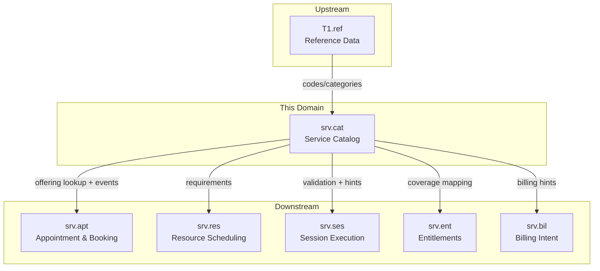
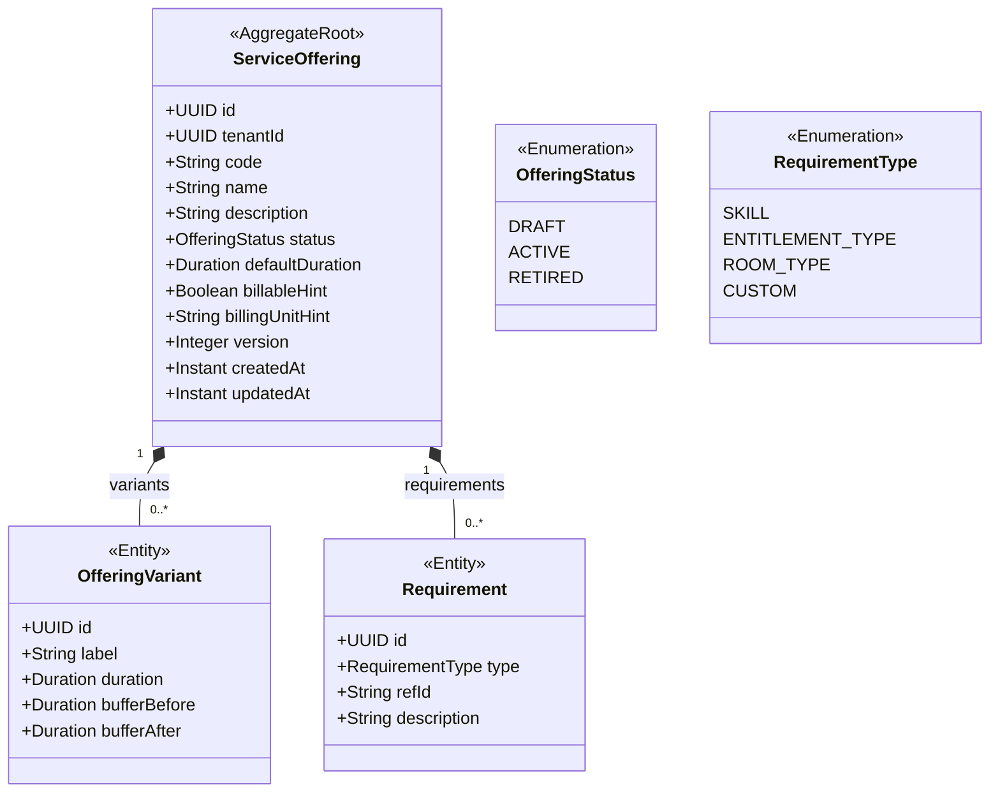
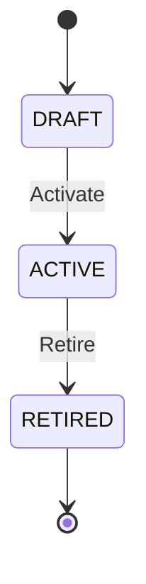
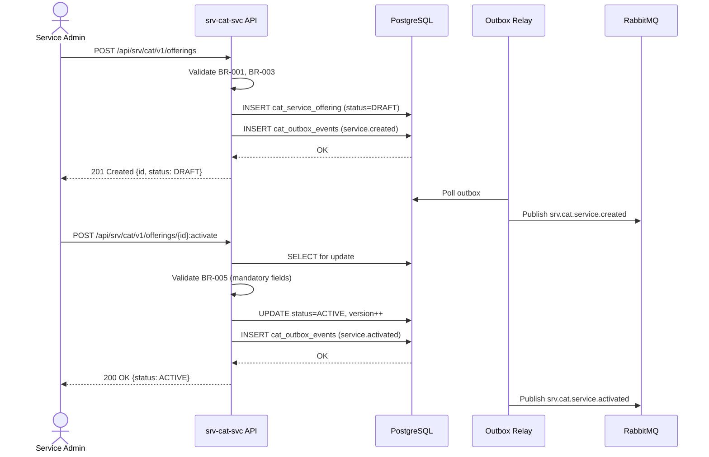
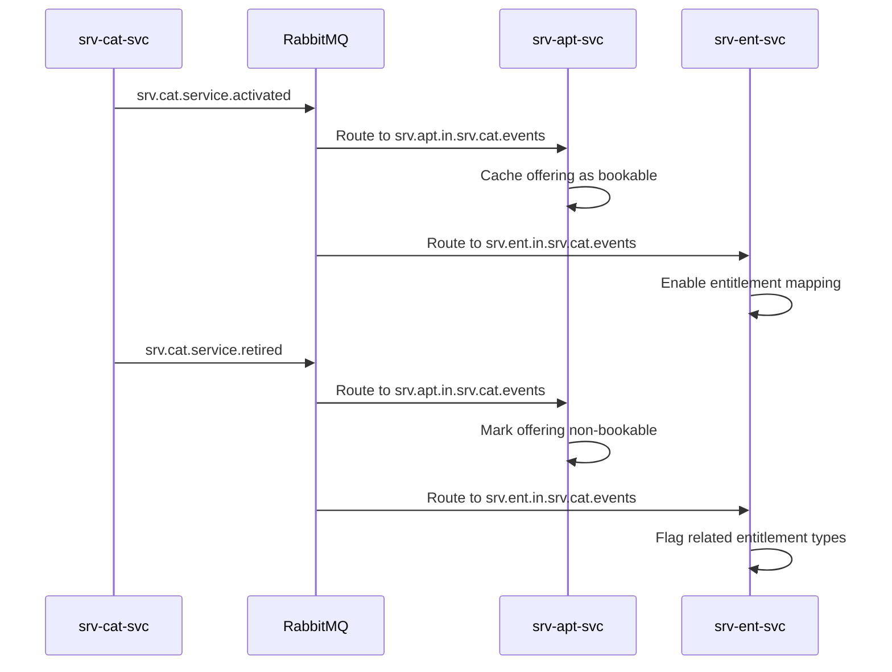
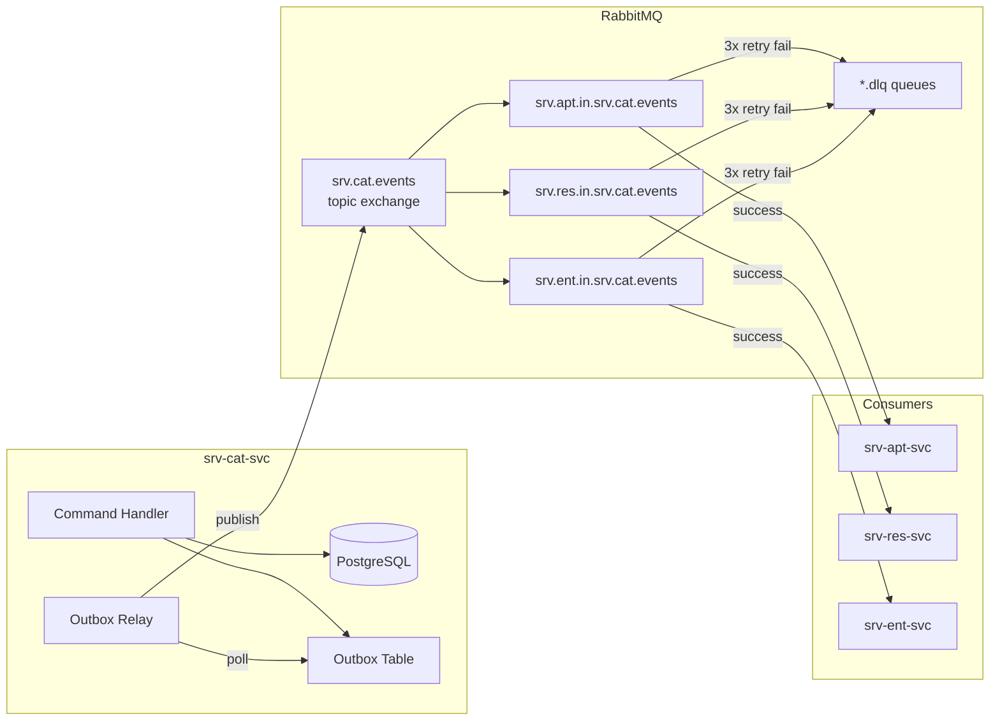
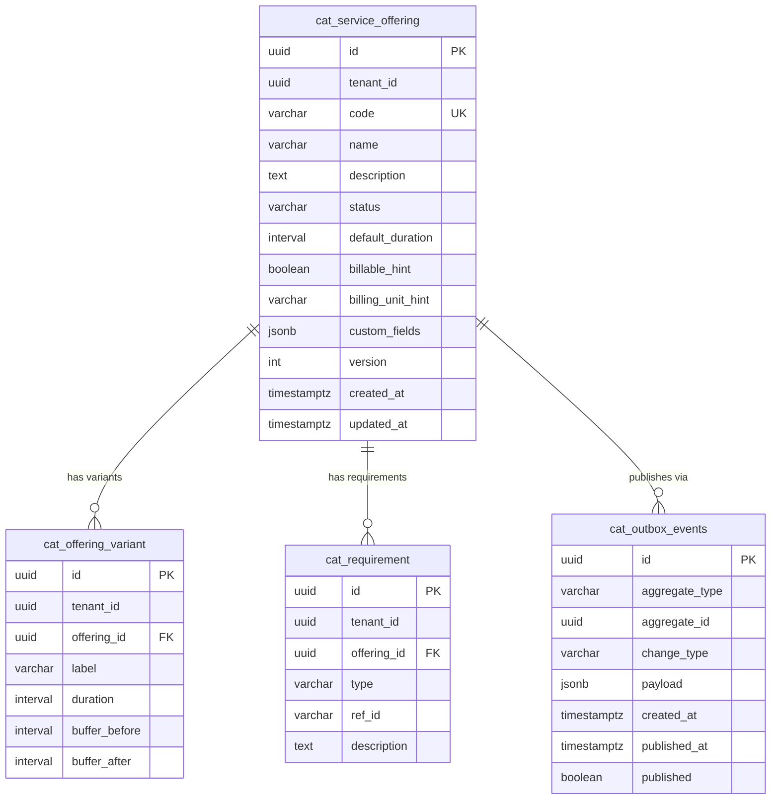

# Service Catalog — `srv.cat` Domain / Service Specification

> **Conceptual Stack Layer:** Domain / Service
> **Space:** Platform
> **Owner:** Domain Engineering Team
> **Schema alignment:** `service-layer.schema.json`
> **Companion files:** `openapi.yaml`, `*.schema.json` (event contracts)
> **Referenced by:** Platform-Feature Spec SS5 (backend dependencies), BFF Contract
> **Belongs to:** SRV Suite Spec (`_srv_suite.md`)

> **Meta Information**
> - **Version:** 2026-04-03
> - **Template:** `domain-service-spec.md` v1.0.0
> - **Template Compliance:** ~100% — fully compliant
> - **Author(s):** OpenLeap Architecture Team
> - **Status:** DRAFT
> - **Suite:** `srv`
> - **Domain:** `cat`
> - **Bounded Context Ref:** `bc:service-catalog`
> - **Service ID:** `srv-cat-svc`
> - **basePackage:** `io.openleap.srv.cat`
> - **API Base Path:** `/api/srv/cat/v1`
> - **OpenLeap Starter Version:** `v1`
> - **Port:** OPEN QUESTION (see Q-CAT-005)
> - **Repository:** OPEN QUESTION (see Q-CAT-006)
> - **Tags:** `service-catalog`, `offering`, `srv`
> - **Team:**
>   - Name: `team-srv`
>   - Email: `srv-team@openleap.io`
>   - Slack: `#srv-team`

---

## Specification Guidelines Compliance

>
> ### Non-Negotiables
> - Never invent facts. If required info is missing, add an **OPEN QUESTION** entry.
> - Preserve intent and decisions. Only change meaning when explicitly requested.
> - Do not remove normative constraints unless they are explicitly replaced.
> - Keep the spec **self-contained**: no "see chat", no implicit context.
>
> ### Source of Truth Priority
> When sources conflict:
> 1. Spec (explicit) wins
> 2. Starter specs (implementation constraints) next
> 3. Guidelines (best practices) last
>
> Record conflicts in the **Decisions & Conflicts** section (see Section 14).
>
> ### Style Guide
> - Prefer short sentences and lists.
> - Use MUST/SHOULD/MAY for normative statements.
> - Keep terminology consistent (Aggregate, Domain Service, Application Service, Command, Event).
> - Avoid ambiguous words ("often", "maybe") unless explicitly noting uncertainty.
> - Keep examples minimal and clearly marked as examples.
> - Do not add implementation code unless the chapter explicitly requires it.

---

## 0. Document Purpose & Scope

### 0.1 Purpose
`srv.cat` specifies the **service offering catalog** for the SRV suite. It defines *what can be delivered* as a service (service types), including operational delivery parameters (duration, buffers, prerequisites) and eligibility/requirement metadata that other SRV domains rely on.

### 0.2 Target Audience
- Product Owners & Business Stakeholders
- System Architects & Technical Leads
- Integration Engineers

### 0.3 Scope

**In Scope:**
- MUST manage service offering definitions with stable identifiers and lifecycle (DRAFT → ACTIVE → RETIRED).
- MUST provide operational delivery parameters for offerings (duration, buffers, variants).
- MUST capture eligibility/prerequisite metadata (e.g., required entitlement type, required skill tag).
- MUST expose read APIs for other SRV domains to resolve offering definitions.
- SHOULD publish catalog lifecycle events so dependent consumers can refresh caches.
- SHOULD provide classification metadata (billable/non-billable hint, billing unit hint) for downstream derivations.

**Out of Scope:**
- MUST NOT implement final commercial pricing, promotions, or checkout logic (owned by `sd` / `com`).
- MUST NOT implement accounting/tax posting logic (owned by `fi`).
- MUST NOT be the system of record for employee master / employment contracts (owned by `hr`).
- MUST NOT own enterprise-wide business partner master data (owned by `shared.bp`).

### 0.4 Related Documents
- `_srv_suite.md` - SRV Suite Architecture
- `srv_apt-spec.md` - Appointment & Booking
- `srv_res-spec.md` - Resource Scheduling
- `srv_ses-spec.md` - Session Execution
- `srv_ent-spec.md` - Entitlements
- `srv_bil-spec.md` - Billing Intent
- `SYSTEM_OVERVIEW.md` - Platform architecture overview
- `TECHNICAL_STANDARDS.md` - Cross-cutting technical standards
- `EVENT_STANDARDS.md` - Event envelope and routing conventions

---

## 1. Business Context

### 1.1 Domain Purpose
Provide a **single, consistent catalog** of service offerings so that booking (`srv.apt`), resource matching (`srv.res`), execution (`srv.ses`), entitlement coverage (`srv.ent`), and billing intents (`srv.bil`) refer to the same "what is being delivered" definition.

### 1.2 Business Value
- Prevents inconsistent booking/execution/billing by standardizing service type definitions.
- Enables reuse across channels (`com`) and contracting (`sd`) while keeping execution semantics stable.
- Provides self-service catalog administration for service administrators.

### 1.3 Key Stakeholders

| Role | Responsibility | Primary Use Cases |
|------|----------------|-------------------|
| Service Admin | Maintain service offerings | Create/update/activate/retire offerings |
| Scheduler / Back Office | Use offerings for booking | Find eligible offerings; understand durations/prereqs |
| Integrations/Platform | Integrate catalog across services | Subscribe to catalog events; cache refresh |

### 1.4 Strategic Positioning



### 1.5 Service Context

| Property | Value |
|----------|-------|
| **Suite** | `srv` |
| **Domain** | `cat` |
| **Bounded Context** | `bc:service-catalog` |
| **Service ID** | `srv-cat-svc` |
| **Base Package** | `io.openleap.srv.cat` |

**Responsibilities:**
- Own the canonical definition of SRV service offerings (identity + lifecycle)
- Define operational delivery parameters (duration, buffers, variants) used by scheduling
- Define prerequisite/requirement metadata for eligibility checks
- Provide classification metadata for downstream derivations

**Authoritative Sources:**
| Source Type | Description | Access Pattern |
|-------------|-------------|----------------|
| REST API | Service offering definitions and their operational parameters | Synchronous |
| Database | Offering master data (offerings, variants, requirements) | Direct (owner) |
| Events | Catalog lifecycle events (created, activated, retired) | Asynchronous |

**Context Diagram:**
```
┌─────────────────────────────────────────────────────────────┐
│  srv-cat-svc (Service Catalog)                              │
│                                                             │
│  Aggregates: ServiceOffering                                │
│  Entities: OfferingVariant, Requirement                     │
│                                                             │
│  Inbound:  REST (POST/PATCH/GET) from Service Admins        │
│  Outbound: REST (GET) to srv-apt, srv-res, srv-ses, srv-bil │
│            Events → srv.cat.events (RabbitMQ topic)         │
└─────────────────────────────────────────────────────────────┘
         ↑ ref-data-svc (codes/categories)
         ↓ [events consumed by] srv-apt, srv-res, srv-ses, srv-ent, srv-bil
```

---

## 2. Service Identity

| Property | Value | Schema Field |
|----------|-------|-------------|
| **Service ID** | `srv-cat-svc` | `metadata.id` |
| **Display Name** | Service Catalog | `metadata.name` |
| **Suite** | `srv` | `metadata.suite` |
| **Domain** | `cat` | `metadata.domain` |
| **Bounded Context** | `bc:service-catalog` | `metadata.bounded_context_ref` |
| **Version** | `1.2.0` | `metadata.version` |
| **Status** | DRAFT | `metadata.status` |
| **API Base Path** | `/api/srv/cat/v1` | `metadata.api_base_path` |
| **Repository** | OPEN QUESTION (Q-CAT-006) | `metadata.repository` |
| **Tags** | `service-catalog`, `offering`, `srv` | `metadata.tags` |

**Team:**
| Property | Value |
|----------|-------|
| **Name** | `team-srv` |
| **Email** | `srv-team@openleap.io` |
| **Slack Channel** | `#srv-team` |

---

## 3. Domain Model

### 3.1 Conceptual Overview
The service catalog domain manages **service offerings** — the canonical definitions of what can be delivered. Each offering has a lifecycle, operational parameters (duration, buffer rules), zero or more **variants** (e.g., 30/45/60 min), and zero or more **requirements** (skill prerequisites, room type constraints, entitlement prerequisites).

### 3.2 Core Concepts



### 3.3 Aggregate Definitions

#### 3.3.1 ServiceOffering

| Property | Value |
|----------|-------|
| **Aggregate ID** | `agg:service-offering` |
| **Name** | `ServiceOffering` |

**Business Purpose:**
The canonical definition of a deliverable service type within SRV. All other SRV domains reference this offering identity.

##### Aggregate Root

**Key Attributes:**
| Attribute | Type | Format | Description | Constraints | Required | Read-Only |
|-----------|------|--------|-------------|-------------|----------|-----------|
| id | string | uuid | Unique identifier generated via `OlUuid.create()` | Immutable | Yes | Yes |
| tenantId | string | uuid | Tenant ownership for row-level security | Immutable | Yes | Yes |
| code | string | — | Unique business key for this offering per tenant | max_length: 50, pattern: `^[A-Z0-9_-]+$` | Yes | No |
| name | string | — | Human-readable offering name displayed in UIs and booking screens | max_length: 255 | Yes | No |
| description | string | — | Detailed description of what the service entails; shown to customers | max_length: 2000 | No | No |
| status | string | — | Current lifecycle state; controls bookability | enum_ref: `OfferingStatus` | Yes | No |
| defaultDuration | string | duration | Default delivery duration in ISO 8601 format (e.g., `PT45M`) used when no variant is selected | min: `PT1M` | Yes | No |
| billableHint | boolean | — | Advisory flag indicating whether this offering generates a billing intent; final billing logic resides in `srv.bil` | — | No | No |
| billingUnitHint | string | — | Advisory billing unit (e.g., `session`, `hour`, `day`) for downstream billing derivation; not normative | max_length: 50 | No | No |
| version | integer | int64 | Optimistic locking version; incremented on every mutation | min: 0 | Yes | Yes |
| createdAt | string | date-time | UTC timestamp of record creation | — | Yes | Yes |
| updatedAt | string | date-time | UTC timestamp of last mutation | — | Yes | Yes |
| customFields | object | — | Product-defined extension fields (JSON key-value); see §12.2 | — | No | No |

**Lifecycle States:**

| Property | Value |
|----------|-------|
| **Initial State** | `DRAFT` |
| **Terminal States** | `RETIRED` |



**State Descriptions:**
| State | Description | Business Meaning |
|-------|-------------|------------------|
| DRAFT | Initial creation state | Being prepared; not bookable |
| ACTIVE | Operational state | Bookable and available for scheduling |
| RETIRED | Final state | No longer bookable; historical reference only |

**Allowed Transitions:**
| From State | To State | Trigger | Guard / Business Preconditions |
|------------|----------|---------|-------------------------------|
| DRAFT | ACTIVE | `ActivateServiceOffering` command | All mandatory fields filled; at least one variant or defaultDuration set |
| ACTIVE | RETIRED | `RetireServiceOffering` command | No active entitlements reference this offering (OPEN QUESTION Q-CAT-001: enforce or warn?) |

**Invariants:**
| Rule ID | Description |
|---------|-------------|
| BR-001 | `code` MUST be unique per `tenantId` |
| BR-002 | MUST NOT allow booking/execution against offerings with status `RETIRED` |
| BR-003 | `defaultDuration` MUST be positive |
| BR-004 | Offering `id` and `code` MUST remain stable across lifecycle changes |

**Domain Events Emitted:**
- `srv.cat.service.created`
- `srv.cat.service.updated`
- `srv.cat.service.activated`
- `srv.cat.service.retired`

##### Child Entities

###### Entity: OfferingVariant

| Property | Value |
|----------|-------|
| **Entity ID** | `ent:offering-variant` |
| **Name** | `OfferingVariant` |
| **Relationship to Root** | one_to_many |

**Business Purpose:**
A standardized duration/buffer alternative of a service offering (e.g., 30 min / 45 min / 60 min lessons). Variants allow a single offering definition to cover multiple delivery lengths without creating separate offerings.

**Attributes:**
| Attribute | Type | Format | Description | Constraints | Required |
|-----------|------|--------|-------------|-------------|----------|
| id | string | uuid | Unique identifier (OlUuid.create()) | Immutable | Yes |
| label | string | — | Human-readable variant label shown to schedulers and customers (e.g., "30 min", "Standard") | max_length: 100 | Yes |
| duration | string | duration | Variant-specific service duration (ISO 8601); overrides defaultDuration when selected | Must be positive (`> PT0S`) | Yes |
| bufferBefore | string | duration | Buffer time reserved before the session starts (ISO 8601); used for preparation | — | No |
| bufferAfter | string | duration | Buffer time reserved after the session ends (ISO 8601); used for cleanup/travel | — | No |

**Collection Constraints:**
- Minimum items: 0
- Maximum items: 20

**Invariants:**
- BR-003 applies to each variant's `duration` (must be positive)
- `label` MUST be unique within a single offering's variant list

###### Entity: Requirement

| Property | Value |
|----------|-------|
| **Entity ID** | `ent:requirement` |
| **Name** | `Requirement` |
| **Relationship to Root** | one_to_many |

**Business Purpose:**
A prerequisite or constraint on a service offering (required skill, entitlement prerequisite, required room type). Requirements are consumed by `srv.res` for resource eligibility matching and by `srv.ent` for entitlement coverage validation.

**Attributes:**
| Attribute | Type | Format | Description | Constraints | Required |
|-----------|------|--------|-------------|-------------|----------|
| id | string | uuid | Unique identifier (OlUuid.create()) | Immutable | Yes |
| type | string | — | Requirement category driving how `refId` is interpreted | enum_ref: `RequirementType` | Yes |
| refId | string | — | External reference identifier; semantics depend on `type` (e.g., skill code, room type code, entitlement type code) | max_length: 100 | Yes |
| description | string | — | Human-readable description of the requirement for admins | max_length: 500 | No |

**Collection Constraints:**
- Minimum items: 0
- Maximum items: 50

**Invariants:**
- The combination of `(type, refId)` SHOULD be unique within a single offering's requirement list (warn on duplicate; see Q-CAT-007)

### 3.4 Enumerations

#### OfferingStatus

**Description:** Lifecycle states for a service offering.

| Value | Description | Deprecated |
|-------|-------------|------------|
| `DRAFT` | Being prepared; not bookable | No |
| `ACTIVE` | Bookable and operational | No |
| `RETIRED` | No longer bookable; retained for historical reference | No |

#### RequirementType

**Description:** Classification of prerequisite/constraint types for service offerings. Determines how `Requirement.refId` is resolved.

| Value | Description | Deprecated |
|-------|-------------|------------|
| `SKILL` | Provider must possess this skill/qualification. `refId` references a skill code (see Q-CAT-003 for skill catalog ownership) | No |
| `ENTITLEMENT_TYPE` | Customer must hold an active entitlement of this type to book. `refId` references an entitlement type code from `srv.ent` | No |
| `ROOM_TYPE` | A room/facility of this type must be available. `refId` references a room type code | No |
| `CUSTOM` | Product-defined requirement not covered by the above types. `refId` is product-specific; `description` MUST be set | No |

### 3.5 Shared Types

#### Type: ServiceDuration

**Description:** Represents a positive ISO 8601 duration used for delivery timing. Reused across `ServiceOffering.defaultDuration` and all `OfferingVariant.duration`, `bufferBefore`, `bufferAfter` fields.

| Attribute | Type | Format | Description | Constraints |
|-----------|------|--------|-------------|-------------|
| value | string | duration | ISO 8601 duration string (e.g., `PT30M`, `PT1H30M`) | MUST match `^PT[0-9]+[MHDS]$` or compound forms; MUST be positive |

**Validation Rules:**
- MUST be a valid ISO 8601 duration.
- MUST represent a positive (non-zero) time span.
- MUST NOT exceed `PT24H` (sanity guard; actual maximum is domain configuration).

**Used By:**
- `ServiceOffering.defaultDuration`
- `OfferingVariant.duration`
- `OfferingVariant.bufferBefore`
- `OfferingVariant.bufferAfter`

---

## 4. Business Rules & Constraints

### 4.1 Business Rules Catalog

| ID | Rule Name | Description | Scope | Enforcement | Error Code |
|----|-----------|-------------|-------|-------------|------------|
| BR-001 | Unique Offering Code | `code` MUST be unique per `tenantId` | ServiceOffering | Create, Update | `CAT_DUPLICATE_CODE` |
| BR-002 | No Booking Against Retired | MUST NOT allow booking/execution against offerings with status `RETIRED` | ServiceOffering | External (consumers) | `CAT_OFFERING_RETIRED` |
| BR-003 | Positive Duration | `defaultDuration` and all variant durations MUST be positive | ServiceOffering, OfferingVariant | Create, Update | `CAT_INVALID_DURATION` |
| BR-004 | Identity Stability | Offering `id` and `code` MUST remain stable across lifecycle changes | ServiceOffering | All | `CAT_IMMUTABLE_FIELD` |
| BR-005 | Active Transition Guard | Transition DRAFT → ACTIVE requires all mandatory fields to be present | ServiceOffering | Activate command | `CAT_INVALID_TRANSITION` |

### 4.2 Detailed Rule Definitions

#### BR-001: Unique Offering Code

**Business Context:** Service offerings are referenced by `code` across the platform. Duplicate codes would cause ambiguity in booking and billing.

**Rule Statement:** Within a single tenant, no two service offerings MAY share the same `code`.

**Applies To:**
- Aggregate: ServiceOffering
- Operations: Create, Update

**Enforcement:** Database unique constraint on `(tenant_id, code)`.

**Validation Logic:** Before persisting, check that no existing `ServiceOffering` row with the same `tenant_id` has an identical `code` value.

**Error Handling:**
- **Error Code:** `CAT_DUPLICATE_CODE`
- **Error Message:** "A service offering with code '{code}' already exists for this tenant."
- **User action:** Choose a different, unique code for this offering.

**Examples:**
- **Valid:** Creating offering with code `DRIVING_LESSON_45` when no other offering with that code exists for the tenant.
- **Invalid:** Creating a second offering with code `DRIVING_LESSON_45` for the same tenant.

#### BR-002: No Booking Against Retired

**Business Context:** Retired offerings represent services that are no longer available for delivery. Allowing bookings against retired offerings would create unfulfillable appointments.

**Rule Statement:** Consumers MUST NOT create new bookings, resource assignments, or session executions that reference a `ServiceOffering` in `RETIRED` status.

**Applies To:**
- Aggregate: ServiceOffering
- Operations: Consumed by `srv.apt`, `srv.res`, `srv.ses` during their write operations

**Enforcement:** `srv.cat` exposes the offering status via REST. Consumers MUST check status before proceeding. `srv.cat` MAY publish `srv.cat.service.retired` to enable proactive cache invalidation.

**Validation Logic:** Consumer services check offering status on lookup; reject new records referencing a RETIRED offering.

**Error Handling:**
- **Error Code:** `CAT_OFFERING_RETIRED`
- **Error Message:** "Service offering '{code}' has been retired and cannot be used for new bookings."
- **User action:** Select an ACTIVE offering or contact the service administrator to create a replacement offering.

**Examples:**
- **Valid:** Booking appointment for an ACTIVE offering.
- **Invalid:** Attempting to book an appointment referencing an offering in RETIRED status.

#### BR-003: Positive Duration

**Business Context:** Service offerings must have a meaningful duration for scheduling to work. Zero or negative durations would corrupt booking slot calculations.

**Rule Statement:** The `defaultDuration` of a service offering MUST be greater than zero. All variant `duration` values MUST also be greater than zero.

**Applies To:**
- Aggregate: ServiceOffering, OfferingVariant
- Operations: Create, Update

**Enforcement:** Application-level validation before persistence.

**Validation Logic:** Parse the ISO 8601 duration string and confirm the resulting duration is positive.

**Error Handling:**
- **Error Code:** `CAT_INVALID_DURATION`
- **Error Message:** "Duration must be a valid positive ISO 8601 duration (e.g., PT30M)."
- **User action:** Provide a positive duration value such as `PT30M` or `PT1H`.

**Examples:**
- **Valid:** `defaultDuration: "PT45M"`
- **Invalid:** `defaultDuration: "PT0S"` or `defaultDuration: "-PT30M"`

#### BR-004: Identity Stability

**Business Context:** Service offering identity (`id` and `code`) is referenced by other SRV domains and stored in external systems (billing records, session logs). Changing identity would break those references.

**Rule Statement:** Once created, `id` (UUID PK) and `code` (business key) MUST NOT be changed. `id` is always read-only. `code` update attempts via API MUST be rejected.

**Applies To:**
- Aggregate: ServiceOffering
- Operations: Update, Activate, Retire

**Enforcement:** Application-level guard in the update command handler; `code` field is excluded from the update command payload.

**Validation Logic:** If a PATCH request includes `code` in the body, return 422 with `CAT_IMMUTABLE_FIELD`.

**Error Handling:**
- **Error Code:** `CAT_IMMUTABLE_FIELD`
- **Error Message:** "Offering code cannot be changed after creation."
- **User action:** Retire the existing offering and create a new one with the desired code.

#### BR-005: Active Transition Guard

**Business Context:** Activating an incomplete offering would result in bookable offerings with missing scheduling or billing data.

**Rule Statement:** A `ServiceOffering` MUST NOT be transitioned from `DRAFT` to `ACTIVE` unless all mandatory fields are populated and either `defaultDuration` is set or at least one `OfferingVariant` is defined.

**Applies To:**
- Aggregate: ServiceOffering
- Operations: Activate

**Enforcement:** Application-level pre-condition check in the `ActivateServiceOffering` handler.

**Validation Logic:** Check that `name`, `code`, `defaultDuration` (or at least one variant with valid duration) are all present and valid.

**Error Handling:**
- **Error Code:** `CAT_INVALID_TRANSITION`
- **Error Message:** "Cannot activate offering: mandatory fields are missing or no duration is defined."
- **User action:** Complete all required fields before activating.

### 4.3 Data Validation Rules

**Field-Level Validations:**
| Field | Validation Rule | Error Message |
|-------|----------------|---------------|
| code | Required; max 50 chars; pattern `^[A-Z0-9_-]+$` | "Code is required and must match [A-Z0-9_-]+" |
| name | Required; max 255 chars | "Name is required and cannot exceed 255 characters" |
| defaultDuration | Required; valid ISO 8601 duration; positive | "Default duration must be a valid positive ISO 8601 duration" |
| description | Optional; max 2000 chars | "Description cannot exceed 2000 characters" |
| billingUnitHint | Optional; max 50 chars | "Billing unit hint cannot exceed 50 characters" |
| OfferingVariant.label | Required; max 100 chars | "Variant label is required and cannot exceed 100 characters" |
| OfferingVariant.duration | Required; positive ISO 8601 duration | "Variant duration must be a valid positive ISO 8601 duration" |
| Requirement.type | Required; must be valid RequirementType enum value | "Requirement type must be one of: SKILL, ENTITLEMENT_TYPE, ROOM_TYPE, CUSTOM" |
| Requirement.refId | Required; max 100 chars | "Requirement refId is required and cannot exceed 100 characters" |
| Requirement.description | Required when type=CUSTOM; max 500 chars | "Description is required for CUSTOM requirement type" |

**Cross-Field Validations:**
- If `type = CUSTOM`, then `description` MUST be provided (non-empty).
- If no `variants` are provided, `defaultDuration` MUST be set.
- `bufferBefore` and `bufferAfter` on OfferingVariant MUST NOT be negative.

### 4.4 Reference Data Dependencies

| Catalog | Source Service | Fields Referencing | Validation |
|---------|----------------|-------------------|------------|
| Skill codes | `hr-svc` or shared skill catalog (see Q-CAT-003) | `Requirement.refId` (when `type=SKILL`) | Existence check at creation; soft validation (warn if not found) |
| Entitlement type codes | `srv-ent-svc` | `Requirement.refId` (when `type=ENTITLEMENT_TYPE`) | Soft validation; hard validation on booking |
| Room type codes | `ref-data-svc` or facility service | `Requirement.refId` (when `type=ROOM_TYPE`) | Soft validation (warn if not found) |
| Billing unit codes | `ref-data-svc` | `billingUnitHint` | Advisory only; no validation enforced |

> OPEN QUESTION: See Q-CAT-003 in §14.3 (skill catalog ownership) and Q-CAT-007 (requirement reference validation strictness).

---

## 5. Use Cases

### 5.1 Business Logic Placement

| Logic Type | Placement | Examples |
|------------|-----------|----------|
| Aggregate invariants | Domain Object | Code uniqueness check, duration validation, status transition guards |
| Cross-aggregate logic | Domain Service | (none currently; all logic is within ServiceOffering aggregate) |
| Orchestration & transactions | Application Service | Use case coordination, transactional commit, event publishing via outbox |

### 5.2 Use Cases (Canonical Format)

#### UC-001: CreateServiceOffering

| Field | Value |
|-------|-------|
| **id** | `CreateServiceOffering` |
| **type** | WRITE |
| **trigger** | REST |
| **aggregate** | `ServiceOffering` |
| **domainOperation** | `ServiceOffering.create` |
| **inputs** | `code: String`, `name: String`, `description: String?`, `defaultDuration: Duration`, `billableHint: Boolean?`, `billingUnitHint: String?`, `variants: OfferingVariant[]?`, `requirements: Requirement[]?` |
| **outputs** | `ServiceOffering` |
| **events** | `srv.cat.service.created` |
| **rest** | `POST /api/srv/cat/v1/offerings` |
| **idempotency** | required (Idempotency-Key header) |
| **errors** | `CAT_DUPLICATE_CODE`: code already exists; `CAT_INVALID_DURATION`: invalid duration |

**Actor:** Service Admin (`SRV_CAT_EDITOR`)

**Preconditions:**
- User has `SRV_CAT_EDITOR` role.
- `code` does not exist for this tenant.

**Main Flow:**
1. Admin submits offering definition via `POST /api/srv/cat/v1/offerings`.
2. System validates code uniqueness (BR-001) and duration positivity (BR-003).
3. System creates `ServiceOffering` in `DRAFT` status with a new `OlUuid.create()` as `id`.
4. System writes the outbox event record for `srv.cat.service.created`.
5. System commits the transaction.
6. Outbox relay publishes `srv.cat.service.created` to `srv.cat.events` exchange.
7. System returns `201 Created` with `Location` header.

**Postconditions:**
- `ServiceOffering` exists with status `DRAFT`.
- `srv.cat.service.created` event is queued for delivery.

**Business Rules Applied:**
- BR-001: Unique offering code
- BR-003: Positive duration
- BR-005: Activation guard (not yet triggered)

**Alternative Flows:**
- **Alt-1:** If `variants` are provided, validate each variant's duration (BR-003). If any variant is invalid, reject the entire creation request.

**Exception Flows:**
- **Exc-1:** If `code` already exists for the tenant, return `409 Conflict` with `CAT_DUPLICATE_CODE`.
- **Exc-2:** If `defaultDuration` is invalid or zero, return `422 Unprocessable Entity` with `CAT_INVALID_DURATION`.
- **Exc-3:** Duplicate `Idempotency-Key`: return the previously created resource without side effects.

#### UC-002: ActivateServiceOffering

| Field | Value |
|-------|-------|
| **id** | `ActivateServiceOffering` |
| **type** | WRITE |
| **trigger** | REST |
| **aggregate** | `ServiceOffering` |
| **domainOperation** | `ServiceOffering.activate` |
| **inputs** | `offeringId: UUID` |
| **outputs** | `ServiceOffering` |
| **events** | `srv.cat.service.activated` |
| **rest** | `POST /api/srv/cat/v1/offerings/{id}:activate` |
| **idempotency** | required |
| **errors** | `CAT_INVALID_TRANSITION`: not in DRAFT status; `CAT_INVALID_TRANSITION`: mandatory fields incomplete |

**Actor:** Service Admin (`SRV_CAT_ADMIN`)

**Preconditions:**
- Offering exists in `DRAFT` status.
- All mandatory fields are populated (BR-005).

**Main Flow:**
1. Admin sends `POST /api/srv/cat/v1/offerings/{id}:activate`.
2. System loads the offering and verifies current status is `DRAFT`.
3. System validates BR-005 (mandatory fields complete).
4. System transitions status to `ACTIVE` and increments `version`.
5. System writes outbox event record for `srv.cat.service.activated`.
6. System commits the transaction.
7. System returns `200 OK` with the updated offering.

**Postconditions:**
- `ServiceOffering` has status `ACTIVE` and is bookable by `srv.apt`.
- `srv.cat.service.activated` event is queued for delivery.

**Business Rules Applied:**
- BR-005: Active transition guard

**Exception Flows:**
- **Exc-1:** If status is not `DRAFT`, return `422 Unprocessable Entity` with `CAT_INVALID_TRANSITION`.
- **Exc-2:** If mandatory fields are missing, return `422 Unprocessable Entity` with `CAT_INVALID_TRANSITION` and a list of missing fields.

#### UC-003: RetireServiceOffering

| Field | Value |
|-------|-------|
| **id** | `RetireServiceOffering` |
| **type** | WRITE |
| **trigger** | REST |
| **aggregate** | `ServiceOffering` |
| **domainOperation** | `ServiceOffering.retire` |
| **inputs** | `offeringId: UUID` |
| **outputs** | `ServiceOffering` |
| **events** | `srv.cat.service.retired` |
| **rest** | `POST /api/srv/cat/v1/offerings/{id}:retire` |
| **idempotency** | required |
| **errors** | `CAT_INVALID_TRANSITION`: not in ACTIVE status |

**Actor:** Service Admin (`SRV_CAT_ADMIN`)

**Preconditions:**
- Offering exists in `ACTIVE` status.

**Main Flow:**
1. Admin sends `POST /api/srv/cat/v1/offerings/{id}:retire`.
2. System loads the offering and verifies current status is `ACTIVE`.
3. System transitions status to `RETIRED` and increments `version`.
4. System writes outbox event record for `srv.cat.service.retired`.
5. System commits the transaction.
6. System returns `200 OK` with the updated offering.

**Postconditions:**
- `ServiceOffering` has status `RETIRED`.
- Downstream consumers (srv.apt, srv.ent) receive `srv.cat.service.retired` and disable booking.

**Business Rules Applied:**
- BR-002: No booking against retired (consumers enforce this)

**Alternative Flows:**
- **Alt-1:** If active entitlements reference this offering, system MAY warn (see Q-CAT-001 for enforce-vs-warn decision).

**Exception Flows:**
- **Exc-1:** If status is not `ACTIVE`, return `422 Unprocessable Entity` with `CAT_INVALID_TRANSITION`.

#### UC-004: UpdateServiceOffering

| Field | Value |
|-------|-------|
| **id** | `UpdateServiceOffering` |
| **type** | WRITE |
| **trigger** | REST |
| **aggregate** | `ServiceOffering` |
| **domainOperation** | `ServiceOffering.update` |
| **inputs** | `offeringId: UUID`, `name: String?`, `description: String?`, `defaultDuration: Duration?`, `billableHint: Boolean?`, `billingUnitHint: String?`, `customFields: Object?` |
| **outputs** | `ServiceOffering` |
| **events** | `srv.cat.service.updated` |
| **rest** | `PATCH /api/srv/cat/v1/offerings/{id}` |
| **idempotency** | optional |
| **errors** | `CAT_INVALID_DURATION`: invalid duration; `CAT_IMMUTABLE_FIELD`: attempt to change code; `OPTIMISTIC_LOCK_CONFLICT`: ETag mismatch |

**Actor:** Service Admin (`SRV_CAT_EDITOR`)

**Preconditions:**
- Offering exists (any lifecycle status).
- `If-Match` header matches current `version`.

**Main Flow:**
1. Admin sends `PATCH /api/srv/cat/v1/offerings/{id}` with `If-Match` header.
2. System loads the offering and validates `ETag` optimistic lock.
3. System applies the partial update (only supplied fields).
4. System validates changed fields (BR-003 for duration, BR-004 for immutable fields).
5. System increments `version` and updates `updatedAt`.
6. System writes outbox event record for `srv.cat.service.updated`.
7. System returns `200 OK` with the updated offering.

**Postconditions:**
- Mutable fields updated; `version` incremented.
- `srv.cat.service.updated` event queued.

**Exception Flows:**
- **Exc-1:** If `If-Match` header doesn't match current version, return `412 Precondition Failed`.
- **Exc-2:** If `code` is included in the request body, return `422 Unprocessable Entity` with `CAT_IMMUTABLE_FIELD`.

#### UC-005: GetServiceOffering

| Field | Value |
|-------|-------|
| **id** | `GetServiceOffering` |
| **type** | READ |
| **trigger** | REST |
| **aggregate** | `ServiceOffering` |
| **domainOperation** | `findById` |
| **inputs** | `offeringId: UUID` |
| **outputs** | `ServiceOffering` (read model, includes variants and requirements) |
| **rest** | `GET /api/srv/cat/v1/offerings/{id}` |
| **idempotency** | none (safe) |
| **errors** | `NOT_FOUND` |

**Actor:** Any authenticated user (`SRV_CAT_VIEWER` or higher)

**Main Flow:**
1. Caller sends `GET /api/srv/cat/v1/offerings/{id}`.
2. System retrieves the offering with its variants and requirements.
3. System returns `200 OK` with the read model including `ETag`.

#### UC-006: SearchServiceOfferings

| Field | Value |
|-------|-------|
| **id** | `SearchServiceOfferings` |
| **type** | READ |
| **trigger** | REST |
| **aggregate** | `ServiceOffering` |
| **domainOperation** | `search` |
| **inputs** | `status: OfferingStatus?`, `code: String?`, `q: String?`, `page: Integer`, `size: Integer` |
| **outputs** | `Page<ServiceOffering>` |
| **rest** | `GET /api/srv/cat/v1/offerings?status=&code=&q=` |
| **idempotency** | none (safe) |

**Actor:** Any authenticated user (`SRV_CAT_VIEWER` or higher)

**Main Flow:**
1. Caller sends `GET /api/srv/cat/v1/offerings` with optional filter parameters.
2. System queries the read model with applied filters and pagination.
3. System returns `200 OK` with a paginated list of offerings.

### 5.3 Process Flow Diagrams

#### Flow: Create and Activate an Offering



#### Flow: Offering Lifecycle and Consumer Reaction



### 5.4 Cross-Domain Workflows

#### Workflow: Offering Activation → Booking Availability

| Property | Value |
|----------|-------|
| **Pattern** | Choreography (ADR-029 / ADR-003) |
| **Trigger** | Service Admin activates a service offering |

**Participating Services:**
| Service | Role | Reaction |
|---------|------|----------|
| `srv-cat-svc` | Producer | Publishes `srv.cat.service.activated` |
| `srv-apt-svc` | Consumer | Refreshes local offering cache; enables booking slots for this offering |
| `srv-res-svc` | Consumer | Updates resource requirement index |
| `srv-ent-svc` | Consumer | Enables entitlement-to-offering mapping |

**Workflow Steps:**
1. Admin calls `POST /api/srv/cat/v1/offerings/{id}:activate`.
2. `srv.cat` transitions status, commits, publishes `srv.cat.service.activated` via outbox.
3. `srv.apt`, `srv.res`, `srv.ent` independently consume the event and update their local state.

**Failure Paths:**
- If a consumer fails to process the event, the message is retried (3× exponential backoff) then routed to DLQ per ADR-014.
- `srv.cat` is not affected by consumer failures (fire-and-forget choreography).

#### Workflow: Offering Retirement → Booking Disable

**Pattern:** Choreography

**Steps:**
1. Admin calls `POST /api/srv/cat/v1/offerings/{id}:retire`.
2. `srv.cat` transitions status, publishes `srv.cat.service.retired`.
3. `srv.apt` disables new bookings for this offering; existing scheduled bookings are unaffected (business decision required — see Q-CAT-001).
4. `srv.ent` marks related entitlement types.

---

## 6. REST API

### 6.1 API Overview

**Base Path:** `/api/srv/cat/v1`
**Authentication:** OAuth2/JWT (Bearer token)

**Authorization:**
- Read operations: `SRV_CAT_VIEWER`
- Write operations: `SRV_CAT_EDITOR`
- Lifecycle operations (activate/retire): `SRV_CAT_ADMIN`

### 6.2 Resource Operations

#### 6.2.1 Offerings - Create

```http
POST /api/srv/cat/v1/offerings
Authorization: Bearer {token}
Content-Type: application/json
Idempotency-Key: {key}
```

**Request Body:**
```json
{
  "code": "DRIVING_LESSON_45",
  "name": "Driving Lesson 45 min",
  "description": "Standard driving lesson, 45 minutes.",
  "defaultDuration": "PT45M",
  "billableHint": true,
  "billingUnitHint": "session",
  "variants": [
    { "label": "30 min", "duration": "PT30M", "bufferBefore": "PT5M", "bufferAfter": "PT5M" },
    { "label": "60 min", "duration": "PT60M", "bufferBefore": "PT5M", "bufferAfter": "PT10M" }
  ],
  "requirements": [
    { "type": "SKILL", "refId": "DRIVING_INSTRUCTOR", "description": "Must be a licensed driving instructor" }
  ]
}
```

**Success Response:** `201 Created`
```json
{
  "id": "01960000-0000-7000-8000-000000000001",
  "tenantId": "01960000-0000-7000-8000-000000000000",
  "code": "DRIVING_LESSON_45",
  "name": "Driving Lesson 45 min",
  "description": "Standard driving lesson, 45 minutes.",
  "status": "DRAFT",
  "defaultDuration": "PT45M",
  "billableHint": true,
  "billingUnitHint": "session",
  "variants": [
    { "id": "01960000-0000-7000-8000-000000000011", "label": "30 min", "duration": "PT30M", "bufferBefore": "PT5M", "bufferAfter": "PT5M" },
    { "id": "01960000-0000-7000-8000-000000000012", "label": "60 min", "duration": "PT60M", "bufferBefore": "PT5M", "bufferAfter": "PT10M" }
  ],
  "requirements": [
    { "id": "01960000-0000-7000-8000-000000000021", "type": "SKILL", "refId": "DRIVING_INSTRUCTOR", "description": "Must be a licensed driving instructor" }
  ],
  "customFields": {},
  "version": 1,
  "createdAt": "2026-04-03T10:00:00Z",
  "updatedAt": "2026-04-03T10:00:00Z",
  "_links": {
    "self": { "href": "/api/srv/cat/v1/offerings/01960000-0000-7000-8000-000000000001" },
    "activate": { "href": "/api/srv/cat/v1/offerings/01960000-0000-7000-8000-000000000001:activate" }
  }
}
```

**Response Headers:**
- `Location: /api/srv/cat/v1/offerings/{id}`
- `ETag: "1"`

**Business Rules Checked:** BR-001, BR-003

**Events Published:** `srv.cat.service.created`

**Error Responses:**
- `400 Bad Request` — Validation error (malformed JSON, missing required fields)
- `409 Conflict` — Duplicate code (BR-001)
- `422 Unprocessable Entity` — Business rule violation (BR-003)

#### 6.2.2 Offerings - Retrieve

```http
GET /api/srv/cat/v1/offerings/{id}
Authorization: Bearer {token}
```

**Success Response:** `200 OK`
```json
{
  "id": "01960000-0000-7000-8000-000000000001",
  "tenantId": "01960000-0000-7000-8000-000000000000",
  "code": "DRIVING_LESSON_45",
  "name": "Driving Lesson 45 min",
  "description": "Standard driving lesson, 45 minutes.",
  "status": "ACTIVE",
  "defaultDuration": "PT45M",
  "billableHint": true,
  "billingUnitHint": "session",
  "variants": [
    { "id": "01960000-0000-7000-8000-000000000011", "label": "30 min", "duration": "PT30M", "bufferBefore": "PT5M", "bufferAfter": "PT5M" }
  ],
  "requirements": [
    { "id": "01960000-0000-7000-8000-000000000021", "type": "SKILL", "refId": "DRIVING_INSTRUCTOR", "description": "Must be a licensed driving instructor" }
  ],
  "customFields": {},
  "version": 2,
  "createdAt": "2026-04-03T10:00:00Z",
  "updatedAt": "2026-04-03T10:05:00Z",
  "_links": {
    "self": { "href": "/api/srv/cat/v1/offerings/01960000-0000-7000-8000-000000000001" },
    "retire": { "href": "/api/srv/cat/v1/offerings/01960000-0000-7000-8000-000000000001:retire" }
  }
}
```

**Response Headers:**
- `ETag: "2"`
- `Cache-Control: private, max-age=300`

**Error Responses:**
- `404 Not Found` — Offering does not exist

#### 6.2.3 Offerings - Update

```http
PATCH /api/srv/cat/v1/offerings/{id}
Authorization: Bearer {token}
Content-Type: application/json
If-Match: "2"
```

**Request Body:**
```json
{
  "name": "Driving Lesson 45 min (Updated)",
  "description": "Updated description for driving lessons.",
  "defaultDuration": "PT45M",
  "billableHint": true,
  "billingUnitHint": "session",
  "customFields": {
    "internalCategory": "MOBILITY",
    "regulatoryCode": "KFZ-001"
  }
}
```

**Success Response:** `200 OK`
```json
{
  "id": "01960000-0000-7000-8000-000000000001",
  "code": "DRIVING_LESSON_45",
  "name": "Driving Lesson 45 min (Updated)",
  "status": "ACTIVE",
  "version": 3,
  "updatedAt": "2026-04-03T10:10:00Z",
  "_links": {
    "self": { "href": "/api/srv/cat/v1/offerings/01960000-0000-7000-8000-000000000001" }
  }
}
```

**Business Rules Checked:** BR-003, BR-004

**Events Published:** `srv.cat.service.updated`

**Error Responses:**
- `412 Precondition Failed` — ETag mismatch (optimistic lock conflict)
- `422 Unprocessable Entity` — Invalid duration (BR-003) or immutable field change (BR-004)

#### 6.2.4 Offerings - List

```http
GET /api/srv/cat/v1/offerings?page=0&size=50&sort=createdAt,desc&status=ACTIVE&code=&q=
Authorization: Bearer {token}
```

**Query Parameters:**
| Parameter | Type | Description | Default |
|-----------|------|-------------|---------|
| page | integer | Page number (0-based) | 0 |
| size | integer | Page size (max 200) | 50 |
| sort | string | Sort field and direction | createdAt,desc |
| status | string | Filter by status | (all) |
| code | string | Filter by code (exact match) | — |
| q | string | Full-text search on name/description | — |

**Success Response:** `200 OK`
```json
{
  "content": [
    {
      "id": "01960000-0000-7000-8000-000000000001",
      "code": "DRIVING_LESSON_45",
      "name": "Driving Lesson 45 min",
      "status": "ACTIVE",
      "defaultDuration": "PT45M",
      "billableHint": true,
      "version": 2,
      "createdAt": "2026-04-03T10:00:00Z"
    }
  ],
  "page": {
    "size": 50,
    "number": 0,
    "totalElements": 1,
    "totalPages": 1
  },
  "_links": {
    "self": { "href": "/api/srv/cat/v1/offerings?page=0&size=50" }
  }
}
```

### 6.3 Business Operations

#### Operation: Activate Offering

```http
POST /api/srv/cat/v1/offerings/{id}:activate
Authorization: Bearer {token}
```

**Business Purpose:** Transition offering from DRAFT to ACTIVE, making it bookable.

**Success Response:** `200 OK` — Updated offering with `status: ACTIVE`

**Events Published:** `srv.cat.service.activated`

**Error Responses:**
- `422 Unprocessable Entity` — Invalid state transition (not in DRAFT) or mandatory fields missing

#### Operation: Retire Offering

```http
POST /api/srv/cat/v1/offerings/{id}:retire
Authorization: Bearer {token}
```

**Business Purpose:** Transition offering from ACTIVE to RETIRED, removing it from booking.

**Success Response:** `200 OK` — Updated offering with `status: RETIRED`

**Events Published:** `srv.cat.service.retired`

**Error Responses:**
- `422 Unprocessable Entity` — Invalid state transition (not in ACTIVE)

### 6.4 OpenAPI Specification

| Property | Value |
|----------|-------|
| **Location** | `contracts/http/srv/cat/openapi.yaml` |
| **Specification Version** | OpenAPI 3.1 |
| **API Version** | `v1` |
| **Docs URL** | `/api/srv/cat/v1/docs` (Swagger UI in dev profile) |

The OpenAPI specification is the authoritative machine-readable contract. In case of conflict between this document and `openapi.yaml`, the OpenAPI specification takes precedence for HTTP contract details.

---

## 7. Events & Integration

### 7.1 Event-Driven Architecture Pattern

**Pattern Used:** Event-Driven (Choreography)
**Follows Suite Pattern:** YES

**Pattern Rationale:** `srv.cat` publishes facts about catalog changes. Consumers decide independently how to react (cache refresh, eligibility checks, booking constraint updates). No central orchestrator is needed for catalog lifecycle.

**Message Broker:** RabbitMQ (see Q-CAT-008 for broker confirmation)

**Exchange:** `srv.cat.events` (topic exchange)

### 7.2 Published Events

**Exchange:** `srv.cat.events` (topic)

#### Event: ServiceOffering.created

**Routing Key:** `srv.cat.service.created`

**Business Purpose:** A new service offering has been defined and created in DRAFT status. Consumers may cache the definition for future use.

**When Published:** After successful transaction commit of `CreateServiceOffering` (via outbox relay per ADR-013).

**Payload Structure:**
```json
{
  "aggregateType": "srv.cat.service-offering",
  "changeType": "created",
  "entityIds": ["01960000-0000-7000-8000-000000000001"],
  "version": 1,
  "occurredAt": "2026-04-03T10:00:00Z"
}
```

**Event Envelope:**
```json
{
  "eventId": "01960000-0000-7000-8000-000000000099",
  "traceId": "abc123",
  "tenantId": "01960000-0000-7000-8000-000000000000",
  "occurredAt": "2026-04-03T10:00:00Z",
  "producer": "srv.cat",
  "schemaRef": "https://schemas.openleap.io/srv/cat/service-offering-created.v1.json",
  "payload": {
    "aggregateType": "srv.cat.service-offering",
    "changeType": "created",
    "entityIds": ["01960000-0000-7000-8000-000000000001"],
    "version": 1,
    "occurredAt": "2026-04-03T10:00:00Z"
  }
}
```

**Known Consumers:**
| Consumer Service | Handler | Purpose | Processing Type |
|-----------------|---------|---------|-----------------|
| `srv-apt-svc` | `CatalogEventHandler` | Cache offering definitions for booking lookups | Async/Immediate |
| `srv-res-svc` | `CatalogEventHandler` | Cache requirement metadata for resource matching | Async/Immediate |

#### Event: ServiceOffering.activated

**Routing Key:** `srv.cat.service.activated`

**Business Purpose:** A service offering became bookable. Consumers MUST enable booking and entitlement mapping for this offering.

**When Published:** After successful transition to ACTIVE (via outbox relay).

**Payload Structure:**
```json
{
  "aggregateType": "srv.cat.service-offering",
  "changeType": "activated",
  "entityIds": ["01960000-0000-7000-8000-000000000001"],
  "version": 2,
  "occurredAt": "2026-04-03T10:05:00Z"
}
```

**Event Envelope:** Same structure as above; `changeType: "activated"`.

**Known Consumers:**
| Consumer Service | Handler | Purpose | Processing Type |
|-----------------|---------|---------|-----------------|
| `srv-apt-svc` | `CatalogEventHandler` | Enable booking for this offering | Async/Immediate |
| `srv-ent-svc` | `CatalogEventHandler` | Enable entitlement-to-offering mapping | Async/Immediate |

#### Event: ServiceOffering.retired

**Routing Key:** `srv.cat.service.retired`

**Business Purpose:** A service offering was removed from booking. Consumers MUST disable new bookings referencing this offering.

**When Published:** After successful transition to RETIRED (via outbox relay).

**Payload Structure:**
```json
{
  "aggregateType": "srv.cat.service-offering",
  "changeType": "retired",
  "entityIds": ["01960000-0000-7000-8000-000000000001"],
  "version": 3,
  "occurredAt": "2026-04-03T10:10:00Z"
}
```

**Known Consumers:**
| Consumer Service | Handler | Purpose | Processing Type |
|-----------------|---------|---------|-----------------|
| `srv-apt-svc` | `CatalogEventHandler` | Disable booking for this offering | Async/Immediate |
| `srv-ent-svc` | `CatalogEventHandler` | Mark related entitlement types as retired-offering | Async/Immediate |

#### Event: ServiceOffering.updated

**Routing Key:** `srv.cat.service.updated`

**Business Purpose:** Mutable offering attributes (name, description, durations, billing hints) have changed. Consumers SHOULD refresh their cached copy.

**When Published:** After successful commit of `UpdateServiceOffering`.

**Payload Structure:**
```json
{
  "aggregateType": "srv.cat.service-offering",
  "changeType": "updated",
  "entityIds": ["01960000-0000-7000-8000-000000000001"],
  "version": 4,
  "occurredAt": "2026-04-03T10:15:00Z"
}
```

**Known Consumers:**
| Consumer Service | Handler | Purpose | Processing Type |
|-----------------|---------|---------|-----------------|
| `srv-apt-svc` | `CatalogEventHandler` | Refresh cached offering definition | Async/Best effort |
| `srv-res-svc` | `CatalogEventHandler` | Refresh requirement cache | Async/Best effort |

### 7.3 Consumed Events

> OPEN QUESTION: See Q-CAT-003 — Are skills managed in `hr` and synchronized via events? Resolution determines whether `srv.cat` needs to consume `hr.skill.*` events for requirement reference validation.

Currently no events are consumed. If Q-CAT-003 resolves to HR-owned skills with event sync, the following handler pattern applies:

| Source Event | Queue | Handler | Business Logic | Failure Handling |
|--------------|-------|---------|----------------|-----------------|
| `hr.skill.skill.created` (tentative) | `srv.cat.in.hr.skill.events` | `HrSkillEventHandler` | Upsert skill reference cache for `SKILL` requirement validation | Retry 3× exponential backoff → DLQ (`srv.cat.dlq.hr.skill.events`) per ADR-014 |
| `hr.skill.skill.retired` (tentative) | `srv.cat.in.hr.skill.events` | `HrSkillEventHandler` | Mark skill reference as inactive; warn on existing requirements using it | Retry 3× → DLQ |

### 7.4 Event Flow Diagrams

#### Event Flow: Catalog Lifecycle Events



### 7.5 Integration Points Summary

**Upstream Dependencies (Services this domain calls):**
| Service | Purpose | Integration Type | Criticality | Endpoints Used | Fallback |
|---------|---------|------------------|-------------|----------------|----------|
| `ref-data-svc` | Reference data codes/categories (e.g., room types, billing units) | sync_api | Low | `GET /api/t1/ref/v1/*` | Cached values; validation is advisory |

**Downstream Consumers (Services that call this domain):**
| Service | Purpose | Integration Type | SLA | Fallback |
|---------|---------|------------------|-----|----------|
| `srv-apt-svc` | Offering lookup for booking eligibility | sync_api + async_event | < 100ms p95 | Consumer-side cache; retry with backoff |
| `srv-res-svc` | Requirement metadata for resource matching | sync_api + async_event | < 100ms p95 | Consumer-side cache |
| `srv-ses-svc` | Offering validation at session execution | sync_api | < 100ms p95 | Reject session if offering unavailable |
| `srv-ent-svc` | Offering coverage mapping for entitlements | async_event | Best effort | Event retry + DLQ |
| `srv-bil-svc` | Billing hints for invoice generation | sync_api | < 100ms p95 | Use default billing rules |

---

## 8. Data Model

### 8.1 Storage Technology

**Database:** PostgreSQL (per ADR-016; see Q-CAT-008 for confirmation)

**Multi-tenancy:** Shared schema with `tenant_id` column on all tables. Row-level security enforced via application-layer filtering.

### 8.2 Conceptual Data Model



### 8.3 Table Definitions

#### Table: cat_service_offering

**Business Description:** Master table for service offering definitions. Each row represents the current state of one service offering for one tenant.

**Columns:**
| Column | Type | Nullable | PK | FK | Description |
|--------|------|----------|----|----|-------------|
| id | UUID | No | Yes | — | Unique identifier generated via `OlUuid.create()` |
| tenant_id | UUID | No | — | — | Tenant ownership; used for RLS filtering |
| code | VARCHAR(50) | No | — | — | Unique business key per tenant |
| name | VARCHAR(255) | No | — | — | Human-readable offering name |
| description | TEXT | Yes | — | — | Detailed description |
| status | VARCHAR(20) | No | — | — | Lifecycle state: DRAFT, ACTIVE, RETIRED |
| default_duration | INTERVAL | No | — | — | Default service duration (ISO 8601 semantics) |
| billable_hint | BOOLEAN | Yes | — | — | Advisory billable flag |
| billing_unit_hint | VARCHAR(50) | Yes | — | — | Advisory billing unit |
| custom_fields | JSONB | No | — | — | Product-defined extension fields; default `'{}'` |
| version | INTEGER | No | — | — | Optimistic locking counter |
| created_at | TIMESTAMPTZ | No | — | — | UTC creation timestamp |
| updated_at | TIMESTAMPTZ | No | — | — | UTC last-update timestamp |

**Indexes:**
| Index Name | Columns | Unique |
|------------|---------|--------|
| `pk_cat_service_offering` | `id` | Yes |
| `uk_cat_offering_tenant_code` | `tenant_id, code` | Yes |
| `idx_cat_offering_tenant_status` | `tenant_id, status` | No |
| `idx_cat_offering_custom_fields` | `custom_fields` (GIN) | No |

**Relationships:**
- To `cat_offering_variant`: one-to-many via `offering_id`
- To `cat_requirement`: one-to-many via `offering_id`

**Data Retention:**
- Soft delete: `status = RETIRED` (records never physically deleted in production)
- Hard delete: not supported; no personal data stored in this table
- Retention period: Indefinite (offering history required for audit and billing reconciliation)

#### Table: cat_offering_variant

**Business Description:** Duration/buffer variants of service offerings. Child entity owned by `cat_service_offering`.

**Columns:**
| Column | Type | Nullable | PK | FK | Description |
|--------|------|----------|----|----|-------------|
| id | UUID | No | Yes | — | Unique identifier |
| tenant_id | UUID | No | — | — | Tenant ownership (RLS) |
| offering_id | UUID | No | — | `cat_service_offering.id` | Parent offering |
| label | VARCHAR(100) | No | — | — | Variant label (e.g., "30 min") |
| duration | INTERVAL | No | — | — | Variant-specific service duration |
| buffer_before | INTERVAL | Yes | — | — | Buffer before session |
| buffer_after | INTERVAL | Yes | — | — | Buffer after session |

**Indexes:**
| Index Name | Columns | Unique |
|------------|---------|--------|
| `pk_cat_offering_variant` | `id` | Yes |
| `idx_cat_variant_offering` | `tenant_id, offering_id` | No |

**Relationships:**
- To `cat_service_offering`: many-to-one via `offering_id`

**Data Retention:**
- Deleted (CASCADE) when the parent offering is hard-deleted (not applicable in production; see above)
- Variants may be replaced on update; old variants are overwritten in the same transaction

#### Table: cat_requirement

**Business Description:** Prerequisites and constraints on service offerings. Child entity owned by `cat_service_offering`. Consumed by `srv.res` for resource matching and `srv.ent` for coverage validation.

**Columns:**
| Column | Type | Nullable | PK | FK | Description |
|--------|------|----------|----|----|-------------|
| id | UUID | No | Yes | — | Unique identifier |
| tenant_id | UUID | No | — | — | Tenant ownership (RLS) |
| offering_id | UUID | No | — | `cat_service_offering.id` | Parent offering |
| type | VARCHAR(30) | No | — | — | Requirement type enum (SKILL, ENTITLEMENT_TYPE, ROOM_TYPE, CUSTOM) |
| ref_id | VARCHAR(100) | No | — | — | External reference ID |
| description | TEXT | Yes | — | — | Human-readable description; required for CUSTOM type |

**Indexes:**
| Index Name | Columns | Unique |
|------------|---------|--------|
| `pk_cat_requirement` | `id` | Yes |
| `idx_cat_requirement_offering` | `tenant_id, offering_id` | No |
| `idx_cat_requirement_type_ref` | `tenant_id, type, ref_id` | No |

**Data Retention:**
- Retained indefinitely with parent offering

#### Table: cat_outbox_events

**Business Description:** Transactional outbox for reliable event publishing per ADR-013. Outbox relay polls this table and publishes to RabbitMQ.

**Columns:**
| Column | Type | Nullable | PK | FK | Description |
|--------|------|----------|----|----|-------------|
| id | UUID | No | Yes | — | Outbox entry identifier |
| aggregate_type | VARCHAR(100) | No | — | — | Aggregate type (e.g., `srv.cat.service-offering`) |
| aggregate_id | UUID | No | — | — | ID of the aggregate that emitted this event |
| change_type | VARCHAR(50) | No | — | — | Change type (created, updated, activated, retired) |
| payload | JSONB | No | — | — | Full event envelope payload |
| created_at | TIMESTAMPTZ | No | — | — | Timestamp when the outbox entry was created |
| published_at | TIMESTAMPTZ | Yes | — | — | Timestamp when successfully published to broker |
| published | BOOLEAN | No | — | — | Whether the event has been published; default `false` |

**Indexes:**
| Index Name | Columns | Unique |
|------------|---------|--------|
| `pk_cat_outbox_events` | `id` | Yes |
| `idx_cat_outbox_unpublished` | `published, created_at` | No |

**Data Retention:**
- Published entries (`published = true`) MAY be purged after 30 days.
- Unpublished entries MUST NOT be purged.

### 8.4 Reference Data Dependencies

| Catalog | Source Service | Tables Referencing | Access Pattern | Fallback |
|---------|----------------|--------------------|----------------|---------|
| Room type codes | `ref-data-svc` | `cat_requirement.ref_id` (type=ROOM_TYPE) | Synchronous read at creation | Soft validation; store as-is |
| Billing unit codes | `ref-data-svc` | `cat_service_offering.billing_unit_hint` | Advisory only | No validation |
| Skill codes | `hr-svc` or shared catalog (Q-CAT-003) | `cat_requirement.ref_id` (type=SKILL) | Synchronous read (optional) | Soft validation |

---

## 9. Security & Compliance

### 9.1 Data Classification

**Overall Classification:** INTERNAL

**Sensitivity Levels:**
| Data Element | Classification | Rationale | Protection Measures |
|--------------|----------------|-----------|---------------------|
| Offering definitions (name, code, description) | Internal | Business configuration data; no PII | Encryption at rest (AES-256), TLS in transit |
| Billing hints | Internal | Advisory metadata; not financial records | Standard access control |
| Requirement references | Internal | External reference codes only; no PII | Standard access control |
| Custom fields | Internal (default) | May contain product-specific values; classification MUST be reviewed per product deployment | Field-level access control via permission in custom field definition; see §12.2 |
| Audit log entries | Internal | Who changed what and when; system accounts only | Audit log retention per §9.3 |

### 9.2 Access Control

**Roles & Permissions:**
| Role | Permissions | Description |
|------|------------|-------------|
| `SRV_CAT_VIEWER` | Read all offerings, variants, requirements | View catalog data (booking apps, reporting) |
| `SRV_CAT_EDITOR` | Create, update offerings; manage variants/requirements | Catalog content administration |
| `SRV_CAT_ADMIN` | Activate, retire offerings; all editor permissions | Lifecycle management; higher approval threshold |

**Permission Matrix:**
| Operation | SRV_CAT_VIEWER | SRV_CAT_EDITOR | SRV_CAT_ADMIN |
|-----------|:--------------:|:--------------:|:-------------:|
| GET offering | ✓ | ✓ | ✓ |
| LIST offerings | ✓ | ✓ | ✓ |
| POST (create) | — | ✓ | ✓ |
| PATCH (update) | — | ✓ | ✓ |
| POST :activate | — | — | ✓ |
| POST :retire | — | — | ✓ |
| GET custom fields | ✓ (if readPermission) | ✓ | ✓ |
| PATCH custom fields | — | ✓ (if writePermission) | ✓ |

**Data Isolation:**
- All queries MUST filter by `tenant_id` matching the caller's JWT claim.
- Row-level security is enforced at the application layer.
- Cross-tenant data access is not permitted.

### 9.3 Compliance Requirements

**Applicable Regulations:**

| Regulation | Applicability | Controls |
|------------|--------------|---------|
| GDPR | Low — no personal data stored in offerings | N/A for offering master data; custom fields MAY contain PII if product-defined — product MUST classify and govern |
| SOX | Indirect — offering definitions affect billing | Audit trail for create/update/activate/retire operations |
| Internal Audit Policy | Yes | All write operations logged with actor, timestamp, before/after state |

**Compliance Controls:**
- **Audit Trail:** All WRITE operations (create, update, activate, retire) MUST be logged with actor identity, timestamp, and changed fields. Retained per platform audit policy (minimum 7 years).
- **Data Retention:** Offering definitions are never deleted; RETIRED status serves as logical end-of-life.
- **Data Portability:** Offerings can be exported via the list API (no PII involved).
- **Right to Erasure:** Not applicable — offering master data contains no personal data. If custom fields are extended by a product to contain PII, the product MUST document and implement erasure.

---

## 10. Quality Attributes

### 10.1 Performance Requirements

**Response Time (95th percentile):**
- Read operations (offering lookup by ID): < 50ms (READ-heavy; critical for booking flow latency)
- Write operations (create/update): < 200ms
- List/search operations: < 300ms (page size 50)

**Throughput:**
- Peak read requests: 500 req/sec (dominated by consumer cache refresh and booking-time lookups)
- Peak write requests: 20 req/sec (administrative; low frequency)
- Event processing: 50 events/sec (outbox relay to broker)

**Concurrency:**
- Simultaneous users: up to 200 concurrent API clients
- Concurrent transactions: optimistic locking via `version` column handles concurrent updates without serializable isolation

### 10.2 Availability & Reliability

**Availability Target:** 99.9% (8.7 hours downtime/year)

**RTO/RPO:**
| Metric | Target |
|--------|--------|
| RTO (Recovery Time Objective) | 15 minutes |
| RPO (Recovery Point Objective) | 1 minute (WAL-based replication) |

**Failure Scenarios:**
| Scenario | Impact | Mitigation |
|----------|--------|------------|
| Database failure | Offering lookups fail; booking flow blocked | Automatic failover to replica; consumer-side caching reduces exposure |
| Event broker outage | Catalog changes not propagated to consumers | Outbox pattern with retry; consumers use cached data; no data loss |
| Downstream service unavailable | No impact on `srv.cat` itself (fire-and-forget events) | N/A |
| Application instance failure | Brief interruption until new pod starts | Kubernetes health probes + rolling deployment |

### 10.3 Scalability

**Horizontal Scaling Strategy:**
- Stateless application layer; MUST scale horizontally behind a load balancer.
- Outbox relay MUST run as a single instance per tenant cluster (or use distributed locking) to prevent duplicate event publishing.

**Database:**
- Read replicas for offering lookups (`GetServiceOffering`, `SearchServiceOfferings`).
- Write traffic is low (administrative operations) — single primary is sufficient.
- Aggressive consumer-side caching (event-based invalidation) strongly recommended.

**Event Consumer Scaling:**
- Consumer queues (`srv.apt.in.srv.cat.events`, etc.) scale independently per consumer service.

**Capacity Planning:**
| Metric | Estimate | Notes |
|--------|----------|-------|
| Offering records per tenant | ~100–5,000 | Administrative catalog; low volume |
| Data growth per year | < 1 MB per tenant | Catalog changes are rare |
| Event volume | ~50 events/day per tenant | Lifecycle changes are infrequent |
| Total storage (10 tenants, 5 years) | < 500 MB | Including variants, requirements, outbox |

### 10.4 Maintainability

**API Versioning Strategy:**
- Current version: `v1` (path-based versioning: `/api/srv/cat/v1/`).
- Breaking changes require a new version path (`v2`); non-breaking additions (new optional fields, new endpoints) MAY be introduced in `v1`.
- Deprecation notice period: 6 months before removing a version.

**Backward Compatibility Policy:**
- MUST NOT remove or rename existing response fields in a minor version.
- MUST NOT change field types or validation rules in a breaking way.
- New optional request fields are backward-compatible.

**Monitoring:**
- Health check endpoint: `GET /actuator/health` (liveness + readiness probes)
- Metrics (Micrometer/Prometheus): request count, latency histograms, outbox queue depth, error rate
- Tracing: OpenTelemetry trace propagation via `traceId` in event envelope

**Alerting Thresholds:**
| Alert | Threshold | Severity |
|-------|-----------|---------|
| Error rate (5xx) | > 1% over 5 min | High |
| p95 latency (reads) | > 100ms | Medium |
| Outbox lag | > 1000 unpublished entries | High |
| Database connection pool exhaustion | > 80% utilized | Medium |

---

## 11. Feature Dependencies

### 11.1 Purpose

This section tracks all platform-features that call this service's endpoints or consume its events. It enables the BFF to determine which API endpoints must be proxied per product configuration, and allows impact assessment when endpoints change.

### 11.2 Feature Dependency Register

| Feature ID | Feature Name | Suite | Tier | Dependency Type | Endpoints/Events Used | Status |
|------------|-------------|-------|------|-----------------|----------------------|--------|
| F-SRV-001 | Service Catalog Management | srv | core | sync_api | POST, PATCH, GET, LIST, :activate, :retire | planned |
| F-SRV-002 | Appointment & Booking | srv | core | sync_api + async_event | GET /offerings/{id}, `srv.cat.service.activated`, `srv.cat.service.retired` | planned |
| F-SRV-003 | Resource Scheduling | srv | supporting | async_event | `srv.cat.service.created`, `srv.cat.service.updated` | planned |
| F-SRV-006 | Entitlements | srv | supporting | async_event | `srv.cat.service.activated`, `srv.cat.service.retired` | planned |
| F-SRV-007 | Billing Intent | srv | supporting | sync_api | GET /offerings/{id} (billing hints) | planned |

### 11.3 Endpoints per Feature

| Endpoint | HTTP Method | Feature IDs | Notes |
|----------|-------------|-------------|-------|
| `/api/srv/cat/v1/offerings` | POST | F-SRV-001 | Catalog management only |
| `/api/srv/cat/v1/offerings/{id}` | PATCH | F-SRV-001 | Catalog management only |
| `/api/srv/cat/v1/offerings/{id}` | GET | F-SRV-001, F-SRV-002, F-SRV-007 | Read shared across features |
| `/api/srv/cat/v1/offerings` | GET (list) | F-SRV-001, F-SRV-002 | Search/browse |
| `/api/srv/cat/v1/offerings/{id}:activate` | POST | F-SRV-001 | Admin lifecycle |
| `/api/srv/cat/v1/offerings/{id}:retire` | POST | F-SRV-001 | Admin lifecycle |
| `srv.cat.service.created` (event) | — | F-SRV-003 | Resource cache warm-up |
| `srv.cat.service.activated` (event) | — | F-SRV-002, F-SRV-006 | Booking/entitlement enable |
| `srv.cat.service.retired` (event) | — | F-SRV-002, F-SRV-006 | Booking/entitlement disable |
| `srv.cat.service.updated` (event) | — | F-SRV-002, F-SRV-003 | Cache refresh |

### 11.4 BFF Aggregation Hints

When a product activates **F-SRV-001** (Service Catalog Management), the BFF MUST expose:
- Full CRUD + lifecycle endpoints for offerings.
- The `customFields` field MUST be filtered by the user's permissions (field-level security per §12.2).

When a product activates **F-SRV-002** (Appointment & Booking), the BFF MUST expose:
- `GET /offerings/{id}` and `GET /offerings` (list/search) with ACTIVE filter default.
- The BFF SHOULD cache offering responses with `Cache-Control: private, max-age=300` aligned to the service's cache header.
- Retired offerings MUST be excluded from booking UI results.

**Response Transformations:**
- The BFF wraps responses in the standard `_meta` envelope.
- Variants and requirements arrays SHOULD be inlined in the offering response (no separate BFF call needed).

### 11.5 Impact Assessment

**If GET /offerings/{id} latency increases:**
- Booking flow (F-SRV-002) is directly impacted; `srv.apt` depends on this endpoint.
- Mitigation: consumer-side caching in `srv.apt` (event-invalidated).

**If catalog event delivery is delayed:**
- `srv.apt` may book against stale (retired) offerings during the propagation gap.
- Mitigation: `srv.apt` performs hard status validation at booking time via sync REST call.

**If offering schema changes (new required field):**
- All feature specs referencing `ServiceOffering` must be reviewed.
- BFF response contracts must be updated.

---

## 12. Extension Points

### 12.1 Purpose

Extension points allow product teams to customize catalog behaviour without forking the platform code. This section follows the Open-Closed Principle: `srv.cat` is open for extension but closed for modification.

Five extension point types are defined per the Conceptual Stack (§3.6):
- **extension-field** (§12.2): custom data fields on extensible aggregates
- **extension-event** (§12.3): extension-specific lifecycle events for product customization
- **extension-rule** (§12.4): pluggable validation slots for product-specific business rules
- **extension-action** (§12.5): custom actions surfaced in product UIs
- **aggregate-hook** (§12.6): pre/post lifecycle hooks for enrichment and notification

### 12.2 Custom Fields (extension-field)

#### Custom Fields: ServiceOffering

**Extensible:** Yes

**Rationale:** Service offerings are customer-facing catalog items. Different product deployments need to capture domain-specific metadata (e.g., regulatory codes, internal classification, channel identifiers) that the platform does not define.

**Storage:** `custom_fields JSONB NOT NULL DEFAULT '{}'` on `cat_service_offering`

**API Contract:**
- Custom fields are included in all `ServiceOffering` REST responses under `"customFields": { ... }`.
- Custom fields are accepted in create (`POST`) and update (`PATCH`) request bodies under `"customFields": { ... }`.
- Validation failures for custom field definitions return HTTP 422.

**Field-Level Security:**
- Custom field definitions carry `readPermission` and `writePermission`.
- The BFF MUST filter `customFields` entries based on the calling user's permissions before returning.
- Unauthorized field write attempts return HTTP 403.

**Event Propagation:**
- Custom field values are NOT included in thin integration events (ADR-011).
- Consumers needing custom field values MUST call `GET /offerings/{id}` after receiving an event.

**Extension Candidates:**
- `internalCategory` — Internal classification code for reporting grouping
- `regulatoryCode` — Industry-specific regulatory or licensing code (e.g., for driving schools: `KFZ-001`)
- `channelCode` — Sales channel identifier for multi-channel product deployments
- `providerGroupCode` — Provider group or department code for resource assignment optimization
- `certificationRequired` — Boolean or code indicating required certification type

#### Custom Fields: OfferingVariant

**Extensible:** No

**Rationale:** Variants are scheduling sub-entities with a narrow purpose (duration/buffer). Variance across deployments is expected to be handled through the variants collection itself.

#### Custom Fields: Requirement

**Extensible:** No

**Rationale:** Requirements have a well-defined type-plus-refId structure. Product customization is handled through `CUSTOM` requirement type.

### 12.3 Extension Events

Extension events are distinct from integration events (§7.2). They exist for product-level customization hooks and follow fire-and-forget semantics.

| Event ID | Routing Key | Trigger | Payload | Extension Purpose |
|----------|-------------|---------|---------|-------------------|
| `ext-CAT-001` | `srv.cat.ext.offering-activated` | After offering transition to ACTIVE completes | `{ offeringId, code, tenantId, customFields }` | Product can trigger downstream setup (e.g., channel listing, CRM notification, pricing template creation) |
| `ext-CAT-002` | `srv.cat.ext.offering-retired` | After offering transition to RETIRED completes | `{ offeringId, code, tenantId }` | Product can trigger cleanup (e.g., remove from channel listings, archive related templates) |
| `ext-CAT-003` | `srv.cat.ext.offering-updated` | After offering update with custom field changes | `{ offeringId, code, changedCustomFields, tenantId }` | Product can synchronize custom field values to external systems |

### 12.4 Extension Rules (extension-rule)

Products MAY inject custom validation logic at defined lifecycle points via the `core-extension` module.

| Rule Slot ID | Aggregate | Lifecycle Point | Default Behavior | Product Override Example |
|-------------|-----------|----------------|-----------------|--------------------------|
| `RULE-CAT-ACTIVATE-01` | ServiceOffering | Pre-activate (before status transition) | Pass (no additional checks) | Validate that a regulatory code is present in `customFields.regulatoryCode` before activation |
| `RULE-CAT-CREATE-01` | ServiceOffering | Pre-create | Pass | Enforce product-specific naming conventions for `code` |
| `RULE-CAT-UPDATE-01` | ServiceOffering | Pre-update | Pass | Restrict updates to offerings with active bookings |

**Implementation:** Extension rules are registered via the `core-extension` module. See ADR-067 for architecture and ADR-011 for implementation guide.

### 12.5 Extension Actions (extension-action)

Extension actions surface as additional buttons or operations in product UIs. They extend the service without modifying the platform.

| Action ID | Label | Trigger Aggregate | Lifecycle State | Description |
|-----------|-------|------------------|-----------------|-------------|
| `ACT-CAT-001` | "Publish to Channel" | ServiceOffering | ACTIVE | Product action to push offering to an external channel catalog (e.g., a booking portal) |
| `ACT-CAT-002` | "Export to Legacy System" | ServiceOffering | ACTIVE | Export offering definition to a connected legacy service management system |
| `ACT-CAT-003` | "Generate Price Template" | ServiceOffering | ACTIVE | Navigate to `sd` pricing module to create a price template for this offering |
| `ACT-CAT-004` | "View Booking History" | ServiceOffering | Any | Navigate to `srv.apt` booking report filtered by this offering |

Extension actions are declared in feature specs (§11) as AUI extension zones and implemented by the BFF layer.

### 12.6 Aggregate Hooks (aggregate-hook)

Pre/post hooks enable product customization at aggregate lifecycle points without modifying core logic.

| Hook ID | Aggregate | Lifecycle Point | Hook Type | Description |
|---------|-----------|----------------|-----------|-------------|
| `HOOK-CAT-001` | ServiceOffering | pre-create | Validation / Enrichment | Validate or enrich the creation request before persistence (e.g., auto-generate `code` from name if not provided) |
| `HOOK-CAT-002` | ServiceOffering | post-create | Notification / Side Effect | Trigger additional setup after offering creation (e.g., create default price template in `sd`) |
| `HOOK-CAT-003` | ServiceOffering | pre-activate | Validation Gate | Custom activation prerequisites (delegates to `RULE-CAT-ACTIVATE-01` slot) |
| `HOOK-CAT-004` | ServiceOffering | post-activate | Notification | Trigger downstream product setup on activation |
| `HOOK-CAT-005` | ServiceOffering | pre-retire | Validation Gate | Block retirement if business conditions not met (e.g., active subscriptions exist) |

**Hook Contract:**
| Property | Value |
|----------|-------|
| **Input** | Current aggregate state + command parameters |
| **Output** | `HookResult { proceed: Boolean, errors: String[] }` |
| **Timeout** | 500ms (synchronous hooks); async hooks are fire-and-forget |
| **Failure Mode** | `proceed: false` aborts the operation; timeout is treated as pass (non-blocking default) |

### 12.7 Extension API Endpoints

```http
# Register a custom field definition for ServiceOffering
POST /api/srv/cat/v1/extensions/custom-fields
Authorization: Bearer {token}   (requires SRV_CAT_ADMIN)

# Get all custom field definitions for this service
GET /api/srv/cat/v1/extensions/custom-fields

# Get extension configuration
GET /api/srv/cat/v1/extensions/config
```

These endpoints follow the standard `core-extension` module contract. See ADR-067 for API specification.

### 12.8 Extension Points Summary & Guidelines

**Quick Reference Matrix:**
| Extension Type | Aggregate | Slot Count | Implemented By |
|---------------|-----------|------------|----------------|
| Custom Fields (extension-field) | ServiceOffering | Unlimited (JSONB) | Product addon via core-extension |
| Extension Events (extension-event) | ServiceOffering | 3 slots defined | Product event handlers |
| Extension Rules (extension-rule) | ServiceOffering | 3 slots defined | Product rule plugins |
| Extension Actions (extension-action) | ServiceOffering | 4 actions defined | BFF extension zones |
| Aggregate Hooks (aggregate-hook) | ServiceOffering | 5 hooks defined | core-extension module |

**Extension Guidelines:**
- Extension fields MUST NOT store business-critical data owned by the platform domain.
- Extension rules MUST be idempotent and MUST NOT have side effects beyond validation.
- Extension actions MUST be declared in the product's feature spec AUI contract.
- Aggregate hooks with `timeout > 0` MUST implement a fallback for the timeout case.
- Custom fields containing PII MUST be declared with appropriate `readPermission` and `writePermission` in the field definition.
- Extension events are fire-and-forget; they MUST NOT block the originating transaction.

---

## 13. Migration & Evolution

### 13.1 Data Migration

**Legacy System Context:** No legacy system migration is planned for the initial deployment. `srv.cat` is a greenfield service.

**Future Migration Framework:**
If a legacy service catalog is later identified (e.g., from an existing scheduling or ERP system), the following migration strategy applies:

| Source | Target | Mapping | Data Quality Issues |
|--------|--------|---------|---------------------|
| Legacy service type table | `cat_service_offering` | Map legacy type code → `code`; map description → `name`/`description` | Missing durations (default to `PT60M`); missing status (map to `DRAFT` for review) |
| Legacy service duration config | `cat_offering_variant` | Map duration rows to variant records per service type | Duration format may require normalization to ISO 8601 |
| Legacy prerequisite/constraint table | `cat_requirement` | Map prerequisite type to `RequirementType`; map ref to `refId` | Custom types may need mapping to `CUSTOM` with explicit `description` |

**SAP Equivalent Reference (PS Module Inspiration):**
- SAP transaction `DSWP` (Service Catalog in Solution Manager) or custom PS service type catalogs serve as conceptual analogues.
- Field mapping to SAP `SERVICE_CATALOG` structures: `SERV_CODE` → `code`, `SHORT_TEXT` → `name`, `DURATION` → `defaultDuration`.

### 13.2 Deprecation & Sunset

**Currently Deprecated Features:**
None.

**Deprecation Framework:**
| Deprecated Feature | Deprecated In | Sunset Version | Replacement | Communication |
|-------------------|--------------|----------------|-------------|---------------|
| (none) | — | — | — | — |

**Communication Plan:**
1. Deprecation notice in API response headers: `Deprecation: {date}`, `Sunset: {date}`, `Link: {docs-url}`
2. Changelog entry in §15.4.
3. OpenAPI spec annotation with `deprecated: true`.
4. Team notification via `#srv-team` Slack and product changelog.

**Roadmap Items:**
- Effective-dated offerings (Q-CAT-001): if versioning is needed for long-running entitlements, the current schema will require `valid_from`/`valid_to` columns or a separate `cat_offering_version` table.
- Documentation template references (Q-CAT-002): if `t1.rpt`/`t1.dms` template links are needed, a `documentation_template_ref` column and corresponding requirement type may be introduced.

---

## 14. Decisions & Open Questions

### 14.1 Consistency Checks

| Check | Status | Notes |
|-------|--------|-------|
| Every REST WRITE endpoint maps to exactly one WRITE use case | Pass | POST→UC-001, PATCH→UC-004, :activate→UC-002, :retire→UC-003 |
| Every WRITE use case maps to exactly one domain operation | Pass | UC-001→`create`, UC-002→`activate`, UC-003→`retire`, UC-004→`update` |
| Events listed in use cases appear in §7 with schema refs | Pass | All 4 events documented in §7.2 with envelope and payload |
| Persistence and multitenancy assumptions consistent | Pass | All tables have `tenant_id`; shared schema with application-layer RLS |
| No chapter contradicts another | Pass | Scope (§0.3) consistent with use cases (§5) and events (§7) |
| Feature dependencies (§11) align with feature spec SS5 refs | Pass (partial) | F-SRV-001 through F-SRV-007 listed; full feature specs not yet authored — verify when feature specs are created |
| Extension points (§12) do not duplicate integration events (§7) | Pass | Extension events (§12.3) use `srv.cat.ext.*` routing keys; integration events (§7.2) use `srv.cat.service.*` |

### 14.2 Decisions & Conflicts

> **Source Priority:** Spec (explicit) > Starter specs (implementation constraints) > Guidelines (best practices). Conflicts are resolved in favor of higher-priority source.

| ID | Conflict Description | Resolution | Rationale |
|----|---------------------|------------|-----------|
| DC-001 | `srv.cat` is catalog backbone; pricing remains in `sd`/`com` | Accepted | SRV owns execution semantics; commercial pricing is out of scope |
| DC-002 | Bilingual content: spec is in English; glossary includes German aliases | Accepted | New content added in English per template standard; German aliases preserved in §15.1 for stakeholder communication |
| DC-003 | `billableHint` and `billingUnitHint` are advisory only, not normative | Accepted | Final billing logic owned by `srv.bil`; hints prevent coupling between catalog and billing domain |

### 14.3 Open Questions

| ID | Question | Why It Matters | Suggested Options | Owner |
|----|----------|----------------|-------------------|-------|
| Q-CAT-001 | Do we need versioned/effective-dated offerings for long-running entitlements and historical billing? | Affects data model and API design; generators need to know if temporal versioning is required | A) No versioning (simpler MVP), B) Effective-dated rows with `valid_from`/`valid_to` | TBD |
| Q-CAT-002 | Where do documentation templates live (`t1.rpt`/`t1.dms`) and how does `srv.cat` reference them? | Affects requirement model and proof-of-service integration | A) Template reference in Requirement.refId, B) Separate configuration entity | TBD |
| Q-CAT-003 | Where do skills live concretely (HR vs a shared skill catalog in T1/T2)? | Affects requirement validation and event consumption pattern in §7.3 | A) HR-owned with event sync to `srv.cat`, B) Shared T2 catalog with direct REST lookup | TBD |
| Q-CAT-004 | Confirm database technology (PostgreSQL assumed) | Generator needs to know target RDBMS to produce correct DDL | PostgreSQL (assumed per ADR-016) | TBD |
| Q-CAT-005 | Confirm port assignment for `srv-cat-svc` | Deployment configuration and service registry | — | TBD |
| Q-CAT-006 | Confirm Git repository name/URI for `srv-cat-svc` | Code generation and CI/CD pipeline configuration | `io.openleap.srv.cat` (assumed) | TBD |
| Q-CAT-007 | Should requirement `(type, refId)` uniqueness within an offering be a hard constraint or a warning? | Affects validation strictness and user experience for bulk imports | A) Hard constraint (409 Conflict), B) Warning (201 with warnings array) | TBD |
| Q-CAT-008 | Confirm message broker technology (RabbitMQ assumed per suite pattern) | Event infrastructure configuration | RabbitMQ (assumed) | TBD |
| Q-CAT-009 | Should retirement be blocked if active future bookings exist that reference this offering? | Affects the retire use case (UC-003) guard condition and `srv.apt` coupling | A) Block retirement if active bookings exist (requires cross-service check), B) Warn only, C) No check (consumers handle via event) | TBD |

### 14.4 Architectural Decision Records (ADRs)

#### ADR-CAT-001: srv.cat Is the Catalog Backbone for SRV

**Status:** Accepted

**Context:** Multiple SRV domains need to reference "what is being delivered." Without a single source of truth, definitions could diverge between booking, execution, entitlement, and billing.

**Decision:** `srv.cat` is the single source of truth for service offering definitions. All other SRV domains reference offerings by ID. Definitions are not duplicated across services.

**Rationale:** Prevents inconsistency between booking, execution, entitlement, and billing. Enables centralized lifecycle management.

**Consequences:**
- **Positive:** Single place to maintain offering definitions; consistent cross-domain semantics.
- **Negative:** All SRV domains depend on `srv.cat` availability (mitigated by consumer-side caching and event-based invalidation).

### 14.5 Suite-Level ADR References

| Suite ADR | Title | Relevance to This Service |
|-----------|-------|---------------------------|
| ADR-SRV-001 | SRV Owns Execution, Not Commerce | Confirms pricing is out of scope for `srv.cat`; billing hints are advisory only |
| ADR-SRV-002 | Event-Driven Choreography | Catalog events follow choreography pattern; no central orchestrator |

---

## 15. Appendix

### 15.1 Glossary

| Term | Definition | Aliases |
|------|------------|---------|
| Service Offering | A deliverable service type with a stable identity, lifecycle, and operational rules. The canonical unit of "what can be delivered" in the SRV suite | Leistungsangebot |
| Offering Variant | A standardized duration/buffer alternative of a service offering (e.g., 30-min, 45-min, 60-min lesson) | Variante |
| Requirement | A prerequisite or constraint on a service offering (required skill, entitlement type, room type) | Voraussetzung |
| Aggregate | DDD concept: a cluster of domain objects treated as a single unit for data changes | Aggregate Root |
| Idempotency | Property where an operation can be applied multiple times without changing the result beyond the first application | — |
| Outbox Pattern | Transactional pattern (ADR-013) ensuring events are published reliably by writing to an outbox table within the same database transaction | — |
| Thin Event | Event payload containing only IDs and changeType, not the full entity state (ADR-011) | — |
| Billing Hint | Advisory metadata on an offering (billableHint, billingUnitHint) consumed by `srv.bil` to derive billing intent; not normative | Abrechnungshinweis |

### 15.2 References

**Technical Standards:**
- `TECHNICAL_STANDARDS.md` — Cross-cutting technical conventions
- `EVENT_STANDARDS.md` — Event structure and routing
- `microservice-developer-guideline.md` — Implementation guidelines

**ADR References (io.openleap.dev.guidelines):**
- ADR-002: CQRS — Separate read/write models
- ADR-003: Event-driven architecture
- ADR-004: Hybrid ingress (REST + messaging)
- ADR-011: Thin events
- ADR-013: Outbox publishing
- ADR-014: At-least-once delivery
- ADR-016: PostgreSQL
- ADR-017: Separate read/write models
- ADR-020: Dual-key pattern
- ADR-021: OlUuid.create()
- ADR-029: Saga orchestration
- ADR-067: Extensibility (JSONB custom fields)

**Companion Files:**
- `contracts/http/srv/cat/openapi.yaml` — OpenAPI contract (authoritative HTTP contract)
- `contracts/events/srv/cat/*.schema.json` — Event contracts

### 15.3 Status Output Requirements

> When this spec is updated, the following artifacts MUST be produced:

| File | Purpose | When Required |
|------|---------|---------------|
| Updated spec file | The modified specification | Always |
| `status/spec-changelog.md` | Structured change log | Always |
| `status/spec-open-questions.md` | Open questions list | If any open questions exist |

### 15.4 Change Log

| Date | Version | Author | Changes |
|------|---------|--------|---------|
| 2026-01-18 | 1.0 | OpenLeap Architecture Team | Initial spec |
| 2026-04-02 | 1.1 | OpenLeap Architecture Team | Full template compliance: added service identity, business rules, use cases, data model with ER diagram and indexes, quality attributes, feature dependencies, extension points, migration, enriched domain model, events, security |
| 2026-04-03 | 1.2 | OpenLeap Architecture Team | Upgraded to full TPL-SVC v1.0.0 compliance: added §3.5 Shared Types, BR-002/BR-004/BR-005 detailed definitions (§4.2), §4.3 cross-field validations, §4.4 Reference Data Dependencies, §5.3 Process Flow Diagrams, §5.4 Cross-Domain Workflows, UC-003/UC-004 detail blocks, §6.2.2–6.2.4 JSON response/request bodies, §6.4 OpenAPI reference, §7.2 event payload/envelope JSON, §7.3 consumed events framework, §7.4 Event Flow Diagrams, §7.5 Integration Points Summary (renamed from 7.4), outbox table in §8.3, custom_fields column in cat_service_offering, §8.4 Reference Data Dependencies, §9.2 permission matrix, §9.3 compliance detail, §10.1 throughput/concurrency, §10.4 Maintainability, §11.3–§11.5 Feature Dependencies detail, §12 full restructure (custom fields §12.2, extension events §12.3, extension rules §12.4, extension actions §12.5, aggregate hooks §12.6, API endpoints §12.7, summary §12.8), §13.1 migration framework, §13.2 deprecation framework, §14.1 all 7 consistency checks, updated open questions with new entries Q-CAT-007–Q-CAT-009 |

---

## Document Review & Approval

**Status:** DRAFT

**Reviewers:**
- Product Owner: {Name} - {Date}
- System Architect: {Name} - {Date}
- Technical Lead: {Name} - {Date}

**Approval:**
- Product Owner: {Name} - {Date} - [ ] Approved
- CTO/VP Engineering: {Name} - {Date} - [ ] Approved
