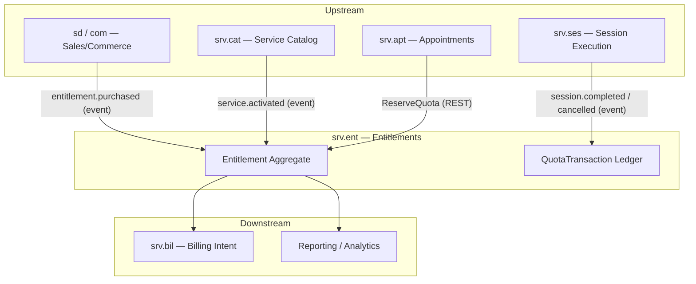
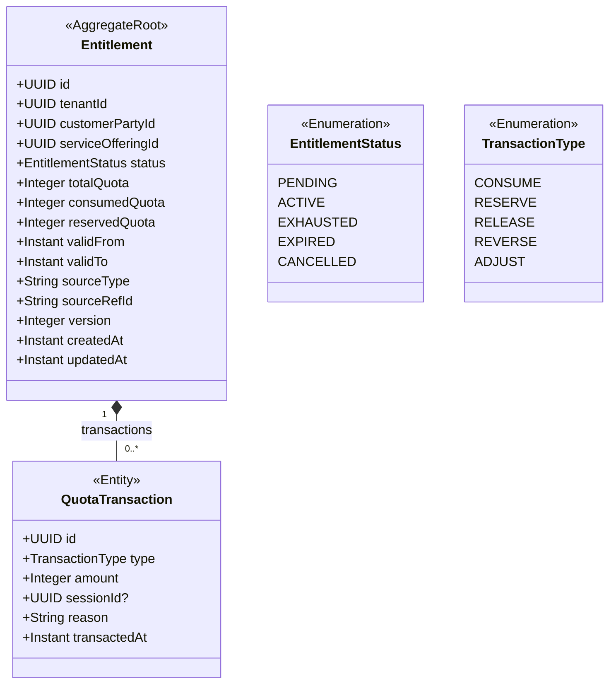
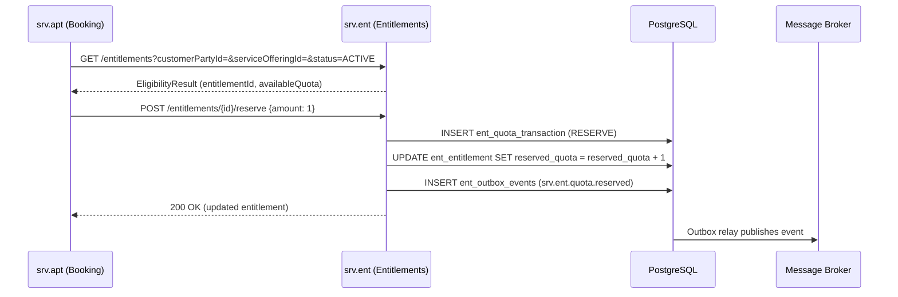
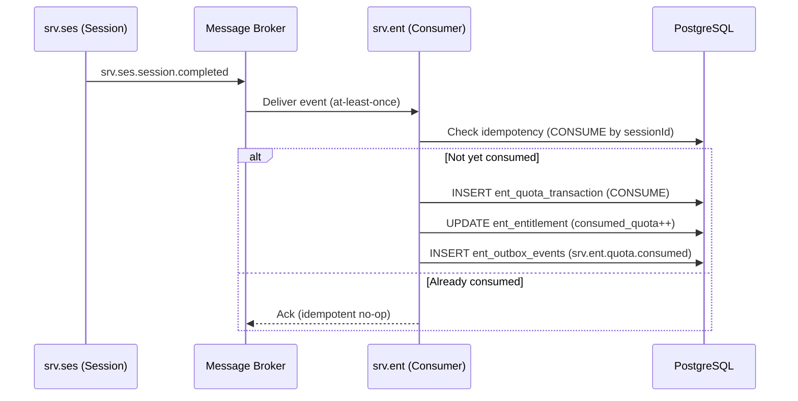
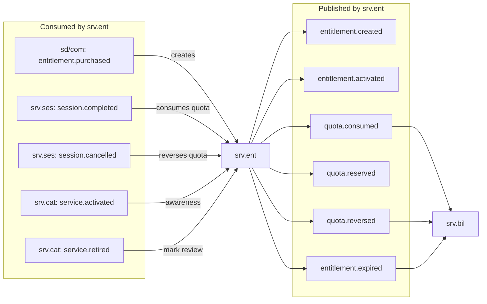
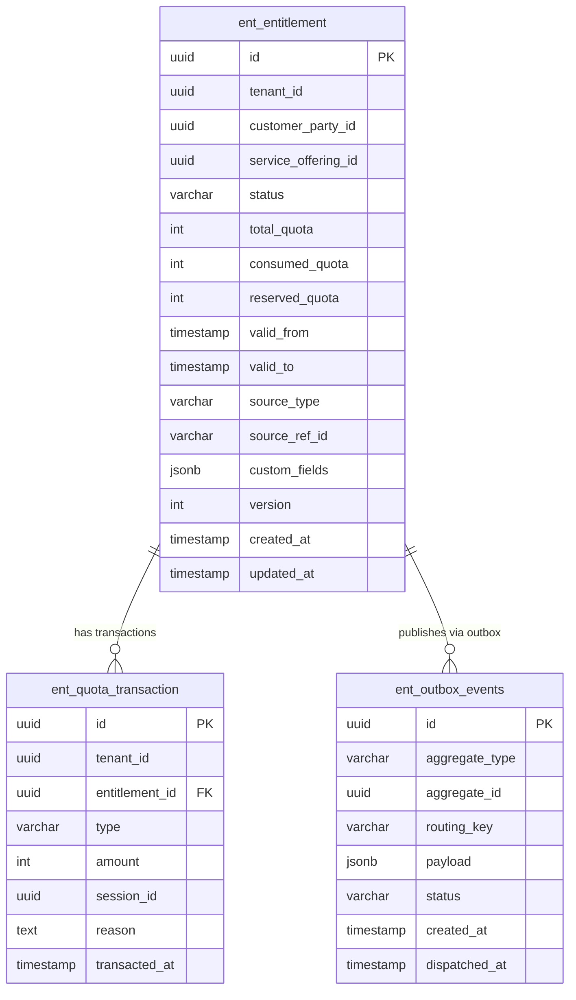

# Entitlements — `srv.ent` Domain / Service Specification

> **Conceptual Stack Layer:** Domain / Service
> **Space:** Platform
> **Owner:** Domain Engineering Team
> **Schema alignment:** `service-layer.schema.json`
> **Companion files:** `openapi.yaml`, `*.schema.json` (event contracts)
> **Referenced by:** Platform-Feature Spec SS5 (backend dependencies), BFF Contract
> **Belongs to:** SRV Suite Spec (`_srv_suite.md`)

> **Meta Information**
> - **Version:** 2026-04-03
> - **Template:** `domain-service-spec.md` v1.0.0
> - **Template Compliance:** ~97% — all 16 sections present with full depth
> - **Author(s):** OpenLeap Architecture Team
> - **Status:** DRAFT
> - **Suite:** `srv`
> - **Domain:** `ent`
> - **Bounded Context Ref:** `bc:entitlements`
> - **Service ID:** `srv-ent-svc`
> - **basePackage:** `io.openleap.srv.ent`
> - **API Base Path:** `/api/srv/ent/v1`
> - **OpenLeap Starter Version:** `v1`
> - **Port:** OPEN QUESTION — see Q-ENT-004
> - **Repository:** OPEN QUESTION — see Q-ENT-005
> - **Tags:** `entitlement`, `quota`, `subscription`, `srv`
> - **Team:**
>   - Name: `team-srv`
>   - Email: `srv-team@openleap.io`
>   - Slack: `#srv-team`

---

## Specification Guidelines Compliance

> ### Non-Negotiables
> - Never invent facts. If required info is missing, add an **OPEN QUESTION** entry.
> - Preserve intent and decisions. Only change meaning when explicitly requested.
> - Do not remove normative constraints unless they are explicitly replaced.
> - Keep the spec **self-contained**: no "see chat", no implicit context.
>
> ### Source of Truth Priority
> When sources conflict:
> 1. Spec (explicit) wins
> 2. Starter specs (implementation constraints) next
> 3. Guidelines (best practices) last
>
> Record conflicts in the **Decisions & Conflicts** section (see Section 14).
>
> ### Style Guide
> - Prefer short sentences and lists.
> - Use MUST/SHOULD/MAY for normative statements.
> - Keep terminology consistent (Aggregate, Domain Service, Application Service, Command, Event).
> - Avoid ambiguous words ("often", "maybe") unless explicitly noting uncertainty.
> - Keep examples minimal and clearly marked as examples.
> - Do not add implementation code unless the chapter explicitly requires it.

---

## 0. Document Purpose & Scope

### 0.1 Purpose
`srv.ent` specifies **entitlements**: customer-specific rights to consume services over time (quotas, subscriptions, treatment series). It answers: "Is the customer entitled now, and what remains?" It is the authoritative engine for eligibility checks and quota accounting within the SRV suite.

### 0.2 Target Audience
- Product Owners & Business Stakeholders
- System Architects & Technical Leads
- Integration Engineers

### 0.3 Scope

**In Scope:**
- MUST manage entitlement definitions/types and customer-specific entitlement instances.
- MUST manage validity windows and rules.
- MUST manage quota consumption and remaining balance.
- SHOULD support reservation/hold vs consumption policy (deployment-dependent).
- MAY support transfer/assignment rules (e.g., family members) if allowed.

**Out of Scope:**
- MUST NOT own selling/renewal commercial processes (-> `sd`/`com`).
- MUST NOT own legal invoicing/revenue postings (-> `fi`).

### 0.4 Related Documents

| Document | Path | Type |
|----------|------|------|
| SRV Suite Spec | `T3_Domains/SRV/_srv_suite.md` | Suite Spec |
| Service Catalog Spec | `T3_Domains/SRV/srv_cat-spec.md` | Domain Spec |
| Appointment Spec | `T3_Domains/SRV/srv_apt-spec.md` | Domain Spec |
| Session Spec | `T3_Domains/SRV/srv_ses-spec.md` | Domain Spec |
| Billing Intent Spec | `T3_Domains/SRV/srv_bil-spec.md` | Domain Spec |

---

## 1. Business Context

### 1.1 Domain Purpose
Provide a deterministic entitlement engine to validate eligibility at booking time and to consume quotas based on delivered sessions. Entitlements decouple the commercial act of buying service capacity (handled upstream by `sd`/`com`) from the operational act of consuming it (handled by `srv.ent`).

### 1.2 Business Value
- Prevents oversubscription and unauthorized service consumption.
- Enables prepaid/subscription business models (punch cards, course packages, treatment series).
- Provides balance transparency for customers and back office.
- Supports reversals and adjustments, maintaining consistent ledger-like balance accounting.
- Decouples billing timing from service delivery timing.

### 1.3 Key Stakeholders

| Role | Responsibility | Primary Use Cases |
|------|----------------|-------------------|
| Customer | Check entitlement balance | View remaining quota, validity window |
| Booking Agent | Verify eligibility before booking | UC-001: CheckEligibility, UC-002: GetBalance |
| Finance/Admin | Manage entitlements | Create, adjust, expire entitlements |
| Service Provider | Confirm consumption after session delivery | UC-004: ConsumeQuota |
| System Integrator | Ingest entitlement purchase events | UC-008: CreateEntitlement (event-driven) |

### 1.4 Strategic Positioning

The `srv.ent` domain occupies the **entitlement-accounting** responsibility within the SRV suite — analogous to the inventory/stock accounting function in manufacturing (SAP MM-IM) but applied to customer service quotas. It acts as a **ledger of consumed and available service rights**, bridging commercial order fulfillment (upstream: `sd`/`com`) with operational service delivery (downstream: `srv.apt`, `srv.ses`).

Key strategic characteristics:
- **Event-driven ingestion:** Entitlements are created by reacting to commercial events, not by direct user input from operational staff.
- **Read-heavy at runtime:** Eligibility checks (UC-001) are on the critical path of appointment booking; sub-50ms p95 latency is required.
- **Append-only ledger semantics:** Quota changes MUST be recorded as immutable `QuotaTransaction` records; balance is always derived, never stored directly as a mutable field (except as a cached `consumedQuota` counter for performance).
- **No pricing, no revenue:** Monetary values MUST NOT enter this domain.

### 1.5 Service Context

| Property | Value |
|----------|-------|
| **Suite** | `srv` |
| **Domain** | `ent` |
| **Bounded Context** | `bc:entitlements` |
| **Service ID** | `srv-ent-svc` |
| **Base Package** | `io.openleap.srv.ent` |

**Responsibilities:**
- Ingest entitlement creation triggers from sales/commerce (event-driven)
- Map entitlement types to service offerings (`srv.cat`)
- Provide eligibility and balance queries
- Consume session completion/cancellation events to apply consumption/reversal
- Publish quota-state change events for downstream consumers (billing, reporting)

**Authoritative Sources:**
| Source Type | Description | Access Pattern |
|-------------|-------------|----------------|
| REST API | Entitlement queries and quota operations | Synchronous |
| Database | `ent_entitlement`, `ent_quota_transaction` — owned exclusively | Direct (owner) |
| Events | Published on all quota state changes | Asynchronous (outbox) |



---

## 2. Service Identity

| Property | Value | Schema Field |
|----------|-------|-------------|
| **Service ID** | `srv-ent-svc` | `metadata.id` |
| **Display Name** | Entitlements | `metadata.name` |
| **Suite** | `srv` | `metadata.suite` |
| **Domain** | `ent` | `metadata.domain` |
| **Bounded Context** | `bc:entitlements` | `metadata.bounded_context_ref` |
| **Version** | `1.1.0` | `metadata.version` |
| **Status** | DRAFT | `metadata.status` |
| **API Base Path** | `/api/srv/ent/v1` | `metadata.api_base_path` |
| **Repository** | OPEN QUESTION — see Q-ENT-005 | `metadata.repository` |
| **Tags** | `entitlement`, `quota`, `subscription`, `srv` | `metadata.tags` |

**Team:**
| Property | Value |
|----------|-------|
| **Name** | `team-srv` |
| **Email** | `srv-team@openleap.io` |
| **Slack** | `#srv-team` |

---

## 3. Domain Model

### 3.1 Conceptual Overview

The `srv.ent` domain models customer **entitlements** as rights to consume service capacity. An entitlement is purchased commercially (outside this domain) and then consumed operationally as sessions are delivered.

Core concepts:
- **Entitlement:** The customer's right to receive a defined number of service units within a validity window. Has a quota (totalQuota), tracks consumed and reserved units, and transitions through a defined lifecycle (PENDING → ACTIVE → EXHAUSTED/EXPIRED/CANCELLED).
- **QuotaTransaction:** An immutable ledger record capturing every quota change (RESERVE, RELEASE, CONSUME, REVERSE, ADJUST). The balance (`consumedQuota`, `reservedQuota`) is always derivable from the transaction log.
- **Eligibility:** The computed property derived at query time — is the entitlement ACTIVE, within validity, and has remaining quota?

Analogues: SAP IS-U Contract Accounts, CRM Service Contracts (SD-SC), membership management.

### 3.2 Core Concepts



### 3.3 Aggregate Definitions

#### 3.3.1 Entitlement

| Property | Value |
|----------|-------|
| **Aggregate ID** | `agg:entitlement` |
| **Name** | `Entitlement` |

**Business Purpose:** A customer-specific right to consume services over time, with tracked quota balance and validity.

##### Aggregate Root

**Key Attributes:**
| Attribute | Type | Format | Description | Constraints | Required | Read-Only |
|-----------|------|--------|-------------|-------------|----------|-----------|
| id | string | uuid | Unique identifier (OlUuid.create()) | Immutable | Yes | Yes |
| tenantId | string | uuid | Tenant ownership for multi-tenancy RLS | Immutable | Yes | Yes |
| customerPartyId | string | uuid | Reference to the customer (shared.bp BusinessParty) | — | Yes | No |
| serviceOfferingId | string | uuid | Reference to the applicable service offering (srv.cat) | — | Yes | No |
| status | string | — | Lifecycle state of the entitlement | enum_ref: `EntitlementStatus` | Yes | No |
| totalQuota | integer | int32 | Total units granted by this entitlement (e.g., 10 sessions) | minimum: 1 | Yes | No |
| consumedQuota | integer | int32 | Units permanently consumed (derived from CONSUME transactions) | minimum: 0 | Yes | Yes |
| reservedQuota | integer | int32 | Units currently reserved/held (derives from RESERVE minus RELEASE) | minimum: 0 | Yes | Yes |
| validFrom | string | date-time | Start of the entitlement validity window (ISO-8601) | — | Yes | No |
| validTo | string | date-time | End of the entitlement validity window (ISO-8601) | Must be after `validFrom` | Yes | No |
| sourceType | string | — | Origin system/suite that created the entitlement (e.g., `sd`, `com`) | max_length: 20 | No | No |
| sourceRefId | string | — | Source reference ID (order number, contract number) for traceability | max_length: 100 | No | No |
| version | integer | int64 | Optimistic locking version counter (incremented on each write) | minimum: 0 | Yes | Yes |
| createdAt | string | date-time | Timestamp when the entitlement was created | — | Yes | Yes |
| updatedAt | string | date-time | Timestamp of last update | — | Yes | Yes |

**State Descriptions:**

| State | Description | Business Meaning |
|-------|-------------|-----------------|
| PENDING | Created but not yet activated | Entitlement exists but cannot be consumed; may await payment confirmation |
| ACTIVE | Valid and consumable | Customer may book/consume services using this entitlement |
| EXHAUSTED | All quota consumed | No units remain; entitlement is closed but still visible in history |
| EXPIRED | Validity window passed | Valid-to date reached before quota exhaustion; remaining units forfeited |
| CANCELLED | Administratively cancelled | Manual or automated cancellation; any reserved units MUST be released |

**Allowed Transitions:**

| From State | To State | Trigger | Guard |
|------------|----------|---------|-------|
| PENDING | ACTIVE | Activate command / payment confirmed event | — |
| PENDING | CANCELLED | Cancel command | — |
| ACTIVE | EXHAUSTED | consumedQuota reaches totalQuota | consumedQuota + reservedQuota == totalQuota |
| ACTIVE | EXPIRED | System scheduler / validity check | current time > validTo |
| ACTIVE | CANCELLED | Cancel command | — |
| EXHAUSTED | — | Terminal state | No transitions |
| EXPIRED | — | Terminal state | No transitions |
| CANCELLED | — | Terminal state | No transitions |

**Domain Events Emitted:**
- `srv.ent.entitlement.created`
- `srv.ent.entitlement.activated`
- `srv.ent.entitlement.expired`
- `srv.ent.quota.reserved`
- `srv.ent.quota.consumed`
- `srv.ent.quota.reversed`

##### Child Entities

###### Entity: QuotaTransaction

| Property | Value |
|----------|-------|
| **Entity ID** | `ent:quota-transaction` |
| **Name** | `QuotaTransaction` |
| **Relationship to Root** | one_to_many |

**Business Purpose:** Append-only record of quota changes for audit trail and balance derivation. Acts as the ledger of the entitlement.

**Collection Constraints:**
- Minimum items: 0 (new entitlement has no transactions)
- Maximum items: No hard limit; index on `(tenant_id, entitlement_id)` ensures performance

**Attributes:**
| Attribute | Type | Format | Description | Constraints | Required |
|-----------|------|--------|-------------|-------------|----------|
| id | string | uuid | Unique identifier (OlUuid.create()) | Immutable | Yes |
| type | string | — | Type of quota change | enum_ref: `TransactionType` | Yes |
| amount | integer | int32 | Number of units affected by this transaction | minimum: 1 | Yes |
| sessionId | string | uuid | Related session ID (mandatory for CONSUME and REVERSE types) | — | No |
| reason | string | — | Human-readable description of why the transaction was created | max_length: 500 | No |
| transactedAt | string | date-time | Timestamp when the transaction was recorded | — | Yes |

**Invariants:**
- BR-001: `consumedQuota + reservedQuota` MUST NOT exceed `totalQuota`
- Transactions are append-only; existing transactions MUST NOT be modified or deleted
- CONSUME and REVERSE transactions SHOULD reference a valid `sessionId`

##### Value Objects

No cross-aggregate value objects are currently identified for `srv.ent`. The `Money` type explicitly does NOT appear here (pricing is out of scope).

> OPEN QUESTION: See Q-ENT-006 in §14.3 — Should a `QuotaAllocation` value object be introduced to encapsulate `(totalQuota, consumedQuota, reservedQuota)` as an immutable snapshot?

### 3.4 Enumerations

#### EntitlementStatus

| Value | Description | Deprecated |
|-------|-------------|------------|
| PENDING | Entitlement created but not yet active; consumption not permitted | No |
| ACTIVE | Entitlement is valid and within its validity window; consumption permitted | No |
| EXHAUSTED | All quota has been consumed; no further consumption permitted | No |
| EXPIRED | Validity window has passed before quota exhaustion; remaining units forfeited | No |
| CANCELLED | Entitlement was cancelled manually or automatically; all reservations released | No |

#### TransactionType

| Value | Description | Deprecated |
|-------|-------------|------------|
| CONSUME | Permanent quota reduction following confirmed service delivery (session completed) | No |
| RESERVE | Temporary hold of quota units at appointment booking time, preventing oversubscription | No |
| RELEASE | Cancels a prior RESERVE, restoring reserved units to available balance | No |
| REVERSE | Undoes a prior CONSUME following session cancellation or reversal; paired with a CONSUME transaction | No |
| ADJUST | Administrative correction of quota balance (increase or decrease); requires audit reason | No |

### 3.5 Shared Types

No shared types are currently defined across multiple aggregates in `srv.ent`. The domain has a single aggregate root (Entitlement) and one child entity (QuotaTransaction).

---

## 4. Business Rules & Constraints

### 4.1 Business Rules Catalog

| ID | Rule Name | Description | Scope | Enforcement | Error Code |
|----|-----------|-------------|-------|-------------|------------|
| BR-001 | Quota Overrun Prevention | `consumed + reserved` MUST NOT exceed `total` | Entitlement | Reserve, Consume | `ENT_QUOTA_EXCEEDED` |
| BR-002 | Validity Window Enforcement | Operations MUST NOT occur outside validity window | Entitlement | Reserve, Consume | `ENT_NOT_VALID` |
| BR-003 | Terminal State Guard | EXHAUSTED/EXPIRED/CANCELLED entitlements MUST NOT accept new consumption or reservation | Entitlement | Reserve, Consume | `ENT_NOT_ACTIVE` |
| BR-004 | Valid Date Range | `validTo` MUST be strictly after `validFrom` | Entitlement | Create | `ENT_INVALID_DATES` |
| BR-005 | Idempotent Consumption | Consuming quota for the same `sessionId` twice MUST be idempotent (second call is a no-op) | Entitlement | Consume | `ENT_ALREADY_CONSUMED` |
| BR-006 | Reversal Pairing | A REVERSE transaction MUST reference a prior CONSUME transaction for the same `sessionId` | QuotaTransaction | Reverse | `ENT_NO_PRIOR_CONSUME` |
| BR-007 | Append-Only Ledger | QuotaTransaction records MUST NOT be modified or deleted after creation | QuotaTransaction | All | `ENT_IMMUTABLE_RECORD` |

### 4.2 Detailed Rule Definitions

#### BR-001: Quota Overrun Prevention

**Business Context:** In prepaid service models (punch cards, course packages), the customer has purchased a fixed number of service units. The system MUST guarantee that at no point can more than the purchased quantity be consumed or reserved, even under concurrent booking load.

**Rule Statement:** At all times, `consumedQuota + reservedQuota ≤ totalQuota`.

**Applies To:**
- Aggregate: `Entitlement`
- Operations: `reserveQuota`, `consumeQuota`

**Enforcement:** Checked within `Entitlement.reserveQuota()` and `Entitlement.consumeQuota()` domain methods, using optimistic locking (`version` field) to handle concurrent access per ADR-020.

**Validation Logic:** Before applying a RESERVE or CONSUME of amount `n`, compute `consumedQuota + reservedQuota + n`. If result > `totalQuota`, reject.

**Error Handling:**
- **Error Code:** `ENT_QUOTA_EXCEEDED`
- **Error Message:** "Quota exceeded: requested {n} units but only {remaining} remaining"
- **User action:** Choose a different entitlement or contact service admin to adjust quota

**Examples:**
- **Valid:** totalQuota=10, consumed=7, reserved=1, request RESERVE(1) → new reserved=2, total held=9 ≤ 10 ✓
- **Invalid:** totalQuota=10, consumed=7, reserved=2, request RESERVE(2) → would exceed 10 ✗

---

#### BR-002: Validity Window Enforcement

**Business Context:** Entitlements are time-bound (e.g., 12-month course package). Service consumption outside the validity window MUST be rejected to enforce commercial contract terms.

**Rule Statement:** A RESERVE or CONSUME operation MUST be rejected if the current timestamp is before `validFrom` or after `validTo`.

**Applies To:**
- Aggregate: `Entitlement`
- Operations: `reserveQuota`, `consumeQuota`

**Enforcement:** Checked within domain methods against system clock at operation time.

**Validation Logic:** If `now < validFrom` OR `now > validTo`, reject the operation.

**Error Handling:**
- **Error Code:** `ENT_NOT_VALID`
- **Error Message:** "Entitlement is not valid at the current time (valid from {validFrom} to {validTo})"
- **User action:** Check entitlement validity dates or contact service admin

**Examples:**
- **Valid:** validFrom=2026-01-01, validTo=2026-12-31, operation at 2026-06-15 ✓
- **Invalid:** validFrom=2026-01-01, validTo=2026-03-31, operation at 2026-04-15 → expired ✗

---

#### BR-003: Terminal State Guard

**Business Context:** Once an entitlement is exhausted, expired, or cancelled, it cannot be used for new service consumption.

**Rule Statement:** Any RESERVE or CONSUME operation on an entitlement in status `EXHAUSTED`, `EXPIRED`, or `CANCELLED` MUST be rejected.

**Applies To:**
- Aggregate: `Entitlement`
- Operations: `reserveQuota`, `consumeQuota`

**Enforcement:** Status check at the start of each domain method.

**Validation Logic:** If `status in {EXHAUSTED, EXPIRED, CANCELLED}`, reject immediately.

**Error Handling:**
- **Error Code:** `ENT_NOT_ACTIVE`
- **Error Message:** "Entitlement {id} is in terminal state {status} and cannot accept new consumption"
- **User action:** Use an active entitlement or contact service admin

**Examples:**
- **Valid:** status=ACTIVE, request RESERVE ✓
- **Invalid:** status=CANCELLED, request RESERVE ✗

---

#### BR-004: Valid Date Range

**Business Context:** Ensures data integrity when creating or updating entitlement validity windows.

**Rule Statement:** `validTo` MUST be strictly after `validFrom`.

**Applies To:**
- Aggregate: `Entitlement`
- Operations: Create

**Enforcement:** Validated in Application Service before persisting.

**Validation Logic:** If `validTo <= validFrom`, reject.

**Error Handling:**
- **Error Code:** `ENT_INVALID_DATES`
- **Error Message:** "validTo must be after validFrom"
- **User action:** Correct the date range

**Examples:**
- **Valid:** validFrom=2026-01-01, validTo=2026-12-31 ✓
- **Invalid:** validFrom=2026-06-01, validTo=2026-05-01 ✗

---

#### BR-005: Idempotent Consumption

**Business Context:** Session completion events may be delivered more than once (at-least-once delivery per ADR-014). The system MUST be idempotent to prevent double-consuming quota for the same session.

**Rule Statement:** If a CONSUME transaction already exists for the given `sessionId` on this entitlement, a repeat `consumeQuota` call MUST succeed without creating a second transaction.

**Applies To:**
- Aggregate: `Entitlement`
- Operations: `consumeQuota`

**Enforcement:** Application Service checks for existing CONSUME transaction by `(entitlementId, sessionId)` before dispatching command.

**Validation Logic:** Query `ent_quota_transaction WHERE type='CONSUME' AND session_id=? AND entitlement_id=?`. If found, return success without side effects.

**Error Handling:**
- **Error Code:** `ENT_ALREADY_CONSUMED` (informational, not a failure)
- **Error Message:** "Quota already consumed for session {sessionId}; idempotent no-op applied"
- **User action:** No action required

---

#### BR-006: Reversal Pairing

**Business Context:** A quota reversal undoes a prior consumption (e.g., session cancelled after delivery was recorded). It must be traceable to the original consumption.

**Rule Statement:** A REVERSE transaction MUST reference a `sessionId` for which a prior CONSUME transaction exists on this entitlement.

**Applies To:**
- Aggregate: `Entitlement`
- Operations: `reverseQuota`

**Enforcement:** Application Service validates existence of prior CONSUME before issuing reverse command.

**Validation Logic:** Query for CONSUME transaction by `(entitlementId, sessionId)`. If not found, reject.

**Error Handling:**
- **Error Code:** `ENT_NO_PRIOR_CONSUME`
- **Error Message:** "No prior CONSUME found for session {sessionId}; reversal rejected"
- **User action:** Verify the session reference

---

#### BR-007: Append-Only Ledger

**Business Context:** The `QuotaTransaction` log is the audit trail for all balance changes. Its integrity MUST be maintained.

**Rule Statement:** `QuotaTransaction` records MUST NOT be updated or deleted after creation.

**Applies To:**
- Entity: `QuotaTransaction`
- Operations: All (creates only; no update/delete)

**Enforcement:** No UPDATE or DELETE statements permitted on `ent_quota_transaction`. Application layer MUST NOT expose update/delete endpoints for transactions.

**Error Handling:**
- **Error Code:** `ENT_IMMUTABLE_RECORD`
- **Error Message:** "Quota transactions are immutable and cannot be modified"
- **User action:** Use REVERSE or ADJUST transaction types to correct the balance

### 4.3 Data Validation Rules

**Field-Level Validations:**

| Field | Validation Rule | Error Message |
|-------|----------------|---------------|
| totalQuota | Required; minimum: 1 | "totalQuota must be at least 1" |
| validFrom | Required; valid ISO-8601 date-time | "validFrom must be a valid date-time" |
| validTo | Required; valid ISO-8601 date-time; must be after validFrom | "validTo must be a valid date-time after validFrom" |
| customerPartyId | Required; valid UUID | "customerPartyId is required and must be a UUID" |
| serviceOfferingId | Required; valid UUID | "serviceOfferingId is required and must be a UUID" |
| sourceType | Optional; max 20 characters | "sourceType must not exceed 20 characters" |
| sourceRefId | Optional; max 100 characters | "sourceRefId must not exceed 100 characters" |
| QuotaTransaction.amount | Required; minimum: 1 | "Transaction amount must be at least 1" |
| QuotaTransaction.reason | Optional; max 500 characters | "reason must not exceed 500 characters" |

**Cross-Field Validations:**
- `validTo` MUST be strictly after `validFrom` (BR-004)
- For CONSUME type transactions: `sessionId` SHOULD be provided
- For REVERSE type transactions: `sessionId` MUST be provided and match an existing CONSUME

### 4.4 Reference Data Dependencies

| Catalog | Source Service | Fields Referencing | Validation |
|---------|----------------|-------------------|------------|
| Business Party (Customer) | `shared.bp` / T2 | `customerPartyId` | Reference existence check at create time |
| Service Offering | `srv.cat` | `serviceOfferingId` | Reference existence check at create time; offering must be in ACTIVE status |

---

## 5. Use Cases

### 5.1 Business Logic Placement

| Logic Type | Placement | Examples |
|------------|-----------|----------|
| Aggregate invariants | Domain Object (`Entitlement`) | Quota overrun check (BR-001), validity check (BR-002), terminal state guard (BR-003) |
| Cross-aggregate logic | Domain Service (`EntitlementDomainService`) | Eligibility resolution across multiple entitlements for a customer/offering pair |
| Orchestration & transactions | Application Service (`EntitlementApplicationService`) | Idempotency guard (BR-005), event publishing via outbox (ADR-013), command dispatch (ADR-008) |
| Query projection | Query Service (`EntitlementQueryService`) | Read-model construction for balance views, eligibility results |

### 5.2 Use Cases (Canonical Format)

#### UC-001: CheckEligibility

| Field | Value |
|-------|-------|
| **id** | `CheckEligibility` |
| **type** | READ |
| **trigger** | REST |
| **domainOperation** | `EntitlementQueryService.checkEligibility` |
| **inputs** | `customerPartyId: UUID`, `serviceOfferingId: UUID` |
| **outputs** | `EligibilityResult` |
| **rest** | `GET /api/srv/ent/v1/entitlements?customerPartyId=&serviceOfferingId=&status=ACTIVE` |

**Actor:** Booking Agent, Appointment System (`srv.apt`)

**Preconditions:**
- `customerPartyId` references an existing business party
- `serviceOfferingId` references an existing service offering

**Main Flow:**
1. Caller provides `customerPartyId` and `serviceOfferingId` as query parameters
2. System queries all ACTIVE entitlements for this customer/offering pair within current validity window
3. System computes available balance per entitlement (`totalQuota - consumedQuota - reservedQuota`)
4. System returns `EligibilityResult` with eligibility flag and list of eligible entitlements with balances

**Postconditions:**
- No state changes; read-only operation

**Business Rules Applied:**
- BR-002: Only entitlements within validity window are considered eligible
- BR-003: Only ACTIVE entitlements are returned

**Alternative Flows:**
- **Alt-1:** If multiple active entitlements exist, return all; caller selects which one to use

**Exception Flows:**
- **Exc-1:** If no active entitlements found, return empty list with `eligible: false`

---

#### UC-002: GetBalance

| Field | Value |
|-------|-------|
| **id** | `GetBalance` |
| **type** | READ |
| **trigger** | REST |
| **domainOperation** | `EntitlementQueryService.getBalance` |
| **inputs** | `entitlementId: UUID` |
| **outputs** | `BalanceSummary` |
| **rest** | `GET /api/srv/ent/v1/entitlements/{id}/balance` |

**Actor:** Customer, Back Office Admin, Customer Portal

**Preconditions:**
- Entitlement with given ID exists and belongs to the caller's tenant

**Main Flow:**
1. Caller provides entitlement `id`
2. System retrieves entitlement and computes: `available = totalQuota - consumedQuota - reservedQuota`
3. System returns balance summary including status and validity dates

**Postconditions:**
- No state changes; read-only operation

**Business Rules Applied:**
- Tenant isolation enforced via RLS

---

#### UC-003: ReserveQuota

| Field | Value |
|-------|-------|
| **id** | `ReserveQuota` |
| **type** | WRITE |
| **trigger** | REST (or internal from `srv.apt` booking event) |
| **aggregate** | `Entitlement` |
| **domainOperation** | `Entitlement.reserveQuota` |
| **inputs** | `entitlementId: UUID`, `amount: Integer` |
| **outputs** | `Entitlement` (updated) |
| **events** | `srv.ent.quota.reserved` |
| **rest** | `POST /api/srv/ent/v1/entitlements/{id}/reserve` |
| **errors** | `ENT_QUOTA_EXCEEDED`, `ENT_NOT_ACTIVE`, `ENT_NOT_VALID` |

**Actor:** Appointment System (`srv.apt`), Booking Agent

**Preconditions:**
- Entitlement is ACTIVE
- Current time is within validity window
- Sufficient quota is available

**Main Flow:**
1. Caller submits reserve request with `amount`
2. System validates entitlement status (BR-003), validity (BR-002), quota (BR-001)
3. System creates `QuotaTransaction(type=RESERVE, amount=n)`
4. System increments `reservedQuota` counter
5. System publishes `srv.ent.quota.reserved` event via outbox

**Postconditions:**
- `reservedQuota` is incremented by `amount`
- One `QuotaTransaction(RESERVE)` record appended

**Business Rules Applied:**
- BR-001: Quota overrun check
- BR-002: Validity window check
- BR-003: Terminal state check

**Alternative Flows:**
- **Alt-1:** If reservation is for a specific appointment slot, caller passes appointment context in `reason`

**Exception Flows:**
- **Exc-1:** Concurrent reserve (optimistic lock conflict) → retry once, then return 409

---

#### UC-004: ConsumeQuota

| Field | Value |
|-------|-------|
| **id** | `ConsumeQuota` |
| **type** | WRITE |
| **trigger** | Message (from `srv.ses.session.completed`) |
| **aggregate** | `Entitlement` |
| **domainOperation** | `Entitlement.consumeQuota` |
| **inputs** | `entitlementId: UUID`, `sessionId: UUID`, `amount: Integer` |
| **events** | `srv.ent.quota.consumed` |
| **idempotency** | required (by sessionId) |

**Actor:** Session Service (`srv.ses`) via event

**Preconditions:**
- Session is in COMPLETED state (validated by source event)
- Entitlement is ACTIVE or being exhausted by this consumption
- No prior CONSUME for same sessionId exists (idempotency check per BR-005)

**Main Flow:**
1. `srv.ses.session.completed` event arrives on the entitlement consumer queue
2. Application Service checks for existing CONSUME transaction for this `sessionId` (BR-005 idempotency)
3. If none found: validates status, validity, quota; creates CONSUME transaction; decrements reservedQuota (if prior RESERVE exists) and increments consumedQuota
4. If consuming last unit: transitions entitlement status to EXHAUSTED
5. Publishes `srv.ent.quota.consumed` event
6. Marks incoming event as processed (idempotent consumer pattern)

**Postconditions:**
- `consumedQuota` incremented by `amount`
- If `consumedQuota == totalQuota`, status transitions to EXHAUSTED

**Business Rules Applied:**
- BR-001, BR-002, BR-003, BR-005, BR-006

**Exception Flows:**
- **Exc-1:** Entitlement not found for sessionId → publish to DLQ with error context

---

#### UC-005: ReverseQuota

| Field | Value |
|-------|-------|
| **id** | `ReverseQuota` |
| **type** | WRITE |
| **trigger** | Message (from `srv.ses.session.cancelled`) |
| **aggregate** | `Entitlement` |
| **domainOperation** | `Entitlement.reverseQuota` |
| **events** | `srv.ent.quota.reversed` |
| **idempotency** | required (by sessionId) |

**Actor:** Session Service (`srv.ses`) via event

**Preconditions:**
- Prior CONSUME transaction exists for this `sessionId` (BR-006)

**Main Flow:**
1. `srv.ses.session.cancelled` event arrives
2. Application Service validates prior CONSUME for this `sessionId` (BR-006)
3. System creates REVERSE transaction; decrements `consumedQuota`
4. If entitlement was EXHAUSTED, re-activates to ACTIVE (quota is now available again)
5. Publishes `srv.ent.quota.reversed` event

**Postconditions:**
- `consumedQuota` decremented
- Entitlement may transition from EXHAUSTED → ACTIVE

**Business Rules Applied:**
- BR-006, BR-007

---

#### UC-006: GetEntitlement

| Field | Value |
|-------|-------|
| **id** | `GetEntitlement` |
| **type** | READ |
| **rest** | `GET /api/srv/ent/v1/entitlements/{id}` |
| **trigger** | REST |

**Actor:** Back Office Admin, Customer Portal

**Main Flow:**
1. Caller provides entitlement `id`
2. System retrieves entitlement including full transaction history
3. Returns entitlement read model

---

#### UC-007: SearchEntitlements

| Field | Value |
|-------|-------|
| **id** | `SearchEntitlements` |
| **type** | READ |
| **rest** | `GET /api/srv/ent/v1/entitlements?customerPartyId=&status=` |
| **trigger** | REST |

**Actor:** Back Office Admin, Customer Portal

**Main Flow:**
1. Caller provides filter parameters
2. System queries entitlements matching filters with tenant isolation
3. Returns paginated list of entitlement read models

---

#### UC-008: CreateEntitlement (Event-Driven)

| Field | Value |
|-------|-------|
| **id** | `CreateEntitlement` |
| **type** | WRITE |
| **trigger** | Message (from `sd.*` or `com.*` — entitlement purchase event) |
| **aggregate** | `Entitlement` |
| **domainOperation** | `Entitlement.create` |
| **events** | `srv.ent.entitlement.created` |
| **idempotency** | required (by sourceRefId) |

**Actor:** Sales / Commerce Suite (upstream)

**Main Flow:**
1. Commercial event arrives indicating customer has purchased service entitlement
2. Application Service creates new Entitlement in PENDING status
3. Publishes `srv.ent.entitlement.created` event
4. If auto-activation is configured: immediately activates (status → ACTIVE), publishes `srv.ent.entitlement.activated`

> OPEN QUESTION: See Q-ENT-003 in §14.3 — Exact event keys from `sd`/`com` for entitlement purchase triggers.

### 5.3 Process Flow Diagrams

#### Quota Reservation Flow



#### Session Completion Consumption Flow



### 5.4 Cross-Domain Workflows

#### Workflow: Entitlement Lifecycle (Purchase → Consumption → Expiry)

**Pattern:** Choreography (event-driven)

**Participating Services:**
| Service | Role | Integration Type |
|---------|------|-----------------|
| `sd` / `com` | Originator (purchase) | Event publisher |
| `srv.ent` | Entitlement manager | Event consumer + publisher |
| `srv.apt` | Quota reserver at booking | REST consumer |
| `srv.ses` | Quota consumer at delivery | Event publisher |
| `srv.bil` | Billing intent | Event consumer |

**Workflow Steps:**
1. Customer purchases service package → `sd`/`com` publishes purchase event
2. `srv.ent` creates Entitlement (PENDING → ACTIVE)
3. Customer books appointment → `srv.apt` reserves quota (`POST /entitlements/{id}/reserve`)
4. Session is delivered → `srv.ses` publishes `session.completed`
5. `srv.ent` consumes quota; if last unit: ACTIVE → EXHAUSTED
6. `srv.ent` publishes `quota.consumed` → `srv.bil` creates billing intent

**Failure Path:**
- Session cancelled: `srv.ses` publishes `session.cancelled` → `srv.ent` reverses quota
- Entitlement expired before exhaustion: scheduler transitions ACTIVE → EXPIRED; reserved quota is released

---

## 6. REST API

### 6.1 API Overview

**Base Path:** `/api/srv/ent/v1`
**Authentication:** OAuth2 Bearer Token (JWT)
**Content Type:** `application/json`
**Versioning:** URI-based (v1)
**Pagination:** Cursor-based for list endpoints

### 6.2 Resource Operations

#### 6.2.1 Search Entitlements

```http
GET /api/srv/ent/v1/entitlements?customerPartyId={uuid}&serviceOfferingId={uuid}&status={status}&page={n}&size={n}
Authorization: Bearer {token}
```

**Query Parameters:**
| Parameter | Type | Required | Description |
|-----------|------|----------|-------------|
| customerPartyId | uuid | No | Filter by customer |
| serviceOfferingId | uuid | No | Filter by service offering |
| status | string | No | Filter by EntitlementStatus |
| page | integer | No | Page number (default: 0) |
| size | integer | No | Page size (default: 20, max: 100) |

**Success Response:** `200 OK`
```json
{
  "content": [
    {
      "id": "a1b2c3d4-e5f6-7890-abcd-ef1234567890",
      "tenantId": "t1000000-0000-0000-0000-000000000001",
      "customerPartyId": "c9000000-0000-0000-0000-000000000001",
      "serviceOfferingId": "s8000000-0000-0000-0000-000000000001",
      "status": "ACTIVE",
      "totalQuota": 10,
      "consumedQuota": 3,
      "reservedQuota": 1,
      "validFrom": "2026-01-01T00:00:00Z",
      "validTo": "2026-12-31T23:59:59Z",
      "sourceType": "sd",
      "sourceRefId": "ORD-2026-001234",
      "version": 4,
      "createdAt": "2026-01-01T10:00:00Z",
      "updatedAt": "2026-04-01T14:00:00Z",
      "_links": {
        "self": { "href": "/api/srv/ent/v1/entitlements/a1b2c3d4-e5f6-7890-abcd-ef1234567890" },
        "balance": { "href": "/api/srv/ent/v1/entitlements/a1b2c3d4-e5f6-7890-abcd-ef1234567890/balance" }
      }
    }
  ],
  "page": { "number": 0, "size": 20, "totalElements": 1, "totalPages": 1 }
}
```

**Error Responses:**
- `400 Bad Request` — Invalid filter parameter format

---

#### 6.2.2 Get Entitlement

```http
GET /api/srv/ent/v1/entitlements/{id}
Authorization: Bearer {token}
```

**Success Response:** `200 OK`
```json
{
  "id": "a1b2c3d4-e5f6-7890-abcd-ef1234567890",
  "tenantId": "t1000000-0000-0000-0000-000000000001",
  "customerPartyId": "c9000000-0000-0000-0000-000000000001",
  "serviceOfferingId": "s8000000-0000-0000-0000-000000000001",
  "status": "ACTIVE",
  "totalQuota": 10,
  "consumedQuota": 3,
  "reservedQuota": 1,
  "validFrom": "2026-01-01T00:00:00Z",
  "validTo": "2026-12-31T23:59:59Z",
  "sourceType": "sd",
  "sourceRefId": "ORD-2026-001234",
  "version": 4,
  "createdAt": "2026-01-01T10:00:00Z",
  "updatedAt": "2026-04-01T14:00:00Z",
  "_links": {
    "self": { "href": "/api/srv/ent/v1/entitlements/a1b2c3d4-e5f6-7890-abcd-ef1234567890" },
    "balance": { "href": "/api/srv/ent/v1/entitlements/a1b2c3d4-e5f6-7890-abcd-ef1234567890/balance" },
    "transactions": { "href": "/api/srv/ent/v1/entitlements/a1b2c3d4-e5f6-7890-abcd-ef1234567890/transactions" }
  }
}
```

**Response Headers:**
- `ETag: "4"` (version number)

**Error Responses:**
- `404 Not Found` — Entitlement does not exist or belongs to different tenant

---

#### 6.2.3 Get Balance

```http
GET /api/srv/ent/v1/entitlements/{id}/balance
Authorization: Bearer {token}
```

**Success Response:** `200 OK`
```json
{
  "entitlementId": "a1b2c3d4-e5f6-7890-abcd-ef1234567890",
  "status": "ACTIVE",
  "totalQuota": 10,
  "consumedQuota": 3,
  "reservedQuota": 1,
  "availableQuota": 6,
  "validFrom": "2026-01-01T00:00:00Z",
  "validTo": "2026-12-31T23:59:59Z",
  "isEligible": true,
  "_links": {
    "self": { "href": "/api/srv/ent/v1/entitlements/a1b2c3d4-e5f6-7890-abcd-ef1234567890/balance" },
    "entitlement": { "href": "/api/srv/ent/v1/entitlements/a1b2c3d4-e5f6-7890-abcd-ef1234567890" }
  }
}
```

**Error Responses:**
- `404 Not Found` — Entitlement does not exist

---

### 6.3 Business Operations

#### 6.3.1 Reserve Quota

```http
POST /api/srv/ent/v1/entitlements/{id}:reserve
Authorization: Bearer {token}
Content-Type: application/json
```

**Request Body:**
```json
{
  "amount": 1,
  "reason": "Appointment booking APT-2026-00456"
}
```

**Success Response:** `200 OK`
```json
{
  "id": "a1b2c3d4-e5f6-7890-abcd-ef1234567890",
  "status": "ACTIVE",
  "totalQuota": 10,
  "consumedQuota": 3,
  "reservedQuota": 2,
  "version": 5,
  "_links": {
    "self": { "href": "/api/srv/ent/v1/entitlements/a1b2c3d4-e5f6-7890-abcd-ef1234567890" }
  }
}
```

**Response Headers:**
- `ETag: "5"`

**Business Rules Checked:**
- BR-001: Quota overrun prevention
- BR-002: Validity window enforcement
- BR-003: Terminal state guard

**Events Published:**
- `srv.ent.quota.reserved`

**Error Responses:**
- `409 Conflict` — Optimistic lock conflict (concurrent modification); retry
- `412 Precondition Failed` — ETag mismatch
- `422 Unprocessable Entity` — `ENT_QUOTA_EXCEEDED`, `ENT_NOT_ACTIVE`, `ENT_NOT_VALID`

---

#### 6.3.2 Consume Quota (Internal)

```http
POST /api/srv/ent/v1/entitlements/{id}:consume
Authorization: Bearer {token}
Content-Type: application/json
```

**Request Body:**
```json
{
  "amount": 1,
  "sessionId": "s5000000-0000-0000-0000-000000000001",
  "reason": "Session completed: SES-2026-00789"
}
```

**Success Response:** `200 OK`
```json
{
  "id": "a1b2c3d4-e5f6-7890-abcd-ef1234567890",
  "status": "ACTIVE",
  "totalQuota": 10,
  "consumedQuota": 4,
  "reservedQuota": 1,
  "version": 6,
  "_links": {
    "self": { "href": "/api/srv/ent/v1/entitlements/a1b2c3d4-e5f6-7890-abcd-ef1234567890" }
  }
}
```

**Business Rules Checked:**
- BR-001, BR-002, BR-003, BR-005 (idempotency)

**Events Published:**
- `srv.ent.quota.consumed`
- `srv.ent.entitlement.exhausted` (if last quota unit consumed)

**Error Responses:**
- `422 Unprocessable Entity` — `ENT_QUOTA_EXCEEDED`, `ENT_NOT_ACTIVE`, `ENT_NOT_VALID`

---

### 6.4 OpenAPI Specification

| Property | Value |
|----------|-------|
| **Location** | `openapi.yaml` (companion file, co-located with this spec) |
| **OpenAPI Version** | 3.1.0 |
| **Docs URL** | OPEN QUESTION — see Q-ENT-005 |
| **Schema Refs** | `ent-entitlement.schema.json`, `ent-quota-transaction.schema.json`, `ent-eligibility-result.schema.json` |

---

## 7. Events & Integration

### 7.1 Architecture Pattern

**Pattern:** Event-driven choreography (ADR-003)
**Message Broker:** RabbitMQ (suite-wide convention per `_srv_suite.md`)
**Publishing Mechanism:** Transactional outbox (ADR-013) — events written to `ent_outbox_events` table within the same database transaction, then relayed by an outbox relay process
**Delivery Guarantee:** At-least-once (ADR-014); consumers MUST implement idempotent handlers
**Exchange:** `srv.ent.events` (topic exchange)
**Rationale:** Quota operations must be atomic with event publishing; outbox pattern eliminates dual-write risk

### 7.2 Published Events

#### Event: Entitlement.Created

**Routing Key:** `srv.ent.entitlement.created`

**Business Purpose:** Notifies downstream systems that a new customer entitlement has been provisioned (still PENDING).

**When Published:** After successful creation of an Entitlement aggregate.

**Payload Structure:**
```json
{
  "aggregateType": "srv.ent.entitlement",
  "changeType": "created",
  "entityIds": ["a1b2c3d4-e5f6-7890-abcd-ef1234567890"],
  "version": 1,
  "occurredAt": "2026-01-01T10:00:00Z"
}
```

**Event Envelope:**
```json
{
  "eventId": "e0000001-0000-0000-0000-000000000001",
  "traceId": "trace-abc-123",
  "tenantId": "t1000000-0000-0000-0000-000000000001",
  "occurredAt": "2026-01-01T10:00:00Z",
  "producer": "srv.ent",
  "schemaRef": "https://schemas.openleap.io/srv/ent/entitlement-created/v1.json",
  "payload": {
    "aggregateType": "srv.ent.entitlement",
    "changeType": "created",
    "entityIds": ["a1b2c3d4-e5f6-7890-abcd-ef1234567890"],
    "version": 1,
    "occurredAt": "2026-01-01T10:00:00Z"
  }
}
```

**Known Consumers:**
| Consumer Service | Handler | Purpose | Processing Type |
|-----------------|---------|---------|-----------------|
| `srv.bil` | `EntitlementCreatedHandler` | Prepare billing intent anchor | Async |

---

#### Event: Entitlement.Activated

**Routing Key:** `srv.ent.entitlement.activated`

**Business Purpose:** Signals that an entitlement is now ACTIVE and can be consumed.

**When Published:** After status transition PENDING → ACTIVE.

**Payload Structure:**
```json
{
  "aggregateType": "srv.ent.entitlement",
  "changeType": "activated",
  "entityIds": ["a1b2c3d4-e5f6-7890-abcd-ef1234567890"],
  "version": 2,
  "occurredAt": "2026-01-01T10:05:00Z"
}
```

**Known Consumers:**
| Consumer Service | Handler | Purpose | Processing Type |
|-----------------|---------|---------|-----------------|
| Reporting | Entitlement activated metric | Analytics | Async |

---

#### Event: Entitlement.Expired

**Routing Key:** `srv.ent.entitlement.expired`

**Business Purpose:** Signals that an entitlement has reached its `validTo` date without being fully consumed.

**When Published:** After scheduled expiry check transitions ACTIVE → EXPIRED.

**Payload Structure:**
```json
{
  "aggregateType": "srv.ent.entitlement",
  "changeType": "expired",
  "entityIds": ["a1b2c3d4-e5f6-7890-abcd-ef1234567890"],
  "version": 5,
  "occurredAt": "2027-01-01T00:00:00Z"
}
```

**Known Consumers:**
| Consumer Service | Handler | Purpose | Processing Type |
|-----------------|---------|---------|-----------------|
| `srv.bil` | `EntitlementExpiredHandler` | Close billing intent; forfeit remaining quota | Async |

---

#### Event: Quota.Reserved

**Routing Key:** `srv.ent.quota.reserved`

**Business Purpose:** Notifies that quota units have been reserved at booking time; prevents double-booking.

**When Published:** After `Entitlement.reserveQuota()` completes successfully.

**Payload Structure:**
```json
{
  "aggregateType": "srv.ent.entitlement",
  "changeType": "quota.reserved",
  "entityIds": ["a1b2c3d4-e5f6-7890-abcd-ef1234567890"],
  "amount": 1,
  "version": 5,
  "occurredAt": "2026-06-15T09:00:00Z"
}
```

**Known Consumers:**
| Consumer Service | Handler | Purpose | Processing Type |
|-----------------|---------|---------|-----------------|
| Reporting | Quota metrics | Analytics | Async |

---

#### Event: Quota.Consumed

**Routing Key:** `srv.ent.quota.consumed`

**Business Purpose:** Signals permanent quota consumption following confirmed session delivery.

**When Published:** After `Entitlement.consumeQuota()` completes.

**Payload Structure:**
```json
{
  "aggregateType": "srv.ent.entitlement",
  "changeType": "quota.consumed",
  "entityIds": ["a1b2c3d4-e5f6-7890-abcd-ef1234567890"],
  "sessionId": "s5000000-0000-0000-0000-000000000001",
  "amount": 1,
  "version": 6,
  "occurredAt": "2026-06-15T10:30:00Z"
}
```

**Known Consumers:**
| Consumer Service | Handler | Purpose | Processing Type |
|-----------------|---------|---------|-----------------|
| `srv.bil` | `QuotaConsumedHandler` | Create billable position | Async |
| Reporting | Consumption analytics | Analytics | Async |

---

#### Event: Quota.Reversed

**Routing Key:** `srv.ent.quota.reversed`

**Business Purpose:** Signals that a prior consumption has been reversed due to session cancellation.

**When Published:** After `Entitlement.reverseQuota()` completes.

**Payload Structure:**
```json
{
  "aggregateType": "srv.ent.entitlement",
  "changeType": "quota.reversed",
  "entityIds": ["a1b2c3d4-e5f6-7890-abcd-ef1234567890"],
  "sessionId": "s5000000-0000-0000-0000-000000000001",
  "amount": 1,
  "version": 7,
  "occurredAt": "2026-06-16T08:00:00Z"
}
```

**Known Consumers:**
| Consumer Service | Handler | Purpose | Processing Type |
|-----------------|---------|---------|-----------------|
| `srv.bil` | `QuotaReversedHandler` | Cancel or credit billing position | Async |

---

### 7.3 Consumed Events

#### Consumed: `sd.*` / `com.*` — Entitlement Purchase

**Routing Key Pattern:** OPEN QUESTION — see Q-ENT-003
**Source Service:** `sd` (Sales) or `com` (Commerce)
**Handler Class:** `EntitlementPurchaseEventHandler`
**Queue:** `srv.ent.in.sd.entitlement.purchased`

**Business Logic:** Creates a new `Entitlement` aggregate in PENDING status. Auto-activates if no payment confirmation step is required (deployment-dependent).

**Queue Configuration:**
- Dead Letter Queue: `srv.ent.dlq.sd.entitlement.purchased`
- Retry Policy: 3 retries with exponential backoff (1s, 4s, 16s) per ADR-014
- Idempotency: De-duplicated by `sourceRefId` (order/contract reference)

**Failure Handling:** After 3 retries, route to DLQ. Operations team alerts via `#srv-team-alerts`.

---

#### Consumed: `srv.ses.session.completed`

**Routing Key:** `srv.ses.session.completed`
**Source Service:** `srv-ses-svc`
**Handler Class:** `SessionCompletedHandler`
**Queue:** `srv.ent.in.srv.ses.session.events`

**Business Logic:** Triggers `ConsumeQuota` for the session's linked entitlement (if any). Idempotent by `sessionId`.

**Queue Configuration:**
- Dead Letter Queue: `srv.ent.dlq.srv.ses.session.events`
- Retry Policy: 3 retries with exponential backoff per ADR-014

---

#### Consumed: `srv.ses.session.cancelled`

**Routing Key:** `srv.ses.session.cancelled`
**Source Service:** `srv-ses-svc`
**Handler Class:** `SessionCancelledHandler`
**Queue:** `srv.ent.in.srv.ses.session.events` (shared with completed events, differentiated by routing key)

**Business Logic:** Triggers `ReverseQuota` for the session's linked entitlement. Idempotent by `sessionId`.

---

#### Consumed: `srv.cat.service.activated`

**Routing Key:** `srv.cat.service.activated`
**Source Service:** `srv-cat-svc`
**Handler Class:** `ServiceActivatedHandler`
**Queue:** `srv.ent.in.srv.cat.service.events`

**Business Logic:** Updates internal awareness of active service offerings. Allows entitlement checks to know which offerings are currently valid.

---

#### Consumed: `srv.cat.service.retired`

**Routing Key:** `srv.cat.service.retired`
**Source Service:** `srv-cat-svc`
**Handler Class:** `ServiceRetiredHandler`
**Queue:** `srv.ent.in.srv.cat.service.events`

**Business Logic:** Marks entitlements referencing the retired service offering for review. Does NOT automatically expire entitlements (requires administrative decision).

---

### 7.4 Event Flow Diagrams



### 7.5 Integration Points Summary

**Upstream Dependencies:**

| Service | Purpose | Integration Type | Criticality | Fallback |
|---------|---------|-----------------|-------------|----------|
| `sd` / `com` | Entitlement creation trigger | Event (async) | High | Queue DLQ; manual re-processing |
| `srv.cat` | Service offering awareness | Event (async) | Medium | Cache last known state |
| `shared.bp` | Customer party validation | REST (sync) | High | Reject create if unavailable |

**Downstream Consumers:**

| Service | Purpose | Integration Type | Criticality |
|---------|---------|-----------------|-------------|
| `srv.bil` | Billing intent generation | Event (async) | High |
| `srv.apt` | Quota reservation at booking | REST (sync) | High |
| Reporting/Analytics | Metrics and dashboards | Event (async) | Low |

---

## 8. Data Model

### 8.1 Storage Technology
**Database:** PostgreSQL (ADR-016)
**Schema isolation:** Per-tenant via Row-Level Security (RLS) on `tenant_id` column
**UUID generation:** `OlUuid.create()` (ADR-021)

### 8.2 Conceptual Data Model



### 8.3 Table Definitions

#### Table: ent_entitlement

**Business Description:** Stores the customer entitlement aggregate root — the right to consume a defined number of service units within a validity window.

**Columns:**
| Column | Type | Nullable | PK | FK | Description |
|--------|------|----------|----|----|-------------|
| id | UUID | NOT NULL | Yes | — | Primary key, generated via OlUuid.create() |
| tenant_id | UUID | NOT NULL | — | — | Tenant identifier for RLS isolation |
| customer_party_id | UUID | NOT NULL | — | — | Reference to the customer (shared.bp) |
| service_offering_id | UUID | NOT NULL | — | — | Reference to the service offering (srv.cat) |
| status | VARCHAR(20) | NOT NULL | — | — | EntitlementStatus enum value |
| total_quota | INTEGER | NOT NULL | — | — | Total units granted; minimum 1 |
| consumed_quota | INTEGER | NOT NULL | — | — | Units permanently consumed; default 0 |
| reserved_quota | INTEGER | NOT NULL | — | — | Units currently reserved; default 0 |
| valid_from | TIMESTAMPTZ | NOT NULL | — | — | Start of validity window |
| valid_to | TIMESTAMPTZ | NOT NULL | — | — | End of validity window; must be after valid_from |
| source_type | VARCHAR(20) | NULL | — | — | Originating suite/system (e.g., 'sd', 'com') |
| source_ref_id | VARCHAR(100) | NULL | — | — | Source reference (order/contract number) |
| custom_fields | JSONB | NOT NULL | — | — | Extension fields for product customization; default '{}' |
| version | INTEGER | NOT NULL | — | — | Optimistic locking version; default 0 |
| created_at | TIMESTAMPTZ | NOT NULL | — | — | Creation timestamp |
| updated_at | TIMESTAMPTZ | NOT NULL | — | — | Last modification timestamp |

**Indexes:**
| Index Name | Columns | Unique |
|------------|---------|--------|
| pk_ent_entitlement | id | Yes |
| uq_ent_entitlement_source | tenant_id, source_type, source_ref_id | Yes (when source_ref_id IS NOT NULL) |
| idx_ent_entitlement_tenant_customer | tenant_id, customer_party_id | No |
| idx_ent_entitlement_tenant_offering | tenant_id, service_offering_id | No |
| idx_ent_entitlement_tenant_status | tenant_id, status | No |
| idx_ent_entitlement_validity | tenant_id, valid_from, valid_to | No |
| idx_ent_entitlement_custom_fields | custom_fields (GIN) | No |

**Relationships:**
- To `ent_quota_transaction`: one-to-many via `ent_quota_transaction.entitlement_id`
- To `ent_outbox_events`: one-to-many via `ent_outbox_events.aggregate_id`

**Data Retention:**
- Soft delete: No physical delete; terminal states (EXHAUSTED, EXPIRED, CANCELLED) represent logical end-of-life
- Retention period: Retain for minimum 10 years for audit compliance (OPEN QUESTION: confirm with legal — see Q-ENT-007)

---

#### Table: ent_quota_transaction

**Business Description:** Append-only ledger of all quota changes on an entitlement. The balance (`consumed_quota`, `reserved_quota`) is derived from this log and cached on `ent_entitlement` for performance.

**Columns:**
| Column | Type | Nullable | PK | FK | Description |
|--------|------|----------|----|----|-------------|
| id | UUID | NOT NULL | Yes | — | Primary key, generated via OlUuid.create() |
| tenant_id | UUID | NOT NULL | — | — | Tenant identifier for RLS isolation |
| entitlement_id | UUID | NOT NULL | — | ent_entitlement.id | Parent entitlement |
| type | VARCHAR(20) | NOT NULL | — | — | TransactionType enum value |
| amount | INTEGER | NOT NULL | — | — | Units affected; minimum 1 |
| session_id | UUID | NULL | — | — | Related session (for CONSUME/REVERSE types) |
| reason | TEXT | NULL | — | — | Human-readable reason for the transaction |
| transacted_at | TIMESTAMPTZ | NOT NULL | — | — | Timestamp of the transaction |

**Indexes:**
| Index Name | Columns | Unique |
|------------|---------|--------|
| pk_ent_quota_transaction | id | Yes |
| idx_ent_transaction_entitlement | tenant_id, entitlement_id | No |
| idx_ent_transaction_session | tenant_id, session_id | No |
| uq_ent_transaction_consume_session | entitlement_id, session_id (WHERE type = 'CONSUME') | Yes (partial) |

**Relationships:**
- To `ent_entitlement`: many-to-one via `entitlement_id`

**Data Retention:**
- Records are immutable (BR-007); no physical delete
- Retained as long as the parent entitlement is retained

---

#### Table: ent_outbox_events

**Business Description:** Transactional outbox table (ADR-013) for reliable event publishing. Events are written within the same DB transaction as the state change, then relayed to the message broker by an outbox relay process.

**Columns:**
| Column | Type | Nullable | PK | FK | Description |
|--------|------|----------|----|----|-------------|
| id | UUID | NOT NULL | Yes | — | Primary key, generated via OlUuid.create() |
| aggregate_type | VARCHAR(100) | NOT NULL | — | — | Aggregate type identifier (e.g., 'srv.ent.entitlement') |
| aggregate_id | UUID | NOT NULL | — | — | ID of the aggregate that produced the event |
| routing_key | VARCHAR(200) | NOT NULL | — | — | Message broker routing key |
| payload | JSONB | NOT NULL | — | — | Full event envelope JSON |
| status | VARCHAR(20) | NOT NULL | — | — | PENDING, DISPATCHED, FAILED |
| created_at | TIMESTAMPTZ | NOT NULL | — | — | When the event was written |
| dispatched_at | TIMESTAMPTZ | NULL | — | — | When the event was successfully dispatched |

**Indexes:**
| Index Name | Columns | Unique |
|------------|---------|--------|
| pk_ent_outbox_events | id | Yes |
| idx_ent_outbox_pending | status, created_at (WHERE status = 'PENDING') | No |

**Data Retention:**
- Dispatched events may be purged after 30 days
- FAILED events retained for manual review

---

### 8.4 Reference Data Dependencies

| Catalog | Source Service | Fields Referencing | Validation |
|---------|----------------|-------------------|------------|
| Business Party | `shared.bp` (T2) | `customer_party_id` | Existence check at create; no foreign key constraint (cross-service) |
| Service Offering | `srv-cat-svc` | `service_offering_id` | Existence + status=ACTIVE check at create; no foreign key constraint |

---

## 9. Security & Compliance

### 9.1 Data Classification

**Overall Classification:** Confidential — entitlements reference customer identities and service consumption history.

| Data Element | Classification | Rationale | Protection Measures |
|--------------|----------------|-----------|---------------------|
| customerPartyId | Confidential | Links to identified customer | RLS (tenant_id), encrypted transport |
| totalQuota / consumedQuota | Internal | Reveals commercial terms | RLS, role-based access |
| validFrom / validTo | Internal | Contractual dates | RLS |
| sourceRefId | Confidential | Order/contract reference | RLS |
| QuotaTransaction records | Confidential | Audit trail of consumption | RLS, append-only; no soft-delete |
| custom_fields | Confidential | May contain customer-specific data | RLS; field-level permission via BFF |

### 9.2 Access Control

**Roles & Permissions:**

| Role | Create | Read Own | Read All | Reserve | Consume | Adjust | Admin |
|------|--------|----------|----------|---------|---------|--------|-------|
| `srv.admin` | Yes | Yes | Yes | Yes | Yes | Yes | Yes |
| `srv.agent` (Back Office) | No | Yes | Yes (tenant) | Yes | No | No | No |
| `srv.customer` (Portal) | No | Yes (own) | No | No | No | No | No |
| `srv.system` (Internal) | Yes | Yes | Yes | Yes | Yes | No | No |
| `srv.reporting` | No | No | Yes (read-only) | No | No | No | No |

**Permission Matrix:**

| Endpoint | Required Role |
|----------|--------------|
| `GET /entitlements` | `srv.agent`, `srv.admin`, `srv.reporting` |
| `GET /entitlements/{id}` | `srv.agent`, `srv.admin`, `srv.customer` (own only) |
| `GET /entitlements/{id}/balance` | `srv.agent`, `srv.admin`, `srv.customer` (own only) |
| `POST /entitlements/{id}:reserve` | `srv.agent`, `srv.admin`, `srv.system` |
| `POST /entitlements/{id}:consume` | `srv.system` (internal only) |

**Data Isolation:** All queries MUST include `tenant_id` filter enforced at the database level via Row-Level Security (RLS) policies. No cross-tenant data access is possible.

### 9.3 Compliance Requirements

| Regulation | Applicability | Control |
|------------|--------------|---------|
| GDPR (EU) | Yes — `customerPartyId` links to personal data | Right to erasure: anonymize customer reference; retain transaction records for accounting compliance |
| GDPR Data Portability | Yes | `GET /entitlements?customerPartyId=` provides full customer entitlement history export |
| Financial Record Retention | Depends on jurisdiction | QuotaTransaction records support billing audit trail; retain per local tax law |
| SOX | If publicly listed | Quota consumption records support revenue recognition audit |

**Compliance Controls:**
- **Audit trail:** All quota changes recorded as immutable `QuotaTransaction` records (BR-007)
- **Data retention:** 10-year minimum for transaction records (OPEN QUESTION Q-ENT-007)
- **Right to erasure:** `customerPartyId` can be anonymized to `GDPR-ERASED-{hash}` while preserving transaction records for accounting
- **Access logging:** All access to entitlement data MUST be logged via IAM audit trail

---

## 10. Quality Attributes

### 10.1 Performance Requirements

- Balance queries (`GET /balance`): < 50ms (p95) — critical path for booking eligibility checks
- Quota operations (reserve, consume): < 200ms (p95)
- Search/list queries: < 300ms (p95) with standard filters
- Event publishing latency (outbox relay): < 500ms from transaction commit to broker delivery (p95)

**Throughput:**
- Peak read requests: 1,000 req/sec (balance checks during booking rush)
- Peak write requests: 100 req/sec (session completion burst)
- Event processing: 500 events/sec

**Concurrency:**
- Simultaneous eligibility checks: 500 concurrent requests
- Concurrent quota operations: Serialized per entitlement via optimistic locking; estimated < 10 concurrent writers per entitlement

### 10.2 Availability & Reliability

**Targets:**
- Availability: 99.9% (allows ~8.7 hours downtime/year)
- RTO: 15 minutes
- RPO: 1 minute (PostgreSQL streaming replication)

**Failure Scenarios:**

| Failure | Impact | Mitigation |
|---------|--------|------------|
| Database primary failure | Read/write unavailable | Automatic failover to replica; RTO < 2 min |
| Message broker outage | Events not published; consumed events queued | Outbox pattern (ADR-013) ensures no data loss; events re-published on broker recovery |
| `srv.cat` unavailable | Cannot validate service offering at create | Cache last known state; reject creates with clear error |
| `shared.bp` unavailable | Cannot validate customer at create | Reject creates; queue for retry |
| Concurrent reservation conflict | Optimistic lock exception | Retry once automatically; fail on second conflict |

### 10.3 Scalability

**Horizontal Scaling:** Multiple instances of `srv-ent-svc` can run concurrently; optimistic locking (ADR-020) handles concurrent writes.

**Database Scaling:**
- Read replicas: Eligibility checks and balance queries SHOULD be directed to read replicas
- Partitioning: `ent_entitlement` and `ent_quota_transaction` SHOULD be partitioned by `tenant_id` when tenant count exceeds 1,000

**Event Consumer Scaling:** Each consumer queue SHOULD support multiple instances; idempotency (BR-005) ensures correctness.

**Capacity Planning:**
- Estimated data growth: ~50,000 new entitlements/month per 1,000 tenants
- `ent_quota_transaction` grows ~5–10x relative to `ent_entitlement`
- Archive strategy: Move expired/exhausted records older than 3 years to cold storage (OPEN QUESTION Q-ENT-007)

### 10.4 Maintainability

**API Versioning:** URI-based versioning (`/v1`). Breaking changes require a new version (`/v2`) with a minimum 6-month parallel-run period.

**Backward Compatibility:** New optional fields added to response bodies are non-breaking. Enum values MUST NOT be removed without a deprecation notice of at least 3 release cycles.

**Health Checks:**
- `/actuator/health` — liveness and readiness probes
- `/actuator/health/db` — database connectivity
- `/actuator/health/broker` — message broker connectivity

**Metrics (Micrometer):**
- `srv_ent_quota_operations_total{type, status}` — quota operation count
- `srv_ent_eligibility_checks_total` — eligibility check count
- `srv_ent_event_processing_duration_seconds` — event handler latency

**Alerting Thresholds:**
- Error rate > 1% of requests over 5-minute window → PagerDuty alert
- p95 balance query latency > 100ms → Warning alert
- DLQ depth > 10 messages → Immediate alert

---

## 11. Feature Dependencies

### 11.1 Purpose

This section maps the features defined in the SRV suite feature catalog to the endpoints and capabilities of `srv.ent`. It supports BFF generation (which endpoints a product UI needs) and impact assessment (which features are broken if an endpoint changes).

### 11.2 Feature Dependency Register

| Feature ID | Feature Name | Dependency Type | Status | Notes |
|------------|-------------|-----------------|--------|-------|
| F-SRV-006 | Entitlements | sync_api (owner) | planned | Full CRUD + quota operations |
| F-SRV-002 | Appointment & Booking | sync_api (consumer) | planned | Uses eligibility check + reserve endpoints |
| F-SRV-010 | Customer Balance View | sync_api (consumer) | planned | Uses GET balance + search |

> OPEN QUESTION: See Q-ENT-008 in §14.3 — Are there additional features (e.g., entitlement transfer, family sharing) planned that depend on srv.ent?

### 11.3 Endpoints per Feature

| Feature ID | Endpoints Used |
|------------|---------------|
| F-SRV-006 | `GET /entitlements`, `GET /entitlements/{id}`, `GET /entitlements/{id}/balance`, `POST /entitlements/{id}:reserve`, `POST /entitlements/{id}:consume` |
| F-SRV-002 | `GET /entitlements?customerPartyId=&status=ACTIVE`, `POST /entitlements/{id}:reserve` |
| F-SRV-010 | `GET /entitlements?customerPartyId=`, `GET /entitlements/{id}/balance` |

### 11.4 BFF Aggregation Hints

| Aggregation | Source Endpoints | BFF Transformation |
|-------------|-----------------|-------------------|
| Customer Entitlement Dashboard | `GET /entitlements?customerPartyId=` + `GET /entitlements/{id}/balance` | Merge entitlement list with balance summary; filter to ACTIVE only for dashboard |
| Booking Eligibility Check | `GET /entitlements?customerPartyId=&serviceOfferingId=&status=ACTIVE` | Return first eligible entitlement or error if none |

### 11.5 Impact Assessment

| Endpoint | Features Affected | Breaking Change Risk |
|----------|------------------|---------------------|
| `GET /entitlements/{id}/balance` | F-SRV-006, F-SRV-010 | High — on critical path of customer portal |
| `POST /entitlements/{id}:reserve` | F-SRV-002, F-SRV-006 | High — on critical path of booking flow |
| `GET /entitlements` | F-SRV-006, F-SRV-010 | Medium |

---

## 12. Extension Points

### 12.1 Purpose

`srv.ent` follows the Open-Closed Principle: the platform implementation is closed for modification but open for extension. Products built on OpenLeap may extend this domain service through the five extension point types defined in the Conceptual Stack. Extension points allow product-specific customization without forking the platform code.

Implementation: Custom fields and extension rules use the `core-extension` module (`io.openleap.starter`). See ADR-067 (extensibility architecture) and ADR-011 in `io.openleap.dev.guidelines`.

### 12.2 Custom Fields (extension-field)

#### Custom Fields: Entitlement

**Extensible:** Yes

**Rationale:** Entitlements are customer-facing, have known variance across deployments (different industries add different reference fields — e.g., insurance policy numbers, membership IDs, cost center codes), and are the primary object customers see in their portal.

**Storage:** `custom_fields JSONB NOT NULL DEFAULT '{}'` on `ent_entitlement`

**API Contract:**
- Custom fields included in aggregate REST responses under `customFields: { ... }`
- Custom fields accepted in create/update request bodies under `customFields: { ... }`
- Validation failures return HTTP 422

**Field-Level Security:** Custom field definitions carry `readPermission` and `writePermission`. The BFF MUST filter custom fields based on the user's permissions.

**Event Propagation:** Custom field values included in event payload under `customFields`.

**Extension Candidates:**
- `insurancePolicyNumber` — for healthcare/therapy deployments where entitlements are insurance-funded
- `membershipTierId` — for membership-based service providers (e.g., gym memberships)
- `costCenterCode` — for corporate B2B deployments linking service consumption to internal cost centers
- `externalContractRef` — additional external contract reference beyond `sourceRefId`
- `customerId` (legacy) — for migration scenarios requiring a legacy system identifier

#### Custom Fields: QuotaTransaction

**Extensible:** No

**Rationale:** QuotaTransaction is an append-only audit record. Adding custom fields would complicate the immutability guarantee (BR-007). If additional metadata is needed per transaction, it SHOULD be encoded in the `reason` field.

### 12.3 Extension Events

Extension events are product-level hooks that fire at specific aggregate lifecycle points. They differ from integration events (§7) in that they exist for product-specific customization, not platform-level integration. They follow fire-and-forget semantics.

| Extension Event ID | Aggregate | Lifecycle Point | Description |
|-------------------|-----------|----------------|-------------|
| `ext.ent.pre-reserve` | Entitlement | Before quota reservation | Product can inject custom validation (e.g., per-day limit check) |
| `ext.ent.post-consume` | Entitlement | After quota consumption | Product can trigger custom post-processing (e.g., loyalty point award) |
| `ext.ent.pre-expire` | Entitlement | Before expiry transition | Product can inject custom notification or grace-period extension logic |
| `ext.ent.post-exhausted` | Entitlement | After all quota consumed | Product can trigger upsell/renewal suggestions |

### 12.4 Extension Rules

Products may inject custom validation logic at these rule slots, in addition to platform business rules:

| Rule Slot ID | Aggregate | Lifecycle Point | Default Behavior | Product Override |
|-------------|-----------|----------------|-----------------|-----------------|
| `ext-rule-ent-001` | Entitlement | Pre-reserve | Allow if quota and validity check pass | Custom: per-day/per-week quota limit |
| `ext-rule-ent-002` | Entitlement | Pre-consume | Allow if prior reserve or available balance | Custom: carrier/provider eligibility rule |
| `ext-rule-ent-003` | Entitlement | Pre-activate | Activate immediately | Custom: Require payment confirmation before activation |

### 12.5 Extension Actions

Products may add custom actions to the Entitlement aggregate (surfaced as extension zones in feature spec AUI screen contracts):

| Action ID | Label | Aggregate | Trigger | Description |
|-----------|-------|-----------|---------|-------------|
| `ext-action-ent-001` | Export to Legacy | Entitlement | User action | Export entitlement data to a legacy system |
| `ext-action-ent-002` | Transfer Entitlement | Entitlement | User action | Transfer remaining quota to another customer (if allowed by product config) |
| `ext-action-ent-003` | Extend Validity | Entitlement | User/Admin action | Extend the `validTo` date (administrative adjustment) |
| `ext-action-ent-004` | Print Quota Card | Entitlement | User action | Generate printable quota card / voucher for customer |

### 12.6 Aggregate Hooks

Pre/post lifecycle hooks for the Entitlement aggregate:

| Hook ID | Aggregate | Lifecycle Point | Hook Type | Description |
|---------|-----------|----------------|-----------|-------------|
| `hook-ent-001` | Entitlement | pre-create | validation | Validate customer eligibility for the service offering type (e.g., minimum age, qualification) |
| `hook-ent-002` | Entitlement | post-create | enrichment | Enrich entitlement with product-specific metadata from external system |
| `hook-ent-003` | Entitlement | pre-consume | validation | Custom consumption validation (e.g., per-day limits, provider-specific rules) |
| `hook-ent-004` | Entitlement | post-expire | notification | Trigger customer notification and/or upsell flow on expiry |

**Hook Contract:**
- **Input:** Aggregate snapshot (JSON) at the lifecycle point
- **Output:** `{ "proceed": boolean, "reason": string }` (for pre-hooks); void (for post-hooks)
- **Timeout:** 500ms (pre-hooks must not block the main flow excessively)
- **Failure Mode:** Pre-hook failure MUST NOT silently ignore; it MUST reject the operation with HTTP 422 and the hook's reason

### 12.7 Extension API Endpoints

```
POST /api/srv/ent/v1/extension/hooks/{hookId}/register
GET  /api/srv/ent/v1/extension/hooks
POST /api/srv/ent/v1/extension/custom-fields/register
GET  /api/srv/ent/v1/extension/custom-fields
GET  /api/srv/ent/v1/extension/rule-slots
```

> OPEN QUESTION: See Q-ENT-009 — Are extension management endpoints versioned separately or part of the same v1 API?

### 12.8 Extension Points Summary & Guidelines

**Quick-Reference Matrix:**

| Extension Type | Count | Aggregates | Notes |
|---------------|-------|------------|-------|
| Custom Fields (extension-field) | 1 | Entitlement | QuotaTransaction excluded (immutability) |
| Extension Events (extension-event) | 4 | Entitlement | Pre/post hooks on key lifecycle points |
| Extension Rules (extension-rule) | 3 | Entitlement | Pre-reserve, pre-consume, pre-activate |
| Extension Actions (extension-action) | 4 | Entitlement | Export, transfer, extend validity, print |
| Aggregate Hooks (aggregate-hook) | 4 | Entitlement | Pre-create, post-create, pre-consume, post-expire |

**Guidelines:**
- Extension points MUST NOT be used to store business-critical data that belongs in the platform model
- Pre-hooks MUST complete within 500ms to not impact the booking critical path
- Custom fields MUST have defined `readPermission` and `writePermission` to prevent privilege escalation
- Extension rules MUST be idempotent — they may be called multiple times for the same operation
- Products MUST NOT use extension hooks to bypass platform business rules (BR-001 through BR-007)

---

## 13. Migration & Evolution

### 13.1 Data Migration

No legacy system migration is currently planned. However, the following source mapping is provided for deployments migrating from existing systems:

**Source System Mapping (Reference):**

| Source System | Source Object | Target Field | Mapping Notes |
|--------------|---------------|--------------|---------------|
| SAP CRM | Service Contract (SD-SC) header | `ent_entitlement` | Map contract validity to `valid_from`/`valid_to`; contract quantity to `total_quota` |
| SAP CRM | Service Contract item | `ent_entitlement.service_offering_id` | Map material/service item to service offering |
| Legacy punch card system | Card balance | `total_quota`, `consumed_quota` | Compute consumed from (initial - remaining) |
| Legacy subscription DB | Subscription record | `ent_entitlement` | Map subscription period to validity; recurring quota to `total_quota` |

**Data Quality Considerations:**
- Source systems may not distinguish RESERVE vs CONSUME; all historical usage should be loaded as CONSUME transactions
- Historical `session_id` references may not be available; use NULL for migration-loaded transactions with a descriptive `reason`
- Duplicate detection: Use `(source_type, source_ref_id)` unique constraint for idempotent migration runs

### 13.2 Deprecation & Sunset

**Deprecated Features:**

| Feature | Deprecated Since | Sunset Date | Migration Path |
|---------|-----------------|-------------|---------------|
| None currently | — | — | — |

**Communication Plan for Future Deprecations:**
1. Mark affected endpoints with `Deprecation` and `Sunset` HTTP headers
2. Announce in release notes with minimum 6-month notice
3. Coordinate with BFF owners to update consuming code
4. Remove after sunset date if no active consumers

**Future Roadmap Notes:**
- Family/group entitlement sharing (OPEN QUESTION Q-ENT-001) may introduce a new `EntitlementShare` aggregate in a future version
- Bulk entitlement operations (e.g., mass expiry for a retired service offering) may be introduced as a background job pattern

---

## 14. Decisions & Open Questions

### 14.1 Consistency Checks

| Check | Status | Notes |
|-------|--------|-------|
| Every REST WRITE endpoint maps to exactly one WRITE use case | Pass | `POST /{id}:reserve` → UC-003; `POST /{id}:consume` → UC-004 |
| Every WRITE use case maps to exactly one domain operation | Pass | UC-003 → `Entitlement.reserveQuota`; UC-004 → `Entitlement.consumeQuota` |
| Events listed in use cases appear in §7 with schema refs | Pass | All 6 events in UC tables appear in §7.2 with envelope format |
| Persistence and multitenancy assumptions consistent | Pass | All tables have `tenant_id`; RLS enforced consistently |
| No chapter contradicts another | Pass | Quota rules in §4 consistent with attribute constraints in §3 and table definitions in §8 |
| Feature dependencies (§11) align with feature spec SS5 refs | Open | F-SRV-006, F-SRV-002 referenced; F-SRV-010 added as inference — confirm in suite spec |
| Extension points (§12) do not duplicate integration events (§7) | Pass | Extension events (§12.3) are pre/post hooks; integration events (§7.2) are published state changes — no overlap |

### 14.2 Decisions & Conflicts

**Source Priority Note:** When sources conflict, this spec (explicit) wins over starter specs (implementation constraints), which win over guidelines (best practices). Conflicts are recorded below.

| Decision ID | Decision | Rationale | Date |
|-------------|----------|-----------|------|
| DEC-ENT-001 | `consumedQuota` and `reservedQuota` are cached counters (not computed on every read) | Performance: balance check is on the critical booking path; recomputing from transaction log per request would be too slow at scale | 2026-04-02 |
| DEC-ENT-002 | QuotaTransaction is append-only with no soft-delete | Ledger integrity: modification or deletion would break the audit trail and make balance derivation unreliable | 2026-04-02 |
| DEC-ENT-003 | Entitlement creation is event-driven (not REST POST) | Separation of concerns: commercial act of selling belongs to `sd`/`com`; `srv.ent` reacts to the commercial outcome | 2026-04-02 |
| DEC-ENT-004 | Reservation is optional at booking (deployment-dependent) | Some deployments may not need reservation (e.g., low-contention services); the system SHOULD support it but MAY skip it | 2026-04-02 |

### 14.3 Open Questions

| ID | Question | Why It Matters | Suggested Options | Owner |
|----|----------|----------------|-------------------|-------|
| Q-ENT-001 | Should entitlement pricing/valuation ever be referenced here, or strictly in `sd`/`fi`? | Affects data model | A) No pricing in ent, B) Reference pricing hint | TBD |
| Q-ENT-002 | Is reservation at booking time mandatory to prevent oversubscription, or optional per deployment? | Affects booking flow and concurrency model | A) Mandatory, B) Optional per config | TBD |
| Q-ENT-003 | Exact event keys from `sd`/`com` for entitlement purchase triggers? | Affects §7.3 consumed event configuration; required for integration testing | — | TBD |
| Q-ENT-004 | What port does `srv-ent-svc` run on? | Required for deployment configuration and service registry | — | team-srv |
| Q-ENT-005 | Repository URI for `srv-ent-svc`? | Required for ADR references and CI/CD setup | `io.openleap/srv-ent-svc` | team-srv |
| Q-ENT-006 | Should a `QuotaAllocation` value object be introduced to encapsulate the three quota counters? | Domain model clarity; would make state transitions more explicit | A) Keep flat counters, B) Introduce value object | TBD |
| Q-ENT-007 | What is the legal retention period for entitlement and transaction records? | Data retention policy and archive strategy | A) 7 years (standard accounting), B) 10 years (conservative) | Legal / Compliance |
| Q-ENT-008 | Are there additional planned features (entitlement transfer, family sharing) that depend on `srv.ent`? | Feature dependency register completeness in §11 | — | Product Owner |
| Q-ENT-009 | Should extension management endpoints be versioned separately or as part of v1 API? | API design consistency | A) Same v1 namespace, B) Separate `/extension/v1` prefix | Architecture Team |

### 14.4 ADRs (Domain-Level)

No domain-level ADRs have been raised for `srv.ent` as of this version. Platform-level ADRs apply as documented in §14.5.

### 14.5 Suite-Level ADR References

The following ADRs from `io.openleap.dev.guidelines` apply to this service:

| ADR | Topic | Application in srv.ent |
|-----|-------|------------------------|
| ADR-001 | Four-tier layering | No cross-tier direct deps; `srv.ent` communicates with `sd`/`com` only via events |
| ADR-002 | CQRS | Use case types WRITE/READ respected; separate read model for balance queries |
| ADR-003 | Event-driven architecture | All quota state changes published as events; choreography pattern |
| ADR-004 | Hybrid ingress (REST + messaging) | Write ops accept REST (reserve) and messaging (consume, reverse) |
| ADR-006 | Commands as Java records | `ReserveQuotaCommand`, `ConsumeQuotaCommand`, `ReverseQuotaCommand` |
| ADR-007 | Separate command handlers | One handler per command |
| ADR-008 | Central command gateway | Gateway dispatches to handlers |
| ADR-011 | Thin events | Payloads contain IDs + changeType, not full entity |
| ADR-013 | Outbox publishing | `ent_outbox_events` table per this spec |
| ADR-014 | At-least-once delivery | Idempotency by sessionId (BR-005, BR-006) |
| ADR-016 | PostgreSQL | Storage technology confirmed |
| ADR-017 | Separate read/write models | Balance query returns read model; write ops return command result |
| ADR-020 | Dual-key pattern | UUID PK + `(tenant_id, source_type, source_ref_id)` UK |
| ADR-021 | OlUuid.create() | UUID generation for all entities |
| ADR-029 | Saga orchestration | Not applicable directly; workflow is choreography-based |
| ADR-067 | Extensibility (JSONB custom fields) | `custom_fields JSONB` on `ent_entitlement` |

---

## 15. Appendix

### 15.1 Glossary

| Term | Definition | Aliases |
|------|------------|---------|
| Entitlement | A customer-specific right to consume services over time, bounded by a quota and validity window | Anspruch, Kontingent |
| Quota | The total number of service units granted by an entitlement | Kontingent-Menge |
| QuotaTransaction | An immutable ledger record of a single quota change (reserve, consume, reverse, adjust) | Kontingent-Transaktion |
| Eligibility | The computed property indicating whether a customer can consume a service using a given entitlement | Berechtigung |
| Reservation | A temporary hold of quota units at booking time, preventing oversubscription until session delivery | Reservierung |
| Consumption | Permanent deduction of quota units following confirmed service delivery | Verbrauch |
| Reversal | Undoing a prior consumption (e.g., after session cancellation) | Stornierung |
| Balance | The available quota: `totalQuota - consumedQuota - reservedQuota` | Saldo |
| Punch Card | A common business concept for fixed-unit entitlements (e.g., 10-session package) | Lochkarte, Stempelkarte |
| Treatment Series | Healthcare/therapy context for a fixed number of treatment sessions as an entitlement | Behandlungsserie |

### 15.2 References

| Reference | Description |
|-----------|-------------|
| `T3_Domains/SRV/_srv_suite.md` | SRV Suite Specification |
| `T3_Domains/SRV/srv_cat-spec.md` | Service Catalog — service offering definitions |
| `T3_Domains/SRV/srv_apt-spec.md` | Appointment & Booking — quota reservation consumer |
| `T3_Domains/SRV/srv_ses-spec.md` | Session Execution — quota consumption trigger |
| `T3_Domains/SRV/srv_bil-spec.md` | Billing Intent — downstream consumer of quota events |
| `https://github.com/openleap-io/io.openleap.dev.concepts/blob/main/templates/platform/domain/domain-service-spec.md` | TPL-SVC v1.0.0 |
| `https://github.com/openleap-io/io.openleap.dev.concepts/blob/main/governance/template-governance.md` | GOV-TPL-001 |
| `io.openleap.dev.guidelines` | ADR catalog; implementation guidelines |
| SAP CRM Service Contracts (SD-SC) | Domain reference for entitlement/contract patterns |

### 15.3 Status Output Requirements

This spec produces the following status output files per GOV-TPL-001 §6:

| File | Location | Description |
|------|----------|-------------|
| `spec-changelog.md` | `T3_Domains/SRV/status/srv_ent-changelog.md` | Full upgrade changelog |
| `spec-open-questions.md` | `T3_Domains/SRV/status/srv_ent-open-questions.md` | Tracked open questions |

### 15.4 Change Log

| Date | Version | Author | Changes |
|------|---------|--------|---------|
| 2026-01-18 | 1.0 | OpenLeap Architecture Team | Initial spec |
| 2026-04-02 | 1.1 | OpenLeap Architecture Team | Full template compliance: added SS2, SS3, SS4, SS5, SS8, SS9, SS10, SS11, SS12, SS13 |
| 2026-04-03 | 1.2 | OpenLeap Architecture Team | Upgraded to full TPL-SVC v1.0.0 compliance: added §1.4, §3.1, §3.4, §3.5; expanded §4.2 detailed rules, §4.3 validation rules, §4.4 reference data; added use case detail blocks §5.2; added §5.3 process flows, §5.4 cross-domain workflow; expanded §6.2–§6.4 with full request/response bodies; added §7.1 architecture pattern, §7.2 event envelopes/payloads, §7.3 consumed event details, §7.4 flow diagrams, §7.5 integration summary; expanded §8.3 with full column definitions and outbox table; added §8.4; expanded §9.1–§9.3; expanded §10.1–§10.4; expanded §11.1–§11.5; expanded §12.1–§12.8 all 5 extension types; expanded §13.1–§13.2; added §14.1 consistency checks, §14.2 decisions, §14.4–§14.5 ADR refs; added §15.2–§15.3 |

---

## Document Review & Approval

**Status:** DRAFT
