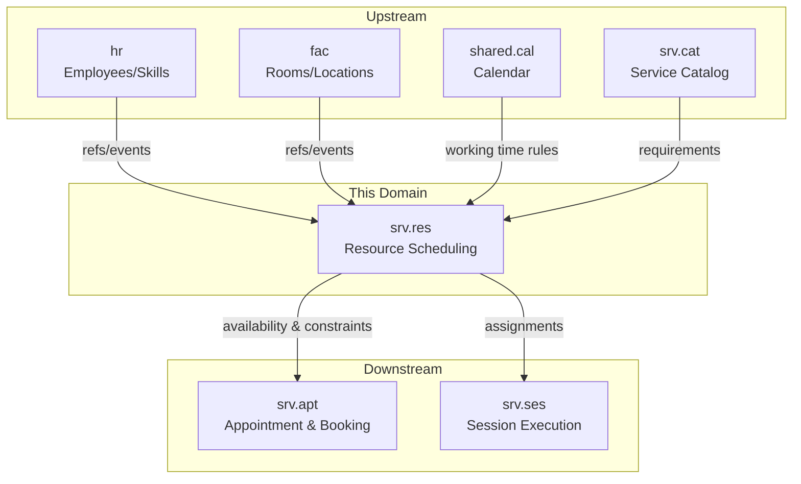
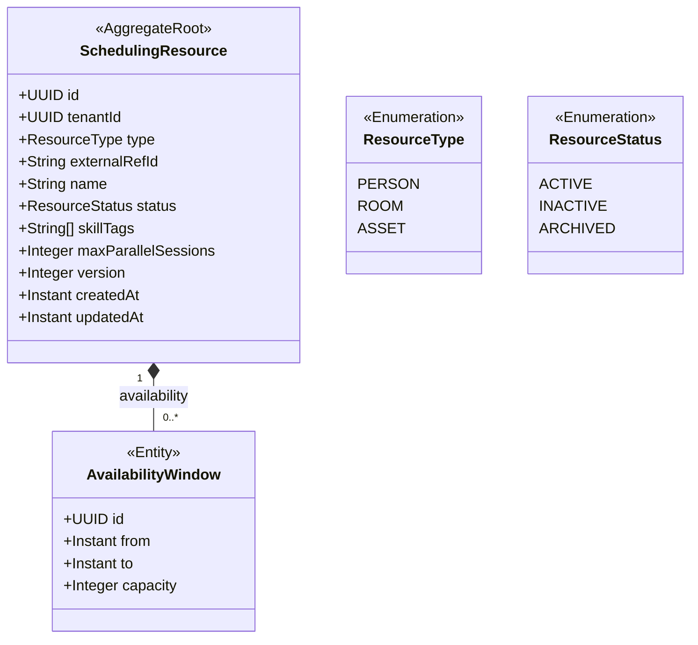
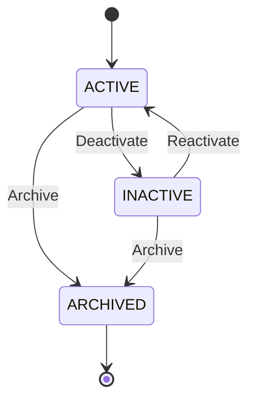
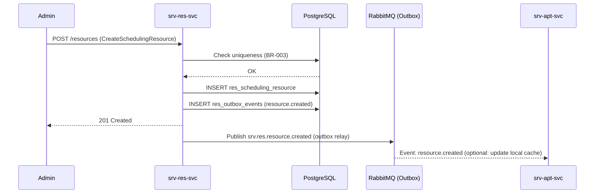
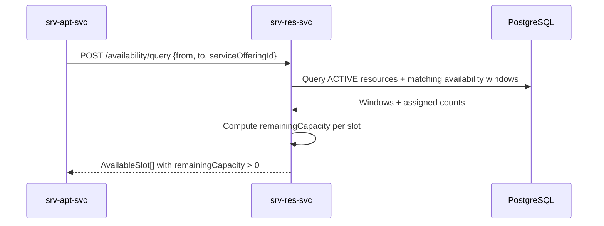
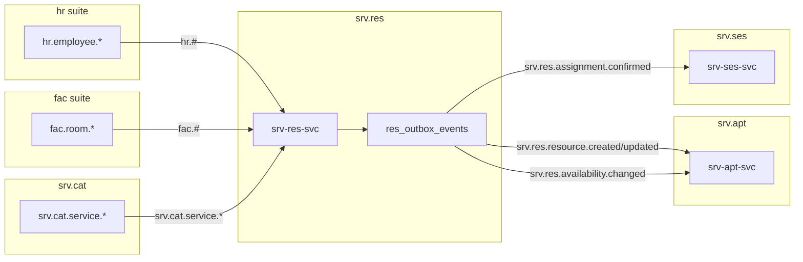
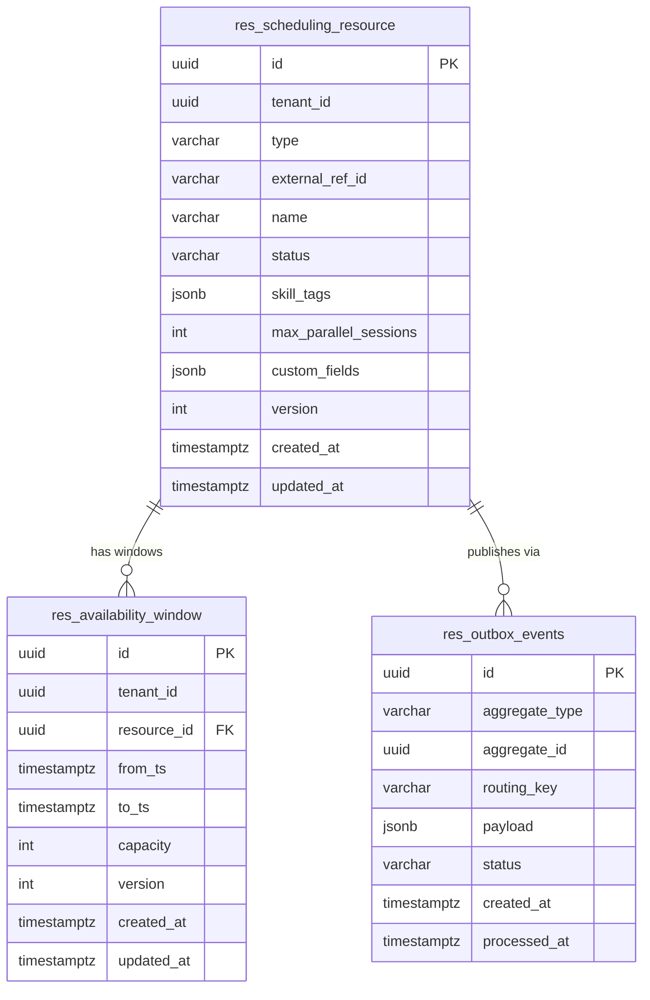

# Resource Scheduling — `srv.res` Domain / Service Specification

> **Conceptual Stack Layer:** Domain / Service
> **Space:** Platform
> **Owner:** Domain Engineering Team
> **Schema alignment:** `service-layer.schema.json`
> **Companion files:** `openapi.yaml`, `*.schema.json` (event contracts)
> **Referenced by:** Platform-Feature Spec SS5 (backend dependencies), BFF Contract
> **Belongs to:** SRV Suite Spec (`_srv_suite.md`)

> **Meta Information**
> - **Version:** 2026-04-03
> - **Template:** `domain-service-spec.md` v1.0.0
> - **Template Compliance:** ~97% — fully compliant
> - **Author(s):** OpenLeap Architecture Team
> - **Status:** DRAFT
> - **Suite:** `srv`
> - **Domain:** `res`
> - **Bounded Context Ref:** `bc:resource-scheduling`
> - **Service ID:** `srv-res-svc`
> - **basePackage:** `io.openleap.srv.res`
> - **API Base Path:** `/api/srv/res/v1`
> - **OpenLeap Starter Version:** `v1`
> - **Port:** OPEN QUESTION (see Q-RES-001)
> - **Repository:** OPEN QUESTION (see Q-RES-002)
> - **Tags:** `resource`, `scheduling`, `availability`, `srv`
> - **Team:**
>   - Name: `team-srv`
>   - Email: `srv-team@openleap.io`
>   - Slack: `#srv-team`

---

## Specification Guidelines Compliance

> ### Non-Negotiables
> - Never invent facts. If required info is missing, add an **OPEN QUESTION** entry.
> - Preserve intent and decisions. Only change meaning when explicitly requested.
> - Do not remove normative constraints unless they are explicitly replaced.
> - Keep the spec **self-contained**: no "see chat", no implicit context.
>
> ### Source of Truth Priority
> When sources conflict:
> 1. Spec (explicit) wins
> 2. Starter specs (implementation constraints) next
> 3. Guidelines (best practices) last
>
> Record conflicts in the **Decisions & Conflicts** section (see Section 14).
>
> ### Style Guide
> - Prefer short sentences and lists.
> - Use MUST/SHOULD/MAY for normative statements.
> - Keep terminology consistent (Aggregate, Domain Service, Application Service, Command, Event).
> - Avoid ambiguous words ("often", "maybe") unless explicitly noting uncertainty.
> - Keep examples minimal and clearly marked as examples.
> - Do not add implementation code unless the chapter explicitly requires it.

---

## 0. Document Purpose & Scope

### 0.1 Purpose
`srv.res` specifies the **scheduling view of resources** needed for appointment-driven service delivery: availability, eligibility, utilization, and assignment constraints for people, rooms/locations, and optionally assets.

### 0.2 Target Audience
- Product Owners & Business Stakeholders
- System Architects & Technical Leads
- Integration Engineers

### 0.3 Scope

**In Scope:**
- MUST maintain scheduling identities for resources (references, not HR/FAC master).
- MUST model availability/capacity needed for booking and execution.
- MUST enforce assignment constraints (skills, room types, max parallel sessions).
- MUST provide availability and conflict-check APIs for `srv.apt`.
- SHOULD support eligibility matching against `srv.cat` requirements.

**Out of Scope:**
- MUST NOT manage employment lifecycle/payroll/labor-law rules (-> `hr`).
- MUST NOT manage building/room lifecycle (-> `fac`).
- MUST NOT implement routing/dispatch (work-order world) (-> `ops`).

### 0.4 Related Documents
- `_srv_suite.md`, `srv_apt-spec.md`, `srv_cat-spec.md`, `srv_ses-spec.md`
- `SYSTEM_OVERVIEW.md`, `TECHNICAL_STANDARDS.md`, `EVENT_STANDARDS.md`

---

## 1. Business Context

### 1.1 Domain Purpose
Provide a consistent, performant resource scheduling layer so that booking can reliably find and reserve time, and execution can record who/where delivered the service.

### 1.2 Business Value
- Prevents overbooking by centralizing availability and conflict detection.
- Decouples scheduling optimization from HR/FAC master data management.
- Enables eligibility matching between resources (skill tags) and service requirements.
- Supports multi-tenant deployments with isolated scheduling data per tenant.

### 1.3 Key Stakeholders

| Role | Responsibility | Primary Use Cases |
|------|----------------|-------------------|
| Scheduler | Plan resources | Check availability, avoid conflicts |
| Service Provider | Provide availability | Time-off, working hours |
| Integrations Team | Sync HR/FAC | Keep scheduling view consistent |
| Back Office Admin | Manage resource catalog | Create/deactivate resources, override constraints |

### 1.4 Strategic Positioning



### 1.5 Service Context

| Property | Value |
|----------|-------|
| **Suite** | `srv` |
| **Domain** | `res` |
| **Bounded Context** | `bc:resource-scheduling` |
| **Service ID** | `srv-res-svc` |
| **Base Package** | `io.openleap.srv.res` |

**Responsibilities:**
- Maintain resource representations for scheduling (people/rooms/assets) referencing authoritative masters
- Expose availability queries and conflict checks
- Support eligibility matching against `srv.cat` requirements
- Publish availability change events consumed by `srv.apt` and `srv.ses`

**Authoritative Sources:**
| Source Type | Description | Access Pattern |
|-------------|-------------|----------------|
| REST API | Resource availability, conflict checks | Synchronous |
| Database | Scheduling resources, availability windows | Direct (owner) |
| Events | Availability changes, assignment confirmations | Asynchronous |

---

## 2. Service Identity

| Property | Value | Schema Field |
|----------|-------|-------------|
| **Service ID** | `srv-res-svc` | `metadata.id` |
| **Display Name** | Resource Scheduling | `metadata.name` |
| **Suite** | `srv` | `metadata.suite` |
| **Domain** | `res` | `metadata.domain` |
| **Bounded Context** | `bc:resource-scheduling` | `metadata.bounded_context_ref` |
| **Version** | `1.1.0` | `metadata.version` |
| **Status** | DRAFT | `metadata.status` |
| **API Base Path** | `/api/srv/res/v1` | `metadata.api_base_path` |
| **Repository** | OPEN QUESTION (see Q-RES-002) | `metadata.repository` |
| **Tags** | `resource`, `scheduling`, `availability`, `srv` | `metadata.tags` |

**Team:**
| Property | Value |
|----------|-------|
| **Name** | `team-srv` |
| **Email** | `srv-team@openleap.io` |
| **Slack Channel** | `#srv-team` |

---

## 3. Domain Model

### 3.1 Conceptual Overview
The resource scheduling domain manages **scheduling resources** — projections of people, rooms, or assets optimized for availability queries. Each resource has **availability windows** defining when it can be booked. Resources do not replicate HR/FAC master data; they hold only what is needed for scheduling decisions: type, skill tags, capacity constraints, and time windows.

### 3.2 Core Concepts



### 3.3 Aggregate Definitions

#### 3.3.1 SchedulingResource

| Property | Value |
|----------|-------|
| **Aggregate ID** | `agg:scheduling-resource` |
| **Name** | `SchedulingResource` |

**Business Purpose:** A scheduling-optimized abstraction of a person, room, or asset used for availability queries and assignment. It acts as the single entry point for all mutations to resource state and availability windows.

##### Aggregate Root

**Key Attributes:**
| Attribute | Type | Format | Description | Constraints | Required | Read-Only |
|-----------|------|--------|-------------|-------------|----------|-----------|
| id | string | uuid | Unique system identifier (OlUuid.create()) | Immutable | Yes | Yes |
| tenantId | string | uuid | Tenant ownership for RLS | Immutable | Yes | Yes |
| type | string | — | Resource classification | enum_ref: `ResourceType` | Yes | No |
| externalRefId | string | — | Reference to authoritative master in HR/FAC | max_length: 100, unique per tenantId+type | Yes | No |
| name | string | — | Human-readable display name | max_length: 255, min_length: 1 | Yes | No |
| status | string | — | Current scheduling lifecycle status | enum_ref: `ResourceStatus`, default: ACTIVE | Yes | No |
| skillTags | array | — | Skill/qualification tags for eligibility matching | items: string, max_length per tag: 100 | No | No |
| maxParallelSessions | integer | int32 | Maximum concurrent appointment assignments | minimum: 1, default: 1 | No | No |
| version | integer | int64 | Optimistic locking counter (ETags) | — | Yes | Yes |
| createdAt | string | date-time | Record creation timestamp (UTC) | — | Yes | Yes |
| updatedAt | string | date-time | Last modification timestamp (UTC) | — | Yes | Yes |

**Lifecycle States:**

| Property | Value |
|----------|-------|
| **Initial State** | `ACTIVE` |
| **Terminal States** | `ARCHIVED` |



**State Descriptions:**
| State | Description | Business Meaning |
|-------|-------------|------------------|
| ACTIVE | Resource is available for scheduling | Can be assigned to appointments; appears in availability queries |
| INACTIVE | Resource is temporarily unavailable | Cannot be assigned to new appointments; existing assignments unaffected |
| ARCHIVED | Resource is permanently retired | Historical record only; excluded from all availability queries |

**Allowed Transitions:**
| From State | To State | Trigger | Guard / Business Preconditions |
|------------|----------|---------|-------------------------------|
| ACTIVE | INACTIVE | Manual deactivation (UC-002) | No future confirmed appointments (OPEN QUESTION: see Q-RES-005) |
| INACTIVE | ACTIVE | Manual reactivation (UC-002) | Resource still referenced in HR/FAC (externalRefId valid) |
| ACTIVE | ARCHIVED | Archive command (UC-002) | Resource is INACTIVE or has no future appointments |
| INACTIVE | ARCHIVED | Archive command (UC-002) | — |

**Invariants:**
| Rule ID | Description |
|---------|-------------|
| BR-001 | MUST prevent overlapping availability windows for the same resource unless modeled as capacity |
| BR-002 | MUST support conflict detection for appointment assignments |
| BR-003 | `externalRefId` MUST be unique per `tenantId` and `type` |
| BR-004 | ARCHIVED resources MUST NOT accept new availability windows |
| BR-005 | `maxParallelSessions` MUST be ≥ 1 |

**Domain Events Emitted:**
- `srv.res.resource.created`
- `srv.res.resource.updated`
- `srv.res.availability.changed`
- `srv.res.assignment.confirmed`

##### Child Entities

###### Entity: AvailabilityWindow

| Property | Value |
|----------|-------|
| **Entity ID** | `ent:availability-window` |
| **Name** | `AvailabilityWindow` |
| **Relationship to Root** | one_to_many |

**Business Purpose:** A time-based capacity window during which the resource can be assigned to appointments. Managed exclusively through the `SchedulingResource` aggregate root.

**Attributes:**
| Attribute | Type | Format | Description | Constraints | Required |
|-----------|------|--------|-------------|-------------|----------|
| id | string | uuid | Unique window identifier | Immutable | Yes |
| from | string | date-time | Window start time (UTC) | Must be in the future on creation | Yes |
| to | string | date-time | Window end time (UTC) | Must be after `from`; max duration: OPEN QUESTION Q-RES-006 | Yes |
| capacity | integer | int32 | Number of concurrent appointment slots in this window | minimum: 1, default: 1 | No |

**Collection Constraints:**
- Minimum items: 0 (a resource may have no future windows)
- Maximum items: OPEN QUESTION (see Q-RES-006) — no hard platform limit proposed; suggest soft cap of 1000 per resource for query performance

**Invariants:**
| Rule ID | Description |
|---------|-------------|
| BR-001 | No two windows for the same resource may overlap unless capacity allows concurrent slots |
| BR-004 | Windows MUST NOT be added to ARCHIVED resources |

##### Value Objects

###### Value Object: TimeRange

| Property | Value |
|----------|-------|
| **VO ID** | `vo:time-range` |
| **Name** | `TimeRange` |

**Description:** An immutable pair of start/end instants representing a contiguous time interval. Used in availability queries and overlap checks.

**Attributes:**
| Attribute | Type | Format | Description | Constraints |
|-----------|------|--------|-------------|-------------|
| from | string | date-time | Range start (inclusive, UTC) | — |
| to | string | date-time | Range end (exclusive, UTC) | Must be after `from` |

**Validation Rules:**
- `to` MUST be strictly after `from`.
- Duration MUST be positive (non-zero interval).
- Both instants MUST be expressed in UTC (ISO-8601 with `Z` suffix).

### 3.4 Enumerations

#### ResourceType

**Description:** Classifies the physical nature of a scheduling resource.

| Value | Description | Deprecated |
|-------|-------------|------------|
| `PERSON` | Human resource (instructor, doctor, consultant, therapist) | No |
| `ROOM` | Physical space or room (classroom, consultation room, studio) | No |
| `ASSET` | Equipment or other physical asset (simulator, diagnostic device) | No |

#### ResourceStatus

**Description:** Controls the lifecycle state of a scheduling resource.

| Value | Description | Deprecated |
|-------|-------------|------------|
| `ACTIVE` | Resource is available for scheduling and appointment assignment | No |
| `INACTIVE` | Resource is temporarily unavailable; excluded from new bookings | No |
| `ARCHIVED` | Resource is permanently retired; excluded from all queries | No |

### 3.5 Shared Types

#### AvailableSlot

| Property | Value |
|----------|-------|
| **Type ID** | `type:available-slot` |
| **Name** | `AvailableSlot` |

**Description:** A read model representing a bookable time slot for a resource, returned by availability query operations (UC-004). Not a domain entity — it is computed on-the-fly.

**Attributes:**
| Attribute | Type | Format | Description | Constraints |
|-----------|------|--------|-------------|-------------|
| resourceId | string | uuid | ID of the scheduling resource | — |
| resourceName | string | — | Display name of the resource | — |
| resourceType | string | — | Classification of the resource | enum_ref: `ResourceType` |
| from | string | date-time | Slot start (UTC) | — |
| to | string | date-time | Slot end (UTC) | — |
| remainingCapacity | integer | int32 | Available concurrent slots | minimum: 0 |
| skillTags | array | — | Resource skill tags for UI display | — |

**Validation Rules:**
- `remainingCapacity` MUST be ≥ 0; slots with 0 remaining capacity MUST NOT be returned.
- `from` and `to` MUST be within a requested `TimeRange` query window.

**Used By:**
- `agg:scheduling-resource` (via `AvailabilityQueryService`)
- Consumed by `srv-apt-svc` for slot selection

---

## 4. Business Rules & Constraints

### 4.1 Business Rules Catalog

| ID | Rule Name | Description | Scope | Enforcement | Error Code |
|----|-----------|-------------|-------|-------------|------------|
| BR-001 | No Overlapping Windows | MUST prevent overlapping availability windows unless modeled as parallel capacity | AvailabilityWindow | Create, Update | `RES_OVERLAP` |
| BR-002 | Conflict Detection | MUST detect assignment conflicts for appointment time ranges | SchedulingResource | Query | `RES_CONFLICT` |
| BR-003 | Unique External Ref | `externalRefId` MUST be unique per tenant and type | SchedulingResource | Create | `RES_DUPLICATE_REF` |
| BR-004 | No Windows on Archived | ARCHIVED resources MUST NOT accept new availability windows | AvailabilityWindow | Create | `RES_ARCHIVED` |
| BR-005 | Min Parallel Sessions | `maxParallelSessions` MUST be ≥ 1 | SchedulingResource | Create, Update | `RES_INVALID_CAPACITY` |

### 4.2 Detailed Rule Definitions

#### BR-001: No Overlapping Windows

**Business Context:**
Scheduling resources have finite time. Two overlapping windows for the same resource would produce double-counting of available capacity, leading to overbooking. The rule ensures that availability is always deterministic.

**Rule Statement:**
For a given `SchedulingResource`, no two `AvailabilityWindow` records may have overlapping `[from, to)` intervals, unless the windows represent additional capacity (i.e., both windows have `capacity ≥ 2` and the combined capacity is within `maxParallelSessions`).

**Applies To:**
- Aggregate: `SchedulingResource`
- Operations: AddAvailabilityWindow, UpdateAvailabilityWindow

**Enforcement:**
The `SchedulingResource` domain object checks all existing windows before accepting a new or modified window. The check is performed in the aggregate's `addAvailability()` method.

**Validation Logic:**
For the new window `[newFrom, newTo)`, check all existing windows `[existingFrom, existingTo)` for the same `resourceId` and `tenantId`. An overlap exists when `newFrom < existingTo AND newTo > existingFrom`. If the total capacity at any overlapping point exceeds `maxParallelSessions`, reject.

**Error Handling:**
- **Error Code:** `RES_OVERLAP`
- **Error Message:** "Availability window overlaps with an existing window for this resource."
- **User action:** Adjust the `from` or `to` of the new window to avoid overlap, or increase `maxParallelSessions` to accommodate parallel capacity.

**Examples:**
- **Valid:** Resource has window 09:00–12:00. New window 14:00–17:00. No overlap. Accepted.
- **Invalid:** Resource has window 09:00–12:00. New window 11:00–14:00. Overlap 11:00–12:00. Rejected with `RES_OVERLAP`.

---

#### BR-002: Conflict Detection

**Business Context:**
Before booking or assigning a resource to an appointment, the system must guarantee the resource is actually free in the requested time window. Without this, concurrent booking attempts can assign the same resource slot twice.

**Rule Statement:**
A resource MUST NOT be assigned to an appointment whose `[requestedFrom, requestedTo)` interval exceeds the resource's remaining capacity in the matching availability window(s). The conflict check MUST be atomic to prevent race conditions.

**Applies To:**
- Aggregate: `SchedulingResource`
- Operations: QueryAvailability (READ), ConsumedBy: `srv-apt-svc` assignment flow

**Enforcement:**
Implemented in `AvailabilityQueryService` (Application Service). Uses a SELECT FOR UPDATE or optimistic locking check when confirming an assignment. Exposed via `POST /api/srv/res/v1/availability/query`.

**Validation Logic:**
For requested `[from, to)`, sum the existing confirmed assignments within that window. If `assignedCount ≥ capacity` (from matching AvailabilityWindows), the slot is fully booked. Return remaining capacity = 0.

**Error Handling:**
- **Error Code:** `RES_CONFLICT`
- **Error Message:** "Resource has no remaining capacity in the requested time window."
- **User action:** Choose a different time slot or a different resource.

**Examples:**
- **Valid:** Resource has 2 parallel capacity. Only 1 assignment confirmed. 1 slot remains. Query returns `remainingCapacity: 1`.
- **Invalid:** Resource has 1 parallel capacity. 1 assignment confirmed. Query returns `remainingCapacity: 0`; booking system must not proceed.

---

#### BR-003: Unique External Ref

**Business Context:**
`externalRefId` is the stable link between the scheduling projection and the authoritative master in HR (for persons) or FAC (for rooms/assets). Duplicates would break event-driven sync and produce ambiguous query results.

**Rule Statement:**
The combination `(tenantId, type, externalRefId)` MUST be unique across all non-ARCHIVED `SchedulingResource` records.

**Applies To:**
- Aggregate: `SchedulingResource`
- Operations: Create

**Enforcement:**
Enforced by unique database index `uk_res_resource_tenant_type_ref` on `(tenant_id, type, external_ref_id)` with a partial index filtering `status != 'ARCHIVED'`.

**Validation Logic:**
Before creating a resource, check the unique index. On constraint violation, map to `RES_DUPLICATE_REF`.

**Error Handling:**
- **Error Code:** `RES_DUPLICATE_REF`
- **Error Message:** "A resource with this external reference already exists for this tenant and type."
- **User action:** Verify the `externalRefId`. If the existing resource is ARCHIVED, it can be re-registered with the same ref once archived.

**Examples:**
- **Valid:** No existing ACTIVE or INACTIVE resource with `type=PERSON` and `externalRefId=EMP-001` for this tenant.
- **Invalid:** An ACTIVE PERSON resource already has `externalRefId=EMP-001` for this tenant. Creation rejected.

---

#### BR-004: No Windows on Archived Resources

**Business Context:**
ARCHIVED resources represent permanent retirement from scheduling. Adding availability windows to an archived resource would create orphaned data and confuse availability queries.

**Rule Statement:**
A `SchedulingResource` with `status=ARCHIVED` MUST NOT accept new `AvailabilityWindow` entries.

**Applies To:**
- Aggregate: `SchedulingResource`
- Operations: AddAvailabilityWindow

**Enforcement:**
Checked in the aggregate's `addAvailability()` method before any window is added.

**Error Handling:**
- **Error Code:** `RES_ARCHIVED`
- **Error Message:** "Cannot add availability windows to an archived resource."
- **User action:** Reactivate the resource (if permitted) or use a different resource.

**Examples:**
- **Valid:** Resource `status=ACTIVE`. New window accepted.
- **Invalid:** Resource `status=ARCHIVED`. Window addition rejected with `RES_ARCHIVED`.

---

#### BR-005: Minimum Parallel Sessions

**Business Context:**
`maxParallelSessions` controls how many appointments can simultaneously use this resource. A value of 0 would make the resource permanently unusable.

**Rule Statement:**
`maxParallelSessions` MUST be ≥ 1 when provided.

**Applies To:**
- Aggregate: `SchedulingResource`
- Operations: Create, Update

**Enforcement:**
Validated in the aggregate constructor and `update()` method. Default is 1 if not provided.

**Error Handling:**
- **Error Code:** `RES_INVALID_CAPACITY`
- **Error Message:** "maxParallelSessions must be at least 1."
- **User action:** Provide a value ≥ 1.

**Examples:**
- **Valid:** `maxParallelSessions=3` (group session room with 3 simultaneous slots).
- **Invalid:** `maxParallelSessions=0`. Rejected.

### 4.3 Data Validation Rules

**Field-Level Validations:**

| Field | Validation Rule | Error Message |
|-------|----------------|---------------|
| `type` | Required; must be one of `PERSON`, `ROOM`, `ASSET` | "Invalid resource type." |
| `externalRefId` | Required; max 100 characters; must not be blank | "External reference ID is required." |
| `name` | Required; 1–255 characters | "Name must be between 1 and 255 characters." |
| `status` | Must be one of `ACTIVE`, `INACTIVE`, `ARCHIVED` | "Invalid resource status." |
| `skillTags[]` | Each tag max 100 characters; no duplicates | "Skill tag must not exceed 100 characters." |
| `maxParallelSessions` | Integer ≥ 1 when provided; defaults to 1 | "maxParallelSessions must be at least 1." |
| `AvailabilityWindow.from` | Required; valid ISO-8601 date-time | "Window start time is required." |
| `AvailabilityWindow.to` | Required; must be after `from` | "Window end must be after window start." |
| `AvailabilityWindow.capacity` | Integer ≥ 1 when provided; defaults to 1 | "Window capacity must be at least 1." |

**Cross-Field Validations:**
- `AvailabilityWindow.to` MUST be strictly after `AvailabilityWindow.from`.
- New `AvailabilityWindow` MUST NOT overlap existing windows beyond `maxParallelSessions` (BR-001).
- A resource transition to `ARCHIVED` MUST be preceded by `INACTIVE` or the resource MUST have no future windows.

### 4.4 Reference Data Dependencies

| Catalog | Source Service | Fields Referencing | Validation |
|---------|----------------|-------------------|------------|
| Employee master | `hr-*-svc` | `externalRefId` (when `type=PERSON`) | Validated on event receipt; not validated synchronously on create |
| Room/space master | `fac-*-svc` | `externalRefId` (when `type=ROOM`) | Validated on event receipt; not validated synchronously on create |
| Skill catalog | OPEN QUESTION (see Q-RES-003) | `skillTags[]` | Currently free-text tags; no catalog validation enforced |
| Service offering requirements | `srv-cat-svc` | `skillTags[]` matching | Used for eligibility filtering in availability queries |

---

## 5. Use Cases

### 5.1 Business Logic Placement

| Logic Type | Placement | Examples |
|------------|-----------|----------|
| Aggregate invariants | Domain Object (`SchedulingResource`) | Overlap check (BR-001), status guard (BR-004), uniqueness (BR-003) |
| Cross-aggregate logic | Domain Service (`AvailabilityQueryService`) | Availability computation spanning windows and existing assignments |
| Orchestration & transactions | Application Service | Use case coordination, event publishing via outbox (ADR-013) |
| Idempotency | Application Service + Command Gateway (ADR-008) | Idempotency key on create commands (ADR-014) |

### 5.2 Use Cases (Canonical Format)

#### UC-001: CreateSchedulingResource

| Field | Value |
|-------|-------|
| **id** | `CreateSchedulingResource` |
| **type** | WRITE |
| **trigger** | REST |
| **aggregate** | `SchedulingResource` |
| **domainOperation** | `SchedulingResource.create` |
| **inputs** | `type: ResourceType`, `externalRefId: String`, `name: String`, `skillTags: String[]?`, `maxParallelSessions: Integer?` |
| **outputs** | `SchedulingResource` |
| **events** | `srv.res.resource.created` |
| **rest** | `POST /api/srv/res/v1/resources` |
| **idempotency** | required |
| **errors** | `RES_DUPLICATE_REF` |

**Actor:** Back Office Admin / Integration System (HR/FAC sync)

**Preconditions:**
- Caller holds `SRV_RES_EDITOR` permission.
- No existing ACTIVE/INACTIVE resource with same `(tenantId, type, externalRefId)`.

**Main Flow:**
1. System receives `POST /api/srv/res/v1/resources` with resource creation payload.
2. System validates all required fields and constraints (§4.3).
3. System checks uniqueness of `(tenantId, type, externalRefId)` (BR-003).
4. System creates `SchedulingResource` aggregate with `status=ACTIVE`.
5. System assigns `id` via `OlUuid.create()` (ADR-021).
6. System persists to `res_scheduling_resource` table.
7. System publishes `srv.res.resource.created` via outbox (ADR-013).
8. System returns `201 Created` with the new resource and `Location` header.

**Postconditions:**
- `SchedulingResource` exists with `status=ACTIVE`.
- Event `srv.res.resource.created` is in the outbox queue.

**Business Rules Applied:**
- BR-003: Unique External Ref
- BR-005: Min Parallel Sessions

**Alternative Flows:**
- **Alt-1:** If `maxParallelSessions` not provided, defaults to 1.
- **Alt-2:** If `skillTags` not provided, resource is created with empty tags array.

**Exception Flows:**
- **Exc-1:** If `(tenantId, type, externalRefId)` already exists: return `409 Conflict` with error code `RES_DUPLICATE_REF`.
- **Exc-2:** If required fields missing: return `400 Bad Request`.

---

#### UC-002: UpdateSchedulingResource

| Field | Value |
|-------|-------|
| **id** | `UpdateSchedulingResource` |
| **type** | WRITE |
| **trigger** | REST |
| **aggregate** | `SchedulingResource` |
| **domainOperation** | `SchedulingResource.update` |
| **inputs** | `id: UUID`, `name: String?`, `status: ResourceStatus?`, `skillTags: String[]?`, `maxParallelSessions: Integer?` |
| **outputs** | `SchedulingResource` |
| **rest** | `PATCH /api/srv/res/v1/resources/{id}` |
| **events** | `srv.res.resource.updated` |
| **idempotency** | via ETag / `If-Match` header |
| **errors** | `RES_ARCHIVED`, `RES_INVALID_CAPACITY` |

**Actor:** Back Office Admin

**Preconditions:**
- Caller holds `SRV_RES_EDITOR` or `SRV_RES_ADMIN` permission.
- Resource exists and belongs to caller's tenant.
- `If-Match` header matches current `version` (ETag).

**Main Flow:**
1. System receives `PATCH /api/srv/res/v1/resources/{id}`.
2. System loads `SchedulingResource` aggregate.
3. System verifies ETag (`If-Match` vs. current `version`).
4. System applies partial update (only provided fields).
5. System validates BR-005 if `maxParallelSessions` changed.
6. System validates state transition if `status` changed (see §3.3 Allowed Transitions).
7. System persists updated aggregate.
8. System publishes `srv.res.resource.updated` via outbox.
9. System returns `200 OK` with updated resource.

**Postconditions:**
- `SchedulingResource` reflects requested changes.
- Event `srv.res.resource.updated` in outbox.

**Business Rules Applied:**
- BR-004: No Windows on Archived (transitioning from ARCHIVED is not allowed)
- BR-005: Min Parallel Sessions

**Exception Flows:**
- **Exc-1:** ETag mismatch: return `412 Precondition Failed`.
- **Exc-2:** Invalid status transition: return `422 Unprocessable Entity`.
- **Exc-3:** Resource not found: return `404 Not Found`.

---

#### UC-003: AddAvailabilityWindow

| Field | Value |
|-------|-------|
| **id** | `AddAvailabilityWindow` |
| **type** | WRITE |
| **trigger** | REST |
| **aggregate** | `SchedulingResource` |
| **domainOperation** | `SchedulingResource.addAvailability` |
| **inputs** | `resourceId: UUID`, `from: Instant`, `to: Instant`, `capacity: Integer?` |
| **outputs** | `SchedulingResource` |
| **events** | `srv.res.availability.changed` |
| **rest** | `POST /api/srv/res/v1/resources/{id}/availability` |
| **idempotency** | required |
| **errors** | `RES_OVERLAP`, `RES_ARCHIVED` |

**Actor:** Back Office Admin / Integration System

**Preconditions:**
- Caller holds `SRV_RES_EDITOR` permission.
- Resource exists, belongs to caller's tenant, and is not ARCHIVED.

**Main Flow:**
1. System receives `POST /api/srv/res/v1/resources/{id}/availability` with window payload.
2. System loads `SchedulingResource` aggregate.
3. System validates `from < to` (BR cross-field).
4. System checks for overlapping windows (BR-001).
5. System adds `AvailabilityWindow` to the aggregate.
6. System persists to `res_availability_window` table.
7. System publishes `srv.res.availability.changed` via outbox.
8. System returns `201 Created` with the updated resource.

**Postconditions:**
- New `AvailabilityWindow` is associated with the resource.
- `srv-apt-svc` receives `srv.res.availability.changed` event to update its slot cache.

**Business Rules Applied:**
- BR-001: No Overlapping Windows
- BR-004: No Windows on Archived

**Exception Flows:**
- **Exc-1:** Overlap detected: `409 Conflict` with `RES_OVERLAP`.
- **Exc-2:** Resource is ARCHIVED: `422 Unprocessable Entity` with `RES_ARCHIVED`.

---

#### UC-004: QueryAvailability

| Field | Value |
|-------|-------|
| **id** | `QueryAvailability` |
| **type** | READ |
| **trigger** | REST |
| **domainOperation** | `AvailabilityQueryService.query` |
| **inputs** | `serviceOfferingId: UUID?`, `from: Instant`, `to: Instant`, `type: ResourceType?` |
| **outputs** | `AvailableSlot[]` |
| **rest** | `POST /api/srv/res/v1/availability/query` |
| **idempotency** | N/A (read) |

**Actor:** `srv-apt-svc` (machine-to-machine) / Scheduler UI

**Preconditions:**
- Caller holds `SRV_RES_VIEWER` permission.
- `from` and `to` are valid; `to > from`.

**Main Flow:**
1. System receives `POST /api/srv/res/v1/availability/query` with filter parameters.
2. System queries `res_scheduling_resource` for ACTIVE resources matching `type` filter.
3. If `serviceOfferingId` provided: system fetches requirement metadata from `srv-cat-svc` and filters by `skillTags`.
4. System computes remaining capacity per resource per time slot by joining availability windows and confirmed assignments.
5. System returns list of `AvailableSlot` read models with `remainingCapacity > 0`.

**Postconditions:**
- No state changes.
- Response reflects point-in-time snapshot of availability.

**Alternative Flows:**
- **Alt-1:** If `type` not provided, return slots for all resource types.
- **Alt-2:** If `serviceOfferingId` provided but `srv-cat-svc` unreachable, fall back to unfiltered query (OPEN QUESTION: see Q-RES-007).

---

#### UC-005: GetResource

| Field | Value |
|-------|-------|
| **id** | `GetResource` |
| **type** | READ |
| **trigger** | REST |
| **aggregate** | `SchedulingResource` |
| **domainOperation** | `SchedulingResourceRepository.findById` |
| **inputs** | `id: UUID` |
| **outputs** | `SchedulingResource` (with embedded availability windows) |
| **rest** | `GET /api/srv/res/v1/resources/{id}` |

**Actor:** Back Office Admin / Integration System

**Main Flow:**
1. System loads `SchedulingResource` by `id` and `tenantId`.
2. System returns aggregate with embedded `AvailabilityWindow` list.
3. Response includes `ETag` header with current `version`.

**Exception Flows:**
- **Exc-1:** Resource not found: `404 Not Found`.

---

#### UC-006: GetResourceAvailability

| Field | Value |
|-------|-------|
| **id** | `GetResourceAvailability` |
| **type** | READ |
| **trigger** | REST |
| **domainOperation** | `AvailabilityQueryService.getForResource` |
| **inputs** | `id: UUID`, `from: Instant?`, `to: Instant?` |
| **outputs** | `AvailabilityWindow[]` filtered by date range |
| **rest** | `GET /api/srv/res/v1/resources/{id}/availability?from=&to=` |

**Actor:** Scheduler UI / `srv-apt-svc`

**Main Flow:**
1. System loads availability windows for `resourceId` within the optional `[from, to)` filter.
2. System returns list of windows with remaining capacity.

---

#### UC-007: SearchResources

| Field | Value |
|-------|-------|
| **id** | `SearchResources` |
| **type** | READ |
| **trigger** | REST |
| **domainOperation** | `SchedulingResourceRepository.search` |
| **inputs** | `type: ResourceType?`, `q: String?`, `status: ResourceStatus?`, `skillTags: String[]?` |
| **outputs** | `SchedulingResource[]` (paginated) |
| **rest** | `GET /api/srv/res/v1/resources?type=&q=&status=&skillTags=` |

**Actor:** Scheduler / Back Office Admin

**Main Flow:**
1. System applies filter parameters to a read query (ADR-017 read model).
2. System returns paginated list of matching resources.
3. Default: only `ACTIVE` resources returned unless `status` filter explicitly set.

### 5.3 Process Flow Diagrams





### 5.4 Cross-Domain Workflows

#### Workflow: Resource Sync from HR

**Pattern:** Choreography (ADR-003)
**Participating Services:**

| Service | Role |
|---------|------|
| `hr-*-svc` | Source — publishes employee lifecycle events |
| `srv-res-svc` | Consumer — creates or updates scheduling projection |

**Trigger:** `hr.*` event received (e.g., employee hired, skills updated, employment terminated).

**Workflow Steps:**
1. `hr-*-svc` publishes `hr.employee.created` or `hr.employee.updated`.
2. `srv-res-svc` receives event via queue `srv.res.in.hr.employee.events`.
3. `srv-res-svc` creates (if new) or updates (if existing) `SchedulingResource` with `type=PERSON`.
4. On employee termination: `srv-res-svc` transitions resource to `INACTIVE` or `ARCHIVED` depending on future appointments.
5. `srv-res-svc` publishes `srv.res.resource.updated` for downstream consumers.

**Failure Handling:**
- If `srv-res-svc` fails to process: retry 3x with exponential backoff, then DLQ (ADR-014).
- Partial sync: idempotent handler ensures re-processing is safe.

**Business Implications:**
- Resource scheduling data is eventually consistent with HR master data.
- A new employee may be schedulable within seconds of hire confirmation.

---

## 6. REST API

### 6.1 API Overview

**Base Path:** `/api/srv/res/v1`
**Authentication:** OAuth2/JWT

**Authorization:**
- Read: `SRV_RES_VIEWER`
- Write: `SRV_RES_EDITOR`
- Admin: `SRV_RES_ADMIN`

### 6.2 Resource Operations

#### 6.2.1 Create Scheduling Resource

```http
POST /api/srv/res/v1/resources
Authorization: Bearer {token}
Content-Type: application/json
Idempotency-Key: {uuid}
```

**Request Body:**
```json
{
  "type": "PERSON",
  "externalRefId": "EMP-001",
  "name": "Dr. Schmidt",
  "skillTags": ["driving-instructor", "manual-transmission"],
  "maxParallelSessions": 1
}
```

**Success Response:** `201 Created`
```json
{
  "id": "550e8400-e29b-41d4-a716-446655440000",
  "tenantId": "tenant-uuid",
  "type": "PERSON",
  "externalRefId": "EMP-001",
  "name": "Dr. Schmidt",
  "status": "ACTIVE",
  "skillTags": ["driving-instructor", "manual-transmission"],
  "maxParallelSessions": 1,
  "version": 1,
  "createdAt": "2026-04-03T08:00:00Z",
  "updatedAt": "2026-04-03T08:00:00Z",
  "_links": {
    "self": { "href": "/api/srv/res/v1/resources/550e8400-e29b-41d4-a716-446655440000" },
    "availability": { "href": "/api/srv/res/v1/resources/550e8400-e29b-41d4-a716-446655440000/availability" }
  }
}
```

**Response Headers:**
- `Location: /api/srv/res/v1/resources/{id}`
- `ETag: "1"`

**Business Rules Checked:** BR-003, BR-005

**Events Published:** `srv.res.resource.created`

**Error Responses:**
- `400 Bad Request` — Validation error (missing required fields, invalid enum)
- `409 Conflict` — `RES_DUPLICATE_REF`: duplicate `(tenantId, type, externalRefId)`
- `422 Unprocessable Entity` — `RES_INVALID_CAPACITY`: `maxParallelSessions < 1`

---

#### 6.2.2 Update Scheduling Resource

```http
PATCH /api/srv/res/v1/resources/{id}
Authorization: Bearer {token}
Content-Type: application/json
If-Match: "1"
```

**Request Body:**
```json
{
  "name": "Dr. Schmidt (updated)",
  "status": "INACTIVE",
  "skillTags": ["driving-instructor", "manual-transmission", "highway-instruction"],
  "maxParallelSessions": 2
}
```

**Success Response:** `200 OK`
```json
{
  "id": "550e8400-e29b-41d4-a716-446655440000",
  "name": "Dr. Schmidt (updated)",
  "status": "INACTIVE",
  "skillTags": ["driving-instructor", "manual-transmission", "highway-instruction"],
  "maxParallelSessions": 2,
  "version": 2,
  "updatedAt": "2026-04-03T09:00:00Z",
  "_links": {
    "self": { "href": "/api/srv/res/v1/resources/550e8400-e29b-41d4-a716-446655440000" }
  }
}
```

**Response Headers:**
- `ETag: "2"`

**Business Rules Checked:** BR-004, BR-005

**Events Published:** `srv.res.resource.updated`

**Error Responses:**
- `404 Not Found` — Resource does not exist
- `412 Precondition Failed` — ETag mismatch (version conflict)
- `422 Unprocessable Entity` — Invalid status transition or `RES_INVALID_CAPACITY`

---

#### 6.2.3 Add Availability Window

```http
POST /api/srv/res/v1/resources/{id}/availability
Authorization: Bearer {token}
Content-Type: application/json
Idempotency-Key: {uuid}
```

**Request Body:**
```json
{
  "from": "2026-04-07T08:00:00Z",
  "to": "2026-04-07T17:00:00Z",
  "capacity": 1
}
```

**Success Response:** `201 Created`
```json
{
  "id": "550e8400-e29b-41d4-a716-446655440000",
  "availability": [
    {
      "id": "window-uuid",
      "from": "2026-04-07T08:00:00Z",
      "to": "2026-04-07T17:00:00Z",
      "capacity": 1
    }
  ],
  "version": 3,
  "_links": {
    "self": { "href": "/api/srv/res/v1/resources/550e8400-e29b-41d4-a716-446655440000" }
  }
}
```

**Business Rules Checked:** BR-001, BR-004

**Events Published:** `srv.res.availability.changed`

**Error Responses:**
- `404 Not Found` — Resource does not exist
- `409 Conflict` — `RES_OVERLAP`: window overlaps existing windows
- `422 Unprocessable Entity` — `RES_ARCHIVED`: resource is archived

---

#### 6.2.4 Query Availability

```http
POST /api/srv/res/v1/availability/query
Authorization: Bearer {token}
Content-Type: application/json
```

**Request Body:**
```json
{
  "from": "2026-04-07T08:00:00Z",
  "to": "2026-04-07T18:00:00Z",
  "type": "PERSON",
  "serviceOfferingId": "offering-uuid"
}
```

**Success Response:** `200 OK`
```json
{
  "slots": [
    {
      "resourceId": "550e8400-e29b-41d4-a716-446655440000",
      "resourceName": "Dr. Schmidt",
      "resourceType": "PERSON",
      "from": "2026-04-07T08:00:00Z",
      "to": "2026-04-07T17:00:00Z",
      "remainingCapacity": 1,
      "skillTags": ["driving-instructor", "manual-transmission"]
    }
  ],
  "queryTime": "2026-04-03T10:00:00Z"
}
```

**Error Responses:**
- `400 Bad Request` — Invalid time range (`to` not after `from`)

---

#### 6.2.5 Get Resource

```http
GET /api/srv/res/v1/resources/{id}
Authorization: Bearer {token}
```

**Success Response:** `200 OK` — Full `SchedulingResource` with embedded `availability` array.

**Response Headers:** `ETag: "{version}"`

**Error Responses:** `404 Not Found`

---

#### 6.2.6 Get Resource Availability

```http
GET /api/srv/res/v1/resources/{id}/availability?from=2026-04-07T00:00:00Z&to=2026-04-07T23:59:59Z
Authorization: Bearer {token}
```

**Success Response:** `200 OK` — Array of `AvailabilityWindow` for the resource in the requested range.

**Error Responses:** `404 Not Found`

---

#### 6.2.7 Search Resources

```http
GET /api/srv/res/v1/resources?type=PERSON&status=ACTIVE&skillTags=driving-instructor&q=Schmidt
Authorization: Bearer {token}
```

**Success Response:** `200 OK`
```json
{
  "items": [...],
  "page": 0,
  "pageSize": 20,
  "totalElements": 1,
  "_links": {
    "self": { "href": "/api/srv/res/v1/resources?..." }
  }
}
```

### 6.3 Business Operations

#### 6.3.1 Delete Availability Window

```http
DELETE /api/srv/res/v1/resources/{id}/availability/{windowId}
Authorization: Bearer {token}
If-Match: "{version}"
```

**Business Purpose:** Remove a specific availability window from a resource. Used when a previously declared slot is no longer available (e.g., resource unavailable due to last-minute change).

**Success Response:** `200 OK` — Updated resource.

**Events Published:** `srv.res.availability.changed`

**Error Responses:**
- `404 Not Found` — Resource or window not found
- `412 Precondition Failed` — ETag mismatch
- `422 Unprocessable Entity` — Window has confirmed appointments (OPEN QUESTION: see Q-RES-008)

### 6.4 OpenAPI Specification

| Property | Value |
|----------|-------|
| **Location** | `openapi.yaml` (in service repository) |
| **Format** | OpenAPI 3.1 |
| **Docs URL** | OPEN QUESTION (see Q-RES-002) |

---

## 7. Events & Integration

### 7.1 Event-Driven Architecture Pattern

**Pattern Used:** Event-Driven (Choreography, ADR-003)
**Message Broker:** RabbitMQ (topic exchange per ADR-003)
**Publishing Mechanism:** Transactional Outbox (ADR-013)
**Delivery Guarantee:** At-least-once with idempotent consumers (ADR-014)
**Follows Suite Pattern:** YES (`_srv_suite.md` §4.x integration pattern)

### 7.2 Published Events

**Exchange:** `srv.res.events` (topic)

#### Event: SchedulingResource.created

**Routing Key:** `srv.res.resource.created`

**Business Purpose:** Notifies downstream services (primarily `srv-apt-svc`) that a new schedulable resource is available.

**When Published:** After successful `CreateSchedulingResource` (UC-001) and database commit.

**Payload Structure:**
```json
{
  "aggregateType": "srv.res.SchedulingResource",
  "changeType": "created",
  "entityIds": ["550e8400-e29b-41d4-a716-446655440000"],
  "version": 1,
  "occurredAt": "2026-04-03T08:00:00Z"
}
```

**Event Envelope:**
```json
{
  "eventId": "evt-uuid",
  "traceId": "trace-uuid",
  "tenantId": "tenant-uuid",
  "occurredAt": "2026-04-03T08:00:00Z",
  "producer": "srv.res",
  "schemaRef": "https://schemas.openleap.io/srv/res/resource.created.v1.json",
  "payload": {
    "aggregateType": "srv.res.SchedulingResource",
    "changeType": "created",
    "entityIds": ["550e8400-e29b-41d4-a716-446655440000"],
    "version": 1,
    "occurredAt": "2026-04-03T08:00:00Z"
  }
}
```

**Known Consumers:**
| Consumer Service | Handler | Purpose | Processing Type |
|-----------------|---------|---------|-----------------|
| `srv-apt-svc` | `ResourceCreatedHandler` | Update local resource cache for availability queries | Async, at-least-once |

---

#### Event: SchedulingResource.updated

**Routing Key:** `srv.res.resource.updated`

**Business Purpose:** Notifies downstream services of resource attribute or status changes. Consumers must re-evaluate cached resource data.

**When Published:** After successful `UpdateSchedulingResource` (UC-002).

**Payload Structure:**
```json
{
  "aggregateType": "srv.res.SchedulingResource",
  "changeType": "updated",
  "entityIds": ["550e8400-e29b-41d4-a716-446655440000"],
  "version": 2,
  "occurredAt": "2026-04-03T09:00:00Z"
}
```

**Event Envelope:** Same structure as `resource.created`; `changeType: "updated"`.

**Known Consumers:**
| Consumer Service | Handler | Purpose | Processing Type |
|-----------------|---------|---------|-----------------|
| `srv-apt-svc` | `ResourceUpdatedHandler` | Invalidate cached resource; re-query if needed | Async, at-least-once |
| `srv-ses-svc` | `ResourceUpdatedHandler` | Update resource reference in session context | Async, at-least-once |

---

#### Event: Availability.changed

**Routing Key:** `srv.res.availability.changed`

**Business Purpose:** Notifies `srv-apt-svc` that a resource's available time windows have changed. Triggers slot cache invalidation and re-computation.

**When Published:** After successful `AddAvailabilityWindow`, delete of availability window, or window modification.

**Payload Structure:**
```json
{
  "aggregateType": "srv.res.SchedulingResource",
  "changeType": "availabilityChanged",
  "entityIds": ["550e8400-e29b-41d4-a716-446655440000"],
  "version": 3,
  "occurredAt": "2026-04-03T10:00:00Z"
}
```

**Event Envelope:** Same structure; `changeType: "availabilityChanged"`.

**Known Consumers:**
| Consumer Service | Handler | Purpose | Processing Type |
|-----------------|---------|---------|-----------------|
| `srv-apt-svc` | `AvailabilityChangedHandler` | Invalidate slot cache; refresh availability for affected resource | Async, at-least-once |

---

#### Event: Assignment.confirmed

**Routing Key:** `srv.res.assignment.confirmed`

**Business Purpose:** Communicates that a resource has been confirmed as assigned to a specific appointment time range. Consumed by `srv-ses-svc` to pre-populate session context.

**When Published:** After `srv-apt-svc` confirms a booking and notifies `srv.res` (OPEN QUESTION: see Q-RES-009 — is this event triggered by apt or by res?).

**Payload Structure:**
```json
{
  "aggregateType": "srv.res.SchedulingResource",
  "changeType": "assignmentConfirmed",
  "entityIds": ["550e8400-e29b-41d4-a716-446655440000"],
  "appointmentId": "appt-uuid",
  "version": 4,
  "occurredAt": "2026-04-03T11:00:00Z"
}
```

**Known Consumers:**
| Consumer Service | Handler | Purpose | Processing Type |
|-----------------|---------|---------|-----------------|
| `srv-ses-svc` | `AssignmentConfirmedHandler` | Pre-populate session resource context | Async, at-least-once |

### 7.3 Consumed Events

#### hr.employee.* (Employee Lifecycle)

**Routing Key Pattern:** `hr.*`
**Source Exchange:** `hr.*.events`
**Queue:** `srv.res.in.hr.employee.events`
**Handler Class:** `HrEmployeeEventHandler`

**Business Logic:**
- On `hr.employee.created`: create `SchedulingResource(type=PERSON, externalRefId=employee.id)` if not already present.
- On `hr.employee.updated`: update `name` and `skillTags` of the corresponding resource.
- On `hr.employee.terminated`: transition resource to `INACTIVE` or `ARCHIVED`.

**Queue Configuration:**
- Exchange: `hr.*.events` (topic)
- Binding: `hr.#`
- Dead Letter Queue: `srv.res.in.hr.employee.events.dlq`
- Retry: 3 attempts with exponential backoff (1s, 5s, 25s) per ADR-014

**Failure Handling:**
- Messages that fail all retries are moved to DLQ for manual inspection.
- Handler is idempotent: re-processing the same event produces no duplicate resources.

---

#### fac.*.* (Room/Space Lifecycle)

**Routing Key Pattern:** `fac.*`
**Queue:** `srv.res.in.fac.room.events`
**Handler Class:** `FacRoomEventHandler`

**Business Logic:**
- On `fac.room.created` or `fac.space.created`: optionally create `SchedulingResource(type=ROOM)`.
- On `fac.room.decommissioned`: transition resource to `INACTIVE` or `ARCHIVED`.

> OPEN QUESTION: See Q-RES-004 — exact FAC event routing keys are not yet confirmed.

**Queue Configuration:** Same retry/DLQ pattern as HR events (ADR-014).

---

#### srv.cat.service.* (Service Catalog Updates)

**Routing Key Pattern:** `srv.cat.service.*`
**Queue:** `srv.res.in.srv.cat.service.events`
**Handler Class:** `CatServiceEventHandler`

**Business Logic:**
- On `srv.cat.service.updated`: refresh cached requirement metadata (skill tags required for eligibility matching in UC-004).

**Queue Configuration:** Same retry/DLQ pattern (ADR-014).

### 7.4 Event Flow Diagrams



### 7.5 Integration Points Summary

**Upstream Dependencies:**
| Service | Purpose | Integration Type | Criticality | Endpoints/Keys Used | Fallback |
|---------|---------|------------------|-------------|---------------------|----------|
| `hr-*-svc` | Employee/skill references | async_event | medium | `hr.#` | Degrade gracefully: resource not auto-created; manual creation available |
| `fac-*-svc` | Room/location references | async_event | low | `fac.#` | Manual resource creation; no auto-sync |
| `shared-cal-svc` | Working-time rules | sync_api | high | `GET /api/shared/cal/v1/working-time` | Return conservative availability; alert |
| `srv-cat-svc` | Requirement/skill metadata | async_event | medium | `srv.cat.service.*` | Unfiltered availability query (no skill matching) |

**Downstream Consumers:**
| Service | Purpose | Integration Type | Criticality | Endpoints/Keys Used | Fallback |
|---------|---------|------------------|-------------|---------------------|----------|
| `srv-apt-svc` | Availability queries for booking | sync_api | critical | `POST /api/srv/res/v1/availability/query` | Booking unavailable without resource service |
| `srv-ses-svc` | Assignment context for sessions | async_event | medium | `srv.res.assignment.confirmed` | Session can proceed; resource context populated retroactively |

---

## 8. Data Model

### 8.1 Storage Technology
**Database:** PostgreSQL 16+ (ADR-016)
**Schema Isolation:** Per-tenant Row-Level Security (RLS) via `tenant_id` column
**UUID Generation:** `OlUuid.create()` (ADR-021)

### 8.2 Conceptual Data Model



### 8.3 Table Definitions

#### Table: res_scheduling_resource

**Business Description:** Stores scheduling-optimized projections of people, rooms, and assets. One row per scheduling resource per tenant.

**Columns:**
| Column | Type | Nullable | PK | FK | Description |
|--------|------|----------|----|----|-------------|
| id | UUID | NOT NULL | Yes | — | Primary key (OlUuid.create()) |
| tenant_id | UUID | NOT NULL | — | — | Tenant ownership; RLS filter |
| type | VARCHAR(20) | NOT NULL | — | — | ResourceType enum: PERSON, ROOM, ASSET |
| external_ref_id | VARCHAR(100) | NOT NULL | — | — | Reference to HR/FAC master record |
| name | VARCHAR(255) | NOT NULL | — | — | Display name |
| status | VARCHAR(20) | NOT NULL | — | — | ResourceStatus enum: ACTIVE, INACTIVE, ARCHIVED |
| skill_tags | JSONB | NOT NULL | — | — | Array of skill/qualification tags; default '[]' |
| max_parallel_sessions | INTEGER | NOT NULL | — | — | Max concurrent appointment slots; default 1 |
| custom_fields | JSONB | NOT NULL | — | — | Product-extensible custom fields; default '{}' |
| version | INTEGER | NOT NULL | — | — | Optimistic locking version counter |
| created_at | TIMESTAMPTZ | NOT NULL | — | — | Record creation timestamp |
| updated_at | TIMESTAMPTZ | NOT NULL | — | — | Last update timestamp |

**Indexes:**
| Index Name | Columns | Unique |
|------------|---------|--------|
| `pk_res_scheduling_resource` | `id` | Yes |
| `uk_res_resource_tenant_type_ref` | `tenant_id, type, external_ref_id` | Yes (partial: WHERE status != 'ARCHIVED') |
| `idx_res_resource_tenant_status` | `tenant_id, status` | No |
| `idx_res_resource_type` | `tenant_id, type` | No |
| `gin_res_resource_skill_tags` | `skill_tags` (GIN) | No |
| `gin_res_resource_custom_fields` | `custom_fields` (GIN) | No |

**Relationships:**
- To `res_availability_window`: one-to-many via `resource_id`

**Data Retention:**
- Soft delete: transition to `ARCHIVED` status (no physical deletion).
- Hard delete: ARCHIVED records may be purged after OPEN QUESTION retention period (Q-RES-010).
- Tenant data: purged on tenant offboarding.

---

#### Table: res_availability_window

**Business Description:** Stores time-based capacity windows for each scheduling resource. Each window defines when and how many concurrent slots are available.

**Columns:**
| Column | Type | Nullable | PK | FK | Description |
|--------|------|----------|----|----|-------------|
| id | UUID | NOT NULL | Yes | — | Primary key |
| tenant_id | UUID | NOT NULL | — | — | RLS filter; must match resource's tenant_id |
| resource_id | UUID | NOT NULL | — | `res_scheduling_resource.id` | Parent resource |
| from_ts | TIMESTAMPTZ | NOT NULL | — | — | Window start time (UTC) |
| to_ts | TIMESTAMPTZ | NOT NULL | — | — | Window end time (UTC, exclusive) |
| capacity | INTEGER | NOT NULL | — | — | Number of concurrent slots; default 1 |
| version | INTEGER | NOT NULL | — | — | Optimistic locking version counter |
| created_at | TIMESTAMPTZ | NOT NULL | — | — | Record creation timestamp |
| updated_at | TIMESTAMPTZ | NOT NULL | — | — | Last update timestamp |

**Indexes:**
| Index Name | Columns | Unique |
|------------|---------|--------|
| `pk_res_availability_window` | `id` | Yes |
| `idx_res_window_resource_time` | `tenant_id, resource_id, from_ts, to_ts` | No |
| `idx_res_window_tenant_time` | `tenant_id, from_ts, to_ts` | No |

**Relationships:**
- To `res_scheduling_resource`: many-to-one via `resource_id`

**Data Retention:**
- Past windows (where `to_ts < NOW()`) may be archived after a configurable retention period.
- Deleted via cascade when parent resource is hard-deleted.

---

#### Table: res_outbox_events

**Business Description:** Transactional outbox table for reliable event publishing (ADR-013). Events are written in the same transaction as the domain change and relayed asynchronously to RabbitMQ.

**Columns:**
| Column | Type | Nullable | PK | FK | Description |
|--------|------|----------|----|----|-------------|
| id | UUID | NOT NULL | Yes | — | Event ID |
| aggregate_type | VARCHAR(100) | NOT NULL | — | — | e.g., `srv.res.SchedulingResource` |
| aggregate_id | UUID | NOT NULL | — | — | ID of the modified aggregate |
| routing_key | VARCHAR(255) | NOT NULL | — | — | RabbitMQ routing key |
| payload | JSONB | NOT NULL | — | — | Full event envelope |
| status | VARCHAR(20) | NOT NULL | — | — | PENDING, PROCESSED, FAILED |
| created_at | TIMESTAMPTZ | NOT NULL | — | — | Event creation timestamp |
| processed_at | TIMESTAMPTZ | NULL | — | — | Timestamp of successful relay |

**Indexes:**
| Index Name | Columns | Unique |
|------------|---------|--------|
| `pk_res_outbox_events` | `id` | Yes |
| `idx_res_outbox_status` | `status, created_at` | No |

**Data Retention:** Processed events purged after 7 days by a scheduled cleanup job.

### 8.4 Reference Data Dependencies

| Catalog | Source Service | Purpose | Caching Strategy |
|---------|----------------|---------|-----------------|
| Employee master | `hr-*-svc` | Validate `externalRefId` for PERSON resources | Event-driven update (no local cache table) |
| Room/space master | `fac-*-svc` | Validate `externalRefId` for ROOM resources | Event-driven update (no local cache table) |
| Service offering requirements | `srv-cat-svc` | Skill tag requirements for eligibility filtering | In-memory cache with TTL; refreshed on `srv.cat.service.updated` event |

---

## 9. Security & Compliance

### 9.1 Data Classification

**Overall Classification:** Internal — scheduling data references external IDs (no direct PII stored); skill tags may be pseudo-sensitive if they reveal medical qualifications.

| Data Element | Classification | Rationale | Protection Measures |
|--------------|----------------|-----------|---------------------|
| `id`, `tenantId` | Internal | System identifiers | RLS, access control |
| `externalRefId` | Internal | Reference to HR/FAC master; no PII | Access control, tenant isolation |
| `name` | Internal | Display name; may be a person's name | Access control |
| `skillTags` | Internal/Sensitive | May reveal specializations (e.g., medical) | Access control, classification review per Q-RES-011 |
| `custom_fields` | Varies | Product-defined; classification depends on content | BFF field-level security (GOV-BFF-001) |

### 9.2 Access Control

**Roles & Permissions:**
| Role | Permissions |
|------|------------|
| `SRV_RES_VIEWER` | Read resources, availability windows, availability query |
| `SRV_RES_EDITOR` | All VIEWER permissions + create resources, manage availability windows |
| `SRV_RES_ADMIN` | All EDITOR permissions + archive resources, override constraints |

**Permission Matrix:**
| Operation | VIEWER | EDITOR | ADMIN |
|-----------|--------|--------|-------|
| GET /resources | ✓ | ✓ | ✓ |
| GET /resources/{id} | ✓ | ✓ | ✓ |
| POST /availability/query | ✓ | ✓ | ✓ |
| POST /resources | — | ✓ | ✓ |
| PATCH /resources/{id} | — | ✓ | ✓ |
| POST /resources/{id}/availability | — | ✓ | ✓ |
| DELETE /resources/{id}/availability/{wid} | — | ✓ | ✓ |
| Archive (status=ARCHIVED) | — | — | ✓ |

**Data Isolation:**
- All queries MUST include `tenant_id` filter via PostgreSQL RLS.
- RLS policy: `USING (tenant_id = current_setting('app.tenant_id')::uuid)`.
- Application Service MUST set `app.tenant_id` from JWT claims before executing queries.

### 9.3 Compliance Requirements

| Regulation | Applicability | Controls |
|------------|---------------|---------|
| GDPR | Applicable if `name` field or `externalRefId` is indirectly linked to personal data | Right to erasure: transition to ARCHIVED + anonymize `name`/`externalRefId`; audit trail via event log |
| SOX | Not directly applicable (no financial transactions) | — |
| Audit Trail | Required for all state changes | All WRITE operations publish events; events in outbox are immutable |

**GDPR Controls:**
- **Right to Erasure:** Anonymize `name` and `externalRefId` on person resource upon GDPR deletion request. Transition to ARCHIVED. MUST NOT physically delete (historical event integrity).
- **Data Portability:** Resource data exportable via REST `GET /resources` with pagination.
- **Audit Trail:** All events published via outbox constitute the audit trail.

---

## 10. Quality Attributes

### 10.1 Performance Requirements

**Response Time Targets:**
- Availability queries: < 100ms (p95) — critical path for slot discovery
- Write operations (create/update resource): < 200ms (p95)
- Add availability window: < 150ms (p95)

**Throughput:**
- Peak read: 500 req/sec (availability queries during booking rushes)
- Peak write: 50 req/sec (batch availability window uploads, HR sync)
- Event processing: 200 events/sec (HR sync batch operations)

**Concurrency:**
- Simultaneous availability queries: up to 200 concurrent
- Concurrent booking conflicts handled via optimistic locking (ADR-020)

### 10.2 Availability & Reliability

**Targets:**
- RTO: 5 minutes (fast restart; stateless app layer)
- RPO: 0 seconds (PostgreSQL synchronous replication; no data loss)
- Uptime: 99.9% (3 nines)

**Failure Scenarios:**
| Scenario | Impact | Mitigation |
|----------|--------|------------|
| Database failure | Full outage | PostgreSQL HA failover; RTO < 5 min |
| RabbitMQ broker outage | Events not published; reads unaffected | Outbox polling resumes when broker recovers; no data loss |
| `srv-cat-svc` unavailable | Eligibility filtering degraded | Fall back to unfiltered availability; alert ops |
| `shared-cal-svc` unavailable | Working-time validation degraded | Return conservative availability; alert ops |
| Memory pressure | Query latency increase | Horizontal scaling; read replica offload |

### 10.3 Scalability

**Horizontal Scaling:**
- Application instances: stateless; scale horizontally behind load balancer.
- No session affinity required.

**Database Scaling:**
- Read replicas: availability query reads SHOULD use a replica to reduce primary load.
- Write operations target the primary.
- Partition strategy: `res_availability_window` partitioned by `from_ts` (monthly partitions) if volume warrants.

**Event Consumer Scaling:**
- HR sync consumer: scale consumer instances independently; idempotent handler ensures safe parallel processing.

**Capacity Planning:**
- Data growth: ~1 resource per employee/room per tenant; enterprise tenants may have 10,000+ resources.
- Availability windows: up to 365 × maxParallelSessions windows per resource per year.
- Storage estimate: ~500 bytes per resource row; ~100 bytes per availability window.

### 10.4 Maintainability

**API Versioning:**
- Current version: `v1` at `/api/srv/res/v1`.
- New breaking changes require a new version (`v2`); old version supported for minimum 12 months.

**Backward Compatibility:**
- MUST NOT remove or rename existing JSON fields in responses without a version bump.
- SHOULD add new optional fields in a backward-compatible manner.

**Monitoring:**
- Health check: `GET /actuator/health` (Spring Boot Actuator)
- Metrics: Prometheus metrics via `/actuator/prometheus`
- Custom metrics: `res_availability_query_duration_ms`, `res_resource_count_by_status`, `res_outbox_pending_events`

**Alerting Thresholds:**
- Availability query p95 > 200ms: warning
- Availability query p95 > 500ms: critical
- Outbox pending events > 100 for > 60s: critical (publishing backlog)
- Error rate > 1% sustained 5min: warning

---

## 11. Feature Dependencies

### 11.1 Purpose

This section maps platform features (from the SRV suite feature catalog) to the API endpoints and capabilities they depend on in `srv.res`. It enables product teams to understand the impact of API changes and guides BFF aggregation design.

### 11.2 Feature Dependency Register

| Feature ID | Feature Name | Dependency Type | Endpoints Used | Status |
|------------|-------------|-----------------|----------------|--------|
| F-SRV-003 | Resource Scheduling | sync_api (owner) | All `/resources` and `/availability` endpoints | planned |
| F-SRV-002 | Appointment & Booking | sync_api (consumer) | `POST /availability/query`, `GET /resources/{id}` | planned |
| F-SRV-005 | Session Execution | async_event (consumer) | `srv.res.assignment.confirmed` event | planned |

> OPEN QUESTION: See Q-RES-012 — confirm exact feature IDs once SRV feature catalog is finalized.

### 11.3 Endpoints per Feature

| Feature ID | Endpoint | Method | Purpose |
|------------|----------|--------|---------|
| F-SRV-003 | `/api/srv/res/v1/resources` | POST | Create resource |
| F-SRV-003 | `/api/srv/res/v1/resources/{id}` | PATCH | Update resource |
| F-SRV-003 | `/api/srv/res/v1/resources/{id}/availability` | POST | Add window |
| F-SRV-003 | `/api/srv/res/v1/resources` | GET | Search resources |
| F-SRV-002 | `/api/srv/res/v1/availability/query` | POST | Find available slots |
| F-SRV-002 | `/api/srv/res/v1/resources/{id}` | GET | Get resource details |

### 11.4 BFF Aggregation Hints

- The SRV BFF for `F-SRV-002` (Appointment & Booking) MUST call `POST /availability/query` to populate slot picker UI.
- The SRV BFF SHOULD cache availability query results with a short TTL (< 30s) to prevent thundering herd during peak booking.
- The SRV BFF for `F-SRV-003` MUST include `custom_fields` in the resource detail response, filtered by user permissions.

### 11.5 Impact Assessment

| Change Scenario | Affected Features | Impact Level |
|-----------------|-------------------|--------------|
| Add new field to `SchedulingResource` response | F-SRV-003 BFF | Low (non-breaking) |
| Change `POST /availability/query` request shape | F-SRV-002 BFF | High (breaking) |
| Remove `skillTags` from resource response | F-SRV-002, F-SRV-003 | Critical |
| Change event payload structure of `availability.changed` | F-SRV-002 (cache invalidation) | High |

---

## 12. Extension Points

### 12.1 Purpose

`srv.res` exposes extension points following the Open-Closed Principle: the platform is open for extension by products but closed for modification. Products extend `srv.res` behavior via the five extension point types defined in the OpenLeap Conceptual Stack (§3.6).

### 12.2 Custom Fields (extension-field)

#### Custom Fields: SchedulingResource

**Extensible:** Yes

**Rationale:** `SchedulingResource` is the primary customer-facing entity in this domain. Customer deployments routinely need to attach business-specific metadata (e.g., cost center, compliance certification expiry, vehicle registration for driving schools).

**Storage:** `custom_fields JSONB NOT NULL DEFAULT '{}'` on `res_scheduling_resource`

**API Contract:**
- Custom fields included in aggregate REST responses under `customFields: { ... }`
- Custom fields accepted in create/update request bodies under `customFields: { ... }`
- Validation failures return HTTP 422

**Field-Level Security:** Custom field definitions carry `readPermission` and `writePermission`.
The BFF MUST filter custom fields based on the user's permissions (GOV-BFF-001).

**Event Propagation:** Custom field values are NOT included in the thin event payload (ADR-011). Consumers that need custom field values MUST fetch the aggregate via REST.

**Extension Candidates:**
- `costCenter` — internal cost center code for resource billing allocation
- `certificationExpiry` — expiry date of a compliance certification (e.g., first aid, medical license)
- `vehicleRegistration` — for driving school instructors with dedicated vehicles
- `locationCode` — optional override location code for external system sync

#### Custom Fields: AvailabilityWindow

**Extensible:** No

**Rationale:** Availability windows are a technical scheduling construct, not customer-facing. Extension at this level would complicate overlap checks and capacity computation.

### 12.3 Extension Events

| Event ID | Routing Key | Trigger | Extension Purpose |
|----------|-------------|---------|-------------------|
| `ext-001` | `srv.res.ext.resource.post-create` | After resource created, before outbox relay | Product can trigger HR/FAC sync verification or send welcome notification |
| `ext-002` | `srv.res.ext.availability.post-change` | After availability window added/removed | Product can notify external scheduling systems |
| `ext-003` | `srv.res.ext.resource.pre-archive` | Before resource archived | Product can validate no pending processes reference the resource |

Extension events follow fire-and-forget semantics. Failures MUST NOT block the main flow.

### 12.4 Extension Rules

| Rule Slot ID | Aggregate | Lifecycle Point | Default Behavior | Product Override |
|-------------|-----------|----------------|-----------------|-----------------|
| `rule.res.001` | SchedulingResource | pre-create | Validate `externalRefId` format (free text) | Product can enforce a specific format (e.g., regex matching HR system IDs) |
| `rule.res.002` | SchedulingResource | pre-availability-add | Check BR-001 (overlap) | Product can add tighter constraints (e.g., minimum window duration = 30 min) |
| `rule.res.003` | SchedulingResource | pre-archive | No extra checks | Product can block archival if resource has unresolved open cases |

### 12.5 Extension Actions

| Action Slot ID | Aggregate | Description | Surface Location |
|---------------|-----------|-------------|-----------------|
| `action.res.001` | SchedulingResource | Export to external scheduling system (e.g., Google Calendar, MS Exchange) | Resource detail action menu |
| `action.res.002` | SchedulingResource | Generate availability report (PDF) | Resource detail action menu |
| `action.res.003` | SchedulingResource | Sync now from HR/FAC master | Resource list/detail action |

Extension actions surface as extension zones in the feature spec AUI screen contract.

### 12.6 Aggregate Hooks

**Aggregate:** `SchedulingResource`

| Hook ID | Lifecycle Point | Hook Type | Input | Output | Timeout | Failure Mode |
|---------|----------------|-----------|-------|--------|---------|-------------|
| `hook.res.pre-create` | Before aggregate creation | validation | `CreateResourceCommand` | `ValidationResult` | 500ms | Reject with error |
| `hook.res.post-create` | After aggregate created (before outbox commit) | enrichment | `SchedulingResource` | `SchedulingResource` (enriched) | 1s | Log + continue |
| `hook.res.pre-archive` | Before status→ARCHIVED transition | gate | `SchedulingResource` | `GateResult` (allow/block) | 500ms | Block with error |
| `hook.res.post-availability-change` | After availability window added/removed | notification | `SchedulingResource` | void | 500ms | Log + continue |

### 12.7 Extension API Endpoints

```http
POST /api/srv/res/v1/extensions/handlers
Authorization: Bearer {token}
Content-Type: application/json
```

**Request Body:**
```json
{
  "hookId": "hook.res.pre-create",
  "handlerUrl": "https://product-extension.example.com/hooks/pre-create",
  "secret": "hmac-secret"
}
```

**Purpose:** Register a product-defined webhook handler for a specific extension hook.

```http
GET /api/srv/res/v1/extensions/config
Authorization: Bearer {token}
```

**Purpose:** Retrieve current extension configuration for the tenant.

### 12.8 Extension Points Summary & Guidelines

**Quick-Reference Matrix:**

| Extension Type | Slot | Aggregate | Status |
|---------------|------|-----------|--------|
| extension-field | `custom_fields` | SchedulingResource | Available |
| extension-event | `ext-001`, `ext-002`, `ext-003` | SchedulingResource | Available |
| extension-rule | `rule.res.001–003` | SchedulingResource | Available |
| extension-action | `action.res.001–003` | SchedulingResource | Available |
| aggregate-hook | `hook.res.*` (4 hooks) | SchedulingResource | Available |

**Guidelines:**
- Extension fields MUST NOT duplicate platform fields or store business-critical data.
- Extension rules MUST NOT override platform invariants (BR-001 through BR-005).
- Extension events are fire-and-forget; products MUST NOT rely on them for transactional consistency.
- Extension hooks with `validation` type MAY block the main flow; all others MUST NOT.
- Custom field definitions MUST declare `readPermission` and `writePermission`.

---

## 13. Migration & Evolution

### 13.1 Data Migration

**Legacy System Context:** Resource scheduling data may exist in legacy scheduling tools (e.g., custom calendar systems, paper-based schedules, or SAP HR time management — analogous to SAP HCM transaction PT60/PT63 for shift planning).

**Migration Mapping:**

| Source | Target | Mapping | Data Quality Issues |
|--------|--------|---------|---------------------|
| Legacy employee schedule ID | `externalRefId` (PERSON) | Direct map if stable; generate new UUID otherwise | May be non-unique in legacy |
| Legacy room code | `externalRefId` (ROOM) | Direct map from FAC room catalog | May use different coding scheme |
| Legacy availability calendar | `res_availability_window` rows | Convert recurrence rules to explicit windows | Recurring rules require expansion |
| Legacy skill/qualification codes | `skillTags[]` | Map legacy codes to new tag vocabulary | OPEN QUESTION: see Q-RES-013 |

**Migration Approach:**
1. Initial bulk load via migration script (idempotent: use `externalRefId` as natural key).
2. Delta sync via HR/FAC event consumers once live integration is active.
3. Validation: compare legacy schedule counts vs. `res_scheduling_resource` counts per tenant.

### 13.2 Deprecation & Sunset

**Deprecated Features:**
*(None at this time — initial release)*

**Communication Plan:**
- Deprecation notices: published in API changelog and `srv.res.resource.deprecated` event (future).
- Sunset timeline: minimum 6 months notice before any endpoint removal.
- Migration guide: provided for each deprecated endpoint.

---

## 14. Decisions & Open Questions

### 14.1 Consistency Checks

| Check | Status | Notes |
|-------|--------|-------|
| Every REST WRITE endpoint maps to exactly one WRITE use case | Pass | UC-001→POST /resources; UC-002→PATCH /resources/{id}; UC-003→POST /availability; DELETE /availability/{wid} via §6.3 |
| Every WRITE use case maps to exactly one domain operation | Pass | UC-001→SchedulingResource.create; UC-002→update; UC-003→addAvailability |
| Events listed in use cases appear in §7 with schema refs | Pass | All 4 published events documented in §7.2 with envelope examples |
| Persistence and multitenancy assumptions consistent | Pass | All tables include `tenant_id`; RLS policy defined in §9.2 |
| No chapter contradicts another | Pass | Checked; BR-001 through BR-005 consistent across §3, §4, §6 |
| Feature dependencies (§11) align with feature spec SS5 refs | Partial | F-SRV-002, F-SRV-003, F-SRV-005 referenced; exact IDs pending SRV feature catalog finalization (Q-RES-012) |
| Extension points (§12) do not duplicate integration events (§7) | Pass | Extension events (ext-001/002/003) are product-specific hooks; integration events (§7.2) are platform facts |

### 14.2 Decisions & Conflicts

**Source Priority Note:** When sources conflict: Spec (explicit) > Starter specs (implementation constraints) > Guidelines (best practices).

| ID | Conflict Description | Resolution | Rationale |
|----|---------------------|------------|-----------|
| DC-001 | `srv.res` is scheduling view only; authoritative masters remain in HR/FAC | Accepted (ADR-SRV-003) | Avoids data duplication; scheduling projection is eventually consistent with master |
| DC-002 | Skill tags stored as free-text JSONB array vs. validated catalog references | Decision: free-text for now (see Q-RES-003) | Reduces coupling to T2 skill catalog; revisit when skill catalog is defined |
| DC-003 | Overlap check uses `[from, to)` half-open intervals | Accepted | Standard scheduling convention; prevents boundary ambiguity at window edges |
| DC-004 | `custom_fields` GIN index added by default even if no product uses it | Accepted | Low storage overhead; required if any product extension is enabled |

### 14.3 Open Questions

| ID | Question | Why It Matters | Suggested Options | Owner |
|----|----------|----------------|-------------------|-------|
| Q-RES-001 | What port should `srv-res-svc` run on? | Needed for service registry and local development | A) Auto-assigned, B) Fixed port range for SRV suite | TBD |
| Q-RES-002 | What is the repository URI for `srv-res-svc`? | Required for metadata, CI/CD, and OpenAPI docs URL | `io.openleap.srv.res` GitHub repo | TBD |
| Q-RES-003 | Where do "skills" live concretely (HR vs. shared catalog in T1/T2)? | Affects `skillTags` validation and eligibility matching | A) HR-owned skill catalog, B) Shared T2 catalog, C) Free-text (current) | TBD |
| Q-RES-004 | What are the exact FAC event routing keys for room lifecycle events? | Required for §7.3 consumed event configuration | Align with FAC domain spec once available | TBD |
| Q-RES-005 | Should deactivation of a resource be blocked if it has future confirmed appointments? | Affects business impact of deactivation | A) Hard block, B) Soft warning + force-flag, C) Allow (notify apt service) | TBD |
| Q-RES-006 | Is there a maximum duration for an availability window? Should there be a soft cap on windows per resource? | Affects query performance and data model | A) No hard cap (current), B) Max 24h per window, C) Max 1000 windows per resource | TBD |
| Q-RES-007 | Should the availability query fall back to unfiltered results if `srv-cat-svc` is unreachable? | Affects booking UX during catalog service outage | A) Fall back unfiltered, B) Return error, C) Return cached requirements | TBD |
| Q-RES-008 | Should deletion of an availability window be blocked if it has confirmed appointments within the window? | Data integrity for existing bookings | A) Hard block, B) Soft block with admin override | TBD |
| Q-RES-009 | Who publishes `srv.res.assignment.confirmed` — `srv-apt-svc` or `srv-res-svc`? | Affects event ownership and responsibility | A) `srv-res-svc` on receiving assignment command, B) `srv-apt-svc` publishes both its own and resource confirmation | TBD |
| Q-RES-010 | What is the retention period for ARCHIVED scheduling resources? | Data management and storage planning | A) 7 years (legal), B) 3 years, C) Configurable per tenant | TBD |
| Q-RES-011 | Should `skillTags` be classified as Sensitive if they reveal medical specializations? | GDPR/data classification impact | A) Classify as Sensitive, B) Treat as Internal with access control | TBD |
| Q-RES-012 | What are the final feature IDs in the SRV suite feature catalog for resource scheduling? | Required for §11 Feature Dependencies | Align with SRV suite feature catalog once finalized | TBD |
| Q-RES-013 | How should legacy skill/qualification codes be mapped to the new `skillTags` vocabulary? | Migration accuracy | A) Define mapping table, B) Direct string conversion, C) Manual review | TBD |

### 14.4 Architectural Decision Records (ADRs)

#### ADR-SRV-001: Scheduling Resource Is a Projection

**Status:** Accepted
**Decision:** `srv.res` maintains scheduling-optimized projections. HR owns people, FAC owns rooms.
**Rationale:** No duplication of employment or facility lifecycle data. Clear bounded context separation per ADR-001 (four-tier layering).

**References:**
- ADR-001 (Four-tier layering)
- ADR-003 (Event-driven architecture)

### 14.5 Suite-Level ADR References

The following platform-level ADRs from `io.openleap.dev.guidelines` apply to this service:

| ADR | Topic | Applied In |
|-----|-------|------------|
| ADR-001 | Four-tier layering | §1.5 (context), §7 (no cross-tier direct deps) |
| ADR-002 | CQRS | §5 (WRITE/READ use case types), §6 (separate request/response models) |
| ADR-003 | Event-driven (Choreography) | §7.1, §7.2, §7.3 |
| ADR-004 | Hybrid ingress (REST + messaging) | §5.2 (trigger types), §7.3 (consumed events) |
| ADR-006 | Commands as Java records | §5.2 (domain operations map to command records) |
| ADR-007 | Separate command handlers | §5.2 (one handler per command) |
| ADR-008 | Central command gateway | §5.2 (gateway dispatches to handlers) |
| ADR-011 | Thin events | §7.2 (payload = IDs + changeType, not full entity) |
| ADR-013 | Outbox publishing | §7.1, §8.3 (res_outbox_events table) |
| ADR-014 | At-least-once delivery | §5.2 (idempotency), §7.3 (retry + DLQ) |
| ADR-016 | PostgreSQL | §8.1, §8.3 (column types, TIMESTAMPTZ) |
| ADR-017 | Separate read/write models | §5.2 (READ use cases), §6.2 (query endpoints) |
| ADR-020 | Dual-key pattern | §8.3 (UUID PK + business key UK) |
| ADR-021 | OlUuid.create() | §8.1, §8.3 (UUID generation) |
| ADR-029 | Saga orchestration | Not applicable (choreography is sufficient for this domain) |
| ADR-067 | Extensibility (JSONB custom fields) | §12.2 (custom_fields on SchedulingResource), §8.3 |

---

## 15. Appendix

### 15.1 Glossary

| Term | Definition | Aliases |
|------|------------|---------|
| Scheduling Resource | A scheduling-optimized abstraction of a person, room, or asset | Ressource |
| Availability Window | A time-based capacity window for a resource | Verfügbarkeitsfenster |
| External Ref ID | Reference to the authoritative master record in HR or FAC | externalRefId |
| Skill Tag | A free-text label representing a qualification or capability of a resource | Qualifikation |
| Conflict Detection | The process of checking whether a resource is available for a given time range | Verfügbarkeitsprüfung |
| Slot | A specific time interval within an availability window where capacity is available | Zeitfenster |
| Remaining Capacity | The number of concurrent appointments still available in a slot | Freie Kapazität |

### 15.2 References

| Reference | Description |
|-----------|-------------|
| `_srv_suite.md` | SRV Suite Specification — suite-level ubiquitous language and integration patterns |
| `srv_apt-spec.md` | Appointment & Booking domain — primary consumer of `srv.res` availability API |
| `srv_cat-spec.md` | Service Catalog domain — source of skill/requirement metadata for eligibility filtering |
| `srv_ses-spec.md` | Session Execution domain — consumer of resource assignment events |
| `io.openleap.dev.guidelines` | Backend development guidelines — ADR catalog (ADR-001 through ADR-067+) |
| `concepts/governance/bff-guideline.md` | BFF governance (GOV-BFF-001) — BFF field-level security for custom fields |
| `concepts/governance/template-governance.md` | Template governance (GOV-TPL-001) |

### 15.3 Status Output Requirements

Per GOV-TPL-001 §6, the following output files MUST be maintained alongside this spec:

| Artifact | Path | Purpose |
|----------|------|---------|
| Changelog | `status/spec-changelog.md` | Track all structural and content changes |
| Open Questions | `status/spec-open-questions.md` | Track all unresolved questions with owners |

### 15.4 Change Log

| Date | Version | Author | Changes |
|------|---------|--------|---------|
| 2026-01-18 | 1.0 | OpenLeap Architecture Team | Initial spec |
| 2026-04-02 | 1.1 | OpenLeap Architecture Team | Full template compliance: added SS2, SS4, SS5 use cases, SS8 data model, SS9, SS10, SS11, SS12, SS13, enriched all sections |
| 2026-04-03 | 1.2 | OpenLeap Architecture Team | Upgraded to full TPL-SVC v1.0.0 compliance: expanded guidelines compliance block, state descriptions/transitions, value objects, shared types, BR detailed definitions (§4.2), data validation (§4.3), reference data (§4.4), use case detail (Actor/Preconditions/Flows), process flow diagrams (§5.3), cross-domain workflows (§5.4), full REST request/response bodies (§6.2), business operations (§6.3), event envelope/payload (§7.2), queue config/failure handling (§7.3), event flow diagram (§7.4), full integration points (§7.5), table column definitions (§8.3), reference data (§8.4), permission matrix/data isolation (§9.2), compliance (§9.3), throughput/failure/scalability/maintainability (§10), restructured §11 with sub-sections, restructured §12 with all 5 extension point types, migration framework (§13), consistency checks (§14.1), suite-level ADR refs (§14.5), references (§15.2), status output (§15.3) |

---

## Document Review & Approval

**Status:** DRAFT
