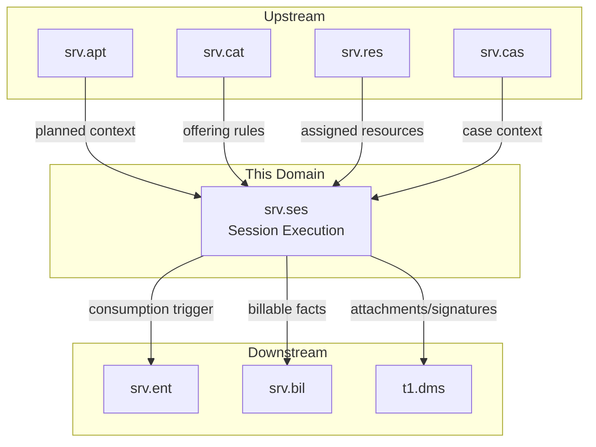
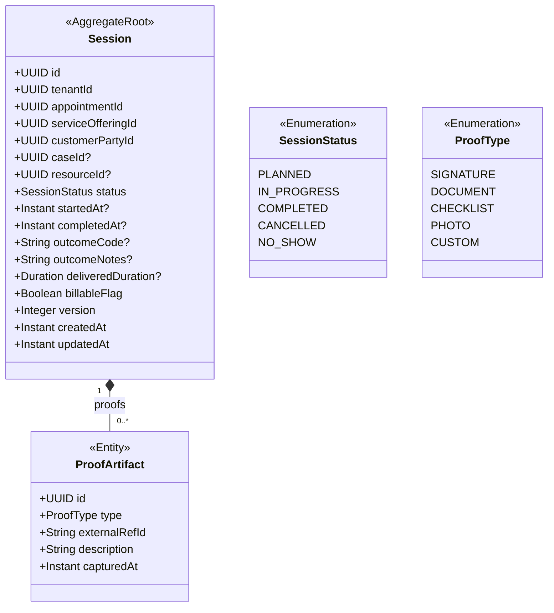
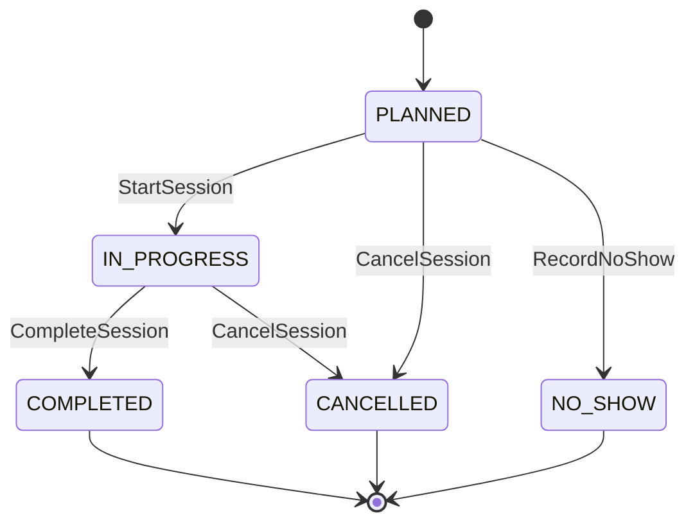
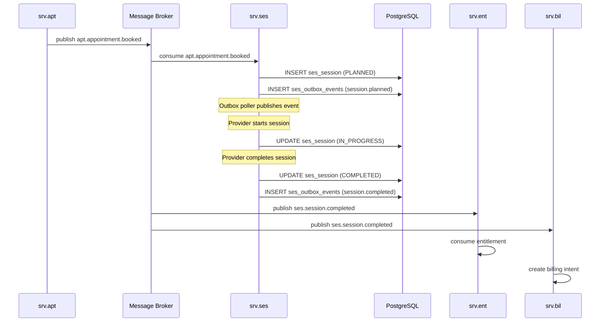
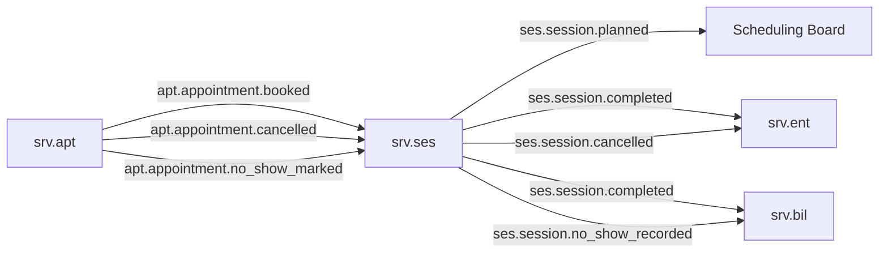
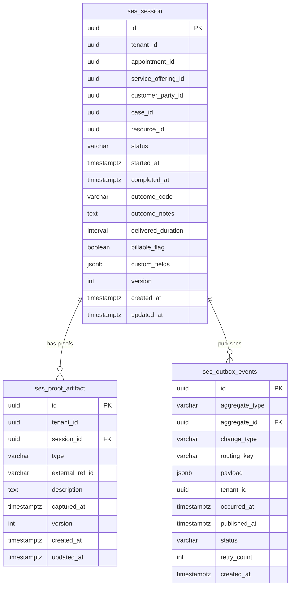

# Session Execution — `srv.ses` Domain / Service Specification

> **Conceptual Stack Layer:** Domain / Service
> **Space:** Platform
> **Owner:** Domain Engineering Team
> **Schema alignment:** `service-layer.schema.json`
> **Companion files:** `openapi.yaml`, `*.schema.json` (event contracts)
> **Referenced by:** Platform-Feature Spec SS5 (backend dependencies), BFF Contract
> **Belongs to:** SRV Suite Spec (`_srv_suite.md`)

> **Meta Information**
> - **Version:** 2026-04-03
> - **Template:** `domain-service-spec.md` v1.0.0
> - **Template Compliance:** ~95% — minor: Port/Repository OPEN QUESTION, outcomeCode vocabulary OPEN QUESTION
> - **Author(s):** OpenLeap Architecture Team
> - **Status:** DRAFT
> - **Suite:** `srv`
> - **Domain:** `ses`
> - **Bounded Context Ref:** `bc:session-execution`
> - **Service ID:** `srv-ses-svc`
> - **basePackage:** `io.openleap.srv.ses`
> - **API Base Path:** `/api/srv/ses/v1`
> - **OpenLeap Starter Version:** `v1`
> - **Port:** OPEN QUESTION — See Q-SES-001
> - **Repository:** OPEN QUESTION — See Q-SES-002
> - **Tags:** `session`, `execution`, `delivery`, `srv`
> - **Team:**
>   - Name: `team-srv`
>   - Email: `srv-team@openleap.io`
>   - Slack: `#srv-team`

---

## Specification Guidelines Compliance

> ### Non-Negotiables
> - Never invent facts. If required info is missing, add an **OPEN QUESTION** entry.
> - Preserve intent and decisions. Only change meaning when explicitly requested.
> - Do not remove normative constraints unless they are explicitly replaced.
> - Keep the spec **self-contained**: no "see chat", no implicit context.
>
> ### Source of Truth Priority
> When sources conflict:
> 1. Spec (explicit) wins
> 2. Starter specs (implementation constraints) next
> 3. Guidelines (best practices) last
>
> Record conflicts in the **Decisions & Conflicts** section (see Section 14).
>
> ### Style Guide
> - Prefer short sentences and lists.
> - Use MUST/SHOULD/MAY for normative statements.
> - Keep terminology consistent (Aggregate, Domain Service, Application Service, Command, Event).
> - Avoid ambiguous words ("often", "maybe") unless explicitly noting uncertainty.
> - Keep examples minimal and clearly marked as examples.
> - Do not add implementation code unless the chapter explicitly requires it.

---

## 0. Document Purpose & Scope

### 0.1 Purpose
`srv.ses` specifies **service execution as a business fact** for appointment-driven services: session lifecycle, outcomes, proof-of-service artifacts, and billing-relevant facts.

### 0.2 Target Audience
- Product Owners & Business Stakeholders
- System Architects & Technical Leads
- Integration Engineers

### 0.3 Scope

**In Scope:**
- MUST manage session lifecycle (PLANNED → IN_PROGRESS → COMPLETED / CANCELLED).
- MUST record execution outcome and structured results at a minimal, cross-industry level.
- MUST support proof-of-service artifacts (signatures, documents via `t1.dms`).
- MUST expose billing-relevant facts (delivered units, duration, billable flags).
- SHOULD support append-only corrections (reversal/cancellation reasons).

**Out of Scope:**
- MUST NOT own commercial order management (→ `sd`).
- MUST NOT create invoices/postings/open items (→ `fi`).
- MUST NOT attempt deep regulated industry record models (candidate for separate industry suite, e.g. `med`).

### 0.4 Related Documents
- `_srv_suite.md`, `srv_apt-spec.md`, `srv_cat-spec.md`, `srv_res-spec.md`, `srv_cas-spec.md`, `srv_ent-spec.md`, `srv_bil-spec.md`
- `SYSTEM_OVERVIEW.md`, `TECHNICAL_STANDARDS.md`, `EVENT_STANDARDS.md`

---

## 1. Business Context

### 1.1 Domain Purpose
Capture "what actually happened" for services, enabling traceable delivery, case history, entitlement consumption, and billing intent derivation.

### 1.2 Business Value
- Provides authoritative proof of service delivery for billing and compliance.
- Enables case-level history and cross-session reasoning.
- Feeds entitlement consumption and billing intent generation.
- Supports dispute resolution with time-stamped, artifact-backed delivery facts.

### 1.3 Key Stakeholders

| Role | Responsibility | Primary Use Cases |
|------|----------------|-------------------|
| Service Provider | Execute and record sessions | Start, complete, record outcomes |
| Back Office | Review execution facts | View history, verify proof artifacts |
| Billing Clerk | Verify delivered service | Reconcile sessions with billing intents |
| Customer (Portal) | View own session history | Session history view, proof download |

### 1.4 Strategic Positioning



### 1.5 Service Context

| Property | Value |
|----------|-------|
| **Suite** | `srv` |
| **Domain** | `ses` |
| **Bounded Context** | `bc:session-execution` |
| **Service ID** | `srv-ses-svc` |
| **Base Package** | `io.openleap.srv.ses` |

**Responsibilities:**
- Create/maintain session records derived from booked appointments
- Record start/stop/completion and outcome
- Capture proof-of-service references (document IDs, signature refs)
- Expose billing-relevant facts (delivered units, duration, billable flags)

**Authoritative Sources:**
| Source Type | Description | Access Pattern |
|-------------|-------------|----------------|
| REST API | Session records, proof artifacts | Synchronous |
| Database | Session execution data | Direct (owner) |
| Events | Session lifecycle events | Asynchronous |

---

## 2. Service Identity

| Property | Value | Schema Field |
|----------|-------|-------------|
| **Service ID** | `srv-ses-svc` | `metadata.id` |
| **Display Name** | Session Execution | `metadata.name` |
| **Suite** | `srv` | `metadata.suite` |
| **Domain** | `ses` | `metadata.domain` |
| **Bounded Context** | `bc:session-execution` | `metadata.bounded_context_ref` |
| **Version** | `1.1.0` | `metadata.version` |
| **Status** | DRAFT | `metadata.status` |
| **API Base Path** | `/api/srv/ses/v1` | `metadata.api_base_path` |
| **Repository** | OPEN QUESTION — See Q-SES-002 | `metadata.repository` |
| **Tags** | `session`, `execution`, `delivery`, `srv` | `metadata.tags` |

**Team:**
| Property | Value |
|----------|-------|
| **Name** | `team-srv` |
| **Email** | `srv-team@openleap.io` |
| **Slack Channel** | `#srv-team` |

---

## 3. Domain Model

### 3.1 Conceptual Overview
The session execution domain captures **sessions** — business facts representing the delivery of a service. Sessions are typically created from booked appointments and go through a lifecycle to completion. Each session may have **proof artifacts** (documents, signatures) attached. Sessions are the source of truth for billing intent and entitlement consumption.

### 3.2 Core Concepts



### 3.3 Aggregate Definitions

#### 3.3.1 Session

| Property | Value |
|----------|-------|
| **Aggregate ID** | `agg:session` |
| **Name** | `Session` |

**Business Purpose:** A recorded business fact representing the execution and completion of a service, including outcome and proof artifacts. Sessions are append-only records: once COMPLETED, facts are immutable.

##### Aggregate Root

**Key Attributes:**
| Attribute | Type | Format | Description | Constraints | Required | Read-Only |
|-----------|------|--------|-------------|-------------|----------|-----------|
| id | string | uuid | Unique identifier generated via `OlUuid.create()` | Immutable | Yes | Yes |
| tenantId | string | uuid | Tenant ownership enforced via RLS | Immutable | Yes | Yes |
| appointmentId | string | uuid | Reference to the source appointment in `srv.apt` | Must exist in `srv.apt` | Yes | Yes |
| serviceOfferingId | string | uuid | Reference to the service offering delivered | — | Yes | Yes |
| customerPartyId | string | uuid | Reference to the customer business partner | — | Yes | Yes |
| caseId | string | uuid | Optional reference to the enclosing case in `srv.cas` | — | No | No |
| resourceId | string | uuid | Reference to the assigned scheduling resource in `srv.res` | — | No | No |
| status | string | — | Current lifecycle state | enum_ref: `SessionStatus` | Yes | No |
| startedAt | string | date-time | Actual start timestamp (ISO-8601, UTC) | Must be before completedAt | No | No |
| completedAt | string | date-time | Actual completion timestamp (ISO-8601, UTC) | Must be after startedAt | No | No |
| outcomeCode | string | — | Structured outcome code | max_length: 50; OPEN QUESTION: vocabulary — See Q-SES-003 | No | No |
| outcomeNotes | string | — | Free-text description of outcome | max_length: 2000 | No | No |
| deliveredDuration | string | duration | Actual delivered duration in ISO-8601 duration format (e.g., `PT45M`) | Must be positive if set | No | No |
| billableFlag | boolean | — | Whether this session generates a billing intent | default: true | Yes | No |
| version | integer | int64 | Optimistic locking version counter | min: 0 | Yes | Yes |
| createdAt | string | date-time | Record creation timestamp (UTC) | Immutable | Yes | Yes |
| updatedAt | string | date-time | Last update timestamp (UTC) | — | Yes | Yes |

**Lifecycle States:**

| Property | Value |
|----------|-------|
| **Initial State** | `PLANNED` |
| **Terminal States** | `COMPLETED`, `CANCELLED`, `NO_SHOW` |



**State Descriptions:**
| State | Description | Business Meaning |
|-------|-------------|------------------|
| PLANNED | Created from appointment booking | Session scheduled but not started |
| IN_PROGRESS | Service being delivered | Provider is executing the service |
| COMPLETED | Service delivered and recorded | Facts captured; billing can proceed |
| CANCELLED | Session cancelled before or during delivery | No delivery; may trigger entitlement reversal |
| NO_SHOW | Customer did not attend | No delivery; fee policy may apply |

**Allowed Transitions:**
| From State | To State | Trigger | Guard / Business Preconditions |
|------------|----------|---------|-------------------------------|
| PLANNED | IN_PROGRESS | StartSession command | Session must be in PLANNED status (BR-005) |
| IN_PROGRESS | COMPLETED | CompleteSession command | completedAt > startedAt (BR-003); deliveredDuration positive if set (BR-004) |
| IN_PROGRESS | CANCELLED | CancelSession command | outcomeNotes (cancellation reason) SHOULD be provided |
| PLANNED | CANCELLED | CancelSession command or apt.cancelled event | — |
| PLANNED | NO_SHOW | RecordNoShow command or apt.no_show_marked event | — |

**Invariants:**
| Rule ID | Description |
|---------|-------------|
| BR-001 | Session MUST reference a valid booked appointment (or equivalent planned context) |
| BR-002 | COMPLETED session facts MUST NOT be overwritten (append-only corrections only) |
| BR-003 | `completedAt` MUST be after `startedAt` |
| BR-004 | `deliveredDuration` MUST be positive if set |
| BR-005 | Only PLANNED sessions can transition to IN_PROGRESS |
| BR-006 | Only IN_PROGRESS sessions can transition to COMPLETED |
| BR-007 | COMPLETED sessions MUST NOT be directly cancelled |
| BR-008 | `outcomeCode` MUST reference a known outcome code from the platform vocabulary |

**Domain Events Emitted:**
- `srv.ses.session.planned`
- `srv.ses.session.started`
- `srv.ses.session.completed`
- `srv.ses.session.cancelled`
- `srv.ses.session.no_show_recorded`

##### Child Entities

###### Entity: ProofArtifact

| Property | Value |
|----------|-------|
| **Entity ID** | `ent:proof-artifact` |
| **Name** | `ProofArtifact` |
| **Relationship to Root** | one_to_many |

**Business Purpose:** A document, signature, or checklist proving service delivery, stored externally in `t1.dms`. The session holds a reference (`externalRefId`) to the DMS document; the DMS service owns the binary content.

**Attributes:**
| Attribute | Type | Format | Description | Constraints | Required |
|-----------|------|--------|-------------|-------------|----------|
| id | string | uuid | Unique identifier generated via `OlUuid.create()` | Immutable | Yes |
| type | string | — | Proof type classification | enum_ref: `ProofType` | Yes |
| externalRefId | string | — | DMS document ID or external reference URI | max_length: 200 | Yes |
| description | string | — | Human-readable description of the artifact | max_length: 500 | No |
| capturedAt | string | date-time | Timestamp when proof was captured (UTC) | Must not be in the future | Yes |

**Collection Constraints:**
- Minimum items: 0
- Maximum items: OPEN QUESTION — See Q-SES-004

**Invariants:**
| Rule ID | Description |
|---------|-------------|
| BR-009 | Proof artifacts MUST NOT be added to CANCELLED or NO_SHOW sessions |
| BR-010 | `externalRefId` MUST reference a valid document in `t1.dms` |

##### Value Objects

There are no value objects currently defined on the Session aggregate. Shared types are documented in §3.5.

### 3.4 Enumerations

#### SessionStatus

**Description:** Represents the lifecycle state of a session record.

| Value | Description | Deprecated |
|-------|-------------|------------|
| `PLANNED` | Session record created from appointment booking; not yet started | No |
| `IN_PROGRESS` | Service execution is actively underway | No |
| `COMPLETED` | Service delivered; all outcome facts recorded; billing intent may be generated | No |
| `CANCELLED` | Session cancelled before completion; no delivery occurred | No |
| `NO_SHOW` | Customer did not appear; no delivery occurred; no-show fee policy may apply | No |

#### ProofType

**Description:** Classifies the type of proof-of-service artifact attached to a session.

| Value | Description | Deprecated |
|-------|-------------|------------|
| `SIGNATURE` | Customer or provider electronic/handwritten signature confirming delivery | No |
| `DOCUMENT` | Attached document (e.g., session report, treatment summary) stored in DMS | No |
| `CHECKLIST` | Completed digital checklist confirming all required steps were executed | No |
| `PHOTO` | Photographic evidence of service delivery (e.g., before/after photos) | No |
| `CUSTOM` | Product-defined custom proof type; description field MUST be populated | No |

### 3.5 Shared Types

There are no shared types reused across multiple aggregates in this service at baseline. If the domain model is extended with additional aggregates (e.g., a `CorrectionRecord`), shared types such as `AuditRef` SHOULD be extracted here.

> OPEN QUESTION: See Q-SES-005 in §14.3 — Should `outcomeCode` be a shared type or remain a plain string?

---

## 4. Business Rules & Constraints

### 4.1 Business Rules Catalog

| ID | Rule Name | Description | Scope | Enforcement | Error Code |
|----|-----------|-------------|-------|-------------|------------|
| BR-001 | Valid Appointment Ref | Session MUST reference a valid booked appointment | Session | Create | `SES_INVALID_APPOINTMENT` |
| BR-002 | Append-Only Corrections | Completed session facts MUST NOT be overwritten | Session | Update | `SES_IMMUTABLE_COMPLETED` |
| BR-003 | Valid Time Sequence | `completedAt` MUST be after `startedAt` | Session | Complete | `SES_INVALID_TIME_SEQUENCE` |
| BR-004 | Positive Duration | `deliveredDuration` MUST be positive if set | Session | Complete | `SES_INVALID_DURATION` |
| BR-005 | Start From Planned Only | Only PLANNED sessions may transition to IN_PROGRESS | Session | Start | `SES_INVALID_STATUS_TRANSITION` |
| BR-006 | Complete From In-Progress Only | Only IN_PROGRESS sessions may transition to COMPLETED | Session | Complete | `SES_INVALID_STATUS_TRANSITION` |
| BR-007 | No Cancellation of Completed | COMPLETED sessions MUST NOT be cancelled | Session | Cancel | `SES_INVALID_STATUS_TRANSITION` |
| BR-008 | Valid Outcome Code | `outcomeCode` MUST be from the platform outcome code vocabulary | Session | Complete | `SES_INVALID_OUTCOME_CODE` |
| BR-009 | No Proof on Terminal Sessions | Proof artifacts MUST NOT be added to CANCELLED or NO_SHOW sessions | ProofArtifact | Attach | `SES_PROOF_INVALID_SESSION_STATUS` |
| BR-010 | Valid DMS Reference | `externalRefId` MUST reference a valid document in `t1.dms` | ProofArtifact | Attach | `SES_INVALID_DMS_REF` |

### 4.2 Detailed Rule Definitions

#### BR-001: Valid Appointment Ref

**Business Context:** Sessions derive their scheduling context, customer, and resource assignment from appointments. A session without a valid appointment has no authoritative source for timing and customer data.

**Rule Statement:** When creating a planned session, the `appointmentId` MUST identify an appointment that exists in `srv.apt` and is in a bookable/booked state for the same tenant.

**Applies To:**
- Aggregate: `Session`
- Operations: Create (UC-001)

**Enforcement:** Application service validates appointment existence via `srv.apt` REST API at session creation time.

**Validation Logic:** Call `GET /api/srv/apt/v1/appointments/{appointmentId}` and confirm 200 OK and matching `tenantId`.

**Error Handling:**
- **Error Code:** `SES_INVALID_APPOINTMENT`
- **Error Message:** "The referenced appointment does not exist or is not accessible."
- **User action:** Verify the appointment ID and that the appointment is in a valid state.

**Examples:**
- **Valid:** Appointment `abc-123` exists in `srv.apt`, status BOOKED, same tenantId.
- **Invalid:** Appointment `xyz-999` does not exist or belongs to a different tenant.

---

#### BR-002: Append-Only Corrections

**Business Context:** Session execution facts are legal and billing records. Overwriting a completed session's outcome data destroys the audit trail and violates data integrity for billing reconciliation.

**Rule Statement:** Once a session reaches COMPLETED status, its outcome fields (`outcomeCode`, `outcomeNotes`, `deliveredDuration`, `billableFlag`, `startedAt`, `completedAt`) MUST NOT be modified. Corrections MUST be made via explicit correction events or append-only supplemental records.

**Applies To:**
- Aggregate: `Session`
- Operations: Any update after COMPLETED

**Enforcement:** Domain object rejects mutations on COMPLETED sessions; returns error immediately.

**Validation Logic:** If `session.status == COMPLETED`, reject any field update command.

**Error Handling:**
- **Error Code:** `SES_IMMUTABLE_COMPLETED`
- **Error Message:** "Session outcome facts cannot be modified after completion."
- **User action:** Create a correction record or contact the system administrator.

**Examples:**
- **Valid:** Updating `resourceId` on a PLANNED session.
- **Invalid:** Attempting to change `billableFlag` on a COMPLETED session.

---

#### BR-003: Valid Time Sequence

**Business Context:** A session cannot logically end before it starts. This validates data entry integrity from service providers.

**Rule Statement:** When completing a session, if both `startedAt` and `completedAt` are provided, `completedAt` MUST be strictly after `startedAt`.

**Applies To:**
- Aggregate: `Session`
- Operations: Complete (UC-003)

**Enforcement:** Domain object validates during `Session.complete()` operation.

**Validation Logic:** `completedAt > startedAt`.

**Error Handling:**
- **Error Code:** `SES_INVALID_TIME_SEQUENCE`
- **Error Message:** "Completion time must be after start time."
- **User action:** Correct the start or completion timestamp.

**Examples:**
- **Valid:** `startedAt` = 09:00, `completedAt` = 09:45.
- **Invalid:** `startedAt` = 10:00, `completedAt` = 09:30.

---

#### BR-004: Positive Duration

**Business Context:** A delivered duration of zero or negative would indicate a data entry error and would produce incorrect billing calculations.

**Rule Statement:** If `deliveredDuration` is provided, it MUST be a positive ISO-8601 duration (e.g., `PT30M`).

**Applies To:**
- Aggregate: `Session`
- Operations: Complete (UC-003)

**Enforcement:** Domain object validates during `Session.complete()`.

**Validation Logic:** Parse duration and verify total seconds > 0.

**Error Handling:**
- **Error Code:** `SES_INVALID_DURATION`
- **Error Message:** "Delivered duration must be a positive value."
- **User action:** Provide a valid positive duration (e.g., PT45M for 45 minutes).

**Examples:**
- **Valid:** `deliveredDuration` = `PT45M`.
- **Invalid:** `deliveredDuration` = `PT0S` or `-PT10M`.

---

#### BR-005: Start From Planned Only

**Business Context:** Prevents double-starts and ensures sessions follow the defined lifecycle.

**Rule Statement:** A StartSession command MUST only be accepted when the session is in PLANNED status.

**Applies To:**
- Aggregate: `Session`
- Operations: Start (UC-002)

**Enforcement:** Domain object checks current status before applying state transition.

**Validation Logic:** `session.status == PLANNED`.

**Error Handling:**
- **Error Code:** `SES_INVALID_STATUS_TRANSITION`
- **Error Message:** "Session cannot be started from status {currentStatus}."
- **User action:** Verify the session's current status before starting.

**Examples:**
- **Valid:** Starting a PLANNED session.
- **Invalid:** Starting an IN_PROGRESS or COMPLETED session.

---

#### BR-006: Complete From In-Progress Only

**Business Context:** A session must be actively in progress before it can be completed.

**Rule Statement:** A CompleteSession command MUST only be accepted when the session is in IN_PROGRESS status.

**Applies To:**
- Aggregate: `Session`
- Operations: Complete (UC-003)

**Enforcement:** Domain object checks current status.

**Validation Logic:** `session.status == IN_PROGRESS`.

**Error Handling:**
- **Error Code:** `SES_INVALID_STATUS_TRANSITION`
- **Error Message:** "Session cannot be completed from status {currentStatus}."
- **User action:** Start the session first before completing it.

---

#### BR-007: No Cancellation of Completed Sessions

**Business Context:** Completed sessions have already generated billing intents and entitlement consumption records. Cancelling them would require complex compensation workflows that are out of scope for this service.

**Rule Statement:** A CancelSession command MUST be rejected if the session is in COMPLETED status.

**Applies To:**
- Aggregate: `Session`
- Operations: Cancel (UC-004)

**Enforcement:** Domain object checks current status.

**Validation Logic:** `session.status != COMPLETED`.

**Error Handling:**
- **Error Code:** `SES_INVALID_STATUS_TRANSITION`
- **Error Message:** "A completed session cannot be cancelled. Use a correction process instead."
- **User action:** Contact the billing team to initiate a correction workflow.

---

#### BR-008: Valid Outcome Code

**Business Context:** `outcomeCode` is used for structured reporting and billing rule evaluation. Arbitrary codes reduce data quality.

**Rule Statement:** If `outcomeCode` is provided, it MUST be from the platform's outcome code vocabulary.

**Applies To:**
- Aggregate: `Session`
- Operations: Complete (UC-003)

**Enforcement:** Application service validates against the outcome code registry.

**Validation Logic:** Lookup `outcomeCode` in platform reference data.

**Error Handling:**
- **Error Code:** `SES_INVALID_OUTCOME_CODE`
- **Error Message:** "Outcome code '{code}' is not recognized."
- **User action:** Use a valid outcome code from the platform vocabulary.

> OPEN QUESTION: See Q-SES-003 — outcomeCode vocabulary not yet defined.

---

#### BR-009: No Proof on Terminal Sessions

**Business Context:** Proof artifacts cannot be attached after a session is concluded without delivery.

**Rule Statement:** Proof artifacts MUST NOT be attached to CANCELLED or NO_SHOW sessions.

**Applies To:**
- Aggregate: `Session` (via ProofArtifact)
- Operations: AttachProofArtifact (UC-007)

**Enforcement:** Application service checks session status before accepting artifact.

**Error Handling:**
- **Error Code:** `SES_PROOF_INVALID_SESSION_STATUS`
- **Error Message:** "Proof artifacts cannot be attached to cancelled or no-show sessions."

---

#### BR-010: Valid DMS Reference

**Business Context:** The session references documents stored in `t1.dms`. Invalid references would leave proof artifact records pointing to non-existent documents.

**Rule Statement:** When attaching a proof artifact, the `externalRefId` MUST identify a document accessible in `t1.dms` for the same tenant.

**Applies To:**
- Aggregate: `Session` (via ProofArtifact)
- Operations: AttachProofArtifact (UC-007)

**Enforcement:** Application service validates document existence via `t1.dms` REST API.

**Error Handling:**
- **Error Code:** `SES_INVALID_DMS_REF`
- **Error Message:** "The referenced document does not exist in the document management system."

### 4.3 Data Validation Rules

**Field-Level Validations:**

| Field | Validation Rule | Error Message |
|-------|----------------|---------------|
| `appointmentId` | Required, valid UUID | "appointmentId is required and must be a valid UUID." |
| `serviceOfferingId` | Required, valid UUID | "serviceOfferingId is required and must be a valid UUID." |
| `customerPartyId` | Required, valid UUID | "customerPartyId is required and must be a valid UUID." |
| `status` | Required, enum: SessionStatus | "status must be one of: PLANNED, IN_PROGRESS, COMPLETED, CANCELLED, NO_SHOW." |
| `outcomeCode` | Optional, max_length: 50 | "outcomeCode must not exceed 50 characters." |
| `outcomeNotes` | Optional, max_length: 2000 | "outcomeNotes must not exceed 2000 characters." |
| `deliveredDuration` | Optional, ISO-8601 duration, positive | "deliveredDuration must be a positive ISO-8601 duration (e.g., PT45M)." |
| `billableFlag` | Required, boolean | "billableFlag is required." |
| `externalRefId` (ProofArtifact) | Required, max_length: 200 | "externalRefId is required and must not exceed 200 characters." |
| `description` (ProofArtifact) | Optional, max_length: 500 | "description must not exceed 500 characters." |
| `capturedAt` (ProofArtifact) | Required, ISO-8601 date-time, not in future | "capturedAt must be a valid past or present timestamp." |

**Cross-Field Validations:**
- `completedAt` MUST be strictly after `startedAt` when both are provided.
- If `deliveredDuration` is set without `startedAt` and `completedAt`, it is accepted as self-reported duration.
- `outcomeCode` SHOULD be set when `status` transitions to COMPLETED.

### 4.4 Reference Data Dependencies

| Catalog | Source Service | Fields Referencing | Validation |
|---------|----------------|-------------------|------------|
| Appointments | `srv-apt-svc` | `Session.appointmentId` | Existence check on create |
| Service Offerings | `srv-cat-svc` | `Session.serviceOfferingId` | Existence check on create |
| Scheduling Resources | `srv-res-svc` | `Session.resourceId` | Existence check on create (if set) |
| Cases | `srv-cas-svc` | `Session.caseId` | Existence check on create (if set) |
| DMS Documents | `t1-dms-svc` | `ProofArtifact.externalRefId` | Existence check on artifact attach |
| Outcome Code Vocabulary | Platform ref-data | `Session.outcomeCode` | Enum lookup on complete (OPEN QUESTION Q-SES-003) |

---

## 5. Use Cases

### 5.1 Business Logic Placement

| Logic Type | Placement | Examples |
|------------|-----------|----------|
| Aggregate invariants | Domain Object (`Session`) | Status transitions, time sequence validation, immutability after COMPLETED |
| Cross-aggregate logic | Domain Service | None at baseline; potential future: correction saga |
| Orchestration & transactions | Application Service | Use case coordination, reference data validation, event publishing via outbox |

### 5.2 Use Cases (Canonical Format)

#### UC-001: CreatePlannedSession

| Field | Value |
|-------|-------|
| **id** | `CreatePlannedSession` |
| **type** | WRITE |
| **trigger** | Message (from `srv.apt.appointment.booked`) |
| **aggregate** | `Session` |
| **domainOperation** | `Session.createPlanned` |
| **inputs** | `appointmentId: UUID`, `serviceOfferingId: UUID`, `customerPartyId: UUID`, `caseId: UUID?`, `resourceId: UUID?` |
| **outputs** | `Session` |
| **events** | `srv.ses.session.planned` |
| **idempotency** | required — deduplicate by `appointmentId` per tenant |

**Actor:** Automated (event consumer reacting to `srv.apt.appointment.booked`)

**Preconditions:**
- Appointment exists in `srv.apt` and is in BOOKED status.
- No session already exists for the same `appointmentId` and `tenantId`.

**Main Flow:**
1. Consumer receives `srv.apt.appointment.booked` event.
2. Application service checks for duplicate session (idempotency guard).
3. Application service validates appointment reference (BR-001).
4. Domain object `Session.createPlanned()` creates session with status PLANNED.
5. Session is persisted; outbox event `srv.ses.session.planned` is written.

**Postconditions:**
- Session exists in PLANNED status.
- Event `srv.ses.session.planned` is in the outbox.

**Business Rules Applied:**
- BR-001: Valid Appointment Ref

**Alternative Flows:**
- **Alt-1:** Session already exists for `appointmentId` — return existing session (idempotent).

**Exception Flows:**
- **Exc-1:** Appointment not found in `srv.apt` — log warning, apply DLQ policy (see §7.3).

---

#### UC-002: StartSession

| Field | Value |
|-------|-------|
| **id** | `StartSession` |
| **type** | WRITE |
| **trigger** | REST |
| **aggregate** | `Session` |
| **domainOperation** | `Session.start` |
| **inputs** | `sessionId: UUID` |
| **outputs** | `Session` |
| **events** | `srv.ses.session.started` |
| **rest** | `POST /api/srv/ses/v1/sessions/{id}/start` |
| **idempotency** | required — idempotent if already IN_PROGRESS |

**Actor:** Service Provider

**Preconditions:**
- Session exists and is in PLANNED status.
- Actor has `SRV_SES_EDITOR` permission.

**Main Flow:**
1. Service Provider triggers start via mobile/tablet UI.
2. REST POST received; session loaded.
3. Domain object validates status transition (BR-005).
4. `Session.start()` sets `startedAt` to current UTC time, transitions to IN_PROGRESS.
5. Session persisted; outbox event `srv.ses.session.started` written.

**Postconditions:**
- Session is in IN_PROGRESS status.
- `startedAt` is set to current UTC.

**Business Rules Applied:**
- BR-005: Start From Planned Only

**Exception Flows:**
- **Exc-1:** Session not found → 404 Not Found.
- **Exc-2:** Session not in PLANNED status → 422 Unprocessable Entity, `SES_INVALID_STATUS_TRANSITION`.

---

#### UC-003: CompleteSession

| Field | Value |
|-------|-------|
| **id** | `CompleteSession` |
| **type** | WRITE |
| **trigger** | REST |
| **aggregate** | `Session` |
| **domainOperation** | `Session.complete` |
| **inputs** | `sessionId: UUID`, `outcomeCode: String?`, `outcomeNotes: String?`, `deliveredDuration: Duration?`, `billableFlag: Boolean?` |
| **outputs** | `Session` |
| **events** | `srv.ses.session.completed` |
| **rest** | `POST /api/srv/ses/v1/sessions/{id}/complete` |
| **idempotency** | required |
| **errors** | `SES_INVALID_TIME_SEQUENCE`, `SES_INVALID_DURATION`, `SES_INVALID_STATUS_TRANSITION` |

**Actor:** Service Provider

**Preconditions:**
- Session is in IN_PROGRESS status.
- Actor has `SRV_SES_EDITOR` permission.

**Main Flow:**
1. Service Provider records completion with outcome data.
2. Domain object validates status transition (BR-006), time sequence (BR-003), duration (BR-004), outcome code (BR-008).
3. `Session.complete()` sets `completedAt`, records outcome, transitions to COMPLETED.
4. Session persisted; outbox event `srv.ses.session.completed` written.

**Postconditions:**
- Session is in COMPLETED status.
- Outcome facts (`outcomeCode`, `outcomeNotes`, `deliveredDuration`, `billableFlag`) are immutable.
- Downstream services (`srv.ent`, `srv.bil`) will react to the completion event.

**Business Rules Applied:**
- BR-002, BR-003, BR-004, BR-006, BR-008

**Exception Flows:**
- **Exc-1:** Session not in IN_PROGRESS → 422, `SES_INVALID_STATUS_TRANSITION`.
- **Exc-2:** Invalid time sequence → 422, `SES_INVALID_TIME_SEQUENCE`.
- **Exc-3:** Invalid duration → 422, `SES_INVALID_DURATION`.

---

#### UC-004: CancelSession

| Field | Value |
|-------|-------|
| **id** | `CancelSession` |
| **type** | WRITE |
| **trigger** | REST or Message (`srv.apt.appointment.cancelled`) |
| **aggregate** | `Session` |
| **domainOperation** | `Session.cancel` |
| **inputs** | `sessionId: UUID`, `cancellationReason: String?` |
| **outputs** | `Session` |
| **events** | `srv.ses.session.cancelled` |
| **rest** | `POST /api/srv/ses/v1/sessions/{id}/cancel` |
| **idempotency** | required |

**Actor:** Service Provider, Back Office, or automated event consumer

**Preconditions:**
- Session is in PLANNED or IN_PROGRESS status.
- Actor has `SRV_SES_EDITOR` permission (REST trigger) or is the event consumer.

**Main Flow:**
1. Cancellation command received (REST or appointment.cancelled event).
2. Domain object validates transition (BR-007).
3. `Session.cancel()` transitions to CANCELLED, stores reason in `outcomeNotes`.
4. Session persisted; outbox event `srv.ses.session.cancelled` written.

**Postconditions:**
- Session is in CANCELLED status.
- Downstream entitlement reversal MAY be triggered by `srv.ent`.

**Business Rules Applied:**
- BR-007: No Cancellation of Completed Sessions

**Exception Flows:**
- **Exc-1:** Session in COMPLETED status → 422, `SES_INVALID_STATUS_TRANSITION`.

---

#### UC-005: RecordNoShow

| Field | Value |
|-------|-------|
| **id** | `RecordNoShow` |
| **type** | WRITE |
| **trigger** | REST or Message (`srv.apt.appointment.no_show_marked`) |
| **aggregate** | `Session` |
| **domainOperation** | `Session.recordNoShow` |
| **inputs** | `sessionId: UUID`, `noShowNotes: String?` |
| **outputs** | `Session` |
| **events** | `srv.ses.session.no_show_recorded` |
| **rest** | `POST /api/srv/ses/v1/sessions/{id}/record-no-show` |
| **idempotency** | required |

**Actor:** Back Office Scheduler or automated event consumer

**Preconditions:**
- Session is in PLANNED status.

**Main Flow:**
1. No-show command received.
2. Domain object validates session is PLANNED.
3. `Session.recordNoShow()` transitions to NO_SHOW, sets `billableFlag` per configured no-show fee policy.
4. Session persisted; outbox event `srv.ses.session.no_show_recorded` written.

**Postconditions:**
- Session is in NO_SHOW status.
- Billing intent MAY be generated in `srv.bil` for no-show fee (if policy applies).

---

#### UC-006: GetSession

| Field | Value |
|-------|-------|
| **id** | `GetSession` |
| **type** | READ |
| **trigger** | REST |
| **aggregate** | `Session` |
| **inputs** | `sessionId: UUID` |
| **outputs** | `Session` (read model) |
| **rest** | `GET /api/srv/ses/v1/sessions/{id}` |

**Actor:** Any authorized user

**Preconditions:**
- Session exists and belongs to actor's tenant.

---

#### UC-007: SearchSessions

| Field | Value |
|-------|-------|
| **id** | `SearchSessions` |
| **type** | READ |
| **trigger** | REST |
| **aggregate** | `Session` |
| **inputs** | `customerPartyId?: UUID`, `caseId?: UUID`, `from?: date-time`, `to?: date-time`, `status?: SessionStatus`, `page?: int`, `size?: int` |
| **outputs** | Paginated list of `Session` (read model) |
| **rest** | `GET /api/srv/ses/v1/sessions` |

---

#### UC-008: AttachProofArtifact

| Field | Value |
|-------|-------|
| **id** | `AttachProofArtifact` |
| **type** | WRITE |
| **trigger** | REST |
| **aggregate** | `Session` (via ProofArtifact) |
| **domainOperation** | `Session.attachProof` |
| **inputs** | `sessionId: UUID`, `type: ProofType`, `externalRefId: String`, `description: String?`, `capturedAt: Instant` |
| **outputs** | `ProofArtifact` |
| **rest** | `POST /api/srv/ses/v1/sessions/{id}/proof-artifacts` |
| **idempotency** | required — deduplicate by `externalRefId` per session |

**Actor:** Service Provider

**Preconditions:**
- Session exists and is NOT in CANCELLED or NO_SHOW status (BR-009).
- DMS document referenced by `externalRefId` exists (BR-010).

**Main Flow:**
1. Service Provider uploads document to `t1.dms`, receives `externalRefId`.
2. REST POST attaches proof artifact reference to session.
3. Application service validates session status (BR-009) and DMS reference (BR-010).
4. `Session.attachProof()` creates `ProofArtifact` child entity.
5. Session updated; no dedicated event for artifact attach (session events cover lifecycle).

**Postconditions:**
- `ProofArtifact` is persisted within the session.

**Business Rules Applied:**
- BR-009, BR-010

### 5.3 Process Flow Diagrams



### 5.4 Cross-Domain Workflows

#### Workflow: Appointment-to-Session (Choreography)

**Pattern:** Choreography (ADR-003, ADR-029)
**Description:** Sessions are created automatically when appointments are booked. No direct REST calls between `srv.apt` and `srv.ses`.

**Participating Services:**
| Service | Role | Integration Type |
|---------|------|-----------------|
| `srv-apt-svc` | Publisher | Event (appointment.booked) |
| `srv-ses-svc` | Consumer / Session Owner | Event + REST |

**Workflow Steps:**
1. Customer books appointment → `srv.apt` publishes `srv.apt.appointment.booked`.
2. `srv.ses` consumes event → creates PLANNED session (UC-001).
3. Provider starts session via REST → IN_PROGRESS (UC-002).
4. Provider completes session via REST → COMPLETED (UC-003).

**Failure Path:** If session creation fails, event goes to DLQ. Operations team retries or manually creates session.

---

#### Workflow: Session-to-Billing-Intent (Choreography)

**Pattern:** Choreography (ADR-003)
**Description:** When a session is completed, `srv.bil` listens for the completion event and creates a billing intent. No direct call from `srv.ses` to `srv.bil`.

**Participating Services:**
| Service | Role | Integration Type | Criticality |
|---------|------|-----------------|-------------|
| `srv-ses-svc` | Publisher | Event (session.completed) | High |
| `srv-bil-svc` | Consumer / Billing Owner | Event | High |

**Business Implication:** If `srv.bil` is unavailable, the event is queued. Billing intent is created upon consumer recovery. Billing intent creation MUST be idempotent on `sessionId`.

---

#### Workflow: Session-to-Entitlement-Consumption (Choreography)

**Pattern:** Choreography (ADR-003)
**Description:** When a session is completed and `billableFlag` is true, `srv.ent` consumes the completion event to decrement the customer's entitlement balance.

**Participating Services:**
| Service | Role | Integration Type | Criticality |
|---------|------|-----------------|-------------|
| `srv-ses-svc` | Publisher | Event (session.completed) | High |
| `srv-ent-svc` | Consumer / Entitlement Owner | Event | High |

**Business Implication:** Entitlement consumption MUST be idempotent. If a session is cancelled after entitlement was consumed, `srv.ent` reacts to `session.cancelled` to reverse.

---

## 6. REST API

### 6.1 API Overview

**Base Path:** `/api/srv/ses/v1`
**Authentication:** OAuth2 / JWT Bearer token
**Authorization:** Role-based — `SRV_SES_VIEWER` (read), `SRV_SES_EDITOR` (write), `SRV_SES_ADMIN` (admin operations)
**Versioning:** URL-based (`/v1`). Backward-compatible changes are additive; breaking changes increment version.
**Pagination:** Cursor-based for list endpoints; `?page=0&size=20` supported.

### 6.2 Resource Operations

#### 6.2.1 Sessions - Create Planned Session

```http
POST /api/srv/ses/v1/sessions
Authorization: Bearer {token}
Content-Type: application/json
```

**Request Body:**
```json
{
  "appointmentId": "a1b2c3d4-e5f6-7890-abcd-ef1234567890",
  "serviceOfferingId": "b2c3d4e5-f6a7-8901-bcde-f01234567891",
  "customerPartyId": "c3d4e5f6-a7b8-9012-cdef-012345678912",
  "caseId": "d4e5f6a7-b8c9-0123-defa-123456789023",
  "resourceId": "e5f6a7b8-c9d0-1234-efab-234567890134"
}
```

**Success Response:** `201 Created`
```json
{
  "id": "f6a7b8c9-d0e1-2345-fabc-345678901245",
  "tenantId": "tenant-uuid",
  "appointmentId": "a1b2c3d4-e5f6-7890-abcd-ef1234567890",
  "serviceOfferingId": "b2c3d4e5-f6a7-8901-bcde-f01234567891",
  "customerPartyId": "c3d4e5f6-a7b8-9012-cdef-012345678912",
  "caseId": "d4e5f6a7-b8c9-0123-defa-123456789023",
  "resourceId": "e5f6a7b8-c9d0-1234-efab-234567890134",
  "status": "PLANNED",
  "startedAt": null,
  "completedAt": null,
  "outcomeCode": null,
  "outcomeNotes": null,
  "deliveredDuration": null,
  "billableFlag": true,
  "customFields": {},
  "proofArtifacts": [],
  "version": 0,
  "createdAt": "2026-04-03T09:00:00Z",
  "updatedAt": "2026-04-03T09:00:00Z",
  "_links": {
    "self": { "href": "/api/srv/ses/v1/sessions/f6a7b8c9-d0e1-2345-fabc-345678901245" },
    "start": { "href": "/api/srv/ses/v1/sessions/f6a7b8c9-d0e1-2345-fabc-345678901245/start" }
  }
}
```

**Response Headers:**
- `Location: /api/srv/ses/v1/sessions/f6a7b8c9-d0e1-2345-fabc-345678901245`
- `ETag: "0"`

**Business Rules Checked:** BR-001

**Events Published:** `srv.ses.session.planned`

**Error Responses:**
- `400 Bad Request` — Missing required fields
- `409 Conflict` — Session already exists for this appointmentId (idempotent duplicate)
- `422 Unprocessable Entity` — BR-001: Invalid appointment reference

---

#### 6.2.2 Sessions - Start Session

```http
POST /api/srv/ses/v1/sessions/{id}/start
Authorization: Bearer {token}
Content-Type: application/json
```

**Request Body:** *(empty or `{}`)*

**Success Response:** `200 OK`
```json
{
  "id": "f6a7b8c9-d0e1-2345-fabc-345678901245",
  "status": "IN_PROGRESS",
  "startedAt": "2026-04-03T10:00:00Z",
  "version": 1,
  "updatedAt": "2026-04-03T10:00:00Z",
  "_links": {
    "self": { "href": "/api/srv/ses/v1/sessions/f6a7b8c9-d0e1-2345-fabc-345678901245" },
    "complete": { "href": "/api/srv/ses/v1/sessions/f6a7b8c9-d0e1-2345-fabc-345678901245/complete" },
    "cancel": { "href": "/api/srv/ses/v1/sessions/f6a7b8c9-d0e1-2345-fabc-345678901245/cancel" }
  }
}
```

**Response Headers:**
- `ETag: "1"`

**Business Rules Checked:** BR-005

**Events Published:** `srv.ses.session.started`

**Error Responses:**
- `404 Not Found` — Session does not exist
- `409 Conflict` — ETag mismatch (optimistic lock)
- `422 Unprocessable Entity` — BR-005: Invalid status transition

---

#### 6.2.3 Sessions - Complete Session

```http
POST /api/srv/ses/v1/sessions/{id}/complete
Authorization: Bearer {token}
Content-Type: application/json
```

**Request Body:**
```json
{
  "outcomeCode": "DELIVERED",
  "outcomeNotes": "Session completed successfully. Patient responded well to treatment.",
  "deliveredDuration": "PT45M",
  "billableFlag": true
}
```

**Success Response:** `200 OK`
```json
{
  "id": "f6a7b8c9-d0e1-2345-fabc-345678901245",
  "status": "COMPLETED",
  "startedAt": "2026-04-03T10:00:00Z",
  "completedAt": "2026-04-03T10:45:00Z",
  "outcomeCode": "DELIVERED",
  "outcomeNotes": "Session completed successfully. Patient responded well to treatment.",
  "deliveredDuration": "PT45M",
  "billableFlag": true,
  "version": 2,
  "updatedAt": "2026-04-03T10:45:00Z",
  "_links": {
    "self": { "href": "/api/srv/ses/v1/sessions/f6a7b8c9-d0e1-2345-fabc-345678901245" },
    "proof-artifacts": { "href": "/api/srv/ses/v1/sessions/f6a7b8c9-d0e1-2345-fabc-345678901245/proof-artifacts" }
  }
}
```

**Business Rules Checked:** BR-002, BR-003, BR-004, BR-006, BR-008

**Events Published:** `srv.ses.session.completed`

**Error Responses:**
- `404 Not Found`
- `412 Precondition Failed` — ETag mismatch
- `422 Unprocessable Entity` — BR-003, BR-004, BR-006, BR-008

---

#### 6.2.4 Sessions - Cancel Session

```http
POST /api/srv/ses/v1/sessions/{id}/cancel
Authorization: Bearer {token}
Content-Type: application/json
```

**Request Body:**
```json
{
  "cancellationReason": "Customer requested cancellation 2 hours before appointment."
}
```

**Success Response:** `200 OK`
```json
{
  "id": "f6a7b8c9-d0e1-2345-fabc-345678901245",
  "status": "CANCELLED",
  "outcomeNotes": "Customer requested cancellation 2 hours before appointment.",
  "version": 2,
  "updatedAt": "2026-04-03T08:00:00Z",
  "_links": {
    "self": { "href": "/api/srv/ses/v1/sessions/f6a7b8c9-d0e1-2345-fabc-345678901245" }
  }
}
```

**Business Rules Checked:** BR-007

**Events Published:** `srv.ses.session.cancelled`

**Error Responses:**
- `404 Not Found`
- `422 Unprocessable Entity` — BR-007: Cannot cancel COMPLETED session

---

#### 6.2.5 Sessions - Record No-Show

```http
POST /api/srv/ses/v1/sessions/{id}/record-no-show
Authorization: Bearer {token}
Content-Type: application/json
```

**Request Body:**
```json
{
  "noShowNotes": "Customer did not appear. No contact made. No-show fee policy applies."
}
```

**Success Response:** `200 OK`
```json
{
  "id": "f6a7b8c9-d0e1-2345-fabc-345678901245",
  "status": "NO_SHOW",
  "outcomeNotes": "Customer did not appear. No contact made. No-show fee policy applies.",
  "billableFlag": true,
  "version": 2,
  "updatedAt": "2026-04-03T10:00:00Z"
}
```

**Events Published:** `srv.ses.session.no_show_recorded`

**Error Responses:**
- `404 Not Found`
- `422 Unprocessable Entity` — Session not in PLANNED status

---

#### 6.2.6 Sessions - Get Session

```http
GET /api/srv/ses/v1/sessions/{id}
Authorization: Bearer {token}
```

**Success Response:** `200 OK`
```json
{
  "id": "f6a7b8c9-d0e1-2345-fabc-345678901245",
  "tenantId": "tenant-uuid",
  "appointmentId": "a1b2c3d4-e5f6-7890-abcd-ef1234567890",
  "serviceOfferingId": "b2c3d4e5-f6a7-8901-bcde-f01234567891",
  "customerPartyId": "c3d4e5f6-a7b8-9012-cdef-012345678912",
  "status": "COMPLETED",
  "startedAt": "2026-04-03T10:00:00Z",
  "completedAt": "2026-04-03T10:45:00Z",
  "outcomeCode": "DELIVERED",
  "deliveredDuration": "PT45M",
  "billableFlag": true,
  "customFields": {},
  "proofArtifacts": [
    {
      "id": "proof-uuid-1",
      "type": "SIGNATURE",
      "externalRefId": "dms-doc-uuid-abc",
      "description": "Customer signature",
      "capturedAt": "2026-04-03T10:44:00Z"
    }
  ],
  "version": 3,
  "createdAt": "2026-04-03T09:00:00Z",
  "updatedAt": "2026-04-03T10:45:00Z",
  "_links": {
    "self": { "href": "/api/srv/ses/v1/sessions/f6a7b8c9-d0e1-2345-fabc-345678901245" }
  }
}
```

**Response Headers:**
- `ETag: "3"`

**Error Responses:**
- `404 Not Found`

---

#### 6.2.7 Sessions - Search Sessions

```http
GET /api/srv/ses/v1/sessions?customerPartyId=c3d4&from=2026-04-01T00:00:00Z&to=2026-04-30T23:59:59Z&status=COMPLETED&page=0&size=20
Authorization: Bearer {token}
```

**Success Response:** `200 OK`
```json
{
  "content": [ { "...session objects..." } ],
  "page": 0,
  "size": 20,
  "totalElements": 5,
  "totalPages": 1,
  "_links": {
    "self": { "href": "/api/srv/ses/v1/sessions?page=0&size=20" }
  }
}
```

---

#### 6.2.8 Proof Artifacts - Attach

```http
POST /api/srv/ses/v1/sessions/{id}/proof-artifacts
Authorization: Bearer {token}
Content-Type: application/json
```

**Request Body:**
```json
{
  "type": "SIGNATURE",
  "externalRefId": "dms-doc-uuid-abc",
  "description": "Customer signature confirming service completion",
  "capturedAt": "2026-04-03T10:44:00Z"
}
```

**Success Response:** `201 Created`
```json
{
  "id": "proof-uuid-1",
  "sessionId": "f6a7b8c9-d0e1-2345-fabc-345678901245",
  "type": "SIGNATURE",
  "externalRefId": "dms-doc-uuid-abc",
  "description": "Customer signature confirming service completion",
  "capturedAt": "2026-04-03T10:44:00Z",
  "_links": {
    "self": { "href": "/api/srv/ses/v1/sessions/f6a7b8c9/proof-artifacts/proof-uuid-1" },
    "session": { "href": "/api/srv/ses/v1/sessions/f6a7b8c9-d0e1-2345-fabc-345678901245" }
  }
}
```

**Business Rules Checked:** BR-009, BR-010

**Error Responses:**
- `404 Not Found` — Session not found
- `422 Unprocessable Entity` — BR-009: Session in terminal state; BR-010: Invalid DMS reference

### 6.3 Business Operations

Business operations (non-CRUD state transitions) use the `POST /resource/{id}:{action}` pattern:

| Operation | Endpoint | UC |
|-----------|----------|----|
| Start session | `POST /sessions/{id}/start` | UC-002 |
| Complete session | `POST /sessions/{id}/complete` | UC-003 |
| Cancel session | `POST /sessions/{id}/cancel` | UC-004 |
| Record no-show | `POST /sessions/{id}/record-no-show` | UC-005 |
| Attach proof artifact | `POST /sessions/{id}/proof-artifacts` | UC-008 |

### 6.4 OpenAPI Specification

| Property | Value |
|----------|-------|
| **Location** | `openapi.yaml` (co-located with service) |
| **Version** | OpenAPI 3.1 |
| **Docs URL** | OPEN QUESTION — See Q-SES-002 |

The OpenAPI spec MUST be generated from the implementation and kept in sync with this spec. All endpoints documented in §6.2 and §6.3 MUST appear in the OpenAPI spec.

---

## 7. Events & Integration

### 7.1 Architecture Pattern

| Property | Value |
|----------|-------|
| **Pattern** | Event-driven choreography (ADR-003) |
| **Broker** | RabbitMQ (AMQP 0-9-1) |
| **Exchange** | `srv.ses.events` (topic exchange) |
| **Publishing** | Outbox pattern per ADR-013 |
| **Delivery** | At-least-once per ADR-014; consumers MUST be idempotent |
| **Event Style** | Thin events per ADR-011 (IDs + changeType, no full entity payload) |

Suite-level integration pattern: choreography is the default within the SRV suite. Saga orchestration (ADR-029) is reserved for multi-service compensation workflows (e.g., session correction).

### 7.2 Published Events

**Exchange:** `srv.ses.events` (topic)

---

#### Event: Session.Planned

**Routing Key:** `srv.ses.session.planned`

**Business Purpose:** Communicates that a session record has been created and is awaiting execution. Downstream systems may use this for scheduling board updates.

**When Published:** After UC-001 (CreatePlannedSession) completes successfully.

**Payload Structure:**
```json
{
  "aggregateType": "srv.ses.session",
  "changeType": "planned",
  "entityIds": ["f6a7b8c9-d0e1-2345-fabc-345678901245"],
  "version": 0,
  "occurredAt": "2026-04-03T09:00:00Z"
}
```

**Event Envelope:**
```json
{
  "eventId": "evt-uuid-001",
  "traceId": "trace-uuid-abc",
  "tenantId": "tenant-uuid",
  "occurredAt": "2026-04-03T09:00:00Z",
  "producer": "srv.ses",
  "schemaRef": "https://schemas.openleap.io/srv/ses/session.planned/v1.json",
  "payload": {
    "aggregateType": "srv.ses.session",
    "changeType": "planned",
    "entityIds": ["f6a7b8c9-d0e1-2345-fabc-345678901245"],
    "version": 0,
    "occurredAt": "2026-04-03T09:00:00Z"
  }
}
```

**Known Consumers:**
| Consumer Service | Handler | Purpose | Processing Type |
|-----------------|---------|---------|-----------------|
| Scheduling board (product) | — | Refresh upcoming sessions view | Async read |

---

#### Event: Session.Started

**Routing Key:** `srv.ses.session.started`

**Business Purpose:** Communicates that a session has begun. Used for real-time dashboard updates and provider activity tracking.

**When Published:** After UC-002 (StartSession) completes successfully.

**Payload Structure:**
```json
{
  "aggregateType": "srv.ses.session",
  "changeType": "started",
  "entityIds": ["f6a7b8c9-d0e1-2345-fabc-345678901245"],
  "version": 1,
  "occurredAt": "2026-04-03T10:00:00Z"
}
```

**Event Envelope:** Same structure as Session.Planned; `schemaRef`: `session.started/v1.json`.

**Known Consumers:** None at platform baseline.

---

#### Event: Session.Completed

**Routing Key:** `srv.ses.session.completed`

**Business Purpose:** The primary downstream trigger. Communicates that a service has been fully delivered with all billing facts. Drives entitlement consumption and billing intent creation.

**When Published:** After UC-003 (CompleteSession) completes successfully.

**Payload Structure:**
```json
{
  "aggregateType": "srv.ses.session",
  "changeType": "completed",
  "entityIds": ["f6a7b8c9-d0e1-2345-fabc-345678901245"],
  "version": 2,
  "occurredAt": "2026-04-03T10:45:00Z"
}
```

**Event Envelope:** Same structure; `schemaRef`: `session.completed/v1.json`.

**Known Consumers:**
| Consumer Service | Handler | Purpose | Processing Type |
|-----------------|---------|---------|-----------------|
| `srv-ent-svc` | `SessionCompletedEntitlementHandler` | Consume customer entitlement | Async, idempotent on sessionId |
| `srv-bil-svc` | `SessionCompletedBillingHandler` | Create billing intent | Async, idempotent on sessionId |

---

#### Event: Session.Cancelled

**Routing Key:** `srv.ses.session.cancelled`

**Business Purpose:** Communicates that a session has been cancelled. May trigger entitlement reversal if entitlement was already consumed.

**When Published:** After UC-004 (CancelSession) completes.

**Payload Structure:**
```json
{
  "aggregateType": "srv.ses.session",
  "changeType": "cancelled",
  "entityIds": ["f6a7b8c9-d0e1-2345-fabc-345678901245"],
  "version": 2,
  "occurredAt": "2026-04-03T08:00:00Z"
}
```

**Known Consumers:**
| Consumer Service | Handler | Purpose | Processing Type |
|-----------------|---------|---------|-----------------|
| `srv-ent-svc` | `SessionCancelledEntitlementHandler` | Reverse entitlement consumption (if applicable) | Async, idempotent |

---

#### Event: Session.NoShowRecorded

**Routing Key:** `srv.ses.session.no_show_recorded`

**Business Purpose:** Communicates that a customer no-show has been recorded. May trigger a no-show fee billing intent in `srv.bil`.

**When Published:** After UC-005 (RecordNoShow) completes.

**Payload Structure:**
```json
{
  "aggregateType": "srv.ses.session",
  "changeType": "no_show_recorded",
  "entityIds": ["f6a7b8c9-d0e1-2345-fabc-345678901245"],
  "version": 2,
  "occurredAt": "2026-04-03T10:00:00Z"
}
```

**Known Consumers:**
| Consumer Service | Handler | Purpose | Processing Type |
|-----------------|---------|---------|-----------------|
| `srv-bil-svc` | `NoShowBillingHandler` | Create no-show fee billing intent (policy-dependent) | Async |

### 7.3 Consumed Events

#### Event: apt.appointment.booked

| Property | Value |
|----------|-------|
| **Routing Key** | `srv.apt.appointment.booked` |
| **Source** | `srv-apt-svc` |
| **Queue** | `srv.ses.in.srv.apt.appointment.booked` |
| **Handler Class** | `AppointmentBookedSessionHandler` |
| **Purpose** | Create planned session (UC-001) |

**Business Logic:** Extract `appointmentId`, `serviceOfferingId`, `customerPartyId`, `caseId`, `resourceId` from event payload. Create PLANNED session if not already exists (idempotency).

**Queue Configuration:**
- Dead Letter Exchange: `srv.ses.dlx`
- Dead Letter Queue: `srv.ses.dlq.apt.appointment.booked`
- Retry: 3× exponential backoff (1s, 5s, 25s) per ADR-014
- Max Delivery Count: 3

**Failure Handling:** After 3 retries, event moved to DLQ. Operations team reviews. Session may be created manually.

---

#### Event: apt.appointment.rescheduled

| Property | Value |
|----------|-------|
| **Routing Key** | `srv.apt.appointment.rescheduled` |
| **Source** | `srv-apt-svc` |
| **Queue** | `srv.ses.in.srv.apt.appointment.rescheduled` |
| **Handler Class** | `AppointmentRescheduledSessionHandler` |
| **Purpose** | Update planned session timing reference |

**Business Logic:** Update session's implicit timing context if session is still PLANNED. No structural changes; session references appointment by ID; appointment owns the time data.

**Queue Configuration:** Same DLQ policy as above.

---

#### Event: apt.appointment.cancelled

| Property | Value |
|----------|-------|
| **Routing Key** | `srv.apt.appointment.cancelled` |
| **Source** | `srv-apt-svc` |
| **Queue** | `srv.ses.in.srv.apt.appointment.cancelled` |
| **Handler Class** | `AppointmentCancelledSessionHandler` |
| **Purpose** | Cancel the associated planned session (UC-004) |

**Business Logic:** Find session by `appointmentId`. If session is PLANNED or IN_PROGRESS, apply CancelSession command. If COMPLETED, log warning (no action — session already closed).

**Queue Configuration:** Same DLQ policy.

---

#### Event: apt.appointment.no_show_marked

| Property | Value |
|----------|-------|
| **Routing Key** | `srv.apt.appointment.no_show_marked` |
| **Source** | `srv-apt-svc` |
| **Queue** | `srv.ses.in.srv.apt.appointment.no_show_marked` |
| **Handler Class** | `AppointmentNoShowSessionHandler` |
| **Purpose** | Record no-show on planned session (UC-005) |

**Business Logic:** Find session by `appointmentId`. Apply RecordNoShow command if session is PLANNED.

**Queue Configuration:** Same DLQ policy.

### 7.4 Event Flow Diagrams



### 7.5 Integration Points Summary

**Upstream Dependencies:**
| Service | Purpose | Integration Type | Criticality | Fallback |
|---------|---------|-----------------|-------------|----------|
| `srv-apt-svc` | Source of appointment events | Asynchronous (events) | Critical | DLQ + manual retry |
| `srv-apt-svc` | Appointment existence validation (create) | REST (sync) | High | Reject create with error |
| `srv-cat-svc` | Offering existence validation | REST (sync) | Medium | Accept with warning; OPEN QUESTION |
| `srv-res-svc` | Resource reference validation | REST (sync) | Low | Accept with null resource |
| `srv-cas-svc` | Case reference validation | REST (sync) | Low | Accept with null case |
| `t1-dms-svc` | DMS document validation (proof artifacts) | REST (sync) | Medium | Reject artifact with error |

**Downstream Consumers:**
| Service | Integration Type | Criticality | Notes |
|---------|-----------------|-------------|-------|
| `srv-ent-svc` | Asynchronous (events) | High | Consumes session.completed, session.cancelled |
| `srv-bil-svc` | Asynchronous (events) | High | Consumes session.completed, session.no_show_recorded |

---

## 8. Data Model

### 8.1 Storage Technology
**Database:** PostgreSQL 16+ (per ADR-016; OPEN QUESTION: confirm version with infra team — See Q-SES-006)
**Schema:** `srv_ses`
**Multitenancy:** Row-Level Security (RLS) via `tenant_id` column on all tables.

### 8.2 Conceptual Data Model



### 8.3 Table Definitions

#### Table: ses_session

**Business Description:** Primary aggregate table for session execution records. Each row is one executed (or planned/cancelled) service delivery instance.

**Columns:**
| Column | Type | Nullable | PK | Description |
|--------|------|----------|----|-------------|
| id | UUID | NOT NULL | Yes | Surrogate primary key, generated via `OlUuid.create()` |
| tenant_id | UUID | NOT NULL | No | Tenant identifier; used for RLS enforcement |
| appointment_id | UUID | NOT NULL | No | Foreign reference to `srv.apt` appointment (not FK; cross-service) |
| service_offering_id | UUID | NOT NULL | No | Foreign reference to `srv.cat` service offering |
| customer_party_id | UUID | NOT NULL | No | Foreign reference to `bp` customer business partner |
| case_id | UUID | NULL | No | Optional reference to `srv.cas` case |
| resource_id | UUID | NULL | No | Optional reference to `srv.res` scheduling resource |
| status | VARCHAR(30) | NOT NULL | No | Lifecycle status; constrained to `SessionStatus` enum values |
| started_at | TIMESTAMPTZ | NULL | No | Actual session start timestamp |
| completed_at | TIMESTAMPTZ | NULL | No | Actual session completion timestamp |
| outcome_code | VARCHAR(50) | NULL | No | Structured outcome classification code |
| outcome_notes | TEXT | NULL | No | Free-text outcome description (max 2000 chars enforced in app layer) |
| delivered_duration | INTERVAL | NULL | No | Actual delivered service duration |
| billable_flag | BOOLEAN | NOT NULL | No | Whether this session generates a billing intent; default TRUE |
| custom_fields | JSONB | NOT NULL | No | Product-defined extension fields; default `'{}'` |
| version | INTEGER | NOT NULL | No | Optimistic locking counter; incremented on each update |
| created_at | TIMESTAMPTZ | NOT NULL | No | Row creation timestamp (UTC) |
| updated_at | TIMESTAMPTZ | NOT NULL | No | Last update timestamp (UTC) |

**Indexes:**
| Index Name | Columns | Unique | Purpose |
|------------|---------|--------|---------|
| `pk_ses_session` | `id` | Yes | Primary key |
| `uk_ses_session_appointment` | `tenant_id, appointment_id` | Yes | Business key — one session per appointment per tenant |
| `idx_ses_session_tenant_customer` | `tenant_id, customer_party_id` | No | Customer session history lookup |
| `idx_ses_session_tenant_status` | `tenant_id, status` | No | Status-based filtering |
| `idx_ses_session_tenant_case` | `tenant_id, case_id` | No | Case-level session rollup |
| `idx_ses_session_custom_fields` | `custom_fields` (GIN) | No | Extension field queries |

**Relationships:**
- To `ses_proof_artifact`: one-to-many via `ses_proof_artifact.session_id`
- To `ses_outbox_events`: one-to-many via `ses_outbox_events.aggregate_id`

**Data Retention:**
- Soft delete: NOT used. Sessions MUST be retained as legal proof of delivery.
- Retention period: OPEN QUESTION — See Q-SES-007. Suggested: 10 years minimum for billing/audit compliance.
- Anonymization: `customer_party_id` MAY be replaced with a pseudonym after GDPR erasure request, while retaining structural session data.

---

#### Table: ses_proof_artifact

**Business Description:** Stores references to proof-of-service documents managed in `t1.dms`. The binary content is NOT stored here; only the reference and classification metadata.

**Columns:**
| Column | Type | Nullable | PK | Description |
|--------|------|----------|----|-------------|
| id | UUID | NOT NULL | Yes | Surrogate primary key, generated via `OlUuid.create()` |
| tenant_id | UUID | NOT NULL | No | Tenant identifier; used for RLS |
| session_id | UUID | NOT NULL | No | FK to `ses_session.id` |
| type | VARCHAR(30) | NOT NULL | No | Proof type; constrained to `ProofType` enum values |
| external_ref_id | VARCHAR(200) | NOT NULL | No | DMS document ID or external reference URI |
| description | TEXT | NULL | No | Human-readable description of the artifact |
| captured_at | TIMESTAMPTZ | NOT NULL | No | Timestamp when proof was captured |
| version | INTEGER | NOT NULL | No | Optimistic locking counter |
| created_at | TIMESTAMPTZ | NOT NULL | No | Row creation timestamp |
| updated_at | TIMESTAMPTZ | NOT NULL | No | Last update timestamp |

**Indexes:**
| Index Name | Columns | Unique | Purpose |
|------------|---------|--------|---------|
| `pk_ses_proof_artifact` | `id` | Yes | Primary key |
| `uk_ses_proof_artifact_ref` | `tenant_id, session_id, external_ref_id` | Yes | Idempotency — one entry per DMS reference per session |
| `idx_ses_proof_artifact_session` | `tenant_id, session_id` | No | Proof lookup for a session |

**Relationships:**
- To `ses_session`: many-to-one via `session_id → ses_session.id` (ON DELETE RESTRICT)

**Data Retention:**
- Follows parent session retention policy.
- On GDPR erasure: artifact references SHOULD be removed after the DMS document is deleted.

---

#### Table: ses_outbox_events

**Business Description:** Transactional outbox table for reliable event publishing per ADR-013. The outbox poller reads PENDING rows and publishes to RabbitMQ.

**Columns:**
| Column | Type | Nullable | PK | Description |
|--------|------|----------|----|-------------|
| id | UUID | NOT NULL | Yes | Unique event record identifier |
| aggregate_type | VARCHAR(100) | NOT NULL | No | Aggregate type (e.g., `srv.ses.session`) |
| aggregate_id | UUID | NOT NULL | No | ID of the aggregate that produced the event |
| change_type | VARCHAR(100) | NOT NULL | No | Event change type (e.g., `completed`) |
| routing_key | VARCHAR(255) | NOT NULL | No | Full AMQP routing key |
| payload | JSONB | NOT NULL | No | Event envelope payload |
| tenant_id | UUID | NOT NULL | No | Tenant context |
| occurred_at | TIMESTAMPTZ | NOT NULL | No | Business event time |
| published_at | TIMESTAMPTZ | NULL | No | When the event was successfully published to the broker |
| status | VARCHAR(20) | NOT NULL | No | PENDING / PUBLISHED / FAILED; default PENDING |
| retry_count | INTEGER | NOT NULL | No | Number of publish attempts; default 0 |
| created_at | TIMESTAMPTZ | NOT NULL | No | Row creation timestamp |

**Indexes:**
| Index Name | Columns | Unique | Purpose |
|------------|---------|--------|---------|
| `pk_ses_outbox_events` | `id` | Yes | Primary key |
| `idx_ses_outbox_pending` | `status, created_at` | No | Outbox poller query: fetch PENDING events ordered by creation |
| `idx_ses_outbox_aggregate` | `aggregate_id, aggregate_type` | No | Lookup events by aggregate |

**Data Retention:**
- PUBLISHED rows SHOULD be purged after 30 days.
- FAILED rows MUST be retained for investigation; manual DLQ handling required.

### 8.4 Reference Data Dependencies

| Catalog | Source Service | Fields Referencing | Validation Point | Fallback |
|---------|----------------|-------------------|-----------------|----------|
| Appointments | `srv-apt-svc` | `ses_session.appointment_id` | Session create | Reject |
| Service Offerings | `srv-cat-svc` | `ses_session.service_offering_id` | Session create | OPEN QUESTION Q-SES-008 |
| Scheduling Resources | `srv-res-svc` | `ses_session.resource_id` | Session create (optional) | Accept null |
| Cases | `srv-cas-svc` | `ses_session.case_id` | Session create (optional) | Accept null |
| DMS Documents | `t1-dms-svc` | `ses_proof_artifact.external_ref_id` | Proof artifact attach | Reject |

---

## 9. Security & Compliance

### 9.1 Data Classification

**Overall Classification:** Confidential — sessions reference customer identities (PII by association) and may contain health, performance, or treatment data.

| Data Element | Classification | Rationale | Protection Measures |
|--------------|----------------|-----------|---------------------|
| `customer_party_id` | Confidential | Links session to identifiable person | Tenant isolation (RLS), access control |
| `outcomeNotes` | Confidential | May contain health/performance notes | Access restricted to SRV_SES_VIEWER+ |
| Proof artifacts (signatures) | Sensitive | Biometric-equivalent data | Stored in DMS with access control; reference only in ses |
| `appointmentId`, `resourceId` | Internal | Operational identifiers | Tenant isolation |
| Session status, timing | Internal | Operational facts | Tenant isolation |

### 9.2 Access Control

**Roles & Permissions:**
| Role | Permissions |
|------|------------|
| `SRV_SES_VIEWER` | GET session, GET session list, view proof artifact metadata |
| `SRV_SES_EDITOR` | Start, complete, cancel, record no-show; attach proof artifacts |
| `SRV_SES_ADMIN` | All EDITOR permissions; override status (correction workflows) |

**Permission Matrix:**
| Operation | VIEWER | EDITOR | ADMIN |
|-----------|--------|--------|-------|
| GET /sessions/{id} | ✓ | ✓ | ✓ |
| GET /sessions | ✓ | ✓ | ✓ |
| POST /sessions | — | ✓ | ✓ |
| POST /sessions/{id}/start | — | ✓ | ✓ |
| POST /sessions/{id}/complete | — | ✓ | ✓ |
| POST /sessions/{id}/cancel | — | ✓ | ✓ |
| POST /sessions/{id}/record-no-show | — | ✓ | ✓ |
| POST /sessions/{id}/proof-artifacts | — | ✓ | ✓ |

**Data Isolation:** Row-Level Security via `tenant_id` enforced at the PostgreSQL level. All queries MUST include tenant context from the JWT token.

### 9.3 Compliance Requirements

**Applicable Regulations:**

| Regulation | Applicability | Controls |
|------------|---------------|----------|
| GDPR (EU) | Yes — sessions reference PII (customerPartyId) | Data minimization, right to erasure, data portability |
| Local data retention laws | Likely — billing/audit records | Minimum retention period (OPEN QUESTION Q-SES-007) |

**GDPR Controls:**
- **Data Minimization:** Sessions MUST NOT store full customer profile data; only reference IDs.
- **Right to Erasure:** `customer_party_id` MAY be pseudonymized after erasure request. Session structural data (status, duration, outcome code) SHOULD be retained for billing audit.
- **Data Portability:** Session records MUST be exportable in machine-readable format (JSON) per customer request.
- **Audit Trail:** All status transitions MUST be traceable via the outbox event log and `updated_at` timestamps.
- **Proof Artifacts:** Signature images in DMS MUST be deleted on GDPR erasure; DMS service owns this responsibility. `srv.ses` SHOULD mark affected `ses_proof_artifact` rows as `GDPR_ERASED`.

---

## 10. Quality Attributes

### 10.1 Performance Requirements

| Metric | Target | Notes |
|--------|--------|-------|
| Read operations (GET single) | < 100ms p95 | Single session with proof artifacts |
| Write operations (state transition) | < 200ms p95 | Includes DB write + outbox insert |
| Search operations (GET list) | < 300ms p95 | Paginated query with indexes |
| Event consumer throughput | > 500 events/sec | Session creation from appointment events |

### 10.2 Availability & Reliability

| Property | Target |
|----------|--------|
| Availability | 99.9% (3 nines) |
| RTO | < 15 minutes |
| RPO | < 1 minute (outbox-based event publishing) |

**Failure Scenarios:**
| Scenario | Impact | Mitigation |
|----------|--------|------------|
| Database failure | Full service outage | PostgreSQL HA with automatic failover; RPO < 1 min |
| RabbitMQ broker outage | Events queued in outbox; API still available | Outbox pattern (ADR-013); events published on broker recovery |
| `srv-apt-svc` unavailable | Session creation from events delayed | Event DLQ; retry on recovery |
| `t1-dms-svc` unavailable | Proof artifact attachment fails | Reject with 503; client retries |

Append-only correction design ensures data integrity even under partial failures.

### 10.3 Scalability

**Horizontal Scaling:** `srv-ses-svc` is stateless and can be horizontally scaled. Session state is persisted in PostgreSQL; no in-memory state.

**Database Strategy:**
- Write operations target the primary PostgreSQL instance.
- Read-heavy use cases (session history, search) SHOULD use a read replica (PostgreSQL streaming replication).

**Event Consumer Scaling:** Multiple consumer instances per queue MUST ensure idempotent processing (deduplicate by `appointmentId` per tenant on CreatePlannedSession).

**Capacity Planning:**
| Metric | Estimate | Basis |
|--------|----------|-------|
| Sessions per tenant per day | 100–1000 | Typical service business volume |
| Storage per session record | ~2 KB | Session row + avg 2 proof artifacts |
| Annual storage per mid-size tenant | ~1 GB | 500 sessions/day × 365 × 5 KB total |
| Event throughput (peak) | 200 session events/sec | System-wide multi-tenant peak |

### 10.4 Maintainability

**API Versioning:**
- URL-based versioning (`/v1`). Non-breaking additions (new optional fields) are additive.
- Breaking changes require a new version (`/v2`) with a 6-month deprecation period.

**Backward Compatibility:**
- New optional fields in response bodies MUST NOT break existing consumers.
- Enum values MUST NOT be removed; deprecated values use `Deprecated: Yes` in §3.4.

**Monitoring:**
| Health Check | Endpoint | Expectation |
|-------------|----------|-------------|
| Liveness | `/actuator/health/liveness` | 200 OK |
| Readiness | `/actuator/health/readiness` | 200 OK when DB + broker accessible |
| Outbox lag | Metric: `ses_outbox_pending_count` | Alert if > 100 for > 5 min |

**Key Metrics:**
- `ses_session_created_total` (counter)
- `ses_session_completed_total` (counter)
- `ses_session_cancelled_total` (counter)
- `ses_api_request_duration_seconds` (histogram, per endpoint)
- `ses_outbox_pending_count` (gauge)

**Alerting Thresholds:**
- Error rate > 1% on write endpoints → Page on-call
- p95 response time > 500ms on any endpoint → Alert
- Outbox pending count > 100 for > 5 min → Alert (event publishing stalled)

---

## 11. Feature Dependencies

### 11.1 Purpose
This section maps platform features to the REST endpoints and events of `srv.ses`. It supports product teams in understanding which service capabilities are required for each feature and guides BFF design.

### 11.2 Feature Dependency Register

| Feature ID | Feature Name | Dependency Type | Status | Notes |
|------------|-------------|-----------------|--------|-------|
| F-SRV-004 | Session Execution | sync_api (owner) | planned | This service is the authoritative owner |
| F-SRV-004-01 | Session Lifecycle Management | sync_api (owner) | planned | UC-001 through UC-005 |
| F-SRV-004-02 | Proof-of-Service Capture | sync_api (owner) | planned | UC-008 |
| F-SRV-004-03 | Session History View | sync_api (consumer) | planned | UC-006, UC-007 |
| F-SRV-006 | Entitlement Consumption | async_event (publisher) | planned | session.completed → srv.ent |
| F-SRV-007 | Billing Intent Generation | async_event (publisher) | planned | session.completed → srv.bil |

> OPEN QUESTION: See Q-SES-009 — Are there additional product features depending on session endpoints not yet identified?

### 11.3 Endpoints per Feature

| Feature ID | Endpoints Used |
|------------|---------------|
| F-SRV-004-01 | `POST /sessions`, `POST /sessions/{id}/start`, `POST /sessions/{id}/complete`, `POST /sessions/{id}/cancel`, `POST /sessions/{id}/record-no-show` |
| F-SRV-004-02 | `POST /sessions/{id}/proof-artifacts` |
| F-SRV-004-03 | `GET /sessions/{id}`, `GET /sessions` |
| F-SRV-006 | Event: `srv.ses.session.completed` (published) |
| F-SRV-007 | Event: `srv.ses.session.completed`, `srv.ses.session.no_show_recorded` (published) |

### 11.4 BFF Aggregation Hints

| View | Aggregated Data | Source Services |
|------|----------------|-----------------|
| Session List (provider) | Sessions + appointment time slot | `srv.ses` + `srv.apt` |
| Session Detail | Session + proof artifacts + appointment + offering name | `srv.ses` + `srv.apt` + `srv.cat` |
| Customer History | Sessions for a customer (paginated) | `srv.ses` |
| Case Session Rollup | All sessions for a case | `srv.ses` (filter by `caseId`) |

BFF MUST filter `customFields` based on the user's permissions before returning to the frontend (per GOV-BFF-001).

### 11.5 Impact Assessment

| Change Type | Affected Features | Risk |
|-------------|-----------------|------|
| Add optional field to session response | F-SRV-004-01, F-SRV-004-03 | Low (additive) |
| Add new status value (enum extension) | All features | Medium — BFF and UI must handle unknown status |
| Change outcomeCode vocabulary | F-SRV-004-01, F-SRV-007 | High — billing rules may depend on codes |
| Remove REST endpoint | F-SRV-004-01 or F-SRV-004-02 | High — requires major version bump |

---

## 12. Extension Points

### 12.1 Purpose
`srv.ses` exposes five categories of extension points following the Open-Closed Principle: the platform is open for product-level extension but closed for modification. Products declare which extension points they use in their product spec (§17.5). The domain service declares what CAN be extended.

### 12.2 Custom Fields (extension-field)

#### Custom Fields: Session

**Extensible:** Yes

**Rationale:** Sessions are the primary customer-facing delivery record. Different industries (healthcare, education, consulting) attach industry-specific metadata: regulatory reference numbers, qualification levels, cost centers, or outcome classification codes that vary by sector.

**Storage:** `custom_fields JSONB NOT NULL DEFAULT '{}'` on `ses_session`

**API Contract:**
- Custom fields are included in aggregate REST responses under `customFields: { ... }`.
- Custom fields are accepted in create/update request bodies under `customFields: { ... }`.
- Unknown keys are rejected with HTTP 422 unless the product has registered the field definition.
- Validation failures return HTTP 422.

**Field-Level Security:** Custom field definitions carry `readPermission` and `writePermission`. The BFF MUST filter custom fields based on the user's permissions.

**Event Propagation:** Custom field values are included in event payload under `customFields` when changed.

**Extension Candidates:**
- `regulatoryRefId` — Regulatory reference number for audited professions (healthcare, legal)
- `qualificationLevel` — Qualification/competency level delivered (education/training)
- `costCenter` — Internal cost center for internal billing (corporate services)
- `projectCode` — Project reference for consulting/project-based services
- `sessionCategory` — Additional categorical classification beyond `outcomeCode`

---

#### Custom Fields: ProofArtifact

**Extensible:** No

**Rationale:** Proof artifacts are simple reference records. The document content and classification belong in `t1.dms`. No product-specific metadata is expected at the artifact reference level.

### 12.3 Extension Events

| Event ID | Routing Key | Trigger | Extension Purpose |
|----------|-------------|---------|-------------------|
| ext-ses-001 | `srv.ses.ext.session.completed` | After session COMPLETED transition | Product can trigger industry-specific post-delivery recording (e.g., regulatory reporting) |
| ext-ses-002 | `srv.ses.ext.session.no-show` | After NO_SHOW recorded | Product can trigger custom no-show notification or fee escalation |

Extension events differ from integration events in §7.2 — they exist for product-level customization with fire-and-forget semantics. They MUST NOT block the main session lifecycle.

### 12.4 Extension Rules

| Rule Slot ID | Aggregate | Lifecycle Point | Default Behavior | Product Override |
|-------------|-----------|----------------|-----------------|-----------------|
| EXT-RULE-SES-001 | Session | Pre-complete validation | Validate time sequence + duration | Add industry checklist completion check |
| EXT-RULE-SES-002 | Session | Pre-start validation | Validate PLANNED status | Add resource availability re-check |
| EXT-RULE-SES-003 | Session | No-show fee policy | No fee intent by default | Set `billableFlag = true` + fee amount |

### 12.5 Extension Actions

Products may register custom actions surfaced as UI operation buttons on the session detail screen. The BFF exposes these as extension zones in the feature spec's AUI screen contract.

| Action Slot ID | Target | Suggested Use Cases |
|---------------|--------|---------------------|
| EXT-ACT-SES-001 | Session (COMPLETED) | "Print Proof Certificate" — generate branded delivery certificate |
| EXT-ACT-SES-002 | Session (any) | "Export to Legacy System" — push session data to legacy TMS/ERP |
| EXT-ACT-SES-003 | Session (COMPLETED) | "Submit to Regulatory Body" — post delivery data to external registry |

### 12.6 Aggregate Hooks

| Hook ID | Aggregate | Lifecycle Point | Hook Type | Timeout | Failure Mode | Description |
|---------|-----------|----------------|-----------|---------|-------------|-------------|
| hook-ses-001 | Session | pre-complete | validation | 2s | Reject completion | Industry-specific completion validation (e.g., require checklist sign-off, minimum proof artifact count) |
| hook-ses-002 | Session | post-complete | enrichment | 5s | Log + continue | Custom outcome enrichment (e.g., write to external analytics, trigger notification) |
| hook-ses-003 | Session | pre-create | enrichment | 2s | Log + continue | Pre-creation enrichment from external systems (e.g., load customer preferences) |
| hook-ses-004 | Session | post-cancel | notification | 3s | Log + continue | Custom cancellation notification to external party |

**Hook Contract:**
- **Input:** Session aggregate state at the hook trigger point.
- **Output:** For validation hooks — pass/reject with error message. For enrichment hooks — optional field additions to `customFields`.
- **Timeout:** Hard timeout per hook; exceeded = failure mode applied.
- **Failure Mode:** `validation` hooks block the operation on failure. `enrichment` and `notification` hooks are advisory.

### 12.7 Extension API Endpoints

```http
POST /api/srv/ses/v1/extensions/custom-fields
Authorization: Bearer {admin-token}
Content-Type: application/json
```

**Purpose:** Register a new custom field definition for the Session aggregate. MUST be called by product admins to enable a `customFields` key.

**Request Body:**
```json
{
  "aggregateName": "Session",
  "fieldKey": "regulatoryRefId",
  "fieldType": "string",
  "maxLength": 100,
  "readPermission": "SRV_SES_VIEWER",
  "writePermission": "SRV_SES_EDITOR",
  "description": "Regulatory reference number for compliance reporting"
}
```

```http
GET /api/srv/ses/v1/extensions/custom-fields
Authorization: Bearer {token}
```

**Purpose:** List all registered custom field definitions for this service.

### 12.8 Extension Points Summary & Guidelines

**Quick Reference:**
| Extension Type | Slot IDs | Aggregate | Notes |
|---------------|----------|-----------|-------|
| extension-field | (see §12.2) | Session | JSONB; register via API |
| extension-event | ext-ses-001, ext-ses-002 | Session | Fire-and-forget |
| extension-rule | EXT-RULE-SES-001 to 003 | Session | Pluggable validation |
| extension-action | EXT-ACT-SES-001 to 003 | Session | UI operation zones |
| aggregate-hook | hook-ses-001 to 004 | Session | Pre/post lifecycle |

**Guidelines:**
- Custom fields MUST NOT store billing-critical data — use standard session fields for that.
- Extension rules MUST be registered and versioned; unregistered rules are ignored.
- Extension events MUST NOT be relied upon for core platform workflows.
- Aggregate hooks MUST respect their timeout; long-running hooks MUST be async.
- All extension points are scoped per tenant — one tenant's configuration does not affect another.

---

## 13. Migration & Evolution

### 13.1 Data Migration

**Legacy System Context:** No dedicated session execution system is assumed in the baseline. Service businesses typically track session delivery in:
- Scheduling software exports (CSV/Excel)
- SAP CS module: `QMEL` (quality notifications), `IW41` (service order confirmations)
- Paper-based proof of service records

**Migration Approach:**
- Sessions MAY be imported from legacy systems as historical records with status COMPLETED and a note in `outcomeNotes` indicating the migration source.
- Proof artifacts from legacy systems SHOULD be uploaded to `t1.dms` first, then referenced via `ses_proof_artifact`.

**Source-to-Target Mapping:**
| Source (Legacy) | Target Field | Mapping | Data Quality Notes |
|----------------|-------------|---------|-------------------|
| Appointment date/time | `started_at` / `completed_at` | Direct mapping | May lack precise timestamps; use date-only if unavailable |
| Provider name | `resource_id` | Lookup in `srv.res` | Provider must exist; create resource record first |
| Customer name | `customer_party_id` | Lookup in `bp` | Customer must exist; create party record first |
| Service type | `service_offering_id` | Lookup in `srv.cat` | Offering must exist; create catalog entry first |
| Duration | `delivered_duration` | Convert to ISO-8601 (e.g., `PT45M`) | Verify positive values |
| Notes | `outcome_notes` | Truncate at 2000 chars | Preserve original in DMS if longer |
| Status | `status` | Map to `COMPLETED` for historical records | — |

### 13.2 Deprecation & Sunset

**Deprecated Features:**

| Feature | Deprecated Since | Sunset Date | Migration Path |
|---------|-----------------|-------------|----------------|
| None at baseline | — | — | — |

**Communication Plan:**
- Breaking changes MUST be announced via the API changelog at least 6 months before sunset.
- Deprecated enum values MUST be marked in §3.4 with `Deprecated: Yes`.
- API version deprecation MUST be communicated via response header `Deprecation: <date>` and `Sunset: <date>`.

**Future Evolution Notes:**
- A `CorrectionRecord` entity MAY be added to support formal corrections to COMPLETED sessions.
- Industry-specific outcome code vocabularies MAY be introduced as reference data extensions.
- A batch session creation endpoint MAY be added for bulk import scenarios.

---

## 14. Decisions & Open Questions

### 14.1 Consistency Checks

| Check | Status | Notes |
|-------|--------|-------|
| Every REST WRITE endpoint maps to exactly one WRITE use case | Pass | UC-001 through UC-005, UC-008 each map to one endpoint |
| Every WRITE use case maps to exactly one domain operation | Pass | Each UC maps to one `Session.*()` or `Session.attachProof()` operation |
| Events listed in use cases appear in §7 with schema refs | Pass | All 5 events in §7.2 have schema ref format |
| Persistence and multitenancy assumptions consistent | Pass | All tables have `tenant_id`; RLS documented in §8 and §9 |
| No chapter contradicts another | Pass | Lifecycle in §3.3.1 consistent with use cases in §5.2 and transitions in §4 |
| Feature dependencies (§11) align with feature spec SS5 refs | Partial | F-SRV-004-01/02/03 are defined; full SS5 linkage OPEN QUESTION Q-SES-009 |
| Extension points (§12) do not duplicate integration events (§7) | Pass | §12.3 extension events are distinct from §7.2 integration events |

### 14.2 Decisions & Conflicts

| ID | Conflict Description | Resolution | Rationale |
|----|---------------------|------------|-----------|
| DC-001 | `srv.ses` is primary SoT for delivered service facts; billing derived in `srv.bil` | Accepted (DEC-001, 2026-01-18) | Clear separation of execution from billing |
| DC-002 | Session creation via event (not direct REST) is intentional — ensures choreography and decoupling from `srv.apt` | Accepted (DEC-002, 2026-04-03) | REST creation endpoint exists for operational override only; normal flow is event-driven |
| DC-003 | `delivered_duration` stored as PostgreSQL `INTERVAL` rather than integer seconds | Accepted (DEC-003, 2026-04-03) | INTERVAL is semantically correct for PostgreSQL; maps naturally to Java `Duration` |

### 14.3 Open Questions

| ID | Question | Why It Matters | Suggested Options | Owner |
|----|----------|----------------|-------------------|-------|
| Q-SES-001 | What is the assigned port for `srv-ses-svc`? | Required for service registry and local development | Follow port allocation convention from infra team | TBD |
| Q-SES-002 | What is the repository URI for `srv-ses-svc`? | Required for developer onboarding and CI/CD | `io.openleap.srv.ses` on GitHub/GitLab | TBD |
| Q-SES-003 | What is the platform's `outcomeCode` vocabulary? | `outcomeCode` validation (BR-008) and billing rule evaluation depend on known codes | A) Simple set: DELIVERED, PARTIAL, CANCELLED, NO_SHOW / B) Domain-configurable reference data | TBD |
| Q-SES-004 | Is there a maximum number of proof artifacts per session? | Affects storage planning and UI design | A) No limit / B) Cap at 20 per session | TBD |
| Q-SES-005 | Should `outcomeCode` be modeled as a shared type or remain a plain string with vocabulary validation? | Affects type reuse in §3.5 and consistency with other domain specs | A) Plain string (current) / B) Shared type `OutcomeCode` | TBD |
| Q-SES-006 | Confirm PostgreSQL version with infrastructure team. | Affects INTERVAL type support and JSONB GIN index behavior | PostgreSQL 15+ or 16+ | TBD |
| Q-SES-007 | What is the minimum data retention period for session records? | Required for GDPR compliance planning and data lifecycle management | A) 7 years (standard billing) / B) 10 years (medical/regulated industries) | TBD (Legal) |
| Q-SES-008 | Should session creation validate `serviceOfferingId` existence in `srv.cat`? | If yes, `srv.cat` is a synchronous dependency on the critical path for every session create | A) Validate (strict consistency) / B) Accept without validation (eventual consistency) | TBD (Architecture) |
| Q-SES-009 | Are there additional product features beyond F-SRV-004-01/02/03 that depend on `srv.ses` endpoints? | Required for complete §11 Feature Dependency Register | Review product specs for SRV suite once available | TBD (Product) |

### 14.4 ADRs

Domain-level architecture decisions for `srv.ses`:

| ID | Title | Status | Summary |
|----|-------|--------|---------|
| ADR-SES-001 | Session creation via event choreography (not direct REST) | Accepted | Sessions are created by consuming `srv.apt.appointment.booked` events, not via direct REST calls from `srv.apt`. Ensures decoupling. |
| ADR-SES-002 | Proof artifacts stored by reference only | Accepted | Binary content stays in `t1.dms`; `srv.ses` stores only the `externalRefId`. Avoids binary storage in session service. |
| ADR-SES-003 | Sessions are append-only after COMPLETED | Accepted | COMPLETED session facts are immutable to protect billing and audit integrity. Corrections require explicit correction processes. |

### 14.5 Suite-Level ADR References

| ADR | Topic | Applies To |
|-----|-------|------------|
| ADR-001 | Four-tier layering | §1 — `srv.ses` does not call `fi` or `sd` directly; uses events |
| ADR-002 | CQRS | §5 — WRITE use cases (UC-001 to UC-005, UC-008) vs READ use cases (UC-006, UC-007) |
| ADR-003 | Event-driven architecture | §7 — choreography pattern for session lifecycle |
| ADR-004 | Hybrid ingress | §5 — UC-001 uses message trigger; UC-002 through UC-005 use REST |
| ADR-011 | Thin events | §7.2 — events carry IDs + changeType only |
| ADR-013 | Outbox publishing | §8 — `ses_outbox_events` table |
| ADR-014 | At-least-once delivery | §7.3 — retry 3× + DLQ for consumed events |
| ADR-016 | PostgreSQL | §8 — TIMESTAMPTZ, INTERVAL, JSONB, RLS |
| ADR-020 | Dual-key pattern | §8 — `id` UUID PK + `uk_ses_session_appointment` unique key |
| ADR-021 | OlUuid.create() | §8 — UUID generation for `id` columns |
| ADR-029 | Saga orchestration | §5.4 — choreography used; orchestration reserved for future correction saga |
| ADR-067 | Extensibility (JSONB custom fields) | §12 — `custom_fields JSONB` on `ses_session` |

---

## 15. Appendix

### 15.1 Glossary

| Term | Definition | Aliases |
|------|------------|---------|
| Session | A recorded business fact representing the execution of a service | Sitzung, Termin-Durchführung |
| Proof Artifact | A document, signature, or checklist proving service delivery, stored via `t1.dms` | Nachweis, Beleg |
| Outbox | Transactional outbox table used for reliable event publishing (ADR-013) | — |
| Billing Intent | An auditable billable position derived from session facts; owned by `srv.bil` | Abrechnungsimpuls |
| Entitlement | A customer-specific right to consume services; managed by `srv.ent` | Anspruch, Kontingent |
| No-Show | A session where the customer did not attend; may trigger a no-show fee | Nichterscheinen |
| Proof Certificate | A product-level document generated from session and proof artifact data for customer delivery | — |

### 15.2 References

| Reference | Description |
|-----------|-------------|
| `_srv_suite.md` | SRV Suite Specification — suite-level context, ubiquitous language |
| `srv_apt-spec.md` | Appointment domain specification — source of session creation events |
| `srv_bil-spec.md` | Billing Intent domain specification — consumes session.completed |
| `srv_ent-spec.md` | Entitlement domain specification — consumes session.completed |
| `concepts/governance/template-governance.md` (GOV-TPL-001) | Template governance rules |
| `concepts/governance/bff-guideline.md` (GOV-BFF-001) | BFF design guidelines |
| ADR-013 (io.openleap.dev.guidelines) | Outbox publishing pattern |
| ADR-067 (io.openleap.dev.guidelines) | Extensibility architecture (JSONB custom fields) |
| SAP CS Module (Customer Service) | Domain inspiration: IW41 (service confirmation), QMEL (quality notifications) |
| ISO 8601 | Duration and timestamp format standard |

### 15.3 Status Output Requirements

This section defines the expected outputs produced by the spec upgrade process.

| Artifact | Location | Description |
|----------|----------|-------------|
| Upgraded spec | `spec/T3_Domains/SRV/srv_ses-spec.md` | This file |
| Changelog | `spec/T3_Domains/SRV/status/ses-changelog.md` | Summary of changes from the upgrade |
| Open Questions | `spec/T3_Domains/SRV/status/ses-open-questions.md` | Consolidated open questions register |
| OpenAPI spec | `openapi.yaml` (service repository) | Generated from implementation; not in this repo |

### 15.4 Change Log

| Date | Version | Author | Changes |
|------|---------|--------|---------|
| 2026-01-18 | 1.0 | OpenLeap Architecture Team | Initial spec |
| 2026-04-02 | 1.1 | OpenLeap Architecture Team | Full template compliance: added SS2, SS4, SS5, SS8, SS9, SS10, SS11, SS12, SS13 |
| 2026-04-03 | 1.2 | OpenLeap Architecture Team | Upgraded to full TPL-SVC v1.0.0 compliance: added BR-005 to BR-010, §4.2 detailed rules, §4.3 field validations, §4.4 ref data, §5.1 placement, §5.3 flow diagrams, §5.4 cross-domain workflows, §6.2 full request/response bodies, §6.3 business operations, §6.4 OpenAPI ref, §7.1 architecture pattern, §7.2 event envelopes, §7.3 queue config, §7.4 event flow, §7.5 integration summary, §8.3 full column definitions, §8.4 ref data, §9.3 GDPR compliance, §10.3 scalability, §10.4 maintainability, §11.1–§11.5, §12 restructured and expanded, §13.1–§13.2, §14.1 consistency checks, §14.4–§14.5 ADRs, §15.2–§15.3 |

---

## Document Review & Approval

**Status:** DRAFT
