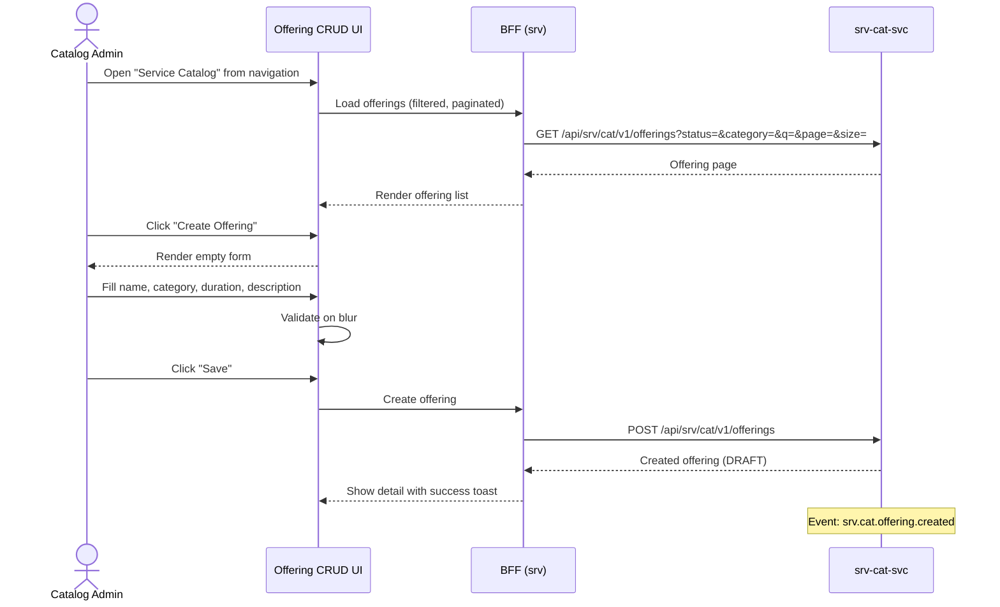

# F-SRV-001-01 — Offering CRUD

> **Conceptual Stack Layer:** Platform-Feature
> **Space:** Platform
> **Owner:** Domain Engineering Team
> **Companion files:** `F-SRV-001-01.uvl` (§9), `F-SRV-001-01.aui.yaml` (§6)
> **Referenced by:** Product Spec SS17, Suite Feature Catalog (`_srv_suite.md` §6)
> **References:** `srv_cat-spec.md` (UC-001: CreateOffering, UC-002: UpdateOffering, UC-006: GetOffering, UC-007: SearchOfferings)

> **Meta Information**
> - **Version:** 2026-04-02
> - **Author(s):** OpenLeap Architecture Team
> - **Status:** DRAFT
> - **Feature ID:** `F-SRV-001-01`
> - **Suite:** `srv` — suite-owned, not product-owned
> - **Node type:** LEAF
> - **Parent:** `F-SRV-001` — see `F-SRV-001.md`
> - **Companion UVL:** `F-SRV-001-01.uvl`
> - **Companion AUI:** `F-SRV-001-01.aui.yaml`
> **Template:** `feature-spec.md` v1.0.0
> **Template Compliance:** ~100% — all sections present

---

## ═══════════════════════════════════════════════
## PROBLEM SPACE
## ═══════════════════════════════════════════════

## 0. Feature Identity & Orientation

### 0.1 One-Line Summary
This feature lets a **catalog administrator** create, view, edit, and search service offerings so that the service catalog is populated and maintained for downstream booking and delivery.

### 0.2 Non-Goals
- Does not manage offering lifecycle states (activate/deactivate/archive) — that is `F-SRV-001-02`.
- Does not manage variants or resource requirements — that is `F-SRV-001-03`.
- Does not create appointments — that is `F-SRV-002-02`.
- Does not define pricing — that is `sd`/`com` (pricing hints are optional metadata).

### 0.3 Entry & Exit Points

**Entry points:**
- Main navigation menu: "Service Catalog" → Offering list
- "Create Offering" action button from the offering list
- Deep link with `offeringId` → opens offering detail directly

**Exit points:**
- Offering saved → stays on detail view
- "Back to list" → returns to offering list
- From offering detail → navigate to `F-SRV-001-02` (lifecycle) or `F-SRV-001-03` (variants)

### 0.4 Variability Points

| Variability | Modelled as | UVL | Default | Binding time |
|---|---|---|---|---|
| Records per page | Attribute | `pagination.pageSize Integer 25` | `25` | `deploy` |
| Show pricing hint fields | Attribute | `display.showPricingHints Boolean false` | `false` | `deploy` |
| Default sort field | Attribute | `pagination.defaultSort String "name,asc"` | `"name,asc"` | `deploy` |

### 0.5 Position in Feature Tree
```
F-SRV-001  Service Catalog Management  [COMPOSITION]
├── F-SRV-001-01  Offering CRUD        [LEAF] [mandatory] ← you are here
├── F-SRV-001-02  Offering Lifecycle   [LEAF] [mandatory]
└── F-SRV-001-03  Variant & Req Mgmt  [LEAF] [optional]
```

### 0.6 Related Documents
| Document | What to find there |
|---|---|
| `F-SRV-001.md` | Parent composition node — variability structure |
| `F-SRV-001-01.uvl` | Companion UVL — attribute schema |
| `F-SRV-001-01.aui.yaml` | Companion AUI — screen contract |
| `srv_cat-spec.md` | Backend: ServiceOffering aggregate, API contracts *(authoritative)* |

---

## 1. User Goal & Scenarios

### 1.1 The User Goal
Maintain a complete and accurate catalog of services that the organization offers, so that schedulers, agents, and customers can find and book the right service with correct details.

### 1.2 User Scenarios

**Scenario 1: Create a new offering**
> A catalog admin at a driving school needs to add "Practical Driving Lesson — B License". They open "Create Offering", fill in name, category "Driving", duration 90 min, and a description. Saved in DRAFT status.

**Scenario 2: Edit an existing offering**
> The school updates lesson duration from 90 to 100 min. The admin opens the offering, edits duration, saves. Optimistic locking prevents concurrent overwrites.

**Scenario 3: Search and filter the catalog**
> An admin searches by name "Driving" and filters by category, seeing all matching offerings with status.

**Scenario 4: View offering detail (read-only)**
> A viewer opens an offering to check details without making changes.

---

## 2. User Journey & Screen Layout

### 2.1 Happy-Path Flow



### 2.2 Screen Layout — Offering List
```
┌──────────────────────────────────────────────────────────┐
│  ZONE: zone-list-header (fixed)                          │
│  ┌─────────────────────────────────────────────────────┐ │
│  │ Search [text]  Category [dropdown]  Status [dropdown]│ │
│  │ [Search]  [Create Offering] (role-gated)             │ │
│  └─────────────────────────────────────────────────────┘ │
├──────────────────────────────────────────────────────────┤
│  ZONE: zone-list (fixed)                                 │
│  ┌─────────────────────────────────────────────────────┐ │
│  │ Name          │ Category │ Status │ Duration │  ⋮   │ │
│  │ Practical B   │ Driving  │ ACTIVE │ 90 min   │ [✎] │ │
│  │ Theory Basics │ Driving  │ DRAFT  │ 45 min   │ [✎] │ │
│  └─────────────────────────────────────────────────────┘ │
├──────────────────────────────────────────────────────────┤
│  ZONE: zone-pagination (fixed)                           │
│  │ Showing 1-25 of 42   [< Prev] [1] [2] [Next >]     │ │
└──────────────────────────────────────────────────────────┘
```

### 2.3 Screen Layout — Offering Form
```
┌──────────────────────────────────────────────────────────┐
│  ZONE: zone-form-header (fixed)                          │
│  │ Offering: [name]           Status: [DRAFT] (badge)   │ │
├──────────────────────────────────────────────────────────┤
│  ZONE: zone-form (fixed)                                 │
│  │ Name*:        [___________________________]          │ │
│  │ Category*:    [dropdown]                              │ │
│  │ Description:  [textarea___________________]          │ │
│  │ Duration*:    [___] minutes                           │ │
├──────────────────────────────────────────────────────────┤
│  ZONE: zone-pricing (feature-gated: display.showPricing) │
│  │ Price Hint:   [___] €      Currency: [EUR ▼]         │ │
│  │ Billing Unit: [SESSION ▼]                             │ │
├──────────────────────────────────────────────────────────┤
│  ZONE: zone-extension (variable)                   [EXT] │
├──────────────────────────────────────────────────────────┤
│  ZONE: zone-actions (fixed)                              │
│  │ [Save] (role-gated)  [Cancel]                        │ │
└──────────────────────────────────────────────────────────┘
```

---

## 3. Interaction Requirements

### 3.1 Fields & Controls
| Field | Type | Source | Required | Validation | Notes |
|---|---|---|---|---|---|
| Name | input | User | Yes | max 255; unique per tenant | |
| Category | dropdown | Reference data | Yes | Must exist | |
| Description | textarea | User | No | max 2000 chars | |
| Duration (min) | number | User | Yes | min 1, integer | |
| Price Hint | number | User | No | Gated by attr; positive if set | Non-authoritative |
| Currency | dropdown | ISO 4217 | No | Gated | |
| Billing Unit | dropdown | Enum | No | SESSION/HOUR/FLAT | |

### 3.2 Actions
| Action | Visible when | Enabled when | Role | Mutation? | API call |
|---|---|---|---|---|---|
| Search | Always | — | `SRV_CAT_VIEWER` | No | `GET /offerings?...` |
| Create | List view | — | `SRV_CAT_EDITOR` | No (opens form) | — |
| Save | Form view | Required fields valid | `SRV_CAT_EDITOR` | Yes | `POST/PATCH /offerings` |
| Edit | List/detail | — | `SRV_CAT_EDITOR` | No (opens form) | — |
| Cancel | Form view | Always | Any | No | — |

---

## 4. Edge Cases & Attribute-Driven Behaviour

### 4.1 Edge Cases
| ID | Condition | Expected behaviour |
|---|---|---|
| EC-001 | Duplicate name | Error: "An offering with this name already exists." |
| EC-002 | 412 conflict | Banner: "This offering was updated by another user. Reload." |
| EC-003 | `srv-cat-svc` down | Error banner: "Service catalog temporarily unavailable." |
| EC-004 | Category ref data unavailable | Dropdown disabled with warning |
| EC-005 | Deep link invalid `offeringId` | Error: "Offering not found." |

### 4.3 Attribute-Driven Behaviour
| Attribute | Non-default | Observable change |
|---|---|---|
| `display.showPricingHints` | `true` | Pricing section visible on form |
| `pagination.pageSize` | `50` | 50 offerings per page |
| `pagination.defaultSort` | `"createdAt,desc"` | Sorted by creation date |

---

## ═══════════════════════════════════════════════
## SOLUTION SPACE
## ═══════════════════════════════════════════════

## 5. Backend Dependencies & BFF Composition

### 5.1 Service Calls
| # | Service | Endpoint | Method | Tier | isMutation | Failure mode |
|---|---------|----------|--------|------|------------|-------------|
| 1 | `srv-cat-svc` | `/api/srv/cat/v1/offerings` | GET | T1 | No | Block |
| 2 | `srv-cat-svc` | `/api/srv/cat/v1/offerings` | POST | T1 | Yes | Block |
| 3 | `srv-cat-svc` | `/api/srv/cat/v1/offerings/{id}` | GET | T1 | No | Block |
| 4 | `srv-cat-svc` | `/api/srv/cat/v1/offerings/{id}` | PATCH | T1 | Yes | Block |

### 5.2 BFF View Model
```jsonc
{
  "offerings": [
    {
      "id": "uuid", "name": "Practical Driving Lesson — B License",
      "category": "Driving", "status": "ACTIVE", "durationMinutes": 90,
      "createdAt": "2026-01-15T10:00:00Z", "updatedAt": "2026-03-20T14:30:00Z", "version": 3
    }
  ],
  "pagination": { "page": 0, "size": 25, "totalElements": 42, "totalPages": 2 },
  "offering": {
    "id": "uuid", "name": "...", "category": "Driving",
    "description": "Standard practical driving lesson.",
    "durationMinutes": 90, "status": "DRAFT",
    "priceHint": 65.00,         // null if display.showPricingHints = false
    "currencyCode": "EUR",       // null if no price hint
    "billingUnitCode": "SESSION",
    "version": 3, "createdAt": "...", "updatedAt": "..."
  },
  "categories": ["Driving", "Safety", "Theory", "Workshop"],
  "allowedActions": ["save", "cancel"]
}
```

### 5.3 Feature-Gating Rules
| Mode | Behaviour |
|---|---|
| `full` | All controls visible per role |
| `read-only` | List/detail viewable; Create/Edit/Save hidden |
| `excluded` | "Service Catalog" removed from navigation |

### 5.5 Caching Hints
| Data | TTL | Invalidation |
|---|---|---|
| Offering list | No cache | User-initiated search |
| Categories | 10 min | Rarely changes |

### 5.6 i18n Keys
| Key | Default (en) |
|---|---|
| `srv.cat.crud.title` | "Service Catalog" |
| `srv.cat.crud.createAction` | "Create Offering" |
| `srv.cat.crud.saveAction` | "Save" |
| `srv.cat.crud.nameLabel` | "Name" |
| `srv.cat.crud.categoryLabel` | "Category" |
| `srv.cat.crud.descriptionLabel` | "Description" |
| `srv.cat.crud.durationLabel` | "Duration (minutes)" |
| `srv.cat.crud.priceHintLabel` | "Price Hint" |
| `srv.cat.crud.duplicateName` | "An offering with this name already exists." |
| `srv.cat.crud.concurrentMod` | "This offering was updated by another user. Reload." |
| `srv.cat.crud.notFound` | "Offering not found." |
| `srv.cat.crud.unavailable` | "Service catalog temporarily unavailable." |

---

## 6. Screen Contract (AUI)
> Full contract in `F-SRV-001-01.aui.yaml`.

### 6.1 Task Model
```
alternative(
  sequential(load-list, enabling(view-list ← load-list), optional(create-new)),
  sequential(load-detail, enabling(view-detail ← load-detail), optional(edit), enabling(save ← edit))
)
```

### 6.2 Zones
| Zone ID | Name | Type | Priority |
|---|---|---|---|
| `zone-list-header` | Search & Actions | fixed | 1 |
| `zone-list` | Offering Table | fixed | 2 |
| `zone-pagination` | Pagination | fixed | 3 |
| `zone-form-header` | Form Header | fixed | 1 |
| `zone-form` | Offering Form | fixed | 2 |
| `zone-pricing` | Pricing Hints | feature-gated | 3 |
| `zone-extension` | Extension Area | variable | 4 |
| `zone-actions` | Actions | fixed | 99 |

### 6.3 Absent-Rules
| Zone | Condition | Rule |
|---|---|---|
| `zone-pricing` | `display.showPricingHints` = false | `panel-section-hidden` |
| `zone-extension` | No extension point filled | `collapse-up` |

---

## ═══════════════════════════════════════════════
## BRIDGE ARTIFACTS
## ═══════════════════════════════════════════════

## 7. Permissions & Accessibility

### 7.1 Permission Matrix
| Action | `SRV_CAT_VIEWER` | `SRV_CAT_EDITOR` | `SRV_CAT_ADMIN` |
|---|---|---|---|
| View/search | ✓ | ✓ | ✓ |
| Create | — | ✓ | ✓ |
| Edit | — | ✓ | ✓ |

### 7.2 Accessibility
- Table headers with `scope="col"`. Focus to first result after search.
- Validation errors via `aria-describedby`. Toast via `aria-live="polite"`.

---

## 8. Acceptance Criteria

**AC-001: Happy path — Create offering**
- Given editor clicks "Create Offering" and fills required fields → offering DRAFT, success toast, event emitted.

**AC-002: Validation — required field blank**
- Given name blank → "Name is required", focus on name.

**AC-003: Validation — duplicate name**
- Given duplicate name → "An offering with this name already exists."

**AC-004: Concurrent modification**
- Given 412 → "This offering was updated by another user. Reload."

**AC-005: Permission — viewer**
- Given viewer → Create/Edit absent from DOM.

**AC-006: Attribute — pricing hints visible**
- Given `display.showPricingHints` = true → pricing section rendered.

**AC-007: Attribute — pricing hints hidden**
- Given default → pricing section not rendered.

**AC-008: Feature-gating — read-only**
- Given read-only → list/detail visible, write buttons hidden.

**AC-009: Feature-gating — excluded**
- Given excluded → "Service Catalog" not in navigation.

**AC-010: Extension zone — unfilled**
- Given no extension → zone hidden.

**AC-011: Deep link**
- Given valid `offeringId` → detail shown directly.

**AC-012: Service unavailable**
- Given `srv-cat-svc` down → error banner.

---

## 9. Dependencies, Variability & Extension Points

### 9.1 Feature Dependencies
No cross-suite requires. Catalog is upstream.

### 9.2 Attributes
| Attribute | Type | Default | Binding Time |
|---|---|---|---|
| `pagination.pageSize` | Integer | 25 | deploy |
| `display.showPricingHints` | Boolean | false | deploy |
| `pagination.defaultSort` | String | "name,asc" | deploy |

### 9.3 Extension Points
| ID | Type | Description | Default |
|---|---|---|---|
| `ext.offering.customFields` | zone | Custom fields on form | Hidden |

---

## 10. Change Log & Review
### 10.1 Open Questions
| ID | Question | Impact | Owner | Needed by |
|---|---|---|---|---|
| Q-001 | Pricing hints here or in sd/com? | Affects attribute default | TBD | Phase 1 |
| Q-002 | Categories hardcoded or ref-data? | Affects dropdown source | TBD | Phase 1 |

### 10.2 Change Log
| Date | Version | Author | Changes |
|---|---|---|---|
| 2026-04-02 | 1.0 | OpenLeap Architecture Team | Initial spec |

### 10.3 Review & Approval
**Status:** DRAFT
