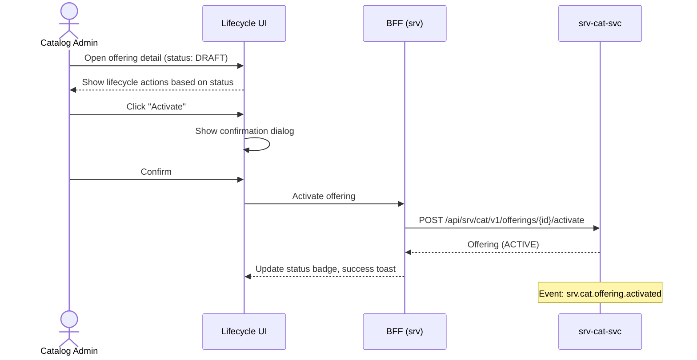

# F-SRV-001-02 — Offering Lifecycle

> **Conceptual Stack Layer:** Platform-Feature
> **Space:** Platform | **Suite:** `srv` | **Node type:** LEAF
> **Parent:** `F-SRV-001` | **Companion UVL:** `F-SRV-001-02.uvl` | **Companion AUI:** `F-SRV-001-02.aui.yaml`
> **Version:** 2026-04-02 | **Status:** DRAFT
> **References:** `srv_cat-spec.md` (ServiceOffering lifecycle states)
> **Template:** `feature-spec.md` v1.0.0
> **Template Compliance:** ~100% — all sections present

---

## ═══════════════════════════════════════════════
## PROBLEM SPACE
## ═══════════════════════════════════════════════

## 0. Feature Identity & Orientation

### 0.1 One-Line Summary
This feature lets a **catalog administrator** manage the lifecycle states (activate, deactivate, archive) of service offerings so that only approved offerings are available for booking.

### 0.2 Non-Goals
- Does not create or edit offering data — that is `F-SRV-001-01`.
- Does not manage variants — that is `F-SRV-001-03`.
- Does not manage appointments — that is `F-SRV-002-02`.

### 0.3 Entry & Exit Points
**Entry points:** From offering detail view (`F-SRV-001-01`) — lifecycle action buttons based on current status.
**Exit points:** Status changed → offering detail refreshes; event emitted downstream (booking stops accepting INACTIVE offerings).

### 0.4 Variability Points
| Variability | Modelled as | UVL | Default | Binding time |
|---|---|---|---|---|
| Require approval before activation | Attribute | `lifecycle.requireApproval Boolean false` | `false` | `deploy` |
| Auto-archive after days inactive | Attribute | `lifecycle.archiveAfterDays Integer 365` | `365` | `deploy` |

### 0.5 Position in Feature Tree
```
F-SRV-001  Service Catalog Management  [COMPOSITION]
├── F-SRV-001-01  Offering CRUD        [LEAF] [mandatory]
├── F-SRV-001-02  Offering Lifecycle   [LEAF] [mandatory] ← you are here
└── F-SRV-001-03  Variant & Req Mgmt  [LEAF] [optional]
```

---

## 1. User Goal & Scenarios

### 1.1 The User Goal
Control which offerings are visible and bookable, ensuring only validated offerings reach customers and outdated ones are properly retired.

### 1.2 User Scenarios

**Scenario 1: Activate a new offering**
> Admin reviews a DRAFT offering, verifies completeness, clicks 'Activate'. Offering becomes bookable. Event `srv.cat.offering.activated` emitted.

**Scenario 2: Deactivate for seasonal pause**
> A summer-only offering is paused in winter. Admin clicks 'Deactivate'; existing appointments unaffected but no new bookings.

**Scenario 3: Archive a discontinued offering**
> An offering is retired. Admin archives it; remains for history but hidden from active catalogs.

---

## 2. User Journey & Screen Layout

### 2.1 Happy-Path Flow



### 2.2 Screen Layout

The lifecycle actions are rendered as contextual buttons within the offering detail view (`F-SRV-001-01`). Actions change based on current status:

```
┌──────────────────────────────────────────────────────────┐
│  [Within F-SRV-001-01 zone-actions, status-dependent]    │
│  ┌─────────────────────────────────────────────────────┐ │
│  │ Status: [DRAFT]                                      │ │
│  │ [Activate] (SRV_CAT_EDITOR)                          │ │
│  ├─────────────────────────────────────────────────────┤ │
│  │ Status: [ACTIVE]                                     │ │
│  │ [Deactivate] (SRV_CAT_EDITOR)  [Archive] (ADMIN)    │ │
│  ├─────────────────────────────────────────────────────┤ │
│  │ Status: [INACTIVE]                                   │ │
│  │ [Reactivate] (SRV_CAT_EDITOR)  [Archive] (ADMIN)    │ │
│  └─────────────────────────────────────────────────────┘ │
└──────────────────────────────────────────────────────────┘

┌──────────────────────────────────────────────────────────┐
│  Activation Confirmation Dialog (if requireApproval)     │
│  ┌─────────────────────────────────────────────────────┐ │
│  │ "Activate this offering? It will become bookable."   │ │
│  │ [Confirm]  [Cancel]                                  │ │
│  └─────────────────────────────────────────────────────┘ │
└──────────────────────────────────────────────────────────┘
```

---

## 3. Interaction Requirements

### 3.1 Fields & Controls
| Field | Type | Source | Required | Validation | Notes |
|---|---|---|---|---|---|
| Confirmation dialog | modal | System | — | — | Shown before each lifecycle transition |

### 3.2 Actions
| Action | Visible when | Enabled when | Role | Mutation? | API call |
|---|---|---|---|---|---|
| Activate | Status = DRAFT or INACTIVE | — | `SRV_CAT_EDITOR` | Yes | `POST /offerings/{id}/activate` |
| Deactivate | Status = ACTIVE | — | `SRV_CAT_EDITOR` | Yes | `POST /offerings/{id}/deactivate` |
| Reactivate | Status = INACTIVE | — | `SRV_CAT_EDITOR` | Yes | `POST /offerings/{id}/activate` |
| Archive | Status = ACTIVE or INACTIVE | — | `SRV_CAT_ADMIN` | Yes | `POST /offerings/{id}/archive` |

---

## 4. Edge Cases & Attribute-Driven Behaviour

### 4.1 Edge Cases
| ID | Condition | Expected behaviour |
|---|---|---|
| EC-001 | `lifecycle.requireApproval` = true | Show 'Submit for Approval' instead of 'Activate'; OPEN QUESTION: approval workflow |
| EC-002 | Archive with active appointments | Warning: 'There are N active appointments. Archive anyway?' Requires confirmation. |
| EC-003 | Deactivate with upcoming bookings | Warning shown but deactivation proceeds (existing appointments honored, no new ones). |
| EC-004 | Offering already in target state | Action button not visible (status-driven visibility). |

### 4.3 Attribute-Driven Behaviour
| Attribute | Non-default value | Observable change |
|---|---|---|
| `lifecycle.requireApproval` | `true` | 'Submit for Approval' shown instead of 'Activate' |
| `lifecycle.archiveAfterDays` | `90` | System auto-archives offerings inactive > 90 days |

---

## ═══════════════════════════════════════════════
## SOLUTION SPACE
## ═══════════════════════════════════════════════

## 5. Backend Dependencies & BFF Composition

### 5.1 Service Calls
| # | Service | Endpoint | Method | Tier | isMutation | Failure mode |
|---|---------|----------|--------|------|------------|-------------|
| 1 | `srv-cat-svc` | `/api/srv/cat/v1/offerings/{id}/activate` | POST | T1 | Yes | Block: show error |
| 2 | `srv-cat-svc` | `/api/srv/cat/v1/offerings/{id}/deactivate` | POST | T1 | Yes | Block: show error |
| 3 | `srv-cat-svc` | `/api/srv/cat/v1/offerings/{id}/archive` | POST | T1 | Yes | Block: show error |

### 5.2 BFF View Model
```jsonc
{
  "offering": {
    "id": "uuid",
    "name": "Practical Driving Lesson — B License",
    "status": "DRAFT",
    "version": 3
  },
  "allowedLifecycleActions": ["activate"],  // computed from status + role + attributes
  "activeAppointmentCount": 0               // for archive warning
}
```

### 5.3 Feature-Gating Rules
| Mode | Behaviour |
|---|---|
| `full` | All lifecycle actions per status and role |
| `read-only` | Status visible; lifecycle buttons hidden |
| `excluded` | Lifecycle actions not available |

### 5.6 i18n Keys
| Key | Default (en) |
|---|---|
| `srv.cat.lifecycle.activateAction` | "Activate" |
| `srv.cat.lifecycle.deactivateAction` | "Deactivate" |
| `srv.cat.lifecycle.archiveAction` | "Archive" |
| `srv.cat.lifecycle.reactivateAction` | "Reactivate" |
| `srv.cat.lifecycle.submitForApproval` | "Submit for Approval" |
| `srv.cat.lifecycle.activateConfirm` | "Activate this offering? It will become bookable." |
| `srv.cat.lifecycle.archiveWarning` | "There are {count} active appointments using this offering. Archive anyway?" |
| `srv.cat.lifecycle.deactivateWarning` | "Existing appointments will be honored. No new bookings will be accepted." |

---

## 6. Screen Contract (AUI)
> Full contract in `F-SRV-001-02.aui.yaml`.

---

## ═══════════════════════════════════════════════
## BRIDGE ARTIFACTS
## ═══════════════════════════════════════════════

## 7. Permissions & Accessibility

### 7.1 Permission Matrix
| Action | `SRV_CAT_VIEWER` | `SRV_CAT_EDITOR` | `SRV_CAT_ADMIN` |
|---|---|---|---|
| View status | ✓ | ✓ | ✓ |
| Activate / Deactivate | — | ✓ | ✓ |
| Archive | — | — | ✓ |

### 7.2 Accessibility
- Status changes announced via `aria-live` region.
- Confirmation dialogs trap focus.
- Action buttons have descriptive `aria-label`.

---

## 8. Acceptance Criteria

**AC-001:** Given DRAFT offering → editor clicks Activate → status ACTIVE, event `srv.cat.offering.activated` emitted.

**AC-002:** Given ACTIVE offering → editor clicks Deactivate → status INACTIVE, event emitted.

**AC-003:** Given INACTIVE offering → editor clicks Reactivate → status ACTIVE.

**AC-004:** Given ACTIVE/INACTIVE → admin clicks Archive → status ARCHIVED.

**AC-005:** Given `lifecycle.requireApproval` = true → 'Submit for Approval' shown instead of 'Activate'.

**AC-006:** Given viewer role → lifecycle buttons absent from DOM.

**AC-007:** Given archive with N > 0 active appointments → warning dialog shown with count.

**AC-008:** Given feature excluded → lifecycle actions not available.

**AC-009:** Given already ARCHIVED → no lifecycle actions visible.

---

## 9. Dependencies, Variability & Extension Points

### 9.1 Feature Dependencies
No cross-suite requires.

### 9.2 Attributes
| Attribute | Type | Default | Binding Time |
|---|---|---|---|
| `lifecycle.requireApproval` | `Boolean` | `false` | `deploy` |
| `lifecycle.archiveAfterDays` | `Integer` | `365` | `deploy` |

### 9.3 Extension Points
| ID | Type | Description | Default |
|---|---|---|---|
| `ext.lifecycle.preActivateValidation` | rule | Custom validation before activation (e.g., completeness check) | Allow |

---

## 10. Change Log & Review

### 10.1 Open Questions
| ID | Question | Impact | Owner | Needed by |
|---|---|---|---|---|
| Q-001 | How does the approval workflow work when `requireApproval` = true? | Affects UI flow and integration | TBD | Phase 2 |

### 10.2 Change Log
| Date | Version | Author | Changes |
|---|---|---|---|
| 2026-04-02 | 1.0 | OpenLeap Architecture Team | Initial spec |

### 10.3 Review & Approval
**Status:** DRAFT
