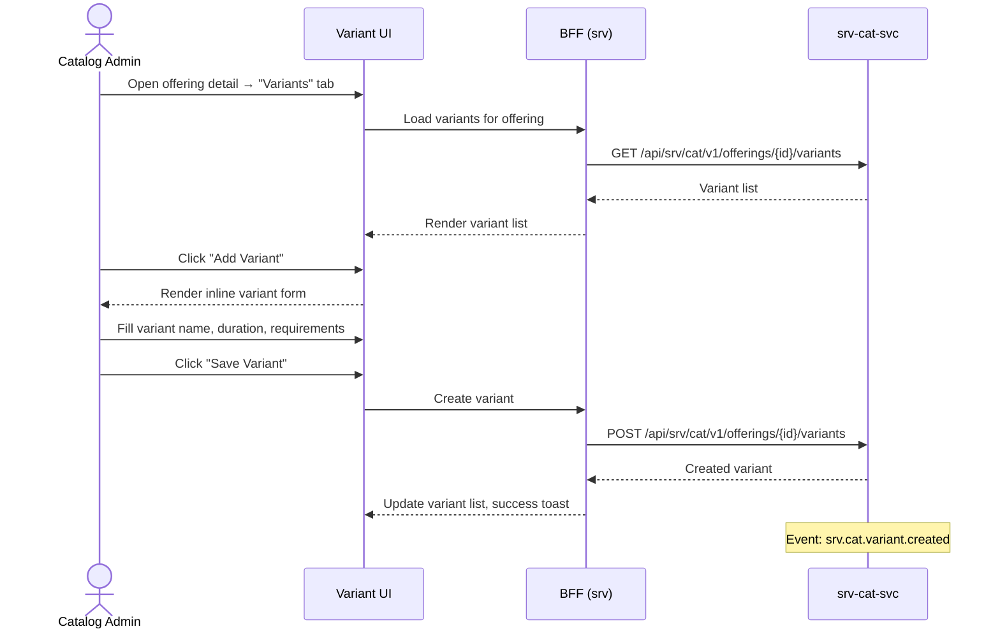

# F-SRV-001-03 — Variant & Requirement Management

> **Conceptual Stack Layer:** Platform-Feature
> **Suite:** `srv` | **Node type:** LEAF | **Parent:** `F-SRV-001`
> **Companion UVL:** `F-SRV-001-03.uvl` | **Companion AUI:** `F-SRV-001-03.aui.yaml`
> **Version:** 2026-04-02 | **Status:** DRAFT
> **References:** `srv_cat-spec.md` (OfferingVariant entity, Requirement entity)
> **Template:** `feature-spec.md` v1.0.0
> **Template Compliance:** ~90% — missing: AUI Contract (SS6)

---

## ═══════════════════════════════════════════════
## PROBLEM SPACE
## ═══════════════════════════════════════════════

## 0. Feature Identity & Orientation

### 0.1 One-Line Summary
This feature lets a **catalog administrator** create and manage offering variants (e.g., different durations or skill levels) and resource requirements so that booking and scheduling can match resources to specific variant needs.

### 0.2 Non-Goals
- Does not manage base offering data — that is `F-SRV-001-01`.
- Does not manage offering lifecycle — that is `F-SRV-001-02`.
- Does not assign resources to appointments — that is `F-SRV-003-01`.
- Does not check resource eligibility at runtime — that is `F-SRV-003-03` via `srv.res`.

### 0.3 Entry & Exit Points
**Entry points:** From offering detail (`F-SRV-001-01`) → "Variants" tab/section.
**Exit points:** Variant saved → stays on offering detail; event `srv.cat.variant.created` / `.updated` emitted.

### 0.4 Variability Points
| Variability | Modelled as | UVL | Default | Binding time |
|---|---|---|---|---|
| Max variants per offering | Attribute | `variant.maxPerOffering Integer 10` | `10` | `deploy` |
| Show requirements section | Attribute | `variant.showRequirements Boolean true` | `true` | `deploy` |

### 0.5 Position in Feature Tree
```
F-SRV-001  Service Catalog Management  [COMPOSITION]
├── F-SRV-001-01  Offering CRUD        [LEAF] [mandatory]
├── F-SRV-001-02  Offering Lifecycle   [LEAF] [mandatory]
└── F-SRV-001-03  Variant & Req Mgmt  [LEAF] [optional] ← you are here
```

---

## 1. User Goal & Scenarios

### 1.1 The User Goal
Define the specific variants of a service and the resource qualifications needed, so that booking systems can present accurate options and match the right resources.

### 1.2 User Scenarios

**Scenario 1: Add a variant with specific duration**
> Admin adds variant "90 min — Highway driving" to "Practical Lesson — B License" with different duration and instructor skill requirement "Highway-Certified".

**Scenario 2: Define resource requirements on a variant**
> Admin attaches requirement "Skill: B-License-Instructor" to a variant so that only qualified instructors appear in slot discovery.

**Scenario 3: Edit an existing variant**
> Admin changes the duration of a variant from 90 to 100 min. Existing appointments using this variant are unaffected.

---

## 2. User Journey & Screen Layout

### 2.1 Happy-Path Flow



### 2.2 Screen Layout
```
┌──────────────────────────────────────────────────────────┐
│  ZONE: zone-variant-list (fixed)                         │
│  ┌─────────────────────────────────────────────────────┐ │
│  │ Variant Name     │ Duration │ Requirements │ Actions│ │
│  │──────────────────┼──────────┼──────────────┼────────│ │
│  │ Highway driving  │ 90 min   │ Highway-Cert │ [✎][✕]│ │
│  │ City driving     │ 60 min   │ B-License    │ [✎][✕]│ │
│  │                                                      │ │
│  │ [Add Variant] (disabled if max reached)              │ │
│  └─────────────────────────────────────────────────────┘ │
├──────────────────────────────────────────────────────────┤
│  ZONE: zone-variant-form (fixed, inline expand)          │
│  ┌─────────────────────────────────────────────────────┐ │
│  │ Variant Name*: [___________________]                 │ │
│  │ Duration (min): [___] (overrides base if set)        │ │
│  │ Price Hint Override: [___] (gated)                   │ │
│  └─────────────────────────────────────────────────────┘ │
├──────────────────────────────────────────────────────────┤
│  ZONE: zone-requirements (feature-gated)                 │
│  ┌─────────────────────────────────────────────────────┐ │
│  │ Requirements:                                        │ │
│  │ Resource Type: [PERSON ▼]                            │ │
│  │ Skill Tags: [B-License] [Highway-Cert] [+ Add]      │ │
│  │ Min Capacity: [___]                                  │ │
│  └─────────────────────────────────────────────────────┘ │
├──────────────────────────────────────────────────────────┤
│  ZONE: zone-extension (variable)                   [EXT] │
├──────────────────────────────────────────────────────────┤
│  ZONE: zone-actions (fixed)                              │
│  │ [Save Variant] [Cancel]                              │ │
└──────────────────────────────────────────────────────────┘
```

---

## 3. Interaction Requirements

### 3.1 Fields & Controls
| Field | Type | Source | Required | Validation | Notes |
|---|---|---|---|---|---|
| Variant Name | input | User | Yes | max 255; unique within offering | |
| Duration Override | number | User | No | min 1 if set; overrides base offering duration | |
| Price Hint Override | number | User | No | Gated by `display.showPricingHints` on parent | |
| Resource Type | dropdown | Enum (PERSON/ROOM/ASSET) | No | Gated by `variant.showRequirements` | |
| Skill Tags | tag input | User / reference data | No | Gated by `variant.showRequirements` | |

### 3.2 Actions
| Action | Visible when | Enabled when | Role | Mutation? | API call |
|---|---|---|---|---|---|
| Add Variant | Always | Count < `maxPerOffering` | `SRV_CAT_EDITOR` | No (opens inline form) | — |
| Save Variant | Form open | Required fields valid | `SRV_CAT_EDITOR` | Yes | `POST/PATCH /variants` |
| Delete Variant | Per-row | — | `SRV_CAT_EDITOR` | Yes | `DELETE /variants/{vid}` |

---

## 4. Edge Cases & Attribute-Driven Behaviour

### 4.1 Edge Cases
| ID | Condition | Expected behaviour |
|---|---|---|
| EC-001 | Max variants reached | "Add Variant" button disabled; tooltip: "Maximum {N} variants reached." |
| EC-002 | Duplicate variant name within offering | Error: "A variant with this name already exists for this offering." |
| EC-003 | Delete variant used by existing appointments | Warning: "This variant is referenced by N appointments. Delete anyway?" |
| EC-004 | Skill tag not found in reference data | Tag accepted as free-text; validation warning (non-blocking). |

### 4.3 Attribute-Driven Behaviour
| Attribute | Non-default value | Observable change |
|---|---|---|
| `variant.maxPerOffering` | `5` | Add Variant disabled after 5 |
| `variant.showRequirements` | `false` | Requirements section hidden |

---

## ═══════════════════════════════════════════════
## SOLUTION SPACE
## ═══════════════════════════════════════════════

## 5. Backend Dependencies & BFF Composition

### 5.1 Service Calls
| # | Service | Endpoint | Method | Tier | isMutation | Failure mode |
|---|---------|----------|--------|------|------------|-------------|
| 1 | `srv-cat-svc` | `/api/srv/cat/v1/offerings/{id}/variants` | GET | T1 | No | Block |
| 2 | `srv-cat-svc` | `/api/srv/cat/v1/offerings/{id}/variants` | POST | T1 | Yes | Block |
| 3 | `srv-cat-svc` | `/api/srv/cat/v1/offerings/{id}/variants/{vid}` | PATCH | T1 | Yes | Block |
| 4 | `srv-cat-svc` | `/api/srv/cat/v1/offerings/{id}/variants/{vid}` | DELETE | T1 | Yes | Block |

### 5.2 BFF View Model
```jsonc
{
  "variants": [
    {
      "id": "uuid", "name": "Highway driving", "durationMinutes": 90,
      "requirements": [
        { "resourceType": "PERSON", "skillTags": ["B-License", "Highway-Cert"] }
      ]
    }
  ],
  "variantCount": 2,
  "maxVariants": 10,  // from variant.maxPerOffering
  "canAddMore": true
}
```

### 5.6 i18n Keys
| Key | Default (en) |
|---|---|
| `srv.cat.variant.title` | "Variants" |
| `srv.cat.variant.addAction` | "Add Variant" |
| `srv.cat.variant.saveAction` | "Save Variant" |
| `srv.cat.variant.deleteAction` | "Delete" |
| `srv.cat.variant.nameLabel` | "Variant Name" |
| `srv.cat.variant.durationLabel` | "Duration Override (minutes)" |
| `srv.cat.variant.requirementsLabel` | "Resource Requirements" |
| `srv.cat.variant.skillTagsLabel` | "Skill Tags" |
| `srv.cat.variant.maxReached` | "Maximum {count} variants reached." |
| `srv.cat.variant.duplicateName` | "A variant with this name already exists for this offering." |
| `srv.cat.variant.deleteWarning` | "This variant is referenced by {count} appointments. Delete anyway?" |

---

## 7. Permissions & Accessibility

### 7.1 Permission Matrix
| Action | `SRV_CAT_VIEWER` | `SRV_CAT_EDITOR` | `SRV_CAT_ADMIN` |
|---|---|---|---|
| View variants | ✓ | ✓ | ✓ |
| Add/edit/delete | — | ✓ | ✓ |

### 7.2 Accessibility
- Tag input supports keyboard: type + Enter to add, Backspace to remove last.
- Inline form expansion announced via `aria-expanded`.

---

## 8. Acceptance Criteria

**AC-001:** Given editor clicks "Add Variant" and fills name → variant created, list refreshes.

**AC-002:** Given max variants reached → "Add Variant" disabled with tooltip.

**AC-003:** Given duplicate variant name → error shown.

**AC-004:** Given `variant.showRequirements` = false → requirements section hidden.

**AC-005:** Given viewer role → add/edit/delete absent from DOM.

**AC-006:** Given delete with N > 0 appointments → warning dialog with count.

**AC-007:** Given feature excluded → "Variants" tab not visible on offering detail.

**AC-008:** Given extension zone unfilled → zone hidden (`collapse-up`).

---

## 9. Dependencies, Variability & Extension Points

### 9.1 Feature Dependencies
| Required Feature | Suite | Access Type | Reason |
|---|---|---|---|
| `F-SRV-001-01` | `srv` | READ_WRITE | Variants are children of offerings |

### 9.2 Attributes
| Attribute | Type | Default | Binding Time |
|---|---|---|---|
| `variant.maxPerOffering` | Integer | 10 | deploy |
| `variant.showRequirements` | Boolean | true | deploy |

### 9.3 Extension Points
| ID | Type | Description | Default |
|---|---|---|---|
| `ext.variant.customFields` | zone | Custom variant metadata | Hidden |

---

## 10. Change Log & Review

### 10.1 Open Questions
| ID | Question | Impact | Owner | Needed by |
|---|---|---|---|---|
| Q-001 | Should skill tags come from a shared reference catalog (T2) or be free-text? | Validation rules | TBD | Phase 1 |

### 10.2 Change Log
| Date | Version | Author | Changes |
|---|---|---|---|
| 2026-04-02 | 1.0 | OpenLeap Architecture Team | Initial spec |

### 10.3 Review & Approval
**Status:** DRAFT
