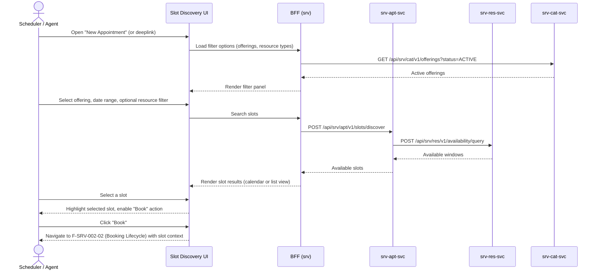

# F-SRV-002-01 — Slot Discovery

> **Conceptual Stack Layer:** Platform-Feature
> **Space:** Platform
> **Owner:** Domain Engineering Team
> **Companion files:** `F-SRV-002-01.uvl` (§9), `F-SRV-002-01.aui.yaml` (§6)
> **Referenced by:** Product Spec SS17 (Feature Selection), Suite Feature Catalog (`_srv_suite.md` §6)
> **References:** `srv_apt-spec.md` (UC-001: DiscoverSlots), `srv_res-spec.md` (UC-004: QueryAvailability)

> **Meta Information**
> - **Version:** 2026-04-02
> - **Author(s):** OpenLeap Architecture Team
> - **Status:** DRAFT
> - **Feature ID:** `F-SRV-002-01`
> - **Suite:** `srv` — suite-owned, not product-owned
> - **Node type:** LEAF
> - **Parent:** `F-SRV-002` — see `F-SRV-002.md`
> - **Companion UVL:** `F-SRV-002-01.uvl`
> - **Companion AUI:** `F-SRV-002-01.aui.yaml`

> **What this document is — and isn't**
>
> This spec describes the **Slot Discovery** UI capability: how a user finds
> available time slots for a service. It is a problem-space-first spec.
>
> **Problem Space (SS0-SS4):** What the user sees and does.
> **Solution Space (SS5-SS6):** Which backend services this feature calls
> and how the BFF composes the view model.
> **Bridge Artifacts (SS7-SS9):** Permissions, acceptance criteria, variability.
> **Template:** `feature-spec.md` v1.0.0
> **Template Compliance:** ~100% — all sections present

---

## ═══════════════════════════════════════════════
## PROBLEM SPACE  (stable — user-facing)
## ═══════════════════════════════════════════════

## 0. Feature Identity & Orientation

### 0.1 One-Line Summary

This feature lets a **scheduler or customer-facing agent** search for available time slots for a service offering so that they can proceed to book an appointment.

### 0.2 Non-Goals

- Does not create or confirm bookings — that is `F-SRV-002-02` (Booking Lifecycle).
- Does not manage resource availability windows — that is `F-SRV-003-02` (Availability Management).
- Does not manage service offering definitions — that is `F-SRV-001-01` (Offering CRUD).
- Does not show waitlist options for full slots — that is `F-SRV-002-03` (Waitlist Management).

### 0.3 Entry & Exit Points

**Entry points:**
- From the main navigation menu: "New Appointment" → lands on Slot Discovery
- From a customer detail view: "Book Service" action button
- Deep link with pre-filled `serviceOfferingId` and optional `customerPartyId`

**Exit points:**
- Slot selected → navigates to `F-SRV-002-02` (Booking Lifecycle) with selected slot context
- No suitable slots → offers "Join Waitlist" if `F-SRV-002-03` is active (feature-gated)
- User cancels → returns to previous screen

### 0.4 Variability Points

| Variability | Modelled as | UVL | Default | Binding time |
|---|---|---|---|---|
| Calendar view mode (day/week) | Attribute | `view.defaultMode String "week"` | `"week"` | `deploy` |
| Lookahead window (days) | Attribute | `search.lookaheadDays Integer 14` | `14` | `deploy` |
| Show resource names to user | Attribute | `display.showResourceName Boolean true` | `true` | `deploy` |
| Records per page (list view) | Attribute | `pagination.pageSize Integer 20` | `20` | `deploy` |

### 0.5 Position in Feature Tree

```
F-SRV-002  Appointment & Booking     [COMPOSITION]
├── F-SRV-002-01  Slot Discovery     [LEAF] [mandatory] ← you are here
├── F-SRV-002-02  Booking Lifecycle  [LEAF] [mandatory]
├── F-SRV-002-03  Waitlist Management [LEAF] [optional]
└── F-SRV-002-04  No-Show Handling   [LEAF] [optional]
```

### 0.6 Related Documents

| Document | What to find there |
|---|---|
| `F-SRV-002.md` | Parent composition node — variability structure, valid configurations |
| `F-SRV-002-01.uvl` | Companion UVL — attribute schema, cross-suite requires |
| `F-SRV-002-01.aui.yaml` | Companion AUI — screen contract (task model, zones, absent-rules) |
| `_srv_suite.md` §6 | Suite Feature Catalog — feature tree, mandatory features |
| `srv_apt-spec.md` | Backend: UC-001 DiscoverSlots, API contracts *(authoritative)* |
| `srv_res-spec.md` | Backend: UC-004 QueryAvailability *(authoritative)* |
| `srv_cat-spec.md` | Backend: service offering lookup *(authoritative)* |

---

## 1. User Goal & Scenarios

### 1.1 The User Goal

Find the best available time slot for a specific service, considering the customer's preferences, resource qualifications, and location constraints, so that a booking can be initiated quickly and accurately.

### 1.2 User Scenarios

**Scenario 1: Scheduler books a driving lesson**
> A scheduler at a driving school wants to find a 90-minute slot for a customer's first practical driving lesson. They select the "Practical Lesson — B License" offering, optionally filter by a preferred instructor, and see available slots for the next two weeks. They pick a morning slot and proceed to booking.

**Scenario 2: Agent books on behalf of a walk-in customer**
> A front-desk agent receives a walk-in customer who wants a physiotherapy session. The agent opens Slot Discovery from the customer's profile, the offering is pre-filled, and they immediately see today's and tomorrow's remaining slots. They select the earliest available and proceed.

**Scenario 3: Scheduler searches across multiple resources**
> A scheduler needs to book a consultation room and a specific specialist for a joint session. They filter by offering type; the system shows only slots where both the specialist and a suitable room are simultaneously available.

---

## 2. User Journey & Screen Layout

### 2.1 Happy-Path Flow



### 2.2 Screen Layout

```
┌──────────────────────────────────────────────────────────┐
│  ZONE: zone-header (fixed)                               │
│  ┌─────────────────────────────────────────────────────┐ │
│  │ Service Offering [dropdown/lookup]                   │ │
│  │ Date Range [from] [to]     Resource Filter [opt]     │ │
│  │ [Search]                                             │ │
│  └─────────────────────────────────────────────────────┘ │
├──────────────────────────────────────────────────────────┤
│  ZONE: zone-results (fixed)                              │
│  ┌─────────────────────────────────────────────────────┐ │
│  │ View toggle: [Day] [Week] [List]                     │ │
│  │                                                       │ │
│  │  ┌──────┬──────┬──────┬──────┬──────┐               │ │
│  │  │ Mon  │ Tue  │ Wed  │ Thu  │ Fri  │  (week view)  │ │
│  │  ├──────┼──────┼──────┼──────┼──────┤               │ │
│  │  │ 9:00 │      │ 9:00 │      │ 9:30 │  ← available  │ │
│  │  │10:30 │      │10:30 │      │      │               │ │
│  │  │      │      │14:00 │      │      │               │ │
│  │  └──────┴──────┴──────┴──────┴──────┘               │ │
│  │                                                       │ │
│  │  Selected: Wed 09:00–10:30 · Instructor: M. Schmidt  │ │
│  └─────────────────────────────────────────────────────┘ │
├──────────────────────────────────────────────────────────┤
│  ZONE: zone-waitlist-hint (feature-gated: F-SRV-002-03) │
│  ┌─────────────────────────────────────────────────────┐ │
│  │ No slots available? [Join Waitlist]                   │ │
│  └─────────────────────────────────────────────────────┘ │
├──────────────────────────────────────────────────────────┤
│  ZONE: zone-extension (variable)                   [EXT] │
│  ┌─────────────────────────────────────────────────────┐ │
│  │ (Product-specific content: e.g., insurance check)    │ │
│  └─────────────────────────────────────────────────────┘ │
├──────────────────────────────────────────────────────────┤
│  ZONE: zone-actions (fixed)                              │
│  ┌─────────────────────────────────────────────────────┐ │
│  │ [Book Selected Slot] (enabled when slot selected)    │ │
│  │ [Cancel]                                             │ │
│  └─────────────────────────────────────────────────────┘ │
└──────────────────────────────────────────────────────────┘
```

---

## 3. Interaction Requirements

### 3.1 Fields & Controls

| Field | Type | Source | Required | Validation | Notes |
|---|---|---|---|---|---|
| Service Offering | lookup | `srv-cat-svc` (ACTIVE offerings) | Yes | Must exist and be ACTIVE | Pre-filled if entering from customer context |
| Date From | date-input | User | Yes | Not in the past | Defaults to today |
| Date To | date-input | User | Yes | After Date From; max lookahead | Defaults to today + `search.lookaheadDays` |
| Resource Filter | lookup | `srv-res-svc` | No | — | Optional; filter by name or skill |
| View Mode Toggle | radio | UI state | — | — | Day / Week / List |

### 3.2 Actions

| Action | Enabled when | Role required | Mutation? | API call |
|---|---|---|---|---|
| Search | Offering selected + date range valid | `SRV_APT_VIEWER` | No | `POST /slots/discover` |
| Book Selected Slot | Slot highlighted | `SRV_APT_EDITOR` | No (navigates) | — |
| Join Waitlist | No slots + `F-SRV-002-03` active | `SRV_APT_EDITOR` | No (navigates) | — |

---

## 4. Edge Cases & Attribute-Driven Behaviour

### 4.1 Edge Cases

| ID | Condition | Expected behaviour |
|---|---|---|
| EC-001 | No slots found for the selected range | Show empty state with message: "No available slots in this period." If `F-SRV-002-03` is active, show "Join Waitlist" link. |
| EC-002 | `srv-res-svc` unavailable | Disable search; show warning banner: "Resource availability is temporarily unavailable." |
| EC-003 | `srv-cat-svc` unavailable | Disable offering dropdown; show warning banner. |
| EC-004 | User has `SRV_APT_VIEWER` only (no EDITOR) | Search works; "Book Selected Slot" is absent from DOM. |
| EC-005 | Deep link with invalid `serviceOfferingId` | Show error: "The specified service offering was not found or is inactive." |

### 4.2 Concurrent Access

Slot discovery is a read-only query. Concurrent access is handled at booking time (`F-SRV-002-02`) where optimistic locking prevents double-booking.

### 4.3 Attribute-Driven Behaviour

| Attribute | Non-default value | Observable change |
|---|---|---|
| `view.defaultMode` | `"day"` | Calendar opens in day view instead of week view |
| `search.lookaheadDays` | `7` | Date-to defaults to 7 days ahead; max range shortened |
| `display.showResourceName` | `false` | Resource names hidden from slot cards (anonymized) |
| `pagination.pageSize` | `50` | List view shows 50 slots per page |

---

## ═══════════════════════════════════════════════
## SOLUTION SPACE  (backend-dependent)
## ═══════════════════════════════════════════════

## 5. Backend Dependencies & BFF Composition

### 5.1 Service Calls

| # | Service | Endpoint | Method | Tier | isMutation | Cross-suite? | Failure mode |
|---|---------|----------|--------|------|------------|-------------|-------------|
| 1 | `srv-cat-svc` | `/api/srv/cat/v1/offerings` | GET | T1 | No | No | Degrade: disable offering dropdown |
| 2 | `srv-apt-svc` | `/api/srv/apt/v1/slots/discover` | POST | T1 | No | No | Degrade: show error, disable search |
| 3 | `srv-res-svc` | `/api/srv/res/v1/resources` | GET | T2 | No | No | Degrade: hide resource filter |

### 5.2 BFF View Model

```jsonc
{
  // Populated from srv-cat-svc
  "offerings": [
    { "id": "uuid", "name": "Practical Lesson — B License", "durationMinutes": 90 }
  ],
  // Populated from srv-apt-svc (slot discovery)
  "slots": [
    {
      "start": "2026-04-07T09:00:00Z",
      "end": "2026-04-07T10:30:00Z",
      "resourceId": "uuid",            // from srv-res-svc
      "resourceName": "M. Schmidt",     // gated by display.showResourceName
      "serviceOfferingId": "uuid"
    }
  ],
  // Populated from srv-res-svc (optional filter)
  "resources": [
    { "id": "uuid", "name": "M. Schmidt", "type": "PERSON", "skillTags": ["B-License"] }
  ]
}
```

### 5.3 Feature-Gating Rules

| Mode | Behaviour |
|---|---|
| `full` | All controls visible and functional |
| `read-only` | Search works; "Book" and "Join Waitlist" buttons hidden; BFF does not expose write-adjacent routes |
| `excluded` | Feature entry point removed from navigation; BFF does not register this feature's routes |

### 5.4 Failure Modes (Multi-Service)

| Scenario | Affected services | Behaviour |
|---|---|---|
| `srv-cat-svc` down | Offering dropdown | Disable dropdown; show "Service catalog temporarily unavailable" |
| `srv-res-svc` down | Resource filter + slot results | Hide resource filter; slot search still works (apt-svc has fallback) or degrade if apt-svc depends on res |
| `srv-apt-svc` down | Core search | Disable search entirely; show "Slot discovery temporarily unavailable" |

### 5.5 Caching Hints

| Data | TTL | Invalidation |
|---|---|---|
| Active offerings list | 5 min | Event: `srv.cat.offering.activated` / `deactivated` |
| Resource list (filter) | 2 min | Event: `srv.res.resource.created` / `updated` |
| Slot results | No cache | Always fresh (availability changes in real-time) |

### 5.6 i18n Keys

| Key | Default (en) | Context |
|---|---|---|
| `srv.apt.slotDiscovery.title` | "Find Available Slots" | Page title |
| `srv.apt.slotDiscovery.noSlots` | "No available slots in this period." | Empty state |
| `srv.apt.slotDiscovery.bookAction` | "Book Selected Slot" | Primary action |
| `srv.apt.slotDiscovery.joinWaitlist` | "Join Waitlist" | Feature-gated action |
| `srv.apt.slotDiscovery.errorCatalogUnavailable` | "Service catalog temporarily unavailable." | Error banner |
| `srv.apt.slotDiscovery.errorSlotsUnavailable` | "Slot discovery temporarily unavailable." | Error banner |

---

## 6. Screen Contract (AUI)

> The full machine-readable contract is in `F-SRV-002-01.aui.yaml`.
> This section provides a human-readable summary.

### 6.1 Task Model

```
sequential(
  load-filters,                          // Load offerings + resources
  enabling(search-slots ← load-filters), // Search enabled after filters loaded
  enabling(select-slot ← search-slots),  // Select enabled after results
  alternative(
    enabling(book ← select-slot),        // Book if slot selected
    optional(join-waitlist)              // Waitlist if gated + no slots
  )
)
```

### 6.2 Zones

| Zone ID | Name | Type | Priority |
|---|---|---|---|
| `zone-header` | Filter Panel | fixed | 1 |
| `zone-results` | Slot Results | fixed | 2 |
| `zone-waitlist-hint` | Waitlist Hint | feature-gated (`F-SRV-002-03`) | 3 |
| `zone-extension` | Extension Area | variable | 4 |
| `zone-actions` | Actions | fixed | 99 |

### 6.3 Absent-Rules

| Zone | Condition | Rule |
|---|---|---|
| `zone-waitlist-hint` | `F-SRV-002-03` not selected in ProductConfig | `panel-section-hidden` |
| `zone-extension` | No extension point filled | `collapse-up` |

---

## ═══════════════════════════════════════════════
## BRIDGE ARTIFACTS
## ═══════════════════════════════════════════════

## 7. Permissions & Accessibility

### 7.1 Permission Matrix

| Action | `SRV_APT_VIEWER` | `SRV_APT_EDITOR` | `SRV_APT_ADMIN` |
|---|---|---|---|
| View filter panel | ✓ | ✓ | ✓ |
| Search for slots | ✓ | ✓ | ✓ |
| Book selected slot | — | ✓ | ✓ |
| Join waitlist | — | ✓ | ✓ |

### 7.2 Accessibility

- Calendar view MUST be keyboard-navigable (arrow keys for day/slot selection).
- Slot cards MUST have `aria-label` with date, time, and resource name.
- Focus MUST move to first result after search completes.
- Color MUST NOT be the only indicator of availability (use shape/icon).

---

## 8. Acceptance Criteria

**AC-001: Happy path — Slot Discovery**
- Given a user with role `SRV_APT_EDITOR` opens "New Appointment"
- When they select an active offering and a 2-week date range and click Search
- Then available slots are displayed in the default view mode
- And each slot shows date, time, duration, and resource name (if `display.showResourceName` is true)

**AC-002: Validation — no offering selected**
- Given the offering field is blank
- When the user clicks Search
- Then the offering field shows "Please select a service offering" and receives focus

**AC-003: Permission — book action absent from DOM**
- Given the user has role `SRV_APT_VIEWER` only
- When they search and select a slot
- Then "Book Selected Slot" is not present in the DOM

**AC-004: No results — empty state**
- Given no slots are available in the selected range
- When search completes
- Then the message "No available slots in this period." is shown
- And if `F-SRV-002-03` is active, a "Join Waitlist" link is visible

**AC-005: Service unavailable — apt-svc down**
- Given `srv-apt-svc` is unavailable
- When the feature loads
- Then search is disabled and a warning banner reads "Slot discovery temporarily unavailable."

**AC-006: Attribute — view mode**
- Given the ProductConfig sets `view.defaultMode` = `"day"`
- When the user opens Slot Discovery
- Then the calendar opens in day view

**AC-007: Attribute — resource name hidden**
- Given the ProductConfig sets `display.showResourceName` = `false`
- When slots are displayed
- Then resource names are not shown on slot cards

**AC-008: Feature-gating — excluded mode**
- Given this feature is configured as `excluded` in the ProductConfig
- When the user navigates to the application
- Then "New Appointment" / "Find Slots" entry points are not visible

**AC-009: Deep link — pre-filled offering**
- Given a deep link with `serviceOfferingId=<valid-uuid>`
- When the feature loads
- Then the offering dropdown is pre-filled and search can be triggered immediately

**AC-010: Extension zone — unfilled**
- Given no product has filled the `zone-extension` extension point
- When the feature renders
- Then the extension zone is hidden (`collapse-up`)

---

## 9. Dependencies, Variability & Extension Points

### 9.1 Feature Dependencies (UVL `requires`)

| Required Feature | Suite | Access Type | Reason |
|---|---|---|---|
| `F-SRV-003` | `srv` | READ_ONLY | Slot discovery queries resource availability |
| `F-SRV-001` | `srv` | READ_ONLY | Offering lookup for filter dropdown |

### 9.2 Attributes (UVL)

| Attribute | Type | Default | Binding Time | UVL Declaration |
|---|---|---|---|---|
| `view.defaultMode` | `String` | `"week"` | `deploy` | `view.defaultMode String "week"` |
| `search.lookaheadDays` | `Integer` | `14` | `deploy` | `search.lookaheadDays Integer 14` |
| `display.showResourceName` | `Boolean` | `true` | `deploy` | `display.showResourceName Boolean true` |
| `pagination.pageSize` | `Integer` | `20` | `deploy` | `pagination.pageSize Integer 20` |

### 9.3 Extension Points

| Extension Point ID | Type | Description | Interface | Default Behavior |
|---|---|---|---|---|
| `ext.slotDiscovery.customPanel` | zone | Additional panel below results (e.g., insurance eligibility check) | `(serviceOfferingId, customerPartyId) -> HTML` | Zone hidden (`collapse-up`) |

### 9.4 UVL Companion Summary

```uvl
features
    F-SRV-002-01 "Slot Discovery"
        mandatory
        attributes
            view.defaultMode String "week"
            search.lookaheadDays Integer 14
            display.showResourceName Boolean true
            pagination.pageSize Integer 20

constraints
    F-SRV-002-01 => srv.F-SRV-003
    F-SRV-002-01 => srv.F-SRV-001
```

---

## 10. Change Log & Review

### 10.1 Open Questions & Decisions

| ID | Question | Impact | Owner | Needed by |
|---|---|---|---|---|
| Q-001 | Should slot discovery support multi-resource matching (room + person simultaneously)? | Affects BFF query composition and UX | TBD | Phase 1 |
| Q-002 | Should the calendar view support drag-to-select for custom time ranges? | UX enhancement; no backend impact | TBD | Phase 2 |

#### Decision Log

**D-001: Read-Only Feature**
- **Decided:** 2026-04-02 by Architecture Team
- **Decision:** Slot Discovery is a read-only feature; it does not create bookings.
- **Rationale:** Separation of concerns — searching and booking are distinct user goals. Combining them creates a monolithic feature that is hard to test and gate independently.
- **Rejected alternatives:** Combined "Search & Book" feature — rejected for testability and gating reasons.

### 10.2 Change Log

| Date | Version | Author | Changes |
|---|---|---|---|
| 2026-04-02 | 1.0 | OpenLeap Architecture Team | Initial spec |

### 10.3 Review & Approval

**Status:** DRAFT

**Reviewers:**
- Suite UX Lead: {Name} — {Date}
- Frontend Lead (srv): {Name} — {Date}
- Backend Lead (apt/res): {Name} — {Date}
- BFF Lead: {Name} — {Date}

**Approval:**
- Suite UX Lead: {Name} — {Date} — [ ] Approved
- Frontend Lead: {Name} — {Date} — [ ] Approved
- Backend Lead: {Name} — {Date} — [ ] Approved
