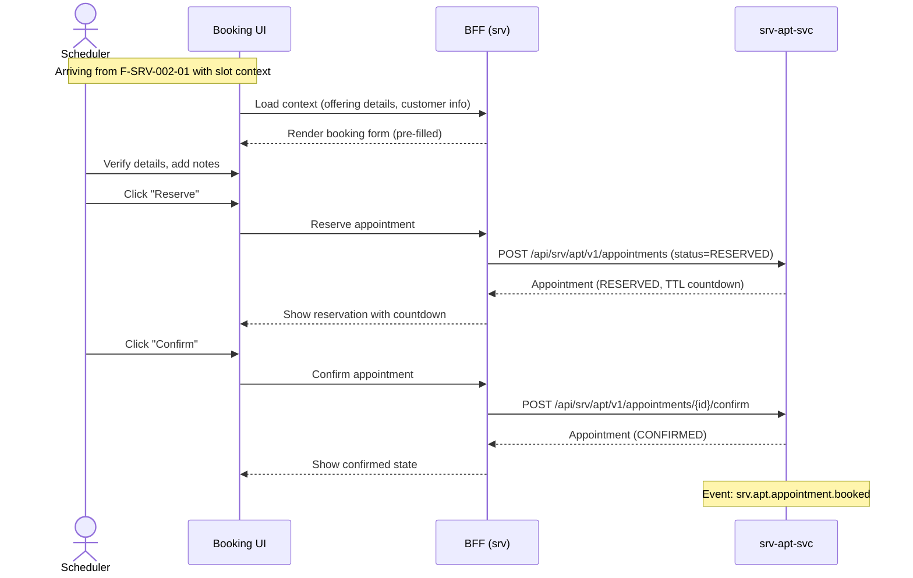

# F-SRV-002-02 — Booking Lifecycle

> **Conceptual Stack Layer:** Platform-Feature
> **Space:** Platform
> **Owner:** Domain Engineering Team
> **Companion files:** `F-SRV-002-02.uvl` (§9), `F-SRV-002-02.aui.yaml` (§6)
> **Referenced by:** Product Spec SS17, Suite Feature Catalog (`_srv_suite.md` §6)
> **References:** `srv_apt-spec.md` (UC-002 through UC-006), `srv_cat-spec.md`, `srv_res-spec.md`

> **Meta Information**
> - **Version:** 2026-04-02
> - **Author(s):** OpenLeap Architecture Team
> - **Status:** DRAFT
> - **Feature ID:** `F-SRV-002-02`
> - **Suite:** `srv`
> - **Node type:** LEAF
> - **Parent:** `F-SRV-002` — see `F-SRV-002.md`
> - **Companion UVL:** `F-SRV-002-02.uvl`
> - **Companion AUI:** `F-SRV-002-02.aui.yaml`
> **Template:** `feature-spec.md` v1.0.0
> **Template Compliance:** ~100% — all sections present

---

## ═══════════════════════════════════════════════
## PROBLEM SPACE
## ═══════════════════════════════════════════════

## 0. Feature Identity & Orientation

### 0.1 One-Line Summary

This feature lets a **scheduler or agent** create, confirm, reschedule, and cancel appointments so that the booking lifecycle is managed end-to-end from reservation through completion.

### 0.2 Non-Goals

- Does not search for available slots — that is `F-SRV-002-01` (Slot Discovery).
- Does not handle no-show recording — that is `F-SRV-002-04` (No-Show Handling).
- Does not manage waitlists — that is `F-SRV-002-03` (Waitlist Management).
- Does not manage session execution after the appointment — that is `F-SRV-004-01` (Session Lifecycle).
- Does not manage customer master data — that is `F-BP-*`.

### 0.3 Entry & Exit Points

**Entry points:**
- From `F-SRV-002-01` (Slot Discovery): "Book Selected Slot" navigates here with slot context
- From appointment list/search: click on an existing appointment opens detail view
- Deep link with `appointmentId`

**Exit points:**
- Appointment confirmed → event emitted → `srv.ses` creates planned session
- Appointment cancelled → event emitted → downstream fee evaluation (if `F-SRV-002-04`)
- User navigates back to appointment list

### 0.4 Variability Points

| Variability | Modelled as | UVL | Default | Binding time |
|---|---|---|---|---|
| Reservation TTL visible to user | Attribute | `reservation.showCountdown Boolean true` | `true` | `deploy` |
| Cancellation reason required | Attribute | `cancellation.requireReason Boolean false` | `false` | `deploy` |
| Reschedule allowed after confirmation | Attribute | `reschedule.allowAfterConfirm Boolean true` | `true` | `deploy` |
| Show customer contact info | Attribute | `display.showCustomerContact Boolean true` | `true` | `deploy` |

### 0.5 Position in Feature Tree

```
F-SRV-002  Appointment & Booking     [COMPOSITION]
├── F-SRV-002-01  Slot Discovery     [LEAF] [mandatory]
├── F-SRV-002-02  Booking Lifecycle  [LEAF] [mandatory] ← you are here
├── F-SRV-002-03  Waitlist Management [LEAF] [optional]
└── F-SRV-002-04  No-Show Handling   [LEAF] [optional]
```

### 0.6 Related Documents

| Document | What to find there |
|---|---|
| `F-SRV-002.md` | Parent composition node — variability structure |
| `F-SRV-002-02.uvl` | Companion UVL — attribute schema, cross-suite requires |
| `F-SRV-002-02.aui.yaml` | Companion AUI — screen contract |
| `srv_apt-spec.md` | Backend: UC-002 to UC-006, business rules, API contracts *(authoritative)* |
| `srv_cat-spec.md` | Backend: offering lookup |
| `srv_res-spec.md` | Backend: resource assignment |

---

## 1. User Goal & Scenarios

### 1.1 The User Goal

Complete a booking transaction for a customer — from initial reservation through confirmation — and manage changes (reschedule, cancel) throughout the appointment's lifecycle, ensuring the customer, resource, and time are locked in correctly.

### 1.2 User Scenarios

**Scenario 1: Create and confirm a new appointment**
> A scheduler arrives from Slot Discovery with a pre-selected slot. They verify the customer, offering, and time, add optional notes, and click "Reserve". The system creates a reservation with a TTL countdown. They confirm it, and the appointment is locked in.

**Scenario 2: Reschedule an existing appointment**
> A customer calls to move their Wednesday 10:00 appointment to Friday 14:00. The scheduler opens the appointment detail, clicks "Reschedule", and is navigated to Slot Discovery with the original offering pre-filled. After selecting a new slot, they confirm the reschedule.

**Scenario 3: Cancel an appointment**
> A customer cancels their appointment 2 hours before. The scheduler opens the appointment, clicks "Cancel", optionally enters a reason, and confirms. If a cancellation fee policy applies, a billing intent is derived downstream.

**Scenario 4: View appointment detail (read-only)**
> A back-office agent opens an existing appointment to review its details — offering, customer, resource, status, and history — without making changes.

---

## 2. User Journey & Screen Layout

### 2.1 Happy-Path Flow (Create & Confirm)



### 2.2 Screen Layout — Booking Form

```
┌──────────────────────────────────────────────────────────┐
│  ZONE: zone-header (fixed)                               │
│  ┌─────────────────────────────────────────────────────┐ │
│  │ Appointment Status: [PROPOSED / RESERVED / CONFIRMED]│ │
│  │ Reservation Countdown: [04:32] (if RESERVED)         │ │
│  └─────────────────────────────────────────────────────┘ │
├──────────────────────────────────────────────────────────┤
│  ZONE: zone-details (fixed)                              │
│  ┌─────────────────────────────────────────────────────┐ │
│  │ Service Offering: [display]                          │ │
│  │ Customer: [display/lookup]      Contact: [display]   │ │
│  │ Date: [display]  Time: [display]  Duration: [display]│ │
│  │ Resource: [display]                                  │ │
│  │ Notes: [textarea, optional]                          │ │
│  └─────────────────────────────────────────────────────┘ │
├──────────────────────────────────────────────────────────┤
│  ZONE: zone-history (fixed)                              │
│  ┌─────────────────────────────────────────────────────┐ │
│  │ Status History:                                      │ │
│  │ • 2026-04-07 09:01 — PROPOSED (by J. Müller)        │ │
│  │ • 2026-04-07 09:02 — RESERVED (TTL 5min)            │ │
│  │ • 2026-04-07 09:03 — CONFIRMED                      │ │
│  └─────────────────────────────────────────────────────┘ │
├──────────────────────────────────────────────────────────┤
│  ZONE: zone-extension (variable)                   [EXT] │
├──────────────────────────────────────────────────────────┤
│  ZONE: zone-actions (fixed)                              │
│  ┌─────────────────────────────────────────────────────┐ │
│  │ [Reserve] (when PROPOSED)                            │ │
│  │ [Confirm] (when RESERVED)                            │ │
│  │ [Reschedule] (when CONFIRMED, if attribute allows)   │ │
│  │ [Cancel] (when not terminal)                         │ │
│  │ [Back]                                               │ │
│  └─────────────────────────────────────────────────────┘ │
└──────────────────────────────────────────────────────────┘
```

---

## 3. Interaction Requirements

### 3.1 Fields & Controls

| Field | Type | Source | Required | Validation | Notes |
|---|---|---|---|---|---|
| Service Offering | display | Pre-filled from slot context | Yes (read-only) | — | |
| Customer | display / lookup | Pre-filled or selected | Yes | Must be valid BP | |
| Date/Time | display | Pre-filled from slot | Yes (read-only) | — | |
| Resource | display | Pre-filled from slot | No | — | |
| Notes | textarea | User | No | max 2000 chars | |
| Cancellation Reason | textarea | User | Gated by `cancellation.requireReason` | max 1000 chars | Shown in cancel dialog |

### 3.2 Actions

| Action | Visible when | Enabled when | Role | Mutation? | API call |
|---|---|---|---|---|---|
| Reserve | Status = PROPOSED | All fields valid | `SRV_APT_EDITOR` | Yes | `POST /appointments` |
| Confirm | Status = RESERVED | — | `SRV_APT_EDITOR` | Yes | `POST /appointments/{id}/confirm` |
| Reschedule | Status = CONFIRMED | `reschedule.allowAfterConfirm` = true | `SRV_APT_EDITOR` | No (navigates) | — |
| Cancel | Status ∉ {COMPLETED, CANCELLED, NO_SHOW} | — | `SRV_APT_EDITOR` | Yes | `POST /appointments/{id}/cancel` |
| Back | Always | Always | Any | No | — |

---

## 4. Edge Cases & Attribute-Driven Behaviour

### 4.1 Edge Cases

| ID | Condition | Expected behaviour |
|---|---|---|
| EC-001 | Reservation TTL expires while form is open | Show banner: "Reservation expired. Please re-search for available slots." Disable Confirm. |
| EC-002 | Concurrent modification (412 on save) | Show banner: "This appointment was updated by another user. Reload." |
| EC-003 | Resource no longer available after slot selection | Reserve fails with `APT_CONFLICT`; show error and suggest re-searching. |
| EC-004 | Offering deactivated after slot selection | Reserve fails with `APT_OFFERING_INACTIVE`; show error. |
| EC-005 | Cancel blocked by policy | Cancel fails with `APT_CANCELLATION_BLOCKED`; show policy message. |

### 4.3 Attribute-Driven Behaviour

| Attribute | Non-default value | Observable change |
|---|---|---|
| `reservation.showCountdown` | `false` | TTL countdown hidden; reservation still expires server-side |
| `cancellation.requireReason` | `true` | Cancel dialog requires reason field before submission |
| `reschedule.allowAfterConfirm` | `false` | "Reschedule" button hidden for confirmed appointments |
| `display.showCustomerContact` | `false` | Customer contact details (phone, email) hidden |

---

## ═══════════════════════════════════════════════
## SOLUTION SPACE
## ═══════════════════════════════════════════════

## 5. Backend Dependencies & BFF Composition

### 5.1 Service Calls

| # | Service | Endpoint | Method | Tier | isMutation | Failure mode |
|---|---------|----------|--------|------|------------|-------------|
| 1 | `srv-apt-svc` | `/api/srv/apt/v1/appointments` | POST | T1 | Yes | Block: show error |
| 2 | `srv-apt-svc` | `/api/srv/apt/v1/appointments/{id}/confirm` | POST | T1 | Yes | Block: show error |
| 3 | `srv-apt-svc` | `/api/srv/apt/v1/appointments/{id}/reschedule` | POST | T1 | Yes | Block: show error |
| 4 | `srv-apt-svc` | `/api/srv/apt/v1/appointments/{id}/cancel` | POST | T1 | Yes | Block: show error |
| 5 | `srv-apt-svc` | `/api/srv/apt/v1/appointments/{id}` | GET | T1 | No | Block: show error |
| 6 | `srv-cat-svc` | `/api/srv/cat/v1/offerings/{id}` | GET | T2 | No | Degrade: show ID only |
| 7 | `srv-res-svc` | `/api/srv/res/v1/resources/{id}` | GET | T2 | No | Degrade: show ID only |

### 5.2 BFF View Model

```jsonc
{
  "appointment": {
    "id": "uuid",
    "status": "RESERVED",
    "start": "2026-04-07T09:00:00Z",
    "end": "2026-04-07T10:30:00Z",
    "reservationExpiresAt": "2026-04-07T09:07:00Z",  // null if CONFIRMED
    "customerPartyId": "uuid",
    "customerName": "Anna Müller",                     // from BP (or event snapshot)
    "customerContact": { "phone": "+49...", "email": "..." },  // gated
    "serviceOfferingId": "uuid",
    "serviceOfferingName": "Practical Lesson — B License",
    "resourceId": "uuid",
    "resourceName": "M. Schmidt",
    "notes": "First lesson, needs calm instructor",
    "version": 2
  },
  "history": [
    { "timestamp": "...", "status": "PROPOSED", "actor": "J. Müller" },
    { "timestamp": "...", "status": "RESERVED", "actor": "J. Müller" }
  ],
  // Computed by BFF
  "allowedActions": ["confirm", "cancel"]  // based on status + attributes + role
}
```

### 5.3 Feature-Gating Rules

| Mode | Behaviour |
|---|---|
| `full` | All actions available per status and role |
| `read-only` | Detail view only; all mutation buttons hidden; BFF does not expose write endpoints |
| `excluded` | Feature routes not registered |

### 5.4 Failure Modes

| Scenario | Behaviour |
|---|---|
| `srv-apt-svc` down | Block: entire feature unavailable |
| `srv-cat-svc` down | Degrade: show offering ID instead of name |
| `srv-res-svc` down | Degrade: show resource ID instead of name |
| 412 conflict on mutation | Show concurrent modification banner |
| Reservation expired | Disable Confirm; show expiry banner |

### 5.5 Caching Hints

| Data | TTL | Invalidation |
|---|---|---|
| Appointment detail | No cache | Always fresh (state changes frequently) |
| Offering name | 5 min | Event-based |
| Resource name | 2 min | Event-based |

### 5.6 i18n Keys

| Key | Default (en) |
|---|---|
| `srv.apt.booking.title` | "Appointment" |
| `srv.apt.booking.reserveAction` | "Reserve" |
| `srv.apt.booking.confirmAction` | "Confirm" |
| `srv.apt.booking.rescheduleAction` | "Reschedule" |
| `srv.apt.booking.cancelAction` | "Cancel Appointment" |
| `srv.apt.booking.reservationExpired` | "Reservation expired. Please re-search for available slots." |
| `srv.apt.booking.concurrentModification` | "This appointment was updated by another user. Reload." |
| `srv.apt.booking.cancelReasonLabel` | "Cancellation Reason" |
| `srv.apt.booking.cancelReasonRequired` | "Please provide a reason for cancellation." |

---

## 6. Screen Contract (AUI)

> Full contract in `F-SRV-002-02.aui.yaml`.

### 6.1 Task Model

```
sequential(
  load-appointment,
  concurrent(
    view-details,
    view-history
  ),
  alternative(
    enabling(reserve ← view-details),     // when PROPOSED
    enabling(confirm ← view-details),     // when RESERVED
    enabling(reschedule ← view-details),  // when CONFIRMED + attr
    enabling(cancel ← view-details)       // when non-terminal
  )
)
```

### 6.2 Zones

| Zone ID | Name | Type | Priority |
|---|---|---|---|
| `zone-header` | Status & Countdown | fixed | 1 |
| `zone-details` | Appointment Details | fixed | 2 |
| `zone-history` | Status History | fixed | 3 |
| `zone-extension` | Extension Area | variable | 4 |
| `zone-actions` | Actions | fixed | 99 |

---

## ═══════════════════════════════════════════════
## BRIDGE ARTIFACTS
## ═══════════════════════════════════════════════

## 7. Permissions & Accessibility

### 7.1 Permission Matrix

| Action | `SRV_APT_VIEWER` | `SRV_APT_EDITOR` | `SRV_APT_ADMIN` |
|---|---|---|---|
| View appointment detail | ✓ | ✓ | ✓ |
| Reserve | — | ✓ | ✓ |
| Confirm | — | ✓ | ✓ |
| Reschedule | — | ✓ | ✓ |
| Cancel | — | ✓ | ✓ |
| Override cancellation policy | — | — | ✓ |

### 7.2 Accessibility

- Status changes MUST be announced via `aria-live` region.
- Countdown timer MUST have `aria-label` with remaining time.
- Cancel confirmation dialog MUST trap focus.
- All action buttons MUST have descriptive `aria-label` (not just icon).

---

## 8. Acceptance Criteria

**AC-001: Happy path — Reserve and Confirm**
- Given a user with `SRV_APT_EDITOR` arrives from Slot Discovery with a valid slot
- When they click Reserve and then Confirm
- Then the appointment status progresses PROPOSED → RESERVED → CONFIRMED
- And event `srv.apt.appointment.booked` is emitted

**AC-002: Reservation expiry**
- Given an appointment is in RESERVED status
- When the TTL expires
- Then the UI shows "Reservation expired. Please re-search for available slots."
- And the Confirm button is disabled

**AC-003: Cancellation with required reason**
- Given `cancellation.requireReason` = `true`
- When the user clicks Cancel without entering a reason
- Then the reason field shows "Please provide a reason for cancellation." and receives focus

**AC-004: Reschedule gating**
- Given `reschedule.allowAfterConfirm` = `false`
- When viewing a CONFIRMED appointment
- Then the "Reschedule" button is not present in the DOM

**AC-005: Concurrent modification**
- Given the appointment is open for editing
- When another user modifies it (API returns 412)
- Then a banner reads "This appointment was updated by another user. Reload."

**AC-006: Permission — editor actions absent for viewer**
- Given the user has role `SRV_APT_VIEWER`
- When they view an appointment
- Then Reserve, Confirm, Reschedule, Cancel buttons are absent from DOM

**AC-007: Feature-gating — read-only**
- Given this feature is configured as `read-only`
- When the user opens an appointment
- Then detail is visible but all mutation buttons are hidden

**AC-008: Deep link with appointmentId**
- Given a deep link with `appointmentId=<valid-uuid>`
- When the feature loads
- Then the appointment detail is shown directly

---

## 9. Dependencies, Variability & Extension Points

### 9.1 Feature Dependencies (UVL `requires`)

| Required Feature | Suite | Access Type | Reason |
|---|---|---|---|
| `F-SRV-001` | `srv` | READ_ONLY | Offering name lookup |
| `F-SRV-003` | `srv` | READ_ONLY | Resource name lookup |

### 9.2 Attributes (UVL)

| Attribute | Type | Default | Binding Time | UVL Declaration |
|---|---|---|---|---|
| `reservation.showCountdown` | `Boolean` | `true` | `deploy` | `reservation.showCountdown Boolean true` |
| `cancellation.requireReason` | `Boolean` | `false` | `deploy` | `cancellation.requireReason Boolean false` |
| `reschedule.allowAfterConfirm` | `Boolean` | `true` | `deploy` | `reschedule.allowAfterConfirm Boolean true` |
| `display.showCustomerContact` | `Boolean` | `true` | `deploy` | `display.showCustomerContact Boolean true` |

### 9.3 Extension Points

| Extension Point ID | Type | Description | Interface | Default Behavior |
|---|---|---|---|---|
| `ext.booking.customPanel` | zone | Custom panel on booking detail (e.g., insurance, entitlement summary) | `(appointmentId, customerPartyId) -> HTML` | Zone hidden |
| `ext.booking.preCancelValidation` | rule | Custom validation before cancel (e.g., regulatory check) | `(appointmentId) -> { allow: boolean, message?: string }` | Allow |

---

## 10. Change Log & Review

### 10.1 Open Questions & Decisions

| ID | Question | Impact | Owner | Needed by |
|---|---|---|---|---|
| Q-001 | Should the reservation step be skippable (direct confirm)? | UX simplification for low-contention contexts | TBD | Phase 1 |

### 10.2 Change Log

| Date | Version | Author | Changes |
|---|---|---|---|
| 2026-04-02 | 1.0 | OpenLeap Architecture Team | Initial spec |

### 10.3 Review & Approval

**Status:** DRAFT
