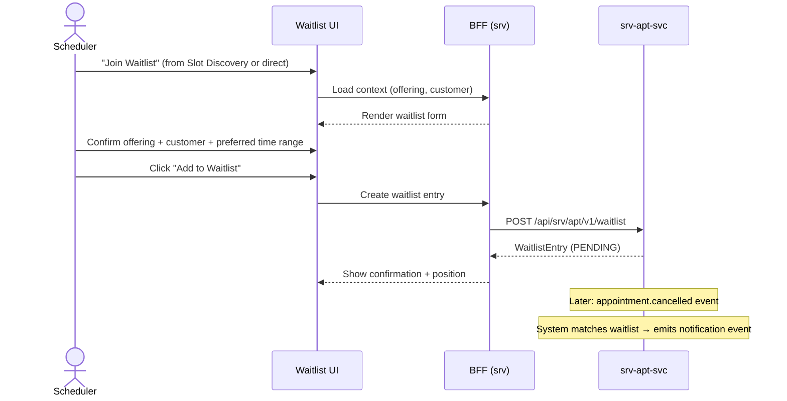

# F-SRV-002-03 — Waitlist Management

> **Conceptual Stack Layer:** Platform-Feature
> **Space:** Platform
> **Owner:** Domain Engineering Team
> **Companion files:** `F-SRV-002-03.uvl` (§9), `F-SRV-002-03.aui.yaml` (§6)
> **Referenced by:** Product Spec SS17, Suite Feature Catalog (`_srv_suite.md` §6)
> **References:** `srv_apt-spec.md` (WaitlistEntry aggregate)

> **Meta Information**
> - **Version:** 2026-04-02
> - **Author(s):** OpenLeap Architecture Team
> - **Status:** DRAFT
> - **Feature ID:** `F-SRV-002-03`
> - **Suite:** `srv`
> - **Node type:** LEAF
> - **Parent:** `F-SRV-002` — see `F-SRV-002.md`
> - **Companion UVL:** `F-SRV-002-03.uvl`
> - **Companion AUI:** `F-SRV-002-03.aui.yaml`
> **Template:** `feature-spec.md` v1.0.0
> **Template Compliance:** ~100% — all sections present

---

## ═══════════════════════════════════════════════
## PROBLEM SPACE
## ═══════════════════════════════════════════════

## 0. Feature Identity & Orientation

### 0.1 One-Line Summary

This feature lets a **scheduler or agent** add a customer to a waitlist for a fully-booked service offering so that the customer is automatically notified when a slot becomes available.

### 0.2 Non-Goals

- Does not search for slots — that is `F-SRV-002-01`.
- Does not create bookings — that is `F-SRV-002-02`.
- Does not send notifications directly — downstream notification service (OPEN QUESTION).
- Does not manage priorities beyond FIFO order (OPEN QUESTION: priority waitlisting).

### 0.3 Entry & Exit Points

**Entry points:**
- From `F-SRV-002-01` (Slot Discovery): "Join Waitlist" when no slots available
- From waitlist management list: "Add to Waitlist" action
- Deep link with `serviceOfferingId` and `customerPartyId`

**Exit points:**
- Waitlist entry created → customer waits for notification
- Slot becomes available → event triggers notification → customer proceeds to `F-SRV-002-02`
- User removes entry from waitlist

### 0.4 Variability Points

| Variability | Modelled as | UVL | Default | Binding time |
|---|---|---|---|---|
| Max waitlist entries per customer per offering | Attribute | `waitlist.maxPerCustomer Integer 1` | `1` | `deploy` |
| Show waitlist position to user | Attribute | `waitlist.showPosition Boolean true` | `true` | `deploy` |
| Auto-expire after days | Attribute | `waitlist.autoExpireDays Integer 30` | `30` | `deploy` |

### 0.5 Position in Feature Tree

```
F-SRV-002  Appointment & Booking     [COMPOSITION]
├── F-SRV-002-01  Slot Discovery     [LEAF] [mandatory]
├── F-SRV-002-02  Booking Lifecycle  [LEAF] [mandatory]
├── F-SRV-002-03  Waitlist Management [LEAF] [optional] ← you are here
└── F-SRV-002-04  No-Show Handling   [LEAF] [optional]
```

### 0.6 Related Documents

| Document | What to find there |
|---|---|
| `F-SRV-002.md` | Parent composition node |
| `srv_apt-spec.md` | Backend: WaitlistEntry aggregate, API contracts |

---

## 1. User Goal & Scenarios

### 1.1 The User Goal

Ensure a customer doesn't miss out on a desired service when no slots are currently available, by placing them on a waitlist that automatically alerts them when a slot opens.

### 1.2 User Scenarios

**Scenario 1: Add customer to waitlist from Slot Discovery**
> A scheduler searches for driving lesson slots but the preferred instructor is fully booked for the next 2 weeks. They click "Join Waitlist", confirm the customer and offering, and the entry is created. The customer will be notified when a cancellation opens a slot.

**Scenario 2: View and manage waitlist**
> A back-office agent opens the waitlist management screen to see all pending entries for a specific offering. They see entries ordered by creation date and can remove expired or no-longer-needed entries.

**Scenario 3: Slot opens from cancellation**
> A confirmed appointment is cancelled. The system detects a matching waitlist entry and emits a notification event. The scheduler or customer can then proceed to book.

---

## 2. User Journey & Screen Layout

### 2.1 Happy-Path Flow



### 2.2 Screen Layout — Waitlist Management

```
┌──────────────────────────────────────────────────────────┐
│  ZONE: zone-header (fixed)                               │
│  ┌─────────────────────────────────────────────────────┐ │
│  │ Offering Filter [dropdown]  Status Filter [dropdown] │ │
│  │ [Search]  [Add to Waitlist]                          │ │
│  └─────────────────────────────────────────────────────┘ │
├──────────────────────────────────────────────────────────┤
│  ZONE: zone-list (fixed)                                 │
│  ┌─────────────────────────────────────────────────────┐ │
│  │ # | Customer      | Offering          | Created    | │ │
│  │ 1 | Anna Müller   | Practical B-Lic.  | 2026-04-01 | │ │
│  │ 2 | Max Schmidt   | Practical B-Lic.  | 2026-04-02 | │ │
│  │ 3 | Lisa Weber    | Theory Refresh    | 2026-04-03 | │ │
│  │                                                       │ │
│  │ [Remove] (per row, role-gated)                       │ │
│  └─────────────────────────────────────────────────────┘ │
├──────────────────────────────────────────────────────────┤
│  ZONE: zone-extension (variable)                   [EXT] │
├──────────────────────────────────────────────────────────┤
│  ZONE: zone-actions (fixed)                              │
│  ┌─────────────────────────────────────────────────────┐ │
│  │ [Add to Waitlist]                                    │ │
│  └─────────────────────────────────────────────────────┘ │
└──────────────────────────────────────────────────────────┘
```

---

## 3. Interaction Requirements

### 3.1 Fields & Controls (Add to Waitlist Dialog)

| Field | Type | Source | Required | Validation |
|---|---|---|---|---|
| Service Offering | lookup | `srv-cat-svc` (ACTIVE) | Yes | Must be ACTIVE |
| Customer | lookup | BP | Yes | Must be valid |
| Preferred Time Range | date range | User | No | — |
| Notes | textarea | User | No | max 500 chars |

### 3.2 Actions

| Action | Enabled when | Role | Mutation? |
|---|---|---|---|
| Add to Waitlist | Offering + customer selected | `SRV_APT_EDITOR` | Yes |
| Remove Entry | Entry selected | `SRV_APT_EDITOR` | Yes |
| Search/Filter | Always | `SRV_APT_VIEWER` | No |

---

## 4. Edge Cases & Attribute-Driven Behaviour

### 4.1 Edge Cases

| ID | Condition | Expected behaviour |
|---|---|---|
| EC-001 | Customer already on waitlist for same offering (maxPerCustomer reached) | Show error: "Customer already has a waitlist entry for this offering." |
| EC-002 | Offering deactivated while entry pending | Entry remains; show warning badge on affected entries |
| EC-003 | Entry auto-expired | Remove from active list; show in "Expired" filter |

### 4.3 Attribute-Driven Behaviour

| Attribute | Non-default value | Observable change |
|---|---|---|
| `waitlist.maxPerCustomer` | `3` | Customer can have up to 3 entries per offering |
| `waitlist.showPosition` | `false` | Position column hidden in list view |
| `waitlist.autoExpireDays` | `14` | Entries expire after 14 days instead of 30 |

---

## ═══════════════════════════════════════════════
## SOLUTION SPACE
## ═══════════════════════════════════════════════

## 5. Backend Dependencies & BFF Composition

### 5.1 Service Calls

| # | Service | Endpoint | Method | Tier | isMutation | Failure mode |
|---|---------|----------|--------|------|------------|-------------|
| 1 | `srv-apt-svc` | `/api/srv/apt/v1/waitlist` | POST | T1 | Yes | Block: show error |
| 2 | `srv-apt-svc` | `/api/srv/apt/v1/waitlist` | GET | T1 | No | Block: show error |
| 3 | `srv-apt-svc` | `/api/srv/apt/v1/waitlist/{id}` | DELETE | T1 | Yes | Block: show error |
| 4 | `srv-cat-svc` | `/api/srv/cat/v1/offerings` | GET | T2 | No | Degrade: show ID |

### 5.6 i18n Keys

| Key | Default (en) |
|---|---|
| `srv.apt.waitlist.title` | "Waitlist" |
| `srv.apt.waitlist.addAction` | "Add to Waitlist" |
| `srv.apt.waitlist.removeAction` | "Remove" |
| `srv.apt.waitlist.duplicateError` | "Customer already has a waitlist entry for this offering." |
| `srv.apt.waitlist.positionLabel` | "Position" |

---

## 6. Screen Contract (AUI)

> Full contract in `F-SRV-002-03.aui.yaml`.

### 6.1 Task Model

```
sequential(
  load-waitlist,
  concurrent(view-list, optional(add-entry)),
  optional(remove-entry)
)
```

---

## ═══════════════════════════════════════════════
## BRIDGE ARTIFACTS
## ═══════════════════════════════════════════════

## 7. Permissions & Accessibility

### 7.1 Permission Matrix

| Action | `SRV_APT_VIEWER` | `SRV_APT_EDITOR` | `SRV_APT_ADMIN` |
|---|---|---|---|
| View waitlist | ✓ | ✓ | ✓ |
| Add to waitlist | — | ✓ | ✓ |
| Remove entry | — | ✓ | ✓ |

---

## 8. Acceptance Criteria

**AC-001: Happy path — Add to waitlist**
- Given no slots available and user clicks "Join Waitlist"
- When they select offering and customer and submit
- Then a waitlist entry is created and position is shown (if `showPosition` = true)

**AC-002: Duplicate prevention**
- Given customer already on waitlist for same offering
- When user tries to add again and `maxPerCustomer` = 1
- Then error "Customer already has a waitlist entry for this offering."

**AC-003: Remove entry**
- Given a waitlist entry exists
- When editor clicks "Remove"
- Then entry is deleted and list refreshes

**AC-004: Feature-gating — excluded**
- Given this feature is `excluded`
- Then "Join Waitlist" link in F-SRV-002-01 is hidden
- And waitlist management route is not registered

---

## 9. Dependencies, Variability & Extension Points

### 9.1 Feature Dependencies (UVL `requires`)

| Required Feature | Suite | Access Type | Reason |
|---|---|---|---|
| `F-SRV-001` | `srv` | READ_ONLY | Offering lookup |

### 9.2 Attributes (UVL)

| Attribute | Type | Default | Binding Time |
|---|---|---|---|
| `waitlist.maxPerCustomer` | `Integer` | `1` | `deploy` |
| `waitlist.showPosition` | `Boolean` | `true` | `deploy` |
| `waitlist.autoExpireDays` | `Integer` | `30` | `deploy` |

### 9.3 Extension Points

| Extension Point ID | Type | Description | Default |
|---|---|---|---|
| `ext.waitlist.customPanel` | zone | Product-specific panel (e.g., priority rules) | Hidden |

---

## 10. Change Log & Review

### 10.1 Open Questions

| ID | Question | Impact | Owner | Needed by |
|---|---|---|---|---|
| Q-001 | Should priority waitlisting (VIP, loyalty tier) be supported? | New attribute or separate leaf | TBD | Phase 2 |
| Q-002 | How are notifications sent when a slot opens? | Downstream integration; not owned by this feature | TBD | Phase 1 |

### 10.2 Change Log

| Date | Version | Author | Changes |
|---|---|---|---|
| 2026-04-02 | 1.0 | OpenLeap Architecture Team | Initial spec |

### 10.3 Review & Approval

**Status:** DRAFT
