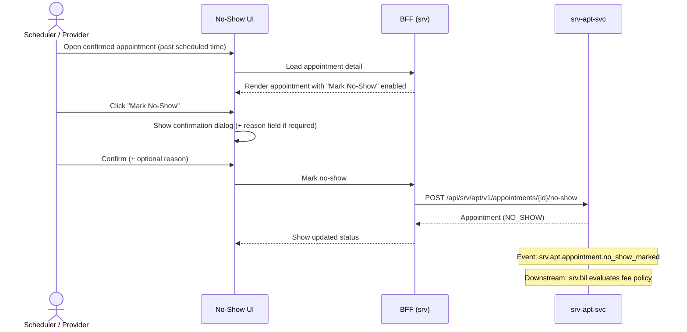

# F-SRV-002-04 — No-Show Handling

> **Conceptual Stack Layer:** Platform-Feature
> **Space:** Platform
> **Owner:** Domain Engineering Team
> **Companion files:** `F-SRV-002-04.uvl` (§9), `F-SRV-002-04.aui.yaml` (§6)
> **Referenced by:** Product Spec SS17, Suite Feature Catalog (`_srv_suite.md` §6)
> **References:** `srv_apt-spec.md` (UC-007: MarkNoShow), `srv_bil-spec.md` (UC-002: DeriveNoShowFee)

> **Meta Information**
> - **Version:** 2026-04-02
> - **Author(s):** OpenLeap Architecture Team
> - **Status:** DRAFT
> - **Feature ID:** `F-SRV-002-04`
> - **Suite:** `srv`
> - **Node type:** LEAF
> - **Parent:** `F-SRV-002` — see `F-SRV-002.md`
> - **Companion UVL:** `F-SRV-002-04.uvl`
> - **Companion AUI:** `F-SRV-002-04.aui.yaml`
> **Template:** `feature-spec.md` v1.0.0
> **Template Compliance:** ~100% — all sections present

---

## ═══════════════════════════════════════════════
## PROBLEM SPACE
## ═══════════════════════════════════════════════

## 0. Feature Identity & Orientation

### 0.1 One-Line Summary

This feature lets a **scheduler or service provider** record that a customer did not attend a confirmed appointment so that no-show fees can be evaluated and the appointment slot can be released.

### 0.2 Non-Goals

- Does not create invoices or postings — fee intent derivation is downstream (`srv.bil`).
- Does not manage the booking itself — that is `F-SRV-002-02`.
- Does not define fee policies — those are managed in `srv.bil` or `srv.cat` (OPEN QUESTION).
- Does not send notifications to the customer — downstream responsibility.

### 0.3 Entry & Exit Points

**Entry points:**
- From the appointment detail view (`F-SRV-002-02`): "Mark No-Show" action on a CONFIRMED appointment whose scheduled time has passed
- From a "Today's Appointments" dashboard: batch no-show marking (OPEN QUESTION: Phase 2)

**Exit points:**
- No-show recorded → event `srv.apt.appointment.no_show_marked` emitted
- Downstream: `srv.bil` evaluates fee policy → billing intent created (or not)
- Downstream: `srv.ses` records no-show at session level
- User returns to appointment list or detail

### 0.4 Variability Points

| Variability | Modelled as | UVL | Default | Binding time |
|---|---|---|---|---|
| Require no-show reason | Attribute | `noShow.requireReason Boolean false` | `false` | `deploy` |
| Grace period minutes | Attribute | `noShow.graceMinutes Integer 15` | `15` | `deploy` |
| Show fee preview | Attribute | `noShow.showFeePreview Boolean false` | `false` | `deploy` |

### 0.5 Position in Feature Tree

```
F-SRV-002  Appointment & Booking     [COMPOSITION]
├── F-SRV-002-01  Slot Discovery     [LEAF] [mandatory]
├── F-SRV-002-02  Booking Lifecycle  [LEAF] [mandatory]
├── F-SRV-002-03  Waitlist Management [LEAF] [optional]
└── F-SRV-002-04  No-Show Handling   [LEAF] [optional] ← you are here
```

### 0.6 Related Documents

| Document | What to find there |
|---|---|
| `F-SRV-002.md` | Parent composition node |
| `srv_apt-spec.md` | Backend: UC-007 MarkNoShow, appointment aggregate NO_SHOW state |
| `srv_bil-spec.md` | Backend: UC-002 DeriveNoShowFee |

---

## 1. User Goal & Scenarios

### 1.1 The User Goal

Accurately record customer no-shows so that fee policies can be applied, appointment statistics are correct, and the freed slot can potentially be offered to waitlisted customers.

### 1.2 User Scenarios

**Scenario 1: Mark no-show after grace period**
> A driving instructor waits 15 minutes past the appointment start time. The customer hasn't appeared. The instructor opens the appointment on their device and clicks "Mark No-Show". The system verifies the grace period has elapsed and records the no-show.

**Scenario 2: Mark no-show with reason**
> A clinic scheduler reviews the day's uncompleted appointments at end of day. For each unattended appointment, they mark no-show and enter a reason ("Customer called but too late to cancel"). The reason is attached to the record for dispute resolution.

**Scenario 3: No-show triggers fee**
> After the scheduler marks a no-show, the event is consumed by `srv.bil`. The billing intent service evaluates the fee policy for the offering and creates a no-show fee billing intent.

---

## 2. User Journey & Screen Layout

### 2.1 Happy-Path Flow



### 2.2 Screen Layout

The no-show action is embedded within the appointment detail screen (`F-SRV-002-02`). The dedicated UI elements are:

```
┌──────────────────────────────────────────────────────────┐
│  [Within F-SRV-002-02 zone-actions]                      │
│  ┌─────────────────────────────────────────────────────┐ │
│  │ [Mark No-Show] (visible when: CONFIRMED + past      │ │
│  │                  scheduled time + grace period)       │ │
│  └─────────────────────────────────────────────────────┘ │
└──────────────────────────────────────────────────────────┘

┌──────────────────────────────────────────────────────────┐
│  No-Show Confirmation Dialog (modal)                     │
│  ┌─────────────────────────────────────────────────────┐ │
│  │ "Mark this appointment as No-Show?"                  │ │
│  │                                                       │
│  │ Reason: [textarea] (required if noShow.requireReason)│ │
│  │                                                       │
│  │ Fee Preview: "No-show fee: €25.00 may apply"         │ │
│  │   (visible if noShow.showFeePreview = true)          │ │
│  │                                                       │ │
│  │ [Confirm No-Show]  [Cancel]                          │ │
│  └─────────────────────────────────────────────────────┘ │
└──────────────────────────────────────────────────────────┘
```

---

## 3. Interaction Requirements

### 3.1 Fields & Controls

| Field | Type | Source | Required | Validation |
|---|---|---|---|---|
| No-Show Reason | textarea | User | Gated by `noShow.requireReason` | max 1000 chars |
| Fee Preview | display | `srv-cat-svc` or `srv-bil-svc` | — | Read-only |

### 3.2 Actions

| Action | Visible when | Enabled when | Role | Mutation? |
|---|---|---|---|---|
| Mark No-Show | CONFIRMED + past scheduled time + grace period | Reason provided (if required) | `SRV_APT_EDITOR` | Yes |

---

## 4. Edge Cases & Attribute-Driven Behaviour

### 4.1 Edge Cases

| ID | Condition | Expected behaviour |
|---|---|---|
| EC-001 | Grace period not yet elapsed | "Mark No-Show" disabled; tooltip: "Wait until {time} (grace period)." |
| EC-002 | Appointment already cancelled | "Mark No-Show" not visible |
| EC-003 | Fee preview unavailable (srv-bil or srv-cat down) | Show "Fee information temporarily unavailable" in preview area |

### 4.3 Attribute-Driven Behaviour

| Attribute | Non-default value | Observable change |
|---|---|---|
| `noShow.requireReason` | `true` | Reason field is required in confirmation dialog |
| `noShow.graceMinutes` | `0` | No-show can be marked immediately after scheduled time |
| `noShow.showFeePreview` | `true` | Fee preview shown in confirmation dialog |

---

## ═══════════════════════════════════════════════
## SOLUTION SPACE
## ═══════════════════════════════════════════════

## 5. Backend Dependencies & BFF Composition

### 5.1 Service Calls

| # | Service | Endpoint | Method | Tier | isMutation | Failure mode |
|---|---------|----------|--------|------|------------|-------------|
| 1 | `srv-apt-svc` | `/api/srv/apt/v1/appointments/{id}/no-show` | POST | T1 | Yes | Block: show error |
| 2 | `srv-cat-svc` | `/api/srv/cat/v1/offerings/{id}` | GET | T2 | No | Degrade: hide fee preview |

### 5.6 i18n Keys

| Key | Default (en) |
|---|---|
| `srv.apt.noShow.action` | "Mark No-Show" |
| `srv.apt.noShow.confirmTitle` | "Mark this appointment as No-Show?" |
| `srv.apt.noShow.reasonLabel` | "Reason" |
| `srv.apt.noShow.reasonRequired` | "Please provide a reason." |
| `srv.apt.noShow.gracePeriodHint` | "Wait until {time} (grace period)." |
| `srv.apt.noShow.feePreviewUnavailable` | "Fee information temporarily unavailable." |

---

## 6. Screen Contract (AUI)

> Full contract in `F-SRV-002-04.aui.yaml`.

### 6.1 Task Model

```
sequential(
  enabling(mark-no-show ← appointment-loaded),  // enabled when CONFIRMED + past time + grace
  optional(enter-reason),                        // gated by noShow.requireReason
  enabling(confirm-no-show ← mark-no-show)
)
```

---

## ═══════════════════════════════════════════════
## BRIDGE ARTIFACTS
## ═══════════════════════════════════════════════

## 7. Permissions & Accessibility

### 7.1 Permission Matrix

| Action | `SRV_APT_VIEWER` | `SRV_APT_EDITOR` | `SRV_APT_ADMIN` |
|---|---|---|---|
| View appointment (see no-show status) | ✓ | ✓ | ✓ |
| Mark No-Show | — | ✓ | ✓ |
| Override grace period | — | — | ✓ |

---

## 8. Acceptance Criteria

**AC-001: Happy path — Mark no-show**
- Given a CONFIRMED appointment whose scheduled time + grace period has passed
- When the editor clicks "Mark No-Show" and confirms
- Then the appointment status becomes NO_SHOW
- And event `srv.apt.appointment.no_show_marked` is emitted

**AC-002: Grace period enforcement**
- Given a CONFIRMED appointment whose scheduled time has passed but grace period has not
- Then "Mark No-Show" is disabled with tooltip "Wait until {time} (grace period)."

**AC-003: Required reason**
- Given `noShow.requireReason` = `true`
- When the user clicks "Confirm No-Show" without entering a reason
- Then "Please provide a reason." is shown and focus moves to reason field

**AC-004: Fee preview**
- Given `noShow.showFeePreview` = `true`
- When the confirmation dialog opens
- Then fee preview is shown (or "Fee information temporarily unavailable" if service is down)

**AC-005: Feature-gating — excluded**
- Given this feature is `excluded`
- Then "Mark No-Show" action is not visible in F-SRV-002-02

**AC-006: Permission — viewer cannot mark no-show**
- Given user has `SRV_APT_VIEWER` only
- Then "Mark No-Show" is absent from DOM

---

## 9. Dependencies, Variability & Extension Points

### 9.1 Feature Dependencies (UVL `requires`)

| Required Feature | Suite | Access Type | Reason |
|---|---|---|---|
| `F-SRV-002-02` | `srv` | READ_WRITE | No-show is an action within the booking detail |
| `F-SRV-007` | `srv` | ASYNC_EVENT | No-show triggers fee intent derivation |

### 9.2 Attributes (UVL)

| Attribute | Type | Default | Binding Time |
|---|---|---|---|
| `noShow.requireReason` | `Boolean` | `false` | `deploy` |
| `noShow.graceMinutes` | `Integer` | `15` | `deploy` |
| `noShow.showFeePreview` | `Boolean` | `false` | `deploy` |

### 9.3 Extension Points

| Extension Point ID | Type | Description | Default |
|---|---|---|---|
| `ext.noShow.preMarkValidation` | rule | Custom validation before no-show (e.g., check customer communication log) | Allow |

---

## 10. Change Log & Review

### 10.1 Open Questions

| ID | Question | Impact | Owner | Needed by |
|---|---|---|---|---|
| Q-001 | Should batch no-show marking (end-of-day review) be part of this feature or a separate leaf? | UX and data model impact | TBD | Phase 2 |
| Q-002 | Where do fee policies live — `srv.cat` metadata or `srv.bil` configuration? | Affects fee preview data source | TBD | Phase 1 |

### 10.2 Change Log

| Date | Version | Author | Changes |
|---|---|---|---|
| 2026-04-02 | 1.0 | OpenLeap Architecture Team | Initial spec |

### 10.3 Review & Approval

**Status:** DRAFT
