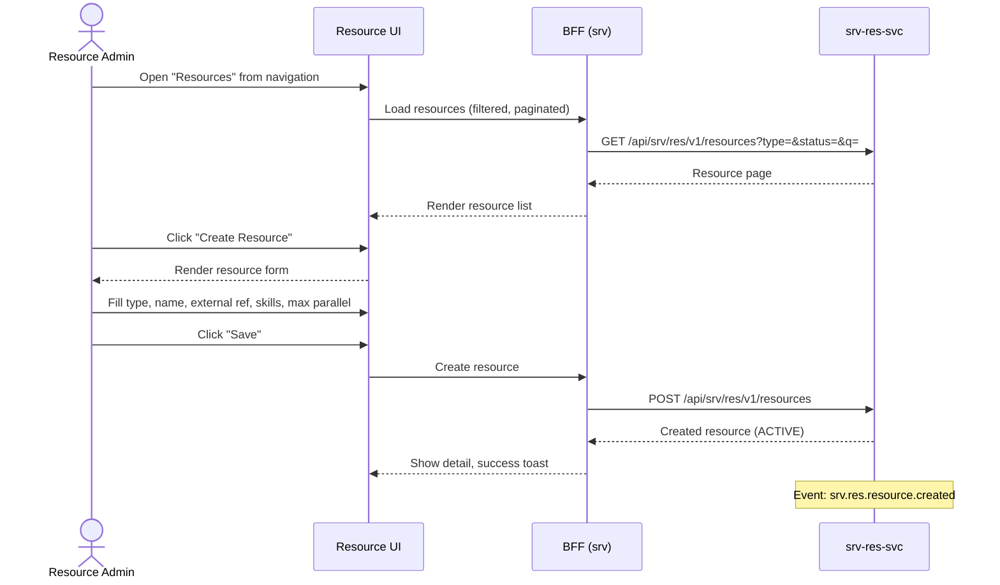

# F-SRV-003-01 — Resource Management

> **Conceptual Stack Layer:** Platform-Feature
> **Suite:** `srv` | **Node type:** LEAF | **Parent:** `F-SRV-003`
> **Companion UVL:** `F-SRV-003-01.uvl` | **Companion AUI:** `F-SRV-003-01.aui.yaml`
> **Version:** 2026-04-02 | **Status:** DRAFT
> **References:** `srv_res-spec.md` (UC-001: CreateSchedulingResource, UC-002: UpdateSchedulingResource, UC-005/007)
> **Template:** `feature-spec.md` v1.0.0
> **Template Compliance:** ~90% — missing: AUI Contract (SS6)

---

## ═══════════════════════════════════════════════
## PROBLEM SPACE
## ═══════════════════════════════════════════════

## 0. Feature Identity & Orientation

### 0.1 One-Line Summary
This feature lets a **resource administrator** create, view, edit, and search scheduling resources (people, rooms, assets) so that they are registered for availability management and booking.

### 0.2 Non-Goals
- Does not manage employee lifecycle/payroll — that is `hr`.
- Does not manage room/building lifecycle — that is `fac`.
- Does not manage availability windows — that is `F-SRV-003-02`.
- Does not detect conflicts — that is `F-SRV-003-03`.

### 0.3 Entry & Exit Points
**Entry points:** Navigation "Resources" → resource list. "Create Resource" button. Deep link with `resourceId`.
**Exit points:** Resource saved → detail view. From detail → navigate to `F-SRV-003-02` (Availability).

### 0.4 Variability Points
| Variability | Modelled as | UVL | Default | Binding time |
|---|---|---|---|---|
| Records per page | Attribute | `pagination.pageSize Integer 25` | `25` | `deploy` |
| Show skill tags | Attribute | `display.showSkillTags Boolean true` | `true` | `deploy` |
| Show max parallel sessions | Attribute | `display.showMaxParallel Boolean true` | `true` | `deploy` |

### 0.5 Position in Feature Tree
```
F-SRV-003  Resource Scheduling           [COMPOSITION]
├── F-SRV-003-01  Resource Management    [LEAF] [mandatory] ← you are here
├── F-SRV-003-02  Availability Management [LEAF] [mandatory]
└── F-SRV-003-03  Conflict Detection     [LEAF] [mandatory]
```

---

## 1. User Goal & Scenarios

### 1.1 The User Goal
Maintain scheduling projections of people, rooms, and assets so that availability queries and booking assignments work correctly.

### 1.2 User Scenarios

**Scenario 1: Create a person resource**
> Admin creates resource "M. Schmidt" with type PERSON, linked to HR employee ref `EMP-0042`, skill tags ["B-License-Instructor", "Highway-Certified"], and max parallel sessions = 1.

**Scenario 2: Create a room resource**
> Admin creates resource "Room 101" with type ROOM, linked to FAC room ref `ROOM-101`, capacity-based availability.

**Scenario 3: Search by type and skills**
> Scheduler searches for all PERSON resources with skill "B-License" to review instructor pool.

**Scenario 4: Deactivate a resource**
> Admin deactivates an instructor going on extended leave. Resource becomes INACTIVE and excluded from slot discovery.

---

## 2. User Journey & Screen Layout

### 2.1 Happy-Path Flow



### 2.2 Screen Layout
```
┌──────────────────────────────────────────────────────────┐
│  ZONE: zone-list-header (fixed)                          │
│  │ Search [text]  Type [PERSON|ROOM|ASSET]  Status [▼]  │ │
│  │ [Search]  [Create Resource]                           │ │
├──────────────────────────────────────────────────────────┤
│  ZONE: zone-list (fixed)                                 │
│  │ Name      │ Type   │ Status │ Skills       │ Actions │ │
│  │ M.Schmidt │ PERSON │ ACTIVE │ B-License    │ [✎]    │ │
│  │ Room 101  │ ROOM   │ ACTIVE │ —            │ [✎]    │ │
├──────────────────────────────────────────────────────────┤
│  ZONE: zone-pagination (fixed)                           │

--- Detail / Create Form ---
┌──────────────────────────────────────────────────────────┐
│  ZONE: zone-form (fixed)                                 │
│  │ Type*:          [PERSON ▼]                            │ │
│  │ Name*:          [___________________________]         │ │
│  │ External Ref*:  [___________________________]         │ │
│  │ Status:         [ACTIVE] (badge, read-only on create) │ │
├──────────────────────────────────────────────────────────┤
│  ZONE: zone-skills (feature-gated: display.showSkillTags)│
│  │ Skill Tags: [B-License] [Highway-Cert] [+ Add]       │ │
├──────────────────────────────────────────────────────────┤
│  ZONE: zone-capacity (feature-gated: display.showMaxPar) │
│  │ Max Parallel Sessions: [1]                            │ │
├──────────────────────────────────────────────────────────┤
│  ZONE: zone-extension (variable)                   [EXT] │
├──────────────────────────────────────────────────────────┤
│  ZONE: zone-actions (fixed)                              │
│  │ [Save]  [Deactivate/Archive] (status-dependent)      │ │
│  │ [Cancel]                                              │ │
└──────────────────────────────────────────────────────────┘
```

---

## 3. Interaction Requirements

### 3.1 Fields & Controls
| Field | Type | Source | Required | Validation | Notes |
|---|---|---|---|---|---|
| Type | dropdown | Enum | Yes | PERSON/ROOM/ASSET | Immutable after creation |
| Name | input | User | Yes | max 255 | Display name |
| External Ref | input | User | Yes | max 100; unique per tenant+type | Link to HR/FAC master |
| Skill Tags | tag input | User/ref data | No | Gated by attr | Free-text or ref catalog |
| Max Parallel Sessions | number | User | No | min 1; default 1 | Gated by attr |

### 3.2 Actions
| Action | Visible when | Enabled when | Role | Mutation? | API call |
|---|---|---|---|---|---|
| Search | Always | — | `SRV_RES_VIEWER` | No | `GET /resources?...` |
| Create | List view | — | `SRV_RES_EDITOR` | No (opens form) | — |
| Save | Form view | Required valid | `SRV_RES_EDITOR` | Yes | `POST/PATCH` |
| Deactivate | Detail, ACTIVE | — | `SRV_RES_EDITOR` | Yes | `PATCH (status=INACTIVE)` |
| Archive | Detail, ACTIVE/INACTIVE | — | `SRV_RES_ADMIN` | Yes | `PATCH (status=ARCHIVED)` |

---

## 4. Edge Cases & Attribute-Driven Behaviour

### 4.1 Edge Cases
| ID | Condition | Expected behaviour |
|---|---|---|
| EC-001 | Duplicate external ref (per tenant+type) | Error: "A resource with this external reference already exists." |
| EC-002 | 412 conflict | Banner: "This resource was updated by another user. Reload." |
| EC-003 | Deactivate with future appointments | Warning: "This resource has N future appointments. Deactivate anyway?" |
| EC-004 | Archive with future appointments | Warning with stronger language; requires ADMIN role. |

### 4.3 Attribute-Driven Behaviour
| Attribute | Non-default | Observable change |
|---|---|---|
| `display.showSkillTags` | `false` | Skill tags section hidden |
| `display.showMaxParallel` | `false` | Max parallel sessions field hidden |
| `pagination.pageSize` | `50` | 50 resources per page |

---

## ═══════════════════════════════════════════════
## SOLUTION SPACE
## ═══════════════════════════════════════════════

## 5. Backend Dependencies & BFF Composition

### 5.1 Service Calls
| # | Service | Endpoint | Method | Tier | isMutation | Failure mode |
|---|---------|----------|--------|------|------------|-------------|
| 1 | `srv-res-svc` | `/api/srv/res/v1/resources` | GET | T1 | No | Block |
| 2 | `srv-res-svc` | `/api/srv/res/v1/resources` | POST | T1 | Yes | Block |
| 3 | `srv-res-svc` | `/api/srv/res/v1/resources/{id}` | GET | T1 | No | Block |
| 4 | `srv-res-svc` | `/api/srv/res/v1/resources/{id}` | PATCH | T1 | Yes | Block |

### 5.2 BFF View Model
```jsonc
{
  "resources": [
    {
      "id": "uuid", "name": "M. Schmidt", "type": "PERSON",
      "externalRefId": "EMP-0042", "status": "ACTIVE",
      "skillTags": ["B-License", "Highway-Cert"],
      "maxParallelSessions": 1, "version": 2
    }
  ],
  "pagination": { "page": 0, "size": 25, "totalElements": 15 },
  "resource": { /* detail fields */ },
  "allowedActions": ["save", "deactivate"]
}
```

### 5.6 i18n Keys
| Key | Default (en) |
|---|---|
| `srv.res.mgmt.title` | "Resources" |
| `srv.res.mgmt.createAction` | "Create Resource" |
| `srv.res.mgmt.typeLabel` | "Type" |
| `srv.res.mgmt.nameLabel` | "Name" |
| `srv.res.mgmt.externalRefLabel` | "External Reference" |
| `srv.res.mgmt.skillTagsLabel` | "Skill Tags" |
| `srv.res.mgmt.maxParallelLabel` | "Max Parallel Sessions" |
| `srv.res.mgmt.duplicateRef` | "A resource with this external reference already exists." |
| `srv.res.mgmt.deactivateWarning` | "This resource has {count} future appointments. Deactivate anyway?" |

---

## 7. Permissions & Accessibility

### 7.1 Permission Matrix
| Action | `SRV_RES_VIEWER` | `SRV_RES_EDITOR` | `SRV_RES_ADMIN` |
|---|---|---|---|
| View/search | ✓ | ✓ | ✓ |
| Create/edit | — | ✓ | ✓ |
| Deactivate | — | ✓ | ✓ |
| Archive | — | — | ✓ |

### 7.2 Accessibility
- Type dropdown has `aria-label` for screen readers. Tag input supports keyboard navigation.

---

## 8. Acceptance Criteria

**AC-001:** Given editor creates resource with valid fields → resource ACTIVE, event emitted.
**AC-002:** Given duplicate external ref → error shown.
**AC-003:** Given 412 → concurrent modification banner.
**AC-004:** Given viewer → create/edit/deactivate absent from DOM.
**AC-005:** Given `display.showSkillTags` = false → skill tags hidden.
**AC-006:** Given `display.showMaxParallel` = false → max parallel hidden.
**AC-007:** Given deactivate with future appointments → warning dialog.
**AC-008:** Given feature excluded → "Resources" not in navigation.
**AC-009:** Given extension zone unfilled → zone hidden.
**AC-010:** Given deep link with valid `resourceId` → detail shown directly.

---

## 9. Dependencies & Extension Points
### 9.2 Attributes
| Attribute | Type | Default | Binding Time |
|---|---|---|---|
| `pagination.pageSize` | Integer | 25 | deploy |
| `display.showSkillTags` | Boolean | true | deploy |
| `display.showMaxParallel` | Boolean | true | deploy |

### 9.3 Extension Points
| ID | Type | Description | Default |
|---|---|---|---|
| `ext.resource.customFields` | zone | Custom resource metadata | Hidden |

---

## 10. Change Log
| Date | Version | Author | Changes |
|---|---|---|---|
| 2026-04-02 | 1.0 | OpenLeap Architecture Team | Initial spec |

**Status:** DRAFT
