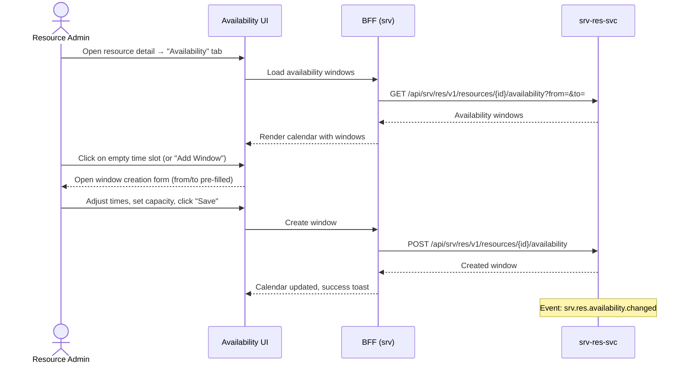

# F-SRV-003-02 — Availability Management

> **Conceptual Stack Layer:** Platform-Feature
> **Suite:** `srv` | **Node type:** LEAF | **Parent:** `F-SRV-003`
> **Companion UVL:** `F-SRV-003-02.uvl` | **Companion AUI:** `F-SRV-003-02.aui.yaml`
> **Version:** 2026-04-02 | **Status:** DRAFT
> **References:** `srv_res-spec.md` (UC-003: AddAvailabilityWindow, UC-006: GetResourceAvailability)
> **Template:** `feature-spec.md` v1.0.0
> **Template Compliance:** ~90% — missing: AUI Contract (SS6)

---

## ═══════════════════════════════════════════════
## PROBLEM SPACE
## ═══════════════════════════════════════════════

## 0. Feature Identity & Orientation

### 0.1 One-Line Summary
This feature lets a **resource administrator** define and manage availability windows for scheduling resources so that slot discovery can find bookable times.

### 0.2 Non-Goals
- Does not manage resource master data — that is `F-SRV-003-01`.
- Does not detect booking conflicts — that is `F-SRV-003-03`.
- Does not create appointments — that is `F-SRV-002-02`.
- Does not sync HR/FAC working-time rules — downstream integration (OPEN QUESTION).

### 0.3 Entry & Exit Points
**Entry points:** From resource detail (`F-SRV-003-01`) → "Availability" tab. Calendar view for a resource.
**Exit points:** Window saved → event `srv.res.availability.changed` emitted; calendar refreshes.

### 0.4 Variability Points
| Variability | Modelled as | UVL | Default | Binding time |
|---|---|---|---|---|
| Default calendar view | Attribute | `display.defaultView String "week"` | `"week"` | `deploy` |
| Min window duration | Attribute | `availability.minWindowMinutes Integer 30` | `30` | `deploy` |
| Allow overlapping windows (capacity > 1) | Attribute | `availability.allowOverlap Boolean false` | `false` | `deploy` |

### 0.5 Position in Feature Tree
```
F-SRV-003  Resource Scheduling           [COMPOSITION]
├── F-SRV-003-01  Resource Management    [LEAF] [mandatory]
├── F-SRV-003-02  Availability Mgmt     [LEAF] [mandatory] ← you are here
└── F-SRV-003-03  Conflict Detection     [LEAF] [mandatory]
```

---

## 1. User Goal & Scenarios

### 1.1 The User Goal
Define when each resource is available for booking, so that slot discovery only presents times that are genuinely bookable.

### 1.2 User Scenarios

**Scenario 1: Define weekly availability**
> Admin opens instructor M. Schmidt's availability tab and adds recurring windows: Mon-Fri 08:00-12:00 and 13:00-17:00 for the next quarter.

**Scenario 2: Add one-off availability**
> Admin adds a Saturday morning window 09:00-13:00 for a special workshop day.

**Scenario 3: Remove availability due to absence**
> Instructor calls in sick for Wednesday. Admin deletes Wednesday's availability window.

**Scenario 4: View availability as calendar**
> Scheduler views instructor's availability calendar to understand their schedule before booking.

---

## 2. User Journey & Screen Layout

### 2.1 Happy-Path Flow



### 2.2 Screen Layout
```
┌──────────────────────────────────────────────────────────┐
│  ZONE: zone-calendar-header (fixed)                      │
│  ┌─────────────────────────────────────────────────────┐ │
│  │ Resource: M. Schmidt (PERSON)    Status: ACTIVE      │ │
│  │ View: [Day] [Week] [Month]   ◀ 2026-04-07 ▶         │ │
│  │ [Add Availability Window]                             │ │
│  └─────────────────────────────────────────────────────┘ │
├──────────────────────────────────────────────────────────┤
│  ZONE: zone-calendar (fixed)                             │
│  ┌─────────────────────────────────────────────────────┐ │
│  │       │ Mon   │ Tue   │ Wed   │ Thu   │ Fri   │     │ │
│  │ 08:00 │▓▓▓▓▓▓│▓▓▓▓▓▓│▓▓▓▓▓▓│▓▓▓▓▓▓│▓▓▓▓▓▓│     │ │
│  │ 09:00 │▓▓▓▓▓▓│▓▓▓▓▓▓│▓▓▓▓▓▓│▓▓▓▓▓▓│▓▓▓▓▓▓│     │ │
│  │ ...   │      │      │      │      │      │     │ │
│  │ 12:00 │▓▓▓▓▓▓│▓▓▓▓▓▓│      │▓▓▓▓▓▓│▓▓▓▓▓▓│     │ │
│  │ 13:00 │▓▓▓▓▓▓│▓▓▓▓▓▓│      │▓▓▓▓▓▓│▓▓▓▓▓▓│     │ │
│  │       │      │      │      │      │      │     │ │
│  │ ▓ = Available   □ = Not available                    │ │
│  │ Click empty area to add   Click window to edit/delete│ │
│  └─────────────────────────────────────────────────────┘ │
├──────────────────────────────────────────────────────────┤
│  ZONE: zone-window-form (fixed, overlay/modal)           │
│  ┌─────────────────────────────────────────────────────┐ │
│  │ From*: [date-time]   To*: [date-time]                │ │
│  │ Capacity: [1] (default 1; > 1 for rooms)             │ │
│  │ [Save Window]  [Delete Window]  [Cancel]             │ │
│  └─────────────────────────────────────────────────────┘ │
├──────────────────────────────────────────────────────────┤
│  ZONE: zone-extension (variable)                   [EXT] │
├──────────────────────────────────────────────────────────┤
│  ZONE: zone-actions (fixed)                              │
│  │ [Back to Resource]                                   │ │
└──────────────────────────────────────────────────────────┘
```

---

## 3. Interaction Requirements

### 3.1 Fields & Controls
| Field | Type | Source | Required | Validation | Notes |
|---|---|---|---|---|---|
| From | datetime | User (click or input) | Yes | Not in the past | Pre-filled from click position |
| To | datetime | User | Yes | After From; min duration check | |
| Capacity | number | User | No | min 1; default 1 | > 1 for rooms |

### 3.2 Actions
| Action | Visible when | Enabled when | Role | Mutation? | API call |
|---|---|---|---|---|---|
| Add Window | Always | — | `SRV_RES_EDITOR` | Yes | `POST /resources/{id}/availability` |
| Edit Window | Click existing window | — | `SRV_RES_EDITOR` | Yes | `PATCH` (OPEN QUESTION) |
| Delete Window | Click existing window | — | `SRV_RES_EDITOR` | Yes | `DELETE /availability/{wid}` |
| Navigate calendar | Always | — | `SRV_RES_VIEWER` | No | `GET /availability?from=&to=` |

---

## 4. Edge Cases & Attribute-Driven Behaviour

### 4.1 Edge Cases
| ID | Condition | Expected behaviour |
|---|---|---|
| EC-001 | Overlapping window with `allowOverlap` = false | Error: "Overlapping availability window. Adjust times or increase capacity." (`RES_OVERLAP`) |
| EC-002 | Window shorter than `minWindowMinutes` | Error: "Minimum window duration is {N} minutes." |
| EC-003 | Delete window with existing bookings in that slot | Warning: "There are N bookings in this window. Delete anyway?" |
| EC-004 | From/To in the past | Error: "Availability windows cannot be in the past." |
| EC-005 | `srv-res-svc` unavailable | Calendar shows error banner. |

### 4.3 Attribute-Driven Behaviour
| Attribute | Non-default | Observable change |
|---|---|---|
| `display.defaultView` | `"day"` | Calendar opens in day view |
| `availability.minWindowMinutes` | `60` | Windows < 60 min rejected |
| `availability.allowOverlap` | `true` | Overlapping windows allowed (capacity model) |

---

## ═══════════════════════════════════════════════
## SOLUTION SPACE
## ═══════════════════════════════════════════════

## 5. Backend Dependencies & BFF Composition

### 5.1 Service Calls
| # | Service | Endpoint | Method | Tier | isMutation | Failure mode |
|---|---------|----------|--------|------|------------|-------------|
| 1 | `srv-res-svc` | `/api/srv/res/v1/resources/{id}/availability` | GET | T1 | No | Block |
| 2 | `srv-res-svc` | `/api/srv/res/v1/resources/{id}/availability` | POST | T1 | Yes | Block |
| 3 | `srv-res-svc` | `/api/srv/res/v1/resources/{id}/availability/{wid}` | DELETE | T1 | Yes | Block |

### 5.2 BFF View Model
```jsonc
{
  "resource": { "id": "uuid", "name": "M. Schmidt", "type": "PERSON" },
  "windows": [
    {
      "id": "uuid", "from": "2026-04-07T08:00:00Z", "to": "2026-04-07T12:00:00Z",
      "capacity": 1
    }
  ],
  "viewRange": { "from": "2026-04-07", "to": "2026-04-13" }
}
```

### 5.6 i18n Keys
| Key | Default (en) |
|---|---|
| `srv.res.availability.title` | "Availability" |
| `srv.res.availability.addAction` | "Add Availability Window" |
| `srv.res.availability.saveAction` | "Save Window" |
| `srv.res.availability.deleteAction` | "Delete Window" |
| `srv.res.availability.fromLabel` | "From" |
| `srv.res.availability.toLabel` | "To" |
| `srv.res.availability.capacityLabel` | "Capacity" |
| `srv.res.availability.overlapError` | "Overlapping availability window." |
| `srv.res.availability.minDurationError` | "Minimum window duration is {min} minutes." |
| `srv.res.availability.deleteWarning` | "There are {count} bookings in this window. Delete anyway?" |

---

## 7. Permissions & Accessibility

### 7.1 Permission Matrix
| Action | `SRV_RES_VIEWER` | `SRV_RES_EDITOR` | `SRV_RES_ADMIN` |
|---|---|---|---|
| View calendar | ✓ | ✓ | ✓ |
| Add/edit/delete windows | — | ✓ | ✓ |

### 7.2 Accessibility
- Calendar navigable via keyboard (arrow keys for date, Enter to select time slot).
- Availability windows have `aria-label` with from/to times.
- Color NOT sole indicator (use pattern fills or icons for available vs unavailable).

---

## 8. Acceptance Criteria

**AC-001:** Given editor clicks empty slot and saves valid window → window created, calendar updated, event emitted.
**AC-002:** Given overlapping window with `allowOverlap` = false → error shown.
**AC-003:** Given window < `minWindowMinutes` → error shown.
**AC-004:** Given delete with bookings → warning dialog.
**AC-005:** Given viewer → add/delete not available.
**AC-006:** Given `display.defaultView` = "day" → calendar opens in day view.
**AC-007:** Given `availability.allowOverlap` = true → overlapping windows accepted.
**AC-008:** Given feature excluded → availability tab not shown on resource detail.
**AC-009:** Given extension zone unfilled → zone hidden.
**AC-010:** Given `srv-res-svc` down → error banner on calendar.

---

## 9. Dependencies & Extension Points
### 9.2 Attributes
| Attribute | Type | Default | Binding Time |
|---|---|---|---|
| `display.defaultView` | String | "week" | deploy |
| `availability.minWindowMinutes` | Integer | 30 | deploy |
| `availability.allowOverlap` | Boolean | false | deploy |

### 9.3 Extension Points
| ID | Type | Description | Default |
|---|---|---|---|
| `ext.availability.customPanel` | zone | Custom panel (e.g., sync status with HR calendar) | Hidden |

---

## 10. Change Log
| Date | Version | Author | Changes |
|---|---|---|---|
| 2026-04-02 | 1.0 | OpenLeap Architecture Team | Initial spec |

### 10.1 Open Questions
| ID | Question | Impact | Owner | Needed by |
|---|---|---|---|---|
| Q-001 | Should recurring availability (weekly patterns) be modelled or is one-off only? | UX and data model | TBD | Phase 1 |
| Q-002 | How to sync availability from HR/FAC working-time calendars? | Integration pattern | TBD | Phase 2 |

**Status:** DRAFT
