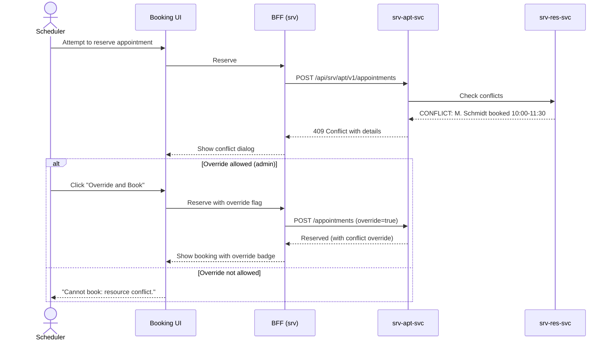

# F-SRV-003-03 — Conflict Detection

> **Conceptual Stack Layer:** Platform-Feature
> **Suite:** `srv` | **Node type:** LEAF | **Parent:** `F-SRV-003`
> **Companion UVL:** `F-SRV-003-03.uvl` | **Companion AUI:** `F-SRV-003-03.aui.yaml`
> **Version:** 2026-04-02 | **Status:** DRAFT
> **References:** `srv_res-spec.md` (BR-002: Conflict Detection), `srv_apt-spec.md` (BR-001: No Double-Booking)
> **Template:** `feature-spec.md` v1.0.0
> **Template Compliance:** ~90% — missing: AUI Contract (SS6)

---

## ═══════════════════════════════════════════════
## PROBLEM SPACE
## ═══════════════════════════════════════════════

## 0. Feature Identity & Orientation

### 0.1 One-Line Summary
This feature lets a **scheduler** see resource conflicts before or during booking so that double-bookings are prevented and overbooking is visible.

### 0.2 Non-Goals
- Does not manage resources — that is `F-SRV-003-01`.
- Does not manage availability windows — that is `F-SRV-003-02`.
- Does not resolve conflicts automatically (no auto-rescheduling) — OPEN QUESTION for Phase 2.
- Does not detect calendar conflicts in external systems — integration responsibility.

### 0.3 Entry & Exit Points
**Entry points:** Inline within Slot Discovery (`F-SRV-002-01`) — conflicts shown on slot cards. Within Booking Lifecycle (`F-SRV-002-02`) — conflict check before reserve/confirm.
**Exit points:** No conflict → booking proceeds. Conflict → blocks booking (or warning if override allowed).

### 0.4 Variability Points
| Variability | Modelled as | UVL | Default | Binding time |
|---|---|---|---|---|
| Show conflict details | Attribute | `conflict.showDetails Boolean true` | `true` | `deploy` |
| Allow admin override | Attribute | `conflict.allowOverride Boolean false` | `false` | `deploy` |

### 0.5 Position in Feature Tree
```
F-SRV-003  Resource Scheduling           [COMPOSITION]
├── F-SRV-003-01  Resource Management    [LEAF] [mandatory]
├── F-SRV-003-02  Availability Management [LEAF] [mandatory]
└── F-SRV-003-03  Conflict Detection     [LEAF] [mandatory] ← you are here
```

---

## 1. User Goal & Scenarios

### 1.1 The User Goal
Prevent double-bookings and make overbooking visible, so that every appointment is backed by genuinely available resources.

### 1.2 User Scenarios

**Scenario 1: Conflict detected at booking time**
> Scheduler tries to book instructor M. Schmidt for Wed 10:00-11:30, but M. Schmidt is already booked for a highway lesson at that time. The system shows a conflict: "M. Schmidt is booked for 'Highway Lesson' (10:00-11:30)." Booking is blocked.

**Scenario 2: Soft conflict — parallel session within limit**
> Resource "Room 101" has `maxParallelSessions` = 2 and currently has 1 booking at 10:00. The system allows the second booking (no conflict).

**Scenario 3: Admin override**
> A conflict exists but the admin determines it's acceptable (e.g., instructor will handle both via split timing). With `conflict.allowOverride` = true and admin role, they click "Override and Book" with a reason.

---

## 2. User Journey & Screen Layout

### 2.1 Happy-Path Flow (Conflict Blocked)



### 2.2 Screen Layout — Conflict Dialog
```
┌──────────────────────────────────────────────────────────┐
│  Conflict Dialog (modal)                                  │
│  ┌─────────────────────────────────────────────────────┐ │
│  │ ⚠ Resource Conflict Detected                        │ │
│  │                                                      │ │
│  │ Resource: M. Schmidt                                 │ │
│  │ Conflicting: "Highway Lesson" — Wed 10:00-11:30      │ │
│  │ (details shown if conflict.showDetails = true)       │ │
│  │                                                      │ │
│  │ [Override and Book] (if conflict.allowOverride + ADMIN)│
│  │ [Choose Different Slot]  [Cancel]                    │ │
│  └─────────────────────────────────────────────────────┘ │
└──────────────────────────────────────────────────────────┘
```

---

## 3. Interaction Requirements

### 3.2 Actions
| Action | Visible when | Enabled when | Role | Mutation? |
|---|---|---|---|---|
| Override and Book | Conflict + `allowOverride` = true | Reason provided | `SRV_APT_ADMIN` | Yes |
| Choose Different Slot | Conflict | Always | Any | No (navigates to Slot Discovery) |

---

## 4. Edge Cases & Attribute-Driven Behaviour

### 4.1 Edge Cases
| ID | Condition | Expected behaviour |
|---|---|---|
| EC-001 | Multiple conflicts for same slot | All conflicts listed in dialog |
| EC-002 | Parallel session within `maxParallelSessions` | No conflict — booking proceeds normally |
| EC-003 | Conflict check service unavailable | Warning: "Cannot verify resource availability. Proceed with caution?" |

### 4.3 Attribute-Driven Behaviour
| Attribute | Non-default | Observable change |
|---|---|---|
| `conflict.showDetails` | `false` | Conflict shown without appointment details (privacy-preserving) |
| `conflict.allowOverride` | `true` | "Override and Book" button visible for admin role |

---

## ═══════════════════════════════════════════════
## SOLUTION SPACE
## ═══════════════════════════════════════════════

## 5. Backend Dependencies & BFF Composition

### 5.1 Service Calls
| # | Service | Endpoint | Method | Tier | isMutation | Failure mode |
|---|---------|----------|--------|------|------------|-------------|
| 1 | `srv-res-svc` | `/api/srv/res/v1/availability/query` | POST | T1 | No | Degrade: warning |
| 2 | `srv-apt-svc` | `/api/srv/apt/v1/appointments` | POST | T1 | Yes | 409 = conflict |

### 5.2 BFF View Model
```jsonc
{
  "conflicts": [
    {
      "resourceId": "uuid", "resourceName": "M. Schmidt",
      "conflictingAppointmentId": "uuid",           // null if showDetails=false
      "conflictingOfferingName": "Highway Lesson",   // null if showDetails=false
      "conflictStart": "2026-04-09T10:00:00Z",
      "conflictEnd": "2026-04-09T11:30:00Z"
    }
  ],
  "canOverride": true  // conflict.allowOverride AND user has ADMIN role
}
```

### 5.6 i18n Keys
| Key | Default (en) |
|---|---|
| `srv.res.conflict.title` | "Resource Conflict Detected" |
| `srv.res.conflict.overrideAction` | "Override and Book" |
| `srv.res.conflict.chooseDifferent` | "Choose Different Slot" |
| `srv.res.conflict.details` | "{resource} is booked for '{offering}' ({start}–{end})." |
| `srv.res.conflict.noDetails` | "{resource} has a conflicting booking at this time." |
| `srv.res.conflict.unavailableWarning` | "Cannot verify resource availability. Proceed with caution?" |

---

## 7. Permissions & Accessibility

### 7.1 Permission Matrix
| Action | `SRV_APT_VIEWER` | `SRV_APT_EDITOR` | `SRV_APT_ADMIN` |
|---|---|---|---|
| See conflict info | ✓ | ✓ | ✓ |
| Override conflict | — | — | ✓ |

### 7.2 Accessibility
- Conflict dialog announced via `aria-live="assertive"`. Focus trapped in modal.
- Conflict icon uses both color and shape (not color-only).

---

## 8. Acceptance Criteria

**AC-001:** Given resource booked at same time → 409 conflict → conflict dialog shown.
**AC-002:** Given `conflict.showDetails` = true → conflicting appointment details visible.
**AC-003:** Given `conflict.showDetails` = false → generic conflict message (no appointment details).
**AC-004:** Given `conflict.allowOverride` = true and admin role → "Override and Book" visible.
**AC-005:** Given `conflict.allowOverride` = false → no override option; "Choose Different Slot" only.
**AC-006:** Given parallel booking within `maxParallelSessions` → no conflict, booking proceeds.
**AC-007:** Given conflict check service unavailable → warning shown, proceed at own risk.
**AC-008:** Given feature excluded → no conflict check at booking (DANGEROUS — suite constraint enforces mandatory).

---

## 9. Dependencies & Extension Points
### 9.2 Attributes
| Attribute | Type | Default | Binding Time |
|---|---|---|---|
| `conflict.showDetails` | Boolean | true | deploy |
| `conflict.allowOverride` | Boolean | false | deploy |

### 9.3 Extension Points
| ID | Type | Description | Default |
|---|---|---|---|
| `ext.conflict.customValidation` | rule | Custom conflict rules (e.g., break-time between sessions) | No-op |

---

## 10. Change Log
| Date | Version | Author | Changes |
|---|---|---|---|
| 2026-04-02 | 1.0 | OpenLeap Architecture Team | Initial spec |

**Status:** DRAFT
