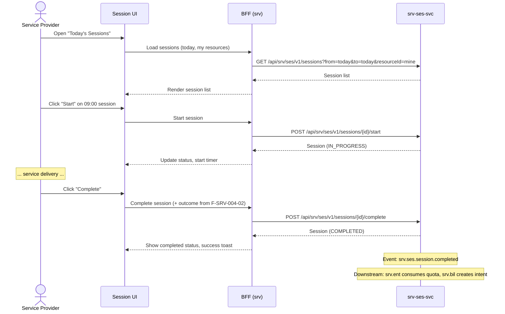

# F-SRV-004-01 — Session Lifecycle

> **Suite:** `srv` | **Node type:** LEAF | **Parent:** `F-SRV-004`
> **Companion UVL:** `F-SRV-004-01.uvl` | **Companion AUI:** `F-SRV-004-01.aui.yaml`
> **Version:** 2026-04-02 | **Status:** DRAFT
> **References:** `srv_ses-spec.md` (UC-001 to UC-006, Session aggregate lifecycle)
> **Template:** `feature-spec.md` v1.0.0
> **Template Compliance:** ~90% — missing: AUI Contract (SS6)

---

## 0. Feature Identity & Orientation

### 0.1 One-Line Summary
This feature lets a **service provider or back-office agent** manage session execution from start through completion or cancellation so that delivered service facts are captured accurately.

### 0.2 Non-Goals
- Does not record detailed outcomes — `F-SRV-004-02`. Does not manage proof artifacts — `F-SRV-004-03`.
- Does not create invoices — `srv.bil` / `fi`. Does not manage appointments — `F-SRV-002-02`.

### 0.3 Entry & Exit Points
**Entry:** Today's schedule dashboard; appointment detail; deep link with `sessionId`. Sessions auto-created from `srv.apt.appointment.booked` event.
**Exit:** Session completed → event `srv.ses.session.completed` → entitlement consumption + billing intent.

### 0.4 Variability Points
| Variability | UVL | Default | Binding time |
|---|---|---|---|
| Auto-start on check-in event | `session.autoStartOnCheckin Boolean false` | `false` | `deploy` |
| Records per page | `pagination.pageSize Integer 20` | `20` | `deploy` |
| Show case context | `display.showCaseContext Boolean true` | `true` | `deploy` |

---

## 1. User Goal & Scenarios

### 1.1 The User Goal
Capture the execution reality of each service delivery — when it started, when it ended, and how it went — so that downstream domains have authoritative facts.

### 1.2 User Scenarios

**Scenario 1: Start a planned session**
> Instructor opens today's sessions list, sees 09:00 "Practical B-License — Anna Müller" in PLANNED status. They click "Start Session" — status moves to IN_PROGRESS.

**Scenario 2: Complete a session**
> After the lesson, instructor clicks "Complete Session". The completion dialog opens (outcome fields from F-SRV-004-02 shown inline). Session becomes COMPLETED.

**Scenario 3: Cancel mid-session**
> Weather forces cancellation of an outdoor lesson. Agent opens the IN_PROGRESS session, clicks "Cancel", enters reason. Session becomes CANCELLED, entitlement reversal triggered.

**Scenario 4: View session history for a customer**
> Back-office agent searches sessions by customer to review all past deliveries for a dispute.

---

## 2. User Journey & Screen Layout

### 2.1 Happy-Path Flow



### 2.2 Screen Layout — Session List (Today's Schedule)
```
┌──────────────────────────────────────────────────────────┐
│  ZONE: zone-list-header (fixed)                          │
│  │ Today's Sessions   Resource: [My Sessions ▼]         │ │
│  │ Date: [2026-04-07]  Status [ALL ▼]  [Search]         │ │
├──────────────────────────────────────────────────────────┤
│  ZONE: zone-list (fixed)                                 │
│  │ Time  │ Customer     │ Offering        │ Status │ Act│ │
│  │ 09:00 │ Anna Müller  │ Practical B-Lic │ PLANNED│[▶] │ │
│  │ 10:30 │ Max Schmidt  │ Highway Lesson  │ PLANNED│[▶] │ │
│  │ 14:00 │ Lisa Weber   │ Theory Refresh  │ IN_PRG │[✓] │ │
├──────────────────────────────────────────────────────────┤
│  ZONE: zone-extension (variable)                   [EXT] │
└──────────────────────────────────────────────────────────┘
```

### 2.3 Screen Layout — Session Detail
```
┌──────────────────────────────────────────────────────────┐
│  ZONE: zone-session-header (fixed)                       │
│  │ Session: [ID]  Status: [IN_PROGRESS] (badge)         │ │
│  │ Started: 09:03   Duration: [running timer]            │ │
├──────────────────────────────────────────────────────────┤
│  ZONE: zone-session-details (fixed)                      │
│  │ Customer: Anna Müller     Offering: Practical B-Lic  │ │
│  │ Resource: M. Schmidt      Case: B-License Training   │ │
│  │ Appointment: Wed 09:00-10:30                          │ │
├──────────────────────────────────────────────────────────┤
│  ZONE: zone-case-context (feature-gated)                 │
│  │ Case: B-License Training — Session 12 of 20          │ │
│  │ Previous outcomes: ...                                │ │
├──────────────────────────────────────────────────────────┤
│  ZONE: zone-extension (variable)                   [EXT] │
├──────────────────────────────────────────────────────────┤
│  ZONE: zone-actions (fixed)                              │
│  │ [Start] (PLANNED)  [Complete] (IN_PROGRESS)          │ │
│  │ [Cancel] (PLANNED/IN_PROGRESS)  [Back]               │ │
└──────────────────────────────────────────────────────────┘
```

---

## 3. Interaction Requirements
| Action | Visible when | Role | Mutation? | API |
|---|---|---|---|---|
| Start | PLANNED | `SRV_SES_EDITOR` | Yes | `POST /sessions/{id}/start` |
| Complete | IN_PROGRESS | `SRV_SES_EDITOR` | Yes | `POST /sessions/{id}/complete` |
| Cancel | PLANNED/IN_PROGRESS | `SRV_SES_EDITOR` | Yes | `POST /sessions/{id}/cancel` |
| Search | Always | `SRV_SES_VIEWER` | No | `GET /sessions?...` |

---

## 4. Edge Cases
| ID | Condition | Behaviour |
|---|---|---|
| EC-001 | Start session before scheduled time | Warning: "Session is scheduled for {time}. Start early?" |
| EC-002 | Complete without outcome (if required by F-SRV-004-02) | Blocked: "Please record an outcome." |
| EC-003 | 412 conflict | "Session updated by another user. Reload." |
| EC-004 | `autoStartOnCheckin` = true + check-in event received | Session auto-starts; UI shows IN_PROGRESS on refresh |

### 4.3 Attribute-Driven Behaviour
| Attribute | Non-default | Change |
|---|---|---|
| `session.autoStartOnCheckin` | `true` | Sessions auto-start on check-in event |
| `display.showCaseContext` | `false` | Case context section hidden |

---

## 5. Backend Dependencies
| # | Service | Endpoint | Method | isMutation | Failure mode |
|---|---------|----------|--------|------------|-------------|
| 1 | `srv-ses-svc` | `/api/srv/ses/v1/sessions` | GET | No | Block |
| 2 | `srv-ses-svc` | `/api/srv/ses/v1/sessions/{id}/start` | POST | Yes | Block |
| 3 | `srv-ses-svc` | `/api/srv/ses/v1/sessions/{id}/complete` | POST | Yes | Block |
| 4 | `srv-ses-svc` | `/api/srv/ses/v1/sessions/{id}/cancel` | POST | Yes | Block |
| 5 | `srv-cat-svc` | `/api/srv/cat/v1/offerings/{id}` | GET | No | Degrade |
| 6 | `srv-cas-svc` | `/api/srv/cas/v1/cases/{id}` | GET | No | Degrade |

### 5.2 BFF View Model
```jsonc
{
  "sessions": [
    { "id": "uuid", "status": "PLANNED", "scheduledStart": "09:00", "customerName": "Anna Müller",
      "offeringName": "Practical B-Lic", "resourceName": "M. Schmidt" }
  ],
  "session": {
    "id": "uuid", "status": "IN_PROGRESS", "startedAt": "09:03:00Z",
    "appointmentId": "uuid", "customerPartyId": "uuid", "customerName": "Anna Müller",
    "serviceOfferingName": "Practical B-License", "resourceName": "M. Schmidt",
    "caseId": "uuid", "caseName": "B-License Training", "caseSessionNumber": 12, "caseTotalSessions": 20
  },
  "allowedActions": ["complete", "cancel"]
}
```

### 5.6 i18n Keys
| Key | Default (en) |
|---|---|
| `srv.ses.lifecycle.title` | "Sessions" |
| `srv.ses.lifecycle.todayTitle` | "Today's Sessions" |
| `srv.ses.lifecycle.startAction` | "Start Session" |
| `srv.ses.lifecycle.completeAction` | "Complete Session" |
| `srv.ses.lifecycle.cancelAction` | "Cancel Session" |
| `srv.ses.lifecycle.earlyStartWarning` | "Session is scheduled for {time}. Start early?" |
| `srv.ses.lifecycle.concurrentMod` | "Session updated by another user. Reload." |

---

## 7. Permissions
| Action | `SRV_SES_VIEWER` | `SRV_SES_EDITOR` | `SRV_SES_ADMIN` |
|---|---|---|---|
| View/search sessions | ✓ | ✓ | ✓ |
| Start/Complete/Cancel | — | ✓ | ✓ |
| Override status | — | — | ✓ |

---

## 8. Acceptance Criteria
**AC-001:** Given PLANNED session → editor clicks Start → IN_PROGRESS, event emitted.
**AC-002:** Given IN_PROGRESS → editor clicks Complete (+ outcome) → COMPLETED, event emitted.
**AC-003:** Given cancel with reason → CANCELLED, event emitted.
**AC-004:** Given `autoStartOnCheckin` = true → auto-start on event.
**AC-005:** Given viewer → Start/Complete/Cancel absent from DOM.
**AC-006:** Given `display.showCaseContext` = false → case section hidden.
**AC-007:** Given feature excluded → sessions not accessible.
**AC-008:** Given 412 → concurrent modification banner.
**AC-009:** Given deep link with sessionId → detail shown.
**AC-010:** Given extension zone unfilled → hidden.

---

## 9. Attributes & Extension Points
| Attribute | Type | Default | Binding Time |
|---|---|---|---|
| `session.autoStartOnCheckin` | Boolean | false | deploy |
| `pagination.pageSize` | Integer | 20 | deploy |
| `display.showCaseContext` | Boolean | true | deploy |

| Extension Point | Type | Description | Default |
|---|---|---|---|
| `ext.session.customPanel` | zone | Custom panels (e.g., clinical notes, industry forms) | Hidden |

---

## 10. Change Log
| Date | Version | Author | Changes |
|---|---|---|---|
| 2026-04-02 | 1.0 | OpenLeap Architecture Team | Initial spec |

**Status:** DRAFT
