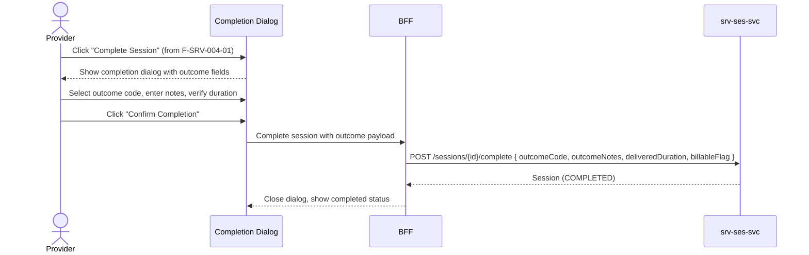

# F-SRV-004-02 — Outcome Recording

> **Suite:** `srv` | **Node type:** LEAF | **Parent:** `F-SRV-004`
> **Companion UVL:** `F-SRV-004-02.uvl` | **Companion AUI:** `F-SRV-004-02.aui.yaml`
> **Version:** 2026-04-02 | **Status:** DRAFT
> **References:** `srv_ses-spec.md` (outcomeCode, outcomeNotes, deliveredDuration fields on Session aggregate)
> **Template:** `feature-spec.md` v1.0.0
> **Template Compliance:** ~90% — missing: AUI Contract (SS6)

---

## 0. Feature Identity & Orientation

### 0.1 One-Line Summary
This feature lets a **service provider** record structured outcomes and notes when completing a session so that delivery quality and results are captured for case history and billing.

### 0.2 Non-Goals
- Does not manage session lifecycle (start/complete) — that is `F-SRV-004-01`.
- Does not manage proof artifacts — that is `F-SRV-004-03`.
- Does not implement industry-specific clinical/regulatory recording — extension point.

### 0.3 Entry & Exit Points
**Entry:** Inline within "Complete Session" dialog from `F-SRV-004-01`.
**Exit:** Outcome saved as part of session completion → session COMPLETED.

### 0.4 Variability Points
| Variability | UVL | Default | Binding time |
|---|---|---|---|
| Require outcome code | `outcome.requireCode Boolean false` | `false` | `deploy` |
| Outcome code list | `outcome.codeList String "COMPLETED_NORMAL"` | `"COMPLETED_NORMAL"` | `deploy` |
| Require notes | `outcome.requireNotes Boolean false` | `false` | `deploy` |
| Show delivered duration | `outcome.showDuration Boolean true` | `true` | `deploy` |

---

## 1. User Scenarios

**Scenario 1:** Instructor completes lesson, selects "COMPLETED_NORMAL", adds notes "Student needs highway practice", duration auto-filled from timer.
**Scenario 2:** Therapist records "PARTIAL_COMPLETION" with duration override 30 min (out of 60 planned) — only half session delivered.
**Scenario 3:** No outcome code required (default) — provider just clicks Complete without filling outcome fields.

---

## 2. Screen Layout



```
┌──────────────────────────────────────────────────────────┐
│  Completion Dialog (modal, within F-SRV-004-01)          │
│  ┌─────────────────────────────────────────────────────┐ │
│  │ Complete Session                                     │ │
│  │                                                      │ │
│  │ Outcome Code: [COMPLETED_NORMAL ▼] (gated)          │ │
│  │ Notes: [textarea____________________] (gated)       │ │
│  │ Delivered Duration: [90] min (gated, auto-filled)   │ │
│  │ Billable: [✓] (default checked)                     │ │
│  │                                                      │ │
│  │ ZONE: zone-outcome-extension (variable)        [EXT] │ │
│  │                                                      │ │
│  │ [Confirm Completion]  [Cancel]                       │ │
│  └─────────────────────────────────────────────────────┘ │
└──────────────────────────────────────────────────────────┘
```

---

## 3. Fields & Actions
| Field | Type | Required | Validation | Notes |
|---|---|---|---|---|
| Outcome Code | dropdown | Gated by `outcome.requireCode` | From `outcome.codeList` | |
| Notes | textarea | Gated by `outcome.requireNotes` | max 2000 | |
| Delivered Duration | number (min) | No | positive; auto-filled from timer | Gated by `outcome.showDuration` |
| Billable | checkbox | No | default true | |

---

## 4. Edge Cases
| ID | Condition | Behaviour |
|---|---|---|
| EC-001 | `outcome.requireCode` = true, no code selected | "Please select an outcome code." Completion blocked. |
| EC-002 | `outcome.requireNotes` = true, notes blank | "Please enter outcome notes." Completion blocked. |
| EC-003 | Duration override > planned duration | Warning (non-blocking): "Delivered duration exceeds planned." |

### 4.3 Attribute-Driven Behaviour
| Attribute | Non-default | Change |
|---|---|---|
| `outcome.requireCode` | `true` | Code dropdown required |
| `outcome.requireNotes` | `true` | Notes textarea required |
| `outcome.showDuration` | `false` | Duration field hidden |

---

## 5. Backend Dependencies
| # | Service | Endpoint | Method | isMutation |
|---|---------|----------|--------|------------|
| 1 | `srv-ses-svc` | `/api/srv/ses/v1/sessions/{id}/complete` | POST | Yes |

### 5.2 BFF View Model
```jsonc
{
  "outcomeCodes": ["COMPLETED_NORMAL", "PARTIAL_COMPLETION", "CANCELLED_EARLY"],
  "suggestedDuration": 87,  // from timer (startedAt to now, in minutes)
  "plannedDuration": 90     // from offering
}
```

### 5.6 i18n Keys
| Key | Default (en) |
|---|---|
| `srv.ses.outcome.title` | "Complete Session" |
| `srv.ses.outcome.codeLabel` | "Outcome Code" |
| `srv.ses.outcome.notesLabel` | "Notes" |
| `srv.ses.outcome.durationLabel` | "Delivered Duration (minutes)" |
| `srv.ses.outcome.billableLabel` | "Billable" |
| `srv.ses.outcome.codeRequired` | "Please select an outcome code." |
| `srv.ses.outcome.notesRequired` | "Please enter outcome notes." |
| `srv.ses.outcome.durationWarning` | "Delivered duration exceeds planned duration." |
| `srv.ses.outcome.confirmAction` | "Confirm Completion" |

---

## 7. Permissions
| Action | `SRV_SES_VIEWER` | `SRV_SES_EDITOR` | `SRV_SES_ADMIN` |
|---|---|---|---|
| View outcomes | ✓ | ✓ | ✓ |
| Record outcome (via completion) | — | ✓ | ✓ |

---

## 8. Acceptance Criteria
**AC-001:** Given `outcome.requireCode` = true → completion blocked without code.
**AC-002:** Given `outcome.requireNotes` = true → completion blocked without notes.
**AC-003:** Given completion with valid outcome → session COMPLETED, outcome stored.
**AC-004:** Given `outcome.showDuration` = false → duration field hidden.
**AC-005:** Given duration > planned → warning shown (non-blocking).
**AC-006:** Given feature excluded → completion dialog has no outcome fields.
**AC-007:** Given extension zone unfilled → hidden.

---

## 9. Attributes & Extension Points
| Attribute | Type | Default | Binding Time |
|---|---|---|---|
| `outcome.requireCode` | Boolean | false | deploy |
| `outcome.codeList` | String | "COMPLETED_NORMAL" | deploy |
| `outcome.requireNotes` | Boolean | false | deploy |
| `outcome.showDuration` | Boolean | true | deploy |

| Extension Point | Type | Description | Default |
|---|---|---|---|
| `ext.outcome.customFields` | zone | Industry-specific outcome fields (e.g., clinical scores) | Hidden |

---

## 10. Change Log
| Date | Version | Author | Changes |
|---|---|---|---|
| 2026-04-02 | 1.0 | OpenLeap Architecture Team | Initial spec |

**Status:** DRAFT
