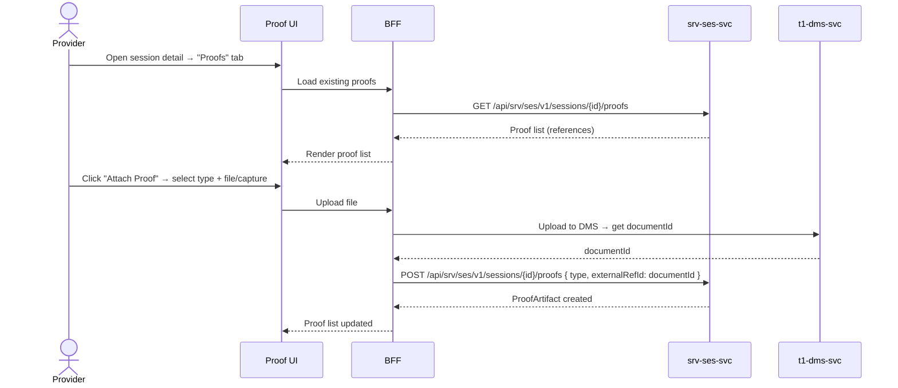

# F-SRV-004-03 — Proof-of-Service

> **Suite:** `srv` | **Node type:** LEAF | **Parent:** `F-SRV-004`
> **Companion UVL:** `F-SRV-004-03.uvl` | **Companion AUI:** `F-SRV-004-03.aui.yaml`
> **Version:** 2026-04-02 | **Status:** DRAFT
> **References:** `srv_ses-spec.md` (ProofArtifact entity, ProofType enum)
> **Template:** `feature-spec.md` v1.0.0
> **Template Compliance:** ~90% — missing: AUI Contract (SS6)

---

## 0. Feature Identity & Orientation

### 0.1 One-Line Summary
This feature lets a **service provider** attach proof artifacts (signatures, documents, photos) to a session so that delivery is evidenced for billing and compliance.

### 0.2 Non-Goals
- Does not store binary files — delegates to `t1.dms` (Document Management Service).
- Does not manage session lifecycle — `F-SRV-004-01`. Does not record outcomes — `F-SRV-004-02`.
- Does not define which proofs are required per offering — extension point or `srv.cat` metadata (OPEN QUESTION).

### 0.3 Entry & Exit Points
**Entry:** From session detail → "Proofs" tab/section. Also available inline in completion dialog.
**Exit:** Proof attached → reference stored on session; file in DMS.

### 0.4 Variability Points
| Variability | UVL | Default | Binding time |
|---|---|---|---|
| Allowed proof types | `proof.allowedTypes String "SIGNATURE,DOCUMENT,PHOTO"` | all | `deploy` |
| Require at least one proof | `proof.requireAtLeastOne Boolean false` | `false` | `deploy` |

---

## 1. User Scenarios

**Scenario 1:** Instructor captures customer signature on tablet → signature stored in DMS, reference attached to session.
**Scenario 2:** Back-office uploads scan of delivery note → document attached.
**Scenario 3:** Physiotherapist takes photo of treatment result → photo attached.

---

## 2. Screen Layout



```
┌──────────────────────────────────────────────────────────┐
│  ZONE: zone-proof-list (fixed)                           │
│  ┌─────────────────────────────────────────────────────┐ │
│  │ Type      │ Description     │ Captured   │ Actions  │ │
│  │ SIGNATURE │ Customer sign.  │ 09:35      │ [👁][✕]  │ │
│  │ DOCUMENT  │ Delivery note   │ 09:40      │ [👁][✕]  │ │
│  │                                                      │ │
│  │ [Attach Proof] (role-gated)                          │ │
│  └─────────────────────────────────────────────────────┘ │
├──────────────────────────────────────────────────────────┤
│  ZONE: zone-capture (fixed, overlay)                     │
│  │ Type: [SIGNATURE ▼] (filtered by proof.allowedTypes) │ │
│  │ File: [Choose File / Capture Signature]               │ │
│  │ Description: [__________________]                     │ │
│  │ [Upload]  [Cancel]                                    │ │
├──────────────────────────────────────────────────────────┤
│  ZONE: zone-extension (variable)                   [EXT] │
└──────────────────────────────────────────────────────────┘
```

---

## 3. Fields & Actions
| Field | Type | Required | Validation |
|---|---|---|---|
| Proof Type | dropdown | Yes | Filtered by `proof.allowedTypes` |
| File / Capture | file input or signature pad | Yes | Max file size (DMS limit) |
| Description | input | No | max 500 chars |

| Action | Role | Mutation? | API |
|---|---|---|---|
| Attach Proof | `SRV_SES_EDITOR` | Yes | DMS upload + `POST /sessions/{id}/proofs` |
| View Proof | `SRV_SES_VIEWER` | No | DMS download |
| Delete Proof | `SRV_SES_EDITOR` | Yes | `DELETE /sessions/{id}/proofs/{pid}` |

---

## 4. Edge Cases
| ID | Condition | Behaviour |
|---|---|---|
| EC-001 | `proof.requireAtLeastOne` = true, no proofs, user tries to complete | Completion blocked: "At least one proof artifact is required." |
| EC-002 | `proof.allowedTypes` excludes PHOTO | Photo option not in dropdown |
| EC-003 | DMS unavailable | Upload fails; error: "Document storage temporarily unavailable." |
| EC-004 | File too large | Error from DMS; show: "File exceeds maximum size." |

---

## 5. Backend Dependencies
| # | Service | Endpoint | Method | isMutation | Failure mode |
|---|---------|----------|--------|------------|-------------|
| 1 | `srv-ses-svc` | `/sessions/{id}/proofs` | GET | No | Block |
| 2 | `srv-ses-svc` | `/sessions/{id}/proofs` | POST | Yes | Block |
| 3 | `t1-dms-svc` | `/api/t1/dms/v1/documents` | POST | Yes | Block (upload) |
| 4 | `t1-dms-svc` | `/api/t1/dms/v1/documents/{id}` | GET | No | Degrade (preview) |

### 5.6 i18n Keys
| Key | Default (en) |
|---|---|
| `srv.ses.proof.title` | "Proof of Service" |
| `srv.ses.proof.attachAction` | "Attach Proof" |
| `srv.ses.proof.typeLabel` | "Proof Type" |
| `srv.ses.proof.fileLabel` | "File" |
| `srv.ses.proof.descriptionLabel` | "Description" |
| `srv.ses.proof.required` | "At least one proof artifact is required." |
| `srv.ses.proof.dmsUnavailable` | "Document storage temporarily unavailable." |
| `srv.ses.proof.fileTooLarge` | "File exceeds maximum size." |

---

## 7. Permissions
| Action | `SRV_SES_VIEWER` | `SRV_SES_EDITOR` | `SRV_SES_ADMIN` |
|---|---|---|---|
| View proofs | ✓ | ✓ | ✓ |
| Attach/delete | — | ✓ | ✓ |

---

## 8. Acceptance Criteria
**AC-001:** Given editor uploads file and selects type → proof attached, list updated.
**AC-002:** Given `proof.requireAtLeastOne` = true and no proofs → completion blocked.
**AC-003:** Given `proof.allowedTypes` excludes PHOTO → photo not in dropdown.
**AC-004:** Given DMS unavailable → upload error shown.
**AC-005:** Given viewer → attach/delete absent from DOM.
**AC-006:** Given feature excluded → proof section not shown on session detail.

---

## 9. Attributes & Extension Points
| Attribute | Type | Default | Binding Time |
|---|---|---|---|
| `proof.allowedTypes` | String | "SIGNATURE,DOCUMENT,PHOTO" | deploy |
| `proof.requireAtLeastOne` | Boolean | false | deploy |

| Extension Point | Type | Description | Default |
|---|---|---|---|
| `ext.proof.customCapture` | zone | Custom capture UI (e.g., biometric signature pad) | Hidden |

---

## 10. Change Log
| Date | Version | Author | Changes |
|---|---|---|---|
| 2026-04-02 | 1.0 | OpenLeap Architecture Team | Initial spec |

### 10.1 Open Questions
| ID | Question | Impact | Owner | Needed by |
|---|---|---|---|---|
| Q-001 | Which DMS API is authoritative for file upload? | Integration contract | TBD | Phase 1 |
| Q-002 | Should proof requirements per offering be configurable in `srv.cat`? | Affects `requireAtLeastOne` enforcement | TBD | Phase 2 |

**Status:** DRAFT
