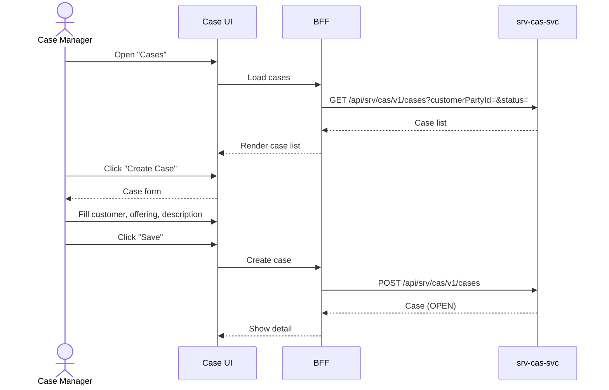

# F-SRV-005-01 — Case Lifecycle

> **Suite:** `srv` | **Node type:** LEAF | **Parent:** `F-SRV-005`
> **Companion UVL:** `F-SRV-005-01.uvl` | **Companion AUI:** `F-SRV-005-01.aui.yaml`
> **Version:** 2026-04-02 | **Status:** DRAFT
> **References:** `srv_cas-spec.md` (Case aggregate, 4-state lifecycle OPEN→ACTIVE→PAUSED→CLOSED)
> **Template:** `feature-spec.md` v1.0.0
> **Template Compliance:** ~90% — missing: AUI Contract (SS6)

---

## 0. Feature Identity & Orientation

### 0.1 One-Line Summary
This feature lets a **case manager** create, view, and manage cases that group related sessions so that cross-session reasoning and treatment tracking is possible.

### 0.2 Non-Goals
- Does not link sessions to cases — `F-SRV-005-02`. Does not manage entitlements — `F-SRV-006-01`.
- Does not create appointments — `F-SRV-002-02`. Does not manage billing — `srv.bil`.

### 0.3 Entry & Exit Points
**Entry:** Navigation "Cases" → case list. "Create Case". Customer detail → "Cases" tab. Deep link.
**Exit:** Case created/updated → stays on detail. Case closed → event emitted.

### 0.4 Variability Points
| Variability | UVL | Default | Binding time |
|---|---|---|---|
| Records per page | `pagination.pageSize Integer 20` | `20` | `deploy` |
| Require close reason | `case.requireCloseReason Boolean false` | `false` | `deploy` |
| Show session count | `display.showSessionCount Boolean true` | `true` | `deploy` |

---

## 1. User Scenarios
**Scenario 1:** Case manager creates case "B-License Training — Anna Müller" grouping 20 planned lessons. Case status OPEN.
**Scenario 2:** After all sessions completed, manager closes case with summary notes.
**Scenario 3:** Manager pauses case (student on break) → case PAUSED → no new sessions linked.
**Scenario 4:** Manager searches cases by customer to review treatment history.

---

## 2. Screen Layout



```
┌──────────────────────────────────────────────────────────┐
│  ZONE: zone-list-header (fixed)                          │
│  │ Search [text] Customer [lookup] Status [▼] [Search]  │ │
│  │ [Create Case]                                         │ │
├──────────────────────────────────────────────────────────┤
│  ZONE: zone-list (fixed)                                 │
│  │ Case Title      │ Customer  │ Status │ Sessions │ Act│ │
│  │ B-License Anna  │ A. Müller │ OPEN   │ 12/20   │ [→]│ │
│  │ Physio Max      │ M.Schmidt │ CLOSED │  8/8    │ [→]│ │
├──────────────────────────────────────────────────────────┤

--- Case Detail ---
┌──────────────────────────────────────────────────────────┐
│  ZONE: zone-case-header (fixed)                          │
│  │ Case: B-License Training  Status: [OPEN] (badge)     │ │
│  │ Customer: Anna Müller  Offering: Practical B-License  │ │
├──────────────────────────────────────────────────────────┤
│  ZONE: zone-case-details (fixed)                         │
│  │ Description: [textarea]  Created: 2026-01-15          │ │
│  │ Sessions: 12 completed / 20 planned (gated)           │ │
├──────────────────────────────────────────────────────────┤
│  ZONE: zone-sessions-tab (→ F-SRV-005-02)               │
├──────────────────────────────────────────────────────────┤
│  ZONE: zone-extension (variable)                   [EXT] │
├──────────────────────────────────────────────────────────┤
│  ZONE: zone-actions (fixed)                              │
│  │ [Pause] (OPEN/ACTIVE) [Resume] (PAUSED) [Close] (any)│ │
│  │ [Edit] [Back]                                         │ │
└──────────────────────────────────────────────────────────┘
```

---

## 3–4. Interaction & Edge Cases
| Action | Visible when | Role | Mutation? | API |
|---|---|---|---|---|
| Create | List | `SRV_CAS_EDITOR` | Yes | `POST /cases` |
| Edit | Detail | `SRV_CAS_EDITOR` | Yes | `PATCH /cases/{id}` |
| Pause | OPEN/ACTIVE | `SRV_CAS_EDITOR` | Yes | `POST /cases/{id}/pause` |
| Resume | PAUSED | `SRV_CAS_EDITOR` | Yes | `POST /cases/{id}/resume` |
| Close | Any non-CLOSED | `SRV_CAS_EDITOR` | Yes | `POST /cases/{id}/close` |

| EC-ID | Condition | Behaviour |
|---|---|---|
| EC-001 | Close with `requireCloseReason` = true, no reason | "Please provide a close reason." |
| EC-002 | Close with uncompleted sessions | Warning: "Case has N uncompleted sessions. Close anyway?" |

---

## 5. Backend & BFF
| # | Service | Endpoint | Method | isMutation |
|---|---------|----------|--------|------------|
| 1 | `srv-cas-svc` | `/api/srv/cas/v1/cases` | GET/POST | Yes |
| 2 | `srv-cas-svc` | `/api/srv/cas/v1/cases/{id}` | GET/PATCH | Yes |
| 3 | `srv-cas-svc` | `/api/srv/cas/v1/cases/{id}/close` | POST | Yes |
| 4 | `srv-cas-svc` | `/api/srv/cas/v1/cases/{id}/pause` | POST | Yes |

### 5.2 BFF View Model
```jsonc
{
  "cases": [{ "id":"uuid","title":"B-License Training","customerName":"Anna Müller","status":"OPEN","sessionCount":12,"plannedSessions":20 }],
  "case": { "id":"uuid","title":"...","customerPartyId":"uuid","serviceOfferingId":"uuid","description":"...","status":"OPEN","version":3 },
  "allowedActions": ["pause","close","edit"]
}
```

### 5.6 i18n Keys
| Key | Default |
|---|---|
| `srv.cas.lifecycle.title` | "Cases" |
| `srv.cas.lifecycle.createAction` | "Create Case" |
| `srv.cas.lifecycle.closeAction` | "Close Case" |
| `srv.cas.lifecycle.pauseAction` | "Pause" |
| `srv.cas.lifecycle.resumeAction` | "Resume" |
| `srv.cas.lifecycle.closeReasonLabel` | "Close Reason" |
| `srv.cas.lifecycle.closeReasonRequired` | "Please provide a close reason." |
| `srv.cas.lifecycle.closeWarning` | "Case has {count} uncompleted sessions. Close anyway?" |

---

## 7. Permissions
| Action | `SRV_CAS_VIEWER` | `SRV_CAS_EDITOR` | `SRV_CAS_ADMIN` |
|---|---|---|---|
| View/search | ✓ | ✓ | ✓ |
| Create/edit/pause/resume/close | — | ✓ | ✓ |

---

## 8. Acceptance Criteria
**AC-001:** Given editor creates case → OPEN, success.
**AC-002:** Given `case.requireCloseReason` = true, no reason → blocked.
**AC-003:** Given close with uncompleted sessions → warning.
**AC-004:** Given viewer → mutation buttons absent.
**AC-005:** Given `display.showSessionCount` = false → session count hidden.
**AC-006:** Given feature excluded → "Cases" removed from navigation.
**AC-007:** Given deep link → case detail shown.

---

## 9. Attributes & Extensions
| Attribute | Type | Default | Binding Time |
|---|---|---|---|
| `pagination.pageSize` | Integer | 20 | deploy |
| `case.requireCloseReason` | Boolean | false | deploy |
| `display.showSessionCount` | Boolean | true | deploy |

| Extension Point | Type | Description | Default |
|---|---|---|---|
| `ext.case.customPanel` | zone | Industry-specific panels (e.g., treatment plan) | Hidden |

---

## 10. Change Log
| Date | Version | Author | Changes |
|---|---|---|---|
| 2026-04-02 | 1.0 | OpenLeap Architecture Team | Initial spec |

**Status:** DRAFT
