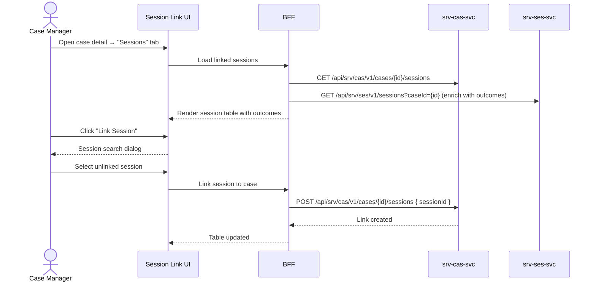

# F-SRV-005-02 — Session Linking

> **Suite:** `srv` | **Node type:** LEAF | **Parent:** `F-SRV-005`
> **Companion UVL:** `F-SRV-005-02.uvl` | **Companion AUI:** `F-SRV-005-02.aui.yaml`
> **Version:** 2026-04-02 | **Status:** DRAFT
> **References:** `srv_cas-spec.md` (SessionLink entity)
> **Template:** `feature-spec.md` v1.0.0
> **Template Compliance:** ~90% — missing: AUI Contract (SS6)

---

## 0. Feature Identity & Orientation

### 0.1 One-Line Summary
This feature lets a **case manager** view and manage the link between sessions and cases so that case progress and session history are visible in context.

### 0.2 Non-Goals
- Does not manage the case itself — `F-SRV-005-01`. Does not execute sessions — `F-SRV-004-01`.

### 0.3 Entry & Exit Points
**Entry:** Case detail → "Sessions" tab.
**Exit:** Session linked/unlinked → case detail refreshes.

### 0.4 Variability Points
| Variability | UVL | Default | Binding time |
|---|---|---|---|
| Auto-link from booking | `linking.autoLinkFromBooking Boolean true` | `true` | `deploy` |
| Show outcome inline | `linking.showOutcome Boolean true` | `true` | `deploy` |

---

## 1. User Scenarios
**Scenario 1:** Case detail shows 12 of 20 sessions completed, with dates, outcomes, and duration.
**Scenario 2:** Manager manually links an existing session created outside the case context.
**Scenario 3:** Manager unlinks a session erroneously added to this case.

---

## 2. Screen Layout



```
┌──────────────────────────────────────────────────────────┐
│  Sessions Tab (within Case Detail)                       │
│  ┌─────────────────────────────────────────────────────┐ │
│  │ # │ Date       │ Offering       │ Status    │ Outc. │ │
│  │ 1 │ 2026-01-20 │ Practical B    │ COMPLETED │ ✓     │ │
│  │ 2 │ 2026-01-27 │ Practical B    │ COMPLETED │ ✓     │ │
│  │...│            │                │           │       │ │
│  │12 │ 2026-04-07 │ Highway Lesson │ PLANNED   │ —     │ │
│  │                                                      │ │
│  │ Progress: 11/20 completed (55%)  ▓▓▓▓▓▓░░░░░        │ │
│  │                                                      │ │
│  │ [Link Session] [Unlink Selected]                     │ │
│  └─────────────────────────────────────────────────────┘ │
│  ZONE: zone-extension (variable)                   [EXT] │
└──────────────────────────────────────────────────────────┘
```

---

## 3. Actions
| Action | Role | Mutation? | API |
|---|---|---|---|
| View linked sessions | `SRV_CAS_VIEWER` | No | `GET /cases/{id}/sessions` |
| Link session | `SRV_CAS_EDITOR` | Yes | `POST /cases/{id}/sessions` |
| Unlink session | `SRV_CAS_EDITOR` | Yes | `DELETE /cases/{id}/sessions/{sid}` |

---

## 4. Edge Cases
| ID | Condition | Behaviour |
|---|---|---|
| EC-001 | Session already linked to another case | Error: "Session is already linked to case '{name}'." |
| EC-002 | `autoLinkFromBooking` = true | Sessions from case-linked appointments auto-link |
| EC-003 | Unlink last session from case | Warning: "This is the last linked session. Unlink anyway?" |

---

## 5. Backend & BFF
| # | Service | Endpoint | Method | isMutation |
|---|---------|----------|--------|------------|
| 1 | `srv-cas-svc` | `/api/srv/cas/v1/cases/{id}/sessions` | GET | No |
| 2 | `srv-cas-svc` | `/api/srv/cas/v1/cases/{id}/sessions` | POST | Yes |
| 3 | `srv-cas-svc` | `/api/srv/cas/v1/cases/{id}/sessions/{sid}` | DELETE | Yes |
| 4 | `srv-ses-svc` | `/api/srv/ses/v1/sessions?caseId=` | GET | No |

### 5.2 BFF View Model
```jsonc
{
  "linkedSessions": [
    { "sessionId":"uuid","date":"2026-01-20","offeringName":"Practical B","status":"COMPLETED","outcomeCode":"COMPLETED_NORMAL","deliveredDuration":87 }
  ],
  "progress": { "completed": 11, "total": 20, "percentage": 55 }
}
```

### 5.6 i18n Keys
| Key | Default |
|---|---|
| `srv.cas.linking.title` | "Sessions" |
| `srv.cas.linking.linkAction` | "Link Session" |
| `srv.cas.linking.unlinkAction` | "Unlink" |
| `srv.cas.linking.progress` | "{completed} of {total} completed ({percent}%)" |
| `srv.cas.linking.alreadyLinked` | "Session is already linked to case '{name}'." |

---

## 7–8. Permissions & ACs
| Action | `SRV_CAS_VIEWER` | `SRV_CAS_EDITOR` |
|---|---|---|
| View sessions | ✓ | ✓ |
| Link/unlink | — | ✓ |

**AC-001:** Given case detail → sessions tab shows linked sessions with progress bar.
**AC-002:** Given `autoLinkFromBooking` = true → sessions from case appointments auto-link.
**AC-003:** Given manually link → session appears in list.
**AC-004:** Given session already linked elsewhere → error.
**AC-005:** Given `linking.showOutcome` = false → outcome column hidden.
**AC-006:** Given viewer → link/unlink absent.

---

## 9. Attributes & Extensions
| Attribute | Type | Default | Binding Time |
|---|---|---|---|
| `linking.autoLinkFromBooking` | Boolean | true | deploy |
| `linking.showOutcome` | Boolean | true | deploy |

| Extension Point | Type | Description | Default |
|---|---|---|---|
| `ext.sessionLink.customView` | zone | Custom session summary view | Hidden |

---

## 10. Change Log
| Date | Version | Author | Changes |
|---|---|---|---|
| 2026-04-02 | 1.0 | OpenLeap Architecture Team | Initial spec |

**Status:** DRAFT
