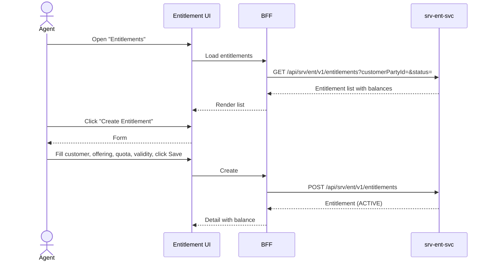

# F-SRV-006-01 — Entitlement Management

> **Suite:** `srv` | **LEAF** | **Parent:** `F-SRV-006`
> **UVL:** `F-SRV-006-01.uvl` | **AUI:** `F-SRV-006-01.aui.yaml`
> **Version:** 2026-04-02 | **Status:** DRAFT
> **References:** `srv_ent-spec.md` (Entitlement aggregate, 5-state lifecycle)
> **Template:** `feature-spec.md` v1.0.0
> **Template Compliance:** ~90% — missing: AUI Contract (SS6)

---

## 0.1 One-Line Summary
This feature lets a **back-office agent** create, view, and manage entitlements (quotas, subscriptions) for customers so that service consumption is tracked against contracted rights.

## 0.2 Non-Goals
- Does not check eligibility — `F-SRV-006-02`. Does not consume quota — `F-SRV-006-03`.
- Does not sell/renew — `sd`/`com`. Does not create invoices — `fi`.

## 0.3 Entry & Exit Points
**Entry:** Navigation "Entitlements"; customer detail → "Entitlements" tab. Deep link.
**Exit:** Entitlement created/updated → detail; event emitted.

## 0.4 Variability Points
| Variability | UVL | Default | Binding |
|---|---|---|---|
| Records per page | `pagination.pageSize Integer 20` | `20` | deploy |
| Show balance inline | `entitlement.showBalance Boolean true` | `true` | deploy |
| Allow manual creation | `entitlement.allowManualCreate Boolean true` | `true` | deploy |

---

## 1. User Scenarios
**S1:** Agent creates "20 × Driving Lesson" for Anna Müller, validity 2026-01-01 to 2026-12-31. Status ACTIVE.
**S2:** Agent views balance: 8 of 20 consumed, 12 remaining. Expiry in 8 months.
**S3:** Agent cancels entitlement after customer refund (status → CANCELLED, event triggers reversal).
**S4:** Entitlement auto-expires on validity end date (system event).

---

## 2. Screen Layout



```
┌──────────────────────────────────────────────────────────┐
│  ZONE: zone-list-header │ Search Customer [lookup] Status [▼] [Search] [Create]│
├──────────────────────────────────────────────────────────┤
│  ZONE: zone-list │ Customer│Offering│Status│Balance│Expiry│Act │
│  │ A.Müller│Practical B│ACTIVE│12/20│2026-12-31│[→]│
│  │ M.Schmidt│Physio Pack│EXHAUSTED│0/10│2026-06-30│[→]│
├──────────────────────────────────────────────────────────┤
--- Detail ---
│  ZONE: zone-detail │ Customer: Anna Müller  Offering: Practical B-License │
│  │ Status: ACTIVE  Quota: 20  Consumed: 8  Remaining: 12 │
│  │ Valid: 2026-01-01 to 2026-12-31 │
│  │ Progress: ▓▓▓▓▓▓▓▓░░░░░░░░░░░░ 40% │
│  ZONE: zone-transactions (→ F-SRV-006-03 if included) │
│  ZONE: zone-extension [EXT] │
│  ZONE: zone-actions │ [Edit] [Cancel Entitlement] [Back] │
└──────────────────────────────────────────────────────────┘
```

---

## 3. Fields & Actions
| Field | Type | Required | Validation |
|---|---|---|---|
| Customer | lookup (BP) | Yes | Must exist |
| Service Offering | lookup (srv-cat) | Yes | Must be ACTIVE |
| Total Quota | number | Yes | min 1 |
| Valid From | date | Yes | Not in past |
| Valid To | date | Yes | After Valid From |

| Action | Visible when | Role | Mutation? | API |
|---|---|---|---|---|
| Create | List | `SRV_ENT_EDITOR` | Yes | `POST /entitlements` |
| Edit | Detail, ACTIVE/PENDING | `SRV_ENT_EDITOR` | Yes | `PATCH /entitlements/{id}` |
| Cancel | Detail, ACTIVE/PENDING | `SRV_ENT_EDITOR` | Yes | `POST /entitlements/{id}/cancel` |

---

## 4. Edge Cases
| ID | Condition | Behaviour |
|---|---|---|
| EC-001 | `allowManualCreate` = false | "Create" hidden; entitlements only from sd/com events |
| EC-002 | Cancel with remaining quota | Warning: "Remaining quota will be forfeited." |
| EC-003 | Entitlement expired | Status EXPIRED; read-only |

## 4.3 Attribute-Driven
| Attribute | Non-default | Change |
|---|---|---|
| `entitlement.showBalance` | `false` | Balance/progress hidden |
| `entitlement.allowManualCreate` | `false` | Create button hidden |

---

## 5. Backend
| # | Service | Endpoint | Method | isMutation |
|---|---------|----------|--------|------------|
| 1 | `srv-ent-svc` | `/api/srv/ent/v1/entitlements` | GET/POST | Yes |
| 2 | `srv-ent-svc` | `/api/srv/ent/v1/entitlements/{id}` | GET/PATCH | Yes |
| 3 | `srv-ent-svc` | `/api/srv/ent/v1/entitlements/{id}/cancel` | POST | Yes |
| 4 | `srv-cat-svc` | `/api/srv/cat/v1/offerings/{id}` | GET | No |

### 5.6 i18n Keys
| Key | Default |
|---|---|
| `srv.ent.mgmt.title` | "Entitlements" |
| `srv.ent.mgmt.createAction` | "Create Entitlement" |
| `srv.ent.mgmt.cancelAction` | "Cancel Entitlement" |
| `srv.ent.mgmt.quotaLabel` | "Total Quota" |
| `srv.ent.mgmt.balanceLabel` | "{remaining} of {total} remaining" |
| `srv.ent.mgmt.cancelWarning` | "Remaining quota will be forfeited. Cancel entitlement?" |

---

## 7. Permissions
| Action | `SRV_ENT_VIEWER` | `SRV_ENT_EDITOR` | `SRV_ENT_ADMIN` |
|---|---|---|---|
| View/search | ✓ | ✓ | ✓ |
| Create/edit/cancel | — | ✓ | ✓ |

## 8. Acceptance Criteria
**AC-001:** Given editor creates entitlement → ACTIVE, balance = total quota.
**AC-002:** Given `entitlement.showBalance` = true → balance visible.
**AC-003:** Given cancel → warning → CANCELLED, event emitted.
**AC-004:** Given `allowManualCreate` = false → Create hidden.
**AC-005:** Given viewer → mutation buttons absent.
**AC-006:** Given feature excluded → "Entitlements" removed from nav.

## 9. Attributes
| Attribute | Type | Default | Binding |
|---|---|---|---|
| `pagination.pageSize` | Integer | 20 | deploy |
| `entitlement.showBalance` | Boolean | true | deploy |
| `entitlement.allowManualCreate` | Boolean | true | deploy |

| Extension Point | Type | Description | Default |
|---|---|---|---|
| `ext.entitlement.customPanel` | zone | Custom panels (e.g., renewal options) | Hidden |

## 10. Change Log
| Date | Version | Author | Changes |
|---|---|---|---|
| 2026-04-02 | 1.0 | OpenLeap Architecture Team | Initial spec |

**Status:** DRAFT
