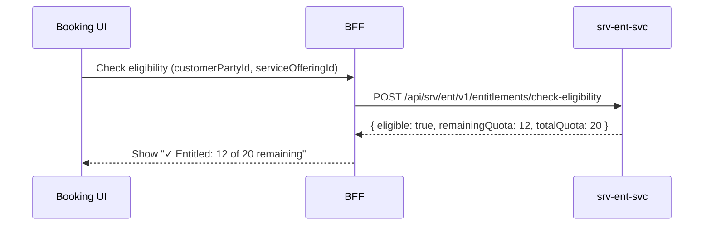

# F-SRV-006-02 — Eligibility Check

> **Suite:** `srv` | **LEAF** | **Parent:** `F-SRV-006`
> **UVL:** `F-SRV-006-02.uvl` | **AUI:** `F-SRV-006-02.aui.yaml`
> **Version:** 2026-04-02 | **Status:** DRAFT
> **References:** `srv_ent-spec.md` (UC: CheckEligibility)
> **Template:** `feature-spec.md` v1.0.0
> **Template Compliance:** ~90% — missing: AUI Contract (SS6)

---

## 0.1 One-Line Summary
This feature lets a **scheduler or system** check whether a customer has a valid entitlement for a service at booking time so that ineligible bookings are prevented or flagged.

## 0.2 Non-Goals
- Does not manage entitlements — `F-SRV-006-01`. Does not consume quota — `F-SRV-006-03`.

## 0.3 Entry & Exit Points
**Entry:** Inline within Slot Discovery (`F-SRV-002-01`) or Booking Lifecycle (`F-SRV-002-02`). Automatic API check.
**Exit:** Eligible → booking proceeds with remaining quota shown. Ineligible → warning or block.

## 0.4 Variability Points
| Variability | UVL | Default | Binding |
|---|---|---|---|
| Block on ineligible | `eligibility.blockOnIneligible Boolean false` | `false` | deploy |
| Show remaining quota | `eligibility.showRemainingQuota Boolean true` | `true` | deploy |

---

## 1. User Scenarios
**S1:** During booking, system checks: customer has 12 remaining lessons → eligible, "12 remaining" shown inline.
**S2:** Customer has 0 remaining → warning: "Entitlement exhausted. Session will be billed separately." Booking allowed (default).
**S3:** `blockOnIneligible` = true, 0 remaining → booking blocked.

---

## 2. Screen Layout
Eligibility check renders as an inline status indicator within Slot Discovery or Booking Lifecycle:

```
┌──────────────────────────────────────────────────────────┐
│  [Within F-SRV-002-01 or F-SRV-002-02]                   │
│  ┌─────────────────────────────────────────────────────┐ │
│  │ ✓ Entitled: 12 of 20 remaining (gated)              │ │
│  │ — or —                                               │ │
│  │ ⚠ Entitlement exhausted. Session will be billed     │ │
│  │   separately. (if not blocked)                       │ │
│  │ — or —                                               │ │
│  │ ✕ Not entitled. Booking blocked. (if blocked)        │ │
│  └─────────────────────────────────────────────────────┘ │
│  ZONE: zone-extension [EXT]                              │
└──────────────────────────────────────────────────────────┘
```



---

## 3. Actions
| Action | Trigger | Role | Mutation? |
|---|---|---|---|
| Check eligibility | Automatic on booking form load | `SRV_ENT_VIEWER` | No |

---

## 4. Edge Cases
| ID | Condition | Behaviour |
|---|---|---|
| EC-001 | No entitlement found for customer+offering | Show "No entitlement found" (neutral, not error) |
| EC-002 | `srv-ent-svc` unavailable | "Eligibility check unavailable." Booking proceeds with warning. |
| EC-003 | Multiple entitlements for same offering | Use first active, non-exhausted. OPEN QUESTION: priority rules. |

## 4.3 Attribute-Driven
| Attribute | Non-default | Change |
|---|---|---|
| `eligibility.blockOnIneligible` | `true` | Booking blocked when quota = 0 |
| `eligibility.showRemainingQuota` | `false` | Remaining count hidden; only eligible/ineligible shown |

---

## 5. Backend
| # | Service | Endpoint | Method | isMutation | Failure mode |
|---|---------|----------|--------|------------|-------------|
| 1 | `srv-ent-svc` | `/api/srv/ent/v1/entitlements/check-eligibility` | POST | No | Degrade: warning |

### 5.2 BFF View Model
```jsonc
{
  "eligibility": {
    "eligible": true,
    "remainingQuota": 12,  // null if showRemainingQuota = false
    "totalQuota": 20,
    "entitlementId": "uuid",
    "expiresAt": "2026-12-31"
  }
}
```

### 5.6 i18n
| Key | Default |
|---|---|
| `srv.ent.eligibility.entitled` | "Entitled: {remaining} of {total} remaining" |
| `srv.ent.eligibility.exhausted` | "Entitlement exhausted. Session will be billed separately." |
| `srv.ent.eligibility.blocked` | "Not entitled. Booking blocked." |
| `srv.ent.eligibility.notFound` | "No entitlement found for this service." |
| `srv.ent.eligibility.unavailable` | "Eligibility check unavailable." |

---

## 7. Permissions
| Action | `SRV_ENT_VIEWER` | `SRV_ENT_EDITOR` |
|---|---|---|
| View eligibility | ✓ | ✓ |

## 8. Acceptance Criteria
**AC-001:** Given customer has remaining quota → "Entitled: N of M remaining".
**AC-002:** Given quota = 0, `blockOnIneligible` = false → warning, booking allowed.
**AC-003:** Given quota = 0, `blockOnIneligible` = true → booking blocked.
**AC-004:** Given `showRemainingQuota` = false → only eligible/ineligible shown.
**AC-005:** Given `srv-ent-svc` down → "Eligibility check unavailable", booking proceeds.
**AC-006:** Given feature excluded → no eligibility indicator in booking UI.

## 9. Attributes
| Attribute | Type | Default | Binding |
|---|---|---|---|
| `eligibility.blockOnIneligible` | Boolean | false | deploy |
| `eligibility.showRemainingQuota` | Boolean | true | deploy |

| Extension Point | Type | Description | Default |
|---|---|---|---|
| `ext.eligibility.customRule` | rule | Custom eligibility logic (e.g., insurance coverage check) | Pass-through |

## 10. Change Log
| Date | Version | Author | Changes |
|---|---|---|---|
| 2026-04-02 | 1.0 | OpenLeap Architecture Team | Initial spec |

**Status:** DRAFT
