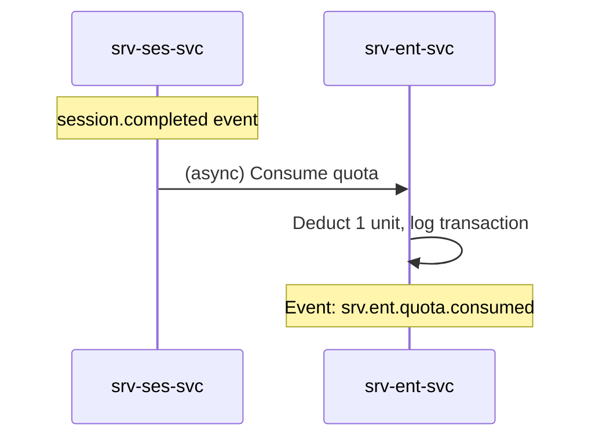

# F-SRV-006-03 — Quota Consumption

> **Suite:** `srv` | **LEAF** | **Parent:** `F-SRV-006`
> **UVL:** `F-SRV-006-03.uvl` | **AUI:** `F-SRV-006-03.aui.yaml`
> **Version:** 2026-04-02 | **Status:** DRAFT
> **References:** `srv_ent-spec.md` (UC: Reserve/Consume/Reverse quota, QuotaTransaction entity)
> **Template:** `feature-spec.md` v1.0.0
> **Template Compliance:** ~90% — missing: AUI Contract (SS6)

---

## 0.1 One-Line Summary
This feature lets the **system** (and optionally a back-office agent) record quota consumption and reversals against entitlements when sessions complete or are cancelled, and view the transaction history.

## 0.2 Non-Goals
- Does not manage entitlements — `F-SRV-006-01`. Does not check eligibility — `F-SRV-006-02`.
- Does not create billing intents — `srv.bil`.

## 0.3 Entry & Exit Points
**Entry:** Entitlement detail → "Transactions" tab. Automatic via `srv.ses.session.completed` / `.cancelled` events.
**Exit:** Consumption recorded → balance updated; event emitted.

## 0.4 Variability Points
| Variability | UVL | Default | Binding |
|---|---|---|---|
| Show transaction log | `consumption.showTransactionLog Boolean true` | `true` | deploy |
| Allow manual adjustment | `consumption.allowManualAdjust Boolean false` | `false` | deploy |

---

## 1. User Scenarios
**S1:** Session completed → event consumed → 1 unit deducted. Balance: 11/20. Transaction logged.
**S2:** Session cancelled → reversal event → 1 unit restored. Balance: 12/20.
**S3:** Admin manually adjusts balance +2 for dispute resolution (gated by attr).
**S4:** Agent views transaction history for an entitlement: consumption, reversals, adjustments with timestamps and reasons.

---

## 2. Screen Layout



```
┌──────────────────────────────────────────────────────────┐
│  Transactions Tab (within Entitlement Detail)            │
│  ┌─────────────────────────────────────────────────────┐ │
│  │ Balance: 11 / 20 remaining                          │ │
│  │ Progress: ▓▓▓▓▓▓▓▓▓▓▓░░░░░░░░░ 55% consumed       │ │
│  ├─────────────────────────────────────────────────────┤ │
│  │ Date       │ Type        │ Qty │ Session │ Reason   │ │
│  │ 2026-04-07 │ CONSUMPTION │ -1  │ S-042   │ auto     │ │
│  │ 2026-04-06 │ REVERSAL    │ +1  │ S-041   │ cancel   │ │
│  │ 2026-04-05 │ CONSUMPTION │ -1  │ S-040   │ auto     │ │
│  │ 2026-03-15 │ ADJUSTMENT  │ +2  │ —       │ dispute  │ │
│  │                                                      │ │
│  │ [Manual Adjustment] (gated, admin only)              │ │
│  └─────────────────────────────────────────────────────┘ │
│  ZONE: zone-extension [EXT]                              │
└──────────────────────────────────────────────────────────┘
```

---

## 3. Actions
| Action | Visible when | Role | Mutation? | API |
|---|---|---|---|---|
| View transactions | Always | `SRV_ENT_VIEWER` | No | `GET /entitlements/{id}/balance` |
| Manual adjustment | `allowManualAdjust` = true | `SRV_ENT_ADMIN` | Yes | `POST /entitlements/{id}/consume` (with manual flag) |

---

## 4. Edge Cases
| ID | Condition | Behaviour |
|---|---|---|
| EC-001 | Consume when balance = 0 | Entitlement transitions to EXHAUSTED; event emitted |
| EC-002 | Reversal when already EXHAUSTED | Balance restored; status returns to ACTIVE |
| EC-003 | Manual adjust negative (deduct) | Must not go below 0 |
| EC-004 | Duplicate consumption event (idempotency) | Silently deduplicated |

## 4.3 Attribute-Driven
| Attribute | Non-default | Change |
|---|---|---|
| `consumption.showTransactionLog` | `false` | Transactions tab hidden; only balance shown |
| `consumption.allowManualAdjust` | `true` | "Manual Adjustment" button visible for admin |

---

## 5. Backend
| # | Service | Endpoint | Method | isMutation |
|---|---------|----------|--------|------------|
| 1 | `srv-ent-svc` | `/api/srv/ent/v1/entitlements/{id}/balance` | GET | No |
| 2 | `srv-ent-svc` | `/api/srv/ent/v1/entitlements/{id}/consume` | POST | Yes |
| 3 | `srv-ent-svc` | `/api/srv/ent/v1/entitlements/{id}/reverse` | POST | Yes |

### 5.6 i18n
| Key | Default |
|---|---|
| `srv.ent.consumption.title` | "Transactions" |
| `srv.ent.consumption.balanceLabel` | "{remaining} of {total} remaining" |
| `srv.ent.consumption.adjustAction` | "Manual Adjustment" |
| `srv.ent.consumption.adjustReasonLabel` | "Reason" |
| `srv.ent.consumption.exhaustedWarning` | "Entitlement is exhausted." |

---

## 7. Permissions
| Action | `SRV_ENT_VIEWER` | `SRV_ENT_EDITOR` | `SRV_ENT_ADMIN` |
|---|---|---|---|
| View balance/transactions | ✓ | ✓ | ✓ |
| Manual adjustment | — | — | ✓ |

## 8. Acceptance Criteria
**AC-001:** Given session.completed → 1 unit consumed, balance updated.
**AC-002:** Given session.cancelled → 1 unit reversed.
**AC-003:** Given `allowManualAdjust` = true, admin → adjustment button visible.
**AC-004:** Given `showTransactionLog` = false → transaction table hidden.
**AC-005:** Given balance reaches 0 → status EXHAUSTED.
**AC-006:** Given duplicate event → silently ignored (idempotent).
**AC-007:** Given feature excluded → transactions tab not shown.

## 9. Attributes
| Attribute | Type | Default | Binding |
|---|---|---|---|
| `consumption.showTransactionLog` | Boolean | true | deploy |
| `consumption.allowManualAdjust` | Boolean | false | deploy |

| Extension Point | Type | Description | Default |
|---|---|---|---|
| `ext.consumption.customTransaction` | zone | Custom transaction types | Hidden |

## 10. Change Log
| Date | Version | Author | Changes |
|---|---|---|---|
| 2026-04-02 | 1.0 | OpenLeap Architecture Team | Initial spec |

**Status:** DRAFT
