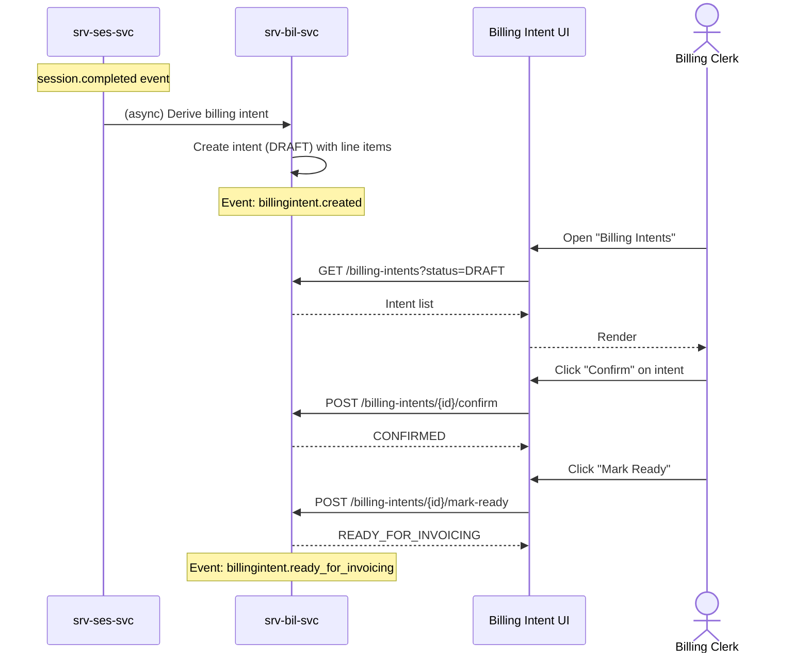

# F-SRV-007-01 — Intent Derivation

> **Suite:** `srv` | **LEAF** | **Parent:** `F-SRV-007`
> **UVL:** `F-SRV-007-01.uvl` | **AUI:** `F-SRV-007-01.aui.yaml`
> **Version:** 2026-04-02 | **Status:** DRAFT
> **References:** `srv_bil-spec.md` (UC-001: DeriveFromSessionCompletion, UC-002: DeriveNoShowFee, UC-003: DeriveCancellationFee, UC-004/005)
> **Template:** `feature-spec.md` v1.0.0
> **Template Compliance:** ~90% — missing: AUI Contract (SS6)

---

## 0.1 One-Line Summary
This feature lets the **system** automatically derive billing intents from session completions and fee triggers, and lets a **billing clerk** view, confirm, and release derived intents so that billable positions are captured without manual data entry.

## 0.2 Non-Goals
- Does not correct/reverse — `F-SRV-007-02`. Does not reconcile — `F-SRV-007-03`.
- Does not create invoices — `fi`. Does not define pricing — `sd`/`com`.

## 0.3 Entry & Exit Points
**Entry:** Navigation "Billing Intents" → intent list. Automatic derivation from events (`session.completed`, `appointment.no_show_marked`, `appointment.cancelled`).
**Exit:** Intent confirmed/ready → event `billingintent.ready_for_invoicing` emitted → downstream `sd`/`fi` picks up.

## 0.4 Variability Points
| Variability | UVL | Default | Binding |
|---|---|---|---|
| Records per page | `pagination.pageSize Integer 20` | `20` | deploy |
| Auto-confirm (skip DRAFT) | `derivation.autoConfirm Boolean false` | `false` | deploy |
| Auto-mark-ready (skip manual release) | `derivation.autoMarkReady Boolean false` | `false` | deploy |

---

## 1. User Scenarios
**S1:** Session completed → billing intent auto-created in DRAFT with line items (1 × SESSION, offering name, duration).
**S2:** No-show event → fee intent created per fee policy (if configured).
**S3:** Billing clerk reviews DRAFT intents, clicks "Confirm" → CONFIRMED.
**S4:** Clerk clicks "Mark Ready for Invoicing" → READY_FOR_INVOICING, event emitted.
**S5:** With `autoConfirm` + `autoMarkReady` = true → intents flow automatically without manual steps.

---

## 2. Screen Layout



```
┌──────────────────────────────────────────────────────────┐
│  ZONE: zone-list-header │ Customer [lookup] Status [▼] Type [▼]│
│  │ Date Range [from] [to] [Search] │
├──────────────────────────────────────────────────────────┤
│  ZONE: zone-list │
│  │ ID   │ Customer  │ Type          │ Status │ Amount │Act │
│  │ BI-1 │ A. Müller │ SERV_DELIVERY │ DRAFT  │ 1×SES  │[✓] │
│  │ BI-2 │ M.Schmidt │ NO_SHOW_FEE   │ DRAFT  │ €25    │[✓] │
│  │ BI-3 │ L. Weber  │ SERV_DELIVERY │ CONFMD │ 2×HOUR │[►] │
├──────────────────────────────────────────────────────────┤
--- Detail ---
│  ZONE: zone-intent-detail │
│  │ Intent: BI-1  Type: SERVICE_DELIVERY  Status: DRAFT │
│  │ Customer: Anna Müller  Session: S-042 │
│  │ Offering: Practical B-License │
│  │ Line Items: │
│  │   1 × SESSION — "Practical Driving Lesson" │
│  │   (Price Hint: €65.00 — non-authoritative) │
│  ZONE: zone-extension [EXT] │
│  ZONE: zone-actions │ [Confirm] [Mark Ready] [Reverse → F-SRV-007-02] [Back] │
└──────────────────────────────────────────────────────────┘
```

---

## 3. Actions
| Action | Visible when | Role | Mutation? | API |
|---|---|---|---|---|
| Search/filter | Always | `SRV_BIL_VIEWER` | No | `GET /billing-intents?...` |
| Confirm | DRAFT | `SRV_BIL_EDITOR` | Yes | `POST /billing-intents/{id}/confirm` |
| Mark Ready | CONFIRMED | `SRV_BIL_EDITOR` | Yes | `POST /billing-intents/{id}/mark-ready` |
| View detail | Always | `SRV_BIL_VIEWER` | No | `GET /billing-intents/{id}` |

---

## 4. Edge Cases
| ID | Condition | Behaviour |
|---|---|---|
| EC-001 | `autoConfirm` = true | Intents skip DRAFT → created as CONFIRMED |
| EC-002 | `autoMarkReady` = true | Intents auto-transition to READY_FOR_INVOICING |
| EC-003 | Session with `billableFlag` = false | No intent created |
| EC-004 | No-show without fee policy configured | No fee intent; log warning |
| EC-005 | Duplicate event (idempotency) | Intent not duplicated (dedup by sessionId) |

---

## 5. Backend
| # | Service | Endpoint | Method | isMutation |
|---|---------|----------|--------|------------|
| 1 | `srv-bil-svc` | `/api/srv/bil/v1/billing-intents` | GET | No |
| 2 | `srv-bil-svc` | `/api/srv/bil/v1/billing-intents/{id}` | GET | No |
| 3 | `srv-bil-svc` | `/api/srv/bil/v1/billing-intents/{id}/confirm` | POST | Yes |
| 4 | `srv-bil-svc` | `/api/srv/bil/v1/billing-intents/{id}/mark-ready` | POST | Yes |

### 5.6 i18n
| Key | Default |
|---|---|
| `srv.bil.derivation.title` | "Billing Intents" |
| `srv.bil.derivation.confirmAction` | "Confirm" |
| `srv.bil.derivation.markReadyAction` | "Mark Ready for Invoicing" |
| `srv.bil.derivation.typeServiceDelivery` | "Service Delivery" |
| `srv.bil.derivation.typeNoShowFee` | "No-Show Fee" |
| `srv.bil.derivation.typeCancellationFee` | "Cancellation Fee" |

---

## 7. Permissions
| Action | `SRV_BIL_VIEWER` | `SRV_BIL_EDITOR` | `SRV_BIL_ADMIN` |
|---|---|---|---|
| View/search | ✓ | ✓ | ✓ |
| Confirm/Mark Ready | — | ✓ | ✓ |

## 8. Acceptance Criteria
**AC-001:** Given session.completed with billableFlag=true → intent DRAFT created.
**AC-002:** Given `autoConfirm` = true → intent created as CONFIRMED.
**AC-003:** Given `autoMarkReady` = true → intent auto-transitions to READY_FOR_INVOICING.
**AC-004:** Given no-show event with fee policy → NO_SHOW_FEE intent created.
**AC-005:** Given billableFlag=false → no intent.
**AC-006:** Given editor confirms → CONFIRMED.
**AC-007:** Given editor marks ready → READY_FOR_INVOICING, event emitted.
**AC-008:** Given viewer → Confirm/Mark Ready absent.
**AC-009:** Given feature excluded → "Billing Intents" not in nav.

## 9. Attributes
| Attribute | Type | Default | Binding |
|---|---|---|---|
| `pagination.pageSize` | Integer | 20 | deploy |
| `derivation.autoConfirm` | Boolean | false | deploy |
| `derivation.autoMarkReady` | Boolean | false | deploy |

| Extension Point | Type | Description | Default |
|---|---|---|---|
| `ext.derivation.customFeePolicy` | rule | Custom fee policy evaluation | No-op |

## 10. Change Log
| Date | Version | Author | Changes |
|---|---|---|---|
| 2026-04-02 | 1.0 | OpenLeap Architecture Team | Initial spec |

**Status:** DRAFT
