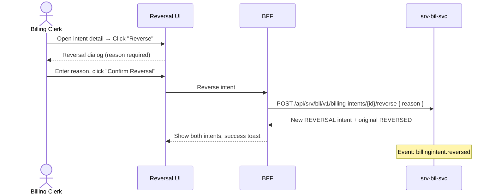

# F-SRV-007-02 — Correction & Reversal

> **Suite:** `srv` | **LEAF** | **Parent:** `F-SRV-007`
> **UVL:** `F-SRV-007-02.uvl` | **AUI:** `F-SRV-007-02.aui.yaml`
> **Version:** 2026-04-02 | **Status:** DRAFT
> **References:** `srv_bil-spec.md` (UC-006: ReverseIntent, UC-007: CorrectIntent)
> **Template:** `feature-spec.md` v1.0.0
> **Template Compliance:** ~90% — missing: AUI Contract (SS6)

---

## 0.1 One-Line Summary
This feature lets a **billing clerk** create correction or reversal intents for existing billing intents so that billing errors and disputes can be resolved with full audit trail.

## 0.2 Non-Goals
- Does not derive original intents — `F-SRV-007-01`. Does not reconcile — `F-SRV-007-03`.
- Does not create credit memos — `fi`.

## 0.3 Entry & Exit Points
**Entry:** From billing intent detail (`F-SRV-007-01`) → "Reverse" or "Correct" action.
**Exit:** New reversal/correction intent created → original marked REVERSED; events emitted.

## 0.4 Variability Points
| Variability | UVL | Default | Binding |
|---|---|---|---|
| Require reason | `correction.requireReason Boolean true` | `true` | deploy |
| Require approval | `correction.requireApproval Boolean false` | `false` | deploy |

---

## 1. User Scenarios
**S1:** Clerk reverses no-show fee after customer proves they called to cancel. New REVERSAL intent referencing original. Original → REVERSED.
**S2:** Clerk corrects line item quantity 1 → 0.5 (half-session). New CORRECTION intent.
**S3:** With `requireApproval` = true → correction enters DRAFT awaiting admin approval.

---

## 2. Screen Layout



```
┌──────────────────────────────────────────────────────────┐
│  Reversal Dialog (modal)                                  │
│  ┌─────────────────────────────────────────────────────┐ │
│  │ Reverse Intent BI-2 (NO_SHOW_FEE)?                  │ │
│  │                                                      │ │
│  │ Original: 1 × NO_SHOW_FEE — €25.00                  │ │
│  │ Reversal will negate: -1 × NO_SHOW_FEE — -€25.00    │ │
│  │                                                      │ │
│  │ Reason*: [Customer called before deadline___________]│ │
│  │                                                      │ │
│  │ [Confirm Reversal]  [Cancel]                         │ │
│  └─────────────────────────────────────────────────────┘ │
│                                                           │
│  Correction Dialog (modal)                                │
│  ┌─────────────────────────────────────────────────────┐ │
│  │ Correct Intent BI-1?                                 │ │
│  │ Line Items (editable):                               │ │
│  │   Description: [Practical Driving Lesson]            │ │
│  │   Quantity: [0.5] (was 1)                            │ │
│  │   Unit: [SESSION]                                    │ │
│  │ Reason*: [Half session delivered_____]               │ │
│  │ [Confirm Correction]  [Cancel]                       │ │
│  └─────────────────────────────────────────────────────┘ │
│  ZONE: zone-extension [EXT]                              │
└──────────────────────────────────────────────────────────┘
```

---

## 3. Actions
| Action | Visible when | Role | Mutation? | API |
|---|---|---|---|---|
| Reverse | CONFIRMED or READY_FOR_INVOICING, not already REVERSED | `SRV_BIL_EDITOR` | Yes | `POST /billing-intents/{id}/reverse` |
| Correct | CONFIRMED or READY_FOR_INVOICING | `SRV_BIL_EDITOR` | Yes | `POST /billing-intents/{id}/correct` |

---

## 4. Edge Cases
| ID | Condition | Behaviour |
|---|---|---|
| EC-001 | Already reversed | Error: "This intent has already been reversed." (`BIL_ALREADY_REVERSED`) |
| EC-002 | `requireReason` = true, reason blank | "Please provide a reason." |
| EC-003 | `requireApproval` = true | Correction enters DRAFT awaiting approval |
| EC-004 | DRAFT intent (not yet confirmed) | "Cancel" offered instead of "Reverse" (simpler flow) |

---

## 5. Backend
| # | Service | Endpoint | Method | isMutation |
|---|---------|----------|--------|------------|
| 1 | `srv-bil-svc` | `/api/srv/bil/v1/billing-intents/{id}/reverse` | POST | Yes |
| 2 | `srv-bil-svc` | `/api/srv/bil/v1/billing-intents/{id}/correct` | POST | Yes |

### 5.6 i18n
| Key | Default |
|---|---|
| `srv.bil.correction.reverseAction` | "Reverse Intent" |
| `srv.bil.correction.correctAction` | "Correct Intent" |
| `srv.bil.correction.reasonLabel` | "Reason" |
| `srv.bil.correction.reasonRequired` | "Please provide a reason." |
| `srv.bil.correction.alreadyReversed` | "This intent has already been reversed." |
| `srv.bil.correction.confirmReversal` | "Confirm Reversal" |
| `srv.bil.correction.confirmCorrection` | "Confirm Correction" |

---

## 7. Permissions
| Action | `SRV_BIL_VIEWER` | `SRV_BIL_EDITOR` | `SRV_BIL_ADMIN` |
|---|---|---|---|
| View | ✓ | ✓ | ✓ |
| Reverse/Correct | — | ✓ | ✓ |
| Approve corrections | — | — | ✓ |

## 8. Acceptance Criteria
**AC-001:** Given editor reverses intent with reason → new REVERSAL intent, original REVERSED, event emitted.
**AC-002:** Given `correction.requireReason` = true, no reason → blocked.
**AC-003:** Given already reversed → error shown.
**AC-004:** Given `correction.requireApproval` = true → correction enters DRAFT.
**AC-005:** Given viewer → reverse/correct absent.
**AC-006:** Given feature excluded → reverse/correct actions not available.

## 9. Attributes
| Attribute | Type | Default | Binding |
|---|---|---|---|
| `correction.requireReason` | Boolean | true | deploy |
| `correction.requireApproval` | Boolean | false | deploy |

| Extension Point | Type | Description | Default |
|---|---|---|---|
| `ext.correction.customApproval` | rule | Custom approval workflow | No-op |

## 10. Change Log
| Date | Version | Author | Changes |
|---|---|---|---|
| 2026-04-02 | 1.0 | OpenLeap Architecture Team | Initial spec |

**Status:** DRAFT
