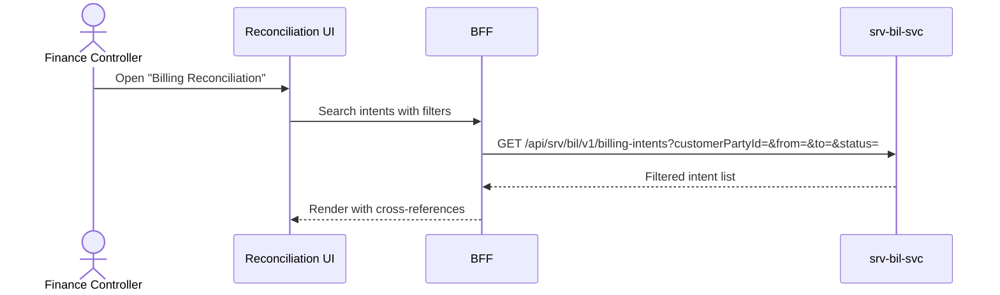

# F-SRV-007-03 — Reconciliation View

> **Suite:** `srv` | **LEAF** | **Parent:** `F-SRV-007`
> **UVL:** `F-SRV-007-03.uvl` | **AUI:** `F-SRV-007-03.aui.yaml`
> **Version:** 2026-04-02 | **Status:** DRAFT
> **References:** `srv_bil-spec.md` (UC-008/009: GetBillingIntent, SearchBillingIntents)
> **Template:** `feature-spec.md` v1.0.0
> **Template Compliance:** ~90% — missing: AUI Contract (SS6)

---

## 0.1 One-Line Summary
This feature lets a **billing clerk or finance controller** view and filter billing intents with cross-references to sessions, cases, and customers so that billing can be reconciled and disputes investigated.

## 0.2 Non-Goals
- Does not derive or modify intents — `F-SRV-007-01` / `F-SRV-007-02`.
- Does not create invoices or financial reports — `fi`.

## 0.3 Entry & Exit Points
**Entry:** Navigation "Billing Reconciliation". Customer detail → "Billing" tab. Deep link with filters.
**Exit:** Read-only; user drills to intent detail, session, or case.

## 0.4 Variability Points
| Variability | UVL | Default | Binding |
|---|---|---|---|
| Records per page | `pagination.pageSize Integer 25` | `25` | deploy |
| Show session link | `reconciliation.showSessionLink Boolean true` | `true` | deploy |
| Show case link | `reconciliation.showCaseLink Boolean true` | `true` | deploy |

---

## 1. User Scenarios
**S1:** Controller filters intents by customer + date range to reconcile a disputed invoice.
**S2:** Controller drills from intent to linked session to verify delivery facts.
**S3:** Controller exports filtered intents for external reconciliation (OPEN QUESTION: export format).

---

## 2. Screen Layout



```
┌──────────────────────────────────────────────────────────┐
│  ZONE: zone-filters │
│  │ Customer [lookup] Status [▼] Type [▼] │
│  │ Date From [___] Date To [___] [Search] │
├──────────────────────────────────────────────────────────┤
│  ZONE: zone-results │
│  │ ID   │Customer│Type       │Status│Lines │Session│Case │
│  │ BI-1 │A.Müller│SVC_DELIV  │READY │1×SES │S-042→ │C-01→│
│  │ BI-2 │A.Müller│NO_SHOW    │REVRSD│1×FEE │—      │C-01→│
│  │ BI-3 │M.Schmidt│SVC_DELIV │CONFMD│2×HOUR│S-050→ │—    │
│  │ → = clickable link to session/case detail │
├──────────────────────────────────────────────────────────┤
│  ZONE: zone-summary │
│  │ Total intents: 42  DRAFT: 5  CONFIRMED: 12  READY: 20  REVERSED: 5 │
├──────────────────────────────────────────────────────────┤
│  ZONE: zone-extension [EXT] │
│  ZONE: zone-pagination │ Showing 1-25 of 42 │
└──────────────────────────────────────────────────────────┘
```

---

## 3. Actions
| Action | Role | Mutation? |
|---|---|---|
| Search/filter | `SRV_BIL_VIEWER` | No |
| Drill to intent detail | `SRV_BIL_VIEWER` | No |
| Drill to session | `SRV_SES_VIEWER` | No |
| Drill to case | `SRV_CAS_VIEWER` | No |

---

## 4. Edge Cases
| ID | Condition | Behaviour |
|---|---|---|
| EC-001 | Session link but session not found | Show intent without link; tooltip "Session not available" |
| EC-002 | Large result set | Paginated; never load all |

## 4.3 Attribute-Driven
| Attribute | Non-default | Change |
|---|---|---|
| `reconciliation.showSessionLink` | `false` | Session column hidden |
| `reconciliation.showCaseLink` | `false` | Case column hidden |

---

## 5. Backend
| # | Service | Endpoint | Method | isMutation | Failure mode |
|---|---------|----------|--------|------------|-------------|
| 1 | `srv-bil-svc` | `/api/srv/bil/v1/billing-intents?...` | GET | No | Block |
| 2 | `srv-ses-svc` | `/api/srv/ses/v1/sessions/{id}` | GET | No | Degrade: hide session link |
| 3 | `srv-cas-svc` | `/api/srv/cas/v1/cases/{id}` | GET | No | Degrade: hide case link |

### 5.2 BFF View Model
```jsonc
{
  "intents": [
    {
      "id":"uuid", "customerName":"Anna Müller", "intentType":"SERVICE_DELIVERY",
      "status":"READY_FOR_INVOICING",
      "lineItems": [{ "description":"Practical Lesson","quantity":1,"billingUnitCode":"SESSION" }],
      "sessionId":"uuid", "sessionRef":"S-042",    // null if showSessionLink=false
      "caseId":"uuid", "caseRef":"C-01"             // null if showCaseLink=false
    }
  ],
  "summary": { "total":42, "draft":5, "confirmed":12, "ready":20, "reversed":5 },
  "pagination": { "page":0, "size":25, "totalElements":42 }
}
```

### 5.6 i18n
| Key | Default |
|---|---|
| `srv.bil.reconciliation.title` | "Billing Reconciliation" |
| `srv.bil.reconciliation.summaryLabel` | "Summary" |
| `srv.bil.reconciliation.sessionNotAvailable` | "Session not available" |

---

## 7. Permissions
| Action | `SRV_BIL_VIEWER` | `SRV_BIL_EDITOR` | `SRV_BIL_ADMIN` |
|---|---|---|---|
| View/search/drill | ✓ | ✓ | ✓ |

## 8. Acceptance Criteria
**AC-001:** Given viewer opens reconciliation → intents listed with status, type, customer.
**AC-002:** Given `showSessionLink` = true → session link clickable, navigates to session.
**AC-003:** Given filter by status=REVERSED → only reversed intents.
**AC-004:** Given session not found → intent shown without link, tooltip.
**AC-005:** Given `showCaseLink` = false → case column hidden.
**AC-006:** Given feature excluded → "Billing Reconciliation" not in nav.

## 9. Attributes
| Attribute | Type | Default | Binding |
|---|---|---|---|
| `pagination.pageSize` | Integer | 25 | deploy |
| `reconciliation.showSessionLink` | Boolean | true | deploy |
| `reconciliation.showCaseLink` | Boolean | true | deploy |

| Extension Point | Type | Description | Default |
|---|---|---|---|
| `ext.reconciliation.customColumns` | zone | Custom columns (e.g., invoice ref if integrated) | Hidden |

## 10. Change Log
| Date | Version | Author | Changes |
|---|---|---|---|
| 2026-04-02 | 1.0 | OpenLeap Architecture Team | Initial spec |

### 10.1 Open Questions
| ID | Question | Impact | Owner | Needed by |
|---|---|---|---|---|
| Q-001 | Should reconciliation support CSV/Excel export? | UX feature | TBD | Phase 2 |

**Status:** DRAFT
