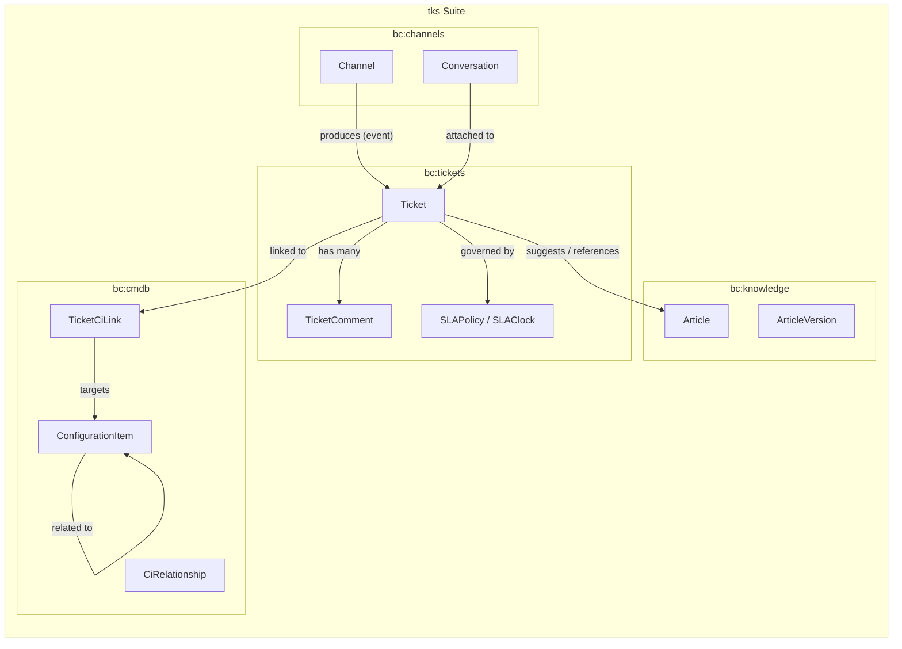
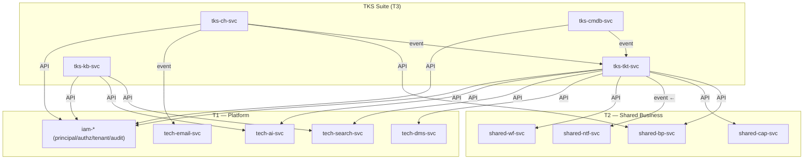
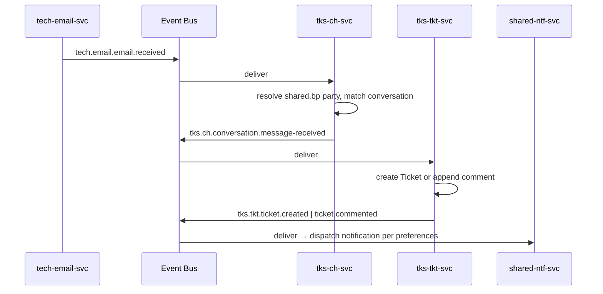
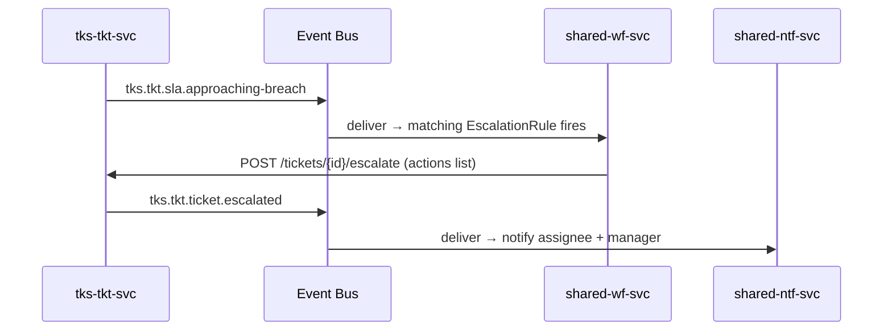
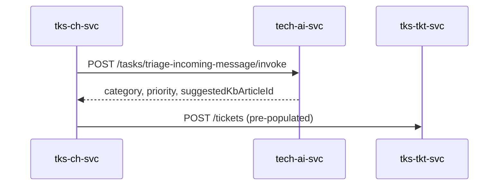

# Ticket System (TKS) Suite Specification

> **Conceptual Stack Layer:** Suite
> **Space:** Platform
> **Owner:** Domain Engineering Team
> **Schema alignment:** `suite-layer.schema.json`
> **Companion files:** `tks.catalog.uvl` (referenced in SS6)
> **Contains:** Domain/Service Specs, Platform-Feature Specs, Feature Catalog

> **Meta Information**
> - **Version:** 2026-04-18
> - **Template:** `suite-spec.md` v1.1.0
> - **Template Compliance:** ~97% — canonical layout applied
> - **Author(s):** OpenLeap Architecture Team
> - **Status:** DRAFT
> - **Suite ID:** `tks`
> - **Suite Name:** Ticket System
> - **Description:** Work-item tracking for customer support, IT service management, and issue triage — a generic ticket+channel+KB+CMDB fabric consumed by multiple products.
> - **Semantic Version:** `1.0.0`
> - **Team:**
>   - Name: `team-tks`
>   - Email: `tks-team@openleap.io`
>   - Slack: `#tks-team`
> - **Bounded Contexts:** `bc:tickets`, `bc:channels`, `bc:knowledge`, `bc:cmdb`

---

## Specification Guidelines

> **This specification MUST comply with the OpenLeap specification guidelines.**
>
> ### Non-Negotiables
> - Never invent facts. If required info is missing, add an **OPEN QUESTION** entry.
> - Preserve intent and decisions. Only change meaning when explicitly requested.
> - Keep the spec **self-contained**: no "see chat", no implicit context.
>
> ### Style Guide
> - Prefer short sentences and lists.
> - Use MUST/SHOULD/MAY for normative statements.
> - Keep terminology consistent with the Ubiquitous Language defined in SS1.
> - Avoid ambiguous words ("often", "maybe") unless explicitly noting uncertainty.

---

## 0. Suite Identity & Purpose

### 0.1 Suite Identity

| Field | Value |
|-------|-------|
| id | `tks` |
| name | Ticket System |
| description | Work-item tracking for customer support, IT service management, and issue triage. |
| version | `1.0.0` |
| status | `draft` |
| owner.team | `team-tks` |
| owner.email | `tks-team@openleap.io` |
| owner.slack | `#tks-team` |
| boundedContexts | `bc:tickets`, `bc:channels`, `bc:knowledge`, `bc:cmdb` |

### 0.2 Business Purpose

TKS provides the platform's **work-item tracking fabric**. Every interaction that needs to be routed, assigned, triaged, time-tracked and resolved becomes a *ticket*. Sources range from customer-support emails to web-form submissions, chat messages, internal IT issues, incident reports, and programmatic webhooks. TKS owns the lifecycle of tickets, the ingestion channels that produce them, the knowledge base that agents and customers self-serve, and the configuration-management database (CMDB) that records what assets a ticket is about. TKS does **not** own customer master data (→ `shared.bp`), notifications (→ `shared.ntf`), or workflow automation (→ `shared.wf`) — it composes them.

### 0.3 In Scope

- Ticket lifecycle: create, assign, comment (internal / public), change status, escalate, resolve, reopen, close
- SLA policies + SLA clock semantics (pause/resume, business-hours via `shared.cap`, approaching-breach and breach signals)
- Multi-channel intake: email (via `tech.email`), web form, chat, webhook, API; unified conversation model; inbound-to-ticket conversion
- Knowledge base: articles, versions, categories, tags, approval workflow, visibility scopes (internal / customer / public), suggest-on-create
- Configuration-management database: configuration items with typed attributes, relationships, impact analysis, ticket ↔ CI linkage
- Workflow automation specs that rely on `shared.wf` (assignment rules, escalation rules, macros, triggers)
- AI feature specs (summary, auto-triage, writing assistant) that call `tech.ai`

### 0.4 Out of Scope

- Customer / account master data (→ `shared.bp`)
- Notification delivery (→ `shared.ntf`)
- Rule-engine runtime (→ `shared.wf`)
- Email transport (→ `tech.email`); TKS.ch owns the *channel adapter* semantics only
- Search / typeahead / saved views (→ `tech.search`); TKS declares indexable aggregates
- LLM providers + safety (→ `tech.ai`); TKS declares AI tasks + prompts inside feature specs
- Field-service dispatch (→ `srv.cas`)
- Sales cases / opportunities (→ `crm.opp`, `crm.lead`)
- Financial postings for billable support time (→ `fi.*`)
- Legally binding records for regulated industries (→ domain-specific suites)

### 0.5 Target Users

| Role | Interest |
|------|----------|
| Support Agent | Handle assigned tickets, comment, apply macros, resolve, browse KB |
| Tier-2 / Specialist | Receive escalations, perform root-cause, link CIs, co-author KB |
| Support Manager | Configure SLA policies, queues, assignment rules, monitor dashboards |
| End Customer / Requester | Submit tickets, reply via channel, self-serve via public KB |
| ITSM Operator | Register CIs, manage relationships, link tickets to affected CIs, run impact analysis |
| KB Author / Reviewer | Draft / approve / publish articles |
| Automation Designer | Build triggers, macros, assignment + escalation rules using `shared.wf` |
| Platform / Tenant Admin | Configure channels, provider credentials, tenant defaults |

### 0.6 Business Value

- Single, consistent ticket model across customer support, IT service management, and internal issue triage — removes duplicate tooling and data silos
- Multi-channel intake via a polymorphic adapter model — new channels plug in without touching the ticket lifecycle
- Knowledge reuse: public/customer/internal KB drives first-response deflection and agent productivity (suggest-on-create)
- CMDB links tie tickets to affected assets — impact analysis and change-management coordination become possible
- AI features (summary, auto-triage, writing assist) compose a platform-wide `tech.ai` abstraction, giving tenants provider choice without feature rewrite
- Reuses platform capabilities (`shared.ntf`, `shared.wf`, `tech.email`, `tech.search`, `tech.dms`, `tech.ai`) rather than duplicating them inside a CRM-only stack

---

## 1. Ubiquitous Language

### 1.1 Glossary

| ID | Term | Aliases | Definition |
|----|------|---------|------------|
| tks:glossary:ticket | Ticket | Work Item, Case (informal), Issue | A tracked work unit with status, priority, reporter, assignee, and SLA. The atomic unit of accountability in TKS. |
| tks:glossary:reporter | Reporter | Requester, Originator | The party (→ `shared.bp`) who raised the ticket — customer, employee, or external contact. Distinct from the assignee. |
| tks:glossary:assignee | Assignee | Owner | The `iam.principal` currently responsible for moving the ticket forward. Exactly one at a time; history retained. |
| tks:glossary:channel | Channel | Intake Channel, Inbox | An addressable inbound source that produces tickets: email mailbox, web form, chat widget, webhook endpoint, API token. Polymorphic: each channel type has its own adapter. |
| tks:glossary:conversation | Conversation | Thread | The ordered sequence of inbound/outbound messages tied to a single ticket via a channel. One ticket may have multiple channels (escalated cross-channel), one channel contributes many conversations. |
| tks:glossary:comment | Comment | Note (INTERNAL), Reply (PUBLIC) | A message attached to a ticket. Visibility is one of INTERNAL (agents only) or PUBLIC (visible to reporter). Immutable after publish. |
| tks:glossary:sla-clock | SLA Clock | Response Clock | Accumulated elapsed time against an SLA target. Pauses in `WAITING_*` statuses; resumes on transition back. Business-hours-aware via `shared.cap`. |
| tks:glossary:sla-policy | SLA Policy | Service Level Policy | Per-tenant configuration of first-response and resolution targets by priority + category, with escalation thresholds. |
| tks:glossary:escalation | Escalation | Breach Alert | A signal fired when SLA consumption crosses a threshold (typically 80%) or after breach. Triggers workflow automation via `shared.wf`. |
| tks:glossary:macro | Macro | Canned Action | A named bundle of ticket field updates + outbound reply template. Applied by an agent in one click. Authored in TKS, executed by `shared.wf`. |
| tks:glossary:triage | Triage | Auto-Categorization | The act of assigning category, priority, and queue to a newly-arrived ticket. May be manual (agent) or AI-assisted (→ `tech.ai`). |
| tks:glossary:queue | Queue | Bucket | A filtered list of unassigned tickets grouped by routing criteria (category, skill, tenant). Input to assignment rules. |
| tks:glossary:article | Article | KB Article, Help Article | A versioned knowledge document with an owner, category, tags, and visibility. Published only after review approval. |
| tks:glossary:configuration-item | Configuration Item | CI, Asset | A tracked thing (server, application, document, service, subscription) referenced by tickets. Typed by `CiType`; related via `CiRelationship`. |
| tks:glossary:ci-relationship | CI Relationship | Dependency, Link | A typed edge between two CIs (`DEPENDS_ON`, `HOSTED_ON`, `PART_OF`, …). Direction matters; no cycles in `DEPENDS_ON`. |
| tks:glossary:ticket-ci-link | Ticket ↔ CI Link | Affected-Asset Link | The join from a ticket to one or more CIs with a link reason (`AFFECTED`, `CAUSED_BY`, `WORKAROUND_ON`). |
| tks:glossary:priority | Priority | — | Enum `LOW`, `MEDIUM`, `HIGH`, `URGENT`, `CRITICAL`. Drives SLA targets and escalation thresholds. |
| tks:glossary:severity | Severity | — | Orthogonal to priority. Technical impact scale `SEV4..SEV1`. Used by CMDB impact analysis; not every ticket has one. |
| tks:glossary:category | Category | Type, Classification | A tenant-configurable enumeration of ticket types. Drives routing, SLA selection, AI triage. |
| tks:glossary:ticket-status | Ticket Status | Status, State | Lifecycle position. Canonical: `NEW`, `OPEN`, `IN_PROGRESS`, `WAITING_CUSTOMER`, `WAITING_3RD_PARTY`, `RESOLVED`, `CLOSED`, `REOPENED`. |

### 1.2 UBL Boundary Test

**TKS vs. CRM.sup (legacy):**
TKS uses "Ticket" to mean a generic work item spanning customer support, internal IT, and incident tracking — independent of any sales relationship. CRM.sup historically used "Ticket" to mean strictly a customer-support case tied to a CRM contact. TKS generalises and supersedes `crm.sup` (see ADR-TKS-001 and the migration spec in §15.3). After migration, "Ticket" lives only in TKS.

**TKS vs. SRV:**
SRV uses "Case" (`srv.cas`) to mean a longitudinal field-service-delivery container bundling appointments and sessions into a treatment plan / consulting mandate. TKS uses "Ticket" to mean a single tracked work item with status + assignee + SLA clock. A service-delivery case may have tickets attached (via `TicketCiLink` referencing a CI that points back to the case) but the two terms are not interchangeable. This confirms TKS and SRV are separate suites.

**TKS vs. PS:**
PS (`ps.prj`) uses "Project" to mean a long-running planned endeavour with budget, schedule, and work-breakdown. A project may spawn many tickets (operational issues, change requests) but the project itself is not a ticket. Tickets do not carry a WBS. This confirms TKS and PS are separate suites.

---

## 2. Domain Model

### 2.1 Conceptual Overview



### 2.2 Core Concepts

| Concept | Owner (Service) | Description | Glossary Ref |
|---------|----------------|-------------|-------------|
| Ticket | `tks-tkt-svc` | Work item with status + assignee + SLA | `tks:glossary:ticket` |
| TicketComment | `tks-tkt-svc` | Message on a ticket; INTERNAL or PUBLIC | `tks:glossary:comment` |
| SLAPolicy | `tks-tkt-svc` | Target response/resolution by priority + category | `tks:glossary:sla-policy` |
| Channel | `tks-ch-svc` | Intake source (email, web, chat, webhook, API) | `tks:glossary:channel` |
| Conversation | `tks-ch-svc` | Thread of messages bound to a ticket | `tks:glossary:conversation` |
| Article | `tks-kb-svc` | Versioned knowledge document | `tks:glossary:article` |
| ConfigurationItem | `tks-cmdb-svc` | Typed thing referenced by tickets | `tks:glossary:configuration-item` |
| CiRelationship | `tks-cmdb-svc` | Typed edge between two CIs | `tks:glossary:ci-relationship` |
| TicketCiLink | `tks-cmdb-svc` | Join from ticket to CI(s) with reason | `tks:glossary:ticket-ci-link` |

### 2.3 Shared Kernel

| Concept | Owner | Shared With | Mechanism |
|---------|-------|-------------|-----------|
| `TicketId` (uuid VO) | `tks-tkt-svc` | `tks-ch-svc`, `tks-cmdb-svc`, `tks-kb-svc` (suggest-context) | library (published types package) |
| `CiId` (uuid VO) | `tks-cmdb-svc` | `tks-tkt-svc` | event + library |
| `Priority` (enum) | `tks-tkt-svc` | all | library |
| `ChannelType` (enum) | `tks-ch-svc` | `tks-tkt-svc` (origin source) | library |
| `TicketStatus` (enum) | `tks-tkt-svc` | `tks-ch-svc` (for reply behaviour) | library |
| `Visibility` (enum: INTERNAL / CUSTOMER / PUBLIC) | `tks-tkt-svc` | `tks-kb-svc` | library |

#### Shared Type: TicketRef

| Attribute | Type | Format | Required | Description | Constraints |
|-----------|------|--------|----------|-------------|-------------|
| ticketId | string | uuid | Yes | Ticket identifier | — |
| tenantId | string | uuid | Yes | Tenant | — |
| number | string | — | Yes | Human-readable ticket number | `^[A-Z]{2,4}-\d+$` |

### 2.4 Bounded Context Map (Intra-Suite)

| Upstream | Downstream | Pattern | Description |
|----------|-----------|---------|-------------|
| `bc:channels` | `bc:tickets` | `customer_supplier` | Channels emit events that cause tickets to be created/updated. |
| `bc:tickets` | `bc:knowledge` | `conformist` | Tickets read knowledge articles (suggest-on-create); KB owns the model. |
| `bc:tickets` | `bc:cmdb` | `shared_kernel` | Both share `TicketCiLink`; CMDB owns the join aggregate. |
| `bc:cmdb` | `bc:tickets` | `customer_supplier` | CMDB consumes `tks.tkt.ticket.resolved` to archive link status where applicable. |

```mermaid
graph TD
    CH["bc:channels"] -->|customer_supplier| TKT["bc:tickets"]
    TKT -->|conformist| KB["bc:knowledge"]
    TKT -->|shared_kernel (TicketCiLink)| CMDB["bc:cmdb"]
    CMDB -->|customer_supplier (resolve)| TKT
```

---

## 3. Service Landscape

### 3.1 Service Catalog

| Service ID | Name | Bounded Context | Status | Responsibility | Spec |
|-----------|------|----------------|--------|----------------|------|
| `tks-tkt-svc` | Ticket Service | `bc:tickets` | `draft` | Lifecycle, comments, SLA policies and clocks, assignment | `domain-specs/tks_tkt-spec.md` |
| `tks-ch-svc` | Channel Service | `bc:channels` | `draft` | Polymorphic inbound adapters, conversations, outbound reply routing | `domain-specs/tks_ch-spec.md` |
| `tks-kb-svc` | Knowledge Service | `bc:knowledge` | `draft` | Articles, versions, approval, public/internal visibility | `domain-specs/tks_kb-spec.md` |
| `tks-cmdb-svc` | CMDB Service | `bc:cmdb` | `draft` | Configuration items, relationships, ticket-CI linkage, impact analysis | `domain-specs/tks_cmdb-spec.md` |

### 3.2 Responsibility Matrix

| Responsibility | Service |
|---------------|---------|
| "Who owns ticket state?" | `tks-tkt-svc` |
| "Who accepts inbound messages?" | `tks-ch-svc` |
| "Who manages KB approval?" | `tks-kb-svc` |
| "Who holds CI graph?" | `tks-cmdb-svc` |
| "Who computes SLA clock?" | `tks-tkt-svc` (clock pause/resume); `shared.cap` supplies business-hours profile |
| "Who delivers email?" | `tech-email-svc` (not in TKS) |
| "Who runs triggers + macros?" | `shared-wf-svc` (not in TKS); TKS authors the rule specs |
| "Who sends notifications?" | `shared-ntf-svc` (not in TKS) |

### 3.3 Service Dependency Diagram



---

## 4. Integration Patterns

### 4.1 Pattern Decision

| Field | Value |
|-------|-------|
| **Pattern** | `event_driven` |

**Rationale:**

- Inbound channels produce events, not synchronous requests; ticket creation must tolerate retries / deduplication.
- SLA-breach detection is time-based; scheduler publishes events that `shared.wf` consumes.
- CMDB impact analysis is a read-side query; writes happen via events from operational tickets.
- Knowledge base operates asynchronously (approval flow) except for the interactive `suggest-on-create` call which is synchronous.

### 4.2 Key Event Flows

#### Flow 1: Inbound email → ticket creation

**Trigger:** `tech.email.email.received` for a mailbox configured as a TKS channel.



#### Flow 2: SLA approaching-breach → escalation

**Trigger:** scheduler in `tks-tkt-svc` detects 80 % SLA consumption.



#### Flow 3: AI triage on inbound

**Trigger:** `tks.ch.conversation.message-received` classified as `NEW`.



### 4.3 Sync vs. Async Decisions

| Integration | Type | Reason |
|------------|------|--------|
| Channel → Ticket (create) | `async` (event) | Enables retry + deduplication on inbound spikes. |
| KB suggest-on-create | `sync` | Agent UI awaits suggestion while composing ticket. |
| AI triage on inbound | `sync` | Result shapes the created ticket; failure tolerated (degrades to untriaged). |
| SLA clock → workflow | `async` | Timer-driven; no user awaits. |
| Ticket → Notification | `async` | Fire-and-forget. |
| Ticket → CMDB link | `sync` REST | Link established as part of ticket update. |
| CMDB impact analysis | `sync` REST | Interactive graph query. |

### 4.4 Error Handling

| Scenario | Handling |
|----------|---------|
| Event consumer fails | Retry 3× exp; move to DLQ; operator alert via `shared.ntf` (severity=CRITICAL). |
| Inbound duplicate (same providerMessageId) | Dedupe at `tks-ch-svc`; publish once. |
| AI provider unavailable | Ticket created untriaged + flag `aiTriageFailed=true`; downstream rule fills in. |
| KB suggest timeout | Agent UI shows "no suggestions"; ticket proceeds. |
| CMDB relationship cycle attempt | 422 `CMDB_CYCLE_FORBIDDEN`. |

---

## 5. Event Conventions

### 5.1 Routing Key Pattern

**Pattern:** `tks.{domain}.{aggregate}.{action}`

| Segment | Description | Examples |
|---------|-------------|---------|
| `tks` | Fixed | `tks` |
| `{domain}` | Domain short code | `tkt`, `ch`, `kb`, `cmdb` |
| `{aggregate}` | Aggregate root name (lowercase) | `ticket`, `comment`, `sla`, `channel`, `conversation`, `article`, `ci`, `relationship`, `ticket-ci-link` |
| `{action}` | Past-tense verb | `created`, `updated`, `assigned`, `status-changed`, `resolved`, `reopened`, `escalated`, `breached`, `approaching-breach`, `approved`, `published`, `archived`, `retired`, `linked`, `unlinked` |

### 5.2 Payload Envelope

```json
{
  "eventId": "uuid",
  "eventType": "tks.{domain}.{aggregate}.{action}",
  "timestamp": "ISO-8601",
  "tenantId": "uuid",
  "correlationId": "uuid",
  "causationId": "uuid",
  "producer": "tks-{domain}-svc",
  "schemaVersion": "{major}.{minor}.{patch}",
  "payload": { }
}
```

### 5.3 Versioning Strategy

| Field | Value |
|-------|-------|
| **Strategy** | Schema evolution with backward compatibility. |
| **Description** | New optional fields are additive (MINOR). Removing fields or changing types requires MAJOR; dual-publish for 60 days. |

### 5.4 Event Catalog

| Routing Key | Producer | Consumer(s) | Description |
|------------|----------|-------------|-------------|
| `tks.tkt.ticket.created` | `tks-tkt-svc` | `shared-ntf-svc`, `shared-wf-svc`, `tech-search-svc`, T4 BI | New ticket |
| `tks.tkt.ticket.assigned` | `tks-tkt-svc` | `shared-ntf-svc`, T4 BI | Assignee change |
| `tks.tkt.ticket.commented` | `tks-tkt-svc` | `shared-ntf-svc`, `tech-search-svc`, T4 BI | New comment |
| `tks.tkt.ticket.status-changed` | `tks-tkt-svc` | `shared-wf-svc`, T4 BI | Status transition |
| `tks.tkt.ticket.resolved` | `tks-tkt-svc` | `shared-ntf-svc`, `tks-cmdb-svc` (archive link), T4 BI | Resolved |
| `tks.tkt.ticket.reopened` | `tks-tkt-svc` | `shared-ntf-svc`, T4 BI | Reopened |
| `tks.tkt.ticket.escalated` | `tks-tkt-svc` | `shared-ntf-svc`, T4 BI | Escalation fired |
| `tks.tkt.sla.approaching-breach` | `tks-tkt-svc` | `shared-wf-svc`, `shared-ntf-svc` | SLA 80 % consumed |
| `tks.tkt.sla.breached` | `tks-tkt-svc` | `shared-wf-svc`, `shared-ntf-svc` | SLA breached |
| `tks.ch.channel.created` | `tks-ch-svc` | T4 BI | Channel registered |
| `tks.ch.channel.disabled` | `tks-ch-svc` | `shared-ntf-svc` | Channel disabled |
| `tks.ch.conversation.started` | `tks-ch-svc` | `tks-tkt-svc`, T4 BI | New conversation |
| `tks.ch.conversation.message-received` | `tks-ch-svc` | `tks-tkt-svc`, `tech-ai-svc` (triage) | Inbound message |
| `tks.ch.conversation.message-sent` | `tks-ch-svc` | T4 BI | Outbound message |
| `tks.kb.article.drafted` | `tks-kb-svc` | T4 BI | Article draft created |
| `tks.kb.article.submitted` | `tks-kb-svc` | `shared-ntf-svc` (notify reviewer) | Submitted for review |
| `tks.kb.article.approved` | `tks-kb-svc` | T4 BI | Approved |
| `tks.kb.article.published` | `tks-kb-svc` | `tech-search-svc`, T4 BI | Published |
| `tks.kb.article.archived` | `tks-kb-svc` | `tech-search-svc`, T4 BI | Archived |
| `tks.kb.review.requested` | `tks-kb-svc` | `shared-ntf-svc` | Review requested |
| `tks.kb.review.completed` | `tks-kb-svc` | T4 BI | Review decision |
| `tks.cmdb.ci.created` | `tks-cmdb-svc` | `tech-search-svc`, T4 BI | New CI |
| `tks.cmdb.ci.updated` | `tks-cmdb-svc` | `tech-search-svc`, T4 BI | CI updated |
| `tks.cmdb.ci.retired` | `tks-cmdb-svc` | `tech-search-svc`, T4 BI | CI retired |
| `tks.cmdb.relationship.created` | `tks-cmdb-svc` | T4 BI | CI edge created |
| `tks.cmdb.relationship.removed` | `tks-cmdb-svc` | T4 BI | CI edge removed |
| `tks.cmdb.ticket-ci-link.created` | `tks-cmdb-svc` | `tks-tkt-svc`, T4 BI | Ticket↔CI linked |
| `tks.cmdb.ticket-ci-link.removed` | `tks-cmdb-svc` | `tks-tkt-svc`, T4 BI | Ticket↔CI unlinked |

---

## 6. Feature Catalog

Companion file: [`tks.catalog.uvl`](tks.catalog.uvl).

### 6.1 Feature Tree

```
TKS Suite
├── F-TKS-100  Ticket Lifecycle                 [COMPOSITION] [mandatory]
│   ├── F-TKS-100-01  Create Ticket (agent)     [LEAF]        [mandatory]
│   └── F-TKS-100-02  Ticket Detail & Timeline  [LEAF]        [mandatory]
├── F-TKS-110  Comments & Notes                 [COMPOSITION] [mandatory]
├── F-TKS-120  SLA & Escalation                 [COMPOSITION] [optional]
├── F-TKS-130  Queue & Assignment               [COMPOSITION] [mandatory]
├── F-TKS-140  Ticket Attachments               [COMPOSITION] [optional]
├── F-TKS-200  Multi-Channel Intake             [COMPOSITION] [mandatory]
│   ├── F-TKS-210  Email Channel Adapter        [LEAF]        [optional — alt]
│   ├── F-TKS-220  Web Form / Portal            [LEAF]        [optional — alt]
│   ├── F-TKS-230  Webhook Channel              [LEAF]        [optional — alt]
│   └── F-TKS-240  Chat Channel (placeholder)   [LEAF]        [optional — alt]
├── F-TKS-300  Knowledge Articles               [COMPOSITION] [optional]
├── F-TKS-310  KB Versioning & Approval         [COMPOSITION] [optional]
├── F-TKS-320  KB Search & Suggest              [COMPOSITION] [optional]
├── F-TKS-400  Configuration Items              [COMPOSITION] [optional]
├── F-TKS-410  CI Relationships & Impact        [COMPOSITION] [optional]
├── F-TKS-420  Ticket ↔ CI Linkage              [COMPOSITION] [optional]
├── F-TKS-500  AI Ticket Summary                [COMPOSITION] [optional]
├── F-TKS-510  AI Auto-Triage                   [COMPOSITION] [optional]
├── F-TKS-520  AI Writing Assistant             [COMPOSITION] [optional]
└── F-TKS-900  T4 Reporting Projection          [COMPOSITION] [mandatory]
```

### 6.2 Mandatory Features

| Feature ID | Name | Rationale |
|-----------|------|-----------|
| `F-TKS-100` | Ticket Lifecycle | Core of the suite; nothing works without it |
| `F-TKS-110` | Comments & Notes | A ticket without comments is a TODO; minimum collaboration surface |
| `F-TKS-130` | Queue & Assignment | Tickets without owners drown a queue |
| `F-TKS-200` | Multi-Channel Intake | At least one inbound channel is required |
| `F-TKS-900` | T4 Reporting Projection | Non-negotiable for audit + business reporting |

### 6.3 Cross-Suite Feature Dependencies

| This Suite Feature | Requires | From Suite | Reason |
|-------------------|----------|-----------|--------|
| `F-TKS-100` | IAM principal + audit | `iam` (T1) | Authentication and audit of all ticket changes |
| `F-TKS-110` | Business Partner | `shared.bp` (T2) | Resolving reporter / commenter parties |
| `F-TKS-120` | Calendar | `shared.cap` (T2) | Business-hours-aware SLA clock |
| `F-TKS-120` | Workflow engine | `shared.wf` (T2) | Runs escalation rules |
| `F-TKS-130` | Workflow engine | `shared.wf` (T2) | Assignment rules |
| `F-TKS-140` | Document mgmt | `tech.dms` (T1) | Attachment storage |
| `F-TKS-210` | Email transport | `tech.email` (T1) | SMTP / IMAP |
| `F-TKS-320` | Search | `tech.search` (T1) | Article retrieval |
| `F-TKS-320` | AI | `tech.ai` (T1) | Suggest-on-create |
| `F-TKS-500` | AI | `tech.ai` (T1) | Summary task |
| `F-TKS-510` | AI + Workflow | `tech.ai`, `shared.wf` | Triage + assignment |
| `F-TKS-520` | AI | `tech.ai` (T1) | Draft assistance |

### 6.4 Feature Register

| Feature ID | Name | Status | Spec Reference |
|-----------|------|--------|---------------|
| `F-TKS-100` | Ticket Lifecycle | `draft` | `features/compositions/F-TKS-100.md` |
| `F-TKS-100-01` | Create Ticket (agent) | `draft` | `features/leaves/F-TKS-100-01.md` |
| `F-TKS-100-02` | Ticket Detail & Timeline | `draft` | `features/leaves/F-TKS-100-02.md` |
| `F-TKS-110` | Comments & Notes | `draft` | `features/compositions/F-TKS-110.md` |
| `F-TKS-120` | SLA & Escalation | `draft` | `features/compositions/F-TKS-120.md` |
| `F-TKS-130` | Queue & Assignment | `draft` | `features/compositions/F-TKS-130.md` |
| `F-TKS-140` | Ticket Attachments | `draft` | `features/compositions/F-TKS-140.md` |
| `F-TKS-200` | Multi-Channel Intake | `draft` | `features/compositions/F-TKS-200.md` |
| `F-TKS-210` | Email Channel Adapter | `draft` | `features/leaves/F-TKS-210.md` |
| `F-TKS-220` | Web Form / Portal | `draft` | `features/leaves/F-TKS-220.md` |
| `F-TKS-230` | Webhook Channel | `draft` | `features/leaves/F-TKS-230.md` |
| `F-TKS-240` | Chat Channel (placeholder) | `draft` | `features/leaves/F-TKS-240.md` |
| `F-TKS-300` | Knowledge Articles | `draft` | `features/compositions/F-TKS-300.md` |
| `F-TKS-310` | KB Versioning & Approval | `draft` | `features/compositions/F-TKS-310.md` |
| `F-TKS-320` | KB Search & Suggest | `draft` | `features/compositions/F-TKS-320.md` |
| `F-TKS-400` | Configuration Items | `draft` | `features/compositions/F-TKS-400.md` |
| `F-TKS-410` | CI Relationships & Impact | `draft` | `features/compositions/F-TKS-410.md` |
| `F-TKS-420` | Ticket ↔ CI Linkage | `draft` | `features/compositions/F-TKS-420.md` |
| `F-TKS-500` | AI Ticket Summary | `draft` | `features/compositions/F-TKS-500.md` |
| `F-TKS-510` | AI Auto-Triage | `draft` | `features/compositions/F-TKS-510.md` |
| `F-TKS-520` | AI Writing Assistant | `draft` | `features/compositions/F-TKS-520.md` |
| `F-TKS-900` | T4 Reporting Projection | `draft` | `features/compositions/F-TKS-900.md` |

### 6.5 Variability Summary

| Metric | Value |
|--------|-------|
| Total composition nodes | 17 |
| Total leaf features | 6 |
| Mandatory features | 5 |
| Optional features | 18 |
| Cross-suite `requires` | 12 (see SS6.3) |
| Alternative groups | 1 (F-TKS-200 channel types; min 1 of {210, 220, 230, 240}) |
| Binding times used | `compile`, `deploy`, `runtime` |

---

## 7. Cross-Cutting Concerns

### 7.1 Compliance

| Regulation | Requirement | Implementation |
|-----------|-------------|----------------|
| GDPR | Right to access, rectify, erase reporter PII | REST endpoints; propagation on `shared.bp.party.erased` event |
| GDPR | Lawful processing of inbound email content | Retention policy + tenant-configurable redaction via `tech.ai` safety policy |
| DORA | ICT incident tracking traceability | Ticket audit trail + `iam.audit` integration + 7-year retention |
| EU AI Act | AI task risk classification | Per-task riskClass field in `tech.ai` |
| SOX (finance-linked tenants) | Immutable history of state changes | Append-only audit + `tks.tkt.*` event log |

### 7.2 Security

| Aspect | Approach |
|--------|---------|
| **Authentication** | OAuth2 / OIDC via `iam-principal-svc` |
| **Authorization** | RBAC via `iam-authz-svc`; scopes `tks.{domain}:read / write / admin` |
| **Data Classification** | Confidential (ticket content MAY contain PII and business data) |

### 7.3 Multi-Tenancy

| Aspect | Value |
|--------|-------|
| **Model** | `shared_schema` |
| **Isolation** | Row-Level Security on `tenant_id` in every table |
| **Tenant ID Propagation** | JWT claim `tenant_id` → propagated via `X-Tenant-ID` header and event envelope |

**Rules:**

- Every query MUST include a `tenant_id` predicate; platform DB roles enforce RLS.
- Cross-tenant references forbidden at API and event layers.
- Public KB articles MAY be globally readable but still tenant-owned.

### 7.4 Audit

**Audit Requirements:**

- Every ticket state change audit-logged with actor, timestamp, before/after payload.
- Every ticket↔CI link and every KB approval audit-logged.
- CI graph edits audit-logged (attribute-level).

**Retention Policies:**

| Entity / Data Class | Retention Period | Legal Basis | Action After Expiry |
|--------------------|-----------------|-------------|-------------------|
| Ticket + comments | 7 years | DORA + financial-audit parity | `archive` |
| KB article versions | 5 years after archive | Internal policy | `delete` |
| CI records | Indefinite while active; 10 years after retire | Asset lifecycle | `anonymize` |
| Inbound email raw payload | 90 days | Data minimisation | `delete` |

### 7.5 DORA Compliance Controls

**Risk Register Reference:** `RISK-TKS-REG`

| DORA Control Area | Suite-Level Approach | Governance Reference |
|-------------------|---------------------|---------------------|
| ICT Risk Management | Suite risk register quarterly review | GOV-DORA-002 |
| Incident Response | Suite-level IRS covering all 4 services | GOV-DORA-003 |
| Third-Party Risk | Tracks `tech.email`, `tech.ai` provider dependencies | GOV-DORA-005 |
| Change Management | All changes through GOV-DORA-004 deployment gates | GOV-DORA-004 |
| SBOM Coverage | All 4 services publish CycloneDX per build | GOV-DORA-005 §5 |

**Incident Response Spec:** `IRS-TKS-001` (placeholder)

### 7.6 Operational Resilience

**Suite-Level Recovery Objectives:**

| Metric | Target | Rationale |
|--------|--------|-----------|
| Suite RTO | < 30 minutes | Customer-facing support cannot degrade for more than a half-hour |
| Suite RPO | < 10 minutes | Inbound messages buffered; recovery re-plays from last committed offset |
| Suite MTTR | < 1 hour | Full functional restoration target |

**Inter-Service Failover:**

- If `tks-ch-svc` is degraded, `tks-tkt-svc` continues with direct API and internal-agent ticket creation.
- If `tech-ai-svc` is unavailable, AI features degrade to no-suggestion mode; ticket flow continues.
- Circuit breakers: 30 s timeout, 5-failure threshold for all outbound sync calls.

**Data Recovery Strategy:**

- Daily full + hourly incremental backups of all 4 service DBs.
- Cross-service restore tested quarterly.

---

## 8. External Interfaces

### 8.1 Outbound Interfaces (TKS → Other Suites / Tiers)

| Target | Interface Type | Interface Name | Description |
|-------------|---------------|----------------|-------------|
| T4 BI | `event` | `tks.*` | All domain events consumed by analytics |
| `shared.ntf` | `event` | `tks.tkt.*`, `tks.kb.*`, `tks.ch.*` | Notification delivery triggers |
| `shared.wf` | `event` | `tks.tkt.ticket.*`, `tks.tkt.sla.*` | Triggers for rules/escalation |
| `tech.search` | `event` | `tks.tkt.*`, `tks.kb.*`, `tks.cmdb.ci.*` | Index projection |
| `shared.bp` | `api` | `GET /api/shared/bp/v1/parties/{id}` | Read reporter/contact master |
| `tech.dms` | `api` | `POST /api/tech/dms/v1/documents` | Attachment upload |

### 8.2 Inbound Interfaces (Other Suites → TKS)

| Source Suite | Interface Type | Interface Name | Description |
|-------------|---------------|----------------|-------------|
| `tech.email` | `event` | `tech.email.email.received` | Inbound mail becomes ticket message |
| `iam.principal` | `event` | `iam.principal.principal.deleted` | GDPR cleanup |
| `shared.bp` | `event` | `shared.bp.party.created / updated / merged / erased` | Reporter resolution + GDPR |
| `shared.wf` | `api` | `POST /api/tks/tkt/v1/tickets/{id}/{action}` | Rule-engine-driven actions (assign, escalate, resolve) |
| `tech.ai` | `api` | `POST /api/tech/ai/v1/tasks/.../invoke` (outbound from TKS) | Used by TKS AI features; not inbound strictly |

### 8.3 External Context Mapping

| Upstream | Downstream | Pattern | Description |
|----------|-----------|---------|-------------|
| `tks` | `shared.ntf`, `shared.wf`, `tech.search`, T4 BI | `published_language` | Events use platform canonical envelope |
| `tech.email`, `shared.bp`, `iam.principal` | `tks` | `conformist` | TKS adapts to upstream event schemas |
| `tks` | `crm` (during migration) | `anticorruption_layer` | Routing-key bridge `tks.tkt.*` → legacy `crm.sup.*` while `crm.sup` remains live |

```mermaid
graph LR
    TKS["TKS"]
    SH["shared.ntf / shared.wf"]
    TE["tech.email"]
    TS["tech.search"]
    BP["shared.bp"]
    AI["tech.ai"]
    BI["T4 BI"]
    CRM["CRM (sunset)"]

    TKS -->|published_language| SH
    TKS -->|published_language| TS
    TKS -->|published_language| BI
    TE -->|conformist| TKS
    BP -->|conformist| TKS
    TKS -->|api| AI
    TKS -->|anticorruption_layer (migration)| CRM
```

---

## 9. Architecture Decisions

### ADR-TKS-001: Adopt `tks` as a new suite

| Field | Value |
|-------|-------|
| **ID** | `ADR-TKS-001` |
| **Status** | `proposed` |
| **Scope** | All `tks-*` services |

**Context:**
`crm.sup` already defines a ticket domain. The new scope (ITSM, multi-channel intake, CMDB, AI) exceeds CRM's UBL. Keeping it in CRM would conflate customer-support with IT service management and force non-CRM consumers to import CRM.

**Decision:** Create a new T3 suite `tks` with its own UBL (SS1).

**Rationale:**
- Aligns with "suite = UBL boundary" principle (Evans, 2003).
- Lets non-CRM products (helpdesk-only, ITSM-only) adopt TKS without dragging CRM.
- Enables cleaner decomposition into 4 domains with distinct lifecycles.

**Consequences:**

| Positive | Negative |
|----------|----------|
| Clean UBL + ownership | `crm.sup` must be superseded (Phase 6 of plan) |
| Cross-suite reuse possible | One-time migration effort |

### ADR-TKS-002: CMDB stays inside TKS in v1

| Field | Value |
|-------|-------|
| **ID** | `ADR-TKS-002` |
| **Status** | `proposed` |

**Decision:** Keep `tks-cmdb-svc` in TKS rather than promoting to T2.

**Rationale:** Only TKS currently demands CMDB. YAGNI prevails. Revisit when a second suite needs CIs (e.g., FI asset-accounting linkage, SD subscription-config tracking).

### ADR-TKS-003: Channel adapters are in-suite, not per-channel services

**Decision:** All channel types run inside `tks-ch-svc` via pluggable adapters rather than as separate microservices per channel.

**Rationale:** v1 throughput does not justify 4+ microservices; a single service with adapter pattern keeps the conversation model coherent. Future split possible per channel once volume dictates.

### ADR-TKS-004: Reporter / Contact uses `shared.bp` directly

**Decision:** TKS references reporter / contact parties through `shared.bp`, not through `crm.contact`.

**Rationale:** `crm.contact` is the CRM lens on parties. Using it would cross a T3↔T3 boundary. `shared.bp` is the platform master.

### ADR-TKS-005: Superseded capability promotions (notify, workflow, search, email)

**Decision:** Before TKS goes live, `crm.ntf`, `crm.wf`, `crm.search`, `crm.email` are promoted to platform tier (see Phase-1 promotion specs).

**Rationale:** TKS must not import from another T3 suite. Promotion ends the circular dependency.

---

## 10. Roadmap

| Phase | Timeframe | Items |
|-------|-----------|-------|
| Foundation | Q2 2026 | T1 restructure; promotion specs (shared.ntf, shared.wf, tech.search, tech.email, tech.ai); `_tks_suite.md` + 4 domain specs + core contracts |
| Core TKS v1.0 | Q3 2026 | Ship `tks-tkt-svc` + `tks-ch-svc` (email + webform + webhook adapters); F-TKS-100/110/120/130/140/200 + first channel leaves |
| Knowledge + Search | Q4 2026 | `tks-kb-svc`; F-TKS-300/310/320 + tech.search integration |
| CMDB + Automation + AI | Q1 2027 | `tks-cmdb-svc`; F-TKS-400/410/420; F-TKS-500/510/520 |
| Sunset legacy | Q2 2027 | Final `crm.sup` retirement; chat channel adapter (F-TKS-240) GA |

---

## 11. Appendix

### 11.1 Change Log

| Date | Version | Author | Changes |
|------|---------|--------|---------|
| 2026-04-18 | 1.0.0 | OpenLeap Architecture Team | Initial TKS suite specification |

### 11.2 Review & Approval

**Status:** DRAFT

**Reviewers:**

| Role | Name | Date | Status |
|------|------|------|--------|
| Suite Architect | TBD | — | [ ] |
| Domain Lead (tkt) | TBD | — | [ ] |
| Domain Lead (ch) | TBD | — | [ ] |
| Domain Lead (kb) | TBD | — | [ ] |
| Domain Lead (cmdb) | TBD | — | [ ] |
| Platform Architect | TBD | — | [ ] |
| Product Owner | TBD | — | [ ] |

**Approval:**

| Role | Name | Date | Approved |
|------|------|------|----------|
| Suite Architect | TBD | — | [ ] |
| Engineering Manager | TBD | — | [ ] |

### 11.3 Related Documents

- Plan: `/home/soeren/.claude/plans/fluffy-tickling-stonebraker.md`
- Domain specs: `domain-specs/tks_{tkt,ch,kb,cmdb}-spec.md`
- Promotion specs: `T2_SharedBusiness/domain-specs/shared_{ntf,wf}-spec.md`; `T1_Platform/tech/domain-specs/tech_{search,email,ai}-spec.md`
- Migration: `T3_Domains/CRM/domain-specs/crm_sup-spec.md` (deprecated + §13 migration)
- Companion UVL: `tks.catalog.uvl`
