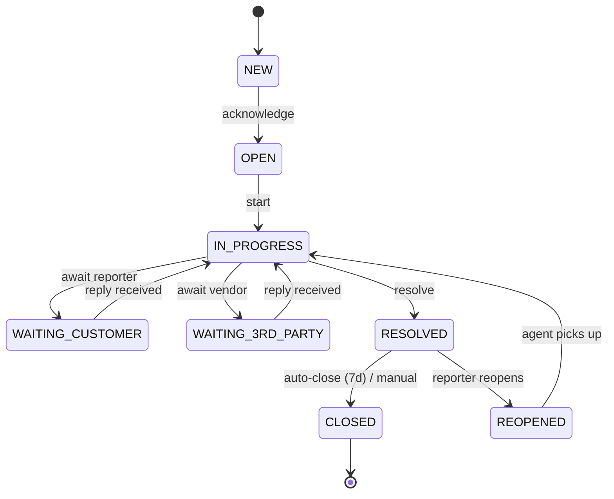

<!-- Template Meta
     Template-ID:   TPL-SVC
     Version:       1.1.0
     Compliance:    95%+
-->

# Ticket Service — Domain Specification

> **Conceptual Stack Layer:** Domain / Service
> **Space:** Platform
> **Owner:** team-tks

> **Meta Information**
> - **Version:** 2026-04-18
> - **Template:** `domain-service-spec.md` v1.1.0
> - **Template Compliance:** 95%+
> - **Status:** DRAFT
> - **Service ID:** `tks-tkt-svc`
> - **Suite:** `tks`
> - **Domain:** `tkt`
> - **Base Package:** `io.openleap.tks.tkt`
> - **API Path:** `/api/tks/tkt/v1`
> - **Port:** 8500
> - **DB Schema:** `tks_tkt`
> - **Tier:** T3 — Core Business Suite
> - **Bounded Context:** `bc:tickets`

---

## 0. Document Purpose & Scope

This document specifies the **Ticket Service** (`tks-tkt-svc`) within the TKS Suite: the canonical home of ticket lifecycle, comments, SLA policies + clocks, and assignment.

**Audience:** backend developers, frontend/BFF developers, QA engineers, architects, product owners.

**In scope:** Ticket aggregate lifecycle, `TicketComment` (internal/public), `SLAPolicy` + `SLAClock` pause/resume semantics, assignment tracking, escalation events, extension hooks.
**Out of scope:** UI (see feature specs under `features/`), infrastructure, inbound channel parsing (→ `tks-ch-svc`), KB (→ `tks-kb-svc`), CI graph (→ `tks-cmdb-svc`), notification delivery (→ `shared-ntf-svc`), rule execution (→ `shared-wf-svc`).

**Related documents:**
- Suite Spec: `T3_Domains/TKS/_tks_suite.md`
- OpenAPI: `T3_Domains/TKS/contracts/http/tks/tkt/openapi.yaml`
- Event Schemas: `T3_Domains/TKS/contracts/events/tks/tkt/*.schema.json`

---

## 1. Business Context

### 1.1 Purpose & Responsibility

Own the ticket as the atomic unit of tracked work for customer support, IT service management, and issue triage. Accept create-and-update operations from agents (REST), from channels (events via `tks-ch-svc`), and from workflow actions (REST callbacks from `shared-wf-svc`). Maintain SLA clocks that pause during `WAITING_*` statuses and resume on transition back, business-hours-aware via `shared.cap`. Emit domain events for every state change.

**Owns:**
- `Ticket` (root) — lifecycle, priority, status, assignment, SLA clock state
- `TicketComment` (child) — internal/public messages
- `SLAPolicy` (root) — per-tenant target thresholds by priority + category
- `SLAClock` (value object inside Ticket) — accumulated time per target + pause history
- `AssignmentLog` (child, append-only) — assignee history

### 1.2 Business Value

A tenant-scoped ticket fabric with guaranteed ordering of state transitions, idempotent API, and auditable timeline. Every suite and every product that needs "a thing with status + owner + SLA" calls this service.

---

## 2. Service Identity

| Field | Value |
|-------|-------|
| Service ID | `tks-tkt-svc` |
| Suite | `tks` |
| Domain | `tkt` |
| Bounded Context | `bc:tickets` |
| Base Package | `io.openleap.tks.tkt` |
| API Base Path | `/api/tks/tkt/v1` |
| Port | 8500 |
| Database Schema | `tks_tkt` |
| Tier | T3 — Core Business Suite |
| Repository | `openleap-io/io.openleap.tks.tkt` |
| Team | `team-tks` |

---

## 3. Domain Model

### 3.1 Aggregates

**Ticket** (AggregateRoot)

| Attribute | Type | Constraints |
|-----------|------|------------|
| id | uuid | immutable |
| tenantId | uuid | RLS |
| number | string | `^[A-Z]{2,4}-\d+$`, unique within tenant |
| title | string | 1..255 |
| description | text | 0..10 000 |
| reporterPartyId | uuid | → `shared.bp.party` |
| assigneePrincipalId | uuid? | → `iam.principal` |
| queueId | uuid? | routing queue |
| priority | enum | `LOW`,`MEDIUM`,`HIGH`,`URGENT`,`CRITICAL` |
| severity | enum? | `SEV4`..`SEV1` |
| category | string | tenant-configurable |
| source | enum | `CH_EMAIL`,`CH_WEB`,`CH_CHAT`,`CH_WEBHOOK`,`CH_API`,`INTERNAL` |
| status | enum | `NEW`,`OPEN`,`IN_PROGRESS`,`WAITING_CUSTOMER`,`WAITING_3RD_PARTY`,`RESOLVED`,`CLOSED`,`REOPENED` |
| slaPolicyId | uuid? | → `SLAPolicy` |
| slaClock | VO | — |
| linkedCiIds | uuid[] | → `tks.cmdb` (read projection) |
| attachmentDmsIds | uuid[] | → `tech.dms` |
| createdAt, resolvedAt, closedAt | timestamp | — |
| version | int | optimistic locking |

**Lifecycle:**

**TicketComment** (child entity of Ticket)

| Attribute | Type | Notes |
|---|---|---|
| id | uuid | |
| ticketId | uuid | FK |
| authorPartyId | uuid | → `shared.bp` (reporter) or `iam.principal` (agent) |
| visibility | enum | `INTERNAL` \| `PUBLIC` |
| body | text | markdown |
| attachmentDmsIds | uuid[] | |
| channelMessageId | string? | if inbound |
| createdAt | timestamp | immutable |

**SLAPolicy** (AggregateRoot)

| Attribute | Type | Notes |
|---|---|---|
| id | uuid | |
| tenantId | uuid | RLS |
| name | string | |
| appliesWhen | predicate | priority + category filter |
| firstResponseTarget | duration | e.g. PT4H |
| resolutionTarget | duration | e.g. PT24H |
| businessHoursProfileId | uuid | → `shared.cap` |
| escalationThresholdPct | int | default 80 |
| status | enum | `DRAFT`,`ACTIVE`,`ARCHIVED` |

**SLAClock** (VO inside Ticket)

| Attribute | Type | Notes |
|---|---|---|
| firstResponseElapsed | duration | accumulated |
| resolutionElapsed | duration | accumulated |
| pauseReasons[] | `{from,to,reason}` | history |
| breachRiskPct | int | cached |
| lastTickAt | timestamp | |

### 3.2 Enumerations

See attribute tables above (`TicketStatus`, `Priority`, `Severity`, `Source`, `Visibility`).

### 3.3 Shared Types

`TicketRef`, `Priority`, `Visibility` — exported as suite-level library types (see `_tks_suite.md` SS2.3).

---

## 4. Business Rules

### 4.1 Rule Catalog

| ID | Rule | Type |
|----|------|------|
| BR-TKT-001 | SLA clock pauses while ticket is in `WAITING_CUSTOMER` or `WAITING_3RD_PARTY`; resumes on transition back | POLICY |
| BR-TKT-002 | Escalation signal fires when `firstResponseElapsed` OR `resolutionElapsed` reaches `escalationThresholdPct` of target; event `tks.tkt.sla.approaching-breach` | POLICY |
| BR-TKT-003 | Reopening a `RESOLVED` / `CLOSED` ticket resets `resolutionElapsed` but not `firstResponseElapsed` | POLICY |
| BR-TKT-004 | Comment `visibility` is immutable after publish | CONSTRAINT |
| BR-TKT-005 | Assignment to `null` (unassign) is allowed only from statuses ≠ `IN_PROGRESS` | POLICY |
| BR-TKT-006 | `CLOSED` tickets allow no further writes except comments with `visibility=INTERNAL` | CONSTRAINT |
| BR-TKT-007 | Ticket number auto-generated per tenant; format `^[A-Z]{2,4}-\d+$`; never reused | CONSTRAINT |
| BR-TKT-008 | All writes audit-logged through `iam.audit` within the same transaction (outbox) | CONSTRAINT |
| BR-TKT-009 | Tenant isolation: every query and write filtered by caller's `tenant_id` via RLS | CONSTRAINT |

### 4.2 Cross-Field Validations

- `assigneePrincipalId` MUST belong to the same tenant.
- `slaPolicyId` MUST reference an `ACTIVE` policy of the same tenant.
- `linkedCiIds` MUST reference CIs of the same tenant (enforced by `tks-cmdb-svc` validation on link creation).

---

## 5. Use Cases

### 5.1 Canonical Use Cases

| UC | Type | Trigger | Aggregate | Domain Operation | Events | REST |
|----|------|---------|-----------|------------------|--------|------|
| CreateTicket | WRITE | REST / Message | Ticket | `Ticket.create` | `tks.tkt.ticket.created` | `POST /tickets` |
| UpdateTicket | WRITE | REST | Ticket | `Ticket.update` | `tks.tkt.ticket.updated` | `PATCH /tickets/{id}` |
| AssignTicket | WRITE | REST / Message | Ticket | `Ticket.assign` | `tks.tkt.ticket.assigned` | `POST /tickets/{id}/assign` |
| AddComment | WRITE | REST / Message | Ticket (via comment) | `Ticket.addComment` | `tks.tkt.ticket.commented` | `POST /tickets/{id}/comments` |
| ChangeStatus | WRITE | REST | Ticket | `Ticket.transitionTo` | `tks.tkt.ticket.status-changed` | `POST /tickets/{id}/transition` |
| ResolveTicket | WRITE | REST / Message | Ticket | `Ticket.resolve` | `tks.tkt.ticket.resolved` | `POST /tickets/{id}/resolve` |
| ReopenTicket | WRITE | REST / Message | Ticket | `Ticket.reopen` | `tks.tkt.ticket.reopened` | `POST /tickets/{id}/reopen` |
| EscalateTicket | WRITE | Message (from `shared.wf`) / REST | Ticket | `Ticket.escalate` | `tks.tkt.ticket.escalated` | `POST /tickets/{id}/escalate` |
| LinkAttachment | WRITE | REST | Ticket | `Ticket.linkAttachment` | `tks.tkt.ticket.updated` | `POST /tickets/{id}/attachments` |
| CreateSLAPolicy | WRITE | REST | SLAPolicy | `SLAPolicy.create` | `tks.tkt.sla-policy.created` | `POST /sla-policies` |
| UpdateSLAPolicy | WRITE | REST | SLAPolicy | `SLAPolicy.update` | `tks.tkt.sla-policy.updated` | `PATCH /sla-policies/{id}` |
| ListMyQueue | READ | REST | Ticket | query | — | `GET /tickets?assigneePrincipalId=me&status=OPEN,IN_PROGRESS` |
| GetTimeline | READ | REST | Ticket | query | — | `GET /tickets/{id}/timeline` |
| GetTicket | READ | REST | Ticket | query | — | `GET /tickets/{id}` |

### 5.2 Business Logic Placement

| Logic Type | Placement |
|------------|-----------|
| Aggregate invariants, state transitions | Ticket aggregate root |
| SLA clock math (pause/resume + business hours) | Ticket domain service (reads `shared.cap`) |
| Cross-aggregate orchestration (rule-driven actions) | External: `shared-wf-svc` calls back via REST |
| Notification dispatch | External: `shared-ntf-svc` subscribes to events |

---

## 6. REST API

**Base Path:** `/api/tks/tkt/v1`
**Authentication:** OAuth2 / JWT. **Scopes:** `tks.tkt:read`, `tks.tkt:write`, `tks.tkt:admin`.

### 6.1 Endpoint Summary

| Method | Path | Description |
|--------|------|-------------|
| `POST` | `/tickets` | Create ticket |
| `GET` | `/tickets` | List/search tickets (filters: status, assignee, priority, category, createdFrom) |
| `GET` | `/tickets/{id}` | Read |
| `PATCH` | `/tickets/{id}` | Partial update |
| `POST` | `/tickets/{id}/assign` | Set assignee |
| `POST` | `/tickets/{id}/transition` | Change status |
| `POST` | `/tickets/{id}/resolve` | Resolve |
| `POST` | `/tickets/{id}/reopen` | Reopen |
| `POST` | `/tickets/{id}/escalate` | Escalate (idempotent; called by `shared.wf`) |
| `POST` | `/tickets/{id}/comments` | Add comment (internal or public) |
| `GET` | `/tickets/{id}/comments` | List comments (filtered by visibility scope) |
| `POST` | `/tickets/{id}/attachments` | Link a `tech.dms` document |
| `DELETE` | `/tickets/{id}/attachments/{attId}` | Unlink attachment |
| `GET` | `/tickets/{id}/timeline` | Unified timeline (comments + state + assignment) |
| `POST` | `/sla-policies` | Create policy |
| `GET` | `/sla-policies` | List policies |
| `GET` | `/sla-policies/{id}` | Read policy |
| `PATCH` | `/sla-policies/{id}` | Update policy |

Full payloads in `contracts/http/tks/tkt/openapi.yaml`.

---

## 7. Events & Integration

### 7.1 Pattern

`event_driven` — follows the suite pattern (SS4 of `_tks_suite.md`).

### 7.2 Published Events

| Event | Routing Key |
|-------|------------|
| TicketCreated | `tks.tkt.ticket.created` |
| TicketUpdated | `tks.tkt.ticket.updated` |
| TicketAssigned | `tks.tkt.ticket.assigned` |
| TicketCommented | `tks.tkt.ticket.commented` |
| TicketStatusChanged | `tks.tkt.ticket.status-changed` |
| TicketResolved | `tks.tkt.ticket.resolved` |
| TicketReopened | `tks.tkt.ticket.reopened` |
| TicketEscalated | `tks.tkt.ticket.escalated` |
| SLAPolicyCreated | `tks.tkt.sla-policy.created` |
| SLAPolicyUpdated | `tks.tkt.sla-policy.updated` |
| SLAApproachingBreach | `tks.tkt.sla.approaching-breach` |
| SLABreached | `tks.tkt.sla.breached` |

### 7.3 Consumed Events

| Source | Routing Key | Handler Purpose |
|--------|-------------|-----------------|
| `tks-ch-svc` | `tks.ch.conversation.message-received` | Create ticket or append comment |
| `shared-bp-svc` | `shared.bp.party.updated` | Cache reporter contact info |
| `shared-bp-svc` | `shared.bp.party.merged` | Reattribute tickets to surviving party |
| `iam.principal` | `iam.principal.principal.deleted` | Anonymise assigneePrincipalId |
| `shared-cap-svc` | `shared.cap.business-hours.changed` | Recompute breach-risk on affected tenants |
| `tks-cmdb-svc` | `tks.cmdb.ticket-ci-link.created / removed` | Update `linkedCiIds` projection |

---

## 8. Data Model

**Storage:** PostgreSQL 16, schema `tks_tkt`.

Primary tables:

- `tickets` — Ticket aggregate; columns for identity + scalar attributes; JSONB for `sla_clock`; RLS on `tenant_id`.
- `ticket_comments` — Comment entity; `ticket_id` FK; visibility-scoped queries.
- `ticket_attachments` — join to `tech.dms` document ids.
- `sla_policies` — SLAPolicy aggregate.
- `assignments_log` — append-only history per ticket.
- `outbox_events` — transactional outbox (ADR-013 platform-wide).

Indexes: `(tenant_id, status, assignee_principal_id)`, `(tenant_id, number)` unique, `(tenant_id, category)`, `(tenant_id, created_at DESC)`, GIN on `sla_clock.pause_reasons` jsonb.

---

## 9. Security & Compliance

### 9.1 Access Control

| Role | Access Level |
|------|-------------|
| `tenant-admin` | Full CRUD on SLA policies |
| `support-agent` | CRUD on tickets in own tenant; add comments; transition |
| `support-manager` | Agent + reassign + escalate |
| `reporter` (via portal scope) | Create own, read own, reply (PUBLIC comments) |
| `automation-sender` (service) | Create + update + transition through workflow |

### 9.2 Data Classification

Confidential — tickets contain PII, business data. Logs MUST NOT include body content; only IDs.

### 9.3 Compliance

- **GDPR Art. 15 / 17 / 20** — endpoints `/tickets?partyId=X` (admin) + automatic erasure on `shared.bp.party.erased`.
- **DORA incident tracking** — 7-year retention for tickets matching `category=incident` or `severity in (SEV1,SEV2)`.
- **SOX immutability** — comment bodies and audit log entries append-only; backups immutable per platform policy.

### 9.4 DORA ICT Risk References

| Risk ID | Title | Treatment |
|---|---|---|
| `RISK-TKS-TKT-001` | SLA breach inflates support cost + SLAs penalties | Mitigate: escalation automation + management dashboards |
| `RISK-TKS-TKT-002` | Storm of inbound escalates via SLA clocks and paginates workflow queue | Mitigate: rate-limiting escalation publishes; circuit breaker on `shared.wf` callbacks |

### 9.5 SBOM Requirements

CycloneDX per build; retention 5 years.

---

## 10. Quality Attributes

### 10.1 Performance Targets

| Operation | p95 | p99 |
|-----------|-----|-----|
| `GET /tickets/{id}` | < 60 ms | < 180 ms |
| `POST /tickets` | < 150 ms | < 350 ms |
| `POST /tickets/{id}/comments` | < 120 ms | < 300 ms |
| `GET /tickets` (filter + page 50) | < 180 ms | < 400 ms |
| Event publish lag (commit → bus) | < 300 ms | < 1 s |

### 10.2 Availability

99.9 %.

### 10.3 Scalability

- Stateless REST tier (≥ 3 replicas).
- Scheduler for SLA clock ticks single-leader via distributed lock; tick interval 60 s.
- Outbox publisher horizontally scaled.

### 10.5 SLI/SLO Reference

`SLO-TKS-TKT-001` — availability 99.9%, latency p95 < 200 ms, error rate < 0.1%.

### 10.6 Resilience Requirements

| Aspect | Value |
|---|---|
| RTO | < 15 min |
| RPO | < 5 min |
| Backup | daily full + hourly incremental |
| Failover | primary → read-replica promotion with RPO replay |

---

## 11. Feature Dependencies

| Feature ID | Feature Name |
|-----------|-------------|
| `F-TKS-100` | Ticket Lifecycle |
| `F-TKS-110` | Comments & Notes |
| `F-TKS-120` | SLA & Escalation |
| `F-TKS-130` | Queue & Assignment |
| `F-TKS-140` | Ticket Attachments |
| `F-TKS-500` | AI Ticket Summary |
| `F-TKS-510` | AI Auto-Triage |
| `F-TKS-520` | AI Writing Assistant |
| `F-TKS-420` | Ticket ↔ CI Linkage |
| `F-TKS-900` | T4 Reporting Projection |

---

## 12. Extension Points

### 12.1 Extension Events

| Event | Routing Key | Purpose |
|---|---|---|
| TicketPreCreate | `tks.tkt.ext.pre-create` | Tenant validation / enrichment before persist |
| TicketPreStatusChange | `tks.tkt.ext.pre-status-change` | Custom guards |
| TicketPostResolve | `tks.tkt.ext.post-resolve` | KPI / scorecard hooks |

### 12.2 Aggregate Hooks

| Hook | Aggregate | Point | Mode | Timeout |
|---|---|---|---|---|
| `TicketValidator` | Ticket | pre-create, pre-update | fail-closed | 300 ms |
| `CommentEnricher` | Ticket (comment) | pre-publish | fail-open | 200 ms |

### 12.3 Extension API

| Endpoint | Purpose | Scope |
|---|---|---|
| `POST /extensions/hooks` | Register hook handler | `tks.tkt:admin` |
| `GET /extensions/hooks` | List hooks | `tks.tkt:admin` |
| `DELETE /extensions/hooks/{id}` | Unregister | `tks.tkt:admin` |

---

## 13. Migration & Evolution

- Supersedes `crm-sup-svc` (customer-support cases). Migration mapping: `crm_support.tickets.*` → `tks_tkt.tickets.*` with field-for-field translation; `SLAPolicy` and `TicketComment` migrated verbatim; `KnowledgeArticle` moves to `tks-kb-svc` (not here).
- Routing-key bridge: during migration grace period, `crm.sup.ticket.*` is re-emitted as `tks.tkt.ticket.*` by the bridge layer so downstream consumers can cut over once.
- Flyway scripts: `V0001__initial.sql`, `V0002__migrate_from_crm_support.sql` (data copy).

---

## 14. Decisions & Open Questions

| # | Question | Severity | Status |
|---|----------|----------|--------|
| Q-TKT-001 | Do we need "sub-tickets" / parent-child in v1? | Medium | Open — lean NO; use CI link for "same-incident" grouping |
| Q-TKT-002 | Should severity be mandatory for `SEV1/SEV2` tickets or inferred by category? | Low | Open |
| Q-TKT-003 | Comment attachments stored inline or always via `tech.dms`? | Low | Decided — always `tech.dms` (recorded as ADR-TKT-002) |

### 14.4 ADRs

- **ADR-TKT-001** *(Proposed)*: Ticket states match the 8-state canonical lifecycle above; tenant customisation limited to category + priority enum entries. Rationale: interoperability across suites + deterministic SLA clock.
- **ADR-TKT-002** *(Accepted)*: Attachments always go through `tech.dms`; no inline bodies. Rationale: decouples storage policy + AV scan + size governance.

---

## 15. Appendix

### 15.1 Glossary

See `T3_Domains/TKS/_tks_suite.md` SS1.

### 15.2 Change Log

| Date | Version | Author | Changes |
|------|---------|--------|---------|
| 2026-04-18 | 1.0.0 | OpenLeap Architecture Team | Initial Ticket Service spec (TKS v1.0.0) |

### 15.3 Companion Files

- OpenAPI: `contracts/http/tks/tkt/openapi.yaml`
- Event Schemas: `contracts/events/tks/tkt/*.schema.json`
- Suite Spec: `T3_Domains/TKS/_tks_suite.md`
