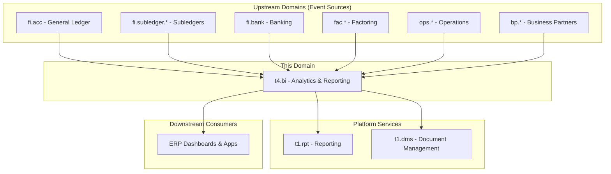
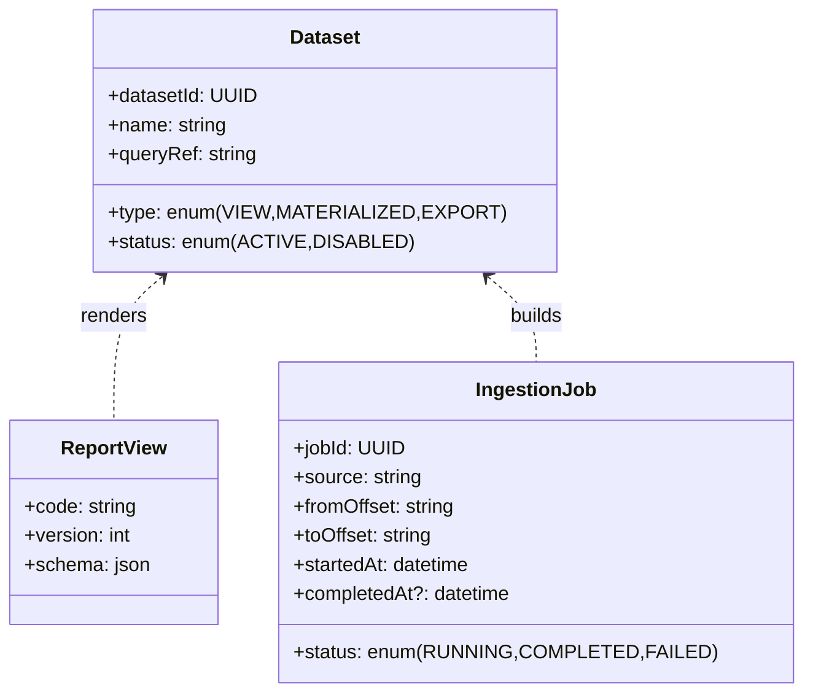
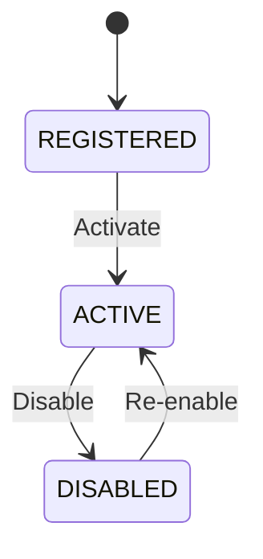
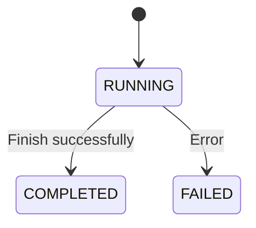
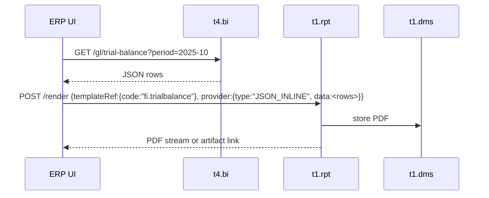
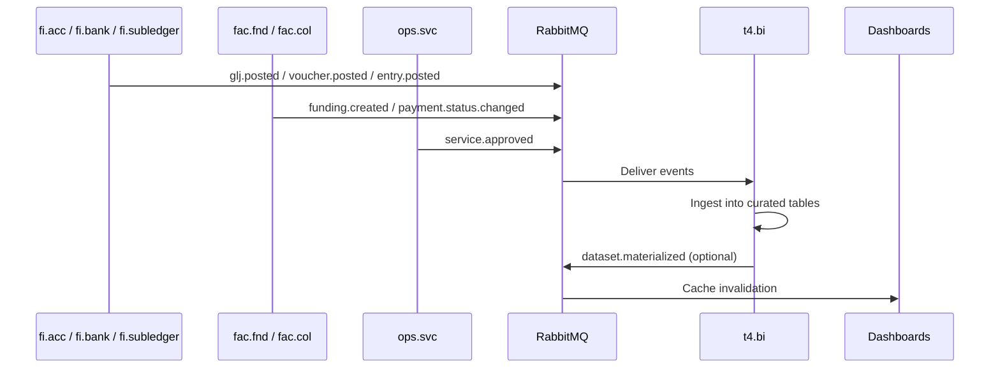
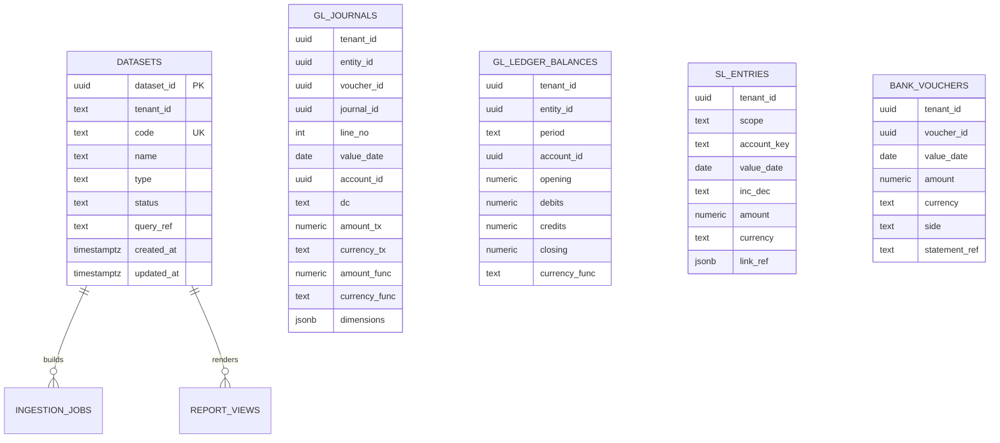

# BI - Analytics & Accounting Reporting Domain / Service Specification

> **Conceptual Stack Layer:** Domain / Service
> **Space:** Platform
> **Owner:** Domain Engineering Team
> **Schema alignment:** `service-layer.schema.json`
> **Companion files:** `openapi.yaml`, `*.schema.json` (event contracts)
> **Referenced by:** Platform-Feature Spec SS5 (backend dependencies), BFF Contract
> **Belongs to:** T4 Data Suite

> **Meta Information**
> - **Version:** 2026-04-01
> - **Template:** `domain-service-spec.md` v1.0.0
> - **Template Compliance:** ~92% — §8 no table-column defs, §4 thin, §13 thin
> - **Author(s):** OpenLeap Platform Team
> - **Status:** DRAFT
> - **Suite:** `t4`
> - **Domain:** `bi`
> - **Bounded Context Ref:** `bc:analytics`
> - **Service ID:** `t4-bi-svc`
> - **basePackage:** `io.openleap.t4.bi`
> - **API Base Path:** `/api/t4/bi/v1`
> - **OpenLeap Starter Version:** `v1.0`
> - **Port:** TBD
> - **Repository:** N/A (no known implementation repo)
> - **Tags:** `analytics`, `reporting`, `read-model`, `bi`
> - **Team:**
>   - Name: TBD
>   - Email: TBD
>   - Slack: TBD

---

## Specification Guidelines Compliance

>
> ### Non-Negotiables
> - Never invent facts. If required info is missing, add an **OPEN QUESTION** entry.
> - Preserve intent and decisions. Only change meaning when explicitly requested.
> - Do not remove normative constraints unless they are explicitly replaced.
> - Keep the spec **self-contained**: no "see chat", no implicit context.
>
> ### Source of Truth Priority
> When sources conflict:
> 1. Spec (explicit) wins
> 2. Starter specs (implementation constraints) next
> 3. Guidelines (best practices) last
>
> Record conflicts in the **Decisions & Conflicts** section (see Section 14).
>
> ### Style Guide
> - Prefer short sentences and lists.
> - Use MUST/SHOULD/MAY for normative statements.
> - Keep terminology consistent (Aggregate, Domain Service, Application Service, Command, Event).
> - Avoid ambiguous words ("often", "maybe") unless explicitly noting uncertainty.
> - Keep examples minimal and clearly marked as examples.
> - Do not add implementation code unless the chapter explicitly requires it.

---

## 0. Document Purpose & Scope

### 0.1 Purpose

t4.bi provides a Tier-4, read-only analytics and reporting service across the ERP. It exposes accounting reports (trial balance, account movements, journal explorer) and business analytics (AR aging, funding analytics, service KPIs).

### 0.2 Target Audience

- Product Owners & Business Stakeholders
- Finance (accountants, controllers), operations managers, executives, data analysts
- System Architects & Technical Leads
- Integration Engineers

### 0.3 Scope

**In Scope:**
- Ingest events from core domains (GL journals/ledgers, subledger entries, banking vouchers, factoring states, services) into curated fact/dimension tables.
- Expose HTTP query APIs and materialized views optimized for BI/analytics.
- Optional: dataset export (CSV/Parquet) and printable reports via `t1.rpt`.

**Out of Scope:**
- Mutating source records in Tier-3 services (AR/AP/ACC/BANK/etc.).
- Acting as a system of record; BI is derivative/read side.
- Implementation details (see Developer Guidelines).
- Infrastructure and deployment.

### 0.4 Related Documents

- `SYSTEM_OVERVIEW.md` - Platform architecture overview
- `spec/T3_Domains/FI/` - Finance domain specifications (primary event source)
- `spec/T3_Domains/FAC/` - Factoring domain specifications
- `spec/T3_Domains/OPS/` - Operations domain specifications
- `spec/T1_Platform/rpt/` - Reporting platform service
- `spec/T1_Platform/dms/` - Document management platform service

---

## 1. Business Context

### 1.1 Domain Purpose

t4.bi solves the problem of fragmented analytical data across ERP suites. By ingesting events from FI, FAC, OPS, BP, and other suites into a curated analytical store, it provides a single query surface for accounting reports and business analytics.

### 1.2 Business Value

- Unified accounting and business reporting across all ERP domains.
- Near real-time analytics without impacting transactional service performance.
- Self-service query APIs for dashboards, exports, and printed reports.

### 1.3 Key Stakeholders

| Role | Responsibility | Primary Use Cases |
|------|----------------|-------------------|
| Finance (accountants, controllers) | Consume accounting reports | Trial balance, journal explorer, account movements |
| Operations managers | Monitor operational KPIs | Service KPIs, workflow analytics |
| Executives | Strategic decision support | Funding analytics, aging reports |
| Data analysts | Ad-hoc analysis and export | Dataset exploration, CSV/Parquet export |

### 1.4 Strategic Positioning

t4.bi is a Tier-4 service that acts as a consumer of events from all suites per `SYSTEM_OVERVIEW`. It MUST NOT hold authoritative data; all data is derivative. It sits downstream of all Tier-3 domains and uses Tier-1 platform services (`t1.rpt`, `t1.dms`) for rendering and artifact storage.

### 1.5 Service Context


| Property | Value |
|----------|-------|
| **Suite** | `t4` |
| **Domain** | `bi` |
| **Bounded Context** | `bc:analytics` |
| **Service ID** | `t4-bi-svc` |
| **Base Package** | `io.openleap.t4.bi` |

**Conventions:**
- Events exchange: `t4.bi.events` (topic)
- Routing keys: `t4.bi.<aggregate>.<event>` (read side emits few lifecycle events; primarily consumes)
- Consumes: `fi.acc`, `fi.subledger.*`, `fi.bank`, `fac.*`, `ops.*`, `bp.*` events
- Optional: uses `t1.rpt` (reporting) to export PDFs; uses `t1.dms` for artifact storage

**Responsibilities:**
- Ingest domain events into curated analytical tables
- Expose accounting and business analytics via HTTP query APIs
- Manage datasets, materialized views, and export jobs

**Authoritative Sources:**
| Source Type | Description | Access Pattern |
|-------------|-------------|----------------|
| REST API | Read-only query APIs for reports and analytics | Synchronous |
| Database | Curated fact/dimension tables (derivative, not system of record) | Direct (owner) |
| Events | Minimal outbound events for materialization and export completion | Asynchronous |



---

## 2. Service Identity

| Property | Value | Schema Field |
|----------|-------|-------------|
| **Service ID** | `t4-bi-svc` | `metadata.id` |
| **Display Name** | Analytics & Accounting Reporting | `metadata.name` |
| **Suite** | `t4` | `metadata.suite` |
| **Domain** | `bi` | `metadata.domain` |
| **Bounded Context** | `bc:analytics` | `metadata.bounded_context_ref` |
| **Version** | `0.1.0` | `metadata.version` |
| **Status** | DRAFT | `metadata.status` |
| **API Base Path** | `/api/t4/bi/v1` | `metadata.api_base_path` |
| **Repository** | N/A | `metadata.repository` |
| **Tags** | `analytics`, `reporting`, `read-model`, `bi` | `metadata.tags` |

**Team:**
| Property | Value |
|----------|-------|
| **Name** | TBD |
| **Email** | TBD |
| **Slack Channel** | TBD |

---

## 3. Domain Model

### 3.1 Conceptual Overview

t4.bi is a read-side service. Its domain model consists of lightweight aggregates for managing datasets and ingestion jobs, plus value objects for query filtering. The service does NOT enforce financial invariants; those belong to upstream Tier-3 services.

### 3.2 Core Concepts



### 3.3 Aggregate Definitions

#### 3.3.1 Dataset

| Property | Value |
|----------|-------|
| **Aggregate ID** | `agg:dataset` |
| **Name** | `Dataset` |

**Business Purpose:**
Represents a named analytical dataset or view that can be queried, materialized, or exported. Datasets are the primary unit of organization for BI content.

##### Aggregate Root

**Key Attributes:**
| Attribute | Type | Format | Description | Constraints | Required | Read-Only |
|-----------|------|--------|-------------|-------------|----------|-----------|
| datasetId | string | uuid | Unique identifier | Immutable | Yes | Yes |
| name | string | -- | Human-readable dataset name | Unique per tenant | Yes | No |
| type | string | -- | Dataset type | enum_ref: `DatasetType` | Yes | No |
| queryRef | string | -- | Reference to the underlying query definition | -- | Yes | No |
| status | string | -- | Current lifecycle state | enum_ref: `DatasetStatus` | Yes | No |
| tenantId | string | uuid | Tenant ownership | -- | Yes | Yes |

**Lifecycle States:**

| Property | Value |
|----------|-------|
| **Initial State** | `REGISTERED` |
| **Terminal States** | `DISABLED` |



**Invariants:**
| Rule ID | Description |
|---------|-------------|
| BR-001 | Dataset name MUST be unique per tenant |
| BR-002 | Dataset type determines refresh semantics (VIEW = live query, MATERIALIZED = snapshot, EXPORT = one-time) |

**Domain Events Emitted:**
- `t4.bi.dataset.materialized`

#### 3.3.2 IngestionJob

| Property | Value |
|----------|-------|
| **Aggregate ID** | `agg:ingestion-job` |
| **Name** | `IngestionJob` |

**Business Purpose:**
Tracks the progress and state of event ingestion from upstream domains into the BI analytical store.

##### Aggregate Root

**Key Attributes:**
| Attribute | Type | Format | Description | Constraints | Required | Read-Only |
|-----------|------|--------|-------------|-------------|----------|-----------|
| jobId | string | uuid | Unique identifier | Immutable | Yes | Yes |
| source | string | -- | Upstream event source identifier | -- | Yes | No |
| status | string | -- | Current job state | enum_ref: `IngestionJobStatus` | Yes | No |
| fromOffset | string | -- | Start offset for event window | -- | Yes | No |
| toOffset | string | -- | End offset for event window | -- | Yes | No |
| startedAt | string | date-time | Job start timestamp | -- | Yes | Yes |
| completedAt | string | date-time | Job completion timestamp | -- | No | Yes |

**Lifecycle States:**

| Property | Value |
|----------|-------|
| **Initial State** | `RUNNING` |
| **Terminal States** | `COMPLETED`, `FAILED` |



**Invariants:**
| Rule ID | Description |
|---------|-------------|
| BR-003 | Event offsets MUST be monotonic |
| BR-004 | Jobs MUST be idempotent by (source, window) |

**Domain Events Emitted:**
- None (internal tracking only)

### 3.4 Enumerations

#### DatasetType

**Description:** Classification of a dataset that determines its refresh semantics.

| Value | Description | Deprecated |
|-------|-------------|------------|
| `VIEW` | Live query against curated tables | No |
| `MATERIALIZED` | Snapshot refreshed on demand or schedule | No |
| `EXPORT` | One-time export to file (CSV/Parquet) | No |

#### DatasetStatus

**Description:** Lifecycle state of a dataset.

| Value | Description | Deprecated |
|-------|-------------|------------|
| `REGISTERED` | Newly created, not yet active | No |
| `ACTIVE` | Available for queries and materialization | No |
| `DISABLED` | Suspended, not queryable | No |

#### IngestionJobStatus

**Description:** Execution state of an ingestion job.

| Value | Description | Deprecated |
|-------|-------------|------------|
| `RUNNING` | Job is currently processing events | No |
| `COMPLETED` | Job finished successfully | No |
| `FAILED` | Job encountered an error | No |

### 3.5 Shared Types

#### JournalFilter

| Property | Value |
|----------|-------|
| **Type ID** | `type:journal-filter` |
| **Name** | `JournalFilter` |

**Description:** Filter criteria for journal search queries.

**Attributes:**
| Attribute | Type | Format | Description | Constraints |
|-----------|------|--------|-------------|-------------|
| dateFrom | string | date | Start date for filter range | Required |
| dateTo | string | date | End date for filter range | Required, >= dateFrom |
| accountIds | array | uuid | Filter by account identifiers | Optional |
| dimensions | object | -- | Dimension filters (key-value) | Optional |
| minAmount | number | -- | Minimum amount threshold | Optional |
| maxAmount | number | -- | Maximum amount threshold | Optional, >= minAmount |
| entityId | string | uuid | Filter by legal entity | Optional |
| currency | string | -- | Filter by currency code (ISO 4217) | Optional |

**Validation Rules:**
- `dateFrom` MUST be before or equal to `dateTo`
- If both `minAmount` and `maxAmount` are provided, `maxAmount` MUST be >= `minAmount`
- `currency` MUST be a valid ISO 4217 code

**Used By:**
- `agg:dataset` (journal search queries)

#### PeriodRef

| Property | Value |
|----------|-------|
| **Type ID** | `type:period-ref` |
| **Name** | `PeriodRef` |

**Description:** Reference to a fiscal period (year + month).

**Attributes:**
| Attribute | Type | Format | Description | Constraints |
|-----------|------|--------|-------------|-------------|
| year | integer | -- | Fiscal year | minimum: 2000, maximum: 2099 |
| month | integer | -- | Fiscal month | minimum: 1, maximum: 12 |

**Validation Rules:**
- `year` MUST be a four-digit year
- `month` MUST be in range 1-12

**Used By:**
- `agg:dataset` (period-based queries such as trial balance)

---

## 4. Business Rules & Constraints

### 4.1 Business Rules Catalog

| ID | Rule Name | Description | Scope | Enforcement | Error Code |
|----|-----------|-------------|-------|-------------|------------|
| BR-001 | Unique Dataset Name | Dataset name MUST be unique per tenant | Dataset | Create/Update | `BI_DATASET_NAME_DUPLICATE` |
| BR-002 | Type Determines Refresh | Dataset type determines refresh semantics | Dataset | Create | `BI_DATASET_TYPE_INVALID` |
| BR-003 | Monotonic Offsets | Event offsets MUST be monotonic within an ingestion job | IngestionJob | Create | `BI_OFFSET_NOT_MONOTONIC` |
| BR-004 | Idempotent Ingestion | Jobs MUST be idempotent by (source, window) | IngestionJob | Create | `BI_JOB_DUPLICATE_WINDOW` |

### 4.2 Detailed Rule Definitions

> OPEN QUESTION: Detailed business rule definitions have not been authored yet. The rules above capture the core invariants from the domain model.

### 4.3 Data Validation Rules

**Field-Level Validations:**
| Field | Validation Rule | Error Message |
|-------|----------------|---------------|
| Dataset.name | Required, max 255 chars, unique per tenant | "Dataset name is required, must be unique, and cannot exceed 255 characters" |
| Dataset.type | Required, must be one of VIEW, MATERIALIZED, EXPORT | "Invalid dataset type" |
| JournalFilter.dateFrom | Required, valid date | "dateFrom is required" |
| JournalFilter.dateTo | Required, valid date, >= dateFrom | "dateTo must be on or after dateFrom" |

### 4.4 Reference Data Dependencies

> OPEN QUESTION: Reference data dependencies (e.g., account charts, currency catalogs) consumed from upstream services have not been fully catalogued yet.

---

## 5. Use Cases

### 5.1 Business Logic Placement

| Logic Type | Placement | Examples |
|------------|-----------|----------|
| Dataset invariants | Domain Object | Name uniqueness, type validation |
| Ingestion orchestration | Application Service | Event consumption, offset tracking |
| Query execution | Application Service | Trial balance assembly, aging calculation |

### 5.2 Use Cases (Canonical Format)

#### UC-001: QueryTrialBalance

| Field | Value |
|-------|-------|
| **id** | `QueryTrialBalance` |
| **type** | READ |
| **trigger** | REST |
| **aggregate** | `Dataset` (reads curated tables) |
| **domainOperation** | `TrialBalanceQuery.execute` |
| **inputs** | `entityId: UUID`, `period: PeriodRef`, `currency: String`, `level: Integer?` |
| **outputs** | `TrialBalanceRow[]` |
| **events** | -- |
| **rest** | `GET /api/t4/bi/v1/gl/trial-balance` |
| **idempotency** | none |
| **errors** | `BI_PERIOD_NOT_FOUND`: no data for requested period |

#### UC-002: SearchJournals

| Field | Value |
|-------|-------|
| **id** | `SearchJournals` |
| **type** | READ |
| **trigger** | REST |
| **aggregate** | `Dataset` (reads curated tables) |
| **domainOperation** | `JournalSearchQuery.execute` |
| **inputs** | `filter: JournalFilter` |
| **outputs** | `Page<JournalLine>` |
| **events** | -- |
| **rest** | `POST /api/t4/bi/v1/gl/journals/search` |
| **idempotency** | none |
| **errors** | -- |

#### UC-003: MaterializeDataset

| Field | Value |
|-------|-------|
| **id** | `MaterializeDataset` |
| **type** | WRITE |
| **trigger** | REST |
| **aggregate** | `Dataset` |
| **domainOperation** | `Dataset.materialize` |
| **inputs** | `code: String` |
| **outputs** | `Dataset` (refreshed) |
| **events** | `t4.bi.dataset.materialized` |
| **rest** | `POST /api/t4/bi/v1/datasets/{code}/materialize` |
| **idempotency** | required |
| **errors** | `BI_DATASET_NOT_FOUND`: dataset code does not exist |

#### UC-004: ExportDataset

| Field | Value |
|-------|-------|
| **id** | `ExportDataset` |
| **type** | WRITE |
| **trigger** | REST |
| **aggregate** | `Dataset` |
| **domainOperation** | `Dataset.export` |
| **inputs** | `code: String`, `format: String (CSV\|PARQUET)` |
| **outputs** | `ExportResult` (artifact reference) |
| **events** | `t4.bi.export.completed` |
| **rest** | `POST /api/t4/bi/v1/datasets/{code}/export` |
| **idempotency** | optional |
| **errors** | `BI_DATASET_NOT_FOUND`: dataset code does not exist, `BI_EXPORT_FORMAT_INVALID`: unsupported format |

#### UC-005: QueryAccountMovements

| Field | Value |
|-------|-------|
| **id** | `QueryAccountMovements` |
| **type** | READ |
| **trigger** | REST |
| **aggregate** | `Dataset` (reads curated tables) |
| **domainOperation** | `AccountMovementQuery.execute` |
| **inputs** | `accountId: UUID`, `from: Date`, `to: Date`, `currency: String`, `dimensions: Object?` |
| **outputs** | `AccountMovement[]` |
| **events** | -- |
| **rest** | `GET /api/t4/bi/v1/gl/accounts/{accountId}/movements` |
| **idempotency** | none |
| **errors** | -- |

#### UC-006: QueryARaging

| Field | Value |
|-------|-------|
| **id** | `QueryARaging` |
| **type** | READ |
| **trigger** | REST |
| **aggregate** | `Dataset` (reads curated tables) |
| **domainOperation** | `ARAgingQuery.execute` |
| **inputs** | `asOf: Date`, `by: String (client\|debtor\|currency)` |
| **outputs** | `AgingBucket[]` |
| **events** | -- |
| **rest** | `GET /api/t4/bi/v1/ar/aging` |
| **idempotency** | none |
| **errors** | -- |

> OPEN QUESTION: Additional use cases (AP aging, cash flow, dataset view queries) need formal canonical definitions.

### 5.3 Process Flow Diagrams

**Export to PDF:**


### 5.4 Cross-Domain Workflows

**Does this domain participate in multi-service workflows?** [x] YES [ ] NO

#### Workflow: Report Export to DMS

**Business Purpose:**
Allow users to export BI query results as printable PDF reports stored in the document management system.

**Orchestration Pattern:** [x] Choreography (EDA) [ ] Orchestration (Saga)

**Pattern Rationale:**
The export flow is a simple request-response chain. The ERP UI orchestrates the calls sequentially. No saga compensation is needed because BI is read-only.

**Participating Services:**
| Service | Role | Responsibilities |
|---------|------|------------------|
| t4.bi | Data Provider | Provides query results as JSON |
| t1.rpt | Renderer | Converts JSON to PDF using a template |
| t1.dms | Storage | Stores the rendered artifact |

---

## 6. REST API

### 6.1 API Overview

**Base Path:** `/api/t4/bi/v1`

**Authentication:** OAuth2/JWT (Bearer token)

**Authorization:**
- Read operations: Requires role `BI_VIEWER` or `FINANCE_ANALYST`
- Admin operations (materialize, export, manage datasets): Requires role `BI_ADMIN`

**General Notes:**
- IDs are UUID unless noted.
- Pagination: `page`, `size`, `sort` or seek tokens.
- Standard error model; 429 on heavy queries with backpressure.

### 6.2 Resource Operations

#### 6.2.1 Datasets - List

```http
GET /api/t4/bi/v1/datasets
Authorization: Bearer {token}
```

**Success Response:** `200 OK` -- list of datasets/views.

#### 6.2.2 Dataset - Materialize

```http
POST /api/t4/bi/v1/datasets/{code}/materialize
Authorization: Bearer {token}
```

**Business Purpose:** Trigger a refresh of a materialized dataset (idempotent).

**Events Published:**
- `t4.bi.dataset.materialized`

#### 6.2.3 Dataset - Export

```http
POST /api/t4/bi/v1/datasets/{code}/export
Authorization: Bearer {token}
Content-Type: application/json
```

**Request Body:**
```json
{
  "format": "CSV|PARQUET"
}
```

**Business Purpose:** Export a dataset as CSV or Parquet to DMS.

**Events Published:**
- `t4.bi.export.completed`

### 6.3 Business Operations

#### 6.3.1 Accounting - Trial Balance

```http
GET /api/t4/bi/v1/gl/trial-balance?entityId={uuid}&period=YYYY-MM&currency={code}&level={int}
Authorization: Bearer {token}
```

**Business Purpose:** Returns trial balance rows for a given entity, period, and currency. Optional `level` parameter controls chart-of-accounts depth.

#### 6.3.2 Accounting - Journal Search

```http
POST /api/t4/bi/v1/gl/journals/search
Authorization: Bearer {token}
Content-Type: application/json
```

**Request Body:** `JournalFilter` (see Shared Types in Section 3.5).

**Success Response:** `200 OK` -- paged journal lines with voucher linkage.

#### 6.3.3 Accounting - Account Movements

```http
GET /api/t4/bi/v1/gl/accounts/{accountId}/movements?from={date}&to={date}&currency={code}&dimensions={json}
Authorization: Bearer {token}
```

**Business Purpose:** Returns debit/credit movements for a specific account within a date range.

#### 6.3.4 Subledger & Cash - AR Aging

```http
GET /api/t4/bi/v1/ar/aging?asOf={date}&by=client|debtor|currency
Authorization: Bearer {token}
```

#### 6.3.5 Subledger & Cash - AP Aging

```http
GET /api/t4/bi/v1/ap/aging?asOf={date}&by=vendor|currency
Authorization: Bearer {token}
```

#### 6.3.6 Subledger & Cash - Cash Flow

```http
GET /api/t4/bi/v1/cash/flow?from={date}&to={date}&method=direct|indirect
Authorization: Bearer {token}
```

#### 6.3.7 Dataset Views - Schema & Sample

```http
GET /api/t4/bi/v1/datasets/views/{code}
Authorization: Bearer {token}
```

**Success Response:** `200 OK` -- returns schema and sample data.

#### 6.3.8 Dataset Views - Data

```http
GET /api/t4/bi/v1/datasets/views/{code}/data
Authorization: Bearer {token}
```

**Success Response:** `200 OK` -- supports pagination and CSV export.

### 6.4 OpenAPI Specification

**Location:** `contracts/http/t4/bi/openapi.yaml`

**Version:** OpenAPI 3.1

---

## 7. Events & Integration

### 7.1 Event-Driven Architecture Pattern

**Pattern Used:** [x] Event-Driven (Choreography) [ ] Orchestration (Saga) [ ] Hybrid

**Follows Suite Pattern:** [x] YES

**Pattern Rationale:**
t4.bi is a read-side projection. It consumes domain events from upstream suites and builds curated analytical tables. It publishes minimal lifecycle events (materialization completed, export completed). No saga orchestration is needed because BI does not mutate upstream data.

**Message Broker:** RabbitMQ (via Outbox pattern from upstream services)

### 7.2 Published Events

**Exchange:** `t4.bi.events` (topic)

#### Event: Dataset.Materialized

**Routing Key:** `t4.bi.dataset.materialized`

**Business Purpose:** Signals that a materialized dataset has been successfully refreshed. Downstream dashboards MAY use this to trigger cache invalidation.

**When Published:**
- Emitted when: A materialize operation completes successfully
- After: Successful transaction commit

#### Event: Export.Completed

**Routing Key:** `t4.bi.export.completed`

**Business Purpose:** Signals that a dataset export to DMS has completed. Clients MAY use this to notify users that their export is ready.

**When Published:**
- Emitted when: An export job completes and the artifact is stored in DMS
- After: DMS storage confirmation

### 7.3 Consumed Events

#### Event: fi.acc.glj.posted

**Source Service:** `fi.acc`

**Routing Key:** `fi.acc.glj.posted`

**Business Purpose:** Ingest posted general ledger journal entries into the BI analytical store for trial balance, journal search, and account movement queries.

**Processing Strategy:** [x] Read Model Update

#### Event: fi.acc.ledger.closed

**Source Service:** `fi.acc`

**Routing Key:** `fi.acc.ledger.closed`

**Business Purpose:** Update ledger balance snapshots when a period is closed.

**Processing Strategy:** [x] Read Model Update

#### Event: fi.subledger.*.entry.posted

**Source Service:** `fi.subledger.*`

**Routing Key:** `fi.subledger.*.entry.posted`

**Business Purpose:** Ingest subledger entries for aging analysis and subledger reporting.

**Processing Strategy:** [x] Read Model Update

#### Event: fi.subledger.*.aging.snapshot.created

**Source Service:** `fi.subledger.*`

**Routing Key:** `fi.subledger.*.aging.snapshot.created`

**Business Purpose:** Ingest pre-calculated aging snapshots from subledger services.

**Processing Strategy:** [x] Read Model Update

#### Event: fi.bank.voucher.posted

**Source Service:** `fi.bank`

**Routing Key:** `fi.bank.voucher.posted`

**Business Purpose:** Ingest bank voucher data for cash flow analysis.

**Processing Strategy:** [x] Read Model Update

#### Event: fi.bank.statement.line.imported

**Source Service:** `fi.bank`

**Routing Key:** `fi.bank.statement.line.imported`

**Business Purpose:** Ingest bank statement lines for cash flow and reconciliation reporting.

**Processing Strategy:** [x] Read Model Update

#### Event: fac.fnd.funding.created

**Source Service:** `fac.fnd`

**Routing Key:** `fac.fnd.funding.created`

**Business Purpose:** Ingest factoring funding data for funding analytics.

**Processing Strategy:** [x] Read Model Update

#### Event: fac.fnd.reserve.released

**Source Service:** `fac.fnd`

**Routing Key:** `fac.fnd.reserve.released`

**Business Purpose:** Track reserve releases in funding analytics.

**Processing Strategy:** [x] Read Model Update

#### Event: fac.col.payment.status.changed

**Source Service:** `fac.col`

**Routing Key:** `fac.col.payment.status.changed`

**Business Purpose:** Track payment status changes for collection analytics.

**Processing Strategy:** [x] Read Model Update

#### Event: ops.svc.service.approved

**Source Service:** `ops.svc`

**Routing Key:** `ops.svc.service.approved`

**Business Purpose:** Ingest approved service records for operations KPIs.

**Processing Strategy:** [x] Read Model Update

#### Event: fi.inv.invoice.posted

**Source Service:** `fi.inv`

**Routing Key:** `fi.inv.invoice.posted`

**Business Purpose:** Ingest posted invoice data for revenue and AR analytics.

**Processing Strategy:** [x] Read Model Update

### 7.4 Event Flow Diagrams



### 7.5 Integration Points Summary

**Upstream Dependencies (Services this domain calls):**
| Service | Purpose | Integration Type | Criticality | Endpoints Used | Fallback |
|---------|---------|------------------|-------------|----------------|----------|
| t1.rpt | PDF rendering of reports | sync_api | low | `POST /api/t1/rpt/v1/render` | Degrade to JSON-only |
| t1.dms | Artifact storage for exports | sync_api | low | DMS storage endpoints | Queue export for retry |
| ref-data-svc | Label expansion (optional) | sync_api | low | Reference lookups | Use raw codes |

**Downstream Consumers (Services that call this domain):**
| Service | Purpose | Integration Type | SLA |
|---------|---------|------------------|-----|
| ERP dashboards & apps | Accounting and analytics queries | sync_api | Best effort |

**Queue Naming:**
- `<consumerSuite>.<consumerDomain>.in.t4.bi.events`

**Synchronous Lookups:**
- None required for serving queries (uses its own curated store); optional ref/i18n for label expansion.

---

## 8. Data Model

### 8.1 Storage Technology

**Database:** PostgreSQL or ClickHouse for analytics; schema `t4_bi`.

### 8.2 Conceptual Data Model



### 8.3 Table Definitions

#### Table: t4_bi.gl_journals

**Business Description:** Curated general ledger journal lines ingested from `fi.acc` events.

**Columns:**
| Column | Type | Nullable | PK | FK | Description |
|--------|------|----------|----|----|-------------|
| tenant_id | UUID | No | -- | -- | Tenant ownership (RLS) |
| entity_id | UUID | No | -- | -- | Legal entity identifier |
| voucher_id | UUID | No | -- | -- | Source voucher reference |
| journal_id | UUID | No | -- | -- | Journal identifier |
| line_no | INTEGER | No | -- | -- | Line number within journal |
| value_date | DATE | No | -- | -- | Value date of the entry |
| account_id | UUID | No | -- | -- | Chart-of-accounts reference |
| dc | VARCHAR(1) | No | -- | -- | Debit (D) or Credit (C) |
| amount_tx | NUMERIC | No | -- | -- | Amount in transaction currency |
| currency_tx | VARCHAR(3) | No | -- | -- | Transaction currency (ISO 4217) |
| amount_func | NUMERIC | No | -- | -- | Amount in functional currency |
| currency_func | VARCHAR(3) | No | -- | -- | Functional currency (ISO 4217) |
| dimensions | JSONB | Yes | -- | -- | Additional dimension attributes |

**Indexes:**
| Index Name | Columns | Unique |
|------------|---------|--------|
| idx_gl_journals_entity_date | entity_id, value_date | No |
| idx_gl_journals_account_date | account_id, value_date | No |

**Notes:** Partition by month where supported.

#### Table: t4_bi.gl_ledger_balances

**Business Description:** Period-end ledger balances per account, ingested from `fi.acc` ledger close events.

**Columns:**
| Column | Type | Nullable | PK | FK | Description |
|--------|------|----------|----|----|-------------|
| tenant_id | UUID | No | -- | -- | Tenant ownership (RLS) |
| entity_id | UUID | No | -- | -- | Legal entity identifier |
| period | VARCHAR(7) | No | -- | -- | Fiscal period (YYYY-MM) |
| account_id | UUID | No | -- | -- | Chart-of-accounts reference |
| opening | NUMERIC | No | -- | -- | Opening balance |
| debits | NUMERIC | No | -- | -- | Total debits in period |
| credits | NUMERIC | No | -- | -- | Total credits in period |
| closing | NUMERIC | No | -- | -- | Closing balance |
| currency_func | VARCHAR(3) | No | -- | -- | Functional currency (ISO 4217) |

**Indexes:**
| Index Name | Columns | Unique |
|------------|---------|--------|
| uk_gl_balances | tenant_id, entity_id, period, account_id | Yes |

#### Table: t4_bi.sl_entries

**Business Description:** Subledger entries ingested from `fi.subledger.*` events.

**Columns:**
| Column | Type | Nullable | PK | FK | Description |
|--------|------|----------|----|----|-------------|
| tenant_id | UUID | No | -- | -- | Tenant ownership (RLS) |
| scope | VARCHAR(50) | No | -- | -- | Subledger scope (e.g., AR, AP) |
| account_key | VARCHAR(100) | No | -- | -- | Subledger account key |
| value_date | DATE | No | -- | -- | Value date of entry |
| inc_dec | VARCHAR(10) | No | -- | -- | Increase or decrease indicator |
| amount | NUMERIC | No | -- | -- | Entry amount |
| currency | VARCHAR(3) | No | -- | -- | Currency (ISO 4217) |
| link_ref | JSONB | Yes | -- | -- | Cross-reference to source document |

#### Table: t4_bi.bank_vouchers

**Business Description:** Bank vouchers ingested from `fi.bank` events for cash flow analysis.

**Columns:**
| Column | Type | Nullable | PK | FK | Description |
|--------|------|----------|----|----|-------------|
| tenant_id | UUID | No | -- | -- | Tenant ownership (RLS) |
| voucher_id | UUID | No | -- | -- | Voucher identifier |
| value_date | DATE | No | -- | -- | Value date |
| amount | NUMERIC | No | -- | -- | Voucher amount |
| currency | VARCHAR(3) | No | -- | -- | Currency (ISO 4217) |
| side | VARCHAR(10) | No | -- | -- | Debit or credit side |
| statement_ref | VARCHAR(100) | Yes | -- | -- | Bank statement reference |

#### Table: t4_bi.datasets

**Business Description:** Registry of analytical datasets managed by the BI service.

**Columns:**
| Column | Type | Nullable | PK | FK | Description |
|--------|------|----------|----|----|-------------|
| dataset_id | UUID | No | Yes | -- | Unique identifier |
| tenant_id | TEXT | No | -- | -- | Tenant ownership (RLS) |
| code | TEXT | No | -- | -- | Unique dataset code per tenant |
| name | TEXT | No | -- | -- | Human-readable name |
| type | TEXT | No | -- | -- | Dataset type (VIEW, MATERIALIZED, EXPORT) |
| status | TEXT | No | -- | -- | Lifecycle status |
| query_ref | TEXT | No | -- | -- | Reference to underlying query |
| created_at | TIMESTAMPTZ | No | -- | -- | Creation timestamp (default: now()) |
| updated_at | TIMESTAMPTZ | No | -- | -- | Last update timestamp (default: now()) |

**Indexes:**
| Index Name | Columns | Unique |
|------------|---------|--------|
| pk_datasets | dataset_id | Yes |
| uk_datasets_tenant_code | tenant_id, code | Yes |

#### Table: t4_bi.outbox_events

**Business Description:** Transactional outbox for reliable event publishing.

**Columns:**
| Column | Type | Nullable | PK | FK | Description |
|--------|------|----------|----|----|-------------|
| id | UUID | No | Yes | -- | Event identifier |
| type | TEXT | No | -- | -- | Event type |
| payload | JSONB | No | -- | -- | Event payload |
| occurred_at | TIMESTAMPTZ | No | -- | -- | Event timestamp (default: now()) |
| processed_at | TIMESTAMPTZ | Yes | -- | -- | When the event was published |

### 8.4 Reference Data Dependencies

**Multi-tenancy:**
All tables carry `tenant_id`; RLS is recommended.

> OPEN QUESTION: External reference data dependencies (chart of accounts, currency catalogs, etc.) consumed for label expansion have not been fully catalogued yet.

---

## 9. Security & Compliance

### 9.1 Data Classification

**Overall Classification:** internal

**Sensitivity Levels:**
| Data Element | Classification | Rationale | Protection Measures |
|--------------|----------------|-----------|---------------------|
| Dataset metadata | Internal | Business configuration | Multi-tenancy isolation |
| GL journal data | Internal | Financial summary data | Multi-tenancy isolation, RBAC |
| Debtor/vendor names (if present) | Confidential | Personal data | Masking unless `FINANCE_ANALYST` role |

### 9.2 Access Control

**Roles & Permissions:**
| Role | Permissions | Description |
|------|------------|-------------|
| `BI_VIEWER` | `read` | Access to standard reports and datasets for own tenant |
| `FINANCE_ANALYST` | `read`, `drill-through` | Extended accounting detail, drill-through to voucher links |
| `BI_ADMIN` | `read`, `manage`, `export` | Manage datasets/materialization and exports |

**Data Isolation:**
- Multi-tenancy: Row-Level Security (RLS) via `tenant_id`
- Users MUST only access data within their tenant
- PII: Avoid direct PII; where needed (e.g., debtor names), apply masking unless `FINANCE_ANALYST`

### 9.3 Compliance Requirements

**AuthN/Z:**
OAuth2/JWT; scope/roles in claims; audit query execution with traceId.

> OPEN QUESTION: Specific compliance requirements (GDPR, SOX, etc.) for the BI tier have not been defined yet. Since BI holds derivative data, compliance obligations may differ from source domains.

---

## 10. Quality Attributes

### 10.1 Performance Requirements

**Response Time (95th percentile):**
- Cached/partition-pruned queries: <= 1s
- Large scan queries: <= 5s

**Freshness:**
- Near real-time for GLJ (<= 1 min lag) when using event ingestion
- Batch options available for heavy rebuilds

### 10.2 Availability & Reliability

**Availability Target:** 99.9% monthly

**Failure Scenarios:**
| Scenario | Impact | Mitigation |
|----------|--------|------------|
| Ingestion lag | Stale data in reports | Monitor ingestion metrics; alert on lag > threshold |
| Partial dataset unavailable | Degraded analytics | Graceful degradation on partial datasets |
| Database failure | Service unavailable | Automatic failover to replica |

### 10.3 Scalability

> OPEN QUESTION: Capacity planning details (data growth rates, event volumes, storage projections) have not been authored yet.

### 10.4 Maintainability

**Observability:**
- Ingestion/refresh metrics
- Query metrics (latency, throughput, error rates)
- Lineage tracking for datasets

---

## 11. Feature Dependencies

### 11.1 Purpose

This section tracks all platform-features that call this service's endpoints or consume its events. It is the inverse of the Platform-Feature Spec SS5 (Backend Dependencies & BFF Contract).

### 11.2 Feature Dependency Register

> OPEN QUESTION: No platform-features have been formally registered as dependents of t4.bi yet. This section SHOULD be populated as feature specs are authored.

| Feature ID | Feature Name | Suite | Tier | Dependency Type | Status |
|------------|-------------|-------|------|-----------------|--------|
| -- | -- | -- | -- | -- | -- |

### 11.3 Endpoints Used per Feature

> OPEN QUESTION: Content for this section has not been authored yet.

### 11.4 BFF Aggregation Hints

> OPEN QUESTION: Content for this section has not been authored yet.

### 11.5 Impact Assessment

> OPEN QUESTION: Content for this section has not been authored yet.

---

## 12. Extension Points

### 12.1 Purpose

This section defines all hooks available for product-level customization of this service. Products can listen to extension events, register aggregate hooks, or call extension API endpoints to inject custom behaviour.

### 12.2 Extension Events

> OPEN QUESTION: Extension events for t4.bi have not been defined yet. Potential candidates include hooks for custom dataset types and custom report templates.

### 12.3 Aggregate Hooks

> OPEN QUESTION: Aggregate hooks for t4.bi have not been defined yet.

### 12.4 Extension API Endpoints

> OPEN QUESTION: Extension API endpoints for t4.bi have not been defined yet.

### 12.5 Extension Points Summary

> OPEN QUESTION: Content for this section has not been authored yet.

### 12.6 Extension Guidelines for Product Teams

> OPEN QUESTION: Content for this section has not been authored yet.

---

## 13. Migration & Evolution

### 13.1 Data Migration

> OPEN QUESTION: Data migration strategy from legacy BI/reporting systems has not been defined yet.

### 13.2 Deprecation & Sunset

**Future Extensions:**
- Columnar storage (Parquet/Delta Lake) and lakehouse integration.
- Semantic layer (metrics definitions) and governed KPIs.
- Self-service dataset builder and data catalog integration.
- Advanced ML scoring on cash collection and funding risk.

---

## 14. Decisions & Open Questions

### 14.1 Consistency Checks

| Check | Status | Notes |
|-------|--------|-------|
| Every REST WRITE endpoint maps to exactly one WRITE use case | [ ] Pass | Materialize -> UC-003, Export -> UC-004 |
| Every WRITE use case maps to exactly one domain operation or one domain service + domain operation | [ ] Pass | |
| Events listed in use cases appear in the Events & Integration chapter and have schema refs | [ ] Pass | |
| Persistence and multitenancy assumptions are consistent with starter constraints | [ ] Pass | All tables carry tenant_id, RLS recommended |
| No chapter contradicts another | [ ] Pass | |
| Feature dependencies (SS11) align with Platform-Feature Spec SS5 references | [ ] Fail | No features registered yet |
| Extension points (SS12) do not duplicate integration events (SS7) | [ ] Pass | No extension points defined yet |

### 14.2 Decisions & Conflicts

| ID | Conflict Description | Resolution | Rationale |
|----|---------------------|------------|-----------|
| DC-001 | Storage engine choice: PostgreSQL vs ClickHouse | Both listed as options | Final decision deferred; PostgreSQL for initial implementation, ClickHouse for scale |

### 14.3 Open Questions

| ID | Question | Why It Matters | Suggested Options | Owner |
|----|----------|----------------|-------------------|-------|
| Q-001 | Should BI expose a GraphQL endpoint in addition to REST? | Affects API design and BFF integration | REST only, GraphQL only, Both | TBD |
| Q-002 | What is the retention policy for curated analytical data? | Affects storage capacity and compliance | Match source domain retention, Independent BI retention policy | TBD |
| Q-003 | Should BI support real-time streaming queries (e.g., SSE/WebSocket)? | Affects architecture and technology choices | REST polling only, SSE for dashboards, WebSocket for live updates | TBD |
| Q-004 | Which storage engine should be used in production? | Affects query performance and operational complexity | PostgreSQL, ClickHouse, Hybrid (PG for metadata + CH for analytics) | TBD |

### 14.4 Architectural Decision Records (ADRs)

#### ADR-001: Read-Only Derivative Service

**Status:** Accepted

**Context:**
t4.bi needs to provide analytics across all ERP suites without becoming a bottleneck or single point of failure for transactional systems.

**Decision:**
t4.bi MUST operate as a read-only, derivative service. It MUST NOT mutate data in upstream Tier-3 services. All data in t4.bi is a projection of events from upstream domains.

**Rationale:**
Keeping BI as a pure read-side service ensures it cannot corrupt transactional data and allows independent scaling of analytical workloads.

**Consequences:**
- **Positive:**
  - No risk of data corruption in source systems
  - Independent scaling of analytics
  - Can be rebuilt from events at any time
- **Negative:**
  - Data freshness depends on event ingestion lag
  - No ability to correct source data through BI

### 14.5 Suite-Level ADR References

> OPEN QUESTION: Suite-level ADR references for T4 have not been catalogued yet.

---

## 15. Appendix

### 15.1 Glossary

| Term | Definition | Aliases |
|------|------------|---------|
| Dataset | A named analytical view or materialized query managed by the BI service | View, Report Dataset |
| IngestionJob | A unit of work that consumes events from upstream domains into the BI store | ETL Job, Ingestion Run |
| Materialization | The process of refreshing a snapshot dataset from its underlying query | Refresh, Rebuild |
| Trial Balance | An accounting report listing all accounts with their debit/credit balances for a period | TB |
| Aging | An analysis of outstanding receivables or payables grouped by age buckets | AR Aging, AP Aging |
| Curated Table | A BI-owned table that stores projected/transformed data from upstream events | Fact Table, Analytical Table |

### 15.2 References

**Technical Standards:**
- `SYSTEM_OVERVIEW.md` - Platform architecture overview (BI is Tier-4 consumer)
- `EVENT_STANDARDS.md` - Event structure and routing

**Notes:**
- BI is Tier-4; acts as consumer of events from all suites per SYSTEM_OVERVIEW.
- For printable outputs (e.g., Trial Balance PDF), clients send BI JSON to `t1.rpt` with a template code; artifacts stored in DMS.

### 15.3 Status Output Requirements


**Required Output Files:**
| File | Purpose | When Required |
|------|---------|---------------|
| Updated spec file | The modified specification | Always |
| `status/spec-changelog.md` | Structured change log | Always |
| `status/spec-open-questions.md` | Open questions list | If any open questions exist |

### 15.4 Change Log

| Date | Version | Author | Changes |
|------|---------|--------|---------|
| 2026-04-01 | 0.1.0 | OpenLeap Platform Team | Initial template-compliant restructuring from original spec |

---

## Document Review & Approval

**Status:** DRAFT

**Review Schedule:** Quarterly or on major changes

**Reviewers:**
- Product Owner: TBD
- System Architect: TBD
- Technical Lead: TBD

**Approval:**
- Product Owner: TBD - [ ] Approved
- CTO/VP Engineering: TBD - [ ] Approved
