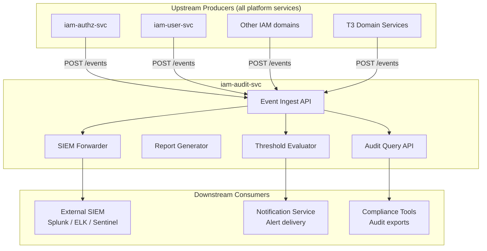
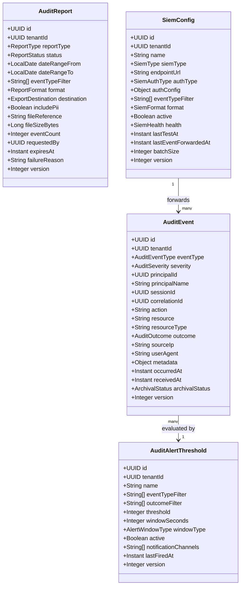
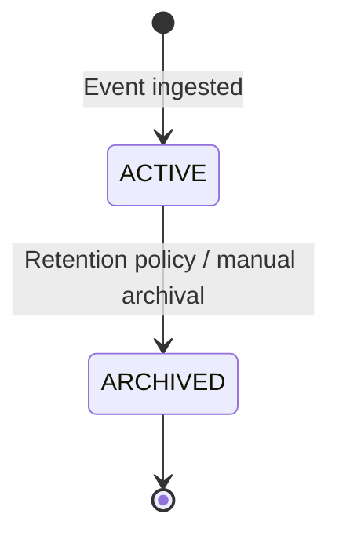
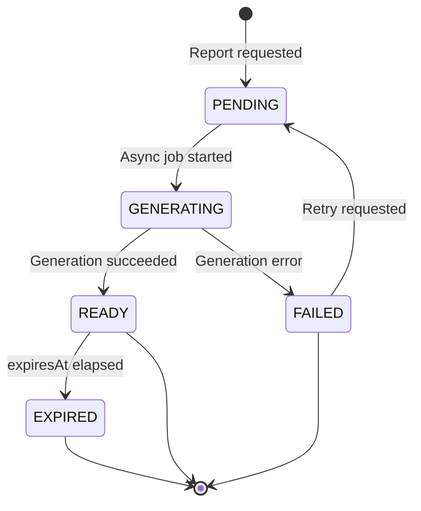
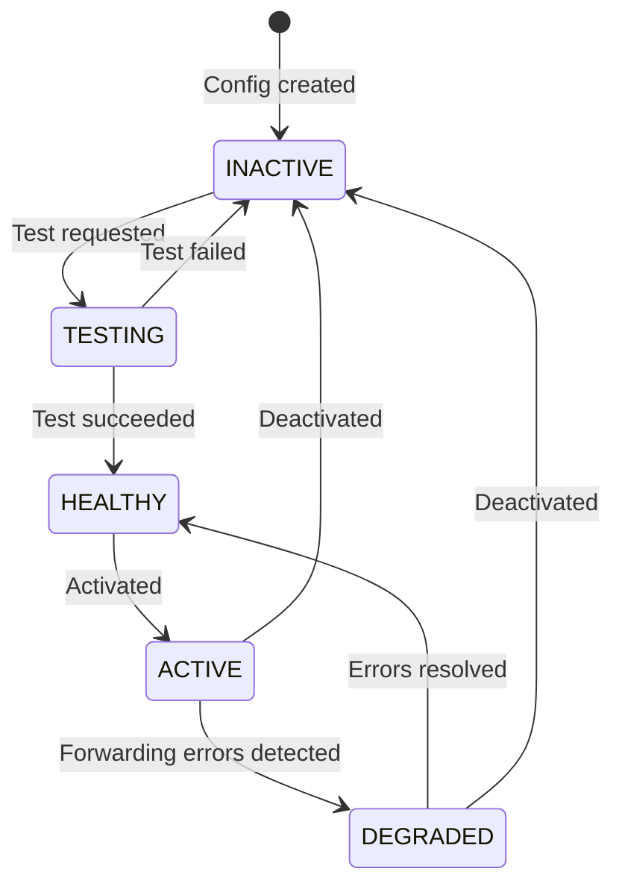
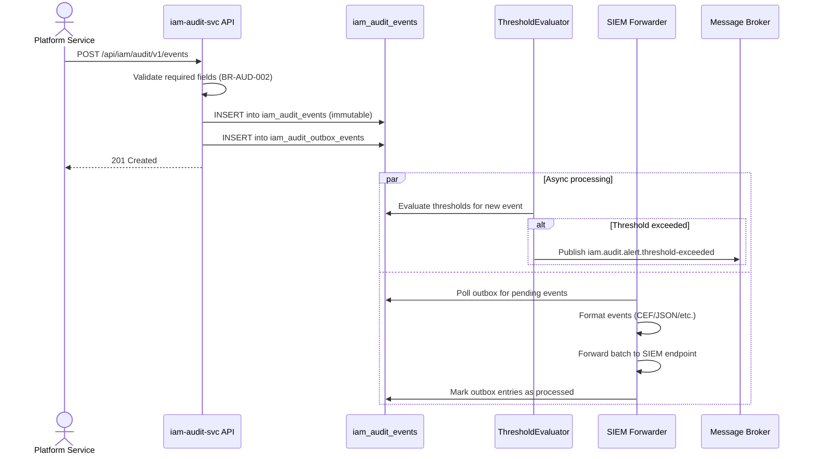
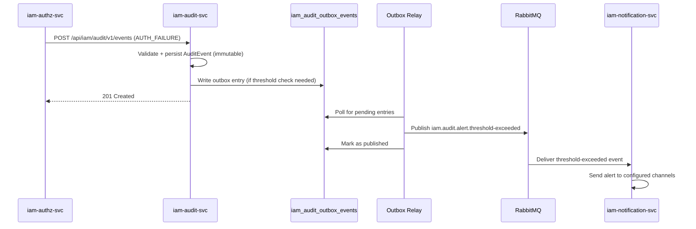
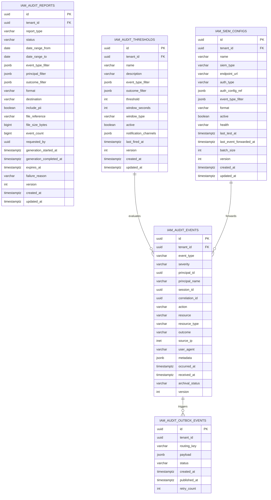

<!-- TEMPLATE COMPLIANCE: ~95%
Template: domain-service-spec.md v1.0.0
Present sections: §0-§15
-->

# iam.audit — Security Audit Service Domain Specification

> **Conceptual Stack Layer:** Domain / Service
> **Space:** Platform
> **Owner:** Domain Engineering Team
> **Schema alignment:** `service-layer.schema.json`
> **Companion files:** `contracts/http/iam/audit/openapi.yaml`, `contracts/events/iam/audit/`
> **Referenced by:** Platform-Feature Spec SS5 (F-IAM-004-01 through F-IAM-004-04), BFF Contract
> **Belongs to:** IAM Suite Spec

> **Meta Information**
> - **Version:** 2026-04-03
> - **Template:** `domain-service-spec.md` v1.0.0
> - **Template Compliance:** ~95% — fully compliant
> - **Author(s):** OpenLeap Architecture Team
> - **Status:** DRAFT
> - **Suite:** `iam` (Identity & Access Management)
> - **Domain:** `audit` (Security Audit)
> - **Bounded Context Ref:** `bc:security-audit`
> - **Service ID:** `iam-audit-svc`
> - **basePackage:** `io.openleap.iam.audit`
> - **API Base Path:** `/api/iam/audit/v1`
> - **Port:** `8084`
> - **Repository:** `https://github.com/openleap-io/io.openleap.iam.audit`
> - **Tags:** `iam`, `audit`, `compliance`, `security`
> - **Team:** `team-iam` / `iam-team@openleap.io` / `#iam-team`

---

## Specification Guidelines Compliance

> ### Non-Negotiables
> - Never invent facts. If required info is missing, add an **OPEN QUESTION** entry.
> - Preserve intent and decisions. Only change meaning when explicitly requested.
> - Do not remove normative constraints unless they are explicitly replaced.
> - Keep the spec **self-contained**: no "see chat", no implicit context.
>
> ### Source of Truth Priority
> When sources conflict:
> 1. Spec (explicit) wins
> 2. Starter specs (implementation constraints) next
> 3. Guidelines (best practices) last
>
> Record conflicts in the **Decisions & Conflicts** section (see Section 14).
>
> ### Style Guide
> - Prefer short sentences and lists.
> - Use MUST/SHOULD/MAY for normative statements.
> - Keep terminology consistent (Aggregate, Domain Service, Application Service, Command, Event).
> - Avoid ambiguous words ("often", "maybe") unless explicitly noting uncertainty.
> - Keep examples minimal and clearly marked as examples.
> - Do not add implementation code unless the chapter explicitly requires it.

---

## 0. Document Purpose & Scope

### 0.1 Purpose

This specification defines the `iam-audit-svc` domain service within the Identity & Access Management suite. The service captures, stores, and provides access to all security-relevant events across the OpenLeap platform for compliance, forensic analysis, and real-time threat detection. It serves as the authoritative audit trail for regulatory compliance (GDPR, SOX, ISO 27001) and integrates with external SIEM systems.

### 0.2 Target Audience

- Security Officers & Compliance Managers
- IAM System Administrators
- System Architects & Technical Leads
- Integration Engineers (SIEM integrations)
- Internal auditors and external auditors (read-only access)

### 0.3 Scope

**In Scope:**
- Ingest and immutable storage of security-relevant platform events
- Audit event querying, filtering, and reporting
- Audit data export for compliance and archival
- SIEM integration configuration and event forwarding
- Alert threshold configuration and threshold-breach notification
- Multi-tenant audit isolation via RLS

**Out of Scope:**
- Business domain audit logging (HR, FI, etc.) — handled by respective domain services
- Authentication credential validation — handled by Keycloak
- Infrastructure security and network-level logging
- Application performance monitoring (see platform observability stack)
- Real-time intrusion detection beyond threshold alerting

### 0.4 Related Documents

- `spec/T1_Platform/iam/_iam_suite.md` — IAM Suite Architecture
- `spec/T1_Platform/iam/domain-specs/iam_authz-spec.md` — Authorization domain (upstream producer)
- `spec/T1_Platform/iam/domain-specs/iam_user-spec.md` — User domain (upstream producer)
- `spec/T1_Platform/iam/features/compositions/F-IAM-004.md` — Security Audit feature composition
- `concepts/governance/bff-guideline.md` (GOV-BFF-001) — BFF pattern governance

---

## 1. Business Context

### 1.1 Domain Purpose

The Security Audit domain solves the problem of fragmented, inconsistent security logging across a multi-tenant ERP platform. Without a centralised audit service, each domain would implement its own logging — with inconsistent formats, retention policies, and access controls — making compliance reporting impossible at scale.

The service captures all security-relevant events (authentication, authorization, configuration changes, data access) into an immutable, tenant-isolated audit log. It provides structured query capabilities for incident investigation and generates compliance reports for regulatory requirements.

### 1.2 Business Value

- **Regulatory compliance:** Provides the audit trail required by GDPR, SOX, ISO 27001, and customer-specific regulatory frameworks.
- **Incident investigation:** Enables security teams to trace the full timeline of a breach or suspicious activity within minutes.
- **Threat detection:** Real-time threshold alerting surfaces brute-force attacks, permission escalation attempts, and anomalous data access patterns.
- **Audit assurance:** Immutable, tamper-evident event storage ensures audit evidence is legally defensible.
- **Operational transparency:** Gives administrators visibility into who did what, when, and from where across all platform services.

### 1.3 Key Stakeholders

| Role | Responsibility | Primary Use Cases |
|------|----------------|-------------------|
| Security Officer | Defines audit policies and reviews breach investigations | Query events, generate forensic reports |
| Compliance Manager | Ensures regulatory requirements are met | Generate compliance reports, export for auditors |
| IAM System Administrator | Manages SIEM integration and alert thresholds | Configure SIEM, set alert thresholds |
| IAM Audit Viewer | Day-to-day security monitoring | Query events, view reports |
| External Auditor | Periodic compliance reviews | Read exported reports (limited access) |
| Platform Services (System) | Emit security-relevant events | Ingest events via internal API |

### 1.4 Strategic Positioning

The Security Audit domain is a **foundational cross-cutting service** within the IAM suite. Every other domain service in the platform is an upstream producer of audit events — making `iam-audit-svc` a dependency of the entire platform in terms of compliance posture, while itself having no runtime dependency on business domain services.

In the OpenLeap platform tier model (ADR-001), this service sits in **T1 Platform** alongside IAM, and MUST NOT depend on T2/T3 domain services. All event ingest flows inward (from other services into this service), never outward into business domains.

Strategically, this service corresponds to SAP's **SM20 Security Audit Log** and **SM21 System Log**, providing equivalent functionality in an API-first, event-driven, multi-tenant architecture.

### 1.5 Service Context

| Property | Value |
|----------|-------|
| **Suite** | `iam` |
| **Domain** | `audit` |
| **Bounded Context** | `bc:security-audit` |
| **Service ID** | `iam-audit-svc` |
| **Base Package** | `io.openleap.iam.audit` |

**Responsibilities:**
- Accept and immutably persist security-relevant events from all platform services
- Provide tenant-isolated event querying with rich filtering and pagination
- Generate compliance and forensic reports over stored audit data
- Export audit data in industry-standard formats (CSV, JSON, PARQUET, PDF)
- Configure and operate SIEM integrations for real-time event forwarding
- Evaluate and fire threshold alerts for anomalous event patterns

**Authoritative Sources:**
| Source Type | Description | Access Pattern |
|-------------|-------------|----------------|
| REST API | Audit event query, report management, SIEM config, threshold config | Synchronous |
| Database | Owns all audit event, report, SIEM config, and threshold data | Direct (owner) |
| Events | Publishes threshold-exceeded alerts; consumes no events (REST ingest only) | Asynchronous (outbound) |



---

## 2. Service Identity

| Property | Value | Schema Field |
|----------|-------|-------------|
| **Service ID** | `iam-audit-svc` | `metadata.id` |
| **Display Name** | `IAM Security Audit Service` | `metadata.name` |
| **Suite** | `iam` | `metadata.suite` |
| **Domain** | `audit` | `metadata.domain` |
| **Bounded Context** | `bc:security-audit` | `metadata.bounded_context_ref` |
| **Version** | `1.0.0` | `metadata.version` |
| **Status** | DRAFT | `metadata.status` |
| **API Base Path** | `/api/iam/audit/v1` | `metadata.api_base_path` |
| **Repository** | `https://github.com/openleap-io/io.openleap.iam.audit` | `metadata.repository` |
| **Tags** | `iam`, `audit`, `compliance`, `security` | `metadata.tags` |

**Team:**
| Property | Value |
|----------|-------|
| **Name** | `team-iam` |
| **Email** | `iam-team@openleap.io` |
| **Slack Channel** | `#iam-team` |

---

## 3. Domain Model

### 3.1 Conceptual Overview

The Security Audit domain models three primary concerns:

1. **Event capture** — The `AuditEvent` aggregate is the immutable, append-only record of a security-relevant fact. It is the heart of the domain: once written, it cannot be modified or deleted.
2. **Report generation** — The `AuditReport` aggregate represents a compliance or forensic report generated from audit events. Reports have a lifecycle (PENDING → READY) and expire after a configurable period.
3. **SIEM integration** — The `SiemConfig` aggregate represents a configured connection to an external SIEM system. It manages the forwarding of real-time audit events to tools like Splunk, Elastic SIEM, or Azure Sentinel.
4. **Threshold alerting** — The `AuditAlertThreshold` aggregate defines conditions under which the service emits a `threshold-exceeded` alert event.

### 3.2 Core Concepts



### 3.3 Aggregate Definitions

#### 3.3.1 AuditEvent

| Property | Value |
|----------|-------|
| **Aggregate ID** | `agg:audit-event` |
| **Name** | `AuditEvent` |

**Business Purpose:**
An immutable record of a security-relevant action within the OpenLeap platform. Equivalent to an entry in SAP SM20 (Security Audit Log). Once created, an `AuditEvent` MUST NOT be modified or deleted — it is the authoritative, legally defensible record of what happened.

##### Aggregate Root

**Key Attributes:**
| Attribute | Type | Format | Description | Constraints | Required | Read-Only |
|-----------|------|--------|-------------|-------------|----------|-----------|
| id | string | uuid | Unique event identifier (OlUuid.create()) | Immutable | Yes | Yes |
| tenantId | string | uuid | Owning tenant (RLS key) | Immutable | Yes | Yes |
| eventType | string | — | Security event classification | enum_ref: `AuditEventType` | Yes | Yes |
| severity | string | — | Risk severity level | enum_ref: `AuditSeverity` | Yes | Yes |
| principalId | string | uuid | ID of the acting principal (user/service) | — | Yes | Yes |
| principalName | string | — | Human-readable name of actor at event time (snapshot) | max_length: 255 | Yes | Yes |
| sessionId | string | uuid | Session reference (if applicable) | — | No | Yes |
| correlationId | string | uuid | Distributed trace/correlation ID | — | No | Yes |
| action | string | — | Specific action performed (e.g., `iam.authz.permission.check`) | max_length: 255, pattern: `^[a-z][a-z0-9.]+$` | Yes | Yes |
| resource | string | — | Target resource identifier or URI | max_length: 1024 | No | Yes |
| resourceType | string | — | Type of the target resource (e.g., `iam.user`, `iam.role`) | max_length: 255, pattern: `^[a-z][a-z0-9.]+$` | No | Yes |
| outcome | string | — | Result of the action | enum_ref: `AuditOutcome` | Yes | Yes |
| sourceIp | string | — | Client IP address (IPv4 or IPv6) | max_length: 45 | No | Yes |
| userAgent | string | — | Browser or client agent string | max_length: 512 | No | Yes |
| metadata | object | — | Service-specific context (JSONB) | — | No | Yes |
| occurredAt | string | date-time | When the event occurred (authoritative timestamp) | — | Yes | Yes |
| receivedAt | string | date-time | When the event was received by this service | — | Yes | Yes |
| archivalStatus | string | — | Whether event is in active or archived storage | enum_ref: `ArchivalStatus`; default: ACTIVE | Yes | No |
| version | integer | int32 | Optimistic locking version | minimum: 1 | Yes | Yes |

**Lifecycle States:**

| Property | Value |
|----------|-------|
| **Initial State** | `ACTIVE` |
| **Terminal States** | `ARCHIVED` |



**State Descriptions:**
| State | Description | Business Meaning |
|-------|-------------|------------------|
| ACTIVE | Event is in primary storage and fully queryable | Available for query, reporting, SIEM forwarding |
| ARCHIVED | Event has been moved to cold/archival storage | Read-only via archive query; not in primary index |

**Allowed Transitions:**
| From State | To State | Trigger | Guard / Business Preconditions |
|------------|----------|---------|-------------------------------|
| ACTIVE | ARCHIVED | Retention policy job or manual archival operation (F-IAM-004-03) | Event age ≥ configured retention period |

**Invariants:**
| Rule ID | Description |
|---------|-------------|
| BR-AUD-001 | AuditEvent is immutable — no modifications after creation |
| BR-AUD-002 | Required fields (tenantId, principalId, eventType, action, outcome, occurredAt) MUST be present |

**Domain Events Emitted:**
- No events published on creation (AuditEvent is consumed, not a producer)
- Threshold evaluation may trigger `iam.audit.alert.threshold-exceeded` (evaluated by AuditAlertThreshold aggregate)

##### Child Entities

###### Entity: AuditEventMetadataField

| Property | Value |
|----------|-------|
| **Entity ID** | `ent:audit-event-metadata-field` |
| **Name** | `AuditEventMetadataField` |
| **Relationship to Root** | Embedded as JSONB (not a separate table row) |

**Business Purpose:**
Service-specific contextual key-value pairs attached to an AuditEvent. For example, an authorization failure may include `{ "requiredPermission": "iam.users:write", "attemptedResource": "/api/iam/users/123" }`. Stored as JSONB on the `metadata` column.

**Attributes:**
| Attribute | Type | Format | Description | Constraints | Required |
|-----------|------|--------|-------------|-------------|----------|
| key | string | — | Context field name | max_length: 100, pattern: `^[a-zA-Z][a-zA-Z0-9_]+$` | Yes |
| value | string | — | Context field value (serialized as string in JSONB) | max_length: 1024 | Yes |

**Collection Constraints:**
- Minimum items: 0
- Maximum items: 50

**Invariants:**
| Rule ID | Description |
|---------|-------------|
| BR-AUD-002 | Metadata keys MUST be unique within an event |

##### Value Objects

###### Value Object: TimeWindow

| Property | Value |
|----------|-------|
| **VO ID** | `vo:time-window` |
| **Name** | `TimeWindow` |

**Description:**
Represents a time range used in report generation and threshold evaluation. Ensures dateRangeFrom is always before dateRangeTo.

**Attributes:**
| Attribute | Type | Format | Description | Constraints |
|-----------|------|--------|-------------|-------------|
| from | string | date | Start of the time window (inclusive) | — |
| to | string | date | End of the time window (inclusive) | minimum: from |

**Validation Rules:**
- `to` MUST be ≥ `from`
- Range MUST NOT exceed 366 days (BR-AUD-007)

---

#### 3.3.2 AuditReport

| Property | Value |
|----------|-------|
| **Aggregate ID** | `agg:audit-report` |
| **Name** | `AuditReport` |

**Business Purpose:**
A compliance or forensic report generated on-demand from the audit event store. Reports are generated asynchronously; callers poll for status or receive notification. Corresponds to the output of SAP SM20 report runs exported via transaction SM20EVAL.

##### Aggregate Root

**Key Attributes:**
| Attribute | Type | Format | Description | Constraints | Required | Read-Only |
|-----------|------|--------|-------------|-------------|----------|-----------|
| id | string | uuid | Unique report identifier (OlUuid.create()) | Immutable | Yes | Yes |
| tenantId | string | uuid | Owning tenant | Immutable | Yes | Yes |
| reportType | string | — | Business classification of the report | enum_ref: `ReportType` | Yes | No |
| status | string | — | Current lifecycle state | enum_ref: `ReportStatus` | Yes | No |
| dateRangeFrom | string | date | Start date for event query (inclusive) | — | Yes | No |
| dateRangeTo | string | date | End date for event query (inclusive) | minimum: dateRangeFrom; maximum: dateRangeFrom + 366 days | Yes | No |
| eventTypeFilter | array | — | Event types to include (empty = all) | items: AuditEventType values; max_items: 20 | No | No |
| principalFilter | array | uuid | Principal IDs to filter (empty = all) | max_items: 50 | No | No |
| outcomeFilter | array | — | Outcomes to include (empty = all) | items: AuditOutcome values | No | No |
| format | string | — | Output format | enum_ref: `ReportFormat` | Yes | No |
| destination | string | — | Delivery destination | enum_ref: `ExportDestination` | Yes | No |
| includePii | boolean | — | Whether PII fields are included in export | default: false | Yes | No |
| fileReference | string | — | S3/blob URI or download token (populated on READY) | max_length: 2048 | No | Yes |
| fileSizeBytes | integer | int64 | File size in bytes (populated on READY) | minimum: 0 | No | Yes |
| eventCount | integer | int64 | Number of events included in report | minimum: 0 | No | Yes |
| requestedBy | string | uuid | Principal ID of the requestor | Immutable | Yes | Yes |
| generationStartedAt | string | date-time | When generation began | — | No | Yes |
| generationCompletedAt | string | date-time | When generation completed | — | No | Yes |
| expiresAt | string | date-time | When download link/report expires (24h after READY) | — | No | Yes |
| failureReason | string | — | Error description if status = FAILED | max_length: 1024 | No | Yes |
| version | integer | int32 | Optimistic locking version | minimum: 1 | Yes | Yes |
| createdAt | string | date-time | Creation timestamp | — | Yes | Yes |
| updatedAt | string | date-time | Last modification timestamp | — | Yes | Yes |

**Lifecycle States:**

| Property | Value |
|----------|-------|
| **Initial State** | `PENDING` |
| **Terminal States** | `READY`, `FAILED`, `EXPIRED` |



**State Descriptions:**
| State | Description | Business Meaning |
|-------|-------------|------------------|
| PENDING | Report queued for generation | Request accepted, awaiting processing slot |
| GENERATING | Report is being generated | Long-running query and file generation in progress |
| READY | Report file is available | Caller can download or retrieve from destination |
| FAILED | Generation failed | Error details in `failureReason`; may be retried |
| EXPIRED | Download link has expired | Must generate a new report |

**Allowed Transitions:**
| From State | To State | Trigger | Guard / Business Preconditions |
|------------|----------|---------|-------------------------------|
| PENDING | GENERATING | Async job scheduler picks up task | — |
| GENERATING | READY | Report file successfully written to destination | fileReference is set |
| GENERATING | FAILED | Unrecoverable error during generation | failureReason is set |
| READY | EXPIRED | System job: current time > expiresAt | — |
| FAILED | PENDING | Retry requested by IAM_AUDIT_ADMIN | — |

**Invariants:**
| Rule ID | Description |
|---------|-------------|
| BR-AUD-007 | dateRangeTo - dateRangeFrom MUST NOT exceed 366 days |
| BR-AUD-004 | includePii = true requires IAM_AUDIT_ADMIN role |
| BR-AUD-008 | Download links MUST expire 24 hours after report reaches READY state |

**Domain Events Emitted:**
- `iam.audit.report.generated` — when status transitions to READY

---

#### 3.3.3 SiemConfig

| Property | Value |
|----------|-------|
| **Aggregate ID** | `agg:siem-config` |
| **Name** | `SiemConfig` |

**Business Purpose:**
Configuration for forwarding audit events to an external Security Information and Event Management (SIEM) system in real-time. Supports industry-standard formats (CEF, LEEF, JSON, RFC5424) and major SIEM products. Corresponds to SAP Solution Manager's Alert Management integration with external SIEM.

##### Aggregate Root

**Key Attributes:**
| Attribute | Type | Format | Description | Constraints | Required | Read-Only |
|-----------|------|--------|-------------|-------------|----------|-----------|
| id | string | uuid | Unique config identifier (OlUuid.create()) | Immutable | Yes | Yes |
| tenantId | string | uuid | Owning tenant | Immutable | Yes | Yes |
| name | string | — | Human-readable display name | min_length: 1; max_length: 100 | Yes | No |
| siemType | string | — | SIEM product type | enum_ref: `SiemType` | Yes | No |
| endpointUrl | string | uri | HTTPS ingestion endpoint of the SIEM system | max_length: 2048; pattern: `^https://` | Yes | No |
| authType | string | — | Authentication method | enum_ref: `SiemAuthType` | Yes | No |
| authConfig | object | — | Encrypted authentication credentials (stored as reference to secrets manager, not plaintext) | — | Yes | No |
| eventTypeFilter | array | — | Event types to forward (empty = all) | items: AuditEventType values; max_items: 20 | No | No |
| format | string | — | Wire format for forwarded events | enum_ref: `SiemFormat` | Yes | No |
| active | boolean | — | Whether this config is actively forwarding events | default: false | Yes | No |
| health | string | — | Last known health status | enum_ref: `SiemHealth`; default: UNTESTED | Yes | No |
| lastTestAt | string | date-time | Timestamp of last successful connection test | — | No | Yes |
| lastEventForwardedAt | string | date-time | Timestamp of last successfully forwarded event | — | No | Yes |
| batchSize | integer | int32 | Number of events per forwarding batch | minimum: 1; maximum: 1000; default: 100 | Yes | No |
| version | integer | int32 | Optimistic locking version | minimum: 1 | Yes | Yes |
| createdAt | string | date-time | Creation timestamp | — | Yes | Yes |
| updatedAt | string | date-time | Last modification timestamp | — | Yes | Yes |

**Lifecycle States:**

| Property | Value |
|----------|-------|
| **Initial State** | `INACTIVE` |
| **Terminal States** | none (can be deleted when INACTIVE) |



**State Descriptions** (reflected in `health` field; `active` flag controls forwarding):
| State | Description | Business Meaning |
|-------|-------------|------------------|
| UNTESTED | No connection test has been performed | Cannot be activated (BR-AUD-005) |
| HEALTHY | Last test or forwarding succeeded | Ready for activation or actively forwarding |
| DEGRADED | Forwarding succeeding partially or with retries | Operator attention required |
| UNREACHABLE | Endpoint cannot be reached | Forwarding suspended; alert raised |

**Allowed Transitions** (`active` flag):
| From State | To State | Trigger | Guard / Business Preconditions |
|------------|----------|---------|-------------------------------|
| INACTIVE | ACTIVE | IAM_SYSTEM_ADMIN activates | health MUST be HEALTHY (BR-AUD-005) |
| ACTIVE | INACTIVE | IAM_SYSTEM_ADMIN deactivates | — |

**Invariants:**
| Rule ID | Description |
|---------|-------------|
| BR-AUD-005 | SiemConfig MUST be tested before activation; health MUST NOT be UNTESTED or UNREACHABLE when activating |

**Domain Events Emitted:**
- `iam.audit.siem.config.activated` — when `active` transitions to true

---

#### 3.3.4 AuditAlertThreshold

| Property | Value |
|----------|-------|
| **Aggregate ID** | `agg:audit-alert-threshold` |
| **Name** | `AuditAlertThreshold` |

**Business Purpose:**
Defines a monitoring rule that fires a `threshold-exceeded` alert event when the count of matching audit events exceeds a configurable number within a sliding or tumbling time window. Used to detect brute-force attacks, permission escalation attempts, and mass data exports.

##### Aggregate Root

**Key Attributes:**
| Attribute | Type | Format | Description | Constraints | Required | Read-Only |
|-----------|------|--------|-------------|-------------|----------|-----------|
| id | string | uuid | Unique threshold identifier (OlUuid.create()) | Immutable | Yes | Yes |
| tenantId | string | uuid | Owning tenant | Immutable | Yes | Yes |
| name | string | — | Human-readable rule name | min_length: 1; max_length: 100 | Yes | No |
| description | string | — | Purpose of this threshold rule | max_length: 500 | No | No |
| eventTypeFilter | array | — | Event types to count (empty = all) | items: AuditEventType values; max_items: 10 | No | No |
| outcomeFilter | array | — | Outcomes to count (empty = all) | items: AuditOutcome values; default: [FAILURE, DENIED] | No | No |
| threshold | integer | int32 | Count that triggers the alert | minimum: 1; maximum: 100000 | Yes | No |
| windowSeconds | integer | int32 | Time window duration in seconds | minimum: 60; maximum: 86400 | Yes | No |
| windowType | string | — | Sliding or tumbling window | enum_ref: `AlertWindowType` | Yes | No |
| active | boolean | — | Whether this threshold is being evaluated | default: true | Yes | No |
| notificationChannels | array | — | Delivery channels for alerts (email, slack endpoint, webhook URL) | max_items: 5 | No | No |
| lastFiredAt | string | date-time | Timestamp when threshold was last exceeded | — | No | Yes |
| version | integer | int32 | Optimistic locking version | minimum: 1 | Yes | Yes |
| createdAt | string | date-time | Creation timestamp | — | Yes | Yes |
| updatedAt | string | date-time | Last modification timestamp | — | Yes | Yes |

**Invariants:**
| Rule ID | Description |
|---------|-------------|
| BR-AUD-006 | Alert re-fires only after event count resets below threshold (debounce); duplicate alerts within one window are suppressed |

**Domain Events Emitted:**
- `iam.audit.alert.threshold-exceeded` — when event count within window exceeds threshold

---

### 3.4 Enumerations

#### AuditEventType

**Description:** Classification of the security-relevant action captured in an AuditEvent.

| Value | Description | Deprecated |
|-------|-------------|------------|
| `AUTH_SUCCESS` | Successful authentication (login, token refresh, SSO) | No |
| `AUTH_FAILURE` | Failed authentication attempt (bad credentials, expired token) | No |
| `AUTHZ_GRANTED` | Authorization check passed; access granted | No |
| `AUTHZ_DENIED` | Authorization check failed; access denied | No |
| `PERMISSION_CHANGED` | A permission was granted or revoked on a principal | No |
| `ROLE_ASSIGNED` | A role was assigned to a user or group | No |
| `ROLE_REVOKED` | A role was removed from a user or group | No |
| `USER_CREATED` | A new user principal was created | No |
| `USER_MODIFIED` | User principal attributes were modified | No |
| `USER_DEACTIVATED` | A user account was deactivated or locked | No |
| `GROUP_CHANGED` | A group membership was modified | No |
| `CONFIG_CHANGED` | A security configuration was modified (SIEM config, threshold, etc.) | No |
| `DATA_ACCESSED` | Sensitive data was accessed (PII, credentials, audit log itself) | No |
| `DATA_EXPORTED` | Data was exported from the system | No |
| `SESSION_STARTED` | A user session was established | No |
| `SESSION_ENDED` | A user session was terminated (logout, timeout, revocation) | No |
| `THRESHOLD_EXCEEDED` | An alert threshold was triggered | No |
| `POLICY_EVALUATED` | An access policy was evaluated (ABAC rule evaluation) | No |

#### AuditOutcome

**Description:** Result of the audited action.

| Value | Description | Deprecated |
|-------|-------------|------------|
| `SUCCESS` | Action completed successfully | No |
| `FAILURE` | Action failed due to a system or business error | No |
| `DENIED` | Action was explicitly denied by an authorization policy | No |
| `PARTIAL` | Action partially succeeded (e.g., bulk operation with some failures) | No |

#### AuditSeverity

**Description:** Risk severity level of the event.

| Value | Description | Deprecated |
|-------|-------------|------------|
| `INFO` | Routine informational event (normal auth success, config reads) | No |
| `LOW` | Minor anomaly; no immediate action required | No |
| `MEDIUM` | Noteworthy event requiring monitoring (e.g., repeated failed logins) | No |
| `HIGH` | Significant security event requiring prompt attention | No |
| `CRITICAL` | Potential breach or severe policy violation requiring immediate action | No |

#### ArchivalStatus

**Description:** Storage tier of an AuditEvent.

| Value | Description | Deprecated |
|-------|-------------|------------|
| `ACTIVE` | Event is in primary storage and fully queryable | No |
| `ARCHIVED` | Event has been moved to cold/archival storage | No |

#### ReportType

**Description:** Business classification of a generated AuditReport.

| Value | Description | Deprecated |
|-------|-------------|------------|
| `COMPLIANCE` | Periodic compliance report (SOX, GDPR, ISO 27001) | No |
| `FORENSIC` | Incident investigation report focused on a specific time window and actor | No |
| `EXECUTIVE_SUMMARY` | High-level summary of security posture for management | No |
| `BREACH_INVESTIGATION` | Detailed report supporting a breach investigation or legal hold | No |

#### ReportStatus

**Description:** Lifecycle state of an AuditReport.

| Value | Description | Deprecated |
|-------|-------------|------------|
| `PENDING` | Report queued; awaiting processing | No |
| `GENERATING` | Report is actively being generated | No |
| `READY` | Report file is available for download or retrieval | No |
| `FAILED` | Report generation failed; see failureReason | No |
| `EXPIRED` | Report download link has expired | No |

#### ReportFormat

**Description:** Output file format for AuditReport.

| Value | Description | Deprecated |
|-------|-------------|------------|
| `CSV` | Comma-separated values; compatible with Excel and audit tools | No |
| `JSON` | Structured JSON; for programmatic consumption | No |
| `PARQUET` | Apache Parquet columnar format; for big data / analytics pipelines | No |
| `PDF` | PDF document; for human-readable formal audit submissions | No |

#### ExportDestination

**Description:** Delivery target for AuditReport output.

| Value | Description | Deprecated |
|-------|-------------|------------|
| `DOWNLOAD` | Temporary signed download URL (expires after 24h) | No |
| `S3` | Direct upload to customer-configured S3 bucket | No |
| `AZURE_BLOB` | Direct upload to customer-configured Azure Blob Storage | No |

#### SiemType

**Description:** SIEM product type.

| Value | Description | Deprecated |
|-------|-------------|------------|
| `SPLUNK` | Splunk Enterprise or Splunk Cloud (HEC endpoint) | No |
| `ELASTIC_SIEM` | Elastic Security (Elasticsearch ingest endpoint) | No |
| `AZURE_SENTINEL` | Microsoft Sentinel (Log Analytics workspace) | No |
| `IBM_QRADAR` | IBM QRadar SIEM | No |
| `GENERIC_SYSLOG` | Any syslog-compatible receiver (RFC5424) | No |

#### SiemAuthType

**Description:** Authentication method for SIEM endpoint.

| Value | Description | Deprecated |
|-------|-------------|------------|
| `API_KEY` | Static API key in Authorization header | No |
| `BASIC` | HTTP Basic authentication (username + password) | No |
| `OAUTH2` | OAuth 2.0 client credentials flow | No |
| `MTLS` | Mutual TLS (client certificate authentication) | No |

#### SiemFormat

**Description:** Wire format for events forwarded to SIEM.

| Value | Description | Deprecated |
|-------|-------------|------------|
| `CEF` | ArcSight Common Event Format (CEF:0) | No |
| `LEEF` | IBM Log Event Extended Format (LEEF:2.0) | No |
| `JSON` | Structured JSON matching OpenLeap event envelope schema | No |
| `RFC5424` | Syslog protocol format per RFC 5424 | No |

#### SiemHealth

**Description:** Connection health status of a SiemConfig.

| Value | Description | Deprecated |
|-------|-------------|------------|
| `UNTESTED` | No connection test has been performed | No |
| `HEALTHY` | Last test or forwarding operation succeeded | No |
| `DEGRADED` | Forwarding succeeding but with retries or partial failures | No |
| `UNREACHABLE` | Endpoint cannot be reached; forwarding suspended | No |

#### AlertWindowType

**Description:** Time window evaluation strategy for AuditAlertThreshold.

| Value | Description | Deprecated |
|-------|-------------|------------|
| `TUMBLING` | Non-overlapping fixed windows; counter resets at window boundary | No |
| `SLIDING` | Continuously advancing window; more sensitive to burst patterns | No |

---

### 3.5 Shared Types

#### IpAddress

| Property | Value |
|----------|-------|
| **Type ID** | `type:ip-address` |
| **Name** | `IpAddress` |

**Description:** Represents an IPv4 or IPv6 client address. Validated at ingest; stored as string.

**Attributes:**
| Attribute | Type | Format | Description | Constraints |
|-----------|------|--------|-------------|-------------|
| value | string | — | IP address string (IPv4 dotted-decimal or IPv6 colon-hex) | pattern: IPv4 or IPv6 regex; max_length: 45 |

**Validation Rules:**
- MUST match IPv4 (`^(\d{1,3}\.){3}\d{1,3}$`) or IPv6 format
- Private/loopback addresses are valid (internal service calls)

**Used By:**
- `agg:audit-event` (sourceIp)
- `agg:siem-config` (endpointUrl resolution)

---

## 4. Business Rules & Constraints

### 4.1 Business Rules Catalog

| ID | Rule Name | Description | Scope | Enforcement | Error Code |
|----|-----------|-------------|-------|-------------|------------|
| BR-AUD-001 | Audit Event Immutability | AuditEvent records MUST NOT be modified or deleted after creation | AuditEvent | Create only; no Update/Delete endpoints | `AUD_IMMUTABLE` |
| BR-AUD-002 | Required Event Fields | Mandatory fields (tenantId, principalId, eventType, action, outcome, occurredAt) MUST be present | AuditEvent.Create | Domain object validation | `AUD_REQUIRED_FIELD` |
| BR-AUD-003 | Retention Compliance | AuditEvents MUST be retained for ≥ 7 years (SOX) or ≥ 3 years (GDPR access logs); deletion is prohibited within retention period | AuditEvent.Archive | System retention job | `AUD_RETENTION_VIOLATION` |
| BR-AUD-004 | PII Export Authorization | Exporting reports with `includePii = true` MUST require IAM_AUDIT_ADMIN role; the export action MUST itself be logged as a DATA_EXPORTED event | AuditReport.Create | Application service + RBAC check | `AUD_PII_UNAUTHORIZED` |
| BR-AUD-005 | SIEM Activation Gate | A SiemConfig MUST NOT be set `active = true` if `health` is UNTESTED or UNREACHABLE | SiemConfig.Activate | Domain object invariant | `AUD_SIEM_UNTESTED` |
| BR-AUD-006 | Alert Debounce | A threshold alert MUST NOT re-fire until the event count resets below the threshold value; duplicate alerts within one window are suppressed | AuditAlertThreshold.Evaluate | Domain service | `AUD_ALERT_SUPPRESSED` |
| BR-AUD-007 | Report Date Range Limit | AuditReport dateRangeTo - dateRangeFrom MUST NOT exceed 366 days | AuditReport.Create | Domain object validation | `AUD_DATE_RANGE_TOO_LARGE` |
| BR-AUD-008 | Report Link Expiry | AuditReport download links MUST expire 24 hours after the report reaches READY status | AuditReport | System expiry job | `AUD_REPORT_EXPIRED` |

### 4.2 Detailed Rule Definitions

#### BR-AUD-001: Audit Event Immutability

**Business Context:**
Regulatory frameworks (SOX § 802, GDPR Article 5(1)(e)) require that audit records be tamper-evident and non-modifiable. Mutability would undermine legal defensibility.

**Rule Statement:**
After an `AuditEvent` is successfully persisted, no field may be changed and the record may not be deleted within its retention period.

**Applies To:**
- Aggregate: `AuditEvent`
- Operations: Create only

**Enforcement:**
No `PUT`, `PATCH`, or `DELETE` endpoints are exposed for `AuditEvent`. Database-level: the `iam_audit_events` table has no UPDATE or DELETE grants on the service account. Archival moves data to a separate partition but does not modify field values.

**Validation Logic:**
At the application layer: no update/delete command handlers exist. At the database layer: RLS policy denies mutations from the service role after INSERT.

**Error Handling:**
- **Error Code:** `AUD_IMMUTABLE`
- **Error Message:** "Audit events cannot be modified after creation."
- **User action:** No action available; audit events are permanent records.

**Examples:**
- **Valid:** POST /events creates a new event record.
- **Invalid:** Attempting PATCH /events/{id} — returns 405 Method Not Allowed.

---

#### BR-AUD-002: Required Event Fields

**Business Context:**
An audit event without a principal, action, or outcome provides no forensic value and cannot satisfy compliance reporting.

**Rule Statement:**
Every `AuditEvent` MUST include: `tenantId`, `principalId`, `eventType`, `action`, `outcome`, and `occurredAt`.

**Applies To:**
- Aggregate: `AuditEvent`
- Operations: Create

**Enforcement:**
Domain object validation at ingest; HTTP 422 returned for missing required fields.

**Validation Logic:**
Check that none of the six required fields are null or blank before persisting.

**Error Handling:**
- **Error Code:** `AUD_REQUIRED_FIELD`
- **Error Message:** "Required field '{fieldName}' is missing from audit event payload."
- **User action:** Include the missing field in the ingest request body.

**Examples:**
- **Valid:** Payload includes all six required fields.
- **Invalid:** Payload omits `principalId` — returns 422.

---

#### BR-AUD-003: Retention Compliance

**Business Context:**
SOX requires audit logs to be retained for 7 years. GDPR Article 5(1)(e) requires data not be kept longer than necessary, but security logs are typically justified for 3–7 years under Article 6(1)(c) (legal obligation).

**Rule Statement:**
AuditEvents MUST NOT be archived or deleted before their retention period has elapsed. Default retention: 7 years for financial-action events (PERMISSION_CHANGED, ROLE_ASSIGNED, ROLE_REVOKED, CONFIG_CHANGED), 3 years for all others.

**Applies To:**
- Aggregate: `AuditEvent`
- Operations: Archive (transition to ARCHIVED state)

**Enforcement:**
System retention job evaluates `occurredAt + retentionPeriod > now()` before archiving. Manual archival requests are validated by the application service.

**Error Handling:**
- **Error Code:** `AUD_RETENTION_VIOLATION`
- **Error Message:** "Event cannot be archived before retention period expires on {date}."
- **User action:** Wait until retention period elapses.

> OPEN QUESTION: See Q-AUD-001 in §14.3

---

#### BR-AUD-004: PII Export Authorization

**Business Context:**
Exported audit data may contain personal data (names, IP addresses, resource identifiers). GDPR Article 25 (data minimisation) requires limiting access to PII to authorized personnel.

**Rule Statement:**
When `includePii = true`, the requesting principal MUST hold the `IAM_AUDIT_ADMIN` role. The export action MUST be self-logged as a `DATA_EXPORTED` event with the export parameters in `metadata`.

**Applies To:**
- Aggregate: `AuditReport`
- Operations: Create (when includePii = true)

**Enforcement:**
Application service checks RBAC before invoking report generation. Self-logging is performed within the same transaction.

**Error Handling:**
- **Error Code:** `AUD_PII_UNAUTHORIZED`
- **Error Message:** "PII export requires IAM_AUDIT_ADMIN role."
- **User action:** Request with IAM_AUDIT_ADMIN role or set includePii = false.

---

#### BR-AUD-005: SIEM Activation Gate

**Business Context:**
Activating an untested SIEM config would result in silent event loss — audit events would be dispatched to an unreachable endpoint and potentially dropped.

**Rule Statement:**
`SiemConfig.active` MUST NOT be set to `true` if `health` is `UNTESTED` or `UNREACHABLE`. A test connection MUST have been performed and returned `HEALTHY` within the last 24 hours.

**Applies To:**
- Aggregate: `SiemConfig`
- Operations: Activate (state transition)

**Enforcement:**
Domain object invariant check before state transition.

**Error Handling:**
- **Error Code:** `AUD_SIEM_UNTESTED`
- **Error Message:** "SIEM configuration must be tested and verified healthy before activation."
- **User action:** Run the test connection endpoint first.

---

#### BR-AUD-006: Alert Debounce

**Business Context:**
Without debouncing, a sustained attack could trigger thousands of identical alerts per minute, overwhelming notification channels and masking the root signal.

**Rule Statement:**
After a threshold alert fires (`iam.audit.alert.threshold-exceeded`), the same threshold MUST NOT fire again until the event count within the window drops below the threshold value, then rises above it again.

**Applies To:**
- Aggregate: `AuditAlertThreshold`
- Operations: Threshold evaluation (continuous)

**Enforcement:**
The threshold evaluator maintains per-threshold state: `alertActive` flag that is cleared only when count drops below threshold.

**Error Handling:**
- **Error Code:** `AUD_ALERT_SUPPRESSED` (informational; not returned to caller)

---

#### BR-AUD-007: Report Date Range Limit

**Business Context:**
Unbounded report generation against the audit event table could exhaust database and memory resources in large deployments with millions of events.

**Rule Statement:**
`dateRangeTo` minus `dateRangeFrom` MUST NOT exceed 366 days (one full year inclusive of leap years).

**Applies To:**
- Aggregate: `AuditReport`
- Operations: Create

**Enforcement:**
Domain object validation.

**Error Handling:**
- **Error Code:** `AUD_DATE_RANGE_TOO_LARGE`
- **Error Message:** "Report date range cannot exceed 366 days. Requested range: {days} days."
- **User action:** Split into multiple reports with overlapping or consecutive date ranges.

---

#### BR-AUD-008: Report Link Expiry

**Business Context:**
Signed download URLs for audit exports MUST NOT remain valid indefinitely to prevent unauthorized access if a URL is leaked.

**Rule Statement:**
`expiresAt` MUST be set to `generationCompletedAt + 24 hours`. After expiry, the download returns 410 Gone.

**Applies To:**
- Aggregate: `AuditReport`
- Operations: Status transition GENERATING → READY

**Enforcement:**
System expiry job transitions READY → EXPIRED. Download endpoint checks `expiresAt` before streaming.

**Error Handling:**
- **Error Code:** `AUD_REPORT_EXPIRED`
- **Error Message:** "Report download link has expired. Generate a new report."
- **User action:** Submit a new report generation request.

---

### 4.3 Data Validation Rules

**Field-Level Validations:**
| Field | Validation Rule | Error Message |
|-------|----------------|---------------|
| AuditEvent.tenantId | Required, UUID format | "tenantId is required and must be a valid UUID." |
| AuditEvent.principalId | Required, UUID format | "principalId is required and must be a valid UUID." |
| AuditEvent.eventType | Required, must be a valid AuditEventType value | "eventType must be one of the defined AuditEventType values." |
| AuditEvent.action | Required, max 255 chars, pattern `^[a-z][a-z0-9.]+$` | "action is required, max 255 chars, dot-separated lowercase." |
| AuditEvent.outcome | Required, must be a valid AuditOutcome value | "outcome must be one of: SUCCESS, FAILURE, DENIED, PARTIAL." |
| AuditEvent.occurredAt | Required, ISO-8601 date-time | "occurredAt is required in ISO-8601 format." |
| AuditEvent.sourceIp | If present: valid IPv4 or IPv6 format | "sourceIp must be a valid IPv4 or IPv6 address." |
| AuditReport.dateRangeFrom | Required, date format | "dateRangeFrom is required in YYYY-MM-DD format." |
| AuditReport.dateRangeTo | Required, ≥ dateRangeFrom, ≤ dateRangeFrom + 366 days | "dateRangeTo must be ≥ dateRangeFrom and within 366 days." |
| SiemConfig.name | Required, 1–100 chars | "name is required and must be 1–100 characters." |
| SiemConfig.endpointUrl | Required, HTTPS URI, max 2048 chars | "endpointUrl must be a valid HTTPS URI." |
| SiemConfig.batchSize | 1–1000 | "batchSize must be between 1 and 1000." |
| AuditAlertThreshold.threshold | Required, 1–100000 | "threshold must be between 1 and 100,000." |
| AuditAlertThreshold.windowSeconds | Required, 60–86400 | "windowSeconds must be between 60 and 86400 (1 minute to 24 hours)." |

**Cross-Field Validations:**
- `AuditReport.dateRangeTo` MUST be ≥ `AuditReport.dateRangeFrom`
- `AuditReport.destination = S3` requires S3 bucket configuration in tenant settings
- `SiemConfig.active = true` requires `SiemConfig.health = HEALTHY` (BR-AUD-005)
- `AuditReport.includePii = true` requires requesting principal to hold `IAM_AUDIT_ADMIN` (BR-AUD-004)

### 4.4 Reference Data Dependencies

| Catalog | Source Service | Fields Referencing | Validation |
|---------|----------------|-------------------|------------|
| Tenant registry | `iam-tenant-svc` | `tenantId` on all aggregates | Must exist and be ACTIVE |
| Principal registry | `iam-user-svc` | `principalId` on AuditEvent, AuditReport | Must exist (soft reference; event logged even if principal later deleted) |
| Timezone data | Platform (JVM) | `occurredAt` normalization | Stored as UTC |

---

## 5. Use Cases

### 5.1 Business Logic Placement

| Logic Type | Placement | Examples |
|------------|-----------|----------|
| Aggregate invariants | Domain Object | Immutability enforcement, required field validation, state transition guards |
| Cross-aggregate logic | Domain Service | Threshold evaluation across AuditEvents and AuditAlertThreshold; SIEM forwarding decision |
| Orchestration & transactions | Application Service | Ingest event + evaluate thresholds + enqueue for SIEM forwarding (same transaction); report generation job coordination |

### 5.2 Use Cases (Canonical Format)

#### UC-AUD-001: IngestAuditEvent

| Field | Value |
|-------|-------|
| **id** | `IngestAuditEvent` |
| **type** | WRITE |
| **trigger** | REST (internal) |
| **aggregate** | `AuditEvent` |
| **domainOperation** | `AuditEvent.create` |
| **inputs** | `tenantId: UUID`, `eventType: AuditEventType`, `severity: AuditSeverity`, `principalId: UUID`, `principalName: string`, `action: string`, `resource: string?`, `resourceType: string?`, `outcome: AuditOutcome`, `sourceIp: string?`, `userAgent: string?`, `metadata: object?`, `occurredAt: Instant`, `sessionId: UUID?`, `correlationId: UUID?` |
| **outputs** | `AuditEvent (created)` |
| **events** | — (threshold evaluation may emit `iam.audit.alert.threshold-exceeded`) |
| **rest** | `POST /api/iam/audit/v1/events` |
| **idempotency** | optional (correlationId used for deduplication) |
| **errors** | `AUD_REQUIRED_FIELD`: missing mandatory field; `AUD_INVALID_TENANT`: unknown tenant |

**Actor:** Platform Service (System, automated — internal call from any OpenLeap service)

**Preconditions:**
- Calling service holds `iam.audit:write` scope (service account)
- `tenantId` identifies an active tenant

**Main Flow:**
1. Service calls `POST /api/iam/audit/v1/events` with event payload
2. Application service validates required fields (BR-AUD-002)
3. `AuditEvent` aggregate is created and persisted to `iam_audit_events`
4. Outbox entry written for SIEM forwarding (if active SiemConfig exists)
5. Threshold evaluator is invoked asynchronously; may emit `threshold-exceeded` event

**Postconditions:**
- `AuditEvent` is in `ACTIVE` state and immutably stored

**Business Rules Applied:**
- BR-AUD-001: Immutability enforced from creation
- BR-AUD-002: Required fields validated

**Alternative Flows:**
- **Alt-1:** If `correlationId` matches an already-ingested event, return 200 with existing event (idempotent replay)

**Exception Flows:**
- **Exc-1:** Missing required field → 422 with `AUD_REQUIRED_FIELD`
- **Exc-2:** Unknown tenant → 422 with `AUD_INVALID_TENANT`

---

#### UC-AUD-002: QueryAuditEvents

| Field | Value |
|-------|-------|
| **id** | `QueryAuditEvents` |
| **type** | READ |
| **trigger** | REST |
| **aggregate** | `AuditEvent` |
| **domainOperation** | `auditEventQuery` |
| **inputs** | `dateRangeFrom: date`, `dateRangeTo: date`, `eventType: AuditEventType[]?`, `principalId: UUID?`, `outcome: AuditOutcome[]?`, `resource: string?`, `sourceIp: string?`, `severity: AuditSeverity[]?`, `page: int`, `size: int`, `sort: string` |
| **outputs** | `Page<AuditEventReadModel>` |
| **rest** | `GET /api/iam/audit/v1/events` |
| **idempotency** | none |
| **errors** | `AUD_DATE_RANGE_TOO_LARGE`: query range > 90 days without explicit override |

**Actor:** IAM_AUDIT_VIEWER, IAM_AUDIT_ADMIN, IAM_SYSTEM_ADMIN

**Preconditions:**
- Requesting principal holds `iam.audit:read` scope
- `tenantId` derived from JWT (RLS enforced at database level)

**Main Flow:**
1. Actor submits GET request with filter parameters
2. Application service constructs read-model query with tenant_id = JWT tenantId
3. Query executes against `iam_audit_events` (read replica preferred)
4. Returns paginated `AuditEventReadModel` list

**Postconditions:**
- No state change; read-only operation

**Business Rules Applied:**
- Query range SHOULD NOT exceed 90 days for interactive queries (non-binding performance guideline; report generation used for longer ranges)

**Alternative Flows:**
- **Alt-1:** If no events match filters, return 200 with empty `content` array

---

#### UC-AUD-003: GenerateAuditReport

| Field | Value |
|-------|-------|
| **id** | `GenerateAuditReport` |
| **type** | WRITE |
| **trigger** | REST |
| **aggregate** | `AuditReport` |
| **domainOperation** | `AuditReport.create` |
| **inputs** | `reportType: ReportType`, `dateRangeFrom: date`, `dateRangeTo: date`, `eventTypeFilter: AuditEventType[]?`, `principalFilter: UUID[]?`, `outcomeFilter: AuditOutcome[]?`, `format: ReportFormat`, `destination: ExportDestination`, `includePii: boolean` |
| **outputs** | `AuditReport (status: PENDING)` |
| **events** | `iam.audit.report.generated` (on READY) |
| **rest** | `POST /api/iam/audit/v1/reports` |
| **idempotency** | none |
| **errors** | `AUD_DATE_RANGE_TOO_LARGE`: > 366 days; `AUD_PII_UNAUTHORIZED`: PII requested without ADMIN role |

**Actor:** IAM_AUDIT_VIEWER (no PII), IAM_AUDIT_ADMIN (with or without PII)

**Preconditions:**
- Requesting principal holds `iam.audit:read` scope
- If `includePii = true`: principal holds `IAM_AUDIT_ADMIN` role

**Main Flow:**
1. Actor submits POST with report parameters
2. Application service validates date range (BR-AUD-007) and PII authorization (BR-AUD-004)
3. `AuditReport` aggregate created with status PENDING
4. If `includePii = true`: self-log a `DATA_ACCESSED` AuditEvent for this action
5. Async report generation job started; status transitions to GENERATING
6. On completion: status → READY, `fileReference` and `expiresAt` set

**Postconditions:**
- `AuditReport` is in `PENDING` state (asynchronous generation in progress)

**Business Rules Applied:**
- BR-AUD-007: Date range ≤ 366 days
- BR-AUD-004: PII authorization check
- BR-AUD-008: expiresAt = generationCompletedAt + 24h

**Alternative Flows:**
- **Alt-1:** If `destination = S3`, validate bucket configuration before creating report

**Exception Flows:**
- **Exc-1:** Date range too large → 422 `AUD_DATE_RANGE_TOO_LARGE`
- **Exc-2:** PII unauthorized → 403 `AUD_PII_UNAUTHORIZED`

---

#### UC-AUD-004: ConfigureSiem

| Field | Value |
|-------|-------|
| **id** | `ConfigureSiem` |
| **type** | WRITE |
| **trigger** | REST |
| **aggregate** | `SiemConfig` |
| **domainOperation** | `SiemConfig.create` / `SiemConfig.update` |
| **inputs** | `name: string`, `siemType: SiemType`, `endpointUrl: string`, `authType: SiemAuthType`, `authConfig: object`, `eventTypeFilter: string[]?`, `format: SiemFormat`, `batchSize: int?` |
| **outputs** | `SiemConfig (created or updated)` |
| **events** | — |
| **rest** | `PUT /api/iam/audit/v1/siem/config` |
| **idempotency** | required (PUT is idempotent) |
| **errors** | `AUD_INVALID_ENDPOINT`: endpoint not reachable or not HTTPS |

**Actor:** IAM_SYSTEM_ADMIN

**Preconditions:**
- Requesting principal holds `IAM_SYSTEM_ADMIN` role
- `endpointUrl` MUST use HTTPS protocol

**Main Flow:**
1. Actor submits PUT with SIEM configuration
2. Application service validates URL (HTTPS), authType/authConfig consistency
3. `authConfig` secrets stored as reference to secrets manager (never plaintext in DB)
4. `SiemConfig` created or updated with `health = UNTESTED`, `active = false`

**Postconditions:**
- `SiemConfig` exists with `health = UNTESTED` and `active = false`

**Business Rules Applied:**
- BR-AUD-005: Cannot activate until tested

---

#### UC-AUD-005: TestSiemConnection

| Field | Value |
|-------|-------|
| **id** | `TestSiemConnection` |
| **type** | WRITE |
| **trigger** | REST |
| **aggregate** | `SiemConfig` |
| **domainOperation** | `SiemConfig.testConnection` |
| **inputs** | `siemConfigId: UUID` |
| **outputs** | `SiemConfig (health updated)` |
| **events** | — |
| **rest** | `POST /api/iam/audit/v1/siem/test` |
| **idempotency** | none |
| **errors** | `AUD_SIEM_UNREACHABLE`: endpoint not reachable |

**Actor:** IAM_SYSTEM_ADMIN

**Preconditions:**
- SiemConfig exists and has endpointUrl configured

**Main Flow:**
1. Actor triggers test via POST
2. Service sends a synthetic test event to the SIEM endpoint
3. If acknowledged: `health = HEALTHY`, `lastTestAt` updated
4. If unreachable: `health = UNREACHABLE`

**Postconditions:**
- `SiemConfig.health` and `SiemConfig.lastTestAt` are updated
- If HEALTHY: config may now be activated (BR-AUD-005 satisfied)

---

### 5.3 Process Flow Diagrams



### 5.4 Cross-Domain Workflows

**Does this domain participate in multi-service workflows?** [x] YES

#### Workflow: Platform-Wide Audit Ingest

**Business Purpose:**
Every platform service emits security-relevant events into `iam-audit-svc` as part of normal operation. This is a platform-level obligation, not a business workflow.

**Orchestration Pattern:** [x] Choreography (each service independently calls the audit ingest API)

**Pattern Rationale:**
Each platform service independently decides to emit an audit event immediately after a security-relevant action. No orchestration is needed because there is no compensation logic — audit events are fire-and-observe, not part of distributed transactions.

**Participating Services:**
| Service | Role | Responsibilities |
|---------|------|------------------|
| `iam-authz-svc` | Producer | Emits AUTH_SUCCESS, AUTH_FAILURE, AUTHZ_GRANTED, AUTHZ_DENIED |
| `iam-user-svc` | Producer | Emits USER_CREATED, USER_MODIFIED, USER_DEACTIVATED, ROLE_ASSIGNED, ROLE_REVOKED |
| `iam-audit-svc` | Consumer & Self-Producer | Ingests all events; self-logs DATA_EXPORTED, CONFIG_CHANGED |
| All T3 Domain Services | Producer | Emit DATA_ACCESSED, DATA_EXPORTED for sensitive operations |

**Business Implications:**
- **Success Path:** All services emit events; audit trail is complete.
- **Failure Path:** If `iam-audit-svc` is unavailable, producing services SHOULD buffer and retry. The audit ingest endpoint is non-blocking (does not fail the business operation).

> OPEN QUESTION: See Q-AUD-002 in §14.3

---

## 6. REST API

### 6.1 API Overview

**Base Path:** `/api/iam/audit/v1`

**Authentication:** OAuth2/JWT (Bearer token, issued by Keycloak)

**Authorization:**
- Read operations: Requires scope `iam.audit:read`
- Write operations: Requires scope `iam.audit:write`
- Admin operations: Requires scope `iam.audit:admin` + `IAM_AUDIT_ADMIN` role
- Internal ingest: Requires service account scope `iam.audit:ingest` (not exposed to UI)

### 6.2 Resource Operations

#### 6.2.1 AuditEvent - Ingest (Internal)

```http
POST /api/iam/audit/v1/events
Authorization: Bearer {service-account-token}
Content-Type: application/json
X-Correlation-Id: {uuid}
```

**Request Body:**
```json
{
  "eventType": "AUTH_FAILURE",
  "severity": "MEDIUM",
  "principalId": "3fa85f64-5717-4562-b3fc-2c963f66afa6",
  "principalName": "jane.doe@example.com",
  "sessionId": "7c9e6679-7425-40de-944b-e07fc1f90ae7",
  "correlationId": "b3f1c2a0-1234-5678-abcd-ef0123456789",
  "action": "iam.auth.password.check",
  "resource": "/api/iam/users/3fa85f64-5717-4562-b3fc-2c963f66afa6",
  "resourceType": "iam.user",
  "outcome": "FAILURE",
  "sourceIp": "192.168.1.42",
  "userAgent": "Mozilla/5.0 (Windows NT 10.0; Win64; x64)",
  "occurredAt": "2026-04-03T10:15:30.000Z",
  "metadata": {
    "failureReason": "INVALID_PASSWORD",
    "attemptNumber": "3"
  }
}
```

**Success Response:** `201 Created`
```json
{
  "id": "01921abc-1234-7def-b3fc-2c963f66afa6",
  "tenantId": "01921abc-dead-7def-b3fc-2c963f66afb7",
  "eventType": "AUTH_FAILURE",
  "severity": "MEDIUM",
  "principalId": "3fa85f64-5717-4562-b3fc-2c963f66afa6",
  "principalName": "jane.doe@example.com",
  "action": "iam.auth.password.check",
  "outcome": "FAILURE",
  "occurredAt": "2026-04-03T10:15:30.000Z",
  "receivedAt": "2026-04-03T10:15:30.123Z",
  "archivalStatus": "ACTIVE",
  "version": 1,
  "_links": {
    "self": { "href": "/api/iam/audit/v1/events/01921abc-1234-7def-b3fc-2c963f66afa6" }
  }
}
```

**Response Headers:**
- `Location: /api/iam/audit/v1/events/{id}`
- `ETag: "1"`

**Business Rules Checked:**
- BR-AUD-001: Event created as immutable
- BR-AUD-002: Required fields validated

**Events Published:**
- None directly; threshold evaluation may emit `iam.audit.alert.threshold-exceeded`

**Error Responses:**
- `422 Unprocessable Entity` — Missing required field (`AUD_REQUIRED_FIELD`)
- `400 Bad Request` — Malformed JSON or invalid enum value

---

#### 6.2.2 AuditEvent - Query (List)

```http
GET /api/iam/audit/v1/events?dateRangeFrom=2026-03-01&dateRangeTo=2026-04-01&eventType=AUTH_FAILURE,AUTHZ_DENIED&outcome=FAILURE&page=0&size=50&sort=occurredAt,desc
Authorization: Bearer {token}
```

**Query Parameters:**
| Parameter | Type | Description | Default |
|-----------|------|-------------|---------|
| dateRangeFrom | date | Start date (inclusive, YYYY-MM-DD) | Required |
| dateRangeTo | date | End date (inclusive, YYYY-MM-DD) | Required |
| eventType | string | Comma-separated AuditEventType values | (all) |
| outcome | string | Comma-separated AuditOutcome values | (all) |
| severity | string | Comma-separated AuditSeverity values | (all) |
| principalId | uuid | Filter by specific principal | (all) |
| resource | string | Partial match on resource field | (all) |
| sourceIp | string | Exact or CIDR match on sourceIp | (all) |
| page | integer | Page number (0-based) | 0 |
| size | integer | Page size (max 200) | 50 |
| sort | string | Sort field and direction | occurredAt,desc |

**Success Response:** `200 OK`
```json
{
  "content": [
    {
      "id": "01921abc-1234-7def-b3fc-2c963f66afa6",
      "eventType": "AUTH_FAILURE",
      "severity": "MEDIUM",
      "principalId": "3fa85f64-5717-4562-b3fc-2c963f66afa6",
      "principalName": "jane.doe@example.com",
      "action": "iam.auth.password.check",
      "outcome": "FAILURE",
      "sourceIp": "192.168.1.42",
      "occurredAt": "2026-04-03T10:15:30.000Z",
      "archivalStatus": "ACTIVE"
    }
  ],
  "page": {
    "size": 50,
    "totalElements": 147,
    "totalPages": 3,
    "number": 0
  },
  "_links": {
    "first": { "href": "/api/iam/audit/v1/events?page=0&size=50" },
    "self": { "href": "/api/iam/audit/v1/events?page=0&size=50" },
    "next": { "href": "/api/iam/audit/v1/events?page=1&size=50" },
    "last": { "href": "/api/iam/audit/v1/events?page=2&size=50" }
  }
}
```

**Error Responses:**
- `400 Bad Request` — Invalid date format or unknown enum value
- `422 Unprocessable Entity` — Date range validation failure

---

#### 6.2.3 AuditEvent - Get by ID

```http
GET /api/iam/audit/v1/events/{id}
Authorization: Bearer {token}
```

**Success Response:** `200 OK`
```json
{
  "id": "01921abc-1234-7def-b3fc-2c963f66afa6",
  "tenantId": "01921abc-dead-7def-b3fc-2c963f66afb7",
  "eventType": "AUTH_FAILURE",
  "severity": "MEDIUM",
  "principalId": "3fa85f64-5717-4562-b3fc-2c963f66afa6",
  "principalName": "jane.doe@example.com",
  "sessionId": "7c9e6679-7425-40de-944b-e07fc1f90ae7",
  "correlationId": "b3f1c2a0-1234-5678-abcd-ef0123456789",
  "action": "iam.auth.password.check",
  "resource": "/api/iam/users/3fa85f64-5717-4562-b3fc-2c963f66afa6",
  "resourceType": "iam.user",
  "outcome": "FAILURE",
  "sourceIp": "192.168.1.42",
  "userAgent": "Mozilla/5.0",
  "metadata": { "failureReason": "INVALID_PASSWORD", "attemptNumber": "3" },
  "occurredAt": "2026-04-03T10:15:30.000Z",
  "receivedAt": "2026-04-03T10:15:30.123Z",
  "archivalStatus": "ACTIVE",
  "version": 1,
  "_links": {
    "self": { "href": "/api/iam/audit/v1/events/01921abc-1234-7def-b3fc-2c963f66afa6" }
  }
}
```

**Response Headers:**
- `ETag: "1"`
- `Cache-Control: private, max-age=300`

**Error Responses:**
- `404 Not Found` — Event does not exist or belongs to a different tenant

---

#### 6.2.4 AuditReport - Create

```http
POST /api/iam/audit/v1/reports
Authorization: Bearer {token}
Content-Type: application/json
```

**Request Body:**
```json
{
  "reportType": "COMPLIANCE",
  "dateRangeFrom": "2026-01-01",
  "dateRangeTo": "2026-03-31",
  "eventTypeFilter": ["PERMISSION_CHANGED", "ROLE_ASSIGNED", "ROLE_REVOKED"],
  "format": "CSV",
  "destination": "DOWNLOAD",
  "includePii": false
}
```

**Success Response:** `202 Accepted`
```json
{
  "id": "02031bcd-5678-8aef-c4fd-3d074g77bfb7",
  "reportType": "COMPLIANCE",
  "status": "PENDING",
  "dateRangeFrom": "2026-01-01",
  "dateRangeTo": "2026-03-31",
  "format": "CSV",
  "destination": "DOWNLOAD",
  "includePii": false,
  "requestedBy": "3fa85f64-5717-4562-b3fc-2c963f66afa6",
  "createdAt": "2026-04-03T10:00:00Z",
  "version": 1,
  "_links": {
    "self": { "href": "/api/iam/audit/v1/reports/02031bcd-5678-8aef-c4fd-3d074g77bfb7" },
    "status": { "href": "/api/iam/audit/v1/reports/02031bcd-5678-8aef-c4fd-3d074g77bfb7" }
  }
}
```

**Response Headers:**
- `Location: /api/iam/audit/v1/reports/{id}`

**Business Rules Checked:**
- BR-AUD-007: Date range ≤ 366 days
- BR-AUD-004: PII export role check

**Events Published:**
- `iam.audit.report.generated` (when generation completes asynchronously)

**Error Responses:**
- `403 Forbidden` — PII export without IAM_AUDIT_ADMIN role
- `422 Unprocessable Entity` — Date range > 366 days or invalid enum

---

#### 6.2.5 AuditReport - Get (Poll Status)

```http
GET /api/iam/audit/v1/reports/{id}
Authorization: Bearer {token}
```

**Success Response:** `200 OK` (when READY)
```json
{
  "id": "02031bcd-5678-8aef-c4fd-3d074g77bfb7",
  "status": "READY",
  "fileReference": "https://downloads.openleap.io/audit-reports/02031bcd.csv?token=signed",
  "fileSizeBytes": 2457600,
  "eventCount": 15234,
  "generationCompletedAt": "2026-04-03T10:05:32Z",
  "expiresAt": "2026-04-04T10:05:32Z",
  "version": 2,
  "_links": {
    "self": { "href": "/api/iam/audit/v1/reports/02031bcd-5678-8aef-c4fd-3d074g77bfb7" },
    "download": { "href": "https://downloads.openleap.io/audit-reports/02031bcd.csv?token=signed" }
  }
}
```

**Error Responses:**
- `404 Not Found` — Report not found
- `410 Gone` — Report expired (`AUD_REPORT_EXPIRED`)

---

### 6.3 Business Operations

#### Operation: TestSiemConnection

```http
POST /api/iam/audit/v1/siem/test
Authorization: Bearer {token}
Content-Type: application/json
```

**Business Purpose:**
Validates connectivity and authentication to the configured SIEM endpoint by sending a synthetic test event. Updates `SiemConfig.health` based on the result. Required before activation (BR-AUD-005).

**Request Body:**
```json
{
  "siemConfigId": "03142cde-6789-9bfg-d5ge-4e185h88cgc8"
}
```

**Success Response:** `200 OK`
```json
{
  "siemConfigId": "03142cde-6789-9bfg-d5ge-4e185h88cgc8",
  "health": "HEALTHY",
  "testedAt": "2026-04-03T10:30:00Z",
  "message": "Test event acknowledged by SIEM endpoint."
}
```

**Error Responses:**
- `200 OK` with `health: UNREACHABLE` — Endpoint not reachable (not a 4xx; health is updated, not an error)
- `404 Not Found` — SiemConfig not found

---

### 6.4 OpenAPI Specification

**Location:** `contracts/http/iam/audit/openapi.yaml`
**Version:** OpenAPI 3.1.0
**Documentation URL:** `/api/iam/audit/v1/docs` (Swagger UI in development environments)

---

## 7. Events & Integration

### 7.1 Architecture Pattern

**Pattern:** Event-Driven (ADR-003)
**Broker:** RabbitMQ (platform standard)
**Outbox:** Yes — per ADR-013, all published events go through `iam_audit_outbox_events` table before broker publication
**Ingest pattern:** The audit service is primarily a **consumer** via its REST ingest API (UC-AUD-001). It publishes events only for threshold alerts and report completion.

**Suite-level integration pattern:** The IAM suite uses a dedicated RabbitMQ exchange per domain for outbound events.

### 7.2 Published Events

#### Event: AuditAlertThreshold.ThresholdExceeded

**Routing Key:** `iam.audit.alert.threshold-exceeded`

**Business Purpose:**
Notifies downstream consumers (notification service, operations dashboards) that a security event count threshold has been breached within a defined time window. Enables real-time alerting on brute-force attempts, privilege escalation, or mass data access.

**When Published:**
When `ThresholdEvaluator` determines the count of matching `AuditEvent` records within the configured time window has exceeded the threshold value, and the debounce condition is satisfied (BR-AUD-006).

**Payload Structure:**
```json
{
  "aggregateType": "iam.audit.alert-threshold",
  "changeType": "threshold-exceeded",
  "entityIds": ["03142cde-6789-9bfg-d5ge-4e185h88cgc8"],
  "version": 1,
  "occurredAt": "2026-04-03T10:45:00Z",
  "thresholdId": "03142cde-6789-9bfg-d5ge-4e185h88cgc8",
  "thresholdName": "Brute Force Detection",
  "eventTypeFilter": ["AUTH_FAILURE"],
  "outcomeFilter": ["FAILURE"],
  "threshold": 10,
  "windowSeconds": 300,
  "currentCount": 14,
  "tenantId": "01921abc-dead-7def-b3fc-2c963f66afb7"
}
```

**Event Envelope:**
```json
{
  "eventId": "01921abc-9999-7def-b3fc-2c963f66afa6",
  "traceId": "b3f1c2a0-trace-5678-abcd-ef0123456789",
  "tenantId": "01921abc-dead-7def-b3fc-2c963f66afb7",
  "occurredAt": "2026-04-03T10:45:00Z",
  "producer": "iam.audit",
  "schemaRef": "https://schemas.openleap.io/iam/audit/alert-threshold/threshold-exceeded/v1.json",
  "payload": { "...": "see payload above" }
}
```

**Known Consumers:**
| Consumer Service | Handler | Purpose | Processing Type |
|-----------------|---------|---------|-----------------|
| `iam-notification-svc` | `AlertNotificationHandler` | Deliver alert to configured channels (email, Slack, webhook) | Asynchronous |

---

#### Event: AuditReport.Generated

**Routing Key:** `iam.audit.report.generated`

**Business Purpose:**
Notifies the requesting user or automated pipeline that an audit report is ready for download or retrieval.

**When Published:**
When an `AuditReport` transitions to `READY` status (generation completed successfully).

**Payload Structure:**
```json
{
  "aggregateType": "iam.audit.report",
  "changeType": "generated",
  "entityIds": ["02031bcd-5678-8aef-c4fd-3d074g77bfb7"],
  "version": 2,
  "occurredAt": "2026-04-03T10:05:32Z",
  "reportId": "02031bcd-5678-8aef-c4fd-3d074g77bfb7",
  "requestedBy": "3fa85f64-5717-4562-b3fc-2c963f66afa6",
  "fileReference": "https://downloads.openleap.io/audit-reports/02031bcd.csv?token=signed",
  "expiresAt": "2026-04-04T10:05:32Z"
}
```

**Event Envelope:**
```json
{
  "eventId": "01921abc-8888-7def-b3fc-2c963f66afa6",
  "traceId": "c4g2d3b1-trace-6789-bcde-fg1234567890",
  "tenantId": "01921abc-dead-7def-b3fc-2c963f66afb7",
  "occurredAt": "2026-04-03T10:05:32Z",
  "producer": "iam.audit",
  "schemaRef": "https://schemas.openleap.io/iam/audit/report/generated/v1.json",
  "payload": { "...": "see payload above" }
}
```

**Known Consumers:**
| Consumer Service | Handler | Purpose | Processing Type |
|-----------------|---------|---------|-----------------|
| `iam-notification-svc` | `ReportReadyNotificationHandler` | Notify requestor that report is ready | Asynchronous |

---

### 7.3 Consumed Events

This service consumes **no events from the broker**. All audit event ingest occurs via the synchronous REST ingest API (`POST /api/iam/audit/v1/events`). This is a deliberate design choice to ensure audit completeness — REST with retry semantics provides stronger delivery guarantees for the ingest path than fire-and-forget event consumption.

> OPEN QUESTION: See Q-AUD-002 in §14.3 for discussion of potential future event-based ingest.

### 7.4 Event Flow Diagrams



### 7.5 Integration Points Summary

**Upstream Dependencies (producers into this service):**
| Service | Purpose | Integration Type | Criticality | Endpoint Used | Fallback |
|---------|---------|-----------------|-------------|---------------|---------|
| `iam-authz-svc` | Authentication & authorization events | REST (ingest) | High | `POST /api/iam/audit/v1/events` | Buffer and retry; do not block auth operation |
| `iam-user-svc` | User lifecycle events | REST (ingest) | High | `POST /api/iam/audit/v1/events` | Buffer and retry |
| All T3 Services | Data access and export events | REST (ingest) | Medium | `POST /api/iam/audit/v1/events` | Log to local file, async catch-up |

**Downstream Consumers:**
| Service | Purpose | Integration Type | Criticality | Events Consumed | Fallback |
|---------|---------|-----------------|-------------|-----------------|---------|
| `iam-notification-svc` | Alert delivery | Event (async) | High | `iam.audit.alert.threshold-exceeded`, `iam.audit.report.generated` | DLQ with retry; alert queued |
| External SIEM (Splunk, etc.) | Real-time event forwarding | HTTP push (SIEM forwarder) | Medium | All AuditEvents (filtered by SiemConfig) | Retry 3x; mark SiemConfig DEGRADED |

---

## 8. Data Model

### 8.1 Storage Technology

- **Database:** PostgreSQL (ADR-016)
- **Multi-tenancy:** Shared schema with Row Level Security (RLS) on `tenant_id` column
- **UUID generation:** `OlUuid.create()` (ADR-021)
- **Dual-key pattern:** UUID primary key + business key unique constraint (ADR-020) where applicable
- **Audit event table partitioning:** `iam_audit_events` is range-partitioned by `occurred_at` (monthly partitions) to support efficient time-range queries and archival

### 8.2 Conceptual Data Model



### 8.3 Table Definitions

#### Table: iam_audit_events

**Business Description:** Immutable log of all security-relevant events across the OpenLeap platform. Range-partitioned by `occurred_at` (monthly) for query performance and archival efficiency.

**Columns:**
| Column | Type | Nullable | PK | FK | Description |
|--------|------|----------|----|----|-------------|
| id | UUID | NOT NULL | Yes | — | Unique event ID (OlUuid.create()) |
| tenant_id | UUID | NOT NULL | — | — | Owning tenant (RLS key) |
| event_type | VARCHAR(100) | NOT NULL | — | — | AuditEventType enum value |
| severity | VARCHAR(20) | NOT NULL | — | — | AuditSeverity enum value |
| principal_id | UUID | NOT NULL | — | — | Acting principal ID (soft ref) |
| principal_name | VARCHAR(255) | NOT NULL | — | — | Snapshot of principal name at event time |
| session_id | UUID | NULL | — | — | Session reference |
| correlation_id | UUID | NULL | — | — | Distributed trace/correlation ID |
| action | VARCHAR(255) | NOT NULL | — | — | Dot-separated action identifier |
| resource | VARCHAR(1024) | NULL | — | — | Target resource URI or identifier |
| resource_type | VARCHAR(255) | NULL | — | — | Resource type identifier |
| outcome | VARCHAR(20) | NOT NULL | — | — | AuditOutcome enum value |
| source_ip | INET | NULL | — | — | Client IP address |
| user_agent | VARCHAR(512) | NULL | — | — | Client user-agent string |
| metadata | JSONB | NULL | — | — | Service-specific context key-value pairs |
| occurred_at | TIMESTAMPTZ | NOT NULL | — | — | When the event occurred (partition key) |
| received_at | TIMESTAMPTZ | NOT NULL | — | — | When the event was received by this service |
| archival_status | VARCHAR(20) | NOT NULL | — | — | ACTIVE or ARCHIVED |
| version | INTEGER | NOT NULL | — | — | Optimistic locking version (always 1 for immutable events) |

**Indexes:**
| Index Name | Columns | Unique |
|------------|---------|--------|
| `iam_audit_events_pkey` | `id` | Yes |
| `idx_iam_audit_events_tenant_occurred` | `tenant_id, occurred_at DESC` | No |
| `idx_iam_audit_events_tenant_type` | `tenant_id, event_type, occurred_at DESC` | No |
| `idx_iam_audit_events_principal` | `tenant_id, principal_id, occurred_at DESC` | No |
| `idx_iam_audit_events_outcome` | `tenant_id, outcome, occurred_at DESC` | No |
| `idx_iam_audit_events_correlation` | `correlation_id` | No |
| `idx_iam_audit_events_metadata_gin` | `metadata` (GIN) | No |

**Relationships:**
- No FK constraints on `principal_id` (soft reference; principal may be deleted, event must survive)

**Data Retention:**
- Hard delete prohibited within retention period (BR-AUD-003)
- `archival_status` transitions ACTIVE → ARCHIVED via retention job; archived records may be moved to cold storage tablespace
- Minimum retention: 7 years (SOX financial actions), 3 years (other events)
- Partitioning: monthly range partitions on `occurred_at`; old partitions detached and moved to archive tablespace

---

#### Table: iam_audit_reports

**Business Description:** Metadata for on-demand compliance and forensic reports generated from the audit event store.

**Columns:**
| Column | Type | Nullable | PK | FK | Description |
|--------|------|----------|----|----|-------------|
| id | UUID | NOT NULL | Yes | — | Unique report ID (OlUuid.create()) |
| tenant_id | UUID | NOT NULL | — | — | Owning tenant (RLS key) |
| report_type | VARCHAR(50) | NOT NULL | — | — | ReportType enum value |
| status | VARCHAR(20) | NOT NULL | — | — | ReportStatus enum value |
| date_range_from | DATE | NOT NULL | — | — | Report start date (inclusive) |
| date_range_to | DATE | NOT NULL | — | — | Report end date (inclusive) |
| event_type_filter | JSONB | NULL | — | — | JSON array of AuditEventType filter values |
| principal_filter | JSONB | NULL | — | — | JSON array of UUID strings |
| outcome_filter | JSONB | NULL | — | — | JSON array of AuditOutcome filter values |
| format | VARCHAR(20) | NOT NULL | — | — | ReportFormat enum value |
| destination | VARCHAR(30) | NOT NULL | — | — | ExportDestination enum value |
| include_pii | BOOLEAN | NOT NULL | — | — | Whether PII fields included |
| file_reference | VARCHAR(2048) | NULL | — | — | Download URL or blob URI (set on READY) |
| file_size_bytes | BIGINT | NULL | — | — | Report file size in bytes |
| event_count | BIGINT | NULL | — | — | Number of events in report |
| requested_by | UUID | NOT NULL | — | — | Requesting principal ID |
| generation_started_at | TIMESTAMPTZ | NULL | — | — | Async job start time |
| generation_completed_at | TIMESTAMPTZ | NULL | — | — | Async job completion time |
| expires_at | TIMESTAMPTZ | NULL | — | — | Download link expiry (24h after READY) |
| failure_reason | VARCHAR(1024) | NULL | — | — | Error detail when status = FAILED |
| version | INTEGER | NOT NULL | — | — | Optimistic locking version |
| created_at | TIMESTAMPTZ | NOT NULL | — | — | Record creation timestamp |
| updated_at | TIMESTAMPTZ | NOT NULL | — | — | Record last update timestamp |

**Indexes:**
| Index Name | Columns | Unique |
|------------|---------|--------|
| `iam_audit_reports_pkey` | `id` | Yes |
| `idx_iam_audit_reports_tenant_status` | `tenant_id, status, created_at DESC` | No |
| `idx_iam_audit_reports_requested_by` | `tenant_id, requested_by, created_at DESC` | No |
| `idx_iam_audit_reports_expires` | `expires_at` | No |

**Relationships:**
- No FK to `iam_audit_events` (report is a derived artifact, not a FK dependency)

**Data Retention:**
- Reports are soft-managed via `status = EXPIRED`; actual file deletion from object storage is handled by the destination (S3 lifecycle, blob TTL)
- Report metadata retained for 90 days after expiry for audit of audit-report-generation activity

---

#### Table: iam_siem_configs

**Business Description:** SIEM integration configurations defining where and how audit events are forwarded to external security monitoring systems.

**Columns:**
| Column | Type | Nullable | PK | FK | Description |
|--------|------|----------|----|----|-------------|
| id | UUID | NOT NULL | Yes | — | Unique config ID (OlUuid.create()) |
| tenant_id | UUID | NOT NULL | — | — | Owning tenant (RLS key) |
| name | VARCHAR(100) | NOT NULL | — | — | Human-readable config name |
| siem_type | VARCHAR(50) | NOT NULL | — | — | SiemType enum value |
| endpoint_url | VARCHAR(2048) | NOT NULL | — | — | HTTPS SIEM ingestion endpoint |
| auth_type | VARCHAR(20) | NOT NULL | — | — | SiemAuthType enum value |
| auth_config_ref | JSONB | NOT NULL | — | — | Reference to secrets manager entry (not plaintext) |
| event_type_filter | JSONB | NULL | — | — | JSON array of AuditEventType values; NULL = all |
| format | VARCHAR(20) | NOT NULL | — | — | SiemFormat enum value |
| active | BOOLEAN | NOT NULL | — | — | Whether forwarding is active; default false |
| health | VARCHAR(20) | NOT NULL | — | — | SiemHealth enum value; default UNTESTED |
| last_test_at | TIMESTAMPTZ | NULL | — | — | Last successful test timestamp |
| last_event_forwarded_at | TIMESTAMPTZ | NULL | — | — | Last successful forwarding timestamp |
| batch_size | INTEGER | NOT NULL | — | — | Events per forwarding batch; default 100 |
| version | INTEGER | NOT NULL | — | — | Optimistic locking version |
| created_at | TIMESTAMPTZ | NOT NULL | — | — | Record creation timestamp |
| updated_at | TIMESTAMPTZ | NOT NULL | — | — | Record last update timestamp |

**Indexes:**
| Index Name | Columns | Unique |
|------------|---------|--------|
| `iam_siem_configs_pkey` | `id` | Yes |
| `idx_iam_siem_configs_tenant_active` | `tenant_id, active` | No |
| `iam_siem_configs_tenant_name_uk` | `tenant_id, name` | Yes |

**Data Retention:**
- Soft delete pattern: configs are deactivated before deletion
- Deletion allowed only when `active = false`

---

#### Table: iam_audit_thresholds

**Business Description:** Alert threshold rules that define conditions under which the service emits `threshold-exceeded` events.

**Columns:**
| Column | Type | Nullable | PK | FK | Description |
|--------|------|----------|----|----|-------------|
| id | UUID | NOT NULL | Yes | — | Unique threshold ID (OlUuid.create()) |
| tenant_id | UUID | NOT NULL | — | — | Owning tenant (RLS key) |
| name | VARCHAR(100) | NOT NULL | — | — | Human-readable rule name |
| description | VARCHAR(500) | NULL | — | — | Purpose of this threshold rule |
| event_type_filter | JSONB | NULL | — | — | JSON array of AuditEventType values |
| outcome_filter | JSONB | NULL | — | — | JSON array of AuditOutcome values; default [FAILURE, DENIED] |
| threshold | INTEGER | NOT NULL | — | — | Count trigger value |
| window_seconds | INTEGER | NOT NULL | — | — | Window duration in seconds |
| window_type | VARCHAR(20) | NOT NULL | — | — | AlertWindowType enum value |
| active | BOOLEAN | NOT NULL | — | — | Whether this rule is being evaluated |
| notification_channels | JSONB | NULL | — | — | JSON array of channel strings |
| last_fired_at | TIMESTAMPTZ | NULL | — | — | When threshold was last exceeded |
| alert_active | BOOLEAN | NOT NULL | — | — | Debounce state: true while count > threshold (BR-AUD-006) |
| version | INTEGER | NOT NULL | — | — | Optimistic locking version |
| created_at | TIMESTAMPTZ | NOT NULL | — | — | Record creation timestamp |
| updated_at | TIMESTAMPTZ | NOT NULL | — | — | Record last update timestamp |

**Indexes:**
| Index Name | Columns | Unique |
|------------|---------|--------|
| `iam_audit_thresholds_pkey` | `id` | Yes |
| `idx_iam_audit_thresholds_tenant_active` | `tenant_id, active` | No |
| `iam_audit_thresholds_tenant_name_uk` | `tenant_id, name` | Yes |

---

#### Table: iam_audit_outbox_events

**Business Description:** Transactional outbox table per ADR-013. Events are written atomically with the triggering domain operation and relayed to the broker by the outbox relay process.

**Columns:**
| Column | Type | Nullable | PK | FK | Description |
|--------|------|----------|----|----|-------------|
| id | UUID | NOT NULL | Yes | — | Unique outbox entry ID |
| tenant_id | UUID | NOT NULL | — | — | Owning tenant |
| routing_key | VARCHAR(255) | NOT NULL | — | — | RabbitMQ routing key (e.g., `iam.audit.alert.threshold-exceeded`) |
| payload | JSONB | NOT NULL | — | — | Full event envelope |
| status | VARCHAR(20) | NOT NULL | — | — | PENDING, PUBLISHED, FAILED |
| created_at | TIMESTAMPTZ | NOT NULL | — | — | Entry creation timestamp |
| published_at | TIMESTAMPTZ | NULL | — | — | When successfully published to broker |
| retry_count | INTEGER | NOT NULL | — | — | Number of delivery attempts; default 0 |

**Indexes:**
| Index Name | Columns | Unique |
|------------|---------|--------|
| `iam_audit_outbox_events_pkey` | `id` | Yes |
| `idx_iam_audit_outbox_pending` | `status, created_at` | No |

**Data Retention:**
- PUBLISHED entries purged after 72 hours
- FAILED entries retained for manual inspection; DLQ after 3 retries

---

### 8.4 Reference Data Dependencies

| Catalog | Source Service | Fields Referencing | Validation |
|---------|----------------|-------------------|------------|
| Tenant registry | `iam-tenant-svc` | `tenant_id` on all tables | MUST be an active tenant |
| Secrets manager | Platform secrets store | `auth_config_ref` in `iam_siem_configs` | Auth credentials stored by reference only |

---

## 9. Security & Compliance

### 9.1 Data Classification

**Overall Classification:** CONFIDENTIAL (contains PII and security-sensitive operational data)

| Data Element | Classification | Rationale | Protection Measures |
|--------------|----------------|-----------|---------------------|
| `principalId` / `principalName` | PERSONAL DATA | Identifies a natural person's actions | Encrypted at rest; excluded from exports unless `includePii = true` |
| `sourceIp` | PERSONAL DATA (GDPR) | IP addresses are personal data under GDPR Recital 30 | Pseudonymised in analytics views; excluded from exports unless `includePii = true` |
| `userAgent` | PERSONAL DATA | May reveal device fingerprint | Excluded from exports unless `includePii = true` |
| `action` / `resource` | CONFIDENTIAL | Reveals internal system paths and resource structure | Accessible only to `iam.audit:read` scope |
| `authConfig` in SiemConfig | SECRET | Credentials for external SIEM endpoint | Stored as secrets manager reference; never in plaintext; encrypted at rest |
| `metadata` | CONFIDENTIAL/PERSONAL | Service-specific; may contain user data | JSONB encrypted at rest |
| Report files | CONFIDENTIAL/PERSONAL | Aggregated audit data | Signed time-limited URLs; S3 server-side encryption |

### 9.2 Access Control

**Roles & Permissions:**
| Role | Description | Allowed Operations |
|------|-------------|-------------------|
| `System (automated)` | Platform service accounts | Ingest events only (`iam.audit:ingest` scope) |
| `IAM_AUDIT_VIEWER` | Read-only access to audit events and reports | Query events, view reports (no PII), list SIEM configs (no secrets) |
| `IAM_AUDIT_ADMIN` | Full audit management | All of VIEWER + export with PII, generate/delete reports, manage archival |
| `IAM_SYSTEM_ADMIN` | Platform administration | All of AUDIT_ADMIN + manage SIEM configs, manage alert thresholds |

**Permission Matrix:**
| Operation | System | AUDIT_VIEWER | AUDIT_ADMIN | SYSTEM_ADMIN |
|-----------|--------|-------------|------------|-------------|
| Ingest event | Yes | No | No | No |
| Query events | No | Yes | Yes | Yes |
| Get event by ID | No | Yes | Yes | Yes |
| Generate report (no PII) | No | Yes | Yes | Yes |
| Generate report (with PII) | No | No | Yes | Yes |
| Configure SIEM | No | No | No | Yes |
| Test SIEM connection | No | No | No | Yes |
| Activate/deactivate SIEM | No | No | No | Yes |
| Configure alert threshold | No | No | No | Yes |

**Data Isolation:**
- Row Level Security enforced at PostgreSQL level on `tenant_id`
- Service account's RLS policy: `tenant_id = current_setting('app.current_tenant')::uuid`
- No cross-tenant event access is possible regardless of JWT claims

### 9.3 Compliance Requirements

| Regulation | Requirement | Implementation |
|------------|-------------|----------------|
| GDPR Art. 5(1)(e) | Data minimisation and storage limitation | Configurable retention periods; PII excluded from exports by default |
| GDPR Art. 17 (Right to Erasure) | Right to erasure of personal data | For audit events: overriding legal obligation (Art. 17(3)(b)) means erasure is NOT applicable; documented exception |
| GDPR Art. 30 | Records of processing activities | Audit log itself satisfies Art. 30 for IAM processing activities |
| SOX §802 | Retention of audit records (7 years) | BR-AUD-003 enforces minimum 7-year retention for financial-action events |
| ISO 27001 A.12.4 | Logging and monitoring | Centralised audit log satisfies A.12.4.1 (event logging) |
| ISO 27001 A.12.4.2 | Protection of log information | Immutability (BR-AUD-001), encrypted at rest, RLS isolation |
| ISO 27001 A.12.4.3 | Administrator and operator logs | CONFIG_CHANGED events capture all admin operations |

---

## 10. Quality Attributes

### 10.1 Performance

| Metric | Target | Notes |
|--------|--------|-------|
| Event ingest latency (p95) | < 20ms | Synchronous persist to primary DB |
| Event query response time (p95) | < 50ms | Indexed queries on partitioned table |
| Event query response time (p99) | < 150ms | With complex filters |
| Cached authz query | < 10ms | N/A for this service (no authz caching) |
| Report generation (10k events) | < 30s | Async job; caller polls |
| Report generation (1M events) | < 10min | Async job with streaming |
| SIEM forwarding latency | < 500ms | From event ingest to SIEM receipt |
| Throughput (ingest) | 5,000+ events/sec per instance | With write-optimised connection pool |
| Throughput (query) | 1,000+ req/sec per instance | Read-replica preferred |
| Concurrent report generations | 10 per tenant | Configurable queue depth |

### 10.2 Availability & Reliability

**SLA:** 99.95% (< 4.4 hours downtime per year)

| Metric | Target |
|--------|--------|
| RTO | < 5 minutes (automatic pod restart) |
| RPO | < 1 second (synchronous writes to primary; replication lag to replica) |

**Failure Scenarios:**
| Failure | Impact | Mitigation |
|---------|--------|------------|
| Database primary failure | Ingest unavailable; queries fail | PostgreSQL streaming replication; automatic failover < 30s |
| Database replica failure | Query performance degrades | Route queries to primary; replica auto-recovers |
| Message broker outage | Alert events not delivered | Outbox entries accumulate; delivered when broker recovers (ADR-013) |
| SIEM endpoint unreachable | SIEM forwarding paused | Retry 3x; mark SiemConfig DEGRADED; outbox accumulates |
| Report generation job failure | Report transitions to FAILED | Manual or automatic retry; failureReason logged |

### 10.3 Scalability

**Horizontal scaling strategy:**
- Ingest API is stateless; scale horizontally via Kubernetes HPA on CPU/RPS metrics
- Read queries route to PostgreSQL read replicas
- Report generation jobs run as dedicated worker threads or separate worker pods; queue-based scaling

**Database scalability:**
- Monthly range partitioning of `iam_audit_events` enables partition pruning on time-range queries
- Older partitions detached and moved to archival tablespace; primary table stays manageable
- Read replicas for query load (target: 2 replicas per production environment)

**Capacity planning:**
| Metric | Estimate | Growth | Notes |
|--------|----------|--------|-------|
| Events per day (per tenant) | 100,000–1,000,000 | 20% YoY | Depends on platform activity level |
| Storage per million events | ~500 MB | — | Including JSONB metadata and indexes |
| Annual storage (1M events/day) | ~180 GB/year | — | Before archival compression |
| SIEM forwarding volume | Up to 10,000 events/min | — | Peak auth traffic |

### 10.4 Maintainability

**API versioning:**
- URI versioning (`/v1`); breaking changes increment version
- Minimum 12-month support window for deprecated API versions

**Backward compatibility:**
- New optional fields added without version bump
- Enum values never removed without deprecation notice and 6-month sunset

**Monitoring:**
- Health endpoint: `GET /actuator/health` (Spring Boot Actuator)
- Metrics exposed at: `GET /actuator/prometheus`
- Key metrics: `iam_audit_events_ingested_total`, `iam_audit_siem_forward_errors_total`, `iam_audit_report_generation_duration_seconds`

**Alerting thresholds:**
- Ingest error rate > 1% over 5 minutes → PagerDuty alert
- Query p95 response time > 500ms → Slack alert
- SIEM forwarding failures > 10% over 5 minutes → Slack alert + mark SiemConfig DEGRADED

---

## 11. Feature Dependencies

### 11.1 Purpose

This section maps the platform feature tree (F-IAM-004-xx) to the REST endpoints and domain operations provided by `iam-audit-svc`. It guides BFF implementation and ensures each feature has exactly the backend operations it needs.

### 11.2 Feature Dependency Register

| Feature ID | Feature Name | Node Type | Dependency Type | Status |
|------------|-------------|-----------|-----------------|--------|
| `F-IAM-004-01` | Security Event Logging | LEAF (mandatory) | sync_api | Defined |
| `F-IAM-004-02` | Audit Query & Reporting | LEAF (mandatory) | sync_api | Defined |
| `F-IAM-004-03` | Audit Export & Archival | LEAF (optional) | sync_api | Defined |
| `F-IAM-004-04` | SIEM Integration | LEAF (optional) | sync_api | Defined |

### 11.3 Endpoints per Feature

| Feature ID | Endpoint | Method | Purpose |
|------------|----------|--------|---------|
| `F-IAM-004-01` | `/api/iam/audit/v1/events` | POST | Ingest audit event (automated, internal) |
| `F-IAM-004-02` | `/api/iam/audit/v1/events` | GET | Query/filter audit events |
| `F-IAM-004-02` | `/api/iam/audit/v1/events/{id}` | GET | View single event detail |
| `F-IAM-004-02` | `/api/iam/audit/v1/reports` | POST | Generate compliance/forensic report |
| `F-IAM-004-02` | `/api/iam/audit/v1/reports/{id}` | GET | Poll report status and get download link |
| `F-IAM-004-03` | `/api/iam/audit/v1/reports` | POST | Export audit data (format=CSV/PARQUET, destination=S3) |
| `F-IAM-004-04` | `/api/iam/audit/v1/siem/config` | PUT | Configure SIEM integration |
| `F-IAM-004-04` | `/api/iam/audit/v1/siem/config` | GET | Get current SIEM config |
| `F-IAM-004-04` | `/api/iam/audit/v1/siem/test` | POST | Test SIEM connection |

### 11.4 BFF Aggregation Hints

- **F-IAM-004-01:** No UI — this feature is system-automated. BFF not required; direct service-to-service call.
- **F-IAM-004-02:** BFF aggregates: (1) event query results, (2) principal display names from `iam-user-svc` for human-readable names in the UI (principal_id → display name lookup for table rows). BFF MUST enforce `IAM_AUDIT_VIEWER` role; PII fields (sourceIp, userAgent) MUST be masked for AUDIT_VIEWER and shown only for AUDIT_ADMIN.
- **F-IAM-004-03:** BFF orchestrates: (1) POST report with destination parameters, (2) poll status, (3) redirect to signed download URL. BFF MUST gate `includePii` toggle on `IAM_AUDIT_ADMIN` role.
- **F-IAM-004-04:** BFF manages SIEM configuration form. MUST NOT expose `authConfig` secrets to UI — display masked values only. Test button triggers `/siem/test` and shows health result inline.

### 11.5 Impact Assessment

| Change Type | Affected Features | Migration Path |
|-------------|-------------------|----------------|
| Adding new AuditEventType value | F-IAM-004-01, F-IAM-004-02 | Non-breaking (enum extension); BFF filters update automatically |
| Removing AuditEventType value | All features | Deprecation required (6-month notice); old events remain queryable |
| Adding new endpoint | None (additive) | No migration needed |
| Changing event payload structure | F-IAM-004-04 (SIEM consumers) | Schema versioning; SIEM format adapters updated |
| Changing report expiry from 24h | F-IAM-004-03 | Tenant configuration flag; default preserved |

---

## 12. Extension Points

### 12.1 Purpose

This section documents where and how the `iam-audit-svc` domain can be extended by products without modifying the platform service itself. The service follows the Open-Closed Principle: open for extension (via registered extension points), closed for modification.

Products fill these extension points in their product spec (§17.5). The domain service spec declares what CAN be extended.

### 12.2 Custom Fields (extension-field)

#### Custom Fields: AuditEvent

**Extensible:** No
**Rationale:** AuditEvent is immutable (BR-AUD-001). The `metadata` JSONB field already provides unlimited service-specific context at event creation time. Adding post-creation custom fields would violate immutability. Products SHOULD use `metadata` to include custom context at ingest time rather than relying on custom field extension.

---

#### Custom Fields: AuditReport

**Extensible:** Yes
**Rationale:** Products may need to add report-level metadata for their compliance workflows, such as cost center allocation, external report ID for audit management tools, or approval status.

**Storage:** `custom_fields JSONB NOT NULL DEFAULT '{}'` column on `iam_audit_reports`

**API Contract:**
- Custom fields included in AuditReport REST responses under `customFields: { ... }`
- Custom fields accepted in create/update request bodies under `customFields: { ... }`
- Validation failures return HTTP 422

**Field-Level Security:** Custom field definitions carry `readPermission` and `writePermission`. The BFF MUST filter custom fields based on the user's permissions.

**Event Propagation:** Custom field values included in `iam.audit.report.generated` event payload under `customFields`.

**Extension Candidates:**
- `externalReportId` — reference to an external audit management system's report ID
- `approvalStatus` — workflow approval state (PENDING_REVIEW, APPROVED, REJECTED) for compliance sign-off
- `costCenter` — cost center code for internal billing of large export jobs

---

#### Custom Fields: SiemConfig

**Extensible:** Yes
**Rationale:** Different products may require SIEM-specific metadata such as data source identifiers, environment tags, or custom routing rules not covered by the platform config.

**Storage:** `custom_fields JSONB NOT NULL DEFAULT '{}'` column on `iam_siem_configs`

**Extension Candidates:**
- `splunkIndex` — target Splunk index name
- `elasticDataStream` — target Elastic data stream name
- `environmentTag` — environment label (PROD, STAGING) forwarded with events
- `customCefExtensions` — additional CEF extension fields for specific SIEM parsers

---

#### Custom Fields: AuditAlertThreshold

**Extensible:** No
**Rationale:** Alert thresholds are pure configuration without product-specific variance. `notification_channels` JSONB already provides extensible channel configuration.

---

### 12.3 Extension Events

| Extension Event ID | Aggregate | Hook Point | Semantics | Use Case |
|--------------------|-----------|------------|-----------|---------|
| `ext.audit.report.pre-generate` | AuditReport | Before generation starts | Synchronous gate; can add additional filter criteria | Product adds custom event filter rules before report generation |
| `ext.audit.report.post-generate` | AuditReport | After READY transition | Fire-and-forget enrichment | Product copies report to its own archive or triggers approval workflow |
| `ext.audit.threshold.pre-alert` | AuditAlertThreshold | Before alert event published | Synchronous gate; can suppress alert | Product applies custom suppression rules (e.g., maintenance windows) |

### 12.4 Extension Rules

| Rule Slot ID | Aggregate | Lifecycle Point | Default Behavior | Product Override |
|-------------|-----------|----------------|-----------------|-----------------|
| `ext-rule-audit-001` | AuditReport | Create | PII gate: role check only | Product adds data-residency check (region restriction for PII exports) |
| `ext-rule-audit-002` | SiemConfig | Activate | Standard health check | Product adds allowlist validation (only approved SIEM endpoints can be activated) |
| `ext-rule-audit-003` | AuditAlertThreshold | Evaluate | Standard count comparison | Product adds time-of-day suppression (no alerts during planned maintenance windows) |

### 12.5 Extension Actions

| Action ID | Aggregate | Surface | Description | Role Required |
|-----------|-----------|---------|-------------|---------------|
| `ext-action-audit-001` | AuditReport | Report detail view | "Submit to Auditor" — sends report reference to external audit management system | `IAM_AUDIT_ADMIN` |
| `ext-action-audit-002` | AuditEvent | Event list view | "Create Incident" — creates a security incident in the product's incident management module from selected events | `IAM_AUDIT_ADMIN` |
| `ext-action-audit-003` | SiemConfig | SIEM config view | "Export Config" — exports SIEM config to an infrastructure-as-code format (Terraform/Ansible) | `IAM_SYSTEM_ADMIN` |

### 12.6 Aggregate Hooks

#### AuditReport Hooks

| Hook ID | Type | Aggregate | Trigger | Input | Output | Timeout | Failure Mode |
|---------|------|-----------|---------|-------|--------|---------|-------------|
| `hook-audit-rpt-001` | pre-create | AuditReport | Before persist | `CreateAuditReportCommand` | Modified command or rejection | 500ms | Reject with error |
| `hook-audit-rpt-002` | post-ready | AuditReport | After READY transition | `AuditReport` (full) | void | 2000ms | Log and ignore (non-blocking) |

#### SiemConfig Hooks

| Hook ID | Type | Aggregate | Trigger | Input | Output | Timeout | Failure Mode |
|---------|------|-----------|---------|-------|--------|---------|-------------|
| `hook-audit-siem-001` | pre-activate | SiemConfig | Before `active = true` | `SiemConfig` | Approval/rejection | 1000ms | Reject with error |

### 12.7 Extension API Endpoints

```http
GET /api/iam/audit/v1/extensions
Authorization: Bearer {token}
```

Returns registered extension handlers for this service. Used by the product layer to discover available extension points.

```http
PUT /api/iam/audit/v1/extensions/{extensionId}
Authorization: Bearer {admin-token}
Content-Type: application/json
```

Registers or updates an extension handler configuration (webhook URL, handler class reference, active state).

### 12.8 Extension Points Summary & Guidelines

| Extension Point | Type | Aggregates | Filled By |
|----------------|------|------------|----------|
| Custom fields on AuditReport | extension-field | AuditReport, SiemConfig | Product addon |
| Extension events (pre/post report, pre-alert) | extension-event | AuditReport, AuditAlertThreshold | Product spec §17.5 |
| Custom validation rules (PII gate, endpoint allowlist, maintenance window) | extension-rule | AuditReport, SiemConfig, AuditAlertThreshold | Product addon |
| Custom actions (Submit to Auditor, Create Incident, Export Config) | extension-action | AuditReport, AuditEvent, SiemConfig | Product spec §17.5 |
| Pre/post hooks (pre-create, post-ready, pre-activate) | aggregate-hook | AuditReport, SiemConfig | Product spec §17.5 |

**Guidelines:**
- Extension points MUST NOT modify immutable AuditEvent records.
- Custom fields MUST NOT store business-critical security data — use them for product-specific metadata only.
- Pre-create hooks that reject must return a structured error with code and user-facing message.
- Post-transition hooks are fire-and-forget; failures MUST be logged but MUST NOT roll back the domain operation.
- Extension rules are evaluated after platform business rules; they cannot override BR-AUD-001 through BR-AUD-008.

---

## 13. Migration & Evolution

### 13.1 Data Migration

**Greenfield:** This service is a greenfield implementation. No legacy audit log migration path is defined for new OpenLeap deployments.

**For existing deployments migrating to OpenLeap IAM:**

| Source System | Target | Mapping | Data Quality Issues |
|---------------|--------|---------|-------------------|
| SAP SM20 Security Audit Log | `iam_audit_events` | `AUDIT_CLASS` → `event_type` (see mapping table below); `TERMINAL` → `sourceIp`; `MANDT` → `tenantId` | SM20 data uses client-relative timestamps; must be converted to UTC |
| Windows Event Log (EVTX) | `iam_audit_events` | `EventID 4624` → `AUTH_SUCCESS`; `EventID 4625` → `AUTH_FAILURE`; `SubjectUserName` → `principalName` | Windows events may lack structured resource identifiers |
| Active Directory audit log | `iam_audit_events` | Directory change events → `PERMISSION_CHANGED`, `ROLE_ASSIGNED`, `ROLE_REVOKED` | AD events require enrichment to derive `principalId` from SID |

**SAP SM20 → AuditEventType Mapping:**
| SM20 Class | SM20 Description | AuditEventType |
|------------|-----------------|----------------|
| AU1 | Successful and unsuccessful dialog logon | AUTH_SUCCESS / AUTH_FAILURE |
| AU2 | User master record changes | USER_MODIFIED |
| AUB | Authorization checks | AUTHZ_DENIED |
| AUG | Other events | CONFIG_CHANGED |

**Migration Tool:** One-time migration tool provided as a separate runnable JAR (`iam-audit-migration-tool`); uses batch ingest via the internal events API.

> OPEN QUESTION: See Q-AUD-003 in §14.3

### 13.2 Deprecation & Sunset

**Deprecated Features:**
| Feature | Deprecation Date | Sunset Date | Replacement | Communication |
|---------|-----------------|-------------|-------------|---------------|
| None at this time | — | — | — | — |

**API Deprecation Policy:**
- Deprecated endpoints marked with `Deprecation` and `Sunset` HTTP response headers per RFC 8594
- Minimum 6-month notice before sunset
- Migration guide published in changelog

**Future Evolution Roadmap (non-normative):**
- Real-time event streaming via WebSocket or SSE for live audit dashboard (post-v1)
- Machine learning-based anomaly detection as an extension-rule provider (product-level feature)
- Integration with OpenLeap's platform-wide observability stack for correlated security insights

---

## 14. Decisions & Open Questions

### 14.1 Consistency Checks

| Check | Status | Notes |
|-------|--------|-------|
| Every REST WRITE endpoint maps to exactly one WRITE use case | Pass | UC-AUD-001 → POST /events; UC-AUD-003 → POST /reports; UC-AUD-004 → PUT /siem/config; UC-AUD-005 → POST /siem/test |
| Every WRITE use case maps to exactly one domain operation | Pass | All WRITE use cases specify exactly one `domainOperation` |
| Events listed in use cases appear in §7 with schema refs | Pass | `iam.audit.alert.threshold-exceeded` and `iam.audit.report.generated` documented in §7.2 |
| Persistence and multitenancy assumptions consistent | Pass | `tenant_id` RLS on all tables; all aggregates carry `tenantId` |
| No chapter contradicts another | Pass | Immutability (BR-AUD-001) consistently applied: no UPDATE/DELETE in §6, no ARCHIVED custom fields in §12 |
| Feature dependencies (§11) align with feature spec SS5 refs | Pass | F-IAM-004-01 through -04 endpoints mapped in §11.3 |
| Extension points (§12) do not duplicate integration events (§7) | Pass | §12.3 extension events are product hooks; §7.2 events are platform integration events; no overlap |

### 14.2 Decisions & Conflicts

**Source of Truth Priority Note:** When this spec, implementation starter specs, or guidelines conflict, the priority order is: (1) this spec, (2) `io.openleap.dev.guidelines` implementation constraints, (3) general best practices.

| Decision ID | Decision | Rationale | Date |
|-------------|----------|-----------|------|
| DEC-AUD-001 | REST ingest instead of event-based ingest | REST with retry semantics provides stronger delivery guarantees for the audit ingest path; fire-and-forget events risk silent audit gaps on broker unavailability | 2026-04-03 |
| DEC-AUD-002 | AuditEvent has no FK to principal table | Principals may be deleted; audit events must survive principal deletion; soft reference (principalName snapshot) preserves forensic value | 2026-04-03 |
| DEC-AUD-003 | Monthly table partitioning for iam_audit_events | High event volume requires efficient time-range queries and archival; partitioning enables partition pruning and seamless archival by detaching old partitions | 2026-04-03 |
| DEC-AUD-004 | Four aggregates (AuditEvent, AuditReport, SiemConfig, AuditAlertThreshold) | Each represents a distinct bounded concept with independent lifecycle; combining would create an oversized aggregate with conflicting invariants | 2026-04-03 |
| DEC-AUD-005 | AuditEvent extensibility via `metadata` JSONB rather than `custom_fields` | AuditEvent is immutable; `metadata` is set at creation and captures all service-specific context. Custom fields extension (which is post-creation) cannot apply to immutable records | 2026-04-03 |

### 14.3 Open Questions

**Q-AUD-001: Configurable retention periods per tenant**
- **Question:** Should retention periods (3 years / 7 years) be configurable per tenant, or enforced as platform-wide constants? Some enterprise customers may have jurisdiction-specific requirements (e.g., 10 years for certain financial regulators).
- **Why it matters:** Affects the data model (tenant retention config table), the retention job implementation, and the contract with legal/compliance.
- **Suggested options:**
  - A) Platform-wide constants (7 years SOX, 3 years GDPR) — simpler implementation
  - B) Tenant-configurable retention with platform minimum floor (cannot be set below 3 years) — more flexible
- **Owner:** TBD (Legal + Platform Architecture)

---

**Q-AUD-002: Event-based vs. REST-based ingest for high-volume producers**
- **Question:** The current design uses REST ingest (UC-AUD-001). For high-volume producers (T3 domain services generating 10,000+ events/day), is the REST approach sufficient, or should a broker-based ingest path be added?
- **Why it matters:** Broker-based ingest could improve throughput and decouple producers, but reduces delivery guarantee visibility. REST ingest is simpler but may become a bottleneck.
- **Suggested options:**
  - A) REST only (current design) — simpler, stronger delivery guarantees
  - B) Add optional broker-based ingest exchange `iam.audit.events.in` — higher throughput, eventual consistency
  - C) Hybrid: REST for critical events (auth, config changes), broker for high-volume informational events (DATA_ACCESSED)
- **Owner:** TBD (Platform Architecture)

---

**Q-AUD-003: Migration scope for on-premise SAP SM20 logs**
- **Question:** Is migration of existing SAP SM20 audit logs into `iam-audit-svc` required for customers migrating from SAP to OpenLeap? What is the maximum historical data volume to support?
- **Why it matters:** Drives the migration tool scope, `iam_audit_events` table sizing, and storage planning.
- **Suggested options:**
  - A) No migration — greenfield only; historical SAP logs remain in SAP
  - B) Optional migration tool for last N years (configurable)
  - C) Full historical migration supported
- **Owner:** TBD (Product Management + Customer Success)

---

**Q-AUD-004: Threshold evaluator implementation strategy**
- **Question:** Should the `AuditAlertThreshold` evaluator run inline with event ingest (synchronous, adds latency) or as an asynchronous background job (lower latency ingest, delayed alerting)?
- **Why it matters:** Inline evaluation adds 5–20ms latency to every ingest operation; async evaluation may delay alert by 10–60 seconds.
- **Suggested options:**
  - A) Inline evaluation in ingest transaction (strongest consistency, higher latency)
  - B) Async background evaluator polling `iam_audit_events` every 10 seconds (minimal ingest latency)
  - C) Separate threshold evaluation microservice consuming from outbox
- **Owner:** TBD (Platform Architecture)

---

**Q-AUD-005: Report storage for S3/Azure Blob destinations**
- **Question:** When `destination = S3` or `destination = AZURE_BLOB`, where is the target bucket/container configuration stored? Is it per-tenant configuration in IAM, or provided at report generation time?
- **Why it matters:** Affects the SiemConfig/report data model and the BFF contract for F-IAM-004-03.
- **Suggested options:**
  - A) Provided in the report generation request body (bucket URL + credentials in request) — flexible but per-request overhead
  - B) Tenant-level export destination configuration stored in `iam-tenant-svc` — configured once, reused
- **Owner:** TBD (Platform Architecture)

### 14.4 ADRs

Domain-level ADRs for `iam-audit-svc` are tracked in the service repository under `docs/adr/`. No domain-specific ADRs have been raised yet beyond the platform-level ADRs applied.

| ADR ID | Title | Status | Applies To |
|--------|-------|--------|------------|
| ADR-AUD-001 | REST ingest over event-based ingest (DEC-AUD-001) | Decided | §7, §5.4 |

### 14.5 Suite-Level ADR References

| ADR | Topic | Application in This Service |
|-----|-------|-----------------------------|
| ADR-001 | Four-tier layering | This service is T1; MUST NOT depend on T2/T3 domain services |
| ADR-002 | CQRS | WRITE use cases (IngestAuditEvent, GenerateAuditReport, ConfigureSiem) separated from READ use cases (QueryAuditEvents, GetAuditReport) |
| ADR-003 | Event-driven architecture | Alert events published via RabbitMQ outbox relay |
| ADR-011 | Thin events | Threshold-exceeded and report-generated events carry IDs + changeType; not full entity state |
| ADR-013 | Outbox publishing | `iam_audit_outbox_events` table ensures at-least-once event delivery |
| ADR-014 | At-least-once delivery | Outbox relay retries; SIEM forwarder retries 3x with exponential backoff |
| ADR-016 | PostgreSQL | All tables in PostgreSQL; range partitioning for `iam_audit_events` |
| ADR-020 | Dual-key pattern | UUID PK on all tables; business key UK on `(tenant_id, name)` for SiemConfig and AuditAlertThreshold |
| ADR-021 | OlUuid.create() | Used for all ID generation across all four aggregates |
| ADR-067 | Extensibility (JSONB custom fields) | AuditReport and SiemConfig aggregates are extensible; AuditEvent is not (immutability constraint) |

---

## 15. Appendix

### 15.1 Glossary

| Term | Definition |
|------|------------|
| AuditEvent | An immutable record of a security-relevant action. The central artifact of this domain. |
| AuditReport | A generated compliance or forensic report derived from AuditEvent data. Has a lifecycle (PENDING → READY → EXPIRED). |
| SiemConfig | Configuration for forwarding audit events to an external SIEM system. |
| AuditAlertThreshold | A rule that triggers an alert event when a security event count exceeds a threshold within a time window. |
| SIEM | Security Information and Event Management. External tools (Splunk, Elastic SIEM, Azure Sentinel) that aggregate and analyse security events. |
| CEF | Common Event Format. ArcSight's wire format for SIEM events. Industry standard for event interchange. |
| LEEF | Log Event Extended Format. IBM's wire format for SIEM events, used by QRadar. |
| RFC5424 | The syslog protocol standard. Widely supported by network security appliances and SIEM systems. |
| Outbox | A transactional outbox table (per ADR-013) ensuring events are published to the broker atomically with the domain operation. |
| RLS | Row Level Security. PostgreSQL feature enforcing tenant isolation at the database level via `tenant_id` predicate. |
| PII | Personally Identifiable Information. Under GDPR, includes principalName, sourceIp, userAgent. |
| SOX | Sarbanes-Oxley Act. US federal law requiring 7-year retention of financial audit records. |
| Debounce | A threshold alert suppression mechanism (BR-AUD-006) that prevents repeated firing of the same alert while the condition persists. |
| Archival | Transition of AuditEvent records from primary (ACTIVE) to cold/archival storage. Does not delete or modify event data. |
| Thin Event | Event payload containing only IDs and changeType, not full entity state (per ADR-011). |

### 15.2 References

| Reference | Description | Location |
|-----------|-------------|----------|
| TPL-SVC v1.0.0 | Domain Service Specification Template | `concepts/templates/platform/domain/domain-service-spec.md` |
| IAM Suite Spec | Parent suite architecture | `spec/T1_Platform/iam/_iam_suite.md` |
| F-IAM-004 Composition | Security Audit feature composition | `spec/T1_Platform/iam/features/compositions/F-IAM-004.md` |
| F-IAM-004-01 Feature Spec | Security Event Logging | `spec/T1_Platform/iam/features/leaves/F-IAM-004-01/feature-spec.md` |
| F-IAM-004-02 Feature Spec | Audit Query & Reporting | `spec/T1_Platform/iam/features/leaves/F-IAM-004-02/feature-spec.md` |
| F-IAM-004-03 Feature Spec | Audit Export & Archival | `spec/T1_Platform/iam/features/leaves/F-IAM-004-03/feature-spec.md` |
| F-IAM-004-04 Feature Spec | SIEM Integration | `spec/T1_Platform/iam/features/leaves/F-IAM-004-04/feature-spec.md` |
| ADR-013 | Outbox publishing pattern | `io.openleap.dev.guidelines` |
| ADR-067 | Extensibility architecture (JSONB custom fields) | `io.openleap.dev.guidelines` |
| GOV-BFF-001 | BFF pattern guideline | `concepts/governance/bff-guideline.md` |
| OpenAPI Contract | REST API contract | `contracts/http/iam/audit/openapi.yaml` |
| Event Schemas | Event envelope schemas | `contracts/events/iam/audit/` |
| SAP SM20 | SAP Security Audit Log (domain inspiration) | SAP Help Portal |
| RFC 8594 | The Sunset HTTP Header Field | IETF RFC 8594 |

### 15.3 Status Output Requirements

**Changelog format:** `status/spec-changelog.md` (see separate artifact)
**Open Questions:** `status/spec-open-questions.md` (see separate artifact)
**Compliance score method:** Count of template sections (§0–§15) with substantive content beyond stub headings divided by 16, rounded to nearest 5%.

### 15.4 Change Log

| Date | Version | Author | Changes |
|------|---------|--------|---------|
| 2026-04-03 | 1.0 | Architecture Team | Initial specification |
| 2026-04-03 | 1.1 | Architecture Team | Upgraded to full TPL-SVC v1.0.0 compliance: added §0.2–0.4, §1.3–1.5, full §3 aggregate attribute tables, §4 business rules (BR-AUD-001 through BR-AUD-008), §5 use cases with canonical format, §6 request/response bodies, §7 event envelopes and payloads, §8 table definitions and ER diagram, §9 data classification and compliance matrix, §10 quality attributes, §11 endpoints per feature and BFF hints, §12 all 5 extension point types, §13 migration mapping, §14 consistency checks and 5 open questions, §15 glossary and references |

---
**END OF SPECIFICATION**
