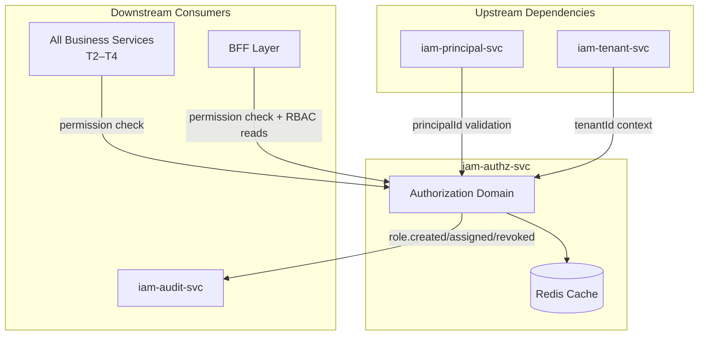
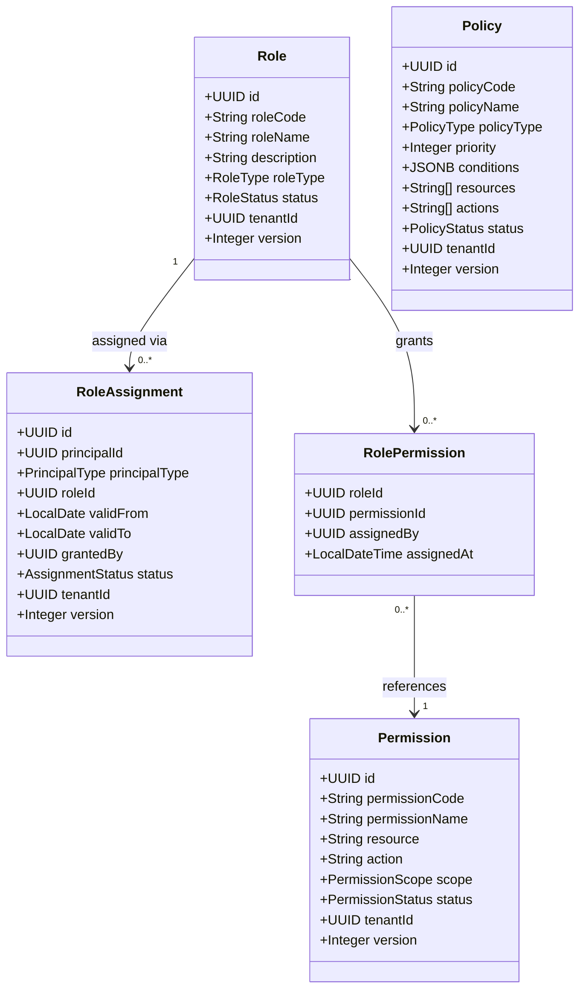
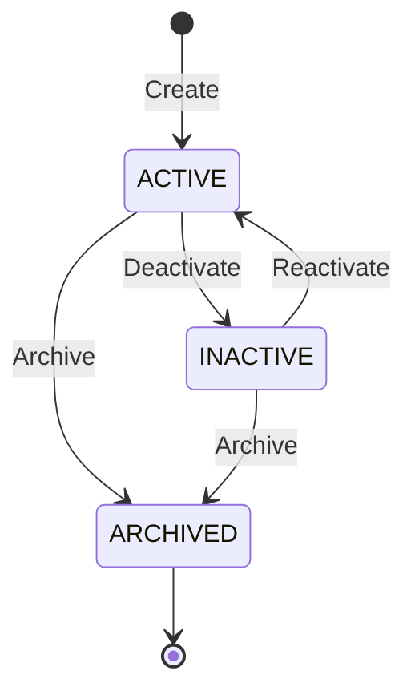
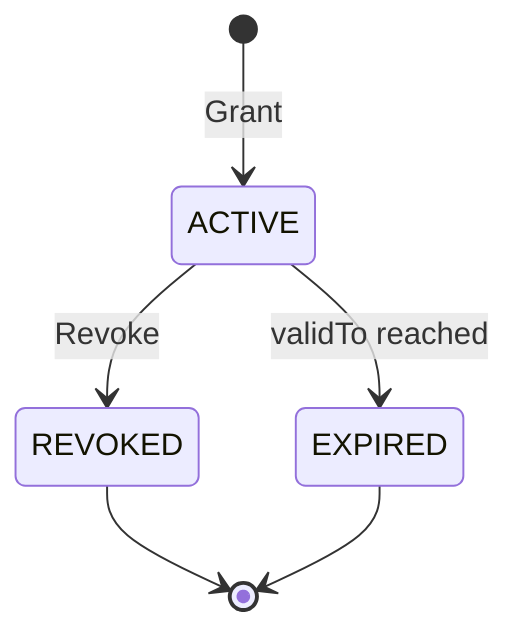
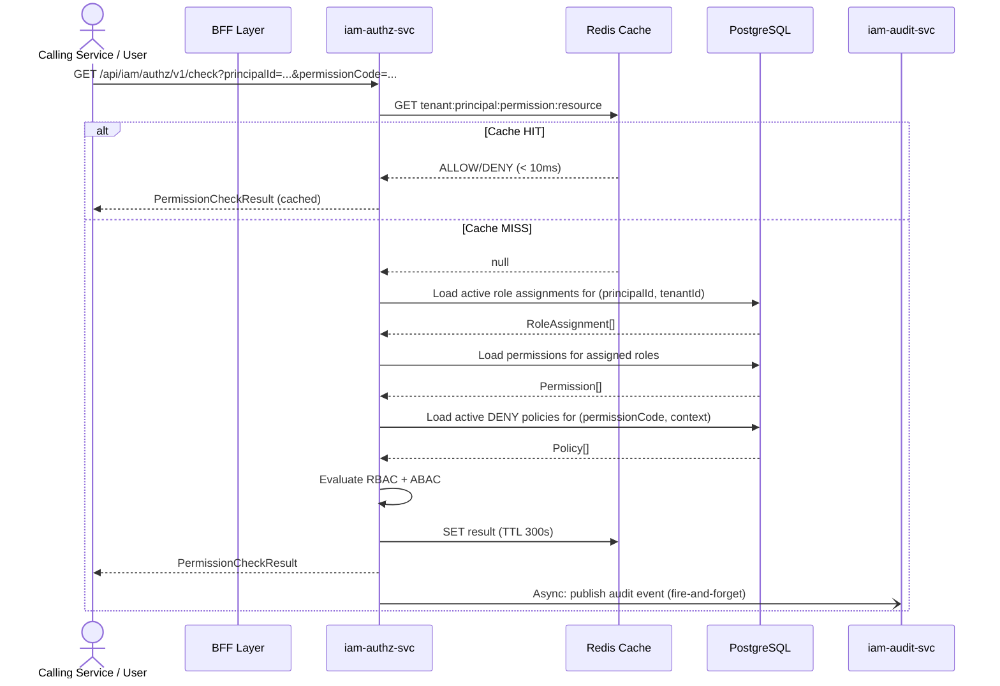
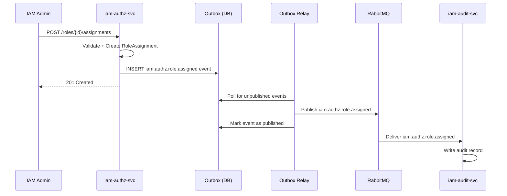
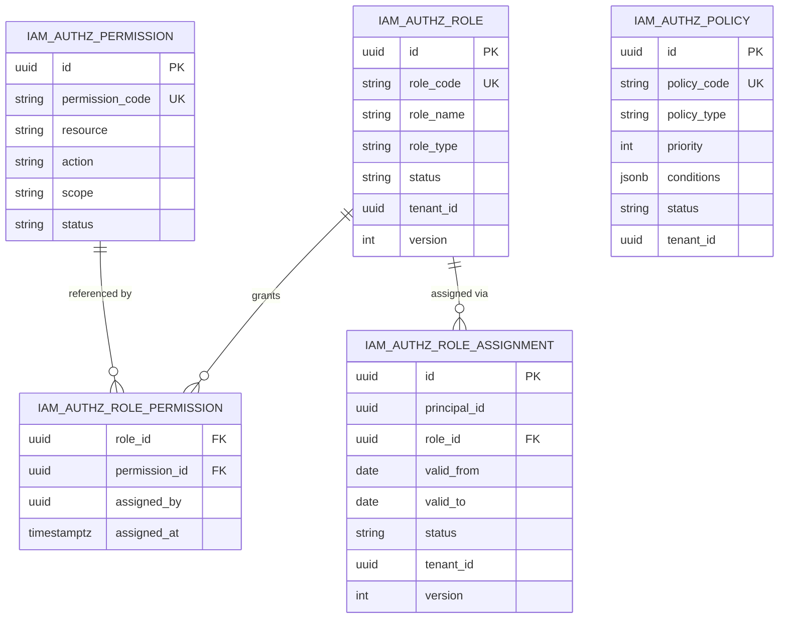

<!-- TEMPLATE COMPLIANCE: ~95%
Template: domain-service-spec.md v1.0.0
Present sections: §0-§15
-->

# iam.authz — Authorization Service Domain Specification

> **Conceptual Stack Layer:** Domain / Service
> **Space:** Platform
> **Owner:** IAM Engineering Team
> **Schema alignment:** `service-layer.schema.json`
> **Companion files:** `contracts/http/iam/authz/openapi.yaml`, `contracts/events/iam/authz/`
> **Referenced by:** Platform-Feature Spec SS5 (backend dependencies), BFF Contract
> **Belongs to:** IAM Suite Spec

> **Meta Information**
> - **Version:** 2026-04-03
> - **Template:** `domain-service-spec.md` v1.0.0
> - **Template Compliance:** ~95% — fully compliant after upgrade
> - **Author(s):** OpenLeap Architecture Team
> - **Status:** DRAFT
> - **Suite:** `iam` (Identity & Access Management)
> - **Domain:** `authz` (Authorization)
> - **Bounded Context Ref:** `bc:authorization`
> - **Service ID:** `iam-authz-svc`
> - **basePackage:** `io.openleap.iam.authz`
> - **API Base Path:** `/api/iam/authz/v1`
> - **Port:** `8082`
> - **Repository:** `https://github.com/openleap-io/io.openleap.iam.authz`
> - **Tags:** `iam`, `authz`, `rbac`, `abac`
> - **Team:**
>   - Name: `team-iam`
>   - Email: `iam-team@openleap.io`
>   - Slack: `#iam-team`

---

## Specification Guidelines Compliance

> ### Non-Negotiables
> - Never invent facts. If required info is missing, add an **OPEN QUESTION** entry.
> - Preserve intent and decisions. Only change meaning when explicitly requested.
> - Do not remove normative constraints unless they are explicitly replaced.
> - Keep the spec **self-contained**: no "see chat", no implicit context.
>
> ### Source of Truth Priority
> When sources conflict:
> 1. Spec (explicit) wins
> 2. Starter specs (implementation constraints) next
> 3. Guidelines (best practices) last
>
> Record conflicts in the **Decisions & Conflicts** section (see Section 14).
>
> ### Style Guide
> - Prefer short sentences and lists.
> - Use MUST/SHOULD/MAY for normative statements.
> - Keep terminology consistent (Aggregate, Domain Service, Application Service, Command, Event).
> - Avoid ambiguous words ("often", "maybe") unless explicitly noting uncertainty.
> - Keep examples minimal and clearly marked as examples.
> - Do not add implementation code unless the chapter explicitly requires it.

---

## 0. Document Purpose & Scope

### 0.1 Purpose

The `iam.authz` domain specification defines fine-grained Role-Based Access Control (RBAC) and Attribute-Based Access Control (ABAC) for the OpenLeap platform. It manages roles, permissions, policies, and role assignments, and answers the central authorization question: _Can principal X perform action Y on resource Z?_ All responses MUST be provided with sub-50ms p95 latency (sub-10ms for cached results).

### 0.2 Target Audience

- Product Owners & Business Stakeholders (authorization model design)
- System Architects & Technical Leads (integration contracts)
- IAM Engineers (implementation)
- Security & Compliance Officers (RBAC matrix, audit)
- Integration Engineers (consuming the permission-check API)

### 0.3 Scope

**In Scope:**
- Role lifecycle management (create, update, activate, deactivate, archive)
- Permission definition and cataloging
- ABAC policy definition and evaluation
- Role assignment to principals (grant and revoke)
- Permission check evaluation (RBAC + ABAC combined)
- Delegation and impersonation of roles
- Multi-tenant isolation of roles and assignments
- Authorization cache management (Redis)
- Outbox-based event publishing for authz state changes

**Out of Scope:**
- Authentication credential validation (delegated to Keycloak)
- Principal profile management (`iam-principal-svc`)
- Tenant lifecycle management (`iam-tenant-svc`)
- Audit log persistence (consumed by `iam-audit-svc`)
- Business domain authorization policies (defined by domain services)
- Infrastructure security (network, OS, firewall)

### 0.4 Related Documents

| Document | Path | Type |
|----------|------|------|
| IAM Suite Specification | `spec/T1_Platform/iam/_iam_suite.md` | Suite spec |
| Principal Service Spec | `spec/T1_Platform/iam/domain-specs/iam_principal-spec.md` | Domain spec |
| Tenant Service Spec | `spec/T1_Platform/iam/domain-specs/iam_tenant-spec.md` | Domain spec |
| Audit Service Spec | `spec/T1_Platform/iam/domain-specs/iam_audit-spec.md` | Domain spec |
| F-IAM-002 Authorization Feature Composition | `spec/T1_Platform/iam/features/compositions/F-IAM-002.md` | Feature composition |
| F-IAM-002-01 RBAC Management | `spec/T1_Platform/iam/features/leaves/F-IAM-002-01/feature-spec.md` | Leaf feature spec |
| F-IAM-002-02 Permission Check | `spec/T1_Platform/iam/features/leaves/F-IAM-002-02/feature-spec.md` | Leaf feature spec |
| F-IAM-002-03 ABAC Policy Evaluation | `spec/T1_Platform/iam/features/leaves/F-IAM-002-03/feature-spec.md` | Leaf feature spec |
| F-IAM-002-04 Delegation & Impersonation | `spec/T1_Platform/iam/features/leaves/F-IAM-002-04/feature-spec.md` | Leaf feature spec |
| OpenAPI Contract | `contracts/http/iam/authz/openapi.yaml` | API contract |
| Event Schemas | `contracts/events/iam/authz/` | Event contracts |

---

## 1. Business Context

### 1.1 Domain Purpose

The Authorization domain solves the access control problem across all OpenLeap services. Without centralized authorization, every service would implement its own permission logic, leading to inconsistencies, security gaps, and compliance failures. The `iam-authz-svc` provides a single, authoritative evaluation point for all access control decisions, combining RBAC (role-based) and ABAC (attribute/condition-based) policies.

### 1.2 Business Value

- **Security:** Consistent deny-by-default policy prevents unauthorized access across all services.
- **Compliance:** Centralized RBAC matrix satisfies SOX, ISO 27001, and GDPR audit requirements.
- **Agility:** New services integrate authorization without implementing permission logic themselves.
- **Auditability:** Every permission check produces an audit record (via `iam-audit-svc`).
- **Performance:** Redis-backed caching delivers sub-10ms latency for the hot permission-check path.
- **Flexibility:** ABAC policies enable context-sensitive access control beyond static roles.

### 1.3 Key Stakeholders

| Role | Responsibility | Primary Use Cases |
|------|----------------|-------------------|
| IAM Admin (`IAM_AUTHZ_ADMIN`) | Define and manage roles and permissions | Create/update roles, assign permissions |
| Tenant Admin (`IAM_TENANT_ADMIN`) | Assign tenant-scoped roles to principals | Grant/revoke role assignments |
| Security Officer | Review and audit role assignments | Read RBAC matrix, generate access reports |
| Service Integrator | Check permissions in microservices | Call `GET /check` endpoint |
| Platform Architect | Design authorization model | Define ABAC policies |

### 1.4 Strategic Positioning

The Authorization domain is a **foundational platform capability** (Tier 1). All business domains (Tiers 2–4) depend on it for access control decisions. It MUST be available at >99.95% uptime and respond with sub-50ms p95 latency. It follows the **hybrid ingress** pattern (ADR-004): REST for synchronous checks and CQRS reads; events for async state notifications.

### 1.5 Service Context

| Property | Value |
|----------|-------|
| **Suite** | `iam` |
| **Domain** | `authz` |
| **Bounded Context** | `bc:authorization` |
| **Service ID** | `iam-authz-svc` |
| **Base Package** | `io.openleap.iam.authz` |

**Responsibilities:**
- Authoritative source for role definitions, permission catalogs, and ABAC policies
- Single evaluation point for permission checks (RBAC + ABAC combined)
- Role assignment lifecycle management (grant, revoke, expire)
- Authorization cache management (invalidation on role/assignment changes)
- Publishing authorization domain events (role changes, assignment changes)

**Authoritative Sources:**

| Source Type | Description | Access Pattern |
|-------------|-------------|----------------|
| REST API | Role/permission CRUD, permission check, policy management | Synchronous |
| Database | Roles, permissions, policies, role assignments (owned data) | Direct (owner) |
| Events | Role created/assigned/revoked, permission granted/denied | Asynchronous |
| Cache (Redis) | Permission check results, keyed by `tenant:principal:permission:resource` | Read-through |



---

## 2. Service Identity

| Property | Value | Schema Field |
|----------|-------|-------------|
| **Service ID** | `iam-authz-svc` | `metadata.id` |
| **Display Name** | `IAM Authorization Service` | `metadata.name` |
| **Suite** | `iam` | `metadata.suite` |
| **Domain** | `authz` | `metadata.domain` |
| **Bounded Context** | `bc:authorization` | `metadata.bounded_context_ref` |
| **Version** | `3.0.0` | `metadata.version` |
| **Status** | DRAFT | `metadata.status` |
| **API Base Path** | `/api/iam/authz/v1` | `metadata.api_base_path` |
| **Repository** | `https://github.com/openleap-io/io.openleap.iam.authz` | `metadata.repository` |
| **Tags** | `iam`, `authz`, `rbac`, `abac` | `metadata.tags` |

**Team:**

| Property | Value |
|----------|-------|
| **Name** | `team-iam` |
| **Email** | `iam-team@openleap.io` |
| **Slack Channel** | `#iam-team` |

---

## 3. Domain Model

### 3.1 Conceptual Overview

The authorization domain is built around four core aggregates:

- **Role** — A named collection of permissions, scoped to a tenant or the system. Roles are the primary unit of access control in RBAC.
- **Permission** — An atomic right to perform a specific action on a specific resource type. Permissions are platform-defined or domain-defined.
- **Policy** — An ABAC rule that grants or denies access based on contextual attributes (e.g., time-of-day, IP range, resource owner). Policies override or augment RBAC decisions.
- **RoleAssignment** — The binding of a Role to a Principal, optionally time-bounded, within a tenant context.

The permission check combines RBAC (role assignments → permissions) and ABAC (policy conditions) into a single ALLOW/DENY decision per ADR-002 (CQRS read model).

### 3.2 Core Concepts



### 3.3 Aggregate Definitions

#### 3.3.1 Role

| Property | Value |
|----------|-------|
| **Aggregate ID** | `agg:role` |
| **Name** | `Role` |

**Business Purpose:**
A Role is a named grouping of permissions that can be assigned to principals. Roles are the primary mechanism for granting access in RBAC. SYSTEM roles are platform-defined and immutable by tenants; TENANT roles are defined by tenant admins within their scope; CUSTOM roles are product-level extensions.

##### Aggregate Root

**Key Attributes:**

| Attribute | Type | Format | Description | Constraints | Required | Read-Only |
|-----------|------|--------|-------------|-------------|----------|-----------|
| id | string | uuid | Unique identifier, generated by `OlUuid.create()` | Immutable | Yes | Yes |
| roleCode | string | — | Unique role identifier within a tenant, e.g., `FINANCE_APPROVER` | UPPER_SNAKE_CASE, max 100 chars, pattern `^[A-Z][A-Z0-9_]{1,99}$` | Yes | No |
| roleName | string | — | Human-readable role display name | max 200 chars | Yes | No |
| description | string | — | Business description of the role's purpose | max 500 chars | Yes | No |
| roleType | string | — | Classification of role scope | enum_ref: `RoleType` | Yes | No |
| status | string | — | Current lifecycle state | enum_ref: `RoleStatus` | Yes | No |
| tenantId | string | uuid | Tenant ownership; enforced by Row-Level Security | — | Yes | Yes |
| version | integer | int32 | Optimistic locking version counter | min: 1 | Yes | Yes |
| createdAt | string | date-time | Timestamp of record creation | ISO-8601 | Yes | Yes |
| updatedAt | string | date-time | Timestamp of last modification | ISO-8601 | Yes | Yes |

**Lifecycle States:**

| Property | Value |
|----------|-------|
| **Initial State** | `ACTIVE` |
| **Terminal States** | `ARCHIVED` |



**State Descriptions:**

| State | Description | Business Meaning |
|-------|-------------|------------------|
| ACTIVE | Operational state | Can be assigned to principals; permissions enforced |
| INACTIVE | Suspended state | Cannot be newly assigned; existing assignments suspended |
| ARCHIVED | Terminal state | Historical record only; no new assignments permitted |

**Allowed Transitions:**

| From State | To State | Trigger | Guard / Business Preconditions |
|------------|----------|---------|-------------------------------|
| ACTIVE | INACTIVE | Manual deactivation by IAM Admin | Role must not be a system-required role (BR-AUTHZ-002) |
| INACTIVE | ACTIVE | Manual reactivation by IAM Admin | Original definition still valid |
| ACTIVE | ARCHIVED | Archive by IAM Admin | No active role assignments referencing this role |
| INACTIVE | ARCHIVED | Archive by IAM Admin | No active role assignments referencing this role |

**Invariants:**

| Rule ID | Description |
|---------|-------------|
| BR-AUTHZ-001 | `roleCode` must be unique per tenant |
| BR-AUTHZ-002 | SYSTEM roles MUST NOT be modified or deactivated by tenant admins |
| BR-AUTHZ-008 | Circular role inheritance is not permitted (if role hierarchy is introduced) |

**Domain Events Emitted:**
- `iam.authz.role.created`
- `iam.authz.role.updated`
- `iam.authz.role.statusChanged`
- `iam.authz.role.permissionAssigned`
- `iam.authz.role.permissionRevoked`

##### Child Entities

###### Entity: RolePermission

| Property | Value |
|----------|-------|
| **Entity ID** | `ent:role-permission` |
| **Name** | `RolePermission` |
| **Relationship to Root** | one_to_many |

**Business Purpose:**
Represents the assignment of a permission to a role. This is the core data structure of RBAC — defining what a role is allowed to do.

**Attributes:**

| Attribute | Type | Format | Description | Constraints | Required |
|-----------|------|--------|-------------|-------------|----------|
| roleId | string | uuid | Reference to owning Role | FK to `iam_authz_role` | Yes |
| permissionId | string | uuid | Reference to Permission | FK to `iam_authz_permission` | Yes |
| assignedBy | string | uuid | Principal who added this permission | FK to iam-principal-svc | Yes |
| assignedAt | string | date-time | When permission was added to role | ISO-8601 | Yes |

**Collection Constraints:**
- Minimum items: 0
- Maximum items: 500 (a single role SHOULD NOT exceed 500 permissions; use role composition instead)

**Invariants:**

| Rule ID | Description |
|---------|-------------|
| BR-AUTHZ-002 | SYSTEM role permissions cannot be modified by tenant admins |

##### Value Objects

###### Value Object: PermissionCheckRequest

| Property | Value |
|----------|-------|
| **VO ID** | `vo:permission-check-request` |
| **Name** | `PermissionCheckRequest` |

**Description:**
Immutable input for a permission evaluation. Carries the principal context, the requested action, and the resource target.

**Attributes:**

| Attribute | Type | Format | Description | Constraints |
|-----------|------|--------|-------------|-------------|
| principalId | string | uuid | Identity of the requesting principal | Required |
| tenantId | string | uuid | Tenant context for the evaluation | Required |
| permissionCode | string | — | The permission being checked, e.g., `fi.gl.posting:create` | Required, pattern: `^[a-z]+\.[a-z]+\.[a-z]+:[a-z]+$` |
| resourceId | string | — | Optional resource-level scoping (for ABAC) | Optional |
| resourceType | string | — | Optional resource type for ABAC policy matching | Optional |
| context | object | — | Additional ABAC context attributes (IP, time, etc.) | Optional |

**Validation Rules:**
- `principalId` MUST be a valid UUID
- `permissionCode` MUST follow the pattern `{suite}.{domain}.{resource}:{action}`
- `tenantId` MUST match the JWT token's tenant claim

###### Value Object: PermissionCheckResult

| Property | Value |
|----------|-------|
| **VO ID** | `vo:permission-check-result` |
| **Name** | `PermissionCheckResult` |

**Description:**
Immutable result of a permission evaluation. Carries the decision, reason code, and cache metadata.

**Attributes:**

| Attribute | Type | Format | Description | Constraints |
|-----------|------|--------|-------------|-------------|
| decision | string | — | Evaluation outcome | enum: `ALLOW`, `DENY` |
| reason | string | — | Machine-readable reason code | enum_ref: `DenyReason` (if DENY) |
| evaluatedAt | string | date-time | Evaluation timestamp | ISO-8601 |
| cacheHit | boolean | — | Whether result was served from cache | — |
| matchedPolicies | array | — | List of ABAC policy IDs that matched (if any) | Optional |

**Validation Rules:**
- `decision` MUST be `ALLOW` or `DENY`
- `reason` MUST be present when `decision` is `DENY`

---

#### 3.3.2 Permission

| Property | Value |
|----------|-------|
| **Aggregate ID** | `agg:permission` |
| **Name** | `Permission` |

**Business Purpose:**
A Permission is an atomic right to perform a specific action on a specific resource type. Permissions are the leaf nodes of the authorization model. They are typically defined by the team owning the resource (domain engineering) and registered in the permission catalog during service initialization.

##### Aggregate Root

**Key Attributes:**

| Attribute | Type | Format | Description | Constraints | Required | Read-Only |
|-----------|------|--------|-------------|-------------|----------|-----------|
| id | string | uuid | Unique identifier, generated by `OlUuid.create()` | Immutable | Yes | Yes |
| permissionCode | string | — | Unique code, format `{suite}.{domain}.{resource}:{action}` | Pattern `^[a-z]+\.[a-z]+\.[a-z]+:[a-z]+$`, max 200 chars | Yes | No |
| permissionName | string | — | Human-readable name, e.g., "Create GL Posting" | max 200 chars | Yes | No |
| description | string | — | What this permission allows | max 500 chars | Yes | No |
| resource | string | — | The resource type this permission applies to | max 100 chars | Yes | No |
| action | string | — | The action permitted, e.g., `create`, `read`, `update`, `delete`, `approve` | max 50 chars | Yes | No |
| scope | string | — | Where this permission applies | enum_ref: `PermissionScope` | Yes | No |
| status | string | — | Lifecycle status | enum_ref: `PermissionStatus` | Yes | No |
| tenantId | string | uuid | Tenant ownership; null for SYSTEM-scoped permissions | — | No | Yes |
| version | integer | int32 | Optimistic locking version | min: 1 | Yes | Yes |
| createdAt | string | date-time | Creation timestamp | ISO-8601 | Yes | Yes |
| updatedAt | string | date-time | Last modification timestamp | ISO-8601 | Yes | Yes |

**Lifecycle States:**

| Property | Value |
|----------|-------|
| **Initial State** | `ACTIVE` |
| **Terminal States** | `DEPRECATED` |

**State Descriptions:**

| State | Description | Business Meaning |
|-------|-------------|------------------|
| ACTIVE | Available for assignment | Can be assigned to roles; evaluated in permission checks |
| DEPRECATED | Soft-deprecated | Warn in admin UIs; still evaluated for backward compatibility |

**Allowed Transitions:**

| From State | To State | Trigger | Guard / Business Preconditions |
|------------|----------|---------|-------------------------------|
| ACTIVE | DEPRECATED | Admin action | No replacement required; deprecated with sunset date |

**Invariants:**

| Rule ID | Description |
|---------|-------------|
| BR-AUTHZ-006 | Permission code MUST follow the format `{suite}.{domain}.{resource}:{action}` |

**Domain Events Emitted:**
- `iam.authz.permission.created`
- `iam.authz.permission.statusChanged`

---

#### 3.3.3 Policy

| Property | Value |
|----------|-------|
| **Aggregate ID** | `agg:policy` |
| **Name** | `Policy` |

**Business Purpose:**
An ABAC Policy defines context-sensitive access control rules. Policies evaluate conditions (e.g., time-of-day, IP range, resource ownership, custom attributes) and produce ALLOW or DENY decisions that augment or override RBAC decisions. DENY policies take precedence over RBAC grants per BR-AUTHZ-007.

##### Aggregate Root

**Key Attributes:**

| Attribute | Type | Format | Description | Constraints | Required | Read-Only |
|-----------|------|--------|-------------|-------------|----------|-----------|
| id | string | uuid | Unique identifier, generated by `OlUuid.create()` | Immutable | Yes | Yes |
| policyCode | string | — | Unique policy code within a tenant | UPPER_SNAKE_CASE, max 100 chars | Yes | No |
| policyName | string | — | Human-readable policy name | max 200 chars | Yes | No |
| description | string | — | What this policy enforces and why | max 500 chars | Yes | No |
| policyType | string | — | Whether the policy grants or denies | enum_ref: `PolicyType` | Yes | No |
| priority | integer | int32 | Evaluation order; higher = evaluated first. Conflicts resolved by deny-wins | min: 1, max: 9999 | Yes | No |
| conditions | object | jsonb | ABAC condition expression (attribute/value pairs with operators) | Valid JSON, max 8 KB | Yes | No |
| resources | array | — | Resource type patterns this policy applies to (glob patterns) | min: 1 item | Yes | No |
| actions | array | — | Action patterns this policy applies to | min: 1 item | Yes | No |
| status | string | — | Lifecycle status | enum_ref: `PolicyStatus` | Yes | No |
| tenantId | string | uuid | Tenant scope; null for platform-wide policies | — | No | Yes |
| version | integer | int32 | Optimistic locking version | min: 1 | Yes | Yes |
| createdAt | string | date-time | Creation timestamp | ISO-8601 | Yes | Yes |
| updatedAt | string | date-time | Last modification timestamp | ISO-8601 | Yes | Yes |

**Lifecycle States:**

| Property | Value |
|----------|-------|
| **Initial State** | `ACTIVE` |
| **Terminal States** | `ARCHIVED` |

**State Descriptions:**

| State | Description | Business Meaning |
|-------|-------------|------------------|
| ACTIVE | Policy is being evaluated | Applied in every permission check matching resources and actions |
| INACTIVE | Policy suspended | Not evaluated; use for temporary disablement |
| ARCHIVED | Terminal state | No longer evaluated; retained for audit |

**Allowed Transitions:**

| From State | To State | Trigger | Guard / Business Preconditions |
|------------|----------|---------|-------------------------------|
| ACTIVE | INACTIVE | Admin action | — |
| INACTIVE | ACTIVE | Admin action | — |
| ACTIVE | ARCHIVED | Admin action | Policy has been superseded or is no longer needed |
| INACTIVE | ARCHIVED | Admin action | — |

**Invariants:**

| Rule ID | Description |
|---------|-------------|
| BR-AUTHZ-007 | DENY policy overrides RBAC ALLOW (deny-wins conflict resolution) |

**Domain Events Emitted:**
- `iam.authz.policy.created`
- `iam.authz.policy.updated`
- `iam.authz.policy.statusChanged`
- `iam.authz.policy.evaluated`

---

#### 3.3.4 RoleAssignment

| Property | Value |
|----------|-------|
| **Aggregate ID** | `agg:role-assignment` |
| **Name** | `RoleAssignment` |

**Business Purpose:**
A RoleAssignment binds a Role to a Principal within a tenant context, optionally for a bounded validity period. It is the primary mechanism for granting RBAC access to users and services. Assignments can be delegated (one principal grants to another) and can be time-bounded for temporary access scenarios.

##### Aggregate Root

**Key Attributes:**

| Attribute | Type | Format | Description | Constraints | Required | Read-Only |
|-----------|------|--------|-------------|-------------|----------|-----------|
| id | string | uuid | Unique identifier, generated by `OlUuid.create()` | Immutable | Yes | Yes |
| principalId | string | uuid | Reference to principal receiving the role | FK validated against iam-principal-svc | Yes | Yes |
| principalType | string | — | Type of the principal | enum_ref: `PrincipalType` | Yes | Yes |
| roleId | string | uuid | Reference to assigned role | FK to `iam_authz_role` | Yes | Yes |
| tenantId | string | uuid | Tenant scope of the assignment | — | Yes | Yes |
| validFrom | string | date | Effective start date | Must be <= validTo if validTo present | Yes | No |
| validTo | string | date | Effective end date (null = indefinite) | Must be >= validFrom | No | No |
| grantedBy | string | uuid | Principal who granted this assignment | FK to iam-principal-svc | Yes | Yes |
| grantedAt | string | date-time | When the assignment was created | ISO-8601 | Yes | Yes |
| revokedBy | string | uuid | Principal who revoked (if applicable) | FK to iam-principal-svc | No | No |
| revokedAt | string | date-time | When the assignment was revoked | ISO-8601 | No | No |
| status | string | — | Current state of the assignment | enum_ref: `AssignmentStatus` | Yes | No |
| version | integer | int32 | Optimistic locking version | min: 1 | Yes | Yes |
| createdAt | string | date-time | Record creation timestamp | ISO-8601 | Yes | Yes |
| updatedAt | string | date-time | Last modification timestamp | ISO-8601 | Yes | Yes |

**Lifecycle States:**

| Property | Value |
|----------|-------|
| **Initial State** | `ACTIVE` |
| **Terminal States** | `REVOKED`, `EXPIRED` |



**State Descriptions:**

| State | Description | Business Meaning |
|-------|-------------|------------------|
| ACTIVE | Assignment is in effect | Principal has the role's permissions for permission checks |
| REVOKED | Manually revoked by admin | Principal no longer has this role |
| EXPIRED | Automatically expired | validTo date passed; principal no longer has this role |

**Allowed Transitions:**

| From State | To State | Trigger | Guard / Business Preconditions |
|------------|----------|---------|-------------------------------|
| ACTIVE | REVOKED | `RevokeRole` command by IAM Admin or Tenant Admin | Requester MUST have `iam.authz.assignment:revoke` permission |
| ACTIVE | EXPIRED | Scheduled job (time-based) | `validTo` date is in the past |

**Invariants:**

| Rule ID | Description |
|---------|-------------|
| BR-AUTHZ-003 | Assignment requires valid, ACTIVE principal in iam-principal-svc |
| BR-AUTHZ-004 | `validFrom` MUST be <= `validTo` when `validTo` is specified |
| BR-AUTHZ-009 | Assignment MUST reference an ACTIVE role |
| BR-AUTHZ-010 | Principal MUST exist in iam-principal-svc before assignment |

**Domain Events Emitted:**
- `iam.authz.role.assigned`
- `iam.authz.role.revoked`
- `iam.authz.assignment.expired`

---

### 3.4 Enumerations

#### RoleType

**Description:** Classification of a role by its origin and scope of authority.

| Value | Description | Deprecated |
|-------|-------------|------------|
| `SYSTEM` | Platform-defined role, valid across all tenants; immutable by tenant admins | No |
| `TENANT` | Tenant-defined role, scoped to a single tenant; managed by tenant admins | No |
| `CUSTOM` | Product- or addon-defined role, scoped to a tenant; managed by product configuration | No |

#### RoleStatus

**Description:** Lifecycle state of a role.

| Value | Description | Deprecated |
|-------|-------------|------------|
| `ACTIVE` | Role is in operation and can be assigned to principals | No |
| `INACTIVE` | Role is temporarily suspended; existing assignments are not evaluated | No |
| `ARCHIVED` | Role is permanently retired; no new assignments permitted | No |

#### PermissionScope

**Description:** Indicates whether a permission applies at the platform level or tenant level.

| Value | Description | Deprecated |
|-------|-------------|------------|
| `SYSTEM` | Platform-level permission; applies across all tenants | No |
| `SUITE` | Suite-level permission; scoped to a specific suite | No |
| `DOMAIN` | Domain-level permission; scoped to a specific domain service | No |

#### PermissionStatus

**Description:** Lifecycle state of a permission definition.

| Value | Description | Deprecated |
|-------|-------------|------------|
| `ACTIVE` | Permission is available for assignment and is evaluated | No |
| `DEPRECATED` | Permission is still evaluated but flagged for removal in a future version | No |

#### PolicyType

**Description:** Whether an ABAC policy grants or denies access when its conditions match.

| Value | Description | Deprecated |
|-------|-------------|------------|
| `ALLOW` | Explicitly grants access when conditions are satisfied | No |
| `DENY` | Explicitly denies access when conditions are satisfied; overrides RBAC ALLOW | No |

#### PolicyStatus

**Description:** Lifecycle state of an ABAC policy.

| Value | Description | Deprecated |
|-------|-------------|------------|
| `ACTIVE` | Policy is evaluated on every matching permission check | No |
| `INACTIVE` | Policy is suspended; not evaluated | No |
| `ARCHIVED` | Policy is permanently retired; retained for audit | No |

#### AssignmentStatus

**Description:** Lifecycle state of a role assignment.

| Value | Description | Deprecated |
|-------|-------------|------------|
| `ACTIVE` | Assignment is in effect | No |
| `REVOKED` | Assignment was explicitly revoked by an admin | No |
| `EXPIRED` | Assignment passed its `validTo` date | No |

#### PrincipalType

**Description:** Type classification for the principal receiving a role assignment (sourced from iam-principal-svc).

| Value | Description | Deprecated |
|-------|-------------|------------|
| `HUMAN` | Human user account | No |
| `SERVICE` | Automated service principal (API key / service account) | No |
| `SYSTEM` | Internal system process | No |
| `DEVICE` | IoT device or hardware principal | No |

#### DenyReason

**Description:** Machine-readable code explaining why a permission check returned DENY.

| Value | Description | Deprecated |
|-------|-------------|------------|
| `NO_ROLE_ASSIGNMENT` | Principal has no active role assignment in the tenant | No |
| `PERMISSION_NOT_IN_ROLE` | Principal's roles do not include the requested permission | No |
| `ROLE_INACTIVE` | Principal's assigned role is INACTIVE | No |
| `ASSIGNMENT_EXPIRED` | Role assignment's validTo date has passed | No |
| `POLICY_DENY` | An ABAC DENY policy matched and overrode the RBAC decision | No |
| `PRINCIPAL_NOT_FOUND` | Principal does not exist in iam-principal-svc | No |
| `TENANT_MISMATCH` | Principal's tenant does not match the requested tenant context | No |

---

### 3.5 Shared Types

#### ConditionExpression

| Property | Value |
|----------|-------|
| **Type ID** | `type:condition-expression` |
| **Name** | `ConditionExpression` |

**Description:** A JSON structure representing an ABAC condition. Supports AND/OR operators with leaf conditions comparing a context attribute to a value. Used in `Policy.conditions`.

**Attributes:**

| Attribute | Type | Format | Description | Constraints |
|-----------|------|--------|-------------|-------------|
| operator | string | — | Logical operator | enum: `AND`, `OR`, `NOT`, `EQ`, `NEQ`, `IN`, `GT`, `LT`, `MATCHES` |
| attribute | string | — | Context attribute path (for leaf conditions), e.g., `context.ipRange` | Required for leaf operators |
| value | any | — | Expected value for comparison | Required for leaf operators |
| conditions | array | — | Sub-conditions (for AND/OR/NOT) | Required for logical operators |

**Validation Rules:**
- Logical operators (`AND`, `OR`, `NOT`) MUST have a `conditions` array with at least one item
- Leaf operators (`EQ`, `NEQ`, `IN`, `GT`, `LT`, `MATCHES`) MUST have `attribute` and `value`
- Maximum nesting depth: 5 levels

**Used By:**
- `agg:policy`

---

## 4. Business Rules & Constraints

### 4.1 Business Rules Catalog

| ID | Rule Name | Description | Scope | Enforcement | Error Code |
|----|-----------|-------------|-------|-------------|------------|
| BR-AUTHZ-001 | Role Code Uniqueness | `roleCode` must be unique per tenant | Role | Create, Update | `AUTHZ_ROLE_CODE_DUPLICATE` |
| BR-AUTHZ-002 | System Role Immutability | SYSTEM roles cannot be modified or deactivated by tenant admins | Role | Update, Delete | `AUTHZ_SYSTEM_ROLE_IMMUTABLE` |
| BR-AUTHZ-003 | Valid Principal on Assignment | Role assignment requires a valid, ACTIVE principal | RoleAssignment | Create | `AUTHZ_PRINCIPAL_NOT_FOUND` |
| BR-AUTHZ-004 | Assignment Validity Period | `validFrom` must be <= `validTo` when `validTo` is specified | RoleAssignment | Create, Update | `AUTHZ_INVALID_VALIDITY_PERIOD` |
| BR-AUTHZ-005 | Deny by Default | Absence of permission = DENY. No implicit grants. | Permission check | Evaluate | `AUTHZ_ACCESS_DENIED` |
| BR-AUTHZ-006 | Permission Code Format | Permission codes must follow `{suite}.{domain}.{resource}:{action}` | Permission | Create | `AUTHZ_INVALID_PERMISSION_CODE` |
| BR-AUTHZ-007 | DENY Policy Wins | ABAC DENY policy overrides any RBAC ALLOW for the same request | Permission check | Evaluate | `AUTHZ_POLICY_DENY` |
| BR-AUTHZ-008 | No Circular Role Inheritance | A role MUST NOT directly or transitively reference itself (if hierarchy is used) | Role | Create, Update | `AUTHZ_CIRCULAR_ROLE_REFERENCE` |
| BR-AUTHZ-009 | Active Role Required for Assignment | Assignment MUST reference an ACTIVE role | RoleAssignment | Create | `AUTHZ_ROLE_NOT_ACTIVE` |
| BR-AUTHZ-010 | Principal Must Exist | Principal MUST exist in iam-principal-svc before being assigned a role | RoleAssignment | Create | `AUTHZ_PRINCIPAL_NOT_FOUND` |
| BR-AUTHZ-011 | Tenant Isolation | All role and assignment operations are scoped to the caller's tenant | All | All | `AUTHZ_TENANT_MISMATCH` |
| BR-AUTHZ-012 | Permission Code Uniqueness | `permissionCode` must be unique across the platform | Permission | Create | `AUTHZ_PERMISSION_CODE_DUPLICATE` |

### 4.2 Detailed Rule Definitions

#### BR-AUTHZ-001: Role Code Uniqueness

**Business Context:**
Role codes are used as stable identifiers in API responses and audit logs. Duplicate codes within a tenant would cause ambiguity in audit trails and permission assignments.

**Rule Statement:**
Within a given tenant, no two active or inactive Roles may share the same `roleCode`. ARCHIVED roles do not block reuse after 90 days.

**Applies To:**
- Aggregate: Role
- Operations: Create, Update

**Enforcement:**
Unique constraint on `(tenant_id, role_code)` in the database. Application service also validates before persisting.

**Validation Logic:**
`SELECT COUNT(*) FROM iam_authz_role WHERE tenant_id = :tenantId AND role_code = :roleCode AND status != 'ARCHIVED'` must return 0.

**Error Handling:**
- **Error Code:** `AUTHZ_ROLE_CODE_DUPLICATE`
- **Error Message:** "Role code '{roleCode}' already exists in this tenant."
- **User action:** Choose a different, unique role code.

**Examples:**
- **Valid:** Creating `FINANCE_APPROVER` when no other active role has that code in the tenant
- **Invalid:** Creating `FINANCE_APPROVER` when an ACTIVE role with that code already exists

---

#### BR-AUTHZ-002: System Role Immutability

**Business Context:**
SYSTEM roles (e.g., `SUPER_ADMIN`, `PLATFORM_READER`) are defined by the platform and must not be altered by individual tenants, as this would break platform-level security guarantees.

**Rule Statement:**
Only platform-level operations (initiated by SYSTEM principals) may modify roles with `roleType = SYSTEM`. Tenant admins MUST NOT be permitted to update, deactivate, or delete SYSTEM roles.

**Applies To:**
- Aggregate: Role
- Operations: Update, Delete, Deactivate

**Enforcement:**
Application Service checks `roleType` before dispatching the command. If `roleType == SYSTEM`, it verifies the caller has `IAM_PLATFORM_ADMIN` scope.

**Validation Logic:**
If `role.roleType == SYSTEM` and caller does not have `IAM_PLATFORM_ADMIN` scope, reject.

**Error Handling:**
- **Error Code:** `AUTHZ_SYSTEM_ROLE_IMMUTABLE`
- **Error Message:** "System roles cannot be modified by tenant administrators."
- **User action:** Contact platform support to request a system role change.

**Examples:**
- **Valid:** Platform engineering updates `SUPER_ADMIN` permissions during a version upgrade
- **Invalid:** A tenant admin attempts to deactivate the `PLATFORM_READER` role

---

#### BR-AUTHZ-004: Assignment Validity Period

**Business Context:**
Time-bounded access is a common security requirement (e.g., temporary contractor access, emergency access grants). The validity period MUST be logically consistent.

**Rule Statement:**
If `validTo` is provided, it MUST be greater than or equal to `validFrom`.

**Applies To:**
- Aggregate: RoleAssignment
- Operations: Create, Update

**Enforcement:**
Domain object validation before persistence.

**Validation Logic:**
`validTo == null || validTo >= validFrom`

**Error Handling:**
- **Error Code:** `AUTHZ_INVALID_VALIDITY_PERIOD`
- **Error Message:** "validTo ({validTo}) must be on or after validFrom ({validFrom})."
- **User action:** Correct the validity period dates.

**Examples:**
- **Valid:** `validFrom: 2026-05-01, validTo: 2026-06-30`
- **Invalid:** `validFrom: 2026-05-01, validTo: 2026-04-01`

---

#### BR-AUTHZ-005: Deny by Default

**Business Context:**
Deny-by-default is a foundational security principle. Any access that is not explicitly granted must be denied.

**Rule Statement:**
The permission check evaluation result MUST be DENY unless at least one ACTIVE role assignment grants the requested permission AND no DENY policy overrides it.

**Applies To:**
- Aggregate: Permission check (read model evaluation)
- Operations: Evaluate

**Enforcement:**
Enforced in the permission check evaluation logic (Domain Service / Application Service).

**Validation Logic:**
If no active role assignment for `(principalId, tenantId)` exists with a permission matching `permissionCode`, return DENY with reason `NO_ROLE_ASSIGNMENT` or `PERMISSION_NOT_IN_ROLE`.

**Error Handling:**
- **Error Code:** `AUTHZ_ACCESS_DENIED`
- **Error Message:** "Access denied. Principal does not have permission '{permissionCode}'."
- **User action:** Request appropriate role assignment from an administrator.

---

#### BR-AUTHZ-007: DENY Policy Wins

**Business Context:**
ABAC DENY policies are used to enforce hard restrictions (e.g., IP allowlist, time-of-day blocks, data residency). These must override RBAC grants to prevent circumvention.

**Rule Statement:**
If any ACTIVE DENY policy matches the permission check request (resources + actions + conditions), the result MUST be DENY regardless of RBAC role assignments.

**Applies To:**
- Permission check evaluation
- Operations: Evaluate

**Enforcement:**
Policy evaluation happens after RBAC evaluation. A single matching DENY policy overrides any number of ALLOW decisions.

**Validation Logic:**
For each ACTIVE DENY policy: evaluate `policy.conditions` against the request context. If any DENY policy matches, return DENY with reason `POLICY_DENY` and the matched policy ID.

**Error Handling:**
- **Error Code:** `AUTHZ_POLICY_DENY`
- **Error Message:** "Access denied by policy '{policyCode}'."
- **User action:** Review ABAC policy configuration with an IAM Admin.

---

### 4.3 Data Validation Rules

**Field-Level Validations:**

| Field | Validation Rule | Error Message |
|-------|----------------|---------------|
| Role.roleCode | Required, max 100 chars, pattern `^[A-Z][A-Z0-9_]{1,99}$` | "Role code must be uppercase with underscores (e.g., FINANCE_APPROVER)" |
| Role.roleName | Required, max 200 chars | "Role name is required and cannot exceed 200 characters" |
| Role.description | Required, max 500 chars | "Description is required and cannot exceed 500 characters" |
| Role.roleType | Required, valid enum value | "Role type must be one of: SYSTEM, TENANT, CUSTOM" |
| Permission.permissionCode | Required, pattern `^[a-z]+\.[a-z]+\.[a-z]+:[a-z]+$`, max 200 chars | "Permission code must follow format {suite}.{domain}.{resource}:{action}" |
| Permission.action | Required, max 50 chars | "Action is required and cannot exceed 50 characters" |
| Policy.conditions | Required, valid JSON, max 8 KB | "Conditions must be a valid JSON object" |
| Policy.priority | Required, integer 1–9999 | "Priority must be between 1 and 9999" |
| RoleAssignment.principalId | Required, valid UUID | "Principal ID must be a valid UUID" |
| RoleAssignment.roleId | Required, valid UUID | "Role ID must be a valid UUID" |
| RoleAssignment.validFrom | Required, valid date | "validFrom must be a valid date (YYYY-MM-DD)" |
| RoleAssignment.validTo | Optional, valid date, >= validFrom | "validTo must be on or after validFrom" |

**Cross-Field Validations:**
- `RoleAssignment.validTo` must be >= `validFrom` when provided (BR-AUTHZ-004)
- `Policy.conditions` must reference valid ABAC attribute paths registered in the platform
- `RoleAssignment.roleId` must reference a role with `tenantId` matching the assignment's `tenantId`

### 4.4 Reference Data Dependencies

| Catalog | Source Service | Fields Referencing | Validation |
|---------|----------------|-------------------|------------|
| Principal registry | `iam-principal-svc` | `RoleAssignment.principalId`, `RoleAssignment.grantedBy` | Principal must exist and be ACTIVE |
| Tenant registry | `iam-tenant-svc` | `Role.tenantId`, `RoleAssignment.tenantId` | Tenant must exist and be ACTIVE |

---

## 5. Use Cases

### 5.1 Business Logic Placement

| Logic Type | Placement | Examples |
|------------|-----------|----------|
| Aggregate invariants | Domain Object | Role code uniqueness check, validity period validation, system role immutability |
| Cross-aggregate logic | Domain Service | Permission check evaluation (RoleAssignment + Permission + Policy lookup) |
| Orchestration & transactions | Application Service | Use case coordination, Redis cache invalidation, outbox event publishing |

### 5.2 Use Cases (Canonical Format)

#### UC-001: CreateRole

| Field | Value |
|-------|-------|
| **id** | `CreateRole` |
| **type** | WRITE |
| **trigger** | REST |
| **aggregate** | `Role` |
| **domainOperation** | `Role.create` |
| **inputs** | `roleCode: string`, `roleName: string`, `description: string`, `roleType: RoleType`, `permissions: UUID[]` |
| **outputs** | `role: Role` |
| **events** | `iam.authz.role.created` |
| **rest** | `POST /api/iam/authz/v1/roles` |
| **idempotency** | optional (idempotency key on `roleCode` per tenant) |
| **errors** | `AUTHZ_ROLE_CODE_DUPLICATE`: role code already exists |

**Actor:** `IAM_AUTHZ_ADMIN`

**Preconditions:**
- Actor has `iam.authz.role:create` permission
- `roleCode` does not exist in tenant (active or inactive)
- All `permissionId` references exist and are ACTIVE

**Main Flow:**
1. Actor submits role creation request via POST
2. System validates `roleCode` format and uniqueness (BR-AUTHZ-001)
3. System validates `roleType` is not SYSTEM for tenant admin callers (BR-AUTHZ-002)
4. System creates Role aggregate with status ACTIVE
5. System assigns provided permissions as `RolePermission` entities
6. System persists role and publishes `iam.authz.role.created` via outbox (ADR-013)

**Postconditions:**
- New Role exists with status ACTIVE
- `RolePermission` entries created for all specified permissions
- `iam.authz.role.created` event published to `iam.authz.events` exchange

**Business Rules Applied:**
- BR-AUTHZ-001: Role Code Uniqueness
- BR-AUTHZ-002: System Role Immutability
- BR-AUTHZ-006: Permission Code Format (for permissions being assigned)

**Alternative Flows:**
- **Alt-1:** If `permissions` array is empty, role is created without any permissions (valid; permissions assigned later)

**Exception Flows:**
- **Exc-1:** If `roleCode` already exists for tenant, return 409 Conflict with `AUTHZ_ROLE_CODE_DUPLICATE`
- **Exc-2:** If any `permissionId` does not exist, return 422 with list of invalid IDs

---

#### UC-002: AssignRole

| Field | Value |
|-------|-------|
| **id** | `AssignRole` |
| **type** | WRITE |
| **trigger** | REST |
| **aggregate** | `RoleAssignment` |
| **domainOperation** | `RoleAssignment.create` |
| **inputs** | `principalId: UUID`, `roleId: UUID`, `tenantId: UUID`, `validFrom: date`, `validTo: date?` |
| **outputs** | `assignment: RoleAssignment` |
| **events** | `iam.authz.role.assigned` |
| **rest** | `POST /api/iam/authz/v1/roles/{id}/assignments` |
| **idempotency** | optional (idempotency key on `principalId + roleId + tenantId`) |
| **errors** | `AUTHZ_PRINCIPAL_NOT_FOUND`, `AUTHZ_ROLE_NOT_ACTIVE`, `AUTHZ_INVALID_VALIDITY_PERIOD` |

**Actor:** `IAM_AUTHZ_ADMIN` or `IAM_TENANT_ADMIN`

**Preconditions:**
- Actor has `iam.authz.assignment:create` permission
- Principal exists in iam-principal-svc and is ACTIVE
- Referenced Role is ACTIVE
- `validFrom` <= `validTo` (if `validTo` provided)

**Main Flow:**
1. Actor submits assignment request
2. System validates principal existence via iam-principal-svc (sync call)
3. System validates role is ACTIVE (BR-AUTHZ-009)
4. System validates validity period (BR-AUTHZ-004)
5. System creates RoleAssignment with status ACTIVE
6. System invalidates Redis cache entries for `(tenantId, principalId, *)`
7. System publishes `iam.authz.role.assigned` via outbox

**Postconditions:**
- RoleAssignment exists with status ACTIVE
- Principal's permission checks now include this role's permissions
- Authorization cache is invalidated for the affected principal

**Business Rules Applied:**
- BR-AUTHZ-003, BR-AUTHZ-004, BR-AUTHZ-009, BR-AUTHZ-010, BR-AUTHZ-011

**Exception Flows:**
- **Exc-1:** If iam-principal-svc returns 404, return 422 with `AUTHZ_PRINCIPAL_NOT_FOUND`
- **Exc-2:** If iam-principal-svc is unavailable, return 503 (no fallback; critical dependency)

---

#### UC-003: RevokeRole

| Field | Value |
|-------|-------|
| **id** | `RevokeRole` |
| **type** | WRITE |
| **trigger** | REST |
| **aggregate** | `RoleAssignment` |
| **domainOperation** | `RoleAssignment.revoke` |
| **inputs** | `assignmentId: UUID` |
| **outputs** | `assignment: RoleAssignment (REVOKED)` |
| **events** | `iam.authz.role.revoked` |
| **rest** | `DELETE /api/iam/authz/v1/roles/{id}/assignments/{assignmentId}` |
| **idempotency** | required (revoking an already-revoked assignment is a no-op) |
| **errors** | `AUTHZ_ASSIGNMENT_NOT_FOUND` |

**Actor:** `IAM_AUTHZ_ADMIN` or `IAM_TENANT_ADMIN`

**Preconditions:**
- Actor has `iam.authz.assignment:revoke` permission
- Assignment exists and is in ACTIVE state

**Main Flow:**
1. Actor initiates revocation
2. System locates assignment and validates it is ACTIVE
3. System transitions assignment to REVOKED, records `revokedBy` and `revokedAt`
4. System invalidates Redis cache entries for affected principal
5. System publishes `iam.authz.role.revoked` via outbox

**Postconditions:**
- Assignment has status REVOKED
- Principal's subsequent permission checks no longer include the revoked role

---

#### UC-004: CheckPermission

| Field | Value |
|-------|-------|
| **id** | `CheckPermission` |
| **type** | READ |
| **trigger** | REST |
| **aggregate** | — (read model evaluation) |
| **domainOperation** | `PermissionCheckService.evaluate` |
| **inputs** | `principalId: UUID`, `permissionCode: string`, `tenantId: UUID`, `resourceId: string?`, `context: object?` |
| **outputs** | `result: PermissionCheckResult` |
| **events** | `iam.authz.permission.granted` (ALLOW) or `iam.authz.permission.denied` (DENY) |
| **rest** | `GET /api/iam/authz/v1/check` |
| **idempotency** | none (read-only) |
| **errors** | `AUTHZ_ACCESS_DENIED`, `AUTHZ_POLICY_DENY`, `AUTHZ_PRINCIPAL_NOT_FOUND` |

**Actor:** Any authenticated service or user

**Preconditions:**
- Caller is authenticated (JWT Bearer token)
- `tenantId` in request matches JWT token's tenant claim

**Main Flow:**
1. System checks Redis cache for `(tenantId:principalId:permissionCode:resourceId)`
2. **Cache hit:** return cached ALLOW/DENY result immediately (< 10ms target)
3. **Cache miss:** load active role assignments for `(principalId, tenantId)`
4. Load permissions for all assigned roles
5. Evaluate RBAC: does any role grant `permissionCode`?
6. If RBAC → ALLOW: evaluate active ABAC DENY policies against `(permissionCode, resourceId, context)`
7. If any DENY policy matches: return DENY with `POLICY_DENY` reason
8. Otherwise: return ALLOW
9. Cache result in Redis with TTL (configurable, default 300s)
10. Publish audit event asynchronously (fire-and-forget to `iam-audit-svc`)

**Postconditions:**
- Result returned to caller
- Result cached in Redis
- Audit event published

**Business Rules Applied:**
- BR-AUTHZ-005: Deny by Default
- BR-AUTHZ-007: DENY Policy Wins

---

#### UC-005: CreatePermission

| Field | Value |
|-------|-------|
| **id** | `CreatePermission` |
| **type** | WRITE |
| **trigger** | REST |
| **aggregate** | `Permission` |
| **domainOperation** | `Permission.create` |
| **inputs** | `permissionCode: string`, `permissionName: string`, `description: string`, `resource: string`, `action: string`, `scope: PermissionScope` |
| **outputs** | `permission: Permission` |
| **events** | `iam.authz.permission.created` |
| **rest** | `POST /api/iam/authz/v1/permissions` |
| **idempotency** | optional (idempotency key on `permissionCode`) |
| **errors** | `AUTHZ_PERMISSION_CODE_DUPLICATE`, `AUTHZ_INVALID_PERMISSION_CODE` |

**Actor:** `IAM_PLATFORM_ADMIN` (SYSTEM scope) or `IAM_AUTHZ_ADMIN` (DOMAIN scope)

---

#### UC-006: CreatePolicy

| Field | Value |
|-------|-------|
| **id** | `CreatePolicy` |
| **type** | WRITE |
| **trigger** | REST |
| **aggregate** | `Policy` |
| **domainOperation** | `Policy.create` |
| **inputs** | `policyCode: string`, `policyName: string`, `policyType: PolicyType`, `priority: integer`, `conditions: ConditionExpression`, `resources: string[]`, `actions: string[]` |
| **outputs** | `policy: Policy` |
| **events** | `iam.authz.policy.created` |
| **rest** | `POST /api/iam/authz/v1/policies` |
| **idempotency** | optional |
| **errors** | `AUTHZ_INVALID_CONDITION_EXPRESSION` |

**Actor:** `IAM_AUTHZ_ADMIN`

---

#### UC-007: ListRoles

| Field | Value |
|-------|-------|
| **id** | `ListRoles` |
| **type** | READ |
| **trigger** | REST |
| **aggregate** | `Role` |
| **domainOperation** | `RoleQueryService.listRoles` |
| **inputs** | `page`, `size`, `sort`, `status`, `roleType` |
| **outputs** | `Page<Role>` |
| **rest** | `GET /api/iam/authz/v1/roles` |
| **idempotency** | none |
| **errors** | — |

---

#### UC-008: CreateDelegation

| Field | Value |
|-------|-------|
| **id** | `CreateDelegation` |
| **type** | WRITE |
| **trigger** | REST |
| **aggregate** | `RoleAssignment` |
| **domainOperation** | `RoleAssignment.delegate` |
| **inputs** | `fromPrincipalId: UUID`, `toPrincipalId: UUID`, `roleId: UUID`, `validFrom: date`, `validTo: date` |
| **outputs** | `assignment: RoleAssignment` |
| **events** | `iam.authz.role.assigned` (with delegation context) |
| **rest** | `POST /api/iam/authz/v1/delegations` |
| **idempotency** | optional |
| **errors** | `AUTHZ_DELEGATION_LOOP`, `AUTHZ_PRINCIPAL_NOT_FOUND` |

> OPEN QUESTION: See Q-AUTHZ-001 in §14.3 — depth limit for delegation chains.

---

### 5.3 Process Flow Diagrams



### 5.4 Cross-Domain Workflows

**Does this domain participate in multi-service workflows?** YES

#### Workflow: Default Role Assignment on Principal Creation

**Business Purpose:**
When a new principal is created in `iam-principal-svc`, the authorization service automatically assigns the platform's default roles (e.g., `PLATFORM_READER`) to ensure the principal can immediately perform basic operations.

**Orchestration Pattern:** Choreography (EDA)

**Pattern Rationale:**
This is a reactive fact: `iam-authz-svc` independently decides how to react to a `principal.created` event. No coordination is needed; the assignment either succeeds (with retry) or fails and the principal starts with zero roles.

**Participating Services:**

| Service | Role | Responsibilities |
|---------|------|------------------|
| `iam-principal-svc` | Event producer | Emits `iam.principal.principal.created` |
| `iam-authz-svc` | Event consumer | Assigns default SYSTEM roles to new principal |

**Workflow Steps:**
1. `iam-principal-svc` creates a new Principal and emits `iam.principal.principal.created`
2. `iam-authz-svc` consumes event via queue `iam.authz.in.iam.principal.events`
3. `iam-authz-svc` loads default SYSTEM roles for the tenant
4. `iam-authz-svc` creates `RoleAssignment` records for each default role
5. `iam-authz-svc` emits `iam.authz.role.assigned` for each assignment
   - Failure: Retry 3x exponential backoff → DLQ. Principal starts without default roles; manual intervention required.

**Business Implications:**
- **Success Path:** New principals automatically get default platform access
- **Failure Path:** DLQ requires manual admin remediation; principal cannot access the platform until roles are manually assigned

> OPEN QUESTION: See Q-AUTHZ-002 in §14.3 — which SYSTEM roles are assigned by default.

---

## 6. REST API

### 6.1 API Overview

**Base Path:** `/api/iam/authz/v1`

**Authentication:** OAuth2/JWT Bearer token (issued by Keycloak)

**Authorization:**
- Read operations: Requires scope `iam.authz:read`
- Write operations: Requires scope `iam.authz:write`
- Admin operations: Requires scope `iam.authz:admin`
- Platform admin operations: Requires scope `iam:platform_admin`

### 6.2 Resource Operations

#### 6.2.1 Roles - Create

```http
POST /api/iam/authz/v1/roles
Authorization: Bearer {token}
Content-Type: application/json
```

**Request Body:**
```json
{
  "roleCode": "FINANCE_APPROVER",
  "roleName": "Finance Approver",
  "description": "Can approve financial transactions and view financial reports.",
  "roleType": "TENANT",
  "permissions": [
    "3fa85f64-5717-4562-b3fc-2c963f66afa6",
    "7cb3d4e8-9a2f-4c1b-8d7e-1f3a4b5c6d7e"
  ]
}
```

**Success Response:** `201 Created`
```json
{
  "id": "550e8400-e29b-41d4-a716-446655440000",
  "roleCode": "FINANCE_APPROVER",
  "roleName": "Finance Approver",
  "description": "Can approve financial transactions and view financial reports.",
  "roleType": "TENANT",
  "status": "ACTIVE",
  "version": 1,
  "tenantId": "d3c4e5f6-1234-5678-90ab-cdef01234567",
  "createdAt": "2026-04-03T10:00:00Z",
  "updatedAt": "2026-04-03T10:00:00Z",
  "_links": {
    "self": { "href": "/api/iam/authz/v1/roles/550e8400-e29b-41d4-a716-446655440000" },
    "assignments": { "href": "/api/iam/authz/v1/roles/550e8400-e29b-41d4-a716-446655440000/assignments" }
  }
}
```

**Response Headers:**
- `Location: /api/iam/authz/v1/roles/550e8400-e29b-41d4-a716-446655440000`
- `ETag: "1"`

**Business Rules Checked:**
- BR-AUTHZ-001: Role Code Uniqueness
- BR-AUTHZ-002: System Role Immutability

**Events Published:**
- `iam.authz.role.created`

**Error Responses:**
- `400 Bad Request` — Validation error (invalid roleCode format)
- `409 Conflict` — Duplicate roleCode in tenant
- `422 Unprocessable Entity` — Permission IDs not found

---

#### 6.2.2 Roles - List

```http
GET /api/iam/authz/v1/roles?page=0&size=50&sort=roleName,asc&status=ACTIVE&roleType=TENANT
Authorization: Bearer {token}
```

**Query Parameters:**

| Parameter | Type | Description | Default |
|-----------|------|-------------|---------|
| page | integer | Page number (0-based) | 0 |
| size | integer | Page size (max 200) | 50 |
| sort | string | Sort field and direction | roleName,asc |
| status | string | Filter by status (ACTIVE, INACTIVE, ARCHIVED) | ACTIVE |
| roleType | string | Filter by type (SYSTEM, TENANT, CUSTOM) | — |

**Success Response:** `200 OK`
```json
{
  "content": [
    {
      "id": "550e8400-e29b-41d4-a716-446655440000",
      "roleCode": "FINANCE_APPROVER",
      "roleName": "Finance Approver",
      "roleType": "TENANT",
      "status": "ACTIVE"
    }
  ],
  "page": {
    "size": 50,
    "totalElements": 12,
    "totalPages": 1,
    "number": 0
  },
  "_links": {
    "self": { "href": "/api/iam/authz/v1/roles?page=0&size=50" }
  }
}
```

---

#### 6.2.3 Roles - Get

```http
GET /api/iam/authz/v1/roles/{id}
Authorization: Bearer {token}
```

**Success Response:** `200 OK`
```json
{
  "id": "550e8400-e29b-41d4-a716-446655440000",
  "roleCode": "FINANCE_APPROVER",
  "roleName": "Finance Approver",
  "description": "Can approve financial transactions.",
  "roleType": "TENANT",
  "status": "ACTIVE",
  "version": 2,
  "tenantId": "d3c4e5f6-1234-5678-90ab-cdef01234567",
  "permissions": [
    { "id": "...", "permissionCode": "fi.gl.posting:create", "permissionName": "Create GL Posting" }
  ],
  "createdAt": "2026-04-03T10:00:00Z",
  "updatedAt": "2026-04-03T11:00:00Z",
  "_links": {
    "self": { "href": "/api/iam/authz/v1/roles/550e8400-e29b-41d4-a716-446655440000" },
    "assignments": { "href": "/api/iam/authz/v1/roles/550e8400-e29b-41d4-a716-446655440000/assignments" }
  }
}
```

**Response Headers:**
- `ETag: "2"`

**Error Responses:**
- `404 Not Found` — Role does not exist in tenant

---

#### 6.2.4 Roles - Update

```http
PUT /api/iam/authz/v1/roles/{id}
Authorization: Bearer {token}
Content-Type: application/json
If-Match: "2"
```

**Request Body:**
```json
{
  "roleName": "Senior Finance Approver",
  "description": "Updated description."
}
```

**Success Response:** `200 OK`

**Response Headers:**
- `ETag: "3"`

**Business Rules Checked:**
- BR-AUTHZ-002: System Role Immutability

**Events Published:**
- `iam.authz.role.updated`

**Error Responses:**
- `412 Precondition Failed` — ETag mismatch (concurrent modification)
- `422 Unprocessable Entity` — Cannot update SYSTEM role

---

#### 6.2.5 Role Assignments - Assign Role

```http
POST /api/iam/authz/v1/roles/{id}/assignments
Authorization: Bearer {token}
Content-Type: application/json
```

**Request Body:**
```json
{
  "principalId": "a1b2c3d4-e5f6-7890-abcd-ef1234567890",
  "validFrom": "2026-05-01",
  "validTo": "2026-12-31"
}
```

**Success Response:** `201 Created`
```json
{
  "id": "b2c3d4e5-f6a7-8901-bcde-f12345678901",
  "principalId": "a1b2c3d4-e5f6-7890-abcd-ef1234567890",
  "principalType": "HUMAN",
  "roleId": "550e8400-e29b-41d4-a716-446655440000",
  "tenantId": "d3c4e5f6-1234-5678-90ab-cdef01234567",
  "validFrom": "2026-05-01",
  "validTo": "2026-12-31",
  "status": "ACTIVE",
  "grantedBy": "c3d4e5f6-a7b8-9012-cdef-012345678901",
  "grantedAt": "2026-04-03T12:00:00Z",
  "version": 1,
  "_links": {
    "self": { "href": "/api/iam/authz/v1/roles/550e8400-e29b-41d4-a716-446655440000/assignments/b2c3d4e5-f6a7-8901-bcde-f12345678901" }
  }
}
```

**Response Headers:**
- `Location: /api/iam/authz/v1/roles/{id}/assignments/{assignmentId}`

**Business Rules Checked:**
- BR-AUTHZ-003, BR-AUTHZ-004, BR-AUTHZ-009, BR-AUTHZ-010

**Events Published:**
- `iam.authz.role.assigned`

**Error Responses:**
- `422 Unprocessable Entity` — Principal not found or role not active
- `400 Bad Request` — Invalid validity period

---

#### 6.2.6 Role Assignments - Revoke Role

```http
DELETE /api/iam/authz/v1/roles/{id}/assignments/{assignmentId}
Authorization: Bearer {token}
```

**Success Response:** `204 No Content`

**Events Published:**
- `iam.authz.role.revoked`

**Error Responses:**
- `404 Not Found` — Assignment does not exist

---

### 6.3 Business Operations

#### Operation: CheckPermission

```http
GET /api/iam/authz/v1/check?principalId={uuid}&permissionCode={code}&tenantId={uuid}&resourceId={id}
Authorization: Bearer {token}
```

**Business Purpose:**
The core authorization endpoint. Returns a deterministic ALLOW/DENY decision for a given principal + permission + context. This endpoint is optimized for sub-50ms p95 latency; sub-10ms for cache hits.

**Success Response:** `200 OK`
```json
{
  "decision": "ALLOW",
  "permissionCode": "fi.gl.posting:create",
  "principalId": "a1b2c3d4-e5f6-7890-abcd-ef1234567890",
  "tenantId": "d3c4e5f6-1234-5678-90ab-cdef01234567",
  "evaluatedAt": "2026-04-03T12:00:00.123Z",
  "cacheHit": true,
  "matchedPolicies": []
}
```

**Events Published:**
- `iam.authz.permission.granted` (ALLOW)
- `iam.authz.permission.denied` (DENY)

**Error Responses:**
- `400 Bad Request` — Invalid permissionCode format
- `401 Unauthorized` — Missing or invalid JWT

---

#### Operation: EvaluatePolicy (ABAC)

```http
POST /api/iam/authz/v1/policies:evaluate
Authorization: Bearer {token}
Content-Type: application/json
```

**Business Purpose:**
Evaluates all active ABAC policies against a provided context. Returns the list of matched policies and their combined effect. Used for debugging and policy testing.

**Request Body:**
```json
{
  "principalId": "a1b2c3d4-e5f6-7890-abcd-ef1234567890",
  "permissionCode": "fi.gl.posting:approve",
  "resourceId": "posting-123",
  "context": {
    "ipAddress": "192.168.1.50",
    "requestTime": "2026-04-03T14:00:00Z"
  }
}
```

**Success Response:** `200 OK`
```json
{
  "matchedPolicies": [
    {
      "policyId": "...",
      "policyCode": "NO_WEEKEND_APPROVALS",
      "effect": "DENY",
      "conditionMet": true
    }
  ],
  "combinedEffect": "DENY"
}
```

---

### 6.4 OpenAPI Specification

**Location:** `contracts/http/iam/authz/openapi.yaml`

**Version:** OpenAPI 3.1

**Documentation URL:** `https://api.openleap.io/docs/iam/authz`

---

## 7. Events & Integration

### 7.1 Event-Driven Architecture Pattern

**Pattern Used:** Event-Driven (Choreography)

**Follows Suite Pattern:** YES — IAM Suite uses event-driven choreography for all state change notifications per the IAM Suite Spec integration pattern decision.

**Message Broker:** RabbitMQ (topic exchanges per suite)

**Pattern Rationale:**
Authorization state changes (role creation, assignment, revocation) are facts that downstream consumers (audit, cache invalidation, notification services) react to independently. No coordination is needed between producers and consumers; choreography is appropriate. Exception: the `CreateDelegation` workflow is a self-contained command within this service.

### 7.2 Published Events

**Exchange:** `iam.authz.events` (topic)

#### Event: Role.Created

**Routing Key:** `iam.authz.role.created`

**Business Purpose:**
Communicates that a new role definition has been established within a tenant.

**When Published:**
- Emitted after: Successful `CreateRole` transaction commit (via outbox, ADR-013)

**Payload Structure:**
```json
{
  "aggregateType": "iam.authz.role",
  "changeType": "created",
  "entityIds": ["550e8400-e29b-41d4-a716-446655440000"],
  "version": 1,
  "occurredAt": "2026-04-03T10:00:00Z"
}
```

**Event Envelope:**
```json
{
  "eventId": "f47ac10b-58cc-4372-a567-0e02b2c3d479",
  "traceId": "trace-abc-123",
  "tenantId": "d3c4e5f6-1234-5678-90ab-cdef01234567",
  "occurredAt": "2026-04-03T10:00:00Z",
  "producer": "iam.authz",
  "schemaRef": "https://schemas.openleap.io/iam/authz/role-created.schema.json",
  "payload": {
    "aggregateType": "iam.authz.role",
    "changeType": "created",
    "entityIds": ["550e8400-e29b-41d4-a716-446655440000"],
    "version": 1,
    "occurredAt": "2026-04-03T10:00:00Z"
  }
}
```

**Known Consumers:**

| Consumer Service | Handler | Purpose | Processing Type |
|-----------------|---------|---------|-----------------|
| `iam-audit-svc` | `RoleCreatedAuditHandler` | Write audit record | Async/Immediate |

---

#### Event: Role.Assigned

**Routing Key:** `iam.authz.role.assigned`

**Business Purpose:**
Communicates that a role has been granted to a principal. Downstream services must invalidate permission caches.

**When Published:**
- After: Successful `AssignRole` or `CreateDelegation` transaction commit

**Payload Structure:**
```json
{
  "aggregateType": "iam.authz.role-assignment",
  "changeType": "assigned",
  "entityIds": ["b2c3d4e5-f6a7-8901-bcde-f12345678901"],
  "version": 1,
  "occurredAt": "2026-04-03T12:00:00Z"
}
```

**Event Envelope:**
```json
{
  "eventId": "a1b2c3d4-e5f6-7890-abcd-ef1234567890",
  "traceId": "trace-def-456",
  "tenantId": "d3c4e5f6-1234-5678-90ab-cdef01234567",
  "occurredAt": "2026-04-03T12:00:00Z",
  "producer": "iam.authz",
  "schemaRef": "https://schemas.openleap.io/iam/authz/role-assigned.schema.json",
  "payload": { "..." : "..." }
}
```

**Known Consumers:**

| Consumer Service | Handler | Purpose | Processing Type |
|-----------------|---------|---------|-----------------|
| `iam-audit-svc` | `RoleAssignedAuditHandler` | Write audit record | Async/Immediate |

---

#### Event: Role.Revoked

**Routing Key:** `iam.authz.role.revoked`

**Business Purpose:**
Communicates that a role assignment has been terminated. Critical for security: downstream caches must invalidate immediately.

**Known Consumers:**

| Consumer Service | Handler | Purpose | Processing Type |
|-----------------|---------|---------|-----------------|
| `iam-audit-svc` | `RoleRevokedAuditHandler` | Write audit record | Async/Immediate |

---

#### Event: Permission.Granted (audit)

**Routing Key:** `iam.authz.permission.granted`

**Business Purpose:**
Audit trail event for successful permission check results (ALLOW decisions). Published asynchronously; MUST NOT block the permission check response.

**Note:** High-volume event. `iam-audit-svc` MUST apply rate-limiting or sampling for this event to avoid storage saturation.

> OPEN QUESTION: See Q-AUTHZ-003 in §14.3 — whether all ALLOW events are audited or only configurable.

---

#### Event: Permission.Denied (audit)

**Routing Key:** `iam.authz.permission.denied`

**Business Purpose:**
Audit trail event for denied permission checks. Always published without sampling, as denials are a security signal.

---

#### Event: Policy.Evaluated

**Routing Key:** `iam.authz.policy.evaluated`

**Business Purpose:**
Audit event emitted when an ABAC policy matches a permission check request. Includes which policy matched and the final effect.

---

### 7.3 Consumed Events

#### Event: Principal.Created

**Source Service:** `iam.principal`

**Routing Key:** `iam.principal.principal.created`

**Handler:** `PrincipalCreatedDefaultRoleHandler`

**Business Purpose:**
Assigns default SYSTEM roles to newly created principals (see §5.4 Cross-Domain Workflow).

**Processing Strategy:** Saga Participation (step in default-role workflow)

**Business Logic:**
1. Parse `entityIds[0]` as `principalId`
2. Load the tenant's configured default SYSTEM roles from the platform configuration
3. Create `RoleAssignment` records for each default role
4. Emit `iam.authz.role.assigned` for each assignment

**Queue Configuration:**
- Name: `iam.authz.in.iam.principal.events`
- Durable: Yes
- Auto-delete: No

**Failure Handling:**
- Retry: Up to 3 times with exponential backoff (1s, 4s, 16s)
- Dead Letter: After max retries, move to `iam.authz.dlq.iam.principal.events` for manual intervention

---

#### Event: Principal.Deactivated

**Source Service:** `iam.principal`

**Routing Key:** `iam.principal.principal.statusChanged`

**Handler:** `PrincipalDeactivatedRevocationHandler`

**Business Purpose:**
When a principal is deactivated, all active role assignments for that principal MUST be revoked to prevent stale access.

**Processing Strategy:** Cache Invalidation + State Update

**Business Logic:**
1. If `changeType == statusChanged` and new status is `INACTIVE` or `ARCHIVED`
2. Load all ACTIVE role assignments for `principalId + tenantId`
3. Transition each to REVOKED with system-generated `revokedBy`
4. Invalidate Redis cache for the affected principal
5. Emit `iam.authz.role.revoked` for each revoked assignment

**Queue Configuration:**
- Name: `iam.authz.in.iam.principal.events`
- Durable: Yes
- Auto-delete: No

**Failure Handling:**
- Retry: Up to 3 times with exponential backoff
- Dead Letter: `iam.authz.dlq.iam.principal.events`

---

### 7.4 Event Flow Diagrams



### 7.5 Integration Points Summary

**Upstream Dependencies:**

| Service | Purpose | Integration Type | Criticality | Endpoints Used | Fallback |
|---------|---------|------------------|-------------|----------------|----------|
| `iam-principal-svc` | Validate principal existence on assignment | sync_api | critical | `GET /api/iam/principal/v1/principals/{id}` | None (reject assignment) |
| `iam-tenant-svc` | Tenant context validation | sync_api | critical | `GET /api/iam/tenant/v1/tenants/{id}` | Cached tenant list (TTL 5min) |
| Redis | Permission check result caching | library | high | Redis GET/SET/DEL | Fallback to DB (degraded performance) |

**Downstream Consumers:**

| Service | Purpose | Integration Type | SLA |
|---------|---------|------------------|-----|
| `iam-audit-svc` | Security audit logging | async_event | Best effort (< 5s) |
| All T2–T4 services | Permission check | sync_api | < 50ms p95 |
| BFF Layer | RBAC reads + permission checks | sync_api | < 50ms p95 |

---

## 8. Data Model

### 8.1 Storage Technology

**Database:** PostgreSQL 16+ (per ADR-016)

**Caching:** Redis 7+ for permission check result caching (`tenant:principal:permission:resource` → ALLOW/DENY, TTL 300s configurable)

**Schema Strategy:** `shared_schema` multi-tenancy with Row-Level Security (RLS) on `tenant_id` column on all tables.

**UUID Generation:** `OlUuid.create()` per ADR-021.

### 8.2 Conceptual Data Model



### 8.3 Table Definitions

#### Table: `iam_authz_role`

**Business Description:** Stores role definitions, the primary unit of RBAC access control.

**Columns:**

| Column | Type | Nullable | PK | FK | Description |
|--------|------|----------|----|----|-------------|
| id | UUID | No | Yes | — | Unique identifier, generated by `OlUuid.create()` |
| role_code | VARCHAR(100) | No | — | — | Unique role code within tenant (UPPER_SNAKE_CASE) |
| role_name | VARCHAR(200) | No | — | — | Human-readable role name |
| description | VARCHAR(500) | No | — | — | Business description of role purpose |
| role_type | VARCHAR(20) | No | — | — | Role classification: SYSTEM, TENANT, CUSTOM |
| status | VARCHAR(20) | No | — | — | Lifecycle: ACTIVE, INACTIVE, ARCHIVED |
| custom_fields | JSONB | No | — | — | Extension fields (ADR-067); default `'{}'` |
| tenant_id | UUID | No | — | — | Tenant ownership; RLS policy applied |
| version | INTEGER | No | — | — | Optimistic locking counter |
| created_at | TIMESTAMPTZ | No | — | — | Record creation timestamp |
| updated_at | TIMESTAMPTZ | No | — | — | Last modification timestamp |

**Indexes:**

| Index Name | Columns | Unique |
|------------|---------|--------|
| `pk_iam_authz_role` | id | Yes |
| `uk_iam_authz_role_tenant_code` | tenant_id, role_code | Yes |
| `idx_iam_authz_role_tenant_status` | tenant_id, status | No |
| `idx_iam_authz_role_type` | role_type | No |
| `gin_iam_authz_role_custom_fields` | custom_fields (GIN) | No |

**Relationships:**
- To `iam_authz_role_permission`: one-to-many via `role_id`
- To `iam_authz_role_assignment`: one-to-many via `role_id`

**Data Retention:**
- Soft delete: Status changed to ARCHIVED
- Hard delete: After 7 years in ARCHIVED state (compliance retention)

---

#### Table: `iam_authz_permission`

**Business Description:** Catalog of all atomic permissions defined across the platform. Platform-scoped permissions have null `tenant_id`; tenant-scoped permissions have a tenant_id.

**Columns:**

| Column | Type | Nullable | PK | FK | Description |
|--------|------|----------|----|----|-------------|
| id | UUID | No | Yes | — | Unique identifier |
| permission_code | VARCHAR(200) | No | — | — | Unique code: `{suite}.{domain}.{resource}:{action}` |
| permission_name | VARCHAR(200) | No | — | — | Human-readable name |
| description | VARCHAR(500) | No | — | — | What this permission allows |
| resource | VARCHAR(100) | No | — | — | Resource type this permission applies to |
| action | VARCHAR(50) | No | — | — | Action permitted (create, read, update, delete, approve, etc.) |
| scope | VARCHAR(20) | No | — | — | Scope: SYSTEM, SUITE, DOMAIN |
| status | VARCHAR(20) | No | — | — | Status: ACTIVE, DEPRECATED |
| tenant_id | UUID | Yes | — | — | Null for platform permissions; tenant UUID for tenant-scoped |
| version | INTEGER | No | — | — | Optimistic locking counter |
| created_at | TIMESTAMPTZ | No | — | — | Record creation timestamp |
| updated_at | TIMESTAMPTZ | No | — | — | Last modification timestamp |

**Indexes:**

| Index Name | Columns | Unique |
|------------|---------|--------|
| `pk_iam_authz_permission` | id | Yes |
| `uk_iam_authz_permission_code` | permission_code | Yes |
| `idx_iam_authz_permission_resource` | resource, action | No |
| `idx_iam_authz_permission_scope` | scope, status | No |

**Data Retention:**
- Permissions are never hard-deleted; only soft-deprecated for backward compatibility

---

#### Table: `iam_authz_role_permission`

**Business Description:** Junction table mapping permissions to roles (many-to-many). Represents the RBAC grant model.

**Columns:**

| Column | Type | Nullable | PK | FK | Description |
|--------|------|----------|----|----|-------------|
| role_id | UUID | No | Yes | `iam_authz_role.id` | Role receiving the permission |
| permission_id | UUID | No | Yes | `iam_authz_permission.id` | Permission being granted |
| assigned_by | UUID | No | — | — | Principal who assigned the permission |
| assigned_at | TIMESTAMPTZ | No | — | — | When permission was added to role |
| tenant_id | UUID | No | — | — | Tenant scope (RLS) |

**Indexes:**

| Index Name | Columns | Unique |
|------------|---------|--------|
| `pk_iam_authz_role_permission` | role_id, permission_id | Yes |
| `idx_iam_authz_role_permission_perm` | permission_id | No |
| `idx_iam_authz_role_permission_tenant` | tenant_id | No |

---

#### Table: `iam_authz_policy`

**Business Description:** ABAC policies that evaluate contextual conditions to ALLOW or DENY access. DENY policies take precedence over RBAC ALLOW decisions.

**Columns:**

| Column | Type | Nullable | PK | FK | Description |
|--------|------|----------|----|----|-------------|
| id | UUID | No | Yes | — | Unique identifier |
| policy_code | VARCHAR(100) | No | — | — | Unique policy code within tenant |
| policy_name | VARCHAR(200) | No | — | — | Human-readable policy name |
| description | VARCHAR(500) | No | — | — | What this policy enforces |
| policy_type | VARCHAR(10) | No | — | — | ALLOW or DENY |
| priority | INTEGER | No | — | — | Evaluation priority (1–9999, higher = first) |
| conditions | JSONB | No | — | — | ConditionExpression JSON structure |
| resources | JSONB | No | — | — | Array of resource type patterns |
| actions | JSONB | No | — | — | Array of action patterns |
| status | VARCHAR(20) | No | — | — | ACTIVE, INACTIVE, ARCHIVED |
| tenant_id | UUID | Yes | — | — | Null for platform-wide policies |
| version | INTEGER | No | — | — | Optimistic locking counter |
| created_at | TIMESTAMPTZ | No | — | — | Record creation timestamp |
| updated_at | TIMESTAMPTZ | No | — | — | Last modification timestamp |

**Indexes:**

| Index Name | Columns | Unique |
|------------|---------|--------|
| `pk_iam_authz_policy` | id | Yes |
| `uk_iam_authz_policy_tenant_code` | tenant_id, policy_code | Yes |
| `idx_iam_authz_policy_status_priority` | status, priority | No |
| `gin_iam_authz_policy_resources` | resources (GIN) | No |
| `gin_iam_authz_policy_conditions` | conditions (GIN) | No |

**Data Retention:**
- Policies are archived (not deleted) for audit purposes

---

#### Table: `iam_authz_role_assignment`

**Business Description:** Records the binding of roles to principals. Time-bounded assignments support temporary access grants.

**Columns:**

| Column | Type | Nullable | PK | FK | Description |
|--------|------|----------|----|----|-------------|
| id | UUID | No | Yes | — | Unique identifier |
| principal_id | UUID | No | — | — | Reference to principal in iam-principal-svc |
| principal_type | VARCHAR(20) | No | — | — | HUMAN, SERVICE, SYSTEM, DEVICE |
| role_id | UUID | No | — | `iam_authz_role.id` | Reference to assigned role |
| tenant_id | UUID | No | — | — | Tenant scope of the assignment (RLS) |
| valid_from | DATE | No | — | — | Effective start date |
| valid_to | DATE | Yes | — | — | Effective end date; null = indefinite |
| status | VARCHAR(20) | No | — | — | ACTIVE, REVOKED, EXPIRED |
| granted_by | UUID | No | — | — | Principal who created the assignment |
| granted_at | TIMESTAMPTZ | No | — | — | When assignment was created |
| revoked_by | UUID | Yes | — | — | Principal who revoked (nullable) |
| revoked_at | TIMESTAMPTZ | Yes | — | — | When revoked (nullable) |
| version | INTEGER | No | — | — | Optimistic locking counter |
| created_at | TIMESTAMPTZ | No | — | — | Record creation timestamp |
| updated_at | TIMESTAMPTZ | No | — | — | Last modification timestamp |

**Indexes:**

| Index Name | Columns | Unique |
|------------|---------|--------|
| `pk_iam_authz_role_assignment` | id | Yes |
| `idx_iam_authz_ra_principal_tenant` | principal_id, tenant_id, status | No |
| `idx_iam_authz_ra_role_tenant` | role_id, tenant_id | No |
| `idx_iam_authz_ra_valid_to` | valid_to, status | No |
| `idx_iam_authz_ra_granted_by` | granted_by | No |

**Relationships:**
- To `iam_authz_role`: many-to-one via `role_id`

**Data Retention:**
- REVOKED and EXPIRED assignments are retained for 7 years (audit requirement)

---

#### Table: `iam_authz_outbox_events`

**Business Description:** Transactional outbox for reliable event publishing (ADR-013). Events are written in the same database transaction as the aggregate mutation, then relayed to RabbitMQ by a background process.

**Columns:**

| Column | Type | Nullable | PK | FK | Description |
|--------|------|----------|----|----|-------------|
| id | UUID | No | Yes | — | Unique event identifier |
| aggregate_type | VARCHAR(100) | No | — | — | e.g., `iam.authz.role` |
| aggregate_id | UUID | No | — | — | ID of the affected aggregate |
| routing_key | VARCHAR(200) | No | — | — | RabbitMQ routing key |
| payload | JSONB | No | — | — | Full event envelope (JSON) |
| tenant_id | UUID | No | — | — | Tenant context |
| created_at | TIMESTAMPTZ | No | — | — | When event was written |
| published_at | TIMESTAMPTZ | Yes | — | — | When relayed to broker; null = pending |

**Indexes:**

| Index Name | Columns | Unique |
|------------|---------|--------|
| `pk_iam_authz_outbox_events` | id | Yes |
| `idx_iam_authz_outbox_unpublished` | published_at (where null) | No |

### 8.4 Reference Data Dependencies

| Catalog | Source Service | Fields Referencing | Validation |
|---------|----------------|-------------------|------------|
| Principal registry | `iam-principal-svc` | `iam_authz_role_assignment.principal_id` | Must exist, must be ACTIVE |
| Tenant registry | `iam-tenant-svc` | All tables `tenant_id` | Must exist, must be ACTIVE |

---

## 9. Security & Compliance

### 9.1 Data Classification

**Overall Classification:** Restricted (contains security-critical access control data)

| Data Element | Classification | Rationale | Protection Measures |
|--------------|----------------|-----------|---------------------|
| Role definitions | Internal | Define access structure; not PII but security-sensitive | Tenant-isolated, RLS |
| Permission catalog | Internal | Platform security model | Read-only for non-admins |
| ABAC policy conditions | Restricted | May encode business logic or IP ranges | Tenant-isolated, admin-only read/write |
| Role assignments | Restricted | Who has what access; security audit trail | RLS, 7-year retention |
| Permission check results | Internal | Authorization decisions; high-volume | Cached with short TTL, audited on DENY |
| `grantedBy` / `revokedBy` | Restricted | Personal data reference (principal IDs) | GDPR-relevant; access log |

### 9.2 Access Control

**Roles & Permissions Matrix:**

| Permission | `IAM_PLATFORM_ADMIN` | `IAM_AUTHZ_ADMIN` | `IAM_TENANT_ADMIN` | `IAM_VIEWER` | Any Svc |
|------------|:-------------------:|:-----------------:|:-----------------:|:-----------:|:-------:|
| `iam.authz.role:create` | ✓ | ✓ | — | — | — |
| `iam.authz.role:read` | ✓ | ✓ | ✓ | ✓ | — |
| `iam.authz.role:update` | ✓ | ✓ (TENANT/CUSTOM) | — | — | — |
| `iam.authz.permission:create` | ✓ | — | — | — | — |
| `iam.authz.permission:read` | ✓ | ✓ | ✓ | ✓ | — |
| `iam.authz.assignment:create` | ✓ | ✓ | ✓ | — | — |
| `iam.authz.assignment:revoke` | ✓ | ✓ | ✓ | — | — |
| `iam.authz.check:evaluate` | ✓ | ✓ | ✓ | ✓ | ✓ |
| `iam.authz.policy:create` | ✓ | ✓ | — | — | — |
| `iam.authz.policy:read` | ✓ | ✓ | ✓ | ✓ | — |

**Data Isolation:**
All tables include `tenant_id` with PostgreSQL Row-Level Security policies enforced at the database layer. The application MUST include `tenant_id` in all queries; RLS enforces this at the DB level as a defense-in-depth measure.

### 9.3 Compliance Requirements

| Regulation | Applicability | Controls |
|------------|---------------|---------|
| GDPR Art. 5 (data minimization) | Role assignments reference `principalId` (PII-adjacent) | Minimize stored attributes; no names/emails stored here |
| GDPR Art. 17 (right to erasure) | Principal deletion triggers assignment revocation | `PrincipalDeactivatedRevocationHandler`; assignments retained for audit but marked REVOKED |
| ISO 27001 A.9 (access control) | Core domain purpose | RBAC matrix enforced; MFA enforced at Keycloak layer |
| SOX Section 302/404 | Separation of duties for financial domains | Role definitions and assignments audited; `iam-audit-svc` receives all change events |
| PCI DSS 7 (need-to-know) | Any tenant processing payments | DENY-by-default + granular permission catalog satisfy PCI DSS 7.1 |

**Compliance Controls:**
- **Data Retention:** Role assignments retained for 7 years (SOX, ISO 27001)
- **Audit Trail:** All create/update/delete operations emit events consumed by `iam-audit-svc`
- **Right to Erasure (GDPR):** `principalId` references are anonymized (replaced with a sentinel UUID) upon principal deletion; assignment records retained for audit trail integrity

---

## 10. Quality Attributes

### 10.1 Performance

| Attribute | Target |
|-----------|--------|
| Response time (p95) — permission check (cache hit) | < 10ms |
| Response time (p95) — permission check (cache miss) | < 50ms |
| Response time (p95) — CRUD operations | < 200ms |
| Throughput | 5,000+ permission checks/sec per instance |
| Concurrent read users | 10,000+ |
| Event processing throughput | 1,000+ events/sec |

**Concurrency:**
- Permission check endpoint is stateless; horizontal scaling applies directly
- Write operations use optimistic locking (ETag / `version`) to handle concurrent modifications

### 10.2 Availability & Reliability

| Attribute | Target |
|-----------|--------|
| Availability | 99.95% (< 4.4 hours downtime/year) |
| RTO (Recovery Time Objective) | < 15 minutes |
| RPO (Recovery Point Objective) | < 1 minute (WAL streaming to standby) |

**Failure Scenarios:**

| Failure | Impact | Mitigation |
|---------|--------|-----------|
| Database failure | Permission checks fall back to Redis cache (read-only mode, degraded) | Read replica promotes; cached results serve until DB restored |
| Redis failure | Permission check latency increases to < 50ms (DB fallback) | Service continues; no data loss |
| RabbitMQ broker outage | Event publishing queued in outbox; delivered on recovery | Outbox relay retries; no data loss |
| `iam-principal-svc` unavailable | New role assignments rejected (sync validation fails) | Return 503; no fallback for write path |

### 10.3 Scalability

- **Horizontal scaling:** Permission check endpoint is stateless and horizontally scalable behind a load balancer.
- **Database:** Primary + read replica. Permission check reads SHOULD use the read replica.
- **Event consumers:** Multiple instances of each consumer handler, deduplication by event ID.
- **Capacity planning:**
  - Data growth: ~100 new roles/month per tenant; ~1,000 assignments/month per tenant
  - Storage: Estimated 1 GB per 100,000 role assignments including indexes
  - Event volume: ~50,000 permission check audit events/day per tenant (at 1 req/sec avg)

### 10.4 Maintainability

- **API versioning:** URI versioning (`/v1`). Non-breaking changes (new optional fields) do not require version bump. Breaking changes introduce `/v2` with a 12-month parallel operation period.
- **Backward compatibility:** Deprecated permissions are flagged with `DEPRECATED` status and maintained for at least 2 major version cycles.
- **Health checks:** `GET /actuator/health` (liveness + readiness). Redis and DB connectivity checked on readiness probe.
- **Metrics exposed:** `authz_permission_check_total{decision, cache_hit}`, `authz_cache_hit_ratio`, `authz_policy_evaluation_duration_ms`
- **Alerting thresholds:** Error rate > 1% for 5 minutes → PagerDuty alert; p95 latency > 100ms for 5 minutes → warning

---

## 11. Feature Dependencies

### 11.1 Purpose

This section maps which product features depend on this service's API endpoints. Product configurations select features via `product-config.uvl`, and BFF specs reference the subset of endpoints used per feature. This register is the authoritative source for impact analysis when API contracts change.

### 11.2 Feature Dependency Register

| Feature ID | Feature Name | Dependency Type | Endpoints Used |
|------------|-------------|-----------------|----------------|
| F-IAM-002-01 | RBAC Management | sync_api | `POST /roles`, `GET /roles`, `GET /roles/{id}`, `PUT /roles/{id}`, `POST /roles/{id}/assignments` |
| F-IAM-002-02 | Permission Check | sync_api | `GET /check` |
| F-IAM-002-03 | ABAC Policy Evaluation | sync_api | `POST /policies`, `GET /policies`, `POST /policies:evaluate` |
| F-IAM-002-04 | Delegation & Impersonation | sync_api | `POST /delegations`, `DELETE /roles/{id}/assignments/{assignmentId}` |

### 11.3 Endpoints per Feature

| Feature ID | Endpoint | Method | Read/Write |
|------------|----------|--------|------------|
| F-IAM-002-01 | `/api/iam/authz/v1/roles` | POST | Write |
| F-IAM-002-01 | `/api/iam/authz/v1/roles` | GET | Read |
| F-IAM-002-01 | `/api/iam/authz/v1/roles/{id}` | GET | Read |
| F-IAM-002-01 | `/api/iam/authz/v1/roles/{id}` | PUT | Write |
| F-IAM-002-01 | `/api/iam/authz/v1/roles/{id}/assignments` | POST | Write |
| F-IAM-002-02 | `/api/iam/authz/v1/check` | GET | Read |
| F-IAM-002-03 | `/api/iam/authz/v1/policies` | POST | Write |
| F-IAM-002-03 | `/api/iam/authz/v1/policies` | GET | Read |
| F-IAM-002-03 | `/api/iam/authz/v1/policies:evaluate` | POST | Read |
| F-IAM-002-04 | `/api/iam/authz/v1/delegations` | POST | Write |
| F-IAM-002-04 | `/api/iam/authz/v1/roles/{id}/assignments/{assignmentId}` | DELETE | Write |

### 11.4 BFF Aggregation Hints

The BFF for any product including `F-IAM-002-*` features MUST:
- Cache the result of `GET /roles` for up to 60 seconds (tenant-scoped)
- Never cache `GET /check` results (authorization decisions must be live)
- Use batch-permission-check for page-level feature gating (see Q-AUTHZ-004)

### 11.5 Impact Assessment

| Change Type | Affected Features | Risk Level |
|-------------|------------------|------------|
| Breaking change to `GET /check` response | F-IAM-002-02, all T2–T4 services | Critical |
| Removing permission from catalog | Any feature using that permission | High |
| Adding new required field to `POST /roles` | F-IAM-002-01 | Medium |
| Changing `AssignmentStatus` enum | F-IAM-002-04 | Medium |

---

## 12. Extension Points

### 12.1 Purpose

The Authorization Service follows the **Open-Closed Principle**: the platform core is closed for modification but open for extension. Products and addons extend the authorization model via five extension point types without modifying platform code. All extension points are declared here; products fill them in their product spec (§17.5).

### 12.2 Custom Fields (extension-field)

#### Custom Fields: Role

**Extensible:** Yes

**Rationale:**
Products may need to attach product-specific metadata to roles (e.g., `costCenter` for financial products, `department` for HR products, custom approval workflow references).

**Storage:** `custom_fields JSONB NOT NULL DEFAULT '{}'` on `iam_authz_role`

**API Contract:**
- Custom fields included in GET `/roles/{id}` responses under `customFields: { ... }`
- Custom fields accepted in POST/PUT request bodies under `customFields: { ... }`
- Validation failures return HTTP 422

**Field-Level Security:** Custom field definitions carry `readPermission` and `writePermission`. The BFF MUST filter custom fields based on the user's permissions.

**Event Propagation:** Custom field values included in event payload under `customFields` when modified.

**Extension Candidates:**
- `costCenter` — Cost center for billing/chargeback of role usage
- `department` — Owning department for HR-integrated tenant admin flows
- `approvalWorkflowId` — Reference to an approval workflow required before this role can be assigned

---

#### Custom Fields: Policy

**Extensible:** Yes

**Rationale:**
Products may need to attach metadata to ABAC policies (e.g., `riskLevel`, `complianceReference`).

**Storage:** `custom_fields JSONB NOT NULL DEFAULT '{}'` on `iam_authz_policy`

**Extension Candidates:**
- `riskLevel` — Risk classification of the policy (LOW, MEDIUM, HIGH, CRITICAL)
- `complianceReference` — Reference to compliance control this policy implements (e.g., `SOX-302`)

---

#### Custom Fields: RoleAssignment

**Extensible:** No

**Rationale:**
Role assignments are security-critical records. Custom fields would complicate the security model. Extend through `Policy` conditions instead.

### 12.3 Extension Events

| Extension Hook ID | Aggregate | Lifecycle Point | Purpose |
|------------------|-----------|----------------|---------|
| `ext.pre-role-assignment` | RoleAssignment | Before create | Allows product to add validation (e.g., approval required) |
| `ext.post-role-assignment` | RoleAssignment | After create | Trigger product-level notifications |
| `ext.post-role-revocation` | RoleAssignment | After revoke | Trigger offboarding workflows |
| `ext.post-permission-deny` | Permission check | After DENY result | Trigger access request workflow in product |

Extension events follow fire-and-forget semantics. They MUST NOT block the main operation.

### 12.4 Extension Rules

| Rule Slot ID | Aggregate | Lifecycle Point | Default Behavior | Product Override |
|-------------|-----------|----------------|-----------------|-----------------|
| `ext-rule.role-assignment.pre-create` | RoleAssignment | Before persisting | No additional validation | Add custom approval gate (e.g., "manager must approve") |
| `ext-rule.permission-check.post-rbac` | Permission check | After RBAC eval, before ABAC | No additional check | Add custom context enrichment |

### 12.5 Extension Actions

| Action Slot ID | Surface | Description | Default |
|----------------|---------|-------------|---------|
| `ext-action.role.detail.export` | Role detail view | Export role definition to external ITSM | Not present in platform |
| `ext-action.assignment.detail.request-review` | Assignment detail | Trigger access review request | Not present in platform |

These surface as extension zones (`[EXT]`) in the feature spec's AUI screen contract (§6 of each F-IAM-002-* feature spec).

### 12.6 Aggregate Hooks

#### Hooks: RoleAssignment

| Hook | Type | Input | Output | Timeout | On Failure |
|------|------|-------|--------|---------|-----------|
| `pre-create` | Synchronous gate | `AssignRoleCommand` | `ValidationResult` | 500ms | Reject assignment |
| `post-create` | Asynchronous notification | `RoleAssignment` | — | N/A | Log and continue |
| `post-revoke` | Asynchronous notification | `RoleAssignment (REVOKED)` | — | N/A | Log and continue |

**Hook Contract:**
- `pre-create` hooks MUST return within 500ms; timeout → assignment rejected
- `post-create` and `post-revoke` hooks run asynchronously; failures do not affect the committed assignment

### 12.7 Extension API Endpoints

```http
POST /api/iam/authz/v1/extensions/handlers
GET  /api/iam/authz/v1/extensions/handlers
GET  /api/iam/authz/v1/extensions/config
PUT  /api/iam/authz/v1/extensions/config
```

> OPEN QUESTION: See Q-AUTHZ-005 in §14.3 — extension handler registration mechanism.

### 12.8 Extension Points Summary & Guidelines

| Extension Type | Aggregate | Declared | Notes |
|----------------|-----------|---------|-------|
| extension-field | Role | §12.2 | Extensible; `custom_fields JSONB` column present |
| extension-field | Policy | §12.2 | Extensible; `custom_fields JSONB` column present |
| extension-field | RoleAssignment | §12.2 | Not extensible; use Policy conditions instead |
| extension-field | Permission | — | Not extensible; platform-owned catalog |
| extension-event | RoleAssignment | §12.3 | 4 extension hooks defined |
| extension-rule | RoleAssignment | §12.4 | 2 rule slots defined |
| extension-action | Role, RoleAssignment | §12.5 | 2 action slots defined |
| aggregate-hook | RoleAssignment | §12.6 | pre-create (sync gate), post-create/revoke (async) |

**Guidelines:**
- Products MUST NOT modify platform permission codes; they MAY define new custom permissions
- Custom fields MUST NOT store security-critical data (e.g., credentials, secrets)
- Extension rules MUST be idempotent; they may be called multiple times on retry
- DENY policy extension overrides MUST be used sparingly; they affect all tenants if platform-scoped

---

## 13. Migration & Evolution

### 13.1 Data Migration

**Source System:** Greenfield service. For tenants migrating from existing IAM systems (e.g., SAP GRC, Okta, Azure AD), a one-time migration tool is provided.

**Reference:** SAP equivalent — transaction `SUIM` (User Information System), `PFCG` (Role Maintenance), `SU01` (User Maintenance).

**Migration Mapping:**

| SAP Source | Source Table/Object | Target Table | Mapping Notes | Data Quality Issues |
|------------|---------------------|--------------|--------------|---------------------|
| SAP Role | `AGR_DEFINE` | `iam_authz_role` | Map `AGR_NAME` → `role_code`, `TEXT` → `role_name` | Long role names > 200 chars require truncation |
| SAP Authorization Object | `AGR_1251` | `iam_authz_permission` | Map to `{suite}.{domain}.{resource}:{action}` pattern | SAP auth objects need manual mapping to permission codes |
| SAP Role Assignment | `AGR_USERS` | `iam_authz_role_assignment` | Map `UNAME` → `principalId` via principal migration | User lookup required; stale users must be filtered |
| SAP Profile | `UST04` | (combined into permissions) | SAP profiles flatten to individual permissions | M:N relationship must be fully resolved |

> OPEN QUESTION: See Q-AUTHZ-006 in §14.3 — migration tooling for legacy IAM systems.

### 13.2 Deprecation & Sunset

| Deprecated Feature | Version Deprecated | Planned Removal | Migration Path |
|-------------------|--------------------|-----------------|----------------|
| — | — | — | No deprecated features at initial release |

**Deprecation Policy:**
- Breaking API changes require 12-month parallel operation period
- Deprecated permissions are marked with `DEPRECATED` status in the catalog
- Consumers are notified via API changelog and `#iam-team` Slack channel

---

## 14. Decisions & Open Questions

### 14.1 Consistency Checks

| Check | Status | Notes |
|-------|--------|-------|
| Every REST WRITE endpoint maps to exactly one WRITE use case | Pass | UC-001 (CreateRole), UC-002 (AssignRole), UC-003 (RevokeRole), UC-005 (CreatePermission), UC-006 (CreatePolicy), UC-008 (CreateDelegation) all map 1:1 |
| Every WRITE use case maps to exactly one domain operation | Pass | Each UC references a single `Aggregate.method` |
| Events listed in use cases appear in §7 with schema refs | Pass | All events from §5.2 are detailed in §7.2 |
| Persistence and multitenancy assumptions consistent | Pass | All tables have `tenant_id`, RLS stated in §8 |
| No chapter contradicts another | Pass | Deny-by-default in §4 BR-AUTHZ-005 consistent with §7 Permission.Denied event |
| Feature dependencies (§11) align with feature spec SS5 refs | Pass | F-IAM-002-01 through F-IAM-002-04 match §11.2 table |
| Extension points (§12) do not duplicate integration events (§7) | Pass | Extension events (§12.3) are product-level hooks; integration events (§7) are platform facts |

### 14.2 Decisions & Conflicts

**Source of Truth Priority Applied:**
1. Spec (explicit) wins
2. Starter specs (implementation constraints) next
3. Guidelines (best practices) last

| Decision ID | Decision | Rationale |
|-------------|----------|-----------|
| DEC-AUTHZ-001 | DENY policy always wins over RBAC ALLOW | Security-first design; prevents privilege escalation via role stacking |
| DEC-AUTHZ-002 | Permission check result cached in Redis with 300s TTL | Performance requirement (< 10ms cached); trade-off: permission revocations take up to 300s to propagate |
| DEC-AUTHZ-003 | Cache invalidated immediately on role assignment/revocation | Mitigates DEC-AUTHZ-002 cache propagation delay for explicit assignment changes |
| DEC-AUTHZ-004 | `iam-principal-svc` validated synchronously on assignment | Data integrity over availability; no stale principal assignments |
| DEC-AUTHZ-005 | Role assignments retained for 7 years (REVOKED/EXPIRED) | SOX + ISO 27001 audit trail requirements |

### 14.3 Open Questions

#### Q-AUTHZ-001: Delegation Chain Depth Limit

- **Question:** What is the maximum depth of a delegation chain (A delegates to B who delegates to C)? Is transitive delegation permitted at all?
- **Why it matters:** Unlimited delegation chains could create circular delegation or unintended privilege escalation.
- **Suggested options:** (A) No transitive delegation — only direct grant; (B) Max depth 2; (C) Max depth configurable per tenant
- **Owner:** TBD

#### Q-AUTHZ-002: Default SYSTEM Roles for New Principals

- **Question:** Which SYSTEM roles (if any) should be auto-assigned when a new Principal is created?
- **Why it matters:** The `PrincipalCreatedDefaultRoleHandler` (§7.3) needs a configuration source for default roles.
- **Suggested options:** (A) No defaults — explicit assignment always required; (B) `PLATFORM_READER` auto-assigned; (C) Configurable per tenant in `iam-tenant-svc`
- **Owner:** TBD

#### Q-AUTHZ-003: Permission Check Audit Sampling

- **Question:** Should all ALLOW decisions produce `iam.authz.permission.granted` events, or only DENY decisions (or a configurable sample)?
- **Why it matters:** At 5,000 checks/sec, full auditing of ALLOW decisions would generate ~430M events/day per instance — `iam-audit-svc` storage requirements scale accordingly.
- **Suggested options:** (A) Audit all decisions (highest compliance, highest cost); (B) Audit only DENY + configurable ALLOW sample; (C) Audit only DENY
- **Owner:** TBD

#### Q-AUTHZ-004: Batch Permission Check Endpoint

- **Question:** Should `iam-authz-svc` provide a batch permission check endpoint (check N permissions in one call) for BFF page-level feature gating?
- **Why it matters:** BFFs typically need to check 5–20 permissions on page load. Sequential single checks add latency.
- **Suggested options:** (A) Add `POST /check/batch` accepting `[{permissionCode, resourceId}]`; (B) BFF uses parallel single checks; (C) Push feature gating to client-side using a JWT claims enrichment approach
- **Owner:** TBD

#### Q-AUTHZ-005: Extension Handler Registration

- **Question:** How are product-level extension hooks (§12.6) registered? Via REST API call at product startup, or via static configuration in `product-config.uvl`?
- **Why it matters:** Determines whether extension handler discovery is dynamic or build-time.
- **Suggested options:** (A) REST API registration at service startup; (B) Static config in `core-extension` module; (C) Event-driven discovery via `product.started` event
- **Owner:** TBD

#### Q-AUTHZ-006: Legacy IAM Migration Tooling

- **Question:** Is a formal migration CLI tool required for the initial release, or is a manual migration script sufficient for the greenfield scenario?
- **Why it matters:** Determines scope of migration work for §13.1.
- **Suggested options:** (A) CLI tool with SAP GRC / Azure AD / Okta connectors; (B) Excel/CSV import template; (C) Manual API scripts per customer
- **Owner:** TBD

### 14.4 ADRs (Domain-Level)

No domain-level ADRs specific to `iam.authz` have been created at this time. Applicable platform ADRs are referenced in §14.5.

### 14.5 Suite-Level ADR References

| ADR | Topic | Applied In |
|-----|-------|------------|
| ADR-001 | Four-tier layering | §1 (T1 Platform), no cross-tier direct deps |
| ADR-002 | CQRS | §5.2 (WRITE/READ use cases), §6 (separate read/write responses) |
| ADR-003 | Event-driven architecture | §7 (published/consumed events) |
| ADR-004 | Hybrid ingress (REST + messaging) | §5.2 (REST triggers), §7 (consumed events) |
| ADR-006 | Commands as Java records | §5.2 (domain operations map to command records) |
| ADR-007 | Separate command handlers | §5.2 (one handler per UC) |
| ADR-008 | Central command gateway | §5.2 (gateway dispatches to handlers) |
| ADR-011 | Thin events | §7.2 (payload = IDs + changeType) |
| ADR-013 | Outbox publishing | §7 (outbox table), §8.3 (`iam_authz_outbox_events`) |
| ADR-014 | At-least-once delivery | §7.3 (retry 3x + DLQ) |
| ADR-016 | PostgreSQL | §8 (storage, TIMESTAMPTZ, JSONB) |
| ADR-017 | Separate read/write models | §5.2 (READ use cases), §6.2 (list responses) |
| ADR-020 | Dual-key pattern | §8.3 (UUID PK + `role_code` UK per tenant) |
| ADR-021 | OlUuid.create() | §8.3 (all `id` columns) |
| ADR-029 | Saga orchestration | §5.4 (default role assignment workflow) |
| ADR-067 | Extensibility (JSONB custom fields) | §12.2 (Role, Policy custom_fields), §8.3 (custom_fields columns) |

---

## 15. Appendix

### 15.1 Glossary

| Term | Definition |
|------|-----------|
| RBAC | Role-Based Access Control: access decisions based on roles assigned to principals |
| ABAC | Attribute-Based Access Control: access decisions based on contextual attributes and conditions |
| Permission | An atomic right to perform a specific action on a specific resource type |
| Role | A named grouping of permissions that can be assigned to principals |
| RoleAssignment | The binding of a role to a principal, optionally time-bounded |
| Policy | An ABAC rule evaluated against request context to ALLOW or DENY access |
| Principal | An entity (human user, service, system, device) that can be assigned roles |
| Tenant | An isolated organizational unit; all data is tenant-scoped |
| DENY-by-default | Authorization principle: absence of an explicit grant = DENY |
| Outbox | Database table used for reliable event publishing (ADR-013) |
| RLS | Row-Level Security: PostgreSQL feature enforcing tenant isolation at the DB layer |
| DLQ | Dead Letter Queue: destination for events that failed processing after max retries |
| TTL | Time-To-Live: Redis cache entry expiration duration |
| ETag | HTTP header for optimistic concurrency control |

### 15.2 References

| Document | Location | Purpose |
|----------|----------|---------|
| IAM Suite Specification | `spec/T1_Platform/iam/_iam_suite.md` | Suite context |
| Domain Service Template | `concepts/templates/platform/domain/domain-service-spec.md` | Template reference |
| Template Registry | `concepts/templates/template-registry.json` | Version tracking |
| ADR Catalog | `io.openleap.dev.guidelines` | Implementation decisions |
| NIST SP 800-162 | External: NIST ABAC Guide | ABAC design principles |
| OWASP Authorization Cheat Sheet | External: OWASP | Authorization best practices |
| OpenAPI Contract | `contracts/http/iam/authz/openapi.yaml` | Authoritative API definition |

### 15.3 Status Output Requirements

Following template §15.3, implementors MUST produce:
1. A passing health check at `GET /actuator/health` before going live
2. A populated permission catalog with all required platform permissions
3. At least one SYSTEM role (`PLATFORM_READER`) before tenant onboarding

### 15.4 Change Log

| Date | Version | Author | Changes |
|------|---------|--------|---------|
| 2026-04-03 | 1.0 | Architecture Team | Initial specification |
| 2026-04-03 | 1.1 | Architecture Team | Upgraded to full TPL-SVC v1.0.0 compliance: added §0.2 Audience, §0.4 Related Docs, §1.3–§1.5, full Guidelines Compliance block, aggregate attribute tables with lifecycle/invariants, §3.4 Enumerations, §3.5 Shared Types, §4.1–§4.4 Business Rules, §5.1–§5.4 Use Cases with full canonical format, §6.2–§6.4 REST API with request/response bodies, §7.1–§7.5 Events with envelopes/payloads/consumed events, §8.1–§8.4 full table definitions with ER diagram, §9.1–§9.3 Security, §10.1–§10.4 Quality Attributes, §11.1–§11.5 Feature Dependencies, §12.1–§12.8 Extension Points, §13.1–§13.2 Migration, §14.1–§14.5 Decisions/Open Questions, §15.1–§15.4 Appendix |

---
**END OF SPECIFICATION**
