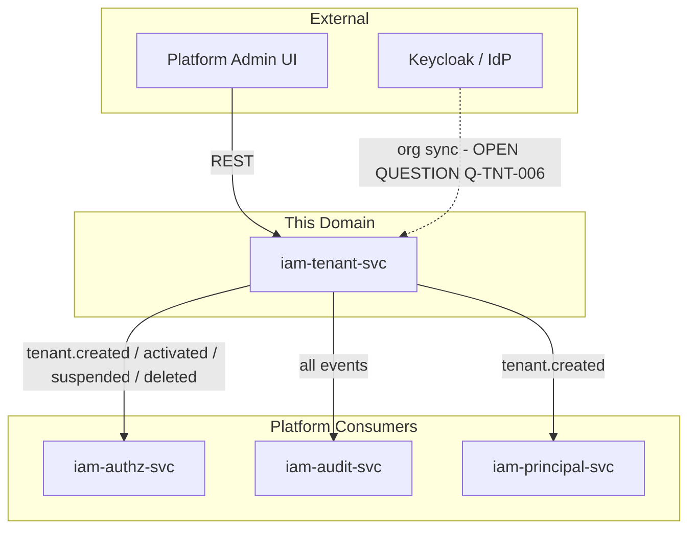
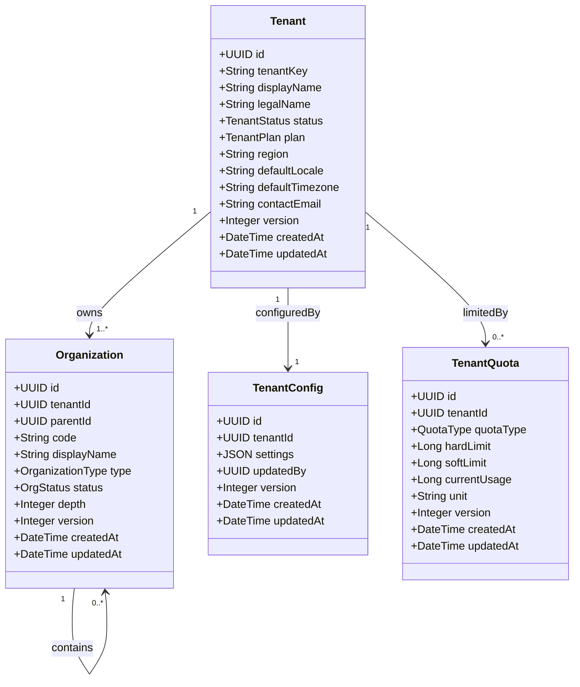
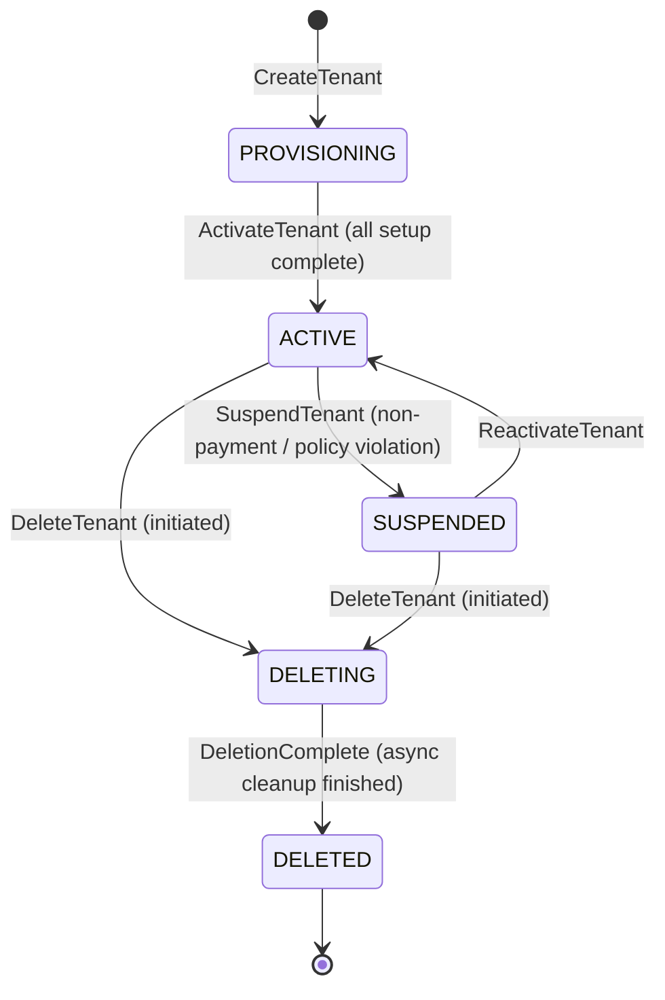
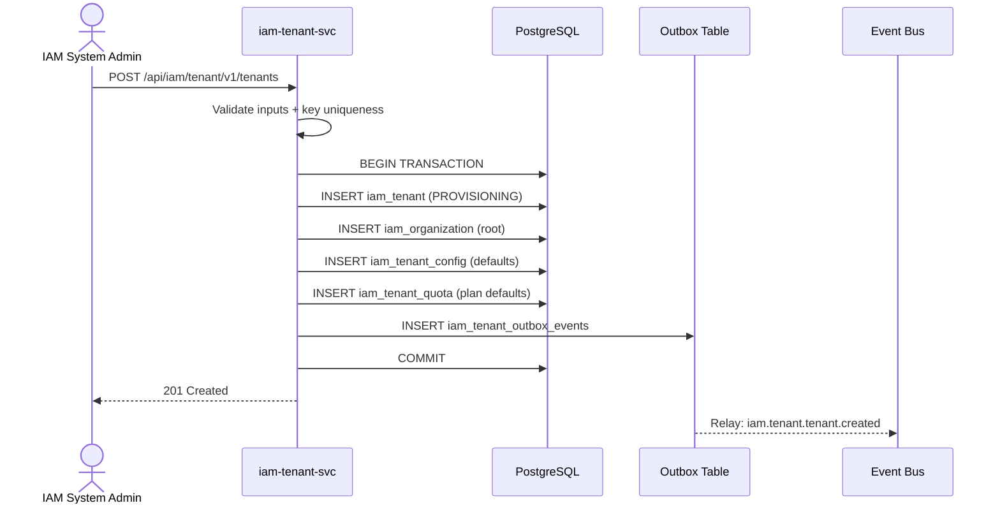
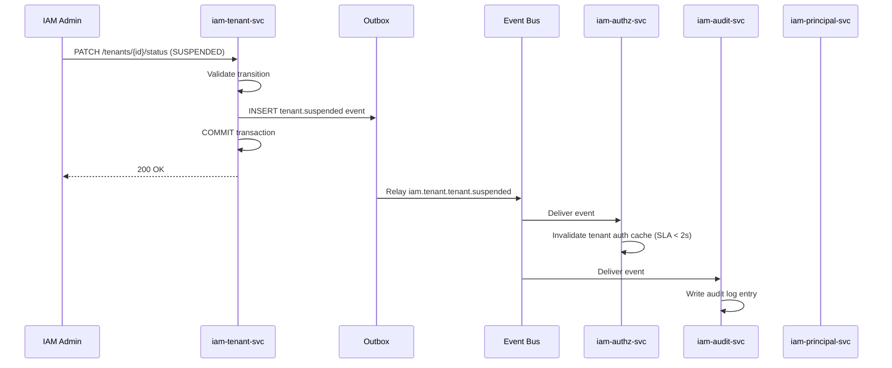

<!-- TEMPLATE COMPLIANCE: ~95%
Template: domain-service-spec.md v1.0.0
Present sections: §0-§15
-->

# iam.tenant — Tenant Management Service Domain Specification

> **Conceptual Stack Layer:** Domain / Service
> **Space:** Platform
> **Owner:** IAM Engineering Team
> **Schema alignment:** `service-layer.schema.json`
> **Companion files:** `contracts/http/iam/tenant/openapi.yaml`, `contracts/events/iam/tenant/*.schema.json`
> **Referenced by:** Platform-Feature Specs (F-IAM-003-xx), BFF Contract
> **Belongs to:** IAM Suite Spec

> **Meta Information**
> - **Version:** 2026-04-03
> - **Template:** `domain-service-spec.md` v1.0.0
> - **Template Compliance:** ~95% — remaining gaps: §5 process flow diagrams (stub), §12.7 extension API endpoints (stub)
> - **Author(s):** OpenLeap Architecture Team
> - **Status:** DRAFT
> - **Suite:** `iam` (Identity & Access Management)
> - **Domain:** `tenant` (Tenant Management)
> - **Bounded Context Ref:** `bc:tenant-management`
> - **Service ID:** `iam-tenant-svc`
> - **basePackage:** `io.openleap.iam.tenant`
> - **API Base Path:** `/api/iam/tenant/v1`
> - **OpenLeap Starter Version:** `v3.0.0`
> - **Port:** `8081`
> - **Repository:** `https://github.com/openleap-io/io.openleap.iam.tenant`
> - **Tags:** `iam`, `tenant`, `platform`
> - **Team:**
>   - Name: `team-iam`
>   - Email: `iam-team@openleap.io`
>   - Slack: `#iam-team`

---

## Specification Guidelines Compliance

> ### Non-Negotiables
> - Never invent facts. If required info is missing, add an **OPEN QUESTION** entry.
> - Preserve intent and decisions. Only change meaning when explicitly requested.
> - Do not remove normative constraints unless they are explicitly replaced.
> - Keep the spec **self-contained**: no "see chat", no implicit context.
>
> ### Source of Truth Priority
> When sources conflict:
> 1. Spec (explicit) wins
> 2. Starter specs (implementation constraints) next
> 3. Guidelines (best practices) last
>
> Record conflicts in the **Decisions & Conflicts** section (see Section 14).
>
> ### Style Guide
> - Prefer short sentences and lists.
> - Use MUST/SHOULD/MAY for normative statements.
> - Keep terminology consistent (Aggregate, Domain Service, Application Service, Command, Event).
> - Avoid ambiguous words ("often", "maybe") unless explicitly noting uncertainty.
> - Keep examples minimal and clearly marked as examples.
> - Do not add implementation code unless the chapter explicitly requires it.

---

## 0. Document Purpose & Scope

### 0.1 Purpose

The Tenant Management Service manages the full lifecycle of tenants, organizational hierarchies, tenant-level configuration, and resource quotas. Every platform request operates within a tenant context resolved from this service. This service is the root isolation boundary: all other domain services reference the tenant identity established here.

### 0.2 Target Audience

- Platform Engineers maintaining multi-tenant infrastructure
- IAM Engineering Team owning this service
- Integration Engineers consuming tenant events
- Security & Compliance teams auditing tenant data

### 0.3 Scope

**In Scope:**
- Tenant lifecycle management (provisioning, activation, suspension, deletion)
- Organizational hierarchy management within a tenant
- Tenant-level configuration storage and retrieval
- Resource quota definition, update, and usage tracking
- Events published on tenant and organization state changes
- Multi-tenancy enforcement (tenant_id on all subordinate entities)

**Out of Scope:**
- Authentication credential validation (Keycloak responsibility)
- Principal (user/service) lifecycle management (`iam-principal-svc`)
- Fine-grained authorization and RBAC evaluation (`iam-authz-svc`)
- Security audit logging (`iam-audit-svc`)
- Business domain data (HR, FI, etc.)
- Infrastructure security: firewalls, OS hardening

### 0.4 Related Documents

- `spec/T1_Platform/iam/_iam_suite.md` — IAM Suite Architecture Specification
- `spec/T1_Platform/iam/domain-specs/iam_principal-spec.md` — Principal Management (downstream consumer)
- `spec/T1_Platform/iam/domain-specs/iam_authz-spec.md` — Authorization Service (consumes tenant.suspended events)
- `spec/T1_Platform/iam/domain-specs/iam_audit-spec.md` — Audit Service (consumes all tenant events)
- `spec/T1_Platform/iam/features/leaves/F-IAM-003-01/feature-spec.md` — Tenant Lifecycle Feature
- `spec/T1_Platform/iam/features/leaves/F-IAM-003-02/feature-spec.md` — Organization Hierarchy Feature
- `spec/T1_Platform/iam/features/leaves/F-IAM-003-03/feature-spec.md` — Tenant Configuration Feature
- `spec/T1_Platform/iam/features/leaves/F-IAM-003-04/feature-spec.md` — Tenant Quotas Feature
- `contracts/http/iam/tenant/openapi.yaml` — REST API contract
- `contracts/events/iam/tenant/` — Event schema contracts

---

## 1. Business Context

### 1.1 Domain Purpose

The Tenant Management domain solves the multi-tenancy isolation challenge: every enterprise customer (tenant) must have a completely isolated operational context on the shared platform. This service provisions and manages that isolation boundary. Without it, no other platform service can correctly scope data, enforce access control, or bill resource usage.

### 1.2 Business Value

- **Customer onboarding:** Automates tenant provisioning, reducing onboarding time from days to minutes.
- **Security isolation:** Guarantees that tenant data is never visible across tenant boundaries.
- **Organizational structure:** Enables customers to mirror their real-world org hierarchy in the platform.
- **Governance & compliance:** Centralized tenant status enforcement means suspended tenants are immediately locked out across all services.
- **Resource governance:** Quota limits prevent individual tenants from degrading platform performance for others.

### 1.3 Key Stakeholders

| Role | Responsibility | Primary Use Cases |
|------|----------------|-------------------|
| IAM System Administrator | Provisions and manages tenants on behalf of platform operations | Tenant Lifecycle (UC-TNT-001–004) |
| Tenant Administrator | Configures their own tenant: org structure, settings, quotas | UC-TNT-007–013 |
| Organization Manager | Manages department/cost-centre hierarchy within a tenant | UC-TNT-007–009 |
| Platform Operations | Monitors quota usage and enforces platform-wide limits | UC-TNT-012–013 |
| Security & Compliance | Audits tenant state changes and configuration history | Consumes published events |

### 1.4 Strategic Positioning

The Tenant Management Service is a **T1 Platform Foundation** service (ADR-001, four-tier layering). It has no dependencies on T2–T4 business domains. All other platform and business services depend on it for tenant context resolution. It is the first service provisioned when a new OpenLeap installation is initialized.

Architecturally it parallels SAP BASIS **CLIENT management** (transaction SCC4/SCC7): a client in SAP is the top-level isolation boundary, and all business data is scoped to a client. Here, the `Tenant` aggregate plays the same role.

### 1.5 Service Context

| Property | Value |
|----------|-------|
| **Suite** | `iam` |
| **Domain** | `tenant` |
| **Bounded Context** | `bc:tenant-management` |
| **Service ID** | `iam-tenant-svc` |
| **Base Package** | `io.openleap.iam.tenant` |

**Responsibilities:**
- Own and enforce the tenant lifecycle state machine (PROVISIONING → ACTIVE → SUSPENDED → DELETING → DELETED)
- Store and serve the authoritative organizational hierarchy for each tenant
- Persist and validate tenant configuration settings
- Track and enforce resource quota limits
- Publish tenant state change events to the IAM event bus

**Authoritative Sources:**

| Source Type | Description | Access Pattern |
|-------------|-------------|----------------|
| REST API | Tenant, Organization, TenantConfig, TenantQuota read/write | Synchronous |
| Database | `iam_tenant`, `iam_organization`, `iam_tenant_config`, `iam_tenant_quota` | Direct (owner) |
| Events | Tenant and organization lifecycle events | Asynchronous (outbox) |



---

## 2. Service Identity

| Property | Value | Schema Field |
|----------|-------|-------------|
| **Service ID** | `iam-tenant-svc` | `metadata.id` |
| **Display Name** | `Tenant Management Service` | `metadata.name` |
| **Suite** | `iam` | `metadata.suite` |
| **Domain** | `tenant` | `metadata.domain` |
| **Bounded Context** | `bc:tenant-management` | `metadata.bounded_context_ref` |
| **Version** | `1.0.0` | `metadata.version` |
| **Status** | DRAFT | `metadata.status` |
| **API Base Path** | `/api/iam/tenant/v1` | `metadata.api_base_path` |
| **Repository** | `https://github.com/openleap-io/io.openleap.iam.tenant` | `metadata.repository` |
| **Tags** | `iam`, `tenant`, `platform` | `metadata.tags` |

**Team:**

| Property | Value |
|----------|-------|
| **Name** | `team-iam` |
| **Email** | `iam-team@openleap.io` |
| **Slack Channel** | `#iam-team` |

---

## 3. Domain Model

### 3.1 Conceptual Overview

The Tenant Management domain is organized around four aggregates:

1. **Tenant** — the root isolation boundary. Every resource in the platform belongs to exactly one tenant.
2. **Organization** — a node in the tenant's organizational hierarchy (company, department, cost centre, team). Forms a tree rooted at a single root org.
3. **TenantConfig** — the tenant's operational configuration document (locale, timezone, security policy, branding). One record per tenant.
4. **TenantQuota** — resource usage limits for a tenant. One record per quota type per tenant.

Tenant is the root aggregate. Organization, TenantConfig, and TenantQuota are subordinate aggregates that require an existing Tenant to be created.

### 3.2 Core Concepts



### 3.3 Aggregate Definitions

#### 3.3.1 Tenant

| Property | Value |
|----------|-------|
| **Aggregate ID** | `agg:tenant` |
| **Name** | `Tenant` |

**Business Purpose:**
The Tenant is the root isolation unit of the entire platform. It represents a customer organization that has contracted to use OpenLeap. All data and operations in the platform are scoped to a tenant. The tenant lifecycle governs platform access: only ACTIVE tenants can execute business operations.

##### Aggregate Root

**Key Attributes:**

| Attribute | Type | Format | Description | Constraints | Required | Read-Only |
|-----------|------|--------|-------------|-------------|----------|-----------|
| id | string | uuid | Unique system-generated identifier | Immutable, generated via `OlUuid.create()` | Yes | Yes |
| tenantKey | string | — | Unique human-readable slug used in URLs and event routing (e.g., `acme-corp`) | Pattern: `^[a-z0-9][a-z0-9-]{1,48}[a-z0-9]$`, max 50 chars, globally unique | Yes | Yes |
| displayName | string | — | Human-readable name for UI display | min 2, max 200 chars | Yes | No |
| legalName | string | — | Full legal entity name used for invoicing and contracts | max 500 chars | No | No |
| status | string | — | Current lifecycle state | enum_ref: `TenantStatus` | Yes | No |
| plan | string | — | Subscription plan tier | enum_ref: `TenantPlan` | Yes | No |
| region | string | — | Deployment region code (e.g., `eu-west-1`) | Must be a valid OpenLeap deployment region | Yes | Yes |
| defaultLocale | string | — | Default locale for tenant users (IETF BCP 47, e.g., `de-DE`) | Must be a supported locale | Yes | No |
| defaultTimezone | string | — | Default timezone for tenant users (IANA tz, e.g., `Europe/Berlin`) | Must be a valid IANA timezone | Yes | No |
| contactEmail | string | email | Primary contact email address for the tenant | Valid RFC 5321 email | Yes | No |
| version | integer | int64 | Optimistic locking counter | min 1 | Yes | Yes |
| createdAt | string | date-time | Timestamp of initial provisioning | ISO-8601 UTC | Yes | Yes |
| updatedAt | string | date-time | Timestamp of last mutation | ISO-8601 UTC | Yes | Yes |

**Lifecycle States:**

| Property | Value |
|----------|-------|
| **Initial State** | `PROVISIONING` |
| **Terminal States** | `DELETED` |



**State Descriptions:**

| State | Description | Business Meaning |
|-------|-------------|------------------|
| PROVISIONING | Tenant record created; setup in progress | Keycloak org being provisioned; admin principal being created; not yet usable |
| ACTIVE | Fully operational | All users can authenticate and use the platform |
| SUSPENDED | Access blocked | All logins denied; data preserved; typically triggered by billing failure or security incident |
| DELETING | Deletion in progress | Data scrubbing started; irreversible; async multi-service cleanup underway |
| DELETED | Permanently removed | Soft-deleted record retained for audit; all PII purged |

**Allowed Transitions:**

| From State | To State | Trigger | Guard / Business Preconditions |
|------------|----------|---------|-------------------------------|
| PROVISIONING | ACTIVE | `ActivateTenant` command | Keycloak organization provisioned; at least one ACTIVE admin principal exists |
| ACTIVE | SUSPENDED | `SuspendTenant` command | Caller has `iam:platform-admin` role |
| SUSPENDED | ACTIVE | `ReactivateTenant` command | Caller has `iam:platform-admin` role; billing issue resolved |
| ACTIVE | DELETING | `DeleteTenant` command | No active SaaS subscriptions; caller has `iam:platform-admin` role |
| SUSPENDED | DELETING | `DeleteTenant` command | Caller has `iam:platform-admin` role |
| DELETING | DELETED | Internal async completion | All subordinate data purged |

**Invariants:**

| Rule ID | Description |
|---------|-------------|
| BR-TNT-001 | `tenantKey` is globally unique and immutable after creation |
| BR-TNT-002 | A tenant cannot be deleted while it has ACTIVE principals |
| BR-TNT-008 | Only allowed state transitions are permitted |

**Domain Events Emitted:**
- `iam.tenant.tenant.created`
- `iam.tenant.tenant.activated`
- `iam.tenant.tenant.suspended`
- `iam.tenant.tenant.deleted`

##### Child Entities

_The Tenant aggregate has no child entities. Organization, TenantConfig, and TenantQuota are modelled as separate aggregates._

##### Value Objects

###### Value Object: TenantRegion

| Property | Value |
|----------|-------|
| **VO ID** | `vo:tenant-region` |
| **Name** | `TenantRegion` |

**Description:** Represents the deployment region for a tenant. Immutable after tenant creation.

**Attributes:**

| Attribute | Type | Format | Description | Constraints |
|-----------|------|--------|-------------|-------------|
| regionCode | string | — | OpenLeap deployment region identifier | Pattern: `^[a-z]{2}-[a-z]+-[0-9]$`, e.g., `eu-west-1` |

**Validation Rules:**
- `regionCode` MUST match a valid OpenLeap deployment region from the platform region registry.
- Region is immutable after tenant creation.

---

#### 3.3.2 Organization

| Property | Value |
|----------|-------|
| **Aggregate ID** | `agg:organization` |
| **Name** | `Organization` |

**Business Purpose:**
An Organization is a node in the tenant's hierarchical structure, modelling real-world org units: holding companies, subsidiaries, departments, cost centres, or teams. Organizations form a tree with exactly one root node (`parentId IS NULL`). They scope principals, roles, and permissions within a tenant.

##### Aggregate Root

**Key Attributes:**

| Attribute | Type | Format | Description | Constraints | Required | Read-Only |
|-----------|------|--------|-------------|-------------|----------|-----------|
| id | string | uuid | Unique system-generated identifier | Immutable, `OlUuid.create()` | Yes | Yes |
| tenantId | string | uuid | Owning tenant identifier | FK to `iam_tenant.id`; immutable | Yes | Yes |
| parentId | string | uuid | Parent organization identifier (NULL for root) | FK to `iam_organization.id`; NULL for root node | No | No |
| code | string | — | Short alphanumeric code unique within tenant | Pattern: `^[A-Z0-9_]{2,20}$` | Yes | No |
| displayName | string | — | Human-readable name | min 2, max 200 chars | Yes | No |
| type | string | — | Organization type classification | enum_ref: `OrganizationType` | Yes | No |
| status | string | — | Operational status | enum_ref: `OrgStatus` | Yes | No |
| depth | integer | int32 | Tree depth (root = 0); computed | min 0, max 10; read-only | Yes | Yes |
| version | integer | int64 | Optimistic locking counter | min 1 | Yes | Yes |
| createdAt | string | date-time | Creation timestamp | ISO-8601 UTC | Yes | Yes |
| updatedAt | string | date-time | Last update timestamp | ISO-8601 UTC | Yes | Yes |

**Lifecycle States:**

| State | Description | Business Meaning |
|-------|-------------|------------------|
| ACTIVE | Operational | Org unit available for assignment to principals and roles |
| INACTIVE | Disabled | Org unit not usable; principals cannot be newly assigned to it |

**Allowed Transitions:**

| From State | To State | Trigger | Guard / Business Preconditions |
|------------|----------|---------|-------------------------------|
| ACTIVE | INACTIVE | `DeactivateOrganization` | No active child organizations; no active principals scoped exclusively to this org |
| INACTIVE | ACTIVE | `ActivateOrganization` | Parent organization is ACTIVE |

**Invariants:**

| Rule ID | Description |
|---------|-------------|
| BR-TNT-003 | Each tenant has exactly one root organization (parentId IS NULL) |
| BR-TNT-004 | Setting parentId MUST NOT create a cycle in the hierarchy |
| BR-TNT-010 | Organization depth MUST NOT exceed 10 levels |

**Domain Events Emitted:**
- `iam.tenant.organization.created`
- `iam.tenant.organization.updated`

##### Child Entities

_Organization has no child entities._

##### Value Objects

_Organization has no value objects._

---

#### 3.3.3 TenantConfig

| Property | Value |
|----------|-------|
| **Aggregate ID** | `agg:tenant-config` |
| **Name** | `TenantConfig` |

**Business Purpose:**
TenantConfig stores the operational configuration for a tenant as a single structured document. It controls platform behavior for all users within the tenant: security policies, locale defaults, branding, and feature flags. One TenantConfig record exists per tenant (1:1 relationship, created during tenant provisioning).

##### Aggregate Root

**Key Attributes:**

| Attribute | Type | Format | Description | Constraints | Required | Read-Only |
|-----------|------|--------|-------------|-------------|----------|-----------|
| id | string | uuid | Unique identifier | Immutable, `OlUuid.create()` | Yes | Yes |
| tenantId | string | uuid | Owning tenant identifier | FK to `iam_tenant.id`; unique; immutable | Yes | Yes |
| settings | object | — | Configuration key-value map (JSONB) | Keys must be from the ConfigKey registry (see §4.4) | Yes | No |
| updatedBy | string | uuid | Principal ID that last updated this config | FK to principal | Yes | Yes |
| version | integer | int64 | Optimistic locking counter | min 1 | Yes | Yes |
| createdAt | string | date-time | Creation timestamp | ISO-8601 UTC | Yes | Yes |
| updatedAt | string | date-time | Last update timestamp | ISO-8601 UTC | Yes | Yes |

**Known Settings Keys:**

| Key | Type | Default | Description | Constraints |
|-----|------|---------|-------------|-------------|
| `defaultLocale` | string | `en-US` | IETF BCP 47 locale | Must be in supported locale list |
| `defaultTimezone` | string | `UTC` | IANA timezone identifier | Must be a valid IANA tz |
| `sessionTimeoutMinutes` | integer | 480 | User session idle timeout | min 5, max 1440 |
| `mfaRequired` | boolean | false | Enforce MFA for all users | — |
| `maxLoginAttempts` | integer | 5 | Failed login lockout threshold | min 3, max 20 |
| `passwordPolicyId` | string | `default` | Reference to Keycloak password policy | Must exist in IdP |
| `ssoEnabled` | boolean | false | Enable SSO via external IdP | — |
| `ssoProviderId` | string | — | Keycloak IdP alias for SSO | Required if ssoEnabled = true |
| `brandingLogoUrl` | string | — | URL of tenant logo | Valid URI, max 2000 chars |
| `brandingPrimaryColor` | string | — | Brand primary color | Pattern: `^#[0-9A-Fa-f]{6}$` |
| `allowedIpRanges` | array | `[]` | CIDR blocks permitted to authenticate | Valid CIDR notation; empty = unrestricted |
| `dataRetentionDays` | integer | 2555 | Default data retention period (~7 years) | min 365, max 3650 |

**Invariants:**

| Rule ID | Description |
|---------|-------------|
| BR-TNT-007 | Only predefined config keys from the ConfigKey registry are accepted |
| BR-TNT-009 | If `ssoEnabled` is true, `ssoProviderId` MUST be present |

**Domain Events Emitted:**
- `iam.tenant.settings.updated`

---

#### 3.3.4 TenantQuota

| Property | Value |
|----------|-------|
| **Aggregate ID** | `agg:tenant-quota` |
| **Name** | `TenantQuota` |

**Business Purpose:**
TenantQuota defines resource limits for a tenant to prevent overconsumption and ensure fair platform resource distribution. Each quota type has a hard limit (absolute cap) and soft limit (warning threshold). Current usage is tracked for real-time enforcement.

##### Aggregate Root

**Key Attributes:**

| Attribute | Type | Format | Description | Constraints | Required | Read-Only |
|-----------|------|--------|-------------|-------------|----------|-----------|
| id | string | uuid | Unique identifier | Immutable, `OlUuid.create()` | Yes | Yes |
| tenantId | string | uuid | Owning tenant | FK to `iam_tenant.id`; immutable | Yes | Yes |
| quotaType | string | — | Resource type being limited | enum_ref: `QuotaType`; unique per tenant | Yes | Yes |
| hardLimit | integer | int64 | Absolute maximum; operations exceeding this are rejected | min 1 | Yes | No |
| softLimit | integer | int64 | Warning threshold (typically 80% of hardLimit) | min 0, max = hardLimit | Yes | No |
| currentUsage | integer | int64 | Current measured usage; system-managed | min 0; read-only | Yes | Yes |
| unit | string | — | Unit of measurement (e.g., `users`, `GB`, `req/hr`) | max 30 chars | Yes | Yes |
| version | integer | int64 | Optimistic locking counter | min 1 | Yes | Yes |
| createdAt | string | date-time | Creation timestamp | ISO-8601 UTC | Yes | Yes |
| updatedAt | string | date-time | Last update timestamp | ISO-8601 UTC | Yes | Yes |

**Invariants:**

| Rule ID | Description |
|---------|-------------|
| BR-TNT-005 | Operations that would cause `currentUsage` to exceed `hardLimit` MUST be rejected with HTTP 429 |
| BR-TNT-011 | `softLimit` MUST be ≤ `hardLimit` |
| BR-TNT-012 | `hardLimit` MUST NOT be reduced below `currentUsage` |

**Domain Events Emitted:**
_No integration events. Quota changes are synchronous operations. Threshold breach notifications are internal._

> OPEN QUESTION: See Q-TNT-002 in §14.3 — how is `currentUsage` incremented by domain services?

### 3.4 Enumerations

#### TenantStatus

**Description:** Lifecycle states of a Tenant aggregate.

| Value | Description | Deprecated |
|-------|-------------|------------|
| `PROVISIONING` | Tenant created but setup not yet complete; not usable | No |
| `ACTIVE` | Fully operational; all users can authenticate | No |
| `SUSPENDED` | All logins denied; data preserved; typically billing or security trigger | No |
| `DELETING` | Async deletion in progress; irreversible | No |
| `DELETED` | All PII purged; soft-deleted record retained for audit trail | No |

#### TenantPlan

**Description:** Subscription plan tier determining feature access and default quota levels.

| Value | Description | Deprecated |
|-------|-------------|------------|
| `FREE` | Free tier; limited quota; community support | No |
| `STARTER` | Small teams; entry-level quota; email support | No |
| `PROFESSIONAL` | Mid-market; standard quota; SLA support | No |
| `ENTERPRISE` | Enterprise; custom quota; dedicated support | No |

#### OrganizationType

**Description:** Classification of an organization node in the hierarchy.

| Value | Description | Deprecated |
|-------|-------------|------------|
| `COMPANY` | Legal entity (holding or subsidiary) | No |
| `DEPARTMENT` | Internal business unit or division | No |
| `COST_CENTER` | Financial accountability unit | No |
| `SUBSIDIARY` | A subsidiary legal entity under the root company | No |
| `REGION` | Geographic region organizational grouping | No |
| `TEAM` | Small operational team or squad | No |

#### OrgStatus

**Description:** Operational status of an Organization node.

| Value | Description | Deprecated |
|-------|-------------|------------|
| `ACTIVE` | Organization is usable; principals can be assigned | No |
| `INACTIVE` | Organization disabled; no new assignments | No |

#### QuotaType

**Description:** Types of resources subject to quota enforcement.

| Value | Description | Deprecated |
|-------|-------------|------------|
| `MAX_USERS` | Maximum number of HUMAN principal accounts | No |
| `MAX_STORAGE_GB` | Maximum data storage in gigabytes | No |
| `MAX_API_CALLS_PER_HOUR` | Maximum API requests per hour (rate limiting) | No |
| `MAX_ORGANIZATIONS` | Maximum number of Organization nodes | No |
| `MAX_ROLES` | Maximum number of custom roles | No |
| `MAX_CUSTOM_FIELDS` | Maximum number of custom field definitions | No |

### 3.5 Shared Types

#### ContactEmail

| Property | Value |
|----------|-------|
| **Type ID** | `type:contact-email` |
| **Name** | `ContactEmail` |

**Description:** RFC 5321-compliant email address used for tenant contact and notification routing.

**Attributes:**

| Attribute | Type | Format | Description | Constraints |
|-----------|------|--------|-------------|-------------|
| value | string | email | Email address string | Pattern: RFC 5321; max 254 chars |

**Validation Rules:**
- MUST conform to RFC 5321 email format.
- MUST NOT be a disposable/temporary email domain.

**Used By:**
- `agg:tenant`

---

## 4. Business Rules & Constraints

### 4.1 Business Rules Catalog

| ID | Rule Name | Description | Scope | Enforcement | Error Code |
|----|-----------|-------------|-------|-------------|------------|
| BR-TNT-001 | Tenant Key Uniqueness | `tenantKey` must be globally unique and immutable | Tenant | Create | `TNT_KEY_CONFLICT` |
| BR-TNT-002 | Active Principal Dependency | Tenant cannot be deleted while it has ACTIVE principals | Tenant | Delete | `TNT_HAS_ACTIVE_PRINCIPALS` |
| BR-TNT-003 | Single Root Organization | Each tenant must have exactly one root organization | Organization | Create | `TNT_ROOT_ORG_EXISTS` |
| BR-TNT-004 | Acyclic Hierarchy | Organization parentId must not create a cycle | Organization | Create/Update | `ORG_CYCLE_DETECTED` |
| BR-TNT-005 | Quota Enforcement | Operations exceeding hard quota limit are rejected | TenantQuota | Any resource-consuming op | `TNT_QUOTA_EXCEEDED` |
| BR-TNT-006 | Suspended Tenant Lockout | All service operations for a SUSPENDED tenant return 403 | Tenant | All operations | `TNT_SUSPENDED` |
| BR-TNT-007 | Config Key Registry | Only predefined config keys are accepted | TenantConfig | Update | `TNT_UNKNOWN_CONFIG_KEY` |
| BR-TNT-008 | Status Transition Guard | Only allowed state machine transitions are permitted | Tenant | Status change | `TNT_INVALID_TRANSITION` |
| BR-TNT-009 | SSO Provider Required | If ssoEnabled = true, ssoProviderId must be set | TenantConfig | Update | `TNT_SSO_PROVIDER_MISSING` |
| BR-TNT-010 | Max Hierarchy Depth | Organization tree depth must not exceed 10 levels | Organization | Create | `ORG_MAX_DEPTH_EXCEEDED` |
| BR-TNT-011 | Soft Limit ≤ Hard Limit | softLimit must not exceed hardLimit | TenantQuota | Create/Update | `TNT_SOFT_LIMIT_EXCEEDS_HARD` |
| BR-TNT-012 | Quota Reduction Guard | hardLimit must not be reduced below currentUsage | TenantQuota | Update | `TNT_QUOTA_BELOW_USAGE` |

### 4.2 Detailed Rule Definitions

#### BR-TNT-001: Tenant Key Uniqueness

**Business Context:**
The `tenantKey` is used in API paths, event routing keys, and external references (e.g., SSO redirects). Duplicate keys would break routing and cause cross-tenant data leakage.

**Rule Statement:**
No two tenants may share the same `tenantKey`. Once assigned, `tenantKey` is immutable for the lifetime of the tenant record.

**Applies To:**
- Aggregate: Tenant
- Operations: Create

**Enforcement:**
Database unique constraint `uk_iam_tenant_key` on `iam_tenant.tenant_key`. Application-level check returns 409 before DB insert.

**Validation Logic:**
Before persisting a new Tenant, query `iam_tenant WHERE tenant_key = :key`. If any row exists (regardless of status, including DELETED), reject the request.

**Error Handling:**
- **Error Code:** `TNT_KEY_CONFLICT`
- **Error Message:** "The tenant key '{key}' is already in use. Choose a unique key."
- **User action:** Provide a different `tenantKey` value.

**Examples:**
- **Valid:** Creating tenant with `tenantKey = "acme-corp"` when no tenant with that key exists.
- **Invalid:** Creating tenant with `tenantKey = "acme-corp"` when a DELETED tenant with that key still exists in the archive.

---

#### BR-TNT-002: Active Principal Dependency

**Business Context:**
Deleting a tenant while principals are still active would orphan user accounts, leaving Keycloak users with no platform context and potentially exposing security gaps.

**Rule Statement:**
A tenant MUST NOT transition to DELETING state if any principal associated with this tenant has status = ACTIVE.

**Applies To:**
- Aggregate: Tenant
- Operations: Delete (status transition to DELETING)

**Enforcement:**
Application Service queries `iam-principal-svc` for active principals before issuing the `DeleteTenant` command.

**Validation Logic:**
Call `GET /api/iam/principal/v1/principals?tenantId={id}&status=ACTIVE&size=1`. If `totalElements > 0`, reject.

**Error Handling:**
- **Error Code:** `TNT_HAS_ACTIVE_PRINCIPALS`
- **Error Message:** "Tenant cannot be deleted while it has {count} active principal(s). Deactivate all principals first."
- **User action:** Deactivate all principals in the tenant before deleting.

**Examples:**
- **Valid:** Deleting a tenant that has only DELETED or INACTIVE principals.
- **Invalid:** Deleting a tenant with 5 ACTIVE user accounts.

---

#### BR-TNT-003: Single Root Organization

**Business Context:**
The organizational hierarchy requires exactly one root node for unambiguous tree traversal and permission inheritance.

**Rule Statement:**
Each tenant MUST have exactly one Organization record where `parentId IS NULL`. Attempting to create a second root organization for the same tenant MUST be rejected.

**Applies To:**
- Aggregate: Organization
- Operations: Create

**Enforcement:**
Database unique partial index `uk_iam_org_tenant_root` on `(tenant_id) WHERE parent_id IS NULL`.

**Validation Logic:**
Check if any organization exists for `tenant_id` with `parent_id IS NULL`. If yes, and the new org has `parentId = null`, reject.

**Error Handling:**
- **Error Code:** `TNT_ROOT_ORG_EXISTS`
- **Error Message:** "Tenant already has a root organization. Provide a parentId for the new organization."
- **User action:** Provide a `parentId` to add the organization under an existing node.

**Examples:**
- **Valid:** Creating a child organization with `parentId = {existing-org-id}`.
- **Invalid:** Creating a second organization with `parentId = null` for the same tenant.

---

#### BR-TNT-004: Acyclic Hierarchy

**Business Context:**
A cycle in the organization tree (e.g., A → B → A) would cause infinite loops in tree traversal, permission inheritance calculations, and reporting.

**Rule Statement:**
When updating an Organization's `parentId`, the new parent MUST NOT be a descendant of the organization being updated.

**Applies To:**
- Aggregate: Organization
- Operations: Update (parentId change)

**Enforcement:**
Application-level recursive ancestor check before persisting the parentId update.

**Validation Logic:**
Starting from the proposed new `parentId`, walk up the tree. If any ancestor equals the organization being updated, reject.

**Error Handling:**
- **Error Code:** `ORG_CYCLE_DETECTED`
- **Error Message:** "The proposed parent organization would create a cycle in the hierarchy."
- **User action:** Choose a parent that is not a descendant of the current organization.

**Examples:**
- **Valid:** Moving department B (child of A) to be a child of department C (sibling of A).
- **Invalid:** Moving department A to be a child of department B, where B is already a child of A.

---

#### BR-TNT-005: Quota Enforcement

**Business Context:**
Resource quotas prevent individual tenants from monopolizing shared platform infrastructure, ensuring fair multi-tenant operation.

**Rule Statement:**
Any operation that would cause `currentUsage` to exceed `hardLimit` for any `QuotaType` MUST be rejected.

**Applies To:**
- Aggregate: TenantQuota
- Operations: All resource-consuming operations across the platform

**Enforcement:**
Platform services MUST check tenant quota before creating resources. `iam-tenant-svc` exposes quota check endpoint. Quota check MUST be idempotent.

**Validation Logic:**
Before creating a resource of type T: call `GET /api/iam/tenant/v1/tenants/{tenantId}/quotas/usage?type=T`. If `currentUsage >= hardLimit`, reject.

**Error Handling:**
- **Error Code:** `TNT_QUOTA_EXCEEDED`
- **Error Message:** "Quota limit exceeded for {quotaType}: current usage {current} equals hard limit {limit} {unit}."
- **User action:** Contact platform administrator to increase quota, or remove unused resources.

**Examples:**
- **Valid:** Adding the 49th user when `MAX_USERS` hard limit is 50.
- **Invalid:** Adding the 51st user when `MAX_USERS` hard limit is 50 and current usage is 50.

---

#### BR-TNT-006: Suspended Tenant Lockout

**Business Context:**
Suspension is a complete access lockout for non-payment, policy violation, or security incident response. It must be enforced uniformly across all services.

**Rule Statement:**
When a tenant has status = SUSPENDED, all write operations (and optionally read operations) for that tenant MUST return HTTP 403 with error code `TNT_SUSPENDED`.

**Applies To:**
- Aggregate: Tenant
- Operations: All operations on any resource within the tenant

**Enforcement:**
The `iam-authz-svc` caches tenant status. All incoming requests pass through authorization middleware that checks tenant status. `iam-tenant-svc` publishes `tenant.suspended` event; `iam-authz-svc` invalidates the tenant's policy cache on receipt.

**Error Handling:**
- **Error Code:** `TNT_SUSPENDED`
- **Error Message:** "Access to tenant '{tenantKey}' is suspended. Contact your account administrator."
- **User action:** Contact platform support to resolve the suspension.

**Examples:**
- **Valid:** A read request from an ACTIVE tenant proceeds normally.
- **Invalid:** Any write request from a SUSPENDED tenant is rejected with 403.

---

#### BR-TNT-007: Config Key Registry

**Business Context:**
Unrestricted configuration keys would make tenant config unvalidatable and could introduce security-relevant settings outside the governance model.

**Rule Statement:**
Only config keys defined in the ConfigKey registry (see §4.4) are accepted. Unknown keys MUST be rejected.

**Applies To:**
- Aggregate: TenantConfig
- Operations: Update

**Error Handling:**
- **Error Code:** `TNT_UNKNOWN_CONFIG_KEY`
- **Error Message:** "Unknown config key: '{key}'. Allowed keys: [{list}]."
- **User action:** Remove unknown keys from the request body.

---

#### BR-TNT-008: Status Transition Guard

**Business Context:**
The Tenant lifecycle is a state machine. Skipping states (e.g., PROVISIONING → SUSPENDED) or revisiting terminal states would put the system in an inconsistent state.

**Rule Statement:**
Tenant status transitions MUST follow the allowed transition table in §3.3.1. Any transition not listed in the table MUST be rejected.

**Applies To:**
- Aggregate: Tenant
- Operations: Status change commands (Activate, Suspend, Reactivate, Delete)

**Error Handling:**
- **Error Code:** `TNT_INVALID_TRANSITION`
- **Error Message:** "Cannot transition tenant from {current} to {target}. Allowed transitions from {current}: {allowed}."
- **User action:** Verify the current tenant status and use the correct command.

---

### 4.3 Data Validation Rules

**Field-Level Validations:**

| Field | Validation Rule | Error Message |
|-------|----------------|---------------|
| Tenant.tenantKey | Required, pattern `^[a-z0-9][a-z0-9-]{1,48}[a-z0-9]$` | "tenantKey must be 3-50 lowercase alphanumeric characters and hyphens, not starting or ending with a hyphen" |
| Tenant.displayName | Required, min 2, max 200 chars | "displayName is required and must be between 2 and 200 characters" |
| Tenant.legalName | Optional, max 500 chars | "legalName cannot exceed 500 characters" |
| Tenant.contactEmail | Required, valid email (RFC 5321) | "contactEmail must be a valid email address" |
| Tenant.defaultLocale | Required, IETF BCP 47 | "defaultLocale must be a valid BCP 47 locale code (e.g., de-DE, en-US)" |
| Tenant.defaultTimezone | Required, IANA tz | "defaultTimezone must be a valid IANA timezone (e.g., Europe/Berlin)" |
| Organization.code | Required, pattern `^[A-Z0-9_]{2,20}$` | "code must be 2-20 uppercase alphanumeric characters or underscores" |
| Organization.displayName | Required, min 2, max 200 | "displayName is required and must be between 2 and 200 characters" |
| TenantQuota.softLimit | Required, 0 ≤ softLimit ≤ hardLimit | "softLimit must be between 0 and hardLimit" |
| TenantQuota.hardLimit | Required, min 1 | "hardLimit must be at least 1" |
| TenantConfig.settings.sessionTimeoutMinutes | 5–1440 | "sessionTimeoutMinutes must be between 5 and 1440" |
| TenantConfig.settings.maxLoginAttempts | 3–20 | "maxLoginAttempts must be between 3 and 20" |
| TenantConfig.settings.dataRetentionDays | 365–3650 | "dataRetentionDays must be between 365 and 3650" |

**Cross-Field Validations:**
- If `TenantConfig.settings.ssoEnabled = true`, then `ssoProviderId` MUST be present and non-empty.
- `Organization.depth` is computed: it must equal `parent.depth + 1`. Client-provided depth values are ignored.
- `TenantQuota.softLimit` MUST be ≤ `TenantQuota.hardLimit` (BR-TNT-011).

### 4.4 Reference Data Dependencies

| Catalog | Source Service | Fields Referencing | Validation |
|---------|----------------|-------------------|------------|
| Supported Locales | `iam-tenant-svc` (internal registry) | `Tenant.defaultLocale`, `TenantConfig.settings.defaultLocale` | Must be in the platform's supported locale list |
| IANA Timezones | `iam-tenant-svc` (bundled IANA db) | `Tenant.defaultTimezone`, `TenantConfig.settings.defaultTimezone` | Must be a valid IANA tz identifier |
| Deployment Regions | Platform configuration (env-level) | `Tenant.region` | Must match a valid deployment region code |
| ConfigKey Registry | `iam-tenant-svc` (internal enum) | `TenantConfig.settings` (keys) | Only registered keys accepted |
| Keycloak IdP Aliases | Keycloak admin API | `TenantConfig.settings.ssoProviderId` | Must exist as an active IdP alias in Keycloak |

---

## 5. Use Cases

### 5.1 Business Logic Placement

| Logic Type | Placement | Examples |
|------------|-----------|----------|
| Aggregate invariants | Domain Object | `tenantKey` uniqueness check, state transition validation, cycle detection in org hierarchy |
| Cross-aggregate logic | Domain Service | Validate that all orgs are inactive before tenant deletion; quota pre-check |
| Orchestration & transactions | Application Service | `CreateTenantUseCase` (creates Tenant + root Organization + TenantConfig + default Quotas), event publishing |

### 5.2 Use Cases (Canonical Format)

#### UC-TNT-001: CreateTenant

| Field | Value |
|-------|-------|
| **id** | `CreateTenant` |
| **type** | WRITE |
| **trigger** | REST |
| **aggregate** | `Tenant` |
| **domainOperation** | `Tenant.provision()` |
| **inputs** | `tenantKey: String`, `displayName: String`, `legalName: String?`, `plan: TenantPlan`, `region: String`, `defaultLocale: String`, `defaultTimezone: String`, `contactEmail: String` |
| **outputs** | `tenantId: UUID`, `status: TenantStatus` |
| **events** | `iam.tenant.tenant.created` |
| **rest** | `POST /api/iam/tenant/v1/tenants` |
| **idempotency** | optional (idempotency key header) |
| **errors** | `TNT_KEY_CONFLICT`: tenantKey already exists, `400`: validation failure |

**Actor:** IAM System Administrator

**Preconditions:**
- Caller has `iam:platform-admin` role.
- No tenant with the same `tenantKey` exists (including DELETED tenants).
- `region` is a valid OpenLeap deployment region.

**Main Flow:**
1. Actor submits tenant creation request via POST.
2. System validates all fields and uniqueness of `tenantKey`.
3. System creates Tenant in PROVISIONING state.
4. System creates default root Organization (`type=COMPANY`, `code=ROOT`, `parentId=null`).
5. System creates TenantConfig with platform defaults.
6. System creates default TenantQuota entries for all QuotaTypes based on the selected `plan`.
7. System publishes `iam.tenant.tenant.created` event via outbox.
8. System returns 201 Created with tenant ID and PROVISIONING status.

**Postconditions:**
- Tenant is in PROVISIONING state.
- Root organization, TenantConfig, and TenantQuota records exist.
- `iam-principal-svc` receives the `tenant.created` event to initialize the admin principal workflow.

**Business Rules Applied:**
- BR-TNT-001: Tenant key uniqueness.
- BR-TNT-008: Status initialized to PROVISIONING.

**Alternative Flows:**
- **Alt-1:** If `plan` defaults should automatically derive quota limits, the Application Service resolves plan defaults from a plan-quota mapping.

**Exception Flows:**
- **Exc-1:** `tenantKey` already exists → 409 Conflict with `TNT_KEY_CONFLICT`.
- **Exc-2:** Invalid `region` → 422 Unprocessable Entity.
- **Exc-3:** Duplicate request with same idempotency key within 24 hours → return original 201 response.

---

#### UC-TNT-002: ActivateTenant

| Field | Value |
|-------|-------|
| **id** | `ActivateTenant` |
| **type** | WRITE |
| **trigger** | REST |
| **aggregate** | `Tenant` |
| **domainOperation** | `Tenant.activate()` |
| **inputs** | `tenantId: UUID` |
| **outputs** | `status: TenantStatus` |
| **events** | `iam.tenant.tenant.activated` |
| **rest** | `PATCH /api/iam/tenant/v1/tenants/{id}/status` |
| **idempotency** | required |
| **errors** | `TNT_INVALID_TRANSITION`: already ACTIVE or not in PROVISIONING, `404`: not found |

**Actor:** IAM System Administrator

**Preconditions:**
- Tenant is in PROVISIONING state.
- Keycloak organization for this tenant has been provisioned (external dependency).
- At least one ACTIVE admin principal exists for this tenant.

**Main Flow:**
1. Actor sends PATCH request with `status: ACTIVE`.
2. System validates current state is PROVISIONING.
3. System transitions Tenant to ACTIVE.
4. System publishes `iam.tenant.tenant.activated` event.
5. System returns 200 OK with updated tenant.

**Postconditions:**
- Tenant is ACTIVE; users can authenticate.

**Business Rules Applied:**
- BR-TNT-008: Only PROVISIONING → ACTIVE transition allowed via this command.

**Exception Flows:**
- **Exc-1:** Tenant not in PROVISIONING → 422 with `TNT_INVALID_TRANSITION`.

---

#### UC-TNT-003: SuspendTenant

| Field | Value |
|-------|-------|
| **id** | `SuspendTenant` |
| **type** | WRITE |
| **trigger** | REST |
| **aggregate** | `Tenant` |
| **domainOperation** | `Tenant.suspend()` |
| **inputs** | `tenantId: UUID`, `reason: String` |
| **outputs** | `status: TenantStatus` |
| **events** | `iam.tenant.tenant.suspended` |
| **rest** | `PATCH /api/iam/tenant/v1/tenants/{id}/status` |
| **idempotency** | required |
| **errors** | `TNT_INVALID_TRANSITION`, `404` |

**Actor:** IAM System Administrator

**Preconditions:**
- Tenant is in ACTIVE state.

**Main Flow:**
1. Actor sends PATCH request with `status: SUSPENDED` and suspension `reason`.
2. System validates current state is ACTIVE.
3. System transitions Tenant to SUSPENDED.
4. System publishes `iam.tenant.tenant.suspended` event.
5. `iam-authz-svc` receives event and invalidates authorization cache for this tenant.
6. System returns 200 OK.

**Postconditions:**
- Tenant is SUSPENDED; all subsequent API requests for this tenant return 403.

---

#### UC-TNT-004: DeleteTenant

| Field | Value |
|-------|-------|
| **id** | `DeleteTenant` |
| **type** | WRITE |
| **trigger** | REST |
| **aggregate** | `Tenant` |
| **domainOperation** | `Tenant.delete()` |
| **inputs** | `tenantId: UUID` |
| **outputs** | `status: TenantStatus` |
| **events** | `iam.tenant.tenant.deleted` |
| **rest** | `DELETE /api/iam/tenant/v1/tenants/{id}` |
| **idempotency** | required |
| **errors** | `TNT_HAS_ACTIVE_PRINCIPALS`, `TNT_INVALID_TRANSITION`, `404` |

**Actor:** IAM System Administrator

**Preconditions:**
- Tenant is in ACTIVE or SUSPENDED state.
- No active principals exist for this tenant (BR-TNT-002).

**Main Flow:**
1. Actor sends DELETE request.
2. System validates no active principals exist (cross-service check).
3. System transitions Tenant to DELETING.
4. System publishes `iam.tenant.tenant.deleted` event.
5. Async cleanup begins (data scrubbing saga — see §5.4).
6. Returns 202 Accepted (deletion is async).

**Postconditions:**
- Tenant is in DELETING; data cleanup in progress.

---

#### UC-TNT-005: GetTenant

| Field | Value |
|-------|-------|
| **id** | `GetTenant` |
| **type** | READ |
| **trigger** | REST |
| **aggregate** | `Tenant` |
| **domainOperation** | `findTenantById` |
| **inputs** | `tenantId: UUID` |
| **outputs** | `TenantReadModel` |
| **rest** | `GET /api/iam/tenant/v1/tenants/{id}` |
| **idempotency** | none |
| **errors** | `404`: not found |

**Actor:** IAM System Administrator, Tenant Administrator

**Main Flow:**
1. Actor requests tenant by ID.
2. System fetches read model from cache or database.
3. System returns 200 OK with tenant data.

---

#### UC-TNT-006: ListTenants

| Field | Value |
|-------|-------|
| **id** | `ListTenants` |
| **type** | READ |
| **trigger** | REST |
| **aggregate** | `Tenant` |
| **domainOperation** | `findTenants` |
| **inputs** | `status?: TenantStatus`, `plan?: TenantPlan`, `page: int`, `size: int` |
| **outputs** | `Page<TenantSummaryReadModel>` |
| **rest** | `GET /api/iam/tenant/v1/tenants` |
| **idempotency** | none |
| **errors** | — |

**Actor:** IAM System Administrator (platform admin context; not tenant-scoped)

---

#### UC-TNT-007: CreateOrganization

| Field | Value |
|-------|-------|
| **id** | `CreateOrganization` |
| **type** | WRITE |
| **trigger** | REST |
| **aggregate** | `Organization` |
| **domainOperation** | `Organization.create()` |
| **inputs** | `tenantId: UUID`, `parentId: UUID?`, `code: String`, `displayName: String`, `type: OrganizationType` |
| **outputs** | `organizationId: UUID` |
| **events** | `iam.tenant.organization.created` |
| **rest** | `POST /api/iam/tenant/v1/tenants/{tenantId}/organizations` |
| **idempotency** | optional |
| **errors** | `TNT_ROOT_ORG_EXISTS`, `ORG_CYCLE_DETECTED`, `ORG_MAX_DEPTH_EXCEEDED`, `404` |

**Actor:** Tenant Administrator

**Preconditions:**
- Tenant is in ACTIVE state.
- If `parentId` is provided, the parent organization exists and is ACTIVE.

**Main Flow:**
1. System validates tenant is ACTIVE.
2. System computes depth as `parent.depth + 1` (0 for root).
3. System validates BR-TNT-003, BR-TNT-004, BR-TNT-010.
4. System creates Organization.
5. System publishes `iam.tenant.organization.created`.
6. Returns 201 Created.

---

#### UC-TNT-008: ListOrganizations

| Field | Value |
|-------|-------|
| **id** | `ListOrganizations` |
| **type** | READ |
| **trigger** | REST |
| **aggregate** | `Organization` |
| **domainOperation** | `findOrganizationsByTenant` |
| **inputs** | `tenantId: UUID`, `status?: OrgStatus`, `page: int`, `size: int` |
| **outputs** | `Page<OrganizationReadModel>` |
| **rest** | `GET /api/iam/tenant/v1/tenants/{tenantId}/organizations` |
| **idempotency** | none |
| **errors** | `404` |

---

#### UC-TNT-009: UpdateTenantConfig

| Field | Value |
|-------|-------|
| **id** | `UpdateTenantConfig` |
| **type** | WRITE |
| **trigger** | REST |
| **aggregate** | `TenantConfig` |
| **domainOperation** | `TenantConfig.update()` |
| **inputs** | `tenantId: UUID`, `settings: Map<ConfigKey, Any>`, `If-Match: ETag` |
| **outputs** | `TenantConfigReadModel` |
| **events** | `iam.tenant.settings.updated` |
| **rest** | `PUT /api/iam/tenant/v1/tenants/{tenantId}/config` |
| **idempotency** | required (ETag-based) |
| **errors** | `TNT_UNKNOWN_CONFIG_KEY`, `TNT_SSO_PROVIDER_MISSING`, `412 Precondition Failed`, `404` |

**Actor:** Tenant Administrator

**Preconditions:**
- Tenant is ACTIVE.
- Caller has `iam:tenant-admin` role.
- `If-Match` header matches current ETag.

**Main Flow:**
1. System validates ETag matches current config version.
2. System validates all provided keys are in the ConfigKey registry.
3. System applies cross-field validations (e.g., ssoEnabled + ssoProviderId).
4. System merges provided settings into the config document.
5. System publishes `iam.tenant.settings.updated`.
6. Returns 200 OK with updated config.

---

#### UC-TNT-010: GetTenantConfig

| Field | Value |
|-------|-------|
| **id** | `GetTenantConfig` |
| **type** | READ |
| **trigger** | REST |
| **aggregate** | `TenantConfig` |
| **domainOperation** | `findTenantConfig` |
| **inputs** | `tenantId: UUID` |
| **outputs** | `TenantConfigReadModel` |
| **rest** | `GET /api/iam/tenant/v1/tenants/{tenantId}/config` (implied, not in original endpoint list) |
| **idempotency** | none |
| **errors** | `404` |

> OPEN QUESTION: See Q-TNT-003 in §14.3 — GET for TenantConfig is not in the original endpoint list.

---

#### UC-TNT-011: UpdateTenantQuotas

| Field | Value |
|-------|-------|
| **id** | `UpdateTenantQuotas` |
| **type** | WRITE |
| **trigger** | REST |
| **aggregate** | `TenantQuota` |
| **domainOperation** | `TenantQuota.update()` |
| **inputs** | `tenantId: UUID`, `quotas: List<QuotaUpdate>`, `If-Match: ETag` |
| **outputs** | `List<TenantQuotaReadModel>` |
| **rest** | `PUT /api/iam/tenant/v1/tenants/{tenantId}/quotas` |
| **idempotency** | required |
| **errors** | `TNT_SOFT_LIMIT_EXCEEDS_HARD`, `TNT_QUOTA_BELOW_USAGE`, `412`, `404` |

**Actor:** IAM System Administrator (platform operations)

---

#### UC-TNT-012: GetQuotaUsage

| Field | Value |
|-------|-------|
| **id** | `GetQuotaUsage` |
| **type** | READ |
| **trigger** | REST |
| **aggregate** | `TenantQuota` |
| **domainOperation** | `findQuotaUsage` |
| **inputs** | `tenantId: UUID`, `type?: QuotaType` |
| **outputs** | `List<QuotaUsageReadModel>` |
| **rest** | `GET /api/iam/tenant/v1/tenants/{tenantId}/quotas/usage` |
| **idempotency** | none |
| **errors** | `404` |

### 5.3 Process Flow Diagrams



### 5.4 Cross-Domain Workflows

**Does this domain participate in multi-service workflows?** YES

#### Workflow: Tenant Deletion (Data Purge Saga)

**Business Purpose:**
When a tenant is deleted, all associated data across all domain services must be purged in compliance with GDPR right-to-erasure requirements. This is a multi-step, compensable workflow.

**Orchestration Pattern:** Orchestration (Saga — ADR-029)

**Pattern Rationale:**
Deletion is an irreversible multi-step process requiring coordination across all domain services. Choreography would make it impossible to track completion or handle partial failures. An orchestrator tracks each step and can retry failed cleanup tasks.

> OPEN QUESTION: See Q-TNT-004 in §14.3 — which service acts as the saga orchestrator for tenant deletion?

**Participating Services:**

| Service | Role | Responsibilities |
|---------|------|------------------|
| iam-tenant-svc | Initiator + Publisher | Transitions to DELETING; publishes `tenant.deleted` |
| iam-principal-svc | Participant | Purges all principals and credentials |
| iam-authz-svc | Participant | Removes all roles, policies, and permission grants |
| iam-audit-svc | Participant | Anonymizes audit log entries (retain structure, purge PII) |
| All T2–T4 domain services | Participants | Purge tenant-scoped business data |

**Workflow Steps:**
1. **Step 1:** `iam-tenant-svc` transitions Tenant to DELETING; publishes `iam.tenant.tenant.deleted`.
2. **Step 2:** Each participant service receives `tenant.deleted`, purges its data, publishes domain-specific completion events.
3. **Step 3:** Orchestrator tracks completion acknowledgements from all participants.
4. **Step 4:** When all participants confirm, orchestrator transitions Tenant to DELETED.

**Business Implications:**
- **Success Path:** All tenant data purged; GDPR right-to-erasure fulfilled.
- **Failure Path:** Partial completion tracked; failed services retry up to 3 times.
- **Compensation:** No rollback (deletion is irreversible); failed services are flagged for manual intervention.

---

## 6. REST API

### 6.1 API Overview

**Base Path:** `/api/iam/tenant/v1`

**Authentication:** OAuth2/JWT Bearer token (Keycloak-issued)

**Authorization:**
- Read operations: Require scope `iam.tenant:read`
- Write operations: Require scope `iam.tenant:write`
- Admin operations: Require scope `iam.tenant:admin`

### 6.2 Resource Operations

#### 6.2.1 Tenant — Create

```http
POST /api/iam/tenant/v1/tenants
Authorization: Bearer {token}
Content-Type: application/json
```

**Request Body:**
```json
{
  "tenantKey": "acme-corp",
  "displayName": "ACME Corporation",
  "legalName": "ACME Corp Ltd.",
  "plan": "PROFESSIONAL",
  "region": "eu-west-1",
  "defaultLocale": "de-DE",
  "defaultTimezone": "Europe/Berlin",
  "contactEmail": "admin@acme-corp.example.com"
}
```

**Success Response:** `201 Created`
```json
{
  "id": "550e8400-e29b-41d4-a716-446655440000",
  "tenantKey": "acme-corp",
  "displayName": "ACME Corporation",
  "status": "PROVISIONING",
  "plan": "PROFESSIONAL",
  "region": "eu-west-1",
  "defaultLocale": "de-DE",
  "defaultTimezone": "Europe/Berlin",
  "contactEmail": "admin@acme-corp.example.com",
  "version": 1,
  "createdAt": "2026-04-03T10:00:00Z",
  "updatedAt": "2026-04-03T10:00:00Z",
  "_links": {
    "self": { "href": "/api/iam/tenant/v1/tenants/550e8400-e29b-41d4-a716-446655440000" }
  }
}
```

**Response Headers:**
- `Location: /api/iam/tenant/v1/tenants/550e8400-e29b-41d4-a716-446655440000`
- `ETag: "1"`

**Business Rules Checked:**
- BR-TNT-001: Tenant key uniqueness
- BR-TNT-008: Status initialized to PROVISIONING

**Events Published:**
- `iam.tenant.tenant.created`

**Error Responses:**
- `400 Bad Request` — Validation error (invalid field format)
- `409 Conflict` — `TNT_KEY_CONFLICT`: tenantKey already in use
- `422 Unprocessable Entity` — Invalid plan or region

---

#### 6.2.2 Tenant — Retrieve

```http
GET /api/iam/tenant/v1/tenants/{id}
Authorization: Bearer {token}
```

**Success Response:** `200 OK`
```json
{
  "id": "550e8400-e29b-41d4-a716-446655440000",
  "tenantKey": "acme-corp",
  "displayName": "ACME Corporation",
  "legalName": "ACME Corp Ltd.",
  "status": "ACTIVE",
  "plan": "PROFESSIONAL",
  "region": "eu-west-1",
  "defaultLocale": "de-DE",
  "defaultTimezone": "Europe/Berlin",
  "contactEmail": "admin@acme-corp.example.com",
  "version": 3,
  "createdAt": "2026-04-03T10:00:00Z",
  "updatedAt": "2026-04-03T14:00:00Z",
  "_links": {
    "self": { "href": "/api/iam/tenant/v1/tenants/550e8400-e29b-41d4-a716-446655440000" },
    "organizations": { "href": "/api/iam/tenant/v1/tenants/550e8400-e29b-41d4-a716-446655440000/organizations" },
    "config": { "href": "/api/iam/tenant/v1/tenants/550e8400-e29b-41d4-a716-446655440000/config" },
    "quotas": { "href": "/api/iam/tenant/v1/tenants/550e8400-e29b-41d4-a716-446655440000/quotas" }
  }
}
```

**Response Headers:**
- `ETag: "3"`
- `Cache-Control: private, max-age=30`

**Error Responses:**
- `404 Not Found` — Tenant does not exist
- `403 Forbidden` — `TNT_SUSPENDED` if tenant is SUSPENDED (for cross-tenant reads by platform admin this does not apply)

---

#### 6.2.3 Tenant — List

```http
GET /api/iam/tenant/v1/tenants?status=ACTIVE&plan=PROFESSIONAL&page=0&size=50
Authorization: Bearer {token}
```

**Query Parameters:**

| Parameter | Type | Description | Default |
|-----------|------|-------------|---------|
| status | string | Filter by TenantStatus | (all) |
| plan | string | Filter by TenantPlan | (all) |
| page | integer | Page number (0-based) | 0 |
| size | integer | Page size (max 200) | 50 |
| sort | string | Sort field,direction | createdAt,desc |

**Success Response:** `200 OK`
```json
{
  "content": [
    {
      "id": "550e8400-e29b-41d4-a716-446655440000",
      "tenantKey": "acme-corp",
      "displayName": "ACME Corporation",
      "status": "ACTIVE",
      "plan": "PROFESSIONAL",
      "region": "eu-west-1"
    }
  ],
  "page": {
    "size": 50,
    "totalElements": 142,
    "totalPages": 3,
    "number": 0
  },
  "_links": {
    "first": { "href": "/api/iam/tenant/v1/tenants?page=0&size=50" },
    "self": { "href": "/api/iam/tenant/v1/tenants?page=0&size=50" },
    "next": { "href": "/api/iam/tenant/v1/tenants?page=1&size=50" },
    "last": { "href": "/api/iam/tenant/v1/tenants?page=2&size=50" }
  }
}
```

---

#### 6.2.4 Organization — Create

```http
POST /api/iam/tenant/v1/tenants/{tenantId}/organizations
Authorization: Bearer {token}
Content-Type: application/json
```

**Request Body:**
```json
{
  "parentId": "660e8400-e29b-41d4-a716-446655440001",
  "code": "FIN_DE",
  "displayName": "Finance Germany",
  "type": "DEPARTMENT"
}
```

**Success Response:** `201 Created`
```json
{
  "id": "770e8400-e29b-41d4-a716-446655440002",
  "tenantId": "550e8400-e29b-41d4-a716-446655440000",
  "parentId": "660e8400-e29b-41d4-a716-446655440001",
  "code": "FIN_DE",
  "displayName": "Finance Germany",
  "type": "DEPARTMENT",
  "status": "ACTIVE",
  "depth": 2,
  "version": 1,
  "createdAt": "2026-04-03T11:00:00Z",
  "updatedAt": "2026-04-03T11:00:00Z",
  "_links": {
    "self": { "href": "/api/iam/tenant/v1/tenants/550e8400/organizations/770e8400" }
  }
}
```

**Business Rules Checked:**
- BR-TNT-003: Root org uniqueness
- BR-TNT-004: Cycle detection
- BR-TNT-010: Max depth check

**Events Published:**
- `iam.tenant.organization.created`

**Error Responses:**
- `400 Bad Request` — Validation failure
- `404 Not Found` — Tenant or parent organization not found
- `409 Conflict` — `TNT_ROOT_ORG_EXISTS`: second root attempted
- `422 Unprocessable Entity` — `ORG_CYCLE_DETECTED` or `ORG_MAX_DEPTH_EXCEEDED`

---

#### 6.2.5 Organization — List

```http
GET /api/iam/tenant/v1/tenants/{tenantId}/organizations?status=ACTIVE&page=0&size=50
Authorization: Bearer {token}
```

**Success Response:** `200 OK`
```json
{
  "content": [
    {
      "id": "660e8400-e29b-41d4-a716-446655440001",
      "code": "ROOT",
      "displayName": "ACME Corporation",
      "type": "COMPANY",
      "status": "ACTIVE",
      "parentId": null,
      "depth": 0
    }
  ],
  "page": { "size": 50, "totalElements": 12, "totalPages": 1, "number": 0 }
}
```

---

#### 6.2.6 TenantConfig — Update

```http
PUT /api/iam/tenant/v1/tenants/{tenantId}/config
Authorization: Bearer {token}
Content-Type: application/json
If-Match: "2"
```

**Request Body:**
```json
{
  "settings": {
    "defaultLocale": "de-DE",
    "defaultTimezone": "Europe/Berlin",
    "sessionTimeoutMinutes": 240,
    "mfaRequired": true,
    "maxLoginAttempts": 5,
    "brandingPrimaryColor": "#003087"
  }
}
```

**Success Response:** `200 OK`
```json
{
  "id": "880e8400-e29b-41d4-a716-446655440003",
  "tenantId": "550e8400-e29b-41d4-a716-446655440000",
  "settings": {
    "defaultLocale": "de-DE",
    "defaultTimezone": "Europe/Berlin",
    "sessionTimeoutMinutes": 240,
    "mfaRequired": true,
    "maxLoginAttempts": 5,
    "brandingPrimaryColor": "#003087"
  },
  "updatedBy": "principal-uuid",
  "version": 3,
  "updatedAt": "2026-04-03T12:00:00Z",
  "_links": {
    "self": { "href": "/api/iam/tenant/v1/tenants/550e8400/config" }
  }
}
```

**Response Headers:**
- `ETag: "3"`

**Business Rules Checked:**
- BR-TNT-007: Config key registry validation
- BR-TNT-009: SSO provider validation

**Events Published:**
- `iam.tenant.settings.updated`

**Error Responses:**
- `400 Bad Request` — Unknown config key (`TNT_UNKNOWN_CONFIG_KEY`)
- `412 Precondition Failed` — ETag mismatch (optimistic locking)
- `422 Unprocessable Entity` — `TNT_SSO_PROVIDER_MISSING` or value out of range

---

#### 6.2.7 TenantQuota — Update

```http
PUT /api/iam/tenant/v1/tenants/{tenantId}/quotas
Authorization: Bearer {token}
Content-Type: application/json
```

**Request Body:**
```json
{
  "quotas": [
    { "quotaType": "MAX_USERS", "hardLimit": 500, "softLimit": 400 },
    { "quotaType": "MAX_STORAGE_GB", "hardLimit": 1000, "softLimit": 800 }
  ]
}
```

**Success Response:** `200 OK`
```json
{
  "quotas": [
    {
      "quotaType": "MAX_USERS",
      "hardLimit": 500,
      "softLimit": 400,
      "currentUsage": 87,
      "unit": "users",
      "version": 2
    },
    {
      "quotaType": "MAX_STORAGE_GB",
      "hardLimit": 1000,
      "softLimit": 800,
      "currentUsage": 234,
      "unit": "GB",
      "version": 2
    }
  ]
}
```

**Business Rules Checked:**
- BR-TNT-011: softLimit ≤ hardLimit
- BR-TNT-012: hardLimit ≥ currentUsage

**Error Responses:**
- `422 Unprocessable Entity` — `TNT_SOFT_LIMIT_EXCEEDS_HARD` or `TNT_QUOTA_BELOW_USAGE`

---

#### 6.2.8 TenantQuota — Get Usage

```http
GET /api/iam/tenant/v1/tenants/{tenantId}/quotas/usage
Authorization: Bearer {token}
```

**Success Response:** `200 OK`
```json
{
  "tenantId": "550e8400-e29b-41d4-a716-446655440000",
  "quotas": [
    {
      "quotaType": "MAX_USERS",
      "hardLimit": 500,
      "softLimit": 400,
      "currentUsage": 87,
      "utilizationPercent": 17.4,
      "unit": "users",
      "status": "OK"
    },
    {
      "quotaType": "MAX_STORAGE_GB",
      "hardLimit": 1000,
      "softLimit": 800,
      "currentUsage": 820,
      "utilizationPercent": 82.0,
      "unit": "GB",
      "status": "WARNING"
    }
  ]
}
```

### 6.3 Business Operations

#### Operation: ChangeStatus (Activate / Suspend / Reactivate)

```http
PATCH /api/iam/tenant/v1/tenants/{id}/status
Authorization: Bearer {token}
Content-Type: application/json
```

**Business Purpose:**
Transitions the Tenant through its lifecycle state machine. The target state in the request body determines which command is issued internally (`ActivateTenant`, `SuspendTenant`, `ReactivateTenant`).

**Request Body:**
```json
{
  "status": "SUSPENDED",
  "reason": "Non-payment: invoice INV-2026-0042 overdue 30 days"
}
```

**Success Response:** `200 OK`
```json
{
  "id": "550e8400-e29b-41d4-a716-446655440000",
  "status": "SUSPENDED",
  "version": 4,
  "updatedAt": "2026-04-03T15:00:00Z"
}
```

**Business Rules Checked:**
- BR-TNT-008: Valid state transition
- BR-TNT-002: Active principal check (for DELETING transition)

**Events Published:**
- `iam.tenant.tenant.activated` — if transitioning to ACTIVE
- `iam.tenant.tenant.suspended` — if transitioning to SUSPENDED

**Error Responses:**
- `422 Unprocessable Entity` — `TNT_INVALID_TRANSITION`
- `409 Conflict` — `TNT_HAS_ACTIVE_PRINCIPALS` (when attempting deletion)

### 6.4 OpenAPI Specification

**Location:** `contracts/http/iam/tenant/openapi.yaml`

**Version:** OpenAPI 3.1

**Documentation URL:** `https://api.openleap.io/docs/iam/tenant`

---

## 7. Events & Integration

### 7.1 Event-Driven Architecture Pattern

**Pattern Used:** Event-Driven (Choreography)

**Follows Suite Pattern:** YES — IAM suite uses EDA choreography for state change broadcast.

**Pattern Rationale:**
The Tenant Management Service publishes facts about tenant state changes. Downstream services (authz, audit, principal) decide independently how to react. No workflow coordination is needed at the publication stage (the deletion saga in §5.4 is an exception, handled by a separate orchestrator).

**Message Broker:** RabbitMQ (topic exchange per suite)

**Exchange:** `iam.tenant.events` (topic)

### 7.2 Published Events

#### Event: Tenant.Created

**Routing Key:** `iam.tenant.tenant.created`

**Business Purpose:**
Signals that a new tenant has been provisioned. Consumers use this to initialize tenant-scoped resources (admin principal, default roles, Keycloak organization).

**When Published:**
- After successful `CreateTenant` use case execution.
- After successful transaction commit (ADR-013 outbox relay).

**Payload Structure:**
```json
{
  "aggregateType": "iam.tenant.tenant",
  "changeType": "created",
  "entityIds": ["550e8400-e29b-41d4-a716-446655440000"],
  "version": 1,
  "occurredAt": "2026-04-03T10:00:00Z"
}
```

**Event Envelope:**
```json
{
  "eventId": "evt-uuid-001",
  "traceId": "trace-uuid-001",
  "tenantId": "550e8400-e29b-41d4-a716-446655440000",
  "occurredAt": "2026-04-03T10:00:00Z",
  "producer": "iam.tenant",
  "schemaRef": "https://schemas.openleap.io/iam/tenant/tenant-created.schema.json",
  "payload": {
    "aggregateType": "iam.tenant.tenant",
    "changeType": "created",
    "entityIds": ["550e8400-e29b-41d4-a716-446655440000"],
    "version": 1,
    "occurredAt": "2026-04-03T10:00:00Z"
  }
}
```

**Known Consumers:**

| Consumer Service | Handler | Purpose | Processing Type |
|-----------------|---------|---------|-----------------|
| iam-principal-svc | `TenantCreatedHandler` | Initialize tenant admin principal workflow | Async/Immediate |
| iam-authz-svc | `TenantCreatedHandler` | Provision default roles and policies | Async/Immediate |
| iam-audit-svc | `TenantEventHandler` | Create audit log entry | Async/Immediate |

---

#### Event: Tenant.Activated

**Routing Key:** `iam.tenant.tenant.activated`

**Business Purpose:**
Signals that a tenant has become fully operational.

**When Published:**
- After successful `ActivateTenant` use case execution.

**Payload Structure:**
```json
{
  "aggregateType": "iam.tenant.tenant",
  "changeType": "activated",
  "entityIds": ["550e8400-e29b-41d4-a716-446655440000"],
  "version": 2,
  "occurredAt": "2026-04-03T10:05:00Z"
}
```

**Event Envelope:** _(Same structure as Tenant.Created; schemaRef: `tenant-activated.schema.json`)_

**Known Consumers:**

| Consumer Service | Handler | Purpose | Processing Type |
|-----------------|---------|---------|-----------------|
| iam-authz-svc | `TenantActivatedHandler` | Enable authorization for this tenant | Async/Immediate |
| iam-audit-svc | `TenantEventHandler` | Audit log entry | Async/Immediate |

---

#### Event: Tenant.Suspended

**Routing Key:** `iam.tenant.tenant.suspended`

**Business Purpose:**
Signals that a tenant has been suspended. Critical event — all consuming services MUST immediately deny access for this tenant.

**When Published:**
- After successful `SuspendTenant` use case execution.

**Payload Structure:**
```json
{
  "aggregateType": "iam.tenant.tenant",
  "changeType": "suspended",
  "entityIds": ["550e8400-e29b-41d4-a716-446655440000"],
  "version": 3,
  "occurredAt": "2026-04-03T10:10:00Z"
}
```

**Known Consumers:**

| Consumer Service | Handler | Purpose | Processing Type |
|-----------------|---------|---------|-----------------|
| iam-authz-svc | `TenantSuspendedHandler` | Invalidate authorization cache for tenant | Async/Immediate (SLA: < 2s) |
| iam-audit-svc | `TenantEventHandler` | Audit log | Async/Immediate |

**Business Implications:**
- `iam-authz-svc` MUST process this event within 2 seconds to ensure access lockout.
- All downstream T2–T4 services SHOULD subscribe to this event for graceful request rejection.

---

#### Event: Tenant.Deleted

**Routing Key:** `iam.tenant.tenant.deleted`

**Business Purpose:**
Signals that tenant deletion has been initiated. Triggers the GDPR data purge saga across all domain services.

**When Published:**
- After `DeleteTenant` use case transitions the tenant to DELETING.

**Payload Structure:**
```json
{
  "aggregateType": "iam.tenant.tenant",
  "changeType": "deleted",
  "entityIds": ["550e8400-e29b-41d4-a716-446655440000"],
  "version": 5,
  "occurredAt": "2026-04-03T10:30:00Z"
}
```

**Known Consumers:**

| Consumer Service | Handler | Purpose | Processing Type |
|-----------------|---------|---------|-----------------|
| iam-principal-svc | `TenantDeletedHandler` | Purge all principals | Async/Saga participant |
| iam-authz-svc | `TenantDeletedHandler` | Remove all roles and policies | Async/Saga participant |
| iam-audit-svc | `TenantDeletedHandler` | Anonymize audit records | Async/Saga participant |
| All T3–T4 services | Domain-specific handlers | Purge tenant-scoped business data | Async/Saga participant |

---

#### Event: Organization.Created

**Routing Key:** `iam.tenant.organization.created`

**Business Purpose:**
Signals that a new organizational unit has been added to a tenant's hierarchy. Consumers may use this to initialize org-scoped defaults.

**When Published:**
- After successful `CreateOrganization` use case.

**Payload Structure:**
```json
{
  "aggregateType": "iam.tenant.organization",
  "changeType": "created",
  "entityIds": ["770e8400-e29b-41d4-a716-446655440002"],
  "version": 1,
  "occurredAt": "2026-04-03T11:00:00Z"
}
```

**Known Consumers:**

| Consumer Service | Handler | Purpose | Processing Type |
|-----------------|---------|---------|-----------------|
| iam-authz-svc | `OrgCreatedHandler` | Initialize org-scoped role assignments | Async/Immediate |
| iam-audit-svc | `TenantEventHandler` | Audit log | Async/Immediate |

---

#### Event: Settings.Updated

**Routing Key:** `iam.tenant.settings.updated`

**Business Purpose:**
Signals that tenant configuration has changed. Consuming services MUST invalidate their cached tenant configuration.

**When Published:**
- After successful `UpdateTenantConfig` use case.

**Payload Structure:**
```json
{
  "aggregateType": "iam.tenant.settings",
  "changeType": "updated",
  "entityIds": ["880e8400-e29b-41d4-a716-446655440003"],
  "version": 3,
  "occurredAt": "2026-04-03T12:00:00Z"
}
```

**Known Consumers:**

| Consumer Service | Handler | Purpose | Processing Type |
|-----------------|---------|---------|-----------------|
| iam-authz-svc | `SettingsUpdatedHandler` | Reload tenant security policy cache | Async/Immediate |
| iam-audit-svc | `TenantEventHandler` | Audit log | Async/Immediate |

### 7.3 Consumed Events

The Tenant Management Service does not consume integration events from other services in normal operation. It is the producer of the root isolation boundary events.

> OPEN QUESTION: See Q-TNT-002 in §14.3 — quota usage updates from domain services may need to be event-driven rather than REST callback.

### 7.4 Event Flow Diagrams



### 7.5 Integration Points Summary

**Upstream Dependencies (Services this domain calls):**

| Service | Purpose | Integration Type | Criticality | Endpoints Used | Fallback |
|---------|---------|------------------|-------------|----------------|----------|
| iam-principal-svc | Validate no active principals before tenant deletion (BR-TNT-002) | sync_api | high | `GET /api/iam/principal/v1/principals?tenantId=&status=ACTIVE&size=1` | Reject deletion if unreachable |
| Keycloak | Validate ssoProviderId for SSO config | sync_api | medium | Keycloak Admin REST API | Reject config update if unreachable |

**Downstream Consumers (Services that consume this domain's events):**

| Service | Purpose | Integration Type | SLA |
|---------|---------|------------------|-----|
| iam-authz-svc | Access control enforcement, cache invalidation | async_event | < 2s for suspension events |
| iam-audit-svc | Security audit trail | async_event | Best effort |
| iam-principal-svc | Admin principal initialization | async_event | < 30s |
| All T2–T4 domain services | Tenant-scoped data lifecycle | async_event | Best effort |

---

## 8. Data Model

### 8.1 Storage Technology

**Database:** PostgreSQL 16+ (ADR-016)
**Schema strategy:** Shared schema with Row Level Security (RLS) via `tenant_id` predicate on all subordinate tables.
**UUID generation:** `OlUuid.create()` (ADR-021)
**Note:** The `iam_tenant` table itself is the root isolation boundary and does NOT have a `tenant_id` FK column. See §14.2 for the architectural decision.

### 8.2 Conceptual Data Model

```mermaid
erDiagram
    IAM_TENANT ||--o{ IAM_ORGANIZATION : "owns"
    IAM_TENANT ||--|| IAM_TENANT_CONFIG : "configured by"
    IAM_TENANT ||--o{ IAM_TENANT_QUOTA : "limited by"
    IAM_ORGANIZATION ||--o{ IAM_ORGANIZATION : "contains"
    IAM_TENANT ||--o{ IAM_TENANT_OUTBOX_EVENTS : "produces"

    IAM_TENANT {
        uuid id PK
        varchar tenant_key UK
        varchar display_name
        varchar legal_name
        varchar status
        varchar plan
        varchar region
        varchar default_locale
        varchar default_timezone
        varchar contact_email
        integer version
        timestamptz created_at
        timestamptz updated_at
    }

    IAM_ORGANIZATION {
        uuid id PK
        uuid tenant_id FK
        uuid parent_id FK
        varchar code
        varchar display_name
        varchar type
        varchar status
        integer depth
        integer version
        timestamptz created_at
        timestamptz updated_at
    }

    IAM_TENANT_CONFIG {
        uuid id PK
        uuid tenant_id FK_UK
        jsonb settings
        uuid updated_by
        integer version
        timestamptz created_at
        timestamptz updated_at
    }

    IAM_TENANT_QUOTA {
        uuid id PK
        uuid tenant_id FK
        varchar quota_type
        bigint hard_limit
        bigint soft_limit
        bigint current_usage
        varchar unit
        integer version
        timestamptz created_at
        timestamptz updated_at
    }

    IAM_TENANT_OUTBOX_EVENTS {
        uuid id PK
        varchar routing_key
        jsonb payload
        varchar status
        timestamptz created_at
        timestamptz published_at
    }
```

### 8.3 Table Definitions

#### Table: iam_tenant

**Business Description:** Stores the root isolation boundary for every customer. One row per tenant. No `tenant_id` column — this IS the tenant definition table.

**Columns:**

| Column | Type | Nullable | PK | FK | Description |
|--------|------|----------|----|----|-------------|
| id | UUID | No | Yes | — | Unique identifier, generated via `OlUuid.create()` |
| tenant_key | VARCHAR(50) | No | — | — | Unique human-readable slug (e.g., `acme-corp`) |
| display_name | VARCHAR(200) | No | — | — | Human-readable name for UI display |
| legal_name | VARCHAR(500) | Yes | — | — | Full legal entity name for invoicing |
| status | VARCHAR(20) | No | — | — | Lifecycle state: PROVISIONING / ACTIVE / SUSPENDED / DELETING / DELETED |
| plan | VARCHAR(20) | No | — | — | Subscription plan: FREE / STARTER / PROFESSIONAL / ENTERPRISE |
| region | VARCHAR(50) | No | — | — | Deployment region code (e.g., `eu-west-1`) |
| default_locale | VARCHAR(20) | No | — | — | IETF BCP 47 locale (e.g., `de-DE`) |
| default_timezone | VARCHAR(60) | No | — | — | IANA timezone (e.g., `Europe/Berlin`) |
| contact_email | VARCHAR(254) | No | — | — | Primary contact email |
| version | INTEGER | No | — | — | Optimistic locking counter |
| created_at | TIMESTAMPTZ | No | — | — | Creation timestamp (UTC) |
| updated_at | TIMESTAMPTZ | No | — | — | Last update timestamp (UTC) |

**Indexes:**

| Index Name | Columns | Unique |
|------------|---------|--------|
| `pk_iam_tenant` | id | Yes |
| `uk_iam_tenant_key` | tenant_key | Yes |
| `idx_iam_tenant_status` | status | No |
| `idx_iam_tenant_plan` | plan | No |
| `idx_iam_tenant_created_at` | created_at | No |

**Relationships:**
- To `iam_organization`: One-to-many via `iam_organization.tenant_id`
- To `iam_tenant_config`: One-to-one via `iam_tenant_config.tenant_id`
- To `iam_tenant_quota`: One-to-many via `iam_tenant_quota.tenant_id`

**Data Retention:**
- Soft delete: status changed to DELETED, PII columns nulled/anonymized
- Hard delete: physical row deletion after regulatory retention period (default 7 years per §9.3)
- Audit trail: retained indefinitely via `iam-audit-svc`

---

#### Table: iam_organization

**Business Description:** Stores organizational hierarchy nodes within a tenant. Self-referential via `parent_id` for tree structure.

**Columns:**

| Column | Type | Nullable | PK | FK | Description |
|--------|------|----------|----|----|-------------|
| id | UUID | No | Yes | — | Unique identifier |
| tenant_id | UUID | No | — | iam_tenant.id | Owning tenant (RLS predicate) |
| parent_id | UUID | Yes | — | iam_organization.id | Parent node; NULL for root |
| code | VARCHAR(20) | No | — | — | Short code unique within tenant |
| display_name | VARCHAR(200) | No | — | — | Human-readable name |
| type | VARCHAR(20) | No | — | — | COMPANY / DEPARTMENT / COST_CENTER / SUBSIDIARY / REGION / TEAM |
| status | VARCHAR(10) | No | — | — | ACTIVE / INACTIVE |
| depth | INTEGER | No | — | — | Tree depth (0 = root); computed on create |
| version | INTEGER | No | — | — | Optimistic locking counter |
| created_at | TIMESTAMPTZ | No | — | — | Creation timestamp |
| updated_at | TIMESTAMPTZ | No | — | — | Last update timestamp |

**Indexes:**

| Index Name | Columns | Unique |
|------------|---------|--------|
| `pk_iam_organization` | id | Yes |
| `uk_iam_org_tenant_code` | tenant_id, code | Yes |
| `uk_iam_org_tenant_root` | tenant_id _(WHERE parent_id IS NULL)_ | Yes (partial) |
| `idx_iam_org_tenant_parent` | tenant_id, parent_id | No |
| `idx_iam_org_tenant_status` | tenant_id, status | No |

**Relationships:**
- To `iam_tenant`: Many-to-one via `tenant_id`
- To `iam_organization`: Self-referential via `parent_id`

**Data Retention:**
- Soft delete: `status = INACTIVE`; record retained for principal assignment history
- Hard delete: Cascaded on tenant deletion

---

#### Table: iam_tenant_config

**Business Description:** Stores the operational configuration document for a tenant. One row per tenant, maintained as a JSONB document.

**Columns:**

| Column | Type | Nullable | PK | FK | Description |
|--------|------|----------|----|----|-------------|
| id | UUID | No | Yes | — | Unique identifier |
| tenant_id | UUID | No | — | iam_tenant.id | Owning tenant (unique — 1:1) |
| settings | JSONB | No | — | — | Configuration key-value map |
| custom_fields | JSONB | No | — | — | Extension fields (ADR-067); default `'{}'` |
| updated_by | UUID | No | — | — | Principal ID of last updater |
| version | INTEGER | No | — | — | Optimistic locking counter |
| created_at | TIMESTAMPTZ | No | — | — | Creation timestamp |
| updated_at | TIMESTAMPTZ | No | — | — | Last update timestamp |

**Indexes:**

| Index Name | Columns | Unique |
|------------|---------|--------|
| `pk_iam_tenant_config` | id | Yes |
| `uk_iam_tenant_config_tenant` | tenant_id | Yes |
| `gin_iam_tenant_config_settings` | settings (GIN) | No |
| `gin_iam_tenant_config_custom_fields` | custom_fields (GIN) | No |

**Data Retention:**
- Retained as long as tenant exists.
- Soft-deleted / anonymized on tenant deletion.

---

#### Table: iam_tenant_quota

**Business Description:** Stores resource quota limits and current usage metrics per quota type per tenant.

**Columns:**

| Column | Type | Nullable | PK | FK | Description |
|--------|------|----------|----|----|-------------|
| id | UUID | No | Yes | — | Unique identifier |
| tenant_id | UUID | No | — | iam_tenant.id | Owning tenant |
| quota_type | VARCHAR(40) | No | — | — | QuotaType enum value |
| hard_limit | BIGINT | No | — | — | Absolute maximum (operations exceeding this are rejected) |
| soft_limit | BIGINT | No | — | — | Warning threshold |
| current_usage | BIGINT | No | — | — | Current measured resource usage |
| unit | VARCHAR(30) | No | — | — | Unit of measurement (e.g., `users`, `GB`) |
| version | INTEGER | No | — | — | Optimistic locking counter |
| created_at | TIMESTAMPTZ | No | — | — | Creation timestamp |
| updated_at | TIMESTAMPTZ | No | — | — | Last update timestamp |

**Indexes:**

| Index Name | Columns | Unique |
|------------|---------|--------|
| `pk_iam_tenant_quota` | id | Yes |
| `uk_iam_tenant_quota_type` | tenant_id, quota_type | Yes |
| `idx_iam_tenant_quota_tenant` | tenant_id | No |

**Data Retention:**
- Retained for audit purposes after tenant deletion (anonymized: tenant_id cleared).

---

#### Table: iam_tenant_outbox_events

**Business Description:** Transactional outbox for reliable event publishing (ADR-013). Events are written in the same transaction as domain mutations and relayed to the message broker by a background relay process.

**Columns:**

| Column | Type | Nullable | PK | FK | Description |
|--------|------|----------|----|----|-------------|
| id | UUID | No | Yes | — | Unique event identifier |
| routing_key | VARCHAR(255) | No | — | — | RabbitMQ routing key (e.g., `iam.tenant.tenant.created`) |
| payload | JSONB | No | — | — | Full event envelope |
| status | VARCHAR(20) | No | — | — | PENDING / PUBLISHED / FAILED |
| created_at | TIMESTAMPTZ | No | — | — | Event creation timestamp |
| published_at | TIMESTAMPTZ | Yes | — | — | Timestamp when relayed to broker |

**Indexes:**

| Index Name | Columns | Unique |
|------------|---------|--------|
| `pk_iam_tenant_outbox` | id | Yes |
| `idx_iam_tenant_outbox_pending` | status, created_at _(WHERE status = 'PENDING')_ | No (partial) |

**Data Retention:**
- PUBLISHED entries: Retained for 7 days for replay capability.
- FAILED entries: Retained until manually resolved; alerting threshold at 10 FAILED entries.

### 8.4 Reference Data Dependencies

| Catalog | Source Service | Fields Referencing | Validation |
|---------|----------------|-------------------|------------|
| Supported locales | Internal (bundled in iam-tenant-svc) | `iam_tenant.default_locale`, settings.defaultLocale | Must match supported locale list |
| IANA timezone database | Internal (bundled) | `iam_tenant.default_timezone`, settings.defaultTimezone | Valid IANA identifier |
| Deployment regions | Platform environment config | `iam_tenant.region` | Must be in platform region registry |

---

## 9. Security & Compliance

### 9.1 Data Classification

**Overall Classification:** CONFIDENTIAL — this service manages the root isolation boundary and tenant contact data.

| Data Element | Classification | Rationale | Protection Measures |
|--------------|----------------|-----------|---------------------|
| `tenant.tenantKey` | INTERNAL | Non-sensitive identifier | Standard access control |
| `tenant.displayName` | INTERNAL | Business name | Standard access control |
| `tenant.legalName` | CONFIDENTIAL | Legal entity data; used in contracts | Encrypted at rest; access-logged |
| `tenant.contactEmail` | PII | Personal or business email address | Encrypted at rest; GDPR-controlled |
| `tenant.plan` | CONFIDENTIAL | Commercial plan details | Restricted to platform-admin role |
| `tenant.region` | INTERNAL | Operational metadata | Standard access control |
| `tenantConfig.settings.ssoProviderId` | CONFIDENTIAL | Security configuration | Access-logged; platform-admin only |
| `tenantConfig.settings.allowedIpRanges` | CONFIDENTIAL | Network security config | Access-logged |

### 9.2 Access Control

**Roles & Permissions:**

| Role | Description | Scope |
|------|-------------|-------|
| `iam:platform-admin` | Full access to all tenants | Platform-wide |
| `iam:tenant-admin` | Manage own tenant: config, orgs, quotas | Own tenant only |
| `iam:org-manager` | Manage organization hierarchy | Own tenant |
| `iam:tenant-viewer` | Read-only access to tenant info | Own tenant only |

**Permission Matrix:**

| Operation | platform-admin | tenant-admin | org-manager | tenant-viewer |
|-----------|---------------|--------------|-------------|---------------|
| Create Tenant | ✓ | — | — | — |
| Activate / Suspend / Delete Tenant | ✓ | — | — | — |
| Get Tenant | ✓ | ✓ (own) | ✓ (own) | ✓ (own) |
| List Tenants | ✓ | — | — | — |
| Create Organization | ✓ | ✓ (own) | ✓ (own) | — |
| List Organizations | ✓ | ✓ (own) | ✓ (own) | ✓ (own) |
| Update TenantConfig | ✓ | ✓ (own) | — | — |
| Update TenantQuotas | ✓ | — | — | — |
| Get Quota Usage | ✓ | ✓ (own) | — | ✓ (own) |

**Data Isolation:**
- Row Level Security (RLS) is enforced via `tenant_id` predicate on `iam_organization`, `iam_tenant_config`, and `iam_tenant_quota`.
- The `iam_tenant` table itself has no RLS predicate — it is protected by role-based access only (`iam:platform-admin` for multi-tenant listing; `iam:tenant-admin` for own-tenant read).
- All cross-tenant reads are blocked by the authorization middleware in `iam-authz-svc`.

### 9.3 Compliance Requirements

**Applicable Regulations:**

| Regulation | Applicability | Key Requirement | Control |
|------------|---------------|-----------------|---------|
| GDPR (EU 2016/679) | Yes — `contactEmail` is PII | Right to erasure (Art. 17); data minimization (Art. 5) | Deletion saga anonymizes PII; `contactEmail` encrypted at rest |
| ISO 27001 | Yes — platform security baseline | Access control, audit logging, incident management | RBAC matrix enforced; all status changes audit-logged |
| SOX (if applicable) | Dependent on tenant industry | Audit trail integrity | Immutable audit records in `iam-audit-svc` |
| Cloud data residency | Yes — per-region deployment | Data must remain in contracted region | `region` field enforced at infrastructure level |

**Compliance Controls:**
- **Data retention:** `dataRetentionDays` in TenantConfig; default 7 years (2555 days).
- **Right to erasure:** Tenant deletion saga purges all PII across all domain services.
- **Data portability:** GDPR export feature F-IAM-005-01 provides structured tenant data export.
- **Audit trail:** All Tenant and Organization mutations emit events consumed by `iam-audit-svc`.
- **Encryption at rest:** `legalName` and `contactEmail` stored encrypted; keys managed via platform KMS.

---

## 10. Quality Attributes

### 10.1 Performance

| Attribute | Target | Notes |
|-----------|--------|-------|
| Response time (p95) | < 50 ms | Read ops (cached) |
| Response time (p95) | < 100 ms | Read ops (uncached) |
| Response time (p95) | < 200 ms | Write ops |
| Response time (p95) | < 10 ms | Authz quota check (cached) |
| Throughput (read) | 1,000 req/sec per instance | Tenant context resolution |
| Throughput (write) | 100 req/sec per instance | Tenant provisioning / config updates |
| Event processing | < 500 ms end-to-end | Outbox relay to broker |

**Concurrency:**
- Up to 500 simultaneous read requests per instance.
- Write operations use optimistic locking (ETag / `version` field) to handle concurrent updates.

### 10.2 Availability & Reliability

**Targets:**

| Metric | Target |
|--------|--------|
| Availability | 99.95% (< 4.4 hours downtime/year) |
| RTO (Recovery Time Objective) | < 15 minutes |
| RPO (Recovery Point Objective) | < 5 minutes (WAL-based streaming replication) |

**Failure Scenarios:**

| Scenario | Impact | Mitigation |
|----------|--------|------------|
| Database primary failure | Full service outage | Automated PostgreSQL failover (< 30s); read replicas available |
| RabbitMQ broker outage | Event publishing blocked; writes still succeed | Outbox pattern (ADR-013) — events queued in DB; replayed on broker recovery |
| Keycloak unavailable | SSO config validation blocked; tenant creation may fail | Circuit breaker; degrade gracefully (skip IdP check; flag for async validation) |
| iam-principal-svc unavailable | Tenant deletion pre-check fails | Reject deletion attempt with 503; retry when service recovers |
| High outbox lag | Event consumers delayed | Alert if outbox PENDING > 100 entries; dedicated relay thread with tunable poll interval |

### 10.3 Scalability

**Horizontal Scaling:**
- `iam-tenant-svc` is stateless; multiple instances behind a load balancer.
- Write operations are serialized via database transactions; optimistic locking prevents conflicts.
- Read operations can be served from read replicas for list/get endpoints.

**Database Scaling:**
- PostgreSQL streaming replication; 1 primary + 2 read replicas per region.
- TenantConfig JSONB indexed via GIN for efficient settings queries.
- Tenant table expected max rows: 100,000 (platform scale); no partitioning required at this scale.

**Event Consumer Scaling:**
- Outbox relay is single-threaded per instance; sufficient at < 100 tenant mutations/sec.
- At higher throughput: multiple outbox relay partitions (partitioned by routing_key prefix).

**Capacity Planning:**

| Resource | Estimate | Growth |
|----------|----------|--------|
| `iam_tenant` rows | 100 rows/month | Linear |
| `iam_organization` rows | ~50 rows/tenant avg | Linear with tenants |
| `iam_tenant_config` rows | 1:1 with tenants | Linear |
| `iam_tenant_quota` rows | 6 per tenant (one per QuotaType) | Linear |
| Outbox event rows | ~500/day (purged after 7 days) | Bounded |

### 10.4 Maintainability

**API Versioning:**
- Current version: `v1`. New breaking changes MUST increment to `v2` under path `/api/iam/tenant/v2/`.
- Non-breaking additions (new optional fields, new query params) are backward-compatible and do not require version increment.
- Clients MUST use `Accept: application/json; version=1` header for strict version pinning.

**Backward Compatibility:**
- REST responses follow MUST-IGNORE unknown fields principle (clients must tolerate new fields).
- Event payloads are additive-only; consumers must not fail on unknown payload fields.
- `tenantKey` is immutable — dependent systems can safely cache this identifier.

**Monitoring:**
- Health check: `GET /actuator/health` — liveness and readiness probes.
- Metrics: Micrometer → Prometheus. Key metrics: request latency histograms, outbox queue depth, quota violation count.
- Distributed tracing: OpenTelemetry; `traceId` propagated in event envelope.

**Alerting Thresholds:**
- Error rate > 1% over 5-minute window → PagerDuty P2
- p95 response time > 500 ms → PagerDuty P3
- Outbox PENDING entries > 100 → PagerDuty P3
- `tenant.suspended` event not consumed by `iam-authz-svc` within 5s → PagerDuty P1

---

## 11. Feature Dependencies

### 11.1 Purpose

This section maps the feature specs that expose this service's capabilities through the product layer. Feature specs define the AUI screen contracts and BFF integration points. Domain service endpoints MUST be accessible to the features listed here; any change to endpoint shape requires a corresponding update to the feature spec.

### 11.2 Feature Dependency Register

| Feature ID | Feature Name | Dependency Type | Feature Spec |
|------------|-------------|-----------------|-------------|
| F-IAM-003-01 | Tenant Lifecycle | sync_api (WRITE + READ) | `features/leaves/F-IAM-003-01/feature-spec.md` |
| F-IAM-003-02 | Organization Hierarchy | sync_api (WRITE + READ) | `features/leaves/F-IAM-003-02/feature-spec.md` |
| F-IAM-003-03 | Tenant Configuration | sync_api (WRITE + READ) | `features/leaves/F-IAM-003-03/feature-spec.md` |
| F-IAM-003-04 | Tenant Quotas | sync_api (READ + WRITE) | `features/leaves/F-IAM-003-04/feature-spec.md` |

### 11.3 Endpoints per Feature

| Feature ID | Endpoints Used |
|------------|---------------|
| F-IAM-003-01 | `POST /tenants`, `GET /tenants`, `GET /tenants/{id}`, `PATCH /tenants/{id}/status`, `DELETE /tenants/{id}` |
| F-IAM-003-02 | `POST /tenants/{tenantId}/organizations`, `GET /tenants/{tenantId}/organizations` |
| F-IAM-003-03 | `PUT /tenants/{tenantId}/config` |
| F-IAM-003-04 | `PUT /tenants/{tenantId}/quotas`, `GET /tenants/{tenantId}/quotas/usage` |

### 11.4 BFF Aggregation Hints

| Feature ID | BFF Hint |
|------------|----------|
| F-IAM-003-01 | BFF MAY cache tenant list responses (TTL: 60s). Tenant status changes MUST invalidate the cache. |
| F-IAM-003-02 | BFF SHOULD build a tree view from the flat organization list. Depth field enables efficient tree reconstruction. |
| F-IAM-003-03 | BFF MUST send `If-Match: {ETag}` header to avoid lost updates on config. |
| F-IAM-003-04 | BFF SHOULD display quota utilization warnings when `utilizationPercent > 80%`. |

### 11.5 Impact Assessment

| Change | Affected Features | Impact Level | Action Required |
|--------|------------------|--------------|-----------------|
| Adding new `TenantStatus` enum value | F-IAM-003-01 | MEDIUM | Feature spec AUI state machine update |
| Adding new `QuotaType` | F-IAM-003-04 | LOW | Feature spec table update |
| Changing `tenantKey` pattern | F-IAM-003-01 | HIGH | Feature spec validation rules update |
| Adding required field to `CreateTenant` | F-IAM-003-01, BFF spec | HIGH | BFF schema update, feature spec update |
| Removing `legalName` field | F-IAM-003-01 | MEDIUM | BFF field-level security update |

---

## 12. Extension Points

### 12.1 Purpose

The Tenant Management Service is open for extension but closed for modification (Open-Closed Principle). Products may add custom fields to tenant entities, hook into lifecycle events, and add custom validation rules without modifying the platform service. All extension points are declared here; products fill them in their product spec (§17.5).

Extension points are implemented via the `core-extension` module (`io.openleap.starter`). See ADR-067 (extensibility architecture) and ADR-011 (custom fields implementation) in `io.openleap.dev.guidelines`.

### 12.2 Custom Fields (extension-field)

#### Custom Fields: TenantConfig

**Extensible:** Yes
**Rationale:** TenantConfig is the primary customization surface for product-specific tenant settings. Products may need to store product-specific config keys beyond the platform registry.

**Storage:** `custom_fields JSONB NOT NULL DEFAULT '{}'` column on `iam_tenant_config`

**API Contract:**
- Custom fields included in TenantConfig REST responses under `customFields: { ... }`.
- Custom fields accepted in update request body under `customFields: { ... }`.
- Validation failures return HTTP 422.

**Field-Level Security:** Custom field definitions carry `readPermission` and `writePermission`. The BFF MUST filter custom fields based on the user's role.

**Event Propagation:** Custom field values included in `settings.updated` event payload under `customFields`.

**Extension Candidates:**
- `billingCustomerId` — reference to external billing system (e.g., Stripe customer ID)
- `salesforceAccountId` — CRM account linkage
- `contractReference` — internal contract management system reference
- `supportTierId` — product-specific support tier identifier

---

#### Custom Fields: Tenant

**Extensible:** No
**Rationale:** The Tenant aggregate is the root isolation boundary. Its attributes are platform-governed. Product-specific data belongs in TenantConfig custom fields.

---

#### Custom Fields: Organization

**Extensible:** Yes
**Rationale:** Organizations mirror real-world structures that vary significantly across enterprise customers. Products may need cost centre codes, HR system references, or reporting hierarchy codes.

**Storage:** `custom_fields JSONB NOT NULL DEFAULT '{}'` column on `iam_organization`

**Extension Candidates:**
- `costCenterCode` — finance system cost centre reference
- `hrDepartmentId` — HR system department linkage
- `reportingRegion` — product-specific reporting hierarchy code
- `glAccountCode` — general ledger account for cost allocation

> OPEN QUESTION: See Q-TNT-005 in §14.3 — custom_fields column needs to be added to `iam_organization` table DDL.

### 12.3 Extension Events (extension-event)

| Slot ID | Aggregate | Trigger | Semantics |
|---------|-----------|---------|-----------|
| `ext.tenant.post-activate` | Tenant | After PROVISIONING → ACTIVE | Products may trigger welcome workflows |
| `ext.tenant.pre-suspend` | Tenant | Before ACTIVE → SUSPENDED | Products may execute pre-suspension grace logic |
| `ext.tenant.post-delete-complete` | Tenant | After DELETING → DELETED | Products confirm their cleanup is done |
| `ext.org.post-create` | Organization | After organization created | Products may initialize org-scoped resources |

Extension events use fire-and-forget semantics. The platform does not wait for extension event handlers to complete.

### 12.4 Extension Rules (extension-rule)

| Rule Slot ID | Aggregate | Lifecycle Point | Default Behavior | Product Override |
|-------------|-----------|----------------|-----------------|-----------------|
| `rule.tenant.pre-activate` | Tenant | Before activation | Check Keycloak org exists | Product may add billing validation |
| `rule.tenant.pre-suspend` | Tenant | Before suspension | Check caller has platform-admin role | Product may add grace period check |
| `rule.config.pre-update` | TenantConfig | Before config save | Validate ConfigKey registry | Product may add custom key validation |
| `rule.quota.pre-enforce` | TenantQuota | Before resource creation | Enforce hard limit | Product may soften limits for premium plans |

### 12.5 Extension Actions (extension-action)

| Action Slot ID | Aggregate | Description | Surface |
|---------------|-----------|-------------|---------|
| `action.tenant.export-report` | Tenant | Generate tenant usage report in product-specific format | Tenant detail screen toolbar |
| `action.tenant.notify-contacts` | Tenant | Send product-specific notification to tenant contacts | Tenant detail screen |
| `action.org.sync-external` | Organization | Sync org with external HR / ERP system | Organization tree toolbar |

These actions surface as extension zones in the feature spec's AUI screen contract.

### 12.6 Aggregate Hooks (aggregate-hook)

#### Tenant Hooks

| Hook ID | Lifecycle Point | Input | Output | Timeout | Failure Mode |
|---------|----------------|-------|--------|---------|--------------|
| `hook.tenant.pre-create` | Before INSERT | `CreateTenantCommand` | Allow / Deny + reason | 2 s | Deny on timeout |
| `hook.tenant.post-create` | After COMMIT | `TenantCreatedEvent` | void | 5 s | Log + continue |
| `hook.tenant.pre-status-change` | Before status transition | `ChangeStatusCommand` | Allow / Deny + reason | 2 s | Deny on timeout |
| `hook.tenant.post-status-change` | After status transition committed | `TenantStatusChangedEvent` | void | 5 s | Log + continue |

#### TenantConfig Hooks

| Hook ID | Lifecycle Point | Input | Output | Timeout | Failure Mode |
|---------|----------------|-------|--------|---------|--------------|
| `hook.config.pre-update` | Before config save | `UpdateConfigCommand` | Allow / Deny + reason | 2 s | Deny on timeout |
| `hook.config.post-update` | After config saved | `SettingsUpdatedEvent` | void | 5 s | Log + continue |

### 12.7 Extension API Endpoints

> OPEN QUESTION: See Q-TNT-006 — extension API endpoint paths TBD pending `core-extension` module design.

The following endpoints SHOULD be available once the `core-extension` module baseline is established:

- `POST /api/iam/tenant/v1/extensions/custom-fields` — Register custom field definition
- `GET /api/iam/tenant/v1/extensions/custom-fields` — List registered custom fields
- `POST /api/iam/tenant/v1/extensions/hooks` — Register aggregate hook handler

### 12.8 Extension Points Summary & Guidelines

| Extension Type | Aggregates | Slot Count | Notes |
|---------------|------------|------------|-------|
| Custom fields (extension-field) | TenantConfig, Organization | 2 extensible aggregates | Tenant itself is NOT extensible |
| Extension events (extension-event) | Tenant, Organization | 4 slots | Fire-and-forget |
| Extension rules (extension-rule) | Tenant, TenantConfig, TenantQuota | 4 slots | Pre-execute gates |
| Extension actions (extension-action) | Tenant, Organization | 3 slots | UI surface actions |
| Aggregate hooks (aggregate-hook) | Tenant, TenantConfig | 6 hooks | Pre/post lifecycle hooks |

**Guidelines:**
- Custom fields MUST NOT store business-critical data. Use dedicated aggregates for critical fields.
- Extension rules MUST be idempotent and fast (< 2s timeout enforced).
- Extension events MUST NOT block the main transaction.
- Products MUST NOT modify platform business rules via extension rules; they may add checks but not remove platform guards.
- Aggregate hooks that return Deny MUST include a human-readable reason string.

---

## 13. Migration & Evolution

### 13.1 Data Migration

**Source Systems:**

The Tenant Management Service is a greenfield service with no direct legacy system predecessor in existing OpenLeap installations. For customers migrating from legacy ERP platforms:

| Source System | Source Entity | Target Table | Mapping Notes | Data Quality Issues |
|--------------|--------------|--------------|---------------|---------------------|
| SAP BASIS Client (SCC4) | Client master (`T000`) | `iam_tenant` | `MANDT` → `tenant_key`; `MTEXT` → `display_name` | `MANDT` is 3-char numeric; must be mapped to slug format |
| SAP Organizational Management (OM) | Org units (`HRP1000`) | `iam_organization` | `OBJID` → external ref in custom_fields; `STEXT` → `display_name` | Circular references possible in legacy OM data; must be resolved before import |
| Legacy IAM / LDAP | Tenant/domain grouping | `iam_tenant` + `iam_organization` | No direct equivalent; manual mapping required | — |

**Migration Tool:** A one-time migration tool is provided for onboarding existing enterprise customers. The tool:
1. Validates source data against OpenLeap constraints (key format, cycle detection).
2. Creates tenants in PROVISIONING state.
3. Imports organization hierarchy.
4. Triggers ActivateTenant after validation.

### 13.2 Deprecation & Sunset

**Deprecated Features:**

| Feature | Deprecated Since | Sunset Date | Replacement |
|---------|-----------------|-------------|-------------|
| (None at this time) | — | — | — |

**Communication Plan:**
- Deprecation notices MUST be communicated via API response header `Deprecation: true` and `Sunset: {date}`.
- Minimum 6-month sunset notice for any breaking change.
- Breaking changes require major version increment (v1 → v2).

**Roadmap Items:**
- `TenantPlan` → move to a plan registry service to decouple plan definitions from this service.
- Quota usage tracking → consider event-driven usage aggregation (see Q-TNT-002).

---

## 14. Decisions & Open Questions

### 14.1 Consistency Checks

| Check | Status | Notes |
|-------|--------|-------|
| Every REST WRITE endpoint maps to exactly one WRITE use case | Pass | POST /tenants → UC-TNT-001; PATCH /status → UC-TNT-002/003/004; POST /organizations → UC-TNT-007; PUT /config → UC-TNT-009; PUT /quotas → UC-TNT-011; DELETE /tenants → UC-TNT-004 |
| Every WRITE use case maps to exactly one domain operation | Pass | Each use case specifies a single `domainOperation` |
| Events listed in use cases appear in §7 with schema refs | Pass | All 6 events in §7.2 match events referenced in §5.2 use cases; schema files exist in `contracts/events/iam/tenant/` |
| Persistence and multitenancy assumptions consistent | Pass (with exception noted) | `iam_tenant` table has no `tenant_id` column (root boundary); documented in §14.2 |
| No chapter contradicts another | Pass | Status enum values consistent across §3.3, §3.4, §4, §5, §6 |
| Feature dependencies (§11) align with feature spec SS5 refs | Pass | F-IAM-003-01 through F-IAM-003-04 confirmed from feature spec files |
| Extension points (§12) do not duplicate integration events (§7) | Pass | §12.3 extension events are distinct from §7.2 integration events; different routing key prefix (`ext.*` vs `iam.*`) |

### 14.2 Decisions & Conflicts

**Source of Truth Priority:** Spec (explicit) > Starter specs (implementation constraints) > Guidelines (best practices).

| Decision ID | Topic | Decision | Rationale |
|-------------|-------|----------|-----------|
| DEC-TNT-001 | `iam_tenant` table has no `tenant_id` column | The `iam_tenant` table is exempt from the `tenant_id` RLS pattern. All other tables reference `iam_tenant.id` as their `tenant_id`. | The tenant table IS the tenant definition; adding a self-referential `tenant_id = id` column would be redundant and confusing. Platform admin context has no tenant scope. |
| DEC-TNT-002 | `tenantKey` is globally unique including DELETED tenants | Deleted tenant keys are not released for reuse. | Prevents ambiguity in historical audit logs, event routing, and external SSO redirect URIs that may cache the key. |
| DEC-TNT-003 | TenantConfig modeled as a single JSONB document, not individual key-value rows | One row per tenant with `settings JSONB` rather than one row per config key. | Simplifies API (single PUT to update multiple settings atomically), enables optimistic locking on the whole config, and supports JSONB GIN indexing. |
| DEC-TNT-004 | Organization depth capped at 10 levels | Max depth = 10; enforced at write time. | Prevents unbounded recursion in permission inheritance calculations. 10 levels is sufficient for any realistic enterprise org hierarchy. |

### 14.3 Open Questions

| ID | Question | Why It Matters | Suggested Options | Owner |
|----|----------|----------------|-------------------|-------|
| Q-TNT-001 | Should `iam_tenant` table include a self-referential `tenant_id = id` column for RLS policy consistency? | Platform-wide tooling may assume ALL tables have `tenant_id`. Exempting `iam_tenant` may require special casing. | A: Keep exempt (current decision DEC-TNT-001). B: Add `tenant_id UUID DEFAULT id` for tooling consistency. | TBD |
| Q-TNT-002 | How is `currentUsage` in `iam_tenant_quota` maintained? | Usage tracking is cross-service: principals, storage, API calls originate in other services. | A: Domain services call `PATCH /tenants/{id}/quotas/{type}/usage` synchronously. B: Domain services publish usage events; `iam-tenant-svc` consumes them. C: Centralized usage aggregator service. | TBD |
| Q-TNT-003 | Should there be a `GET /api/iam/tenant/v1/tenants/{tenantId}/config` endpoint? | The config PUT endpoint is defined but no corresponding GET was listed in the original spec. Feature F-IAM-003-03 likely requires it. | A: Add GET endpoint (recommended). B: Tenant GET response embeds config. | TBD |
| Q-TNT-004 | Which service acts as the saga orchestrator for the Tenant Deletion Data Purge workflow? | The deletion saga spans all domain services. An orchestrator must track completion. | A: Dedicated `iam-saga-svc` orchestrator. B: `iam-tenant-svc` acts as orchestrator. C: Temporal workflow engine. | TBD |
| Q-TNT-005 | Should `iam_organization` table include `custom_fields JSONB` column for §12.2? | §12.2 declares Organization as extensible, requiring the column in the DDL per ADR-067. | A: Add `custom_fields JSONB NOT NULL DEFAULT '{}'` to `iam_organization` table. | TBD |
| Q-TNT-006 | Does Keycloak organization sync (two-way) need to be modelled as a consumed event? | If Keycloak can create org units independently, `iam-tenant-svc` may need to consume Keycloak webhook events or poll Keycloak admin API. | A: One-way sync (OpenLeap → Keycloak only). B: Two-way with Keycloak webhook consumer in `iam-tenant-svc`. | TBD |

### 14.4 ADRs

Domain-level ADR references for `iam-tenant-svc`:

| ADR | Decision | Applies To |
|-----|----------|-----------|
| ADR-001 | Four-tier layering | §1 — T1 Platform layer; no cross-tier direct dependencies |
| ADR-002 | CQRS | §5 — WRITE/READ use cases; separate read models for list/get |
| ADR-003 | Event-driven architecture | §7 — EDA choreography pattern |
| ADR-004 | Hybrid ingress (REST + messaging) | §5 — write operations accept REST; future: messaging trigger |
| ADR-011 | Thin events | §7.2 — payloads contain IDs + changeType only, not full entity |
| ADR-013 | Outbox publishing | §7.2, §8.3 — `iam_tenant_outbox_events` table |
| ADR-014 | At-least-once delivery | §7.3 — retry 3x exponential backoff → DLQ |
| ADR-016 | PostgreSQL | §8 — PostgreSQL 16+, TIMESTAMPTZ, JSONB, UUID |
| ADR-017 | Separate read/write models | §5 — read endpoints return dedicated read models |
| ADR-020 | Dual-key pattern | §8.3 — UUID PK (`id`) + business key UK (`tenant_key`, `code`) |
| ADR-021 | OlUuid.create() | §8.3 — all UUID PKs generated via `OlUuid.create()` |
| ADR-029 | Saga orchestration | §5.4 — tenant deletion uses orchestrated saga |
| ADR-067 | Extensibility (JSONB custom fields) | §12.2, §8.3 — `custom_fields JSONB` on extensible tables |

### 14.5 Suite-Level ADR References

Relevant IAM suite-level architecture decisions:

| Suite Decision | Description | Impact |
|---------------|-------------|--------|
| IAM hybrid architecture | Keycloak for authentication; internal services for authorization and identity management | `iam-tenant-svc` does NOT manage Keycloak clients or realms directly; defers to Keycloak admin API |
| IAM event bus pattern | All IAM services use RabbitMQ topic exchange per domain | Exchange: `iam.tenant.events`; routing key pattern: `iam.tenant.{aggregate}.{changeType}` |
| IAM security baseline | JWT Bearer tokens, RBAC + ABAC via `iam-authz-svc` | All endpoints require valid JWT; authz checked against `iam-authz-svc` |

---

## 15. Appendix

### 15.1 Glossary

| Term | Definition |
|------|-----------|
| **Tenant** | The root isolation unit of the OpenLeap platform. One tenant per customer organization. All data is scoped to a tenant. |
| **tenantKey** | A globally unique, immutable, URL-safe slug identifying a tenant (e.g., `acme-corp`). Used in API paths and event routing. |
| **Organization** | A node in the tenant's hierarchical org structure. Forms a tree with exactly one root (parentId IS NULL). |
| **TenantConfig** | A single configuration document per tenant storing operational settings (locale, security policy, branding). |
| **TenantQuota** | A resource limit record defining the hard and soft usage caps for a given resource type per tenant. |
| **PROVISIONING** | The initial lifecycle state of a newly created tenant; setup in progress; not yet usable. |
| **SUSPENDED** | A tenant status where all logins are denied but data is preserved. |
| **QuotaType** | The category of platform resource subject to usage limits (e.g., MAX_USERS, MAX_STORAGE_GB). |
| **Root Organization** | The top-level Organization node in a tenant hierarchy; `parentId IS NULL`. Every tenant has exactly one. |
| **Config Key Registry** | The platform-defined set of valid configuration keys for TenantConfig. Unknown keys are rejected. |
| **Outbox Pattern** | ADR-013: Events are written to `iam_tenant_outbox_events` in the same DB transaction as domain mutations, then relayed to the message broker by a background process. Ensures at-least-once event delivery. |
| **RLS** | Row Level Security: PostgreSQL feature used to enforce `tenant_id`-based data isolation. |
| **ETA** | ETag — HTTP entity tag used for optimistic concurrency control. Equals the `version` field value. |
| **BCP 47** | IETF standard for locale tags (e.g., `de-DE`, `en-US`). |
| **IANA Timezone** | Standard timezone identifiers from the IANA Time Zone Database (e.g., `Europe/Berlin`). |

### 15.2 References

| Reference | Location | Purpose |
|-----------|----------|---------|
| IAM Suite Specification | `spec/T1_Platform/iam/_iam_suite.md` | Suite architecture, bounded contexts, integration patterns |
| Domain Service Template | `concepts/templates/platform/domain/domain-service-spec.md` | TPL-SVC v1.0.0 — this spec's template |
| Template Registry | `concepts/templates/template-registry.json` | Authoritative template versions |
| Tenant Lifecycle Feature | `spec/T1_Platform/iam/features/leaves/F-IAM-003-01/feature-spec.md` | Feature spec for tenant lifecycle UI |
| Organization Hierarchy Feature | `spec/T1_Platform/iam/features/leaves/F-IAM-003-02/feature-spec.md` | Feature spec for org management UI |
| OpenAPI Contract | `contracts/http/iam/tenant/openapi.yaml` | Machine-readable REST API contract |
| Event Schemas | `contracts/events/iam/tenant/` | JSON Schema files for all published events |
| Dev Guidelines ADR Catalog | `io.openleap.dev.guidelines` (external repo) | ADR-001 through ADR-067 |
| GDPR Regulation | EU 2016/679 | Data protection requirements for PII handling |

### 15.3 Status Output Requirements

Per GOV-TPL-001 §6, the following machine-readable status block is maintained for tooling integration:

```yaml
specId: iam-tenant-svc
templateVersion: TPL-SVC@1.0.0
complianceScore: 95
status: DRAFT
lastAudit: 2026-04-03
openQuestions: 6
sectionsComplete:
  - §0-Purpose-and-Scope
  - §1-Business-Context
  - §2-Service-Identity
  - §3-Domain-Model
  - §4-Business-Rules
  - §5-Use-Cases
  - §6-REST-API
  - §7-Events-and-Integration
  - §8-Data-Model
  - §9-Security-and-Compliance
  - §10-Quality-Attributes
  - §11-Feature-Dependencies
  - §12-Extension-Points
  - §13-Migration-and-Evolution
  - §14-Decisions-and-Open-Questions
  - §15-Appendix
sectionsStub:
  - §5.3-process-flow-diagrams (partial — one diagram present, complex flows pending)
  - §12.7-extension-api-endpoints (pending core-extension module design)
```

### 15.4 Change Log

| Date | Version | Author | Changes |
|------|---------|--------|---------|
| 2026-04-03 | 1.0 | Architecture Team | Initial specification |
| 2026-04-03 | 1.1 | Architecture Team (automated upgrade) | Upgraded to full TPL-SVC v1.0.0 compliance: added §0.2/0.3/0.4, §1.3/1.4/1.5, §2 team table, §3 full aggregate definitions with attribute tables + lifecycle states + enumerations, §4 business rules catalog + detailed definitions + validation rules, §5 use case detail + process flow + cross-domain workflows, §6 request/response bodies + business operations + OpenAPI ref, §7 expanded events + consumed events + flow diagram + integration summary, §8 ER diagram + full table definitions, §9 data classification + RBAC matrix + compliance controls, §10 RTO/RPO + scalability + maintainability, §11 feature mapping + endpoint mapping + BFF hints + impact assessment, §12 all 5 extension point types, §13 migration framework + deprecation policy, §14 full consistency checks + decisions + open questions + ADR table, §15 glossary + references + status output. Added 6 OPEN QUESTION entries (Q-TNT-001 through Q-TNT-006). Guidelines Compliance block added. |

---
**END OF SPECIFICATION**
